# Case Study: Design a Production RAG Pipeline

## Intuition

> **Design intuition**: A RAG pipeline is a document retrieval system + LLM generation — the retrieval quality bottleneck is the dominant engineering challenge. Most RAG failures are retrieval failures (wrong chunks retrieved), not generation failures (LLM given good context hallucinates less).

**Key insight for this design**: Three-tier architecture is essential: fast vector search for recall, cross-encoder reranking for precision, and LLM generation only after high-quality context is assembled. The indexing pipeline (chunking strategy, embedding model choice, metadata schema) determines retrieval ceiling — improve retrieval before improving generation.

---

## 1. Requirements Clarification

### Functional Requirements
- Users ask natural language questions and receive accurate, grounded answers
- Answers cite specific source documents with page/section references
- Knowledge base: 10M enterprise documents (PDFs, Word, HTML, Markdown)
- Supports incremental updates: new documents indexed within 5 minutes
- Multi-tenant: 500 enterprise clients, each with isolated document sets
- Handles multi-hop questions ("Which contracts mention clause X AND vendor Y?")

### Non-Functional Requirements
- **Latency**: End-to-end < 3 seconds for simple queries; < 8 seconds for complex
- **Accuracy**: > 85% correct answers on internal evaluation set
- **Scale**: 10,000 concurrent users; 5M queries per day
- **Availability**: 99.9% uptime
- **Security**: Tenant isolation (Client A cannot see Client B documents)

### Out of Scope
- Document OCR pipeline (handled by separate Document Processing service)
- User authentication and authorization
- Model fine-tuning

---

## 2. Scale Estimation

### Document Processing Scale
```
Total documents: 10M
Average document size: 50KB (text content after extraction)
Total text: 10M × 50KB = 500GB of text

Chunking: 512-token chunks with 50-token overlap
Average tokens per document: 10,000 tokens
Chunks per document: ~22 chunks
Total chunks: 10M × 22 = 220M chunks

Embedding dimension: 1,536 (OpenAI text-embedding-3-large)
Storage per chunk embedding: 1,536 × 4 bytes = 6KB
Total embedding storage: 220M × 6KB = 1.32TB

Metadata per chunk: 256 bytes average
Total metadata: 220M × 256B = 56GB
```

### Query Scale
```
Daily queries: 5M
Peak QPS: 5M / 86,400 × 3 = ~174 req/sec

Per query resource:
  Embedding generation: 10ms (user query → 1536-dim embedding)
  ANN search (220M vectors): 50ms
  Document fetch + reranking (top-50 → top-5): 100ms
  LLM generation (1,000 input + 300 output tokens): 800ms
  Total: ~960ms ... needs optimization

10K concurrent users: connection pooling, async processing
```

---

## 3. High-Level Architecture

```mermaid
flowchart TD
    classDef io      fill:#61afef,stroke:#2e86c1,color:#1a1a1a,font-weight:bold
    classDef frozen  fill:#c678dd,stroke:#9b59b6,color:#fff
    classDef train   fill:#98c379,stroke:#27ae60,color:#1a1a1a
    classDef mathOp  fill:#d19a66,stroke:#e67e22,color:#1a1a1a,font-weight:bold
    classDef lossN   fill:#e06c75,stroke:#c0392b,color:#fff,font-weight:bold
    classDef req     fill:#56b6c2,stroke:#0097a7,color:#1a1a1a
    classDef base    fill:#e5c07b,stroke:#f39c12,color:#1a1a1a

    subgraph qp["Query Pipeline"]
        UQ([User Query]) --> GW["API Gateway + Auth"]
        GW --> QS["Query Service\nquery preprocessing · multi-query expansion\ntenant context injection"]
        QS --> EMB["Embedding Service\ndense search (semantic)"]
        QS --> KW["Keyword Service\nBM25/sparse (lexical)"]
        QS --> MF["Metadata Filter\ndate, type, author filters"]
        EMB --> FUSE["Hybrid results\n(RRF fusion)"]
        KW --> FUSE
        MF --> FUSE
        FUSE --> RR["Reranking Service\ncross-encoder reranker\ntop-50 → top-5"]
        RR --> CA["Context Assembly Service\nfetch full chunk text · add surrounding context\nformat with citations"]
        CA --> GEN["LLM Generation Service\nGPT-4o / Claude 3.5\ngrounded response generation"]
        GEN --> PP["Response Post-processing\ncitation formatting · factuality check\nsource verification"]
        PP --> UR(["User Response\nanswer + citations"])
    end

    subgraph ip["Indexing Pipeline"]
        ND([New Document]) --> IQ[["Document Ingestion Queue (Kafka)"]]
        IQ --> DP["Document Parser\nPDF/Word/HTML → clean text"]
        DP --> CS["Chunking Service\nsemantic/hierarchical chunking"]
        CS --> IEMB["Embedding Service"] --> VDB[["Vector DB (Weaviate/Qdrant)"]]
        CS --> BM["BM25 Indexer"] --> ESX[["Elasticsearch"]]
        CS --> MI["Metadata Indexer"] --> PG[["PostgreSQL"]]
    end

    class UQ,UR,ND io
    class GW,QS,CA,PP req
    class EMB,KW,MF,FUSE,DP,CS,IEMB,BM,MI mathOp
    class RR,GEN base
    class IQ,VDB,ESX,PG frozen
```



The query pipeline is a fork-join: the Query Service fans out to three parallel retrieval paths (dense semantic, BM25 lexical, metadata filters) whose results reconverge via RRF fusion before the cross-encoder narrows top-50 to top-5. The indexing pipeline fans each chunk out to three independent stores — vector DB, Elasticsearch, and PostgreSQL — which is what makes hybrid retrieval possible at query time.

---

## 4. Component Deep Dives

### 4.1 Document Chunking Strategies

```
Strategy selection by document type:

PDFs / Academic papers:
  Strategy: Hierarchical chunking
  Level 1: Section → title + first 200 chars (for navigation)
  Level 2: Paragraph → 256-512 tokens (for retrieval)
  Level 3: Sentence → 50-100 tokens (for exact fact retrieval)

  Retrieve at Level 2; expand to Level 1 for context (parent retrieval)

Contracts / Legal documents:
  Strategy: Structure-aware chunking
  - Preserve clause boundaries (don't split clause mid-sentence)
  - Chunk = one complete clause
  - Overlap: include clause header in each chunk

  Why: Legal meaning depends on complete clauses; partial clauses mislead model

Web / HTML documents:
  Strategy: Semantic chunking
  - Split by HTML structure (<h1>, <h2>, <p>, <table>)
  - Each chunk: heading + body = natural semantic unit
  - Tables kept whole (don't split rows across chunks)

Code documentation:
  Strategy: Function-level chunking
  - Each function/class = one chunk
  - Include: signature + docstring + body
  - Size variable (some functions 10 lines, some 200 lines)

Overlap strategy:
  Fixed overlap: 50-token overlap ensures context at chunk boundaries
  Sentence overlap: always end/start at sentence boundary (no mid-sentence splits)
```

### 4.2 Hybrid Retrieval with RRF

```
Dense retrieval (semantic):
  1. Embed query: "contracts with unlimited liability clauses"
     → q_emb = embed(query)  # 1,536-dim vector
  2. ANN search in Qdrant (HNSW index):
     → top_dense = qdrant.search(q_emb, top_k=50, filter=tenant_id)
  3. Results: documents similar in meaning (even without keyword overlap)

Sparse retrieval (lexical/keyword):
  1. BM25 tokenization: ["contracts", "unlimited", "liability", "clauses"]
  2. BM25 search in Elasticsearch:
     → top_sparse = es.search(keywords, top_k=50, filter=tenant_id)
  3. Results: documents with exact keyword matches

Reciprocal Rank Fusion:
  For each document d:
    rrf_score(d) = Σ [ 1 / (k + rank_dense(d)) + 1 / (k + rank_sparse(d)) ]
    where k = 60 (smoothing constant)

  dense_results:  [doc_A(rank=1), doc_C(rank=2), doc_B(rank=3), ...]
  sparse_results: [doc_B(rank=1), doc_A(rank=2), doc_D(rank=3), ...]

  RRF scores:
    doc_A: 1/(60+1) + 1/(60+2) = 0.01639 + 0.01613 = 0.03252
    doc_B: 1/(60+3) + 1/(60+1) = 0.01587 + 0.01639 = 0.03226
    doc_C: 1/(60+2) + 0        = 0.01613
    doc_D: 0        + 1/(60+3) = 0.01587

  Final ranking: [doc_A, doc_B, doc_C, doc_D, ...]

Why hybrid beats either alone:
  Dense alone misses: "unlimited liability" (exact legal term must match)
  Sparse alone misses: "contracts with no cap on damages" (semantic, no keyword overlap)
  Hybrid catches both
```

### 4.3 Reranking

See [Reranking](../rag_fundamentals/reranking.md) for the full bi-encoder vs. cross-encoder vs. ColBERT breakdown, fine-tuning, and latency budgeting.

```
Two-stage retrieval:
  Stage 1: ANN search → top-50 candidates (fast, approximate)
  Stage 2: Cross-encoder reranker → top-5 (slow, precise)

Stage 1 (bi-encoder): milliseconds
  - Query and document encoded independently
  - Comparison: dot product in embedding space
  - Fast: one-time document encoding; query encoded at retrieval time

Stage 2 (cross-encoder): ~100ms for 50 documents
  - Concatenate query + document as single input
  - Full attention between query and document tokens
  - Score: single relevance probability [0, 1]
  - Much more accurate but cannot pre-compute

Cross-encoder models:
  Open source: ms-marco-MiniLM-L-12-v2 (fastest, good quality)
              bge-reranker-large (best quality, slower)
  Commercial: Cohere Rerank 3 (best overall; $1/1K calls)

Reranker input:
  Query: "unlimited liability clause"
  Document chunk: "Section 8.2: Indemnification. The Vendor shall not be
  liable for any indirect, consequential, or incidental damages..."

  Score: 0.12 (low — this is a limitation clause, not unlimited liability)

  Compare with another chunk:
  "4.1: LIABILITY. The Vendor accepts unlimited liability for all damages
  arising from..."
  Score: 0.94 (high — direct match)
```

### 4.4 Context Assembly and Prompt Design

```
After reranking, top-5 chunks assembled into LLM prompt:

[System]
You are a document Q&A assistant. Answer questions based ONLY on the
provided context. Always cite the source document and section.
If the answer is not in the context, say "I don't have enough information."
Do not make up information.

[Context]
--- Source 1: NDA Agreement (Acme Corp), Section 4.1, Page 7 ---
"The Vendor accepts unlimited liability for all damages arising from
deliberate misconduct or gross negligence."

--- Source 2: Software License Agreement, Section 8.2, Page 15 ---
"Vendor's total liability shall not exceed the fees paid in the 12 months
preceding the incident."

--- Source 3: Master Services Agreement, Section 12.1, Page 22 ---
"In no event shall either party be liable for indirect or consequential
damages regardless of the form of action."

[User Question]
Which of our contracts have unlimited liability clauses?

[Expected Output]
Based on the provided documents, only the NDA Agreement with Acme Corp
(Section 4.1) contains an unlimited liability clause, specifically for
"deliberate misconduct or gross negligence."

The Software License Agreement (Section 8.2) and Master Services Agreement
(Section 12.1) both contain liability limitations.

Sources: [1] NDA Agreement, Section 4.1, p.7; [2] Software License,
Section 8.2, p.15; [3] MSA, Section 12.1, p.22
```

### 4.5 Multi-Tenant Isolation

See [Tenant Isolation Patterns](./cross_cutting/tenant_isolation_patterns.md) for namespace-vs-collection-vs-cluster tradeoffs, ACL pushdown into retrieval, and noisy-neighbor mitigation.

```
Security requirement: Client A's documents must never appear in Client B's results

Implementation:

1. Indexing: Tag all chunks with tenant_id
   {
     "chunk_id": "abc123",
     "tenant_id": "client_A",
     "text": "...",
     "embedding": [...],
     "metadata": {...}
   }

2. Vector DB filtering: All queries include mandatory tenant filter
   qdrant.search(
     query_vector=q_emb,
     query_filter=Filter(
       must=[FieldCondition(key="tenant_id", match=MatchValue(value=user.tenant_id))]
     ),
     top_k=50
   )

3. Elasticsearch filter: Same for keyword search
   {
     "query": {"bool": {
       "must": [{"match": {"text": query_terms}}],
       "filter": [{"term": {"tenant_id": user.tenant_id}}]
     }}
   }

4. Application layer validation: Before returning results, verify each chunk's
   tenant_id matches the requesting user's tenant

Defense in depth: three independent isolation mechanisms
  - DB-level filter (primary)
  - Application-level check (secondary)
  - Audit logging of all cross-tenant access attempts

For enterprise: dedicated Qdrant collection per tenant (strongest isolation)
  - Higher cost but complete physical separation
  - Required for compliance (GDPR, HIPAA, FedRAMP)
```

### 4.6 Incremental Indexing

```
Requirement: new documents indexed within 5 minutes of upload

Pipeline:

1. Document upload → S3 bucket
   S3 triggers Lambda or Kafka event

2. Kafka message: {doc_id, tenant_id, s3_path, upload_time}
   Consumer group: document-processor (3 consumers, auto-scaled)

3. Document processor:
   a. Download from S3
   b. Parse: PDF → text (pdfplumber), HTML → text (trafilatura)
   c. Chunk: semantic chunking with 512-token target
   d. Embed: batch embed all chunks (OpenAI batch API or local model)
   e. Upsert: Qdrant upsert (update if exists, insert if new)
   f. Index: Elasticsearch bulk index
   g. Metadata: PostgreSQL upsert

4. Processing time per document:
   Parse: 5-30s (depends on PDF complexity)
   Embed 22 chunks: 2s (batch embedding API)
   Upsert to vector DB: 1s
   Total: ~10-35s per document (well within 5 minute SLA)

5. On failure:
   Kafka consumer commits offset only after successful processing
   Failed documents go to dead-letter queue
   Retry with exponential backoff (3 attempts)
   Alert on DLQ accumulation
```

---

## 5. RAG Evaluation with RAGAS

```
Four key metrics:

1. Context Precision (0-1):
   Of retrieved chunks, how many were actually relevant?
   precision = relevant_retrieved / total_retrieved
   Low precision → model confused by irrelevant context

2. Context Recall (0-1):
   Of all relevant chunks in corpus, how many were retrieved?
   recall = relevant_retrieved / total_relevant
   Low recall → missing key information → incomplete answers

3. Answer Relevancy (0-1):
   Does the answer address the question?
   Measured by: generate questions from answer, compare to original question
   Low relevancy → answer went off-topic

4. Faithfulness (0-1):
   Are all claims in the answer supported by retrieved context?
   Low faithfulness → model hallucinated beyond provided context

Evaluation pipeline:
  eval_dataset = [
    {"question": "...", "ground_truth": "...", "contexts": [...], "answer": "..."},
    ...
  ]

  ragas_score = ragas.evaluate(eval_dataset, metrics=[
    context_precision, context_recall, answer_relevancy, faithfulness
  ])

Target scores:
  Context Precision: > 0.75
  Context Recall: > 0.80
  Answer Relevancy: > 0.85
  Faithfulness: > 0.90
```

---

## 6. Advanced Techniques

### Multi-query Expansion
```
Original: "liability caps in vendor contracts"

LLM generates 3 variants:
  1. "maximum liability limits for vendors"
  2. "damage limitation clauses in supplier agreements"
  3. "vendor indemnification and liability provisions"

Run retrieval for all 4 queries, union results, deduplicate, rerank
Result: 40% improvement in recall for complex queries
```

### HyDE (Hypothetical Document Embedding)
```
For poorly-worded or ambiguous queries:
  1. Query: "how do i make my code faster"
  2. LLM generates hypothetical answer:
     "Performance optimization techniques include profiling with cProfile,
     using numpy vectorization instead of loops, caching with functools.lru_cache..."
  3. Embed the hypothetical answer (not the original question)
  4. Search: the hypothetical answer is in the same embedding space as real documents

Benefit: hypothetical answer contains technical vocabulary that matches documentation
```

---

## 7. Trade-offs and Design Decisions

| Decision | Chosen | Alternative | Reason |
|----------|--------|-------------|--------|
| Chunking | Semantic boundaries | Fixed size | Semantic chunks have higher retrieval quality |
| Retrieval | Hybrid (dense + sparse) | Dense only | +15-20% recall; minimal added complexity |
| Reranker | Cross-encoder (top-50 → 5) | None | +25% accuracy; adds 100ms acceptable for quality |
| Vector DB | Qdrant | Pinecone, Weaviate | Open source; tenant filtering; self-hostable |
| Tenant isolation | Filter at query time | Separate indexes | Balance: performance vs cost (separate indexes for high-compliance) |
| LLM | GPT-4o | Claude 3.5, Llama 3 | Quality on complex queries; grounding instructions |
| Citations | Inline + summary | None | Increases user trust; enables source verification |

---

## 8. Production Failure Modes

```
1. Retrieval failure (wrong chunks retrieved):
   Symptom: model answers incorrectly but confidently
   Detection: faithfulness score drops in continuous eval
   Fix: tune chunking, add more overlap, improve hybrid weights

2. Context overflow (too much context → lost in middle):
   Symptom: model ignores relevant middle chunks
   Fix: reorder context (most relevant first and last), reduce top-k

3. Hallucination on empty retrieval:
   Symptom: no relevant chunks found, but model invents answer
   Fix: add retrieval confidence threshold; if max score < 0.6, return "no info"
   Prompt: "If the answer is not in the context, say so explicitly."

4. Stale data:
   Symptom: document updated but old version returned
   Fix: on document update, delete all old chunks by doc_id, re-index

5. Tenant bleed-through bug:
   Symptom: cross-tenant data appears
   Fix: multiple isolation layers; automated cross-tenant access tests in CI
```

---

## 9. Cost Analysis

```
For 5M queries/day, 10M documents:

Embedding costs (query time):
  5M queries × 1 embedding × $0.0001/1K tokens × 100 tokens = $50/day

Reranking costs (Cohere Rerank):
  5M queries × 50 docs × $0.001/1K docs = $250/day

LLM generation costs (GPT-4o, $5/1M input, $15/1M output):
  5M queries × 1,000 input tokens × $5/1M = $25,000/day
  5M queries × 300 output tokens × $15/1M = $22,500/day
  LLM total: $47,500/day

Infrastructure:
  Qdrant cluster (3 nodes, 16 cores, 64GB RAM each): ~$300/day
  Elasticsearch cluster (3 nodes): ~$200/day
  GPU servers for embedding generation: ~$100/day
  Total infra: ~$600/day

TOTAL: ~$48,400/day ≈ $1.45M/month

Optimization strategies:
  - Semantic caching (30% repeat queries) → cache LLM responses → save $14,250/day
  - Use Claude Haiku for simple queries (80% of traffic) → 10× cheaper LLM
  - Use local embedding model (E5-large) → eliminate $50/day embedding cost
  Optimized total: ~$15,000/day ≈ $450K/month (70% cost reduction)
```

---

## 10. Interview Discussion Points

**The hardest problem is chunking.** Most RAG failures trace back to poor chunking: splitting a sentence mid-thought, separating a table from its caption, or chunking a contract clause that only makes sense in context. Before adding complex retrieval strategies, get chunking right for your document types.

**Hybrid retrieval is almost always better.** The incremental cost (add Elasticsearch) is low, and the recall improvement (+15-20%) is significant. The only exception: extremely semantic queries where keywords are meaningless.

**Faithfulness vs. completeness tension.** If you only allow the model to use retrieved context, you get high faithfulness but may miss answers that require knowledge beyond the documents. For enterprise RAG, faithfulness wins (hallucinations are worse than "I don't know").

**Monitoring for RAG drift.** Unlike static software, RAG quality degrades silently as: (1) documents go stale, (2) query distribution shifts, (3) embedding model updates change the embedding space. Run RAGAS evaluation weekly and alert on degradation.

**When to upgrade the pipeline.** Start simple: single retrieval pass + GPT-4. Add complexity only when measurements show where quality fails: low recall → add hybrid; low faithfulness → improve grounding prompts; slow latency → add caching; complex queries → add multi-query expansion.

---

## 11. Production Failure Scenarios

### Incident 1: Embedding Model Update Breaks Retrieval Without Warning

**What happened:** The team upgraded `text-embedding-ada-002` to `text-embedding-3-small`. The new model's embeddings are not compatible with ada-002 (different vector space, different dimensionality: 1536 vs 1536 but different distribution). The FAISS index was not rebuilt. Retrieval cosine similarity dropped from 0.82 average to 0.31 — the index returned semantically irrelevant documents. Faithfulness score dropped from 0.87 to 0.31 in RAGAS evaluation. Production queries started returning wrong answers. The degradation was silent — no code exception, no HTTP error — for 4 hours until a user reported incorrect answers.

**Root cause:** No compatibility validation between the embedding model version used to build the index and the model used at query time.

**Fix applied:**
```python
import hashlib
import json

def get_model_fingerprint(model_name: str, sample_text: str = "hello world") -> str:
    """Generate a fingerprint of the embedding model by hashing a known output."""
    import openai
    response = openai.embeddings.create(model=model_name, input=sample_text)
    vec = response.data[0].embedding[:10]  # first 10 dims are sufficient for identity
    return hashlib.sha256(json.dumps(vec, ndigits=6).encode()).hexdigest()[:16]

class SafeVectorIndex:
    def __init__(self, index_path: str, model_fingerprint: str) -> None:
        import faiss, pickle
        meta = pickle.load(open(index_path + ".meta", "rb"))
        if meta["model_fingerprint"] != model_fingerprint:
            raise ValueError(
                f"Embedding model mismatch: index built with {meta['model_fingerprint']!r}, "
                f"current model {model_fingerprint!r}. Rebuild index before serving."
            )
        self.index = faiss.read_index(index_path)

    @classmethod
    def build(cls, texts: list[str], model_name: str, index_path: str) -> "SafeVectorIndex":
        import faiss, pickle, numpy as np
        fingerprint = get_model_fingerprint(model_name)
        embeddings = _batch_embed(texts, model_name)
        index = faiss.IndexFlatIP(len(embeddings[0]))
        index.add(np.array(embeddings, dtype=np.float32))
        faiss.write_index(index, index_path)
        pickle.dump({"model_fingerprint": fingerprint, "doc_count": len(texts)},
                    open(index_path + ".meta", "wb"))
        return cls(index_path, fingerprint)
```

---

### Incident 2: Context Window Overflow on Large Document Retrieval

**What happened:** Users asking about financial reports submitted queries that retrieved 10 chunks × 512 tokens = 5,120 tokens of context, plus a 2,048-token system prompt, plus their 200-token query. Total: 7,368 tokens. The LLM (GPT-4 with 8k context) truncated the context silently — cutting the last 3 chunks. The model answered based on incomplete context and did not indicate the truncation. Users received partial answers they trusted as complete.

**Fix applied:**
```python
def build_prompt_with_context_budget(
    query: str,
    chunks: list[str],
    system_prompt: str,
    model: str = "gpt-4",
    max_context_tokens: int = 7000,    # leave 1000 for output
    tokenizer=None,
) -> tuple[str, int]:
    """
    Returns (prompt, num_chunks_used).
    Trims chunks to fit within token budget rather than silently truncating.
    """
    import tiktoken
    enc = tokenizer or tiktoken.encoding_for_model(model)
    
    system_tokens = len(enc.encode(system_prompt))
    query_tokens = len(enc.encode(query))
    overhead = system_tokens + query_tokens + 200   # formatting overhead
    budget = max_context_tokens - overhead

    selected_chunks: list[str] = []
    used_tokens = 0
    for chunk in chunks:
        chunk_tokens = len(enc.encode(chunk))
        if used_tokens + chunk_tokens > budget:
            break   # stop before overflow — never silently truncate
        selected_chunks.append(chunk)
        used_tokens += chunk_tokens

    if len(selected_chunks) < len(chunks):
        # Inform the model it has partial context
        partial_notice = f"[Note: {len(chunks) - len(selected_chunks)} additional sources "
                         f"were omitted due to length limits. This answer is based on "
                         f"{len(selected_chunks)} of {len(chunks)} retrieved sources.]\n\n"
    else:
        partial_notice = ""

    context_block = "\n\n---\n\n".join(selected_chunks)
    prompt = f"{system_prompt}\n\n{partial_notice}Context:\n{context_block}\n\nQuestion: {query}"
    return prompt, len(selected_chunks)
```

---

## 12. Capacity Planning Math

**Target:** 500 concurrent enterprise users, 10M queries/month, corpus of 10M documents (100GB source text).

```
Infrastructure sizing:

Vector Index (FAISS HNSW):
  10M documents × 10 chunks/doc = 100M vectors
  Embedding dimension: 1536 (text-embedding-3-small)
  Storage: 100M × 1536 × 4 bytes (fp32) = 614 GB raw vectors
  HNSW graph overhead: ~30 GB additional
  Total RAM required: ~650 GB → 3 × r6g.8xlarge (each 256 GB RAM)
  HNSW ef_search=64 → 97% recall at 12ms per query

Ingestion pipeline (indexing new documents):
  Embedding throughput: text-embedding-3-small = 10,000 tokens/s via batch API
  100 GB corpus (avg 500 tokens/chunk): 200M tokens total
  Indexing time: 200M / 10,000 = 20,000 seconds ≈ 5.6 hours for initial build
  Incremental ingestion (100 new docs/day): < 5 minutes

Query cost at 10M queries/month:
  Retrieval (embedding query): 10M × 0.02 cents/1k tokens × 0.2k avg = $400/month
  LLM generation (GPT-4o-mini, avg 600 output tokens): 
    10M × 600 tok × $0.015/1k = $90,000/month
  Reranker inference (MiniLM, 50 candidates × 10M): self-hosted, $800/month GPU
  Redis semantic cache (30% hit rate saves 3M LLM calls):
    Savings: 3M × 600 tok × $0.015/1k = $27,000/month
  Net LLM cost: $90,000 - $27,000 = $63,000/month
```

---

## 13. Additional Interview Questions

**Q: How do you handle queries that span multiple documents and require synthesizing information from 5+ sources?**
Multi-hop RAG: (1) retrieve initial K documents for the query; (2) for each retrieved document, extract sub-questions the document answers; (3) re-retrieve for each sub-question; (4) merge all retrieved content and generate a synthesis. This "iterative retrieval" pattern (used in FLARE and Agentic RAG) handles complex synthesis but costs 3-5× more in tokens and latency. Gate it on query complexity detection: simple factual queries use single-pass RAG; detected multi-entity or comparative queries trigger multi-hop. Complexity classifier: fine-tuned on ~5,000 labeled query examples achieves 88% accuracy.

**Q: What is the right chunking strategy for a corpus that mixes code, tables, and prose?**
Type-aware chunking: (1) prose: sentence-aware chunking at 512 tokens with 10% overlap; (2) tables: treat each table as one chunk regardless of length — splitting a table destroys its structure; (3) code: AST-aware chunking — split at function/class boundaries, never mid-function; (4) mixed documents (e.g., markdown with embedded tables and code): use a document structure parser to detect block type, then apply type-specific chunker. The overhead of implementing type-aware chunking is high (2-3 engineering weeks) but the recall improvement is 20-35% for technical documents. For simple prose-only corpora, standard sentence-aware chunking is sufficient.

**Q: How do you ensure that RAG citations are accurate and the model is not fabricating source references?**
Enforce post-hoc citation verification: after generating a response, use a secondary model to verify each claim in the response against the cited chunk. If a claim cannot be grounded in the cited chunk, mark it as unverified and either remove it or flag it to the user. This "entailment verification" step adds 200ms and 10% token cost. For high-stakes applications (legal, medical), the cost is mandatory. Never allow the model to generate citation numbers — instead, programmatically assign `[Source 1]`, `[Source 2]` tags to retrieved chunks and instruct the model to reference them by tag. This prevents hallucinated citations to non-retrieved documents entirely.

---

### Chunking Strategy Deep Dive

**Q: Type-aware chunking by document type:**
```python
from __future__ import annotations
import re
from dataclasses import dataclass
from typing import Iterator

@dataclass
class Chunk:
    text: str
    source_file: str
    chunk_index: int
    doc_type: str      # "prose", "table", "code", "markdown"
    token_estimate: int

class TypeAwareChunker:
    """
    Applies different chunking strategies based on detected content type.
    Prose: sentence-aware at 512 tokens with 10% overlap.
    Tables: one chunk per table, regardless of size.
    Code: AST function-boundary split (tree-sitter).
    """

    def chunk_markdown(self, text: str, source: str) -> list[Chunk]:
        chunks: list[Chunk] = []
        sections = re.split(r"\n(?=#{1,3} )", text)   # split at headers
        chunk_idx = 0
        for section in sections:
            # Detect tables (markdown table syntax)
            if re.search(r"\|.+\|.+\|", section):
                # Extract table as single chunk
                table_match = re.search(r"(\|.+\n)+", section)
                if table_match:
                    chunks.append(Chunk(
                        text=table_match.group(),
                        source_file=source,
                        chunk_index=chunk_idx,
                        doc_type="table",
                        token_estimate=len(table_match.group().split()) // 3 * 4,
                    ))
                    chunk_idx += 1
                    section = section[:table_match.start()] + section[table_match.end():]

            # Remaining prose: sentence-aware chunking
            for prose_chunk in self._sentence_chunks(section, max_tokens=512):
                chunks.append(Chunk(
                    text=prose_chunk,
                    source_file=source,
                    chunk_index=chunk_idx,
                    doc_type="prose",
                    token_estimate=len(prose_chunk.split()) // 3 * 4,
                ))
                chunk_idx += 1
        return chunks

    def _sentence_chunks(self, text: str, max_tokens: int = 512) -> Iterator[str]:
        import nltk
        sentences = nltk.sent_tokenize(text)
        current: list[str] = []
        current_tokens = 0
        for sent in sentences:
            sent_tokens = len(sent.split()) // 3 * 4   # rough token estimate
            if current_tokens + sent_tokens > max_tokens and current:
                yield " ".join(current)
                # 10% overlap: keep last sentence for continuity
                current = current[-1:]
                current_tokens = len(current[0].split()) // 3 * 4
            current.append(sent)
            current_tokens += sent_tokens
        if current:
            yield " ".join(current)
```

---

### Multi-Tenant RAG Architecture

**Q: Tenant isolation strategy:**

```
Enterprise Customer A (Legal Documents)
    └── Tenant Namespace: "tenant-A"
        ├── FAISS index partition: shard 0-31 (dedicated)
        ├── Redis namespace: "cache:tenant-A:*"
        └── Embedding model: text-embedding-3-large (premium)

Enterprise Customer B (Technical Docs)
    └── Tenant Namespace: "tenant-B"
        ├── FAISS index partition: shard 32-63 (dedicated)
        ├── Redis namespace: "cache:tenant-B:*"
        └── Embedding model: text-embedding-3-small (standard)

SMB Pool (< 100 documents each)
    └── Shared namespace with row-level filtering
        ├── Shared FAISS index: filtered by tenant_id metadata
        ├── Redis namespace: "cache:shared:{tenant_id}:*"
        └── Embedding model: text-embedding-3-small (shared)
```

**Isolation rule:** Large enterprise tenants (> 50k documents) get dedicated FAISS index partitions — no cross-tenant vector contamination is mathematically possible. SMB tenants share an index with metadata filtering: every FAISS result is checked against `chunk.tenant_id == requesting_tenant_id` before being returned. This filter happens post-retrieval, not pre-retrieval — retrieve 2K candidates, filter to tenant's subset, return top K. Extra retrieval overhead: 30ms for 500K shared tenant documents.

---

### Additional Q&As

**Q: How do you handle document updates in a RAG system — specifically, updating one section of a 500-page PDF without re-indexing the entire document?**
Chunk-level versioning: maintain a `chunks` table with `{chunk_id, doc_id, section_hash, embedding, indexed_at}`. When a document is updated, re-parse only the modified sections (detected by section hash comparison). Delete stale chunks from the FAISS index by their IDs (using `IndexIDMap.remove_ids`), re-embed the updated sections, and add the new chunks with new IDs. This allows surgical updates without full re-indexing. Limitation: if the document's structure changes significantly (sections merged, reordered), full re-indexing is necessary — structure change detection is done by comparing the table of contents before and after the update.

**Q: When should you use a local embedding model (E5-large, BGE) vs. the OpenAI API for embeddings?**
Local model criteria: (1) cost at scale: at > 1B tokens/month, self-hosting E5-large on A10G ($1.10/hr) costs ~$13/month vs. text-embedding-3-small at $0.02/1M tokens = $20,000/month — local wins decisively above ~100M tokens/month; (2) latency: local inference adds 2ms vs. API's 50-80ms round trip — critical for real-time applications; (3) data privacy: regulated industries (healthcare, finance) cannot send documents to third-party APIs. OpenAI API criteria: (1) text-embedding-3-large quality is 5-8% better than open-source alternatives on most benchmarks — justified for high-precision retrieval; (2) no infrastructure to manage; (3) at < 10M tokens/month, API cost ($0.20) is lower than GPU instance amortization.

**Q: How do you decide how many chunks (top-k) to pass to the LLM after retrieval and reranking?**
Pass the fewest chunks that cover the answer — typically 3-10 for most RAG applications — because irrelevant chunks in context actively degrade generation quality even when the top chunks are correct (the "lost in the middle" effect). Bound it two ways: by the context budget (with a 128K window and 512-token chunks you could fit ~200 chunks, but rarely should) and by a relevance floor (drop any reranked chunk below a score threshold, e.g., Cohere relevance < 0.3). Empirically, going from top-5 to top-20 raises recall but starts lowering answer precision as noise accumulates; tune k on a labeled eval set by plotting faithfulness and answer relevancy against k and picking the knee. When fewer than 2-3 chunks clear the relevance floor, abstain ("I don't have enough information") rather than padding context with weak matches.

**Q: What is the "lost in the middle" problem and how do you mitigate it in context assembly?**
LLMs attend most strongly to the beginning and end of their context and can miss relevant information placed in the middle, so a highly relevant chunk buried at position 6 of 12 may be effectively ignored. Mitigations: (1) reorder retrieved chunks so the highest-scoring ones sit at the start and end of the context block (a "sandwich" ordering) rather than in strict rank order; (2) keep top-k small (3-8) so there is no deep middle to lose; (3) rerank so the few chunks you include are all high-value. This is why more context is not always better — a longer prompt with the answer in the middle can score worse than a shorter prompt with the answer at the edges. Verify with a needle-in-a-haystack test across chunk positions before assuming your context length is safe.

**Q: How do you keep the vector index consistent with the source of truth when documents are deleted or updated?**
Treat the vector store as a derived index, not a system of record, and drive it from document lifecycle events. On update, delete all old chunks for that doc_id (Qdrant metadata-filtered delete or FAISS `remove_ids`) before upserting re-embedded chunks — otherwise stale chunks linger and get retrieved alongside fresh ones, producing contradictory context. On deletion, hard-delete by doc_id and purge any semantic-cache entries that referenced it. The most common silent bug is "orphan chunks": the source document is removed from the app database but its chunks remain retrievable for weeks. Guard against it with a periodic reconciliation job that diffs indexed doc_ids against the source store, plus a per-chunk `indexed_at` timestamp so you can re-index anything older than the source's `updated_at`.

**Q: When should you add query transformation (multi-query expansion or HyDE), and what does each cost?**
Add query transformation only when measurement shows recall failures on hard queries, because it multiplies retrieval cost and latency. Multi-query expansion generates 3-4 paraphrases of the user query, retrieves for each, and unions/dedupes the results — it improves recall on ambiguous queries by ~40% but adds one LLM call plus 3-4x the retrieval calls per query. HyDE (Hypothetical Document Embeddings) has the LLM draft a hypothetical answer and embeds that instead of the raw question, which helps when the query and documents use different vocabulary (a terse question vs. dense technical docs); it adds one generation before retrieval. Gate both behind a cheap query-complexity classifier so simple factual lookups stay single-pass — blanket-applying expansion to all traffic is a common cost blowout.

**Q: How do you monitor a production RAG system for silent quality regressions?**
RAG degrades without throwing errors, so instrument three signals continuously. First, run RAGAS-style evaluation (context precision/recall, answer relevancy, faithfulness) weekly on a fixed golden set and alert on drops — e.g., faithfulness < 0.90 or context recall < 0.80. Second, log per-query retrieval health online: max reranker score, number of chunks above threshold, and abstain rate; a rising abstain rate or falling top score often precedes user-visible failures and points at stale or insufficient index coverage. Third, watch for embedding-model or index drift — a model swap or partial re-index can silently move the vector space (cosine similarity collapsing from ~0.82 to ~0.31 with no exception), so pin an embedding-model fingerprint to the index and fail closed on mismatch. Correlate these with user thumbs-down and sampled human review to catch the failure classes automated metrics miss.
