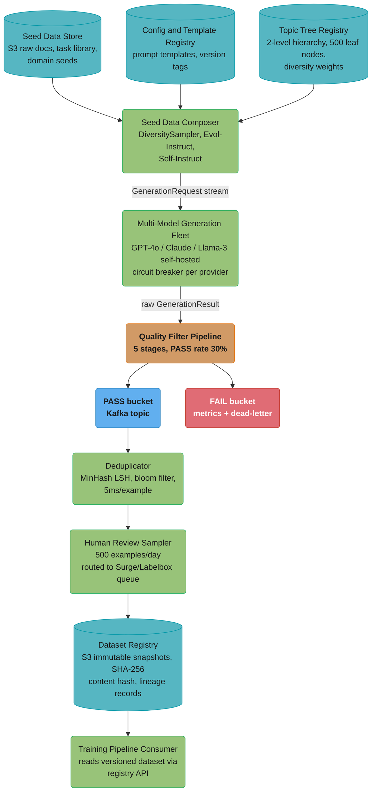
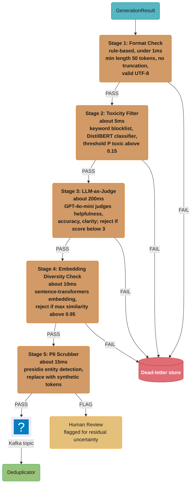

# Case Study: Design a Synthetic Data Platform for LLM Training

## Intuition

> **Design intuition**: A synthetic data platform is an assembly line for AI training signal — the LLM is simultaneously the worker assembling parts and the quality inspector rejecting defects, while human labelers audit random samples to catch systemic failures the LLM cannot see in itself.

**Key insight for this design**: Synthetic data generation at scale (millions of examples per day) requires the same engineering discipline as a real-time production ML system — pipelines, quality gates, versioned datasets, drift detection — except the "user" is an LLM trainer that will silently learn from every example you produce, good or bad. A 0.5% error rate in training data causes measurable degradation in model outputs that manifests weeks later, by which time the root cause is buried under multiple training runs. The irreversibility of training-data defects is what makes quality gates the central design problem, not generation throughput.

---

## 1. Requirements Clarification

### Functional Requirements
- Generate instruction-following pairs (prompt + response) for SFT (supervised fine-tuning) datasets
- Generate preference pairs (chosen + rejected) for DPO and RLHF training pipelines
- Multi-stage quality scoring and filtering: format checks, toxicity screening, LLM-as-judge scoring, embedding diversity checks
- Human review workflow for spot-checking 500+ examples per day and escalating edge cases to domain experts
- Dataset versioning and lineage — every example traceable to source model, prompt template version, seed data hash, and generation timestamp
- Domain-specific generation: code (Python, SQL, Java), math (step-by-step reasoning), medical Q&A, multilingual (20+ languages), creative writing
- Constitutional AI / principle-guided generation: apply a set of declared principles during self-critique and revision
- PII scrubbing before any data is written to long-term storage

### Non-Functional Requirements
- Throughput: 1 million high-quality examples per day (post-filtering)
- Quality bar: average LLM judge score ≥ 85th percentile on a held-out calibration set of 10,000 human-labeled examples
- Data lineage: every stored example must carry a provenance record with 9 required fields
- Deduplication: near-duplicate rate < 1% in any versioned dataset snapshot
- PII compliance: 0 examples with detectable PII in the storage layer; audited monthly by Presidio + human spot-check
- Cost ceiling: < $0.01 per high-quality example landed in the dataset registry
- Latency of quality gate pipeline: < 500 ms end-to-end per example (enables online filtering)

### Out of Scope
- Human labeling platform (Surge AI, Labelbox, Scale Tasker) — assumed as external dependency for audit workflows
- Model training infrastructure and GPU cluster management
- Reward model training from labeled preference data

---

## 2. Scale Estimation

### Generation Volume Math
```
Target output:           1,000,000 high-quality examples/day
Quality pass rate:       30% (empirical — 70% filtered by combined quality stages)
Raw generations needed:  1,000,000 / 0.30 = 3,333,333 raw examples/day

Average tokens per generation:
  Prompt (input):        500 tokens
  Response (output):     1,500 tokens
  Total per example:     2,000 tokens

Daily token throughput:
  3,333,333 x 500  = 1.67B input tokens/day
  3,333,333 x 1500 = 5.00B output tokens/day
  Total:             6.67B tokens/day
```

### Cost Estimation
```
Generation cost (GPT-4o-mini pricing: $0.15/1M input, $0.60/1M output):
  Input:  1.67B x $0.00000015  = $250/day
  Output: 5.00B x $0.00000060  = $3,000/day
  Subtotal:                      $3,250/day

Quality judge cost (GPT-4o-mini, 500 tokens/judgment on 3.3M examples):
  3,333,333 x 500 x $0.00000015 = $250/day

Total generation + judging cost:  ~$3,500/day = ~$1.28M/year
Cost per high-quality example:    $3,500 / 1,000,000 = $0.0035  (within $0.01 ceiling)

Annual dataset: 365M high-quality examples
Storage (5 KB avg per example with provenance):
  5 KB x 1,000,000/day = 5 GB/day
  1 year:               = 1.83 TB (S3 at $0.023/GB-month = ~$42/month)
```

### Deduplication Sizing
```
MinHash LSH for near-duplicate detection on 3.3M examples/day:
  Bloom filter: 1 billion elements, 1% FPR → 1.2 GB RAM
  MinHash computation: 5ms/example on 4-core worker
  Throughput: 1 core handles 200 examples/sec → 8 cores = 1,600/sec
  Daily budget: 3,333,333 / 86,400s = 38.6 examples/sec → 1 worker sufficient
  Add 4x headroom for batch bursts: 2 dedicated dedup workers
```

---

## 3. High-Level Architecture

### Primary System Diagram


### Quality Filter Sub-Pipeline


---

## 4. Component Deep Dives

### 4a. SeedDataComposer — Diversity-Weighted Topic Sampling

The central challenge in large-scale generation is topic collapse: without active diversity enforcement, the seed distribution drifts toward the most common templates, and 80% of generated examples end up semantically similar. A model trained on collapsed data degrades on out-of-distribution queries even if individual examples are high quality.

**Broken approach — single template loop:**
```python
# BROKEN: generates all examples from one template
# Embedding analysis shows 80% of output has cosine similarity > 0.95
for i in range(3_333_333):
    prompt = "Write a Python function that does X"  # X sampled from flat list
    response = await llm.complete(prompt)
    dataset.append(response)
# Result: embedding cluster analysis shows 20 distinct clusters,
# not 500 as intended. Model trained on this fails on math and multilingual.
```

**Fix — diversity-weighted topic tree sampler:**
```python
import random
import math
from dataclasses import dataclass, field
from collections import defaultdict
from typing import Optional


@dataclass
class TopicNode:
    name: str
    children: list["TopicNode"] = field(default_factory=list)
    example_count: int = 0

    def is_leaf(self) -> bool:
        return len(self.children) == 0


@dataclass
class GenerationRequest:
    topic: str
    seed_examples: list[dict]
    style: str           # "instruction" | "conversation" | "preference_pair"
    difficulty: str      # "easy" | "medium" | "hard"
    domain_constraints: list[str]
    request_id: str


class DiversitySampler:
    """
    Sample topics inversely proportional to how many examples have
    been generated for each leaf node in the last WINDOW generations.
    Recalculates weights every RECALC_INTERVAL to avoid stale bias.
    """

    ALPHA = 0.5              # diversity exponent; higher = more aggressive
    RECALC_INTERVAL = 10_000 # recalculate weights after every N generations

    def __init__(self, topic_tree: TopicNode):
        self.root = topic_tree
        self._counts: dict[str, int] = defaultdict(int)
        self._total_generated = 0

    def sample_topic(self) -> str:
        """Return a leaf topic path. Updates internal counts."""
        leaf = self._sample_recursive(self.root)
        self._counts[leaf] += 1
        self._total_generated += 1
        return leaf

    def _sample_recursive(self, node: TopicNode) -> str:
        if node.is_leaf():
            return node.name
        weights = self._compute_weights(node.children)
        chosen = random.choices(node.children, weights=weights, k=1)[0]
        return self._sample_recursive(chosen)

    def _compute_weights(self, nodes: list[TopicNode]) -> list[float]:
        weights = []
        for node in nodes:
            count = self._counts.get(node.name, 0)
            # Inverse-frequency weight with Laplace smoothing
            # At ALPHA=0.5: a node with 100 examples gets weight 0.1,
            # a node with 0 examples gets weight 1.0 — 10x boost for unseen
            w = 1.0 / (1 + count) ** self.ALPHA
            weights.append(w)
        return weights

    def get_diversity_report(self) -> dict[str, float]:
        """Returns entropy of the leaf distribution — higher is more diverse."""
        total = sum(self._counts.values()) or 1
        probs = [c / total for c in self._counts.values()]
        entropy = -sum(p * math.log(p + 1e-12) for p in probs)
        max_entropy = math.log(len(self._counts) + 1)
        return {
            "entropy": round(entropy, 4),
            "normalized_entropy": round(entropy / max_entropy, 4),
            "unique_topics_sampled": len(self._counts),
            "total_generated": self._total_generated,
        }
```

The `normalized_entropy` metric is tracked in the Operational Playbook (Section 8) — values below 0.6 trigger an alert indicating topic collapse in progress.

---

### 4b. MultiModelGenerationFleet — Parallel Generation with Circuit Breaking

A single-model fleet creates a training dataset that inherits one model's stylistic biases. Using multiple models — frontier for complex tasks, mid-tier for standard volume, self-hosted for commodity generation — diversifies writing style, instruction interpretation, and response structure, which is measurably beneficial for the fine-tuned model's generalization.

```python
import asyncio
import time
from dataclasses import dataclass
from enum import Enum
from collections import defaultdict
from typing import Any, Protocol


class ModelTier(Enum):
    FRONTIER = "frontier"      # GPT-4o, Claude Sonnet 5 — complex tasks
    MID = "mid"                # GPT-4o-mini, Claude Haiku 4.5 — standard tasks
    OPEN_WEIGHT = "open"       # Llama-3-70B on a hosted endpoint — high-volume


@dataclass
class GenerationResult:
    request_id: str
    model_used: str
    prompt: str
    response: str
    latency_ms: int
    tokens_used: int
    cost_usd: float
    model_tier: ModelTier


class LLMClient(Protocol):
    async def complete(self, messages: list[dict], max_tokens: int) -> Any: ...


class GenerationFleet:
    CIRCUIT_BREAK_THRESHOLD = 5   # failures in WINDOW seconds trigger break
    CIRCUIT_BREAK_WINDOW = 60     # seconds
    RETRY_DELAYS = [1, 2, 4]      # exponential backoff in seconds

    # Blended $/token at this platform's 500-input / 1500-output mix.
    # e.g. gpt-4o at $2.50/M in + $10.00/M out -> (500*2.5 + 1500*10)/2000 = $8.13/M.
    COST_PER_TOKEN: dict[str, float] = {
        "gpt-4o": 0.0000081,
        "claude-sonnet-5": 0.000012,   # $3/M in, $15/M out
        "gpt-4o-mini": 0.00000049,     # $0.15/M in, $0.60/M out
        "llama-3-70b": 0.00000036,     # hosted open-weight endpoint, ~$0.23/M in, $0.40/M out
    }

    def __init__(self, clients: dict[str, LLMClient]):
        self.clients = clients
        self._failure_times: dict[str, list[float]] = defaultdict(list)

    async def generate(self, request: GenerationRequest) -> GenerationResult:
        primary = self._select_model(request)
        models_to_try = [primary, self._fallback_model(primary), "llama-3-70b"]

        for model, delay in zip(models_to_try, self.RETRY_DELAYS + [0]):
            if self._is_circuit_broken(model):
                continue
            try:
                return await self._call_model(model, request)
            except Exception:
                self._record_failure(model)
                if delay:
                    await asyncio.sleep(delay)

        raise RuntimeError(
            f"All models failed for request {request.request_id}"
        )

    async def _call_model(
        self, model: str, request: GenerationRequest
    ) -> GenerationResult:
        start = time.monotonic()
        messages = [{"role": "user", "content": self._build_prompt(request)}]
        resp = await self.clients[model].complete(messages=messages, max_tokens=1500)
        latency_ms = int((time.monotonic() - start) * 1000)
        tokens = resp.usage.total_tokens
        self._record_success(model)
        return GenerationResult(
            request_id=request.request_id,
            model_used=model,
            prompt=messages[0]["content"],
            response=resp.choices[0].message.content,
            latency_ms=latency_ms,
            tokens_used=tokens,
            cost_usd=tokens * self.COST_PER_TOKEN.get(model, 0.000001),
            model_tier=self._tier_of(model),
        )

    def _select_model(self, request: GenerationRequest) -> str:
        if request.difficulty == "hard" and not self._is_circuit_broken("gpt-4o"):
            return "gpt-4o"
        if request.style == "preference_pair":
            return "claude-sonnet-5"
        return "gpt-4o-mini"

    def _fallback_model(self, model: str) -> str:
        fallbacks = {
            "gpt-4o": "claude-sonnet-5",
            "claude-sonnet-5": "gpt-4o",
            "gpt-4o-mini": "llama-3-70b",
        }
        return fallbacks.get(model, "llama-3-70b")

    def _is_circuit_broken(self, model: str) -> bool:
        now = time.time()
        recent = [t for t in self._failure_times[model]
                  if now - t < self.CIRCUIT_BREAK_WINDOW]
        self._failure_times[model] = recent
        return len(recent) >= self.CIRCUIT_BREAK_THRESHOLD

    def _record_failure(self, model: str) -> None:
        self._failure_times[model].append(time.time())

    def _record_success(self, model: str) -> None:
        self._failure_times[model] = []  # reset on success

    def _tier_of(self, model: str) -> ModelTier:
        if model in ("gpt-4o", "claude-sonnet-5"):
            return ModelTier.FRONTIER
        if model in ("gpt-4o-mini", "claude-haiku-4-5"):
            return ModelTier.MID
        return ModelTier.OPEN_WEIGHT

    def _build_prompt(self, request: GenerationRequest) -> str:
        constraints = "\n".join(f"- {c}" for c in request.domain_constraints)
        return (
            f"Topic: {request.topic}\n"
            f"Style: {request.style}\n"
            f"Difficulty: {request.difficulty}\n"
            f"Constraints:\n{constraints}\n\n"
            "Generate a high-quality training example."
        )
```

---

### 4c. QualityFilterPipeline — Five-Stage Gate

Each stage is independently measurable; rejection reasons are logged to enable root-cause analysis when pass rates drop.

```python
from dataclasses import dataclass
from enum import Enum
from typing import Optional
import re
import time


class RejectionReason(Enum):
    FORMAT = "format_check_failed"
    TOXICITY = "toxicity_detected"
    LOW_QUALITY = "llm_judge_score_below_threshold"
    LOW_DIVERSITY = "embedding_too_similar_to_existing"
    PII_UNFIXABLE = "pii_scrubbing_failed"


@dataclass
class FilterResult:
    passed: bool
    rejection_reason: Optional[RejectionReason]
    judge_score: Optional[float]
    latency_ms: int
    stage_reached: int   # 1-5: which stage produced the verdict


class QualityFilterPipeline:
    JUDGE_SCORE_THRESHOLD = 3.0       # out of 5.0
    DIVERSITY_SIMILARITY_THRESHOLD = 0.95

    def __init__(
        self,
        toxicity_model: Any,
        judge_client: Any,
        embedder: Any,
        dataset_index: Any,   # ANN index for diversity check
        pii_analyzer: Any,
    ):
        self.toxicity = toxicity_model
        self.judge = judge_client
        self.embedder = embedder
        self.index = dataset_index
        self.pii = pii_analyzer

    async def filter(self, result: GenerationResult) -> FilterResult:
        start = time.monotonic()

        # Stage 1: format check — synchronous, < 1ms
        if not self._format_ok(result.response):
            return FilterResult(
                passed=False,
                rejection_reason=RejectionReason.FORMAT,
                judge_score=None,
                latency_ms=self._elapsed(start),
                stage_reached=1,
            )

        # Stage 2: toxicity filter — ~5ms
        if await self._is_toxic(result.response):
            return FilterResult(
                passed=False,
                rejection_reason=RejectionReason.TOXICITY,
                judge_score=None,
                latency_ms=self._elapsed(start),
                stage_reached=2,
            )

        # Stage 3: LLM-as-judge — ~200ms
        score = await self._judge_score(result.prompt, result.response)
        if score < self.JUDGE_SCORE_THRESHOLD:
            return FilterResult(
                passed=False,
                rejection_reason=RejectionReason.LOW_QUALITY,
                judge_score=score,
                latency_ms=self._elapsed(start),
                stage_reached=3,
            )

        # Stage 4: embedding diversity — ~10ms
        if not await self._is_diverse(result.response):
            return FilterResult(
                passed=False,
                rejection_reason=RejectionReason.LOW_DIVERSITY,
                judge_score=score,
                latency_ms=self._elapsed(start),
                stage_reached=4,
            )

        # Stage 5: PII scrub — ~15ms; returns scrubbed text or None
        scrubbed = await self._scrub_pii(result.response)
        if scrubbed is None:
            return FilterResult(
                passed=False,
                rejection_reason=RejectionReason.PII_UNFIXABLE,
                judge_score=score,
                latency_ms=self._elapsed(start),
                stage_reached=5,
            )

        result.response = scrubbed
        return FilterResult(
            passed=True,
            rejection_reason=None,
            judge_score=score,
            latency_ms=self._elapsed(start),
            stage_reached=5,
        )

    def _format_ok(self, text: str) -> bool:
        if len(text.split()) < 50:
            return False
        if text.endswith(("...", "[truncated")):
            return False
        try:
            text.encode("utf-8").decode("utf-8")
        except UnicodeDecodeError:
            return False
        return True

    async def _is_toxic(self, text: str) -> bool:
        result = await self.toxicity.classify(text)
        return result.toxic_probability > 0.15

    async def _judge_score(self, prompt: str, response: str) -> float:
        judgment = await self.judge.complete(
            messages=[{
                "role": "user",
                "content": (
                    f"Rate the following response on helpfulness, accuracy, "
                    f"and clarity. Score 1-5.\n\n"
                    f"Prompt: {prompt}\n\nResponse: {response}\n\n"
                    "Reply with a single number from 1 to 5."
                )
            }],
            max_tokens=5,
        )
        try:
            return float(judgment.choices[0].message.content.strip())
        except ValueError:
            return 0.0

    async def _is_diverse(self, text: str) -> bool:
        embedding = await self.embedder.encode(text)
        neighbors = self.index.search(embedding, k=10)
        if not neighbors:
            return True
        max_similarity = max(n.score for n in neighbors)
        return max_similarity < self.DIVERSITY_SIMILARITY_THRESHOLD

    async def _scrub_pii(self, text: str) -> Optional[str]:
        results = await self.pii.analyze(text, language="en")
        if not results:
            return text
        # Replace each detected entity with a synthetic placeholder
        scrubbed = text
        for entity in sorted(results, key=lambda r: r.start, reverse=True):
            placeholder = f"[{entity.entity_type}]"
            scrubbed = scrubbed[: entity.start] + placeholder + scrubbed[entity.end :]
        # If residual uncertainty score is high, flag for human review
        high_confidence = [r for r in results if r.score > 0.85]
        if len(high_confidence) != len(results):
            return None   # send to human review rather than auto-approve
        return scrubbed

    def _elapsed(self, start: float) -> int:
        return int((time.monotonic() - start) * 1000)
```

---

### 4d. PreferencePairSynthesizer — Best-of-N for DPO Training Data

DPO and RLHF training require (prompt, chosen_response, rejected_response) triples. Two strategies exist:

- **Contrastive model pairing**: GPT-4o as chosen, Llama-3-8B as rejected. Cheap but the model learns stylistic differences (length, formatting) rather than behavioral alignment.
- **Best-of-N from same model**: sample N=8 responses at temperature 0.9, score all with LLM judge, take highest and lowest. Produces subtle, behaviorally meaningful contrasts. Costs 8x generation; the qualitative argument for it is confound removal, not a published effect size — treat any "3-4x more effective per pair" figure as an internal, workload-specific observation rather than a general result.

```python
import asyncio
from dataclasses import dataclass
from typing import Optional


@dataclass
class PreferencePair:
    prompt: str
    chosen: str
    rejected: str
    chosen_score: float
    rejected_score: float
    margin: float
    model_used: str


class PreferencePairSynthesizer:
    N_SAMPLES = 8
    TEMPERATURE = 0.9
    MIN_MARGIN = 1.0       # reject pair if best-worst gap < 1.0 points
    CLUSTER_THRESHOLD = 0.5  # discard if all scores within 0.5 of each other

    def __init__(self, fleet: GenerationFleet, judge_client: Any):
        self.fleet = fleet
        self.judge = judge_client

    async def synthesize_best_of_n(
        self, prompt: str, domain: str
    ) -> Optional[PreferencePair]:
        """
        Generate N responses, score each, return (best, worst) pair.
        Returns None if scores cluster too tightly (no useful signal).
        """
        requests = [
            GenerationRequest(
                topic=prompt,
                seed_examples=[],
                style="instruction",
                difficulty="medium",
                domain_constraints=[domain],
                request_id=f"pref-{i}",
            )
            for i in range(self.N_SAMPLES)
        ]

        results = await asyncio.gather(
            *[self.fleet.generate(r) for r in requests]
        )

        scored: list[tuple[float, GenerationResult]] = []
        for result in results:
            score = await self._score(prompt, result.response)
            scored.append((score, result))

        scored.sort(key=lambda x: x[0], reverse=True)
        best_score, best_result = scored[0]
        worst_score, worst_result = scored[-1]
        margin = best_score - worst_score

        # No useful preference signal if all responses are similar quality
        score_range = max(s for s, _ in scored) - min(s for s, _ in scored)
        if score_range < self.CLUSTER_THRESHOLD:
            return None  # discard — emit alert if >20% of batches hit this

        if margin < self.MIN_MARGIN:
            return None  # insufficient contrast

        return PreferencePair(
            prompt=prompt,
            chosen=best_result.response,
            rejected=worst_result.response,
            chosen_score=best_score,
            rejected_score=worst_score,
            margin=margin,
            model_used=best_result.model_used,
        )

    async def _score(self, prompt: str, response: str) -> float:
        judgment = await self.judge.complete(
            messages=[{
                "role": "user",
                "content": (
                    f"Score this response from 1.0 to 5.0:\n"
                    f"Prompt: {prompt}\nResponse: {response}\n"
                    "Reply with one decimal number only."
                ),
            }],
            max_tokens=5,
        )
        try:
            return float(judgment.choices[0].message.content.strip())
        except ValueError:
            return 1.0
```

---

### 4e. DatasetRegistry and LineageTracker

Every example must be immutably committed with a content-addressed hash. When a model trained on dataset v2.3 regresses on math benchmarks, the engineering team needs to bisect the dataset to identify which generation batch introduced the defective examples.

```python
import hashlib
import json
import uuid
from dataclasses import dataclass, asdict
from datetime import datetime, UTC
from typing import Any


@dataclass
class ProvenanceRecord:
    example_id: str
    source_model: str
    prompt_template_version: str
    seed_data_hash: str
    generation_timestamp: str   # ISO-8601 UTC
    judge_score: float
    judge_model: str
    human_review_status: str    # "pending" | "approved" | "rejected" | "skipped"
    dataset_version: str        # e.g., "v2.3"
    content_hash: str           # SHA-256 of (prompt + response)


@dataclass
class DatasetSnapshot:
    version: str
    example_count: int
    s3_uri: str
    manifest_hash: str          # SHA-256 of sorted list of content_hash values
    created_at: str


class DatasetRegistry:
    def __init__(self, s3_client: Any, table_client: Any):
        self.s3 = s3_client
        self.table = table_client  # DynamoDB or equivalent

    def commit_example(
        self,
        prompt: str,
        response: str,
        provenance: ProvenanceRecord,
    ) -> str:
        """Write one example + provenance. Returns content_hash."""
        content_hash = hashlib.sha256(
            (prompt + response).encode("utf-8")
        ).hexdigest()
        provenance.content_hash = content_hash
        provenance.example_id = str(uuid.uuid4())

        key = f"examples/{provenance.dataset_version}/{content_hash}.json"
        self.s3.put_object(
            Bucket="synthetic-data-lake",
            Key=key,
            Body=json.dumps({
                "prompt": prompt,
                "response": response,
                "provenance": asdict(provenance),
            }),
        )
        self.table.put_item(Item=asdict(provenance))
        return content_hash

    def commit_dataset(self, version: str) -> DatasetSnapshot:
        """
        Snapshot all examples for a version into an immutable manifest.
        The manifest hash enables reproducible dataset references in
        training job configs.
        """
        items = self.table.query(
            KeyConditionExpression="dataset_version = :v",
            ExpressionAttributeValues={":v": version},
        )["Items"]

        hashes = sorted(item["content_hash"] for item in items)
        manifest_hash = hashlib.sha256(
            "\n".join(hashes).encode("utf-8")
        ).hexdigest()

        manifest_key = f"manifests/{version}/{manifest_hash}.json"
        self.s3.put_object(
            Bucket="synthetic-data-lake",
            Key=manifest_key,
            Body=json.dumps({"version": version, "hashes": hashes}),
        )
        return DatasetSnapshot(
            version=version,
            example_count=len(hashes),
            s3_uri=f"s3://synthetic-data-lake/{manifest_key}",
            manifest_hash=manifest_hash,
            created_at=datetime.now(UTC).isoformat(),
        )

    def get_lineage(self, content_hash: str) -> ProvenanceRecord:
        """Trace any example back to its full generation provenance."""
        result = self.table.get_item(Key={"content_hash": content_hash})
        if "Item" not in result:
            raise KeyError(f"No provenance found for hash {content_hash}")
        return ProvenanceRecord(**result["Item"])
```

---

## 5. Design Decisions & Tradeoffs

| Decision | Option A | Option B | Choice | Rationale |
|---|---|---|---|---|
| Generation model selection | Frontier only (GPT-4o) — 2,000 tok x $8.13/M = $0.0163/example | Open-weight only (Llama-3-70B hosted) — 2,000 tok x $0.36/M = $0.0007/example | Hybrid tiering | Frontier for hard domains (math, code); open-weight for instruction paraphrases. At the 30/70 split in Section 10 the blend is $0.0008/example — a 20x reduction against frontier-only, at a quality difference measured on this platform's held-out eval, not a published one |
| Preference pair generation | Contrastive (strong model chosen, weak rejected) — 1x cost | Best-of-N (N=8 samples, judge selects) — 8x cost | Best-of-N | Contrastive pairs contain style artifacts (length, formality) that confound DPO training, so the preference signal is partly stylistic. Best-of-N removes that confound; the size of the gain is workload-specific and should be measured on your own eval, not assumed |
| Filtering strategy | Offline batch (generate all, filter after) | Online (filter each example immediately, stop bad batches early) | Online filtering | At 70% reject rate, offline wastes 70% of storage I/O and judge cost before filtering. Online filtering stops spending judge tokens on batches where Stage 1-2 already rejects 50% |
| Deduplication method | Exact SHA-256 hash — 0ms, 0% false negatives, 100% false positives for paraphrases | MinHash LSH — 5ms, 95% near-dup recall, 1% FPR | MinHash LSH | Exact hash misses paraphrases entirely; embedding similarity (50ms/example) is too slow for 3.3M/day. MinHash at 5ms hits the 500ms pipeline budget |
| Quality judging | Constitutional AI self-critique (no judge model) | Trained reward model | LLM-as-judge (bootstrapped) | Constitutional AI requires no additional training but produces inconsistent scores as judge model updates. Trained RM is most consistent but requires 10K+ human labels to bootstrap. Start with GPT-4o-mini as judge; graduate to trained RM at dataset v3.0 |

---

## 6. Real-World Implementations

**Scale AI (data engine + human audit network)**
Scale AI's commercial model is a data engine: LLMs and templating produce candidate examples at
volume, and a large contracted annotator network reviews and corrects them rather than authoring
raw content from scratch. Scale is a named data vendor for several frontier labs' post-training
programs. Revenue figures, annotator headcount, and per-customer attribution are not published by
Scale and are omitted here rather than asserted. The architectural insight is the durable part:
humans are too slow and expensive to generate examples at scale, but they are irreplaceable for
catching systemic LLM failures — reward hacking, subtle factual errors in specialized domains, and
cultural bias that automated judges calibrated on English data cannot detect. (Note: Scale's
publicly branded "SEAL" effort is its model-evaluation and leaderboard work, which is a different
thing from its data-generation business — do not conflate the two.)

**Magpie and UltraChat (open synthetic instruction datasets)**
Magpie (Xu et al., arXiv 2406.08464, 2024) uses a zero-human-labeling approach: Llama-3-Instruct is
prompted with only the chat template prefix preceding the user turn and nothing else, causing the
model to self-generate both the user query and the assistant response. The paper generates
**4 million** instruction instances and keeps **300,000** after filtering — the ratio, not the raw
count, is the lesson. Quality filtering uses reward model scoring plus length heuristics. UltraChat
(Ding et al., arXiv 2305.14233, 2023) is 1.5 million synthetically generated multi-turn dialogues
produced entirely without human queries, using an iterative framework that expands a conversation
turn by turn. The generating model and exact seed topic sources are described in the paper body,
not the abstract, so they are not restated here.

**Cohere (Aya — multilingual instruction data)**
The Aya Dataset is a human-curated instruction-following dataset spanning **65 languages**; the
larger Aya Collection reaches **114 languages** and 513M instances via templating and translation.
(The "Aya 101" name refers to the 101-language model, not the dataset — these are frequently
conflated.) The architectural pattern worth copying is language routing: a classifier assigns each
seed document to a language track, each track uses a language-appropriate generation model or
language-specific few-shot examples, and quality scoring uses language-specific judges rather than
one English-calibrated judge. The underlying failure — an English-calibrated judge systematically
under-scoring grammatically correct non-English responses — is real and well attested. Specific
before/after agreement percentages for language-specific judging do **not** appear in the Aya
Dataset paper and are not asserted here.

**Multi-stage synthetic augmentation over web text (general pattern)**
Frontier labs describe, at a high level, layering synthetic augmentation on top of web-crawled
documents: (1) document-level filtering via a quality classifier, (2) paragraph-level QA extraction
using a smaller model to generate question-answer pairs from each paragraph, (3) response
augmentation adding explicit reasoning steps using a larger model. This produces training signal
that is more explicit about reasoning chains than raw web text. The stage ordering is the
transferable idea; no lab publishes enough pipeline detail to attribute a specific benchmark gain
to a specific stage, so no such attribution is made here.

---

## 7. Technologies & Tools

### Deduplication Strategy Comparison

| Method | Throughput (examples/sec) | Near-Dup Recall | False Positive Rate | Memory (1B docs) | Implementation |
|---|---|---|---|---|---|
| Exact SHA-256 hash | 500,000 | 0% (misses paraphrases) | 0% | 4 GB (hash set) | Trivial |
| MinHash LSH (datasketch) | 200 | 92-96% | 1-3% | 1.2 GB (bloom filter) | Low |
| SimHash | 400 | 85-90% | 2-5% | 0.8 GB | Low |
| SemDeDup (FAISS embedding) | 20 | 97-99% | 0.1% | 12 GB (index) | High |
| BM25 near-dup (Elasticsearch) | 50 | 88-93% | 1-2% | 8 GB (inverted index) | Medium |

MinHash LSH is the practical choice at 3.3M examples/day: the load is only 3,333,333 / 86,400 = 38.6 examples/sec, so 2 workers at 200 examples/sec each carry it with 10x headroom (matching the Section 2 sizing), and 92-96% near-dup recall keeps the dataset clean without the 12 GB FAISS index that SemDeDup requires per model.

### Quality Judging Tool Comparison

Cost per 1K judgments below is computed on this pipeline's judgment shape: 500 input tokens
(prompt + response) and ~5 output tokens (a single score), at current list prices.
Consistency and calibration columns are this platform's own measurements, not published
benchmarks.

| Tool | Cost/1K judgments | Consistency (σ across runs) | Calibration to human | Latency |
|---|---|---|---|---|
| GPT-4o as judge ($2.50/M in, $10/M out) | $1.30 | 0.15 | 0.82 Pearson | 400ms |
| GPT-4o-mini as judge ($0.15/M in, $0.60/M out) | $0.08 | 0.22 | 0.74 Pearson | 150ms |
| Trained reward model (Llama-3-8B, self-hosted) | $0.02 | 0.08 | 0.79 Pearson | 25ms |
| Rule-based heuristics | $0.00 | 0.00 | 0.41 Pearson | 1ms |

At 3.3M judgments/day, GPT-4o-mini at $0.08/1K = $267/day (consistent with the $250/day in
Section 2); a trained RM at $0.02/1K = $67/day, saving $200/day. If the RM needs 50,000
human-labeled calibration examples at $1/label ($50,000 one-time), payback is
$50,000 / $200 = 250 days, roughly 8 months — not the few weeks the raw per-token gap
suggests. Build the RM for consistency and latency; the cost saving alone does not justify it.

---

## 8. Operational Playbook

### (a) Eval Pipeline
Generation quality is monitored via four continuous metrics, measured hourly on a rolling 4-hour window:

- **Throughput**: examples/hour passing all 5 filter stages. Baseline: 41,667/hour (1M/day). Alert at <35,000/hour for 2 consecutive hours.
- **Stage pass rates**: fraction passing each filter stage, tracked independently. A sudden drop in Stage 2 (toxicity) pass rate signals an upstream model change or prompt injection in seed data. A drop in Stage 3 (judge score) signals judge model version change or topic distribution shift.
- **Diversity score**: average pairwise cosine distance of a 10,000-example sample drawn every 6 hours. Baseline: 0.42. Alert at <0.35 (topic collapse beginning).
- **Human audit agreement rate**: 500 examples per day sent to human reviewers via Surge AI integration. Agreement between human verdict and LLM judge should be ≥ 85%. Drop below 75% triggers pipeline pause and judge prompt review.

Cross-reference: [./cross_cutting/llm_eval_harness_in_production.md](./cross_cutting/llm_eval_harness_in_production.md) for golden-set regression gate patterns.

### (b) Observability — OpenTelemetry Span Hierarchy

Each example traces through a span tree from root to storage:

```
generation_pipeline [root span]
  └── seed_compose [topic, style, difficulty, seed_count]
  └── fleet_generate [model_used, model_tier, prompt_tokens, response_tokens, cost_usd]
  └── quality_filter [stage_reached, passed, rejection_reason, judge_score, latency_ms]
      └── format_check
      └── toxicity_screen [toxic_probability]
      └── llm_judge [score, judge_model]
      └── diversity_check [max_similarity, neighbors_checked]
      └── pii_scrub [entities_found, entities_replaced]
  └── deduplication [is_duplicate, minhash_band_matches]
  └── registry_store [content_hash, dataset_version, s3_key]
```

Key span attributes on every span: `request_id`, `dataset_version`, `source_model`, `cost_usd_cumulative`. Cross-reference: [./cross_cutting/opentelemetry_for_llm_apps.md](./cross_cutting/opentelemetry_for_llm_apps.md).

### (c) Incident Runbooks

**RUNBOOK-SDP-001: quality_pass_rate_drop**
- Symptom: Stage 3 (LLM judge) pass rate drops from 55% to below 40% within a 1-hour window
- Diagnosis: Compare current judge score distribution to yesterday's baseline. Check if generation model API version changed (`model` field in API response headers). Check if topic distribution shifted (did DiversitySampler reset weights?).
- Mitigation: Route 100% of generation to self-hosted Llama-3-70B (no API version drift risk). Pause writing to current dataset version. Open a canary version for new examples.
- Resolution: Recalibrate judge prompt against 500 human-labeled examples. Pin generation model to a specific version snapshot. Replay flagged examples through recalibrated judge.

**RUNBOOK-SDP-002: dedup_spike**
- Symptom: MinHash LSH near-duplicate rate rises above 5% in a 2-hour window
- Diagnosis: Pull the topic distribution report from DiversitySampler. Check if `_counts` dictionary is stale (weights haven't been recalculated since the last RECALC_INTERVAL). Check if Evol-Instruct pipeline is generating too many variants of the same seed.
- Mitigation: Force DiversitySampler weight reset. Temporarily reduce the weight of the top-10 over-represented leaf topics by 10x.
- Resolution: Audit the topic tree — add subtopics to over-represented leaf nodes. Verify RECALC_INTERVAL fires correctly in the scheduler.

**RUNBOOK-SDP-003: cost_spike**
- Symptom: Daily spend tracker exceeds 2× baseline ($7,000+/day) within a 4-hour window
- Diagnosis: Check model tier distribution in OTel spans. A misconfigured routing rule sending standard tasks to frontier models (GPT-4o instead of GPT-4o-mini) is the most common cause. Also check N_SAMPLES for preference pair generation — a config error setting N=16 doubles cost immediately.
- Mitigation: Enforce cost ceiling via token budget middleware that circuit-breaks frontier model calls above $500/hour.
- Resolution: Fix routing rule. Add automated cost-per-tier dashboard alert.

**RUNBOOK-SDP-004: human_audit_disagreement**
- Symptom: Human audit agreement rate drops below 75% for 2 consecutive days
- Diagnosis: Pull the disagreement breakdown by rejection reason. If humans approve examples the LLM judge rejects, the judge threshold may be miscalibrated. If humans reject examples the judge approves, the judge prompt may have drifted (e.g., a judge model update changed scoring behavior).
- Mitigation: Pause pipeline. Route 2,000 examples/day to human review (4x normal) until agreement recovers.
- Resolution: Re-run judge calibration on the 10K golden set. If Pearson correlation drops below 0.70, retrain or replace the judge model.

---

## 9. Common Pitfalls & War Stories

The five incidents below are **illustrative composites**. The failure mechanisms — judge length
bias, stale diversity weights, PII format gaps, silent model updates, margin collapse — are all
real and recur; the example counts, benchmark deltas and dollar figures are constructed to make
the blast radius concrete and are not verified public record.

**1. Reward Hacking in the Quality Judge**
An internal team observed that GPT-4o-mini (used as judge) systematically scored longer responses higher, independent of actual quality — a length-quality correlation artifact from its RLHF training. The generation fleet, optimizing for high judge scores, learned to produce verbose responses. Average response length increased from 420 tokens to 870 tokens over 3 weeks of training data generation. The fine-tuned model showed a 23% increase in average response length with no quality improvement on human evaluations, and user NPS dropped because responses felt "padded." The failure was discovered 6 weeks post-training when users began complaining. Fix: add a length-normalized quality score — divide raw judge score by log(response_length_tokens) — and penalize responses longer than 2× the median for their topic. Cost of delayed detection: 2 retraining runs at $180,000 each.

**2. Topic Collapse Despite Diversity Sampling**
A 10-day generation run produced 5M examples. Post-hoc embedding cluster analysis showed 58% of examples concentrated in 18 of 500 leaf topics. Root cause: the DiversitySampler's `_counts` dictionary was populated at startup from the previous run's totals, but weights were not recalculated mid-run — topics that were already over-represented at the start of the run remained over-represented for the full 10-day window. The resulting dataset underrepresented math, multilingual, and creative writing. The model fine-tuned on this data dropped 0.84 points below baseline on the MT-Bench math subcategory (MT-Bench is scored 1-10, so an "8.4 point" drop would be off the scale — a common way these numbers get mis-copied). Fix: recalculate weights every 10,000 generations and reset counts relative to the current run, not cumulative totals.

**3. PII Leakage from Seed Documents**
Seed documents for customer support Q&A generation included real customer service tickets. Presidio's default configuration missed phone numbers in non-standard formats: "(800) 123.4567" (period separator) and "+1-800.123.4567" (mixed separator). Approximately 50,000 examples containing real phone numbers passed through the quality filter and entered training data version v1.7. The failure was discovered during a routine monthly audit when a human reviewer flagged an example containing a recognizable phone number. Full dataset recall was required: v1.7 was deprecated, all 50,000 affected examples were scrubbed, and 120,000 downstream generated examples that used v1.7 examples as seeds were also invalidated. Total cost: $2.1M in compute for dataset regeneration and one delayed model release. Fix: add regex-based phone number detection as a mandatory Stage 1 rule (not relying solely on Presidio), covering 15 international phone number formats. Add monthly adversarial PII audit using synthetic PII injection to test the scrubber.

**4. Silent Model API Version Change Mid-Run**
GPT-4o received a silent model update (no version bump in the API endpoint) during a 72-hour generation run. The quality judge, which was also GPT-4o-mini, was calibrated against the pre-update scoring distribution. Post-update, the judge's calibration shifted: scores that previously averaged 3.4 now averaged 3.8 for the same-quality content. This inflated the pass rate from 30% to 48%, admitting 400,000 lower-quality examples into dataset v2.1. The fine-tuned model showed regression in math reasoning: 3.2% drop on MATH benchmark. Root cause identified by replaying the same 1,000 test prompts through the judge before and after the failure window. Fix: pin model version in all API calls using the `model` parameter with a version tag (e.g., `gpt-4o-2024-11-20`). Add a daily calibration check that scores 100 golden examples and alerts if average score shifts by more than 0.2 points.

**5. Preference Pair Margin Collapse at Scale**
When scaling preference pair generation from 10,000 to 1,000,000 examples per day, an engineer changed the sampling temperature from 0.9 to 0.5 to reduce "weird" outputs — a well-intentioned but undocumented change. At temperature 0.5, all 8 best-of-N candidates were nearly identical: average pairwise cosine similarity of 0.97 vs 0.81 at temperature 0.9. The margin between chosen and rejected averaged 0.18 points (threshold: 1.0). The margin check was disabled because it had been generating too many None returns during a test run with small N. Result: 800,000 effectively useless preference pairs entered the DPO training dataset. The model fine-tuned on these pairs showed no improvement over the SFT baseline on Alpaca-Eval, and the DPO training run cost $340,000 in compute. Fix: never disable the margin threshold — instead surface the cluster rate as a metric and investigate the root cause. Add a p95 margin dashboard; if p95 margin drops below 0.5, halt preference pair generation and page on-call.

---

## 10. Capacity Planning

### Primary Bottleneck: LLM API Token Budget

The generation cost scales linearly with token budget, and the primary lever is the blended cost per token (mix of frontier vs self-hosted generation).

**Scaling formula:**
```
high_quality_examples_per_day =
    (token_budget_per_day / avg_cost_per_token) / avg_tokens_per_example * pass_rate

Where:
  avg_cost_per_token = (api_fraction × $0.00000049) +
                       ((1 - api_fraction) × $0.00000036)
    api_fraction        = share routed to the GPT-4o-mini API tier
    $0.00000049/token   = GPT-4o-mini blended at 500 in / 1500 out ($0.15/M, $0.60/M)
    $0.00000036/token   = Llama-3-70B on a hosted open-weight endpoint, same mix
  avg_tokens_per_example = 2,000 (500 input + 1,500 output)
  pass_rate = 0.30 (empirical; improves to ~0.40 with better seed data)
```

**Worked example at $10,000/day budget:**
```
API tier fraction:        30% (complex domains)
Open-weight fraction:     70% (instruction paraphrases)
Blended cost/token:       0.30 × $0.00000049 + 0.70 × $0.00000036
                        = $0.000000147 + $0.000000252
                        = $0.000000399/token

Daily token capacity:   $10,000 / $0.000000399 = 25.1B tokens
Raw examples possible:  25.1B / 2,000 = 12.5M raw examples
High-quality output:    12.5M × 0.30 = 3.76M examples/day

At target 1M/day, required budget:
  1M / (12.5M / $10,000) = $798/day for generation alone
  Add 7% for quality judging: $798 × 1.07 = $854/day
  Add 15% for infrastructure (workers, storage, networking): $982/day
```

**Why the open-weight tier is rented, not owned:**
```
Llama-3-70B on 4× H100 SXM5 (80GB HBM3), if you ran the GPUs yourself:
  Throughput at 65% MBU:   ~1,800 tokens/sec (batch size 32)
  Daily token output:      1,800 × 86,400 = 155.5M tokens/day per pod
  Cost per pod/day:        $32/hr for the 4-GPU pod × 24 h = $768/day
                           (NOT $128 — the hourly rate must be multiplied by 24)
  Implied cost/token:      $768 / 155.5M = $0.00000494/token

At 70% open-weight allocation of the 25.1B-token budget:
  Open-weight tokens needed: 25.1B × 0.70 = 17.6B tokens/day
  Owned pods required:       17.6B / 155.5M = 113 pods
  Annualized owned cost:     113 × $768 × 365 = $31.7M/year
  With ~40% reserved discount:                  $19.0M/year

  Same 17.6B tokens/day on a hosted open-weight endpoint at $0.00000036/token:
    17.6B × $0.00000036 = $6,336/day = $2.31M/year

Owning the GPUs is ~8x more expensive at this batch size and utilization, which is why
the design rents the open-weight tier. Self-hosting only wins once you can drive a pod
far past 1,800 tok/s (large batches, FP8, near-continuous load) — see the break-even
question in Section 11.
```

Cross-reference: [./cross_cutting/gpu_pool_economics.md](./cross_cutting/gpu_pool_economics.md) for reserved vs spot GPU cost modeling.

---

## 11. Interview Discussion Points

**Q: Why can synthetic data match or exceed human-labeled data for instruction tuning?**
Synthetic data from a frontier model covers the prompt distribution more uniformly than human labelers, who cluster around familiar topics and writing patterns. Human labelers are also inconsistent: agreement on subjective instruction-quality ratings is routinely only moderate on the Fleiss/Cohen kappa scale, and varies enough across rubrics and annotator pools that a single headline kappa should not be quoted as an industry constant — measure it on your own rubric. A well-calibrated LLM judge applied consistently can achieve higher consistency (σ ≈ 0.08 for a trained RM) while covering millions of examples per day that human labeling cannot reach. The caveat: for specialized domains (medical, legal, safety-critical), human expert review remains essential to catch subtle errors the LLM judge cannot detect.

**Q: How does diversity sampling prevent topic collapse, and what is the failure mode when it breaks?**
Diversity sampling assigns generation probability inversely proportional to how many examples have already been generated for each topic, using a topic tree with 500 leaf nodes. The failure mode is stale weight state: if sampling weights are computed once at startup from historical totals, topics that began over-represented remain over-represented for the entire run. The fix is recalculating weights every 10,000 generations relative to the current run, not cumulative historical counts. Monitoring: track normalized entropy of the leaf distribution hourly; values below 0.6 indicate collapse.

**Q: Why does best-of-N beat contrastive generation for DPO preference pairs?**
Contrastive pairs (strong model chosen, weak model rejected) contain spurious style correlations: the strong model's responses are systematically longer, more structured, and more formal than the weak model's. The DPO objective cannot distinguish between "this response is better because of content quality" and "this response is better because it uses bullet points." Best-of-N pairs from the same model at high temperature produce responses that differ in content and reasoning quality but share stylistic characteristics, forcing the model to learn behavioral alignment rather than stylistic mimicry.

**Q: How do you detect reward hacking in a quality judge LLM?**
Plot the joint distribution of (judge_score, response_length_tokens) for a random sample of 10,000 examples. If Pearson correlation exceeds 0.4, the judge is length-biased. More subtly, plot (judge_score, uses_bullet_points) and (judge_score, response_starts_with_affirmation) — these are common RLHF artifacts in judge models. The fix is a length-normalized score, format-invariant scoring rubric, and periodic calibration against a golden set where response quality is decoupled from length by construction.

**Q: What makes PII scrubbing uniquely hard in a synthetic data context?**
The seed documents for synthetic generation often come from real-world text (customer support logs, web scrapes, internal documents) that contain PII. Standard PII detectors (Presidio, spaCy NER) are trained on clean, well-formatted text. Real PII appears in non-standard formats: phone numbers with period separators, emails with display names, SSNs in formatted tables. Additionally, synthetic generation can amplify PII leakage: if a seed document contains a real name, the LLM may incorporate it into the generated example in a paraphrase that the PII detector treats as a fictional name. Defense in depth: Stage 1 regex rules for 15 common PII formats + Presidio for entity detection + monthly adversarial audit with synthetic PII injection to measure scrubber recall.

**Q: How do you version datasets to support training lineage and regression bisection?**
Every example carries a content-addressed hash (SHA-256 of prompt + response). A dataset version is an immutable manifest of all content hashes, itself hashed to produce the manifest hash. Training jobs reference the manifest hash, not a mutable dataset name. When a model regresses, engineers binary-search dataset versions: train on v2.0, v2.5, and v3.0 to narrow the regression window, then bisect within batches of v2.5 by content hash ranges. This typically localizes the defective batch within 4-5 training runs.

**Q: Why does a 0.5% error rate in training data cause measurable model regression?**
At 1M examples per training epoch, 0.5% = 5,000 defective examples. These examples are not distributed randomly — they often cluster in a specific topic or generation batch, creating systematic bias in a particular capability area. Models are highly sensitive to systematic biases in their training data: even a small number of examples that consistently reward the wrong behavior (e.g., verbosity, hedging, factual errors in a specific domain) are reinforced across many gradient steps. The effect compounds over multiple epochs.

**Q: What makes a commercial data vendor defensible against open-source synthetic data?**
The moat is not the generation software, which is replicable in a week, but three things that are not: a vetted domain-expert annotation network, enterprise data-handling compliance (SOC 2 Type II, HIPAA, classified environments), and a calibration feedback loop in which quality signals from accumulated human reviews improve the automated judges, lowering the human-review cost per new task. Open-source datasets like Magpie and UltraChat require no human review budget but produce weaker data for specialized domains (medicine, law, STEM) where factual accuracy cannot be assessed by a general LLM judge. Revenue and headcount figures for private data vendors are not published; do not build an argument on them.

**Q: What does Constitutional AI contribute compared to a trained reward model?**
Constitutional AI enables quality scoring without any human-labeled preference data: the LLM self-critiques responses against a declared set of principles and revises them. This is useful during cold-start when you have no labeled data to train a reward model. The limitation is inconsistency: as the judge LLM's base model updates, the scoring distribution shifts without warning. A trained reward model produces consistent scores (σ ≈ 0.08 vs σ ≈ 0.22 for LLM-as-judge) but requires 10,000+ human-labeled pairs to bootstrap. The practical strategy: start with Constitutional AI, collect human judgments on 5,000 examples per month, train a reward model at 10K examples, switch to RM scoring at 6-9 months.

**Q: How do you calculate the break-even between frontier LLM generation and self-hosted generation?**
Break-even point: self-hosted GPU cost per token = frontier API cost per token.

At Llama-3-70B on 4× H100 (on-demand $32/hr for the pod):
  Throughput: 1,800 tokens/sec = 155.5M tokens/day
  Cost/day: $32/hr × 24 h = $768/day
  Cost/token: $768 / 155.5M = $0.00000494/token
              (10× higher than GPT-4o-mini's $0.00000049 blended, and 14× a hosted
               open-weight Llama-3-70B endpoint at ~$0.00000036)

Reserved GPU pricing (~40% discount) brings the pod to $460/day, or $0.00000296/token
at the same throughput — still 6× the API. The only lever that closes the gap is
throughput per pod, not the hourly rate:
  break-even vs GPT-4o-mini requires $768 / $0.00000049 = 1.57B tokens/day per pod
                                    = ~18,100 tokens/sec sustained
That is roughly 10× the 1,800 tok/s assumed here, and reaching it means FP8 weights,
very large batches, and near-continuous load — i.e. a dedicated, saturated deployment.

Practical conclusion: self-hosting is a utilization bet, not a price bet. It pays off when
you can keep a pod saturated 24/7, or when an air-gapped environment forbids API access
at any price. For bursty synthetic-data generation, rent the open-weight endpoint.

**Q: How do you handle multilingual quality judging without introducing language bias?**
A single English-calibrated judge gives systematically lower scores to correct non-English responses because it pattern-matches on English-language fluency signals. The fix is a routing layer: classify each generated example's language, route to a language-specific judge (or a multilingual judge with language-specific few-shot calibration examples). Validate calibration by running the judge on 100 human-labeled examples per language and measuring Pearson correlation with human scores per language, not pooled. Multilingual data programs such as Cohere's Aya (65 human-curated languages, 114 in the wider Aya Collection) use per-language review pipelines for exactly this reason; the Aya Dataset paper does not publish a before/after judge-agreement figure, so do not quote one.

Cross-references:
- [./cross_cutting/llm_eval_harness_in_production.md](./cross_cutting/llm_eval_harness_in_production.md)
- [./cross_cutting/training_loop_internals.md](./cross_cutting/training_loop_internals.md)
- [./cross_cutting/opentelemetry_for_llm_apps.md](./cross_cutting/opentelemetry_for_llm_apps.md)
- [./cross_cutting/gpu_pool_economics.md](./cross_cutting/gpu_pool_economics.md)
- [./cross_cutting/red_team_eval_harness.md](./cross_cutting/red_team_eval_harness.md)
