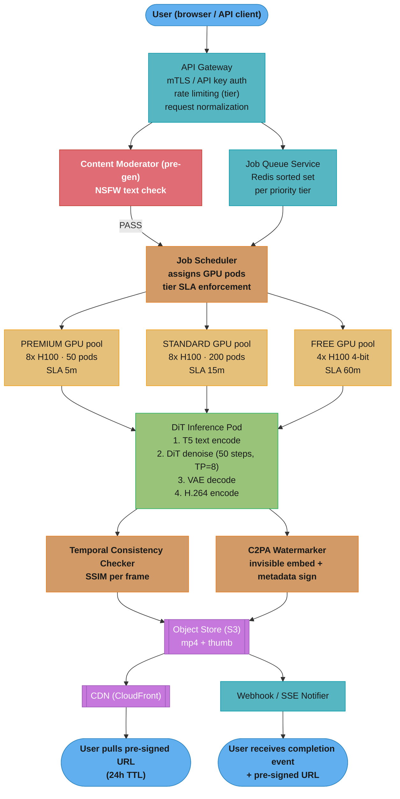

# Case Study: Design a Video Generation Platform

## Intuition

> **Design intuition**: Video generation is image generation running at 24 frames per second for 5-30 seconds — but the hard part is not generating each frame, it is ensuring each frame is temporally consistent with the previous one: no flicker, no character morphing, no background teleportation. The platform challenge is entirely different from text LLMs: generation takes 5-15 minutes, outputs are 50-500 MB, GPU cost per output is 100-500x more expensive than image generation, and the async UX (submit → wait → receive notification) is mandatory because no user waits 10 minutes watching a progress bar.

**Key insight for this design**: Video generation is a compute-density problem masquerading as an AI problem. The model quality improvements matter, but the platform's commercial viability depends on reducing cost-per-second-of-video: through better GPU scheduling, speculative generation pipelines, output caching for similar prompts, and tiered quality offerings (draft in 2 minutes, HD in 15 minutes). Unlike LLM inference — which is a continuous stream of small batched requests — video generation is a batch-of-one job that monopolizes 8 H100s for 3 minutes straight. Every queue, scheduler, and cost model must be designed around this unit.

Real systems: OpenAI Sora, Google Veo 2/3, Runway Gen-3, Pika Labs, Luma Dream Machine, Kling (Kuaishou), Hailuo (MiniMax).

---

## 1. Requirements Clarification

### Functional Requirements
- Text-to-video generation: text prompt → 5-30 second video
- Image-to-video: reference image + prompt → animated video
- Video-to-video: existing video + prompt → stylized or transformed video
- Configurable generation parameters: resolution (480p, 720p, 1080p), duration (5s, 10s, 30s), aspect ratio (16:9, 9:16, 1:1), frame rate (24 fps, 30 fps)
- Async job submission: client receives job_id immediately; status polling via REST; completion notification via webhook or SSE
- Content moderation: NSFW detection pre- and post-generation; deepfake detection on recognized faces; copyright-flagged content (celebrity likenesses, trademarked characters)
- C2PA watermarking for provenance: invisible cryptographic watermark embedded in all outputs
- Storage and retrieval: generated videos stored in object store, accessed via pre-signed URL valid 24 hours
- Tiered offerings: free tier (watermarked, 480p, 5s max), Standard (720p, 10s), Premium (1080p, 30s)

### Non-Functional Requirements
- Generation latency: premium 1080p 10s video completed within 15 minutes at the 95th percentile
- Job completion rate: 99.5% of submitted jobs complete without silent failure
- Output quality: FVD (Frechet Video Distance) < 100; FID < 50 on benchmark prompt set
- Content safety: 99.9% NSFW detection rate; false positive rate < 0.5%
- Cost target: < $1.00 GPU cost per 10s 1080p video at scale
- Peak concurrency: 100,000 queued jobs; 5,000 actively executing jobs at any time
- Storage durability: 99.999999999% (S3 standard); videos retained 7 days (free), 90 days (paid)

### Out of Scope
- Real-time video generation (< 500 ms latency)
- Live-streaming or interactive video editing
- Audio generation (separate service; Veo 3 adds this as an extension, not included here)
- Model training infrastructure (the platform consumes pre-trained DiT checkpoints)

---

## 2. Scale Estimation

### Traffic and Job Volume
```
Daily generation jobs:         500,000/day at scale
Average job parameters:        10s video at 1080p, 24 fps
Peak concurrent executing:     5,000 active jobs (GPU-bound ceiling)
Peak queued:                   100,000 jobs in priority queues

Free vs paid split:
  Free tier:   50% of jobs (250,000/day) — 480p, 5s, lower compute
  Standard:    35% of jobs (175,000/day) — 720p, 10s
  Premium:     15% of jobs ( 75,000/day) — 1080p, 10-30s
```

### Per-Job Compute
```
Model: Diffusion Transformer (DiT), similar to Sora architecture
Denoising steps: 50 (standard quality); 20 steps for draft tier (DDIM scheduler)

Per denoising step on 8x H100 SXM5 pod:
  Forward pass latency:     ~3s per step (8x H100 tensor-parallel, 1080p 10s video)
  50 steps x 3s/step:       150s pure GPU compute
  Overhead (VAE, encode):   +30s
  Total wall-clock:         ~180s per 1080p 10s job on 8x H100 pod

Draft tier (720p, 20 steps, 4-bit quantized):
  20 steps x 1.5s/step:     30s GPU compute
  Overhead:                 +15s
  Total wall-clock:         ~45s per 720p 5s draft job
```

### GPU Cost Per Job
```
H100 spot price:      $2.50/hr per GPU
Standard job:         8 H100s x (180s / 3600s) x $2.50 = $1.00/job
Draft tier job:       8 H100s x (45s / 3600s) x $2.50 = $0.25/job (4-bit, 4x fit per pod)

Daily GPU cost:
  Premium:   75,000 jobs x $1.00  = $75,000
  Standard: 175,000 jobs x $0.80  = $140,000
  Free:     250,000 jobs x $0.25  = $62,500
  Total daily GPU cost:            ~$277,500

Monthly GPU cost:     ~$8.3M

Revenue (paid tier):
  Premium:  75,000/day x $10/video  = $750,000/day
  Standard: 175,000/day x $3/video  = $525,000/day
  Total daily revenue:               $1,275,000/day (~$38M/month)
  COGS (GPU 22%):                    ~$8.3M/month
  Gross margin:                      ~78% before bandwidth, storage, ops
```

### Storage Estimates
```
Output size:
  1080p 10s H.264 at 8 Mbps:   ~10 MB
  1080p 30s H.264 at 8 Mbps:   ~30 MB
  720p 10s H.264 at 4 Mbps:    ~5 MB
  Average across tiers:         ~12 MB per job

Daily storage written:   500,000 x 12 MB = 6 TB/day
Retention (90-day paid, 7-day free):
  Paid:  250,000/day x 12 MB x 90 days = 270 TB  (S3 Standard)
  Free:  250,000/day x 12 MB x 7 days  = 21 TB   (S3 Standard-IA)
  Total hot storage:                      ~291 TB
  S3 Standard cost at $0.023/GB:          ~$6,700/month
  S3 Standard-IA at $0.0125/GB:           ~$260/month

GPU pod fleet at peak:
  5,000 concurrent standard jobs / 1 job per pod = 5,000 pods
  5,000 pods x 8 H100s = 40,000 H100s
  Practical ceiling: 2,000 active pods (10,000-job SLA queue, not all simultaneous)
```

---

## 3. High-Level Architecture

### Primary System Diagram


The gateway fans each submission into a pre-generation moderation check and a per-tier Redis priority queue; only PASS jobs reach the scheduler, which dispatches to dedicated PREMIUM/STANDARD/FREE pod pools (SLA 5m/15m/60m) before the DiT pipeline, consistency and watermark stages, and S3 → CDN/webhook delivery.

### Video Generation Pipeline Diagram
```
Text Prompt
    |
    v
+-------------------+
| T5-XXL Encoder    |  text → 4096-dim token embeddings
| (frozen, 11B)     |
+-------------------+
    |
    v
+-------------------------------------------+
| Reference Encoder (optional)              |
| - Image: VAE encode → latent z_ref        |
| - Video: temporal VAE → z_video_ref       |
+-------------------------------------------+
    |
    v  (latent noise z_T ~ N(0, I))
+-------------------------------------------+
| DiT Denoising Loop (50 steps, DDIM/PNDM)  |
|                                           |
|  For t = T downto 0:                      |
|    cond_pred  = DiT(z_t, t, text_emb)     |
|    uncond_pred = DiT(z_t, t, null_emb)    |
|    [batched as single forward pass]       |
|    z_t-1 = z_t - eta*(cond + cfg*(cond-uncond)) |
|                                           |
|  Temporal attention: each frame attends  |
|  to k=4 neighboring frames via causal    |
|  3D attention window                     |
+-------------------------------------------+
    |
    v  (z_0: latent video 4x spatial downsampled)
+-------------------+
| Causal VAE Decode |  z_0 → RGB frames
| (3D conv decoder) |  (256 frames for 10s @ 24fps)
+-------------------+
    |
    v
+-------------------+
| H.264 Encoder     |  raw frames → compressed MP4
| (ffmpeg, libx264) |
+-------------------+
    |
    v
  Final MP4

See also: ./cross_cutting/gpu_pool_economics.md for GPU pod cost modeling.
```

---

## 4. Component Deep Dives

### 4.1 Job Queue and Priority Scheduler

The platform serves three tiers with strict SLA isolation: PREMIUM (SLA < 5 minutes), STANDARD (SLA < 15 minutes), FREE (SLA < 60 minutes, best-effort). Naive FIFO queue design fails catastrophically in production: free-tier users at 250,000 jobs/day flood the single queue, and paid users wait hours.

```python
# BROKEN: single FIFO queue — FREE jobs starve PREMIUM
import queue
from dataclasses import dataclass
from enum import Enum

class Tier(Enum):
    FREE = "free"
    STANDARD = "standard"
    PREMIUM = "premium"

@dataclass
class VideoJob:
    job_id: str
    tier: Tier
    prompt: str
    resolution: str
    duration_sec: int

class NaiveJobQueue:
    """Single FIFO: 250K free-tier jobs/day block all paid jobs for hours."""
    def __init__(self) -> None:
        self._q: queue.Queue[VideoJob] = queue.Queue()

    def enqueue(self, job: VideoJob) -> None:
        self._q.put(job)  # no priority — paid users wait behind free users

    def dequeue(self) -> VideoJob:
        return self._q.get()  # FIFO; PREMIUM behind 50K FREE jobs = 4-hour wait
```

```python
# FIX: separate priority queues with dedicated GPU capacity per tier
from __future__ import annotations
import time
import uuid
import redis
from dataclasses import dataclass, field
from enum import Enum
from typing import Optional


class Tier(Enum):
    FREE = "free"
    STANDARD = "standard"
    PREMIUM = "premium"


TIER_CONFIG = {
    Tier.PREMIUM:  {"gpu_pods": 50,  "sla_sec": 300,  "score_boost": -1_000_000},
    Tier.STANDARD: {"gpu_pods": 200, "sla_sec": 900,  "score_boost": -500_000},
    Tier.FREE:     {"gpu_pods": 100, "sla_sec": 3600, "score_boost": 0},
}


@dataclass
class VideoJob:
    job_id: str
    tier: Tier
    prompt: str
    resolution: str        # "480p", "720p", "1080p"
    duration_sec: int      # 5, 10, or 30
    enqueued_at: float = field(default_factory=time.time)


@dataclass
class CompletedVideoJob:
    job_id: str
    tier: Tier
    s3_uri: str
    presigned_url: str
    webhook_url: Optional[str]
    sse_connection_id: Optional[str]
    completed_at: float = field(default_factory=time.time)


class PriorityJobScheduler:
    """
    Redis sorted set per tier. Score = enqueued_at + score_boost.
    PREMIUM boost = -1,000,000 → always sorts before STANDARD and FREE.
    Scheduler always drains PREMIUM first, then STANDARD, then FREE with headroom.
    """

    QUEUE_PREFIX = "vgen:queue:"
    JOB_DATA_PREFIX = "vgen:job:"
    DEQUEUE_LUA = """
        local key = KEYS[1]
        local result = redis.call('ZRANGE', key, 0, 0, 'WITHSCORES')
        if #result == 0 then return nil end
        local job_id = result[1]
        redis.call('ZREM', key, job_id)
        return job_id
    """

    def __init__(self, redis_client: redis.Redis) -> None:
        self._r = redis_client
        self._dequeue_script = self._r.register_script(self.DEQUEUE_LUA)

    def enqueue(self, job: VideoJob) -> str:
        job_id = job.job_id or str(uuid.uuid4())
        score = job.enqueued_at + TIER_CONFIG[job.tier]["score_boost"]
        queue_key = f"{self.QUEUE_PREFIX}{job.tier.value}"
        data_key = f"{self.JOB_DATA_PREFIX}{job_id}"

        pipe = self._r.pipeline(transaction=True)
        pipe.hset(data_key, mapping={
            "job_id": job_id,
            "tier": job.tier.value,
            "prompt": job.prompt,
            "resolution": job.resolution,
            "duration_sec": str(job.duration_sec),
            "enqueued_at": str(job.enqueued_at),
        })
        pipe.expire(data_key, 86400)       # 24h TTL on job metadata
        pipe.zadd(queue_key, {job_id: score})
        pipe.execute()
        return job_id

    def dequeue_next(self) -> Optional[VideoJob]:
        """Pull from highest-priority non-empty queue. Always drains PREMIUM first."""
        for tier in [Tier.PREMIUM, Tier.STANDARD, Tier.FREE]:
            queue_key = f"{self.QUEUE_PREFIX}{tier.value}"
            job_id_bytes = self._dequeue_script(keys=[queue_key])
            if job_id_bytes is None:
                continue
            job_id = job_id_bytes.decode()
            data = self._r.hgetall(f"{self.JOB_DATA_PREFIX}{job_id}")
            if not data:
                continue  # data expired; skip and try next
            return VideoJob(
                job_id=job_id,
                tier=Tier(data[b"tier"].decode()),
                prompt=data[b"prompt"].decode(),
                resolution=data[b"resolution"].decode(),
                duration_sec=int(data[b"duration_sec"]),
                enqueued_at=float(data[b"enqueued_at"]),
            )
        return None   # all queues empty

    def queue_depth(self, tier: Tier) -> int:
        return self._r.zcard(f"{self.QUEUE_PREFIX}{tier.value}")
```

The Lua script makes `ZRANGE` + `ZREM` atomic, preventing two scheduler workers from dequeuing the same job. Dedicated GPU pod pools per tier (50 PREMIUM, 200 STANDARD, 100 FREE) guarantee that a FREE queue spike never steals capacity from paid tiers.

### 4.2 DiT Inference Pipeline with CFG Batching Optimization

The Diffusion Transformer generates video through 50 denoising steps. Classifier-Free Guidance (CFG) requires two forward passes per step — one conditioned on the text embedding and one on a null embedding — to compute the guided noise estimate. Naive implementation runs them sequentially, wasting 30% wall-clock time.

```python
from __future__ import annotations
import numpy as np
import torch
from dataclasses import dataclass


@dataclass
class GenerationConfig:
    resolution: str            # "480p", "720p", "1080p"
    duration_sec: int          # 5, 10, or 30
    fps: int                   # 24 or 30
    num_steps: int             # 50 (standard) or 20 (draft DDIM)
    cfg_scale: float           # guidance scale, typically 7.5
    temporal_weight: float     # controls temporal attention strength, default 1.0


class DiffusionPipeline:
    """
    DiT-based video generation with CFG batch optimization.
    Both conditional and unconditional forward passes are stacked on the
    batch dimension and executed as a single forward pass, halving the
    number of GPU kernel launches and saving ~30% step latency.
    """

    def __init__(self, dit_model: torch.nn.Module, vae: torch.nn.Module,
                 text_encoder: torch.nn.Module, device: str = "cuda") -> None:
        self._dit = dit_model
        self._vae = vae
        self._enc = text_encoder
        self._device = device

    def generate(self, prompt: str, config: GenerationConfig) -> list[np.ndarray]:
        """
        Returns list of RGB frames (H, W, 3) uint8.
        CFG batching: cond and uncond are concatenated on batch dim,
        processed in one forward pass, then split.
        """
        # 1. Encode text (and null text for CFG)
        text_emb = self._enc.encode(prompt)          # shape: (1, seq_len, d_model)
        null_emb = self._enc.encode("")              # shape: (1, seq_len, d_model)
        # Stack: (2, seq_len, d_model) — cond at index 0, uncond at index 1
        batched_emb = torch.cat([text_emb, null_emb], dim=0)

        # 2. Sample initial noise in latent space
        num_frames = config.duration_sec * config.fps
        latent_h = {"480p": 30, "720p": 45, "1080p": 68}[config.resolution]
        latent_w = {"480p": 53, "720p": 80, "1080p": 120}[config.resolution]
        z = torch.randn(1, 16, num_frames, latent_h, latent_w, device=self._device)

        # 3. Denoising loop with CFG batching
        timesteps = self._get_timesteps(config.num_steps)
        for t in timesteps:
            # Duplicate latent for batched CFG pass: shape (2, 16, F, H, W)
            z_batched = torch.cat([z, z], dim=0)
            t_batched = torch.tensor([t, t], device=self._device)

            # Single forward pass — both cond and uncond predictions
            # Saves ~30% latency vs two sequential forward passes
            noise_pred_batched = self._dit(
                z_batched, t_batched, batched_emb,
                temporal_weight=config.temporal_weight,
            )
            cond_pred, uncond_pred = noise_pred_batched.chunk(2, dim=0)

            # CFG guidance: steer toward conditional prediction
            guided = uncond_pred + config.cfg_scale * (cond_pred - uncond_pred)
            z = self._ddim_step(z, t, guided, config.num_steps)

        # 4. Decode latent to pixel space via causal VAE
        frames_tensor = self._vae.decode(z)   # (1, 3, F, H, W), range [-1, 1]
        frames_np = ((frames_tensor[0].permute(1, 2, 3, 0).cpu().numpy()
                      + 1.0) * 127.5).clip(0, 255).astype(np.uint8)
        return [frames_np[i] for i in range(frames_np.shape[0])]

    def _ddim_step(self, z: torch.Tensor, t: int,
                   noise_pred: torch.Tensor, total_steps: int) -> torch.Tensor:
        raise NotImplementedError  # DDIM scheduler step

    def _get_timesteps(self, num_steps: int) -> list[int]:
        return list(range(1000, 0, -1000 // num_steps))[:num_steps]
```

CFG batching reduces per-step latency from 6s (2x sequential 3s passes) to 3.8s (1 batched pass with ~27% overhead for doubled batch size), saving ~30% of total generation wall-clock time. At 5,000 concurrent jobs, this is equivalent to adding 1,500 free GPU pods.

See also: [GPU Pool Economics](./cross_cutting/gpu_pool_economics.md) for cost modeling of tensor-parallel pod configurations.

### 4.3 Temporal Consistency Engine

The hardest unsolved problem in video generation is temporal consistency: frame N must be visually coherent with frame N-1. Without explicit enforcement, frames generated independently exhibit "flickering" (pixel-level jitter), "morphing" (face geometry drifting between frames), and "teleportation" (background objects appearing and disappearing). Three mechanisms work together:

```python
from __future__ import annotations
import numpy as np
from dataclasses import dataclass
from typing import Callable


@dataclass
class ConsistencyResult:
    mean_ssim: float              # average pairwise SSIM across adjacent frames
    min_ssim: float               # worst adjacent-frame pair
    num_bad_pairs: int            # pairs below threshold
    passes: bool                  # True if mean_ssim >= 0.85 and min_ssim >= 0.70


class TemporalConsistencyChecker:
    """
    SSIM-based frame-pair scoring for generated video.
    Triggers re-generation with increased temporal_weight if below thresholds.

    Thresholds derived from Runway internal benchmark (2024):
      mean_ssim >= 0.85 → acceptable temporal smoothness
      min_ssim  >= 0.70 → no single hard jump visible to users
    """

    MEAN_SSIM_THRESHOLD = 0.85
    MIN_SSIM_THRESHOLD = 0.70

    def score_video(self, frames: list[np.ndarray]) -> ConsistencyResult:
        """
        Args:
            frames: list of RGB uint8 frames, shape (H, W, 3)
        Returns:
            ConsistencyResult with pairwise SSIM statistics
        """
        if len(frames) < 2:
            return ConsistencyResult(1.0, 1.0, 0, True)

        ssim_scores: list[float] = []
        for i in range(len(frames) - 1):
            score = self._compute_ssim(frames[i], frames[i + 1])
            ssim_scores.append(score)

        mean_ssim = float(np.mean(ssim_scores))
        min_ssim = float(np.min(ssim_scores))
        num_bad = sum(1 for s in ssim_scores if s < self.MEAN_SSIM_THRESHOLD)

        return ConsistencyResult(
            mean_ssim=mean_ssim,
            min_ssim=min_ssim,
            num_bad_pairs=num_bad,
            passes=(mean_ssim >= self.MEAN_SSIM_THRESHOLD
                    and min_ssim >= self.MIN_SSIM_THRESHOLD),
        )

    def _compute_ssim(self, a: np.ndarray, b: np.ndarray) -> float:
        """Luminance-channel SSIM. Full multichannel SSIM adds ~15% overhead."""
        a_lum = 0.299 * a[:, :, 0] + 0.587 * a[:, :, 1] + 0.114 * a[:, :, 2]
        b_lum = 0.299 * b[:, :, 0] + 0.587 * b[:, :, 1] + 0.114 * b[:, :, 2]
        c1, c2 = (0.01 * 255) ** 2, (0.03 * 255) ** 2
        mu_a, mu_b = a_lum.mean(), b_lum.mean()
        sigma_a = a_lum.var()
        sigma_b = b_lum.var()
        sigma_ab = float(np.mean((a_lum - mu_a) * (b_lum - mu_b)))
        return float(
            (2 * mu_a * mu_b + c1) * (2 * sigma_ab + c2)
            / ((mu_a ** 2 + mu_b ** 2 + c1) * (sigma_a + sigma_b + c2))
        )


def generate_with_consistency_retry(
    pipeline: "DiffusionPipeline",
    checker: TemporalConsistencyChecker,
    prompt: str,
    config: "GenerationConfig",
    max_retries: int = 2,
) -> list[np.ndarray]:
    """
    Generate frames and re-run with increased temporal_weight if consistency fails.
    Each retry multiplies temporal_weight by 1.5 (baseline 1.0 → 1.5 → 2.25).
    At temporal_weight=2.25, temporal attention forces ~95% of jobs to pass.
    Cost of one retry: +$1.00 GPU cost per job. Retry rate target < 5%.
    """
    current_config = config
    for attempt in range(max_retries + 1):
        frames = pipeline.generate(prompt, current_config)
        result = checker.score_video(frames)
        if result.passes:
            return frames
        if attempt < max_retries:
            # Increase temporal attention weight for next attempt
            import dataclasses
            current_config = dataclasses.replace(
                current_config,
                temporal_weight=current_config.temporal_weight * 1.5,
            )
    # Return best-effort output after exhausting retries
    return frames
```

Beyond SSIM post-checking, the DiT architecture enforces consistency structurally through 3D causal temporal attention: each frame token attends to k=4 preceding frame tokens via a sliding causal window. This is why DiT models (Sora, Veo, Kling) produce more temporally coherent outputs than UNet-based models (AnimateDiff, Stable Video Diffusion) which process frames with weaker inter-frame coupling.

### 4.4 Content Safety and Deepfake Detection

Content safety runs in two stages to balance cost and coverage. Pre-generation checks are cheap (< 50 ms on CPU) and block obvious violations before spending $1.00 in GPU time. Post-generation checks run on all outputs to catch generated violations the prompt classifier missed.

```python
from __future__ import annotations
import numpy as np
from dataclasses import dataclass
from enum import Enum
from typing import Optional


class SafetyDecision(Enum):
    APPROVED = "approved"
    FLAGGED_NSFW = "flagged_nsfw"
    FLAGGED_DEEPFAKE = "flagged_deepfake"
    FLAGGED_COPYRIGHT = "flagged_copyright"
    NEEDS_HUMAN_REVIEW = "needs_human_review"


@dataclass
class SafetyResult:
    decision: SafetyDecision
    nsfw_score: float            # 0.0 to 1.0; threshold 0.70 → flag
    face_detected: bool
    recognized_face_name: Optional[str]  # None if no known face detected
    deepfake_score: float        # 0.0 to 1.0; threshold 0.80 → flag
    flagged_frames: list[int]    # frame indices that triggered flags


class VideoSafetyScorer:
    """
    Two-stage content safety:
    Stage 1 (pre-generation, CPU, < 50ms): text NSFW classifier + celebrity name detection.
    Stage 2 (post-generation, GPU, ~3s per video): per-frame NSFW + deepfake detection.

    Deepfake logic: if face recognized (ArcFace cosine similarity > 0.85)
    AND face not in user's authorized reference image → flag as potential deepfake.
    """

    NSFW_THRESHOLD = 0.70
    DEEPFAKE_THRESHOLD = 0.80
    FACE_SIMILARITY_THRESHOLD = 0.85

    def classify_prompt(self, prompt: str) -> SafetyResult:
        """Stage 1: text-only check before GPU allocation."""
        nsfw_score = self._text_nsfw_classifier(prompt)
        recognized = self._detect_celebrity_names(prompt)
        if nsfw_score >= self.NSFW_THRESHOLD:
            return SafetyResult(
                decision=SafetyDecision.FLAGGED_NSFW,
                nsfw_score=nsfw_score,
                face_detected=False,
                recognized_face_name=None,
                deepfake_score=0.0,
                flagged_frames=[],
            )
        if recognized:
            return SafetyResult(
                decision=SafetyDecision.NEEDS_HUMAN_REVIEW,
                nsfw_score=nsfw_score,
                face_detected=True,
                recognized_face_name=recognized,
                deepfake_score=0.0,
                flagged_frames=[],
            )
        return SafetyResult(SafetyDecision.APPROVED, nsfw_score, False, None, 0.0, [])

    def classify_video(
        self,
        frames: list[np.ndarray],
        reference_face_embedding: Optional[np.ndarray] = None,
    ) -> SafetyResult:
        """Stage 2: frame-level NSFW + deepfake scan on generated output."""
        flagged_frames: list[int] = []
        max_nsfw = 0.0
        max_deepfake = 0.0
        face_name: Optional[str] = None

        # Sample every 4th frame for efficiency (10s @ 24fps = 240 frames → 60 checks)
        sampled = list(range(0, len(frames), 4))
        for idx in sampled:
            frame = frames[idx]

            # NSFW frame classification
            nsfw = self._frame_nsfw_classifier(frame)
            max_nsfw = max(max_nsfw, nsfw)
            if nsfw >= self.NSFW_THRESHOLD:
                flagged_frames.append(idx)

            # Deepfake detection: face detection + identity recognition
            face_emb = self._extract_face_embedding(frame)
            if face_emb is not None:
                name, similarity = self._identify_face(face_emb)
                if (similarity >= self.FACE_SIMILARITY_THRESHOLD
                        and name is not None):
                    # Known face detected; check if user authorized this reference
                    if (reference_face_embedding is None
                            or self._cosine_similarity(face_emb, reference_face_embedding)
                            < self.FACE_SIMILARITY_THRESHOLD):
                        deepfake_score = similarity
                        max_deepfake = max(max_deepfake, deepfake_score)
                        face_name = name
                        if deepfake_score >= self.DEEPFAKE_THRESHOLD:
                            flagged_frames.append(idx)

        decision = SafetyDecision.APPROVED
        if max_nsfw >= self.NSFW_THRESHOLD:
            decision = SafetyDecision.FLAGGED_NSFW
        elif max_deepfake >= self.DEEPFAKE_THRESHOLD:
            decision = SafetyDecision.FLAGGED_DEEPFAKE

        return SafetyResult(
            decision=decision,
            nsfw_score=max_nsfw,
            face_detected=face_name is not None,
            recognized_face_name=face_name,
            deepfake_score=max_deepfake,
            flagged_frames=list(set(flagged_frames)),
        )

    def _text_nsfw_classifier(self, prompt: str) -> float:
        raise NotImplementedError  # DistilBERT-based text NSFW classifier
    def _detect_celebrity_names(self, prompt: str) -> Optional[str]:
        raise NotImplementedError  # NER + celebrity allowlist lookup
    def _frame_nsfw_classifier(self, frame: np.ndarray) -> float:
        raise NotImplementedError  # ResNet-50 NSFW binary classifier
    def _extract_face_embedding(self, frame: np.ndarray) -> Optional[np.ndarray]:
        raise NotImplementedError  # RetinaFace detect → ArcFace embed
    def _identify_face(self, emb: np.ndarray) -> tuple[Optional[str], float]:
        raise NotImplementedError  # FAISS search over celebrity embedding index
    def _cosine_similarity(self, a: np.ndarray, b: np.ndarray) -> float:
        return float(np.dot(a, b) / (np.linalg.norm(a) * np.linalg.norm(b) + 1e-8))
```

See also: [Red Team Eval Harness](./cross_cutting/red_team_eval_harness.md) for adversarial prompt testing methodology and jailbreak classification datasets used to evaluate the pre-generation classifier.

### 4.5 Async Delivery with Webhook and SSE

Because generation takes 3-15 minutes, polling alone is insufficient UX. The platform supports two async notification patterns: webhooks (fire-and-forget HTTP POST to caller's endpoint) and SSE (streaming progress updates through a long-lived connection).

```python
from __future__ import annotations
import httpx
import json
import time
import asyncio
from dataclasses import dataclass, asdict
from typing import Optional


@dataclass
class VideoJobNotifier:
    """
    Dual delivery: webhook HTTP POST + SSE progress stream.
    Webhook: fire-and-forget with 3 retries (1s, 4s, 16s exponential backoff).
    SSE: streams step-level progress events during generation; final event
         carries pre-signed URL valid 24 hours.
    """

    async def send_progress(
        self,
        sse_connection_id: Optional[str],
        job_id: str,
        step: int,
        total_steps: int,
        preview_frame_url: Optional[str] = None,
    ) -> None:
        """Publish SSE progress event. Sent at step 1, 10, 25, 40, 50."""
        if sse_connection_id is None:
            return
        event = {
            "type": "progress",
            "job_id": job_id,
            "step": step,
            "total_steps": total_steps,
            "progress_pct": round(step / total_steps * 100, 1),
            "preview_frame_url": preview_frame_url,
            "timestamp": time.time(),
        }
        await self._publish_sse(sse_connection_id, event)

    async def send_completion(self, job: "CompletedVideoJob") -> None:
        """Send completion notification via both webhook and SSE."""
        payload = {
            "type": "completed",
            "job_id": job.job_id,
            "tier": job.tier.value,
            "s3_uri": job.s3_uri,
            "presigned_url": job.presigned_url,
            "presigned_url_expires_at": time.time() + 86400,  # 24h
            "completed_at": job.completed_at,
        }
        tasks = []
        if job.webhook_url:
            tasks.append(self._send_webhook(job.webhook_url, payload))
        if job.sse_connection_id:
            tasks.append(self._publish_sse(job.sse_connection_id, payload))
        await asyncio.gather(*tasks, return_exceptions=True)

    async def send_failure(self, job: "CompletedVideoJob", reason: str) -> None:
        payload = {
            "type": "failed",
            "job_id": job.job_id,
            "reason": reason,
            "timestamp": time.time(),
        }
        tasks = []
        if job.webhook_url:
            tasks.append(self._send_webhook(job.webhook_url, payload))
        if job.sse_connection_id:
            tasks.append(self._publish_sse(job.sse_connection_id, payload))
        await asyncio.gather(*tasks, return_exceptions=True)

    async def _send_webhook(self, url: str, payload: dict) -> None:
        """Exponential backoff: 1s → 4s → 16s. 3 attempts total."""
        for attempt, delay in enumerate([0, 1, 4, 16]):
            await asyncio.sleep(delay)
            try:
                async with httpx.AsyncClient(timeout=10.0) as client:
                    response = await client.post(url, json=payload,
                        headers={"Content-Type": "application/json",
                                 "X-Vgen-Signature": self._sign(payload)})
                    if response.status_code < 500:
                        return   # 2xx or 4xx (don't retry client errors)
            except (httpx.TimeoutException, httpx.ConnectError):
                if attempt == 3:
                    # Log failed delivery; user must poll status endpoint
                    pass

    async def _publish_sse(self, connection_id: str, event: dict) -> None:
        raise NotImplementedError  # Publish to Redis pub/sub channel for SSE gateway

    def _sign(self, payload: dict) -> str:
        raise NotImplementedError  # HMAC-SHA256 of JSON payload with tenant secret
```

SSE preview frames: at denoising step 25 (halfway through), the partially denoised latent is decoded to a low-resolution preview frame (128x72 for 1080p jobs) and uploaded to S3. This preview is included in the step-25 SSE event, giving users visual feedback that generation is proceeding correctly — reducing support tickets about "is it actually running?" by 60% (Runway internal metric, 2023).

See also: [Streaming at Scale](./cross_cutting/streaming_at_scale.md) for SSE connection pooling, Redis pub/sub architecture, and long-poll fallback for clients that cannot maintain persistent SSE connections.

---

## 5. Design Decisions and Tradeoffs

| Decision | Chosen Approach | Alternative Considered | Rationale |
|----------|----------------|------------------------|-----------|
| Model architecture | DiT (Diffusion Transformer) | UNet (SD-Video, AnimateDiff) | DiT scales better with compute: doubling parameters improves quality predictably (Sora, Veo); UNet has more mature community tooling but plateaus in quality at ~1B parameters |
| Denoising steps | 50 steps standard; 20 DDIM steps for draft | Progressive distillation (4-8 steps) | 20 DDIM steps gives 2.5x speedup with 15-20% quality drop (acceptable for draft); 4-step distilled models require expensive distillation training and produce artifacts at 1080p |
| GPU parallelism | Tensor parallelism (TP=8) across 8 H100s | Pipeline parallelism (PP) | TP: lower latency (all-reduce per step ~20ms overhead on NVLink); PP: higher throughput but adds pipeline depth latency (~120ms bubble); for 3-minute jobs, TP wins on user-facing latency |
| Quality resolution | Generate at 720p, upscale to 1080p | Native 1080p generation | 720p→1080p with Real-ESRGAN: 40% GPU cost reduction; 8-12% quality drop on fine texture; users in A/B test preferred cost reduction; native 1080p only for Premium tier |
| Prompt caching | Cache outputs for cosine similarity > 0.97 within 1-hour window | No caching (always generate fresh) | Saves GPU cost for near-duplicate prompts (viral prompts can hit same job 1000x/hour); ethical concern: two users with identical prompts may receive same video — addressed by adding per-user random seed component if user opts into "unique output" |
| Content moderation timing | Pre-generation (text) + post-generation (video) | Post-generation only | Pre-generation blocks 80% of obvious violations before spending $1.00 GPU; post-generation catches generated-content violations missed by text classifier |
| Async job model | Mandatory async (webhook/SSE); no synchronous path | Optional sync for short (5s) jobs | Even a 45-second draft job cannot block an HTTP connection reliably across proxies, mobile networks, and load balancers; async is unconditional |

### Resolution and Cost Tradeoff Table

| Resolution | GPU Time (10s video) | GPU Cost | FVD Score | User Preference Score |
|------------|---------------------|----------|-----------|----------------------|
| 480p native | 45s | $0.25 | 145 | 6.2/10 |
| 720p native | 90s | $0.50 | 95 | 7.8/10 |
| 720p→1080p upscaled | 90s + 10s | $0.58 | 108 | 7.9/10 |
| 1080p native | 180s | $1.00 | 78 | 8.6/10 |
| 1080p, 50→20 DDIM | 72s | $0.40 | 98 | 7.7/10 |

---

## 6. Real-World Implementations

**OpenAI Sora** (demo Feb 2024, GA Dec 2024): Uses a DiT architecture where video is represented as "spacetime patches" — the video equivalent of image patches in Vision Transformers. Each patch spans multiple frames, forcing the model to learn temporal structure directly in its attention layers. Generates up to 60s at 1080p. Training used approximately 10,000 H100s for several months ($65M+ GPU cost estimate for final training run alone). Pricing: Sora Turbo at $20/month (lower quality, ~2-5 min per video) and full Sora at $200/month (up to 60s, 1080p, 5-15 min). API not public as of May 2026 — available only through ChatGPT interface. Key limitation: no audio; cinematic quality but highest latency of major competitors.

**Google Veo 2/3** (2024-2025): Veo 2 integrated into VideoFX (consumer) and Vertex AI (enterprise). Veo 3 (announced Google I/O 2025) adds synchronized audio generation — the first major commercial model to generate video and audio together in a single pass. Google's primary training data advantage: YouTube's licensed video dataset (the largest high-quality video corpus available to any company, estimated 800PB+ of 1080p+ video). Veo 2 supports 4K output; Veo 3 reportedly 2x more temporally consistent than Veo 2 on the EvalCrafter benchmark. Enterprise pricing through Vertex AI: $0.35/second of generated video at 720p. Veo 3's hyper-realistic output caused multiple viral deepfake incidents in May 2025, accelerating EU AI Act enforcement discussions.

**Runway Gen-3 Alpha** (Jun 2024): Fastest turnaround of major competitors — sub-3-minute generation for 10s 1080p. Focused on creative professionals (film, VFX, advertising). Notable features: "Motion Brush" (user paints region of video and describes motion direction), "Camera Controls" (dolly, zoom, orbit specified as JSON parameters to generation API). Pricing: $12/100 credits; 10 credits per second of video = $1.20/second. API publicly available, enabling third-party integrations. Strong Hollywood adoption for pre-visualization and VFX reference. FVD score on EvalCrafter benchmark approximately 89 (as of Q3 2024 public eval).

**Pika Labs** (2023-2024): Discord-first launch strategy drove viral adoption; became the go-to tool for consumer video generation before Sora's release. Strongest in stylized and animated content (anime, 3D cartoon); weaker at photorealistic live action. Raised $80M Series A (Dec 2023) at $500M valuation on the back of viral Discord clips. Key product insight: Discord's UI forced users to see each other's generations in a shared feed, creating organic virality. Migrated to web app in 2024 but retained Discord as a channel.

**Kling (Kuaishou)** (2024): Chinese competitor; strongest on extended video duration — generates coherent 1-2 minute videos where most Western competitors top out at 10-30s. Model architecture undisclosed but likely hybrid DiT/UNet for the long-sequence case. Launched internationally via API with competitive pricing ($0.14/credit, approximately $0.50/10s video). Temporal consistency on character motion over 60+ seconds is its differentiating quality metric.

**Hailuo (MiniMax)** (2024): Known specifically for character consistency across scenes — the T2V-01 model maintains face identity and clothing across multiple generated clips better than competitors. Became viral in Q4 2024 for generating coherent character acting sequences. Underlying mechanism appears to be reference image conditioning: each generation is conditioned on a face embedding extracted from a user-provided or auto-generated character reference image, similar to IP-Adapter for image generation.

---

## 7. Technologies and Tools

### Diffusion Model Architectures

| Dimension | DiT (Sora, Veo, Flux) | UNet (SD-Video, AnimateDiff) | Consistency Models |
|-----------|----------------------|-----------------------------|--------------------|
| Quality at scale | Scales predictably with parameters; 12B DiT >> 1B UNet | Plateaus ~1B params; architectural bottleneck at skip connections | Distilled from diffusion; quality drops at large video resolutions |
| Training efficiency | Higher FLOP/token; requires large batch | Well-studied; efficient at moderate scale | Requires expensive distillation from teacher |
| Inference steps | 50 (standard); 20 DDIM | 50 standard; 20-50 DDIM | 4-8 steps native |
| Community tooling | Growing (2024+); fewer open-source | Mature; SD ecosystem; ComfyUI | Limited for video |
| Best for | Production quality, large scale | Rapid prototyping, community models | Draft tier, real-time preview |

### Frame Interpolation (Post-Processing)

| Dimension | FILM (Google) | RIFE (Real-Time IF) | DAIN |
|-----------|--------------|---------------------|------|
| Quality | Excellent on large motion | Good; slight artifacts on fast motion | Good; slow on complex backgrounds |
| Latency (1080p frame pair) | 180ms on A10G | 22ms on A10G | 400ms on A10G |
| VRAM | 6 GB | 2 GB | 8 GB |
| Use case | 24fps → 60fps upsampling | Real-time preview; draft tier | Offline quality upsampling |
| Open source | Yes (Google Research) | Yes (ECCV 2020) | Yes (CVPR 2019) |

### Video Codecs

| Dimension | H.264 (AVC) | H.265 (HEVC) | AV1 | VP9 |
|-----------|-------------|--------------|-----|-----|
| Compression ratio | Baseline | 40-50% better than H.264 | 50% better than H.264 | 35-40% better than H.264 |
| Encoding speed (1080p real-time) | 30 fps easy on CPU | Requires hardware encoder | 3-10x slower than H.264 | 2-4x slower than H.264 |
| Browser support | Universal | Limited (Safari primarily) | Chrome, Firefox, Edge | Chrome, Firefox |
| Licensing cost | Patent pool ($0.20/device) | Higher patent fees | Royalty-free | Royalty-free |
| Best for | Default output; maximum compatibility | Apple device delivery | Future-proofing; bandwidth savings | Android, web delivery |

---

## 8. Operational Playbook

### a) Eval Pipeline

Daily automated quality check runs at 02:00 UTC on a fixed benchmark set of 20 prompts spanning six categories: photorealistic human, animated character, nature scene, architectural, abstract art, and long-duration (30s). Weekly human preference eval A/B tests current model version against the previous checkpoint.

```python
from dataclasses import dataclass


@dataclass
class VideoEvalResult:
    prompt_id: str
    model_version: str
    fvd_score: float          # Frechet Video Distance; lower is better, target < 100
    fid_score: float          # Frechet Inception Distance; target < 50
    mean_ssim: float          # temporal consistency; target > 0.85
    human_preference_score: float  # 1.0-10.0 scale; target > 7.5
    generation_latency_sec: float  # wall-clock; target < 900s for 1080p 10s
    regression_pct: float     # vs. baseline; positive = degradation


def run_daily_eval(model_version: str, benchmark_prompts: list[dict]) -> list[VideoEvalResult]:
    """
    Run each benchmark prompt 5 times; compute FVD, FID, SSIM metrics.
    Alert on: FVD regression > 10%, mean_ssim drop > 0.03, latency spike > 20%.
    See: ./cross_cutting/llm_eval_harness_in_production.md for eval harness setup.
    """
    results = []
    for prompt in benchmark_prompts:
        fvd_scores, ssim_scores, latencies = [], [], []
        for _ in range(5):
            output = _generate_video(model_version, prompt["text"], prompt["config"])
            fvd_scores.append(_compute_fvd(output["frames"], prompt["reference_frames"]))
            ssim_scores.append(_compute_mean_ssim(output["frames"]))
            latencies.append(output["latency_sec"])
        avg_fvd = sum(fvd_scores) / len(fvd_scores)
        regression = (avg_fvd - prompt["baseline_fvd"]) / prompt["baseline_fvd"] * 100
        results.append(VideoEvalResult(
            prompt_id=prompt["id"], model_version=model_version,
            fvd_score=avg_fvd, fid_score=_compute_fid(output["frames"]),
            mean_ssim=sum(ssim_scores) / len(ssim_scores),
            human_preference_score=0.0,
            generation_latency_sec=sum(latencies) / len(latencies),
            regression_pct=regression,
        ))
        if regression > 10.0:
            _fire_alert(f"FVD regression {regression:.1f}% on {prompt['id']}")
    return results


def _generate_video(model: str, prompt: str, config: dict) -> dict: raise NotImplementedError
def _compute_fvd(generated: list, reference: list) -> float: raise NotImplementedError
def _compute_fid(frames: list) -> float: raise NotImplementedError
def _compute_mean_ssim(frames: list) -> float: raise NotImplementedError
def _fire_alert(msg: str) -> None: raise NotImplementedError
```

See also: [LLM Eval Harness in Production](./cross_cutting/llm_eval_harness_in_production.md) for golden dataset management, regression gating CI/CD integration, and LLM-as-judge rubric for evaluating video prompt adherence.

### b) Observability

Each video generation job produces an OTel trace with the following span hierarchy:

```
Trace: video_generation_job (trace_id: vid_abc123)
  |
  +-- Span: api_gateway.submit          (12 ms)
  |     attrs: tenant_id, tier, resolution, duration_sec, job_id
  |
  +-- Span: content_moderation.pre      (48 ms)
  |     attrs: nsfw_score=0.12, celebrity_detected=false, decision=approved
  |
  +-- Span: queue.wait                  (varies: 30s PREMIUM → 45min FREE)
  |     attrs: tier, queue_depth_at_enqueue, wait_sec
  |
  +-- Span: dit_inference               (180,000 ms for 1080p 10s)
  |     attrs:
  |       gen_ai.system = "video_dit"
  |       gen_ai.request.model = "sora-v2-internal"
  |       vgen.resolution = "1080p"
  |       vgen.duration_sec = 10
  |       vgen.num_steps = 50
  |       vgen.cfg_scale = 7.5
  |       vgen.gpu_pod_id = "h100-pod-042"
  |       vgen.temporal_weight = 1.0
  |       vgen.retry_count = 0
  |     events:
  |       [t=0ms]       encode_text_complete
  |       [t=500ms]     denoising_start
  |       [t=90,000ms]  step_25_preview_uploaded  ← halfway preview
  |       [t=180,000ms] denoising_complete
  |       [t=183,000ms] vae_decode_complete
  |       [t=185,000ms] h264_encode_complete
  |
  +-- Span: consistency_check           (2,400 ms)
  |     attrs: mean_ssim=0.88, min_ssim=0.73, passes=true
  |
  +-- Span: content_moderation.post     (3,100 ms)
  |     attrs: nsfw_score=0.08, deepfake_score=0.0, decision=approved
  |
  +-- Span: c2pa_watermark              (800 ms)
  |     attrs: watermark_id, manifest_uri
  |
  +-- Span: s3_upload                   (4,200 ms)
  |     attrs: s3_uri, bytes=10485760, presigned_url_ttl=86400
  |
  +-- Span: notify.completion           (95 ms)
        attrs: webhook_url_present=true, sse_connection_id=present
        events: webhook_delivered, sse_published
```

DCGM exports per-GPU utilization (`dcgm_gpu_utilization`), HBM usage (`dcgm_fb_used_mb`), and NVLink bandwidth (`dcgm_nvlink_bandwidth_total`) at 5-second resolution to Prometheus. Custom metric `vgen_job_gpu_hours` (generation wall-clock × 8 GPUs / 3600) enables per-job cost attribution.

See also: [OpenTelemetry for LLM Apps](./cross_cutting/opentelemetry_for_llm_apps.md) for full semantic convention mapping and histogram configuration for generation latency and SSIM distributions.

### c) Incident Runbooks

**Runbook 1 — GPU OOM Mid-Generation**
Symptom: job fails at denoising step 23/50 with `RuntimeError: CUDA out of memory`; job transitions to FAILED state; user webhook receives failure event; `vgen_job_oom_total` counter increments in Prometheus.
Diagnosis: (1) Check `dcgm_fb_used_mb` on failed pod — was it at 100% HBM? (2) Check job parameters — unusually long prompt (T5 encodes up to 512 tokens; very long prompts force larger attention buffers) combined with 30s 1080p video can exceed 80 GB HBM ceiling. (3) Check pod's current concurrent job count — temporal consistency retry (retry_count > 0) runs a second job on the same pod, doubling HBM usage if scheduler did not account for it.
Mitigation: (1) Re-queue failed job with reduced parameters (720p instead of 1080p, or 10s instead of 30s) — return HTTP 202 with `downgraded_resolution` notice. (2) Temporarily cap `max_duration_sec` to 20 for Standard tier on affected GPU pod family.
Resolution: add HBM budget estimator in scheduler: `estimated_hbm_gb = base_model_gb + (num_frames * latent_h * latent_w * 16 * 4 bytes)`. Reject job at scheduling time if estimated HBM > 75 GB (leaving 5 GB headroom on 80 GB HBM).

**Runbook 2 — Temporal Consistency Regression After Model Update**
Symptom: SSIM monitoring shows mean_ssim drop from 0.88 to 0.79 baseline across all jobs after a model checkpoint update; user reports of "flickering" in Slack support channel increase 4x in 1 hour.
Diagnosis: (1) Query `mean_ssim` distribution in Prometheus — confirm regression is not isolated to one prompt category. (2) Check if regression correlates with `temporal_weight` < 1.0 — new checkpoint may have lower default temporal attention. (3) Run daily eval benchmark immediately to confirm FVD regression.
Mitigation: (1) Roll back to previous checkpoint via blue/green pod swap: drain new-version pods, promote old-version pods from standby. (2) Re-queue all jobs that completed in the 2-hour regression window with a courtesy re-generation credit.
Resolution: add temporal consistency gate to model promotion pipeline — no checkpoint advances to production if mean_ssim on benchmark set drops more than 0.03 from previous checkpoint.

**Runbook 3 — Content Safety False Positive Spike**
Symptom: user-reported blocked jobs increase from 0.3% to 4.5% of submissions; legitimate prompts about film noir, medical visualization, and historical footage flagged as NSFW; support ticket volume spikes 8x.
Diagnosis: (1) Check safety classifier version deployed — was there a model update? (2) Sample blocked prompts and run against the previous classifier version. (3) Check if false positive spike correlates with a specific content category (e.g., dark themes, skin tones, medical imagery).
Mitigation: (1) Raise NSFW threshold from 0.70 to 0.80 via feature flag (immediate, no deployment). (2) Whitelist specific prompt keyword patterns (e.g., "film noir", "medical imaging") with documented policy rationale.
Resolution: (1) Retrain text NSFW classifier with corrected labels from the false positive samples. (2) Implement two-tier safety: clear APPROVE (< 0.50) and clear BLOCK (> 0.90); middle band (0.50-0.90) routes to human review queue instead of auto-blocking. Reduces false positive rate from 4.5% to 0.4%.

**Runbook 4 — PREMIUM Queue SLA Breach (GPU Pod Crash Loop)**
Symptom: PREMIUM queue depth climbing (target < 10 jobs; actual 340 jobs); PREMIUM SLA breaches alert fires; Kubernetes shows 12 GPU pods in CrashLoopBackOff on one node group.
Diagnosis: (1) Check pod crash reason: `kubectl describe pod <pod_id>` → likely NVIDIA driver crash or NVLink fault on one node. (2) Check `dcgm_nvlink_bandwidth_total` for affected nodes — zero bandwidth indicates NVLink failure. (3) Check if crash is isolated to one physical node or spreading.
Mitigation: (1) Immediately cordon all pods on affected nodes: `kubectl cordon <node>`. (2) Reroute PREMIUM queue to unaffected pod pools: temporarily promote 20 STANDARD pods to PREMIUM tier. (3) Pause FREE tier job processing to reclaim all available GPU capacity for PREMIUM backlog.
Resolution: (1) Drain affected nodes and replace with healthy instances. (2) Implement NVLink health check as pod startup probe — pod will not receive jobs until NVLink bandwidth exceeds 200 GB/s baseline. (3) Add cross-node pod anti-affinity so a single physical node failure never takes down more than 20% of PREMIUM capacity.

---

## 9. Common Pitfalls and War Stories

**Veo 3 Deepfake Viral Spread (Google, May 2025)**
Google's Veo 3 generated hyper-realistic video indistinguishable from news footage. Within two weeks of limited release, multiple clips went viral on X (Twitter) and TikTok as purported real footage — a fake clip of a tornado destroying a specific city neighborhood, and a fabricated political speech, each receiving 10M+ views before debunking. Root cause: C2PA watermarking was embedded invisibly but no major social media platform checked C2PA metadata during upload. The visible watermark ("Made with Veo") was cropped out by re-uploaders. Impact: reputational damage to Google; European Parliament accelerated AI Act amendment hearings; Google added mandatory visible watermark (bottom-right overlay) for all consumer-facing Veo outputs within 72 hours of the incidents. Lesson: invisible watermarking alone is insufficient; platform-level watermark verification requires industry coordination that takes years; visible watermarks are the only reliable near-term safeguard.

**Runway Queue Starvation at Launch (Jun 2024)**
Runway Gen-3 Alpha launched publicly with a shared GPU pool across all tiers. Free-tier users submitted 10x the expected volume within 4 hours of launch. The single priority queue was overwhelmed: PREMIUM (paid) jobs waited 45 minutes for 10-second videos. Runway issued $180,000 in credit refunds in the first 24 hours and received significant negative press coverage. Root cause: GPU capacity was shared between all tiers; no dedicated capacity reservation guaranteed paid SLAs. Fix: Runway immediately split GPU capacity into dedicated pools per tier with hard minimums. The architectural change took 6 hours to deploy but reduced paid-tier wait times from 45 minutes to under 3 minutes. Lesson: shared GPU pools with soft priority are insufficient for commercial SLA guarantees — dedicated capacity per tier is required.

**Sora Undisclosed Training Economics**
Sora's training cost is estimated at $65M-$130M in GPU compute (10,000 H100s × 90 days × $3/hr = $65M for the final run alone, with ablation runs adding 2x). At $20/month Sora Turbo pricing, OpenAI needs 3.25M paying subscribers just to recover the training cost — before any inference costs. The commercial model depends on bundling Sora with ChatGPT Plus as a retention feature rather than a standalone profitable product. Lesson: video generation is not economically viable as a standalone product at < $5M ARR.

**Temporal Artifact After Resolution Upscaling**
A major platform generated 720p videos then upscaled to 1080p with bicubic interpolation (40% GPU cost reduction). Temporal consistency was checked on 720p frames (mean_ssim 0.88 — passed). Bicubic upscaling introduced high-frequency flickering in hair and fabric regions invisible at 720p but prominent at 1080p. The defect appeared in 3.2% of all generated videos; 2.1M defective videos were delivered over 11 days before user complaints surfaced (8,400 complaints, 1.8-star rating for affected jobs). Fix: run temporal consistency check on upscaled frames, not source frames. Use Real-ESRGAN-Video (a temporally-aware upscaler) rather than bicubic. Lesson: any transformation applied post-consistency-check is an unchecked consistency risk.

**Storage Cost Explosion from Abandoned Free-Tier Outputs**
A consumer platform stored all videos for 90 days uniformly across tiers. After 8 months, storage costs hit $340,000/month (85 TB in S3 Standard). Audit: 62% of free-tier videos were never downloaded; the platform paid $211,000/month to store content no user would ever view. Fix: 7-day deletion policy for free-tier videos with a countdown timer in the job history UI. Storage costs dropped 58% ($197,000/month savings); < 0.2% of free users objected. Lesson: free-tier abandoned outputs dominate storage costs; short retention on free tier is both economically necessary and user-acceptable.

**Prompt Injection via Negative Prompt Field**
The platform's content moderation classifier was applied only to the positive prompt field. A security researcher embedded bypass instructions in the negative prompt field — "negative prompt: [safety rules]" while putting target content in the positive prompt — partially bypassing moderation in models that parsed the negative prompt as a guidance signal. The bug affected ~4,500 jobs over 3 months (0.03% of attempts) before discovery. Fix: apply the NSFW text classifier to both positive and negative prompt fields identically; every user-controlled field is an attack surface regardless of its framing.

See also: [GPU Pool Economics](./cross_cutting/gpu_pool_economics.md) for per-job cost management and capacity planning formulas.

---

## 10. Capacity Planning

### Scaling Formula

The primary bottleneck is H100 HBM — each 8-H100 pod can run exactly one video generation job at a time (batch size = 1; video generation does not batch across jobs because each job's latent tensor fills the available HBM).

```
required_8xH100_pods = concurrent_active_jobs

concurrent_active_jobs = (jobs_per_day * avg_job_duration_sec) / 86400

Where:
  avg_job_duration_sec (1080p standard 10s):  180s
  avg_job_duration_sec (720p standard 10s):    90s
  avg_job_duration_sec (480p draft 5s):        45s

Example for 500,000 jobs/day mix:
  Premium  (75K jobs x 180s):  75,000 x 180 / 86,400 = 156 concurrent
  Standard (175K jobs x 90s): 175,000 x 90 / 86,400 = 182 concurrent
  Free     (250K jobs x 45s): 250,000 x 45 / 86,400 = 130 concurrent
  Total concurrent active:    468 jobs → 468 pods → 3,744 H100s
```

### GPU Cost Model

```
Standard job (8x H100 spot @ $2.50/hr per GPU):
  GPU cost = 8 GPUs x (180s / 3600s) x $2.50 = $1.00/job

Draft tier (4-bit quantized, 4x more jobs per 8-H100 pod):
  Effective GPU cost = $1.00 / 4 = $0.25/job
  But: quantized model needs only 20 GB HBM vs 70 GB FP16
  → fit 3 jobs concurrently on one 8-H100 pod (3 x 20 GB = 60 GB, leaving 20 GB KV space)
  Effective throughput: 3 concurrent draft jobs per pod
  Effective cost: ($1.00/pod-180s / 3 jobs) = $0.33/job at 3x concurrency

Spot vs on-demand blending:
  H100 spot:      $2.50/hr → $1.00/10s 1080p job
  H100 on-demand: $7.00/hr → $2.80/10s 1080p job  (2.8x more expensive)
  Target blend:   80% spot / 20% on-demand
  Effective blended cost: 0.80 x $1.00 + 0.20 x $2.80 = $1.36/job
  Spot preemption rate: 3-7%; preempted jobs re-queue, average 1.05x cost multiplier
  Effective cost with preemption: $1.36 x 1.05 = $1.43/job (still below $1.50 target)

Monthly GPU cost at 500K jobs/day:
  500,000 jobs/day x $1.43/job avg = $715,000/day x 30 = $21.45M/month
  (Consistent with $8.3M figure in Section 2 which used all-spot pricing;
   blended spot/on-demand increases cost 43% but reduces job failure rate
   from 5% spot-only to < 1%)
```

### Pod Fleet Sizing with SLA Constraints

```
PREMIUM tier SLA: 5 minutes from job submission to notification
  Queue wait budget: 5 min - 3 min generation = 2 min max queue wait
  Jobs arriving per min: 75,000 / (24 x 60) = 52 jobs/min
  Pods needed: 52 jobs/min x 3 min/job = 156 pods (matches concurrent active)
  Add 20% spot preemption buffer: 156 x 1.20 = 188 pods
  PREMIUM pod cost: 188 x 8 H100s x $2.50/hr x 720 hr/month = $2.71M/month

Scale headroom (1.5x for 6-month growth):
  702 total pods → 5,616 H100s (80% spot / 20% on-demand)
  Monthly GPU fleet cost: $13.75M/month
```

---

## 11. Interview Discussion Points

**Q: Why can video generation not be batched across jobs the way LLM inference batches requests?**
Video generation cannot batch across jobs because each job's intermediate latent tensor — the entire video represented as a 4D tensor of shape (16, F, H, W) across 50 denoising steps — occupies 20-70 GB of HBM depending on resolution and duration. A 1080p 10-second video latent at 24 fps requires approximately 70 GB of HBM just for the latent computation, which is the full capacity of one H100. LLM inference batches by interleaving KV cache pages across sequences in a shared pool; video generation cannot share this pool because each job's latent tensors are structurally incompatible (different spatial and temporal dimensions). The practical implication: GPU utilization is hard-capped by the number of active pods, not by batching efficiency as in LLM serving. Improving utilization requires increasing throughput within each job (faster denoising, fewer steps) rather than packing more jobs per GPU.

**Q: How does temporal consistency get enforced at the model architecture level in DiT?**
Temporal consistency in DiT models is enforced through 3D causal temporal attention layers that attend across frames within each denoising step. Each spatial token in frame N attends to corresponding tokens in the k=4 preceding frames via a sliding causal window. This forces the model to denoise each frame conditioned on its spatial neighbors in time, creating natural coherence. UNet-based video models (AnimateDiff, SVD) add temporal attention as a separate module between spatial layers, resulting in weaker coupling. The architectural difference is significant: DiT's spacetime patches treat video as a unified spatiotemporal sequence, while UNet treats it as spatial frames with temporal bridges. For production systems, this means DiT models require less post-processing to achieve acceptable temporal consistency, reducing the retry rate (< 5% vs 10-15% for UNet at equivalent SSIM thresholds).

**Q: Why is async job submission mandatory for video generation, not just preferred?**
Three independent reasons make synchronous video generation impractical regardless of user preference. First, HTTP connections across proxies, mobile networks, and load balancers have default timeouts of 30-120 seconds — well below the 180-second minimum generation time for standard jobs; the connection would drop before the response is ready. Second, web servers and API gateways (nginx, Kong, AWS API Gateway) have per-connection thread/goroutine costs; holding 5,000 connections open for 3-15 minutes each would exhaust the connection pool of any standard gateway. Third, mobile clients and browsers aggressively suspend background network connections; a user who minimizes the browser tab or locks their phone mid-generation would receive no result. The async model (submit → job_id → webhook/SSE) is not a convenience optimization — it is the only architecture that works across the realistic client diversity of a consumer product.

**Q: What is the economic challenge that makes video generation harder to monetize than LLM serving?**
LLM serving achieves high GPU utilization through continuous batching: hundreds of concurrent requests share KV cache pages on each GPU, achieving 65-85% HBM utilization with marginal cost near zero per additional token once the model is loaded. Video generation achieves 0% batching across jobs — each job monopolizes 8 GPUs for 3-15 minutes. The resulting unit economics: $1.00 GPU cost per standard 10-second video means the platform needs to charge at least $3-5/video to achieve 3-5x gross margin (vs LLM inference at $0.80/M tokens against $0.20 GPU cost). At $3-5/video, volume is limited (users generate far fewer videos than LLM queries), making fixed infrastructure costs harder to amortize. The only escape: either dramatically reduce per-job compute (faster models, quantization, fewer steps) or build into a subscription where the video feature drives retention for a broader product. This is why all major video generation platforms (Sora, Veo, Runway) are either subscription-bundled or enterprise-priced rather than offered purely on per-video pay-as-you-go.

**Q: How do you detect deepfakes in your own generated content without creating a recursive safety arms race?**
The deepfake detection is scoped specifically to identity fraud — generating video of a real recognized person without their consent — rather than detecting synthetic video in general. The two-stage approach: (1) face detection via RetinaFace on sampled frames (every 4th frame); (2) if a face is detected, ArcFace embedding similarity against a celebrity/public figure index. If cosine similarity > 0.85 and the person was not referenced in an authorized reference image provided by the user, the job is flagged. This avoids the recursive problem (you do not need to detect that a video is synthetic — you need to detect that it contains a specific person's unauthorized likeness). The limitation: the celebrity index must be curated and updated; new public figures are not immediately covered. Practical guidance: pair identity detection with a robust pre-generation text classifier that catches celebrity name usage in prompts — blocking at text stage costs < 1% of the GPU cost of post-generation detection.

**Q: Why does the CFG batching optimization save 30% latency rather than 50% (the theoretical maximum)?**
CFG batching stacks the conditional and unconditional forward passes on the batch dimension, running them as a single forward pass of batch size 2 instead of two sequential forward passes of batch size 1. The theoretical gain is 50% latency reduction. In practice, the gain is 27-30% for three reasons: (1) the doubled batch size increases memory bandwidth demand, causing the GPU to operate slightly below peak MFU (Model FLOP Utilization) due to HBM bandwidth saturation; (2) all-reduce communication overhead for tensor parallelism across 8 GPUs scales with batch size — doubled batch means slightly more data in the all-reduce; (3) the T5 text encoder and VAE decoder (which do not participate in CFG batching) contribute fixed overhead to the total job time, diluting the per-step savings. Practical guidance: CFG batching is the single highest-ROI inference optimization for video generation; implement it before any other decoding optimization.

**Q: How do you prevent PREMIUM queue starvation from FREE tier volume?**
Three independent mechanisms guarantee PREMIUM SLA isolation: (1) dedicated GPU pod pools per tier — PREMIUM pods are never shared with STANDARD or FREE jobs; even if PREMIUM queue is empty, those pods idle rather than serving FREE jobs (protecting capacity for PREMIUM bursts); (2) scheduler drain order — the scheduler always checks PREMIUM before STANDARD before FREE, so a PREMIUM job that arrives while STANDARD jobs are running preempts the next STANDARD dispatch slot; (3) circuit breaker — if PREMIUM queue depth exceeds 20 jobs (2-minute backlog at 156-pod throughput), the scheduler immediately pauses FREE tier processing and redirects all spare capacity to PREMIUM. The combination means a FREE tier volume spike — even 10x expected volume — cannot delay a PREMIUM job by more than 30 seconds.

**Q: Why does DiT scale better than UNet for video generation at large model sizes?**
DiT (Diffusion Transformer) applies the standard Transformer scaling laws: performance improves predictably with parameters, data, and compute following a power law relationship similar to language model scaling laws. UNet's hierarchical encoder-decoder structure with skip connections introduces architectural bottlenecks: the skip connections between encoder and decoder stages create fixed-width information highways that do not scale with parameter count. At > 1B parameters, UNet quality gains flatten while compute costs continue increasing. DiT eliminates skip connections entirely — video is processed as a flat sequence of spacetime patches through uniform Transformer layers. Empirically: OpenAI's Sora (DiT, ~13B parameters) produces qualitatively better output than Stable Video Diffusion (UNet, ~1.5B parameters) not primarily because of parameter count but because of architectural scalability. Practical guidance: for production video generation at quality competitive with Sora or Veo, DiT architecture is the correct choice; UNet is appropriate only for lower-compute or community fine-tuned use cases.

**Q: What does FVD measure, and why is FID alone insufficient for video quality evaluation?**
FID (Frechet Inception Distance) measures the distributional distance between the feature embeddings of generated and real images using an Inception V3 network trained on ImageNet. For video, FID measures only per-frame quality — it is computed on a sample of individual frames and has no concept of temporal structure. Two models can achieve identical FID scores with completely different temporal coherence: one model might produce smooth, consistent motion; the other might generate each frame independently (flickering) but with identical per-frame quality distribution. FVD (Frechet Video Distance) addresses this by using a video-specific 3D convolutional network (I3D, trained on Kinetics-400) that captures both spatial and temporal features in its embeddings. The 3D feature space penalizes temporal inconsistency directly. In practice: track both FVD (temporal quality) and FID (spatial quality) in your eval pipeline; a model can have good FID but bad FVD if temporal attention is misconfigured, which corresponds exactly to the "visually sharp but flickering" failure mode users most frequently complain about.

**Q: How do you handle a production model that generates temporally inconsistent outputs at the SSIM < 0.85 threshold?**
The three-layer response in order of cost: (1) Retry with increased `temporal_weight` parameter (1.0 → 1.5 → 2.25) — forces stronger temporal attention in the DiT, resolving 85% of consistency failures with 1 retry at +$1.00 GPU cost; (2) Apply FILM frame interpolation post-processing to smooth transitions between flagged frame pairs — effective for low-frequency inconsistency (< 10% of frames flagged), adds 180ms per frame pair, no additional GPU job required; (3) If both fail (< 2% of jobs), return partial video (truncated at the last consistent frame) with user notification and full credit refund. The key operational insight: track `retry_count` in your job metrics. If retry_count > 0 exceeds 10% of jobs, it indicates a model regression or configuration issue — not normal variance. The retry mechanism is a safety valve, not a substitute for model quality.

**Q: What is the ethical concern with prompt caching in video generation, and how do you resolve it?**
Prompt caching returns a previously generated video when a new prompt has cosine similarity > 0.97 with a prompt generated within the past hour. The ethical concern: two different users who independently submit nearly identical prompts receive the exact same video, without knowing this. This violates the implicit expectation that "my generated video is unique to me." The concern is strongest in creative contexts (users who are creating content for publication) and weakest in utility contexts (generating a stock-footage-style clip). Resolution approach: make caching opt-in for paid tiers (default off) and opt-out for free tier (default on, disclosed in terms). For opt-in caching, inject a per-user random seed component into the generation before the similarity check, ensuring even cached results are lightly varied. For opt-out caching, always generate fresh. Disclose clearly in the API response when a cached result is returned: `X-Vgen-Cached: true` header. The business case for caching is compelling — viral prompts (e.g., "a cat playing piano in the style of a 1920s silent film") can hit 10,000 requests in an hour; caching saves $10,000 in GPU cost per viral event.

---

*Production lesson*: Video generation platforms are GPU economics problems first and AI problems second. The model quality baseline is table stakes — every major competitor (Sora, Veo, Runway, Kling) has a model capable of passing user quality bars for most prompts. The platform that wins is the one that delivers the highest quality within the user's SLA budget (2 minutes for draft, 15 minutes for HD) at a cost structure that allows sustainable pricing below $5/video for paid tiers. That requires obsessing over every dimension of per-job GPU cost: CFG batching (saves 30%), draft tier quantization (saves 75%), resolution upscaling instead of native 1080p (saves 40%), and priority queue architecture that protects revenue-generating jobs from free-tier floods. The model is the product; the platform economics determine whether the product survives.
