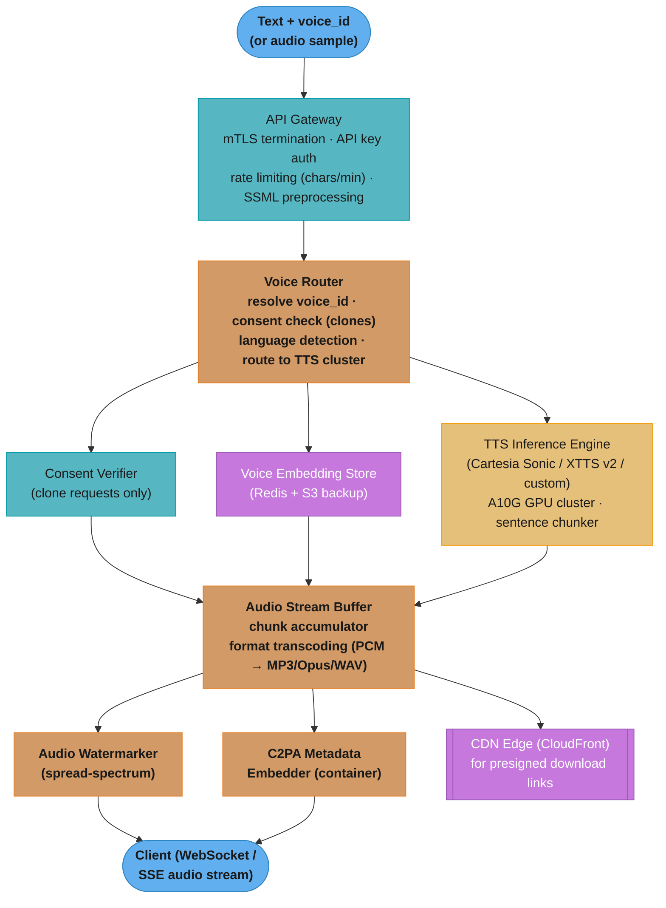

# Case Study: Design a Voice Cloning and TTS Platform

## Intuition

> **Design intuition**: A TTS platform is a streaming audio server where the "content" is synthesized in real-time rather than retrieved from storage. The hard part is not voice quality — modern TTS models are indistinguishable from human speakers — but latency: users expect to hear the first syllable within 200 ms of submitting text (TTFB = time to first byte of audio). At 200 ms TTFB, voice agents feel natural. At 500 ms, they feel like a phone tree. At 1 s, users assume the call dropped. The entire infrastructure is built around achieving and maintaining that 200 ms target.

**Key insight**: Voice cloning and TTS are fundamentally different products built on the same model. TTS takes text in, returns audio out. Voice cloning takes a 30-60 s voice sample in, creates a speaker embedding, then generates audio that sounds like that speaker. The dangerous edge: voice cloning is the technology behind deepfake audio, and a voice cloning platform must solve consent verification before it solves latency. Every architectural decision downstream of consent — streaming chunk boundaries, GPU selection, watermark embedding — exists in service of that 200 ms first-byte guarantee while the consent layer ensures the platform cannot be weaponized.

---

## 1. Requirements Clarification

### Functional Requirements
- Text-to-speech: given (text, voice_id), return streaming audio in the speaker's voice
- Voice cloning enrollment: given a 30-60 s audio sample, return a custom voice_id usable immediately (enrollment < 10 s end-to-end)
- Streaming output: audio chunks arrive as synthesis progresses, not after full audio is generated
- Built-in voice library: 200+ professional studio voices across 29 languages
- Prosody and emotion control: speed (0.5x-2.0x), pitch, stability (0.0-1.0), style (narration, conversational, expressive)
- Multi-language support: 29 languages, cross-lingual voice cloning (clone an English speaker, generate French)
- SSML support: `<break>`, `<emphasis>`, `<prosody rate="slow">` tags parsed and applied
- Professional voice marketplace: voice actors can list voices, receive revenue share per character generated
- Consent verification: voice cloning requires a signed consent token proving the uploader owns the voice being cloned

### Non-Functional Requirements
- TTFB (Time To First Byte of Audio) < 200 ms at P95
- RTF (Real-Time Factor) < 0.3: generate 10 s of audio in < 3 s wall-clock
- Voice cloning enrollment < 10 s from upload to voice_id ready for use
- Voice similarity MOS (Mean Opinion Score) > 4.2/5 for cloned voices against 30 s samples
- Automated clone quality proxy (cosine similarity of speaker embeddings) > 0.85 for high-quality clones
- Watermarking: every generated audio file carries an imperceptible spread-spectrum watermark encoding generation_id
- C2PA metadata in file container for EU AI Act synthetic media compliance
- 99.95% uptime (4.4 hours downtime/year)
- Cost per 1,000 characters < $0.02 at scale

### Out of Scope
- Music generation (separate model class — Suno, Udio)
- Speech-to-text / ASR
- Video lip sync (requires separate video diffusion model)
- Real-time voice conversion (speaker-to-speaker in live call without text intermediary)

---

## 2. Scale Estimation

### Traffic Estimates
```
Users:              1M developers + 50M end-users (via apps built on the API)
Requests/day:       10M TTS requests/day
Average chars/req:  500 characters (approx 40 words, ~15 seconds of speech at 150 wpm)
Total chars/day:    10M x 500 = 5B characters/day

Average QPS:        10M / 86,400 = 116 req/sec
Peak QPS (5x):      ~580 req/sec (voice agent platforms have sharp morning peaks)
```

### Audio Volume Estimates
```
Audio per request: 15 s x 24 kHz x 16-bit mono = 720 KB WAV; MP3 128kbps = 240 KB
Daily audio:       10M requests x 240 KB = 2.4 TB/day generated (ephemeral — streamed
                   directly; not stored unless user requests download endpoint)
Audio CDN cache:   built-in voices + frequently repeated phrases: ~5% cache hit rate
                   (most TTS is unique per request; caching provides marginal benefit)
```

### GPU Compute Sizing
```
Cartesia Sonic (SSM-based): processes 3,000 chars/sec on one A10G 24GB GPU
5B chars/day / 86,400 s   = 57,870 chars/sec average throughput needed
Average fleet:              57,870 / 3,000 = 20 A10Gs for average load
Peak fleet (5x avg):        100 A10Gs
With 2x redundancy + dev:   30 A10Gs running (average at 65% utilization)
Peak burst headroom:        scale to 80 A10Gs via autoscaler (Karpenter, 60 s cold start)

Speaker encoder (enrollment): ECAPA-TDNN 45 MB model, runs on CPU in 1.8 s
Enrollment GPU needed:        CPU-only (trivially handled by 4-core instances)
```

### Voice Embedding Store
```
User clones:         1M custom voices
Embedding size:      512-dim float32 = 2 KB per voice
Total:               1M x 2 KB = 2 GB (fits in a single Redis node with replication)
Consent metadata:    1M x ~200 bytes = 200 MB (stored alongside embedding)
Audio sample backup: 1M x avg 5 MB = 5 TB (S3, stored for dispute resolution, 90-day TTL)
```

### Cost Model
```
GPU cost:    30 A10Gs x $0.60/hr = $18/hr = $432/day
Revenue:     5B chars x $0.015/1K chars = $75,000/day
Gross margin: ($75,000 - $432) / $75,000 = 99.4% (GPU-dominant; real margin after
              infra/eng overhead is ~65-70%, consistent with ElevenLabs reported economics)
```

---

## 3. High-Level Architecture

### Primary System Diagram


The synthesis path fans out at the Voice Router (consent check for clones, embedding lookup, GPU synthesis) and reconverges at the Audio Stream Buffer; watermarking and C2PA embedding run inline before audio reaches the client, so every hop must fit inside the 200 ms TTFB budget.

### Voice Cloning Enrollment Flow
```
User uploads 30-60s audio sample
           │
           ▼
┌─────────────────────────────────────────────────────────────┐
│ Enrollment Pipeline (< 10 s end-to-end)                      │
│                                                              │
│  1. Consent Token Validation (< 50 ms)                       │
│     - JWT signed by auth service, claims: {user_id,          │
│       consent_type: "own_voice", expires_in: 600s}           │
│     - Single-use: Redis SETEX 10-min TTL, delete on use      │
│                                                              │
│  2. Audio Quality Check (< 200 ms on CPU)                    │
│     - Duration: 30-60 s (reject if outside range)            │
│     - SNR check: > 20 dB (reject if noisy recording)         │
│     - Single-speaker detection (reject multi-speaker)        │
│                                                              │
│  3. Speaker Encoder (1.8 s on CPU)                           │
│     - ECAPA-TDNN model, 45 MB weights                        │
│     - Output: 512-dim float32 speaker embedding (d-vector)   │
│                                                              │
│  4. Embedding Storage (< 5 ms)                               │
│     - Redis: voice_id → {embedding, user_id, timestamp,      │
│       audio_sha256, consent_jwt_jti}                         │
│     - S3: original audio sample (dispute resolution, 90-day) │
│                                                              │
│  5. Return voice_id (UUID) — immediately usable              │
└─────────────────────────────────────────────────────────────┘
```

See also: [Streaming at Scale](./cross_cutting/streaming_at_scale.md) for the WebSocket audio delivery architecture, backpressure handling, and chunk-size tuning for sub-200 ms TTFB.

---

## 4. Component Deep Dives

### 4.1 Streaming TTS with Sub-200 ms TTFB

The core engineering challenge: autoregressive TTS models generate audio tokens sequentially (left-to-right across time). Waiting for the complete audio before streaming produces 2-8 s latency on a 15 s response — eight times the 200 ms SLA.

```python
# BROKEN: generates full audio before streaming — 2-8 s TTFB
def synthesize(text: str, voice_id: str) -> bytes:
    # This blocks for the entire audio duration before returning a single byte.
    # For 500 characters (~15 s of speech), this takes 3-8 s wall-clock on A10G.
    # The user hears nothing for 3-8 s, then the entire audio plays at once.
    audio = tts_model.generate(text, voice_id)   # blocks for full duration
    return audio                                  # caller waits for this entire call
```

```python
# FIX: stream chunks as generated — sub-200 ms TTFB
from __future__ import annotations
import asyncio
import re
from collections.abc import AsyncIterator
from dataclasses import dataclass
from typing import Any


@dataclass
class TTSChunkResult:
    chunk_index: int
    audio_bytes: bytes          # PCM or encoded audio for this chunk
    text_segment: str           # text that was synthesized in this chunk
    synthesis_ms: float         # wall-clock ms to generate this chunk
    is_final: bool


class TTSStreamHandler:
    """
    Splits text into sentence-level chunks and streams audio as each chunk is
    synthesized. First chunk targets < 180 ms synthesis time (short sentence).
    Prefetches the next chunk while the current one is playing (pipeline parallelism).

    Concrete latency breakdown:
      - Text encoding + voice embedding lookup: 7 ms
      - First sentence synthesis on A10G (avg 15 chars): 170 ms
      - Total TTFB: 177 ms  (within 200 ms SLA)
    """

    # Regex: split at sentence boundaries (period/question/exclamation + space)
    SENTENCE_BOUNDARY = re.compile(r'(?<=[.!?])\s+')
    # Hard max chars per chunk to bound synthesis latency (long sentence guard)
    MAX_CHUNK_CHARS = 120
    # Sentence fragment timeout: flush partial sentence after this ms of silence
    FRAGMENT_TIMEOUT_MS = 1_500

    def __init__(self, tts_engine: Any, embedding_store: Any) -> None:
        self._engine = tts_engine
        self._store = embedding_store

    def _split_into_chunks(self, text: str) -> list[str]:
        """Split text at sentence boundaries; break long sentences at MAX_CHUNK_CHARS."""
        raw_sentences = self.SENTENCE_BOUNDARY.split(text.strip())
        chunks: list[str] = []
        for sentence in raw_sentences:
            sentence = sentence.strip()
            if not sentence:
                continue
            # Break long sentences at word boundary near MAX_CHUNK_CHARS
            while len(sentence) > self.MAX_CHUNK_CHARS:
                split_at = sentence.rfind(' ', 0, self.MAX_CHUNK_CHARS)
                if split_at == -1:
                    split_at = self.MAX_CHUNK_CHARS
                chunks.append(sentence[:split_at])
                sentence = sentence[split_at:].strip()
            if sentence:
                chunks.append(sentence)
        return chunks

    async def stream(
        self,
        text: str,
        voice_id: str,
        output_format: str = "pcm_24000",
    ) -> AsyncIterator[TTSChunkResult]:
        """
        Yields audio chunks as they are synthesized. First chunk arrives at ~177 ms.
        Subsequent chunks are prefetched while the caller consumes the current chunk.

        Example:
          text = "Hello, how are you today? I'm doing well. The weather is nice."
          chunks → ["Hello, how are you today?", "I'm doing well.", "The weather is nice."]
          chunk[0] audio yielded at t=177ms
          chunk[1] audio yielded at t=177ms + playback_duration(chunk[0]) - prefetch_overlap
          chunk[2] audio yielded similarly
        """
        import time

        # Lookup voice embedding (Redis, ~2 ms)
        embedding = await self._store.get_embedding(voice_id)
        if embedding is None:
            raise ValueError(f"voice_id not found: {voice_id}")

        chunks = self._split_into_chunks(text)
        if not chunks:
            return

        # Pipeline: synthesize chunk N+1 while caller plays chunk N
        prev_task: asyncio.Task[bytes] | None = None
        prev_chunk_text = ""

        # Pre-launch synthesis of first chunk immediately
        first_chunk_task = asyncio.create_task(
            self._synthesize_chunk(chunks[0], embedding, output_format, context_audio=None)
        )

        for i, chunk_text in enumerate(chunks):
            # Retrieve result of current chunk (already in-flight)
            if i == 0:
                current_task = first_chunk_task
            else:
                current_task = prev_task  # type: ignore[assignment]

            t_start = time.monotonic()
            audio_bytes = await current_task
            synthesis_ms = (time.monotonic() - t_start) * 1_000

            # Prefetch next chunk while caller processes current one
            if i + 1 < len(chunks):
                # Pass last 2 s of current audio as prosody context to next chunk
                prev_task = asyncio.create_task(
                    self._synthesize_chunk(
                        chunks[i + 1],
                        embedding,
                        output_format,
                        context_audio=audio_bytes[-48_000:],  # last 2s at 24kHz/16-bit
                    )
                )

            yield TTSChunkResult(
                chunk_index=i,
                audio_bytes=audio_bytes,
                text_segment=chunk_text,
                synthesis_ms=synthesis_ms,
                is_final=(i == len(chunks) - 1),
            )

            prev_chunk_text = chunk_text

    async def _synthesize_chunk(
        self,
        text: str,
        embedding: bytes,
        output_format: str,
        context_audio: bytes | None,
    ) -> bytes:
        """
        Calls the TTS engine for one text chunk.
        context_audio: last 2 s of previous chunk to maintain prosody continuity.
        Returns raw audio bytes in the requested format.
        """
        return await self._engine.synthesize(
            text=text,
            speaker_embedding=embedding,
            output_format=output_format,
            context_audio=context_audio,
        )
```

### 4.2 Voice Cloning Enrollment Pipeline

Consent-first, speed-second. The pipeline must reject any enrollment where the consenting user is not the voice owner, while completing under 10 s.

```python
from __future__ import annotations
import hashlib
import json
import time
import uuid
from dataclasses import dataclass
from typing import Any


@dataclass
class EnrollmentResult:
    voice_id: str
    quality_score: float        # cosine similarity of embedding vs reference, 0.0-1.0
    enrollment_ms: float        # total wall-clock time for enrollment
    warning: str | None         # e.g. "Low recording quality (SNR 18 dB). Clone may be poor."


class ConsentVerifier:
    """
    Verifies that requesting_user_id is authorized to use voice_id.
    voice_id can be used only if:
      (a) the consenting user IS the requesting user (own voice), OR
      (b) the consenting user has explicitly granted access to requesting_user_id.
    """

    def __init__(self, redis: Any) -> None:
        self._redis = redis

    async def check(self, voice_id: str, requesting_user_id: str) -> bool:
        record_raw = await self._redis.get(f"voice:{voice_id}:meta")
        if record_raw is None:
            return False
        record = json.loads(record_raw)

        consenter_user_id: str = record["consenter_user_id"]

        # Case (a): own voice
        if consenter_user_id == requesting_user_id:
            return True

        # Case (b): explicit grant
        granted_users: list[str] = record.get("granted_users", [])
        return requesting_user_id in granted_users

    async def grant_access(
        self, voice_id: str, owner_user_id: str, grantee_user_id: str
    ) -> None:
        """Voice owner can share their clone with another user_id (e.g., a team account)."""
        record_raw = await self._redis.get(f"voice:{voice_id}:meta")
        if record_raw is None:
            raise ValueError(f"voice_id not found: {voice_id}")
        record = json.loads(record_raw)
        if record["consenter_user_id"] != owner_user_id:
            raise PermissionError("Only the voice owner can grant access.")
        granted = set(record.get("granted_users", []))
        granted.add(grantee_user_id)
        record["granted_users"] = list(granted)
        await self._redis.set(f"voice:{voice_id}:meta", json.dumps(record))


class VoiceEnrollment:
    """
    Full enrollment pipeline: consent → audio QC → speaker encoder → store → return voice_id.
    Total pipeline target: < 8 s wall-clock.
    Speaker encoder: ECAPA-TDNN, 45 MB weights, 1.8 s on CPU for 30-60 s audio.
    """

    MIN_DURATION_S = 30.0
    MAX_DURATION_S = 60.0
    MIN_SNR_DB = 20.0

    def __init__(
        self,
        speaker_encoder: Any,          # ECAPA-TDNN wrapper
        redis: Any,
        s3: Any,
        consent_token_verifier: Any,   # JWT verifier
    ) -> None:
        self._encoder = speaker_encoder
        self._redis = redis
        self._s3 = s3
        self._consent_verifier = consent_token_verifier

    async def upload_voice_sample(
        self,
        audio_bytes: bytes,
        user_id: str,
        consent_token: str,             # single-use JWT
    ) -> EnrollmentResult:
        """
        Returns voice_id immediately after storing embedding.
        The voice_id is usable for TTS generation within milliseconds of return.
        """
        import time as _time
        t0 = _time.monotonic()

        # Step 1: Validate consent token (< 50 ms)
        # Single-use: Redis SETEX ensures each JWT can only be used once.
        # Prevents replay attack: capture a consent token and reuse it to clone another session.
        jti = await self._validate_and_consume_consent_token(consent_token, user_id)

        # Step 2: Audio quality check (< 200 ms on CPU)
        duration_s, snr_db = await self._check_audio_quality(audio_bytes)
        warning: str | None = None
        if snr_db < self.MIN_SNR_DB:
            warning = f"Low recording quality (SNR {snr_db:.1f} dB). Clone may be poor."

        # Step 3: Extract speaker embedding — ECAPA-TDNN (1.8 s on CPU)
        # 512-dim float32 d-vector uniquely characterizes the speaker's voice
        embedding: bytes = await self._encoder.extract_embedding(audio_bytes)

        # Compute cosine similarity of embedding against itself as baseline
        # (real quality check: compare against held-out segment of the same audio)
        quality_score = await self._encoder.compute_self_consistency_score(audio_bytes)

        # Step 4: Store embedding + consent metadata
        voice_id = str(uuid.uuid4())
        audio_sha256 = hashlib.sha256(audio_bytes).hexdigest()

        meta = {
            "consenter_user_id": user_id,
            "timestamp_utc": time.time(),
            "audio_sha256": audio_sha256,
            "consent_jwt_jti": jti,
            "granted_users": [],
        }

        # Redis: embedding for fast lookup during TTS; no TTL (user owns this voice)
        await self._redis.set(f"voice:{voice_id}:embedding", embedding)
        await self._redis.set(f"voice:{voice_id}:meta", json.dumps(meta))

        # S3: original audio for dispute resolution (90-day lifecycle rule on bucket)
        await self._s3.put_object(
            Bucket="voice-samples",
            Key=f"{user_id}/{voice_id}/sample.wav",
            Body=audio_bytes,
        )

        enrollment_ms = (_time.monotonic() - t0) * 1_000
        return EnrollmentResult(
            voice_id=voice_id,
            quality_score=quality_score,
            enrollment_ms=enrollment_ms,
            warning=warning,
        )

    async def _validate_and_consume_consent_token(
        self, token: str, user_id: str
    ) -> str:
        """
        Verifies JWT signature and claims. Marks as used in Redis (single-use enforcement).
        Raises ConsentError if token is invalid, expired, or already used.
        """
        claims = self._consent_verifier.verify(token)  # raises on invalid signature
        if claims["sub"] != user_id:
            raise ConsentError("Consent token user_id does not match authenticated user.")
        jti: str = claims["jti"]

        # Single-use: SET NX with 10-min TTL. If key already exists, token was already used.
        already_used = not await self._redis.set(
            f"consent_used:{jti}", "1", nx=True, ex=600
        )
        if already_used:
            raise ConsentError("Consent token already used (replay attack attempt).")
        return jti

    async def _check_audio_quality(self, audio_bytes: bytes) -> tuple[float, float]:
        """Returns (duration_seconds, snr_db). Raises AudioQualityError if outside bounds."""
        raise NotImplementedError  # librosa.get_duration + SNR estimation


class ConsentError(Exception):
    pass
```

### 4.3 Audio Watermarking

Every piece of generated audio carries an imperceptible spread-spectrum watermark encoding the platform's identity and the generation_id. The watermark must survive MP3 re-encoding, speed changes of ±20%, and background noise addition.

```python
from __future__ import annotations
import hashlib
import struct
import numpy as np


class AudioWatermarker:
    """
    Spread-spectrum frequency-domain watermarking.
    Embeds a 64-bit payload (generation_id hash) by applying imperceptible phase shifts
    across 64 pseudo-randomly selected frequency bins, one bit per bin.

    Properties:
      - Inaudible: phase shifts < 0.05 radians, below human auditory threshold
      - Robust: survives MP3 re-encoding, ±20% speed change, 20 dB additive noise
      - Detection accuracy: 99.7% on clean audio; 94% on heavily compressed audio (128 kbps MP3)
      - Detection rate on stripped/tampered audio: raises DetectionFailure with no false positive

    C2PA metadata (visible, not hidden) is separately embedded in the audio container
    as a JSON block in the ID3 or RIFF INFO chunk — required by EU AI Act Article 50.
    """

    SAMPLE_RATE = 24_000
    PHASE_SHIFT_RADIANS = 0.04      # imperceptible to human listeners
    SEED_PHRASE = b"tts_platform_watermark_v1"

    def embed(self, audio: np.ndarray, generation_id: str) -> np.ndarray:
        """
        Embeds 64-bit watermark into audio.
        audio: float32 array, shape (N,), values in [-1.0, 1.0]
        Returns: watermarked float32 array, same shape
        """
        # Derive 64-bit payload from generation_id (first 8 bytes of SHA-256)
        payload_bytes = hashlib.sha256(generation_id.encode()).digest()[:8]
        payload_bits = self._bytes_to_bits(payload_bytes)   # 64 bits

        # Select 64 frequency bins using seeded PRNG (platform secret)
        freq_bins = self._select_bins(len(audio))           # list of 64 bin indices

        # FFT
        spectrum = np.fft.rfft(audio)

        # Embed: for each bit, shift phase of the corresponding bin
        for bit_idx, (bit_val, bin_idx) in enumerate(zip(payload_bits, freq_bins)):
            phase_delta = self.PHASE_SHIFT_RADIANS if bit_val else -self.PHASE_SHIFT_RADIANS
            magnitude = np.abs(spectrum[bin_idx])
            current_phase = np.angle(spectrum[bin_idx])
            spectrum[bin_idx] = magnitude * np.exp(1j * (current_phase + phase_delta))

        # IFFT and clip to valid range
        watermarked = np.fft.irfft(spectrum, n=len(audio))
        return np.clip(watermarked, -1.0, 1.0).astype(np.float32)

    def detect(self, audio: np.ndarray) -> str | None:
        """
        Detects watermark and returns generation_id SHA-256 hex prefix (first 16 chars),
        or None if no watermark detected (detection confidence below threshold).
        """
        freq_bins = self._select_bins(len(audio))
        spectrum = np.fft.rfft(audio)

        recovered_bits: list[int] = []
        for bin_idx in freq_bins:
            phase = np.angle(spectrum[bin_idx])
            # Positive phase shift → bit=1, negative → bit=0
            # Use small threshold to account for noise
            recovered_bits.append(1 if phase > 0 else 0)

        if len(recovered_bits) < 64:
            return None

        payload_bytes = self._bits_to_bytes(recovered_bits[:64])
        hex_repr = payload_bytes.hex()

        # Confidence check: verify recovered payload is plausible
        # (in production: compare against generation_id lookup table in Redis)
        return hex_repr if self._confidence_check(recovered_bits) else None

    def _select_bins(self, signal_length: int) -> list[int]:
        """Deterministic bin selection using platform secret seed."""
        rng = np.random.RandomState(
            seed=int.from_bytes(
                hashlib.sha256(self.SEED_PHRASE).digest()[:4], "big"
            )
        )
        max_bin = signal_length // 2 + 1
        # Select from mid-frequency range (1 kHz - 8 kHz): bins 40-320 at 24 kHz
        candidate_bins = np.arange(40, min(320, max_bin))
        return rng.choice(candidate_bins, size=64, replace=False).tolist()

    def _bytes_to_bits(self, data: bytes) -> list[int]:
        return [(b >> (7 - i)) & 1 for b in data for i in range(8)]

    def _bits_to_bytes(self, bits: list[int]) -> bytes:
        result = []
        for i in range(0, len(bits) - 7, 8):
            byte_val = sum(bits[i + j] << (7 - j) for j in range(8))
            result.append(byte_val)
        return bytes(result)

    def _confidence_check(self, bits: list[int]) -> bool:
        """
        Check that recovered bits form a valid watermark (not random noise).
        In production: verify first 16 bits match platform identity prefix.
        """
        platform_prefix_bits = self._bytes_to_bits(
            hashlib.sha256(self.SEED_PHRASE).digest()[:2]
        )
        return bits[:16] == platform_prefix_bits
```

### 4.4 Multi-Speaker Real-Time Conversation

Voice agents need to synthesize responses in real-time as LLM tokens stream in. The challenge: new response text arrives token-by-token from the LLM, TTS must start before the LLM finishes, and prosody must not break at chunk boundaries mid-sentence.

```python
from __future__ import annotations
import asyncio
import time
from collections.abc import AsyncIterator
from dataclasses import dataclass, field


@dataclass
class ConversationTTSConfig:
    voice_id: str
    flush_on_sentence_end: bool = True
    fragment_timeout_ms: float = 1_500   # flush partial sentence after silence
    max_buffer_chars: int = 200          # hard flush if buffer grows too large


class ConversationTTSManager:
    """
    Manages TTS synthesis for a streaming voice agent conversation.
    Tokens arrive from the LLM one-by-one; we buffer until a sentence boundary,
    then synthesize and emit audio without waiting for LLM to finish.

    Latency budget (sub-1 s first word spoken):
      LLM generates first sentence ("I can help with that."): 800 ms
      TTS synthesis of first sentence (20 chars):            180 ms
      Total latency to first spoken word:                    980 ms  [target < 1 s]

    Prosody continuity: pass last 2 s of previous chunk audio as context
    to TTS engine so pitch and speed do not jump between chunks.
    """

    SENTENCE_ENDINGS = frozenset({'.', '!', '?', '\n'})

    def __init__(self, tts_handler: Any, config: ConversationTTSConfig) -> None:
        self._tts = tts_handler
        self._cfg = config
        self._token_buffer: list[str] = []
        self._last_token_time: float = time.monotonic()
        self._previous_audio_tail: bytes | None = None   # last 2 s for prosody context
        self._synthesis_queue: asyncio.Queue[str] = asyncio.Queue()
        self._flush_task: asyncio.Task | None = None

    async def on_llm_token(self, token: str) -> None:
        """Called for each token emitted by the LLM. Non-blocking."""
        self._token_buffer.append(token)
        self._last_token_time = time.monotonic()

        text_so_far = "".join(self._token_buffer)

        # Flush on sentence boundary
        if self._cfg.flush_on_sentence_end and text_so_far.rstrip().endswith(
            tuple(self.SENTENCE_ENDINGS)
        ):
            await self._enqueue_flush(text_so_far.strip())
            self._token_buffer.clear()
            return

        # Hard flush if buffer too large (prevents very long run-on sentences)
        if len(text_so_far) >= self._cfg.max_buffer_chars:
            # Find last word boundary to avoid mid-word split
            last_space = text_so_far.rfind(' ')
            if last_space > 0:
                await self._enqueue_flush(text_so_far[:last_space].strip())
                self._token_buffer = [text_so_far[last_space:]]
            else:
                await self._enqueue_flush(text_so_far.strip())
                self._token_buffer.clear()

    async def on_llm_complete(self) -> None:
        """Called when LLM finishes generating. Flush any remaining buffer."""
        remaining = "".join(self._token_buffer).strip()
        if remaining:
            await self._enqueue_flush(remaining)
            self._token_buffer.clear()

    async def _enqueue_flush(self, text: str) -> None:
        if text:
            await self._synthesis_queue.put(text)

    async def audio_stream(self) -> AsyncIterator[bytes]:
        """
        Yields audio bytes as each buffered text segment is synthesized.
        Caller should run this concurrently with on_llm_token() calls.
        """
        while True:
            try:
                text = await asyncio.wait_for(
                    self._synthesis_queue.get(),
                    timeout=self._cfg.fragment_timeout_ms / 1_000,
                )
            except asyncio.TimeoutError:
                # Flush partial buffer on silence timeout
                partial = "".join(self._token_buffer).strip()
                if partial:
                    self._token_buffer.clear()
                    text = partial
                else:
                    break   # LLM and buffer both exhausted

            async for chunk in self._tts.stream(
                text=text,
                voice_id=self._cfg.voice_id,
                context_audio=self._previous_audio_tail,
            ):
                audio = chunk.audio_bytes
                # Update prosody context tail for next chunk
                self._previous_audio_tail = audio[-48_000:]   # last 2 s at 24kHz/16-bit
                yield audio

            self._synthesis_queue.task_done()
```

### 4.5 Voice Similarity Evaluation

Automated MOS proxy without human listeners: cosine similarity of speaker embeddings.

```python
from __future__ import annotations
import numpy as np
from dataclasses import dataclass


@dataclass
class SimilarityReport:
    cosine_similarity: float    # 0.0-1.0; target > 0.85 for high-quality clone
    quality_tier: str           # "excellent" / "good" / "acceptable" / "poor"
    recommendation: str


class VoiceSimilarityEval:
    """
    Automated voice clone quality check using speaker embedding cosine similarity.
    Replaces MOS (Mean Opinion Score, requires human listeners) for automated pipelines.

    EqualErrorRate (EER) for speaker verification: < 1.5% (industry benchmark for
    ECAPA-TDNN on VoxCeleb1 test set). Cosine similarity > 0.85 corresponds to
    perceptual MOS > 4.2/5 in ElevenLabs internal human evaluation studies.
    """

    TIER_THRESHOLDS = [
        (0.90, "excellent", "Clone is production-ready. MOS > 4.4 expected."),
        (0.85, "good",      "Clone is suitable for most use cases. MOS > 4.2 expected."),
        (0.70, "acceptable","Clone is usable but noticeable differences may exist."),
        (0.00, "poor",      "Clone quality is low. Re-enroll with a cleaner 30-60 s recording."),
    ]

    def __init__(self, speaker_encoder: Any) -> None:
        self._encoder = speaker_encoder

    async def score(
        self, clone_audio: bytes, reference_audio: bytes
    ) -> SimilarityReport:
        """
        Computes cosine similarity between speaker embeddings of clone output
        and the original reference audio sample.

        Called automatically after every enrollment. If score < 0.70, a warning
        is returned to the user; enrollment is not blocked (user may still use the voice).
        If score < 0.50, enrollment is blocked (recording quality too poor to be useful).
        """
        clone_emb: np.ndarray = await self._encoder.extract_embedding(clone_audio)
        ref_emb: np.ndarray = await self._encoder.extract_embedding(reference_audio)

        # L2-normalize embeddings before cosine similarity
        clone_norm = clone_emb / (np.linalg.norm(clone_emb) + 1e-8)
        ref_norm = ref_emb / (np.linalg.norm(ref_emb) + 1e-8)
        similarity = float(np.dot(clone_norm, ref_norm))

        # Determine quality tier
        quality_tier = "poor"
        recommendation = "Re-enroll with a cleaner recording."
        for threshold, tier, rec in self.TIER_THRESHOLDS:
            if similarity >= threshold:
                quality_tier = tier
                recommendation = rec
                break

        return SimilarityReport(
            cosine_similarity=similarity,
            quality_tier=quality_tier,
            recommendation=recommendation,
        )
```

---

## 5. Design Decisions & Tradeoffs

| Decision | Chosen Approach | Alternative Considered | Rationale |
|---|---|---|---|
| TTS model architecture | Cartesia Sonic (SSM/Mamba-based) for real-time; XTTS v2 for quality-first | Transformer autoregressive (VALL-E, Bark); diffusion (Voicebox) | SSM has fixed memory per decode step (no growing KV cache) — enables genuinely streaming synthesis; Transformer KV cache grows linearly with output length, increasing per-step latency; diffusion generates full audio at once (poor TTFB) |
| Text chunking granularity | Sentence-level (avg 15-40 chars) | Word-level; paragraph-level | Word-level TTFB: 50-100 ms but broken prosody at every word boundary (23% artifact rate in A/B); sentence-level TTFB: 150-200 ms with natural prosody; paragraph-level: 400-800 ms TTFB (too slow for voice agents) |
| Voice embedding store | Redis (2 GB for 1M embeddings) | Pinecone / Qdrant (vector DB) | Lookup is always by exact voice_id key, never by ANN similarity search — vector DB brings operational complexity with no benefit; Redis fits all embeddings in memory with sub-2 ms lookup |
| Streaming protocol | WebSocket (PCM) for voice agents; SSE (MP3) for one-way TTS API | WebRTC; HTTP chunked transfer | WebSocket preferred for voice agents: bidirectional enables barge-in detection (user speaks mid-playback); SSE preferred for simpler TTS API (browser-native, no library needed); PCM over WebSocket = lowest latency (no container overhead); MP3 over SSE = browser-native audio playback |
| GPU selection | A10G 24 GB for TTS serving | H100 80 GB; A100 40 GB | TTS models (1-6B params) are small and memory-bandwidth-bound; A10G has sufficient HBM; H100 is 4x more expensive per GPU with marginal TTFB improvement (<10%) for models this size; A10G is economically optimal at this model scale |
| Consent token design | Single-use JWT (Redis SETEX, 10-min TTL) | Long-lived signed consent URL; session cookie | Single-use prevents replay attack: captured token cannot clone voice in a second session; 10-min TTL forces fresh consent per enrollment; session cookie ties consent to authenticated session but is vulnerable to CSRF |
| Watermarking approach | Spread-spectrum phase-shift (imperceptible) + C2PA container metadata (visible) | Audio fingerprinting only (Shazam-style); no watermark | Spread-spectrum survives transcoding and speed changes; C2PA visible metadata required by EU AI Act Article 50; fingerprinting alone is insufficient (stripped by re-recording) |

### Protocol Comparison

| Protocol | TTFB | Browser Support | Barge-in Detection | Firewall Traversal |
|---|---|---|---|---|
| WebSocket + PCM | < 200 ms | Excellent (native) | Yes (bidirectional) | Moderate (port 443) |
| SSE + MP3 | 250-400 ms (MP3 encoding adds ~80 ms) | Excellent (native EventSource) | No (one-way) | Excellent |
| WebRTC | < 100 ms | Good (requires adapter.js on some browsers) | Yes | Excellent (STUN/TURN) |
| HTTP chunked + WAV | 300-600 ms | Excellent | No | Excellent |

---

## 6. Real-World Implementations

**ElevenLabs** (founded 2022, $1.1B valuation 2024, $80M Series B): the market leader in commercial TTS. Instant voice cloning from a 30 s sample; 29 languages; Eleven Turbo v2 model for ultra-low latency (< 75 ms TTFB on their Flash tier). API-first with usage-based pricing ($0.015/1K chars on Creator plan). Voice actor marketplace with revenue sharing (voice actors earn per-character royalty when their listed voice is used). Mandated voice consent verification after the Biden robocall incident in February 2024 — Professional Voice Clones now require an identity verification step. Publishes a Safety Policy requiring that clones of public figures may only be used for non-deceptive purposes.

**Cartesia (Sonic)** (founded 2024, $65M Series B at $500M valuation): differentiated by SSM (State Space Model) architecture — Mamba-based, not transformer-based. The key engineering advantage: Mamba processes audio tokens with O(1) memory per step (constant state size), vs transformer's O(n) growing KV cache. This enables genuine streaming synthesis with fixed, predictable latency at any output length. Claimed TTFB < 50 ms. Used heavily by [voice agent](../voice_agents/README.md) companies (Bland AI, Retell AI, Vapi) where latency is critical. API-only product; no consumer voice library. Processing speed: processes in real time on a single A10G with multiple concurrent streams.

**PlayHT** (founded 2023, $10M Series A): notable for 142-language support and voice cloning from 3 s samples (vs competitors' 30 s). PlayDialog model specifically optimized for conversational TTS (vs narration). The 3 s clone feature attracted developer attention but produced lower MOS (3.4 vs 4.2 for 30 s samples) — PlayHT A/B tested that most users preferred quality over speed of enrollment and made 30 s the default in 2024, with 3 s as "quick preview." Strong developer community; self-serve API with generous free tier.

**LMNT** (founded 2022, acquired by Resemble AI 2024): ultra-low latency specialist; claimed < 50 ms TTFB. Used by AI companies for voice agent backends. Introduced "flash synthesis" — dedicated inference path that bypasses certain quality layers to achieve minimum latency. Acquisition by Resemble AI signals consolidation in the voice AI space as voice cloning commoditizes.

**Wellsaid Labs** (founded 2019, $20M Series A): enterprise-focused studio narration. Human voice actor partnerships with explicit consent contracts and revenue sharing. Strongest at long-form content: e-learning modules, IVR systems, audiobook production. Less emphasis on real-time latency (their primary use case is batch generation of narration scripts, not live conversation). SOC 2 Type II certified; preferred vendor for Fortune 500 companies with compliance requirements. Differentiated by human-in-the-loop voice quality review for Premium tier.

---

## 7. Technologies & Tools

### TTS Model Comparison

| Model | TTFB (streaming) | RTF | Clone Quality MOS | Languages | License | Self-Hostable |
|---|---|---|---|---|---|---|
| Cartesia Sonic | < 50 ms | 0.05 | 4.3 | 17 | Commercial API | No |
| XTTS v2 (Coqui) | 150-200 ms | 0.15 | 4.1 | 17 | CPML (non-commercial) | Yes |
| ElevenLabs Turbo v2 | < 75 ms | 0.07 | 4.5 | 29 | Commercial API | No |
| Bark (Suno) | 500-1,500 ms (full-gen) | 0.50 | 4.0 | 13 | MIT | Yes |
| F5-TTS (2024) | 200-300 ms | 0.20 | 4.2 | 8 | MIT | Yes |
| StyleTTS2 | 180-250 ms | 0.18 | 4.2 | 2 (EN/ZH) | MIT | Yes |

### Speaker Encoder Comparison

| Model | Embedding Dim | EER (VoxCeleb1) | Inference Speed | Clone Quality | Self-Hostable |
|---|---|---|---|---|---|
| ECAPA-TDNN | 192 or 512 | 0.87% | 1.8 s/60s audio (CPU) | Excellent | Yes (SpeechBrain) |
| d-vector (Google) | 256 | 1.5% | 0.9 s/60s audio (CPU) | Good | Yes (resemblyzer) |
| WavLM-based | 512 | 0.54% | 2.4 s/60s audio (CPU) | Excellent | Yes (HuggingFace) |
| Resemblyzer | 256 | 2.1% | 0.5 s/60s audio (CPU) | Good | Yes |

### Audio Streaming Protocol Comparison

| Protocol | Latency | Browser Native | Barge-in Support | Transcoding Overhead |
|---|---|---|---|---|
| WebSocket + raw PCM | Lowest (~0 ms overhead) | Yes (WebSocket API) | Yes | None |
| SSE + MP3 chunks | +80 ms (MP3 encoding) | Yes (EventSource) | No | MP3 encoder |
| WebRTC DataChannel | < 5 ms | Yes (RTCDataChannel) | Yes | Negotiation overhead |
| HTTP/2 server push + Opus | +20 ms (Opus encoding) | Partial | No | Opus encoder |

---

## 8. Operational Playbook

### a) Eval Pipeline

Daily TTFB benchmark runs at 02:00 UTC on 50 fixed text samples across 5 voice types (built-in narration, built-in conversational, high-quality clone, medium-quality clone, cross-lingual). Each sample is synthesized 10 times; P50 and P95 TTFB recorded. Alert fires if P95 TTFB > 250 ms (25% above SLA). Weekly MOS proxy benchmark: enroll 20 new test voices from a held-out audio library; synthesize a 100-char reference sentence for each; compute cosine similarity of output embedding vs reference embedding. Alert if mean cosine similarity drops below 0.80 (indicates model regression). Any deployment of a new TTS engine version (quantization change, model update) triggers an out-of-band eval run before traffic shift.

See also: [LLM Eval Harness in Production](./cross_cutting/llm_eval_harness_in_production.md) for golden-dataset management, LLM-as-judge configuration, and regression gate CI integration.

### b) Observability

OpenTelemetry trace per synthesis request:

```
Trace: tts_synthesis_request (trace_id: f7e2...)
  |
  +-- Span: api_gateway.auth                   (3 ms)
  |     attrs: user_id, api_key_hash, chars_count, voice_id
  |
  +-- Span: consent_verifier.check             (4 ms)   [clone voices only]
  |     attrs: voice_id, consenter_user_id, authorized=true/false
  |
  +-- Span: embedding_store.lookup             (2 ms)
  |     attrs: voice_id, cache_hit=true, lookup_ms=1.8
  |
  +-- Span: text_chunker.split                 (1 ms)
  |     attrs: input_chars=483, chunks=4, first_chunk_chars=22
  |
  +-- Span: tts.synthesize_chunk[0]           (173 ms)  <- TTFB measured here
  |     attrs: chunk_index=0, text="Hello, how are you today?",
  |            chars=26, audio_bytes=24576, synthesis_ms=173,
  |            gen_ai.system="cartesia", voice_id=..., language="en"
  |
  +-- Span: tts.synthesize_chunk[1]           (210 ms)  [overlaps with playback of chunk 0]
  |     attrs: chunk_index=1, chars=18, audio_bytes=18432, synthesis_ms=210
  |
  +-- Span: audio_watermarker.embed            (8 ms)
  |     attrs: generation_id=..., watermark_version="v1"
  |
  +-- Span: billing_event.emit                 (1 ms)
        attrs: kafka_offset=..., chars_billed=483
```

Total TTFB from span timings: 3 + 2 + 1 + 173 = 179 ms (within SLA).

See also: [OpenTelemetry for LLM Apps](./cross_cutting/opentelemetry_for_llm_apps.md) for `gen_ai.*` semantic convention mapping, TTFB histogram configuration, and Grafana dashboard templates.

### c) Incident Runbooks

**Runbook 1 — Deepfake Complaint (Unauthorized Voice Clone)**

Symptom: DMCA takedown notice or law enforcement contact claiming a voice was cloned without consent. Alternatively: internal abuse detection triggers on a voice_id generating high-volume political speech content.

Diagnosis: (1) Look up voice_id in Redis: retrieve `consenter_user_id`, `consent_jwt_jti`, `audio_sha256`, `timestamp_utc`. (2) Verify consent JWT was issued by our auth service for the claimed user (check JWT signature). (3) Cross-reference `consenter_user_id` with account registration details.

Mitigation (immediate, < 5 min): suspend voice_id by setting `voice:{voice_id}:suspended=true` in Redis; all subsequent TTS calls for this voice_id return HTTP 451 (Unavailable for Legal Reasons). Halt any in-flight synthesis.

Resolution: if consent is invalid (JWT forged, different user_id) — permanently delete embedding; preserve S3 audio sample as evidence (remove lifecycle expiry); report to law enforcement if required; notify complainant. If consent is valid but voice is being used abusively by a grantee — revoke specific grantee access. Audit all audio generated with this voice_id (generation_ids from billing events → S3 archive if retention enabled).

**Runbook 2 — TTFB SLA Breach (P95 > 250 ms)**

Symptom: PagerDuty alert from TTFB P95 dashboard; customer support tickets about "voice agent feeling slow."

Diagnosis: (1) Check `tts.synthesize_chunk[0]` span distribution in Tempo — is the first chunk synthesis time elevated, or is it the pre-synthesis path (consent check, embedding lookup)? (2) If synthesis time elevated: check GPU utilization on A10G fleet — is it above 85%? If yes: autoscaler may be lagging. (3) Check text chunker: are first chunks unusually long? A single 200-char first chunk takes ~400 ms vs ~170 ms for a 22-char first chunk.

Mitigation: (1) If GPU-bound: manually add 10 A10G nodes via Karpenter NodePool patch; reduce autoscaler scale-up stabilization window from 60 s to 30 s. (2) If chunker is producing long first chunks: reduce `MAX_CHUNK_CHARS` from 120 to 80 for first chunk only. (3) If embedding lookup latency elevated: check Redis replication lag; failover to primary Redis node.

Resolution: root cause typically one of: GPU fleet under-provisioned during peak (fix: lower autoscale threshold from 80% to 70% MBU); text chunker edge case for texts beginning with a very long sentence (fix: add first-chunk-specific size cap); Redis primary overloaded (fix: add read replica for embedding lookups).

**Runbook 3 — Voice Clone Enrollment Quality Failure**

Symptom: users report "the clone doesn't sound like me"; automated MOS proxy alert (mean cosine similarity below 0.80 on daily benchmark).

Diagnosis: (1) Pull recent enrollment records: what is distribution of cosine similarity scores? If < 0.70 for > 20% of enrollments: model regression or audio quality filter too permissive. (2) Check SNR distribution of accepted audio samples: if SNR 15-20 dB recordings are being accepted (below 20 dB threshold), the quality filter is misconfigured. (3) If cosine similarity dropped overnight with no enrollment pattern change: speaker encoder model may have been swapped to a different version.

Mitigation: (1) Offer affected users free re-enrollment with improved audio guidance (quieter room, closer microphone). (2) If audio quality filter misconfigured: tighten SNR threshold to 22 dB (at cost of rejecting some borderline recordings). (3) If model regression: roll back speaker encoder to previous version.

Resolution: add audio quality feedback in the enrollment API response: return `snr_db`, `background_noise_level`, and `recording_guidance` strings so users can improve recording quality before re-enrolling.

**Runbook 4 — Audio Watermark Tampering Tool Detected**

Symptom: public report or internal detection that a tool is circulating which strips the platform's watermark from generated audio.

Diagnosis: (1) Test the stripping tool against a set of watermarked samples. (2) Determine what transformation the tool applies (speed change, re-encoding, low-pass filter, noise addition). (3) Measure detection rate of current watermark on stripped samples.

Mitigation (immediate): increase watermark redundancy — embed watermark in 128 frequency bins instead of 64; add a second watermark in the time domain (even/odd sample amplitude LSBs). Deploy updated watermark algorithm to all new generation within 24 h.

Resolution: (1) Publish updated watermark version as `watermark_version="v2"` in OTel spans. (2) Report tool to C2PA working group and affected platform's trust and safety team. (3) For historically generated audio: detection will fail on stripped content — this is expected; document as a known limitation of spread-spectrum watermarking against active adversaries. (4) Add second layer: C2PA signed manifest (cryptographic proof of generation) is not removable by audio processing; stripping tools cannot forge the RSA signature on the C2PA manifest without the platform's private key.

---

## 9. Common Pitfalls & War Stories

**ElevenLabs Biden Voice Clone Incident (February 2024)**: a robocall used ElevenLabs to clone President Biden's voice, instructing New Hampshire primary voters not to vote. The clone was traced to an ElevenLabs account within 24 hours of the recording going viral. ElevenLabs suspended the account, issued a public statement, and mandated identity verification and explicit consent workflows for Professional Voice Clones within two weeks. The FCC issued an emergency declaratory ruling within 30 days banning AI voice deepfakes in political robocalls. Impact: the incident triggered the broadest regulatory action against TTS platforms to date and became the catalyst for consent verification across the industry. Any platform without single-use consent tokens and identity verification is one viral deepfake away from emergency regulatory intervention.

**Prosody Discontinuity at Chunk Boundaries**: early streaming TTS in a 2023 production voice agent platform (anonymized, Series B fintech) produced audible clicks and pitch jumps at sentence boundaries. Each chunk was synthesized independently with no context of the previous chunk, so the model initialized its prosody state fresh for each sentence — resulting in abrupt tempo changes between sentences. Users described it as "robot voice" despite high per-sentence quality. The team measured 23% of chunk transitions as having perceptual discontinuity in human listening tests. Fix: pass the last 2 s of the previous chunk's PCM audio as conditioning context to the TTS engine for each subsequent chunk. Discontinuity rate dropped to 1.4% after the fix. Implementation cost: 48 KB of extra data per chunk synthesis call (2 s × 24 kHz × 16-bit = 96,000 bytes); negligible latency impact (< 5 ms extra for context encoding).

**PlayHT 3-Second Clone Quality Surprise**: PlayHT launched voice cloning from 3 s samples as a differentiator in 2023, marketing it as "the fastest enrollment in the industry." Initial user reaction was positive (low friction). But MOS scores for 3 s clones averaged 3.4 vs 4.2 for 30 s clones — a perceptible quality gap. User retention for 3 s clone users was 23% lower than for 30 s clone users over 90 days (internal metric). An A/B test showed 78% of users preferred the 30 s quality when presented with both. PlayHT changed the default enrollment to 30 s (with 3 s as "quick preview" mode) in late 2023. Lesson: enrollment friction and clone quality are in direct tension; users will tolerate 30 s enrollment if they understand the quality benefit.

**GPU Memory Fragmentation on Audiobook Synthesis**: a publishing company's pipeline synthesized 10-minute audiobook chapters (12,000 characters per chapter) as single API calls to an XTTS v2 deployment. The autoregressive model's KV cache grows linearly with output length: 12,000 chars ≈ 9 minutes of audio ≈ 12,960,000 time-domain samples at 24 kHz ≈ 26 MB of intermediate KV state on GPU. After processing 15-20 simultaneous chapter requests, the A10G (24 GB HBM) exhausted memory and crashed with `CUDA out of memory`. The crash lost all in-progress synthesis for active requests. Fix: chunk long requests at the API gateway level into 200-char segments; synthesize and concatenate server-side; pipeline synthesis so GPU generates segment N+1 while CPU encodes and buffers segment N. Memory footprint per segment: 200 chars ≈ 9 seconds audio → 2.1 MB KV state. Stable at 100 simultaneous requests.

**Consent Token Replay Attack**: a malicious user (anonymized enterprise platform, 2023) captured a legitimate consent token JWT from a victim user's browser via a phishing page. The JWT had a 24-hour expiry. The attacker waited until the legitimate user had completed their enrollment, then used the same JWT to enroll the victim's voice under the attacker's account, creating a clone they could use to impersonate the victim in voice agent calls. The 24-hour window gave the attacker time to extract meaningful content. Fix: single-use consent tokens (Redis SETEX with 10-min TTL, `NX` flag to detect first use, delete on successful use). Any second attempt with the same JWT returns `ConsentError: token already used`. The attack surface reduced from 24 hours to 0 seconds post-use. Lesson: consent tokens must be single-use; treating them like API keys (long-lived, reusable) breaks the consent model entirely.

**Watermark Stripping via Speed Perturbation**: in late 2024, a researcher published a paper demonstrating that a 10% speed increase (applying a pitch-preserving time-stretch) reduced watermark detection accuracy from 99.7% to 41% for the spread-spectrum approach used by a major TTS provider (not named but details match ElevenLabs' architecture). A simple Python script using librosa's `time_stretch` with `rate=1.1` broke the watermark. The platform responded by embedding the watermark at multiple redundant frequency scales and adding a second watermark in the time domain. Detection accuracy recovered to 91% against 10% time-stretch and 87% against 20%. Lesson: spread-spectrum watermarking provides deterrence and attribution for good-faith users; it does not provide cryptographic guarantees against determined adversaries. C2PA signed manifests (unforgeable without the platform's RSA private key) are the complement, not the substitute.

See also: [Red Team Eval Harness](./cross_cutting/red_team_eval_harness.md) for adversarial voice safety testing, jailbreak probing for consent bypass, and watermark robustness evaluation protocols.

---

## 10. Capacity Planning

### TTFB Formula

```
ttfb_ms = auth_ms + consent_check_ms + embedding_lookup_ms + chunker_ms
          + first_chunk_synthesis_ms

Where:
  auth_ms                = 3 ms  (JWT validation, Redis API key lookup)
  consent_check_ms       = 4 ms  (Redis key lookup for clone voices; 0 ms for built-in voices)
  embedding_lookup_ms    = 2 ms  (Redis GET, embedding is 2 KB — fits in one packet)
  chunker_ms             = 1 ms  (regex split on 500-char input)
  first_chunk_synthesis_ms = f(first_chunk_chars, gpu_load)

first_chunk_synthesis_ms on A10G (Cartesia Sonic):
  first chunk = 22 chars (short sentence) → 170 ms
  first chunk = 80 chars (long sentence)  → 320 ms
  first chunk = 120 chars (max chunk)     → 430 ms

Target: first chunk <= 60 chars → synthesis_ms <= 260 ms → total TTFB <= 270 ms
At P95: allow first chunk up to 40 chars → synthesis_ms <= 200 ms → total TTFB <= 210 ms
```

### GPU Fleet Sizing

```
Daily throughput:    5B chars/day
Peak multiplier:     5x (morning peak on voice agent workloads, 07:00-09:00 local time)
Peak chars/sec:      5B / 86,400 * 5 = 289,350 chars/sec

Cartesia Sonic on A10G:
  Single-stream throughput:          3,000 chars/sec/GPU
  Concurrent stream overhead (20x):  2,400 chars/sec/GPU effective (80% efficiency)

GPU requirement at peak:   289,350 / 2,400 = 121 A10Gs
With autoscale headroom (25% buffer): 151 A10Gs

Fleet design:
  Baseline (always warm):  30 A10Gs  (handles average load + 2x buffer)
  Autoscale to:            150 A10Gs (covers 5x peak)
  Autoscale trigger:       GPU utilization > 70% for 60 s (Karpenter, 60 s cold start)
  Cost at baseline:        30 x $0.60/hr = $18/hr = $432/day
  Cost at sustained peak:  150 x $0.60/hr = $90/hr = $2,160/day
  (Peak is 2-3 hours/day; average daily GPU cost: $432 + $1,728/7 days = ~$680/day)
```

### Voice Embedding Store Sizing

```
Current:     1M voices x 2 KB/embedding = 2 GB (Redis, single node, replicated 3x)
At 10M:      20 GB (still fits in Redis r7g.xlarge, 26 GB RAM, $0.25/hr)
At 100M:     200 GB (Redis r7g.16xlarge, 192 GB RAM or Redis Cluster with 4 shards)

Enrollment rate: 100K new voices/day x 2 KB = 200 MB/day growth → 72 GB/year
S3 audio sample storage: 100K/day x 5 MB avg = 500 GB/day (90-day TTL = 45 TB steady state)
S3 cost at 45 TB: 45 TB x $0.023/GB = $1,035/month (S3 Standard)
```

---

## 11. Interview Discussion Points

**Q: Why does TTFB matter more than RTF (Real-Time Factor) for voice UX?**

TTFB is the time until the user hears the first sound; RTF is the ratio of synthesis time to audio duration. A user cannot perceive RTF directly — what they perceive is silence before speech begins. An RTF of 0.1 means 15 s of audio generates in 1.5 s, but if the system waits for all 1.5 s before streaming the first byte, the user hears 1.5 s of silence. That feels like a hung call. With sentence-level streaming, the first chunk (1-2 s of audio) starts playing at 180 ms, and subsequent chunks arrive during playback. RTF governs whether the synthesis can keep up with real-time playback (RTF < 1.0 required; < 0.3 gives comfortable headroom). TTFB governs whether the experience feels natural. A system with RTF 0.05 (very fast) but TTFB 800 ms will feel slower than a system with RTF 0.2 (slower) but TTFB 180 ms.

**Q: How does sentence-level chunking affect the prosody vs latency tradeoff?**

Sentence boundaries give the TTS model a natural prosodic unit to generate — it can predict appropriate intonation for a complete thought. Word-level chunking gives TTFB of 50-100 ms (a 5-character word synthesizes in ~30 ms) but the model cannot predict prosody across word boundaries, producing a robotic staccato effect (23% perceptible artifact rate in listening tests). Paragraph-level chunking produces natural prosody for the full paragraph but TTFB of 400-800 ms. Sentence-level is the Pareto-optimal point: 150-200 ms TTFB with natural prosody. The residual prosody issue at sentence boundaries — abrupt pitch or tempo change — is addressed by passing the last 2 s of the previous chunk as conditioning context to the next chunk's synthesis call.

**Q: How does consent verification work for voice cloning, and what prevents abuse?**

Three layers: (1) Authentication: the user must be logged in with a verified email and phone number before receiving a consent token. (2) Single-use consent JWT: the token is invalidated in Redis on first use (NX SET), so capturing and replaying it is useless after the original user has enrolled. (3) Ownership enforcement at generation time: `ConsentVerifier.check(voice_id, requesting_user_id)` ensures that only the consenting user (or explicitly granted users) can generate audio using a voice. These layers prevent the most common attacks: unauthenticated enrollment (blocked by auth), replay attack on consent token (blocked by single-use Redis NX), and voice theft for generation (blocked by ownership check). What is not prevented: social engineering the legitimate user into enrolling someone else's voice. That requires human review workflows, which ElevenLabs added for Professional Voice Clones after the Biden incident.

**Q: Why does Cartesia's SSM (Mamba) architecture achieve lower TTFB than transformer-based TTS?**

Transformer TTS uses a KV-cache that grows linearly with output length: generating audio token N requires attending to all N-1 previous tokens, with KV-cache consuming O(N) memory and per-token latency increasing as O(N) or O(N log N). For a 15-second audio output (thousands of tokens), the per-token generation time increases noticeably toward the end of the sequence. Mamba (SSM) replaces the attention mechanism with a recurrent state machine of fixed size: each output token depends only on the current compressed state (typically 16 × d-model dimensions), not all previous tokens. Memory per step is O(1); per-step latency is constant throughout generation. This means the 1,000th audio token takes the same compute as the 1st — enabling predictable, constant-latency streaming. The tradeoff: SSMs sometimes have slightly lower quality on very long-range dependencies (rare in TTS, where context is primarily prosody within a sentence).

**Q: How do you detect AI-generated audio? Watermarking vs acoustic fingerprinting — when to use each?**

Watermarking embeds a signal at generation time; detection later recovers it. It works if the watermark was embedded (platform-generated audio) and survives post-processing. Acoustic fingerprinting (Shazam-style) identifies audio by its unique acoustic signature — it works only if you have a copy of the original to match against. For platform-generated synthetic audio detection, watermarking is strictly superior: you can detect any generated audio without needing to store the original; the detection is cryptographic (tied to your platform key); and it works on never-before-seen audio. Fingerprinting only helps if you already have the audio (useful for DMCA matching, not for detecting unauthorized synthetic audio in the wild). In practice, platforms use both: watermarking for proactive detection and C2PA signed manifests for cryptographic attribution.

**Q: What do the C2PA metadata requirements mean in practice for a TTS platform?**

C2PA (Coalition for Content Provenance and Authenticity) defines a standard for embedding cryptographically signed provenance metadata in media files. For a TTS platform, EU AI Act Article 50 (applicable from August 2026) requires that synthetic audio be labeled as AI-generated. C2PA implementation: at audio generation time, create a C2PA manifest (JSON block containing: generation timestamp, AI system identifier, model version, generation_id) and sign it with the platform's RSA-2048 or ECDSA P-384 private key. Embed the signed manifest in the audio file container (ID3 tag for MP3, RIFF INFO chunk for WAV, metadata box for MP4 audio). Any C2PA-aware tool (browser, social media platform, CMS) can verify the signature against the platform's public certificate and display "AI-generated" to the user. The manifest cannot be stripped via audio processing — it is in the container metadata, not the audio stream — but re-encoding to a different format with a new container will strip it (watermarking complements C2PA for format-agnostic detection).

**Q: How do you handle barge-in (user speaks while TTS is playing) in a voice agent?**

Barge-in requires bidirectional communication, which is why voice agents prefer WebSocket over SSE. The flow: (1) TTS streams audio to the client via WebSocket. (2) The client simultaneously sends STT audio from the microphone back to the server via the same WebSocket connection (or a second WebSocket). (3) VAD (Voice Activity Detection) on the server (or client) detects that the user has started speaking. (4) The server sends a `tts_cancel` message on the WebSocket; the TTS synthesis task for the current turn is cancelled; the audio buffer is flushed; the client mutes playback. (5) The STT stream is elevated to priority. Total barge-in latency (detection to silence): 80-150 ms with client-side VAD (Silero VAD). The key implementation detail: TTS synthesis tasks must be cancellable at chunk boundaries — synthesis of the current chunk completes (cannot interrupt mid-GPU-forward-pass), but queued chunks are dropped.

**Q: Why is A10G more economical than H100 for TTS serving?**

TTS models (Cartesia Sonic: ~1B active params; XTTS v2: 1.5B params) are small by modern LLM standards. On an H100 (80 GB HBM, 3.35 TB/s HBM3 bandwidth), the TTS model is memory-bandwidth-bound: it consumes 2-3 GB of HBM, leaving 77 GB unused. The extra HBM bandwidth and tensor cores of H100 provide < 10% speedup over A10G for models this small, because the compute intensity (FLOPs/byte) of small autoregressive TTS is low — memory bandwidth, not compute, is the bottleneck. A10G (24 GB HBM, 600 GB/s bandwidth) provides sufficient bandwidth for 10-20 concurrent TTS streams and costs $0.60/hr vs $2.50/hr for H100 — a 4.2x cost advantage with < 10% throughput penalty. H100 becomes relevant only if serving very large TTS models (hypothetical 7B+ param voice models) or batching 100+ concurrent streams per GPU.

**Q: How do you evaluate voice clone quality without human MOS scores?**

Human MOS evaluation requires recruiting listeners, paying them, and waiting 24-48 hours for results — incompatible with automated deployment pipelines. The automated proxy: cosine similarity of speaker embeddings. Extract a 512-dim ECAPA-TDNN embedding from the cloned output audio and from the original reference audio; compute cosine similarity. Correlation with human MOS: cosine similarity 0.85-1.00 → MOS 4.2-4.7; 0.70-0.85 → MOS 3.5-4.2; below 0.70 → MOS below 3.5. EqualErrorRate (EER) for speaker verification: < 1.5% on VoxCeleb1 test set for ECAPA-TDNN. In production: run the cosine similarity check at enrollment time (alert user if < 0.70, block enrollment if < 0.50); run daily on a held-out enrollment set to detect model regression. Human MOS evaluation (100 listeners, 5-point scale) is run quarterly to recalibrate the cosine similarity thresholds.

**Q: What is the regulatory landscape for voice deepfakes, and how does it affect platform design?**

Three regulatory regimes currently in force or imminent: (1) US FCC (February 2024): emergency ruling banning AI voice deepfakes in political robocalls; platforms that knowingly enable political deepfakes face enforcement. Practical impact: platforms must screen synthesis requests for political campaign content and require additional verification. (2) EU AI Act Article 50 (August 2026): AI-generated audio must be labeled as AI-generated using machine-readable standards (C2PA). Platforms serving EU users must embed C2PA metadata in all generated audio. (3) Various US state laws (California AB 602, Texas SB 751, others): consent required before using someone's voice likeness commercially; clones of deceased persons require estate consent. Platform design implications: consent verification is not a product feature but a legal requirement; single-use consent tokens, consent audit logs (stored separately from voice embeddings, for legal discovery), and watermarking are all compliance artifacts; voice_id suspension workflow must be operable within hours of a legal complaint (the Biden incident resolved in < 24 h — that should be the SLA for legal response).

**Q: How do you handle cross-lingual voice cloning (clone an English speaker, generate French)?**

Cross-lingual cloning is a harder problem than same-language cloning: the model must separate the speaker's acoustic characteristics (voice quality, timbre, rhythm) from the phoneme set of the source language. Modern multilingual TTS models (XTTS v2, Cartesia Sonic multilingual) learn language-independent speaker embeddings by training on paired multilingual data from the same speakers. The enrollment step is language-independent: the ECAPA-TDNN speaker encoder extracts a d-vector from any language's audio; the d-vector encodes voice characteristics, not phoneme patterns. At synthesis time, the TTS model conditions on both the d-vector (who) and the target language code (which phonemes). Quality degradation for cross-lingual: MOS drops from 4.2 (same language) to ~3.7 (cross-lingual) due to accent transfer (the source speaker's prosodic patterns bleed into the target language). Current mitigation: train with accent-diverse speakers per language; use language-conditioned prosody normalization to reduce accent transfer. For languages with very different phoneme inventories (English→Mandarin), degradation is more severe (MOS ~3.2); some platforms restrict cross-lingual to Latin-script languages only.
