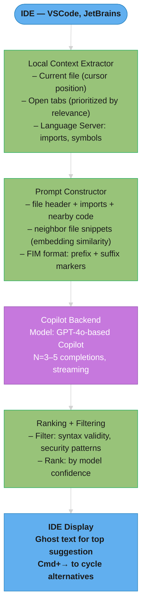
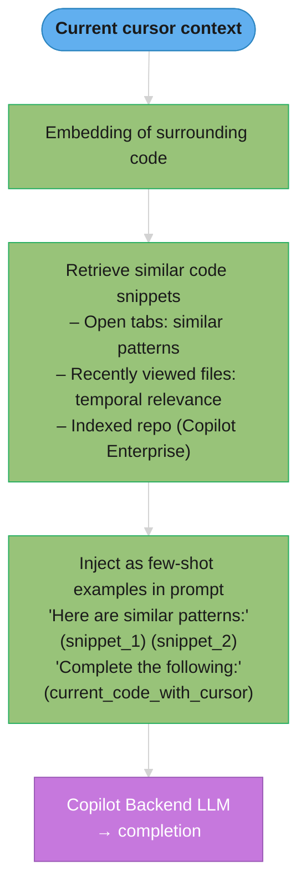
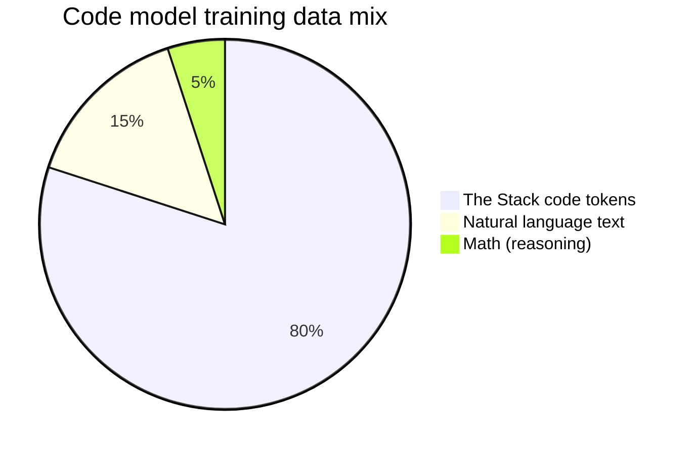
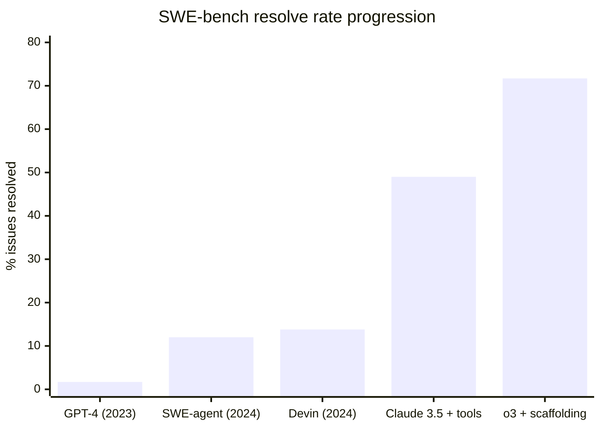

# Code Generation

## 1. Concept Overview

Code generation is one of the most commercially successful LLM applications, powering tools like GitHub Copilot, Cursor, Replit Ghostwriter, and Amazon CodeWhisperer. LLMs have become exceptional at generating, completing, editing, explaining, and debugging code — often surpassing junior developers on well-specified tasks.

Code is an ideal domain for LLMs because: (1) it has enormous training data (billions of lines on GitHub); (2) it's verifiable — code either runs and passes tests or it doesn't; (3) it follows predictable patterns — syntax, idioms, and APIs are relatively consistent. This verifiability enables unique training approaches (execution feedback) and evaluation methods unavailable for open-ended text.

---

## 2. Intuition

> **One-line analogy**: Code generation is like having a pair programmer who has read every open-source repository ever written and can complete your thought before you finish typing.

**Mental model**: Code has properties that make LLMs especially effective: massive training data (GitHub), clear structure (syntax, APIs), and verifiability (run the code). Fill-in-the-Middle (FIM) training teaches the model to complete a "hole" in code given the surrounding context — exactly what IDE autocomplete needs. The model doesn't understand code semantically; it predicts what code statistically follows from the context, which works surprisingly well because code has strong local patterns.

**Why it matters**: Code generation tools (Copilot, Cursor) demonstrably increase developer productivity by 30-55% on measurable tasks. Code is also uniquely amenable to agentic use — agents can generate code, execute it, observe the result, and iterate in a tight loop.

**Key insight**: The verifiability of code (it runs or it doesn't, tests pass or they don't) enables training signals that language generation can't have — execution feedback closes the loop between generation and correctness.

---

## 3. Core Principles

- **Context is everything**: Good code completion requires understanding the full codebase context — imports, variable names, function signatures, related functions. More context → better completions.
- **Fill-in-the-Middle (FIM)**: Unlike text generation, code completion often needs to complete a middle section, not just the suffix. Models must be trained with FIM objective.
- **Executability as ground truth**: Code can be automatically verified. This enables RL training with execution feedback and reliable evaluation.
- **Multiple granularities**: Code generation includes single-line completion, function generation, class generation, and full feature implementation. Each has different requirements.
- **Security matters**: LLMs trained on public code learn vulnerable patterns; code generation systems must actively filter insecure suggestions.

---

## 4. Types / Strategies

### 4.1 Code Completion (Single/Multi-line)

Predict the next line(s) given the preceding code (and optionally, the remaining file):

```python
# Given (prefix):
def calculate_bmi(weight_kg, height_m):
    """Calculate Body Mass Index."""
    # Model completes:
    return weight_kg / (height_m ** 2)
```

Requirements: low latency (<100ms feel), short context window typically sufficient.

### 4.2 Fill-in-the-Middle (FIM)

Complete code given both prefix (before cursor) and suffix (after cursor):

```
Prefix: "def factorial(n):\n    if n == 0:\n"
Suffix: "    return n * factorial(n-1)"
Middle (model generates): "        return 1\n"
```

**FIM Training Format (SPM — Suffix-Prefix-Middle)**:
```
Original text: PREFIX MIDDLE SUFFIX
FIM training example: <fim_suffix>SUFFIX<fim_prefix>PREFIX<fim_middle>MIDDLE
Model learns: given suffix + prefix, predict middle
```

FIM is what enables IDE features like pressing Tab mid-function — the model sees both sides of your cursor.

### 4.3 Code Editing / Instruction Following

Given existing code + natural language instruction, produce modified code:

```
Instruction: "Refactor this function to use list comprehension instead of for loop"
Input code:
  result = []
  for x in items:
      if x > 0:
          result.append(x * 2)

Output:
  result = [x * 2 for x in items if x > 0]
```

### 4.4 Repository-Level Code Completion

Context extends beyond the current file to the entire codebase:

```
Copilot's context gathering:
  1. Current file (full content)
  2. Open tabs in editor (recent files)
  3. Related files (imports, parent classes, same directory)
  4. Recently viewed files
  5. Symbol definitions (function signatures, type hints)
  6. Git history for the current file
  7. Project README / documentation

This "context window" may be assembled from 10+ files
Prioritized by: proximity to cursor, recency, relevance
```

### 4.5 Code Agents

Autonomous agents that write, execute, debug, and iterate on code:

```
Task: "Build a REST API for a todo list app with FastAPI"

Agent loop:
  1. Plan: decompose into subtasks (models, routes, auth, tests)
  2. Code: write initial implementation
  3. Execute: run the code in sandbox
  4. Evaluate: did tests pass? Any errors?
  5. Debug: if errors, read traceback, identify fix
  6. Iterate: fix issues, re-run tests
  7. Complete: all tests pass → return solution
```

Full agent architectures (SWE-agent, Claude Code, OpenHands) are covered in [Coding Agents](../coding_agents/README.md); the sandbox layer that makes step 3 safe is covered in [Sandboxed Code Execution](../agents_and_tool_use/sandboxed_code_execution.md).

---

## 5. Architecture Diagrams

### GitHub Copilot Architecture



### Copilot Code Retrieval



---

## 6. How It Works — Detailed Mechanics

### Code LLM Training Data

**The Stack (HuggingFace)**:
- 6.4TB of code from GitHub across 300+ programming languages
- License-filtered: only permissive licenses (MIT, Apache, BSD)
- Deduplicated at function/file level
- Quality filtering: remove files with high comment-to-code ratio, auto-generated files

**Code-specific tokenization**:
- Indentation as tokens (Python): `    ` (4 spaces) → single token
- Common identifiers: `self`, `def`, `return`, `import` → single tokens
- Operators and brackets: individually tokenized

**Data mixing for code models**:



The 15% natural language keeps the model fluent at docstrings, comments, and instruction following; the 5% math slice measurably improves algorithmic reasoning without displacing code coverage.

### Evaluation Benchmarks

**HumanEval (OpenAI, 2021)**:
```
164 Python programming problems
Each problem: docstring → generate function body
Metric: pass@k = probability at least 1 of k completions passes all tests

Example:
  def has_close_elements(numbers: List[float], threshold: float) -> bool:
      """Check if any two numbers in the list are closer to each other than threshold."""
      # Model generates the body

GPT-4: 88% pass@1
o1: 95%+
Human programmers: ~95%

Note: HumanEval is considered largely "solved"; harder benchmarks needed
```

**Read it like this.** "Let the model try `k` times and count the problem solved if *any* attempt
works. pass@k is not the model's accuracy — it is the accuracy of a model plus `k` lottery tickets."

That framing explains why pass@k numbers look so much better as `k` grows, and why comparing a
pass@100 to a pass@1 is meaningless. The metric bakes the retry budget into the score, so the `k`
must always travel with the number.

| Symbol | What it is |
|--------|------------|
| `k` | How many completions you are allowed to generate per problem before judging |
| `n` | How many you actually sampled to estimate the score. Must exceed `k` |
| `c` | How many of those `n` samples passed all tests |
| pass@1 | Effectively the per-sample success rate, `c / n` |
| "passes" | All unit tests green. No partial credit, no judge model, no human |

**Walk one example.** A model that solves a given problem 20% of the time per attempt — sampled
`n = 200` times, of which `c = 40` passed:

```
  per-sample success rate = c / n = 40 / 200 = 0.20

  pass@1   = 0.20     one shot, one chance
  pass@10  = 0.899    ten shots -- almost certainly at least one works
  pass@100 = 1.000    saturated

  WHY THE JUMP IS SO STEEP
    P(all k attempts fail) shrinks geometrically as k grows, so the
    complement -- P(at least one succeeds) -- races toward 1.
```

A model at 20% per attempt reports ~90% at pass@10. Both numbers describe the identical model. This
is why a bare "88% on HumanEval" is uninterpretable without its `k`, and why the benchmark's
"largely solved" status deserves a caveat: solved *at some k*, on 164 problems that have been public
since 2021 and reproduced across GitHub thousands of times.

**Why pass@k is the right metric for code and the wrong one for prose.** Code has a free, exact
verifier — run the tests. Generating 10 candidates and keeping whichever passes is a *deployable
strategy*, not just a scoring trick, so pass@10 measures something a user can actually have. No such
verifier exists for a summary or an email, which is why pass@k never migrated to those tasks and
LLM-as-judge did instead.

**SWE-bench** (real GitHub issues):
```
2294 real GitHub issues from 12 Python repositories
Task: given issue description + codebase → generate patch that resolves the issue
Evaluation: automated test suite (did the patch fix the failing tests?)

Metric: % resolved
```



From 1.7% (raw GPT-4, 2023) to 71.7% (o3 + scaffolding, on the SWE-bench Verified subset) in two years — the jumps come from agent scaffolding and tool use, not just base-model quality. Devin (Cognition, 13.8%) was the first public agent benchmark claim.

**MBPP** (Mostly Basic Python Problems):
- 500 simple Python functions from crowdsourcing
- More basic than HumanEval; good for smaller models

**BigCodeBench**:
- Complex, multi-step coding tasks; harder than HumanEval
- Tests: libraries, I/O, data processing, algorithm implementation

### Security Considerations

LLMs trained on public code learn vulnerable patterns:

```
Known problematic patterns:
  SQL injection: f"SELECT * FROM users WHERE id = {user_input}"
  Path traversal: open(base_dir + user_input)
  Hard-coded secrets: API_KEY = "sk-abc123..."
  Weak crypto: MD5, DES, RC4
  Eval injection: eval(user_input)

Detection and filtering:
  - Rule-based: regex patterns for common vulnerabilities
  - Model-based: CodeBERT fine-tuned on vulnerability datasets (CWE top 25)
  - Integration with SAST tools: Semgrep, CodeQL

Copilot's approach:
  - Filter completions through security patterns
  - Block secret-looking strings (API keys, passwords)
  - Flag known anti-patterns in UI
```

---

## 7. Real-World Examples

### GitHub Copilot
- 1M+ paid subscribers; 30%+ of code written with Copilot in some projects
- Codex (2021) → GPT-4 Copilot (2023) → custom models
- FIM training on 159GB of public GitHub code
- Latency target: ghost text appears within 100ms
- Acceptance rate: ~30-40% of suggestions accepted
- Measured productivity impact: 55% faster task completion (GitHub study)

### Cursor IDE
- Built entirely around LLM-first code editing
- Multi-file edit: select code across files → natural language edit instruction
- Codebase chat: embed entire repository; ask questions about it
- Composer: autonomous multi-step code generation with file creation

### Amazon CodeWhisperer
- Integrated into AWS environments
- Security scanning: built-in vulnerability detection
- Reference tracker: flags suggestions that match open-source code (copyright)
- Optimized for AWS SDK usage

### DeepSeek-Coder
- 33B model trained on 2T code tokens + 400B text tokens
- State-of-the-art open-source code model (before o1)
- Strong on HumanEval, MBPP, DS-1000 (data science)
- FIM training for completion scenarios

---

## 8. Tradeoffs

| Model | HumanEval | Latency | Cost | Context |
|-------|-----------|---------|------|---------|
| Codestral 7B (Mistral) | 81% | <1s | Free | 32K |
| DeepSeek-Coder 33B | 79% | 1-2s | Free/self-host | 16K |
| GPT-4o | 90% | 2-4s | API cost | 128K |
| Claude 3.5 Sonnet | 93% | 2-5s | API cost | 200K |
| o1 | 95%+ | 10-60s | 10× GPT-4o | 128K |

| Task | Best Approach |
|------|---------------|
| Single-line completion | Small fast model (Codestral, StarCoder2 3B) |
| Function generation | Mid-size model (GPT-4o, DeepSeek-Coder) |
| Complex algorithms | Reasoning model (o1, R1) |
| Bug fixing | Agent loop (Claude + tools) |
| Full feature implementation | Agent (Cursor, Claude Code) |

---

## 9. When to Use / When NOT to Use

### Use Code LLMs When:
- Well-specified tasks with clear success criteria (tests)
- Boilerplate generation (CRUD routes, test scaffolding, config files)
- Language translation (Python → JavaScript, pseudocode → code)
- Documentation generation (docstrings, README from code)
- Code review and bug detection

### Use Caution / Human Review Required:
- Security-sensitive code (authentication, encryption, payment processing)
- Novel algorithms without reference implementations
- Performance-critical code (LLM may not optimize for efficiency)
- Complex business logic (LLM doesn't know your domain rules)

---

## 10. Common Pitfalls

1. **Hallucinated APIs**: Models generate plausible but non-existent function calls (`pandas.read_json_fast()`). Always test before deploying.
2. **Insecure code**: SQL injection, path traversal, hard-coded secrets in suggestions. Use security scanning.
3. **Copyright issues**: Completions that reproduce copyrighted code. GitHub Copilot has reference tracker; consider alternatives.
4. **Over-trust in completions**: Developers accepting suggestions without reading leads to bugs. Treat completions as drafts, not answers.
5. **Long completion quality**: Completions beyond 50-100 lines degrade quickly. Use for short snippets; write long code in multiple short iterations.
6. **Context window exhaustion**: Large repositories need smart context selection — you can't fit everything in the prompt.

---

## 11. Technologies & Tools

| Tool | Purpose | Notes |
|------|---------|-------|
| **GitHub Copilot** | IDE completion | Most widely used; subscription model |
| **Cursor** | AI-first IDE | Multi-file editing; codebase chat |
| **Continue.dev** | Open IDE plugin | Self-hosted models; privacy-first |
| **Codeium** | Free completion | Personal use free; strong quality |
| **Tabby** | Self-hosted Copilot | Open source; privacy; multiple models |
| **Claude Code (Anthropic)** | Terminal agent | Autonomous coding; file editing |
| **StarCoder2** | Open code model | HuggingFace; strong base model |
| **DeepSeek-Coder** | Open code model | Best open quality; 7B-33B |
| **Codestral** | Open code model | Mistral; 32K context; fast |
| **SWE-agent** | Autonomous bug fixing | Princeton; SWE-bench |
| **aider** | Terminal AI coding | Open source; Claude/GPT backend |

---

## 12. Interview Questions with Answers

**Q: What is Fill-in-the-Middle (FIM) and why is it important for code completion?**
A: FIM trains the model to predict a middle section given both the prefix (code before cursor) and suffix (code after cursor). Standard autoregressive training only predicts suffixes. For IDE completion, the cursor is often mid-function, surrounded by existing code — FIM enables the model to complete this middle portion coherently. Training format: shuffle documents into [suffix][prefix][middle] order; the model learns the mapping.

**Q: How does GitHub Copilot gather context for a completion?**
A: Copilot collects: (1) current file with cursor position; (2) other open tabs, ranked by recency and relevance; (3) import statements and symbol definitions from the language server; (4) recently viewed files; (5) optionally, repository-indexed snippets similar to current code (enterprise). It assembles this into a FIM-formatted prompt, sending prefix + suffix + adjacent code snippets. The challenge is fitting everything into the context window while prioritizing the most relevant code.

**Q: What is SWE-bench and why is it a better benchmark than HumanEval?**
A: SWE-bench consists of 2294 real GitHub issues with their corresponding patches. The task: given the issue description and codebase, generate a patch that resolves the failing tests. It's harder than HumanEval because: (1) tasks are multi-file, not single-function; (2) requires understanding existing codebase structure; (3) real-world bugs are messier than toy problems; (4) evaluation is via test suite, not simple output comparison. HumanEval is essentially "solved" (~90%+); SWE-bench is still challenging (71% with o3 + scaffolding as of 2025).

**Q: How is pass@k actually computed, and what is the common mistake?**
A: pass@k is estimated with the unbiased estimator pass@k = E[1 - C(n-c, k)/C(n, k)], where you generate n samples per problem (n > k, typically n=200 for k=100), count c correct ones, and compute the probability that at least one of k random draws is correct. The common mistake is the naive approach — generate exactly k samples and check if any passes — which has high variance and systematically overestimates pass@k on small sample counts. A second trap is temperature: pass@1 should be measured near-greedy (temperature ~0.2) while pass@100 benefits from diverse sampling (temperature ~0.8), so a single temperature setting understates one metric or the other — the Codex paper established this dual-temperature convention. Always report n, k, and temperature alongside any pass@k number, or the result is not comparable.

**Q: What is benchmark contamination in code evals, and how do you detect it?**
A: Contamination means the benchmark problems (or near-duplicates) appeared in the model's training data, so the score measures memorization, not capability — HumanEval has been public since 2021 and its 164 problems are widely reproduced across GitHub, making inflated scores likely for any recent model. Detection techniques: n-gram overlap search between benchmark solutions and training corpora; perturbation testing (rename variables, paraphrase the docstring, or change constants — a large accuracy drop on semantically identical problems signals memorization); and comparing performance on problems published before vs. after the model's training cutoff. Mitigation: prefer continuously refreshed benchmarks (LiveCodeBench uses only post-cutoff contest problems; SWE-bench can be filtered to issues filed after the cutoff) and always maintain a private, never-published eval set for your own domain.

**Q: What are the main security risks in LLM code generation?**
A: (1) Injection vulnerabilities: LLMs learn SQL injection, XSS, command injection patterns from insecure training code; (2) Hard-coded secrets: models suggest API keys, passwords found in training data; (3) Insecure cryptography: models may suggest outdated algorithms (MD5, DES); (4) Path traversal: models may suggest file operations without input validation; (5) Copyright: models may reproduce licensed code verbatim. Mitigations: static analysis (Semgrep, CodeQL) on generated code; secret detection; security-focused post-processing.

**Q: How does SWE-bench scoring work and what does a 20% pass rate mean in practice?**
A: SWE-bench presents the model with a real GitHub issue description and the full repository state at the time the issue was filed. The model must produce a patch (git diff). Scoring: an automated test suite runs the patched codebase; "resolved" means all relevant tests now pass that were previously failing. A 20% resolve rate means 1 in 5 real GitHub issues is automatically fixed correctly without human intervention. For context: GPT-4 (2023) was at 1.7%; Claude 3.5 Sonnet with tools reached ~49%; o3 with scaffolding reached 71.7% on the verified subset. The benchmark is deliberately hard — it requires understanding codebase structure, bug reproduction, and generating targeted patches, not toy algorithms.

**Q: What are hallucinated APIs in code generation and how do you detect them?**
A: Hallucinated APIs are function calls, class names, or parameter names that look syntactically plausible but do not exist in any library. Examples: `pandas.read_json_fast()`, `sklearn.model_selection.StratifiedTimeSeriesSplit()`, `torch.nn.TransformerDecoderLayer.from_pretrained()`. Models generate them because they have learned naming conventions well enough to extrapolate, even when the API does not exist. Detection: (1) Static import resolution: attempt to import and introspect the callable at test time; (2) AST analysis: parse generated code and resolve all attribute accesses against known library APIs; (3) Execution testing: run the code in a sandbox — `ImportError` or `AttributeError` catches most hallucinations; (4) IDE integration: language servers flag non-existent symbols in real time during review.

**Q: How do tools like GitHub Copilot decide what repository-level context to include?**
A: The context budget is limited (~8K tokens for inline completion), requiring prioritization. Copilot uses a retrieval pipeline: (1) Current file with cursor position — highest priority; (2) Open editor tabs ranked by recency and embedding similarity to the current code; (3) Imports: follow import statements to retrieve type definitions and function signatures; (4) Language server data: symbol tables, class hierarchies; (5) Semantic search: embed the ~50 lines around the cursor and retrieve similar snippets from indexed open tabs. The final prompt is assembled by a context assembler that packs as many relevant snippets as fit in the token budget, ordered by computed relevance score. Copilot Enterprise adds repository-level vector search across the full codebase.

**Q: What CWE categories are most common in LLM-generated code?**
A: Studies on GitHub Copilot and similar tools show: CWE-89 (SQL injection) — models generate f-string SQL queries without parameterization; CWE-22 (path traversal) — file operations without input sanitization; CWE-798 (hard-coded credentials) — models copy credential patterns from training data; CWE-327 (broken cryptography) — suggestions of MD5, SHA1, or DES for security-sensitive uses; CWE-79 (XSS) — HTML templates with unescaped variables; CWE-502 (deserialization) — unsafe `pickle.loads()` on external data. A 2021 Stanford study found 40% of Copilot suggestions in security-sensitive contexts contained vulnerabilities. Always run SAST tools (Semgrep, Bandit for Python, SonarQube) on generated code before code review.

**Q: How do you integrate static analysis into a code generation pipeline?**
A: The integration point is between generation and delivery: generate code → run static analysis → filter or annotate → present to developer. (1) Semgrep rules: define rules for your organization's security policies (no eval, no raw SQL, specific library usage); run on generated code synchronously; surface violations as inline annotations; (2) CodeQL: deeper semantic analysis; catches data flow vulnerabilities (tainted input reaching a dangerous sink); too slow for real-time but appropriate in CI/CD gates; (3) Bandit (Python), ESLint, Checkstyle: language-specific; fast; rule-based; (4) Secret detection: GitLeaks or TruffleHog patterns catch credentials in generated code. Architecture: wrap the LLM call with a post-processing step; annotate the response with violations rather than silently blocking — developers need to see what was flagged and why.

**Q: How do GitHub Copilot and others address copyright and license contamination?**
A: Verbatim reproduction risk: models trained on public code may reproduce licensed code snippets; GPL/AGPL code would require derivative works to be open-sourced. Approaches: (1) License filtering at training time: Copilot was trained only on permissive-license code (MIT, Apache, BSD, Unlicense) — The Stack dataset by HuggingFace uses this approach; (2) Near-duplicate detection: at generation time, compare generated code to training corpus using n-gram or MinHash fingerprinting; flag if cosine similarity exceeds a threshold (~0.8); (3) Reference tracker: GitHub Copilot shows when a suggestion matches code from a specific public repository, letting users decide whether to use it; (4) Training-time deduplication: remove near-duplicate files to reduce memorization of specific code blocks. The legal risk remains unsettled as of 2025; class actions against GitHub are ongoing.

**Q: What makes a code agent's execution loop different from a standard ReAct loop?**
A: A standard ReAct loop uses tool calls to gather information and synthesize an answer. A code agent's loop is tighter and execution-driven: (1) The primary tool is code execution — the agent writes code, executes it in a sandbox, reads the output/error, and iterates; (2) Feedback is structured (stack traces, test results, stdout/stderr) rather than natural language observations; (3) The termination condition is programmatic (all tests pass, no errors) rather than semantic ("I have enough information"); (4) The agent manages file state across iterations — edits persist; (5) Multiple execution environments may be involved (Python sandbox, bash shell, browser). This makes code agents highly reliable for well-defined tasks (SWE-bench) but more dangerous for open-ended ones — they can delete files, make API calls, or consume cloud resources.

**Q: How does execution feedback become a training signal for code models?**
A: Code's verifiability enables RL with verifiable rewards: the model generates a solution, the solution runs in a sandbox against unit tests, and the reward is binary pass/fail or the fraction of tests passed — no learned reward model, no human preference labels, and no reward hacking, because the test suite is the ground truth. This is the recipe behind reasoning models' coding gains (DeepSeek-R1 and the o-series train on execution-verified code alongside math), and it requires real infrastructure: sandboxed execution (Docker/gVisor), per-test timeouts of 10-30 seconds to kill infinite loops, and test suites strong enough that wrong solutions cannot slip through weak assertions. The same loop works at smaller scale for data generation — sample N solutions, keep only ones that pass tests, fine-tune on the survivors (rejection sampling). See [Alignment & RLHF](../alignment_and_rlhf/README.md) for the verifiable-rewards mechanics.

**Q: How do you handle repositories too large to fit in any model's context window?**
A: No model can hold a 500K LOC repository in context. Strategies: (1) Semantic chunking and retrieval: embed all code at function/class granularity; retrieve the top-k most relevant chunks for each generation step — Cursor and Copilot Enterprise use this approach; (2) Symbol-level navigation: instead of loading full files, use the language server (LSP) to resolve symbols on demand — fetch function definitions when needed, not upfront; (3) Hierarchical summarization: build a codebase map (file → module → package summary); include the map in context for orientation; (4) Agent-with-tools pattern: give the agent tools like `read_file(path)`, `search_codebase(query)`, `get_symbol_definition(symbol)` so it navigates incrementally — this is the Claude Code and SWE-agent approach. Effective production systems combine all three strategies.

---

## 13. Best Practices

1. **Always run generated code** — never deploy without testing; treat generations as drafts.
2. **Use tests as specification** — write tests first; have the LLM write code to pass them (TDD + LLM = great).
3. **Iterate in small steps** — ask for one function at a time, not entire systems.
4. **Review for security** — always check for injection, hard-coded credentials, and insecure operations.
5. **Use the right model for the task** — small fast model for completion; large capable model for complex logic.
6. **Feed context explicitly** — paste relevant code/docs into the prompt; don't assume the model knows your codebase.

---

## 14. Case Study: Building a Repository-Level Code Assistant

**Problem:** Dev team at startup wants an AI assistant that understands their entire codebase and can answer questions like "How does payment processing work?" and generate new features consistent with existing patterns.

**Architecture:**
```
Indexing (run once, updated incrementally):
  Parse all code files: Python, TypeScript, SQL (300 files, 150K LOC)
  Chunk at function/class level (semantic boundaries)
  Add metadata: file path, language, class name, docstring
  Embed with text-embedding-3-large (code fine-tuned)
  Store in Qdrant with metadata filters

Query pipeline:
  User: "Add a new endpoint to list all orders by customer_id"

  Step 1: Retrieve relevant context
    Search: "order listing endpoint", "customer API", "routes"
    Retrieve top-5 functions: existing route handlers, models, schemas

  Step 2: Construct prompt
    System: "You are a senior engineer on this codebase. Match existing patterns."
    Context: [5 retrieved code examples showing existing patterns]
    Request: [user's task]

  Step 3: Generate with Claude 3.5 Sonnet (200K context)
    Model generates: route handler, model query, schema, test

  Step 4: Validation
    Syntax check (AST parse)
    Type check (mypy)
    Run existing test suite in sandbox
    Flag any security patterns
```

**Results:**
- Engineers spend 40% less time on feature implementation
- Generated code passes code review 73% of the time on first try (vs. estimate of 30% expected)
- Time to implement a new CRUD endpoint: 8 minutes (vs. 45 minutes before)

---

**Additional war story — FIM context window overflow crashing the extension at scale:**

A 20k-user IDE extension was sending the entire open file as prefix to the FIM model. On files over 8,000 tokens (common in generated code), the combined prefix + suffix + completion window exceeded the model's 8,192-token limit, returning a 400 error that the extension silently swallowed — users saw no completion at all. Detection came from a 14% drop in weekly active users, not from alerts.

```python
# BROKEN: naive FIM prompt construction — no token budget enforcement
def build_fim_prompt(prefix: str, suffix: str, max_tokens: int = 256) -> str:
    return f"<PRE>{prefix}<SUF>{suffix}<MID>"  # can exceed 8192 tokens total

# FIX: truncate prefix from the left (keep code closest to cursor)
def build_fim_prompt_safe(
    prefix: str,
    suffix: str,
    tokenizer,
    model_context: int = 8192,
    completion_budget: int = 256,
    suffix_budget: int = 512,
) -> str:
    suffix_tokens = tokenizer.encode(suffix)[:suffix_budget]
    overhead = 20  # special tokens
    prefix_budget = model_context - completion_budget - len(suffix_tokens) - overhead
    prefix_tokens = tokenizer.encode(prefix)[-prefix_budget:]  # keep tail (near cursor)
    prefix_str = tokenizer.decode(prefix_tokens)
    suffix_str = tokenizer.decode(suffix_tokens)
    return f"<PRE>{prefix_str}<SUF>{suffix_str}<MID>"
```

**Why left-truncate prefix, not right-truncate?** Code immediately before the cursor is far more predictive of the next token than code at the top of the file (imports, class declarations seen earlier). Always keep the suffix tail and the prefix tail closest to the cursor.

**Stated plainly.** "The context window is a fixed pot. Reserve room for everything you *know* you
need — the completion, the suffix, the special tokens — and whatever is left is the only space the
prefix may occupy."

The bug in the broken version is that it never computes a budget at all; it concatenates and hopes.
The fix inverts the order of operations: subtract the non-negotiable allocations first, then size the
one flexible piece to fit. That is the general pattern for every context-budget problem, not just
FIM.

| Symbol | What it is |
|--------|------------|
| `model_context` | Hard ceiling. 8,192 tokens — prompt *and* completion share it |
| `completion_budget` | 256 tokens reserved for the model's output. Reserved, not requested |
| `suffix_budget` | 512 tokens of code *after* the cursor. Capped because it is less predictive than the prefix |
| `overhead` | 20 tokens for `<PRE>`, `<SUF>`, `<MID>` and framing |
| `prefix_budget` | Whatever remains. The only term computed rather than chosen |
| `[-prefix_budget:]` | Keeps the **tail** of the prefix — the code touching the cursor |

**Walk one example.** Spend the 8,192 in the order the fix does:

```
  model context                        8,192
  - completion_budget                   -256   reserved for output
  - suffix tokens (capped at 512)       -512   code after the cursor
  - overhead (special tokens)            -20
                                       ------
  = prefix_budget                       7,404 tokens

  ALLOCATION SHARE
    prefix      7,404 / 8,192 = 90.4%
    suffix        512 / 8,192 =  6.2%
    completion    256 / 8,192 =  3.1%
    overhead       20 / 8,192 =  0.2%

  WHAT THE BROKEN VERSION DID
    an 8,000-token file as prefix, plus suffix, plus 256 completion:
      8,000 + 512 + 256 + 20 = 8,788  >  8,192   -> HTTP 400, silently swallowed
    overflow = 8,788 - 8,192 = 596 tokens
```

The failure needed only a 596-token overshoot — one moderately long generated file — and it produced
no completion, no error surfaced to the user, and no alert. Detection came from a 14% drop in weekly
active users, which is the worst possible monitor: a business metric standing in for an exception
nobody caught.

**Why the suffix gets a small fixed cap while the prefix gets the remainder.** Both sides inform the
completion, but asymmetrically — the prefix establishes what the code *is doing*, while the suffix
mostly constrains how the completion must *land* (matching braces, a following function signature).
512 tokens is plenty to capture that landing constraint, and every token beyond it would be taken
directly from prefix budget, which is the more predictive side. Note also that the suffix is capped
*before* the subtraction, so a huge file cannot let the suffix crowd out the prefix — the order of
those two lines is load-bearing.

**Additional interview Q&As:**

**What is Fill-in-Middle (FIM) and why does it outperform left-to-right generation for code completions?** FIM trains the model to predict a middle span given prefix and suffix context, which maps directly to IDE completions where the cursor is in the middle of a file. Left-to-right generation lacks suffix context, causing completions that contradict code written below the cursor (e.g., returning the wrong type). FIM models on HumanEval-Infilling benchmarks show 12-18% accuracy improvement over autoregressive-only baselines.

**How do you measure the quality of code completions in production without running every suggestion through tests?** Use acceptance rate as a leading indicator (target >30%) and post-acceptance edit distance as a lagging quality metric. A completion accepted and immediately deleted within 5 seconds has near-zero value; a completion accepted and left unmodified for 60+ seconds is a high-quality signal. Segment by language, file type, and trigger context (line-end vs mid-line) to find quality gaps.

**What is the latency budget for an IDE inline completion, and how do you hit it?** Users perceive latency above 200ms as sluggish for inline completions. The budget is: network RTT (20-50ms) + tokenization (2ms) + model inference (100-140ms at FP8 on A100 with speculative decoding) + decode + streaming first token (10ms). Speculative decoding with a small draft model (e.g., 200M parameter model drafting 4 tokens per step) reduces wall-clock inference from 180ms to 110ms at the cost of 40% more GPU FLOPS.

**Quick-reference table:**

| Approach | Best for | Trade-off |
|---|---|---|
| FIM with left-truncated prefix | Inline completions in large files | Loses class-level context at top of file |
| Repository-level RAG context | Function signature inference, import suggestions | Adds 30-80ms latency per retrieval |
| Speculative decoding (small draft model) | Hitting <150ms P50 at high RPS | Requires maintaining two model versions; draft model needs retraining when base model updates |
| Semantic cache for repeated prompts | Boilerplate completions in monorepos | Low hit rate for unique business logic code; adds 10ms cache lookup overhead |

**Pitfall — Accepting LLM code completions without syntax validation causes CI failures.**

```python
# BROKEN: stream raw LLM output directly to editor without parsing
async def stream_completion(prompt: str) -> AsyncIterator[str]:
    async for chunk in llm.stream(prompt):
        yield chunk.text   # may produce syntactically invalid Python mid-stream

# FIX: validate complete suggestion before inserting into editor
async def complete_and_validate(prompt: str, language: str) -> str | None:
    suggestion = await llm.complete(prompt)
    if language == "python":
        try:
            ast.parse(suggestion)    # syntax check before offering completion
            return suggestion
        except SyntaxError:
            return None              # decline to suggest broken code
```

**How does Fill-in-the-Middle (FIM) differ from left-to-right completion for code?** Standard left-to-right completion predicts tokens after the cursor — useful for appending code. FIM allows the model to see both the code before AND after the cursor, generating the missing middle section. This is essential for completing a function body when the return statement already exists, or filling a gap between two code blocks. Models trained with FIM use special tokens (`<PRE>`, `<SUF>`, `<MID>`) to signal the prefix, suffix, and generation target. GitHub Copilot's Tab completion is FIM; the quality improvement over left-to-right is 15-25% on HumanEval for in-function completions.

**What is the role of a reranker in code generation candidate selection?** Code generation models typically sample N=5-20 candidates (temperature > 0) then rank them. A reranker scores each candidate on: (1) syntactic validity (AST parse passes); (2) type consistency with surrounding code (via language server); (3) test-case pass rate if a unit test oracle is available; (4) CodeBLEU similarity to existing patterns in the codebase. The highest-ranked candidate is shown. This reranking pipeline is why GitHub Copilot's `pass@1` accuracy is significantly higher than raw model `pass@1` — the reranker acts as a cheap verifier.

---

**Quick-reference decision table:**

| Scenario | Recommended approach | Key constraint |
|---|---|---|
| < 10k training examples | LoRA / few-shot prompting | Data scarcity |
| Latency < 100ms required | Quantized model + ONNX Runtime | Throughput > accuracy |
| Multi-tenant, shared model | System prompt isolation + guardrails | Security boundary |
| Domain shift from pre-training | Fine-tune with domain data | Catastrophic forgetting risk |
| Cost reduction (10× target) | Smaller model + prompt optimization | Quality floor |

**Production checklist before shipping an LLM feature:**

- [ ] Latency p99 measured under production load (not just median)
- [ ] Fallback path tested: what happens when the LLM API is unavailable?
- [ ] Cost per request calculated at current and 10× scale
- [ ] Safety/guardrail evaluation on 200 adversarial prompts
- [ ] Prompt versioned in code and tied to model version in experiment tracker
- [ ] Human evaluation on 50 random production outputs before launch
- [ ] Monitoring dashboard live: latency, error rate, cost, quality proxy metric

**Interview Q&A supplement:**

**How do you measure the real-world impact of a code generation feature beyond pass@k?** Track production metrics: (1) acceptance rate — what fraction of shown completions are accepted by developers (industry baseline: 25-35%); (2) retention rate — of accepted completions, how many survive the next commit without modification (high quality = > 70%); (3) time-to-completion — does the developer ship features faster? Measure via A/B test: feature team vs. control team, track story-point velocity over 8 weeks. These business metrics matter more than HumanEval pass@1 for evaluating real impact.

**What is test-driven development integration for code generation agents?** An agentic code generation loop: (1) generate code from the spec; (2) run tests against it; (3) feed failing test output back to the model as context; (4) iterate until tests pass or N retries exceeded. SWE-agent and OpenHands use this pattern and achieve 20-35% solve rate on SWE-bench — dramatically higher than single-shot generation (~2%). The key engineering challenge: sandboxing (tests must run in an isolated environment that can't damage the host), test timeout enforcement (infinite loops in generated code must be killed), and retry budget management (each iteration costs tokens + time).

**Key metric targets for production LLM systems:**

| Metric | Typical target | How to measure |
|---|---|---|
| Latency p99 | < 2s for chat, < 500ms for autocomplete | Prometheus histogram |
| Token cost per request | < $0.01 for most applications | Track input+output tokens × price |
| Hallucination rate | < 5% on factual tasks | LLM-as-judge on sampled outputs |
| Context utilization | > 60% of max context used | Avg tokens / max_context |
| Cache hit rate | > 30% with prompt caching | Cache hit counter / total requests |

**What is repository-level context and why does it outperform file-level completion?** File-level completion sees only the current file. Repository-level systems (Copilot, Cursor) index the entire codebase, retrieve relevant files (similar functions, imported modules, type definitions), and include them in the LLM context. This enables completions that match the project's conventions (variable naming, error handling patterns, custom types). Empirically, repository-level context improves acceptance rate by 8-15% and reduces generated code that references undefined symbols by 60%. The engineering cost: a local embedding index of the codebase (updated on save), a retrieval step per completion request, and careful context budget management to stay within the model's context limit.
