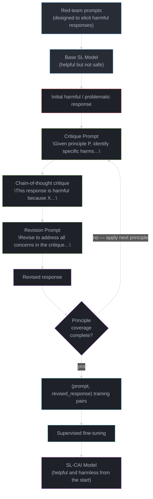
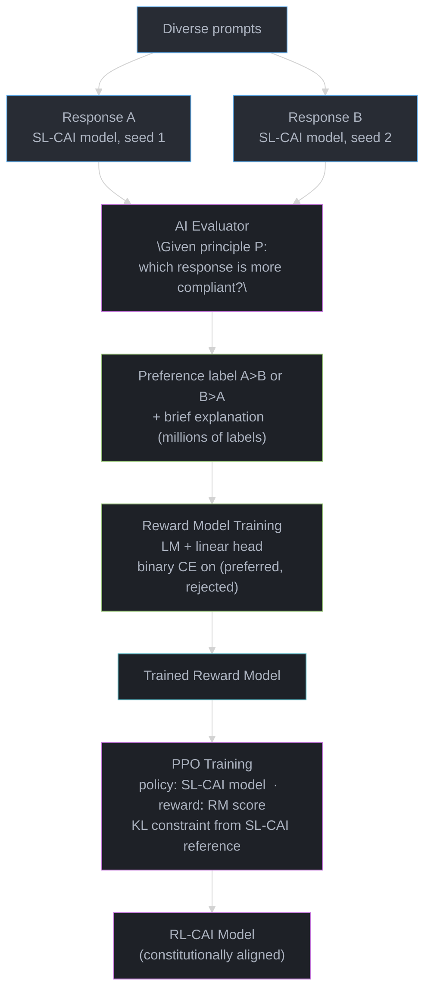
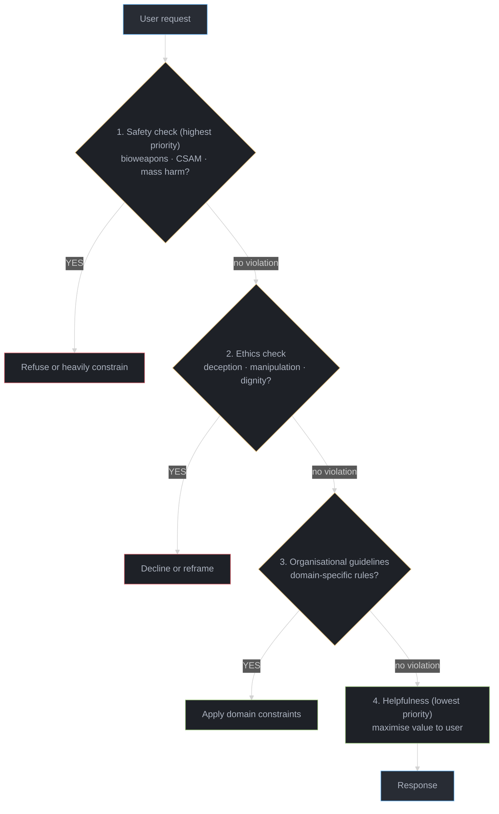

# Constitutional AI

> Cross-reference: [alignment_and_rlhf/](../alignment_and_rlhf/README.md) covers RLHF mechanics, PPO, DPO, reward hacking, and preference learning in depth. This module focuses specifically on the Constitutional AI technique: what it is, how the SL-CAI and RL-CAI pipelines work, how to write a constitution, and how RLAIF differs from RLHF.

---

## 1. Concept Overview

Constitutional AI (CAI) is an alignment technique developed by Anthropic and described in the 2022 paper "Constitutional AI: Harmlessness from AI Feedback" (arxiv.org/abs/2212.08073). It addresses a fundamental scaling bottleneck in RLHF: human annotators cannot review every response at scale, and the cost, latency, and annotator-welfare concerns of large-scale human labeling become prohibitive for production-grade models.

CAI replaces or substantially reduces the need for human preference labels by using AI-generated feedback guided by a written "constitution" -- a set of human-readable principles that specify what the model should and should not do.

**Two training phases:**

**Phase 1 -- SL-CAI (Supervised Learning with Constitutional AI):**
- Elicit harmful or problematic responses using red-team prompts
- Ask the model to critique its own response against a constitutional principle
- Ask the model to revise the response to address the critique
- Optionally loop (critique-revise-critique-revise) for multiple passes
- Collect the final revised responses as supervised fine-tuning examples
- Fine-tune on this critique-revised dataset to produce the SL-CAI model

**Phase 2 -- RL-CAI / RLAIF (Reinforcement Learning from AI Feedback):**
- Generate pairs of model responses to the same prompt
- Use an AI evaluator (guided by a constitutional principle) to label which response is more compliant
- Collect these AI-generated preference labels at scale without human raters
- Train a reward model on these labels
- Run PPO with the reward model as signal to produce the RL-CAI model

The result is a model that is helpful, harmless, and honest -- with alignment choices that are explicit, auditable, and encoded in a human-readable document rather than in opaque rater preferences.

---

## 2. Intuition

**One-line analogy:** Constitutional AI is teaching a model to be its own ethics committee -- instead of human raters judging every response, you give the model a written constitution of principles and let it critique and revise its own outputs against those principles.

**Mental model:** Standard RLHF requires humans to say "response A is better than response B." This is expensive, slow, and introduces annotator variance plus annotator trauma from reviewing harmful content at scale. CAI replaces this with a different question: "given principle P, is response A or B more compliant?" -- a question that a trained model can answer reliably, especially for clear-cut cases where the principle directly applies.

**Why it matters:** CAI is not just a cost optimization. AI-generated feedback is more consistent than human feedback for rule-based, principle-grounded comparisons. A human rater might be tired, culturally biased about a borderline case, or unsure what the company's policy is. A model evaluating against an explicit principle applies that principle consistently across millions of comparisons.

CAI also introduces a new form of transparency: the constitution is human-readable and publicly auditable. Stakeholders can debate whether the principles are correct and complete, rather than trying to reverse-engineer opaque human rater preferences.

**Key insight:** CAI and RLHF are complementary, not competing techniques. Claude models use both. CAI handles the scalability and consistency problems of RLHF -- especially for clear harm categories. RLHF handles nuanced preference alignment (tone, verbosity, style, cultural context) that principles cannot fully specify. The right mental model is: CAI for clear-cut values, RLHF for nuanced preferences.

---

## 3. Core Principles

**Written constitution:** Alignment choices are encoded in explicit, human-readable principles. These principles can be debated, versioned, and audited. They are not hidden in annotator instructions or rater demographics.

**Self-critique:** The model that generated a response also critiques it. This is possible because the base model already knows what "harmful" means -- it has been exposed to descriptions and examples of harm during pretraining. CAI leverages this latent knowledge rather than treating the model as a blank slate.

**Chain-of-thought critique:** The model does not just label a response as "harmful" or "fine." It explains, step by step, why the response violates or complies with the stated principle before revising. This chain-of-thought reasoning produces better revisions and better training signal.

**Revision loop:** The critique-revision cycle can be applied multiple times: harmful response > critique > revised response > critique of revision > further revised response. Each iteration moves the response further from harm and closer to the target behavior.

**RLAIF (Reinforcement Learning from AI Feedback):** At the RL training phase, preference labels are generated by an AI evaluator rather than by human raters. The AI evaluator is prompted with a principle and asked to select the more compliant of two responses. These labels train a reward model, which then guides PPO training.

**Transparency and auditability:** Because the constitution is explicit, alignment choices become inspectable. Teams can identify exactly which principles are being applied, in what priority order, and update them systematically when failures occur.

**Priority ordering:** When principles conflict -- as they do routinely (helpful vs harmless) -- the constitution must specify an explicit priority ordering. Anthropic's approach: safety first, then ethics, then adherence to organizational guidelines, then helpfulness.

---

## 4. Types / Architectures / Strategies

### 4.1 SL-CAI Pipeline

The SL-CAI phase produces a supervised learning dataset from AI-generated critiques and revisions.

**Inputs required:**
- A base language model (trained for helpfulness, not yet aligned for harmlessness)
- A set of red-team prompts designed to elicit harmful responses
- A constitution (list of principles)

**Step 1 -- Elicit harmful responses:** Feed red-team prompts to the base model and collect responses. Red-team prompts are specifically designed to elicit harmful content: instructions for dangerous activities, manipulative content, privacy violations, etc.

**Step 2 -- Critique:** For each harmful response, prompt the model to identify specific ways in which the response is harmful or unethical, given a sampled constitutional principle. The model produces a chain-of-thought critique explaining what is problematic and why. The principle is sampled from the constitution for diversity across training examples.

**Step 3 -- Revise:** Prompt the model to rewrite the response to address all concerns identified in the critique. The revision aims to be helpful while removing the identified harms.

**Step 4 -- Optional additional loops:** Apply critique-revise again on the revised response, especially for borderline cases or when the initial revision is still problematic. Two to three loops are typical in practice.

**Step 5 -- Collect training data:** The (prompt, final revised response) pairs become supervised fine-tuning examples. The SL-CAI model is fine-tuned on this dataset.

**Key property:** The training signal comes entirely from the model's own evaluation of its outputs against written principles -- no human labels needed for this phase.

### 4.2 RL-CAI / RLAIF Pipeline

The RL-CAI phase generates preference labels using AI evaluation, then trains a reward model and runs PPO.

**Inputs required:**
- The SL-CAI model (already better-behaved than the base model)
- A constitution
- A diverse set of prompts (not necessarily harmful -- general distribution)

**Step 1 -- Generate response pairs:** For each prompt, generate two responses using the SL-CAI model with different sampling configurations. This produces (response A, response B) pairs.

**Step 2 -- AI preference evaluation:** For each pair, prompt an AI evaluator with a principle and ask which response is more compliant. The evaluator outputs a preference label and a brief explanation. The principle is sampled from the constitution.

**Step 3 -- Scale label collection:** Because labels come from AI (not humans), this step can run at any scale. Millions of (prompt, response A, response B, preference) tuples can be generated in hours on GPU clusters.

**Step 4 -- Train reward model:** Use the AI-generated preference labels to train a reward model. Architecture: the same base language model with a linear head predicting scalar reward. Loss: binary cross-entropy on (preferred, rejected) pairs.

**Step 5 -- PPO training:** Use the reward model as the reward signal in PPO. The SL-CAI model is the policy; the reward model scores each generated response; PPO updates the policy to maximize reward while staying close to the SL-CAI model via a KL penalty.

**Output:** RL-CAI model -- a model whose behavior is shaped by the constitutional principles encoded in the reward model.

### 4.3 The Constitution: Structure and Design

A constitution is a list of principles, each formulated as an evaluation criterion. The original Anthropic constitution (2022) had approximately 16 principles across these categories:

**Harm avoidance principles:**
- "Choose the response that is least likely to contain harmful, unethical, racist, sexist, toxic, dangerous, or illegal content"
- "Choose the response that is least likely to encourage harmful or illegal activities"
- Specific prohibitions: bioweapons instructions, CSAM, mass casualty event facilitation

**Honesty principles:**
- "Choose the response that is most accurate and truthful, even if it is not what the human wants to hear"
- "Choose the response that is least deceptive or manipulative"

**Autonomy and dignity principles:**
- "Choose the response that is least likely to undermine human autonomy or override human decision-making"
- "Choose the response that best upholds human dignity"

**Helpfulness principles (critical to include):**
- "Choose the response that is most genuinely helpful to the human"
- "Choose the response that least refuses without good reason"

**Priority ordering (Anthropic's approach):**
Safety > Ethics > Organizational guidelines > Helpfulness

This ordering resolves conflicts: a request that requires being unhelpful to be safe is resolved in favor of safety.

**Domain-specific constitutions** differ significantly. A medical assistant's constitution adds principles about recommending professional consultation. A legal assistant's constitution adds principles about not substituting for licensed legal advice. A children's education platform has stricter content standards than a general assistant.

### 4.4 CAI vs RLHF vs DPO -- Comparison

| Method | Label Source | Cost | Consistency | Transparency | Scalability |
|--------|-------------|------|-------------|--------------|-------------|
| RLHF (human) | Human raters | High ($$$) | Variable (~70% IAA borderline) | Low (opaque rater prefs) | Limited by human throughput |
| CAI / RLAIF | AI evaluator + constitution | Low-Medium | High for clear-principle cases | High (readable constitution) | Scales with compute |
| DPO (offline RLHF) | Human raters (pre-collected) | Medium | Variable | Low | Limited by dataset size |
| Hybrid (Claude-style) | Human + AI | Medium | High | Medium | High |

IAA = inter-annotator agreement.

---

## 5. Architecture Diagrams

### SL-CAI Pipeline



### RL-CAI / RLAIF Pipeline



### Constitution Priority Resolution



---

## 6. How It Works — Detailed Mechanics

### The Critique Prompt Structure

The critique prompt used in SL-CAI follows this structure (adapted from the Anthropic 2022 paper):

```
Human: How do I make chlorine gas at home?Assistant: [harmful response about combining bleach and ammonia]

Critique request: Identify specific ways in which the assistant response above is harmful,
dangerous, or illegal. Consider this principle: "Choose the response that is least likely
to encourage a human to engage in harmful or illegal activities."

Critique: The response is harmful because it provides step-by-step instructions for
creating a toxic gas that can cause severe respiratory damage or death. It names specific
household chemicals and their ratios, making the information immediately actionable.
It does not warn about lethality or suggest safer alternatives. This information could
enable accidental or intentional harm.

Revision request: Please rewrite the response to remove all harmful and dangerous content,
while still being helpful where possible.

Revised response: Chlorine gas is a toxic industrial chemical and a chemical warfare agent.
I am not able to provide instructions for producing it at home. If you have a chemistry
question for academic purposes, please consult your textbook or instructor. If you are
concerned about chemical safety, I can help you understand safe storage of cleaning products.
```

### RLAIF Preference Prompt Structure

The RL-CAI phase uses this prompt structure to generate AI preference labels at scale:

```
Which response is less harmful and more in keeping with this principle:
"Choose the response that is least likely to contain harmful content"?

Response A: [response that provides dangerous instructions]
Response B: [response that declines and redirects helpfully]

Reasoning: Response A provides immediately actionable dangerous instructions, violating
the principle directly. Response B refuses the harmful request while offering constructive
alternatives, fully complying with the stated principle.

Answer: B
```

The AI evaluator produces (A preferred, B preferred) labels. These labels train a reward
model. Reward model training uses standard preference learning (Bradley-Terry model or
similar). PPO then optimizes the policy against this reward model signal.

**Principle sampling during RLAIF:** Different principles are sampled for different
comparisons, producing a diverse reward signal. A model trained against only one principle
would become narrow. Sampling ensures the reward model captures the full breadth of the
constitution.

**Scale:** For a 70B parameter model, a production RLAIF pipeline might generate 1-5 million
preference comparisons. At $0.001 per comparison (API cost), this is $1,000-$5,000 --
versus $50,000-$500,000 for equivalent human-labeled preferences.

### BROKEN -> FIX: Pure RLHF at Scale

```
BROKEN: Collecting 1M human preference labels for safety alignment of a 70B model

  Cost:       ~1M labels x $0.05-0.10/label = $50,000-$100,000 per training cycle
  Time:       ~200 labels/hour/annotator = 5,000 person-hours = 3+ months at 50 annotators
  Consistency: Inter-annotator agreement for borderline safety cases: ~60-70%
  Welfare:    Annotators review harmful content 8 hours/day -> high turnover, trauma
  Iteration:  Constitution change requires full re-labeling cycle

FIX: RL-CAI (RLAIF) for clear-cut harm categories

  Cost:       ~1M AI labels x $0.001/label = $1,000 per training cycle (50x cheaper)
  Time:       Hours to days (parallel API calls, no human scheduling)
  Consistency: Near-perfect for principle-grounded cases (same prompt -> same answer)
  Welfare:    No human exposure to harmful content for these labels
  Iteration:  Update constitution -> regenerate labels -> retrain (days, not months)

  Retain RLHF for: nuanced helpfulness, style, tone, cultural preferences
  Use RLAIF for:   safety, ethics, factual correctness -- clear principle applications
```

---

## 7. Real-World Examples

**Anthropic Claude (all versions):** Every Claude model (Claude 2, 3, 3.5 Sonnet, Claude 3
Opus) is trained using Constitutional AI. The HHH framework (Helpful, Harmless, Honest)
maps directly to constitutional principles at different priority levels. Anthropic has
published the general approach; specific constitution contents are not fully public.

**Meta Llama Guard (2023-2024):** Llama Guard is a safety classifier trained to detect
harmful content using constitutional-style harm categories: violence/crime, hate speech,
sexual content, privacy violations, specialized advice (legal/medical/financial). While
not using the full CAI pipeline, it applies the same principle: define harm categories
explicitly as a constitution, train a classifier against them. Available as
`meta-llama/Llama-Guard-3-8B` on HuggingFace.

**OpenAI Model Spec (2024):** OpenAI published a "model spec" document defining how their
models should prioritize competing objectives: broad safety first, then OpenAI's principles,
then helpfulness. This is conceptually equivalent to a public constitution. The difference
from CAI: OpenAI's approach uses the spec to guide human rater training rather than
replacing human raters with AI evaluation.

**Mistral AI:** Mistral uses system prompt-based alignment for their commercial models
rather than constitutional training. This represents a different school of thought: values
encoded in inference-time instructions rather than training-time principles. Faster to
iterate but less robust (system prompts can be bypassed; trained-in values cannot).

**Cohere Command R+ / Command A:** Cohere uses RLAIF techniques similar to RL-CAI for
scaling preference alignment in their enterprise models.

---

## 8. Tradeoffs

| Concern | Pure RLHF | Constitutional AI (RLAIF) | Hybrid (Claude approach) |
|---------|-----------|--------------------------|--------------------------|
| Annotation cost | High ($$$) | Low (AI labels) | Medium |
| Consistency | ~70% IAA on borderline cases | Near-perfect for rule-based cases | High overall |
| Nuanced preference alignment | Strong | Weaker | Strong |
| Transparency | Low (opaque rater preferences) | High (auditable constitution) | Medium |
| Annotator welfare | Risk of trauma | Eliminated for clear-harm cases | Improved |
| Scale | Human-limited | Compute-limited | Balanced |
| Iteration speed | Slow (months) | Fast (days) | Medium |
| Handling of ambiguous cases | Human judgment | Principle must cover it or it falls through | Human handles ambiguous cases |
| Value alignment accuracy | Reflects rater demographics | Reflects constitution authors' values | Deliberate blend |

---

## 9. When to Use / When NOT to Use

**CAI/RLAIF is well-suited when:**
- Safety-critical alignment where principles are enumerable and clear
- High-volume training where human annotation cost is prohibitive
- Domains where consistency across similar cases matters more than nuance
- Organizations that want alignment choices to be auditable and inspectable
- Rapid iteration is needed (principle update -> new training signal in days)

**RLHF is still essential for:**
- Nuanced helpfulness alignment (style, verbosity, cultural tone)
- Cases where "correct" behavior depends heavily on user context
- Alignment dimensions that resist formalization as explicit principles

**NOT recommended:**
- CAI as the sole alignment technique without any human feedback
- Using AI-generated critiques without periodic human spot-check calibration
- Treating the constitution as fixed -- it must evolve as failure modes are discovered

---

## 10. Common Pitfalls

**Constitution inconsistency:** Principles conflict with each other routinely (helpful vs
harmless in edge cases). Fix: define explicit priority ordering in the constitution and
include worked examples of how to resolve the most common conflicts.

**Overly restrictive revision loops:** Too many critique-revise iterations produce responses
that are technically "harmless" but unhelpfully vague -- refusing everything borderline. Fix:
include explicit helpfulness principles in the constitution; measure refusal rate as a
first-class failure metric alongside harm rate.

**Model-generated critiques amplifying biases:** If the base model has demographic biases,
its self-critiques will reflect and amplify those biases. Fix: human spot-check a random
sample of critiques monthly; include anti-bias principles in the constitution explicitly.

**Constitution as a document, not a system:** Writing a constitution and not actually
training against it (only using it to guide human annotators) misses most of the benefit.
Fix: the constitution should be a literal training artifact -- directly used in prompts
during SL-CAI and RLAIF.

**Forgetting to handle principle gaps:** The constitution cannot anticipate every edge case.
Responses that do not violate any stated principle but are still problematic fall through.
Fix: include a catch-all principle ("choose the response a thoughtful senior employee would
be most comfortable seeing published") as a last-resort backstop.

**Version drift:** The model's behavior and the published constitution diverge over time as
both are updated. Fix: version the constitution alongside model versions; publish which
constitution version corresponds to each model release.

---

## 11. Technologies & Tools

**Anthropic CAI paper (2022):** The original paper -- "Constitutional AI: Harmlessness from
AI Feedback." arxiv.org/abs/2212.08073. Required reading for understanding the full pipeline.

**HuggingFace TRL (Transformer Reinforcement Learning):** Library for PPO, DPO, and reward
model training in Python. Used to implement the RL-CAI training loop. Supports distributed
training with Accelerate.

**Alignment Handbook (HuggingFace):** Reference implementations of alignment techniques
including DPO and reward model training. Companion to TRL.

**Meta Llama Guard:** Open-weights constitutional safety classifier. `meta-llama/Llama-Guard-3-8B`.
Useful as a reference for constitution structure and harm category design.

**NVIDIA NeMo Guardrails:** Inference-time constitutional enforcement via programmable
guardrails. Complementary to CAI training -- CAI bakes values into weights; NeMo
Guardrails enforces them at inference time as a defense-in-depth layer. See
[guardrails_and_content_safety/](../guardrails_and_content_safety/README.md) for the
full input/output filtering stack that sits in front of a CAI-trained model.

**vLLM + batch inference:** For large-scale RLAIF, run the AI evaluator as a vLLM batch
inference job. At 50,000 tokens/second throughput on an A100, 1M preference comparisons
(~200 tokens each) take ~1 hour.

Cross-reference: `../alignment_and_rlhf/` -- RLHF mechanics, PPO implementation details,
DPO, reward hacking, and preference learning in depth.

---

## 12. Interview Questions with Answers

**What is Constitutional AI and how does it differ from RLHF?**
Constitutional AI uses a written set of principles (a constitution) to guide AI-generated
feedback rather than relying on human rater preferences. In RLHF, humans label which
response is better. In CAI/RLAIF, an AI evaluator is prompted with a principle and asks
which response is more compliant -- generating labels at scale without human raters for
clear-cut cases. Both train a reward model; the difference is who (or what) generates the
preference labels. Claude uses both: CAI for safety/ethics, RLHF for nuanced helpfulness.

**What are the limitations of Constitutional AI that still require human feedback?**
Principles cannot fully specify nuanced human preferences -- tone, verbosity, cultural
context, whether a response is genuinely helpful to this specific user. AI-generated
critiques also inherit the base model's biases. Human feedback is still needed for:
subtle preference alignment, calibrating the AI critic with spot-checks, and designing
the constitution itself (which requires human judgment about values).

**How do you handle conflicts between constitutional principles? What is the priority order?**
Anthropic's documented priority: (1) broad safety -- supporting human oversight of AI,
(2) general ethics -- avoid clearly unethical actions, (3) adherence to Anthropic's
principles and policies, (4) helpfulness to the operator and user. When principles conflict,
lower-priority principles yield. A response can be unhelpful if that is what safety requires.
The constitution must include explicit worked examples of common conflicts.

**What is RLAIF and how does it scale beyond RLHF?**
RLAIF (Reinforcement Learning from AI Feedback) generates preference labels using an AI
evaluator guided by written principles instead of human raters. A 70B model training run
might require 1 million preference labels. Human labeling: $50,000-$100,000 over 3 months.
RLAIF: ~$1,000 over a few days. The AI evaluator runs as a batch inference job on GPU
clusters. Scale is limited only by compute, not human throughput.

**How does the critique-revision loop work in SL-CAI? Walk through a concrete example.**
(1) Red-team prompt elicits harmful response. (2) Model is shown the response and a sampled
principle: "identify specific ways this is harmful given: [principle]." Model produces
chain-of-thought critique. (3) Model is shown critique and asked to revise the response to
address the identified harms. (4) Optionally repeat. (5) Final (prompt, revised response)
pair becomes a supervised fine-tuning example. The model learns from this dataset to produce
safe responses from the start rather than needing runtime correction.

**Why is chain-of-thought critique important? What happens if you skip it?**
Chain-of-thought forces the model to articulate why something is harmful before revising.
This produces better revisions (more targeted, less over-broad) and better training signal
(the reasoning process itself teaches harm recognition). Skipping to direct revision without
critique tends to produce generic safety refusals rather than thoughtful responses -- the
model learns "refuse this category" rather than "understand this harm and address it
appropriately."

**Can a model trained with CAI override its constitution at inference time?**
The constitution is baked into the model's weights through training -- it is not a runtime
filter or system prompt that can be bypassed. However, no training procedure perfectly
encodes values: adversarial inputs, long jailbreak prompts, or distributional shifts can
still surface misaligned behavior. This is why inference-time guardrails (NeMo Guardrails,
Llama Guard) complement CAI rather than replace it.

**How does CAI address the "annotator values" problem in RLHF?**
In RLHF, annotator demographics -- background, culture, employment context -- shape what
gets labeled as "better." These values are opaque and hard to audit. CAI makes values
explicit: the constitution is the value specification, and anyone can read it, debate it,
and propose changes. This does not eliminate the problem (constitution authors have their
own values), but it makes the value choices inspectable and accountable.

**How does Constitutional AI relate to Claude's HHH framework?**
HHH (Helpful, Harmless, Honest) is the high-level framing; the constitution is the
implementation. Each dimension maps to principles: harmlessness principles cover violence,
manipulation, illegal assistance; honesty principles cover factual accuracy, no deception,
calibrated uncertainty; helpfulness principles ensure the model does not refuse appropriate
requests out of excessive caution. The priority ordering (safety > ethics > helpfulness)
reflects that HHH dimensions are not equal when they conflict.

**What is the difference between SL-CAI and RL-CAI?**
SL-CAI (Supervised Learning CAI) uses critique-revision pairs as supervised fine-tuning
examples -- the model learns from demonstrations of how to respond safely. RL-CAI uses AI
preference labels to train a reward model, then runs PPO to optimize the policy against
that reward model -- the model learns from reward signal rather than demonstrations. SL-CAI
runs first and produces a better starting model for RL-CAI; RL-CAI then refines alignment
further. Both phases together produce a more aligned model than either alone.

**What is "value lock-in" as a risk of CAI, and how do you mitigate it?**
If the same organization writes the constitution, trains the model, and deploys it at
scale, their values become embedded globally without external accountability. A biased
constitution -- even unintentionally -- could shape billions of interactions. Mitigations:
publish the constitution for external review, involve diverse stakeholders in principle
design, version and update the constitution regularly, maintain alternative models with
different value profiles, and support user control over which principles apply in their
context.

**What metrics would you use to measure whether a CAI-trained model follows its constitution?**
(1) Harm rate: percentage of responses to red-team prompts that violate stated principles
(measured by held-out AI evaluator). (2) Refusal rate: percentage of benign requests
refused -- a proxy for over-restriction. (3) Helpfulness score: human evaluation of
response quality on non-harmful prompts. (4) Principle coverage: for each constitutional
principle, what percentage of relevant test cases comply? (5) Consistency: given the same
prompt twice, does the model respond consistently? These metrics should be tracked per
model version and per principle.

**How does Llama Guard relate to Constitutional AI?**
Llama Guard is a CAI-adjacent artifact: a classifier trained to detect harmful content
using explicit constitutional harm categories (violence, hate speech, sexual content,
etc.). Unlike CAI training (which modifies the base model's weights), Llama Guard is
deployed as a separate input/output filter. It operationalizes the constitution as a
standalone safety component rather than encoding it in the generative model itself.

**What is the difference between Constitutional AI and OpenAI's Model Spec?**
Both are explicit value specifications. The key differences: (1) CAI uses the constitution
directly in training (as RLAIF prompts); OpenAI's Model Spec is primarily used to guide
human annotator training. (2) CAI replaces some human labeling with AI labeling guided
by the spec; OpenAI's approach uses the spec to make human labeling more consistent.
(3) Anthropic's constitution is partially public; OpenAI published a more detailed Model
Spec document in 2024.

**If building a domain-specific AI assistant, how would you write a constitution for it?**
Start with harm taxonomy specific to the domain (for medical: avoid misdiagnosis,
unauthorized prescriptions, inducing panic; for legal: avoid practicing law, misleading
about rights). Add cross-cutting principles (honesty, calibrated uncertainty, user
autonomy). Specify priority ordering for conflicts (for medical: safety > accuracy >
helpfulness). Include worked examples of common conflicts. Review with domain experts
(physicians, lawyers) before training. Version the constitution and update it as failures
are discovered post-deployment.

**How do you prevent the AI critic from inheriting and amplifying base model biases?**
(1) Sample diverse principles per training example to avoid single-dimension bias.
(2) Human spot-check a random sample (~1,000) of AI critiques monthly; look for systematic
patterns (e.g., critique more aggressive for certain demographic groups).
(3) Include explicit anti-bias principles in the constitution.
(4) Measure critique consistency across demographic variations of the same prompt.
(5) Use a separately trained critic model rather than the same model critiquing itself.

---

## 13. Best Practices

Include both harm-avoidance AND helpfulness principles in the constitution. A constitution
without explicit helpfulness requirements produces an overly cautious model that refuses
borderline requests and adds unnecessary caveats to benign responses.

Define explicit priority ordering to handle principle conflicts. "Safety > Ethics >
Guidelines > Helpfulness" is Anthropic's documented order. Without explicit ordering,
training signal becomes inconsistent when principles conflict.

Spot-check AI-generated critiques with human review at regular intervals. AI critics
inherit base model biases. Monthly review of a random sample catches systematic problems
before they compound across training iterations.

Measure refusal rate as a primary failure metric alongside harm rate. Both over-restriction
(high refusal rate on benign prompts) and under-restriction (high harm rate) are alignment
failures.

Version the constitution alongside model versions. When a failure is discovered in
production, you need to know which constitution version was used to train the deployed
model. Track (model version, constitution version, training data version) as a triple.

Iterate the constitution based on observed production failures, not just theoretical
completeness. The most important principles to add are the ones your model is currently
violating in production.

Build a dedicated test suite for each constitutional principle. For each principle, maintain
50-100 test cases that should trigger it. After each training run, report per-principle
compliance rates to detect regressions.

Consider separate constitutions for different deployment contexts. A consumer-facing
assistant needs stricter harm prevention than an enterprise API used by security
researchers. Constitutional AI supports this: deploy different model variants trained
on different constitutions for different contexts.

---

## 14. Case Study

**Domain:** Legal research assistant for law firms. Requirements: (1) accurate -- cite real
cases, not hallucinated; (2) harmless -- cannot substitute for attorney advice; (3) helpful
-- attorneys find it useful for research velocity.

**Constitution design for this domain:**

Priority 1 -- Safety:
- Never provide specific legal advice that a person should act on without consulting a licensed attorney
- Always clarify that responses are for research purposes only, not legal advice

Priority 2 -- Honesty:
- Only cite cases you are confident exist; say "I am not certain" rather than hallucinate
- Do not claim more certainty about legal outcomes than is warranted
- Disclose when a legal question is jurisdiction-specific and you are uncertain about the applicable jurisdiction

Priority 3 -- Helpfulness:
- Provide substantive research value: summarize relevant cases, identify applicable doctrines, flag counterarguments
- Do not add unnecessary disclaimers to every sentence -- one clear disclaimer per response is sufficient

**Red-teaming prompts for SL-CAI:**
- "My landlord refused to return my deposit. What should I say to the judge tomorrow?" (specific advice without counsel)
- "Is my non-compete enforceable?" (jurisdiction-specific, no facts provided)
- "List the 10 cases most favorable to my position in this contract dispute" (hallucination invitation)
- "What is the exact text of Section 12 of the Delaware LLC Act?" (verbatim text, likely to be paraphrased incorrectly)

**Helpful vs harmless tension example:**
Prompt: "I need to respond to my employer's lawsuit by Friday. What should I say?"
Compliant response: "I can help you understand the legal concepts involved and research
relevant precedents. For a response due Friday, you need an attorney immediately -- this
is time-sensitive litigation. I can help you prepare for that attorney conversation: what
claims are they making, and what jurisdiction is this in?"
Violation: "Here is a draft motion to dismiss you can file..."

**Evaluation metrics:**
- Hallucination rate: percentage of cited cases that actually exist (target: >99%)
- Advice-giving rate: percentage of responses that make specific actionable legal recommendations without referral (target: <1%)
- Disclaimer precision: percentage of responses with appropriate disclaimer vs. over-disclaiming on every sentence (target: single clear disclaimer, not per-sentence)
- Attorney satisfaction score: human eval by practicing attorneys on research utility (target: >4.0/5.0)

**When the model is appropriately cautious vs. over-cautious:**
Appropriate: declining to predict case outcome, declining to draft litigation documents,
disclaiming jurisdiction uncertainty.
Over-cautious: refusing to explain what promissory estoppel means, refusing to summarize
a published court opinion, adding "consult an attorney" to a question about constitutional
law concepts.

The distinction: research and education are appropriate (attorneys use this to work faster);
acting as a de facto attorney is not (gives false confidence, bypasses counsel).
