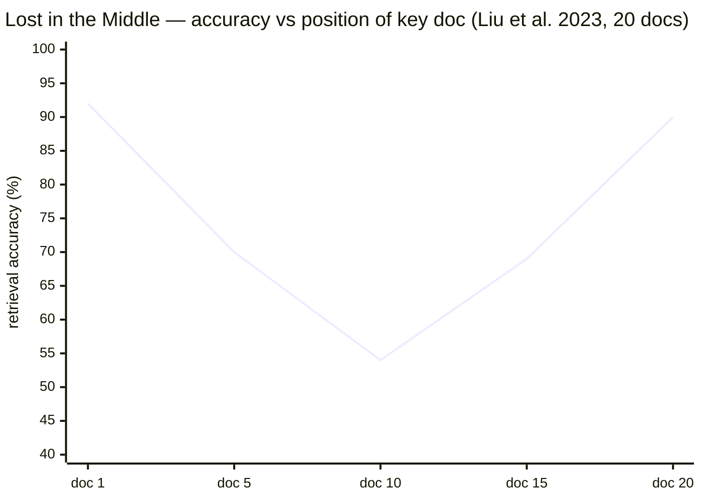

# Context Engineering

## 1. Concept Overview

Context engineering is the discipline of deciding *what information to place in the context window,
where to place it, and how much of it to include* — to maximize model performance while respecting
token budgets and latency constraints. It sits between prompt engineering (designing instructions)
and RAG (retrieving documents) and addresses the meta-level problem: given a fixed context budget,
how do you allocate it optimally across system instructions, tools, retrieved content, memory,
conversation history, and scratchpad space?

The practical need arises because modern models have context windows from 128k (GPT-4o) to 1M+
(Gemini 1.5 Pro) tokens, but larger context does not uniformly improve performance — there are
reliability, cost, and latency penalties. Context engineering produces the smallest, most
signal-dense context that answers the question.

**Cost anchor:** At GPT-4o rates ($2.50/1M input tokens), a 100k-token context at 10 queries per
second costs $2.50/second in input tokens alone — $9,000/hour. Even with prompt caching, the
uncached portion grows with every conversation turn. Context engineering is simultaneously a
quality and a cost discipline.

---

## 2. Intuition

**One-line analogy:** Context engineering is like briefing a consultant before a meeting — you
choose what documents to hand them, how much background to explain, and what to leave out, because
giving them everything wastes time and buries the key facts.

**Mental model:** Think of the context window as a finite whiteboard. Different zones serve
different purposes: the top-left corner (system prompt) is always visible and sets ground rules;
the bottom-right corner (most recent user message) gets the most attention; the middle is where
conversation history and retrieved documents fight for space. Effective context engineering is
whiteboard management: put the most important things where attention is strongest, ruthlessly evict
what does not earn its space.

**Why it matters:** The "lost in the middle" phenomenon (Liu et al., 2023) shows that information
placed in the middle of a long context is reliably less attended to than information at the start
or end. Naive RAG that dumps 20 retrieved chunks into the middle of the context loses quality even
though technically "all the information is there." Context engineering is the fix.

**Key insight:** Token position matters as much as token content. A 500-token summary placed at
the front of context often outperforms a 2,000-token verbatim document placed in the middle.

---

## 3. Core Principles

**Budget awareness.** Before constructing any context, define a token budget and allocation per
zone. Never fill the context reactively; fill it proactively within defined bounds.

**Positional primacy.** The most critical information goes at the start (system prompt) or end
(latest user message + most recent retrieved context). Deprioritize the middle for static,
low-information content.

**KV-cache alignment.** Content that is stable across many requests (system prompt, tool
definitions, few-shot examples) should appear at the front of the context and remain unchanged so
the KV cache can serve it cheaply. Changing this prefix forces a cache miss. See
[LLM Caching](../llm_caching/README.md) for provider prefix-caching mechanics.

**Signal density over completeness.** A compressed summary often outperforms the verbatim source.
LLMs extract signal well from dense summaries; they attend poorly to all 10,000 tokens of a long
document simultaneously.

**Graceful degradation.** When the context overflows, the policy for what to drop matters. Drop
from the middle, not from the start or end. Drop oldest conversation turns before dropping
retrieved context. Never drop the system prompt or the current user query.

---

## 4. Types / Strategies

**Context zone allocation framework:**

| Zone | Content | Typical Token Allocation |
|------|---------|--------------------------|
| System instructions | Role, rules, output format | 200-500 tokens |
| Tool definitions | JSON function schemas | 200-2,000 tokens (scales with tool count) |
| Few-shot examples | 2-5 input/output examples | 500-2,000 tokens |
| Retrieved documents | RAG chunks, search results | 1,000-20,000 tokens |
| Conversation history | Prior turns (compressed) | 1,000-10,000 tokens |
| Working memory / scratchpad | Intermediate agent state | 500-5,000 tokens |
| Current user message | The actual query | 50-500 tokens |

**Retrieval vs long context vs fine-tuning decision matrix** (mechanics of each side:
[RAG Fundamentals](../rag_fundamentals/README.md),
[Context Windows & Long Context](../context_windows_and_long_context/README.md)):

| Scenario | Best approach | Reason |
|----------|--------------|--------|
| Large knowledge base (>100M tokens), frequently updated | RAG | Cannot fit in context; updates need immediate availability |
| Medium corpus (<200k tokens), infrequently updated | Long context | Simpler; no retrieval errors; all context always available |
| Domain-specific style/format required | Fine-tuning | Style is not a retrieval problem; it needs to be baked in |
| Specific facts that must always be present | System prompt | Retrieval may miss; embed directly |
| Long multi-step conversation | Conversation compaction | Summarize old turns rather than truncate |

**Compaction strategies:**

- *Sliding window* — keep only the last N turns verbatim, drop older ones entirely.
- *Hierarchical summarization* — summarize old turns progressively; oldest turns are most
  compressed.
- *Entity-centric compression* — extract entities and facts from old turns, store as a structured
  summary, discard raw text.
- *Importance scoring* — score each message for relevance to the current query; keep top-k by
  score.

---

## 5. Architecture Diagrams

```
Context Budget Allocation (32k window example)
================================================

32,000 tokens total
|
+--[0]------------------[3,000] System prompt (stable, cached)
|
+--[3,000]-------------[5,000] Tool definitions (stable, cached)
|
+--[5,000]-------------[7,000] Few-shot examples (stable, cached)
|
+--[7,000]-------------[14,000] Retrieved context (dynamic)
|                               Top-4 ranked chunks @ 1,750 tokens avg
|
+--[14,000]------------[20,000] Conversation history (compressed)
|                               Last 6 turns verbatim (3,000)
|                               Older turns as entity-centric summary (3,000)
|
+--[20,000]------------[20,500] Current user message
|
+--[20,500]------[32,000] Reserve (model output headroom + safety)
```



The U-curve (Liu et al. 2023, 20-document retrieval setting): accuracy is ~92% when the key
fact is in the first document and ~90% in the last, but drops to ~54% in the middle — exactly
where naive RAG lands its retrieved docs (after 14k tokens of system+history), so critical
facts there go unnoticed. Fix: place the most critical retrieved chunks BEFORE conversation
history, immediately after the stable prefix.

```
Context Engineering Pipeline (per request)
============================================

 Incoming request
       |
       v
 Budget planner
 +-------------------------------------------+
 | total_budget = 32,000                     |
 | system_zone = 3,000 (fixed)               |
 | tools_zone = 2,000 (fixed, RAG-retrieved) |
 | few_shot_zone = 2,000 (fixed)             |
 | retrieval_zone = 7,000 (dynamic)          |
 | history_zone = 6,000 (with compaction)    |
 | user_msg_zone = 500 (current turn)        |
 | output_reserve = 4,000+                   |
 +-------------------------------------------+
       |
       v
 Tool retrieval (RAG over tool definitions)
 (only include tools relevant to this query)
       |
       v
 History compactor
 (summarize if history > 6,000 tokens)
       |
       v
 Document retrieval + reranker
 (fetch top-k, trim to retrieval_zone)
       |
       v
 Context assembler
 Order: system -> few-shot -> retrieved -> history -> user
       |
       v
 Token counter — abort if over budget
       |
       v
 LLM call
```

---

## 6. How It Works — Detailed Mechanics

### Token budget enforcement

```python
import tiktoken
from dataclasses import dataclass

ENCODER = tiktoken.encoding_for_model("gpt-4o")

@dataclass
class ContextBudget:
    total: int = 32_000
    system: int = 3_000
    tools: int = 2_000
    few_shot: int = 2_000
    history: int = 6_000
    retrieved: int = 7_000
    user_msg: int = 500
    output_reserve: int = 4_000

def count_tokens(text: str) -> int:
    return len(ENCODER.encode(text))

def build_context(
    system: str,
    few_shot: list[dict],
    history: list[dict],
    retrieved_chunks: list[str],
    user_message: str,
    budget: ContextBudget = ContextBudget(),
) -> list[dict]:
    messages: list[dict] = []

    # System prompt — always first (KV-cache stable prefix)
    sys_tokens = count_tokens(system)
    if sys_tokens > budget.system:
        raise ValueError(f"System prompt {sys_tokens}t exceeds budget {budget.system}t")
    messages.append({"role": "system", "content": system})

    # Few-shot examples (stable, after system — cache-friendly)
    few_shot_used = 0
    for ex in few_shot:
        tokens = count_tokens(ex["input"]) + count_tokens(ex["output"])
        if few_shot_used + tokens > budget.few_shot:
            break
        messages.extend([
            {"role": "user",      "content": ex["input"]},
            {"role": "assistant", "content": ex["output"]},
        ])
        few_shot_used += tokens

    # Retrieved context — BEFORE history to avoid "lost in the middle"
    retrieved_used, retrieved_text = 0, ""
    for chunk in retrieved_chunks:  # pre-sorted by relevance score desc
        t = count_tokens(chunk)
        if retrieved_used + t > budget.retrieved:
            break
        retrieved_text += chunk + "\n\n"
        retrieved_used += t
    if retrieved_text:
        messages.append({
            "role": "system",
            "content": f"Relevant context:\n\n{retrieved_text.strip()}"
        })

    # Conversation history — compressed sliding window
    history_used, trimmed = 0, []
    for turn in reversed(history):  # newest first
        t = count_tokens(turn["content"])
        if history_used + t > budget.history:
            break
        trimmed.insert(0, turn)
        history_used += t
    messages.extend(trimmed)

    # Current user message — always last
    messages.append({"role": "user", "content": user_message})

    total = sum(count_tokens(m["content"]) for m in messages)
    if total + budget.output_reserve > budget.total:
        raise ValueError(f"Context {total}t + output reserve {budget.output_reserve}t > budget {budget.total}t")

    return messages
```

### KV-cache-aware ordering (broken vs fixed)

```python
# BROKEN: dynamic content in the stable prefix breaks cache every request
def broken_build(user_id: str, system_base: str, user_msg: str) -> list[dict]:
    return [
        # user_id in system prompt -> unique prefix per user -> cache miss every time
        {"role": "system", "content": f"{system_base}\n\nUser ID: {user_id}"},
        {"role": "user",   "content": user_msg},
    ]

# FIX: stable prefix first; dynamic user-specific data injected in the user turn
def fixed_build(user_id: str, system_base: str, user_msg: str) -> list[dict]:
    return [
        # Stable across all users — cached by provider
        {"role": "system", "content": system_base},
        # Dynamic — after the cached prefix; does not invalidate the cache
        {"role": "user",   "content": f"[user_id={user_id}]\n{user_msg}"},
    ]
```

### Entity-centric history compaction

```python
from openai import OpenAI

client = OpenAI()

def compact_history(turns: list[dict], max_tokens: int = 500) -> str:
    """Summarize old turns into a structured entity/fact summary."""
    conversation_text = "\n".join(
        f"{t['role'].upper()}: {t['content']}" for t in turns
    )
    summary = client.chat.completions.create(
        model="gpt-4o-mini",
        messages=[{
            "role": "user",
            "content": (
                "Extract key entities, decisions, and constraints from this "
                "conversation. Output as a concise bullet list. Be specific — "
                "preserve names, numbers, and agreed constraints.\n\n"
                f"{conversation_text}"
            )
        }],
        max_tokens=max_tokens,
    ).choices[0].message.content
    return f"[Prior conversation summary]\n{summary}"
```

---

## 7. Real-World Examples

**Cursor (AI code editor)** uses a layered context strategy: editor configuration and language
server output are at the front (cached); recent file edits are retrieved by recency and relevance;
the cursor position (current user query) is always last. Approximately 70% of input tokens are
served from the KV cache even for novel queries.

**Perplexity AI** compresses conversation history aggressively after 4 turns: older turns are
summarized to a 2-sentence entity-and-intent summary. This keeps context under 8k tokens for most
queries while preserving the key facts from earlier in the session.

**Anthropic extended thinking** uses a designated scratchpad zone at the end of the context that
is allocated specifically for chain-of-thought. The budget for this zone is separate from the
user-visible response budget, ensuring reasoning tokens do not compete with context tokens.

---

## 8. Tradeoffs

| Decision | Option A | Option B | Key Factor |
|----------|----------|----------|-----------|
| Retrieved context size | More chunks (higher recall) | Fewer chunks (less noise) | "Lost in middle" risk; reranking quality |
| History strategy | Full verbatim (faithful) | Compressed summary (cost-efficient) | Turn count; session length |
| Critical info position | Start/end (attended) | Middle (ignored) | Attention distribution |
| RAG vs long context | RAG (dynamic, cost-efficient) | Long context (simple, no retrieval errors) | Corpus size; update frequency; latency |
| Fine-tune vs context | Fine-tune (style baked in) | Context injection (flexible) | Style stability; data volume |
| KV-cache prefix | Stable (maximizes cache hits) | Dynamic (maximizes freshness) | Cache hit rate vs personalization |

---

## 9. When to Use / When NOT to Use

**Apply context engineering when:**
- Agent produces inconsistent results despite correct retrieval — the issue is likely positional.
- Latency or cost are too high and context windows are large (consistently >16k tokens).
- Conversation history grows unbounded and causes context overflow in production.
- Multiple information sources (tools, RAG, memory, history) compete for the same token budget.
- Model frequently ignores critical instructions — they may be buried in the middle.

**Simplify or skip when:**
- Context is always small (<4k tokens) and fits easily.
- Single-turn QA with no history, minimal retrieval.
- Fine-tuning is the right solution (style/format, not knowledge recall).
- Still in early experimentation — establish correctness before optimizing context layout.

---

## 10. Common Pitfalls

**Pitfall 1 — Naive RAG dumps all retrieved chunks in the middle.** Ten 1,000-token chunks placed
after 5,000 tokens of conversation history means the most relevant content lands at position 15,000
in the context. "Lost in the middle" guarantees the model under-uses them. Fix: place top-ranked
retrieved chunks at the start of the dynamic portion of context, just after the stable prefix.

**Pitfall 2 — Dynamic content in the stable prefix breaks KV cache.** Any per-request variation
(user ID, timestamp) embedded in the system prompt creates a unique prefix every request, defeating
prefix caching and adding full input cost. Fix: separate stable system instructions from dynamic
user-context; inject dynamic data in a user turn, after the stable prefix.

**Pitfall 3 — No budget enforcement.** Context grows with conversation length until the model
throws a context-length error in production. Fix: define explicit per-zone budgets and enforce them
in the context assembler; truncate predictably rather than crashing.

**Pitfall 4 — Over-compressing history.** Summarizing too aggressively loses facts the model needs
for consistency (user's name, agreed-upon constraints, earlier decisions). Fix: use entity-centric
compression — extract and preserve key entities and facts in a structured summary rather than a
free-form summary that may drop specifics.

**Pitfall 5 — Tool definition bloat.** Including 50 tool schemas in every request costs 5,000+
tokens even when 45 of those tools will never be called. Fix: use tool selection at scale — retrieve
the relevant tool definitions as a RAG lookup before constructing the context.

**Pitfall 6 — No output reserve.** Filling the context to the maximum input limit leaves no room
for the model's output, causing truncated responses. Always reserve 20-30% of the context window
for output, especially for tasks that generate long structured responses.

---

## 11. Technologies & Tools

| Tool | Purpose |
|------|---------|
| tiktoken / tokenizers | Token counting for budget enforcement |
| LangGraph | Stateful context management for multi-turn agents |
| LangChain ConversationSummaryMemory | Rolling conversation compaction |
| LLMLingua / LLMLingua-2 | Neural prompt compression for long retrieved docs |
| instructor / guidance | Structured output to reduce verbose output tokens |
| vLLM / SGLang | KV-prefix caching for stable context prefixes |
| Anthropic prompt caching | Provider-level prefix caching (cache_control: ephemeral) |
| ContextCite | Attribution — which context tokens influenced the output |
| RAGAS | Evaluate faithfulness — how well the model used retrieved context |

---

## 12. Interview Questions with Answers

**What is context engineering and how does it differ from prompt engineering?**
Prompt engineering designs the instructions and format for a single prompt. Context engineering is
the broader discipline of deciding what information to include in the context window, how much of
each type, and in what order — across system prompt, tools, memory, retrieved documents, history,
and current message. Prompt engineering is about what to say; context engineering is about what to
include and where to put it.

**What is the "lost in the middle" problem and how do you address it?**
Liu et al. (2023) showed that LLMs reliably attend to information at the start and end of the
context but under-attend to information in the middle. Content at position 10k in a 20k-token
context is much less likely to influence the output than the same content placed at position 500.
The fix is positional placement: put the most critical retrieved chunks and instructions at the top
(after the system prompt) and the current user query at the end. Avoid sandwiching critical
information between long conversation history and verbose tool outputs.

**Does a 1M-token context window make RAG and context engineering obsolete?**
No — a large window changes the tradeoff but does not remove it. Three costs remain: money
(filling 1M tokens per request costs orders of magnitude more than retrieving a targeted 5k-token
subset), latency (prefill time grows roughly linearly with input length, so a 500k-token prompt
adds tens of seconds before the first output token), and quality ("lost in the middle" degradation
persists at long lengths, and needle-in-a-haystack scores overstate real multi-fact reasoning
performance). Treat a long context as a larger budget to allocate, not a license to stop
allocating.

**Why can adding more retrieved chunks make answers worse, not better?**
Because every extra chunk adds distractors that compete for attention with the relevant one. Going
from top-4 to top-20 chunks raises recall slightly but pushes the best chunks deeper toward the
middle of the context and increases the chance the model quotes a near-miss passage — retrieval
noise compounds with the positional attention dip. The production pattern is retrieve wide, then
rerank and keep a small k (3-8 chunks): reranking buys the recall without paying the context-noise
tax. When answers start citing the wrong document, reduce k before touching the prompt.

**How do you decide between RAG, long context, and fine-tuning for a knowledge-intensive task?**
RAG is the default for large, frequently updated knowledge bases (>1M tokens) that cannot fit in
context. Long context is better when the corpus is small (<200k tokens), update frequency is low,
and retrieval errors are costly — document review, contract analysis, codebase chat. Fine-tuning
addresses style, format, and domain-specific vocabulary rather than knowledge recall; if you need
the model to know a specific fact reliably, RAG or long context is more reliable. Cost is also a
factor: long context at 100k tokens per request is expensive at scale; RAG retrieves a targeted
subset.

**How do you design a context budget for an agent with tools, memory, and RAG?**
Define a total budget (e.g., 32k tokens) and allocate hard limits per zone: system ~10%, tools ~8%,
retrieved ~25%, history ~20%, current message ~2%, output reserve ~15%. Enforce these limits in the
context assembler before the LLM call. The key policy decision is drop priority: when a zone is
over budget, drop retrieved chunks from the bottom of the ranked list first (least relevant), then
compress old history turns. Never drop the system prompt or the current user query.

**Why does KV cache matter for context engineering, and how do you design for it?**
KV cache stores the key/value attention tensors for the prefix of a context; if the same prefix
appears in a later request, the model skips re-computing those layers, reducing latency and cost by
50-90% for that prefix. To maximize hit rate: keep stable content (system prompt, tool definitions,
few-shot examples) at the front of every request unchanged. Any dynamic content goes after the
stable prefix so it does not invalidate the cached portion. Anthropic cache_control and vLLM
automatic prefix caching both work on this principle.

**How does provider prompt caching pricing change how you lay out context?**
It makes the stable prefix literally cheaper, not just faster. Anthropic prompt caching charges
roughly 25% extra to write a cache segment and about 90% less to read it (5-minute default TTL),
and OpenAI applies an automatic ~50% discount to cached prefixes of 1,024+ tokens — so a
5,000-token system-plus-tools prefix reused across requests costs a fraction of its nominal price.
This flips the economics of few-shot examples: a large stable example block is nearly free after
the first request, while the same tokens placed after dynamic content are billed in full every
time. Design rule: order zones by volatility — least-changing first — and never interleave
per-request data into the cached prefix.

**How do you engineer context for sub-agent architectures?**
Give each sub-agent a fresh, minimal window and pass results back as compact summaries — context
isolation is the point of delegating to sub-agents. The orchestrator's context holds the plan and
each sub-agent's summarized findings (typically 200-500 tokens each), not raw transcripts: a
sub-agent that read 50k tokens of documents returns a 300-token digest, keeping the orchestrator's
window flat as the task grows. The failure mode is "context re-centralization" — forwarding full
sub-agent transcripts upward recreates the overflow you delegated to avoid. Define an explicit
return-format contract (findings, citations, confidence) for every sub-agent.

**What is context compaction and when should you apply it?**
Compaction is reducing the token count of conversation history or retrieved context through
summarization, entity extraction, or selective truncation. Apply it when conversation history
exceeds the history budget (typically after 10-15 turns) or when a retrieved document is longer
than its allocated zone. The compaction strategy matters: naive truncation loses continuity;
hierarchical summarization preserves key facts; entity-centric compression (extract names,
decisions, constraints) is the most faithful for long-term consistency.

**How do tool definitions affect context budget and what do you do with 50+ tools?**
Each JSON tool definition costs 100-300 tokens. At 50 tools, that is 5,000-15,000 tokens before
the user query is even processed — in a 32k context, 15-45% of the budget. The solution is tool
retrieval: embed all tool descriptions, then at query time retrieve the top-k most relevant tools
(k = 5-10) and include only those in the context. This "RAG for tools" adds 10-50ms latency but
saves thousands of tokens per request, improving both cost and model focus.

**What is the difference between conversation compaction and a simple sliding window?**
A sliding window keeps the last N turns verbatim and drops older turns entirely. This is simple
but loses facts from early in the conversation (user's stated goal, agreed constraints, established
context). Compaction preserves the semantic content of dropped turns by summarizing them before
discarding. The most important case is multi-turn agents: if turn 3 established "the user wants a
Python solution" and turns 4-25 are problem-solving, a sliding window that drops turn 3 causes the
agent to forget the constraint by turn 26.

**How do you test and measure context engineering decisions?**
Measure retrieval faithfulness (RAGAS faithfulness score), answer relevancy, and position-ablation:
run the same query with critical information at the start vs. the middle vs. the end of context and
compare output quality. For agents, measure task completion rate against context budget (does
success rate hold as history grows?). Track token costs per request in production; a spike in
input tokens often signals context budget enforcement failures.

**What is LLMLingua and when is neural prompt compression worth the overhead?**
LLMLingua uses a small language model to identify and remove low-perplexity (redundant) tokens
from retrieved documents while preserving high-information tokens. It achieves 3-20x compression
with minimal quality loss. It is useful when retrieved documents are long and verbatim inclusion
exceeds the retrieval budget (legal documents, academic papers). The tradeoff is 50-200ms
compression latency and a small quality drop on edge cases where compressed sentences lose
connective tissue. For short, precise chunks (<1,000 tokens), chunking at retrieval time is faster;
LLMLingua shines on long verbatim documents.

**Does structural formatting (XML tags, markdown headers) actually change how the model uses context?**
Yes — clear delimiters help the model locate and attribute sections, which matters most in crowded
contexts. Wrapping retrieved documents in tags like `<doc id="3">...</doc>` improves the model's
ability to cite the right source and reduces bleed-over between adjacent chunks; Anthropic
explicitly recommends XML tags for section boundaries, and structured markdown headers serve the
same role for GPT-family models. Formatting costs tens of tokens, trivial relative to its effect
on faithfulness in multi-document prompts. Standardize one delimiter scheme per application and
keep it byte-identical across requests so it lives inside the cached prefix.

**What is context rot and how do you mitigate it in long agent sessions?**
Context rot is the gradual quality decline in long-running sessions as the window fills with stale
tool outputs, dead-end reasoning, and superseded facts — the model keeps attending to obsolete
content even well below the hard token limit. Symptoms: the agent retries abandoned approaches,
cites outdated intermediate values, or contradicts recent corrections. Mitigations: periodic
compaction that rewrites the session into a clean state summary (decisions made, current plan,
open items) and drops raw history; truncating verbose tool outputs at write time; and hard
eviction of superseded results rather than appending corrections after them. Schedule compaction
proactively — every 20-30 turns or at 60-70% window fill — instead of waiting for overflow.

---

## 13. Best Practices

- Define explicit per-zone token budgets before writing any context assembly code; enforce them
  with a token counter in the assembler.
- Place stable content (system prompt, tool definitions, few-shot examples) at the front of every
  request unchanged — this is the KV-cache-friendly prefix.
- Place the most critical retrieved chunks immediately after the stable prefix, not after
  conversation history.
- Always reserve 20-30% of the context window for model output; fill-to-limit causes truncated
  responses.
- Use entity-centric compaction for long conversations; sliding-window truncation loses early
  session facts.
- Profile context composition in production: track per-zone token usage and KV-cache hit rates on
  every request.
- Use tool retrieval (RAG-over-tools) once you have more than 10-15 tools.
- Test context layout changes with position-ablation experiments before deploying to production.

---

## 14. Case Study

**Problem Statement**

An enterprise legal research agent achieves 92% task completion on single-document questions but
drops to 61% on multi-document questions requiring synthesis of information from 5+ retrieved
documents. Context window is 128k tokens (GPT-4o); total context used is 90k tokens. Analysis
reveals all 5 documents are placed after 40k tokens of system prompt + conversation history.

**Architecture Overview**

```
Before (broken context layout):
=================================
[0 – 3,000]     System prompt
[3,000 – 18,000]  Tool definitions (15 schemas, all included)
[18,000 – 40,000]  Conversation history (22 turns verbatim)
[40,000 – 90,000]  5 retrieved legal documents (10k tokens each)
[90,000 – 90,200]  Current question
                     ^ Documents at position 40k-90k: "lost in the middle"

After (context engineering):
==============================
[0 – 3,000]     System prompt
[3,000 – 6,000]   Top-3 tool definitions (RAG-over-tools, 3 of 15)
[6,000 – 31,000]  Top-5 retrieved documents (placed BEFORE history)
[31,000 – 37,000]  Compressed history (22 turns -> entity-centric summary)
[37,000 – 37,200]  Current question
Output reserve: 90,800 tokens
```

**Key Design Decisions**

Tool retrieval: cuts tool zone from 15,000 to 3,000 tokens. Retrieved documents moved before
history: position shifts from 40k-90k to 6k-31k (peak attention zone). History compressed from
22k to 6k tokens via entity-centric summarization (names of documents reviewed, agreed legal
theories, prior questions answered).

**Tradeoffs and Alternatives**

Considered always putting all 15 tool schemas at the front but the 12,000 extra tokens would push
documents further into the middle. Considered removing conversation history entirely but the agent
needed continuity for long research sessions spanning 20+ turns.

**Interview Discussion Points**

- Total context dropped from 90k to 37k tokens: what other benefits does this produce? (Lower
  latency, lower cost, larger output reserve for longer reasoning.)
- How do you handle a legal document longer than the 25k-token retrieval budget? (Chunk it; use
  LLMLingua compression; retrieve targeted sections via a secondary retrieval step.)
- Task completion on multi-document questions: 61% → 89%. Why not 100%? (Some questions require
  information genuinely not in any retrieved document; that is a retrieval problem, not a context
  engineering problem.)
