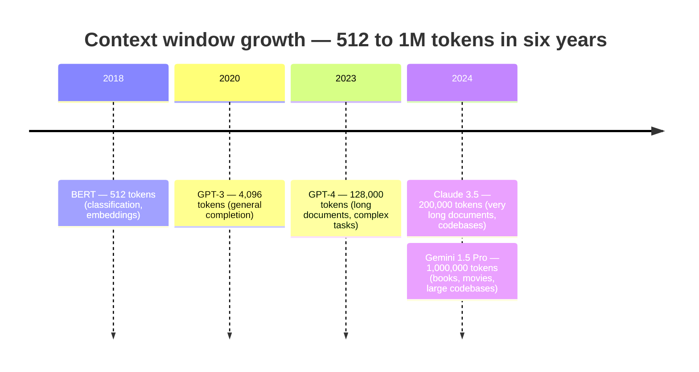
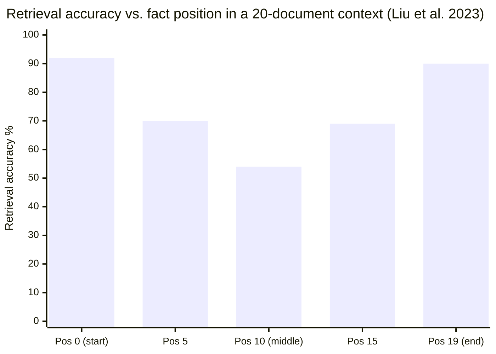
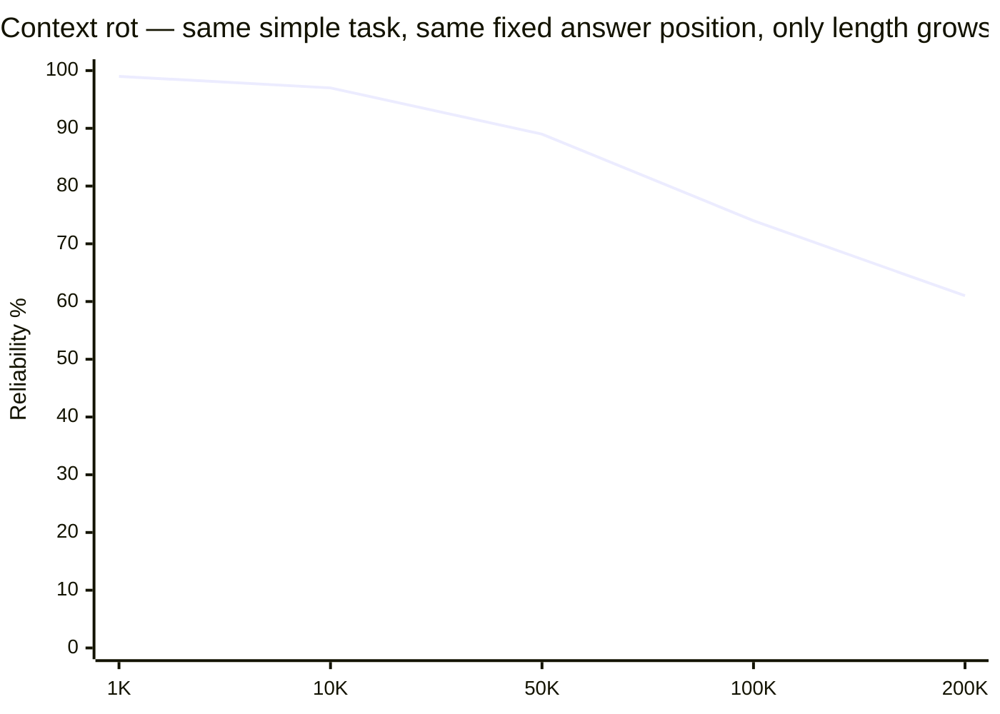

# Context Windows & Long Context

## 1. Concept Overview

The context window is the maximum number of tokens an LLM can process in a single forward pass — including both input and output. Early LLMs had 2K-4K context; modern models support 128K (LLaMA 3), 200K (Claude), up to 1M (Gemini 1.5 Pro). This expansion has fundamentally changed what LLM systems can do: process entire codebases, hour-long conversations, entire books, or multiple lengthy documents simultaneously.

Long context creates both opportunities (simpler architecture — just put everything in context) and challenges (quadratic attention cost, "lost in the middle" phenomenon, higher token costs, and the ongoing debate: when should you use long context vs. RAG?).

---

## 2. Intuition

> **One-line analogy**: The context window is like working memory — the more you can hold in mind at once, the more sophisticated the reasoning you can do, but filling it up gets exponentially expensive.

**Mental model**: An LLM can only "see" what's in its context window. 4K tokens (GPT-3) = a few pages; 200K (Claude) = an entire book. Bigger context enables richer reasoning but costs quadratically more compute (O(n²) attention). The "lost in the middle" effect means models attend less to information buried in the middle of long contexts. Long context is simpler to build with (just stuff everything in) but expensive and imperfect; RAG is efficient but retrieval can miss the right context.

**Why it matters**: Long context changes what LLM systems can do — entire codebases, full legal contracts, complete conversation histories become accessible. But the cost structure matters: 200K tokens × $0.003/1K = $0.60 per query. For high-frequency applications, that cost is prohibitive and RAG is necessary.

**Key insight**: Long context and [RAG](../rag_fundamentals/README.md) are not competing approaches but complementary tools — use RAG for large corpora and cost sensitivity, use long context for holistic reasoning, and use both together (retrieve relevant chunks → put them in long context) for the best results.

---

## 3. Core Principles

- **Attention is O(n²)**: Standard attention grows quadratically with sequence length — 4× longer sequence = 16× compute. Optimizations (Flash Attention, GQA, ring attention) are critical.
- **Positional encoding determines extrapolation**: Models trained on 4K context don't automatically generalize to 128K. Positional encoding design determines how well models extrapolate.
- **"Lost in the middle"**: Models pay more attention to the beginning and end of long contexts; information in the middle receives less attention. Critical information should be at the extremes.
- **Long context ≠ perfect recall**: Even 1M context models can miss information. Performance degrades with input length.
- **"Context rot" (Chroma, 2025)**: Reliability degrades non-uniformly as input length grows — even on simple tasks with no "needle" to find, and even when the relevant information sits at a fixed, favorable position. This is distinct from "lost in the middle" (a *positional* effect at fixed length): context rot is a *length* effect — the same task at the same position gets less reliable purely because the surrounding context got longer.
- **Long context vs. RAG tradeoff**: Putting everything in context is simpler but more expensive; RAG is more efficient but more complex.

---

## 4. Positional Encoding Strategies

### 4.1 Absolute Positional Encoding (APE)

Original transformer approach: add learned or sinusoidal position vectors to token embeddings:

```
Input embedding: token_embedding + position_embedding[position]
position_embedding: shape [max_length × d_model]

Sinusoidal: PE(pos, 2i) = sin(pos / 10000^(2i/d_model))
            PE(pos, 2i+1) = cos(pos / 10000^(2i/d_model))

Problem: model trained on 512 tokens has no embedding for position 513
  → Cannot extrapolate beyond training length at all
Used by: BERT, original GPT
```

**The idea behind it.** "Stamp every position with a bundle of sine waves running at
wildly different speeds — fast waves that tick over every few tokens, slow waves that barely
move across the whole sequence — so each position gets a unique fingerprint."

It is an odometer. The rightmost digit spins fast, the leftmost digit spins slowly, and the
combination is unique. That "spectrum of speeds" idea is the single most important thing to
carry forward, because RoPE (§4.3) reuses the exact same `10000^(2i/d)` spectrum — it just
applies it as a rotation instead of an addition.

| Symbol | What it is |
|--------|------------|
| `pos` | Which token slot this is: 0, 1, 2, ... |
| `i` | Which *pair* of embedding dimensions. `2i` and `2i+1` are the sin/cos partners |
| `d_model` | Embedding width, e.g. 512. Sets how many pairs exist (`d_model/2`) |
| `10000^(2i/d_model)` | The wavelength scale for pair `i`. Grows from 1 to ~10,000 |
| `pos / 10000^(2i/d)` | The angle fed to sin/cos. Big scale = slow-moving angle |
| `PE(pos, 2i)` | The value written into dimension `2i` of the position vector |

**Walk one example.** `d_model = 512`, so `i` runs 0 to 255. Watch the wavelength explode:

```
    i     2i/d_model    10000^(2i/d)      angle per token     wavelength (tokens)
    0       0.000            1.0            pos / 1              6.3
   64       0.250           10.0            pos / 10            62.8
  128       0.500          100.0            pos / 100          628
  255       0.996        ~9,820             pos / 9820      ~61,700

  wavelength = 2 * pi * scale, e.g. i=128 -> 2 * 3.1416 * 100 = 628 tokens
```

Dimension pair 0 completes a full cycle every ~6 tokens — it says "am I odd or even, roughly
here". Dimension pair 255 completes a cycle every ~61,700 tokens — it says "am I near the front
or the back of the whole document". Read together, they pin down `pos` exactly.

**Why it still cannot extrapolate.** The sinusoid itself is defined for any `pos`, so you *can*
evaluate position 5000 on a 512-trained model. The failure is that the model's attention weights
never saw those angle combinations and have no idea what to do with them — plus in the *learned*
APE variant there is literally no row 513 in the `[max_length x d_model]` table. Remove nothing
and it still breaks; this is the gap RoPE and ALiBi were invented to close.

### 4.2 Relative Positional Encoding (RPE)

Encode relative distance between positions rather than absolute:

```
Attention weight: A(i,j) ∝ (q_i + r_{i-j})^T k_j

r_{i-j}: learned embedding for the relative distance (i-j)
  r_0: same position
  r_1: adjacent
  r_10: 10 positions apart
  r_{-5}: 5 positions before

Benefits: position patterns generalize better; model sees "how far apart" not "where"
Problem: still needs learned embeddings for all distances seen in training
Used by: T5, DeBERTa
```

**Stated plainly.** "Before token `i` scores token `j`, hand it a little note saying
how far apart they are — and let the model learn one note per distance."

The shift from "where am I" to "how far apart are we" is the whole point. A pattern like "the
subject is usually 3 tokens before the verb" is now learnable *once*, instead of separately at
every absolute position in the document.

| Symbol | What it is |
|--------|------------|
| `A(i,j)` | The pre-softmax attention score from query token `i` to key token `j` |
| `q_i` | Query vector of the token doing the looking |
| `k_j` | Key vector of the token being looked at |
| `i - j` | Signed distance. Positive = `j` is behind me; negative = ahead of me |
| `r_{i-j}` | Learned vector for that exact distance. One per distance bucket |
| `(...)^T k_j` | Dot product — the standard "how well do these match" score |
| `∝` | Ignoring the `1/sqrt(d)` scaling factor, which does not change the idea |

**Walk one example.** Query at position 12 attends to three keys:

```
    key at j     i - j     which r is used     meaning
       12          0            r_0            "this is me"
       11         +1            r_1            "the token just before me"
        2        +10            r_10           "ten tokens back"

  score to j=11 = (q_12 + r_1)^T  k_11
  score to j=2  = (q_12 + r_10)^T k_2

  Now move the whole sentence to position 512:
  score to j=511 = (q_512 + r_1)^T k_511   <- SAME r_1, same learned behaviour
```

**Why this term exists.** Delete `r_{i-j}` and attention becomes fully order-blind: `q^T k` alone
cannot tell "dog bites man" from "man bites dog". The catch is that `r` is a lookup table of
learned vectors, so a distance of 5,000 tokens has no entry if training never exceeded 512 — the
same wall APE hits, just moved from absolute positions to distances.

### 4.3 RoPE (Rotary Position Embedding)

The dominant approach in modern LLMs. Encodes position as rotation in complex number space:

```
Key idea: Rotate query and key vectors by their positions
  The dot product q_m^T k_n depends only on (m-n) — relative position!

Formula:
  RoPE(x, position) = x ⊗ cos(θ × position) + x̃ ⊗ sin(θ × position)
  where x̃ is x with alternating pairs swapped, θ_i = 10000^(-2i/d)

Properties:
  - Dot product naturally encodes relative positions
  - Extrapolates better than learned positional embeddings
  - Computationally efficient (just multiply)

Long-context extensions:
  YaRN: dynamic scaling; best for extrapolation beyond training length
  LongRoPE: progressive scaling; handles 2M context
  RoPE scaling (simple): compress positions by constant factor to fit longer sequences
    e.g., scale_factor=4 → treat 4K-context model as 16K-context model

Used by: LLaMA (all versions), Mistral, Qwen, DeepSeek, most modern models
```

**What the formula is telling you.** "Chop the embedding into 2D pairs and physically *spin* each
pair by an angle proportional to the token's position. Because spinning two vectors and then
dotting them gives an answer that depends only on the difference of their angles, attention
automatically sees DISTANCE APART and never absolute position."

That last clause is the entire reason RoPE won. Nothing in the formula stores "position 4,096";
the position information lives in a rotation that cancels down to `(m - n)` the moment a query
meets a key. There is no lookup table to run off the end of.

**The clock-hands picture.** Think of each 2D pair as one hand on a clock face, and the token's
position as the time. Pair `i = 0` is the second hand — it whips around once every ~6 tokens.
The last pair is the hour hand — one slow revolution across the whole document. Read one hand
and you know position only modulo its own cycle; read all 64 hands together and the position is
pinned down exactly. `θ_i = 10000^(-2i/d)` is nothing more than the gear ratio between the hands.

| Symbol | What it is |
|--------|------------|
| `x` | The query or key vector, read as `d/2` consecutive 2D pairs `(x_0,x_1), (x_2,x_3), ...` |
| `position` | Token index `m`. Also written `m` for the query and `n` for the key |
| `θ_i` | Rotation speed of pair `i`, in radians per token. Big = fast hand |
| `i` | Which pair, `0` to `d/2 - 1`. Low `i` = fast/local, high `i` = slow/global |
| `d` | Head dimension, e.g. 128. So 64 pairs, 64 clock hands |
| `10000` | Base frequency. Sets the spread between fastest and slowest hand |
| `⊗` | Multiply matching slots, no summing. Not a matrix product |
| `x̃` | `x` with each pair swapped and the first sign-flipped: `(-x_1, x_0, -x_3, x_2, ...)` |
| `θ × position` | The rotation angle for this pair at this token, in radians |
| `q_m^T k_n` | Attention score between query at `m` and key at `n` |
| `(m - n)` | The distance between the two tokens — all the score ends up depending on |

**Walk one example — the spectrum of speeds.** Head dimension `d = 128`, so `i` runs 0 to 63:

```
     i     -2i/d      theta_i = 10000^(-2i/d)      wavelength = 2*pi / theta_i
     0     -0.000            1.0                         6.3 tokens
    16     -0.250            0.1                        62.8 tokens
    32     -0.500            0.01                      628   tokens
    48     -0.750            0.001                   6,283   tokens
    63     -0.984            0.000115               54,600   tokens

  worked: i = 32 -> 10000^(-0.5) = 1/sqrt(10000) = 1/100 = 0.01 rad per token
                 -> full turn after 2 * 3.1416 / 0.01 = 628 tokens
```

Pair 0 turns a full radian per token, so it resolves "1 token apart vs 2 tokens apart" sharply
but wraps every 6 tokens. Pair 63 turns 0.000115 rad per token — useless for adjacency, but it is
the only hand that can still tell token 10,000 from token 40,000.

**Walk one example — actually rotating a pair.** Take pair 0, so `θ_0 = 1.0` rad/token, holding
the vector `(x_0, x_1) = (0.6, 0.8)`:

```
  component 0 = x_0 * cos(a) - x_1 * sin(a)        (this is where x-twiddle's minus comes from)
  component 1 = x_1 * cos(a) + x_0 * sin(a)

  position 0  ->  a = 1.0 * 0 = 0.00 rad   cos = 1.0000   sin = 0.0000
      c0 = 0.6(1.0000) - 0.8(0.0000) =  0.600
      c1 = 0.8(1.0000) + 0.6(0.0000) =  0.800

  position 1  ->  a = 1.0 * 1 = 1.00 rad   cos = 0.5403   sin = 0.8415
      c0 = 0.6(0.5403) - 0.8(0.8415) =  0.324 - 0.673 = -0.349
      c1 = 0.8(0.5403) + 0.6(0.8415) =  0.432 + 0.505 =  0.937

  position 2  ->  a = 1.0 * 2 = 2.00 rad   cos = -0.4161  sin = 0.9093
      c0 = 0.6(-0.4161) - 0.8(0.9093) = -0.250 - 0.727 = -0.977
      c1 = 0.8(-0.4161) + 0.6(0.9093) = -0.333 + 0.546 =  0.213

  length is never changed: 0.349^2 + 0.937^2 = 1.000, same as 0.6^2 + 0.8^2
```

Nothing is added to the vector and nothing is scaled — it is a pure turn. That is why RoPE adds
zero parameters and costs only a multiply.

**Walk one example — why the dot product only sees distance.** Give the query and the key the
same underlying pair `(0.6, 0.8)` and place them at different positions:

```
  q sits at position m, k sits at position n
  q ends up at angle (phi + theta_0 * m), k ends up at angle (phi + theta_0 * n)
  angle BETWEEN them = theta_0 * (m - n)      <- phi cancels, absolute position is gone

  dot = cos(theta_0 * (m - n))

    m = 5     n = 3    ->  cos(1.0 * 2) = cos(2.0) = -0.416
    m = 100   n = 98   ->  cos(1.0 * 2) = cos(2.0) = -0.416    <- identical score
    m = 100   n = 99   ->  cos(1.0 * 1) = cos(1.0) = +0.540    <- different distance, differs
```

Rows 1 and 2 are 95 tokens apart in the document and score exactly the same, because both pairs
are 2 tokens apart. Move a sentence anywhere in a 128K document and its internal attention
pattern is untouched. This is the property APE (§4.1) cannot have and RPE (§4.2) buys only by
learning a table.

**Why `10000^(-2i/d)` exists — the failure mode without it.** Suppose every pair used the same
speed `θ = 1.0`. Then every pair reports `cos(m - n)`, so the whole head only knows one number,
and `cos` repeats every 6.28 tokens — distance 1 and distance 7.28 become indistinguishable
(aliasing). The exponent `-2i/d` sweeps the speeds geometrically from `1.0` down to `~0.0001`, so
fast hands give fine local resolution and slow hands disambiguate which wrap you are in. Together
they cover 6 tokens to ~54,600 tokens with no ambiguity.

**Why the base 10000 is the context ceiling.** The slowest hand has wavelength
`2 * pi * base = 2 * 3.1416 * 10,000 = 62,832` tokens. Past that even the hour hand has wrapped
and two genuinely different positions alias to the same rotation — which is why LLaMA 3 raised
the base to 500,000, pushing the ceiling to `2 * pi * 500,000 = 3.14M` tokens. The bill comes due
locally: a larger base slows every intermediate pair (at `d = 128`, pair 16 drops from
`θ = 0.1` to `θ = 0.038`), so fewer hands remain in the fast regime and short-range position
resolution gets coarser. Long-range reach and short-range precision are traded against each
other through one number.

### 4.4 ALiBi (Attention with Linear Biases)

Instead of positional embeddings, add a linear bias to attention scores:

```
Attention score: q_i^T k_j - m × |i - j|
  m: head-specific slope (steeper = more locality)
  |i - j|: absolute distance

Effect:
  Recent tokens get full attention
  Distant tokens penalized proportionally to distance
  Very distant tokens effectively ignored

Benefits:
  - No position embeddings needed
  - Naturally handles longer sequences than training length
  - Linear bias computation is fast

Limitations:
  - Fixed decay rate may not be optimal for all tasks
  - Long-range dependencies are harder
Used by: MPT, BLOOM (older models)
```

**What this actually says.** "Skip positional encoding entirely. Just subtract a penalty from
every attention score that grows linearly with how far away the token is — the further back you
look, the bigger the fine you pay."

There is no encoding, no rotation, and nothing added to the embeddings; the position information
is injected straight into the score matrix as a fixed, un-learned penalty. That is why ALiBi
extrapolates for free — a distance of 100,000 is just a bigger subtraction, and subtraction does
not run out of table entries.

| Symbol | What it is |
|--------|------------|
| `q_i^T k_j` | The ordinary content-match score, before any position effect |
| `\|i - j\|` | Distance in tokens. Unsigned — only "how far", not "which side" |
| `m` | Penalty charged per token of distance. Fixed constant, never learned |
| `m × \|i - j\|` | Total fine for this pair of tokens |
| `-` (the minus) | Subtracted BEFORE softmax, so it becomes a multiplicative decay after |
| head-specific | Every attention head gets a different `m`, so heads specialise by range |

**Where the slopes come from.** For a model with `h` heads, ALiBi assigns a geometric sequence
`m = 2^(-8k/h)` for `k = 1..h`. At `h = 8` that is a simple halving:

```
   head k      slope m       distance where penalty hits -5      role
      1        0.5000                    10 tokens               very local
      2        0.2500                    20 tokens               local
      3        0.1250                    40 tokens
      4        0.0625                    80 tokens
      5        0.0313                   160 tokens
      6        0.0156                   320 tokens
      7        0.0078                   640 tokens
      8        0.0039                 1,280 tokens               long range

   "distance where penalty hits -5" = 5 / m  (a -5 logit is ~150x attenuation after softmax)
```

**Walk one example.** Two heads look at the same token pair, 100 apart, both with a raw content
score of `2.0`:

```
   head 1 (m = 0.5000):   score = 2.0 - 0.5000 x 100 = 2.0 - 50.00 = -48.00
   head 8 (m = 0.0039):   score = 2.0 - 0.0039 x 100 = 2.0 -  0.39 =   1.61

   after softmax the bias acts as a multiplier exp(-m x distance):
     head 1: exp(-50.00) = 2e-22    -> this pair is effectively erased
     head 8: exp(-0.39)  = 0.677    -> barely dampened, still fully in play

   same pair at distance 10:
     head 1: exp(-5.00)  = 0.0067   -> attenuated ~150x but not gone
     head 8: exp(-0.039) = 0.962    -> essentially untouched
```

**Why the slopes must differ per head.** Give every head the same `m` and the model gets one
fixed notion of "nearby" — either it is blind past a few hundred tokens, or it is too flat to
enforce locality anywhere. The geometric ladder lets head 1 act as a syntax-local head and head 8
as a document-level head inside the same layer. The residual limitation is that the decay is
monotonic and fixed: ALiBi can never assign *more* attention to a distant token than a near one
on position grounds alone, which is exactly the "long-range dependencies are harder" line above.

---

## 5. Architecture Diagrams

### Context Window Comparison



A ~2000× expansion in six years — each jump changed what was buildable: 4K enabled chat, 128K enabled whole-document analysis, 1M enabled whole-codebase and multi-book reasoning.

### "Lost in the Middle" Effect



Models strongly favor the beginning and end of the context — a fact at position 10 (middle) is recalled at 54% vs. 92%/90% at the extremes. Place critical information at the START or END.

### Context Rot — Reliability vs. Input Length (Chroma, 2025)



Values show the illustrative shape (~99% → ~61%); exact numbers vary by model and task. Degradation is NOT primarily about WHERE the answer is (previous panel, "lost in the middle") — it's about HOW MUCH surrounding context the model processes at all. Distractors (semantically related but irrelevant content) steepen the curve — a "needle in haystack" eval with NO distractors can look deceptively flat while the same task WITH distractors falls off a cliff — and the two effects COMPOUND: a fact in the middle of a long, distractor-heavy context is hit by both.

### Long Context Attention Mechanisms
```
Standard Attention:    O(n²) memory and compute

Sparse Attention (GPT-3 Sparse):
  Local window + global tokens: O(n √n)
  Each token attends to: local neighborhood + global "summary" tokens

Sliding Window (Mistral/Longformer):
  Each token attends to ±w/2 surrounding tokens
  O(n × w) instead of O(n²)
  "Dilated" windows at deeper layers for global context

Ring Attention (Sequence Parallelism for Long Context):
  Distribute sequence across devices: each GPU handles seq/N tokens
  Pass KV blocks in a "ring" between devices
  Enables 1M+ token training across many GPUs
```

**In plain terms.** "`O(n²)` means every token looks at every
other token, so the work is the area of a square. Every trick in this list is a different way of
refusing to fill in the whole square."

Big-O hides how violent the difference is at real context lengths, so here is the same claim as
scored operation counts. `n` is the sequence length and `w = 4096` is Mistral's sliding window:

| Mechanism | Class | n = 1K | n = 8K | n = 128K | vs. full at 128K |
|-----------|-------|--------|--------|----------|------------------|
| Standard attention | `O(n²)` | 1.0e6 | 6.7e7 | 1.7e10 | 1x (baseline) |
| Sliding window (w=4096) | `O(n × w)` | 1.0e6 | 3.4e7 | 5.4e8 | 32x cheaper |
| Sparse (local + global) | `O(n √n)` | 3.3e4 | 7.4e5 | 4.7e7 | 362x cheaper |
| Hypothetical | `O(n log n)` | 1.0e4 | 1.1e5 | 2.2e6 | 7,700x cheaper |

**Walk the arithmetic.** Nothing here is estimated — it is just the class evaluated at `n`:

```
  n = 131,072 (128K tokens)

  O(n^2)     = 131,072 x 131,072            = 17,179,869,184   ~ 1.7e10
  O(n x w)   = 131,072 x 4,096              =    536,870,912   ~ 5.4e8
  O(n sqrt n)= 131,072 x 362                =     47,448,064   ~ 4.7e7
  O(n log n) = 131,072 x 17     (log2)      =      2,228,224   ~ 2.2e6

  the savings ratios are the classes divided out, so they are exactly:
    n^2 / (n x w)      = n / w      = 131,072 / 4,096 = 32
    n^2 / (n sqrt n)   = sqrt(n)    = sqrt(131,072)   = 362
```

**Feel the growth, not the symbol.** Going from 1K to 128K is 128x more tokens:

```
  step                1K -> 8K     8K -> 128K     1K -> 128K
  token multiplier          8x            16x           128x

  O(n^2)     work          64x           256x        16,384x   <- squares the multiplier
  O(n x w)   work           8x            16x           128x   <- linear once n > w
  O(n sqrt n) work         22x            64x         1,448x   <- multiplier to the 1.5
```

Read the first row: an 8x longer prompt costs 64x the attention compute, which is the "4x longer
sequence = 16x compute" principle from §3 restated. This is also why the §8 table jumps from 16M
ops at 4K to 16B ops at 128K — a 32x token increase buying a ~1,000x compute increase.

**Why `O(n √n)` and not `O(n)`.** Sparse attention keeps a local neighbourhood plus a set of
global "summary" tokens; the count of summary tokens has to grow with the sequence or distant
information has nowhere to route through, and `√n` is the balance point where the local cost and
the global cost are equal. Drive the global set to a constant and you get `O(n)` — but the
summary tokens become an information bottleneck, and long-range recall collapses. Sliding window
takes the opposite bet: no global tokens at all, and it recovers long-range reach only indirectly
by stacking layers (32 layers x 4,096 window = ~131K effective receptive field), which is lossier
than true full attention.

---

## 6. How It Works — Detailed Mechanics

### Prompt & Prefix Caching for Long Context

Long context makes KV cache the dominant cost — recomputing 100K tokens of shared context on every request is prohibitively expensive. Prompt and prefix caching are the primary mitigation:

**Why long context amplifies the caching benefit:**
```
Short context (2K tokens):
  KV compute cost: 2K tokens × prefill_cost = small
  Caching benefit: modest (~$0.006 savings per cached request)

Long context (200K tokens):
  KV compute cost: 200K tokens × prefill_cost = significant
  Caching benefit: 90%+ cost + latency reduction for shared prefix
  TTFT without caching: 10-30 seconds for 200K prefill
  TTFT with caching: 0.5-2 seconds (only new tokens computed)
```

**Cross-reference → see [Inference & Decoding](../inference_and_decoding/README.md) §3.8 and §3.9 for full details on:**
- Anthropic prompt caching (explicit breakpoints, ~10% cost for cached reads)
- SGLang RadixAttention (automatic tree-indexed prefix reuse)

**Key insight for long-context system design:**
```
KV cache memory at 200K context for 1 user (LLaMA 3 70B):
  320 KB/token × 200K tokens = 64 GB ← entire H100 just for one user's KV cache

Solutions:
  1. Offload KV to CPU RAM between requests (latency cost on resume)
  2. KV quantization (INT8: 32 GB, INT4: 16 GB)
  3. Prefix caching: compute once, cache server-side, amortize across requests
  4. Sliding window + sink tokens: discard mid-context (quality tradeoff)
```

For high-frequency, long-context applications (codebase assistants, document analysis):
the only viable production approach is **prefix caching + KV quantization + GQA**.

### Ring Attention — Sequence Parallelism for Ultra-Long Context

Ring Attention distributes the sequence across devices in a ring topology, enabling training and inference on sequences that are too long for a single device:

**How it works:**

```
Sequence: 1M tokens split across 8 GPUs
  GPU 0: tokens [0, 125K)
  GPU 1: tokens [125K, 250K)
  ...
  GPU 7: tokens [875K, 1M)

Algorithm (per attention layer):
  Each GPU holds its Q, K, V chunks

  Step 1: GPU_i computes attention of its Q chunk against its local K, V
  Step 2: GPU_i sends its K, V to the NEXT GPU in the ring
          (GPU_i+1 mod 8) while receiving K, V from previous GPU
  Step 3: GPU_i computes attention of its Q chunk against the received K, V
          (overlapped with communication via CUDA streams)
  Repeat: until all KV chunks have circulated through the ring (8 steps)
  Final: GPU_i has the complete attention output for its Q chunk

Communication: point-to-point (ring), O(seq/N × d) per step × N steps
Compute: O(seq²/N) per GPU (1/N of full attention per device)
Memory: O(seq/N) per GPU for K, V
```

**Read it like this.** "Every GPU still does full attention *for its
own slice of queries* — it just borrows the keys and values a chunk at a time instead of holding
them all. Compute is divided by N, memory is divided by N, and the price is N rounds of passing
data around the circle."

| Symbol | What it is |
|--------|------------|
| `seq` | Total sequence length across all devices, e.g. 1,000,000 |
| `N` | Number of GPUs in the ring, e.g. 8 |
| `seq/N` | Tokens each GPU owns, e.g. 125,000 |
| `d` | Model hidden dimension — the width of each K and V vector |
| `O(seq²/N)` | Each GPU scores its `seq/N` queries against all `seq` keys |
| `O(seq/N × d)` | Bytes moved per hop: one KV chunk |

**Walk one example.** 1M tokens on 8 GPUs, reusing the 320 KB/token KV figure from above:

```
   full attention on one device : 1,000,000 x 1,000,000  = 1.0e12 score ops
   per GPU with the ring        : 125,000 x 1,000,000    = 1.25e11 score ops  (1/8)

   KV memory, whole sequence    : 1,000,000 x 320 KB     = 320 GB  <- fits no single GPU
   KV memory, one GPU's slice   :   125,000 x 320 KB     =  40 GB  <- fits an H100

   ring hops needed             : N = 8 (every chunk must visit every GPU once)
   bytes moved per GPU per hop  : 125,000 x 320 KB       =  40 GB
   total bytes per full circuit : 8 hops x 40 GB         = 320 GB per GPU per layer
```

**Why the interconnect requirement is not optional.** Total compute per GPU fell 8x, but the ring
must push one whole copy of the KV cache past every device each layer — and notice that
`O(seq/N × d) per hop × N hops = O(seq × d)`, so the total bytes moved do *not* shrink as you add
GPUs. Adding devices buys memory and compute, never communication. On NVLink at 600 GB/s that
320 GB circuit is ~0.5 s of transfer that can hide behind the 1.25e11 ops of compute; drop to a
slow interconnect and the GPUs sit idle waiting for chunks, which is exactly why the guidance
below is "single GPU with Flash Attention under 128K tokens" — below that threshold there is not
enough compute per hop to hide the transfer behind.

**Gemini 1.5 Pro (1M context):**
- Uses ring attention (or equivalent sequence parallelism) across TPU pods
- 8 devices handling 128K tokens each → 1M effective context
- Flash Attention within each device; ring topology across devices

**Requirements for ring attention:**
- High-bandwidth interconnect (NVLink ≥ 600 GB/s, or fast InfiniBand)
- Overlap compute and communicate (pipeline the ring steps)
- Flash Attention within each GPU chunk (to maintain O(n) memory per device)

**Practical thresholds:**
- < 128K tokens: single GPU with Flash Attention 2/3 (H100)
- 128K–512K tokens: 2-4 GPU ring attention
- 512K–1M tokens: 8+ GPU ring attention
- > 1M tokens: multi-node ring attention (requires fast interconnect)

### Long Context Fine-Tuning

Training a model to handle longer sequences than its base training:

```
Method 1: Direct training on long documents
  Simply include long documents in continued pre-training
  Simple but compute-expensive
  Risk: catastrophic forgetting of short-context capabilities

Method 2: Position interpolation (Chen et al. 2023)
  Compress positions: treat position p as p × (original_length / new_length)
  A position in the new longer context maps to a fractional position
  in the original space (the model has seen nearby positions)

Method 3: YaRN (Yet another RoPE extensioN)
  Decompose RoPE into different frequency bands
  High-frequency (local) components: no scaling
  Low-frequency (global) components: scale appropriately
  Achieves best quality on long-context benchmarks

Method 4: LongLLaMA, MemGPT
  Augment with external memory
  Not extending the context window but adding external retrieval
```

**Reading position interpolation in plain English.** "Do not ask the model to imagine positions
it has never seen. Instead, lie about the positions — divide them all down until 128K tokens fit
inside the 4K range the model was actually trained on."

Physically, using the clock-hands picture from §4.3: interpolation does not add new clock
positions, it *slows every hand down by the same factor* so the hands still finish inside one
revolution after 128K tokens instead of 4K. Nothing extrapolates, because nothing leaves the
range the model knows.

| Symbol | What it is |
|--------|------------|
| `p` | The real position of a token in the extended context, 0 to 131,071 |
| `original_length` | What the model was trained on, e.g. 4,096 |
| `new_length` | What you want to serve, e.g. 131,072 |
| `s` | `new_length / original_length`. Here 32 |
| `p × (orig / new)` | The fake position handed to RoPE. Now fractional |

**Walk one example.** `original_length = 4,096`, `new_length = 131,072`, so `s = 32`:

```
   real position p     fake position p / 32     inside trained range?
             0                  0.00                  yes
           100                  3.125                 yes
        65,536              2,048.00                  yes
       131,071              4,095.97                  yes  (just inside 4,096)

   every one of the 131,072 positions now lands in [0, 4096) -- nothing extrapolates
```

**Why it degrades local resolution — the cost, made concrete.** Adjacent tokens used to be 1.0
apart; after squeezing they are `1/32 = 0.03125` apart. Run that through the fastest RoPE pair
(`θ_0 = 1.0` rad/token from §4.3) and watch the signal that distinguishes "next to me" from "me"
almost vanish:

```
   before scaling:  angle gap for adjacent tokens = 1.00000 rad
                    cos(0) - cos(1.00000) = 1.0000 - 0.5403 = 0.4597   <- strong signal

   after  scaling:  angle gap for adjacent tokens = 0.03125 rad
                    cos(0) - cos(0.03125) = 1.0000 - 0.99951 = 0.00049 <- ~940x weaker

   0.4597 / 0.00049 = ~940
```

That ~940x collapse in the local signal is the mechanism behind the war story below: linear
`factor: 32` with no fine-tuning left the model unable to tell nearby clause numbers apart, so it
confabulated ones like "Section 14.3(b)".

**Reading YaRN in plain English.** "Position interpolation squeezes every clock hand equally,
which needlessly ruins the fast ones. YaRN squeezes only the slow hands — the ones that were
actually going to run off the end — and leaves the fast, local hands exactly as trained."

The test YaRN applies per dimension is "does this hand complete a full revolution within the
original training length?" If it does, it never extrapolates and needs no help. If it does not,
it is the one that will wander into unseen angles, so it gets interpolated.

| Symbol | What it is |
|--------|------------|
| `λ_i` | Wavelength of pair `i` in tokens: `2π / θ_i` (the §4.3 table) |
| `L` | Original training length, e.g. 4,096 |
| `r = L / λ_i` | How many full revolutions this hand makes during training |
| `α`, `β` | Band cutoffs, typically 1 and 32 |
| `s` | Same as interpolation: `new_length / original_length` |

**Walk one example.** `L = 4,096`, `s = 32`, head dimension 128 — reusing the §4.3 wavelengths:

```
     i      lambda_i (tokens)     r = 4096 / lambda      band              treatment
     0             6.3                  652              r > 32            untouched
    16            62.8                   65              r > 32            untouched
    32           628                      6.5            1 < r < 32        ramped, partial
    48         6,283                      0.65           r < 1             full / 32
    63        54,600                      0.075          r < 1             full / 32

  read r as "revolutions completed during training". Pair 0 spun 652 times in 4K tokens --
  the model has seen every angle it can produce, so stretching it would only destroy the
  local resolution that interpolation wrecks. Pair 63 completed 0.075 of a turn in 4K
  tokens -- at 128K it enters angles never seen in training, so it is the one to squeeze.
```

**Why the three bands exist.** Collapse them to one band and you are back to plain interpolation,
paying the ~940x local-signal loss above across all dimensions for a problem that only the slow
dimensions have. Skip the ramp (the `1 < r < 32` middle band) and you get a hard discontinuity
between a scaled and an unscaled dimension sitting side by side in the same head, which shows up
as unstable attention around the boundary frequency. This selective treatment is why YaRN needs
only a few hundred fine-tuning steps where linear interpolation needs full continued pretraining
— most of the model's positional machinery was never disturbed in the first place.

### Context Rot — Non-Uniform Reliability Degradation

Chroma's 2025 "context rot" study measured something the standard "lost in the middle" framing doesn't capture: holding the POSITION of the relevant information fixed at one of the "easy" spots from the diagram above (start or end), reliability still drops as TOTAL input length increases. The effect shows up even on tasks with no retrieval component at all — e.g., "repeat the following sentence back to me" embedded in a longer document still degrades as the document grows, purely because the model has more tokens to process and more opportunities for attention to dilute or for unrelated content to act as a distractor.

Three findings worth internalizing:

1. **Non-uniform, not linear.** The reliability-vs-length curve isn't a smooth line — some tasks hold a relatively flat region and then drop sharply past a length threshold ("a cliff"), and the threshold differs by task and model. A model that looks "robust to 100K tokens" on one task can fall off sharply on a structurally similar task at 50K.
2. **Distractors accelerate the drop.** Semantically related-but-irrelevant content (other Q&A pairs about a similar topic, near-duplicate passages) degrades reliability far faster than the same length of unrelated filler — the model has to actively discriminate, not just ignore, the distractors.
3. **Haystack structure matters, sometimes counterintuitively.** A coherent, logically-structured long document can be HARDER for a model than the same content shuffled into incoherent order, for certain tasks — coherent structure can prime the model to follow a narrative thread that leads it past an out-of-place answer, while shuffled content gives the model fewer competing "narratives" to follow.

The practical consequence: **"fits in the context window" and "reliable at that length" are different claims**, and the gap between them is task-dependent — which is why a long-context deployment needs an eval run at MULTIPLE lengths, not a single smoke test at one size:

```python
from dataclasses import dataclass
from typing import Callable


@dataclass
class ContextRotResult:
    input_length_tokens: int
    pass_rate: float          # fraction of trials the model got right


def measure_context_rot(
    task_fn: Callable[[int], bool],   # runs one trial at a given length, returns pass/fail
    lengths: list[int],
    trials_per_length: int = 50,
) -> list[ContextRotResult]:
    """Run the SAME task (same relative position of the relevant info,
    same distractor density) at increasing input lengths. A flat
    pass_rate across `lengths` means the deployment is robust to length;
    a non-uniform drop is "context rot" for this model/task pair -- and
    the THRESHOLD where it drops is what you need to know, not the
    model's advertised maximum context."""
    results = []
    for length in lengths:
        passes = sum(task_fn(length) for _ in range(trials_per_length))
        results.append(ContextRotResult(length, passes / trials_per_length))
    return results
```

`measure_context_rot(task_fn, lengths=[1_000, 10_000, 50_000, 100_000])` against a model advertised at 200K is the difference between finding a reliability cliff at 50K in a load test versus finding it in production (§10).

### When Long Context Helps vs. Fails

```
Long context WORKS WELL for:
  "Find the bug in this 10K-line codebase"
    → Entire codebase in context; model reasons holistically
  "Summarize this 200-page report"
    → Full document in context; no chunking artifacts
  "Based on this entire conversation history, what's the user's real need?"
    → Full context; no retrieval needed

Long context STRUGGLES with:
  "Find specific fact buried in 500-page document"
    → Lost in the middle; RAG with retrieval is more reliable
  "Compare all 50 items in this list"
    → Attention dilution; model may miss some
  Very repetitive content
    → Model "zones out"; attention spreads too thinly
```

### Long Context vs. RAG Decision Framework

```
Use LONG CONTEXT when:
  ✓ Full document understanding required (not just specific facts)
  ✓ Synthesizing across many documents simultaneously
  ✓ Full codebase reasoning (dependencies, patterns, architecture)
  ✓ Latency is important (no retrieval delay)
  ✓ Budget allows ($0.01-0.05/1K tokens × 100K tokens = $1-5/query)
  ✓ Document is small enough: <100K tokens

Use RAG when:
  ✓ Specific fact lookup from large corpus
  ✓ Real-time updates (can't put new documents in context)
  ✓ Cost-sensitive (1M documents → RAG is 1000× cheaper than long context)
  ✓ Privacy (don't want entire document in one prompt)
  ✓ Corpus > 200K tokens (exceeds even the largest context windows)

Use BOTH (hybrid approach):
  ✓ Primary retrieval: find top-K relevant chunks
  ✓ Long context: put all retrieved chunks in full context
  ✓ Best of both worlds: efficiency of RAG + coherence of long context
```

For deciding *what* goes into the window and in what order (compaction, ordering, memory), see [Context Engineering](../context_engineering/README.md).

---

## 7. Real-World Examples

### Gemini 1.5 Pro (1M Context)
- Processed entire Apollo 11 transcript (400K tokens) to find specific quotes
- Analyzed entire 402-page document without chunking
- "Needle in a haystack" eval: finds specific fact in 1M random tokens with 98%+ accuracy
- Used for: long video analysis, codebase understanding, multi-document research

### Claude 3.5 (200K Context)
- Processes entire codebases for code review
- Analyzes complete legal contracts (most <100K tokens)
- Maintains coherent conversation over long sessions
- "Project" feature: upload 200K tokens of files → persistent context across sessions

### Cursor IDE (Repository Context)
- LLM with 200K context receives: current file + most relevant files from repo
- Uses embedding-based retrieval to fill remaining context budget
- Hybrid: RAG for initial selection + long context for reasoning

---

## 8. Tradeoffs

| Approach | Quality | Cost | Complexity | Freshness |
|----------|---------|------|-----------|-----------|
| Long context | Best (when it fits) | Expensive | Simple | Static |
| RAG | Very good | Cheap | Complex | Dynamic |
| RAG + Long context | Best | Medium | Medium | Dynamic |
| Short context + chunking | Lower | Cheapest | Medium | Static |

| Context Size | Attention Cost | Memory | Use Case |
|-------------|---------------|--------|---------|
| 4K | 16M ops | 1× | General chat |
| 32K | 1B ops | 8× | Long documents |
| 128K | 16B ops | 32× | Full books, codebases |
| 1M | 1T ops | 250× | Entire document corpora |

---

## 9. When to Use / When NOT to Use

### Use Long Context When:
- Full document coherence required (can't chunk)
- Latency is not critical (longer contexts take longer)
- Budget allows for high per-token costs
- Document fits within the model's context window

### Use RAG Instead When:
- Large, dynamic document corpus (impossible to fit in any context window)
- Need to answer from millions of documents
- Cost is the primary constraint
- Queries target specific facts (not holistic understanding)

---

## 10. Common Pitfalls

1. **Trusting long context for high-stakes fact retrieval**: "Lost in the middle" is real. For exact fact retrieval from long documents, RAG is more reliable.
2. **Forgetting token cost**: 100K token context × $0.03/1K = $3 per query. High-frequency applications need RAG.
3. **Assuming linear quality vs. length**: Quality can degrade non-linearly beyond the model's "effective context window."
4. **Not tuning for long context**: A 4K-trained model with naive position scaling may have 20% accuracy at 100K. Use proper long-context fine-tuning (YaRN, etc.).
5. **Ignoring TTFT at long context**: 200K token prefill takes 10-30 seconds even on H100. Users notice.
6. **Equating "fits in the context window" with "reliable at that length"** ("context rot", Chroma 2025): A feature validated at 5K tokens during development can be meaningfully less reliable at 100K — even on the SAME task with the SAME relative position of the relevant information — purely because the input got longer. Validate with a multi-length eval (`measure_context_rot`, §6), not a single context-size smoke test.

---

## 11. Technologies & Tools

| Tool | Purpose | Notes |
|------|---------|-------|
| **Flash Attention 2/3** | Memory-efficient attention | Required for any long context |
| **YaRN** | RoPE long-context extension | Best for extrapolating beyond training |
| **Ring Attention** | Distributed long-context | Distribute sequence across GPUs |
| **LongBench** | Long-context evaluation | Standardized benchmark |
| **RULER** | Long-context needle eval | More rigorous than simple needle test |
| **Gemini 1.5 Pro API** | 1M context | Best long-context managed API |
| **Claude 3.5 API** | 200K context | Best for long documents |
| **Jamba (AI21)** | SSM + Transformer hybrid | Efficient long context |
| **Mamba** | State Space Model | Linear-time; alternative to attention |

---

## 12. Interview Questions with Answers

**Q: What is RoPE and why is it better than absolute positional encoding for long context?**
A: RoPE (Rotary Position Embedding) encodes position by rotating query and key vectors in the complex plane. The key property: the inner product of rotated vectors depends only on their relative position (m-n), not absolute positions m and n. This enables: (1) better generalization to unseen positions (the model understands "5 tokens apart" regardless of absolute position); (2) graceful extrapolation with scaling techniques (YaRN, LongRoPE); (3) efficient computation (element-wise rotation is fast). Absolute positional encoding fails to extrapolate — position 5000 has no learned embedding if the model was trained on 4096 tokens.

**Q: What is the "lost in the middle" problem?**
A: Liu et al. (2023) showed that LLMs pay significantly more attention to information at the beginning and end of their context window, with accuracy dropping sharply for information in the middle of a long context. For a 20-document prompt, recall of a fact at position 10 (middle) was ~54% vs. ~92% at position 0 (start). Mitigation: place critical information at the beginning or end of the prompt, not in the middle of many documents.

**Q: Why can a model ace a needle-in-a-haystack eval and still fail on your long-context task in production?**
A: Because vanilla needle-in-a-haystack is the easiest possible long-context test — a lexically distinctive fact planted in unrelated filler, with no distractors and no reasoning required. Chroma's context-rot study showed the same task that looks flat with no distractors falls off a cliff when semantically related-but-irrelevant content is added, because the model must actively discriminate rather than merely ignore; real workloads (contracts full of similar clauses, codebases full of similar functions) are all distractors. Use RULER (multi-needle, aggregation, variable tracking) or LongBench plus a multi-length eval of your own task rather than trusting a single 98%-needle headline number.

**Q: Your 200K-token prompt takes 20+ seconds before the first token appears — what is happening and how do you fix it?**
A: That is prefill: attention over the input scales quadratically, so a 200K-token prefill takes 10-30 seconds even on an H100 before any output token streams. The fix is prefix/prompt caching — compute the KV cache for the stable prefix once and reuse it, which cuts TTFT to 0.5-2 seconds (only new tokens are computed) and cuts cost by ~90% on cached tokens (Anthropic bills cached reads at ~10% of the input price); this requires structuring prompts so the large stable content (codebase, document corpus, system prompt) is a byte-identical prefix and the per-request delta comes last. In production, restructure prompts cache-first and monitor TTFT as a separate SLA from total latency (see [Inference & Decoding](../inference_and_decoding/README.md)).

**Q: When would you choose long context over RAG?**
A: Long context is preferable when: (1) the task requires holistic document understanding (not just specific fact retrieval) — e.g., "summarize the key decisions in this 200-page report" vs. "find the exact revenue figure"; (2) document is short enough to fit (<100K tokens practically); (3) latency is acceptable; (4) cost budget allows. RAG is better for: large corpora (millions of documents), high-frequency queries (cost matters), specific fact lookup (RAG is more reliable than long-context for exact retrieval), and dynamic content (can update index without changing the model).

**Q: How does Flash Attention enable long-context training?**
A: Standard attention requires materializing the full [seq × seq] attention matrix in HBM, consuming O(n²) memory. For 128K tokens: 128K × 128K × 2 bytes = 32GB per attention head — impossible on a single GPU. Flash Attention tiles the computation using on-chip SRAM, never writing the full matrix to HBM. Memory is O(n), not O(n²). Flash Attention 2/3 further optimizes parallelism. Combined with GQA (fewer KV heads), it makes 128K+ context practical.

**Q: How does RoPE (Rotary Position Embedding) work and why is it the dominant position encoding?**
RoPE encodes position information by rotating the query and key vectors in 2D subspaces by angles proportional to their position, making attention scores naturally decay with distance. Unlike absolute position embeddings (learned vectors added at each position) or ALiBi (linear attention bias), RoPE is applied multiplicatively through rotation matrices in the attention computation. RoPE dominates because: (1) it naturally supports relative position encoding (attention depends on the distance between tokens, not their absolute position); (2) it extrapolates to longer sequences with techniques like NTK-aware scaling and YaRN; (3) it doesn't add parameters (the rotations are deterministic); (4) it works with grouped query attention and KV caching. LLaMA, Mistral, Qwen, and most modern models use RoPE. The base frequency (typically 10,000) determines the maximum effective context — increasing it (LLaMA 3 uses 500,000) extends context length at the cost of reduced position resolution for nearby tokens.

**Q: How does YaRN differ from ALiBi for extending context length?**
YaRN (Yet another RoPE extensioN) modifies RoPE's rotation frequencies to extend context without retraining, while ALiBi adds a linear attention bias that penalizes distant tokens. YaRN works by partitioning RoPE dimensions into three groups: low-frequency dimensions (interpolated — these encode long-range position), medium-frequency (NTK-interpolated), and high-frequency (unchanged — these encode local position). This allows extending context from 4K to 128K+ with minimal quality loss and only a few hundred steps of fine-tuning. ALiBi takes a different approach: it adds a position-dependent bias to attention scores (slope * |i-j|), causing attention to naturally attend more to nearby tokens. ALiBi advantages: no fine-tuning needed, simple implementation. YaRN advantages: better quality at very long contexts, works with existing RoPE models. In practice, YaRN has become more popular because most models already use RoPE, and YaRN extends them more effectively than ALiBi would require architectural changes.

**Q: What is the "lost in the middle" problem and how do long-context models address it?**
The "lost in the middle" problem (Liu et al., 2023) shows that LLMs retrieve information less accurately from the middle of long contexts compared to the beginning and end. For a 20-document retrieval context, information placed at positions 5-15 is recalled 10-20% less accurately than positions 1-3 or 18-20. This is a fundamental attention pattern issue — self-attention distribution tends to concentrate on initial tokens (attention sinks) and recent tokens (recency bias). Mitigations: (1) place the most important information at the beginning and end of the context; (2) reduce context size — 5 highly relevant chunks beat 20 mixed-relevance chunks; (3) models trained on long-context data (Claude 200K, Gemini 1M) show reduced but not eliminated middle-loss; (4) explicit instruction like "read all sections carefully before answering" helps marginally; (5) iterative summarization — process long documents in sections, then synthesize. For production RAG: rerank to keep only top-5 most relevant chunks rather than stuffing the context.

**Q: What is "context rot" and how is it different from "lost in the middle"?**
A: "Context rot" (Chroma, 2025) is the finding that model reliability degrades as input LENGTH increases, even holding the POSITION of the relevant information fixed — a fact placed at the very start of the context (the "easy" position in the lost-in-the-middle diagram) is still recalled less reliably at 100K total tokens than at 10K. "Lost in the middle" (Liu et al., 2023) is a POSITIONAL effect at a FIXED length: where in the context the information sits. Context rot is a LENGTH effect at a (potentially) fixed position: how much surrounding context there is at all. The two compound — a fact buried in the middle of a very long, distractor-heavy context is hit by both effects simultaneously, which is why "the model has a 1M context window" says nothing about reliability at 1M tokens on your specific task; only a multi-length eval (the same task run at several input lengths) shows where the reliability curve actually bends.

**Q: When should you use long context instead of RAG, and vice versa?**
Use long context when: (1) the entire document set fits in context (<200K tokens) and you need reasoning across all documents simultaneously; (2) the task requires understanding document structure, cross-references, or holistic summarization; (3) you need to answer arbitrary questions about a small, fixed document set (e.g., a single contract). Use RAG when: (1) the corpus is too large for any context window (millions of documents); (2) the corpus changes frequently (new documents added daily); (3) you need to scale to many users with different document access; (4) cost matters — processing 100K tokens per query is expensive ($0.50-$1.50 per query with GPT-4o). Hybrid approach: use RAG to retrieve relevant chunks, then use long context to process them together. Concrete numbers: Claude 3.5 at 200K tokens costs ~$0.60 per query; RAG with 5 chunks of 500 tokens costs ~$0.01. Long context is 60x more expensive but avoids retrieval errors.

**Q: How does context window size affect KV cache memory and inference cost?**
KV cache memory scales linearly with context length: memory = 2 * num_layers * hidden_dim * context_length * bytes_per_param * batch_size. For LLaMA 3 8B (32 layers, 4096 hidden, GQA 8 KV heads) in FP16: each token uses ~0.5MB of KV cache. At 128K context: 128K * 0.5MB = 64GB per sequence — nearly the entire A100 80GB, leaving minimal room for batching. Implications: (1) longer context means fewer concurrent sequences per GPU; (2) prefill cost is quadratic in context length (O(n^2) attention); (3) FP8 KV cache halves memory, doubling effective capacity; (4) techniques like sliding window attention (Mistral) limit KV cache to a fixed window, trading long-range attention for memory efficiency. Cost impact: doubling context length roughly doubles per-query cost (more prefill compute + more KV cache memory = fewer concurrent queries). This is why prompt caching (reuse KV cache for shared prefixes) provides 50-90% cost reduction for repeated system prompts.

**Q: What is sliding window attention and how does Mistral use it?**
Sliding window attention limits each token to attend only to the W most recent tokens (window size W), rather than all previous tokens. Mistral 7B uses W=4096, meaning each token attends to the nearest 4096 tokens. Benefits: (1) KV cache memory is bounded at W instead of growing with sequence length — at W=4096, KV cache stays constant regardless of total context length; (2) prefill compute is O(n*W) instead of O(n^2); (3) enables theoretically unlimited context length with fixed memory. How information propagates beyond the window: through multiple layers — if layer L attends to position P, and layer L+1 attends to layer L's output, information from position P-W can reach the current token through 2 layers. With 32 layers, effective receptive field is 32*4096 = 131K tokens. Limitations: information must be passed indirectly through intermediate layers, which is lossy — long-range dependencies are weaker than full attention. Mistral's approach works well for most tasks but struggles with tasks requiring precise recall of specific information from distant positions.

**Q: How does ring attention enable 1M-token contexts across multiple GPUs?**
A: Ring attention is sequence parallelism — the sequence is split across N devices (1M tokens on 8 GPUs = 125K tokens each), and each GPU computes attention for its query chunk while KV blocks circulate around a ring topology, one hop per step, until every query chunk has seen every KV chunk after N steps. Communication is overlapped with computation via CUDA streams, so per-GPU memory stays O(seq/N) and per-GPU compute is 1/N of full attention; Gemini 1.5 Pro's 1M context uses this style of sequence parallelism across TPU pods, with Flash Attention inside each device. It only pays off with a fast interconnect (NVLink ≥600 GB/s or fast InfiniBand) — below ~128K tokens a single GPU with Flash Attention 2/3 is simpler and faster.

**Q: What is position interpolation, and why does extending RoPE still need fine-tuning?**
A: Position interpolation compresses positions by a constant factor — treating position p in the extended context as p × (original_length / new_length) — so every new position maps to a fractional position inside the range the model was actually trained on. The catch is that compression uniformly squeezes ALL RoPE frequency bands, including the high-frequency dimensions that distinguish adjacent tokens, so local position resolution degrades; this is exactly why naive `rope_scaling={"type": "linear", "factor": 32}` without continued training produced hallucinated clause references at 60K-100K tokens in the war story below, and why YaRN scales only the low-frequency (long-range) bands while leaving high-frequency (local) bands untouched. Always follow scaling with a short long-context fine-tune (a few hundred steps suffices for YaRN) and validate with a needle test across depths before shipping.

**Q: Why do attention sinks matter when evicting KV cache for streaming long contexts?**
A: Because autoregressive models learn to park a large fraction of attention mass on the first few tokens (the "attention sink"), naively evicting the oldest KV entries in a sliding window destroys those sink tokens and perplexity collapses — the model's outputs degrade sharply even though the evicted tokens carried little semantic content. The StreamingLLM recipe keeps ~4 initial sink tokens permanently plus a sliding window of recent tokens, which keeps generation stable over effectively unbounded streams with a fixed KV budget. The gotcha: this is memory management, not real long context — content evicted from the window is unrecoverable, so use it for streaming chat stability, never for tasks that need recall of arbitrary earlier content.

---

## 13. Best Practices

1. **Use Flash Attention 2 or 3** — no reason not to; required for any context >8K.
2. **Place most important information at start and end** — counteract "lost in the middle."
3. **Benchmark your context extension** — test RULER or LongBench before deploying long-context models.
4. **Use caching for repeated long contexts** — Anthropic's Prompt Caching, OpenAI's context caching — amortize prefill cost.
5. **Consider SSMs for very long context** — Mamba and Jamba (hybrid SSM + attention) offer linear-time alternatives.
6. **Monitor TTFT separately for long inputs** — 200K token prefill takes minutes; alert on TTFT SLA violations.

---

## 14. Case Study: Codebase Analysis System

**Problem:** Enterprise team wants an AI assistant that understands their entire 500K-token codebase and answers architecture questions, traces data flows, and suggests refactorings.

**Architecture:**
```
Codebase: 500K tokens (2500 files × 200 tokens avg)

Option 1: Pure long context (Gemini 1.5 Pro, 1M context)
  Put all 500K tokens in context
  Cost per query: 500K × $0.007/1K = $3.50 per question
  TTFT: 15-20 seconds for 500K prefill
  Quality: excellent for holistic architecture questions

Option 2: RAG only
  Index codebase in vector DB
  Retrieve top-20 relevant files (20K tokens)
  Cost per query: 20K × $0.015/1K = $0.30
  TTFT: 1-2 seconds
  Quality: poor for architecture questions (context too fragmented)

Option 3: Hybrid (chosen approach)
  1. Query analysis: classify as "specific" or "architectural"
  2. Specific queries (e.g., "what does function X do?"):
     → RAG: retrieve 3-5 relevant files → 10K context → cheap ($0.15)
  3. Architectural queries (e.g., "explain the payment flow"):
     → Smart selection: dependency graph → select 50 most relevant files
     → 100K context: Claude 3.5 Sonnet → medium cost ($1.50)
  4. Full codebase queries (e.g., "identify all god classes"):
     → Full context: Gemini 1.5 Pro 1M → expensive but necessary ($3.50)

Prompt caching:
  Repository stays fairly stable → cache the codebase prefix
  Anthropic prompt caching: 90% cost reduction on cached tokens
  Effective cost: ~$0.20 for cached architectural queries

Result:
  Specific query cost: $0.15 avg
  Architecture query cost: $0.35 avg (with caching)
  Full codebase query: $0.50 (with caching)
  Architecture accuracy: 91% (vs. 73% with RAG-only)
```

---

**Additional war story — RoPE scaling misconfiguration causing hallucinated clause references in legal contract review:**

A legal tech startup used a 128k-context Llama model (with RoPE scaled from 4k to 128k via linear interpolation) to review M&A contracts. On documents between 60k-100k tokens, the model began referencing non-existent clause numbers ("as specified in Section 14.3(b)"). Post-mortem: the team used `rope_scaling={"type": "linear", "factor": 32}` but did not fine-tune the model at the extended length. Linear interpolation without continued pretraining degrades position accuracy at the far end of the extended range.

```python
# BROKEN: linear RoPE scaling without extended pretraining
from transformers import AutoModelForCausalLM

model = AutoModelForCausalLM.from_pretrained(
    "meta-llama/Llama-3-8B",
    rope_scaling={"type": "linear", "factor": 32},  # extends 4k → 128k
    # BUG: no fine-tuning at 128k means positions 60k-128k are poorly calibrated
)

# FIX: use YaRN scaling (better extrapolation) + verify with needle-in-haystack test
model = AutoModelForCausalLM.from_pretrained(
    "meta-llama/Llama-3-8B",
    rope_scaling={
        "type": "yarn",       # YaRN: better accuracy at extended lengths
        "factor": 32,
        "original_max_position_embeddings": 4096,
    },
)

# Validate: needle-in-haystack test before production deployment
def needle_in_haystack_test(model, tokenizer, target_depth: float = 0.8) -> float:
    """Place a unique fact at target_depth (0.0=start, 1.0=end) of a long document."""
    filler = "The company reported quarterly earnings." * 5000  # ~40k tokens
    needle = "SECRET_CODE: RUTIK-42"
    tokens = tokenizer.encode(filler)
    insert_pos = int(len(tokens) * target_depth)
    needle_tokens = tokenizer.encode(f" {needle} ")
    full_tokens = tokens[:insert_pos] + needle_tokens + tokens[insert_pos:]
    # Query the model and check if it retrieves the needle
    ...
    return retrieval_accuracy
```

**Additional interview Q&As:**

**What is the difference between RoPE, ALiBi, and YaRN for positional encoding, and which should you use for 128k context?** RoPE (Rotary Position Embedding) encodes position by rotating query/key vectors in attention; it generalizes to longer sequences but degrades without fine-tuning at extended lengths. ALiBi adds a linear position bias to attention scores (no learned parameters) and extrapolates better than RoPE without retraining, but is less expressive for complex positional patterns. YaRN (Yet Another RoPE extensioN) applies non-uniform scaling across RoPE frequency dimensions and achieves better retrieval accuracy at extended lengths than linear interpolation without requiring full pretraining. For 128k context deployment, YaRN with fine-tuning on long documents is the current best practice.

**What is the "lost in the middle" problem and how do you design around it?** Studies show that LLMs with long context reliably retrieve information near the beginning and end of the context window but miss information buried in the middle (accuracy drops 20-35% for facts at 40-60% depth in a 128k document). Design mitigations: RAG to surface relevant chunks to the beginning of context (structural position), document summarization + structured extraction for critical middle sections, and needle-in-haystack evaluation across depths before production deployment. Do not assume 128k context provides uniform recall across all positions.

**When should you use long context vs RAG for a document analysis application?** Use long context when: the document is small enough to fit (<50% of context window), the task requires synthesizing information across the entire document (holistic analysis), and latency allows (a 100k-token request costs 10x a 10k-token request). Use RAG when: documents exceed context limits, queries target specific sections (retrieval precision outperforms exhaustive attention), or cost per query is a constraint. Hybrid: use RAG to select top-k chunks, then place them in a structured long-context prompt to allow cross-chunk reasoning.

**Quick-reference table:**

| Approach | Best for | Trade-off |
|---|---|---|
| Full document in context (long context) | Holistic analysis, synthesis across entire doc | 10-50x cost vs RAG; "lost in the middle" risk; slower TTFT |
| RAG over document chunks | Specific fact retrieval, Q&A, large doc collections | Misses cross-chunk reasoning; chunk boundary artifacts |
| Hybrid: RAG + long context reranking | High-value analysis requiring both precision and synthesis | Engineering complexity; two inference calls; requires careful prompt structure |
| Summary + structured extraction | Regular reporting, monitoring multiple documents | Lossy — misses nuance; requires trusted summarizer model |

**Pitfall — Attention sink causes degraded recall on content in the middle of long contexts.**

```python
# BROKEN: assume uniform recall across 128k context window
# Legal contract review: key clause at position 60k-65k of a 128k-token document
# Model recalls start (attention sink) and end (recency bias) but misses the middle

def review_contract(contract_text: str, question: str) -> str:
    # Stuffing entire contract as single context — middle sections get low attention
    prompt = f"Contract:\n{contract_text}\n\nQuestion: {question}"
    return llm.complete(prompt, max_context=128_000)
    # Evaluation: recall@middle = 41% vs recall@start = 89%, recall@end = 85%

# FIX: chunk contract into sections with metadata; use RAG to retrieve relevant sections
def review_contract_rag(contract_path: str, question: str) -> str:
    chunks = chunk_by_section(contract_path, overlap_tokens=200)
    relevant = retriever.search(question, chunks, top_k=5)
    context = "\n\n".join(c.text for c in relevant)
    return llm.complete(f"Relevant contract sections:\n{context}\n\nQuestion: {question}")
    # Recall on targeted sections: 91% — matches start-of-context recall
```

**What is the "lost in the middle" problem and which architectures suffer most?** Research shows that LLMs with standard attention consistently have lower accuracy on relevant information placed in the middle of long contexts versus the beginning or end. This is attributable to attention sink (high attention weight on the first few tokens) and recency bias (high weight on the last few tokens). Models with ALiBi positional encoding tend to have stronger recency bias; RoPE-based models (LLaMA, Mistral) show the same U-shaped recall curve. Mitigation: use RAG to place relevant chunks near the end of the prompt, chunk and retrieve rather than stuff full documents, or use models specifically trained for long-context recall (Gemini 1.5, Claude 3 with long-context training).

**When should you choose a 128k-token context window over a RAG pipeline?** Use a long context window when: the entire document must be coherent (a 50-page report where questions span multiple sections), retrieval recall is unacceptably low (< 80%) for the document type, or latency for chunk retrieval adds unacceptable delay. Use RAG when: documents exceed any context window, you need the freshest information (real-time web search), you need source attribution per sentence, or the cost of processing 128k tokens per query is prohibitive ($0.40-1.28 per query at GPT-4-128k pricing vs. $0.01-0.04 with RAG on a retrieved 4k context).

---

**Quick-reference decision table:**

| Scenario | Recommended approach | Key constraint |
|---|---|---|
| < 10k training examples | LoRA / few-shot prompting | Data scarcity |
| Latency < 100ms required | Quantized model + ONNX Runtime | Throughput > accuracy |
| Multi-tenant, shared model | System prompt isolation + guardrails | Security boundary |
| Domain shift from pre-training | Fine-tune with domain data | Catastrophic forgetting risk |
| Cost reduction (10× target) | Smaller model + prompt optimization | Quality floor |

**Production checklist before shipping an LLM feature:**

- [ ] Latency p99 measured under production load (not just median)
- [ ] Fallback path tested: what happens when the LLM API is unavailable?
- [ ] Cost per request calculated at current and 10× scale
- [ ] Safety/guardrail evaluation on 200 adversarial prompts
- [ ] Prompt versioned in code and tied to model version in experiment tracker
- [ ] Human evaluation on 50 random production outputs before launch
- [ ] Monitoring dashboard live: latency, error rate, cost, quality proxy metric

**Key metric targets for production LLM systems:**

| Metric | Typical target | How to measure |
|---|---|---|
| Latency p99 | < 2s for chat, < 500ms for autocomplete | Prometheus histogram |
| Token cost per request | < $0.01 for most applications | Track input+output tokens × price |
| Hallucination rate | < 5% on factual tasks | LLM-as-judge on sampled outputs |
| Context utilization | > 60% of max context used | Avg tokens / max_context |
| Cache hit rate | > 30% with prompt caching | Cache hit counter / total requests |
