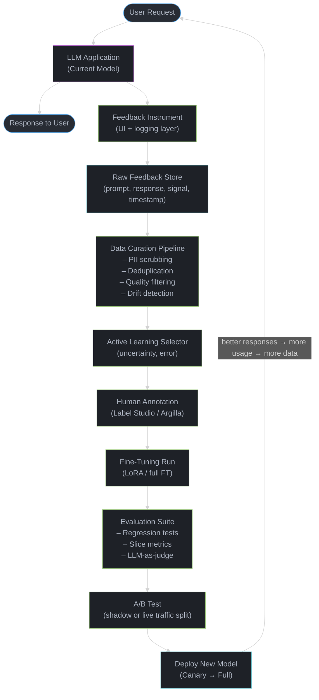
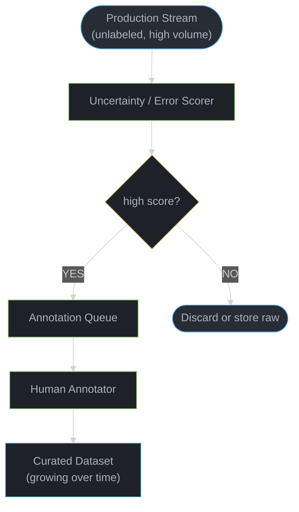
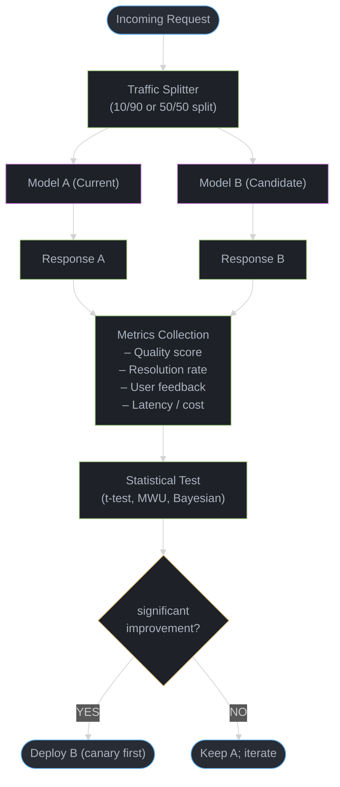
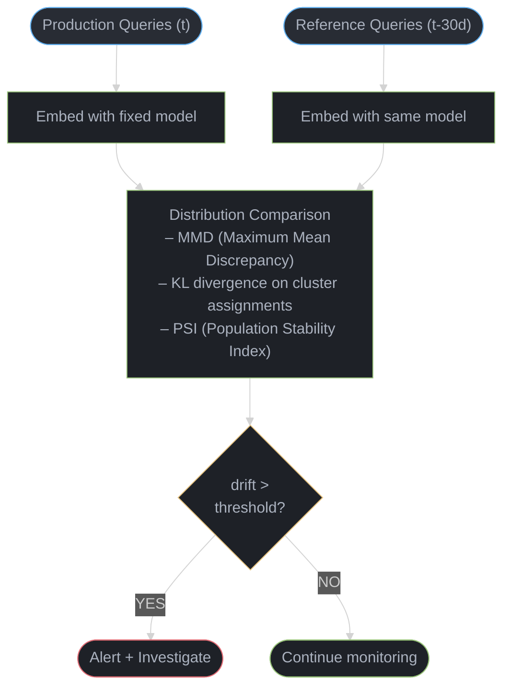

# Data Flywheels and Continuous Learning

---

## 1. Concept Overview

A data flywheel is a self-reinforcing feedback loop in which production usage of an LLM application generates data that improves the model, which in turn drives more and higher-quality usage, which generates even more valuable data. Unlike static models trained once and frozen, a flywheel-powered system becomes stronger the longer it operates — compounding improvement with each cycle.

The key components of a data flywheel for LLM applications are:

- **User feedback collection** — capturing both implicit signals (e.g., regeneration clicks, conversation abandonment) and explicit signals (thumbs up/down, corrections)
- **Data curation pipeline** — filtering, deduplicating, and quality-checking production data before it enters training
- **Active learning** — selecting the most informative examples from the unlabeled production stream for human annotation, minimizing cost while maximizing information gain
- **Model improvement cycles** — periodic or continuous fine-tuning on curated production data
- **A/B testing and evaluation** — rigorous comparison of updated models against the baseline before deployment
- **Drift detection and monitoring** — detecting distribution shift in queries or model behavior before it silently degrades quality

The data flywheel is the primary long-term competitive moat for LLM applications. A competitor can replicate your architecture in weeks; they cannot replicate two years of production feedback.

---

## 2. Intuition

**One-line analogy:** A data flywheel is like a restaurant that improves its menu based on customer reviews — more customers bring more feedback, better dishes attract more customers, and the cycle accelerates.

**Mental model:** Think of the flywheel as a loop with four quadrants:

```
Better Model  -->  More Usage
     ^                  |
     |                  v
More Training  <-- More Feedback
     Data
```

Each quadrant feeds the next. The critical insight is that momentum builds — the first rotation is the hardest (cold start), but each subsequent rotation is faster and yields higher-quality data.

**Why it matters:** A model trained on curated production failures is almost always more useful than one trained on synthetic data alone. Production data exposes edge cases, user vocabulary, domain-specific phrasing, and failure modes that no data generation pipeline can fully anticipate.

**Key insight:** The most valuable training signal comes from production failures — cases where the model answered incorrectly and a human provided or approved a correction. These are precisely the examples at the decision boundary that most influence model behavior.

---

## 3. Core Principles

1. **Production data outperforms synthetic data for domain-specific improvement.** Synthetic data covers the average case; production data covers your users' actual distribution, including long-tail queries that matter most for resolution rate.

2. **Feedback must be collected at multiple levels of granularity.** A binary thumbs-down tells you something went wrong. A corrected response tells you what right looks like. Both are needed — the first is cheap and high-volume; the second is expensive and high-signal.

3. **Every model update must be evaluated before deployment.** A model that improves average-case performance while regressing on a critical slice (e.g., billing queries) is worse than no update at all. Evaluation suites must cover both aggregate and slice-level metrics.

4. **Data quality degrades over time without active intervention.** Distribution shift, concept drift, label noise from inconsistent annotators, and feedback bias all erode the quality of the flywheel's input data. Quality gates must be automated and continuously monitored.

5. **The flywheel compounds.** Each improvement cycle produces a better model that generates better responses, which triggers more explicit corrections on genuinely hard cases rather than easy ones, which provides more informative training signal. The marginal value of each feedback example increases over time.

6. **Annotation budget must be allocated by expected information gain, not by volume.** Annotating one ambiguous example where the model is uncertain is worth more than annotating one hundred examples where the model is already confident and correct.

7. **Privacy and consent are non-negotiable constraints.** Production data contains user PII and sensitive content. Anonymization, consent frameworks, and data retention policies must be designed before the first byte of production data is collected, not retrofitted later.

---

## 4. Types / Architectures / Strategies

### 4.1 Feedback Collection Strategies

| Strategy | Signal Type | Cost | Volume | Quality |
|---|---|---|---|---|
| Regeneration clicks | Implicit | Near zero | High | Low — user may regenerate for stylistic reasons, not correctness |
| Conversation abandonment | Implicit | Near zero | High | Medium — strong signal that intent was not fulfilled |
| Task completion rate | Implicit | Low (requires outcome tracking) | Medium | High — downstream action confirms whether the response was useful |
| Thumbs up / thumbs down | Explicit | Low (one click) | Medium | Medium — binary, no corrective information |
| Star rating (1–5) | Explicit | Low | Low-medium | Medium — more granular but often noisy |
| Correction submission | Explicit | Medium (user effort) | Low | Very high — contains the ground-truth preferred response |
| Follow-up clarification request | Implicit | Low | Medium | High — strong signal of response failure |

### 4.2 Active Learning Strategies

Active learning selects which unlabeled examples from the production stream to send for human annotation, given a fixed annotation budget.

| Strategy | Selection Criterion | Best Used When |
|---|---|---|
| Uncertainty sampling | Model assigns low confidence or high entropy to its output | Model has calibrated confidence scores |
| Margin sampling | Small margin between top-2 predicted outputs | Classification or ranking tasks |
| Query by committee | Ensemble of models disagrees on the response | Multiple candidate models are available |
| Diversity sampling | Select examples that are maximally dissimilar to already-annotated data | Dataset has structural clusters; want broad coverage |
| Error-based sampling | Select examples where the current model is known to have failed (e.g., low user rating) | Feedback signal is available and reliable |
| Core-set selection | Select examples that best cover the embedding space of unlabeled data | Systematic coverage of input distribution |

### 4.3 Model Update Strategies

| Strategy | Update Frequency | Latency to Impact | Risk | Best For |
|---|---|---|---|---|
| Periodic batch fine-tuning | Weekly / monthly | Days to weeks | Low — full evaluation before deploy | Stable domains with slow-changing data |
| Continuous fine-tuning | Daily or streaming | Hours | Medium — requires robust regression testing | Fast-changing domains; high feedback volume |
| Online learning | Per-example or per-batch | Minutes | High — catastrophic forgetting risk | Narrow retrieval or ranking models, not generative LLMs |
| Shadow model training | Offline, parallel | N/A (evaluation only) | None — shadow never serves traffic | Validating new architectures before commit |

### 4.4 RLHF from Production

Production feedback can be repurposed as preference data for RLHF or DPO:

- Pair accepted responses (thumbs up) with rejected alternatives (regenerated responses)
- Use correction submissions as chosen/rejected pairs
- Apply DPO directly on (prompt, chosen, rejected) triplets without training a reward model
- Filter pairs where the margin of preference is clear; discard ambiguous cases

---

## 5. Architecture Diagrams

### 5.1 Complete Data Flywheel Cycle



The flywheel self-reinforces: better models generate better responses, which produce more engaged users, which generate more feedback signals for the next training run.

### 5.2 Active Learning Loop



### 5.3 A/B Testing Flow for Model Updates



### 5.4 Drift Detection Pipeline



---

## 6. How It Works — Detailed Mechanics

### 6.1 Feedback Collection Pipeline

Every LLM response must carry a unique `response_id` that links the response to its prompt, model version, and serving context. This ID is embedded in the UI so that any feedback event (click, rating, correction) can be joined back to the original inference record.

```python
# Feedback event schema (stored in append-only log)
{
    "event_id": "uuid",
    "response_id": "uuid",          # joins to inference log
    "session_id": "uuid",           # for conversation-level signals
    "signal_type": "thumbs_down",   # thumbs_up | thumbs_down | correction | abandon | regenerate
    "correction_text": "...",       # present only for signal_type=correction
    "timestamp": "2026-05-14T10:23:00Z",
    "model_version": "v1.4.2",
    "latency_ms": 1240
}
```

Implicit signals require a separate outcome-tracking layer. For a customer support bot, this means tracking whether the support ticket was closed without human escalation within N minutes of the conversation. This is the highest-quality implicit signal and requires integration with the ticketing system.

### 6.2 Active Learning: Uncertainty Scoring for Generative LLMs

For classification tasks, uncertainty is straightforward (entropy over the output distribution). For generative models, proxy signals are used:

- **Token-level entropy:** Average entropy over the output token sequence. High average entropy = model is uncertain about word choices throughout.
- **Ensemble disagreement:** Run the same prompt through two or three model checkpoints (or with different temperature seeds); measure ROUGE or embedding-space distance between outputs. High divergence = uncertain.
- **Reward model score:** If a reward model is available, low reward score signals a response the model produced but that is unlikely to be preferred.
- **Error proxy:** Any response that received an explicit thumbs-down or triggered a regeneration is a high-priority candidate for annotation, regardless of uncertainty score.

Annotation budget allocation — given a budget of B annotations per week:
- Allocate 60% to error-proxy examples (highest information gain, already have a negative label)
- Allocate 30% to high-uncertainty examples from the production stream
- Allocate 10% to randomly sampled examples (guards against systematic blind spots in the selector)

### 6.3 Data Curation: The Pipeline Before Fine-Tuning

Raw production data must pass through the following stages before entering a fine-tuning dataset:

```
Stage 1: PII Scrubbing
  - Named entity recognition to detect names, emails, phone numbers, account IDs
  - Replace with synthetic placeholders: [NAME], [EMAIL], [ACCOUNT_ID]
  - Log scrubbing actions for audit trail

Stage 2: Deduplication
  - MinHash LSH deduplication at document level (threshold: Jaccard >= 0.8 = duplicate)
  - Exact-match deduplication on (prompt, response) hash
  - Keep one representative per near-duplicate cluster

Stage 3: Quality Filtering
  - Length filter: drop responses < 20 tokens or > 2048 tokens (adjust per domain)
  - Language filter: drop non-target-language responses
  - Toxicity filter: run classifier; drop responses above threshold
  - Coherence filter: drop responses with perplexity > 3 standard deviations above domain mean
  - Feedback filter: drop responses with explicit thumbs-down that have no correction (negative-only signal; use as preference data, not SFT data)

Stage 4: Dataset Composition
  - Mix curated production data with original SFT data (typically 20-40% production, 60-80% original)
  - Avoids catastrophic forgetting of capabilities not covered in production traffic
  - Ratio is a hyperparameter tuned based on regression test results
```

### 6.4 Model Improvement Cycle — Timeline and Tooling

```
Week 1: Data collection and curation
  - Accumulate feedback from production (target: 500-2000 high-quality examples per cycle for LoRA)
  - Run curation pipeline; generate train/validation split (90/10)

Week 2: Fine-tuning run
  - LoRA fine-tuning on base model (r=16, alpha=32, target modules: q_proj, v_proj)
  - Training: 2-3 epochs, cosine LR schedule, warmup 10%, batch size 32
  - Track: training loss, validation loss, and LLM-as-judge scores on held-out evaluation set

Week 3: Evaluation
  - Automated regression suite: 200-500 golden examples covering all product areas
  - Slice-level analysis: billing, returns, technical support, escalation queries
  - Human evaluation: 50-100 preference judgments (new model vs current production)
  - Acceptance criteria: no regression > 2% on any slice; overall improvement >= 3%

Week 4: A/B test and deploy
  - Shadow test first: new model answers all queries but responses are not shown to users; compare internally
  - 10% canary: expose 10% of traffic to new model; monitor real-time feedback rate
  - If no anomaly after 48 hours: ramp to 50%, then 100%
  - Rollback trigger: feedback rate (thumbs-down / total responses) increases by > 20% relative
```

### 6.5 Drift Detection — Concrete Implementation

Use Population Stability Index (PSI) on cluster assignments of the query embedding distribution:

```python
# Pseudo-code: PSI-based drift detection
def compute_psi(reference_embeddings, production_embeddings, n_clusters=20):
    # Cluster reference embeddings
    kmeans = KMeans(n_clusters=n_clusters).fit(reference_embeddings)

    # Assign both sets to clusters
    ref_labels = kmeans.predict(reference_embeddings)
    prod_labels = kmeans.predict(production_embeddings)

    # Compute cluster proportions
    ref_counts = np.bincount(ref_labels, minlength=n_clusters) / len(ref_labels)
    prod_counts = np.bincount(prod_labels, minlength=n_clusters) / len(prod_labels)

    # Add small epsilon to avoid log(0)
    eps = 1e-6
    psi = np.sum((prod_counts - ref_counts) * np.log((prod_counts + eps) / (ref_counts + eps)))
    return psi

# PSI interpretation (industry standard):
# PSI < 0.1   -> No significant shift
# 0.1 <= PSI < 0.2 -> Minor shift; monitor closely
# PSI >= 0.2  -> Major shift; trigger investigation and potential retraining
```

### 6.6 A/B Testing Methodology for LLM Updates

LLM A/B tests differ from standard web A/B tests in one critical way: the primary metric is quality, not engagement. A model that produces longer, more confident-sounding wrong answers can increase session length while decreasing resolution rate. Always measure outcome metrics, not proxy engagement metrics.

Required sample size calculation (before starting the test):

```
Given:
  - Baseline resolution rate p1 = 0.70
  - Minimum detectable effect (MDE): +3 percentage points (p2 = 0.73)
  - Significance level alpha = 0.05
  - Power = 0.80

n = (z_alpha/2 + z_beta)^2 * (p1(1-p1) + p2(1-p2)) / (p1 - p2)^2
n = (1.96 + 0.84)^2 * (0.70*0.30 + 0.73*0.27) / (0.03)^2
n ≈ 7.84 * (0.21 + 0.1971) / 0.0009
n ≈ 7.84 * 0.4071 / 0.0009
n ≈ 3,550 conversations per arm

At 500 conversations/day with 10% canary: 3,550 / 50 = 71 days
At 500 conversations/day with 50% split: 3,550 / 250 = 14 days
```

This is why small LLM applications cannot run meaningful A/B tests on weekly update cycles — volume matters.

### 6.7 Cold Start Bootstrapping

The flywheel requires production data to improve the model, but a new product has no production data. Breaking this circular dependency requires a deliberate bootstrapping phase:

```
Phase 1 — Pre-launch (weeks -4 to -2):
  Approach A: Synthetic data seeding
    - Use a strong model (GPT-4, Claude) to generate 500-2000 initial training pairs
    - Cover expected query types based on product requirements and competitor analysis
    - Quality: good enough to launch but not production-grade

  Approach B: Transfer from adjacent domain
    - Fine-tune on publicly available datasets from similar domains
    - Customer support: use ShareGPT, OpenAssistant, or domain-specific public datasets
    - Accuracy will be lower than eventual production-tuned model but far better than base model

  Approach C: Human-in-the-loop seeding
    - Hire 3-5 domain annotators for 2 weeks
    - Generate 500-1000 gold-standard examples covering the expected query distribution
    - Most expensive but highest quality; often used for regulated domains (healthcare, finance)

Phase 2 — Soft launch (weeks 1-4):
  - Deploy with strong base model + few-shot prompting (no fine-tuning yet)
  - Instrument everything: log all (prompt, response, feedback, outcome) from day one
  - Route low-confidence queries to human agents; their resolutions become training data
  - Target: accumulate 500-1000 high-quality examples before first fine-tuning cycle

Phase 3 — First fine-tune (week 4-6):
  - LoRA fine-tune on curated production data + original seed data
  - Minimum viable dataset: 500-1000 examples typically sufficient for measurable improvement
  - Run full evaluation suite against baseline; deploy via canary

Phase 4 — Flywheel engaged (week 6+):
  - Production volume now generates enough feedback for regular update cycles
  - Each cycle produces a better model, which generates better responses, which triggers
    more informative corrections on genuinely hard cases
```

Approach D — Red-team bootstrapping: internal team stress-tests the system before launch, and every correction or failure resolution becomes training data. This simultaneously tests the product and generates high-signal training examples.

### 6.8 Concept Drift Detection

Section 6.5 covers covariate shift (input distribution changes). Concept drift is the complementary problem: the correct answer to existing query types changes, but the queries themselves look the same.

**Types of concept drift:**
- **Gradual drift**: User expectations evolve slowly (e.g., support bot must learn about new features over months)
- **Sudden drift**: Policy change, product update, or regulatory change makes existing correct answers wrong overnight (e.g., return policy changes from 30 days to 14 days)
- **Seasonal drift**: Periodic shifts that recur (e.g., holiday-specific promotions, tax season queries)

**Detection methods beyond PSI:**
- **Quality metric monitoring**: Track resolution rate, user satisfaction score, and thumbs-down rate on a 7-day sliding window. A >10% relative change without a model update signals concept drift.
- **Embedding centroid shift**: Compute the centroid of query embeddings for each major query category weekly. If any category centroid shifts by >10% cosine distance from its training-time position, investigate.
- **Confidence-outcome divergence**: When the model's confidence remains high but outcome metrics degrade, this is the hallmark of concept drift — the model is confidently producing answers that are no longer correct.
- **KL divergence on response distribution**: Compare the distribution of model responses (by topic cluster) to the distribution of approved/corrected responses. Growing KL divergence signals the model's learned patterns are drifting from current ground truth.

**Alert thresholds:**
- Quality metric (resolution rate, satisfaction) drops >5% relative over 7 days: trigger review
- >10% drop: trigger investigation, check for policy/product changes
- >20% drop: trigger emergency retraining or prompt update

**Response protocol:**
- Not every drift requires retraining — first check if a prompt update or RAG knowledge base update resolves the issue
- For sudden drift (policy change), update the knowledge base or system prompt immediately; schedule retraining for next cycle
- For gradual drift, increase the proportion of recent production data in the next fine-tuning mix

---

## 7. Real-World Examples

### 7.1 GitHub Copilot

Copilot collects acceptance and rejection signals on every code suggestion. When a developer accepts a suggestion by pressing Tab, or rejects it by continuing to type, those signals feed back into ranking and fine-tuning pipelines. Over time, Copilot's acceptance rate improved significantly for common patterns because the model was reinforced on completions that real developers actually used. This is pure implicit feedback — no explicit rating required.

### 7.2 Tesla Autopilot (Vision Analog)

While not an LLM, Tesla's fleet learning is the canonical data flywheel example. Every car is a data collection node. Edge cases (e.g., unusual road markings, rare obstacles) are automatically flagged, sent to a human labeling team, and used to retrain the vision model. The model improves, handles more edge cases correctly, and flags fewer false positives, freeing annotator capacity for genuinely novel situations. The same architecture applies directly to LLM customer support bots.

### 7.3 Customer Support Bot Improvement

A mid-size e-commerce company deployed a support bot with a 65% resolution rate (meaning 65% of conversations ended without human escalation). They instrumented the bot to log every conversation with an outcome label (resolved/escalated). Every two weeks, they ran a curation + LoRA fine-tuning cycle on the escalated conversations (with human-written resolution examples from their support team). After 6 months, resolution rate reached 83%, and the per-query annotation cost dropped by 60% as the model covered more common cases automatically.

### 7.4 Search Ranking with Click-Through Data

Traditional search engines (Google, Bing) use click-through rate as an implicit feedback signal to improve ranking models. A result that users click and spend time on is treated as a positive example; a result users skip or immediately return from is negative. LLM-based search (Perplexity, AI Overviews) is beginning to adopt analogous signals — dwell time, follow-up query rate, and explicit thumbs-down — for reranking and retrieval improvement.

---

## 8. Tradeoffs

### 8.1 Feedback Strategy Comparison

| Strategy | Data Quality | Annotation Cost | Volume | Risk | Best For |
|---|---|---|---|---|---|
| Implicit only (clicks) | Low-medium | Near zero | Very high | Feedback bias; noisy | Initial flywheel; high-traffic apps |
| Explicit thumbs up/down | Medium | Low | Medium | Selection bias (only engaged users rate) | Balanced signal with low friction |
| Correction submission | Very high | Medium (user effort) | Low | Low volume; not all errors get corrections | Domain-specific fine-tuning |
| Outcome tracking | High | Medium (integration cost) | High | Requires downstream system integration | Resolution-rate improvement |
| Active learning + annotation | Very high | High (human annotators) | Controlled | Annotator inconsistency; concept drift in labels | Maximum model improvement per annotation dollar |

### 8.2 Update Frequency Tradeoffs

| Approach | Improvement Speed | Regression Risk | Infrastructure Cost | Recommended Scenario |
|---|---|---|---|---|
| Monthly batch fine-tuning | Slow | Low | Low | Small teams; stable domains |
| Weekly batch fine-tuning | Medium | Medium | Medium | Growing products; moderate traffic |
| Daily fine-tuning | Fast | High | High | High traffic; mature evaluation suite |
| Continuous / online learning | Fastest | Very high | Very high | Retrieval/ranking models only; not generative LLMs |

### 8.3 Active Learning vs Random Sampling

| Approach | Information Gain per Example | Annotator Experience | Dataset Coverage | Recommended |
|---|---|---|---|---|
| Pure random sampling | Low | Easy (familiar examples) | High | As a 10% hedge within active learning |
| Pure uncertainty sampling | High | Hard (all edge cases) | Low (misses common cases) | Never alone |
| Hybrid (80% uncertainty + 20% random) | High | Moderate | Good | Standard production practice |
| Error-based sampling | Very high | Moderate (clear failures) | Biased toward failure modes | Primary strategy for resolution-rate improvement |

---

## 9. When to Use / When NOT to Use

### When to Use a Data Flywheel

- The application has a measurable outcome metric (resolution rate, task completion, user satisfaction score) that can serve as ground truth.
- Traffic volume is sufficient to generate statistically meaningful feedback — typically 100+ conversations per day minimum, 1000+ per day for weekly update cycles.
- The domain is specific enough that production data adds value beyond the base model's general knowledge (legal, medical, customer support, code in a proprietary codebase).
- The team has the infrastructure to collect, store, and process user feedback in compliance with applicable privacy regulations.
- The product roadmap commits to operating the system for at least 3–6 months — the flywheel takes time to spin up.

### When NOT to Use (or when to defer)

- The application is a thin wrapper around a foundation model API with no domain-specific data — there is nothing to fine-tune on.
- Traffic is too low (fewer than 50 conversations per day) to generate statistically useful feedback within a reasonable timeframe.
- User interactions contain sensitive data (health records, financial transactions) that cannot be used for training without informed consent and anonymization — build the consent framework first, not after.
- The team lacks ML engineering capacity to run and evaluate fine-tuning cycles. An unmaintained flywheel that trains on unfiltered production data will degrade the model rather than improve it.
- The base model is already at ceiling performance for the task — additional data from the same distribution will not help; the bottleneck is model capability, not data.

---

## 10. Common Pitfalls

### Pitfall 1: Training on Raw Production Data Without Curation (Garbage In, Garbage Out)

A team at a healthcare tech company automated their entire flywheel pipeline: feedback collected, model fine-tuned, deployed — all without a human review step. Within three weeks, the model had learned to produce responses matching the style of the most common user complaints (which were logged as feedback without filtering), effectively training on negative examples as if they were positive. Resolution rate dropped from 72% to 58% before the regression was caught. The fix: require a dedicated curation stage with explicit quality gates before any data enters the training set. Never treat a thumbs-up alone as sufficient quality signal.

### Pitfall 2: Silent Distribution Shift

A retail support bot was trained on pre-holiday traffic (standard queries: order status, returns, sizing). Post-holiday traffic shifted to gift card redemption, exchange policies, and defective product claims — a completely different distribution. Because no drift monitoring was in place, the model served increasingly irrelevant responses for six weeks before a manual audit surfaced the problem. Resolution rate had dropped 12 percentage points. Implement PSI-based drift detection with automated alerting at PSI >= 0.1.

### Pitfall 3: Feedback Selection Bias

Explicit feedback (thumbs up/down, star ratings) is collected only from users who choose to engage with the feedback UI. Studies across multiple products consistently show that satisfied users are 2–4x more likely to leave positive feedback than dissatisfied users are to leave negative feedback, and that high-engagement users (power users) are overrepresented relative to the user population. If you train only on explicit feedback, you optimize for power users and ignore the silent majority. Mitigate by weighting outcome-based implicit signals (resolution, escalation) alongside explicit ratings.

### Pitfall 4: A/B Testing Without Sufficient Sample Size

The most common mistake in LLM A/B testing is declaring a winner after 3–5 days of data collection with a 5% canary. With typical support bot traffic, this yields 100–300 resolved conversations per arm — far below the 3,500+ needed to detect a 3-percentage-point improvement with 80% power. The result is either false positives (deploying a model that is not actually better) or false negatives (abandoning a genuinely improved model). Always compute required sample size before starting the test; always run the full duration regardless of early results.

### Pitfall 5: Model Regression After Fine-Tuning Update

A team fine-tuned their model on a large batch of billing-related feedback. The new model handled billing queries 15% better — but had regressed on shipping queries by 8% because the fine-tuning dataset was 80% billing examples and the model had partially overwritten shipping-related weights. The regression was not caught because the evaluation suite only measured aggregate metrics, not per-slice metrics. Every evaluation suite must include slice-level coverage for each major product area. Acceptance criteria must include a maximum regression threshold per slice (e.g., no slice may regress more than 2%).

### Pitfall 6: Privacy and Consent Failures

A startup collected production conversations for fine-tuning without explicit user consent and without PII scrubbing. A routine data audit found full names, email addresses, order IDs, and partial credit card numbers in the training dataset. Beyond the regulatory exposure (GDPR Article 5, CCPA), the model had begun to surface partial PII from its training data in edge cases (memorization). The retrospective fix required deleting the entire dataset, re-auditing all model checkpoints for memorization, and rebuilding the pipeline. The forward fix: implement consent collection, PII scrubbing, and data retention limits before collecting a single conversation for training purposes.

### Pitfall 7: Catastrophic Forgetting in Continuous Fine-Tuning

A team implemented daily fine-tuning on the previous day's feedback. After three weeks, the model had largely forgotten how to handle the long tail of infrequent but important query types (escalation to human agent, compliance-sensitive responses) because those examples never appeared in recent daily batches. Always mix historical data with recent data in the fine-tuning set. A common formula: 30% recent production data, 30% historical curated data, 40% original SFT data. This prevents the model from drifting toward the most common recent query types at the expense of everything else.

---

## 11. Technologies & Tools

| Category | Tool | Purpose | Notes |
|---|---|---|---|
| Annotation platform | Label Studio | Open-source data labeling for text, structured, and multimodal tasks | Self-hostable; integrates with major storage backends |
| Annotation platform | Argilla | Open-source annotation for NLP/LLM tasks; first-class RLHF support | Preferred for preference data collection; built-in active learning hooks |
| Experiment tracking | Weights & Biases (W&B) | Track fine-tuning runs, log metrics, compare model versions | W&B Artifacts for dataset versioning; W&B Launch for distributed training |
| Experiment tracking | MLflow | Open-source experiment tracking and model registry | Model Registry supports staging/production/archived lifecycle |
| LLM observability | LangSmith | Trace LLM calls, collect feedback, build evaluation datasets from production traces | Native LangChain integration; feedback API for custom instrumentation |
| LLM observability | Evidently AI | Open-source ML monitoring; data drift detection, data quality reports | Strong PSI and MMD implementations; supports embedding drift |
| Drift detection | Arize AI | Production ML monitoring with embedding-space drift visualization | Enterprise-grade; integrates with major model serving platforms |
| Data versioning | DVC (Data Version Control) | Version datasets alongside code; reproduce training pipelines | Works with S3, GCS, Azure Blob; integrates with Git |
| Feature store / feedback store | Feast | Open-source feature store; can store feedback signals as features | Useful for joining feedback signals to model inference records |
| Fine-tuning | Hugging Face PEFT | LoRA, QLoRA, and other parameter-efficient fine-tuning methods | Standard library for fine-tuning LLMs on curated feedback data |
| A/B testing | Optimizely / custom | Traffic splitting and experiment assignment | Most LLM teams build custom A/B routing at the inference gateway |
| PII scrubbing | Microsoft Presidio | Open-source PII detection and anonymization | Supports 40+ entity types; customizable recognizers |
| Annotation platform | Prodigy | Spacy-integrated annotation tool with built-in active learning | Efficient for NLP tasks; recipes for text classification, NER, ranking |

### Annotation Workflow Design

Production annotation workflows for data flywheels require more structure than ad-hoc labeling:

**Task queuing:** Route examples from the active learning selector into a task queue (Label Studio or Argilla). Prioritize by expected information gain: error-proxy examples first, high-uncertainty examples second, random samples third. Set daily annotation targets per annotator (typically 50-100 examples/day for text quality tasks, 200-400 for classification).

**Inter-annotator agreement (IAA):** Measure consistency using Cohen's kappa. Targets: kappa >0.7 for classification tasks, kappa >0.6 for generation quality ratings (inherently more subjective). Assign 15-20% of examples to 2+ annotators for IAA measurement. If kappa drops below threshold, run a calibration session before continuing.

**Quality control:** Include 10% "golden" examples with known correct labels in each annotation batch. Annotators whose agreement with golden examples falls below 85% are flagged for retraining. Adjudication: when two annotators disagree, a senior annotator resolves the tie — the resolution becomes the label.

**Human-in-the-loop pipeline:** Route low-confidence model predictions to human review in near-real-time. The human correction simultaneously serves the user (better response) and feeds the training pipeline (corrected example). This dual-purpose flow is the highest-ROI annotation investment because each correction solves a user problem and improves the model.

**Cost benchmarks:** Professional annotation costs $0.10-0.50 per example for simple classification, $2-10 for complex generation quality evaluation, and $5-20 for writing full correction responses. A typical weekly curation cycle of 500 examples costs $500-2,500 depending on task complexity.

---

## 12. Interview Questions with Answers

**What is a data flywheel, and why is it considered a competitive moat for LLM applications?**
A data flywheel is a self-reinforcing feedback loop where production usage generates training data that improves the model, which drives more usage and generates more data. It is a competitive moat because the data and the learned improvements from production are proprietary — a competitor can replicate your architecture but cannot replicate years of production feedback. The moat compounds over time: each improvement cycle makes the model better, which attracts more users, which generates more diverse and informative feedback.

**What is the difference between implicit and explicit feedback, and when would you rely on each?**
Implicit feedback is derived from user behavior without requiring any deliberate rating action — examples include regeneration clicks, conversation abandonment, task completion rate, and follow-up query rate. Explicit feedback requires the user to take a deliberate action — thumbs up/down, star rating, or correction submission. Implicit feedback is high-volume and low-cost but noisy and subject to interpretation (a regeneration may reflect style preference, not correctness). Explicit feedback is lower-volume but higher-signal. In practice, use outcome-based implicit signals (task completion, escalation rate) as the primary metric, explicit ratings as a secondary signal, and correction submissions as the highest-quality but lowest-volume signal for fine-tuning.

**How does active learning reduce annotation cost in a data flywheel?**
Active learning selects the most informative examples from the unlabeled production stream for human annotation, rather than annotating randomly. By prioritizing examples where the model is uncertain or has failed, each annotation dollar provides maximum information gain — it teaches the model something it does not already know. In practice, error-based sampling (examples that received thumbs-down or triggered regeneration) combined with uncertainty sampling (examples with high token entropy or ensemble disagreement) can reduce the annotation budget needed to achieve a given quality improvement by 50–80% compared to random sampling.

**How would you detect distribution shift in production LLM traffic?**
Embed a sample of production queries using a fixed embedding model and compare the resulting distribution to a reference embedding distribution from a prior time window. Compute Population Stability Index (PSI) over cluster assignments: PSI below 0.1 indicates no significant shift; 0.1 to 0.2 indicates minor shift requiring monitoring; above 0.2 indicates major shift requiring investigation and likely retraining. Also monitor downstream metrics: if resolution rate drops without a model update, that is a strong proxy signal of distribution shift. Alert on both signals independently to catch shifts that affect behavior but not the query distribution (concept drift vs covariate shift).

**Walk me through how you would design an A/B test to validate a new fine-tuned model.**
First, compute the required sample size using a power analysis: define the baseline metric (e.g., resolution rate 0.70), the minimum detectable effect (e.g., +3 percentage points), a significance level of 0.05, and 80% power. This typically requires 3,000–5,000 outcome observations per arm for a 3-point MDE. Second, implement traffic splitting at the inference gateway, assigning users to arms consistently by hashed session ID to avoid within-session model switching. Third, measure outcome metrics (resolution rate, escalation rate, feedback rate) — not engagement proxies. Fourth, run the test for the full duration determined by the power analysis regardless of early results. Fifth, analyze using the pre-specified statistical test (t-test for continuous metrics, chi-squared for binary); apply Bonferroni correction if testing multiple metrics. Sixth, deploy via canary (10%) before full rollout; define rollback triggers (e.g., feedback rate increases more than 20% relative).

**What are the main risks of training on production data, and how do you mitigate them?**
The main risks are: PII leakage (users input sensitive data; the model memorizes it), feedback bias (only engaged users provide ratings; the model overfits to power users), label noise (incorrect corrections from users, inconsistent annotators), garbage amplification (training on negative examples without filtering), and distribution shift in labels (what "correct" means changes as policies or products change). Mitigate with: mandatory PII scrubbing before any data enters the pipeline; use outcome-based implicit signals to balance explicit rating bias; implement inter-annotator agreement checks and quality filters; require explicit quality gates before training; and include a model of historical curated data in every fine-tuning mix to stabilize behavior.

**What is the cold start problem in a data flywheel, and how do you address it?**
The cold start problem is the challenge that a new application has no production data to seed the flywheel, so the first model cannot be improved through production feedback because there is insufficient volume or quality of feedback. Address it by: starting with the best available base model or a model fine-tuned on publicly available domain data; seeding the annotation dataset with synthetic data generated via Self-Instruct or domain expert demonstrations; collecting outcome data (resolved/escalated) from day one even before fine-tuning is feasible; and setting a data accumulation target (e.g., 500 curated examples) before the first fine-tuning cycle, rather than attempting to train on day one with 20 examples.

**How do you prevent model regression after a fine-tuning update?**
Maintain a permanent regression test suite of 200–500 golden examples covering all major product slices (billing, returns, technical, escalation, compliance-sensitive). Before deploying any model update, run the full evaluation suite and enforce acceptance criteria: no slice may regress more than 2% from the current production model on any metric. Use LLM-as-judge for semantic quality evaluation and human preference judgments for a random sample. Run a shadow test (new model answers all queries but responses are not shown) to collect real-world quality signals before exposing users. Define automated rollback triggers for canary deployments: if the thumbs-down rate or escalation rate increases by more than 20% relative within 48 hours of canary deployment, automatically roll back to the previous model version.

**How do you handle annotation consistency and quality when scaling the annotation team?**
Use inter-annotator agreement (IAA) metrics — Cohen's kappa for categorical labels (target kappa > 0.7), Pearson correlation for continuous ratings. On every batch, include 10% calibration examples that were previously annotated by a senior annotator or resolved by consensus; flag annotators whose agreement with the calibration set drops below threshold. Run periodic calibration sessions where annotators label the same set of 20–30 examples and discuss disagreements. Use annotation guidelines that include positive examples, negative examples, and boundary cases — not just rule descriptions. For correction-style annotation, provide the original model response alongside the rubric so annotators are improving on a concrete starting point rather than writing from scratch.

**Explain the concept of concept drift versus covariate shift in the context of an LLM support bot.**
Covariate shift means the distribution of input queries changes — for example, a retail bot sees holiday-specific queries in December that were rare in October. The correct response to a query type may remain the same, but the model has not seen enough examples of that type to handle it well. Covariate shift is detected by monitoring the input embedding distribution. Concept drift means the correct response to a given query type changes — for example, the return policy changes from 30 days to 14 days, so the previously correct answer is now wrong. Concept drift is not detectable from input distribution monitoring alone; it requires outcome monitoring (resolution rate drops even though query distribution is stable). Both require model updates, but the response differs: covariate shift is addressed by collecting and annotating more examples of the new query types; concept drift is addressed by updating the training data to reflect the new correct answers and re-fine-tuning.

**How do you estimate the ROI of a data flywheel investment for a business stakeholder?**
Frame the ROI in terms of the cost avoided by the model handling conversations that would otherwise require a human agent. If the current model resolves 70% of conversations autonomously (cost per autonomous resolution: $0.05 in compute) and the target is 85% (same compute cost), and the application handles 10,000 conversations per day with an average human agent cost of $8 per escalated conversation, then: current daily agent cost = 0.30 * 10,000 * $8 = $24,000; target daily agent cost = 0.15 * 10,000 * $8 = $12,000; daily savings = $12,000; annual savings = $4.38M. Set against the flywheel investment (annotation costs, ML engineering time, infrastructure), this typically yields ROI within 3–6 months for mid-size applications. Always present savings per percentage point of resolution rate improvement to make the metric concrete for stakeholders.

**What is the difference between online learning and periodic batch fine-tuning for LLMs, and which would you recommend?**
Online learning updates model weights continuously or after every small batch of new examples. Periodic batch fine-tuning accumulates data over a fixed window (days to weeks) and then runs a full fine-tuning job. For generative LLMs, periodic batch fine-tuning is almost always the correct choice. Online learning on generative LLMs causes catastrophic forgetting — continuous weight updates on recent examples overwrite representations of earlier examples, causing the model to degrade on any pattern not present in recent traffic. Batch fine-tuning allows mixing historical data with recent data to prevent forgetting, running a full evaluation suite before deployment, and maintaining a stable checkpoint history for rollback. Online learning is appropriate for retrieval models, ranking models, and embedding models where the architecture is smaller and forgetting is less severe.

**How do you bootstrap a data flywheel when you have zero production data?**
The cold start problem requires a deliberate bootstrapping phase before the flywheel can engage. The most common approach combines synthetic data seeding (use GPT-4 or Claude to generate 500-2000 initial training pairs covering expected query types) with a soft-launch strategy (deploy with a strong base model plus few-shot prompting, instrument all interactions from day one, and route low-confidence queries to human agents whose resolutions become training data). The minimum viable dataset for the first LoRA fine-tune is typically 500-1000 high-quality examples, which most products accumulate within 2-4 weeks of production traffic at modest scale. For regulated domains where quality is critical from day one, invest in human-annotated seed data (hire 3-5 domain experts for 2 weeks to create gold-standard examples). Red-team bootstrapping — where the internal team stress-tests the system pre-launch and every correction becomes training data — simultaneously validates the product and seeds the flywheel. The key principle: launch fast with a strong base model, collect data aggressively, and do not attempt fine-tuning until you have accumulated sufficient high-quality examples.

**How do you distinguish concept drift from covariate shift in production, and why does the distinction matter?**
Covariate shift means the input query distribution changes (new query types appear or existing ones change frequency), while concept drift means the correct answer to existing query types changes (policy update, product change, factual update). The distinction matters because they require different responses. Covariate shift is detected by monitoring the input embedding distribution — compute PSI weekly against a reference distribution, and a PSI above 0.2 signals major shift. Concept drift is invisible to input monitoring because the queries look the same; it is detected by monitoring outcome metrics (resolution rate, satisfaction score) on a sliding window — if quality degrades without a model update and without input distribution change, concept drift is the likely cause. For covariate shift, collect and annotate examples of the new query types, then retrain. For concept drift, update the knowledge base or system prompt immediately (fastest fix), then update training data to reflect new correct answers and retrain. A common production incident: a return policy changes from 30 to 14 days; the bot confidently answers "30 days" to return-policy queries because it has high confidence on this familiar query type — this is concept drift. The model's confidence-outcome divergence (high confidence, bad outcomes) is the strongest diagnostic signal.

---

## 13. Best Practices

**Instrument before you launch.** Every production inference must log (prompt, response, model version, latency, session ID) to an append-only store from day one. Retrofitting logging after launch means losing the most valuable early-production data and potentially losing the ability to join feedback events back to inference records.

**Treat the curation pipeline as a first-class engineering system.** The curation pipeline — PII scrubbing, deduplication, quality filtering, dataset composition — is as important as the fine-tuning code itself. It should have unit tests, versioned outputs, and documented acceptance criteria. Untested curation code is the most common source of training data corruption.

**Set up the regression test suite before the first fine-tuning cycle.** The evaluation suite must exist and be validated against the current production model before any fine-tuning run. If you build it after the first update, you have no valid baseline to compare against.

**Version datasets, not just models.** Every fine-tuning run must be reproducible from a versioned dataset snapshot. Use DVC or equivalent; tag the dataset version that produced each model checkpoint. Without dataset versioning, debugging a model regression is essentially impossible.

**Use a mixed data composition in every fine-tuning run.** Never fine-tune on recent production data alone. Always mix: recent production data (20–40%), historical curated data (20–30%), original SFT data (30–50%). Adjust the ratio based on regression test results. This is the primary defense against catastrophic forgetting.

**Define rollback triggers before canary deployment, not during an incident.** Document the specific metric thresholds that will trigger an automatic rollback (e.g., thumbs-down rate +20% relative, escalation rate +15% relative) and implement automated alerting for those thresholds. Making rollback decisions reactively during an incident, under time pressure, reliably leads to suboptimal choices.

**Separate the feedback signal from the training label.** A thumbs-down is a feedback signal, not a training label. It tells you something went wrong; it does not tell you what the correct response is. Never use raw feedback events as training labels. Use them to select candidates for annotation or as preference data for DPO; always have a human or high-quality automated system provide the actual training target.

**Monitor the flywheel's own health metrics.** Track: annotation throughput (examples labeled per week), curation pass rate (percentage of raw feedback that survives quality filters), model update frequency, evaluation score trend over time, and feedback collection rate (percentage of conversations that yield at least one feedback signal). If any of these metrics degrades, the flywheel is losing momentum — investigate before the model quality degrades downstream.

**Allocate 10% of the annotation budget to random sampling.** Pure active learning (always selecting the highest-uncertainty or highest-error examples) creates a biased dataset that over-represents edge cases and under-represents common cases. Random sampling ensures coverage of the full query distribution and catches blind spots in the active learning selector itself.

**Revisit the dataset composition ratio at each major traffic shift.** The optimal mix of recent vs historical vs original SFT data depends on how much the current traffic distribution differs from the training distribution. Re-run the composition ratio search (as a hyperparameter) whenever PSI-based drift detection reports a major shift (PSI >= 0.2).

---

## 14. Case Study

### Problem Statement

A B2C e-commerce company has deployed a customer support chatbot handling 2,000 conversations per day. The current model achieves a 70% autonomous resolution rate — meaning 30% of conversations (600 per day) escalate to a human agent at an average cost of $8 per escalation ($4,800/day). The business target is 90% resolution rate within 6 months. Design the data flywheel system to achieve this.

### Architecture Overview

```
+-------------------+      +----------------------+      +------------------+
| Customer Chatbot  |----->| Instrumentation Layer|----->| Raw Feedback DB  |
| (Current Model)   |      | - response_id logging|      | (append-only,    |
|                   |      | - session tracking   |      |  partitioned by  |
|                   |      | - outcome webhook    |      |  day)            |
+-------------------+      +----------+-----------+      +--------+---------+
         ^                            |                           |
         |                            v                           v
         |              +-------------+------+     +--------------+----------+
         |              | Ticketing System   |     | Curation Pipeline       |
         |              | Integration        |     | - PII scrub (Presidio)  |
         |              | (Zendesk webhook:  |     | - Dedup (MinHash LSH)   |
         |              |  resolved vs       |     | - Quality filter        |
         |              |  escalated within  |     | - Drift detection (PSI) |
         |              |  30 min)           |     +----------+--------------+
         |              +--------------------+                |
         |                                                    v
         |                                       +------------+-----------+
         |                                       | Active Learning        |
         |                                       | Selector               |
         |                                       | - Error-based (60%)    |
         |                                       | - Uncertainty (30%)    |
         |                                       | - Random (10%)         |
         |                                       +------------+-----------+
         |                                                    |
         |                                       +------------+-----------+
         |                                       | Annotation Queue       |
         |                                       | (Argilla)              |
         |                                       | Target: 300 examples   |
         |                                       | per week               |
         |                                       +------------+-----------+
         |                                                    |
         |                                       +------------+-----------+
         |                                       | Fine-Tuning Run        |
         |                                       | (LoRA, r=16, alpha=32) |
         |                                       | Mix: 30% recent prod   |
         |                                       |      30% historical    |
         |                                       |      40% original SFT  |
         |                                       +------------+-----------+
         |                                                    |
         |                                       +------------+-----------+
         |                                       | Evaluation Suite       |
         |                                       | - 400 golden examples  |
         |                                       | - 8 product slices     |
         |                                       | - LLM-as-judge         |
         |                                       | - Acceptance: no slice |
         |                                       |   regresses > 2%       |
         |                                       +------------+-----------+
         |                                                    |
         |                                       +------------+-----------+
         +---------------------------------------| A/B Test -> Canary     |
                                                 | Deploy                 |
                                                 +------------------------+
```

### Key Design Decisions

**Decision 1: Outcome-based implicit signal as primary metric.**
Resolution rate (ticket closed without escalation within 30 minutes) is the primary training signal, not thumbs up/down. This requires a Zendesk webhook integration that labels each conversation as resolved or escalated. Cost: 2 engineering days. Value: 2,000 labeled outcome examples per day with zero annotation cost.

**Decision 2: Bi-weekly update cycle, not weekly.**
With 2,000 conversations/day and a 10% canary for A/B testing, generating 3,500 per-arm samples takes 17 days at 50% split. A monthly cycle is too slow to hit the 6-month target; weekly is too fast to complete statistically valid A/B tests. Bi-weekly allows 2.5 test cycles per month while maintaining statistical rigor.

**Decision 3: Human annotation focused on escalated conversations with corrections.**
The 600 daily escalations are the highest-value annotation target. The support team already writes resolution messages for escalated tickets — capture those as preferred responses. This is annotation-free ground truth for 600 examples per day. Argilla is used to surface these for quality review; support team leads approve or edit before the examples enter the training set. Net annotation cost: 30 minutes of lead review per day, not dedicated annotator time.

**Decision 4: Slice-level regression gates enforced automatically.**
Eight product slices are defined: order status, returns and exchanges, payment and billing, shipping and tracking, product information, account management, promotions and coupons, and escalation routing. The evaluation pipeline computes resolution rate for each slice on 50 held-out golden examples per slice. A CI/CD gate blocks deployment if any slice regresses more than 2 percentage points.

### Implementation

**Month 1: Infrastructure and baseline**
- Deploy instrumentation layer: log all inferences with response_id and session_id
- Implement Zendesk webhook: label each conversation resolved/escalated after 30 minutes
- Stand up Argilla annotation server; configure support lead review workflow
- Build evaluation suite: 400 golden examples (50 per slice), validated against current model
- Implement PII scrubbing with Presidio; configure MinHash deduplication
- Establish baseline: resolution rate 70% overall; per-slice breakdown reveals that returns/exchanges (54%) and payment/billing (61%) are the weakest slices

**Month 2: First fine-tuning cycle**
- Accumulate 3 weeks of outcome-labeled data (42,000 conversations; ~12,600 escalations)
- Curation: PII scrub, dedup, quality filter — approximately 60% pass rate yields 7,560 examples
- Annotate 500 examples (escalated conversations with support-team corrections)
- Fine-tune: LoRA on base model; mix 30% recent prod + 30% historical + 40% original SFT
- Evaluation: returns/exchanges improves from 54% to 61%; payment/billing from 61% to 67%; overall from 70% to 74%
- A/B test: 50/50 split for 14 days; resolution rate 74% vs 70% (statistically significant, p < 0.01)
- Deploy to 100% traffic

**Month 3-4: Accelerating cycle**
- Flywheel momentum: the improved model generates fewer escalations (now 520/day instead of 600), but the escalaed conversations are harder and therefore more informative
- Add uncertainty sampling: run two LoRA checkpoints as a committee; flag conversations where their responses have embedding distance > 0.4
- Annotation throughput increases to 600 examples per week as support lead review becomes more efficient with Argilla's pre-labeling
- Two fine-tuning cycles: resolution rate reaches 81% by end of month 4

**Month 5-6: Targeting the last mile**
- The easy gains are captured; remaining failures are primarily in two categories: complex multi-issue conversations (multiple unrelated problems in one session) and policy edge cases (recent policy changes not yet in training data)
- For multi-issue conversations: add a conversation decomposition pre-step to the pipeline
- For policy edge cases: implement a retrieval-augmented generation layer so the model can query the current policy document rather than relying on learned parameters; this bypasses the need to retrain on every policy change
- Final resolution rate after month 6: 89% overall (just under the 90% target; returns/exchanges reaches 82%, payment/billing 84%)

### Tradeoffs and Alternatives

**Alternative: Pure RAG instead of fine-tuning.** A retrieval system over the support knowledge base could have improved factual accuracy without a flywheel. The tradeoff is that RAG improves knowledge retrieval but does not improve conversational flow, query understanding, or handling of ambiguous multi-intent queries — all of which were significant failure modes in this case. The hybrid approach (RAG for policy facts + fine-tuned model for conversation) outperformed either alone.

**Alternative: Monthly instead of bi-weekly cycles.** Monthly cycles would have produced only 6 model updates in 6 months vs 11 bi-weekly updates. Given the improvement curve (each cycle yields 2–4 percentage points early on, diminishing as the model improves), fewer cycles means slower overall progress and a higher chance of missing the target.

**Tradeoff accepted: Bi-weekly cycles require a robust automated evaluation pipeline.** The team invested 2 engineering weeks in building the automated evaluation and CI/CD gate. This investment was necessary to enable frequent updates without increasing regression risk.

### Interview Discussion Points

- The most valuable single engineering decision was the Zendesk webhook integration — it provided 2,000 labeled examples per day at near-zero marginal cost, making the flywheel data-rich from the start.
- The 6-month target was nearly achieved (89% vs 90%) through the flywheel alone in the LLM components; the final gap was closed by the RAG policy layer, illustrating that fine-tuning and retrieval are complementary rather than competing approaches.
- The bi-weekly cycle was constrained by A/B test sample size, not by fine-tuning or evaluation time. For an application with 10x the traffic, weekly cycles would be statistically feasible.
- The per-slice regression gate caught two would-be regressions (month 3 and month 5) that were invisible in aggregate metrics — exactly the pitfall described in Common Pitfalls section 5.

---

**Additional war story — RLHF feedback flywheel gaming: users discovered thumbs-up inflates model confidence:**

A customer support platform collecting thumbs-up/thumbs-down signals to power an RLHF fine-tuning flywheel discovered that 12% of thumbs-up signals came from bots — the product had a public API that power users were scripting to send positive feedback on specific response types. The reward model trained on this corrupted signal learned to over-produce verbose, confident-sounding responses (which received more scripted thumbs-up) while underproducing appropriately uncertain responses. The gaming was detected when CSAT from human agents reviewing escalated conversations started declining even as the thumbs-up rate increased.

```python
# BROKEN: raw thumbs-up signals fed directly to reward model training
def collect_feedback(user_id: str, response_id: str, thumbs_up: bool) -> None:
    db.insert("feedback", {
        "user_id": user_id,
        "response_id": response_id,
        "signal": 1 if thumbs_up else -1,
        "timestamp": datetime.utcnow(),
    })
    # BUG: no validation, rate limiting, or bot detection

# FIX: multi-signal reward with bot detection and signal quality gating
from collections import defaultdict
from datetime import datetime, timedelta

class FeedbackCollector:
    def __init__(self, db, redis_client):
        self.db = db
        self.redis = redis_client

    def collect_feedback(
        self,
        user_id: str,
        response_id: str,
        thumbs_up: bool,
        session_metadata: dict,
    ) -> bool:
        """Returns True if feedback was accepted, False if rejected."""
        # Rate limit: max 10 feedbacks per user per hour
        rate_key = f"feedback_rate:{user_id}"
        count = self.redis.incr(rate_key)
        if count == 1:
            self.redis.expire(rate_key, 3600)
        if count > 10:
            return False  # silently drop — don't tell bots they're detected

        # Bot detection: require minimum session duration before feedback
        session_age_seconds = session_metadata.get("session_age_seconds", 0)
        if session_age_seconds < 30:
            return False  # bot submitted feedback within 30 seconds of session start

        # Weight signal by user engagement quality
        user_engagement_score = self._get_user_engagement_score(user_id)
        weight = min(1.0, user_engagement_score / 100.0)

        self.db.insert("feedback", {
            "user_id": user_id,
            "response_id": response_id,
            "signal": (1 if thumbs_up else -1) * weight,
            "timestamp": datetime.utcnow(),
            "accepted": True,
        })
        return True

    def _get_user_engagement_score(self, user_id: str) -> float:
        """Score 0-100 based on session length, return visits, conversion actions."""
        ...
```

**Additional interview Q&As:**

**What is the cold start problem in a data flywheel and how do you overcome it for a new LLM product?** The cold start problem: the flywheel needs user feedback to improve the model, but without a high-quality initial model, users won't engage enough to generate useful feedback. Solutions: (1) use a strong frontier model (GPT-4o, Claude) for the first 3-6 months — this generates positive user engagement and collects high-quality implicit feedback even before an open-source model is ready; (2) seed the feedback dataset with human-labeled examples (100-500 expert annotations bootstrap the reward model); (3) collect implicit signals (time-on-response, follow-up questions asked) that don't require explicit user action. Never launch a weak model and hope the flywheel fixes it — the flywheel amplifies the baseline quality, it doesn't replace it.

**How do you prevent distribution shift from causing feedback flywheel collapse over time?** Feedback flywheel collapse: the model becomes better at generating responses that receive positive feedback (which may diverge from actual quality) rather than better at serving users. Prevention: (1) evaluate the reward model on a held-out set of human preference labels that are refreshed quarterly — if reward model accuracy on fresh human labels declines, the reward model is overfit to gamed or shifted signals; (2) maintain a "canary" intent category where you manually review 100% of responses and score them against a rubric — if canary scores diverge from thumbs-up rate, the feedback signal is drifting; (3) add explicit "I'm not sure" or "I need to check" response options and track whether their frequency stays calibrated over time.

**What is the typical ROI calculation for investing in a continuous learning flywheel vs staying on a static model?** Calculate: (1) baseline LLM API cost per month (e.g., $50K/month on GPT-4o); (2) cost of self-hosted fine-tuned model (training: $5K/run monthly; serving: $8K/month for GPU cluster); (3) quality improvement from fine-tuning (measure as resolution rate increase or CSAT improvement, then convert to revenue impact: 5% resolution rate improvement × $200 avg ticket cost × 10,000 tickets/month = $100K/month saved in human agent costs). Flywheel ROI is typically positive at >10,000 queries/day and measurable quality improvement >5%. Below 1,000 queries/day, the signal volume is too low for reliable reward model training, and the flywheel does not converge.

**Quick-reference table:**

| Signal type | Collection cost | Signal quality | Best for |
|---|---|---|---|
| Explicit thumbs-up/down | Low (UI widget) | Medium (gameable; selection bias) | High-volume consumer products; requires bot detection |
| Implicit dwell time + follow-ups | Near-zero (server logs) | High (hard to game at scale) | Any product with session tracking; no UI changes required |
| Agent/human correction (edited outputs) | Low (log edit events) | Very high (exact quality signal) | Products where users refine outputs (writing, code, emails) |
| Expert annotation (human labelers) | High ($0.50-2.00/label) | Highest (ground truth) | Seed dataset; reward model training; quarterly calibration |
