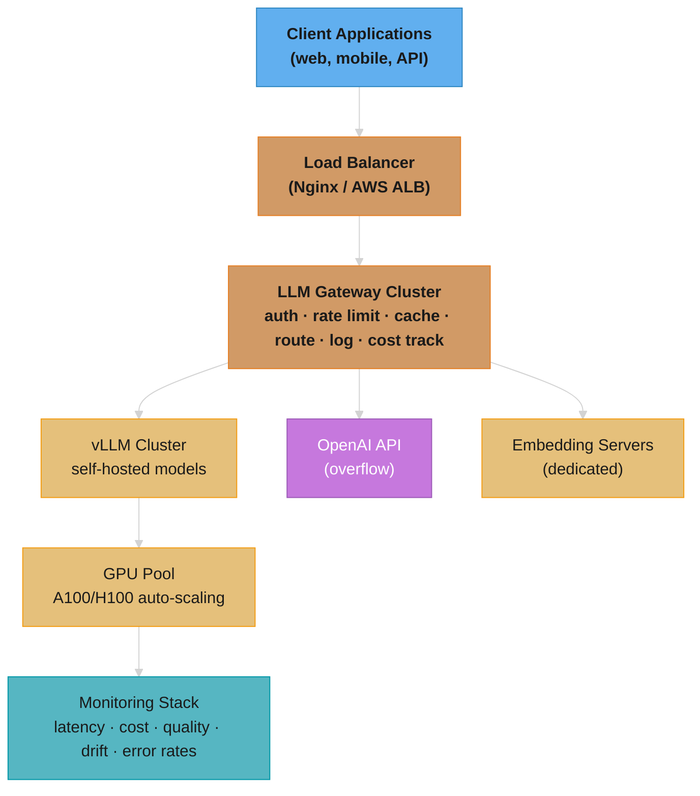
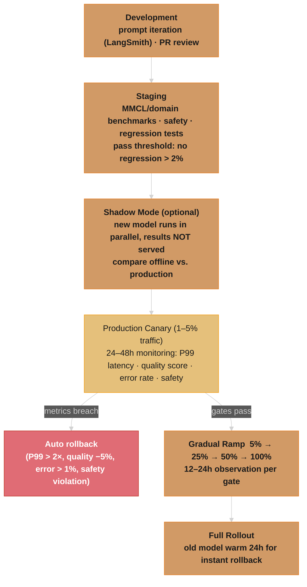

# Deployment & MLOps

## 1. Concept Overview

Deploying LLMs in production requires solving problems that don't exist with traditional software or even traditional ML: massive GPU memory requirements, extreme inference latency variability, multi-dimensional cost optimization (compute vs. API costs), and the challenge of monitoring outputs that are free-form text rather than discrete predictions.

LLM MLOps encompasses model serving infrastructure, cost management, monitoring for quality regressions, model routing, A/B testing, and the "data flywheel" — using production data to continuously improve the model. It's where the boundary between software engineering and ML engineering blurs most heavily.

---

## 2. Intuition

> **One-line analogy**: LLM deployment is like running a restaurant — you need to manage capacity (GPU servers), quality (model outputs), cost (GPU hours), and freshness (model updates) all simultaneously.

**Mental model**: Deploying a model isn't just starting a server. You need GPU instances (expensive, hard to scale quickly), a load balancer routing to multiple model replicas, monitoring for quality regressions (LLM outputs are text, not simple metrics), cost attribution (which user/team is consuming tokens), fallback routing (if main model fails, route to backup), and a pipeline to continuously improve the model from production data. Each of these is a solved problem in traditional software but requires LLM-specific adaptations.

**Why it matters**: A model that works in development can fail in production due to distribution shift, adversarial inputs, or cost overruns. MLOps for LLMs is the discipline that keeps production systems reliable, cost-effective, and continuously improving. Without it, even great models fail at scale.

**Key insight**: LLM monitoring is fundamentally different from traditional ML monitoring — you can't compute accuracy on free-form text outputs. LLM-as-judge, user feedback signals, and embedding drift detection replace traditional accuracy metrics.

---

## 3. Core Principles

- **GPU cost dominates**: For self-hosted LLMs, GPU compute is typically 60-80% of total cost. Every optimization decision flows from this.
- **Observability is non-negotiable**: LLM outputs are non-deterministic and hard to validate. You need extensive logging to understand failures.
- **Latency SLAs are user-facing**: Users notice latency. TTFT (Time to First Token) < 1 second is a hard requirement for conversational applications.
- **Gradual rollout**: LLMs can silently degrade (sycophancy, capability regression, safety issues). Always use A/B testing for major changes.
- **Prompts are code**: Treat prompt changes with the same rigor as code changes: version control, review, staged rollout. Store prompts in a registry with metadata (model, temperature, version, author) and require PR review before production deployment.
- **Canary everything**: Never roll out a model change, prompt change, or parameter tweak to 100% of traffic at once. Start at 1-5%, monitor for 24-48 hours, then gradually increase.
- **GPU memory is your scarcest resource**: A single long-context request or batch size spike can OOM a serving node. Monitor GPU memory utilization continuously and set alerts at 85% to prevent cascading failures.
- **Cost attribution enables accountability**: Without per-team/per-user cost tracking, LLM costs become an unowned shared expense that grows unchecked. The LLM gateway is the natural metering point.

---

## 4. Serving Architecture Patterns

### 4.1 API Gateway Pattern

A dedicated gateway handles all LLM traffic before reaching models:

```
Client Requests
     |
     v
[LLM Gateway]
  ├── Authentication & Authorization
  ├── Rate Limiting (per user/org/tier)
  ├── Request Validation (length, content filtering)
  ├── Prompt Template Injection (add system prompts)
  ├── Model Routing (route to appropriate model)
  ├── Caching (exact match cache, semantic cache)
  ├── Logging & Tracing
  └── Cost Tracking (tokens/$ per user)
     |
     v
[Model Serving Tier]
  ├── GPT-4o (complex queries)
  ├── GPT-4o-mini (simple queries)
  ├── Self-hosted 7B (high-volume, low-stakes)
  └── Specialized models (code, embedding, etc.)
```

### 4.2 Model Routing

Route queries to the appropriate model based on complexity:

```python
def route_request(query: str, user_tier: str) -> str:
    # Cost-aware routing
    if user_tier == "free":
        return "gpt-4o-mini"  # Cheap model for free tier

    # Complexity estimation
    complexity = estimate_complexity(query)

    if complexity < 0.3:
        return "gpt-4o-mini"   # Simple Q&A
    elif complexity < 0.7:
        return "gpt-4o"        # Medium complexity
    else:
        return "o1"            # Complex reasoning

def estimate_complexity(query: str) -> float:
    # Options:
    # 1. Length-based: longer = more complex (crude but fast)
    # 2. Keyword-based: "step by step", "prove", "analyze" → high complexity
    # 3. Small classifier model: 10ms latency, route based on predicted complexity
    # 4. Token confidence from cheap model: low confidence → escalate to expensive model
```

### 4.3 Semantic Caching

Cache LLM responses by semantic similarity of queries:

```python
class SemanticCache:
    def __init__(self, similarity_threshold=0.95):
        self.cache = {}  # query_embedding → response
        self.vector_store = VectorStore()
        self.threshold = similarity_threshold

    def get(self, query: str) -> Optional[str]:
        embedding = embed(query)
        similar = self.vector_store.search(embedding, top_k=1)
        if similar and similar[0].score > self.threshold:
            return self.cache[similar[0].id]
        return None

    def put(self, query: str, response: str):
        embedding = embed(query)
        key = self.vector_store.insert(embedding)
        self.cache[key] = response
```

Hit rates for common applications:
- FAQ chatbots: 40-60% cache hit rate (highly repetitive queries)
- General Q&A: 10-20% cache hit rate
- Code generation: <5% cache hit rate (unique code inputs)

### 4.4 Prompt Versioning & Management

Prompts are the most frequently changed component in an LLM system. A git-like workflow for prompts prevents silent regressions:

```
Prompt Registry Schema:
  prompt_id:       "customer_support_v1"
  version:         "2.3.1"          (semantic versioning)
  model:           "gpt-4o"
  temperature:     0.7
  max_tokens:      1024
  author:          "alice@company.com"
  created_at:      "2025-03-15T10:00:00Z"
  approved_by:     "bob@company.com"
  status:          "production"      (draft | staging | production | deprecated)
  system_prompt:   "You are a helpful customer support agent..."
  tags:            ["customer_support", "tier_1"]

Workflow:
  1. Developer creates new prompt version (draft)
  2. Automated eval suite runs against golden dataset
  3. PR review by prompt engineering team
  4. Deploy to staging (internal traffic only)
  5. Canary to 5% production traffic
  6. Full rollout after 24-48 hours monitoring
  7. Previous version kept for instant rollback
```

```python
class PromptRegistry:
    """DB-backed prompt registry with version control."""

    def get_active_prompt(self, prompt_id: str, traffic_split: dict = None) -> Prompt:
        """Return the active prompt, respecting A/B test splits."""
        if traffic_split:
            # A/B testing: split traffic between prompt versions
            version = self._select_version(prompt_id, traffic_split)
        else:
            version = self._get_production_version(prompt_id)
        return self.db.get(prompt_id, version)

    def rollback(self, prompt_id: str):
        """Instant rollback to previous production version — no redeployment needed."""
        current = self._get_production_version(prompt_id)
        previous = self._get_previous_version(prompt_id)
        self.db.set_status(prompt_id, current, "deprecated")
        self.db.set_status(prompt_id, previous, "production")
        # Takes effect on next request — no model reload required
```

Key principle: Prompt changes go through PR review just like code. A one-word change to a system prompt can shift model behavior for millions of users.

---

## 5. Architecture Diagrams

### Full LLM Production Stack



### Deployment Pipeline with Canary Strategy



### Blue-Green for Model Serving
```
                    [Load Balancer / Ingress]
                           |
              +------------+------------+
              |                         |
         [Blue Stack]             [Green Stack]
         Model v2.1               Model v2.2
         3x A100 nodes            3x A100 nodes
         (serving 100%)           (pre-warmed, 0%)
                                       |
                              [Eval Suite Passes]
                                       |
                              [Switch traffic: Blue 0%, Green 100%]
                                       |
                              [Keep Blue alive 24h for rollback]
```

---

## 6. How It Works — Detailed Mechanics

### Cost Estimation and Optimization

```
Self-hosted model cost breakdown:
  GPU cost:           60-80% (H100 at $3-4/hr)
  Storage (model):    5-10% (SSD for model weights)
  Network egress:     5-15% (output tokens sent to clients)
  CPU/memory:         5-10% (gateway, preprocessing)

Cost per token estimation:
  H100 80GB @ $3/hr
  Throughput: 1000 tokens/sec (7B model, continuous batching)
  Cost: $3/hr / (1000 tokens/sec × 3600 sec) = $0.00000083 per token
  = $0.00083 per 1000 tokens

  Compare to OpenAI gpt-4o-mini: $0.15/1M input, $0.60/1M output
  Self-hosted 7B: ~$0.83 per 1M tokens = 40% cheaper for output
  But GPT-4o-mini is much higher quality than 7B

  Sweet spot: use self-hosted models where quality is sufficient,
              API models where quality is critical
```

### Monitoring LLM Quality

Traditional ML metrics (accuracy, F1) don't apply to free-form LLM output. Use:

```
1. Human feedback (gold standard):
   Thumbs up/down, ratings, corrections
   Expensive but most reliable
   Sample 1-2% of production traffic

2. LLM-as-judge (automated):
   Use GPT-4 to score responses on:
   - Helpfulness (1-5)
   - Accuracy (1-5)
   - Safety (0 or 1)
   - Groundedness (for RAG: 0 or 1)
   Cost: ~$0.01 per evaluation
   Suitable for: large-scale automated evaluation

3. Task-specific metrics:
   Code: execution rate, test pass rate
   SQL: execution success, result correctness
   Summarization: ROUGE, BERTScore
   RAG: faithfulness, answer relevance (RAGAS)

4. Behavioral metrics:
   Refusal rate (are we refusing too much or too little?)
   Response length distribution (shift indicates prompt regression)
   Tool call success rate (for agents)
   Hallucination rate (for RAG, check against sources)
```

### Auto-Scaling Strategy

```
Metric-based scaling:
  Scale up trigger: GPU utilization > 80% for 3 consecutive minutes
  Scale down trigger: GPU utilization < 30% for 10 minutes

Queue-based scaling:
  Scale up: request queue depth > 50
  Scale down: request queue depth = 0 for 5 minutes

Scheduled scaling:
  Pre-scale for known traffic patterns (weekday 9am, product launches)

Cold start problem:
  LLM model loading: 30s for 7B, 3min for 70B
  Solutions:
    Keep minimum 1 replica always running
    Pre-warm with dummy requests
    Use model caching on persistent volumes (avoid re-download)
```

### Observability Stack

```
Request tracing (OpenTelemetry):
  trace_id → span for each component
  LLM call: input_tokens, output_tokens, model, latency, cost
  Cache: hit/miss, latency savings
  Routing: which model selected, routing reason

Metrics (Prometheus + Grafana):
  request_count, error_rate, latency_p50/p99
  cost_per_request, tokens_per_second
  gpu_utilization, gpu_memory_used
  cache_hit_rate

Logs (structured JSON):
  { "trace_id": "...", "model": "gpt-4o", "user_id": "...",
    "input_tokens": 500, "output_tokens": 150, "latency_ms": 1200,
    "cost_usd": 0.0015, "cache_hit": false, "safety_flag": false }

Quality dashboard:
  Daily: helpfulness score (LLM-as-judge), refusal rate, error rate
  Weekly: regression tests vs. baseline, human eval sample
  Monthly: A/B test results, model upgrade candidates
```

### GPU Memory Monitoring & OOM Prevention

GPU memory is the most constrained resource in LLM serving. A single OOM crash kills all in-flight requests on that node.

```
GPU Memory Budget (A100 80GB serving LLaMA 3 70B in INT4):
  Model weights (INT4):    ~35-40 GB
  KV cache (peak):         ~25-30 GB (depends on batch size + context length)
  Activation memory:       ~3-5 GB
  CUDA overhead:           ~2-3 GB
  ─────────────────────────────────
  Total at peak:           ~65-78 GB out of 80 GB
  Headroom:                2-15 GB (dangerously thin at peak)

GPU Memory Budget (A100 80GB serving LLaMA 3 8B in FP16):
  Model weights (FP16):    ~16 GB
  KV cache (peak):         ~30-40 GB (high batch sizes possible)
  Activation memory:       ~2-3 GB
  CUDA overhead:           ~2 GB
  ─────────────────────────────────
  Total at peak:           ~50-61 GB
  Headroom:                19-30 GB (comfortable)
```

```
Monitoring Strategy:
  Alert thresholds:
    WARNING:  GPU memory utilization > 75% sustained 2 min
    CRITICAL: GPU memory utilization > 85% sustained 1 min
    EMERGENCY: GPU memory utilization > 95% → immediate load shedding

  Memory pressure signals (early warning):
    - Increasing CUDA malloc retries (visible in nvidia-smi or DCGM)
    - KV cache eviction rate climbing (vLLM metrics)
    - Batch size auto-reduction triggering (inference engine adapting)
    - Swap usage appearing (should always be zero for GPU workloads)

  Graceful degradation chain:
    1. Reduce max batch size (fewer concurrent requests)
    2. Reduce max context length (reject requests > N tokens)
    3. Route overflow to CPU fallback or API provider
    4. Reject new requests with 503 (last resort)

  Common OOM causes:
    - Long context request: single 128K-token request consumes 4-8 GB KV cache
    - Batch size spike: burst of concurrent requests fills KV cache
    - Memory leaks in custom pre/post-processing code
    - Model loaded at higher precision than expected (FP16 instead of INT4)

  Tools:
    nvidia-smi:            Basic GPU monitoring (poll every 5s)
    DCGM (Data Center GPU Manager): Production-grade GPU telemetry
    Prometheus GPU exporter: dcgm-exporter → Prometheus → Grafana
    K8s device plugin:      GPU resource limits in pod specs
    vLLM metrics endpoint:  /metrics exposes KV cache utilization, batch size
```

### Cost Allocation & Chargeback

Without per-team cost attribution, LLM costs become an uncontrolled shared expense. The LLM gateway is the natural metering point.

```
Request tagging:
  Every request includes metadata:
    { "team": "search", "project": "product_search",
      "user_id": "u_12345", "cost_center": "CC-4200",
      "environment": "production" }

  Gateway enriches with cost data:
    { ...metadata,
      "model": "gpt-4o", "input_tokens": 1200, "output_tokens": 450,
      "cost_usd": 0.0105, "cache_hit": false,
      "timestamp": "2025-03-15T14:30:00Z" }

Cost aggregation pipeline:
  Gateway → Kafka topic (llm-usage) → Flink/Spark aggregation → Cost DB
    → Daily rollup per team/project/model
    → Weekly chargeback report
    → Monthly invoice to cost center

Chargeback models:
  Showback (visibility only):
    Teams see their costs on a dashboard
    No actual billing — used for awareness
    Good starting point before enforcement

  Chargeback (actual billing):
    Each team's budget is debited based on usage
    Requires finance system integration
    Creates accountability but adds friction

Budget management:
  WARN:  Team usage reaches 80% of monthly budget → Slack/email alert
  SOFT:  Team reaches 100% → alert + manager approval for continued usage
  HARD:  Team reaches 120% → requests throttled or routed to cheaper model

Dashboard metrics (per team, per day):
  - Total tokens consumed (input + output)
  - Total cost ($)
  - Cost per query (average)
  - Model mix (% of queries per model)
  - Cost trend (7-day moving average)
  - Top 10 most expensive queries (for optimization)
```

```python
class CostTracker:
    """Per-request cost tracking at the gateway layer."""

    MODEL_PRICING = {
        "gpt-4o":      {"input": 2.50, "output": 10.00},   # per 1M tokens
        "gpt-4o-mini": {"input": 0.15, "output": 0.60},
        "claude-3.5":  {"input": 3.00, "output": 15.00},
    }

    def track(self, request: LLMRequest, response: LLMResponse):
        pricing = self.MODEL_PRICING[request.model]
        cost = (
            (request.input_tokens / 1_000_000) * pricing["input"] +
            (response.output_tokens / 1_000_000) * pricing["output"]
        )
        self.emit_metric(
            team=request.metadata["team"],
            project=request.metadata["project"],
            model=request.model,
            cost_usd=cost,
            input_tokens=request.input_tokens,
            output_tokens=response.output_tokens,
        )
        self.check_budget(request.metadata["team"], cost)
```

---

## 7. Real-World Examples

### OpenAI's Infrastructure
- Thousands of H100s across Azure regions
- Custom model routing: trivial queries → smaller cached model; complex → full model
- Semantic caching for common prompts at scale
- Real-time cost tracking per API key; rate limiting by tier
- Dashboard shows per-model latency and utilization in real time

### Anthropic's Claude Deployment
- Multi-region for latency (US, EU, APAC)
- Progressive rollouts for new Claude versions (internal → beta → production)
- Extensive safety monitoring: harmful output rate, refusal calibration
- A/B testing of system prompt changes across user cohorts

### Netflix LLM Platform
- Internal LLM gateway for all ML teams — the central metering point for cost attribution
- Model catalog: approved models + their cost/quality characteristics
- Shared observability: all teams' LLM usage in one dashboard
- Chargeback by team: each team sees their LLM cost, broken down by model and project
- Budget alerts at 80% of monthly allocation; hard caps enforced at the gateway level
- Fine-tuned models for specific use cases (content recommendation copy, A/B test variants)

### Stripe's Prompt Management
- All production prompts stored in a versioned registry with metadata (model, temperature, author)
- Prompt changes require PR approval from both engineering and product
- A/B testing framework splits traffic between prompt versions, measuring task completion rate
- Rollback capability: revert to any previous prompt version in under 60 seconds without redeployment
- Shadow mode for new models: run alongside production for 48 hours before any traffic shift

---

## 8. Tradeoffs

| Decision | Self-Hosted | Managed API |
|----------|------------|-------------|
| Cost at scale | Low (amortized GPU) | High ($0.01-0.10/1K tokens) |
| Setup complexity | High | None |
| Latency | Low (no external calls) | Variable (network + queuing) |
| Model quality | Limited to open models | Best models available |
| Data privacy | Full control | Vendor dependency |
| Scaling | Manual/complex | Auto (pay per use) |

| Serving Strategy | Throughput | Latency | Cost |
|-----------------|-----------|---------|------|
| Single replica | Low | Low | Medium |
| Horizontal scale | High | Low | High |
| Semantic cache | Medium | Very low (cache hits) | Low |
| Model routing | Medium | Low | Low (uses cheap model) |

| Rollout Strategy | Risk | Speed | Complexity | GPU Overhead |
|-----------------|------|-------|------------|--------------|
| Big-bang deploy | High | Fast | Low | None |
| Canary (1-5%) | Low | Slow (24-48h) | Medium | +5% GPU capacity |
| Blue-green | Low | Medium (minutes) | High | 2x GPU capacity |
| Shadow mode | None (no user impact) | Slow | High | 2x GPU capacity |

| Cost Model | Accountability | Friction | Implementation |
|------------|---------------|----------|----------------|
| No tracking | None | None | None |
| Showback (visibility) | Low-medium | Low | Dashboard only |
| Chargeback (billing) | High | Medium | Finance integration |
| Hard budget caps | Very high | High | Gateway enforcement |

---

## 9. When to Use / When NOT to Use

### Self-Host When:
- Processing >10M tokens/day (economies of scale justify GPU cost)
- Data privacy requirements prevent external API usage
- Need model customization beyond API capabilities
- Need guaranteed SLAs not available from API providers

### Use Managed API When:
- <1M tokens/day (API is cheaper than idle GPU time)
- Need cutting-edge model quality (GPT-4o, Claude 3.5)
- Don't have ML infrastructure expertise
- Fast time-to-market is the priority

---

## 10. Common Pitfalls

1. **No prompt versioning**: A team changed one word in a system prompt ("concise" to "brief") and response quality dropped 15% across the board. Without versioning, it took 3 days to identify the change. Store every prompt version with metadata, diff capability, and instant rollback.
2. **Ignoring TTFT**: Optimizing throughput but not latency; users perceive TTFT as the response time.
3. **No cost budgets**: A buggy agent loop burned $14,000 in API costs in 4 hours before anyone noticed. Set per-team budget alerts at 80% and hard caps at 100% of monthly allocation.
4. **Monitoring only technical metrics**: Tracking p99 latency but not output quality; a model can be fast and wrong.
5. **Cold start in auto-scaling**: Scaling to zero to save money but 70B models take 3+ minutes to load. Set minimum replicas = 1.
6. **No rate limiting per user**: One user floods the system with requests, degrading experience for others.
7. **Skipping canary for "minor" model updates**: A team deployed a quantized model variant directly to 100% traffic. The INT4 quantization introduced subtle quality regressions in math tasks that only appeared under production query distribution. Always canary model changes, even minor ones -- start at 1-5% traffic, monitor for 24-48 hours, compare quality metrics against the baseline.
8. **GPU OOM from long-context requests**: A single 128K-token request consumed 6 GB of KV cache and OOM-killed the serving process, dropping all 47 concurrent requests on that node. Set per-request context length limits, monitor GPU memory at 85% threshold, and implement graceful degradation (reduce batch size before rejecting requests).
9. **Cost allocation without enforcement**: Dashboards showing per-team costs were ignored for months until the monthly LLM bill hit $180K. Showback (visibility) alone is not enough -- implement budget alerts and, eventually, hard caps or automatic routing to cheaper models when budgets are exhausted.
10. **No shadow mode before major model swaps**: Switching from GPT-4 to GPT-4o directly in production revealed prompt incompatibilities that caused 8% of responses to be malformed JSON. Shadow mode (running the new model in parallel without serving results) would have caught this offline.

---

## 11. Technologies & Tools

| Tool | Purpose | Notes |
|------|---------|-------|
| **LangSmith** | LLM observability | Traces, evaluations, prompt management |
| **Langfuse** | Open-source observability | Self-hostable alternative to LangSmith |
| **Helicone** | LLM proxy + analytics | Drop-in proxy; zero code change |
| **Arize Phoenix** | ML + LLM monitoring | Good for RAG evaluation |
| **Prometheus + Grafana** | Metrics | GPU utilization, latency, throughput |
| **OpenTelemetry** | Distributed tracing | Trace across gateway → model → tools |
| **LiteLLM** | Multi-provider gateway | Route between OpenAI, Anthropic, local |
| **Portkey** | LLM gateway | Routing, caching, fallbacks |
| **Modal** | Serverless GPU | Auto-scale LLM inference on demand |
| **Ray Serve** | Model serving | Multi-model, auto-scaling |

---

## 12. Interview Questions with Answers

**Q: How would you design an LLM gateway for a large enterprise?**
A: Key components: (1) Authentication — API key management per team/user with rate limits; (2) Request routing — complexity-based routing to appropriate model (cheap for simple, expensive for complex); (3) Semantic caching — cache responses for similar queries; (4) Cost tracking — per-team, per-user cost attribution and budgets; (5) Observability — structured logging of every request/response with cost, latency, model; (6) Guardrails — input/output filtering before/after LLM; (7) Fallback — if primary model is down/slow, route to fallback. Deploy as a horizontal service with load balancing.

**Q: How do you monitor LLM output quality in production?**
A: Multi-layered approach: (1) Automated metrics — LLM-as-judge scoring helpfulness/safety on 1-5% sample; task-specific metrics (code execution rate, SQL validity); (2) User signals — thumbs up/down, session continuation, correction edits; (3) Regression benchmarks — run standard benchmarks (MMLU, domain-specific) on every model/prompt change; (4) Behavioral monitors — track refusal rate, response length distribution, hallucination rate for RAG. Alert when metrics deviate >2σ from baseline.

**Q: What is the data flywheel for LLM products?**
A: The data flywheel: production use → more user data (conversations, feedback) → better training data → better model → better product → more users → more data. Specifically: collect user feedback (explicit ratings, implicit signals like edits/regenerations) → filter for high-quality examples → use for fine-tuning or RLHF → deploy better model → repeat. This compounds over time; companies with more users get better data and faster improvement cycles.

**Q: How would you implement model A/B testing for LLMs?**
A: (1) Traffic splitting — route N% of users to model B using consistent hashing on user_id; (2) Metric definition — define primary metric (task completion, user satisfaction score, cost efficiency) and guardrails (no safety regression, no latency increase >20%); (3) Sample size — use statistical power analysis to determine minimum sample size; (4) Duration — run for at least 1 week to capture weekly patterns; (5) Analysis — compare primary metric with statistical significance test (Mann-Whitney for non-normal distributions); (6) Rollback trigger — define automatic rollback if guardrail breached.

**Q: How do you implement blue-green deployment for LLM services?**
Blue-green deployment for LLMs maintains two identical production environments (blue and green), routing traffic to one while updating the other. The LLM-specific challenges: (1) model loading takes 2-10 minutes for large models (loading weights into GPU memory), so the new environment must be pre-warmed before traffic switch; (2) KV cache and prefix cache on the old environment are lost during switch — plan for a temporary latency spike; (3) model quality validation must happen before switching — run an automated eval suite on the green environment with 100+ test cases covering key use cases. Implementation: use Kubernetes with two deployments behind an Ingress or service mesh (Istio), switch traffic via label selector update. Canary variant: route 5% of traffic to the new model first, monitor quality metrics (LLM-as-judge scores, user feedback, latency) for 1-2 hours, then gradually increase to 100%. Rollback: keep the old deployment running for 24 hours after full switch.

**Q: How does semantic caching work for LLM applications and when is it cost-effective?**
Semantic caching stores LLM responses keyed by the semantic meaning of the query (not exact string match), returning cached responses for semantically similar queries. Implementation: embed each query, search a vector index of previous queries, and if similarity exceeds a threshold (cosine > 0.95), return the cached response. Cost-effective when: (1) queries are repetitive — customer support bots see 30-60% repeated questions; (2) responses are deterministic — factual lookups, not creative generation; (3) LLM cost is high — caching saves $0.01-$0.10 per cached hit. Not effective when: responses must be personalized, queries are unique (research, coding), or freshness matters (news, stock prices). Cache invalidation is the hard part — when underlying data changes, semantically cached responses become stale. Set TTLs based on data change frequency: 24 hours for product info, 1 hour for pricing, no caching for real-time data. GPTCache is an open-source implementation. At 50% cache hit rate with GPT-4o, semantic caching reduces LLM costs by 40-50%.

**Q: How do you design a model routing system for multi-model deployments?**
Model routing directs each query to the optimal model based on complexity, cost budget, and quality requirements. Architecture: (1) a lightweight classifier (fine-tuned BERT or rule-based) analyzes the incoming query; (2) routes to cheap model (GPT-4o-mini, LLaMA 8B) for simple queries or expensive model (GPT-4o, Claude 3.5 Sonnet) for complex ones. Routing signals: query length, topic classification, required reasoning depth (presence of "compare," "analyze," "why"), user tier (premium vs free). Implementation pattern: route 70-80% of traffic to the cheap model, 20-30% to the expensive model. Quality control: run a random 5% of cheap-model responses through the expensive model to verify quality isn't degrading. Cost impact: routing saves 50-70% vs sending everything to the expensive model, with only 2-5% quality degradation on average. Martian and Unify offer managed routing; for custom routing, train a classifier on (query, best_model) pairs collected from A/B testing.

**Q: How do you estimate and optimize GPU cost for LLM serving?**
GPU cost estimation starts with throughput capacity: an A100 80GB serving LLaMA 3 8B with vLLM achieves ~1,200 tokens/second throughput. At $2/hour (cloud spot pricing), that's $0.0017 per 1K tokens. Compare to GPT-4o-mini at $0.60 per 1M output tokens ($0.0006/1K) — API is cheaper at low volume. Break-even calculation: self-hosted becomes cheaper when monthly volume exceeds the point where (GPU_cost_per_month) < (API_cost_per_token * monthly_tokens). For A100 at $1,500/month vs GPT-4o-mini: break-even at ~2.5B tokens/month (~83M tokens/day). Optimization strategies: (1) right-size GPU — use T4 for small models, A10G for medium, A100/H100 for large; (2) spot instances for batch workloads (60-70% savings); (3) quantization — FP8 or INT4 models serve from smaller/fewer GPUs; (4) batching — higher batch sizes increase throughput linearly up to memory limits; (5) auto-scaling — scale to zero during off-hours if traffic permits.

**Q: How do you handle observability for non-deterministic LLM outputs in production?**
LLM observability requires tracking both traditional service metrics and LLM-specific quality signals. Traditional: latency (TTFT, TPOT, end-to-end), throughput, error rates, availability. LLM-specific: (1) output quality — run LLM-as-judge scoring on a sample of responses (5-10%) using a stronger model; (2) hallucination detection — compare generated facts against retrieved context (faithfulness scoring); (3) token usage — track input/output tokens per request for cost monitoring; (4) drift detection — monitor embedding distribution of queries and responses over time; (5) user feedback — thumbs up/down, regeneration rate (users clicking "try again" indicates poor quality). Tools: LangSmith, Langfuse, or Arize Phoenix for LLM tracing; Prometheus + Grafana for service metrics. Critical alerts: response latency P99 > SLO, hallucination rate > threshold, cost per query spike, model error rate increase. Store full request/response pairs (with PII redaction) for debugging — LLM failures are often content-dependent and impossible to reproduce without the exact input.

**Q: How do you implement graceful degradation when an LLM provider has an outage?**
Graceful degradation requires a fallback chain and circuit breaker pattern. Implementation: (1) primary model (e.g., GPT-4o) → (2) secondary model (e.g., Claude 3.5 Sonnet) → (3) tertiary fallback (e.g., self-hosted LLaMA 70B) → (4) cached responses or static fallback. Circuit breaker: after N consecutive failures or error rate > threshold within a time window, stop sending requests to the failing provider and switch to the next in the chain. Practical considerations: (1) prompt compatibility — different models may need prompt adjustments (maintain provider-specific prompt templates); (2) quality monitoring — track quality metrics per provider to detect degradation before full outage; (3) cost implications — fallback models may be more expensive; (4) latency — secondary providers may have different latency profiles. Use LiteLLM or a custom gateway that abstracts provider-specific APIs behind a unified interface. Test failover regularly — run chaos engineering exercises that simulate provider outages monthly.

---

## 13. Best Practices

1. **Version control all prompts** — treat system prompts as code; use semantic versioning.
2. **A/B test every major change** — prompt changes, model upgrades, parameter tuning.
3. **Set per-user rate limits** — protect the system from noisy neighbors.
4. **Pre-warm instances before peak traffic** — scale up 15 minutes before known traffic spikes.
5. **Log everything, retain 30 days** — LLM debugging requires historical context.
6. **Define and track quality SLIs** — e.g., "95% of responses score ≥ 4/5 on helpfulness."
7. **Alert on quality metrics, not just infrastructure metrics** — fast but wrong responses are silent failures.

---


## 14. Case Study

### Multi-Model LLM Serving Gateway with Cost and Latency Optimization

**Scenario**

A B2B SaaS platform serving 5,000 enterprise customers routes 40 million LLM requests per month across GPT-4o, Claude-3.5-Sonnet, and a self-hosted Llama-3-70B cluster. Requirements:
- Baseline cost: $180k/month running all requests on GPT-4o
- Target: reduce to under $55k/month with no measurable quality regression (< 1% drop in user satisfaction)
- p50 latency SLA: < 800ms; p99 < 3,000ms
- Context window diversity: 40% of requests require > 32k tokens (internal data analysis)
- Availability SLA: 99.95% (< 22 min/month downtime), requiring multi-provider fallback
- Shadow evaluation budget: $2,000/month to run quality checks on routed traffic

**Architecture**

```
                        ┌─────────────────────────────────────────────────────────┐
                        │                   LLM Gateway (FastAPI + asyncio)       │
                        │                                                         │
  Client Request        │  ┌──────────────┐    ┌───────────────────────────────┐ │
  (prompt, tenant_id,   │  │ Auth &       │    │  Routing Engine               │ │
   budget_tier)  ──────►│  │ Rate Limiter │───►│  1. Heuristic classifier      │ │
                        │  └──────────────┘    │  2. Embedding-based router    │ │
                        │                      │  3. Cost/latency optimizer    │ │
                        │                      └───────────┬───────────────────┘ │
                        │                                  │                     │
                        │         ┌────────────────────────┼──────────────────┐  │
                        │         v                        v                  v  │
                        │  ┌─────────────┐      ┌──────────────────┐  ┌──────────┐│
                        │  │ Semantic    │      │ Model Pool       │  │ Shadow   ││
                        │  │ Cache       │      │                  │  │ Eval (1%)││
                        │  │ (Redis +    │      │ Tier 1: Llama-3- │  │          ││
                        │  │  FAISS)     │      │   70B self-host  │  │ Compare: ││
                        │  │ cosine>0.95 │      │   $0.0009/1k tok │  │ routed   ││
                        │  │ TTL-aware   │      │                  │  │ vs GPT4o ││
                        │  └─────────────┘      │ Tier 2: Claude-  │  │ LLM judge││
                        │         │             │   3.5-Haiku      │  └──────────┘│
                        │    hit  │             │   $0.0025/1k out │              │
                        │         │             │                  │              │
                        │         │             │ Tier 3: GPT-4o   │              │
                        │         │             │   $0.015/1k out  │              │
                        │         │             │                  │              │
                        │         │             │ Tier 4: Claude-  │              │
                        │         │             │   3.5-Sonnet     │              │
                        │         │             │   (128k ctx)     │              │
                        │         │             └──────────────────┘              │
                        │         │                      │                        │
                        │         └──────────────────────┘                        │
                        │                                │                        │
                        │                    ┌───────────▼────────────┐           │
                        │                    │ Circuit Breaker        │           │
                        │                    │ per-provider (30s win) │           │
                        │                    └───────────┬────────────┘           │
                        └──────────────────────────────────────────────────────── ┘
                                                         │
                                                   Response to Client
```

**Core Implementation: Routing Engine**

```python
from __future__ import annotations
import re
import asyncio
import hashlib
import time
from dataclasses import dataclass, field
from enum import Enum
from typing import Callable, Awaitable

import httpx
import numpy as np
import redis.asyncio as aioredis


class Tier(str, Enum):
    SELF_HOSTED = "llama-3-70b"
    HAIKU = "claude-haiku-4"
    GPT4O = "gpt-4o"
    SONNET = "claude-3-5-sonnet-20241022"  # large-context tier


@dataclass
class RoutingDecision:
    tier: Tier
    reason: str
    estimated_cost_usd: float
    token_estimate: int


COST_PER_1K_OUT: dict[Tier, float] = {
    Tier.SELF_HOSTED: 0.0009,
    Tier.HAIKU: 0.0025,
    Tier.GPT4O: 0.015,
    Tier.SONNET: 0.015,
}

CONTEXT_LIMIT: dict[Tier, int] = {
    Tier.SELF_HOSTED: 8_192,
    Tier.HAIKU: 200_000,
    Tier.GPT4O: 128_000,
    Tier.SONNET: 200_000,
}


def _estimate_tokens(text: str) -> int:
    # ~0.75 words per token for English; rough pre-call estimate
    return max(1, int(len(text.split()) / 0.75))


def _classify_request(prompt: str, token_count: int) -> RoutingDecision:
    """
    Multi-signal heuristic classifier. Runs in < 1ms (no model call).
    Falls back to embedding router when signals are ambiguous.
    """
    has_code = bool(re.search(r"```|def |class |import |SELECT |INSERT ", prompt))
    has_math = bool(re.search(r"[∫∑∂∀∃]|integral|derivative|eigenvalue", prompt))
    needs_long_ctx = token_count > 30_000
    is_classification = bool(re.search(
        r"^(classify|label|categorize|is this|yes or no)\b",
        prompt[:120], re.IGNORECASE,
    ))
    requires_reasoning = bool(re.search(
        r"prove|derive|explain why|step.by.step|analyze|debug", prompt, re.IGNORECASE
    ))

    # Long-context requests → Sonnet (200k window; GPT-4o capped at 128k)
    if needs_long_ctx:
        est = _estimate_tokens(prompt)
        return RoutingDecision(Tier.SONNET, "long_context", est * COST_PER_1K_OUT[Tier.SONNET] / 1000, est)

    # Simple classification / extraction with no code or math
    if is_classification and not has_code and not has_math and token_count < 200:
        est = _estimate_tokens(prompt)
        return RoutingDecision(Tier.SELF_HOSTED, "simple_classification", est * COST_PER_1K_OUT[Tier.SELF_HOSTED] / 1000, est)

    # Complex: code, math, or multi-step reasoning
    if has_code or has_math or requires_reasoning:
        est = _estimate_tokens(prompt)
        return RoutingDecision(Tier.GPT4O, "complex_reasoning", est * COST_PER_1K_OUT[Tier.GPT4O] / 1000, est)

    # Default: medium complexity → Haiku
    est = _estimate_tokens(prompt)
    return RoutingDecision(Tier.HAIKU, "medium_default", est * COST_PER_1K_OUT[Tier.HAIKU] / 1000, est)
```

**Production Concern: Semantic Cache with TTL-Aware Expiry**

```python
from sentence_transformers import SentenceTransformer
import json

_embed_model = SentenceTransformer("all-MiniLM-L6-v2")  # 384-d, 14ms/query on CPU
_SIMILARITY_THRESHOLD = 0.95


def _cache_ttl_seconds(prompt: str) -> int:
    """Temporal queries expire fast; factual queries cached 7 days."""
    is_temporal = bool(re.search(
        r"\b(current|latest|now|today|this week|this year|recent)\b",
        prompt, re.IGNORECASE,
    ))
    return 3_600 if is_temporal else 604_800  # 1h or 7 days


async def semantic_cache_lookup(
    redis: aioredis.Redis,
    prompt: str,
    max_scan: int = 5_000,
) -> str | None:
    emb = _embed_model.encode([prompt])[0].astype(np.float32)
    keys = await redis.lrange("cache:idx", 0, max_scan - 1)
    for key in keys:
        raw = await redis.get(f"cache:emb:{key}")
        if raw is None:
            continue
        stored = np.frombuffer(raw, dtype=np.float32)
        cosine = float(np.dot(emb, stored) / (np.linalg.norm(emb) * np.linalg.norm(stored) + 1e-9))
        if cosine >= _SIMILARITY_THRESHOLD:
            resp = await redis.get(f"cache:resp:{key}")
            return resp.decode() if resp else None
    return None


async def semantic_cache_store(
    redis: aioredis.Redis,
    prompt: str,
    response: str,
) -> None:
    emb = _embed_model.encode([prompt])[0].astype(np.float32)
    key = hashlib.sha256(prompt.encode()).hexdigest()[:16]
    ttl = _cache_ttl_seconds(prompt)
    pipe = redis.pipeline()
    pipe.set(f"cache:emb:{key}", emb.tobytes(), ex=ttl)
    pipe.set(f"cache:resp:{key}", response.encode(), ex=ttl)
    pipe.lpush("cache:idx", key)
    pipe.ltrim("cache:idx", 0, 49_999)  # cap index at 50k entries
    await pipe.execute()
```

**BROKEN → FIX: Circuit Breaker Missing, Cascading Provider Failure**

```python
# BROKEN: no circuit breaker; a provider outage causes all requests to hang until timeout
async def broken_route_request(prompt: str) -> str:
    decision = _classify_request(prompt, _estimate_tokens(prompt))
    # If GPT-4o is returning 503s, every "complex" request hangs for 10s then fails
    return await call_provider(decision.tier, prompt, timeout=10.0)


# FIX: per-provider circuit breaker with sliding 30s error rate window
from collections import deque

@dataclass
class CircuitBreaker:
    provider: Tier
    window_seconds: float = 30.0
    error_threshold: float = 0.10   # open if > 10% errors in window
    half_open_probe_interval: float = 60.0
    _events: deque[tuple[float, bool]] = field(default_factory=deque)  # (ts, is_error)
    _opened_at: float | None = None

    def record(self, is_error: bool) -> None:
        now = time.monotonic()
        self._events.append((now, is_error))
        # Evict events outside window
        while self._events and self._events[0][0] < now - self.window_seconds:
            self._events.popleft()

    @property
    def is_open(self) -> bool:
        if self._opened_at is None:
            return False
        if time.monotonic() - self._opened_at >= self.half_open_probe_interval:
            self._opened_at = None   # enter half-open: allow one probe
            return False
        return True

    def check_and_trip(self) -> bool:
        """Returns True if circuit just tripped."""
        if not self._events:
            return False
        errors = sum(1 for _, e in self._events if e)
        rate = errors / len(self._events)
        if rate > self.error_threshold and self._opened_at is None:
            self._opened_at = time.monotonic()
            return True
        return False


_breakers: dict[Tier, CircuitBreaker] = {t: CircuitBreaker(t) for t in Tier}

FALLBACK_CHAIN: dict[Tier, Tier] = {
    Tier.SELF_HOSTED: Tier.HAIKU,
    Tier.HAIKU: Tier.GPT4O,
    Tier.GPT4O: Tier.SONNET,
    Tier.SONNET: Tier.GPT4O,  # cross-provider fallback
}


async def fixed_route_request(prompt: str) -> str:
    token_count = _estimate_tokens(prompt)
    decision = _classify_request(prompt, token_count)
    tier = decision.tier

    for _ in range(len(Tier)):   # at most len(Tier) fallback hops
        if _breakers[tier].is_open:
            tier = FALLBACK_CHAIN.get(tier, Tier.SONNET)
            continue
        try:
            result = await call_provider(tier, prompt, timeout=10.0)
            _breakers[tier].record(is_error=False)
            return result
        except Exception:
            _breakers[tier].record(is_error=True)
            _breakers[tier].check_and_trip()
            tier = FALLBACK_CHAIN.get(tier, Tier.SONNET)

    raise RuntimeError("All providers unavailable")
```

**Pitfall 1 — Heuristic classifier promotes short-but-complex requests to cheap tier.**

```python
# BROKEN: "Solve ∫₀^∞ e^(-x²) dx" is 9 tokens, no code → classified as "simple"
# Llama-3-70B gives numerically wrong answer (0.9 instead of sqrt(pi)/2 ≈ 0.886...)
# Users report math errors; quality regression detected after 200 affected requests

# FIX: add unicode math and formal reasoning signals to classifier
_MATH_UNICODE = re.compile(r"[∫∑∂∀∃√≈≠≤≥∈∉⊂⊃∪∩]")
_FORMAL_REASONING = re.compile(
    r"\b(prove|derive|disprove|theorem|lemma|corollary|QED|iff|iff|∴|∵)\b",
    re.IGNORECASE,
)

def _has_complex_signals(prompt: str) -> bool:
    return bool(_MATH_UNICODE.search(prompt) or _FORMAL_REASONING.search(prompt))

# Integrate into classifier: _has_complex_signals check before "simple" branch
```

**Pitfall 2 — Semantic cache returns stale response for temporally-sensitive queries.**

```python
# BROKEN: "Who leads OpenAI?" answered from 2023 cache → wrong name served in 2025
# Cache TTL is 7 days for all queries; temporal signals not detected

# FIX: already shown in semantic_cache_store() above with _cache_ttl_seconds()
# Additional fix: inject cache timestamp into system prompt for self-aware responses

def build_system_prompt_with_cache_warning(cached_at_ts: float) -> str:
    age_hours = (time.time() - cached_at_ts) / 3600
    if age_hours > 2:
        return (
            f"Note: this response was cached {age_hours:.0f} hours ago. "
            "If the user is asking about current events or recent changes, "
            "state that your information may be outdated."
        )
    return ""
```

**Pitfall 3 — Shadow evaluation uses the same model family as the routed model, masking quality gaps.**

```python
# BROKEN: Claude-3.5-Haiku (routed) quality judged by Claude-3.5-Sonnet
# Same training data and RLHF distribution → judge scores inflated by ~12%
# A quality regression to Haiku is invisible because Sonnet rates its sibling favorably

# FIX: always use a cross-family judge for shadow evaluation
async def shadow_eval_quality(
    prompt: str,
    routed_response: str,
    reference_response: str,
    routed_tier: Tier,
) -> float:
    """Returns quality score 0-1 for routed_response relative to reference."""
    # Use GPT-4o as judge when routed tier is Anthropic; use Claude as judge for OpenAI
    judge_model = "gpt-4o" if "claude" in routed_tier.value else "claude-3-5-sonnet-20241022"
    rubric = (
        "Rate the quality of Response A vs Reference B on a scale 0-10 "
        "for accuracy, completeness, and helpfulness. "
        "Reply JSON: {\"score\": <0-10>, \"reason\": \"<one sentence>\"}"
    )
    payload = f"Prompt: {prompt}\n\nResponse A (to evaluate): {routed_response}\n\nReference B: {reference_response}"
    raw = await call_provider_by_name(judge_model, rubric + "\n\n" + payload, timeout=15.0)
    data = json.loads(raw)
    return data["score"] / 10.0   # normalize to [0, 1]
```

**Metrics: Before vs After Gateway Deployment**

| Metric | Before (GPT-4o only) | After (Multi-tier gateway) |
|---|---|---|
| Monthly LLM API cost | $180,000 | $47,200 (-73.8%) |
| Avg p50 response latency | 2,100ms | 780ms (-62.9%) |
| Avg p99 response latency | 6,800ms | 2,400ms (-64.7%) |
| Semantic cache hit rate | 0% | 34% of requests |
| Self-hosted Llama-3-70B share | 0% | 61% of volume |
| Shadow eval quality delta | baseline | -0.6% (within 1% SLA) |
| Provider failover events | n/a | 14 in 90 days (avg 38s outage) |
| Routing accuracy (heuristic) | n/a | 91.4% correct tier |

**Interview Q&As**

**How do you validate that cheaper routed models meet quality SLAs before full rollout?** Shadow evaluation: route 1% of production traffic to both the candidate cheap model and the premium reference model simultaneously, then use a cross-family LLM judge to score both responses. Set a quality-delta threshold (for example, < 5%) and run for at least 10,000 shadow pairs before promoting the routing rule. Using a cross-family judge (GPT-4o judging Claude outputs, Claude judging GPT outputs) prevents model-family bias from inflating scores by 10-15%.

**What signals does a heuristic routing classifier use and what are its failure modes?** Common signals: token count, regex for code/math markers, instruction-type prefix (classify vs. explain vs. prove), context-window requirement. Failure mode 1: short-but-complex prompts (9-token math expressions) misclassified as simple — fix by adding unicode math symbol detection. Failure mode 2: domain-specific jargon that resembles simple text — fix with an embedding-based secondary classifier when heuristics are ambiguous (confidence < 0.7).

**How does a circuit breaker prevent cascading failures in a multi-provider gateway?** Track per-provider error rate in a 30-second sliding window. If errors exceed 10% of requests, open the circuit: stop routing new requests to that provider for 60 seconds. During open state, the fallback chain activates automatically (Llama → Haiku → GPT-4o → Sonnet). After 60 seconds, one probe request is allowed (half-open state); if it succeeds, the circuit closes. This converts a provider outage from a p99 latency spike (requests hanging until 10s timeout) into a near-zero-latency fallback (< 5ms to re-route).

**How do you size the semantic cache to balance memory cost vs hit rate?** Profile cosine similarity distribution across 1 million production query pairs. If P60 similarity is 0.91, setting threshold at 0.95 captures ~40% of requests as cacheable. Each cache entry costs ~1,536 bytes (384-d float32 embedding) + ~2KB average response text ≈ 3.5KB. For 50,000 cached entries: ~175MB Redis memory. ROI: 34% cache hit rate eliminates 13.6M LLM calls/month at avg $0.003/call = $40,800/month saved, easily justifying a 4GB Redis instance at $200/month.

**How do you handle multi-tenant cost attribution and per-customer budget enforcement?** Each request carries a tenant_id. Increment a per-tenant Redis counter (INCRBYFLOAT) with the estimated cost in USD on every LLM call. Check the counter against the tenant's monthly budget before processing. If the counter exceeds 90% of budget, downgrade routing tier by one level (GPT-4o → Haiku). At 100%, return a 429 with Retry-After header. Reset counters on the 1st of each month via a scheduled job. This prevents one large customer from monopolizing GPU capacity and causing latency spikes for others.

**What is the operational cost of running self-hosted Llama-3-70B vs API providers and when does it break even?** Llama-3-70B on 4×A100 80GB SXM5 (tensor-parallel TP=4): 8×A100 spot at $2.50/GPU/hr = $20/hr, serving ~500 RPS at 800ms avg latency, handling roughly 1.5 billion tokens/day. Cost per 1k output tokens: ~$0.0009. GPT-4o API equivalent: $15/1k output tokens. Break-even volume: above ~3 million output tokens/day, self-hosting is cheaper. At 61% of 40M monthly requests routed to self-hosted Llama (~24M requests × avg 300 output tokens = 7.2B tokens/month), the monthly GPU cost is $14,400 vs API equivalent $108,000 — 7.5× savings at scale.
