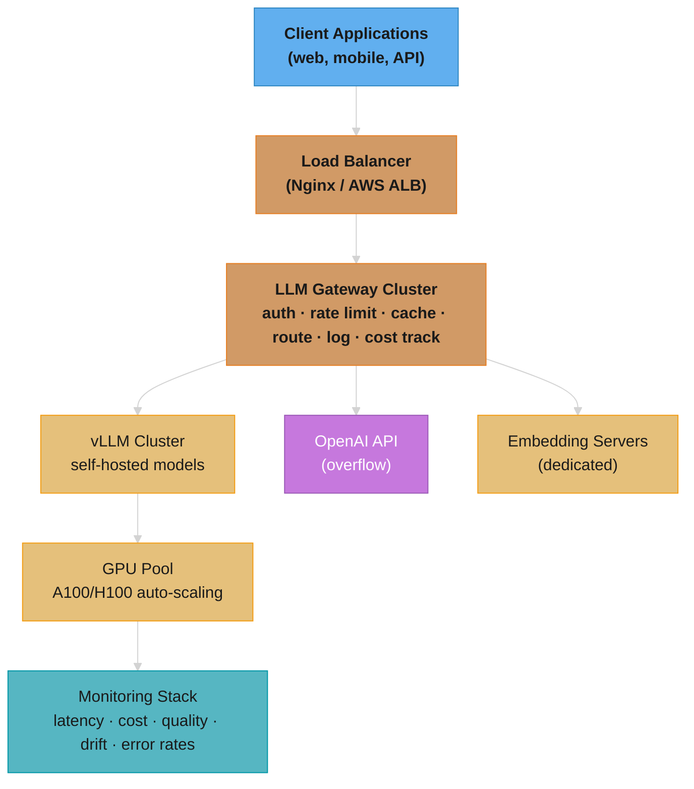
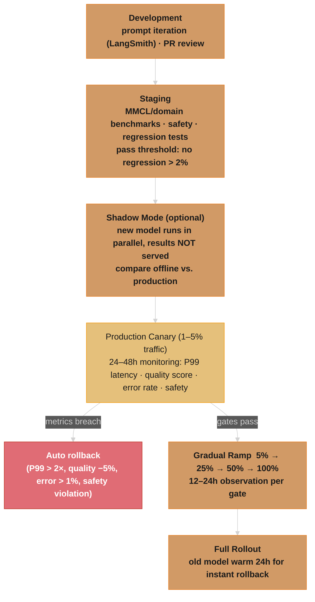

# Deployment & MLOps

## 1. Concept Overview

Deploying LLMs in production requires solving problems that don't exist with traditional software or even traditional ML: massive GPU memory requirements, extreme inference latency variability, multi-dimensional cost optimization (compute vs. API costs), and the challenge of monitoring outputs that are free-form text rather than discrete predictions.

LLM MLOps encompasses model serving infrastructure, cost management, monitoring for quality regressions, model routing, A/B testing, and the "data flywheel" — using production data to continuously improve the model. It's where the boundary between software engineering and ML engineering blurs most heavily.

---

## 2. Intuition

> **One-line analogy**: LLM deployment is like running a restaurant — you need to manage capacity (GPU servers), quality (model outputs), cost (GPU hours), and freshness (model updates) all simultaneously.

**Mental model**: Deploying a model isn't just starting a server. You need GPU instances (expensive, hard to scale quickly), a load balancer routing to multiple model replicas, monitoring for quality regressions (LLM outputs are text, not simple metrics), cost attribution (which user/team is consuming tokens), fallback routing (if main model fails, route to backup), and a pipeline to continuously improve the model from production data. Each of these is a solved problem in traditional software but requires LLM-specific adaptations.

**Why it matters**: A model that works in development can fail in production due to distribution shift, adversarial inputs, or cost overruns. MLOps for LLMs is the discipline that keeps production systems reliable, cost-effective, and continuously improving. Without it, even great models fail at scale.

**Key insight**: LLM monitoring is fundamentally different from traditional ML monitoring — you can't compute accuracy on free-form text outputs. LLM-as-judge, user feedback signals, and embedding drift detection replace traditional accuracy metrics.

---

## 3. Core Principles

- **GPU cost dominates**: For self-hosted LLMs, GPU compute is typically 60-80% of total cost. Every optimization decision flows from this.
- **Observability is non-negotiable**: LLM outputs are non-deterministic and hard to validate. You need extensive logging to understand failures.
- **Latency SLAs are user-facing**: Users notice latency. TTFT (Time to First Token) < 1 second is a hard requirement for conversational applications.
- **Gradual rollout**: LLMs can silently degrade (sycophancy, capability regression, safety issues). Always use A/B testing for major changes.
- **Prompts are code**: Treat prompt changes with the same rigor as code changes: version control, review, staged rollout. Store prompts in a registry with metadata (model, temperature, version, author) and require PR review before production deployment.
- **Canary everything**: Never roll out a model change, prompt change, or parameter tweak to 100% of traffic at once. Start at 1-5%, monitor for 24-48 hours, then gradually increase.
- **GPU memory is your scarcest resource**: A single long-context request or batch size spike can OOM a serving node. Monitor GPU memory utilization continuously and set alerts at 85% to prevent cascading failures.
- **Cost attribution enables accountability**: Without per-team/per-user cost tracking, LLM costs become an unowned shared expense that grows unchecked. The LLM gateway is the natural metering point.

---

## 4. Serving Architecture Patterns

### 4.1 API Gateway Pattern

A dedicated gateway handles all LLM traffic before reaching models:

```
Client Requests
     |
     v
[LLM Gateway]
  ├── Authentication & Authorization
  ├── Rate Limiting (per user/org/tier)
  ├── Request Validation (length, content filtering)
  ├── Prompt Template Injection (add system prompts)
  ├── Model Routing (route to appropriate model)
  ├── Caching (exact match cache, semantic cache)
  ├── Logging & Tracing
  └── Cost Tracking (tokens/$ per user)
     |
     v
[Model Serving Tier]
  ├── GPT-4o (complex queries)
  ├── GPT-4o-mini (simple queries)
  ├── Self-hosted 7B (high-volume, low-stakes)
  └── Specialized models (code, embedding, etc.)
```

### 4.2 Model Routing

Route queries to the appropriate model based on complexity (full treatment: [LLM Routing & Model Selection](../llm_routing_and_model_selection/README.md)):

```python
def route_request(query: str, user_tier: str) -> str:
    # Cost-aware routing
    if user_tier == "free":
        return "gpt-4o-mini"  # Cheap model for free tier

    # Complexity estimation
    complexity = estimate_complexity(query)

    if complexity < 0.3:
        return "gpt-4o-mini"   # Simple Q&A
    elif complexity < 0.7:
        return "gpt-4o"        # Medium complexity
    else:
        return "o1"            # Complex reasoning

def estimate_complexity(query: str) -> float:
    # Options:
    # 1. Length-based: longer = more complex (crude but fast)
    # 2. Keyword-based: "step by step", "prove", "analyze" → high complexity
    # 3. Small classifier model: 10ms latency, route based on predicted complexity
    # 4. Token confidence from cheap model: low confidence → escalate to expensive model
```

### 4.3 Semantic Caching

Cache LLM responses by semantic similarity of queries (deep dive: [LLM Caching](../llm_caching/README.md)):

```python
class SemanticCache:
    def __init__(self, similarity_threshold=0.95):
        self.cache = {}  # query_embedding → response
        self.vector_store = VectorStore()
        self.threshold = similarity_threshold

    def get(self, query: str) -> Optional[str]:
        embedding = embed(query)
        similar = self.vector_store.search(embedding, top_k=1)
        if similar and similar[0].score > self.threshold:
            return self.cache[similar[0].id]
        return None

    def put(self, query: str, response: str):
        embedding = embed(query)
        key = self.vector_store.insert(embedding)
        self.cache[key] = response
```

Hit rates for common applications:
- FAQ chatbots: 40-60% cache hit rate (highly repetitive queries)
- General Q&A: 10-20% cache hit rate
- Code generation: <5% cache hit rate (unique code inputs)

### 4.4 Prompt Versioning & Management

Prompts are the most frequently changed component in an LLM system. A git-like workflow for prompts prevents silent regressions:

```
Prompt Registry Schema:
  prompt_id:       "customer_support_v1"
  version:         "2.3.1"          (semantic versioning)
  model:           "gpt-4o"
  temperature:     0.7
  max_tokens:      1024
  author:          "alice@company.com"
  created_at:      "2025-03-15T10:00:00Z"
  approved_by:     "bob@company.com"
  status:          "production"      (draft | staging | production | deprecated)
  system_prompt:   "You are a helpful customer support agent..."
  tags:            ["customer_support", "tier_1"]

Workflow:
  1. Developer creates new prompt version (draft)
  2. Automated eval suite runs against golden dataset
  3. PR review by prompt engineering team
  4. Deploy to staging (internal traffic only)
  5. Canary to 5% production traffic
  6. Full rollout after 24-48 hours monitoring
  7. Previous version kept for instant rollback
```

```python
class PromptRegistry:
    """DB-backed prompt registry with version control."""

    def get_active_prompt(self, prompt_id: str, traffic_split: dict = None) -> Prompt:
        """Return the active prompt, respecting A/B test splits."""
        if traffic_split:
            # A/B testing: split traffic between prompt versions
            version = self._select_version(prompt_id, traffic_split)
        else:
            version = self._get_production_version(prompt_id)
        return self.db.get(prompt_id, version)

    def rollback(self, prompt_id: str):
        """Instant rollback to previous production version — no redeployment needed."""
        current = self._get_production_version(prompt_id)
        previous = self._get_previous_version(prompt_id)
        self.db.set_status(prompt_id, current, "deprecated")
        self.db.set_status(prompt_id, previous, "production")
        # Takes effect on next request — no model reload required
```

Key principle: Prompt changes go through PR review just like code. A one-word change to a system prompt can shift model behavior for millions of users.

---

## 5. Architecture Diagrams

### Full LLM Production Stack



### Deployment Pipeline with Canary Strategy



### Blue-Green for Model Serving
```
                    [Load Balancer / Ingress]
                           |
              +------------+------------+
              |                         |
         [Blue Stack]             [Green Stack]
         Model v2.1               Model v2.2
         3x A100 nodes            3x A100 nodes
         (serving 100%)           (pre-warmed, 0%)
                                       |
                              [Eval Suite Passes]
                                       |
                              [Switch traffic: Blue 0%, Green 100%]
                                       |
                              [Keep Blue alive 24h for rollback]
```

---

## 6. How It Works — Detailed Mechanics

### Cost Estimation and Optimization

```
Self-hosted model cost breakdown:
  GPU cost:           60-80% (H100 at $3-4/hr)
  Storage (model):    5-10% (SSD for model weights)
  Network egress:     5-15% (output tokens sent to clients)
  CPU/memory:         5-10% (gateway, preprocessing)

Cost per token estimation:
  H100 80GB @ $3/hr
  Throughput: 1000 tokens/sec (7B model, continuous batching)
  Cost: $3/hr / (1000 tokens/sec × 3600 sec) = $0.00000083 per token
  = $0.00083 per 1000 tokens

  Compare to OpenAI gpt-4o-mini: $0.15/1M input, $0.60/1M output
  Self-hosted 7B: ~$0.83 per 1M tokens = 40% cheaper for output
  But GPT-4o-mini is much higher quality than 7B

  Sweet spot: use self-hosted models where quality is sufficient,
              API models where quality is critical
```

**The idea behind it.** "You rent the GPU by the hour whether it is busy or not, so the price of a token is simply the hourly rent divided by however many tokens that hour produced."

That framing matters because the numerator (rent) is fixed the moment you provision the box, while the denominator (throughput) is something you control with batching, quantization, and a better serving engine. Every self-hosting cost win is a denominator win.

| Symbol | What it is |
|--------|------------|
| `$3/hr` | On-demand rent for one H100 80GB. Spot pricing cuts this 60-70% |
| `tokens/sec` | Sustained output throughput of the whole GPU, all concurrent requests summed |
| `3600` | Seconds in an hour. The unit bridge between "$/hr" and "$/token" |
| `$0.00000083` | Cost of one token. Too small to reason about — always restate per 1M |
| `$/1M tok` | The comparable unit. Every API provider quotes this, so convert to it |
| `$0.15/1M` | gpt-4o-mini input price, the API side of the comparison |

**Walk one example.** The H100 numbers from the block above, carried all the way to the comparable unit:

```
  rent                    = $3.00 per hour
  throughput              = 1,000 tokens/sec         (7B model, continuous batching)

  tokens produced in 1 hr = 1,000 x 3,600            = 3,600,000 tokens
  cost per token          = $3.00 / 3,600,000        = $0.00000083
  cost per 1K tokens      = $0.00000083 x 1,000      = $0.00083
  cost per 1M tokens      = $0.00000083 x 1,000,000  = $0.83

  vs gpt-4o-mini output   = $0.60 per 1M tokens      <- API is CHEAPER here
  vs gpt-4o-mini input    = $0.15 per 1M tokens      <- API is 5.5x cheaper here
```

The arithmetic says self-hosting a 7B at $0.83/1M loses to gpt-4o-mini's $0.60/1M output price outright — and loses badly on input. Self-hosting only wins once throughput climbs (bigger batches, FP8/INT4, better engine) or the GPU is bought on spot, both of which move one of the two numbers above.

**Why the "per hour" framing is the trap.** The formula silently assumes the GPU is saturated for the full hour. At 30% utilization your real denominator is 1,080,000 tokens, not 3,600,000, and the true cost per 1M tokens is `$0.83 / 0.30 = $2.77` — over 4x the API price. This is the single most common self-hosting cost miscalculation: the quoted number is a *peak-throughput* number, and idle GPU time is billed at exactly the same rate as busy GPU time.

### Monitoring LLM Quality

Traditional ML metrics (accuracy, F1) don't apply to free-form LLM output. Use:

```
1. Human feedback (gold standard):
   Thumbs up/down, ratings, corrections
   Expensive but most reliable
   Sample 1-2% of production traffic

2. LLM-as-judge (automated):
   Use GPT-4 to score responses on:
   - Helpfulness (1-5)
   - Accuracy (1-5)
   - Safety (0 or 1)
   - Groundedness (for RAG: 0 or 1)
   Cost: ~$0.01 per evaluation
   Suitable for: large-scale automated evaluation

3. Task-specific metrics:
   Code: execution rate, test pass rate
   SQL: execution success, result correctness
   Summarization: ROUGE, BERTScore
   RAG: faithfulness, answer relevance (RAGAS)

4. Behavioral metrics:
   Refusal rate (are we refusing too much or too little?)
   Response length distribution (shift indicates prompt regression)
   Tool call success rate (for agents)
   Hallucination rate (for RAG, check against sources)
```

### Auto-Scaling Strategy

```
Metric-based scaling:
  Scale up trigger: GPU utilization > 80% for 3 consecutive minutes
  Scale down trigger: GPU utilization < 30% for 10 minutes

Queue-based scaling:
  Scale up: request queue depth > 50
  Scale down: request queue depth = 0 for 5 minutes

Scheduled scaling:
  Pre-scale for known traffic patterns (weekday 9am, product launches)

Cold start problem:
  LLM model loading: 30s for 7B, 3min for 70B
  Solutions:
    Keep minimum 1 replica always running
    Pre-warm with dummy requests
    Use model caching on persistent volumes (avoid re-download)
```

The triggers above tell a replica *when* to appear. They do not tell you *how many* to
run. That comes from Little's Law, the one capacity formula every serving system reduces to:

```
  concurrency = QPS x latency_seconds

  replicas    = ceil( concurrency / (per_replica_concurrency x target_utilization) )
```

**Stated plainly.** "The number of requests in flight at any instant equals how fast they arrive multiplied by how long each one stays — so size the fleet to hold that many at once, with headroom."

The reason this matters is that neither QPS nor latency alone tells you anything about fleet size. A system at 100 QPS with 50ms responses needs 5 concurrent slots; the same 100 QPS with 5-second LLM responses needs 500. LLM latency is 10-100x traditional web latency, which is exactly why LLM fleets look absurdly oversized next to the QPS number.

| Symbol | What it is |
|--------|------------|
| `QPS` | Arrival rate. Use *peak* QPS, never the monthly average |
| `latency_seconds` | End-to-end time a request occupies a slot. Use p95, not p50 |
| `concurrency` | Requests in flight at one instant. The actual thing you provision for |
| `per_replica_concurrency` | How many simultaneous sequences one GPU replica can decode. KV-cache bound |
| `target_utilization` | Headroom factor, typically 0.6-0.8. Above this, queueing latency explodes |
| `ceil(...)` | Round up. You cannot run 2.9 GPUs |

**Walk one example.** The case study platform in Section 14 — 40M requests/month, p50 800ms:

```
  avg QPS  = 40,000,000 / (30 x 86,400 sec)   = 15.4 QPS
  peak QPS = 15.4 x 3       (3x diurnal peak) = 46.2 QPS

  concurrency = 46.2 QPS x 0.8 sec            = 37 requests in flight

  per_replica_concurrency = 16                (KV cache limit for this model/GPU)
  target_utilization      = 0.80              (leave 20% for bursts)
  effective per replica   = 16 x 0.80         = 12.8 slots

  replicas = ceil( 37 / 12.8 ) = ceil(2.89)   = 3 replicas
```

Three replicas carry a 40M-request month. Note how sensitive this is: if p95 latency is
2.4 seconds rather than the 800ms p50, concurrency becomes `46.2 x 2.4 = 111` and you need
`ceil(111 / 12.8) = 9` replicas — 3x the fleet from a latency number, with QPS unchanged.
Sizing on p50 is how teams under-provision by a factor of three.

**Why `target_utilization` exists.** Remove it and you size for exactly 100% occupancy, which
by queueing theory means unbounded wait time — the moment arrivals fluctuate above the mean
(and they always do), requests queue, latency rises, which raises concurrency, which queues
more requests. The headroom factor is what keeps that feedback loop from running away. It is
also why the "FIXED" HPA in Common Pitfalls drops `targetGPUUtilization` from 80 to 60: scaling
out earlier is cheaper than riding the knee of the latency curve.

### Batch Size vs Latency

Batching is the throughput lever, and it trades directly against per-user speed:

```
  per_user_token_rate = 1 / step_time_seconds
  gpu_throughput      = batch_size / step_time_seconds
```

**What the formula is telling you.** "Every decode step emits one token for every request in the batch, so a bigger batch multiplies total output while each individual user waits slightly longer per token."

The asymmetry is the whole point: step time grows *sublinearly* with batch size (decode is
memory-bandwidth bound, so loading the weights once serves the whole batch), while output
grows linearly. That gap is free throughput.

| Symbol | What it is |
|--------|------------|
| `batch_size` | Sequences decoded simultaneously in one forward pass |
| `step_time` | Wall time for one decode step. Grows slowly with batch, not proportionally |
| `TPOT` | `step_time` from a single user's view. The streaming smoothness metric |
| `TTFT` | Prefill + queue wait. Governed by batching *policy*, not batch size |

**Walk one example.** One GPU, decode-bound, measured step times:

```
  batch   step_time    per-user tok/s    GPU total tok/s    relative $/token
  -----   ---------    --------------    ---------------    ----------------
      1      20 ms          50.0                 50               1.00x
      8      25 ms          40.0                320               0.16x
     16      32 ms          31.3                500               0.10x
     32      50 ms          20.0                640               0.08x

  batch 1 -> 32:  per-user speed  50.0 -> 20.0 tok/s   = 2.5x SLOWER
                  GPU throughput    50 ->  640 tok/s   = 12.8x MORE
                  cost per token                       = 12.8x CHEAPER
```

You pay 2.5x in per-user token rate to buy 12.8x in cost. At batch 32 a user still receives
20 tokens/sec — roughly 15 words/sec, comfortably faster than anyone reads — so the latency
"cost" is invisible while the cost saving is not. That is why continuous batching is
non-negotiable for self-hosted serving, and why the 1,000 tokens/sec figure in the cost block
above is only reachable with batching on.

**Why this does not fix TTFT.** Batch size sets the *steady-state* token rate; it does nothing
for time to first token, which is prefill plus queue wait. Push batch size high enough and TTFT
actually gets *worse*, because new arrivals wait for a batch slot. This is the exact failure in
Common Pitfalls #2 — a dashboard showing record tokens/second while users report the app is
slow, because the metric being optimized is not the metric being felt.

### Observability Stack

```
Request tracing (OpenTelemetry):
  trace_id → span for each component
  LLM call: input_tokens, output_tokens, model, latency, cost
  Cache: hit/miss, latency savings
  Routing: which model selected, routing reason

Metrics (Prometheus + Grafana):
  request_count, error_rate, latency_p50/p99
  cost_per_request, tokens_per_second
  gpu_utilization, gpu_memory_used
  cache_hit_rate

Logs (structured JSON):
  { "trace_id": "...", "model": "gpt-4o", "user_id": "...",
    "input_tokens": 500, "output_tokens": 150, "latency_ms": 1200,
    "cost_usd": 0.0015, "cache_hit": false, "safety_flag": false }

Quality dashboard:
  Daily: helpfulness score (LLM-as-judge), refusal rate, error rate
  Weekly: regression tests vs. baseline, human eval sample
  Monthly: A/B test results, model upgrade candidates
```

### Reading Latency Percentiles

`latency_p50/p99` appears in the metrics list above and as an SLA in the case study. It is
routinely misread:

```
  p99 = 3,000 ms  means:  99% of requests finished in under 3,000 ms
                          1 in 100 requests took LONGER than 3,000 ms
```

**What this actually says.** "p99 is not 'the slow case' — it is the promise you keep 99 times out of 100, and the 1 time you break it is a real user having a real bad experience."

Percentiles matter more than averages for LLM serving because the latency distribution is
violently long-tailed: queueing, prefill of a long prompt, a KV-cache eviction, or a cold
replica all produce outliers that an average absorbs and hides.

| Symbol | What it is |
|--------|------------|
| `p50` | Half of requests are faster. What a typical user feels |
| `p95` | 1 in 20 requests is slower. The right number for capacity sizing |
| `p99` | 1 in 100 is slower. The usual SLA line |
| `p99.9` | 1 in 1,000. Where GC pauses and cold starts live |
| `2 sigma` | Two standard deviations from the mean. The alerting threshold in Section 12 |

**Walk one example — why percentiles do not add across a chain.** A request crosses four
services, each with its own p99. The intuition "p99 of the chain = sum of the p99s" is wrong
in both directions:

```
  stage           p50      p99      P(this stage is in ITS OWN slow 1%)
  -------------   ------   ------   -----------------------------------
  gateway          10 ms     80 ms                 0.01
  retrieval        60 ms    400 ms                 0.01
  LLM decode      600 ms  2,200 ms                 0.01
  guardrail        30 ms    320 ms                 0.01

  P(no stage is slow) = 0.99 x 0.99 x 0.99 x 0.99 = 0.9606
  P(at least one is slow) = 1 - 0.9606             = 0.0394  -> 3.94%

  So ~4 requests in 100 hit SOME tail, not 1 in 100.
  Sum of p50s =  700 ms   <- what a naive "typical" estimate gives
  Sum of p99s = 3,000 ms  <- an UPPER bound, requires all four to spike together
  Real chain p99 sits between: usually one stage tails while the rest run at p50
                              ~ 600 + 2,200 - 600 = 2,200 ms dominated by LLM decode
```

Two lessons fall out. First, tail probability *compounds*: chaining four independent 99%
services yields a 96% service, so each stage must individually be better than the end-to-end
target. Second, one stage usually dominates the tail — here LLM decode — so tail work should
go entirely into that stage rather than being spread evenly.

### SLO and Error Budget Arithmetic

An availability SLA converts to a concrete number of minutes you are permitted to be down:

```
  error_budget_minutes = (1 - SLO) x minutes_in_period

  burn_rate = observed_bad_minutes / error_budget_minutes
```

**In plain terms.** "An SLO of 99.95% is not a promise of perfection — it is a budget of 22 downtime minutes per month that you are allowed, and encouraged, to spend."

Framing failure as a *budget* rather than a *violation* is what makes the number actionable:
budget remaining is the argument for shipping the risky change, and budget exhausted is the
argument for a change freeze. It turns reliability from an opinion into arithmetic.

| Symbol | What it is |
|--------|------------|
| `SLI` | The measured number, e.g. "fraction of requests served under 3s" |
| `SLO` | The internal target for that number, e.g. 99.95% |
| `SLA` | The contractual version, with money attached. Always looser than the SLO |
| `1 - SLO` | The failure fraction. 99.95% -> 0.0005 |
| `error budget` | Failure fraction expressed as time or requests. The spendable quantity |
| `burn rate` | Budget consumed per unit time. Burn rate 1.0 = exactly on pace to exhaust it |

**Walk one example.** The case study's 99.95% availability SLA and its 14 failover events:

```
  minutes in a 30-day month = 30 x 24 x 60          = 43,200 min
  failure fraction          = 1 - 0.9995            = 0.0005

  error budget = 0.0005 x 43,200                    = 21.6 min/month  (the "< 22 min")

  observed over 90 days: 14 failover events x 38 s  = 532 sec = 8.87 min
  per month             = 8.87 / 3                  = 2.96 min/month

  burn rate = 2.96 / 21.6                           = 0.137  -> 13.7% of budget used

  Remaining budget = 21.6 - 2.96 = 18.6 min/month   <- room to ship
```

At 13.7% burn the fallback chain is not the reliability risk — there is 18.6 minutes of budget
left to spend on canaries and model swaps. Had those same 14 events each lasted 2 minutes
instead of 38 seconds, the burn would be `9.33 / 21.6 = 0.43` per month, and a single bad
deploy would blow the quarter.

**Why the budget must be a rate, not a count.** A raw "we were down 20 minutes" says nothing
without the window. Burn rate normalizes it, which is what lets you alert on *trajectory* —
a 14x burn rate for one hour consumes a month of budget and should page immediately, even
though total downtime so far is only 8 minutes.

### GPU Memory Monitoring & OOM Prevention

GPU memory is the most constrained resource in LLM serving. A single OOM crash kills all in-flight requests on that node. Serving-engine-level memory mechanics (PagedAttention, KV block management, preemption) are covered in [vLLM Deep Dive](../vllm_deep_dive/README.md).

```
GPU Memory Budget (A100 80GB serving LLaMA 3 70B in INT4):
  Model weights (INT4):    ~35-40 GB
  KV cache (peak):         ~25-30 GB (depends on batch size + context length)
  Activation memory:       ~3-5 GB
  CUDA overhead:           ~2-3 GB
  ─────────────────────────────────
  Total at peak:           ~65-78 GB out of 80 GB
  Headroom:                2-15 GB (dangerously thin at peak)

GPU Memory Budget (A100 80GB serving LLaMA 3 8B in FP16):
  Model weights (FP16):    ~16 GB
  KV cache (peak):         ~30-40 GB (high batch sizes possible)
  Activation memory:       ~2-3 GB
  CUDA overhead:           ~2 GB
  ─────────────────────────────────
  Total at peak:           ~50-61 GB
  Headroom:                19-30 GB (comfortable)
```

**Read it like this.** "GPU memory is a fixed 80 GB drawer: weights take a fixed, known slice, and everything left over is KV cache — which is the only part that grows with traffic, and therefore the only part that can kill you."

The budget matters because three of the four line items are constants you can compute before
deploying. Only KV cache is a function of load, so "how much headroom do I have" is really
"how many more concurrent tokens can I hold."

| Symbol | What it is |
|--------|------------|
| `INT4` | 4-bit weights. Roughly 0.5 bytes per parameter |
| `FP16` | 16-bit weights. 2 bytes per parameter |
| `KV cache` | Stored keys and values for every token of every live sequence. The variable term |
| `utilization %` | `used / total`. The 75/85/95% alert ladder is set on this |
| `headroom` | `total - peak`. Absorbs one long-context request or one batch spike |

**Walk one example.** The 70B INT4 budget above, turned into the utilization number the alerts
actually fire on, and then stress-tested with one long-context arrival:

```
  capacity                = 80 GB

  weights (INT4, fixed)   = 40 GB      50.0% of the card, and it never moves
  activations (fixed)     =  5 GB       6.3%
  CUDA overhead (fixed)   =  3 GB       3.8%
                            -----      -----
  fixed floor             = 48 GB      60.0%   <- occupied before ONE request arrives
  available for KV cache  = 32 GB      40.0%

  at peak KV cache        = 30 GB  ->  total 78 GB / 80 GB = 97.5% utilization
                                       -> past the 95% EMERGENCY threshold

  now add one 128K-token request (4-8 GB of KV per Common Pitfalls #8):
    78 GB + 6 GB = 84 GB  >  80 GB     -> OOM, and every in-flight request dies
```

Compare the 8B FP16 row: a 16 GB fixed floor leaves 64 GB for KV cache, so peak occupancy is
`(16 + 40 + 3 + 2) / 80 = 76%` and the same 6 GB long-context arrival lands at 84% — inside
the CRITICAL alert band but still alive. Same GPU, same request; the difference is entirely
how much of the drawer the weights claimed up front.

**Why 85% is the critical line and not 95%.** The alert must fire while there is still time to
act. Degradation (shrink batch, reject long contexts, shed to an API provider) takes seconds to
take effect, and KV cache can grow by several GB in that window. At 95% you are already
allocating into the last few GB and the malloc that fails is the one that kills the process —
so the threshold is set where the remaining 12 GB buys enough seconds for the degradation
chain to run.

```
Monitoring Strategy:
  Alert thresholds:
    WARNING:  GPU memory utilization > 75% sustained 2 min
    CRITICAL: GPU memory utilization > 85% sustained 1 min
    EMERGENCY: GPU memory utilization > 95% → immediate load shedding

  Memory pressure signals (early warning):
    - Increasing CUDA malloc retries (visible in nvidia-smi or DCGM)
    - KV cache eviction rate climbing (vLLM metrics)
    - Batch size auto-reduction triggering (inference engine adapting)
    - Swap usage appearing (should always be zero for GPU workloads)

  Graceful degradation chain:
    1. Reduce max batch size (fewer concurrent requests)
    2. Reduce max context length (reject requests > N tokens)
    3. Route overflow to CPU fallback or API provider
    4. Reject new requests with 503 (last resort)

  Common OOM causes:
    - Long context request: single 128K-token request consumes 4-8 GB KV cache
    - Batch size spike: burst of concurrent requests fills KV cache
    - Memory leaks in custom pre/post-processing code
    - Model loaded at higher precision than expected (FP16 instead of INT4)

  Tools:
    nvidia-smi:            Basic GPU monitoring (poll every 5s)
    DCGM (Data Center GPU Manager): Production-grade GPU telemetry
    Prometheus GPU exporter: dcgm-exporter → Prometheus → Grafana
    K8s device plugin:      GPU resource limits in pod specs
    vLLM metrics endpoint:  /metrics exposes KV cache utilization, batch size
```

### Cost Allocation & Chargeback

Without per-team cost attribution, LLM costs become an uncontrolled shared expense. The LLM gateway is the natural metering point.

```
Request tagging:
  Every request includes metadata:
    { "team": "search", "project": "product_search",
      "user_id": "u_12345", "cost_center": "CC-4200",
      "environment": "production" }

  Gateway enriches with cost data:
    { ...metadata,
      "model": "gpt-4o", "input_tokens": 1200, "output_tokens": 450,
      "cost_usd": 0.0105, "cache_hit": false,
      "timestamp": "2025-03-15T14:30:00Z" }

Cost aggregation pipeline:
  Gateway → Kafka topic (llm-usage) → Flink/Spark aggregation → Cost DB
    → Daily rollup per team/project/model
    → Weekly chargeback report
    → Monthly invoice to cost center

Chargeback models:
  Showback (visibility only):
    Teams see their costs on a dashboard
    No actual billing — used for awareness
    Good starting point before enforcement

  Chargeback (actual billing):
    Each team's budget is debited based on usage
    Requires finance system integration
    Creates accountability but adds friction

Budget management:
  WARN:  Team usage reaches 80% of monthly budget → Slack/email alert
  SOFT:  Team reaches 100% → alert + manager approval for continued usage
  HARD:  Team reaches 120% → requests throttled or routed to cheaper model

Dashboard metrics (per team, per day):
  - Total tokens consumed (input + output)
  - Total cost ($)
  - Cost per query (average)
  - Model mix (% of queries per model)
  - Cost trend (7-day moving average)
  - Top 10 most expensive queries (for optimization)
```

```python
class CostTracker:
    """Per-request cost tracking at the gateway layer."""

    MODEL_PRICING = {
        "gpt-4o":      {"input": 2.50, "output": 10.00},   # per 1M tokens
        "gpt-4o-mini": {"input": 0.15, "output": 0.60},
        "claude-3.5":  {"input": 3.00, "output": 15.00},
    }

    def track(self, request: LLMRequest, response: LLMResponse):
        pricing = self.MODEL_PRICING[request.model]
        cost = (
            (request.input_tokens / 1_000_000) * pricing["input"] +
            (response.output_tokens / 1_000_000) * pricing["output"]
        )
        self.emit_metric(
            team=request.metadata["team"],
            project=request.metadata["project"],
            model=request.model,
            cost_usd=cost,
            input_tokens=request.input_tokens,
            output_tokens=response.output_tokens,
        )
        self.check_budget(request.metadata["team"], cost)
```

**What it means.** "Divide each token count by a million to get 'how many millions of tokens', multiply by the per-million price for that direction, and add the two — because input and output tokens are priced differently."

The `/ 1_000_000` is the only subtle part, and it exists purely because providers quote prices
per million tokens while requests carry raw token counts. Getting this factor wrong by 1,000x
is the classic cost-dashboard bug — and it fails silently, since the number still looks
plausible.

| Symbol | What it is |
|--------|------------|
| `input_tokens` | Prompt plus system prompt plus retrieved context. Usually the larger count |
| `output_tokens` | Generated tokens. Usually 4-10x more expensive per token |
| `1_000_000` | Unit bridge. Converts raw counts into the "per 1M tokens" price unit |
| `pricing["input"]` | Dollars per 1M input tokens. gpt-4o: 2.50 |
| `pricing["output"]` | Dollars per 1M output tokens. gpt-4o: 10.00 |

**Walk one example.** The gpt-4o request logged in the tagging block above (1,200 in, 450 out):

```
  input  = (1,200 / 1,000,000) x $2.50   = 0.0012 x 2.50   = $0.00300
  output = (  450 / 1,000,000) x $10.00  = 0.00045 x 10.00 = $0.00450
                                                             ---------
  total cost                                               = $0.00750

  same request on gpt-4o-mini:
  input  = 0.0012  x $0.15 = $0.00018
  output = 0.00045 x $0.60 = $0.00027   -> total $0.00045   = 16.7x cheaper
```

Note the shape: output is only 27% of the token count but 60% of the cost, because output is
priced 4x higher. This is why `max_tokens` ceilings are a cost control and truncating the
prompt usually is not — and why routing a query to gpt-4o-mini saves 16.7x while trimming
context saves single-digit percentages.

---

## 7. Real-World Examples

### OpenAI's Infrastructure
- Thousands of H100s across Azure regions
- Custom model routing: trivial queries → smaller cached model; complex → full model
- Semantic caching for common prompts at scale
- Real-time cost tracking per API key; rate limiting by tier
- Dashboard shows per-model latency and utilization in real time

### Anthropic's Claude Deployment
- Multi-region for latency (US, EU, APAC)
- Progressive rollouts for new Claude versions (internal → beta → production)
- Extensive safety monitoring: harmful output rate, refusal calibration
- A/B testing of system prompt changes across user cohorts

### Netflix LLM Platform
- Internal LLM gateway for all ML teams — the central metering point for cost attribution
- Model catalog: approved models + their cost/quality characteristics
- Shared observability: all teams' LLM usage in one dashboard
- Chargeback by team: each team sees their LLM cost, broken down by model and project
- Budget alerts at 80% of monthly allocation; hard caps enforced at the gateway level
- Fine-tuned models for specific use cases (content recommendation copy, A/B test variants)

### Stripe's Prompt Management
- All production prompts stored in a versioned registry with metadata (model, temperature, author)
- Prompt changes require PR approval from both engineering and product
- A/B testing framework splits traffic between prompt versions, measuring task completion rate
- Rollback capability: revert to any previous prompt version in under 60 seconds without redeployment
- Shadow mode for new models: run alongside production for 48 hours before any traffic shift

---

## 8. Tradeoffs

| Decision | Self-Hosted | Managed API |
|----------|------------|-------------|
| Cost at scale | Low (amortized GPU) | High ($0.01-0.10/1K tokens) |
| Setup complexity | High | None |
| Latency | Low (no external calls) | Variable (network + queuing) |
| Model quality | Limited to open models | Best models available |
| Data privacy | Full control | Vendor dependency |
| Scaling | Manual/complex | Auto (pay per use) |

| Serving Strategy | Throughput | Latency | Cost |
|-----------------|-----------|---------|------|
| Single replica | Low | Low | Medium |
| Horizontal scale | High | Low | High |
| Semantic cache | Medium | Very low (cache hits) | Low |
| Model routing | Medium | Low | Low (uses cheap model) |

| Rollout Strategy | Risk | Speed | Complexity | GPU Overhead |
|-----------------|------|-------|------------|--------------|
| Big-bang deploy | High | Fast | Low | None |
| Canary (1-5%) | Low | Slow (24-48h) | Medium | +5% GPU capacity |
| Blue-green | Low | Medium (minutes) | High | 2x GPU capacity |
| Shadow mode | None (no user impact) | Slow | High | 2x GPU capacity |

| Cost Model | Accountability | Friction | Implementation |
|------------|---------------|----------|----------------|
| No tracking | None | None | None |
| Showback (visibility) | Low-medium | Low | Dashboard only |
| Chargeback (billing) | High | Medium | Finance integration |
| Hard budget caps | Very high | High | Gateway enforcement |

---

## 9. When to Use / When NOT to Use

### Self-Host When:
- Processing >10M tokens/day (economies of scale justify GPU cost)
- Data privacy requirements prevent external API usage
- Need model customization beyond API capabilities
- Need guaranteed SLAs not available from API providers

### Use Managed API When:
- <1M tokens/day (API is cheaper than idle GPU time)
- Need cutting-edge model quality (GPT-4o, Claude 3.5)
- Don't have ML infrastructure expertise
- Fast time-to-market is the priority

---

## 10. Common Pitfalls

1. **No prompt versioning**: A team changed one word in a system prompt ("concise" to "brief") and response quality dropped 15% across the board. Without versioning, it took 3 days to identify the change. Store every prompt version with metadata, diff capability, and instant rollback.
2. **Ignoring TTFT**: Optimizing throughput but not latency; users perceive TTFT as the response time.
3. **No cost budgets**: A buggy agent loop burned $14,000 in API costs in 4 hours before anyone noticed. Set per-team budget alerts at 80% and hard caps at 100% of monthly allocation.
4. **Monitoring only technical metrics**: Tracking p99 latency but not output quality; a model can be fast and wrong.
5. **Cold start in auto-scaling**: Scaling to zero to save money but 70B models take 3+ minutes to load. Set minimum replicas = 1.

   ```yaml
   # BROKEN: scale-to-zero HPA — first request after an idle period waits 3+ min
   # while the 70B model downloads and loads into GPU memory
   minReplicas: 0
   targetGPUUtilization: 80
   ```
   ```yaml
   # FIXED: always-warm floor + earlier scale-out; cache weights on a persistent
   # volume so new replicas load from disk (30s-3min) instead of re-downloading
   minReplicas: 1
   targetGPUUtilization: 60
   ```
6. **No rate limiting per user**: One user floods the system with requests, degrading experience for others.
7. **Skipping canary for "minor" model updates**: A team deployed a quantized model variant directly to 100% traffic. The INT4 quantization introduced subtle quality regressions in math tasks that only appeared under production query distribution. Always canary model changes, even minor ones -- start at 1-5% traffic, monitor for 24-48 hours, compare quality metrics against the baseline.
8. **GPU OOM from long-context requests**: A single 128K-token request consumed 6 GB of KV cache and OOM-killed the serving process, dropping all 47 concurrent requests on that node. Set per-request context length limits, monitor GPU memory at 85% threshold, and implement graceful degradation (reduce batch size before rejecting requests).
9. **Cost allocation without enforcement**: Dashboards showing per-team costs were ignored for months until the monthly LLM bill hit $180K. Showback (visibility) alone is not enough -- implement budget alerts and, eventually, hard caps or automatic routing to cheaper models when budgets are exhausted.
10. **No shadow mode before major model swaps**: Switching from GPT-4 to GPT-4o directly in production revealed prompt incompatibilities that caused 8% of responses to be malformed JSON. Shadow mode (running the new model in parallel without serving results) would have caught this offline.

---

## 11. Technologies & Tools

| Tool | Purpose | Notes |
|------|---------|-------|
| **LangSmith** | LLM observability | Traces, evaluations, prompt management |
| **Langfuse** | Open-source observability | Self-hostable alternative to LangSmith |
| **Helicone** | LLM proxy + analytics | Drop-in proxy; zero code change |
| **Arize Phoenix** | ML + LLM monitoring | Good for RAG evaluation |
| **Prometheus + Grafana** | Metrics | GPU utilization, latency, throughput |
| **OpenTelemetry** | Distributed tracing | Trace across gateway → model → tools |
| **LiteLLM** | Multi-provider gateway | Route between OpenAI, Anthropic, local |
| **Portkey** | LLM gateway | Routing, caching, fallbacks |
| **Modal** | Serverless GPU | Auto-scale LLM inference on demand |
| **Ray Serve** | Model serving | Multi-model, auto-scaling |

---

## 12. Interview Questions with Answers

**Q: How would you design an LLM gateway for a large enterprise?**
A: Key components: (1) Authentication — API key management per team/user with rate limits; (2) Request routing — complexity-based routing to appropriate model (cheap for simple, expensive for complex); (3) Semantic caching — cache responses for similar queries; (4) Cost tracking — per-team, per-user cost attribution and budgets; (5) Observability — structured logging of every request/response with cost, latency, model; (6) Guardrails — input/output filtering before/after LLM; (7) Fallback — if primary model is down/slow, route to fallback. Deploy as a horizontal service with load balancing.

**Q: How do you monitor LLM output quality in production?**
A: Multi-layered approach: (1) Automated metrics — LLM-as-judge scoring helpfulness/safety on 1-5% sample; task-specific metrics (code execution rate, SQL validity); (2) User signals — thumbs up/down, session continuation, correction edits; (3) Regression benchmarks — run standard benchmarks (MMLU, domain-specific) on every model/prompt change; (4) Behavioral monitors — track refusal rate, response length distribution, hallucination rate for RAG. Alert when metrics deviate >2σ from baseline.

**Q: Why must prompt changes go through the same release process as code changes?**
A: Because a one-word prompt edit can shift model behavior for every user instantly, with no compile step or failing test to catch it — see the war story above where changing "concise" to "brief" dropped response quality 15% and took 3 days to trace because nothing was versioned. Treat prompts as code: store them in a registry with semantic versioning and metadata (model, temperature, author, approver), require PR review plus an automated eval run against a golden dataset before promotion, canary at 1-5% traffic, and keep the previous version flagged for instant rollback — the registry flips the production pointer with no redeployment. The maturity test: can you answer "what exactly changed in the prompt last Tuesday, and can we revert in under a minute?"

**Q: How do you stop a buggy agent loop or misconfigured client from burning thousands of dollars in API costs?**
A: Enforce spend limits synchronously at the gateway, not asynchronously in reporting: per-user and per-team budgets with alerts at 80%, soft caps (approval required) at 100%, and hard throttling or automatic downgrade to a cheaper model at 120%. The canonical incident: a retry loop without backoff burned $14,000 in 4 hours because cost was only visible in the monthly invoice. Add per-request max_tokens ceilings, per-session request caps, and an anomaly alert when cost-per-minute deviates more than 3x from the 7-day baseline. Daily cost reports discover the fire after the house has burned down — the metering point must be able to say no in real time.

**Q: Why can a deployment look healthy on throughput dashboards while users complain it is slow?**
A: Because users perceive TTFT (time to first token), not aggregate throughput — a system streaming at high tokens/second but taking 4 seconds to emit the first token feels broken. TTFT and total latency have different causes: TTFT is dominated by queueing, prompt prefill, and any retrieval/preprocessing before generation; steady-state token rate is dominated by decode throughput and batching policy. Track TTFT p50/p99 as first-class SLIs (under 1 second for conversational apps), and improve it with prefix/prompt caching, routing simple queries to smaller models, and streaming from the very first token.

**Q: What is the data flywheel for LLM products?**
A: The data flywheel: production use → more user data (conversations, feedback) → better training data → better model → better product → more users → more data. Specifically: collect user feedback (explicit ratings, implicit signals like edits/regenerations) → filter for high-quality examples → use for fine-tuning or RLHF → deploy better model → repeat. This compounds over time; companies with more users get better data and faster improvement cycles.

**Q: How would you implement model A/B testing for LLMs?**
A: (1) Traffic splitting — route N% of users to model B using consistent hashing on user_id; (2) Metric definition — define primary metric (task completion, user satisfaction score, cost efficiency) and guardrails (no safety regression, no latency increase >20%); (3) Sample size — use statistical power analysis to determine minimum sample size; (4) Duration — run for at least 1 week to capture weekly patterns; (5) Analysis — compare primary metric with statistical significance test (Mann-Whitney for non-normal distributions); (6) Rollback trigger — define automatic rollback if guardrail breached.

**Q: How do you implement blue-green deployment for LLM services?**
Blue-green deployment for LLMs maintains two identical production environments (blue and green), routing traffic to one while updating the other. The LLM-specific challenges: (1) model loading takes 2-10 minutes for large models (loading weights into GPU memory), so the new environment must be pre-warmed before traffic switch; (2) KV cache and prefix cache on the old environment are lost during switch — plan for a temporary latency spike; (3) model quality validation must happen before switching — run an automated eval suite on the green environment with 100+ test cases covering key use cases. Implementation: use Kubernetes with two deployments behind an Ingress or service mesh (Istio), switch traffic via label selector update. Canary variant: route 5% of traffic to the new model first, monitor quality metrics (LLM-as-judge scores, user feedback, latency) for 1-2 hours, then gradually increase to 100%. Rollback: keep the old deployment running for 24 hours after full switch.

**Q: What is shadow mode deployment and when is doubling your inference cost worth it?**
Shadow mode runs a candidate model or prompt on a copy of production traffic without serving its outputs — responses are logged and compared offline against the live system. It catches distribution-specific failures that offline benchmarks miss: the GPT-4 to GPT-4o swap in Common Pitfalls above produced malformed JSON in 8% of responses only under the production query distribution, which shadow mode would have surfaced with zero user impact. The cost is running inference twice, so in practice shadow a 5-20% traffic sample rather than 100% to bound spend. Use it for major model swaps, provider migrations, and prompt overhauls; skip it for parameter tweaks where a 1-5% canary carries acceptable risk.

**Q: How does semantic caching work for LLM applications and when is it cost-effective?**
Semantic caching stores LLM responses keyed by the semantic meaning of the query (not exact string match), returning cached responses for semantically similar queries. Implementation: embed each query, search a vector index of previous queries, and if similarity exceeds a threshold (cosine > 0.95), return the cached response. Cost-effective when: (1) queries are repetitive — customer support bots see 30-60% repeated questions; (2) responses are deterministic — factual lookups, not creative generation; (3) LLM cost is high — caching saves $0.01-$0.10 per cached hit. Not effective when: responses must be personalized, queries are unique (research, coding), or freshness matters (news, stock prices). Cache invalidation is the hard part — when underlying data changes, semantically cached responses become stale. Set TTLs based on data change frequency: 24 hours for product info, 1 hour for pricing, no caching for real-time data. GPTCache is an open-source implementation. At 50% cache hit rate with GPT-4o, semantic caching reduces LLM costs by 40-50%.

**Q: How do you design a model routing system for multi-model deployments?**
Model routing directs each query to the optimal model based on complexity, cost budget, and quality requirements. Architecture: (1) a lightweight classifier (fine-tuned BERT or rule-based) analyzes the incoming query; (2) routes to cheap model (GPT-4o-mini, LLaMA 8B) for simple queries or expensive model (GPT-4o, Claude 3.5 Sonnet) for complex ones. Routing signals: query length, topic classification, required reasoning depth (presence of "compare," "analyze," "why"), user tier (premium vs free). Implementation pattern: route 70-80% of traffic to the cheap model, 20-30% to the expensive model. Quality control: run a random 5% of cheap-model responses through the expensive model to verify quality isn't degrading. Cost impact: routing saves 50-70% vs sending everything to the expensive model, with only 2-5% quality degradation on average. Martian and Unify offer managed routing; for custom routing, train a classifier on (query, best_model) pairs collected from A/B testing.

**Q: How do you estimate and optimize GPU cost for LLM serving?**
GPU cost estimation starts with throughput capacity: an A100 80GB serving LLaMA 3 8B with vLLM achieves ~1,200 tokens/second throughput. At $2/hour (cloud spot pricing), that's $0.0017 per 1K tokens. Compare to GPT-4o-mini at $0.60 per 1M output tokens ($0.0006/1K) — API is cheaper at low volume. Break-even calculation: self-hosted becomes cheaper when monthly volume exceeds the point where (GPU_cost_per_month) < (API_cost_per_token * monthly_tokens). For A100 at $1,500/month vs GPT-4o-mini: break-even at ~2.5B tokens/month (~83M tokens/day). Optimization strategies: (1) right-size GPU — use T4 for small models, A10G for medium, A100/H100 for large; (2) spot instances for batch workloads (60-70% savings); (3) quantization — FP8 or INT4 models serve from smaller/fewer GPUs; (4) batching — higher batch sizes increase throughput linearly up to memory limits; (5) auto-scaling — scale to zero during off-hours if traffic permits.

**Q: How do you prevent GPU OOM crashes in self-hosted LLM serving?**
A single OOM kills every in-flight request on the node, so prevention is layered: (1) cap per-request context length — one 128K-token request consumes 4-8 GB of KV cache; (2) alert on GPU memory at 75% (warning) and 85% (critical), watching early signals like rising KV-cache eviction rate and batch-size auto-reduction in the inference engine; (3) implement a graceful degradation chain — shrink max batch size, then reject long-context requests, then route overflow to an API provider, and only then return 503s. Budget memory explicitly before deploying: an A100 80GB serving a 70B INT4 model runs with only 2-15 GB of peak headroom, while an 8B FP16 model leaves a comfortable 19-30 GB. Use DCGM/dcgm-exporter for production telemetry rather than polling nvidia-smi.

**Q: How do you implement cost attribution for LLM usage across many teams?**
Meter at the LLM gateway — the single choke point every request already passes through. Tag each request with team/project/cost-center metadata, enrich with model and token counts and computed cost, then stream events (Kafka, then aggregation, then a cost DB) into daily per-team rollups. Start with showback (dashboards only) to build awareness, then graduate to chargeback (actual budget debits) once the numbers are trusted: enforcement without visibility first creates revolt, and visibility without enforcement creates $180K/month surprises. The key design decision is granularity — per-team suffices for accountability, per-user enables abuse detection, per-feature enables ROI analysis.

**Q: How do you handle observability for non-deterministic LLM outputs in production?**
LLM observability requires tracking both traditional service metrics and LLM-specific quality signals. Traditional: latency (TTFT, TPOT, end-to-end), throughput, error rates, availability. LLM-specific: (1) output quality — run LLM-as-judge scoring on a sample of responses (5-10%) using a stronger model; (2) hallucination detection — compare generated facts against retrieved context (faithfulness scoring); (3) token usage — track input/output tokens per request for cost monitoring; (4) drift detection — monitor embedding distribution of queries and responses over time; (5) user feedback — thumbs up/down, regeneration rate (users clicking "try again" indicates poor quality). Tools: LangSmith, Langfuse, or Arize Phoenix for LLM tracing; Prometheus + Grafana for service metrics. Critical alerts: response latency P99 > SLO, hallucination rate > threshold, cost per query spike, model error rate increase. Store full request/response pairs (with PII redaction) for debugging — LLM failures are often content-dependent and impossible to reproduce without the exact input.

**Q: How do you implement graceful degradation when an LLM provider has an outage?**
Graceful degradation requires a fallback chain and circuit breaker pattern. Implementation: (1) primary model (e.g., GPT-4o) → (2) secondary model (e.g., Claude 3.5 Sonnet) → (3) tertiary fallback (e.g., self-hosted LLaMA 70B) → (4) cached responses or static fallback. Circuit breaker: after N consecutive failures or error rate > threshold within a time window, stop sending requests to the failing provider and switch to the next in the chain. Practical considerations: (1) prompt compatibility — different models may need prompt adjustments (maintain provider-specific prompt templates); (2) quality monitoring — track quality metrics per provider to detect degradation before full outage; (3) cost implications — fallback models may be more expensive; (4) latency — secondary providers may have different latency profiles. Use LiteLLM or a custom gateway that abstracts provider-specific APIs behind a unified interface. Test failover regularly — run chaos engineering exercises that simulate provider outages monthly.

---

## 13. Best Practices

1. **Version control all prompts** — treat system prompts as code; use semantic versioning.
2. **A/B test every major change** — prompt changes, model upgrades, parameter tuning.
3. **Set per-user rate limits** — protect the system from noisy neighbors.
4. **Pre-warm instances before peak traffic** — scale up 15 minutes before known traffic spikes.
5. **Log everything, retain 30 days** — LLM debugging requires historical context.
6. **Define and track quality SLIs** — e.g., "95% of responses score ≥ 4/5 on helpfulness."
7. **Alert on quality metrics, not just infrastructure metrics** — fast but wrong responses are silent failures.

---


## 14. Case Study

### Multi-Model LLM Serving Gateway with Cost and Latency Optimization

**Scenario**

A B2B SaaS platform serving 5,000 enterprise customers routes 40 million LLM requests per month across GPT-4o, Claude-3.5-Sonnet, and a self-hosted Llama-3-70B cluster. Requirements:
- Baseline cost: $180k/month running all requests on GPT-4o
- Target: reduce to under $55k/month with no measurable quality regression (< 1% drop in user satisfaction)
- p50 latency SLA: < 800ms; p99 < 3,000ms
- Context window diversity: 40% of requests require > 32k tokens (internal data analysis)
- Availability SLA: 99.95% (< 22 min/month downtime), requiring multi-provider fallback
- Shadow evaluation budget: $2,000/month to run quality checks on routed traffic

**Architecture**

```
                        ┌─────────────────────────────────────────────────────────┐
                        │                   LLM Gateway (FastAPI + asyncio)       │
                        │                                                         │
  Client Request        │  ┌──────────────┐    ┌───────────────────────────────┐ │
  (prompt, tenant_id,   │  │ Auth &       │    │  Routing Engine               │ │
   budget_tier)  ──────►│  │ Rate Limiter │───►│  1. Heuristic classifier      │ │
                        │  └──────────────┘    │  2. Embedding-based router    │ │
                        │                      │  3. Cost/latency optimizer    │ │
                        │                      └───────────┬───────────────────┘ │
                        │                                  │                     │
                        │         ┌────────────────────────┼──────────────────┐  │
                        │         v                        v                  v  │
                        │  ┌─────────────┐      ┌──────────────────┐  ┌──────────┐│
                        │  │ Semantic    │      │ Model Pool       │  │ Shadow   ││
                        │  │ Cache       │      │                  │  │ Eval (1%)││
                        │  │ (Redis +    │      │ Tier 1: Llama-3- │  │          ││
                        │  │  FAISS)     │      │   70B self-host  │  │ Compare: ││
                        │  │ cosine>0.95 │      │   $0.0009/1k tok │  │ routed   ││
                        │  │ TTL-aware   │      │                  │  │ vs GPT4o ││
                        │  └─────────────┘      │ Tier 2: Claude-  │  │ LLM judge││
                        │         │             │   3.5-Haiku      │  └──────────┘│
                        │    hit  │             │   $0.0025/1k out │              │
                        │         │             │                  │              │
                        │         │             │ Tier 3: GPT-4o   │              │
                        │         │             │   $0.015/1k out  │              │
                        │         │             │                  │              │
                        │         │             │ Tier 4: Claude-  │              │
                        │         │             │   3.5-Sonnet     │              │
                        │         │             │   (128k ctx)     │              │
                        │         │             └──────────────────┘              │
                        │         │                      │                        │
                        │         └──────────────────────┘                        │
                        │                                │                        │
                        │                    ┌───────────▼────────────┐           │
                        │                    │ Circuit Breaker        │           │
                        │                    │ per-provider (30s win) │           │
                        │                    └───────────┬────────────┘           │
                        └──────────────────────────────────────────────────────── ┘
                                                         │
                                                   Response to Client
```

**Core Implementation: Routing Engine**

```python
from __future__ import annotations
import re
import asyncio
import hashlib
import time
from dataclasses import dataclass, field
from enum import Enum
from typing import Callable, Awaitable

import httpx
import numpy as np
import redis.asyncio as aioredis


class Tier(str, Enum):
    SELF_HOSTED = "llama-3-70b"
    HAIKU = "claude-haiku-4"
    GPT4O = "gpt-4o"
    SONNET = "claude-3-5-sonnet-20241022"  # large-context tier


@dataclass
class RoutingDecision:
    tier: Tier
    reason: str
    estimated_cost_usd: float
    token_estimate: int


COST_PER_1K_OUT: dict[Tier, float] = {
    Tier.SELF_HOSTED: 0.0009,
    Tier.HAIKU: 0.0025,
    Tier.GPT4O: 0.015,
    Tier.SONNET: 0.015,
}

CONTEXT_LIMIT: dict[Tier, int] = {
    Tier.SELF_HOSTED: 8_192,
    Tier.HAIKU: 200_000,
    Tier.GPT4O: 128_000,
    Tier.SONNET: 200_000,
}


def _estimate_tokens(text: str) -> int:
    # ~0.75 words per token for English; rough pre-call estimate
    return max(1, int(len(text.split()) / 0.75))


def _classify_request(prompt: str, token_count: int) -> RoutingDecision:
    """
    Multi-signal heuristic classifier. Runs in < 1ms (no model call).
    Falls back to embedding router when signals are ambiguous.
    """
    has_code = bool(re.search(r"```|def |class |import |SELECT |INSERT ", prompt))
    has_math = bool(re.search(r"[∫∑∂∀∃]|integral|derivative|eigenvalue", prompt))
    needs_long_ctx = token_count > 30_000
    is_classification = bool(re.search(
        r"^(classify|label|categorize|is this|yes or no)\b",
        prompt[:120], re.IGNORECASE,
    ))
    requires_reasoning = bool(re.search(
        r"prove|derive|explain why|step.by.step|analyze|debug", prompt, re.IGNORECASE
    ))

    # Long-context requests → Sonnet (200k window; GPT-4o capped at 128k)
    if needs_long_ctx:
        est = _estimate_tokens(prompt)
        return RoutingDecision(Tier.SONNET, "long_context", est * COST_PER_1K_OUT[Tier.SONNET] / 1000, est)

    # Simple classification / extraction with no code or math
    if is_classification and not has_code and not has_math and token_count < 200:
        est = _estimate_tokens(prompt)
        return RoutingDecision(Tier.SELF_HOSTED, "simple_classification", est * COST_PER_1K_OUT[Tier.SELF_HOSTED] / 1000, est)

    # Complex: code, math, or multi-step reasoning
    if has_code or has_math or requires_reasoning:
        est = _estimate_tokens(prompt)
        return RoutingDecision(Tier.GPT4O, "complex_reasoning", est * COST_PER_1K_OUT[Tier.GPT4O] / 1000, est)

    # Default: medium complexity → Haiku
    est = _estimate_tokens(prompt)
    return RoutingDecision(Tier.HAIKU, "medium_default", est * COST_PER_1K_OUT[Tier.HAIKU] / 1000, est)
```

**Production Concern: Semantic Cache with TTL-Aware Expiry**

```python
from sentence_transformers import SentenceTransformer
import json

_embed_model = SentenceTransformer("all-MiniLM-L6-v2")  # 384-d, 14ms/query on CPU
_SIMILARITY_THRESHOLD = 0.95


def _cache_ttl_seconds(prompt: str) -> int:
    """Temporal queries expire fast; factual queries cached 7 days."""
    is_temporal = bool(re.search(
        r"\b(current|latest|now|today|this week|this year|recent)\b",
        prompt, re.IGNORECASE,
    ))
    return 3_600 if is_temporal else 604_800  # 1h or 7 days


async def semantic_cache_lookup(
    redis: aioredis.Redis,
    prompt: str,
    max_scan: int = 5_000,
) -> str | None:
    emb = _embed_model.encode([prompt])[0].astype(np.float32)
    keys = await redis.lrange("cache:idx", 0, max_scan - 1)
    for key in keys:
        raw = await redis.get(f"cache:emb:{key}")
        if raw is None:
            continue
        stored = np.frombuffer(raw, dtype=np.float32)
        cosine = float(np.dot(emb, stored) / (np.linalg.norm(emb) * np.linalg.norm(stored) + 1e-9))
        if cosine >= _SIMILARITY_THRESHOLD:
            resp = await redis.get(f"cache:resp:{key}")
            return resp.decode() if resp else None
    return None


async def semantic_cache_store(
    redis: aioredis.Redis,
    prompt: str,
    response: str,
) -> None:
    emb = _embed_model.encode([prompt])[0].astype(np.float32)
    key = hashlib.sha256(prompt.encode()).hexdigest()[:16]
    ttl = _cache_ttl_seconds(prompt)
    pipe = redis.pipeline()
    pipe.set(f"cache:emb:{key}", emb.tobytes(), ex=ttl)
    pipe.set(f"cache:resp:{key}", response.encode(), ex=ttl)
    pipe.lpush("cache:idx", key)
    pipe.ltrim("cache:idx", 0, 49_999)  # cap index at 50k entries
    await pipe.execute()
```

**BROKEN → FIX: Circuit Breaker Missing, Cascading Provider Failure**

```python
# BROKEN: no circuit breaker; a provider outage causes all requests to hang until timeout
async def broken_route_request(prompt: str) -> str:
    decision = _classify_request(prompt, _estimate_tokens(prompt))
    # If GPT-4o is returning 503s, every "complex" request hangs for 10s then fails
    return await call_provider(decision.tier, prompt, timeout=10.0)


# FIX: per-provider circuit breaker with sliding 30s error rate window
from collections import deque

@dataclass
class CircuitBreaker:
    provider: Tier
    window_seconds: float = 30.0
    error_threshold: float = 0.10   # open if > 10% errors in window
    half_open_probe_interval: float = 60.0
    _events: deque[tuple[float, bool]] = field(default_factory=deque)  # (ts, is_error)
    _opened_at: float | None = None

    def record(self, is_error: bool) -> None:
        now = time.monotonic()
        self._events.append((now, is_error))
        # Evict events outside window
        while self._events and self._events[0][0] < now - self.window_seconds:
            self._events.popleft()

    @property
    def is_open(self) -> bool:
        if self._opened_at is None:
            return False
        if time.monotonic() - self._opened_at >= self.half_open_probe_interval:
            self._opened_at = None   # enter half-open: allow one probe
            return False
        return True

    def check_and_trip(self) -> bool:
        """Returns True if circuit just tripped."""
        if not self._events:
            return False
        errors = sum(1 for _, e in self._events if e)
        rate = errors / len(self._events)
        if rate > self.error_threshold and self._opened_at is None:
            self._opened_at = time.monotonic()
            return True
        return False


_breakers: dict[Tier, CircuitBreaker] = {t: CircuitBreaker(t) for t in Tier}

FALLBACK_CHAIN: dict[Tier, Tier] = {
    Tier.SELF_HOSTED: Tier.HAIKU,
    Tier.HAIKU: Tier.GPT4O,
    Tier.GPT4O: Tier.SONNET,
    Tier.SONNET: Tier.GPT4O,  # cross-provider fallback
}


async def fixed_route_request(prompt: str) -> str:
    token_count = _estimate_tokens(prompt)
    decision = _classify_request(prompt, token_count)
    tier = decision.tier

    for _ in range(len(Tier)):   # at most len(Tier) fallback hops
        if _breakers[tier].is_open:
            tier = FALLBACK_CHAIN.get(tier, Tier.SONNET)
            continue
        try:
            result = await call_provider(tier, prompt, timeout=10.0)
            _breakers[tier].record(is_error=False)
            return result
        except Exception:
            _breakers[tier].record(is_error=True)
            _breakers[tier].check_and_trip()
            tier = FALLBACK_CHAIN.get(tier, Tier.SONNET)

    raise RuntimeError("All providers unavailable")
```

**Put simply.** "Keep a rolling 30-second scrapbook of every request to a provider, count what fraction failed, and if more than one in ten failed, stop talking to that provider for a minute."

The sliding window is the load-bearing design choice. A lifetime error counter never recovers
from an old outage, and a fixed reset interval either forgets too fast or too slow. A window
means the breaker's opinion is always about *right now*.

| Symbol | What it is |
|--------|------------|
| `window_seconds` | How far back the breaker remembers. 30s here |
| `error_threshold` | Failure fraction that trips the circuit. `0.10` = 10% |
| `rate` | `errors / total` inside the window. Compared against the threshold |
| `_opened_at` | Timestamp the circuit tripped. `None` means closed |
| `half_open_probe_interval` | Cooldown before one test request is let through. 60s |
| `is_open` | True = refuse traffic, take the fallback. Open circuit means blocked, as in a broken wire |

**Walk one example.** GPT-4o starts returning 503s; watch the breaker trip and recover:

```
  t=0.0s   window holds 200 requests,   4 errors  -> rate = 4/200  = 0.020   closed
  t=8.0s   window holds 210 requests,  12 errors  -> rate = 12/210 = 0.057   closed
  t=15.0s  window holds 220 requests,  26 errors  -> rate = 26/220 = 0.118   0.118 > 0.10
                                                                             -> TRIPS
           _opened_at = 15.0

  t=15.0s .. t=75.0s   is_open == True
           every "complex" request skips GPT-4o entirely
           FALLBACK_CHAIN sends it to SONNET in < 5 ms instead of hanging 10 s

  t=75.0s  75.0 - 15.0 >= 60.0  -> _opened_at = None, half-open: one probe allowed
           probe succeeds -> record(is_error=False) -> circuit stays closed
           probe fails    -> record(is_error=True)  -> rate re-trips it
```

The payoff is the latency arithmetic. Without the breaker, 220 requests each wait the full
`timeout=10.0` before failing, so a 60-second outage produces a wall of 10-second p99s. With
it, the first ~26 requests pay the timeout, then every subsequent request re-routes in under
5 ms — converting an outage into a barely visible latency blip.

**Why a fraction and not a raw count.** A threshold of "20 errors" trips instantly on a
high-traffic provider during a normal blip and never trips on a low-traffic one that is fully
broken. Normalizing by window size makes the breaker behave identically at 5 RPS and 5,000 RPS.

**Pitfall 1 — Heuristic classifier promotes short-but-complex requests to cheap tier.**

```python
# BROKEN: "Solve ∫₀^∞ e^(-x²) dx" is 9 tokens, no code → classified as "simple"
# Llama-3-70B gives numerically wrong answer (0.9 instead of sqrt(pi)/2 ≈ 0.886...)
# Users report math errors; quality regression detected after 200 affected requests

# FIX: add unicode math and formal reasoning signals to classifier
_MATH_UNICODE = re.compile(r"[∫∑∂∀∃√≈≠≤≥∈∉⊂⊃∪∩]")
_FORMAL_REASONING = re.compile(
    r"\b(prove|derive|disprove|theorem|lemma|corollary|QED|iff|iff|∴|∵)\b",
    re.IGNORECASE,
)

def _has_complex_signals(prompt: str) -> bool:
    return bool(_MATH_UNICODE.search(prompt) or _FORMAL_REASONING.search(prompt))

# Integrate into classifier: _has_complex_signals check before "simple" branch
```

**Pitfall 2 — Semantic cache returns stale response for temporally-sensitive queries.**

```python
# BROKEN: "Who leads OpenAI?" answered from 2023 cache → wrong name served in 2025
# Cache TTL is 7 days for all queries; temporal signals not detected

# FIX: already shown in semantic_cache_store() above with _cache_ttl_seconds()
# Additional fix: inject cache timestamp into system prompt for self-aware responses

def build_system_prompt_with_cache_warning(cached_at_ts: float) -> str:
    age_hours = (time.time() - cached_at_ts) / 3600
    if age_hours > 2:
        return (
            f"Note: this response was cached {age_hours:.0f} hours ago. "
            "If the user is asking about current events or recent changes, "
            "state that your information may be outdated."
        )
    return ""
```

**Pitfall 3 — Shadow evaluation uses the same model family as the routed model, masking quality gaps.**

```python
# BROKEN: Claude-3.5-Haiku (routed) quality judged by Claude-3.5-Sonnet
# Same training data and RLHF distribution → judge scores inflated by ~12%
# A quality regression to Haiku is invisible because Sonnet rates its sibling favorably

# FIX: always use a cross-family judge for shadow evaluation
async def shadow_eval_quality(
    prompt: str,
    routed_response: str,
    reference_response: str,
    routed_tier: Tier,
) -> float:
    """Returns quality score 0-1 for routed_response relative to reference."""
    # Use GPT-4o as judge when routed tier is Anthropic; use Claude as judge for OpenAI
    judge_model = "gpt-4o" if "claude" in routed_tier.value else "claude-3-5-sonnet-20241022"
    rubric = (
        "Rate the quality of Response A vs Reference B on a scale 0-10 "
        "for accuracy, completeness, and helpfulness. "
        "Reply JSON: {\"score\": <0-10>, \"reason\": \"<one sentence>\"}"
    )
    payload = f"Prompt: {prompt}\n\nResponse A (to evaluate): {routed_response}\n\nReference B: {reference_response}"
    raw = await call_provider_by_name(judge_model, rubric + "\n\n" + payload, timeout=15.0)
    data = json.loads(raw)
    return data["score"] / 10.0   # normalize to [0, 1]
```

**Metrics: Before vs After Gateway Deployment**

| Metric | Before (GPT-4o only) | After (Multi-tier gateway) |
|---|---|---|
| Monthly LLM API cost | $180,000 | $47,200 (-73.8%) |
| Avg p50 response latency | 2,100ms | 780ms (-62.9%) |
| Avg p99 response latency | 6,800ms | 2,400ms (-64.7%) |
| Semantic cache hit rate | 0% | 34% of requests |
| Self-hosted Llama-3-70B share | 0% | 61% of volume |
| Shadow eval quality delta | baseline | -0.6% (within 1% SLA) |
| Provider failover events | n/a | 14 in 90 days (avg 38s outage) |
| Routing accuracy (heuristic) | n/a | 91.4% correct tier |

**The idea behind it.** "Every percentage in that table is the same one-line calculation — how far the number moved, divided by where it started — and the blended cost is just each tier's price weighted by how much traffic it caught."

Reading the table this way matters because the -73.8% headline is not one optimization. It is
three multiplicative effects (cache removes requests, routing downgrades the survivors, the
self-hosted tier is 16x cheaper than the tier it replaced) that compound.

| Symbol | What it is |
|--------|------------|
| `delta %` | `(after - before) / before x 100`. Negative = improvement for cost/latency |
| `hit rate` | Fraction of requests answered from cache without any LLM call |
| `volume share` | Fraction of remaining requests landing on a given tier |
| `blended cost` | Traffic-weighted average price per request across all tiers |
| `quality delta` | Routed-model judge score minus reference score. -0.6% here vs a < 1% SLA |

**Walk one example.** Reconstruct the cost and latency headlines from the table's own numbers:

```
  COST
  before = $180,000/month  (100% of 40M requests on GPT-4o)
  after  =  $47,200/month

  delta  = (47,200 - 180,000) / 180,000 x 100 = -132,800 / 180,000 x 100 = -73.8%

  where it came from, applied in order:
    34% cache hit rate     -> 40.0M requests become 26.4M billable   (-34.0%)
    61% to self-hosted     -> 16.1M of those at $0.0009/1k out
    remainder to API tiers ->  10.3M at Haiku $0.0025 / GPT-4o $0.015

  LATENCY
  p50: (780 - 2,100) / 2,100 x 100 = -1,320 / 2,100 x 100 = -62.9%
  p99: (2,400 - 6,800) / 6,800 x 100 = -4,400 / 6,800 x 100 = -64.7%

  Both clear the SLA:  p50 780 ms < 800 ms  and  p99 2,400 ms < 3,000 ms
                       but p50 clears it by only 20 ms of margin
```

The latency win is mostly the cache: a 34% hit rate answers a third of traffic in single-digit
milliseconds, which drags the median down hard without any model being faster. That is also the
fragility — the p50 SLA has 20 ms of slack, so a cache hit rate falling from 34% to ~28% breaches
it while every model in the fleet is behaving perfectly normally.

**Interview Q&As**

**How do you validate that cheaper routed models meet quality SLAs before full rollout?** Shadow evaluation: route 1% of production traffic to both the candidate cheap model and the premium reference model simultaneously, then use a cross-family LLM judge to score both responses. Set a quality-delta threshold (for example, < 5%) and run for at least 10,000 shadow pairs before promoting the routing rule. Using a cross-family judge (GPT-4o judging Claude outputs, Claude judging GPT outputs) prevents model-family bias from inflating scores by 10-15%.

**What signals does a heuristic routing classifier use and what are its failure modes?** Common signals: token count, regex for code/math markers, instruction-type prefix (classify vs. explain vs. prove), context-window requirement. Failure mode 1: short-but-complex prompts (9-token math expressions) misclassified as simple — fix by adding unicode math symbol detection. Failure mode 2: domain-specific jargon that resembles simple text — fix with an embedding-based secondary classifier when heuristics are ambiguous (confidence < 0.7).

**How does a circuit breaker prevent cascading failures in a multi-provider gateway?** Track per-provider error rate in a 30-second sliding window. If errors exceed 10% of requests, open the circuit: stop routing new requests to that provider for 60 seconds. During open state, the fallback chain activates automatically (Llama → Haiku → GPT-4o → Sonnet). After 60 seconds, one probe request is allowed (half-open state); if it succeeds, the circuit closes. This converts a provider outage from a p99 latency spike (requests hanging until 10s timeout) into a near-zero-latency fallback (< 5ms to re-route).

**How do you size the semantic cache to balance memory cost vs hit rate?** Profile cosine similarity distribution across 1 million production query pairs. If P60 similarity is 0.91, setting threshold at 0.95 captures ~40% of requests as cacheable. Each cache entry costs ~1,536 bytes (384-d float32 embedding) + ~2KB average response text ≈ 3.5KB. For 50,000 cached entries: ~175MB Redis memory. ROI: 34% cache hit rate eliminates 13.6M LLM calls/month at avg $0.003/call = $40,800/month saved, easily justifying a 4GB Redis instance at $200/month.

**How do you handle multi-tenant cost attribution and per-customer budget enforcement?** Each request carries a tenant_id. Increment a per-tenant Redis counter (INCRBYFLOAT) with the estimated cost in USD on every LLM call. Check the counter against the tenant's monthly budget before processing. If the counter exceeds 90% of budget, downgrade routing tier by one level (GPT-4o → Haiku). At 100%, return a 429 with Retry-After header. Reset counters on the 1st of each month via a scheduled job. This prevents one large customer from monopolizing GPU capacity and causing latency spikes for others.

**What is the operational cost of running self-hosted Llama-3-70B vs API providers and when does it break even?** Llama-3-70B on 4×A100 80GB SXM5 (tensor-parallel TP=4): 8×A100 spot at $2.50/GPU/hr = $20/hr, serving ~500 RPS at 800ms avg latency, handling roughly 1.5 billion tokens/day. Cost per 1k output tokens: ~$0.0009. GPT-4o API equivalent: $15/1k output tokens. Break-even volume: above ~3 million output tokens/day, self-hosting is cheaper. At 61% of 40M monthly requests routed to self-hosted Llama (~24M requests × avg 300 output tokens = 7.2B tokens/month), the monthly GPU cost is $14,400 vs API equivalent $108,000 — 7.5× savings at scale.
