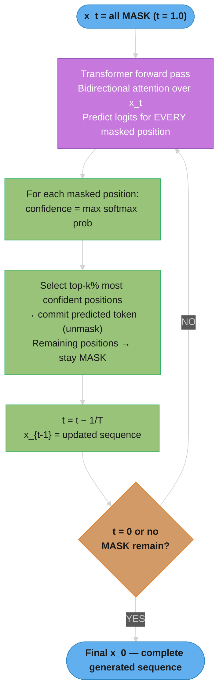

# Diffusion Language Models

## 1. Concept Overview

Diffusion language models (diffusion-LMs) generate text by **iterative denoising** instead of
left-to-right autoregression. Training corrupts a sequence of tokens (typically by replacing some
fraction with a special `[MASK]` token according to a noise schedule), and the model learns to
reverse that corruption — predicting the original tokens from a partially masked sequence. At
inference time, generation starts from a sequence that is **entirely (or mostly) `[MASK]`** and
runs a small number of denoising steps, at each step replacing some masked positions with model
predictions, until the sequence is fully resolved.

This is the same family of generative model that produced Stable Diffusion and Midjourney for
images, adapted to **discrete tokens** instead of continuous pixels. The result is a model that:

- Generates **all positions in a sequence simultaneously** at each step (not one token at a time).
- Has **bidirectional context** at every step — token 50 can condition on token 200 even before
  token 200 is "finalized."
- Trades a **fixed, tunable number of denoising steps** for **per-step parallel compute**, instead
  of the autoregressive (AR) tradeoff of **one sequential step per output token**.

As of 2026, this is the most credible non-autoregressive challenger to the GPT-style decoder-only
transformer for general-purpose text generation. **LLaDA-8B** (Large Language Diffusion with
mAsking, 2025) demonstrated that an 8B-parameter masked diffusion model trained on ~2.3T tokens can
match LLaMA3-8B on MMLU, GSM8K, and HumanEval. **Mercury / Mercury Coder** (Inception Labs) is the
first commercially deployed diffusion-LM, advertising **>1,000 tokens/sec on H100 GPUs** — roughly
5-10x the throughput of a similarly-sized AR model — for IDE autocomplete. **Gemini Diffusion**
(Google DeepMind, May 2025 experimental release) showed ~1,400+ tokens/sec on code generation
benchmarks while matching Gemini 2.0 Flash quality on several tasks.

This module covers the forward (noising) and reverse (denoising) processes, the masked-diffusion
training objective and its connection to BERT-style MLM and "any-order" autoregressive models, the
sampling loop and confidence-based remasking, classifier-free guidance for text, and the production
realities (KV-cache mismatch, evaluation harness mismatch, serving-stack immaturity) that any
senior engineer evaluating this technology in 2026 needs to understand.

> Diffusion LMs are an **alternative generation paradigm**, not a replacement for the transformer
> architecture itself — most diffusion-LMs (LLaDA, SEDD, Mercury) still use a transformer backbone
> with **bidirectional (non-causal) attention**. For *architectural* alternatives to attention
> entirely (state-space models, linear attention), see
> [State-Space Models & Linear Attention](../foundations_and_architecture/state_space_models_and_linear_attention.md).
> For the *continuous, image-domain* diffusion models this work is adapted from, see
> [Multimodal Models §4.2](../multimodal_models/README.md).

---

## 2. Intuition

> **One-line analogy**: Autoregressive generation is like writing a sentence one word at a time,
> left to right, never going back. Diffusion generation is like sculpting a statue from a rough
> block of marble — you start with the whole shape roughly blocked out (all `[MASK]`) and
> progressively refine every part of it in passes, with later passes able to fix earlier mistakes
> anywhere in the piece.

**Mental model**: Think of the output sequence as a row of `L` face-down cards, all showing
`[MASK]`. At each denoising step, the model looks at the *entire row* (including the cards already
flipped face-up) and proposes a value for *every* face-down card. You don't have to accept all of
them — you flip up only the ones the model is most confident about, leave the rest face-down, and
repeat. After `T` steps (`T` typically much smaller than `L`), every card is face-up.

**Why it matters**:

- **Latency for parallel/batch workloads collapses.** An AR model generating 256 tokens needs 256
  sequential forward passes (one decode step per token, even with KV-cache). A diffusion-LM can
  generate the same 256 tokens in `T = 8-32` steps — each step is a full forward pass over all 256
  positions, but the steps are far fewer than the tokens.
- **Editing and infilling are first-class, not a hack.** AR models generate left-to-right, so
  "fill in this blank in the middle of the function" requires special FIM (fill-in-the-middle)
  training (see [Code Generation](../code_generation/README.md)). A diffusion-LM can mask *any*
  subset of positions — including the middle of a sequence — and denoise just those, because there
  is no inherent left-to-right ordering.
- **Quality is tunable against latency at inference time**, without retraining: fewer denoising
  steps = faster but lower quality; more steps = slower but closer to the model's ceiling. This is
  the same dial that exists in image diffusion (DDIM steps).

**Key insight**: The masked-diffusion training objective is mathematically an **upper bound on
negative log-likelihood (an ELBO)**, computed by averaging a masked-token cross-entropy loss over
*all possible masking ratios and orderings*. This makes a trained masked diffusion model
equivalent, in expectation, to a model trained on **every possible generation order** of the
sequence simultaneously — a strict generalization of the single left-to-right order that AR models
are restricted to.

---

## 3. Core Principles

### 3.1 Forward Process (Noising)

A clean sequence `x_0 = (x_0^1, ..., x_0^L)` is progressively corrupted toward a fully-masked
sequence `x_1` as a "time" variable `t` moves from `0` to `1`. For **absorbing-state** (masking)
diffusion — the dominant choice for text (D3PM, SEDD, LLaDA) — each token is independently replaced
by `[MASK]` with probability `t`, and stays unchanged with probability `1-t`. At `t=1`, the
sequence is entirely `[MASK]`.

This is fundamentally different from **uniform** corruption (replace with a random token from the
vocabulary) and from **continuous Gaussian** corruption (used for image pixels and for *continuous
embedding* text diffusion like Diffusion-LM/Plaid — see §4).

**What this actually says.** "Walk down the sequence flipping one biased coin per token — heads
with probability `t` and that token is erased to `[MASK]`, tails and it survives untouched. At
`t = 1` every coin comes up heads and nothing is left."

The coins are independent, which is what makes the whole scheme cheap: there is no sequential
dependency to unwind, so corruption at *any* noise level is one vectorized operation, and training
can jump straight to an arbitrary `t` without simulating the steps before it.

| Symbol | What it is |
|--------|------------|
| `x_0` | The clean sequence, `L` real tokens. Subscript `0` = zero noise |
| `x_t` | That same sequence corrupted at noise level `t` |
| `t` | Diffusion time in `[0, 1]`. Under a linear schedule it *is* the masking probability |
| `1 - t` | Survival probability — the chance a given token is left alone |
| `x_1` | Fully masked. The fixed starting point every generation begins from |
| absorbing state | `[MASK]` is a one-way door: as `t` rises a token can be masked but never un-masked |

**Walk one example.** The six-token sequence from §5.2, `L = 6`:

```
  Each of the 6 positions is masked independently with probability t

  t = 0.3 :  expected masked = 0.3 x 6 = 1.8   ->  the diagram shows 2
  t = 0.6 :  expected masked = 0.6 x 6 = 3.6   ->  the diagram shows 4
  t = 1.0 :  expected masked = 1.0 x 6 = 6.0   ->  all 6, with certainty

  "Expected", not exact -- independent coins mean the count at a given t is
  a random draw scattered around t x L. Only t = 1.0 is deterministic.

  At LLaDA's pretraining length L = 4096:
    t = 0.15  ->  0.15 x 4096 =  614.4 positions masked on average
    t = 0.90  ->  0.90 x 4096 = 3686.4 positions masked on average
```

**Why absorbing beats uniform corruption.** With absorbing (mask) transitions the model is handed
the answer to "which positions are damaged?" for free — they are literally the `[MASK]` tokens. A
uniform transition replaces corrupted positions with plausible-looking real tokens, so the model
must first *detect* corruption and then *repair* it, two jobs instead of one, with no supervision
separating them. That extra detection burden is the reason every LLM-scale text diffusion model
(D3PM's absorbing variant, SEDD, LLaDA, Mercury) uses masking.

### 3.2 Reverse Process (Denoising)

The model `p_theta(x_0 | x_t, t)` is trained to predict the clean sequence given a partially-masked
sequence at noise level `t`. Sampling runs this in reverse: start at `t=1` (all masked), and step
`t` down toward `0` in `T` discrete steps, at each step using the model's predictions to "unmask" a
subset of positions.

### 3.3 Training Objective — Masked Cross-Entropy with Importance Weighting

For absorbing-state discrete diffusion, the (simplified) training objective reduces to:

```
L(theta) = E_{t ~ U(0,1), x_0 ~ data, x_t ~ q(x_t | x_0, t)}
           [ -(1/t) * sum_{i : x_t^i = [MASK]} log p_theta(x_0^i | x_t) ]
```

In plain terms: sample a random masking ratio `t`, mask that fraction of tokens, run the model on
the partially-masked sequence, and compute cross-entropy **only on the masked positions**, weighted
by `1/t` (heavier weight when fewer tokens are masked, since each masked token then carries more
"surprise"). This is provably an upper bound (ELBO) on the negative log-likelihood of the data —
not an exact likelihood, unlike AR models where the chain rule gives an exact factorization.

**Read it like this.** "Hide a random fraction `t` of the tokens, score the model only on the ones
you hid, then multiply the penalty by `1/t` so a gentle 15%-masked example counts exactly as much
as a brutal 90%-masked one."

The `1/t` looks like a tuning hack and is not. It is the term that makes every noise level
contribute equal gradient signal, which is what lets a single model serve every step of the
sampling loop.

| Symbol | What it is |
|--------|------------|
| `E_{t ~ U(0,1)}` | Average over a masking ratio drawn uniformly. Every training batch picks its own `t` |
| `x_0 ~ data` | A clean sequence from the corpus |
| `x_t ~ q(x_t \| x_0, t)` | One random corruption of it at level `t` — the coin flips of §3.1 |
| `sum_{i : x_t^i = [MASK]}` | Sum over masked positions only. Unmasked positions contribute nothing |
| `log p_theta(x_0^i \| x_t)` | Log-probability the model assigns to the *original* token at masked position `i` |
| `-(1/t)` | Negate (turn likelihood into loss) and up-weight by `1/t` — bigger when less was hidden |

**Walk one example.** Write `ce` for the model's average cross-entropy per masked token. LLaDA's
pretraining length is `L = 4096`:

```
  t = 0.15 :  masked positions  = 0.15 x 4096  =  614
              raw sum           = ce x 614
              weight            = 1 / 0.15     = 6.67
              weighted loss     = ce x 614  x 6.67  =  ce x 4093

  t = 0.90 :  masked positions  = 0.90 x 4096  = 3686
              raw sum           = ce x 3686
              weight            = 1 / 0.90     = 1.11
              weighted loss     = ce x 3686 x 1.11  =  ce x 4096

  Both land on ce x ~4096 = ce x L.
  The 1/t cancels the t x L masked count, so the loss magnitude is the
  same whichever t the batch happened to draw.
```

**What breaks without the `1/t`.** Drop the weight and the raw sums are `ce x 614` versus
`ce x 3686` — heavily-masked batches would contribute `3686 / 614 = 6.0x` the gradient of
lightly-masked ones, purely because more positions were summed. Training would then optimize almost
exclusively for the high-`t` regime (guessing text from near-total masking) and neglect the low-`t`
regime, which is where the *final* denoising steps operate. The sampler would inherit a model that
is good at the start of the loop and weak at the finish — visible as tokens committed late being
worse than tokens committed early. The `1/t` is what keeps the model uniformly competent across the
whole trajectory it will later be asked to walk.

### 3.4 The "Any-Order Autoregressive" Equivalence

A masked diffusion model trained with the objective above is **equivalent in expectation to
training an autoregressive model averaged over every possible permutation of the token order**.
A standard left-to-right AR model is the special case where the permutation is always
`(1, 2, ..., L)`. This is the formal reason diffusion-LMs are "non-autoregressive" — they aren't
*anti*-autoregressive, they generalize over *all* autoregressive orderings at once. (This connects
to XLNet's permutation language modeling, but masked diffusion makes the connection to a proper
generative model with a tractable ELBO and a well-defined sampling procedure.)

### 3.5 Number of Denoising Steps `T` vs. Sequence Length `L`

`T` is a **free inference-time hyperparameter**, independent of `L` (unlike AR, where the number of
forward passes is *always* `L`). Typical production configurations use `T` in the range of `8` to
`64` for sequences of `128`-`1024` tokens — i.e., `T << L`. Each step's compute cost is one full
forward pass over the *entire* sequence (`O(L)` attention), so total compute is roughly
`O(T x L^2)` for the diffusion model vs. `O(L)` sequential passes each costing `O(L)` amortized via
KV-cache for AR — the diffusion model trades sequential *latency* for parallel *throughput*.

**What the formula is telling you.** "`O(T x L^2)` versus AR's `O(L)`-per-step-times-`L`-steps says
diffusion does *more total arithmetic*, but stacks it into far fewer sequential steps — and
wall-clock latency is paid per step, not per FLOP."

This is the single most misread comparison in the field. The step-count ratio and the work ratio
point in opposite directions, and only measurement settles which one dominates on your hardware.

| Symbol | What it is |
|--------|------------|
| `L` | Output length in tokens. Fixes AR's step count exactly; has no say over diffusion's |
| `T` | Diffusion's step count. A knob, not a consequence — `8` to `64` in production |
| `O(L^2)` per diffusion step | Full bidirectional attention over the whole sequence, recomputed from scratch (no valid KV-cache, §5.5) |
| `O(L)` per AR step | One new token attending over the cache. Cheap because everything prior is already stored |
| `O(T x L^2)` | Diffusion's total attention work |
| Sequential depth | How many passes must happen *one after another*. This is what latency actually tracks |

**Walk one example.** `L = 256` output tokens, `T = 32` denoising steps:

```
  AR        :  256 sequential passes, O(L) work each
               total attention work  ~ 256 x 256   =    65,536 units
               sequential depth      =   256 steps

  Diffusion :   32 sequential passes, O(L^2) work each
               total attention work  =  32 x 256^2 = 2,097,152 units
               sequential depth      =    32 steps

  work   : 2,097,152 / 65,536  =  32x  MORE total arithmetic
  depth  :       256 / 32      =   8x  FEWER sequential steps

  Measured on the same A100s, same 7B class (Section 14):
    AR  p50 = 320 ms    ->    diffusion T=32  p50 = 95 ms    =  3.4x faster
```

**Why the measured `3.4x` sits below the `8x` step ratio.** The extra `32x` of arithmetic is not
free — it is absorbed by GPU parallelism, but only partly. A single diffusion step saturates the
device far more than a single AR decode step (which is memory-bandwidth-bound and leaves most of
the GPU idle), so diffusion converts wasted AR capacity into useful work. That conversion is
efficient, not perfect, which is exactly why the `8x` step advantage lands as `3.4x` wall-clock and
why Pitfall 10.8 rejects "`T=8` vs `L=256`, therefore 32x faster" as an unmeasured claim.

### 3.6 Confidence-Based Remasking

Rather than unmasking a fixed number of positions per step in a fixed order, most modern samplers
(LLaDA, MaskGIT-derived approaches) use **confidence-based remasking**: at each step, the model
proposes a token for every masked position, but only the positions where the model's predicted
probability is *highest* (most confident) are actually committed; the rest remain `[MASK]` for the
next step. This concentrates "easy" decisions early and lets "hard" decisions benefit from more
context resolved around them.

---

## 4. Types / Architectures / Strategies

| Model / Family | Year | Corruption Type | Notes |
|---|---|---|---|
| **D3PM** (Discrete Denoising Diffusion Probabilistic Models, Austin et al.) | 2021 | Uniform, absorbing, or discretized-Gaussian transition matrices | First rigorous discrete-diffusion formulation; established the categorical forward process and ELBO training; perplexity gap to AR was large (~2-3x worse on LM1B) |
| **Diffusion-LM** (Li et al.) | 2022 | Continuous Gaussian noise on **token embeddings** | Operates in continuous embedding space, then rounds to nearest token; enabled controllable generation (steering toward syntax trees, sentiment) via classifier guidance; not competitive on raw perplexity |
| **CDCD / Plaid** | 2022-2023 | Continuous embedding diffusion with score-matching losses | Plaid-XL closed much of the perplexity gap to AR transformers at GPT-2 scale, but training was unstable and never scaled past ~1B params in public work |
| **SEDD** (Score Entropy Discrete Diffusion, Lou, Meng, Ermon) | 2024 | Discrete, score-entropy loss (generalizes score matching to discrete state spaces) | Reduced the perplexity gap to AR transformers by **25-75%** relative to D3PM at GPT-2 scale; introduced a principled discrete score function `s_theta(x,t)_y = p_t(y)/p_t(x)` |
| **LLaDA-8B** (Large Language Diffusion with mAsking) | 2025 | Absorbing-state (masking), linear noise schedule | First **8B-scale** masked diffusion LM competitive with LLaMA3-8B on MMLU (~65%), GSM8K, HumanEval; trained on ~2.3T tokens; demonstrated diffusion-LM scaling laws hold |
| **Block Diffusion (BD3-LM)** | 2025 | Hybrid: AR over fixed-size *blocks*, diffusion *within* each block | Generates block-by-block left-to-right (so KV-cache works *across* blocks), but tokens *within* a block are produced via parallel diffusion; addresses both the KV-cache mismatch (§10) and the fixed-length limitation of pure diffusion |
| **Mercury / Mercury Coder** (Inception Labs) | 2025 | Absorbing-state masking, transformer backbone | First **commercially deployed** diffusion-LM; advertises >1,000 tok/s on H100; targets IDE autocomplete (Cursor-style) where low latency on short, structured completions matters more than open-ended creative generation |
| **Gemini Diffusion** (Google DeepMind, experimental) | 2025 | Absorbing-state masking | Internal benchmarks ~1,400+ tok/s on coding tasks; matched Gemini 2.0 Flash on several benchmarks at a fraction of the wall-clock latency; not GA as of writing |

### 4.1 Discrete vs. Continuous Diffusion

- **Discrete** (D3PM, SEDD, LLaDA, Mercury): the noise process operates directly on the categorical
  token distribution (replace with `[MASK]` or a random token). This is the dominant, more mature
  approach for text — it maps naturally onto a vocabulary and cross-entropy loss.
- **Continuous** (Diffusion-LM, Plaid, CDCD): tokens are first embedded into continuous vectors,
  Gaussian noise is added/removed in that continuous space (exactly like image diffusion), and a
  final "rounding" step maps the denoised vector back to the nearest vocabulary token. This enables
  classifier-guidance-style controllable generation but has historically lagged on raw likelihood.

### 4.2 Noise Schedules

- **Linear**: masking probability `t` increases linearly from 0 to 1.
- **Cosine**: masking probability follows a cosine curve, spending more "time" near low and high
  noise levels — commonly borrowed from image diffusion (improves sample quality at a given `T`).
- **Absorbing vs. uniform transition**: absorbing (mask) transitions are strictly easier to learn
  (the model always knows *which* positions need predicting — they're the `[MASK]` tokens) and
  dominate in practice; uniform transitions (replace with random token) require the model to also
  detect *which* tokens are corrupted, an extra task.

---

## 5. Architecture Diagrams

### 5.1 Autoregressive vs. Diffusion Generation Timeline

```
AUTOREGRESSIVE (one token per forward pass, sequential)

step 1: [The]
step 2: [The] [cat]
step 3: [The] [cat] [sat]
step 4: [The] [cat] [sat] [on]
step 5: [The] [cat] [sat] [on] [the]
step 6: [The] [cat] [sat] [on] [the] [mat]

  6 sequential forward passes for 6 tokens. Each pass is cheap (1 new token,
  amortized via KV-cache) but they CANNOT be parallelized across steps.


DIFFUSION (all positions per forward pass, parallel, few steps)

step 0 (t=1.0):  [MASK] [MASK] [MASK] [MASK] [MASK] [MASK]
step 1 (t=0.8):  [MASK] [cat]  [MASK] [MASK] [the]  [MASK]   <- 2 high-confidence
step 2 (t=0.5):  [The]  [cat]  [MASK] [on]   [the]  [MASK]   <- 2 more
step 3 (t=0.2):  [The]  [cat]  [sat]  [on]   [the]  [MASK]   <- 1 more
step 4 (t=0.0):  [The]  [cat]  [sat]  [on]   [the]  [mat]    <- last one

  4 forward passes for 6 tokens (T=4 << L=6). Each pass attends over the FULL
  sequence (bidirectional). Steps are sequential (each depends on the last),
  but T does not grow with L the way AR's step count does.
```

### 5.2 Forward Masking (Noising) Process

```
t=0.0 (clean):    [The] [cat]  [sat]  [on]   [the]  [mat]
                     |     |      |      |      |      |
                  each token independently masked with prob t

t=0.3:            [The] [MASK] [sat]  [on]   [MASK] [mat]
t=0.6:            [MASK][MASK] [sat]  [MASK] [MASK] [mat]
t=1.0 (noise):    [MASK][MASK] [MASK] [MASK] [MASK] [MASK]

  Training samples a random t ~ Uniform(0,1), applies this masking, and
  trains the model to predict the ORIGINAL tokens at the masked positions
  using bidirectional context from the unmasked positions.
```

### 5.3 Reverse Sampling Loop with Confidence-Based Remasking



Unlike autoregressive decoding (one token at a time, left-to-right), discrete diffusion generates all positions in parallel and iteratively denoises — each pass unmasks the most confident subset, creating global coherence before committing to low-confidence tokens.

### 5.4 Block Diffusion (BD3-LM) — Hybrid AR + Diffusion

```
Sequence split into fixed-size blocks of size B (e.g., B=16 tokens)

  Block 1          Block 2          Block 3
+----------+    +----------+    +----------+
| diffused |--->| diffused |--->| diffused |   <-- blocks generated
| (T steps |    | (T steps |    | (T steps |       LEFT TO RIGHT
| within   |    | within   |    | within   |       (autoregressive
| block)   |    | block)   |    | block)   |        across blocks)
+----------+    +----------+    +----------+
     |               |               |
     v               v               v
  KV-cache for   KV-cache for    KV-cache for
  block 1 is     blocks 1-2 is   blocks 1-3 is
  REUSED for     REUSED for      REUSED for
  blocks 2,3...  blocks 3...     later blocks

  Within each block: diffusion (parallel, bidirectional, T steps)
  Across blocks: autoregressive (sequential, KV-cache works normally)

  This gets diffusion's within-block parallelism AND AR's cross-block
  KV-cache reuse -- directly addressing Pitfall 10.1.
```

### 5.5 KV-Cache Mismatch — Why Standard AR Caching Doesn't Transfer

```
AR DECODING (KV-cache valid):

  Step 1: attend over [tok1]                -> cache K1,V1
  Step 2: attend over [tok1, tok2]          -> reuse K1,V1; cache K2,V2
  Step 3: attend over [tok1, tok2, tok3]    -> reuse K1,V1,K2,V2; cache K3,V3

  Keys/Values for already-generated tokens NEVER change -> cache is valid.


DIFFUSION DECODING (naive KV-cache INVALID):

  Step 1: x = [MASK,MASK,MASK,MASK]  -> compute K,V for all 4 positions (all [MASK])
  Step 2: x = [The, MASK,MASK,MASK]  -> position 1 CONTENT CHANGED
                                         -> its K,V must be RECOMPUTED
                                         -> AND because attention is
                                            bidirectional, positions 2-4's
                                            K,V (which attended to position 1)
                                            may also need recomputation

  Every step potentially invalidates K,V for EVERY position that has been
  resolved so far, because (a) bidirectional attention means every position's
  representation depends on every other position, and (b) the content at
  unmasked positions literally changes between steps. A full forward pass is
  the only generally-correct approach -- see Pitfall 10.1 for the
  production-relevant exceptions (block diffusion, KV-cache approximations).
```

---

## 6. How It Works — Detailed Mechanics

### 6.1 Forward Corruption Process

```python
from dataclasses import dataclass
import torch
from torch import Tensor

MASK_TOKEN_ID = 50_000  # reserved [MASK] id, outside the normal vocabulary range


@dataclass
class NoiseSchedule:
    """Maps a continuous diffusion time t in [0, 1] to a masking probability."""
    kind: str = "cosine"  # "linear" or "cosine"

    def mask_prob(self, t: Tensor) -> Tensor:
        if self.kind == "linear":
            return t
        if self.kind == "cosine":
            # Spends more "time" near t=0 and t=1; improves sample quality
            # for a fixed step budget T (borrowed from image diffusion).
            return 1.0 - torch.cos(t * torch.pi / 2.0)
        raise ValueError(f"unknown schedule: {self.kind}")


def forward_corrupt(
    x0: Tensor,            # (B, L) clean token ids
    t: Tensor,             # (B,)   diffusion time, one value per sequence
    schedule: NoiseSchedule,
) -> tuple[Tensor, Tensor]:
    """Absorbing-state (masking) forward process.

    Returns (x_t, mask) where mask[b, i] = True if position i was replaced
    with [MASK] in sequence b.
    """
    p_mask = schedule.mask_prob(t)               # (B,)
    p_mask = p_mask.unsqueeze(-1)                # (B, 1) -> broadcast over L
    rand = torch.rand_like(x0, dtype=torch.float)
    mask = rand < p_mask                          # (B, L) bool

    x_t = x0.clone()
    x_t[mask] = MASK_TOKEN_ID
    return x_t, mask
```

**Concrete numbers**: LLaDA-8B uses a linear schedule, `t ~ Uniform(0, 1)` sampled independently per
sequence in each training batch, vocabulary size ~126K (extending LLaMA's tokenizer with the
`[MASK]` token), and sequence lengths up to 4096 during pretraining.

**Put simply.** "`mask_prob(t) = 1 - cos(t x pi/2)` bends the straight line `mask_prob = t` into a
quarter-cosine, so the schedule creeps through the near-clean end and races through the middle."

Both schedules agree at the two endpoints — no masking at `t=0`, total masking at `t=1`. Everything
the cosine buys you happens strictly in between, by making equal steps in `t` correspond to
*unequal* amounts of masking.

| Symbol | What it is |
|--------|------------|
| `t` | Diffusion time in `[0, 1]`. The loop's counter, not the masking probability itself once the schedule is non-linear |
| `mask_prob(t)` | The probability actually used to mask each token. This is what the forward process consumes |
| `t x pi/2` | Rescales `t` from `[0, 1]` onto `[0, pi/2]` — exactly one quarter turn of the cosine |
| `cos(...)` | Falls from `1` to `0` across that quarter turn |
| `1 - cos(...)` | Flips it to rise from `0` to `1`, which is the direction masking needs |

**Walk one example.** The same five values of `t` through both schedules:

```
     t        linear: t      cosine: 1 - cos(t x pi/2)
   0.00         0.00                 0.0000
   0.25         0.25                 0.0761
   0.50         0.50                 0.2929
   0.75         0.75                 0.6173
   1.00         1.00                 1.0000

  At t = 0.50 the linear schedule has already erased half the sequence.
  The cosine schedule has erased only 29.3% -- it is still in the
  near-clean regime, where the model has plenty of context to learn from.

  Endpoints match exactly:  1 - cos(0) = 0  and  1 - cos(pi/2) = 1.
```

The curve is flat near `t=0` and steep near `t=1`. That shape is why §8.2 credits cosine with
better sample quality at a fixed `T`: a linear schedule spends its budget uniformly, while the
cosine allocates more of the `t` axis to the noise levels where the model's predictions are still
worth refining.

### 6.2 Training Objective — Masked Cross-Entropy with Importance Weighting

```python
import torch.nn.functional as F


def masked_diffusion_loss(
    logits: Tensor,   # (B, L, V) model predictions over x_t
    x0: Tensor,       # (B, L)    ground-truth clean tokens
    mask: Tensor,     # (B, L)    bool, True where x_t was masked
    t: Tensor,        # (B,)      diffusion time used for this batch
) -> Tensor:
    """Implements L(theta) = E[-(1/t) * sum_{masked i} log p_theta(x0_i | x_t)].

    This is an ELBO on the negative log-likelihood -- NOT the exact NLL,
    because t and the masking pattern are themselves random variables being
    integrated/averaged over.
    """
    B, L, V = logits.shape
    log_probs = F.log_softmax(logits, dim=-1)               # (B, L, V)
    token_logp = log_probs.gather(-1, x0.unsqueeze(-1)).squeeze(-1)  # (B, L)

    # Only masked positions contribute to the loss.
    masked_logp = token_logp * mask.float()                 # (B, L)
    per_seq_loss = -masked_logp.sum(dim=-1)                  # (B,)

    # 1/t importance weight: when t is small (few tokens masked), each
    # masked token's loss is up-weighted, because it represents a "harder"
    # denoising problem relative to how much signal was removed.
    importance_weight = 1.0 / t.clamp(min=1e-3)              # (B,)
    weighted_loss = per_seq_loss * importance_weight

    return weighted_loss.mean()
```

**Concrete numbers**: for a batch with `t=0.15` (15% masked) on a 4096-token sequence, roughly 614
positions contribute to the loss per sequence, each up-weighted by `1/0.15 ≈ 6.67`; for `t=0.9`
(90% masked, ~3686 positions), each is weighted by `1/0.9 ≈ 1.11`. The importance weighting keeps
the *expected* gradient magnitude roughly constant across the full range of `t`.

### 6.3 Reverse Sampling with Confidence-Based Remasking

```python
@dataclass
class DiffusionSampler:
    model: "torch.nn.Module"
    num_steps: int = 32          # T -- inference-time knob, T << L typically
    schedule: NoiseSchedule = NoiseSchedule(kind="cosine")

    @torch.no_grad()
    def sample(self, length: int, batch_size: int = 1, device: str = "cuda") -> Tensor:
        x = torch.full((batch_size, length), MASK_TOKEN_ID, device=device)
        is_masked = torch.ones_like(x, dtype=torch.bool)

        for step in range(self.num_steps):
            t = 1.0 - step / self.num_steps           # decreases T -> 0
            t_tensor = torch.full((batch_size,), t, device=device)

            logits = self.model(x)                     # (B, L, V) full fwd pass
            probs = F.softmax(logits, dim=-1)
            top_prob, top_token = probs.max(dim=-1)     # (B, L) each

            # Fraction of CURRENTLY-MASKED positions to unmask this step.
            # A cosine schedule front-loads fewer commits early, more later.
            unmask_frac = self._unmask_fraction(step)

            for b in range(batch_size):
                masked_idx = is_masked[b].nonzero(as_tuple=True)[0]
                if masked_idx.numel() == 0:
                    continue
                k = max(1, int(unmask_frac * masked_idx.numel()))

                # Confidence-based selection: commit the k most-confident
                # masked predictions; leave the rest masked for next step.
                confidences = top_prob[b, masked_idx]
                _, top_k_local = confidences.topk(k)
                commit_idx = masked_idx[top_k_local]

                x[b, commit_idx] = top_token[b, commit_idx]
                is_masked[b, commit_idx] = False

        return x

    def _unmask_fraction(self, step: int) -> float:
        # Cosine-derived schedule: ~1/T early, ramping up toward the end so
        # that "easy" tokens resolve first and "hard" tokens benefit from
        # maximal resolved context.
        t = 1.0 - step / self.num_steps
        t_next = 1.0 - (step + 1) / self.num_steps
        return max(0.0, self.schedule.mask_prob(torch.tensor(t)).item()
                        - self.schedule.mask_prob(torch.tensor(t_next)).item())
```

**Concrete numbers**: for `L=256`, `T=32`, the schedule above commits roughly 8 tokens per step on
average — but with confidence-based selection, early steps (high `t`) might commit only 2-4
high-confidence tokens (e.g., punctuation, common function-call boilerplate), while later steps
commit more as context fills in. LLaDA reports that **`T = L` (one token per step, fully greedy)
recovers AR-equivalent quality**, while `T = L/8` loses only 1-3 percentage points on most
benchmarks — this `8x` reduction in forward passes is the source of the throughput gains.

**The idea behind it.** "How many positions to commit this step is just the drop in the schedule's
masking probability between this step's `t` and the next one — and those drops necessarily add up
to `1.0`, so exactly `L` positions get committed no matter which schedule shape you pick."

That invariant is the useful part. The schedule cannot change *how many* tokens get produced in
total; it only redistributes them across the `T` steps. Choosing a schedule is choosing pacing, not
budget.

| Symbol | What it is |
|--------|------------|
| `T` | Total denoising steps. Inference-time knob, set by you, independent of `L` |
| `step` | Loop counter, `0` to `T-1` |
| `t = 1.0 - step/T` | Current noise level, walking down from `1.0` (all masked) toward `0.0` (clean) |
| `t_next` | The noise level after this step, one notch lower |
| `unmask_frac` | `mask_prob(t) - mask_prob(t_next)` — the slice of the sequence this step is responsible for resolving |
| `k` | `unmask_frac x` (positions still masked). The actual count committed, chosen by confidence |

**Walk one example.** The linear schedule, where `mask_prob(t) = t`, makes the arithmetic exact —
`L = 256`, `T = 32`:

```
  step  0 :  t = 1.00000   t_next = 0.96875
             frac = 1.00000 - 0.96875 = 0.03125     (= 1/T)
  step  1 :  frac = 0.96875 - 0.93750 = 0.03125
   ...        every step is the same width under a linear schedule
  step 31 :  frac = 0.03125 - 0.00000 = 0.03125

  tokens per step  = 0.03125 x 256 = 8
  sum of all fracs = 32 x 0.03125  = 1.0   ->  256 tokens committed in total

  Now the Section 14 "broken" config, T = 8 on the same L = 256:
             frac = 1/8 = 0.125    ->  0.125 x 256 = 32 tokens per step
```

**The schedule picks how many; confidence picks which.** That split is what makes small `T`
dangerous. At `T = 32` the sampler only has to be right about its top `8` guesses in a step; at
`T = 8` it must be right about its top `32` — four times as far down its own confidence ranking,
including predictions it is not confident about at all. That is the mechanism behind the
`94% -> 71%` pass@1 collapse measured in §14 Step 2: nothing about the model changed, only how
deep into its ranking each step was forced to commit. A non-linear (cosine) schedule keeps the
fractions summing to `1.0` but makes the per-step widths uneven, so some steps commit a wide slice
and others a narrow one.

### 6.4 Classifier-Free Guidance for Text Diffusion

Classifier-free guidance (CFG), standard in image diffusion (Stable Diffusion's "guidance scale"),
extends to text diffusion for conditional generation (e.g., instruction-following):

```python
def cfg_logits(
    model: "torch.nn.Module",
    x_t: Tensor,
    conditioning: Tensor | None,   # e.g., instruction/prompt tokens, or None
    guidance_scale: float = 1.5,
) -> Tensor:
    """logits_cfg = logits_uncond + guidance_scale * (logits_cond - logits_uncond)

    guidance_scale = 1.0 -> pure conditional generation (no boost)
    guidance_scale > 1.0 -> amplify the influence of the conditioning,
                            at the cost of diversity (same tradeoff as image CFG)
    """
    logits_cond = model(x_t, conditioning=conditioning)
    logits_uncond = model(x_t, conditioning=None)  # conditioning dropped/null
    return logits_uncond + guidance_scale * (logits_cond - logits_uncond)
```

**Concrete numbers**: Mercury Coder and LLaDA-instruct variants report `guidance_scale` in the
range `1.2-2.0` for instruction-following; values above `~2.5` produce noticeably repetitive or
over-literal completions (the text-diffusion analogue of "burned" / over-saturated images at high
CFG in Stable Diffusion).

**Stated plainly.** "Measure the difference between what the model says *with* the instruction and
what it says *without* it, then push that difference further than the model itself would have."

CFG never asks the model "how much do you care about the prompt?" — it *derives* that answer by
running the model twice and subtracting. The conditioning signal is the gap between the two runs,
and `guidance_scale` is how far past that gap you extrapolate.

| Symbol | What it is |
|--------|------------|
| `logits_cond` | Raw scores with the instruction/prompt attached. Two forward passes are needed, so CFG costs 2x per denoising step |
| `logits_uncond` | Raw scores with the conditioning dropped (null prompt). What the model would say unprompted |
| `logits_cond - logits_uncond` | The conditioning's *effect*, per token. Positive = the prompt made this token more attractive |
| `guidance_scale` | How far to extrapolate along that direction. `1.0` = don't extrapolate; `>1.0` = overshoot |
| `logits_cfg` | The extrapolated scores actually fed to softmax and to confidence-based selection |

**Walk one example.** Two candidate tokens `A` and `B` at one masked position, `guidance_scale = 1.5`:

```
                        token A   token B      softmax over the two
  logits_uncond           2.00      2.50   ->    0.378 / 0.622
  logits_cond             3.00      2.00   ->    0.731 / 0.269
  difference (c - u)     +1.00     -0.50

  logits_cfg = uncond + 1.5 x difference
    token A :  2.00 + 1.5 x ( 1.00)  =  3.50
    token B :  2.50 + 1.5 x (-0.50)  =  1.75
                                         ->    0.852 / 0.148

  The conditioning alone moved A from 0.378 to 0.731.
  CFG extrapolates PAST the conditional, to 0.852.

  Same logits, other guidance scales:
    s = 1.0  ->  3.00 / 2.00  ->  0.731 / 0.269    (exactly the conditional)
    s = 2.5  ->  4.50 / 1.25  ->  0.963 / 0.037    (near point mass)
```

**Why `s = 1.0` recovers plain conditional generation.** Substituting gives
`uncond + 1.0 x (cond - uncond) = cond` — the unconditional term cancels exactly, which is why the
docstring above calls `1.0` "no boost." Above `1.0` the distribution sharpens: at `s = 2.5` token
`A` holds `96.3%` of the mass and there is almost nothing left to sample, which is precisely the
"repetitive or over-literal" failure the concrete-numbers note flags past `~2.5`. In a diffusion
sampler this sharpening compounds, because inflated confidence scores also decide *which*
positions get committed first (§6.3) — over-guided runs commit aggressively and early.

---

## 7. Real-World Examples

- **Mercury / Mercury Coder (Inception Labs, 2025)** — the first commercially deployed diffusion
  LLM, marketed for IDE autocomplete and code generation. Inception Labs reports **>1,000
  tokens/sec on NVIDIA H100**, roughly **5-10x** the tokens/sec of similarly-sized AR coding models
  on the same hardware, with quality competitive with GPT-4o-mini-class models on code completion
  benchmarks. It is integrated into developer tools as a low-latency "ghost text" completion
  engine — exactly the workload (short, structured, latency-critical completions) that plays to
  diffusion's parallel-decode strength and away from its weaknesses (long open-ended generation).

- **LLaDA-8B (Renmin University / Ant Group, 2025)** — an 8B-parameter masked diffusion LM trained
  on ~2.3T tokens, the first to show diffusion-LM **scaling laws track AR scaling laws** at this
  size. Reported results: ~65.5% MMLU (vs. LLaMA3-8B's ~65.4%), competitive GSM8K and HumanEval
  scores, and — notably — strong performance on a **reversal-curse-style task** ("if A is B, is B
  A?") where AR models systematically fail due to their fixed left-to-right training order but
  LLaDA (trained over all orderings) succeeds.

- **Gemini Diffusion (Google DeepMind, May 2025 experimental)** — an experimental diffusion variant
  of Gemini, internally benchmarked at **~1,400+ tokens/sec** on code-generation tasks, matching
  Gemini 2.0 Flash on several benchmarks at a fraction of the wall-clock latency for a fixed-length
  completion. Positioned explicitly as a latency play for interactive coding assistants, not (yet)
  as a general chat model replacement.

- **SEDD (Score Entropy Discrete Diffusion, Stanford, 2024)** — primarily a research result, but
  significant as the first discrete-diffusion model to substantially close the perplexity gap to
  AR transformers (reducing it **25-75%** relative to D3PM at GPT-2 scale), establishing that the
  earlier D3PM gap was a training-objective problem, not a fundamental ceiling for diffusion text
  models — paving the way for LLaDA and Mercury.

- **Block Diffusion / BD3-LM (2025)** — research demonstrating that the pure-diffusion fixed-length
  and KV-cache limitations (§10) can be substantially mitigated by a **hybrid AR-across-blocks,
  diffusion-within-block** architecture, which several production efforts (including aspects of
  Mercury's serving stack) draw on.

---

## 8. Tradeoffs

### 8.1 Diffusion-LM vs. Autoregressive (AR)

| Dimension | Diffusion-LM | Autoregressive |
|---|---|---|
| Generation order | All positions simultaneously, refined over `T` steps | Strictly left-to-right, one token per step |
| Forward passes for `L` tokens | `T` (typically `T << L`, e.g., `T = L/8`) | `L` (one per output token) |
| Per-step compute | `O(L^2)` (full bidirectional attention every step) | `O(L)` amortized via KV-cache |
| KV-cache | Doesn't transfer cleanly (§5.5) — full recompute per step (pure diffusion) | First-class; cache grows by 1 per step |
| Bidirectional context | Yes, from step 1 | No — only left context, ever |
| Infilling / editing | Native (mask any subset of positions) | Requires special FIM training |
| Token streaming UX | Awkward — tokens resolve out of order | Natural — tokens stream left-to-right as generated |
| Serving ecosystem (2026) | Immature — vLLM/TensorRT-LLM lack first-class support | Mature — PagedAttention, continuous batching, speculative decoding all assume AR |
| Likelihood | ELBO (upper bound on NLL) | Exact, via chain rule |
| Best-fit workloads | Short structured completions, code, parallel batch jobs | General chat, long-form, anything needing per-token streaming |

### 8.2 Noise / Masking Schedule Choices

| Schedule | Behavior | Effect on Sample Quality at Fixed `T` |
|---|---|---|
| Linear | `mask_prob(t) = t` | Baseline; simple, used by early D3PM/LLaDA experiments |
| Cosine | Spends more steps near `t≈0` and `t≈1` | Improves sample quality for a fixed `T` (borrowed from image diffusion DDPM/DDIM literature); LLaDA's production sampler uses this |
| Absorbing (mask) transition | Corrupted positions are always `[MASK]` — trivially identifiable | Easier learning signal; dominant choice for text |
| Uniform (random-token) transition | Corrupted positions look like valid tokens | Harder — model must detect *and* fix corruption; rarely used alone for LLM-scale text |

### 8.3 Number of Denoising Steps `T`

| `T` (relative to `L`) | Quality | Latency | Use Case |
|---|---|---|---|
| `T = L` (1 token/step) | Matches AR quality (LLaDA result) | No speed advantage over AR | Quality-critical, latency-insensitive |
| `T = L/4` | ~0-1pp quality loss on most benchmarks | ~4x fewer forward passes | General-purpose default |
| `T = L/8` | ~1-3pp quality loss | ~8x fewer forward passes (Mercury's regime) | Latency-critical (autocomplete) |
| `T = L/32` or fixed small `T` (e.g., `T=8`) | Noticeable degradation — repetition, syntax errors in code | Maximum throughput | Only for very short, highly-templated completions; risk of Pitfall 10.2 |

### 8.4 Discrete vs. Continuous Diffusion

| | Discrete (D3PM/SEDD/LLaDA) | Continuous (Diffusion-LM/Plaid/CDCD) |
|---|---|---|
| Operates on | Token IDs directly | Continuous token *embeddings* |
| Loss | Cross-entropy / score-entropy over vocabulary | Score-matching / denoising score in embedding space + rounding |
| Maturity at LLM scale | Production-proven (LLaDA-8B, Mercury) | Research-stage; best results capped around ~1B params |
| Controllability | Standard CFG (§6.4) | Naturally supports classifier-guidance toward continuous attributes (syntax, sentiment) |
| Rounding artifacts | None (operates on discrete IDs) | "Rounding" continuous vectors back to tokens introduces a known quality bottleneck |

---

## 9. When to Use / When NOT to Use

**Use diffusion-LMs when:**

- The workload is **latency-critical, short-to-medium structured completions** — IDE autocomplete,
  code generation with fixed-length blocks, form-filling, structured-output generation.
- **Infilling/editing** is a core requirement (fixing a function in the middle of a file, editing a
  paragraph) — diffusion's "mask any subset" generality is a direct fit, no FIM-specific training
  needed.
- You can run **large parallel batches** where per-step throughput (tokens/sec across the whole
  batch) matters more than single-sequence streaming latency.
- You want a **tunable quality/latency dial at inference time** without retraining (adjust `T`).

**Do NOT use diffusion-LMs when:**

- The product requires **per-token streaming UX** (a chat interface showing tokens appear
  left-to-right as "thinking") — diffusion resolves tokens out of order, which either requires
  buffering the full output before display or a confusing partial-reveal UI.
- The task is **long-form, open-ended generation** (multi-page documents, long chain-of-thought
  reasoning) — `O(L^2)` per-step attention cost and the immature handling of very long sequences
  (without block-diffusion) make this expensive, and research on diffusion-LM chain-of-thought
  reasoning is still early (see Pitfall 10.6 and Q12).
- Your **serving infrastructure is built around AR primitives** (vLLM's PagedAttention,
  speculative decoding, continuous batching) and you can't justify a parallel/custom serving stack
  — as of 2026 these engines do not have first-class diffusion-LM support (see
  [vLLM Deep Dive](../vllm_deep_dive/README.md) and Pitfall 10.7).
- You need **exact likelihoods** for downstream use (e.g., as a reward model component, or for
  certain calibration techniques) — diffusion training only provides an ELBO, not exact NLL.

---

## 10. Common Pitfalls

### 10.1 BROKEN -> FIX: Assuming AR-Style KV-Cache "Just Works"

A team ports their AR serving stack to a diffusion-LM and reuses the existing KV-cache logic,
expecting the usual speedup.

```python
# BROKEN: treats the diffusion model like an AR model with incremental decoding.
# This silently produces WRONG outputs, because cached K,V for already-"unmasked"
# positions become stale the moment ANY other position's content changes
# (bidirectional attention means every position's K,V depends on the whole sequence).

class BrokenDiffusionServer:
    def __init__(self, model):
        self.model = model
        self.kv_cache = {}  # position -> (K, V), reused across steps

    def step(self, x_t, changed_positions):
        # WRONG: only recomputes K,V for newly-unmasked positions,
        # reuses cached K,V for everything else.
        for pos in changed_positions:
            self.kv_cache[pos] = self.model.compute_kv(x_t, pos)
        return self.model.forward_with_cache(x_t, self.kv_cache)
```

```python
# FIX (general case): recompute the full forward pass every step. This is
# correct but means per-step cost is O(L^2), not O(L) like AR's amortized cost.
# Accept this -- the throughput win comes from T << L steps total, not from
# cheap individual steps.

class CorrectDiffusionServer:
    def __init__(self, model):
        self.model = model

    def step(self, x_t):
        # Full forward pass, no cache. Correct, and still net-faster than AR
        # for L >> T because total work is O(T * L^2) vs AR's O(L^2) amortized
        # to O(L) per step but L steps total -> O(L^2) total too, with the
        # crucial difference that diffusion's T steps can target T << L.
        return self.model(x_t)


# FIX (production-realistic): use BLOCK DIFFUSION (§5.4, BD3-LM) instead --
# diffuse within small blocks (where full recompute is cheap, e.g. B=16) and
# use standard AR KV-cache ACROSS blocks (where it's valid, since earlier
# blocks are finalized and never revisited). This is the approach that
# makes diffusion-LM serving tractable for longer sequences.
```

### 10.2 Under-Provisioning Denoising Steps `T`

Setting `T` too low (e.g., `T=4` for `L=256`) to maximize throughput causes the sampler to commit
many low-confidence tokens per step, producing **garbled output, repeated tokens, or — for code —
syntax errors** (mismatched brackets, incomplete statements). Always benchmark quality (not just
latency) at the target `T`, and consider **adaptive `T`**: start with a small `T`, and only run
additional steps if confidence scores remain low (see §14 for a worked example).

### 10.3 Reusing AR Evaluation Harnesses Unchanged

Standard LM evaluation harnesses compute **per-token greedy/teacher-forced log-probabilities**
(perplexity, "loglikelihood" tasks in lm-eval-harness) — this assumes a single fixed left-to-right
factorization, which a diffusion model does not have in the same form. Computing a comparable
number requires either (a) the ELBO estimator (§3.3, which is an *upper bound*, not the exact
quantity AR perplexity measures) or (b) falling back to **task-level metrics** (exact-match
accuracy on GSM8K, pass@1 on HumanEval) which are well-defined for both paradigms. Comparing a
diffusion model's ELBO directly to an AR model's exact perplexity is an apples-to-oranges error.

### 10.4 Confusing Continuous Image-Diffusion Intuition with Discrete Text Diffusion

Engineers familiar with Stable Diffusion often assume "more steps always means smoothly better,
like sharpening a blurry image." For **discrete absorbing-state diffusion**, there's no "blurry"
intermediate state — a position is either `[MASK]` (completely unknown) or a committed token
(fully known). The `T` knob controls *how many tokens get committed per step* and *in what order*,
not a continuous sharpening process. This also means there is no direct text analogue of
img2img-style "partial noise" — partial masking is the closest equivalent, and it's already
exactly what infilling uses.

### 10.5 Ignoring Leftover Left-to-Right Bias

Despite being trained over "all orderings" in principle (§3.4), in practice diffusion-LMs trained
on natural text (which is overwhelmingly written left-to-right) still exhibit a **measurable bias
toward unmasking left-to-right first** during early sampling steps. This is usually benign, but it
means claims like "fully order-agnostic generation" should be verified empirically for your model
and task — don't assume e.g. that a model will reliably generate a function's return statement
before its body just because "order doesn't matter architecturally."

### 10.6 Assuming Diffusion-LMs Are a Drop-In Win for Chain-of-Thought Reasoning

Reasoning models (see [Reasoning Models](../reasoning_models/README.md)) rely heavily on
**sequential, causal chain-of-thought** — each reasoning step conditions on the (now-fixed) result
of the previous step. Diffusion's "revise anything, anytime" property is in tension with this: if
intermediate reasoning tokens can be revised *after* later tokens are committed, it's unclear what
"the chain of thought" even means at intermediate steps. As of 2026, diffusion-LM long-form
multi-step reasoning is an open research problem — do not assume parity with AR reasoning models
(o1/o3, DeepSeek-R1) without task-specific evaluation.

### 10.7 Underestimating Serving-Stack Gaps

Production AR serving gets enormous value from **PagedAttention** (KV-cache memory management),
**continuous batching**, and **speculative decoding** — all of which are built around the AR
KV-cache model. None of these transfer directly to pure diffusion (§5.5, §10.1). Teams adopting
Mercury/LLaDA-class models in 2026 should expect to either (a) use the vendor's managed API
(Mercury's hosted endpoint), or (b) build custom serving (block-diffusion-aware batching) rather
than dropping a diffusion checkpoint into an unmodified vLLM deployment.

### 10.8 Wall-Clock Comparisons That Don't Control for Per-Step Cost

"Diffusion needs only `T=8` steps vs AR's `L=256` steps, therefore diffusion is 32x faster" is
**wrong** if stated without qualification: each diffusion step is `O(L^2)` (full-sequence
attention), while each AR step is `O(L)` amortized (incremental, KV-cached). The *real* throughput
comparison must be measured end-to-end on the target hardware at the target `L` — Mercury's
reported "5-10x" and Gemini Diffusion's "~1,400 tok/s" figures are *measured wall-clock* numbers,
not derived from the step-count ratio alone. Always benchmark, never extrapolate from step counts.

---

## 11. Technologies & Tools

| Tool / Resource | Role |
|---|---|
| **LLaDA (open weights + code)** | Reference implementation of an 8B masked diffusion LM; basis for most open research replication |
| **Mercury / Mercury Coder API (Inception Labs)** | Commercial hosted diffusion-LM, primarily for code completion integrations |
| **Gemini Diffusion (Google DeepMind, experimental)** | Closed experimental access; benchmarked via Google's API preview program |
| **HuggingFace `diffusers`** | Primarily an image/audio diffusion library, but increasingly used as a reference for discrete-diffusion samplers ported to text |
| **PyTorch / `transformers`** | Standard backbone for implementing the bidirectional transformer used by LLaDA/SEDD-style models — same architecture class as BERT, but with the masked-diffusion training loop (§6.2) instead of static 15% MLM |
| **SEDD reference implementation (research)** | Reference for the score-entropy loss and discrete score function, useful for understanding the theoretical foundation |

---

## 12. Interview Questions with Answers

**Q1: What's the fundamental difference in generation order between diffusion LMs and autoregressive LMs — and why doesn't "parallel" mean "instant"?**
Autoregressive models generate exactly one token per forward pass, strictly left-to-right, with each pass conditioning on all previously generated tokens via KV-cache. Diffusion LMs generate predictions for *all* positions in every forward pass, but still require multiple sequential passes (`T` steps) because each pass only commits the model's most confident predictions — the remaining masked positions need additional context from the newly-committed tokens before they can be resolved well. "Parallel" describes *what happens within a step* (all positions processed together), not the *number* of steps, which is still `T >= 1` and sequential. The practical win is `T << L`, not `T = 1`.

**Q2: Why can't you just plug a diffusion-LM into an existing AR serving stack and reuse the KV-cache for a free speedup?**
KV-cache validity in AR models relies on two facts: (a) each token's key/value vectors, once computed, never change because attention is causal (a token never attends to future tokens), and (b) the sequence only ever grows by appending. In diffusion, attention is bidirectional — every position's representation depends on every other position — and the *content* at previously-resolved positions can coexist with newly-resolved positions that change the context for everyone. So a cached K/V for position 5 computed when position 50 was `[MASK]` is stale once position 50 is unmasked. The general-purpose fix is a full forward pass every step (accepting `O(L^2)` per step); the production fix is block diffusion (§5.4), which restores AR-style cross-block caching by making block boundaries genuinely causal.

**Q3: Isn't masked diffusion training just BERT's masked language modeling (MLM) — what's actually different?**
They look similar (predict masked tokens from bidirectional context) but differ in three ways. First, BERT uses a *fixed* masking ratio (typically 15%) chosen for a discriminative pretraining task, not for generation; masked diffusion samples a *random* ratio `t ~ Uniform(0,1)` ranging from nearly 0% to 100% masked, because the model must handle every noise level it will see during iterative sampling (including the all-masked starting point, which BERT never sees). Second, diffusion's loss includes the `1/t` importance weighting (§3.3) that makes it a valid ELBO on the data likelihood — BERT's MLM loss has no such likelihood interpretation. Third, and most importantly, BERT was never designed to be *sampled from* to generate text; masked diffusion's training objective is explicitly constructed so that the reverse (denoising) process is a valid generative sampler.

**Q4: What does it mean that the masked-diffusion objective is an "ELBO," and why does that matter practically?**
An ELBO (Evidence Lower BOund) is a quantity that's provably ≤ the true log-likelihood of the data — minimizing the negative ELBO during training pushes the true negative log-likelihood down too, but you never get an *exact* value for the likelihood itself, unlike AR models where the chain rule (`log p(x) = sum_i log p(x_i | x_<i)`) gives an exact factorization computable in one forward pass. Practically: you cannot directly compare a diffusion model's "loss" number to an AR model's perplexity as if they were the same metric (Pitfall 10.3), and any downstream use that needs a calibrated probability (e.g., as a component of a reward model, or for importance sampling) needs to account for the gap between the ELBO and the true likelihood.

**Q5: Walk through what happens in one denoising step, concretely.**
Given the current sequence `x_t` (a mix of resolved tokens and `[MASK]` placeholders) and the current noise level `t`: (1) run one full bidirectional transformer forward pass over `x_t`, producing a probability distribution over the vocabulary for *every* position (including already-resolved ones, though those are typically ignored); (2) for each currently-masked position, take the model's max-probability token and its confidence (that max probability); (3) rank masked positions by confidence and select the top fraction (determined by the noise schedule, §8.2) to "commit" — replace `[MASK]` with the predicted token; (4) leave the remaining masked positions as `[MASK]`; (5) decrement `t` and repeat. After `T` steps, either all positions are resolved or any stragglers are force-committed on the final step.

**Q6: How does Mercury achieve >1,000 tokens/sec — what's the architectural reason, not just "it's diffusion"?**
The throughput gain comes from the ratio `L / T`: for a 256-token completion generated in `T=16-32` steps, Mercury performs 16-32 full-sequence forward passes total, versus an AR model's 256 sequential decode passes. Even though each diffusion forward pass is more expensive per-pass (`O(L^2)` bidirectional attention vs. AR's `O(L)` amortized incremental decode), the *step count* reduction of roughly `8-16x` dominates for the sequence lengths typical of IDE autocomplete (tens to a few hundred tokens), where AR's per-step KV-cache overhead and kernel-launch latency are a significant fraction of total time. Mercury specifically targets this regime (short, structured completions) rather than long-form generation, where the `O(L^2)` per-step cost would eventually dominate.

**Q7: What's the relationship between D3PM, SEDD, and LLaDA — is LLaDA "just SEDD at scale"?**
Not exactly — they represent successive refinements of the *training objective*, not just scale-ups. D3PM (2021) established the discrete diffusion framework with categorical transition matrices and an ELBO, but had a large (~2-3x) perplexity gap to AR transformers. SEDD (2024) introduced *score entropy*, a discrete generalization of score-matching that closed 25-75% of that gap at GPT-2 scale — a genuine objective-level improvement. LLaDA (2025) is closer to D3PM's absorbing-state formulation (with the `1/t`-weighted masked cross-entropy of §3.3) but demonstrated, for the first time, that this objective *scales* to 8B parameters and ~2.3T tokens while remaining competitive with AR — i.e., LLaDA's contribution is primarily an existence proof of **scaling**, while SEDD's was primarily an improvement to the **objective**. Production systems (Mercury) draw on ideas from both lineages.

**Q8: Why is fill-in-the-middle (infilling) "native" to diffusion but a special-case for AR models?**
An AR model generates strictly left-to-right; to produce "the missing middle of a function given its start and end," it must be explicitly trained with a reformatted input — e.g., FIM training rearranges `prefix [SUFFIX] suffix [MIDDLE]` so the model still generates left-to-right but learns to treat the rearranged sequence correctly (see [Code Generation](../code_generation/README.md)). A diffusion model has no such restriction: the prefix and suffix tokens are simply *never masked* (they're given as conditioning context from `t=1`), and only the middle positions start as `[MASK]`. The same model, same training, same sampling procedure handles "generate the whole function," "fill in this one line," or "fill in three scattered lines" — the only difference is which positions start masked.

**Q9: What problem does Block Diffusion (BD3-LM) solve, and what does it give up?**
Pure diffusion has two production pain points: (1) the KV-cache mismatch (§5.5/10.1) forces full-sequence recomputation every step, and (2) the sequence length `L` must typically be fixed/known in advance (you can't "keep generating" indefinitely the way AR can, since diffusion resolves a fixed-size canvas). Block diffusion fixes both by generating fixed-size blocks (e.g., 16 tokens) **autoregressively** — block `i+1` only starts after block `i` is fully resolved — while using **diffusion within each block** for the parallel speedup. This restores valid KV-cache *across* blocks (earlier blocks are causally fixed, exactly like AR) and removes the fixed-total-length constraint (you can keep appending blocks). What it gives up is some of pure diffusion's "resolve anything in any order" flexibility — infilling now works at block granularity, not arbitrary global positions.

**Q10: How would you apply classifier-free guidance (CFG) to a text diffusion model, and what's the risk of setting the guidance scale too high?**
CFG runs the model twice per step — once with the conditioning (instruction/prompt) and once without (or with a "null" conditioning) — and extrapolates: `logits_cfg = logits_uncond + scale * (logits_cond - logits_uncond)`. A `scale` of 1.0 is plain conditional generation; values above 1.0 amplify the conditioning's influence on the token distribution. The risk, directly analogous to over-saturated images at high CFG in Stable Diffusion, is that text becomes repetitive, overly literal, or loses fluency — reported production guidance scales for instruction-tuned diffusion-LMs sit around 1.2-2.0, with quality degrading noticeably above ~2.5.

**Q11: Why might a diffusion-LM be a poor fit for a chain-of-thought reasoning task, even if it matches AR on knowledge benchmarks like MMLU?**
Chain-of-thought reasoning (as used by o1/o3/DeepSeek-R1, see [Reasoning Models](../reasoning_models/README.md)) depends on each reasoning step being *causally fixed* before the next step is produced — step 5 should be a consequence of the *committed* step 4, not of a step 4 that might still be revised. Diffusion's core flexibility — any position can be revised based on later context — is in direct tension with this causal-chain structure: it's unclear what it even means for "step 4" to "cause" step 5 if both can change together. MMLU-style knowledge recall doesn't exercise this tension (it's closer to single-step retrieval), which is why LLaDA can match AR there while long multi-step CoT reasoning with diffusion remains an open research question.

**Q12: How do you choose the number of denoising steps `T` for a production deployment?**
Treat `T` as a latency/quality dial tuned per task, not a global constant. Start from the empirical curve in §8.3: `T = L` recovers AR-equivalent quality (use as your quality ceiling for offline eval), and progressively reduce `T` while measuring task-level metrics (pass@1 for code, exact-match for QA) — not just perplexity/ELBO (Pitfall 10.3) — until you hit your latency budget or an unacceptable quality drop. For highly templated short completions (e.g., closing brackets, common boilerplate), very small `T` (8-16) is often fine; for more open-ended completions within the same product, consider **adaptive `T`**: run a small `T` first, and only spend additional steps if the final-step confidence scores are low (§14 shows this pattern).

**Q13: What's the practical difference between discrete and continuous text diffusion, and why did discrete win for LLM-scale deployment?**
Discrete diffusion (D3PM/SEDD/LLaDA) operates directly on token IDs with a categorical forward process and cross-entropy-style loss — it maps onto the same vocabulary and loss function every transformer practitioner already knows. Continuous diffusion (Diffusion-LM/Plaid/CDCD) embeds tokens into continuous vectors, applies Gaussian noise (like image diffusion), and must "round" the denoised continuous vector back to a discrete token — this rounding step is a known quality bottleneck, and continuous approaches have not been demonstrated past roughly 1B-parameter scale with competitive quality. Discrete diffusion's closer fit to existing LLM infrastructure (tokenizers, embeddings, cross-entropy) is why LLaDA and Mercury are both discrete.

**Q14: As of 2026, what specifically is "missing" from inference engines like vLLM that prevents diffusion-LMs from being served the same way as AR models?**
Three core vLLM primitives assume AR generation and don't transfer: PagedAttention manages a KV-cache that grows by one token per step with causal attention — diffusion's bidirectional, content-changing sequence breaks the cache-validity assumption (§5.5). Continuous batching schedules requests based on "how many new tokens does each sequence need this iteration," which is trivial for AR (always 1) but ill-defined for diffusion (depends on confidence-based commits, which vary per sequence per step). Speculative decoding drafts future AR tokens with a small model and verifies with the large model in one pass — there's no analogous "draft" concept for a process that's already resolving all positions per step. Production diffusion-LM serving (Mercury's hosted API) uses custom infrastructure rather than an off-the-shelf vLLM deployment.

**Q15: If you wanted to benchmark a diffusion-LM's quality without relying on AR-style perplexity, what would you measure?**
Use task-level, output-based metrics that don't depend on the generative model's internal factorization: exact-match or F1 on QA datasets, pass@1/pass@10 on code-generation benchmarks (HumanEval, MBPP) by actually executing generated code, BLEU/ROUGE/BERTScore for translation/summarization against references, and human or LLM-as-judge pairwise preference (see [Evaluation & Benchmarks](../evaluation_and_benchmarks/README.md)). If a likelihood-style number is needed for model comparison, report the ELBO explicitly labeled as an ELBO (an upper bound), and only compare ELBOs *between diffusion models*, never directly against AR exact perplexity.

**Q16: How does the "any-order autoregressive" framing change how you'd think about a reversal-curse-style failure (e.g., "A is B" doesn't imply the model knows "B is A")?**
The reversal curse in standard AR models is a direct consequence of training on a single fixed left-to-right order: a model trained on "A is B" sees `A -> is -> B` and never the reverse factorization `B -> is -> A`, so it never learns `p(A | B)` directly. A masked-diffusion model, trained in expectation over *all* orderings (§3.4), sees both `predict B given A is _` and `predict A given _ is B` as valid training instances within the same objective — LLaDA's reported strength on reversal-style tasks is a direct empirical confirmation of this theoretical property, and it's one of the more interview-relevant "why does this architecture exist" answers beyond raw throughput.

**Q17: What's the latency profile difference between diffusion and AR for a very short completion (e.g., 8 tokens) vs. a long one (e.g., 2,000 tokens)?**
For very short completions, AR's per-step overhead (kernel launches, KV-cache bookkeeping) is a large fraction of total latency relative to the tiny amount of "real" compute — diffusion's `T` steps (even `T=8`) may not beat AR's 8 steps by much, since `L ≈ T` here and diffusion's per-step `O(L^2)` cost has no advantage over AR's per-step `O(L)`. For long completions, AR's `L=2000` sequential steps accumulate latency linearly, while diffusion's `T` (still `8-64`, roughly constant or slowly growing) stays far below `L` — but each diffusion step's `O(L^2)` attention cost grows quadratically, so without block diffusion (§5.4), very long sequences eventually make diffusion's per-step cost the bottleneck instead. The "sweet spot" for pure (non-block) diffusion is short-to-medium `L` (roughly 64-512 tokens) — which is exactly the regime Mercury targets.

**Q18: A colleague says "diffusion LMs will replace autoregressive LMs within a few years." How would you push back or refine that claim in an interview setting?**
Push back on "replace" — the evidence so far supports diffusion-LMs as a *strong alternative for a specific workload class* (short-to-medium, structured, latency-critical, infilling-heavy generation — coding autocomplete being the clearest current product-market fit), not a general replacement. Open gaps as of 2026 include: long-form/open-ended generation (quadratic per-step cost without block diffusion), chain-of-thought reasoning parity (Q11), production serving infrastructure maturity (Q14), and per-token streaming UX expectations in chat products (§9). A more defensible framing: diffusion-LMs are likely to become a standard *option* alongside AR — possibly via hybrid architectures like block diffusion — selected per-workload, the same way teams already choose between dense and MoE models, or between large and small models, based on the specific latency/quality/cost tradeoff of the task.

---

## 13. Best Practices

1. **Start with absorbing-state (masking) discrete diffusion** (LLaDA-style) — it's the most mature,
   best-documented, and best-scaling formulation; avoid continuous embedding diffusion for
   LLM-scale work unless you have a specific controllability requirement that needs it.
2. **Tune `T` per task, not globally** — short structured completions (code, form fields) tolerate
   small `T` (8-16); more open-ended text needs larger `T` (closer to `L/4`).
3. **Use confidence-based remasking**, not fixed-order or random remasking — it's the dominant
   choice in production systems (LLaDA, Mercury) and consistently outperforms naive schedules.
4. **For sequences longer than ~512 tokens, evaluate block diffusion (BD3-LM)** rather than pure
   diffusion, to avoid the `O(L^2)` per-step cost and restore KV-cache reuse across blocks.
5. **Build task-level evaluation, not perplexity-based evaluation** — pass@1, exact-match, and
   execution-based metrics are valid across both paradigms; ELBO/perplexity comparisons across
   paradigms are not (Pitfall 10.3).
6. **Benchmark wall-clock end-to-end on your target hardware and sequence lengths** before claiming
   a throughput win — never extrapolate from step-count ratios alone (Pitfall 10.8).
7. **Design the UX around non-sequential token resolution** — e.g., show a placeholder/skeleton
   during generation and reveal the completion once resolved, rather than attempting a token-by-token
   stream that doesn't match the model's actual resolution order.
8. **Tune classifier-free guidance scale empirically** in the 1.2-2.0 range for instruction
   following; treat values above ~2.5 as a red flag for repetitive/over-literal output.
9. **Don't assume serving-stack parity with AR** — plan for either a vendor-hosted API (Mercury) or
   a custom serving layer; don't expect drop-in vLLM/TensorRT-LLM support as of 2026.
10. **Prototype on the workload where diffusion's strengths are clearest** — IDE autocomplete,
    infilling/editing tasks, and parallel batch generation — before evaluating it for general chat
    or long-form use cases where the evidence base is thinner.

---

## 14. Case Study: Low-Latency Code Completion Service on a Mercury-Style Diffusion LM

### Scenario

A developer-tools company runs an IDE "ghost text" autocomplete feature, currently served by a
7B-parameter AR coding model. Product requirements: **p50 latency < 100ms** for completions up to
256 tokens, at a sustained **2,000 requests/sec** across the user base. The current AR deployment
(vLLM, continuous batching, A100 GPUs) measures **p50 = 320ms** for 256-token completions — too
slow for the "feels instant" bar the product team wants, and scaling further would require
2.5-3x more GPUs.

### Step 1 — Evaluate a Diffusion-LM Alternative

The team evaluates a Mercury-Coder-class 7B diffusion model on the same A100s, with `T=32` (i.e.,
`L/T ≈ 8`, in line with §8.3's "general-purpose default"):

```python
import time

def benchmark(sampler: "DiffusionSampler", n_requests: int = 100, length: int = 256) -> dict:
    latencies = []
    for _ in range(n_requests):
        start = time.perf_counter()
        sampler.sample(length=length, batch_size=1)
        latencies.append((time.perf_counter() - start) * 1000)  # ms
    latencies.sort()
    return {
        "p50_ms": latencies[len(latencies) // 2],
        "p99_ms": latencies[int(len(latencies) * 0.99)],
    }

# Measured on A100, 7B diffusion model, T=32, L=256:
#   {"p50_ms": 95, "p99_ms": 140}
# vs. AR baseline (same hardware, same model size):
#   {"p50_ms": 320, "p99_ms": 410}
```

`T=32` clears the 100ms p50 target with margin (95ms vs. 320ms — a 3.4x improvement), broadly
consistent with Mercury's reported "5-10x" figures (the exact ratio depends on `L`, hardware, and
batch size, per Pitfall 10.8).

### Step 2 — BROKEN: Push `T` Down to `T=8` for More Headroom

To build in margin for traffic spikes, an engineer reduces `T` from 32 to 8 (a further 4x fewer
forward passes), expecting roughly proportional further latency wins.

```python
# BROKEN: T=8 for L=256 means ~32 tokens committed per step on average.
# Confidence-based selection still picks the "most confident" 32, but for
# CODE specifically, this produces syntactically invalid output: e.g.,
# an opening brace and matching closing brace get committed in DIFFERENT
# steps based on independent confidence scores, with no guarantee of
# consistency between them.

sampler = DiffusionSampler(model=model, num_steps=8)
completion = sampler.sample(length=256, batch_size=1)
# Result (real example pattern): "def parse(data):\n    result = []\n    for item in data:\n        result.append(item)\n    return result)"
#                                                                                                                                  ^ stray ')' -- mismatched bracket
```

Offline eval on a held-out set of 5,000 real completions: **pass@1 (code compiles and passes a
syntax check) drops from 94% at `T=32` to 71% at `T=8`** — an unacceptable regression that wouldn't
show up in a latency-only dashboard.

### Step 3 — FIX: Adaptive `T` with Confidence-Gated Early Stopping

Instead of a fixed small `T`, the fix runs a small *minimum* `T` and only spends additional steps
when the model's own confidence signals it needs them:

```python
@dataclass
class AdaptiveDiffusionSampler(DiffusionSampler):
    min_steps: int = 8
    max_steps: int = 32
    confidence_threshold: float = 0.85  # stop early only if avg confidence is high

    @torch.no_grad()
    def sample_adaptive(self, length: int, device: str = "cuda") -> Tensor:
        x = torch.full((1, length), MASK_TOKEN_ID, device=device)
        is_masked = torch.ones_like(x, dtype=torch.bool)

        for step in range(self.max_steps):
            logits = self.model(x)
            probs = F.softmax(logits, dim=-1)
            top_prob, top_token = probs.max(dim=-1)

            unmask_frac = self._unmask_fraction(step)
            masked_idx = is_masked[0].nonzero(as_tuple=True)[0]
            if masked_idx.numel() == 0:
                break

            k = max(1, int(unmask_frac * masked_idx.numel()))
            confidences = top_prob[0, masked_idx]
            top_k_conf, top_k_local = confidences.topk(k)
            commit_idx = masked_idx[top_k_local]

            x[0, commit_idx] = top_token[0, commit_idx]
            is_masked[0, commit_idx] = False

            # Early-stop check: only after the minimum step budget, AND only
            # if confidence on the committed tokens is high (the easy case).
            if step + 1 >= self.min_steps and top_k_conf.mean() > self.confidence_threshold:
                if is_masked[0].sum() == 0:
                    break
                # Force-commit remaining low-confidence positions with one
                # extra "cleanup" pass rather than many more low-value steps.
                logits = self.model(x)
                fallback_token = logits.argmax(dim=-1)
                x[0, is_masked[0]] = fallback_token[0, is_masked[0]]
                break

        return x
```

### Production Architecture

```
+-----------+      +------------------+      +---------------------------+
|  IDE      |----->|  Completion API  |----->|  Diffusion-LM Server       |
|  client   |      |  (request queue, |      |  - AdaptiveDiffusionSampler|
|  (ghost   |<-----|   batching by L) |<-----|  - min_steps=8, max=32     |
|  text)    |      +------------------+      |  - confidence_threshold    |
+-----------+                                 |    =0.85                   |
                                              |  - syntax-check fallback   |
                                              |    (re-run AR model on     |
                                              |     pass@1 failures, async)|
                                              +---------------------------+
```

A lightweight **fallback path** retains the old AR model for the small fraction of completions that
fail a fast static syntax check post-generation — this fallback runs asynchronously and only
affects the rare failure case, not the hot path latency.

### Results

| Configuration | p50 latency | p99 latency | pass@1 (syntax-valid) | GPUs needed for 2,000 req/s |
|---|---|---|---|---|
| AR baseline (7B, vLLM) | 320ms | 410ms | 96% | 1.0x (baseline) |
| Diffusion, fixed `T=32` | 95ms | 140ms | 94% | ~0.35x |
| Diffusion, fixed `T=8` (BROKEN) | 38ms | 60ms | 71% | ~0.12x |
| Diffusion, adaptive `T` (FIX, min=8/max=32) | 52ms | 105ms | 95% | ~0.18x |

The adaptive configuration delivers **p50 = 52ms** (well under the 100ms target, a **6.2x**
improvement over the AR baseline) while **matching the AR baseline's pass@1 (95% vs. 96%)** — the
fixed-`T=8` configuration's apparent latency win (38ms) came at an unacceptable 25-point quality
cost that adaptive stepping recovers almost entirely, at a modest latency cost (52ms vs. 38ms).

### Embedded Q&A

**Why does the adaptive sampler's "cleanup pass" on early-stop not just defeat the purpose of stopping early?**
The cleanup pass is a single additional forward pass that force-commits whatever positions remain masked using straight argmax (no further iterative refinement) — it costs one extra step, not the 24 additional steps that running to `max_steps=32` would cost. It's a bounded, fixed-cost "finish the job" step that trades a small, predictable latency increment for avoiding the long tail of unresolved `[MASK]` tokens that a hard early-stop would leave behind.

**Why measure pass@1 via a static syntax check rather than running the full test suite?**
At 2,000 req/s, executing a full test suite per completion is infeasible — a syntax/parse check is O(milliseconds) and catches the dominant failure mode introduced by aggressive step reduction (mismatched brackets, incomplete statements, per Step 2). It's a cheap proxy metric appropriate for a latency-sensitive online gate; the offline evaluation set (5,000 held-out completions) can still use full execution-based pass@1 for periodic model-quality regression testing.

**If traffic doubled overnight, what's the first lever to pull — lower `min_steps`, lower `confidence_threshold`, or add GPUs?**
Lower `confidence_threshold` first (e.g., 0.85 -> 0.75): this increases the *frequency* of early stopping without changing the floor (`min_steps=8` still guarantees a quality baseline), giving a tunable, reversible latency/throughput knob with a gradual quality tradeoff that can be monitored via the pass@1 dashboard — versus lowering `min_steps` (which directly re-introduces Step 2's failure mode) or adding GPUs (slow, capital-intensive, and the current config already uses ~5.5x fewer GPUs than the AR baseline at equal traffic, so there's headroom before hardware becomes the binding constraint).

---

## Related

- [Vision-Language-Action Models & Robotics Foundation Models](../vla_and_robotics_foundation_models/README.md) — the other major Phase 6 "new generation paradigm" module added alongside this one
- [State-Space Models & Linear Attention](../foundations_and_architecture/state_space_models_and_linear_attention.md) — alternative non-transformer architectures for efficient sequence modeling
- [Multimodal Models §4.2](../multimodal_models/README.md) — continuous/image diffusion, the architecture family this work adapts from
- [Inference and Decoding](../inference_and_decoding/README.md) — AR decoding strategies (sampling, KV-cache, speculative decoding) that diffusion-LM serving must reimagine
- [Reasoning Models](../reasoning_models/README.md) — chain-of-thought reasoning, contrasted in Q11/Pitfall 10.6
- [Code Generation](../code_generation/README.md) — fill-in-the-middle training, contrasted with diffusion's native infilling in Q8
