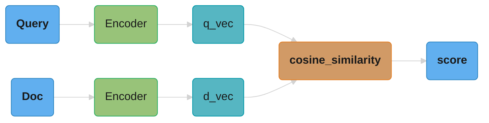
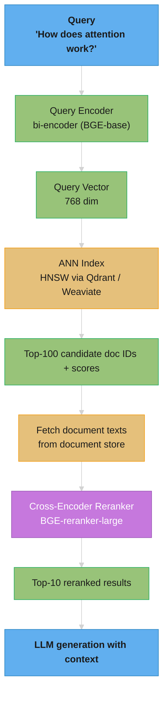
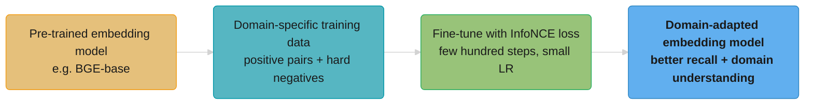

# Embeddings & Similarity Search

<!-- study-paths
senior: README.md
files this module contributes to each curated path; omit a tier to leave it out
-->
## 1. Concept Overview

Embeddings are dense vector representations that capture the semantic meaning of text, images, or other data. Similar content maps to nearby points in the embedding space — this is the foundation of semantic search, recommendation systems, clustering, and RAG pipelines.

Similarity search (also called vector search or nearest neighbor search) is the problem of finding the K vectors most similar to a query vector from a large collection (potentially billions of vectors). The challenge is doing this **fast** — brute-force comparison of a query against 1B vectors at 1536 dimensions would take seconds; production systems need it in milliseconds.

Together, embeddings + similarity search power the retrieval component in [RAG systems](../rag_fundamentals/README.md), semantic deduplication, zero-shot classification, recommendation systems, and more.

---

## 2. Intuition

> **One-line analogy**: Embeddings are like GPS coordinates for meaning — similar ideas live close together, so finding related content is just finding nearby points in meaning-space.

**Mental model**: Imagine a vast 1536-dimensional map where every sentence, paragraph, or document has a fixed address. "Dog training tips" and "how to teach your puppy" live at nearly the same address; "quantum physics" is in a different country. When you ask a question, you convert it to its GPS coordinates and find the 10 closest addresses. That's semantic search. The embedding model is the GPS function.

**Why it matters**: Embeddings power the retrieval layer of virtually every production LLM application — RAG systems, semantic search engines, recommendation systems, deduplication. Without efficient similarity search (HNSW, IVF), finding nearest neighbors in a billion-vector corpus would take seconds; with it, milliseconds.

**Key insight**: Approximate Nearest Neighbor (ANN) algorithms like HNSW deliberately sacrifice 1-5% recall for 100-1000× speedup — a tradeoff that makes billion-scale semantic search practical.

---

## 3. Core Principles

- **Semantic similarity**: Vectors that are "close" (high cosine similarity or low L2 distance) represent semantically similar content.
- **Representation learning**: Good embeddings are trained so that the geometry of the space reflects meaningful relationships.
- **Fixed dimensionality**: Each piece of content is represented as a vector of fixed size (e.g., 384, 768, 1536, 3072 dimensions).
- **Approximate Nearest Neighbor (ANN)**: For large-scale search, exact nearest neighbor is too slow. ANN trades a small accuracy loss for orders-of-magnitude speed improvement.
- **Embedding models ≠ LLMs**: Embedding models output a single vector per text; LLMs output token probabilities. Dedicated embedding models are typically much smaller and faster.

---

## 4. Types / Strategies

### 4.1 Sentence Embeddings

**all-MiniLM-L6-v2** (SentenceTransformers)
- 384 dimensions, 22.7M params, extremely fast; truncates input past 256 word pieces
- Trained on 1B+ sentence pairs (1,170,060,424 tuples)
- Best for low-latency production use

**GTE (General Text Embeddings, Alibaba)**
- GTE-base (768d), GTE-large (1024d), gte-Qwen2-7B-instruct (3584d — Qwen2-7B's hidden size)
- Strong multilingual performance

**BGE (BAAI General Embeddings)**
- BGE-small/base/large; strong MTEB performance
- BGE-M3: multilingual, multi-granularity (dense + sparse + colbert)

**E5 (Microsoft)**
- Requires "query: " / "passage: " prefix — different query/passage representations
- Strong retrieval performance

**OpenAI text-embedding-3**
- text-embedding-3-small (1536d) / text-embedding-3-large (3072d)
- Supports Matryoshka truncation (see below)

### 4.2 Contrastive Learning

The dominant training paradigm for embedding models:

```
Anchor text:   "The capital of France"
Positive:      "Paris is the capital"   → PULL together
Negative:      "Berlin is a great city" → PUSH apart

Loss = -log[ exp(sim(anchor, pos)/τ) / Σ exp(sim(anchor, neg_i)/τ) ]
       (InfoNCE / NT-Xent loss, τ = temperature)
```

**The idea behind it.** "Out of this whole pile of candidates, the positive should look like the obvious answer. Score every candidate, turn the scores into probabilities, and penalize the model by how little probability mass it put on the right one."

It is a classification loss in disguise: an N-way multiple-choice question where the positive is the correct option and every negative is a distractor.

| Symbol | What it is |
|--------|------------|
| `sim(a, b)` | Usually cosine similarity, so it lives in -1 to +1 |
| `τ` | Divisor that sharpens the scores. Small tau = harsher contrast. Typically 0.01-0.1 |
| `sim/τ` | Scaled score. Dividing by 0.05 multiplies every gap by 20 |
| `exp(...)` | Makes everything positive and amplifies differences exponentially |
| `Σ` | Add across all candidates in the denominator |
| `exp(pos) / Σ exp(all)` | Probability the model assigns to the correct answer |
| `-log(...)` | Loss. `-log(1) = 0` when perfect; grows without bound as the probability falls |

**Walk one example.** Anchor = "The capital of France", `τ = 0.05`. First with easy random negatives:

```
  candidate                          sim     sim/tau  exp(sim/tau)
  --------------------------------   -----   -----    --------------
  POS  "Paris is the capital"         0.90    18.0    65,659,969
  neg  "How to poach an egg"          0.30     6.0           403
  neg  "The 2019 tax code changed"    0.20     4.0            55
  neg  "Blue whales are mammals"      0.10     2.0             7
  --------------------------------                    --------------
                                      sum           = 65,660,434

  P(positive) = 65,659,969 / 65,660,434 = 0.999993
  loss = -log(0.999993) = 0.000007      <- essentially ZERO gradient
```

The model already knows this. Training on it is wasted compute. Now swap in one **hard negative** — semantically close but wrong:

```
  candidate                          sim     sim/tau  exp(sim/tau)
  --------------------------------   -----   -----    --------------
  POS  "Paris is the capital"         0.90    18.0    65,659,969
  HARD "Berlin is a great city"       0.85    17.0    24,154,953   <- close!
  neg  "How to poach an egg"          0.30     6.0           403
  neg  "Blue whales are mammals"      0.10     2.0             7
  --------------------------------                    --------------
                                      sum           = 89,815,332

  P(positive) = 65,659,969 / 89,815,332 = 0.7311
  loss = -log(0.7311) = 0.313            <- 45,000x more gradient signal
```

**This single comparison is why hard negatives dominate embedding quality.** A 0.05 difference in similarity between the positive and the hardest negative moved the loss from 0.000007 to 0.313. Easy negatives are already crushed by the exponential and contribute nothing; only candidates that come close to the positive produce gradient. Mining a handful of near-miss negatives per example is worth more than thousands of random ones.

**What τ controls.** Temperature sets how brutally the exponential punishes the runner-up. Re-run the hard-negative case with `τ = 0.5` instead of `0.05` and `P(positive)` falls from 0.731 to about 0.415 (`e^1.8 / (e^1.8 + e^1.7 + e^0.6 + e^0.2)` = 6.05 / 14.57) — a softer, flatter distribution that spreads gradient across many candidates. Small tau produces sharp, confident, well-separated embeddings but can destabilize early training; large tau trains smoothly but leaves the space poorly separated. The 0.01-0.1 band is where almost every published recipe lands.

**SimCSE (2021)**: Uses the same sentence passed through the model twice with different dropout masks as a positive pair — extremely simple and effective self-supervised approach.

**Hard negatives**: The most important factor. Random negatives are easy; the model learns more from examples that are semantically similar but not correct answers.

**In-batch negatives**: Other examples in the same training batch serve as negatives — allows large effective negative count without explicit negative mining.

### 4.3 Matryoshka Representation Learning (MRL)

Train embeddings so that the first K dimensions already encode a good representation, and adding more dimensions improves quality monotonically.

```
Full embedding: [d1, d2, ..., d1536]  (1536 dim, best quality)
Truncated 512:  [d1, d2, ..., d512]   (512 dim, faster, ~2% quality drop)
Truncated 64:   [d1, d2, ..., d64]    (64 dim, much faster, ~5% quality drop)
```

**Reading truncation in plain English.** "The model was trained so the important information lands in the earliest dimensions. That means you can chop the tail off a vector and still have a working embedding — no retraining, no second model."

Ordinary embeddings do not survive this. In a normal model, dimension 1400 is no less important than dimension 3; lopping off the tail destroys the geometry. MRL earns the property by computing the loss at several truncation points simultaneously during training, which forces the model to front-load meaning.

| Symbol | What it is |
|--------|------------|
| `D` | The model's full output dimension. 1536 for text-embedding-3-small |
| `d` | The truncated dimension you actually store. Must be `d <= D` |
| `v[:d]` | Keep the first `d` components, discard the rest. That is the entire operation |
| `bytes/vector` | `d x 4` for float32, `d x 2` for float16 |
| `N x d x 4` | Total index memory in bytes |

**Walk the memory arithmetic.** 10,000,000 vectors stored as float32 (4 bytes per component):

```
  dims    bytes/vector        total for 10M vectors        vs 1536    quality retained
  ----    -----------------   --------------------------   -------    ----------------
  1536    1536 x 4 = 6,144    10M x 6,144 = 61.44 GB        1.0x       100% (baseline)
   768     768 x 4 = 3,072    10M x 3,072 = 30.72 GB        2.0x       ~99%
   512     512 x 4 = 2,048    10M x 2,048 = 20.48 GB        3.0x       ~98%
   256     256 x 4 = 1,024    10M x 1,024 = 10.24 GB        6.0x       ~95%
    64      64 x 4 =   256    10M x   256 =  2.56 GB       24.0x       ~90%
  ----    -----------------   --------------------------   -------    ----------------

  The memory saving is exactly linear in d -- halve the dimensions, halve the
  bytes. The quality loss is emphatically NOT linear: the first halving
  (1536 -> 768) costs about 1 point, while the last (128 -> 64) costs several.
```

**The decision this table drives.** 61 GB does not fit on a commodity 32 GB box; 10 GB does. Truncating 1536 -> 256 turns a multi-node sharded deployment into a single-server one and makes every distance computation 6x cheaper, for roughly 5% recall. That is why the standard production pattern is **two-stage**: search the 256-dim index for a top-100 shortlist, then rerank those 100 with the full 1536-dim vectors (or a cross-encoder). You pay small-index cost on the 10M-vector scan and full-precision quality on the 100 that matter.

**The trap.** Truncation is only safe *within a single model version*. Dimension ordering is a property of one training run — a new checkpoint's first 256 dimensions carry different information than the old one's, even at identical `D`. Truncating new vectors into an index built from old ones produces no error and no warning, just collapsed relevance. This is precisely the 31%-quality-drop war story in Section 14.

Benefits:
- Store smaller vectors in production, full vectors for reranking
- Adaptive quality/cost tradeoff at inference time
- OpenAI's text-embedding-3 supports this natively with `dimensions` parameter

### 4.4 Bi-Encoder vs Cross-Encoder

**Bi-Encoder**: Query and document encoded separately → very fast (precompute document embeddings)



**Cross-Encoder**: Query and document encoded together → much more accurate but slow (can't precompute)


**Production pattern**: Bi-encoder for recall (fast ANN search), cross-encoder for reranking (top-K candidates)

**Third point on the spectrum — late interaction**: ColBERT keeps one vector per token and scores a
pair by summing each query token's best match against the document (MaxSim), so document
representations are still precomputable but the interaction is finer-grained than a single dot
product. Full treatment — MaxSim mechanics, PLAID, storage cost — lives in
[Reranking](../rag_fundamentals/reranking.md) and [Retrieval Methods](../rag_fundamentals/retrieval_methods.md).

---

## 5. Architecture Diagrams

### Embedding Retrieval Pipeline



The bi-encoder runs at query time (fast ANN lookup over pre-indexed vectors); the cross-encoder runs only on the top-100 shortlist — avoiding the O(n) full-corpus cross-encoder cost.

### HNSW Index Structure
```
Layer 2 (sparse):   [A] --------- [E]
                     |
Layer 1:   [A] --- [B] --- [E] --- [G]
                     |         \
Layer 0:  [A]-[B]-[C]-[D]-[E]-[F]-[G]-[H]  (all vectors)

Query: find nearest to X
  Start at entry point in top layer
  Greedily descend to closest neighbor
  At Layer 0, explore neighborhood to find exact nearest
```

### IVF (Inverted File Index) Structure
```
K-means clustering of all vectors into K centroids (K=1000)

Cluster 1:   [v1, v5, v12, ...]   (nearby vectors)
Cluster 2:   [v3, v7, v99, ...]
...
Cluster K:   [v2, v8, v44, ...]

Query:
  1. Compute distance to all K centroids (fast, K << N)
  2. Search only top-N_probe clusters (e.g., N_probe=10)
  3. Exact nearest neighbor within selected clusters
```

---

## 6. How It Works — Detailed Mechanics

### Distance Metrics

| Metric | Formula | Best For |
|--------|---------|---------|
| Cosine Similarity | `A·B / (|A||B|)` | Normalized vectors; direction matters |
| Dot Product | `A·B` | When magnitude encodes relevance (OpenAI embeddings) |
| Euclidean (L2) | `√Σ(a_i - b_i)²` | When absolute position matters |
| Manhattan (L1) | `Σ|a_i - b_i|` | Sparse vectors; rare |

**Important**: For unit-normalized vectors, cosine similarity and dot product are equivalent. Many systems normalize embeddings at index time to use faster dot product operations.

#### Decoding cosine similarity

```
cos(a, b) = (a . b) / (||a|| * ||b||)
```

**Stated plainly.** "Measure how much two vectors point the same way, and divide out how long they are so only the *direction* survives."

The numerator alone already grows when vectors agree — but it also grows when either vector is simply longer. Dividing by both lengths cancels that out, which is why the result is a pure angle measurement pinned to the range -1 to +1.

| Symbol | What it is |
|--------|------------|
| `a · b` | Dot product: multiply matching components, add them up. `Σ a_i b_i` |
| `‖a‖` | `sqrt(Σ a_i²)`. Pythagoras in d dimensions |
| `‖a‖ ‖b‖` | The two lengths multiplied — the scale factor being divided out |
| `cos(a, b)` | Literally the cosine of the angle between them |
| `+1` | Same direction, angle 0 degrees. Maximum similarity |
| `0` | Perpendicular, angle 90 degrees. Unrelated |
| `-1` | Opposite direction, angle 180 degrees. Maximum dissimilarity |

**Walk one example.** Two 3-dimensional vectors, worked end to end:

```
  a = [3, 1, 2]
  b = [2, 4, 1]

  STEP 1  dot product -- pair up components, multiply, sum
          a . b = (3 x 2) + (1 x 4) + (2 x 1)
                =    6    +    4    +    2
                = 12

  STEP 2  norm of a -- square, sum, square-root
          ||a|| = sqrt(3^2 + 1^2 + 2^2) = sqrt(9 + 1 + 4)  = sqrt(14) = 3.742

  STEP 3  norm of b
          ||b|| = sqrt(2^2 + 4^2 + 1^2) = sqrt(4 + 16 + 1) = sqrt(21) = 4.583

  STEP 4  divide
          cos(a, b) = 12 / (3.742 x 4.583) = 12 / 17.150 = 0.700

  Read as: the vectors sit at about 45.6 degrees apart -- clearly related,
  not identical.
```

**Now watch magnitude fall out.** Scale `a` up 10x and nothing changes:

```
  c = 10a = [30, 10, 20]        (same direction as a, ten times longer)

  c . b = 120                   (dot product grew 10x)
  ||c|| = 37.42                 (length grew 10x)
  ||b|| =  4.583                (unchanged)

  cos(c, b) = 120 / (37.42 x 4.583) = 120 / 171.50 = 0.700   <- IDENTICAL

  The 10x in the numerator and the 10x in the denominator cancel exactly.
```

**Why "direction not magnitude" is the point.** Embedding magnitude is mostly an artifact, not a signal. A 300-word passage typically produces a longer vector than a 5-word query about the same topic, and some models emit larger norms for text they were more confident about. If you ranked by raw dot product, long documents would systematically outrank short ones regardless of relevance. Cosine strips that away so "is this about the same thing?" is answered independently of "how much text was there?" This is also why pre-normalizing at index time is free performance: once every stored vector has `‖v‖ = 1`, the denominator becomes `1 x 1 = 1` and cosine collapses into a plain dot product — same ranking, one fewer division and two fewer square roots per comparison.

#### When the three metrics disagree

For unit vectors they agree. For raw vectors they can produce three *different* rankings from the same data — this is the trap.

**Walk one example.** Query `q = [1, 0]` against three candidate documents:

```
  q  = [1, 0]
  d1 = [3, 3]        far away, 45 degrees off
  d2 = [0.8, 0.1]    very close, nearly aligned, but short
  d3 = [5, 0]        perfectly aligned, but very long

  metric                d1        d2        d3       winner
  -------------------  ------    ------    ------    -----------------
  dot product  q.d      3.000     0.800     5.000    d3  (longest)
  cosine similarity     0.707     0.992     1.000    d3  (best aligned)
  L2 distance ||q-d||   3.606     0.224     4.000    d2  (nearest point)

  full rankings, best first
    by dot product :  d3 > d1 > d2
    by cosine      :  d3 > d2 > d1
    by L2 distance :  d2 > d1 > d3
```

Three metrics, three different orderings, one dataset. Note `d1` and `d2` swap between dot product and cosine purely because `d1` is long, and `d3` falls from first to last under L2 purely because it is far from `q` despite pointing exactly at it.

| Metric | Answers the question | Correct when |
|--------|---------------------|--------------|
| `a · b` | "Do they agree, weighted by size?" | Magnitude is meaningful — e.g. a popularity or confidence term is deliberately baked into the norm |
| `cos(a,b)` | "Do they point the same way?" | Almost always for text retrieval. Length is an artifact you want removed |
| `‖a-b‖` | "How far apart are the points?" | Absolute position matters — clustering, k-means centroids, geometric embeddings |

The practical rule: **normalize at index time and use dot product.** Once `‖a‖ = ‖b‖ = 1`, cosine and dot product become identical, and L2 becomes a monotonic function of cosine (`‖a-b‖² = 2 - 2cos(a,b)`), so all three produce the same ranking. Every disagreement above only exists because the vectors were left un-normalized. This is exactly the pitfall listed in Section 10 — mixing a normalization assumption with raw stored vectors returns plausible-looking results that are quietly mis-ranked.

### HNSW Deep Dive (Hierarchical Navigable Small World)

**Properties:**
- Insert/query time: O(log N)
- Memory: O(N × M) where M = connections per node (typically 16-64)
- Search quality parameter: `ef_construction` (index time) and `ef` (query time)

#### Decoding the HNSW parameters and the layer assignment

A new node's layer is drawn randomly, and the formula is the whole reason the index works:

```
layer = floor( -ln(uniform(0,1)) * mL )        where mL = 1 / ln(M)

which is equivalent to: promote each node to the next layer up with probability 1/M
```

**What the formula is telling you.** "Every vector lives on the bottom layer. Each one then flips a weighted coin — roughly a 1-in-M chance — to also appear on the layer above, and keeps flipping until it loses. The rare survivors form a sparse express network over the top."

| Symbol | What it is |
|--------|------------|
| `M` | Max neighbor links per node per layer. 16-64. Also sets the layer thinning rate |
| `mL` | `1/ln(M)`. Tunes how fast layers thin out; `1/ln(M)` is the proven optimum |
| `ln` | Log base e. Turns a uniform random draw into an exponential one |
| `uniform(0,1)` | A random number between 0 and 1 |
| `floor(...)` | Round down to a whole layer number |
| `efConstruction` | Beam width while **building**. How many candidates to keep in play per insert |
| `efSearch` | Beam width while **querying**. The live recall/latency dial |

**The skip-list analogy, made concrete.** A skip list is a sorted linked list with express lanes: layer 0 has every element, layer 1 has every Mth element, layer 2 every M²th, and so on. To find something you ride the sparsest lane until you overshoot, drop down, and repeat. HNSW is that idea with "sorted order" replaced by "nearest in vector space."

**Walk one example.** 1,000,000 vectors, `M = 16`, so each layer keeps 1/16 of the one below:

```
  layer   nodes on it        how you use it
  -----   ---------------    ------------------------------------------------
    L5              1        entry point. one node, the whole world below it
    L4             15        continent-scale hops
    L3            244        country-scale hops
    L2          3,906        city-scale hops
    L1         62,500        neighborhood-scale hops
    L0      1,000,000        every vector. the final fine-grained search
  -----   ---------------
  layer count ~ log_16(1,000,000) = 4.98  ->  about 6 layers

  A QUERY'S PATH
    L5 -> L4   ~1-2 greedy hops, then descend
    L4 -> L3   ~2-3 greedy hops, then descend
    L3 -> L2   ~2-3 greedy hops, then descend
    L2 -> L1   ~2-3 greedy hops, then descend
    L1 -> L0   ~2-3 greedy hops, then descend
    at L0      explore efSearch candidates, keep the best k
    -----------------------------------------------------------------
    roughly 10-15 hops above L0, versus 1,000,000 comparisons brute force
```

Each descent cuts the remaining search space by a factor of `M`, which is exactly why query time is `O(log N)` — the same reason binary search is logarithmic, just generalized to a graph.

**Why M does double duty.** Raising `M` makes every node better-connected (higher recall, greedy search less likely to get stranded in a local minimum) *and* thins the layers faster (fewer layers, longer hops per layer). It also directly sets memory: `M` neighbor pointers per node per layer, so memory is `O(N x M)`. That is the whole M tradeoff — 16 for under 1M vectors, 32-64 above that.

**Why efConstruction and efSearch are different knobs.** Both are beam widths, but they are paid for at different times and are not interchangeable:

```
  efConstruction = 200        paid ONCE, at build time
    -> better neighbor choices baked permanently into the graph
    -> costs build hours; costs nothing at query time
    -> you cannot fix a low value later without rebuilding

  efSearch = 100              paid on EVERY query
    -> how many candidates the beam holds while descending L0
    -> costs latency, linearly
    -> tunable live, no reindex needed

  the recall dial in practice (10M vectors, M=32) -- illustrative shape, not a measurement
    efSearch =  50   ->  ~92% recall@10,  ~2ms
    efSearch = 100   ->  ~95% recall@10,  ~4ms
    efSearch = 200   ->  ~98% recall@10,  ~8ms
```

**A measured anchor for that shape.** FAISS's own SIFT1M benchmark (`benchs/bench_hnsw.py`:
`IndexHNSWFlat`, 1M x 128-d, **M=32, efConstruction=40**) reports R@1 of 0.8740 at
`efSearch=16`, 0.9492 at 32, 0.9779 at 64, 0.9887 at 128 and 0.9920 at 256, with per-query
time rising 0.011 -> 0.104 ms across that range. Two things transfer and one does not: the
recall curve's steep-then-flat shape transfers, the near-linear latency-in-efSearch
transfers, and the absolute milliseconds do not — they are 128-d vectors in-process on one
core, so your 768-d 10M-vector index will be one to two orders of magnitude slower per query.

The practical consequence: **build with efConstruction high (200-500) even though it hurts, because it is a one-time cost you cannot revisit; then tune efSearch downward at query time until you hit your latency budget.** A cheap `efConstruction` produces a permanently mediocre graph that no amount of `efSearch` fully rescues.

**HNSW vs Flat vs IVF:**
```
Dataset: 1M vectors, 768 dimensions, top-10 recall@10

Flat (brute force):
  - Recall: 100% (exact)
  - Latency: ~500ms per query
  - No build time

IVF-Flat (K=1000, probe=10):
  - Recall: ~95%
  - Latency: ~5ms per query
  - Build time: minutes

HNSW (M=32, ef=128):
  - Recall: ~98%
  - Latency: ~1ms per query
  - Build time: ~1 hour
  - Memory: ~3.3GB (vs 3.07GB flat) -- vectors dominate; M=32 adds
    ~64 links x 4 bytes = 256 bytes/vector of graph, about +8%
```

### IVF Deep Dive — nlist and nprobe

```
vectors_scanned = nlist + nprobe * (N / nlist)
                  ^^^^^   ^^^^^^^^^^^^^^^^^^^
                  find    scan the vectors inside
                  the     the chosen clusters
                  right
                  clusters
```

**What this actually says.** "Instead of comparing the query against all N vectors, compare it against nlist cluster centers, pick the nprobe closest clusters, and only look inside those. You scan a tiny slice of the corpus and hope the true nearest neighbor was in it."

That last clause is where the recall loss lives. IVF is not approximating distances — every distance it computes is exact. It loses recall purely because a true neighbor sitting just across a cluster boundary is never examined at all.

| Symbol | What it is |
|--------|------------|
| `N` | Total vectors in the index |
| `nlist` | Number of k-means clusters the corpus is partitioned into |
| `nprobe` | How many of those clusters to actually search. The recall dial |
| `N / nlist` | Average vectors per cluster |
| `nlist` (first term) | Every query must compare against all centroids first — a fixed floor cost |
| `sqrt(N)` | The rule of thumb for choosing `nlist`. Balances the two terms |

**Walk one example.** 1,000,000 vectors, `nlist = 1000` (= `sqrt(1,000,000)`), so ~1,000 vectors per cluster:

```
  brute force baseline: 1,000,000 distance computations per query

  nprobe   centroid scan   cluster scan        total       fraction    speedup   recall*
  ------   -------------   -----------------   ---------   --------    -------   -------
     1         1,000        1 x 1,000 = 1,000      2,000      0.20%       500x    ~70%
     5         1,000        5 x 1,000 = 5,000      6,000      0.60%       167x    ~88%
    10         1,000       10 x 1,000 = 10,000    11,000      1.10%        91x    ~95%
    50         1,000       50 x 1,000 = 50,000    51,000      5.10%        20x    ~99%
  1000         1,000     1000 x 1,000 = 1,000,000  1,001,000  100%       1.0x     100%
  ------   -------------   -----------------   ---------   --------    -------   -------

  * The scan-cost columns are exact arithmetic. The recall column is an ILLUSTRATIVE
    shape only -- IVF recall is a property of the dataset and of how balanced k-means
    left the clusters, so no fixed recall belongs to a given nprobe. Measured anchor
    below.

  At a common production setting (nprobe=10 -- FAISS's own default is nprobe=1)
  you touch 11,000 of 1,000,000 vectors
  -- 1.1% of the corpus -- and still recover most of the true neighbors.
```

**The measured anchor.** FAISS's SIFT1M benchmark (`benchs/bench_hnsw.py`, `IndexIVFFlat`
with **nlist = 16384**, so ~61 vectors per cluster rather than the 1,000 above) reports R@1
of 0.4085 at `nprobe=1`, 0.6331 at 4, 0.8263 at 16, 0.9470 at 64 and 0.9861 at 256. Compare
it to the table by **fraction of the corpus scanned**, not by `nprobe`, because that is
exactly what `nlist` changes: `nprobe=16` there touches ~0.1% of the corpus for 82.6% R@1,
and `nprobe=256` touches ~1.6% for 98.6%. Same steep-then-flat curve, different `nprobe`
axis — which is the whole reason `nprobe` must be quoted as a fraction of `nlist`.

**Why recall climbs so steeply then flattens.** The true nearest neighbor is overwhelmingly likely to be in the single closest cluster, so a single probe already recovers most queries. Each extra cluster catches progressively rarer boundary cases, and both curves above show it: in the illustrative table 1 -> 10 buys 25 recall points for 5.5x the work while 10 -> 50 buys only 4 more for another 4.6x, and in FAISS's measurement nprobe 1 -> 16 buys 42 points while 64 -> 256 buys 4. That knee is why `nprobe = 1-10% of nlist` is the standard recommendation — past it you are paying linearly for diminishing returns and would be better served by HNSW.

**Why `nlist = sqrt(N)` is the sweet spot.** The two terms in the formula pull against each other. Large `nlist` means tiny clusters (cheap to scan) but a huge centroid scan on every query. Small `nlist` means a trivial centroid scan but enormous clusters. Setting `nlist = sqrt(N)` makes both terms equal to `sqrt(N)`, minimizing the total:

```
  N = 1,000,000, nprobe = 1

  nlist = 100      ->    100 + 1 x 10,000  =  10,100    (clusters too fat)
  nlist = 1,000    ->  1,000 + 1 x  1,000  =   2,000    <- minimum, = 2 x sqrt(N)
  nlist = 10,000   -> 10,000 + 1 x    100  =  10,100    (centroid scan too fat)
```

Note the symmetry: overshooting and undershooting by 10x cost exactly the same. This is also why the centroid scan becomes the bottleneck at billion scale — `sqrt(1e9)` is ~31,600 centroids to compare against on every single query, which is why large deployments use a second-level coarse quantizer (IVF over the centroids themselves, or an HNSW graph over them) rather than a flat centroid list.

### Product Quantization (PQ)

Compresses vectors from ~3KB (768 × float32) to ~96 bytes (24 × uint8):
1. Split 768-dim vector into 24 subspaces of 32 dims each
2. K-means cluster each subspace into 256 clusters
3. Store only the cluster ID (1 byte) per subspace

PQ enables storing billions of vectors on a single server at the cost of ~5-10% recall drop.

### Scalar (int8) and Binary Quantization

PQ learns a codebook and needs training. The two compression schemes that dominate production
vector databases need neither — they just narrow the type of each component:

```
  float32   ->  int8      round each component onto 256 levels        4x smaller
  float32   ->  1 bit     keep the SIGN of each component only       32x smaller
```

**The idea behind it.** "You do not need to know a component's exact value to rank neighbours — you
need to know roughly where it sits, or in the binary case merely whether it is positive. Throw away
the rest of the bits and let a cheap second pass repair the ordering."

| Symbol | What it is |
|--------|------------|
| int8 | Each dimension mapped onto 256 levels using a per-dimension min/max calibrated on a sample |
| binary | `v_i > 0 -> 1`, else `0`. One bit per dimension, packed into `uint8` words |
| Hamming distance | Count of differing bits. `popcount(a XOR b)` — a couple of CPU instructions per 64 dims |
| rescore_multiplier | Oversampling factor. Retrieve `k x multiplier` cheaply, then re-rank those |
| rescoring | Score the shortlist with the **full-precision query** against the stored quantized docs |

**Walk the numbers.** `mxbai-embed-large-v1` (1024 dims) on the MTEB retrieval suite, as measured in
Hugging Face's embedding-quantization study:

```
  scheme                bytes/vector          1M vectors   NDCG@10   vs float32   CPU speedup
  -------------------   -------------------   ----------   -------   ----------   -----------
  float32 (baseline)    1024 x 4 = 4,096       4.10 GB      54.39      100  %        1.0x
  int8                  1024 x 1 = 1,024       1.02 GB      52.79       97.0%        3.66x
  int8 + 4x rescore     1,024                  1.02 GB        --        99  %         --
  binary                1024 / 8 =   128       0.13 GB        --        92.5%       24.76x
  binary + 4x rescore     128                  0.13 GB      52.46      ~96  %         --
```

**The pattern to remember.** Binary alone loses 7.5 points of relative quality — too much for most
products. Binary *plus* rescoring recovers to ~96% while keeping the 32x memory win, because the
expensive part (scanning 1M vectors) still happens in Hamming space and only the 400-candidate
shortlist is touched in float. That is the same two-stage shape as the Matryoshka pattern in Section
4.3, applied to precision instead of dimension — and the two compose: a 512-dim binary index is 64x
smaller than 1024-dim float32. Reach for int8 when you want a safe 4x with almost no tuning, binary
when the index no longer fits in RAM, and PQ only when you need to go below one bit per dimension.

### Embedding Fine-Tuning for Domain Adaptation



### Embedding Drift Detection

Embeddings in production can drift when:
- The embedding model is updated (model version change)
- Domain distribution shifts (new products, events)
- Index was built with different preprocessing

**Detection**: Track cosine similarity distribution between daily query embeddings and the index distribution. Alert if mean similarity drops significantly.

---

## 7. Real-World Examples

### Pinecone at Scale
- Managed vector database; indexes are partitioned into namespaces and queried with
  metadata filters
- **Not HNSW.** Pinecone's serverless architecture post explicitly rejects the graph
  approach — an HNSW graph must sit in RAM, and their index lives in object storage.
  They use geometric partitioning into centroid-represented regions, then a per-slab
  index (Ananas/FJLT for small slabs, PQ Fast Scan for medium, IVF for large). Do not
  reason about Pinecone's recall knobs as if `efSearch` existed.
- Published hard limits, which are what actually constrain a design: `top_k` max
  10,000, result payload max 4 MB, upsert batch max 2 MB or 1,000 records, filterable
  metadata max 40 KB per record, and namespaces per index capped at 100 (Starter) /
  1,000 (Builder) / 100,000 (Standard and Enterprise)
- Pinecone publishes **no** per-scale latency figure and **no** stated maximum record
  count per index. Benchmark your own corpus; do not design against a marketing number

### OpenAI Embeddings
- text-embedding-3-large: 3072 dimensions, Matryoshka training
- text-embedding-3-small: 1536 dimensions; text-embedding-ada-002 is now legacy
- Supports native dimension reduction via `dimensions` parameter (new in v3);
  3-large truncated to 256 dims still outscores ada-002 at its full 1536 on MTEB

### Google Universal Sentence Encoder
- USE (Cer et al., 2018) and the multilingual variant (2019) are Google's publicly
  released sentence-embedding models for semantic retrieval, shipped via TF Hub
- Google has not published that USE powers Google Search itself — treat it as a
  developer-facing embedding family, not as web-search infrastructure
- The multilingual variant embeds 16 languages into one shared space

### Facebook (Meta) FAISS
- Open-sourced in 2017, used internally for large-scale similarity search
- Used for recommendation systems (find similar content to what user engaged with)
- Powers content moderation (find near-duplicate violating content)
- Ships flat, IVF, HNSW and PQ indexes with both CPU and GPU implementations

---

## 8. Tradeoffs

| Index Type | Recall | Speed | Memory | Scalability |
|------------|--------|-------|--------|-------------|
| Flat | 100% | Slow (O(N)) | Low | Poor (N>1M) |
| IVF-Flat | ~95% | Fast | Low | Good |
| IVF-PQ | ~85-90% | Very fast | Very low | Excellent (billions) |
| HNSW | ~97-99% | Very fast | Higher | Good (100M) |
| HNSW-PQ | ~92-95% | Fast | Medium | Excellent |

| Embedding Model | Dims | Speed | Quality | Cost |
|----------------|------|-------|---------|------|
| all-MiniLM-L6 | 384 | Fastest | Good | Free |
| BGE-base | 768 | Fast | Very good | Free |
| text-embedding-3-small | 1536 | API | Excellent | $0.02/1M tokens |
| text-embedding-3-large | 3072 | API | Best | $0.13/1M tokens |

---

## 9. When to Use / When NOT to Use

### Use Embeddings + ANN When:
- Semantic search (not keyword matching)
- RAG retrieval
- Recommendation (find similar items)
- Near-duplicate detection
- Zero-shot classification via nearest class centroid
- Dataset size > 100K items

### Use BM25 / Keyword Search When:
- Exact keyword matching matters (legal documents, product SKUs)
- No training data for embeddings
- Query contains rare technical terms not in embedding training

### Use Hybrid Search When:
- Best of both worlds — combine BM25 + dense retrieval scores (see [Retrieval Methods](../rag_fundamentals/retrieval_methods.md) for fusion mechanics)
- Most production RAG systems use hybrid search (e.g., Weaviate, Elasticsearch 8.0+)

### Do NOT Use Vector Search When:
- Dataset fits in memory and query latency isn't critical (just use numpy)
- Queries are structured (SQL is better)
- You need exact match (use database index, not ANN)

---

## 10. Common Pitfalls

1. **Using the wrong embedding model for the task**: Embedding model trained on NLI may not work well for code retrieval. Match model to domain.
2. **Not normalizing vectors**: If your similarity metric assumes unit vectors but you store raw embeddings, results are wrong.
3. **Ignoring query/document asymmetry**: Models like E5 require specific prefixes ("query: " vs "passage: "). Skipping these degrades recall silently — the model is used off-distribution from how it was trained. Measure the delta on your own eval set; published numbers vary by model and corpus.
4. **Over-relying on ANN recall**: ANN recalls less than exact search. Set ef (HNSW) and nprobe (IVF) high enough for your recall target.
5. **Not handling chunking**: A 10,000-word document as a single embedding loses information. Chunk first.
6. **Stale embeddings**: If you update the embedding model, you must re-embed all documents in the index.
7. **Assuming cross-encoder reranking is free**: Cross-encoders are 50-200x slower than bi-encoders. Use for top-K only (K=50-100).

---

## 11. Technologies & Tools

| Tool | Type | Notes |
|------|------|-------|
| **FAISS** | ANN library | Facebook; flat/IVF/HNSW/PQ; CPU + GPU |
| **Pinecone** | Managed vector DB | Serverless; object-storage index, not HNSW; `top_k` <= 10,000 |
| **Weaviate** | Vector DB | Built-in hybrid search; GraphQL API; open source |
| **Qdrant** | Vector DB | Rust-based; high performance; open source + cloud |
| **Milvus** | Vector DB | Distributed; Kubernetes-native; large scale |
| **Chroma** | Vector DB | Embedded; perfect for development |
| **pgvector** | PostgreSQL extension | Exact + ANN search; no new infra needed |
| **Redis Vector** | Redis extension | In-memory; fast; integrated with Redis stack |
| **SentenceTransformers** | Embedding models | Large model hub, easy fine-tuning |
| **Annoy** | ANN library | Spotify's library; trees-based; read-only after build |

---

## 12. Interview Questions with Answers

**Q: What is the difference between HNSW and IVF indexing?**
**Short:** HNSW is a graph index with ~99% recall for under 100M vectors, while IVF clusters vectors with k-means for lower memory at billion-vector scale.
A: HNSW (Hierarchical Navigable Small World) is a graph-based index that creates a multi-layered graph for efficient navigation. It offers high recall (~99%) with fast queries (O(log N)) but uses more memory. IVF (Inverted File Index) clusters vectors with K-means and searches only nearby clusters. Lower memory overhead, slightly lower recall, great for very large datasets. HNSW is preferred for <100M vectors; IVF-PQ is preferred for billions of vectors.

**Q: Why use cosine similarity over dot product for embeddings?**
**Short:** Cosine similarity ignores vector magnitude to compare only direction, though normalizing embeddings at index time makes dot product equally valid and faster.
A: Cosine similarity ignores vector magnitude, measuring only directional similarity. This is important when the magnitude isn't semantically meaningful (varies with text length, model confidence). Dot product is equivalent for unit-normalized vectors, and is faster to compute (no division). Most production systems normalize embeddings at index time to use faster dot product.

**Q: Why do E5-style models require "query: " and "passage: " prefixes, and what happens if you skip them?**
**Short:** Skipping E5's query and passage prefixes silently collapses both sides into a generic representation, degrading recall with no error raised.
A: Skipping the prefixes silently degrades retrieval recall with no error raised. E5 (and other asymmetric embedding families) are trained with different representations for the query side and the passage side of a retrieval pair — the prefix tells the encoder which role the text plays, so a 5-word question and a 300-word passage about the same topic still land close together. Without the prefix, both sides collapse into a generic representation: the index builds fine, searches return plausible-looking results, and the failure only shows up in evaluation metrics. Always check the model card for required prefixes or instruction templates, and route indexing and serving text through the correct encode path.

**Q: Can you mix vectors from two different embedding model versions in the same index?**
**Short:** No: embeddings from different models live in unrelated coordinate systems, so mixing them in one index silently collapses relevance for one side.
A: No — embeddings from different models, or even different training runs of the same architecture, live in unrelated coordinate systems, so cross-version distances are meaningless even when the dimensions match. The failure is silent: the index accepts the vectors and queries return results, but relevance collapses for whichever part of the corpus was embedded with the other model — the Matryoshka war story in §14 (31% quality drop overnight from truncating a new model's vectors) is a variant of exactly this mistake. On any model change, re-embed the full corpus into a fresh index, tag every vector with a model_version in metadata, and cut traffic over atomically only after the new index passes your retrieval evaluation.

**Q: What is Matryoshka Representation Learning?**
**Short:** Matryoshka training makes an embedding's first K dimensions a valid lower-dimensional embedding, so one model can be truncated at query time to any tier.
A: MRL trains embeddings so that the first K dimensions already form a meaningful lower-dimensional representation. This allows using the same model with different dimension truncations for different latency/quality tradeoffs. You can store full vectors and truncate at query time — no reindexing needed to change quality level.

**Q: How would you scale a vector search system to 1 billion vectors?**
**Short:** Scaling to a billion vectors uses IVF-PQ, clustering into about 65K centroids and compressing each vector to 64-128 bytes so the index fits in RAM.
A: Use IVF-PQ: K-means cluster vectors into ~65K centroids (IVF) and compress individual vectors with Product Quantization to ~64-128 bytes each. 1B × 128 bytes = 128GB RAM, feasible on one large server. For higher recall, use IVFHNSW (HNSW-based coarse quantizer). Distribute across shards if query latency matters. Use GPU for batch similarity computations.

**Q: What is a cross-encoder and when would you use it instead of bi-encoder?**
**Short:** A cross-encoder scores a concatenated query-document pair in one pass for higher quality but no precomputation, so it reranks a bi-encoder's top candidates.
A: A cross-encoder takes the concatenated query + document and produces a relevance score in a single forward pass — much higher quality than comparing separately encoded vectors, but cannot precompute document representations. Use bi-encoders for the first-stage retrieval (fast, precomputed) and cross-encoders for reranking the top-K candidates (slow, high quality). Typical setup: ANN retrieves top 100, cross-encoder reranks to top 5.

**Q: How do you tune HNSW parameters (ef_construction, M, ef_search) for optimal recall-latency tradeoff?**
**Short:** HNSW's M controls graph connections, ef_construction controls build quality, and ef_search trades query latency for recall at serve time.
HNSW has three critical parameters: M (max connections per node, typically 16-64), ef_construction (beam width during index build, typically 100-500), and ef_search (beam width during query, typically 50-200). Higher M increases recall but uses more memory (each connection stores a neighbor pointer); M=16 is good for <1M vectors, M=32-64 for larger datasets. ef_construction affects index quality — higher values build better graphs but take longer; set to at least 2x M. ef_search directly trades latency for recall at query time — start at 100, increase until recall@10 exceeds 0.95 on your validation set. Practical guidance: build with high ef_construction (200-500), then tune ef_search at query time for your latency budget. At 10M vectors with M=32, ef_search=100 typically gives 95%+ recall with <5ms latency.

**Q: What is IVF-PQ and how do you choose the number of partitions and subquantizers?**
**Short:** IVF-PQ picks nlist near sqrt(N) clusters and splits vectors into one-byte subquantizers, giving roughly 30x compression at billion-vector scale.
IVF-PQ combines Inverted File Index (IVF) for coarse partitioning with Product Quantization (PQ) for compressed vector storage, enabling billion-scale search. IVF divides vectors into nlist clusters using k-means; at query time, only nprobe nearest clusters are searched. PQ splits each vector into m subvectors and quantizes each to a codebook of 256 entries (1 byte each), compressing a 768-dim FP32 vector (3KB) to m bytes. Rules of thumb: nlist = sqrt(N) to 4*sqrt(N) where N is dataset size; nprobe = 1-10% of nlist for 90%+ recall; m = dim/4 to dim/8 (e.g., 768-dim → 96-192 subquantizers). IVF-PQ with 100M vectors: 100M x 96 bytes = 9.6GB vs 300GB for raw FP32 — a 30x compression.

**Q: Why are hard negatives the most important ingredient when training embedding models?**
**Short:** Hard negatives near-miss the correct answer and force the model to sharpen its decision boundary, while random negatives give almost no gradient signal.
Random negatives are trivially separable — "The capital of France" versus a random sentence about cooking — so after a few training steps they contribute almost no gradient signal. Hard negatives (passages that are semantically close but wrong, like "Berlin is a great city" for the France query) force the model to sharpen the exact decision boundary that retrieval quality depends on; they are typically mined with BM25 or with the current model's own near-miss retrievals. In-batch negatives provide scale cheaply — a batch of 256 gives each anchor 255 free negatives — but they are mostly easy ones, which is why strong recipes combine large in-batch negatives with 1-5 explicitly mined hard negatives per example. When fine-tuning for a domain, invest in hard-negative mining before investing in more positive pairs; it usually moves recall more.

**Q: How does hybrid search combine BM25 and dense retrieval, and why does it outperform either alone?**
**Short:** Hybrid search fuses BM25's exact-token strength with dense retrieval's paraphrase handling via Reciprocal Rank Fusion, beating either retriever alone.
The two retrievers fail on complementary queries: BM25 nails rare exact tokens (SKUs, error codes, case citations) that embedding models never saw in training, while dense retrieval handles paraphrase and vocabulary mismatch that keyword matching misses entirely. The standard fusion is Reciprocal Rank Fusion (RRF): each document's fused score is the sum of 1/(k + rank) across both ranked lists (k typically 60), which sidesteps the fact that BM25 scores are unbounded while cosine similarity lives in [-1, 1] — the raw scores are never compared, only the ranks. This is why hybrid consistently beats either method alone on heterogeneous query mixes and why Weaviate and Elasticsearch 8+ ship it natively; start hybrid by default and only drop a leg if your query log shows it never wins.

**Q: How does Matryoshka Representation Learning work and when should you use truncated dimensions?**
**Short:** Truncate Matryoshka embeddings when storage, speed, or adaptive coarse-then-rerank search matters, since cutting 768 to 256 dims keeps over 95% of quality.
Matryoshka embeddings are trained so that the first d dimensions of a D-dimensional embedding form a valid d-dimensional embedding, enabling flexible dimension reduction without retraining. During training, the loss function is computed at multiple truncation points (e.g., 64, 128, 256, 512, 768 dimensions simultaneously), so the model learns to pack the most important information into the earliest dimensions. Use truncated dimensions when: (1) you need to reduce storage (768-dim → 256-dim = 3x less storage); (2) search speed matters (lower dimensions = faster distance computation); (3) you want adaptive precision — coarse search with 128-dim, then rerank with full 768-dim. OpenAI's text-embedding-3 models support Matryoshka truncation. Empirically, truncating from 768 to 256 dimensions retains 95%+ of the retrieval quality for most tasks.

**Q: When should you fine-tune an embedding model vs use an off-the-shelf model?**
**Short:** Fine-tune an embedding model when domain jargon drops off-the-shelf recall below about 80%, using 10K-50K contrastive triples with mined hard negatives.
Fine-tune when your domain has specialized vocabulary or relationships that general-purpose embeddings miss — typically when off-the-shelf retrieval recall drops below 80% on your evaluation set. Domains that benefit most: medical (clinical terminology), legal (case law relationships), code (API semantics), and any domain with jargon. Fine-tuning requires: (1) contrastive training data — (query, positive_passage, hard_negative) triples; (2) at least 10K-50K high-quality triples for meaningful improvement; (3) a hard negative mining strategy (use BM25 or the base embedding model to find near-miss negatives). Methods: full fine-tuning of a bi-encoder (e.g., sentence-transformers) or adapter-based fine-tuning (LoRA on the encoder). A fine-tuned E5 or BGE model on domain data typically improves recall@10 by 10-25% compared to the base model.

**Q: How do you evaluate embedding quality for a production RAG system?**
**Short:** RAG embedding quality is measured with domain-specific Recall@K, MRR, and NDCG@K on 100-500 labeled query-document pairs, not general MTEB scores.
Evaluate embeddings on retrieval metrics specific to your RAG use case, not general benchmarks like MTEB. Key metrics: (1) Recall@K — what fraction of relevant documents appear in the top K retrieved (K=5 or K=10 for typical RAG); (2) MRR (Mean Reciprocal Rank) — how high the first relevant document ranks on average; (3) NDCG@K — accounts for graded relevance. Build an evaluation dataset: 100-500 (query, relevant_documents) pairs from your actual domain. Test multiple embedding models (OpenAI, Cohere, BGE, E5) on your evaluation set — the best model on MTEB is often not the best for your specific domain. Also measure: encoding latency (how fast queries are embedded), storage per vector, and index build time. Production tip: track retrieval quality over time as your document corpus grows — embedding quality can degrade as the vector space becomes denser.

**Q: How does metadata filtering interact with ANN search, and what is the pre-filter vs post-filter trap?**
**Short:** Post-filtering after ANN search can return zero results under a selective filter, while naive pre-filtering breaks HNSW graph connectivity and collapses recall.
Post-filtering retrieves top-K by vector similarity first and then applies the metadata filter — with a selective filter (say 1% of the corpus matches), a top-100 retrieval can leave zero surviving results even though thousands of matching documents exist. Pre-filtering restricts the search to matching vectors, but naive pre-filtering breaks HNSW's graph connectivity: greedy traversal gets stranded when most of a node's neighbors are filtered out, and recall collapses. Graph-based production vector databases (Qdrant, Weaviate) implement filtered HNSW traversal that walks through filtered-out nodes without returning them, which preserves connectivity — but recall under your real filters still must be measured, not assumed. For highly selective filters (under ~1% selectivity), brute-force scanning the filtered subset is often better: exact search over 10K vectors takes about 1ms and returns 100% recall.

**Q: When would you use binary or int8 embedding quantization instead of Product Quantization?**
**Short:** int8 quantization gives a safe 4x compression at about 97% of float32 quality, while binary quantization needs rescoring to recover from 92.5% to 96%.
A: Use int8 or binary when you want compression with no codebook to train and no rebuild when the corpus changes; use PQ only when you must go below one bit per dimension. int8 maps each component onto 256 levels for exactly 4x smaller vectors, and binary keeps only each component's sign for exactly 32x smaller vectors scored by Hamming distance (`popcount(a XOR b)`), which is why binary search runs roughly 25x faster on CPU than float32. The quality story is what decides the design: on the MTEB retrieval suite with mxbai-embed-large-v1, int8 alone retains about 97% of float32 NDCG@10 while binary alone retains only about 92.5% — but binary with rescoring recovers to roughly 96%, because you retrieve `k x rescore_multiplier` candidates in Hamming space and then re-rank just that shortlist using the full-precision query vector. The cheap scan stays cheap and only a few hundred candidates are touched in float. Default to int8 for a safe 4x, move to binary plus 4x rescoring when the index no longer fits in RAM, and always measure recall on your own corpus because the retention figures are dataset- and model-dependent.

---

## 13. Best Practices

1. **Use Matryoshka-trained models** for flexible dimension/quality tradeoffs in production.
2. **Always fine-tune embedding models** on domain-specific data if you have labeled pairs — even 1000 pairs helps significantly.
3. **Implement hybrid search** (BM25 + dense) — consistently outperforms either alone.
4. **Pre-normalize vectors** before indexing — avoids repeated normalization at query time.
5. **Set HNSW ef_construction high** (200-400) during index build for better graph quality; tune ef lower (50-100) at query time for speed.
6. **Monitor recall** by periodically running exact search on a sample and comparing results.
7. **Use batch embedding** with GPU acceleration for generating embeddings over large corpora.

---

## 14. Case Study: Semantic Search for 50M Product Catalog

*Illustrative worked example — the architecture and the capacity arithmetic are real, the business-outcome percentages are constructed, not a published result.*

**Problem:** E-commerce platform with 50M products. Users type natural language queries ("warm jacket for hiking in winter") but product descriptions use different vocabulary. BM25 keyword search misses semantically relevant results.

**Architecture:**

```mermaid
%%{init: {'flowchart': {'curve': 'basis'}, 'theme': 'dark'}}%%
flowchart LR
    classDef io      fill:#61afef,stroke:#2e86c1,color:#1a1a1a,font-weight:bold
    classDef frozen  fill:#c678dd,stroke:#9b59b6,color:#fff
    classDef train   fill:#98c379,stroke:#27ae60,color:#1a1a1a
    classDef mathOp  fill:#d19a66,stroke:#e67e22,color:#1a1a1a,font-weight:bold
    classDef lossN   fill:#e06c75,stroke:#c0392b,color:#fff,font-weight:bold
    classDef req     fill:#56b6c2,stroke:#0097a7,color:#1a1a1a
    classDef base    fill:#e5c07b,stroke:#f39c12,color:#1a1a1a

    Q("Query:<br/>'warm jacket for hiking in winter'") --> EMB(BGE-M3 embedding<br/>1024 dim, dense mode)
    EMB --> IDX(HNSW Index in Milvus<br/>50M vectors, M=32, ef_construction=200)
    IDX --> C200(Top-200 candidates<br/>recall ~97%)
    C200 --> BM25(BM25 scores<br/>fetched from Elasticsearch)
    BM25 --> RRF(RRF hybrid merge<br/>Reciprocal Rank Fusion)
    RRF --> C50(Top-50 candidates)
    C50 --> RR(BGE-reranker-large<br/>cross-encoder, GPU batch)
    RR --> TOP10(Top-10 final results)

    class Q,TOP10 io
    class EMB,RR train
    class IDX,BM25 base
    class C200,C50 req
    class RRF mathOp
```



**Infrastructure:**
- 50M × 1024 × 4 bytes = 200GB RAM for flat index → too large
- Used HNSW-PQ with 256-byte compressed vectors: 50M × 256 = 12.8GB
- 4 Milvus nodes, 32GB RAM each, replicated
- Query latency: HNSW 3ms + BM25 5ms + reranker 80ms = ~90ms end-to-end P99

**Results:**
- NDCG@10: +31% vs pure BM25
- Click-through rate: +18% in A/B test
- Add-to-cart rate: +9%

---

**Additional war story — Matryoshka embedding dimension mismatch corrupting 500M-product search index** (illustrative composite; the failure mode is real, the specific percentages are not from a published incident report)**:**

An e-commerce platform trained Matryoshka embeddings at dimension 768 but stored only the first 256 dimensions in Pinecone to reduce index cost. After a model update, the team forgot to re-embed the catalog and truncated the new 768-dim vectors to 256. However, the new model's dimension ordering was different from the old model (different training run), so the first 256 dimensions no longer carried the same semantic weight. Result: search quality dropped 31% overnight, detected only when a merchandiser noticed "sneakers" returning "formal shoes" results.

```python
# BROKEN: truncating embeddings without version-gating the index
def index_product(product_id: str, text: str, model) -> None:
    embedding = model.encode(text)          # shape: (768,)
    truncated = embedding[:256].tolist()    # BUG: assumes dimension order is stable across model versions
    pinecone_index.upsert([(product_id, truncated)])

# FIX: embed model version into vector metadata + gate re-indexing on version mismatch
from dataclasses import dataclass
import numpy as np

@dataclass
class EmbeddingRecord:
    vector: list[float]
    model_version: str
    dimension: int

def index_product_safe(
    product_id: str,
    text: str,
    model,
    model_version: str,
    truncate_dim: int = 256,
) -> None:
    embedding = model.encode(text, normalize_embeddings=True)
    # Only truncate if model supports Matryoshka and dim order is validated
    assert embedding.shape[0] >= truncate_dim, "Model output dimension too small"
    truncated = embedding[:truncate_dim].tolist()
    pinecone_index.upsert([(
        product_id,
        truncated,
        {"model_version": model_version, "embedding_dim": truncate_dim}
    )])

# Before deploying a new model: validate that dimension ordering is consistent
def validate_matryoshka_ordering(old_model, new_model, test_texts: list[str]) -> float:
    """Verify top-256 dims of new model preserve ordering from old model."""
    cosine_similarities = []
    for text in test_texts:
        old_emb = old_model.encode(text)[:256]
        new_emb = new_model.encode(text)[:256]
        sim = float(old_emb @ new_emb / (np.linalg.norm(old_emb) * np.linalg.norm(new_emb)))
        cosine_similarities.append(sim)
    return float(np.mean(cosine_similarities))  # expect > 0.90 for safe truncation
```

**Additional interview Q&As:**

**What are Matryoshka Representation Learning (MRL) embeddings and when are they worth the training cost?** MRL trains a single embedding model to produce vectors where any prefix of dimensions (e.g., first 64, 128, 256, 768 dimensions) is independently semantically meaningful. This allows serving a single model at multiple precision/cost points: a fast retrieval pass with 128-dim vectors, then full 768-dim reranking. The training cost is approximately the same as standard embedding training with an additional loss term over truncated dimensions. MRL is worth it when you have both high-volume retrieval (millions of queries/second needing low cost) and high-accuracy ranking in the same system.

**How do you choose between HNSW and IVF-PQ for a 500M product vector index?** HNSW (Hierarchical Navigable Small World) graphs provide better recall-vs-latency trade-offs for indices under ~100M vectors and support incremental inserts without rebuilding; it is the default for mutable catalogs. IVF-PQ (Inverted File Index with Product Quantization) compresses vectors 8-32x in memory at the cost of 5-15% recall loss and requires periodic index rebuilding; it is preferable for datasets over 100M vectors with memory constraints or read-heavy workloads. For 500M products, IVF-PQ with 64-byte codes (512-dim FP32 = 2,048 B → 64 B, a 32x cut) reduces the raw vector store from ~1.02TB to 32GB, enabling in-memory deployment.

**What is the embedding drift problem and how do you detect it in production?** Embedding drift occurs when the query distribution or product distribution shifts such that the embedding space no longer reflects user intent (e.g., seasonal vocabulary changes, new product categories added without re-embedding). Detection: track average cosine similarity between query embeddings and top-1 retrieval results (low similarity indicates drift); compare NDCG@10 on a weekly golden query set; monitor add-to-cart rate as a downstream proxy metric. Mitigation: incremental re-embedding of recently modified products (daily job), periodic full catalog re-embedding (monthly), and embedding model versioning with A/B shadowing before full rollout.

**Quick-reference table:**

| Approach | Best for | Trade-off |
|---|---|---|
| HNSW (approximate graph traversal) | Mutable catalogs <100M vectors; high recall requirement | Memory: 4 bytes/dim × N (FP32 vectors) plus ~2M × 4 bytes/vector of graph links; rebuild not required on insert |
| IVF-PQ (compressed inverted index) | >100M vectors; memory-constrained deployment | 5-15% recall loss; requires periodic rebuilding; poor incremental insert support |
| Matryoshka + two-stage retrieval | Systems needing both speed and accuracy | Model training complexity; dimension ordering must be validated on every update |
| Hybrid BM25 + dense retrieval | Catalog with product codes, SKUs, model numbers | Fusion weight tuning required per category; adds BM25 infrastructure overhead |

**Pitfall — Embedding model trained on short sentences performs poorly on long documents.**

```python
# BROKEN: using a sentence-transformer model whose max_seq_length is 256 word
# pieces to embed 5000-word product descriptions — the tail is silently dropped
import numpy as np
from sentence_transformers import SentenceTransformer

model = SentenceTransformer("all-MiniLM-L6-v2")  # max_seq_length = 256
embedding = model.encode(long_product_description)  # silently truncated!
# Illustrative: recall@10 for detailed queries collapses because truncation
# drops the attributes those queries are asking about.

# FIX: chunk long documents; embed chunks; aggregate with mean pooling
def embed_long_doc(text: str, model: SentenceTransformer,
                   chunk_size: int = 200, overlap: int = 50) -> np.ndarray:
    words = text.split()
    chunks = [" ".join(words[i:i+chunk_size])
              for i in range(0, len(words), chunk_size - overlap)]
    chunk_embeddings = model.encode(chunks)   # (n_chunks, dim)
    return chunk_embeddings.mean(axis=0)      # mean-pool → single doc embedding
# Chunked mean-pooling recovers the dropped attributes; measure the recall@10
# delta on your own eval set rather than assuming a fixed improvement.
```

**What is Matryoshka Representation Learning (MRL) and why does it matter for production?** MRL trains a single embedding model to produce representations that are useful at multiple dimensionalities — the first 64 dimensions are meaningful for coarse retrieval, the full 1024 dimensions for fine-grained reranking. At serving time, you can truncate the embedding to a smaller dimension for ANN index search (faster, cheaper) then use full-dimension embeddings for reranking the top candidates. At 10M documents in FP32: a 64-dim FAISS index needs 10M × 64 × 4 = 2.56GB RAM versus 10M × 1024 × 4 = 41GB for 1024-dim, and each distance computation touches 16× fewer components. OpenAI's `text-embedding-3` family uses MRL natively.

**How do you handle multilingual embeddings in a single search index?** Multilingual models (LaBSE, multilingual-e5) embed text from 100+ languages into a shared vector space where semantically equivalent texts in different languages are close. This enables cross-lingual search (query in English retrieves French documents). Trade-offs: multilingual models usually trail a strong monolingual model on that single language, because the same parameter budget is shared across 100+ languages — quantify the gap on your own eval set rather than assuming a fixed penalty. Production pattern: use a multilingual model for the primary retrieval index; add language-specific models for reranking within the retrieved set if the primary language is known.

---

**Quick-reference decision table:**

| Scenario | Recommended approach | Key constraint |
|---|---|---|
| < 10k training examples | LoRA / few-shot prompting | Data scarcity |
| Latency < 100ms required | Quantized model + ONNX Runtime | Throughput > accuracy |
| Multi-tenant, shared model | System prompt isolation + guardrails | Security boundary |
| Domain shift from pre-training | Fine-tune with domain data | Catastrophic forgetting risk |
| Cost reduction (10× target) | Smaller model + prompt optimization | Quality floor |
