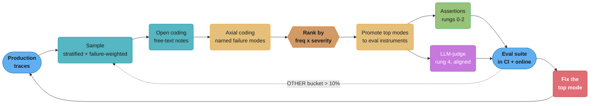
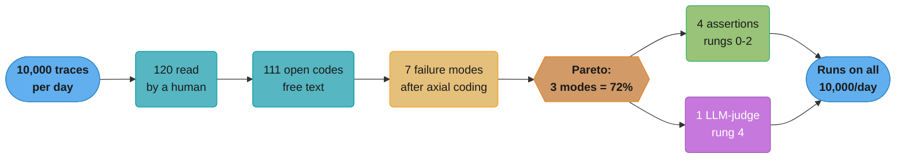
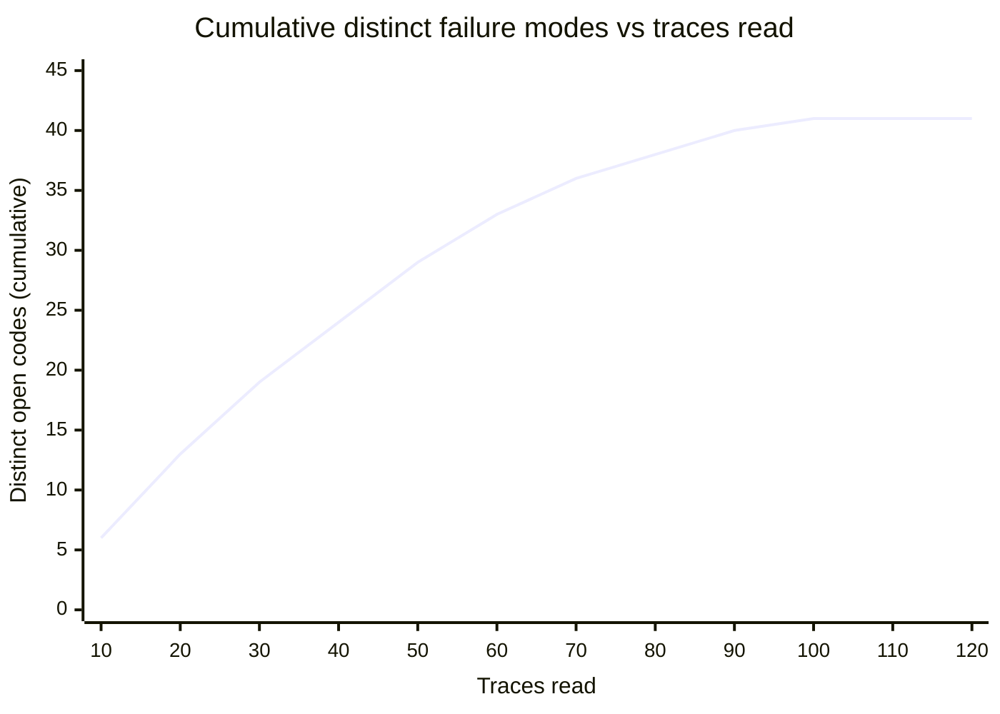
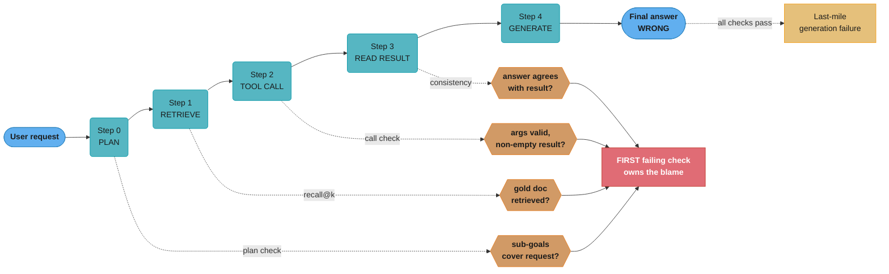
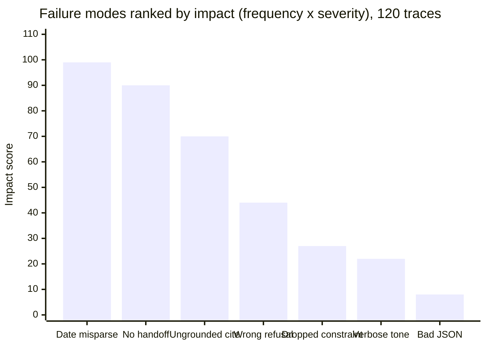
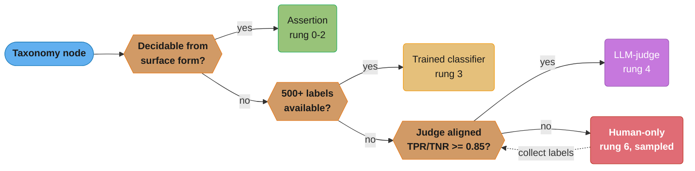

# Error Analysis & Eval Design

<!-- study-paths
senior: README.md
principal: README.md
files this module contributes to each curated path; omit a tier to leave it out
-->
## 1. Concept Overview

Most teams shipping an LLM product can measure. Very few can say **what they should be measuring**.
They wire up a scoring harness, pick a benchmark or a generic "helpfulness" judge, watch a number
that hovers around 0.85, and then discover — from a customer, not the dashboard — that the assistant
silently drops the second half of every two-part question.

**Error analysis** is the discipline that produces the list of things worth measuring. It is a
qualitative-first loop borrowed from social-science coding methodology and adapted to LLM traces:
read real production traces, write free-form notes on what went wrong (**open coding**), cluster
those notes into a small set of named **failure modes** (**axial coding**), rank the modes by
frequency times severity, and only then promote the top modes into **evals** — deterministic
assertions where possible, LLM-judges where not.

**Eval design** is the second half of the same loop: turning a taxonomy node into an instrument that
can be run on every trace, cheaply, forever, with a known error rate of its own.

This module is deliberately narrow, and it sits between two neighbours:

| Module | Answers | Does NOT answer |
|--------|---------|-----------------|
| [Evaluation & Benchmarks](../evaluation_and_benchmarks/README.md) | What benchmarks exist, how LLM-as-judge works, RAGAS/HELM/Arena, BLEU/ROUGE/perplexity, the kappa formula | Which of these you should run on *your* system |
| **This module** | How to discover your own failure modes and design the eval set that catches them | The mechanics of any one metric |
| [LLM Testing Strategies](../llm_testing_strategies/README.md) | Golden datasets, regression suites, pytest, CI gating, flakiness | Where the golden dataset's contents came from |

Read plainly: the neighbours are the *thermometer* and the *thermostat*. This module is the
**diagnosis** that tells you which patient's temperature to take.

The single most repeated finding across practitioner write-ups is unglamorous — Hamel Husain's
["A Field Guide to Rapidly Improving AI Products"](https://hamel.dev/blog/posts/field-guide/),
drawn from 30+ production implementations, reduces to *look at your data*. At Nurture Boss, an
apartment-industry AI assistant, reading real conversations revealed that date handling failed 66%
of the time on requests like "schedule a tour two weeks from now"; three failure modes accounted
for over 60% of all problems, and the targeted fix took date handling from 33% to 95% success. No
public benchmark contains that finding, because no public benchmark contains apartment tours.

---

## 2. Intuition

> **One-line analogy**: A benchmark is a standardized blood panel. Error analysis is the doctor
> actually asking where it hurts — and the panel is worthless until you know which organ to test.

**Mental model**: Imagine you inherit a web service with a 500-error rate of 3% and no logging.
You would not start by running an industry-standard HTTP benchmark. You would tail the logs, read
fifty real failing requests, notice that forty of them share a malformed `Accept-Language` header,
name that bug, write a regression test for it, and fix it. Error analysis is that exact reflex,
applied to a system whose failures are semantic instead of syntactic — and whose "logs" are prose
that no `grep` can classify for you. The only available parser, at first, is a human reading.

**Why it matters**: The cost asymmetry is brutal. Reading 100 traces costs one engineer half a day
and typically yields a ranked list of 6-8 concrete, fixable modes. Building a generic eval harness
first costs two weeks and yields a number that cannot tell you what to change. Teams routinely
spend a quarter optimizing a judge prompt for a criterion that accounted for 4% of their failures
while a 33%-frequency mode sat unnamed.

**Key insight**: **You cannot write the rubric before you look at the outputs.** Shankar et al.
named this the *catch-22* of evaluation in
["Who Validates the Validators?"](https://arxiv.org/abs/2404.12272) (UIST 2024): to grade outputs
people must first externalize their criteria, but the act of grading outputs is what teaches them
their criteria. They call the resulting instability **criteria drift**. Any process that demands a
finished rubric up front is fighting a documented cognitive fact — which is why the loop starts
with unstructured notes and ends with a rubric, never the reverse.

---

## 3. Core Principles

- **Look at the data first, and look at *real* data.** Synthetic happy-path examples you wrote
  yourself encode your assumptions about how the product is used. Production traces encode how it
  is actually used. The gap between the two is where most failure modes live.
- **Frequency beats intuition, and frequency times severity beats frequency.** Engineers reliably
  over-weight the failure they personally saw last week. A counted taxonomy replaces a hallway
  argument with a sorted table.
- **Cheapest sufficient instrument.** For every taxonomy node ask, in order: can a regex or a
  parser catch this? A small classifier? Only if both fail does it become an LLM-judge — and only
  if the judge fails does it stay human-only. Each rung up costs roughly 100x in latency and money.
- **The judge is a model, therefore the judge needs an eval.** An LLM-judge is an unvalidated
  classifier until it has been scored against human labels on a held-out set. Reporting a judge's
  output as ground truth is the same category error as reporting a model's confidence as accuracy.
- **A taxonomy is a work queue, not a report.** If a node cannot be assigned to an engineer with a
  plausible fix, it is too abstract. "Hallucination" is a report. "Cites a chunk id that was not in
  the retrieved set" is a work queue item.
- **Stop when you stop learning, not when you hit a round number.** Sampling continues until a
  fresh batch of traces produces (almost) no new codes — **theoretical saturation**, from grounded
  theory (Glaser & Strauss, 1967). Guest, Bunce & Johnson (2006) measured saturation at about
  **12 interviews** in a 60-interview qualitative study; LLM traces are noisier and more varied,
  so the working figure is 100+, but the stopping *rule* is the same.
- **Aggregate scores are for reporting; slices are for deciding.** A single number is the one shape
  of metric that is guaranteed to hide the failure you most need to find.
- **Every improvement round re-samples.** Fixing the top mode changes the distribution of the
  remaining ones. A taxonomy built in March describes a system that no longer exists in May.

---

## 4. Types / Architectures / Strategies

### 4.1 Trace Sampling Strategies

The sample is the experiment. Choose the strategy from what you are trying to learn, not from what
is easiest to query.

| Strategy | How | Learns | Fails at |
|----------|-----|--------|----------|
| **Uniform random** | `ORDER BY random() LIMIT n` | Unbiased frequency estimates; the true head of the distribution | Rare-but-fatal modes; a 1% mode needs ~299 traces for a 95% chance of even one sighting |
| **Stratified** | Bucket by a production-meaningful key (locale, doc type, tenant tier, turn count), floor + proportional allocation | Per-slice failure rates; guarantees the long tail is represented | Frequencies are no longer directly comparable to production without re-weighting |
| **Failure-weighted** | Oversample traces with a thumbs-down, a retry, an escalation, a tool error, an abandonment | Dense failure signal per hour of reading | Systematically blind to failures users never complained about — usually the worst ones |
| **Outlier / tail** | Longest traces, most tool calls, highest latency, lowest retrieval score, highest token count | Cascading and long-horizon failures; agent loops | Over-represents pathological inputs; frequencies are meaningless |
| **Adversarial / seeded** | Traces from a red-team run or a synthetic perturbation of real inputs | Safety and robustness modes with near-zero natural prevalence | Not production behaviour; must be scored in a separate pool |
| **Query-clustered** | Embed queries, cluster, sample from each cluster | Intent-level coverage; finds intents nobody designed for | Cluster quality is itself an unvalidated model |

**The default in practice is a blend**: roughly 60% stratified-random for honest frequencies, 30%
failure-weighted for signal density, 10% tail. Keep the strata labelled on every annotation so the
two populations can be separated at analysis time — mixing them and then quoting a frequency is one
of the most common self-inflicted errors in this whole discipline.

### 4.2 Coding Methods

| Method | When | Output |
|--------|------|--------|
| **Open coding** | First pass, no prior taxonomy | One free-text note per undesired behaviour, in the annotator's own words |
| **Axial coding** | After 80-150 open codes exist | Codes merged into named categories with definitions and boundary rules |
| **Closed / deductive coding** | Taxonomy already exists; you are measuring, not discovering | Counts per known category; new observations go to an `OTHER` bucket that is reviewed every round |
| **LLM-assisted clustering** | Between open and axial, at 100+ codes | Draft cluster proposals for a human to accept, split, merge, or reject |

The `OTHER` bucket is the taxonomy's health check. If `OTHER` exceeds ~10% of coded instances, the
taxonomy has gone stale and needs another open-coding pass.

### 4.3 The Eval Instrument Ladder

Every taxonomy node gets promoted to exactly one rung. Climb only when forced.

| Rung | Instrument | Typical latency | Marginal cost / 1k traces | Catches |
|------|-----------|-----------------|---------------------------|---------|
| 0 | Schema / parser check (JSON parses, enum valid, required field present) | < 1 ms | $0 | Structural violations |
| 1 | String / regex / set assertion (cited id is in the retrieved set, forbidden phrase absent, unit present) | < 1 ms | $0 | Anything with a decidable surface form |
| 2 | Deterministic semantic check (exact match, numeric tolerance, SQL result equality, code executes and passes tests) | 1-500 ms | $0 | Tasks with a computable ground truth |
| 3 | Small trained/tuned classifier (fine-tuned encoder, logistic regression over embeddings) | 5-50 ms | ~$0.02 | Recurring high-volume judgements with 500+ labels available |
| 4 | LLM-judge, binary, single criterion | 0.6-2 s | ~$0.30 | Judgements requiring reading comprehension |
| 5 | LLM-judge, pairwise or reference-based | 1-4 s | ~$0.60 | Ranking a candidate against a baseline |
| 6 | Human annotation | minutes | $500-5,000 | Anything the judge has not yet been aligned to; the source of truth for every rung above |

Rung costs assume a ~1,200-token trace and a small judge model priced at $0.20 per million input
tokens and $0.80 per million output tokens — a modelling assumption, not a vendor quote. The shape
of the table, not the cents, is the point: **rungs 0-2 are free and rung 4 is not**, and the gap is
about four orders of magnitude.

### 4.4 Annotation Configurations

| Configuration | Raters per item | Agreement measurable? | Use when |
|---------------|-----------------|-----------------------|----------|
| Single expert ("benevolent dictator") | 1 | No | Bootstrapping; one domain owner exists; <200 items |
| Double-rated with adjudication | 2 + tiebreaker | Cohen's kappa | Rubric is being validated; the standard for a judge alignment set |
| Double-rated on a 20% overlap | 2 on a subset | Cohen's kappa on the subset | Large sets where full double-rating is unaffordable |
| N-rater majority vote | 3-5 | Fleiss' kappa | Subjective criteria (tone, helpfulness) where one person's read is not the truth |
| Ordinal rubric, N raters, some skips | 2-N, ragged | Krippendorff's alpha | 1-5 scores; annotators allowed to say "cannot judge" |

### 4.5 Agent Failure Attribution Modes

An agent trajectory fails *somewhere*. The taxonomy for an agent has a second axis — **which step**
— and the two axes must not be collapsed.

| Attribution | Definition | Signature in the trace |
|-------------|-----------|------------------------|
| **Planning** | The decomposition was wrong before any action ran | Sub-goals do not cover the request; a required step is absent from the plan |
| **Tool selection** | Right plan, wrong tool | A tool exists that would have worked and was not called |
| **Tool invocation** | Right tool, wrong arguments | API 4xx, empty result set, a malformed date or id in the call |
| **Retrieval** | Right query intent, wrong documents | Gold document absent from the retrieved set; recall@k = 0 |
| **Observation handling** | Correct results, ignored or misread | Tool returned the answer; the model contradicted it |
| **Last-mile generation** | Every step correct, final answer still wrong | All step checks pass, final verdict fails |
| **Termination** | Stops too early or loops | Max-steps hit; the same tool called with identical arguments 3+ times |

These are covered from the *benchmark* side in
[agent_evaluation_and_benchmarking.md](../agents_and_tool_use/agent_evaluation_and_benchmarking.md);
here the concern is attribution on your own traces, not scoring against WebArena or tau-bench.

---

## 5. Architecture Diagrams

### The Analyze-Measure-Improve Loop



The dotted edge is the part teams skip. An eval suite that never sends you back to sampling is a
suite that is slowly measuring a system that has moved on.

### The Funnel — What 10,000 Traces Become



The width collapse from 10,000 to 120 is what makes the loop affordable; the width expansion from
5 instruments back to 10,000 is what makes it durable. Everything hard happens in the middle.

### Saturation — When to Stop Reading



The curve flattens near trace 90-100: a fresh batch of 20 added one new code, then zero. That is
theoretical saturation, and it — not a target of "read 50" — is the stopping rule. If your curve is
still climbing steeply at 120, you have either a very heterogeneous product or codes that are too
fine-grained to merge.

### Judge-vs-Human Alignment Grid

```
                      HUMAN LABEL (the ground truth)
                        failure          not-failure
                   +-----------------+-----------------+
   J    failure    |   TP = 38       |   FP = 21       |  judge says 59
   U               |  agreed catch   |  FALSE ALARM    |
   D               |                 |  wastes triage  |
   G               +-----------------+-----------------+
   E   not-failure |   FN = 12       |   TN = 49       |  judge says 61
                   |  MISSED BUG     |  agreed pass    |
                   |  ships to users |                 |
                   +-----------------+-----------------+
                     human says 50     human says 70      n = 120

   naive "accuracy" = (38 + 49) / 120 = 0.725      <- the number to distrust
   TPR (recall on failures) = 38 / 50  = 0.76      <- 1 in 4 real bugs invisible
   TNR (recall on passes)   = 49 / 70  = 0.70      <- 3 in 10 clean traces flagged
```

Report TPR and TNR separately, never a single accuracy. On a base rate of 42% failures the two
error types cost completely different things: an FN ships a bug, an FP burns an engineer's morning.
A judge with TPR 0.76 / TNR 0.70 is not shippable; §6.8 walks the repair to 0.90 / 0.91.

### Agent Trajectory — Where to Assign Blame



The rule that makes agent error analysis tractable: **attribute to the earliest failing check, not
to every failing step**. Counting every bad step inflates whichever stage sits downstream of the
real bug — usually generation, which is why so many teams conclude "the model hallucinates" when
their retriever is broken.

---

## 6. How It Works — Detailed Mechanics

### 6.1 How Many Traces? The Arithmetic

The question "how many traces should I read?" has two different answers depending on which question
you are asking.

**Question A — will I *see* a mode at all?** A failure mode with prevalence `p` is missed entirely
in `n` uniformly sampled traces with probability `(1 - p)^n`. Solving for a confidence `c` of at
least one sighting:

```
    n = log(1 - c) / log(1 - p)
```

| Mode prevalence | Traces for a 95% chance of >= 1 sighting |
|-----------------|------------------------------------------|
| 20% | 14 |
| 10% | 29 |
| 5%  | 59 |
| 2%  | 149 |
| 1%  | 299 |

Read 20 traces and you have a **36% chance of never seeing a 5% failure mode**. That is the whole
argument against the "I spot-checked a few outputs" school of quality assurance.

**Question B — will I *trust the count*?** Seeing a mode once is not measuring it. Interval width
is what decides whether you can rank two modes against each other:

```python
import math

def wilson(k: int, n: int, z: float = 1.96) -> tuple[float, float]:
    """95% Wilson score interval for a proportion — correct at small n and near 0/1,
    where the textbook normal approximation is not."""
    if n == 0:
        return (0.0, 1.0)
    p = k / n
    d = 1 + z * z / n
    centre = (p + z * z / (2 * n)) / d
    half = z * math.sqrt(p * (1 - p) / n + z * z / (4 * n * n)) / d
    return (max(0.0, centre - half), min(1.0, centre + half))
```

```
    4/100  = 0.040   95% CI [0.016, 0.098]   width 0.083
    9/300  = 0.030   95% CI [0.016, 0.056]   width 0.040
    7/12   = 0.583   95% CI [0.320, 0.807]   width 0.487
```

The 7-of-12 row is the caution: an engineer who read twelve traces and reports "it fails 58% of the
time" has a confidence interval spanning *fair* to *catastrophic*. The practical target is
**100-150 traces for a first taxonomy** — enough for saturation and for ~5% modes to have
intervals narrow enough to rank.

**Question C — when do I stop?** Neither of the above. You stop at **saturation**: read in waves of
20-25 and stop when a wave adds at most one new code. The formula-derived numbers are a floor, the
saturation curve is the decision.

### 6.2 Stratified Sampling With a Floor

Pure proportional sampling starves the tail — the OCR slice at 4% of traffic gets 4 of 100 seats,
which by §6.1 cannot support any claim about it. Give every stratum a floor first, then distribute
what is left proportionally.

```python
from __future__ import annotations
import random
from collections import defaultdict
from typing import Callable, Iterable, TypeVar

T = TypeVar("T")

def stratified_sample(
    traces: list[T],
    key: Callable[[T], str],
    n: int,
    floor: int = 10,
    seed: int = 0,
) -> tuple[list[T], dict[str, int]]:
    """Every stratum gets `floor` seats (or all it has); the remaining budget is
    distributed proportionally to stratum size, largest-remainder."""
    rng = random.Random(seed)
    buckets: dict[str, list[T]] = defaultdict(list)
    for t in traces:
        buckets[key(t)].append(t)

    alloc = {k: min(floor, len(v)) for k, v in buckets.items()}
    left = n - sum(alloc.values())
    if left > 0:
        head = {k: len(v) - alloc[k] for k, v in buckets.items()}   # headroom
        pool = sum(head.values())
        share = {k: left * head[k] / pool for k in head}
        for k in share:                                             # integer part
            take = min(head[k], int(share[k]))
            alloc[k] += take
            left -= take
        for k in sorted(share, key=lambda k: -(share[k] % 1)):      # largest remainder
            if left == 0:
                break
            if alloc[k] < len(buckets[k]):
                alloc[k] += 1
                left -= 1

    out: list[T] = []
    for k, m in alloc.items():
        out.extend(rng.sample(buckets[k], m))
    return out, alloc
```

On a 10,000-trace day split 6,200 / 2,500 / 900 / 400 across four document kinds, `n=100`,
`floor=10`:

```
    stratum      allocated    proportional-only would give
    en_plain          47                     62
    en_long           25                     25
    es_plain          16                      9
    ocr_pdf           12                      4
```

The OCR slice goes from 4 seats to 12 — still small, but now capable of distinguishing "broken" from
"fine". **Record the stratum on every annotation.** Frequencies from a stratified sample must be
re-weighted by `stratum_share / sample_share` before they can be quoted as production rates; skip
that and you will report the OCR failure rate as three times its real contribution.

### 6.3 Open Coding — The Mechanics

Open coding is deliberately unstructured. One row per trace; one free-text note per undesired
behaviour; the annotator's own words; **no dropdown, no predefined categories**. The moment you
hand an annotator a category list you have converted discovery into confirmation, and every mode
outside the list becomes invisible.

The minimum viable tool is a spreadsheet with five columns:

| Column | Content | Why |
|--------|---------|-----|
| `trace_id` | Link back to the full trace | Every claim must be re-checkable |
| `stratum` | Which sampling bucket | Needed for re-weighting (§6.2) |
| `verdict` | good / bad / unsure | Forces a binary before the prose |
| `note` | "answered the tour question but ignored the pet-policy half" | The actual data |
| `severity` | 1-5, defined in the guideline | Feeds the Pareto in §6.4 |

Three rules that decide whether the pass is worth anything:

1. **Write the note before the category.** If you find yourself typing a category name, you have
   started axial coding early.
2. **One trace can carry multiple notes.** 120 traces producing 111 notes is normal; many traces are
   clean, some carry three.
3. **`unsure` is a first-class verdict.** A high `unsure` rate is not annotator weakness — it means
   the product's own success criterion is undefined, which is a finding.

**A custom trace viewer is the highest-leverage tool nobody builds.** Reading traces in a generic
observability UI — expanding JSON blobs, hunting for the retrieved chunks — costs 3-5x the time of a
purpose-built page that renders the conversation, the retrieved documents, and the tool calls side
by side with a one-key verdict. The field-guide claim is that teams with a good viewer iterate about
**10x faster**; even discounting that heavily, a day spent on the viewer pays back inside the first
taxonomy.

### 6.4 Axial Coding — From Notes to a Taxonomy

Axial coding merges 111 notes into 7 named modes. Do it as a physical sort: group notes that would
be **fixed by the same change**, name the group, then write a one-sentence definition and a
boundary rule that decides ambiguous cases.

A taxonomy node is well-formed when it passes all four tests:

| Test | Question | Fails as | Passes as |
|------|----------|----------|-----------|
| **Actionable** | Could I assign this to an engineer today? | "Hallucination" | "Cites a chunk id absent from the retrieved set" |
| **Sized to fix** | Is this one change or twenty? | "Bad UX" | "Does not hand off to a human when the user says 'agent' or 'representative'" |
| **Mutually exclusive enough** | Would two annotators pick the same node? | "Unhelpful" vs "Off-topic" | Boundary rule: "if the content is correct but the tone is wrong -> tone; if the content is wrong -> correctness" |
| **Observable** | Can it be decided from the trace alone? | "The user was frustrated" | "The user repeated the same request within 2 turns" |

"Mutually exclusive **enough**" is deliberate. Perfect MECE is unachievable on natural language and
chasing it produces a taxonomy so abstract it fails the actionable test. The operational standard is
a documented boundary rule plus an inter-rater agreement number (§6.7) that shows annotators can
apply it.

**LLM-assisted clustering** is legitimate here and only here: give the model the 111 raw notes and
ask for candidate groupings, then accept/split/merge by hand. It is a proposal generator, not the
author. The Nurture Boss process did exactly this — open-ended notes first, then "we used an LLM to
build a taxonomy of common failure modes." What must stay human is the *definition* and the
*boundary rule*, because those are what the annotators and the judge will later be held to.

### 6.5 Ranking — Frequency Times Severity

Frequency alone mis-ranks. Severity is a 1-5 scale defined in the annotation guideline (5 = a wrong
answer a user would act on; 1 = cosmetic).



The table behind it:

| Failure mode | Freq | Sev | Impact | Cumulative |
|--------------|------|-----|--------|------------|
| Date / relative-time misparse | 33 | 3 | 99 | 27.5% |
| Fails to hand off to a human | 18 | 5 | 90 | 52.5% |
| Cites a chunk it did not retrieve | 14 | 5 | 70 | 71.9% |
| Refuses an in-scope question | 11 | 4 | 44 | 84.2% |
| Drops a constraint from turn 1 | 9 | 3 | 27 | 91.7% |
| Verbose / off-tone | 22 | 1 | 22 | 97.8% |
| Malformed JSON | 4 | 2 | 8 | 100.0% |

**"Verbose / off-tone" is the lesson.** It is the second most *frequent* mode (22 instances) and the
second *least* important (impact 22). A team ranking by raw count would have spent a sprint on tone
prompting while the handoff failure — 18 instances, every one of them a user stuck in a loop with a
bot — sat below it. Three modes cover 72% of the impact; that is the work queue.

### 6.6 Promoting a Node to an Instrument

The decision procedure, applied per node:



Most teams overestimate how many nodes need rung 4. Of the seven modes above, four are assertions:
malformed JSON (rung 0), ungrounded citation (rung 1), dropped constraint (rung 1, keyword presence
from the first user turn), and date misparse (rung 2, parse the emitted date and compare to a
reference resolver). Only "fails to hand off" and "refuses an in-scope question" genuinely need
reading comprehension.

**Broken, then fixed.** The single most common bad assertion is a substring check standing in for a
semantic property:

```python
# BROKEN: "does the answer cite a source?" as a substring check.
def cites_source_broken(answer: str) -> bool:
    return "[" in answer and "]" in answer
```

It returns `True` for all three of these, including the two that are exactly the bug you were
hunting:

```
    "...begins on the 1st [doc-12] and renewal is automatic [doc-44]."   correct
    "...begins on the 1st [doc-12]; the deductible is $500 [doc-91]."    doc-91 was never retrieved
    "...begins on the first of the month [see policy]."                  not a citation at all
```

The fix is to assert the property the taxonomy node actually names — *every cited id was in the
retrieved set* — which requires joining the answer against the trace, not inspecting it alone:

```python
import re

CITE = re.compile(r"\[(?:doc|chunk)[-_]?(\d+)\]", re.IGNORECASE)

def ungrounded_citations(answer: str, retrieved_ids: set[str]) -> list[str]:
    """Ids the answer cites that were never in the retrieval result. Empty == clean."""
    cited = {m.group(1) for m in CITE.finditer(answer)}
    return sorted(cited - retrieved_ids)
```

```
    retrieved = {"12", "44"}
    answer 1 -> []          answer 2 -> ["91"]          answer 3 -> []
```

Answer 3 still passes, correctly: `[see policy]` is a *missing* citation, which is a different
taxonomy node with its own assertion. One node, one instrument — an assertion that tries to defend
two nodes will be ambiguous when it fires.

Wire the suite so that every violation names the node it defends. That string is what links a CI
failure back to the trace-reading session that discovered it:

```python
from dataclasses import dataclass
from typing import Callable

@dataclass(frozen=True)
class Assertion:
    code: str                        # the taxonomy node id this defends
    fn: Callable[[dict], bool]       # True == clean

def run_assertions(trace: dict, suite: list[Assertion]) -> list[str]:
    return [a.code for a in suite if not a.fn(trace)]

SUITE = [
    Assertion("F3-ungrounded-citation",
              lambda t: not ungrounded_citations(t["answer"], t["retrieved_ids"])),
    Assertion("F7-malformed-json",
              lambda t: t["answer"].count("{") == t["answer"].count("}")),
    Assertion("F5-dropped-constraint",
              lambda t: all(k.lower() in t["answer"].lower() for k in t["must_mention"])),
]
```

**The cost argument for that ordering.** Ten thousand traces a day, five criteria:

```
    all five as LLM-judges:      50,000 calls/day   $15.20/day    ~$456/month
    four assertions + one judge: 10,000 calls/day   $ 3.04/day    ~$ 91/month
                                                                   80% cheaper
```

Latency matters more than money on an online path. An assertion runs in under a millisecond and can
sit in the request path as a guardrail; a rung-4 judge adds 0.6-2 s and can only run asynchronously
or on a sample. **Every criterion you push down the ladder converts an offline metric into an online
guardrail** — that, not the $365/month, is the real return.

### 6.7 Annotation Operations

**The guideline is a spec, and it is written after the first open-coding pass, never before.**
A usable one contains, per taxonomy node:

1. A one-sentence **definition**.
2. Two to three **positive examples** taken from real traces, with trace ids.
3. At least two **negative examples** — cases that look like this node and are not.
4. A **boundary rule** naming the sibling node it is most confused with.
5. The **severity anchor**: what a 1 looks like and what a 5 looks like for this node.
6. An explicit **out-of-scope** clause.

Broken guideline entry:

```
    F2 - Handoff failure: the bot should have handed off to a human and didn't.
```

Two annotators reading that will disagree constantly, because it silently asks them to decide *when
a handoff was owed* — a product question, not an annotation question. Fixed:

```
    F2 - Handoff failure
    DEFINITION: the user issued an explicit escalation request and the assistant
      continued to answer instead of triggering the handoff tool.
    TRIGGER PHRASES (non-exhaustive): "agent", "representative", "human",
      "speak to someone", "this isn't working".
    POSITIVE: trace 8841 (user says "just get me a person", bot re-explains policy)
    POSITIVE: trace 9013 (third repeat of the same question, bot does not offer handoff)
    NEGATIVE: trace 8702 (user says "agent" meaning the leasing agent's name) -> not F2
    NEGATIVE: trace 9120 (bot offers handoff, user declines) -> not F2
    BOUNDARY vs F4-wrong-refusal: F2 is failing to ESCALATE; F4 is refusing to ANSWER.
    SEVERITY: 5 if the user abandons the session; 3 if they rephrase and continue.
    OUT OF SCOPE: handoffs that fail because the CRM API is down (that is an
      infrastructure incident, not a model failure).
```

**Training annotators** takes one calibration session, not a document handoff. The working protocol:
all raters label the same 20 traces independently, then meet and walk every disagreement. Every
disagreement resolved in that meeting becomes a new negative example or boundary rule in the
guideline. Expect the guideline to double in length after the first calibration round; that growth
is the deliverable.

**Which agreement coefficient**, and what the number means:

| Situation | Coefficient | Notes |
|-----------|-------------|-------|
| Exactly 2 raters, categorical labels, all items rated | **Cohen's kappa** | The default for a judge-alignment set |
| 3+ raters, categorical, every item rated by the same number of raters | **Fleiss' kappa** | Generalizes the chance term over all raters' marginals |
| Ordinal labels (1-5), or missing/skipped ratings, or varying rater counts | **Krippendorff's alpha** | The only one that handles ragged data and ordinal distance |
| Continuous scores from 2+ raters | **ICC** or Spearman | Spearman when only the *ranking* matters |

The formulas for Cohen's and Fleiss' kappa, worked line by line with a numeric example, are in
[Evaluation & Benchmarks §6](../evaluation_and_benchmarks/README.md); the judge-specific Cohen's-vs-
Spearman argument is in [LLM Testing Strategies §6](../llm_testing_strategies/README.md). They are
not repeated here. What belongs here is **what to do with the answer.**

Fleiss' kappa on a 3-rater, 60-item, 3-category run (correct / minor / major) comes out at
**0.572** — "moderate" on the conventional scale, and **not good enough to gate anything**.
Krippendorff's own thresholds are stricter and more useful as a working rule: **do not draw
conclusions below alpha 0.667; treat 0.667-0.80 as tentative; require alpha >= 0.80 for a claim you
will act on.**

**When agreement is low, the rubric is broken, not the annotators.** Repair in this order:

1. **Build the disagreement matrix, not a single number.** Which *pair* of categories is
   absorbing the disagreements? In the 0.572 run above, 15 of the 24 non-unanimous items were
   correct-vs-minor. The problem is one boundary, not the whole taxonomy.
2. **Split or merge the confused pair.** If two nodes cannot be told apart by trained raters, they
   are one node for practical purposes — merge them. If the confusion is really two sub-cases,
   split and give each a boundary rule.
3. **Add negative examples from the actual disagreements.** Real disputed traces are worth ten
   invented ones.
4. **Check for a rater-specific bias** before blaming the rubric. If one rater's marginals are far
   from the others', that person is applying a different threshold and needs a calibration pass, not
   a rubric change.
5. **Re-measure on fresh items.** Re-scoring the same 60 items after discussing them is measuring
   memory, not reliability.

If agreement stays below 0.6 after two repair rounds, the criterion is genuinely subjective. Two
honest options: drop it from the eval suite, or convert it to a **preference comparison** ("is A
better than B?"), which is materially easier for humans to agree on than an absolute score.

### 6.8 Aligning an LLM-Judge to Human Labels

**Treat the judge exactly like a model you trained.** It gets a labelled dev set to iterate on and
a labelled test set it never sees during prompt iteration. Skipping the split means you will overfit
the judge prompt to 40 examples and discover it in production.

```python
from dataclasses import dataclass

@dataclass(frozen=True)
class Alignment:
    tp: int; fn: int; fp: int; tn: int

    @property
    def tpr(self) -> float:            # recall on real failures
        return self.tp / (self.tp + self.fn)

    @property
    def tnr(self) -> float:            # recall on clean traces
        return self.tn / (self.tn + self.fp)

    @property
    def naive_accuracy(self) -> float: # the number that lies
        n = self.tp + self.fn + self.fp + self.tn
        return (self.tp + self.tn) / n

def score(pairs: list[tuple[int, int]]) -> Alignment:
    """pairs = (human_label, judge_label), 1 == 'this trace exhibits the failure'."""
    return Alignment(
        tp=sum(1 for h, j in pairs if h == 1 and j == 1),
        fn=sum(1 for h, j in pairs if h == 1 and j == 0),
        fp=sum(1 for h, j in pairs if h == 0 and j == 1),
        tn=sum(1 for h, j in pairs if h == 0 and j == 0),
    )
```

The iteration, on the 120-item dev set from §5:

| Judge version | Change | TP | FN | FP | TN | TPR | TNR |
|---------------|--------|----|----|----|----|-----|-----|
| v1 | "Did the assistant fail to hand off appropriately?" | 38 | 12 | 21 | 49 | 0.76 | 0.70 |
| v2 | + the guideline's trigger-phrase list and boundary rule | 43 | 7 | 11 | 59 | 0.86 | 0.84 |
| v3 | + the four guideline examples as few-shot, + "answer NO if the user declined an offered handoff" | 45 | 5 | 6 | 64 | 0.90 | 0.91 |

Note what actually moved the numbers: **the judge prompt converged on the annotation guideline.**
That is the normal outcome and a useful sanity check — if your judge prompt and your human guideline
have diverged, one of them is wrong. Three iterations to reach >90% agreement matches the field
experience; if you are on iteration eight, the criterion is probably too subjective for rung 4 and
belongs back at §6.7's exit ramp.

**Then hold out.** Run v3 once on a fresh 120-item test set. A drop of more than ~5 points on either
TPR or TNR means you fit the dev set. Do not iterate on the test set — cut a new one.

**Correct your production rate for judge error.** A judge with TPR 0.90 and TNR 0.914 that flags 18%
of production traces is not telling you the failure rate is 18%:

```
    true_rate = (observed - FPR) / (TPR - FPR),   FPR = 1 - TNR

    observed 0.18  ->  (0.18 - 0.086) / (0.90 - 0.086)  =  0.115
    observed 0.30  ->  (0.30 - 0.086) / (0.90 - 0.086)  =  0.263
```

The uncorrected 18% overstates the real 11.5% by more than half. This correction is why you keep
the judge's confusion matrix rather than just its threshold — and it is only valid while the
matrix is current, which brings us to drift.

**Judge drift.** Three things invalidate a judge's alignment, and only one of them is obvious:

| Trigger | What breaks | Detection |
|---------|-------------|-----------|
| The **judge** model is upgraded or its snapshot rotates | The confusion matrix silently changes; a stricter judge reports a quality regression that did not happen | Re-run the frozen alignment set on every judge version bump; pin the judge model id |
| The **system under test** is upgraded | The failure *distribution* moves; the judge is now being asked about cases absent from its alignment set | Re-sample and re-code; watch the `OTHER` bucket |
| The **product** changes scope | Criteria that were correct become wrong (a refusal that was a bug is now policy) | Guideline review on every scope change |

The first one is the trap. Teams pin the model under test religiously and leave the judge on a
floating alias, then read a 4-point score drop as a product regression. **Pin both**, and keep a
frozen ~100-item alignment set as the judge's own regression suite — running it is a few dollars and
it is the only thing standing between you and a quarter of misattributed metric movement.

### 6.9 Attributing Failures in an Agent Trajectory

The single rule: **blame the earliest failing step.** Everything after an upstream error is
contaminated evidence.

```python
from __future__ import annotations
from dataclasses import dataclass, field
from typing import Literal

Stage = Literal["plan", "retrieve", "tool", "observe", "generate"]

@dataclass
class Step:
    idx: int
    stage: Stage
    ok: bool           # from a step-level checker or a human annotator
    note: str = ""

@dataclass
class Trajectory:
    trace_id: str
    steps: list[Step] = field(default_factory=list)
    final_ok: bool = False

def first_blame(traj: Trajectory) -> tuple[Stage, int] | None:
    """Attribute a failed trajectory to its EARLIEST bad step. A later bad step is
    downstream of an upstream error and must not be counted separately."""
    if traj.final_ok:
        return None
    for s in traj.steps:
        if not s.ok:
            return (s.stage, s.idx)
    return ("generate", traj.steps[-1].idx)   # every step clean, answer still wrong
```

On a six-trajectory sample where two failures cascade from a bad retrieval:

```
    naive "count every bad step":   generate 3, tool 2, retrieve 2, plan 1
    first-blame attribution:        retrieve 2, plan 1, tool 1, generate 1
```

The naive count ranks generation as the number-one problem. First-blame ranks it **last** and puts
retrieval first — because every one of those generation failures was the model faithfully
summarizing documents it should never have been given. Fix the retriever and three of the four
"generation failures" disappear.

Two corollaries worth stating:

- **The last-mile bucket is the residual, and it must exist.** A trajectory where every step check
  passes and the answer is still wrong is a real and distinct mode — it is where prompt and model
  quality live, uncontaminated by pipeline bugs. If your taxonomy has no last-mile bucket, your step
  checks are too lenient.
- **Step checks are themselves evals and go on the same ladder.** `recall@k > 0` for retrieval and
  "tool returned 2xx with a non-empty body" for invocation are rung-1 assertions. Plan quality is
  usually rung 4. You are building a small eval suite per stage, not one judge for the whole
  trajectory.

### 6.10 Coverage and Slice Analysis

An eval set "represents production" when, for every slice you would act on separately, the eval set
has enough items to detect a meaningful regression in that slice. That is a testable claim.

```
    slice                  n      share    pass    drag on aggregate
    en / plain text     6,200     62.0%    0.94         -0.0144
    en / long doc       2,500     25.0%    0.92         -0.0008
    es / plain text       900      9.0%    0.88         +0.0033
    scanned PDF (OCR)     400      4.0%    0.62         +0.0119
    ------------------------------------------------------------
    aggregate          10,000               0.9168
```

The aggregate is 0.9168 and looks healthy. The OCR slice is failing 38% of the time. Fixing that
one slice from 0.62 to 0.90 moves the headline from **0.9168 to 0.9280** — barely a point. A team
watching only the aggregate would never fund the work, and 400 users a day would keep getting wrong
answers. This is the entire case for slicing: **the aggregate's insensitivity to a small broken
slice is a mathematical property, not a monitoring gap you can fix with a better threshold.**

Practical rules:

- **Define slices from production dimensions you can act on**: locale, document type, tenant tier,
  input length bucket, turn count, retrieval-score bucket, new-vs-returning user, model version.
- **Minimum 30-50 eval items per slice**, or the slice's own confidence interval is wider than any
  regression you would care about (§6.1).
- **Alert on the worst slice, report the aggregate.** Gate CI on `min(slice_pass_rate)` and on the
  count of slices below threshold, not on the mean.
- **Track slice *coverage* as its own metric**: what fraction of production traffic falls into a
  slice with adequate eval representation? A coverage number below ~85% means you are flying blind
  over a real part of your traffic.
- **The long tail is found by clustering, not by listing.** You cannot enumerate the slices you have
  not thought of. Embed production queries, cluster, and look for clusters with no eval
  representation — that is where the unknown-unknowns are.

### 6.11 Eval Set Maintenance

An eval set is a living asset with four distinct decay modes.

**Leakage into your own prompt.** The most insidious one, because it is invisible and self-inflicted.
An engineer debugging a failing eval item pastes the tricky case into the system prompt as a
few-shot example. The eval now passes and measures nothing. Defences:

- Keep a **locked holdout** — 20-30% of items that no engineer may read. Report the dev/holdout gap;
  a widening gap *is* the leakage alarm.
- **Never paste an eval item into a prompt.** If a case is important enough to be in the prompt,
  write a *new* eval item for that behaviour and retire the old one.
- Grep the prompt registry against eval inputs in CI. A literal substring match is a build failure.
  (See [Prompt Management & PromptOps](../prompt_management_and_promptops/README.md).)

**Staleness.** Failure modes get fixed, and an eval set that is 80% solved-problems has almost no
discriminating power left — every candidate scores 0.95 and you cannot rank them. Retire items whose
pass rate has been 100% across the last five model versions into a cheap smoke suite, and refill
from current production failures. A healthy set holds an overall pass rate around **0.70-0.85**: high
enough that the system basically works, low enough that there is signal.

**Distribution shift.** Production usage moves. The eval set built in March against a summarization
workload does not cover the extraction workload that took over in June. Re-run coverage (§6.10)
monthly; if a cluster holding >5% of traffic has zero eval items, that is a backlog item.

**Growth policy.** Every production incident and every escalated support ticket yields a candidate
item. Without a policy the set grows unbounded and CI slows to the point that people skip it. A
workable policy:

| Rule | Value |
|------|-------|
| Every production incident contributes | 1-3 items, added the same week |
| Cap on total items in the blocking CI suite | ~200-400, budgeted by wall-clock (target < 10 min) |
| Everything above the cap | Moves to a nightly full suite |
| Retirement | Any item passing 5 consecutive releases moves to the smoke suite |
| Rebalance | Quarterly, against the current slice distribution |

The full CI mechanics — pytest structure, gating, flakiness — are in
[LLM Testing Strategies](../llm_testing_strategies/README.md); what this module owns is *which items
belong in the set and when they leave it*.

---

## 7. Real-World Examples

### Nurture Boss — Error Analysis on an Apartment Leasing Assistant

Documented in Hamel Husain's
[Field Guide to Rapidly Improving AI Products](https://hamel.dev/blog/posts/field-guide/). The team
had a working AI assistant and generic dashboards that were not telling them what to fix. They read
real conversations, wrote open-ended notes on undesired behaviour, and used an LLM to cluster those
notes into a taxonomy.

- **Three failure modes accounted for over 60% of all problems**: conversation-flow issues, handoff
  failures, and rescheduling problems.
- Date handling — "let's schedule a tour two weeks from now" — was **failing 66% of the time**.
- The targeted fix took date-handling success from **33% to 95%**.

The generalizable point is not the date bug; it is that a 66%-failure-rate behaviour was invisible
to every generic metric the team had, and one afternoon of reading traces surfaced it.

### EvalGen and Criteria Drift — "Who Validates the Validators?" (UIST 2024)

Shankar, Zamfirescu-Pereira, Hartmann, Parameswaran & Arawjo,
[arXiv:2404.12272](https://arxiv.org/abs/2404.12272). EvalGen is a mixed-initiative interface that
proposes candidate evaluators (Python assertions and LLM grader prompts) and then asks the human to
grade a subset of outputs, using that feedback to select the implementations that best match the
human's grades.

Two findings matter for practice. First, the **catch-22**: people need externalized criteria to
grade outputs, but grading outputs is how they discover their criteria — so any workflow that
demands the rubric first is structurally broken. Second, feedback from nine industry professionals
confirmed the tool's value *and* that criteria kept moving as they graded — **criteria drift**. Plan
for the rubric to change under you; version it, and re-measure agreement after every change.

### SPADE — Synthesizing Assertions From Prompt History (VLDB 2024)

Shankar, Li, Asawa, Hulsebos, Lin, Zamfirescu-Pereira, Chase, Fu-Hinthorn, Parameswaran & Wu,
[arXiv:2401.03038](https://arxiv.org/abs/2401.03038). The observation is a good one: developers
discover data-quality problems during prototyping and patch them by *adding instructions to the
prompt*. So the prompt's version history is a written record of the failure modes the team has
already found. SPADE mines that history to generate candidate assertions, then selects a minimal set
meeting coverage and accuracy targets.

Reported results: across nine real-world pipelines, a **14% reduction in the number of assertions**
and a **21% reduction in false failures** versus simpler baselines. It shipped inside LangSmith and
has generated assertions for over 2,000 pipelines.

Practical takeaway even without the tool: **read your own prompt diffs during axial coding.** Every
"IMPORTANT: do not..." line in a system prompt is an undocumented failure mode that someone found and
never wrote an eval for.

### Inspect AI — Evals as Composable Scorers

[Inspect](https://inspect.aisi.org.uk/) is the UK AI Security Institute's open-source (MIT) Python
framework for LLM evaluations, built around a `Dataset -> Task -> Solver -> Scorer` decomposition
with sandboxed execution and a log viewer. What is instructive for eval *design* is the shape: the
scorer is a first-class, separately-testable object rather than a metric baked into a harness. That
is exactly the property that lets a taxonomy node map one-to-one onto an instrument you can version
and validate independently. It has been adopted well beyond AISI, with contributions from other
safety institutes and frontier labs.

### Grounded Theory — Where the Method Comes From

Open coding, axial coding, and theoretical saturation are not AI inventions. They come from grounded
theory (Glaser & Strauss, *The Discovery of Grounded Theory*, 1967; axial coding elaborated by
Strauss & Corbin). The empirical saturation result most often cited is Guest, Bunce & Johnson (2006,
*Field Methods* 18:59-82), who found that saturation occurred within the first **12 interviews** of a
60-interview study, with basic metathemes visible by **6**. Borrowing the method wholesale is
appropriate — reading LLM traces is qualitative research on a machine's behaviour — but the sample
sizes do not transfer: interview transcripts are long and thematically dense, while a single LLM
trace often contributes nothing at all.

---

## 8. Tradeoffs

### Sampling Strategy

| Strategy | Cost per finding | Frequency estimates | Tail coverage | Best for |
|----------|------------------|---------------------|---------------|----------|
| Uniform random | High (most traces are fine) | Unbiased | Poor | Establishing the true failure rate |
| Stratified + floor | Medium | Needs re-weighting | Good | The default first pass |
| Failure-weighted | Low | Badly biased | Medium | Second pass, once frequencies are known |
| Outlier / tail | Low | Meaningless | Excellent | Agents, long-horizon tasks |
| Adversarial | Very low | N/A | N/A | Safety and security criteria only |

### Eval Instrument

| Instrument | Cost | Latency | Coverage of failure types | Trust without validation |
|------------|------|---------|---------------------------|--------------------------|
| Assertion (rungs 0-2) | ~$0 | < 1 ms | Narrow but exact | High — it is code you can read |
| Trained classifier (rung 3) | Low | 5-50 ms | Medium | Medium — needs a test set |
| LLM-judge (rung 4-5) | High | 0.6-4 s | Broad | **None** — unvalidated until aligned |
| Human (rung 6) | Very high | Minutes | Broadest | High, once agreement is measured |

### Annotation Configuration

| Configuration | Cost multiplier | Reliability signal | Failure mode |
|---------------|-----------------|--------------------|--------------|
| Single expert | 1x | None | Undetectable idiosyncratic bias |
| 20% double-rated overlap | 1.2x | Kappa on the subset | Subset may not represent the hard cases |
| Full double + adjudication | 2.3x | Kappa + a clean adjudicated set | Slow; adjudicator becomes a bottleneck |
| 3-5 rater majority | 3-5x | Fleiss kappa; per-item confidence | Expensive; majority can be confidently wrong |

### Aggregate vs Slice Reporting

| Approach | Detects a broken 4% slice | Stakeholder legibility | CI gate quality |
|----------|---------------------------|------------------------|-----------------|
| Single aggregate score | No — a 38% slice failure moves it 1.1 points | High | Poor |
| Per-slice table | Yes | Medium | Good |
| `min(slice)` + count-below-threshold | Yes, and it is one number | High | Best |

---

## 9. When to Use / When NOT to Use

### Do error analysis when:

- You have a **bespoke system** — RAG over your documents, an agent over your tools, a domain
  assistant. No public benchmark measures it.
- The product "feels wrong" and nobody can say why. That sentence is the diagnostic indication.
- You have **at least a few hundred real production traces**. Below that, sampling is not meaningful
  and you should be doing structured dogfooding instead.
- You are about to invest in evals and need to know **which** evals.
- A model or prompt upgrade produced an ambiguous result and you need to know what actually changed.
- You are staffing an annotation effort and need to justify what the annotators will label.

### Use benchmarks instead when:

- You are **selecting a base model** from a shortlist. MMLU-style breadth, HumanEval, and
  arena-style preference scores are exactly right for narrowing candidates — see
  [Evaluation & Benchmarks](../evaluation_and_benchmarks/README.md).
- You need an **external, comparable** number for a report, a model card, or a procurement process.
- You are evaluating a general capability (reasoning, multilingual, long-context) rather than a
  product behaviour.

### Do NOT do error analysis when:

- **There are no real users yet.** You will code your own assumptions and call it data. Ship a
  narrow slice to a small group first.
- **The system is changing daily.** A taxonomy built on a system that will be rewritten this week
  is thrown-away work. Stabilize first.
- **The failure is already deterministic and known.** If the API times out 8% of the time, fix the
  timeout. Error analysis is for failures whose *shape* is unknown, not their existence.
- **You cannot act on the findings.** A taxonomy that produces work nobody is funded to do is a
  document, and documents do not fix products.

### Escalate to human-only evaluation when:

- Inter-rater agreement stays below kappa/alpha 0.6 after two rubric repair rounds — the criterion is
  genuinely subjective and a judge will not rescue it.
- The stakes are regulatory or clinical, where an LLM-judge's error rate is itself the liability.
- The volume is low enough (< ~200 items per release) that automation is not worth the alignment
  work.

---

## 10. Common Pitfalls

**Starting with a benchmark.** A team spends three weeks standing up MMLU and HumanEval for a
customer-support RAG bot, gets 0.71 and 0.63, and learns nothing — neither benchmark contains a
single support ticket. Meanwhile the actual top failure mode (the bot answering from a
deprecated policy document that was never removed from the index) needed one afternoon of reading
to find. **Benchmarks answer someone else's question.**

**Vanity metrics.** "Average helpfulness 4.2/5" from a generic judge, tracked weekly, moving between
4.1 and 4.3. It is unactionable by construction: no engineer can be assigned "raise helpfulness."
The tell is that no one has ever changed a decision because of it. Replace it with per-node failure
rates that name a fix.

**An aggregate that hides a broken slice.** Covered numerically in §6.10 — a slice failing 38% of
the time moved the headline metric by 1.1 points. The pattern recurs whenever a small, high-value
population (enterprise tenants, a regulated locale, an accessibility path) is drowned by volume.
Gate on the worst slice.

**Optimizing the judge instead of the system.** A team's eval score climbs from 0.72 to 0.88 across
a quarter. Reading the commit history: nine changes to the judge prompt, two to the product. The
judge got more lenient. The defence is structural — **freeze the alignment set before you start
optimizing**, pin the judge model, and require that any judge prompt change be re-validated against
human labels. A judge change is a measurement-instrument change and should be as controlled as
recalibrating a scale.

**Annotating with the same model that generated.** Self-preference is a documented and large effect:
a model asked to grade its own output is scoring text drawn from its own distribution, and the
failure modes it is blindest to are exactly its own. Worse, the correlation is systematic, so the
error does not average out over a big eval set. Use a different model family for the judge where you
can, and always keep a human-labelled alignment set — that set is what makes the bias visible.

**Sampling only thumbs-down traces.** Explicit negative feedback is left by a small, unrepresentative
minority — typically well under 1% of sessions — and skews hard toward users who are engaged enough
to complain. Failures that produce a *plausible but wrong* answer generate no thumbs-down at all,
because the user believed it. Those are the dangerous ones. Failure-weighted sampling is a
supplement, never the whole sample.

**Stopping at 20 traces.** By §6.1, a 5% mode is missed 36% of the time at n=20. Two engineers doing
20 traces each and comparing notes will confidently agree on a taxonomy that omits a third of the
real modes, and the agreement will feel like evidence.

**Quoting frequencies from a stratified or failure-weighted sample without re-weighting.** The OCR
slice held 4% of traffic and 12% of the sample; reporting its raw sample frequency triples its
apparent importance and misdirects the whole sprint.

**A taxonomy that is a report, not a queue.** Nodes named "hallucination", "quality", "tone", "bad
UX". Every one of them is a whole engineering department. If the node cannot be turned into a
one-line assertion or a one-sentence judge criterion, it is not finished.

**Letting the guideline freeze while criteria drift.** The rubric written in week one describes what
you believed before you had read anything. Version it, re-measure agreement after each change, and
expect it to roughly double in length after the first calibration session.

**Eval items leaking into the prompt.** The pass rate goes up, the users do not notice any change.
The dev/holdout gap is the only reliable alarm; without a locked holdout, this failure is
undetectable from inside the eval system.

**Running the loop once.** Error analysis is not a project with a completion date. Fixing the top
mode redistributes everything below it, and the new top mode is frequently one that did not appear
in the original taxonomy at all.

---

## 11. Technologies & Tools

| Tool | What it is | Where it fits in this loop |
|------|-----------|----------------------------|
| [Braintrust](https://www.braintrust.dev/) | Commercial eval + observability platform | Trace review UI, dataset versioning, scorer registry, experiment diffing between prompt versions |
| [LangSmith](https://smith.langchain.com/) | LangChain's tracing and eval platform | Trace capture, annotation queues, dataset curation from production traces; ships SPADE-derived assertion synthesis |
| [Langfuse](https://langfuse.com/) | Open-source LLM observability (MIT/EE split) | Self-hostable tracing, human-annotation queues, dataset runs — the default when traces cannot leave your infrastructure |
| [Arize Phoenix](https://phoenix.arize.com/) | Open-source (Apache-2.0) tracing and eval library | Local notebook-first trace exploration, query clustering with embeddings, drift views for coverage analysis |
| [DeepEval](https://github.com/confident-ai/deepeval) | Open-source pytest-style eval framework (Confident AI) | Writing taxonomy nodes as test cases; ships G-Eval-style judge metrics and custom assertions |
| [Ragas](https://github.com/explodinggradients/ragas) | Open-source RAG evaluation library | Ready-made retrieval/groundedness metrics — useful as *rung-4 defaults* for RAG nodes, still needs alignment to your labels |
| [promptfoo](https://www.promptfoo.dev/) | Open-source CLI/config eval and red-team runner | Declarative YAML assertion suites, matrix runs across models/prompts, CI integration |
| [Inspect AI](https://inspect.aisi.org.uk/) | UK AI Security Institute's MIT-licensed eval framework | `Dataset/Task/Solver/Scorer` decomposition, sandboxed agent evals, log viewer |
| [Label Studio](https://labelstud.io/) | Open-source multi-modal annotation platform (HumanSignal) | Building the annotation UI, multi-rater assignment, agreement reporting |
| [Argilla](https://github.com/argilla-io/argilla) | Open-source data-annotation and curation tool (joined Hugging Face in 2024) | Collaborative human feedback collection, dataset curation, Hub integration |
| [OpenAI Evals](https://github.com/openai/evals) | Open-source eval registry and harness | Reusable eval templates; a reference for eval YAML structure |
| [Weights & Biases Weave](https://wandb.ai/site/weave/) | Tracing + eval layer on top of W&B | Experiment tracking for eval runs alongside training runs |
| `scikit-learn` (`cohen_kappa_score`, `confusion_matrix`) | Python ML library | Agreement and judge-alignment computation |
| `statsmodels` (`inter_rater.fleiss_kappa`) | Python statistics library | Fleiss' kappa for 3+ raters |
| [`krippendorff`](https://pypi.org/project/krippendorff/) | Small Python package | Krippendorff's alpha for ordinal or ragged annotation data |

A comparison of the *platforms* as products — pricing model, hosting, integration surface — is in
[LLMOps Platforms](../llm_ops_platforms/README.md); the tracing and instrumentation side is in
[LLM Observability & Monitoring](../llm_observability_and_monitoring/README.md). The choice that
matters for this module is narrower than the tool list suggests: **whatever you pick must let you
open a trace, read it as a human, attach a free-text note, and export those notes.** Tools that only
emit scores cannot support open coding at all.

---

## 12. Interview Questions with Answers

**Q: Your bespoke RAG assistant is underperforming and someone proposes running MMLU and HumanEval first. Why is that the wrong first move?**
**Short:** Public benchmarks measure general capability on someone else's data, so they cannot name a single failure mode of your system.

Neither benchmark contains a single document, query, or tool from your product, so a score on them cannot tell you what to change — you can get 0.71 on MMLU while the bot answers from a deprecated policy file that was never removed from the index. Benchmarks are the right instrument for *model selection* (narrowing a shortlist of base models) and for external comparability, not for diagnosing a deployed system. The correct first move costs an afternoon: sample 100-150 production traces, read them, and open-code what went wrong. The rule of thumb is that a benchmark answers someone else's question; error analysis is how you find out what your own question is.

**Q: Your eval dashboard shows 92% and the product still feels broken. What is happening and how do you find it?**
**Short:** An aggregate is mathematically insensitive to a small broken slice, so slice the metric by production dimensions and gate on the worst slice.

The aggregate is a volume-weighted mean, so a slice holding 4% of traffic and failing 38% of the time drags it by roughly one point — indistinguishable from noise. Concretely: four slices at 0.94 / 0.92 / 0.88 / 0.62 with shares 62/25/9/4% average to 0.9168, and repairing the 0.62 slice all the way to 0.90 moves the headline only to 0.9280. Break the metric down by locale, document type, tenant tier, input length, and turn count, with 30-50 eval items per slice so each has a usable confidence interval. Then gate CI on `min(slice_pass_rate)` and on the count of slices below threshold, and keep the aggregate purely for reporting.

**Q: Why should deterministic assertions be written before any LLM-judge?**
**Short:** Assertions are free, sub-millisecond, and self-evidently correct, while a judge costs about 100x more, adds seconds of latency, and is itself unvalidated.

Cost and latency are the visible part: at 10,000 traces a day with five criteria, running everything through a judge is roughly $456/month, while pushing four criteria down to assertions cuts it to about $91 — an 80% reduction. The bigger win is latency, because a sub-millisecond assertion can sit inline as a production guardrail while a 0.6-2 s judge can only run asynchronously or on a sample; every criterion you push down the ladder converts an offline metric into an online one. The decisive argument, though, is trust: an assertion is code a reviewer can read and verify, whereas a judge is an unvalidated classifier until you have scored it against human labels. In practice four of seven typical failure modes are expressible as assertions — malformed JSON, ungrounded citation, dropped constraint, date misparse — and only the genuinely comprehension-requiring ones need rung 4.

**Q: What goes wrong when you have the same model that generated the output also annotate it?**
**Short:** Self-preference is systematic, not random, so it does not average out — and the model is blindest to exactly its own failure modes.

A model grading its own output is scoring text drawn from its own distribution, which it finds fluent and plausible by construction; the errors it cannot see are its own characteristic errors. Because the bias is systematic rather than noisy, collecting more eval items does not wash it out — you get a tighter estimate of a wrong number. The mitigations are to use a different model family for the judge where feasible, to keep a human-labelled alignment set that makes the bias measurable, and to prefer assertions for anything where the property is decidable from surface form. If you must self-judge, report the judge's TPR and TNR against humans alongside every score so readers can discount it.

**Q: Your annotators agree 88% of the time. Why might that number mean nothing?**
**Short:** Raw agreement is inflated by the base rate; on a lopsided eval set two raters who both mostly say "pass" can agree 88% and carry zero information.

Eval sets are usually imbalanced because most responses are fine, so agreement expected purely by chance is already high before either annotator thinks. Chance-corrected coefficients exist for this: Cohen's kappa for exactly two raters, Fleiss' for three or more, Krippendorff's alpha for ordinal scales or ragged data with skips. The working thresholds are Krippendorff's — do not draw conclusions below 0.667, treat 0.667-0.80 as tentative, and require 0.80 or above before you act on a claim. The formula and a worked example live in [Evaluation & Benchmarks](../evaluation_and_benchmarks/README.md); the operational point is to never report raw agreement without the chance-corrected number beside it.

**Q: Your team keeps tuning the judge prompt and the eval score keeps rising, but users see no improvement. What went wrong?**
**Short:** They optimized the measuring instrument instead of the system — the judge got more lenient, not the product better.

The tell is in the commit history: many changes to the judge prompt, few to the product. Every judge prompt edit silently moves the confusion matrix, and because nothing re-validates it against humans, drift toward leniency looks exactly like progress. The structural fix is to treat a judge change as an instrument recalibration: freeze a roughly 100-item human-labelled alignment set before optimization begins, pin the judge model id (not a floating alias), and require any judge prompt change to be re-scored against that set before it can ship. If TPR and TNR did not hold, the score movement is measurement error and must not be reported as a quality change.

**Q: How many production traces do you have to read before you trust your failure taxonomy?**
**Short:** Read in waves of 20-25 and stop at saturation — when a fresh wave adds at most one new code — which in practice lands around 100-150 traces.

There are three separate questions hiding in "how many". To have a 95% chance of seeing a mode at all you need `n = log(1-c)/log(1-p)` traces: 59 for a 5% mode, 149 for a 2% mode, 299 for a 1% mode. To *rank* modes you need intervals narrow enough to separate them, which is why 7-of-12 ("58% failure rate") is useless — its 95% Wilson interval runs 0.32 to 0.81. But neither number is the stopping rule; saturation is, borrowed from grounded theory, where Guest, Bunce & Johnson (2006) measured it at 12 interviews. LLM traces are sparser than interview transcripts, so 100-150 is the working figure, and 20 is indefensible: a 5% mode is missed 36% of the time at n=20.

**Q: What is criteria drift and why does it break the "write the rubric first" workflow?**
**Short:** People discover their evaluation criteria by grading outputs, so a rubric written before looking at data is guaranteed to be wrong and to keep changing.

Shankar et al. named this the catch-22 in "Who Validates the Validators?" (UIST 2024): externalizing criteria is a prerequisite for grading, but grading is what teaches you the criteria. Their study with nine industry professionals found criteria kept moving as participants graded, which is why a fixed up-front rubric is fighting a documented cognitive fact. The practical consequence is that the loop must start with unstructured open coding and end with a rubric, never the reverse. Operationally: version the guideline, expect it to roughly double in length after the first calibration session, and re-measure inter-rater agreement after every change, because a rubric edit invalidates the previous agreement number.

**Q: You fixed the top failure mode and the aggregate eval score barely moved. Was the fix worthless?**
**Short:** Not necessarily — check whether the mode was concentrated in a small slice, and check the per-node failure rate rather than the aggregate.

The aggregate is volume-weighted, so a mode concentrated in a 4% slice can be eliminated entirely while the headline moves about a point. The right instrument is the per-node failure rate you defined during axial coding, plus the slice-level pass rate for the slice the mode lived in. There is a second possibility worth ruling out: the fix may have converted one failure mode into another — a stricter refusal policy that eliminates ungrounded citations by refusing more in-scope questions. That is why every improvement round re-samples and re-codes rather than only re-running the existing suite; if the `OTHER` bucket grew, you traded modes rather than fixing one.

**Q: Walk me through open coding and axial coding on LLM traces.**
**Short:** Open coding is one free-text note per undesired behaviour with no category list; axial coding merges those notes into named modes with definitions and boundary rules.

In open coding you take a sampled trace, record `trace_id`, `stratum`, a binary verdict, a free-text note in your own words, and a 1-5 severity — and deliberately provide no dropdown, because handing an annotator a category list converts discovery into confirmation and makes every unlisted mode invisible. Roughly 120 traces yield around 110 notes; many traces are clean and some carry several. Axial coding then physically groups notes that would be *fixed by the same change*, names each group, and writes a one-sentence definition plus a boundary rule against the sibling it is most confused with. An LLM is a legitimate proposal generator for the grouping step, but the definitions and boundary rules must be human-authored, because those are what annotators and the judge will later be held to.

**Q: What does a good failure taxonomy look like, and what does a bad one look like?**
**Short:** Good nodes are actionable, sized to one fix, observable from the trace alone, and separable by two trained raters; bad nodes are department-sized abstractions like "hallucination".

Apply four tests per node. Actionable: could you assign it to an engineer today — "cites a chunk id absent from the retrieved set" passes, "hallucination" does not. Sized to fix: one change, not twenty — "does not hand off when the user says 'agent' or 'representative'" passes, "bad UX" does not. Observable: decidable from the trace, so "the user repeated the same request within two turns" passes and "the user was frustrated" does not. Mutually exclusive *enough*: perfect MECE is unachievable on natural language, so the standard is a documented boundary rule plus an inter-rater agreement number showing raters can apply it. The health check on the whole taxonomy is the `OTHER` bucket — above about 10% of coded instances, it has gone stale and needs another open-coding pass.

**Q: How do you decide whether a taxonomy node becomes an assertion, a classifier, or an LLM-judge?**
**Short:** Climb the ladder only when forced — decidable from surface form means assertion, 500+ labels means classifier, and a judge only after it hits TPR and TNR of about 0.85.

The procedure is a three-question decision tree. Is the property decidable from the trace's surface form, possibly joined against other trace fields? Then it is a rung 0-2 assertion: schema check, regex or set membership, or a deterministic semantic check like executing the generated code. If not, do you already have 500+ human labels? Then a small tuned classifier at rung 3 is cheaper and faster than a judge. Only if both fail does it become a rung-4 LLM-judge, and even then it does not ship until it is aligned against human labels; if alignment stalls, the node stays human-only on a sampled basis while you collect more labels. One node maps to exactly one instrument — an assertion defending two nodes is ambiguous the moment it fires.

**Q: How do you validate an LLM-judge against human labels, and which numbers do you report?**
**Short:** Split the labelled data into dev and test, iterate the prompt on dev only, and report TPR and TNR separately — never a single accuracy.

Treat the judge as a model you are training: a dev set to iterate on and a held-out test set the prompt never sees. Report the two conditional recalls separately because they cost different things — a false negative ships a bug to users, a false positive burns an engineer's triage morning — and a single accuracy number hides that. A judge at 38/12/21/49 on 120 items reads as 72.5% "accurate" while its TPR is 0.76, meaning one in four real bugs is invisible. Iterate by importing the human annotation guideline's trigger phrases, boundary rules, and examples into the judge prompt; convergence of judge prompt and guideline is the expected and healthy outcome, and three iterations to above 0.90 is typical. Finally run once on the test set: a drop of more than about 5 points means you overfit the dev set.

**Q: How do you sample traces for error analysis?**
**Short:** Blend roughly 60% stratified-random with a per-stratum floor, 30% failure-weighted, and 10% tail — and record the stratum on every annotation so frequencies can be re-weighted.

Pure proportional sampling starves the tail: a slice holding 4% of traffic gets 4 of 100 seats, which cannot support any claim about it. Give every stratum a floor of about 10 and distribute the remainder proportionally by largest remainder — on a 62/25/9/4% split at n=100 that yields 47/25/16/12, so the 4% slice gets 12 seats instead of 4. Failure-weighted sampling (thumbs-down, retries, escalations, tool errors, abandonments) adds signal density but is systematically blind to plausible-but-wrong answers that no user complains about, so it can never be the whole sample. The step everyone forgets: frequencies from a stratified sample must be re-weighted by `stratum_share / sample_share` before being quoted as production rates.

**Q: Which inter-rater agreement coefficient do you use for two raters, five raters, and a 1-5 ordinal rubric?**
**Short:** Cohen's kappa for exactly two raters, Fleiss' kappa for three or more with equal rater counts, and Krippendorff's alpha for ordinal scales or ragged data with skips.

Cohen's is the default for a judge-alignment set because that is inherently a two-rater comparison — judge versus human. Fleiss' generalizes the chance term across all raters' marginals and requires the same number of raters per item. Krippendorff's alpha is the only one of the three that handles both ordinal distance (so a 1-vs-2 disagreement counts less than a 1-vs-5) and missing ratings, which makes it the right choice whenever annotators are allowed to skip. For continuous scores use ICC, or Spearman when only the ranking matters — a judge that scores everything one point low collapses kappa while keeping Spearman near 1.0, and for regression testing against a baseline the ordering is what you actually need.

**Q: Inter-rater agreement comes back at kappa 0.57. What do you do?**
**Short:** Treat it as a broken rubric, not weak annotators — find the specific confused category pair, split or merge it, add negative examples from the real disagreements, then re-measure on fresh items.

Start with the disagreement matrix rather than the single number: in a typical 0.57 run most of the disagreements concentrate in one category pair, so the problem is one boundary, not the whole taxonomy. If two nodes cannot be told apart by trained raters they are effectively one node and should be merged; if the confusion is genuinely two sub-cases, split them and give each an explicit boundary rule. Add the actual disputed traces as negative examples, which are worth ten invented ones, and separately check whether one rater's marginals are far from the others' — that is a calibration problem, not a rubric problem. Re-measure on *fresh* items, since re-scoring the discussed ones measures memory. If it stays below 0.6 after two repair rounds the criterion is genuinely subjective: either drop it or convert it to a pairwise preference comparison, which humans agree on far more readily than absolute scores.

**Q: An agent trajectory produced a wrong final answer. How do you attribute the failure to a step?**
**Short:** Blame the earliest failing step-level check — everything downstream of an upstream error is contaminated evidence and must not be counted separately.

Instrument per-stage checks: does the plan's sub-goals cover the request, was the gold document retrieved (`recall@k > 0`), did the tool call return 2xx with a non-empty body and valid arguments, and does the final answer agree with the observation. Then walk the trajectory and attribute to the first check that fails. The difference is not cosmetic: on a sample where two failures cascade from a bad retrieval, naive per-step counting ranks generation first (3 instances) while first-blame ranks it last and puts retrieval first — because those generation "failures" were the model faithfully summarizing documents it should never have received. Keep a last-mile bucket for trajectories where every step check passes and the answer is still wrong; if that bucket is empty, your step checks are too lenient.

**Q: Your judge flags 18% of production traces. Is your failure rate 18%?**
**Short:** No — correct for the judge's own error rates; a judge with TPR 0.90 and TNR 0.914 flagging 18% implies a true failure rate of about 11.5%.

An imperfect classifier's positive rate mixes true positives with false alarms, and on a low-prevalence population the false alarms dominate. With FPR = 1 - TNR = 0.086, an observed 0.18 corrects to `(0.18 - 0.086) / (0.90 - 0.086) = 0.115` — the uncorrected number overstates reality by more than half. This is precisely why you keep the judge's full confusion matrix rather than just a threshold. The correction is only valid while the matrix is current, so it must be re-derived whenever the judge model, the system under test, or the product's scope changes.

**Q: What has to be in an annotation guideline for it to be usable?**
**Short:** Per node: a one-sentence definition, real positive and negative examples with trace ids, a boundary rule against its most-confused sibling, severity anchors, and an out-of-scope clause.

The failure mode is a guideline that smuggles a product decision into the annotation task — "the bot should have handed off and didn't" silently asks the annotator to decide *when a handoff was owed*, which is not their job and which two people will answer differently. A usable entry pins the observable trigger ("the user issued an explicit escalation request"), lists trigger phrases, cites two positive and at least two negative real traces by id, states the boundary against the sibling node it is confused with, anchors what severity 1 and 5 mean for that specific node, and excludes adjacent causes such as infrastructure failures. It is written *after* the first open-coding pass, never before, and it grows: expect it to roughly double after the calibration session where all raters label the same 20 traces and walk every disagreement together.

**Q: You upgrade the underlying model. What happens to your judge and your eval set?**
**Short:** Pin both models and re-run a frozen alignment set — a floating judge alias makes a judge-side change look exactly like a product regression.

Three things can invalidate alignment, and only one is obvious. The system under test changing shifts the failure *distribution*, so the judge is now asked about cases absent from its alignment set — re-sample and re-code, and watch the `OTHER` bucket. The product's scope changing can flip a criterion's sign, as when a refusal that was a bug becomes policy. The trap is the third: the *judge's* own model rotating under a floating alias, silently moving its confusion matrix so that a stricter judge reports a 4-point quality drop that never happened. Pin the judge model id, keep a frozen ~100-item alignment set as the judge's own regression suite, and run it on every judge or system version bump — it costs a few dollars and it is the only thing separating you from a quarter of misattributed metric movement.

**Q: How do you stop your eval set from leaking into your prompts?**
**Short:** Keep a locked holdout nobody reads, never paste an eval item into a prompt, and fail CI on a literal substring match between the prompt registry and eval inputs.

The leak is self-inflicted and invisible: an engineer debugging a failing item pastes the tricky case into the system prompt as a few-shot example, the item passes, and it now measures nothing. Reserve 20-30% of items as a locked holdout that no engineer may read, and report the dev-versus-holdout gap on every release — a widening gap *is* the leakage alarm, and without a holdout the failure is undetectable from inside the eval system. Enforce the rule mechanically with a CI check that greps prompt text against eval inputs. If a case really is important enough to belong in the prompt, write a *new* eval item for that behaviour and retire the old one.

**Q: How do you know your eval set actually represents production?**
**Short:** Define slices from actionable production dimensions, require 30-50 items per slice, and track what fraction of traffic falls into an adequately-covered slice.

Coverage is a testable claim, not a feeling: for every slice you would act on separately — locale, document type, tenant tier, input length, turn count, model version — the eval set needs enough items that its confidence interval is narrower than a regression you would care about, which puts the floor around 30-50. Then track slice coverage as its own metric; below roughly 85% of traffic in covered slices you are flying blind over a real part of production. The genuinely hard part is the slices nobody thought of, and you cannot enumerate those — embed production queries, cluster them, and look for clusters with zero eval representation. Re-run coverage monthly, because usage moves and a set built for a summarization workload does not cover the extraction workload that replaced it.

**Q: How do you keep an eval set from going stale, and how big should it be?**
**Short:** Target an overall pass rate of 0.70-0.85, retire items that pass five consecutive releases, and cap the blocking CI suite at roughly 200-400 items budgeted by wall-clock.

A set that is 80% solved problems has no discriminating power left — every candidate scores 0.95 and you cannot rank them — so pass rate is a health metric, not a goal: too high means stale, too low means you are measuring a system that does not work yet. Retire perpetually-passing items into a cheap smoke suite and refill from current production failures, with every incident and escalated ticket contributing one to three items the same week. Cap the blocking suite by wall-clock (target under 10 minutes) and push the overflow to a nightly full run, because a CI suite people skip is worse than a smaller one they trust. Rebalance quarterly against the current slice distribution.

**Q: When is error analysis NOT the right investment?**
**Short:** When there are no real users, when the system is being rewritten weekly, when the failure is already deterministic and known, or when nobody is funded to act on the findings.

With no real users you will code your own assumptions about usage and mistake them for data — ship a narrow slice to a small group first and read those traces instead. If the system changes daily, a taxonomy describes something that will not exist next week, so stabilize before investing in the read. If the failure is a known deterministic bug (an API timing out 8% of the time), fix the bug; error analysis is for failures whose *shape* is unknown, not their existence. And a taxonomy that produces work nobody will fund is a document, not an engineering artifact. Benchmarks remain the right tool for their own narrow job — selecting a base model from a shortlist, or producing an externally comparable number for a model card or procurement.

---

## 13. Best Practices

- **Read traces yourself, as an engineer, before delegating.** The first 30 traces should be read by
  whoever will fix the bugs. Delegated-only annotation produces a taxonomy nobody believes.
- **Build the trace viewer.** A purpose-built page rendering the conversation, retrieved documents,
  and tool calls side by side with a one-key verdict pays for itself inside the first taxonomy.
- **No dropdowns in the first pass.** Free text only. Categories are the *output* of open coding, not
  its input.
- **Record the stratum on every annotation** and re-weight before quoting any frequency.
- **Rank by frequency times severity, never frequency alone.** The second-most-frequent mode is
  routinely the second-least-important one.
- **Cap the ladder climb.** Ask "can a regex do this?" before every judge you write. Four of seven
  typical modes are assertions.
- **One taxonomy node, one instrument, and the instrument carries the node's id.** That string is
  what links a CI failure back to the trace-reading session that found it.
- **Write the annotation guideline after the first pass**, with real trace ids as examples, and
  version it like code.
- **Run a calibration session** where every rater labels the same 20 traces and all disagreements
  are walked together. Every resolution becomes a new guideline example.
- **Report TPR and TNR, never a single accuracy**, for every judge and every classifier.
- **Freeze the judge alignment set before optimizing anything**, and pin the judge model id.
- **Keep a locked holdout** of 20-30% and report the dev/holdout gap every release.
- **Gate CI on `min(slice_pass_rate)`**, report the aggregate to stakeholders, and never confuse
  the two.
- **Read your own prompt diffs during axial coding.** Every "IMPORTANT: do not..." line is a failure
  mode someone found and never wrote an eval for.
- **Re-run the loop every release cycle.** Fixing the top mode redistributes everything under it.
- **Budget the eval suite by wall-clock, not item count.** Under 10 minutes blocking, everything
  else nightly.

---

## 14. Case Study

*A worked scenario, not an account of a specific company. The numbers are internally consistent and
derived from the arithmetic in §6; treat them as a model of the process, not as reported industry
data.*

### Context

A B2B insurance-claims assistant answers policyholder questions over the customer's own policy
documents: a RAG pipeline with a re-ranker, a claims-status tool, and a handoff tool to a human
adjuster. It serves **10,000 conversations a day** across four tenants. It has been live for three
months.

The team's dashboard reports "answer quality 4.3/5" from a generic LLM-judge and a thumbs-down rate
of 0.6%. Support escalations, however, are up 40% quarter over quarter. Nobody can say why.

### Round 1 — Sample and Read

**Sampling.** They stratify by document kind, which is the dimension their retrieval pipeline
actually branches on, and apply a floor of 10 (§6.2):

| Stratum | Production share | Proportional-only | With floor, n=100 |
|---------|------------------|-------------------|-------------------|
| `en_plain` | 62.0% | 62 | 47 |
| `en_long` | 25.0% | 25 | 25 |
| `es_plain` | 9.0% | 9 | 16 |
| `ocr_pdf` | 4.0% | 4 | 12 |

They add 20 failure-weighted traces (escalated or abandoned sessions), labelled as a separate
stratum so the frequencies can be separated later. Total: **120 traces**.

**Reading.** Two engineers read all 120 independently in a shared sheet with the five columns from
§6.3, writing free text only. It takes each of them about four hours. They produce **111 notes**.

**Saturation.** Plotting cumulative distinct codes against traces read gives 6, 13, 19, 24, 29, 33,
36, 38, 40, 41, 41, 41 at each block of 10. The last two blocks of 20 added one code and then zero.
They stop.

### Round 1 — Axial Coding

Grouping notes by "would the same change fix this", the 111 notes collapse into **7 modes**:

| # | Failure mode | Freq | Sev | Impact | Cum. |
|---|--------------|------|-----|--------|------|
| F1 | Date / relative-time misparse ("two weeks from Tuesday") | 33 | 3 | 99 | 27.5% |
| F2 | Fails to hand off when the user asks for a person | 18 | 5 | 90 | 52.5% |
| F3 | Cites a chunk id that was not in the retrieved set | 14 | 5 | 70 | 71.9% |
| F4 | Refuses an in-scope question as "outside my policy" | 11 | 4 | 44 | 84.2% |
| F5 | Drops a constraint stated in the first user turn | 9 | 3 | 27 | 91.7% |
| F6 | Verbose / off-tone | 22 | 1 | 22 | 97.8% |
| F7 | Malformed JSON in the tool-call payload | 4 | 2 | 8 | 100.0% |

The `OTHER` bucket holds 4 notes (3.6%) — healthy.

**Two findings the dashboard could never have produced.** First, F2 (18 instances, severity 5) is
the escalation spike: users asking for a human were kept in the bot loop, and they escalated through
the phone line instead, where it showed up as a support cost and not as a product metric. Second,
F6 — verbose tone — is the **second most frequent** mode and the **second least important**. The
team had two people mid-sprint on tone prompting. That sprint was cancelled the same afternoon.

Re-weighting F3 by stratum reveals the other buried result: 9 of its 14 instances came from
`ocr_pdf`, which is 4% of traffic but 12% of the sample. Un-re-weighted, F3 looks like a general
grounding problem; re-weighted, it is almost entirely an OCR-pipeline problem.

### Round 1 — Promote to Instruments

Applying the ladder decision (§6.6):

| Mode | Rung | Instrument |
|------|------|-----------|
| F7 | 0 | JSON parses; required fields present |
| F3 | 1 | `ungrounded_citations(answer, retrieved_ids)` returns empty |
| F5 | 1 | Every keyword extracted from turn 1 appears in the final answer |
| F1 | 2 | Parse the emitted ISO date, compare against a reference `dateutil` resolution of the user phrase given the conversation timestamp |
| F2 | 4 | LLM-judge, binary, with the guideline's trigger-phrase list |
| F4 | 4 | LLM-judge, binary, "was this question answerable from the retrieved documents?" |
| F6 | — | Not promoted. Impact 22. Logged and deferred. |

**Four assertions, two judges, one deferral.** Cost at 10,000 traces/day: two judge calls per trace
rather than six, about $182/month instead of $547 — and the four assertions run inline as guardrails
because they cost under a millisecond, so F3 and F7 can now *block* a bad response rather than being
noticed the next morning.

### Round 1 — Annotation and Judge Alignment

The F2 judge needs alignment. They double-rate 120 traces (the original sample plus 60 more drawn
the same way), with a third engineer adjudicating.

**First agreement measurement fails.** Fleiss' kappa across three raters on the 3-category severity
scale comes back at **0.572** — moderate, below the 0.667 floor. The disagreement matrix shows 15 of
24 non-unanimous items sitting on the correct-vs-minor boundary. The guideline's F2 entry says only
"should have handed off and didn't", which asks the annotator to decide when a handoff was owed.
They rewrite it with the observable trigger, the phrase list, two positive and two negative real
traces, the F4 boundary rule, and severity anchors (§6.7), re-rate 40 *fresh* traces, and reach
**alpha 0.81**.

**Judge iteration** then converges in three versions on the held-out dev set:

| Version | Change | TPR | TNR |
|---------|--------|-----|-----|
| v1 | Bare question | 0.76 | 0.70 |
| v2 | + trigger phrases and the F4 boundary rule | 0.86 | 0.84 |
| v3 | + four guideline examples as few-shot, + "NO if the user declined an offered handoff" | 0.90 | 0.91 |

v3 holds on a fresh 120-item test set at 0.89 / 0.90 — within the 5-point tolerance. It ships,
pinned to a specific judge model id, with the alignment set frozen as its regression suite.

**Correcting the headline.** The v3 judge flags F2 on 18% of production traces. Corrected for its
own error rates, `(0.18 - 0.086) / (0.90 - 0.086) = 0.115`. The team reports **11.5%**, not 18%.

### Round 1 — Fix and Re-measure

Fixes shipped over three weeks: a deterministic date resolver in front of the model (F1), an
explicit handoff intent classifier plus a prompt rule (F2), and a citation validator that strips
ungrounded ids and triggers a re-generation (F3).

| Metric | Before | After |
|--------|--------|-------|
| F1 date-handling success | 33% | 95% |
| F2 corrected failure rate | 11.5% | 2.1% |
| F3 ungrounded-citation assertion failures / day | 412 | 38 |
| Support escalations (QoQ) | +40% | -12% |
| Aggregate "answer quality" judge score | 4.3 / 5 | 4.4 / 5 |

**The last row is the point of the whole case study.** The vanity metric moved 0.1 while the product
improved enormously. Had the team been steering by it, they would have concluded the quarter's work
was noise.

### Round 2 — The Distribution Moved

Six weeks later they re-sample 100 traces. The `OTHER` bucket comes back at **14%** — above the 10%
threshold — because the F3 fix introduced a new mode: the citation validator's re-generation
occasionally produces a *shorter, less complete* answer, and users now ask a follow-up. That mode
did not exist in the Round 1 taxonomy because the code that causes it did not exist either.

They also add slice reporting and find the buried slice:

| Slice | n | Share | Pass |
|-------|---|-------|------|
| `en_plain` | 6,200 | 62.0% | 0.94 |
| `en_long` | 2,500 | 25.0% | 0.92 |
| `es_plain` | 900 | 9.0% | 0.88 |
| `ocr_pdf` | 400 | 4.0% | **0.62** |
| **Aggregate** | 10,000 | | **0.9168** |

Fixing the OCR slice from 0.62 to 0.90 would move the aggregate to **0.9280** — 1.1 points, which no
threshold on the aggregate would ever have flagged. They change the CI gate from
`aggregate >= 0.90` to `min(slice_pass_rate) >= 0.85 AND slices_below_threshold == 0`, and the OCR
work gets funded.

### What Generalizes

1. **The dashboard was not wrong, it was unactionable.** 4.3/5 is a true statement about nothing you
   can assign to an engineer.
2. **The escalation spike lived in a mode the product had no metric for.** F2 cost real money for a
   quarter and was invisible because unhappy users left through the phone line, not the thumbs-down
   button.
3. **Frequency ranking would have funded the wrong sprint.** F6 was second by count and sixth by
   impact.
4. **Re-weighting changed the diagnosis.** F3 looked like a grounding problem and was an OCR problem.
5. **The first agreement number failed, and that was the process working.** Kappa 0.572 caught an
   ambiguous rubric before it could contaminate 300 annotations and a judge.
6. **The loop ran twice and the second taxonomy was different.** Round 2's top new mode was created
   by Round 1's fix.

---

## See Also

- [Evaluation & Benchmarks](../evaluation_and_benchmarks/README.md) — the metrics themselves: MMLU,
  HumanEval, LLM-as-judge mechanics, RAGAS, and the worked Cohen's/Fleiss' kappa formulas
- [LLM Testing Strategies](../llm_testing_strategies/README.md) — golden datasets, regression
  suites, pytest structure, CI gating, flakiness detection
- [LLM Observability & Monitoring](../llm_observability_and_monitoring/README.md) — capturing the
  traces this module reads; tracing, cost attribution, alerting
- [agent_evaluation_and_benchmarking.md](../agents_and_tool_use/agent_evaluation_and_benchmarking.md)
  — agent-specific benchmarks and trajectory scoring
- [LLMOps Platforms](../llm_ops_platforms/README.md) — platform comparison for the tools in §11
- [Prompt Management & PromptOps](../prompt_management_and_promptops/README.md) — prompt versioning
  and the eval-gated CI that consumes this module's output
- [Data Flywheels & Continuous Learning](../data_flywheels_and_continuous_learning/README.md) —
  turning labelled production failures into training data
- [../../ml/model_evaluation_and_selection/README.md](../../ml/model_evaluation_and_selection/README.md)
  — calibration, ROC/PR curves, and the classical version of the judge-validation problem
