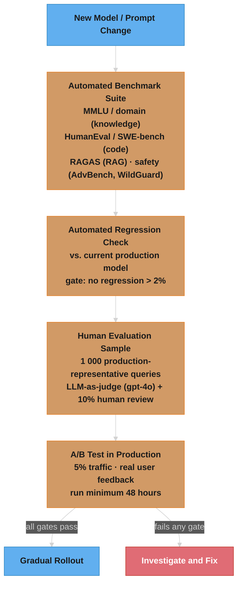

# Evaluation & Benchmarks

## 1. Concept Overview

Evaluating LLMs is one of the hardest problems in AI. Unlike classification models with clear accuracy metrics, LLMs generate open-ended text that may be helpful, harmful, correct, incorrect, or something in between. The evaluation challenge has three dimensions: (1) what to evaluate (capabilities, safety, alignment, cost); (2) how to evaluate (automated vs. human, reference-based vs. reference-free); (3) evaluation contamination (test sets leak into training data, inflating scores).

Understanding evaluation is critical for both building systems (how do you know your RAG pipeline improved?) and system design interviews (how do you measure production quality?).

---

## 2. Intuition

> **One-line analogy**: Evaluating LLMs is like grading essays — unlike math tests with clear right answers, quality is multidimensional, subjective, and context-dependent.

**Mental model**: Traditional ML has clear metrics (accuracy, F1, AUROC). LLMs generate open-ended text, so evaluation is hard: "Is this response helpful?" requires human judgment. Benchmark suites (MMLU, HumanEval) automate evaluation on specific tasks, but they get "contaminated" — if test questions appear in training data, scores inflate. LLM-as-judge (using a stronger model to score responses) scales evaluation but introduces bias. Chatbot Arena (human preferences via ELO) is the gold standard but slow and expensive.

**Why it matters**: You can't improve what you can't measure. Without rigorous evaluation, you don't know if your prompt change, fine-tuning, or RAG improvement actually helped — or just changed outputs. Production LLM systems need evaluation pipelines that run continuously to detect regressions.

**Key insight**: No single benchmark captures "intelligence" — MMLU tests knowledge, HumanEval tests code, MT-Bench tests instruction following. A model that tops one may underperform on others. Always evaluate on domain-specific tasks that match your actual use case.

---

## 3. Core Principles

- **No single benchmark captures everything**: MMLU measures knowledge; HumanEval measures coding; TruthfulQA measures honesty. No benchmark measures all.
- **Benchmark contamination is pervasive**: If a model trains on data containing benchmark answers, scores are inflated. New benchmarks become contaminated within months.
- **Human evaluation is gold but expensive**: Human judgments are the ground truth but don't scale.
- **LLM-as-judge is useful but biased**: GPT-4 can judge responses but has systematic biases (prefers longer, more confident responses; prefers its own style).
- **Task-specific evaluation beats generic**: Your production metric (SQL execution accuracy, code pass rate, customer satisfaction) matters more than MMLU.

---

## 4. Evaluation Frameworks

### 4.1 Standard Benchmarks

**MMLU (Massive Multitask Language Understanding)**:
```
57 tasks × 4 multiple choice options per question
Domains: STEM, humanities, social science, professional (law, medicine, finance)
Metric: accuracy (0-100%)
Questions: graduate-level knowledge

GPT-4:       86.4%
Claude 3.5:  88.7%
LLaMA 3 70B: 82.0%
Humans:      ~89%

Limitations: multiple choice; doesn't test reasoning or generation;
  heavily contaminated by 2024 (LLMs trained on MMLU-like data)
```

**HellaSwag (commonsense reasoning)**:
```
Pick the most likely continuation of a situation description
Tests: commonsense reasoning, everyday knowledge
Score: 95%+ for frontier models (essentially "solved")
```

**GPQA Diamond (Graduate-level Questions)**:
```
448 expert-level multiple choice questions in biology, chemistry, physics
Written by domain experts (PhDs, researchers)
Human (non-expert) accuracy: ~34%
Human (expert) accuracy: ~65%

GPT-4o: 53%
o3:     87%  (superhuman)

Designed to resist saturation: very hard even for LLMs
```

**BBH (BIG-Bench Hard)**:
```
23 challenging reasoning tasks from BIG-Bench that LLMs historically failed
Requires multi-step reasoning, spatial understanding, logical deduction
Current SOTA: ~90%+ with CoT
```

### 4.2 Code Evaluation

**HumanEval**:
```
164 Python functions; docstring → implement the function
Metric: pass@k = probability at least 1 of k samples passes all tests
pass@1 scores (single attempt):
  GPT-4o: 90%
  o1:     95%+
  LLaMA 3 70B: 80%

Limitation: mostly "solved" for frontier models; needs harder successor
```

The unbiased pass@k estimator used by the HumanEval paper is:

```
pass@k = 1 - C(n - c, k) / C(n, k)

  n = total samples generated per problem
  c = how many of those n samples passed all unit tests
  C(a, b) = "a choose b" = number of ways to pick b items from a
```

**Reading it in plain English.** "Instead of asking 'did it pass?', ask 'if I drew k of my n
attempts at random, what is the chance I would have drawn at least one working solution?'"

The formula computes the *opposite* event and subtracts it from 1: `C(n-c, k)` counts the draws
made entirely out of the failing samples, and dividing by `C(n, k)` — all possible draws — turns
that count into the probability of drawing k duds. One minus that is "at least one worked." You
generate `n` far larger than `k` (the paper uses n = 200) so the estimate is stable; estimating
pass@10 from exactly 10 samples would give you a noisy 0-or-1 answer per problem.

| Symbol | Say it | What it is |
|--------|--------|------------|
| `n` | "n" | How many completions you actually sampled per problem. Bigger n = less noisy estimate |
| `c` | "c" | How many of those n completions passed every unit test |
| `k` | "k" | How many attempts the *product* gets to show the user. This is the number you report |
| `C(n, k)` | "n choose k" | Count of distinct k-sized picks from n items, order ignored |
| `C(n-c, k)` | "n minus c choose k" | Count of k-sized picks that land entirely in the failing pile |
| `C(n-c,k)/C(n,k)` | "the ratio" | Probability all k draws fail. Subtract from 1 to get "at least one passes" |

**Walk one example.** One HumanEval problem, n = 20 samples drawn, c = 6 of them pass:

```
  pass@1  = 1 - C(14, 1) / C(20, 1)
          = 1 - 14 / 20
          = 1 - 0.700      = 0.300     <- same as c/n, as it must be

  pass@5  = 1 - C(14, 5) / C(20, 5)
          = 1 - 2 002 / 15 504
          = 1 - 0.129      = 0.871

  pass@10 = 1 - C(14, 10) / C(20, 10)
          = 1 - 1 001 / 184 756
          = 1 - 0.005      = 0.995

  same model, same problem:  30% at k=1  ->  99% at k=10
```

That 30 -> 99 jump is why the metric's `k` must match your product. A single-completion IDE
autocomplete lives at pass@1; a "generate 10 candidates, run the tests, show the survivor" agent
genuinely earns pass@10. Reporting pass@10 for a pass@1 product is the most common way code
benchmark numbers get inflated without anyone technically lying.

**Why the combinatorics exist at all.** The naive alternative — sample k times, record whether any
passed, repeat — is an unbiased estimate too, but its variance is brutal at small k, and doubling
k means doubling your inference bill. Sampling n once and re-deriving every k analytically gives
you the whole pass@1 / pass@5 / pass@10 curve from a single generation run.

**SWE-bench (Real GitHub Issues)**:
```
2294 real GitHub issues from Python repos
Evaluation: automated test suite pass rate
% resolved:
  Claude 3.5 Sonnet (tools): 49%
  o3 + scaffolding: 71.7%
  Human programmers: ~100% (over unlimited time)

Gold standard for "can the model write code that actually works?"
```

**MBPP (Mostly Basic Python Programming)**:
```
500 crowd-sourced Python problems
Simpler than HumanEval; good for smaller models
pass@1: most 7B+ models score 60-80%
```

### 4.3 Human Preference Evaluation

**LMSYS Chatbot Arena**:
```
Methodology:
  Real users submit prompts
  Two anonymous model responses displayed side by side
  User votes: A is better / B is better / Tie
  Elo rating system (like chess) ranks models

Why it's valuable:
  Real user prompts (not curated benchmarks)
  Real user preferences (not researcher's judgment)
  Difficult to contaminate (novel prompts constantly)
  Includes >100 models

2024 Elo rankings (approximate):
  o3: ~1370
  GPT-4o: ~1290
  Claude 3.5 Sonnet: ~1310
  LLaMA 3.1 405B: ~1270

Limitations: user base is self-selected (technical users); biases toward
  verbose, confident responses; not task-specific
```

The rating machinery is two formulas — an expected-score curve and an update rule:

```
Expected score:   E_A = 1 / (1 + 10^((R_B - R_A) / 400))
Rating update:    R_A' = R_A + K x (S_A - E_A)

  R_A, R_B = current ratings of model A and model B
  S_A      = actual outcome: 1 = A won, 0.5 = tie, 0 = A lost
  K        = step size ("K-factor")
```

**Reading it in plain English.** "Guess how likely each model was to win from their current
ratings, then move each rating by how much the real result surprised you."

The whole system is a surprise meter. Beating an opponent you were already expected to beat moves
you barely at all; beating one you were expected to lose to moves you a lot. That is what makes
Elo self-correcting on a leaderboard where different models are compared wildly different numbers
of times — a model with few votes drifts fast toward its true level, then settles.

| Symbol | Say it | What it is |
|--------|--------|------------|
| `R_A` | "R sub A" | Model A's current rating. Only *differences* between ratings mean anything |
| `R_B - R_A` | "the rating gap" | How far apart the two models are. 400 points = 10:1 predicted odds |
| `400` | "four hundred" | The scale constant that *defines* what one Elo point is worth. Pure convention |
| `10^(x/400)` | "ten to the x over four hundred" | Turns a rating gap into an odds ratio |
| `E_A` | "E sub A" | Predicted win probability for A, between 0 and 1. `E_A + E_B = 1` always |
| `S_A` | "S sub A" | What actually happened: 1, 0.5, or 0 |
| `S_A - E_A` | "the surprise" | Result minus prediction. Positive = did better than expected |
| `K` | "the K-factor" | How many rating points one full unit of surprise is worth. Chess uses 32 |

**Walk one match.** GPT-4o at 1290 versus Claude 3.5 Sonnet at 1310, from the table above. One
arena vote comes in and the user picks GPT-4o:

```
  gap        = R_B - R_A       = 1310 - 1290 =   20
  odds       = 10^(20 / 400)   = 10^0.05     =    1.122
  E_A        = 1 / (1 + 1.122) = 1 / 2.122   =    0.471   <- GPT-4o "should" win 47% of the time
  E_B        = 1 - 0.471                     =    0.529

  user votes GPT-4o  ->  S_A = 1, S_B = 0

  K = 32 (chess default)          K = 4 (arena-style, many votes)
    A: 32 x (1 - 0.471) = +16.9     A: 4 x (1 - 0.471) =  +2.1
    B: 32 x (0 - 0.529) = -16.9     B: 4 x (0 - 0.529) =  -2.1
    R_A' = 1290 + 16.9  = 1306.9    R_A' = 1290 + 2.1  = 1292.1
    R_B' = 1310 - 16.9  = 1293.1    R_B' = 1310 - 2.1  = 1307.9
```

Note the update is exactly zero-sum: whatever A gains, B loses. A 20-point gap is a near coin flip
(47/53), which is why the top of the arena leaderboard is genuinely unsettled — separating two
models by 20 Elo needs thousands of votes.

**Why K exists, and why the arena keeps it small.** K is the tradeoff between responsiveness and
stability. Large K (32) lets a new model find its level in a few dozen games, but one lucky streak
whipsaws the leaderboard. Small K (single digits) makes ratings stable enough to publish, at the
cost of new entrants taking thousands of votes to converge. In practice Chatbot Arena does not run
this online update at all for its published board — it refits all votes at once with maximum
likelihood under the Bradley-Terry model (the same logistic curve as `E_A`), which removes the
dependence on vote *order* that the sequential K-update introduces.

**MT-Bench (Multi-Turn Benchmark)**:
```
80 multi-turn conversations across 8 categories
  (writing, reasoning, coding, math, roleplay, STEM, humanities, extraction)
GPT-4 as judge: rates each response 1-10

Why: tests multi-turn capability (most chatbot use is multi-turn)
Score: most frontier models: 8.5-9.5/10
```

### 4.4 RAG Evaluation (RAGAS)

```python
from ragas import evaluate
from ragas.metrics import faithfulness, answer_relevancy, context_recall, context_precision

# RAGAS metrics:
# faithfulness: Is the answer supported by the retrieved context?
#   (detected via NLI or LLM-as-judge)
#   Score 0-1; 1 = fully grounded; 0 = hallucinated

# answer_relevancy: Does the answer address the actual question?
#   (LLM-as-judge or embedding similarity between question and answer)
#   Score 0-1

# context_recall: Did the retrieval find all relevant information?
#   (requires ground truth answer)

# context_precision: What fraction of retrieved context is relevant?
#   (requires ground truth relevant documents)

result = evaluate(
    dataset,
    metrics=[faithfulness, answer_relevancy, context_recall, context_precision],
    llm=gpt4_judge  # LLM used as judge
)
# Returns: {"faithfulness": 0.87, "answer_relevancy": 0.93, ...}
```

Each of those four scores is a ratio, not a black box:

```
faithfulness      = (claims in answer supported by context) / (total claims in answer)
answer_relevancy  = mean cosine( original question, question_i reverse-generated from answer )
context_precision = mean over relevant ranks r of  Precision@r
                    where Precision@r = (relevant chunks in top r) / r
context_recall    = (ground-truth sentences attributable to context) / (ground-truth sentences)
```

**Reading it in plain English.** "Faithfulness asks 'did you make anything up?', answer relevancy
asks 'did you answer the question I asked?', context precision asks 'is the good stuff near the
top?', and context recall asks 'did you fetch everything you needed?'"

The split is diagnostic, not decorative. Two of the four (precision, recall) grade the retriever
and two (faithfulness, relevancy) grade the generator, so the pair that drops tells you which half
of the pipeline to fix. Low recall with high faithfulness means the model is being honest about
bad context — fix retrieval. High recall with low faithfulness means the model is ignoring good
context and hallucinating — fix the prompt or the model.

| Symbol | Say it | What it is |
|--------|--------|------------|
| claim | "claim" | One atomic factual statement the judge splits the answer into |
| `cosine(a, b)` | "cosine similarity of a and b" | Angle between two embeddings. 1 = same direction, 0 = unrelated |
| `question_i` | "question sub i" | A question the judge *reverse-engineers* from the answer alone |
| `Precision@r` | "precision at r" | Of the top r retrieved chunks, what fraction were relevant |
| "attributable" | "attributable" | The judge can point at a context sentence that supports this ground-truth sentence |
| mean over relevant ranks | "average over the hits" | Only positions holding a relevant chunk contribute to the average |

**Walk one example.** One question, 5 chunks retrieved, relevant ones at ranks 1, 2, and 4:

```
  faithfulness       answer has 8 claims, judge finds 7 supported by context
                     = 7 / 8                                        = 0.875 -> 0.87

  answer_relevancy   3 questions reverse-generated from the answer,
                     cosine to the real question = 0.95, 0.92, 0.92
                     = (0.95 + 0.92 + 0.92) / 3                     = 0.930 -> 0.93

  context_precision  rank: 1    2    3    4    5
                     rel:  yes  yes  no   yes  no
                     P@1 = 1/1 = 1.00
                     P@2 = 2/2 = 1.00
                     P@4 = 3/4 = 0.75      (rank 3 and 5 contribute nothing)
                     = (1.00 + 1.00 + 0.75) / 3                     = 0.917

  context_recall     ground truth is 5 sentences, 4 traceable to context
                     = 4 / 5                                        = 0.800
```

The 0.87 and 0.93 are exactly the numbers the `evaluate()` call above returns — the framework is
doing this arithmetic, not something more exotic.

**Why context_precision is rank-weighted instead of a plain fraction.** A plain "3 of 5 chunks
were relevant" scores 0.60 whether the good chunks sit at ranks 1-3 or ranks 3-5. Position matters
because generators attend most strongly to the head of the context window, so burying the answer
at rank 5 degrades the final answer even though the retriever "found" it. Averaging Precision@r
over the relevant ranks pays out more for hits near the top: the same 3-of-5 at ranks 3, 4, 5
scores `(0.33 + 0.50 + 0.60)/3 = 0.48`, versus `0.917` for ranks 1, 2, 4. Drop the rank weighting
and you lose the only signal that tells you your reranker stopped working.

### 4.5 LLM-as-Judge

Use a capable LLM to evaluate another LLM's responses:

```python
def llm_judge(question: str, response: str, criteria: list) -> dict:
    prompt = f"""Evaluate the following response on these criteria.
Question: {question}
Response: {response}

Rate each criterion 1-5:
{chr(10).join(criteria)}

Return JSON: {{"criterion": score, ...}}"""

    result = gpt4.complete(prompt)
    return json.loads(result)

# Common criteria for helpfulness:
criteria = [
    "Accuracy: Is the response factually correct?",
    "Completeness: Does it fully address the question?",
    "Clarity: Is it clear and well-organized?",
    "Appropriateness: Is the tone/format appropriate?"
]

# Pairwise comparison (preferred over absolute scoring):
def pairwise_judge(question, response_a, response_b) -> str:
    prompt = f"""Which response better answers the question?
Question: {question}
Response A: {response_a}
Response B: {response_b}
Answer with A, B, or Tie. Then explain why."""
    return judge_llm.complete(prompt)
```

**LLM-as-judge biases:**
```
Position bias: prefers the first response shown (show both orders, average)
Verbosity bias: prefers longer responses (explicitly penalize verbosity in rubric)
Self-preference: GPT-4 prefers GPT-4 style responses
Instruction-following bias: prefers well-formatted responses regardless of accuracy
```

---

## 5. Architecture Diagrams

### Evaluation Pipeline



---

## 6. How It Works — Detailed Mechanics

### Benchmark Contamination

```
Problem: LLM training data (web crawl) contains benchmark answer pages
  MMLU answers are on Reddit, exam prep sites, Stack Exchange
  HumanEval problems are on LeetCode, GitHub, blogs
  → Models "memorize" answers instead of demonstrating capability

Detection methods:
  n-gram overlap: check if benchmark examples appear in training data
  Membership inference attack: can model reproduce training data exactly?
  Canary tests: insert synthetic fake examples; if model reproduces them → contaminated

Mitigation:
  Hold-out new benchmarks until training data cutoff
  Use new benchmarks regularly (GPQA, FrontierMath rotate questions)
  Open vs. closed benchmarks: closed (held-out) more trustworthy

2024 example: LLaMA 3 MMLU scores higher than expected
  Investigation: several MMLU subsets found in CommonCrawl training data
```

### Evaluation at Different Stages

```
Development:
  Fast feedback: automated unit tests on 100 representative examples
  Cost: cheap models or local models for evaluation
  Goal: catch regressions quickly

Pre-production:
  Full benchmark suite: MMLU, HumanEval, domain benchmarks
  Human eval: 500-1000 examples, 2 annotators per example
  Safety eval: adversarial test suite
  Goal: ensure quality bar before deployment

Production:
  Online metrics: user satisfaction, task completion
  LLM-as-judge: ongoing sample (1-5% of traffic)
  Error analysis: sample failures for root cause
  Goal: continuous monitoring and improvement signal
```

### Custom Evaluation for Production Systems

```python
class ProductionEvaluator:
    def __init__(self, judge_model, domain_test_set):
        self.judge = judge_model
        self.test_set = domain_test_set  # (question, ground_truth) pairs

    def evaluate_accuracy(self, model):
        """Domain-specific factual accuracy."""
        correct = 0
        for question, ground_truth in self.test_set:
            response = model(question)
            # Exact match (for factual Q&A) or LLM judge
            if self.is_correct(response, ground_truth):
                correct += 1
        return correct / len(self.test_set)

    def is_correct(self, response, ground_truth):
        # For verifiable tasks: string match or execution
        # For open-ended: LLM judge
        prompt = f"""Is the following response equivalent to the reference answer?
Reference: {ground_truth}
Response: {response}
Answer: [yes/no]"""
        return "yes" in self.judge(prompt).lower()

    def evaluate_safety(self, model, attack_suite):
        """Rate of unsafe responses on adversarial prompts."""
        failures = 0
        for attack_prompt in attack_suite:
            response = model(attack_prompt)
            if self.safety_classifier(response) == "unsafe":
                failures += 1
        return 1 - failures / len(attack_suite)  # Safety rate
```

### A/B Testing for LLM Systems

A/B testing LLMs is fundamentally harder than A/B testing click-through rates or conversion funnels because text outputs have high variance and quality is multidimensional.

```
Challenge: High variance in text outputs
  A button color A/B test: binary outcome (click or not), low variance
  An LLM A/B test: open-ended text, quality is subjective, variance is enormous
  → Statistical significance is much harder to achieve

Sample sizes:
  Click-through A/B test: ~200-500 samples per variant often sufficient
  LLM quality A/B test: 1000-5000+ comparisons per variant typically needed
  For small effect sizes (2-5% improvement): may need 10,000+ comparisons
  Power analysis must account for high output variance — standard calculators underestimate

Metrics for LLM A/B tests:
  Win rate: pairwise comparison — what % of time does variant B beat variant A?
  Elo rating: continuous rating derived from pairwise comparisons (Chatbot Arena style)
  Quality score distribution: histogram of LLM-as-judge scores per variant
  Implicit signals: regeneration rate, session length, task completion, thumbs up/down

LLM-as-judge for A/B:
  Use a judge model to compare outputs from variant A vs B on same input
  Run both orderings (A first, B first) to cancel position bias
  Aggregate win rates with confidence intervals
  Cost: ~$0.01-0.05 per comparison with GPT-4o judge

Stratification (critical for LLM A/B tests):
  Split results by query type (factual, creative, reasoning, code)
  Split by complexity (simple, medium, hard)
  Split by domain (finance, medical, general)
  Why: a model can improve 10% on creative tasks but regress 5% on factual
    — aggregate metric shows 3% improvement, masking a real regression
  Always report per-category results alongside aggregate

Duration:
  Minimum 7-14 days to capture temporal patterns
  Weekend vs weekday usage patterns differ (consumer apps)
  Business hours vs off-hours (enterprise apps)
  New model "novelty effect" — users initially engage more, then revert
  Run at least 2 full weekly cycles before making rollout decisions
```

Those sample-size numbers are not folklore — they fall out of the standard two-proportion power
formula:

```
n per variant = (z_(alpha/2) + z_beta)^2 x 2 x p(1 - p) / delta^2

with the usual alpha = 0.05 (two-sided) and 80% power:
  z_(alpha/2) = 1.96,  z_beta = 0.84,  (1.96 + 0.84)^2 = 7.84
  -> n approximately 16 x p(1 - p) / delta^2
```

**Reading it in plain English.** "The number of comparisons you need grows with how noisy each
comparison is, and explodes as the square of how small an effect you are trying to see."

The `delta^2` in the denominator is the part people get wrong in planning meetings. Halving the
effect you want to detect does not double the sample — it quadruples it. That single fact explains
why "we'll just eyeball 200 comparisons" fails for LLM A/B tests and why chasing a 2% win-rate
improvement is a fundamentally different project from chasing a 10% one.

| Symbol | Say it | What it is |
|--------|--------|------------|
| `n` | "n" | Comparisons needed *per variant*, so budget 2n judge calls total |
| `alpha` | "alpha" | False-positive rate you accept. 0.05 = "1 in 20 chance I cry wolf" |
| `z_(alpha/2)` | "z alpha over two" | 1.96 — how many standard errors out the 95% cutoff sits |
| `beta` | "beta" | False-negative rate. Power = `1 - beta`; 80% power means beta = 0.20 |
| `z_beta` | "z beta" | 0.84 — the extra margin needed to *reliably see* a real effect, not just not-deny it |
| `p` | "p" | Baseline win rate. `p(1-p)` is the variance of a coin flip, maximal at p = 0.5 |
| `delta` | "delta" | The smallest win-rate lift you care about detecting. Squared in the denominator |

**Walk one example.** Pairwise A/B, baseline win rate `p = 0.50` (a true coin flip — the
worst case, maximum variance):

```
  detect delta = 0.10   n = 16 x 0.25 / 0.01     =    400 per variant
  detect delta = 0.05   n = 16 x 0.25 / 0.0025   =  1 600 per variant
  detect delta = 0.03   n = 16 x 0.25 / 0.0009   =  4 444 per variant
  detect delta = 0.02   n = 16 x 0.25 / 0.0004   = 10 000 per variant

  halve delta (0.04 -> 0.02)  ->  4x the comparisons. Not 2x.
```

That lands squarely on the "1000-5000+ comparisons per variant" and "10,000+ for 2-5% effects"
guidance above. At $0.01-0.05 per GPT-4o judge comparison, the 2% test costs $200-1000 in judge
calls alone — before you double it for both orderings to cancel position bias.

**Why `z_beta` is in there at all.** Drop it and you get the far smaller `n = 4 p(1-p)/delta^2`,
which is the sample size at which a real effect is merely *not ruled out* — a coin flip as to
whether your test detects it. Adding `z_beta = 0.84` roughly doubles the requirement and buys you
an 80% chance of actually catching the improvement you shipped. Teams that skip it run
underpowered tests, see "no significant difference," and conclude their improvement did nothing.

```python
class LLMABTest:
    def __init__(self, judge_model, categories: list[str]):
        self.judge = judge_model
        self.categories = categories
        self.results = {cat: {"a_wins": 0, "b_wins": 0, "ties": 0}
                        for cat in categories}

    def compare(self, query: str, response_a: str, response_b: str,
                category: str):
        """Pairwise comparison with position-bias cancellation."""
        # Run both orderings
        verdict_ab = self._judge_pair(query, response_a, response_b)
        verdict_ba = self._judge_pair(query, response_b, response_a)

        # Aggregate: only count if both orderings agree
        if verdict_ab == "A" and verdict_ba == "B":
            self.results[category]["a_wins"] += 1
        elif verdict_ab == "B" and verdict_ba == "A":
            self.results[category]["b_wins"] += 1
        else:
            self.results[category]["ties"] += 1

    def report(self) -> dict:
        """Win rates per category with confidence intervals."""
        report = {}
        for cat, counts in self.results.items():
            total = counts["a_wins"] + counts["b_wins"] + counts["ties"]
            if total == 0:
                continue
            b_win_rate = counts["b_wins"] / total
            # Wilson score interval for binomial proportion
            ci = self._wilson_ci(counts["b_wins"], total, z=1.96)
            report[cat] = {
                "b_win_rate": b_win_rate,
                "ci_lower": ci[0], "ci_upper": ci[1],
                "n": total,
                "significant": ci[0] > 0.5 or ci[1] < 0.5
            }
        return report
```

The `_wilson_ci` call above hides the actual arithmetic. The Wilson score interval for a
proportion is:

```
                p_hat + z^2/(2n)              z                  p_hat(1 - p_hat)     z^2
  center =  ----------------------    hw = ---------- x  sqrt(  ------------------ + ------ )
                  1 + z^2/n                1 + z^2/n                    n             4n^2

  interval = center +/- hw          (z = 1.96 for 95% confidence)
```

**Reading it in plain English.** "Take your observed win rate, drag it a little toward 50/50
because small samples lie, and put an error bar around it that stays inside 0 and 1."

The shrink-toward-the-middle is the whole reason to prefer Wilson over the textbook
`p_hat +/- z x sqrt(p_hat(1-p_hat)/n)`. The naive interval collapses to zero width when `p_hat`
hits 0 or 1 — 20 comparisons, 20 wins, and it reports "win rate is exactly 100%, no uncertainty,"
which is exactly the situation where you are least sure of anything.

| Symbol | Say it | What it is |
|--------|--------|------------|
| `p_hat` | "p hat" | The *observed* win rate. The hat means "estimated from data", not the true value |
| `n` | "n" | Number of comparisons that produced `p_hat` |
| `z` | "z" | 1.96 for 95% confidence. Widen to 2.576 if you want 99% |
| `z^2/(2n)` | "z squared over two n" | The nudge toward 0.5. Shrinks as n grows, vanishing on large samples |
| `1 + z^2/n` | "the shrink factor" | Divides everything, pulling the whole interval inward for small n |
| `sqrt(...)` | "square root of" | Converts variance back to the units of the win rate itself |
| `hw` | "half width" | Half the error bar. Report `center +/- hw` |

**Walk one example.** Variant B won 530 of 1,000 comparisons, so `p_hat = 0.530`:

```
  z^2        = 1.96^2                              = 3.8416
  z^2/n      = 3.8416 / 1000                       = 0.00384
  z^2/(2n)   = 0.00192

  center     = (0.530 + 0.00192) / 1.00384         = 0.5299

  variance   = 0.530 x 0.470 / 1000                = 0.0002491
  z^2/(4n^2) = 3.8416 / 4 000 000                  = 0.0000010
  sqrt(sum)  = sqrt(0.0002501)                     = 0.01581
  hw         = 1.96 x 0.01581 / 1.00384            = 0.0309

  95% CI     = [0.4990, 0.5608]
```

The lower bound sits at 0.4990 — a hair *below* 0.5 — so `ci[0] > 0.5` is false and the code
correctly refuses to call it significant. A 53% win rate over a thousand comparisons is still
consistent with the two variants being identical. This is the concrete version of the sample-size
math above: to make a 3-point lift significant you needed roughly 4,444 comparisons, and you ran
1,000.

### Model Drift Detection

Model drift is a silent production killer — API providers update models, weights shift during continued training, and capabilities quietly regress on specific tasks without any alert.

```
Capability regression:
  Model updates or API changes silently degrade specific capabilities
  Example: OpenAI GPT-4 performance on coding and math tasks reportedly
    degraded between March-June 2023 — users noticed before OpenAI acknowledged
  Root cause: model updates optimize for aggregate quality but can regress
    on specific subcategories (Goodhart's Law at scale)

Detection methods:
  1. Weekly benchmark tracking:
     Run golden dataset evaluation every 7 days (or on every model version change)
     Track per-category scores, not just aggregate
     Plot trend lines — gradual 1% weekly drift adds up to 10%+ over a quarter

  2. Per-category quality metrics:
     Don't just track "overall accuracy" — break down by:
       - Task type (QA, summarization, code, reasoning)
       - Domain (medical, legal, financial, general)
       - Difficulty tier (easy, medium, hard)
     A 2% aggregate improvement can mask a 15% regression in a critical category

  3. Automated regression suite:
     Run golden dataset evaluation on every model update
     Golden set: 200-500 curated examples with verified correct answers
     Must cover all critical use cases and edge cases
     Version-control the golden set alongside application code

Alert thresholds:
  >3% drop on any single benchmark category → automated investigation trigger
  >5% drop on any category → block deployment, require human review
  >2% drop on aggregate score → flag for review within 24 hours
  Consecutive 1% weekly drops for 3+ weeks → trend alert (slow drift)

Shadow evaluation pattern (production best practice):
  ┌──────────────┐    ┌───────────────────┐
  │ Production    │    │ Shadow Pipeline    │
  │ Model v2.1   │    │ Candidate v2.2     │
  │ (serves users)│    │ (no user traffic)  │
  └──────┬───────┘    └──────┬────────────┘
         │                    │
         │    ┌───────────┐   │
         └───→│ Golden Set │←──┘
              │ Evaluator  │
              └─────┬─────┘
                    │
              ┌─────v─────┐
              │ Compare    │
              │ v2.1 vs   │
              │ v2.2       │
              └─────┬─────┘
                    │
         Pass: promote v2.2 to production
         Fail: investigate regressions before any user exposure
```

```python
class DriftDetector:
    def __init__(self, golden_set, judge_model, alert_threshold=0.03):
        self.golden_set = golden_set  # {category: [(query, expected), ...]}
        self.judge = judge_model
        self.threshold = alert_threshold
        self.history = {}  # {category: [score_t0, score_t1, ...]}

    def evaluate_and_check(self, model, model_version: str) -> dict:
        """Run golden set evaluation and check for regressions."""
        alerts = []
        for category, examples in self.golden_set.items():
            score = self._evaluate_category(model, examples)

            if category in self.history and len(self.history[category]) > 0:
                prev_score = self.history[category][-1]
                delta = score - prev_score
                if delta < -self.threshold:
                    alerts.append({
                        "category": category,
                        "current": score,
                        "previous": prev_score,
                        "delta": delta,
                        "severity": "critical" if delta < -0.05 else "warning"
                    })

            self.history.setdefault(category, []).append(score)

        return {
            "model_version": model_version,
            "scores": {cat: scores[-1] for cat, scores in self.history.items()},
            "alerts": alerts,
            "deploy_ok": len([a for a in alerts if a["severity"] == "critical"]) == 0
        }
```

### Reference-Based Text Metrics — BLEU, ROUGE, METEOR

These are the cheap metrics referenced throughout this module (ROUGE-L appears in the case study's
automated-metrics box). All three compare a generated string to a human reference, and all three
are built from n-gram overlap — they differ in what they do about length and paraphrase.

```
BLEU  = BP x exp( sum_{n=1..4} w_n x log p_n )         w_n = 1/4 for each n

  p_n = (n-grams in candidate that also appear in reference) / (n-grams in candidate)
  BP  = 1                  if c > r          <- brevity penalty
        exp(1 - r/c)       if c <= r
  c   = candidate length in tokens,  r = reference length

ROUGE-N = (overlapping n-grams) / (n-grams in the REFERENCE)      <- recall, not precision
ROUGE-L = F1 over the Longest Common Subsequence:
          P = LCS/c,  R = LCS/r,  F1 = 2PR / (P + R)

METEOR  = F_mean x (1 - penalty)
  F_mean  = 10 P R / (R + 9 P)                <- recall weighted 9x more than precision
  penalty = 0.5 x (chunks / matches)^3        <- chunks = contiguous runs of matched words
```

**Reading it in plain English.** "BLEU asks 'how much of what you wrote appears in the reference?'
(precision, so it needs a brevity penalty or you'd game it by writing three words). ROUGE flips
that and asks 'how much of the reference did you cover?' (recall, so it needs a length cap or
you'd game it by writing everything). METEOR asks the same question but punishes you for
scrambling the word order."

The precision/recall split is why BLEU became the translation metric and ROUGE the summarization
metric. A translation that omits half the sentence is broken, so you police length; a summary that
omits half the source is doing its job, so you police coverage instead.

| Symbol | Say it | What it is |
|--------|--------|------------|
| `p_n` | "p sub n" | Fraction of the candidate's n-grams found in the reference. `p_1` = single words |
| `sum_{n=1..4}` | "sum over n from one to four" | Add up the log precisions for 1-, 2-, 3-, 4-grams |
| `w_n` | "w sub n" | Weight per n-gram order. Uniform 0.25 each in standard BLEU-4 |
| `exp(sum w_n log p_n)` | "the geometric mean" | Multiplying the p_n and taking the 4th root. One zero -> whole score zero |
| `BP` | "the brevity penalty" | A multiplier <= 1 that punishes candidates shorter than the reference |
| `c`, `r` | "c and r" | Candidate length, reference length, in tokens |
| `LCS` | "longest common subsequence" | Longest word sequence appearing in both, order preserved, gaps allowed |
| `F_mean` | "F mean" | METEOR's recall-heavy harmonic mean. The 9 makes recall count 9x precision |
| chunks | "chunks" | Number of contiguous matched runs. 1 chunk = perfect order, many chunks = scrambled |

**Walk one example.** One candidate of `c = 9` tokens against a reference of `r = 12` tokens, with
7 unigram matches forming 3 contiguous chunks, and an LCS of length 7:

```
  BLEU
    p_1 = 7/9 = 0.778     p_2 = 5/8 = 0.625
    p_3 = 3/7 = 0.429     p_4 = 2/6 = 0.333
    geometric mean = (0.778 x 0.625 x 0.429 x 0.333)^(1/4)
                   = 0.0695^(0.25)                          = 0.513
    BP: c=9 <= r=12  ->  exp(1 - 12/9) = exp(-0.333)        = 0.717
    BLEU = 0.717 x 0.513                                    = 0.368  -> reported as 36.8

  ROUGE-L
    P  = 7/9  = 0.778        R = 7/12 = 0.583
    F1 = 2 x 0.778 x 0.583 / (0.778 + 0.583)
       = 0.907 / 1.361                                      = 0.667

  METEOR
    F_mean  = 10 x 0.778 x 0.583 / (0.583 + 9 x 0.778)
            = 4.537 / 7.583                                 = 0.598
    penalty = 0.5 x (3/7)^3 = 0.5 x 0.0787                  = 0.039
    METEOR  = 0.598 x (1 - 0.039)                           = 0.575

  Same output, same reference:  BLEU 0.37 | ROUGE-L 0.67 | METEOR 0.58
```

Three metrics, one output, scores spread across 30 points. Never compare a BLEU number against a
ROUGE number, and never compare BLEU across papers that used different tokenizers — `p_n` is
defined over tokens, so the tokenizer is part of the metric.

**Why the brevity penalty exists.** Delete it and BLEU is trivially gamed: emit the single most
predictable word of the reference and `p_1 = 1.0`. The 2002 BLEU paper added `BP` precisely
because precision alone rewards truncation, and unlike ROUGE there is no recall term to stop it.
Note `BP` is capped at 1 — being *longer* than the reference costs you nothing directly, it just
drags the `p_n` down naturally as the extra n-grams miss.

### Perplexity

The intrinsic metric reported for base models, before any task benchmark:

```
                       1   N
  PPL(x) = exp( -  ---  sum  log p(x_i | x_<i) )
                       N  i=1
```

**Reading it in plain English.** "On average, how many equally-likely words was the model torn
between at each step? Lower is better; 1 would mean perfect certainty."

Perplexity is the exponential of average cross-entropy loss, which is why it is essentially free —
it is your training loss, re-expressed in a unit humans can reason about. "Loss 1.10" means
nothing intuitively; "the model was choosing among about 3 options per token" does.

| Symbol | Say it | What it is |
|--------|--------|------------|
| `PPL` | "perplexity" | Effective branching factor: how many options the model was hedging across |
| `N` | "N" | Number of tokens scored |
| `sum_{i=1..N}` | "sum over all tokens" | Add up the log-probabilities the model assigned to the true tokens |
| `p(x_i \| x_<i)` | "probability of x sub i given everything before it" | The model's confidence in the token that actually came next |
| `log p(...)` | "log prob" | Always negative (probabilities < 1). Very wrong -> very large negative |
| `-(1/N) sum` | "negative mean log prob" | This *is* cross-entropy loss, in nats |
| `exp(...)` | "e to the" | Undoes the log, converting nats back into a token count |

**Walk one example.** Five tokens, with the model assigning these probabilities to the tokens that
actually appeared:

```
  token   p        log p
    1     0.50    -0.693
    2     0.25    -1.386
    3     0.40    -0.916
    4     0.10    -2.303      <- the token it did not see coming
    5     0.80    -0.223
                  -------
           sum  =  -5.521

  mean log p  = -5.521 / 5     = -1.104     <- this is the cross-entropy loss
  PPL         = exp(1.104)     =  3.02      <- "about 3 plausible next tokens"
```

**Why perplexity alone is not enough.** It is defined over *your* tokenizer and *your* held-out
corpus, so PPL 3.02 is not comparable across models with different vocabularies, and a model can
lower perplexity by getting better at predicting boilerplate it will never be asked to generate.
It is the right metric for "is pre-training converging?" and the wrong one for "is this assistant
useful?" — which is what the entire rest of this module exists to answer.

### Inter-Annotator Agreement — Cohen's and Fleiss' Kappa

The case study's "judge-human agreement 0.78" row and every "our annotators agreed 78% of the
time" claim need chance-correction before they mean anything:

```
  kappa = (p_o - p_e) / (1 - p_e)

  p_o = observed agreement  = (times the two raters gave the same label) / (total items)
  p_e = expected agreement by chance
      = sum over categories c of  P(rater A picks c) x P(rater B picks c)

  Fleiss' kappa: same formula, generalized to more than 2 raters --
    p_e uses the overall proportion of each category across ALL raters.
```

**Reading it in plain English.** "Of the agreement that was actually available to be earned, what
fraction did the raters earn? Two people who both label everything 'pass' agree 100% of the time
and have learned nothing."

The `(1 - p_e)` denominator is the entire idea: it is the headroom above coin-flipping. Raw
agreement is inflated by whatever the base rate happens to be, and eval sets are almost always
imbalanced — most responses are fine — so raw agreement on a 90%-pass set starts near 0.90 before
either annotator thinks at all.

| Symbol | Say it | What it is |
|--------|--------|------------|
| `kappa` | "kappa" | Chance-corrected agreement. 1 = perfect, 0 = no better than chance, < 0 = worse |
| `p_o` | "p observed" | The raw agreement rate. The number people quote and shouldn't |
| `p_e` | "p expected" | Agreement you'd get if both raters guessed independently at their own base rates |
| `p_o - p_e` | "agreement actually earned" | How far past chance the raters got |
| `1 - p_e` | "agreement available to earn" | The headroom. Small when the labels are lopsided |
| `sum over categories` | "sum over the labels" | Multiply each label's two marginal rates, then add across labels |

**Walk one example.** 100 responses double-labeled pass/fail. The two raters gave the same verdict
on 78 of them. Rater A said "pass" 70 times, rater B said "pass" 74 times:

```
  p_o = 78 / 100                                              = 0.780

  chance agreement on "pass"   = 0.70 x 0.74                  = 0.518
  chance agreement on "fail"   = 0.30 x 0.26                  = 0.078
  p_e                                                         = 0.596

  kappa = (0.780 - 0.596) / (1 - 0.596)
        = 0.184 / 0.404                                       = 0.455

  headline "78% agreement"  ->  kappa 0.46, only MODERATE
```

Conventional reading: `< 0.20` slight, `0.21-0.40` fair, `0.41-0.60` moderate, `0.61-0.80`
substantial, `> 0.80` almost perfect. A judge-vs-human `kappa` of 0.46 is not a validated judge,
even though 78% sounds like one.

**Why chance correction is load-bearing here specifically.** Push both raters' pass rate to 90%
and chance agreement becomes `p_e = 0.90 x 0.90 + 0.10 x 0.10 = 0.82`. Two raters agreeing 82% of
the time then score `kappa = (0.82 - 0.82) / 0.18 = 0.00` — they agreed exactly as often as two
people flipping the same biased coin, despite an 82% headline. Report raw agreement on a
lopsided eval set and you will conclude your rubric is reliable when your annotators are in fact
providing no information at all. Use Cohen's kappa for exactly two raters, Fleiss' when three or
more raters each label the same items, and Krippendorff's alpha when raters skip items or the
labels are ordinal (1-5 rubric scores) rather than categorical.

---

## 7. Real-World Examples

### OpenAI Evals
- Open-source evaluation framework for GPT models
- Community-contributed evals: 1000+ task-specific evaluations
- Used internally at OpenAI to track regressions
- Structured format: jsonl files with input/ideal output

### HELM (Holistic Evaluation of Language Models)
- Stanford CRFM initiative
- 42 scenarios × multiple models
- Standardized evaluation across models
- Public leaderboard

### LiveBench (2024)
- New benchmark questions added monthly (from recent news, competition problems)
- Minimizes contamination by design (questions are too new to be in training data)
- Covers: reasoning, math, coding, language comprehension

---

## 8. Tradeoffs

| Evaluation Method | Accuracy | Scalability | Cost | Bias |
|------------------|---------|-------------|------|------|
| Human evaluation | Highest | Low | High | Human rater bias |
| LLM-as-judge | Good | High | Medium | Self-preference, verbosity |
| Automated benchmarks | Limited | Very High | Very Low | Contamination risk |
| A/B user testing | Real-world | Medium | Infra | Selection bias |
| Task-specific metrics | Domain-specific | High | Low | Narrow scope |

---

## 9. When to Use / When NOT to Use

### Use MMLU / Standard Benchmarks When:
- Comparing models for initial selection
- Need a standard for stakeholder communication
- Tracking broad capability over time

### Use LLM-as-Judge When:
- Open-ended tasks (no ground truth)
- Scaling to thousands of examples
- Comparing relative quality between two approaches

### Use Human Evaluation When:
- High-stakes deployment decision
- New capability where automated eval isn't calibrated yet
- Validating LLM-as-judge reliability

---

## 10. Common Pitfalls

1. **Benchmark shopping**: Reporting only the benchmarks where your model looks good. Best practice: report a standardized suite and disclose any that are unfavorable.
2. **Ignoring benchmark contamination**: Not checking if test set examples are in training data.
3. **Using the same judge model as the model being evaluated**: GPT-4 judging GPT-4 responses is biased.
4. **Single-metric optimization**: Optimizing MMLU causes capability regression on other tasks (Goodhart's Law).
5. **Not testing on your domain**: A model scoring 86% on MMLU might score 60% on your medical QA domain.
6. **Ignoring latency in evaluation**: A model that scores 5% better but runs 3× slower may be worse for production.
7. **Treating LLM evaluation as deterministic**: Same prompt with temperature=0 can still vary across runs due to floating-point non-determinism, GPU batching differences, and provider-side model updates. A team at a fintech company saw their "deterministic" evaluation suite produce scores ranging from 82% to 87% on the same model across consecutive runs — they were making launch decisions on noise. Mitigation: run each evaluation 3-5 times, report mean and 95% confidence intervals, and only flag changes that exceed the confidence interval.
8. **Trusting single-run LLM-as-judge scores**: Judge models disagree with themselves 10-20% of the time on borderline cases. One production team discovered their "improved" prompt was indistinguishable from the baseline when they ran the judge evaluation three times — the initial "improvement" was within judge variance. Mitigation: use majority voting with 3+ independent judge evaluations per sample, and report the agreement rate alongside quality scores. If inter-judge agreement drops below 70%, the evaluation rubric needs refinement, not more samples.
9. **Ignoring evaluation prompt sensitivity**: Changing the wording of an LLM-as-judge evaluation prompt can shift aggregate scores by 5-15%. A team changed "Rate the helpfulness of this response" to "How helpful is this response?" and saw average scores jump from 3.8/5 to 4.2/5 — same model, same test set, same judge. Best practice: version-lock evaluation prompts, judge models, and all parameters (temperature, max_tokens, system prompt). Treat evaluation infrastructure as production code with the same rigor around versioning, testing, and change management.

---

## 11. Technologies & Tools

| Tool | Purpose | Notes |
|------|---------|-------|
| **RAGAS** | RAG evaluation | Faithfulness, relevance, recall |
| **LangSmith** | Evaluation + tracing | Annotation workflow, online eval |
| **TruLens** | LLM evaluation | RAG triad: context relevance, groundedness |
| **DeepEval** | LLM test framework | pytest-like; many metrics |
| **OpenAI Evals** | Open-source eval framework | 1000+ community evals |
| **Eleuther Harness** | Language model eval | Standard open-source benchmarks |
| **HELM** | Holistic evaluation | Stanford; multi-scenario |
| **Chatbot Arena** | Human preference | Real users, Elo ratings |
| **LiteLLM** | Multi-provider eval | Run same eval across multiple models |
| **Weights & Biases** | Experiment tracking | Track eval metrics over time |

---

## 12. Interview Questions with Answers

**Q: What is LLM-as-judge and what are its limitations?**
A: LLM-as-judge uses a capable model (usually GPT-4) to evaluate another model's responses — rating quality, comparing two responses, or checking correctness. Limitations: (1) self-preference bias — GPT-4 rates GPT-4 style responses higher; (2) verbosity bias — longer responses rated higher regardless of quality; (3) position bias — first response shown often preferred; (4) instruction-following bias — well-formatted responses preferred; (5) can't catch factual errors the judge model also makes. Mitigations: use diverse judges, randomize position, include explicit rubrics, validate against human judgments.

**Q: Why is benchmark contamination a problem and how do you detect it?**
A: Contamination occurs when benchmark test examples appear in training data, so the model "memorizes" answers rather than demonstrating the underlying capability. It inflates scores and makes models look better than they are. Detection: (1) n-gram overlap analysis between training data and benchmarks; (2) membership inference — does the model reproduce benchmark examples verbatim?; (3) performance anomalies — unusually high scores on specific subsets. Solution: use held-out benchmarks released after the model's training cutoff, or continuously refreshed benchmarks (LiveBench, competitive math).

**Q: Why can the same evaluation suite at temperature=0 produce different scores across runs?**
A: Because temperature=0 does not make LLM inference deterministic — floating-point non-associativity, GPU batching differences, and silent provider-side model updates all shift outputs between runs. A fintech team saw its "deterministic" evaluation suite swing between 82% and 87% on the same unchanged model across consecutive runs, effectively making launch decisions on noise; LLM judges compound this by disagreeing with themselves 10-20% of the time on borderline cases. Run each evaluation 3-5 times, report the mean with a 95% confidence interval, and only act on changes that exceed that interval.

**Q: Why can an aggregate A/B test metric hide a real regression?**
A: Because LLM quality changes are rarely uniform across query types — a model can improve 10% on creative tasks while regressing 5% on factual tasks, and the blended metric reports a ~3% "improvement" that masks the regression. This is why stratification is mandatory for LLM A/B tests: split results by task type (factual, creative, reasoning, code), difficulty tier, and domain, since a 2% aggregate gain can coexist with a 15% drop in a critical category. Always report per-category win rates alongside the aggregate, and block rollout on any critical-category regression even when the aggregate improves.

**Q: What is RAGAS and what does it measure?**
A: RAGAS is an evaluation framework for RAG systems. It measures four dimensions: (1) Faithfulness — is the generated answer supported by the retrieved context (no hallucination)?; (2) Answer Relevancy — does the answer address the question asked?; (3) Context Recall — did the retrieval system find all relevant documents?; (4) Context Precision — what fraction of retrieved documents are actually relevant? Together, these diagnose whether failures come from retrieval (bad recall/precision) or generation (low faithfulness/relevancy).

**Q: How would you build a custom evaluation system for a production LLM application?**
A: (1) Define task-specific metrics aligned with business goals (e.g., SQL execution accuracy, customer resolution rate, factual accuracy on domain Q&A); (2) Build a golden test set: 200-500 examples with human-verified correct answers; (3) Automated evaluation: run on every model/prompt change; fail if regression > threshold; (4) LLM-as-judge for open-ended aspects: helpfulness, clarity; validate judge against human labels; (5) Online evaluation: sample 1-5% of production traffic, use user feedback (implicit: session continuation, explicit: ratings); (6) Weekly human review sample: manually inspect 50-100 cases for systematic issues automated metrics miss.

**Q: How reliable is LLM-as-judge evaluation and what are its biases?**
LLM-as-judge achieves 80-85% agreement with human evaluators on pairwise preference tasks, comparable to inter-human agreement. Known biases: (1) position bias — GPT-4 prefers the first response in a comparison 60% of the time (mitigate by evaluating both orders and averaging); (2) verbosity bias — judges prefer longer, more detailed responses even when shorter ones are more accurate; (3) self-preference — models rate their own outputs higher than competitors' outputs (don't use GPT-4 to judge GPT-4 vs Claude); (4) sycophancy — judges agree with confident-sounding responses regardless of accuracy. Mitigation: (1) use reference-based judging (provide the correct answer for comparison); (2) use structured rubrics with explicit criteria and scoring scales; (3) average across multiple judge models; (4) calibrate with a human-evaluated validation set. For production: LLM-as-judge is practical for automated quality monitoring at scale, but high-stakes evaluations (model selection, launch decisions) should include human evaluation on a representative sample.

**Q: How does benchmark contamination occur and how do you detect it?**
Benchmark contamination happens when test set data appears in the model's training corpus, inflating benchmark scores beyond true capability. Sources: (1) web crawl — popular benchmarks (MMLU, HumanEval) appear on blogs, forums, and GitHub discussions; (2) synthetic data — models trained on GPT-4 outputs may inherit GPT-4's memorized benchmark answers; (3) data pipeline leaks — evaluation datasets accidentally included in training splits. Detection: (1) n-gram overlap analysis — check for exact or near-exact matches between training data and benchmark questions; (2) canary strings — embed unique identifiers in evaluation data and check if models reproduce them; (3) performance gap analysis — if a model scores 90% on public benchmarks but only 70% on held-out private tests of similar difficulty, suspect contamination; (4) memorization probing — test if the model can complete benchmark questions from partial prompts. Frontier labs (OpenAI, Anthropic, Google) now maintain private evaluation suites specifically to avoid contamination. For your own evaluations: always create domain-specific test sets from data generated after your model's training cutoff.

**Q: How do you interpret RAGAS metrics for RAG evaluation?**
RAGAS (Retrieval-Augmented Generation Assessment) provides four automated metrics: (1) Faithfulness — what fraction of claims in the generated answer are supported by the retrieved context (target: >0.85); (2) Answer Relevancy — how relevant the answer is to the question, measured by generating questions from the answer and checking similarity to the original question (target: >0.80); (3) Context Precision — are the relevant chunks ranked higher in the retrieved set (target: >0.75); (4) Context Recall — what fraction of the ground-truth answer can be attributed to the retrieved context (target: >0.80). Interpretation: low faithfulness + high context recall = the LLM is ignoring retrieved context and hallucinating; low context recall + high faithfulness = retrieval is the bottleneck (model is faithful to what it gets, but it's not getting the right information); low answer relevancy = the model is generating off-topic responses. RAGAS uses an LLM (GPT-4 recommended) to compute these metrics, so scores are approximate. Calibrate RAGAS scores against human judgments on 50-100 examples before trusting them for automated monitoring.

**Q: How does the Chatbot Arena / ELO methodology work and why is it considered the gold standard?**
Chatbot Arena uses blind pairwise comparisons where users submit a prompt to two anonymous models simultaneously, then vote for the better response. ELO ratings are computed from these votes using the Bradley-Terry model — each vote updates both models' ratings based on the expected vs actual outcome (upset victories cause larger rating changes). Why it's the gold standard: (1) it uses real user prompts (not synthetic benchmarks), reflecting actual use cases; (2) blind evaluation eliminates brand bias; (3) the ELO system naturally handles the fact that different models are compared different numbers of times; (4) diverse evaluators (thousands of users) average out individual biases. Limitations: (1) English-centric — most users submit English prompts; (2) conversational bias — favors chatty, helpful responses over concise expert answers; (3) recency bias — users may favor newer models; (4) sample size — rare model pairs may have insufficient comparisons for reliable ratings. As of 2025, Chatbot Arena has collected 1M+ votes, making it the largest human evaluation of LLMs.

**Q: How do you design an evaluation suite for a production LLM application?**
A production evaluation suite needs three tiers: (1) unit tests — deterministic checks for format (valid JSON, required fields present), safety (no PII leakage, no harmful content), and basic accuracy (known fact lookups with exact match); (2) automated quality scoring — LLM-as-judge evaluation on 100-500 representative queries covering all use case categories, run on every model update or weekly; (3) human evaluation — expert review of 50-100 cases quarterly, focusing on edge cases and failure modes. Structure: define 5-10 evaluation categories matching your product's use cases (e.g., for a customer support bot: greeting, FAQ, troubleshooting, escalation, refund requests). For each category, maintain 20-50 test cases with expected behavior descriptions. Track metrics per category over time to detect category-specific regressions. Automation: integrate tier-1 tests into CI/CD pipeline; run tier-2 evaluations on model updates and weekly in production; schedule tier-3 reviews quarterly. Alert on: >5% regression in any category, new failure modes not seen in previous evaluations.

**Q: What is the difference between held-out evaluation and online evaluation for LLMs?**
Held-out evaluation tests the model on a fixed dataset before deployment, while online evaluation measures quality in production with real user traffic. Held-out evaluation is controlled and reproducible but may not reflect real usage patterns — users ask questions that evaluation designers never anticipated. Online evaluation captures real-world performance but is noisier and harder to control. Online evaluation methods: (1) implicit signals — regeneration rate (user clicks "try again"), conversation abandonment, task completion rate; (2) explicit feedback — thumbs up/down buttons, star ratings; (3) A/B testing — serve different models to different users and compare metrics. Key challenge: online metrics can be misleading — users may give thumbs-up to incorrect but confident-sounding answers. Best practice: use held-out evaluation for model selection and gate-keeping (don't deploy a model that regresses on held-out tests), and use online evaluation for continuous monitoring and detecting issues that held-out tests miss. The two complement each other.

**Q: What is pass@k and why do code benchmarks use it instead of plain accuracy?**
Pass@k is the probability that at least one of k sampled completions passes all unit tests — the natural metric when generation is stochastic and correctness is machine-verifiable by execution. HumanEval reports pass@1 around 90% for GPT-4o and 95%+ for o1, but pass@1 and pass@10 can differ by 10+ points for the same model because sampling multiple candidates raises the chance that one passes. Report pass@1 for product decisions (users typically see a single completion), and use higher k only when your product actually samples and filters multiple candidates.

**Q: How do you detect silent capability drift in an API-hosted model you don't control?**
Run a version-controlled golden dataset (200-500 curated examples) against the API on a fixed schedule — weekly, plus on any announced model change — and track per-category scores, not just the aggregate. Providers update hosted models without notice; GPT-4's reported coding/math regression between March and June 2023 was noticed by users before it was acknowledged, and a gradual 1%-per-week drift compounds to 10%+ over a quarter if only point-in-time scores are eyeballed. Alert on a >3% drop in any single category, block dependent releases at >5%, and treat three consecutive weekly ~1% declines as a slow-drift trend alert.

**Q: How many comparisons does a statistically significant LLM A/B test need?**
Typically 1,000-5,000+ pairwise comparisons per variant — an order of magnitude more than the 200-500 samples that suffice for a click-through test — because open-ended text output has enormous variance. Detecting small effects (2-5% improvements) can require 10,000+ comparisons; judge each pair in both orderings to cancel position bias (roughly $0.01-0.05 per comparison with a GPT-4o judge) and run at least two full weekly cycles so weekday/weekend patterns and the new-model novelty effect wash out. Do a power analysis that accounts for output variance up front — standard calculators tuned to binary conversion metrics will badly underestimate the required sample size.

**Q: Why has SWE-bench largely displaced HumanEval as the primary code-capability benchmark?**
Because HumanEval is effectively saturated: frontier models score 90%+ pass@1 on its 164 self-contained docstring-to-function problems, leaving little headroom to distinguish models. SWE-bench's 2,294 real GitHub issues require repo-level context, cross-file edits, and passing the project's actual test suite — Claude 3.5 Sonnet with tools resolves ~49% and o3 with scaffolding 71.7%, so the benchmark still discriminates between systems. Keep HumanEval-style tasks as a cheap smoke test, and use SWE-bench-style repo-level evaluation for anything marketed as a coding agent.

---

## 13. Best Practices

1. **Evaluate on task-specific data, not just general benchmarks** — your production metric is the truth.
2. **Use multiple evaluation methods** — combine automated + human + LLM-as-judge for complete picture.
3. **Track regressions, not just absolute performance** — the important question is "is it better/worse than before?"
4. **Validate LLM-as-judge against human labels** — measure judge accuracy on your domain before trusting it.
5. **Separate retrieval from generation evaluation in RAG** — diagnose where failures occur.
6. **Build evaluation before you build the product** — define what "good" means before you start.

---


## 14. Case Study

**Scenario:** A developer tools company ships an LLM-powered code review product. The model suggests code improvements for Python, JavaScript, Go, and Rust. They need an eval pipeline that catches regressions before release, measures quality improvement over model versions, costs < $500/eval run, and produces results in < 2 hours. Initial eval: MMLU (irrelevant) gave 78.3% — looked good, but production users reported poor JavaScript suggestions. They need task-specific evaluation.

**Architecture:**

```
  Code Review Eval Pipeline
  ┌────────────────────────────────────────────────────────────────┐
  │  Golden Dataset (human-authored, never shown to model)         │
  │  - 500 code snippets per language (Python, JS, Go, Rust)      │
  │  - Each snippet has 3-5 expert-written review comments         │
  │  - Snippet categories: security bugs, style, performance,      │
  │    correctness, maintainability                                │
  │  - Adversarial set: 100 already-good snippets (expect no issues│
  │    raised, or only minor style suggestions)                    │
  └──────────────────────────────┬─────────────────────────────────┘
                                 │
                                 v
  ┌────────────────────────────────────────────────────────────────┐
  │  Eval Runner (async, 50 concurrent requests)                   │
  │  Input per example:                                            │
  │    - Code snippet + language + context (file name, git diff)  │
  │    - Reference expert reviews (gold standard)                  │
  │  Model output: list of review comments with severity           │
  └──────────────────────────────┬─────────────────────────────────┘
                                 │
                    ┌────────────┼──────────────────┐
                    │            │                  │
                    v            v                  v
  ┌──────────────┐ ┌──────────────────┐ ┌──────────────────────────┐
  │  Automated   │ │  LLM-as-Judge    │ │  Human Spot-Check         │
  │  Metrics     │ │  (Claude Opus)   │ │  (20 examples/run)        │
  │  - ExactMatch│ │  - Review quality│ │  - 2 senior engineers     │
  │  - ROUGE-L   │ │  - Severity acc  │ │  - Rate 1-5 per example  │
  │  - Issue type│ │  - False positive│ │  - Calibrates LLM judge  │
  │    F1 score  │ │    rate          │ │    bias                   │
  └──────────────┘ └──────────────────┘ └──────────────────────────┘
                                 │
                                 v
  ┌────────────────────────────────────────────────────────────────┐
  │  Regression Detection                                          │
  │  - Compare to previous model version scores                    │
  │  - Alert if any metric drops > 3% (block release)             │
  │  - Track per-language, per-issue-type breakdown               │
  │  - Trend dashboard: Grafana + PostgreSQL eval history          │
  └────────────────────────────────────────────────────────────────┘

Cost Breakdown (per eval run, 2000 examples):
  Model under test (claude-sonnet-4-6):
    2000 × 1500 tokens input = 3M tokens = $9
  LLM Judge (claude-opus-4):
    2000 × 2000 tokens = 4M tokens = $60
  Human spot-check: 20 × $15/hour × 0.25 hr = $75
  Total per run: $144 (well under $500 budget)
  Runtime: 2000 examples / 50 concurrent / 3s avg = 2 min model
           + 5 min judge + 2 min analysis = 9 min total
```

**Key implementation — 3 Python code blocks:**

Block 1 — LLM-as-judge evaluation framework:

```python
from __future__ import annotations
import asyncio
import json
from dataclasses import dataclass, field
from typing import Any
import anthropic


@dataclass
class CodeReviewExample:
    example_id: str
    language: str
    code_snippet: str
    gold_reviews: list[dict[str, str]]   # [{type, severity, description}]
    is_adversarial: bool = False          # True = no issues expected


@dataclass
class ModelOutput:
    example_id: str
    reviews: list[dict[str, str]]        # model's review comments
    raw_response: str


@dataclass
class JudgeScore:
    example_id: str
    relevance: float         # 0-1: are reviews relevant to actual code?
    accuracy: float          # 0-1: are identified issues real issues?
    completeness: float      # 0-1: did model catch all gold issues?
    false_positive_rate: float  # 0-1: how often does model raise non-issues?
    severity_accuracy: float    # 0-1: severity labels correct?
    overall: float           # weighted average
    judge_reasoning: str


async def judge_code_review(
    client: anthropic.AsyncAnthropic,
    example: CodeReviewExample,
    model_output: ModelOutput,
) -> JudgeScore:
    """
    Use Claude Opus as LLM judge to evaluate code review quality.
    Judge sees: code, gold reviews, model reviews.
    Rates: relevance, accuracy, completeness, false_positives, severity.
    """
    gold_block = "\n".join(
        f"- [{r['severity'].upper()}] {r['type']}: {r['description']}"
        for r in example.gold_reviews
    )
    model_block = "\n".join(
        f"- [{r.get('severity', 'INFO').upper()}] {r.get('type', 'general')}: {r.get('description', '')}"
        for r in model_output.reviews
    ) if model_output.reviews else "(no issues found)"

    adversarial_note = ""
    if example.is_adversarial:
        adversarial_note = "\nNOTE: This is a GOOD code snippet with no real issues. False positive rate is the primary metric."

    prompt = f"""You are evaluating an AI code reviewer. Rate its performance on this {example.language} code snippet.{adversarial_note}

Code:
```{example.language}
{example.code_snippet[:2000]}
```

Expert reviews (gold standard):
{gold_block if not example.is_adversarial else "(none — this code is already correct)"}

AI reviewer output:
{model_block}

Rate the AI reviewer on these dimensions (0.0 to 1.0):
1. relevance: Are the AI's review comments relevant to actual code issues?
2. accuracy: Are the identified issues real problems (not hallucinated)?
3. completeness: Did the AI catch all the issues in the gold standard?
4. false_positive_rate: What fraction of AI's comments are non-issues? (0.0 = no false positives, 1.0 = all false positives)
5. severity_accuracy: Are the severity labels (critical/major/minor) correct?

Return JSON: {{"relevance": 0.0, "accuracy": 0.0, "completeness": 0.0, "false_positive_rate": 0.0, "severity_accuracy": 0.0, "reasoning": "..."}}"""

    response = await client.messages.create(
        model="claude-opus-4-5",    # Use strongest model as judge for calibration
        max_tokens=500,
        messages=[{"role": "user", "content": prompt}],
    )
    try:
        data = json.loads(response.content[0].text)
        relevance = float(data.get("relevance", 0))
        accuracy = float(data.get("accuracy", 0))
        completeness = float(data.get("completeness", 0))
        fp_rate = float(data.get("false_positive_rate", 0))
        sev_acc = float(data.get("severity_accuracy", 0))
        overall = (
            0.25 * relevance
            + 0.30 * accuracy
            + 0.25 * completeness
            + 0.10 * (1 - fp_rate)   # lower FP rate is better
            + 0.10 * sev_acc
        )
        return JudgeScore(
            example_id=example.example_id,
            relevance=relevance,
            accuracy=accuracy,
            completeness=completeness,
            false_positive_rate=fp_rate,
            severity_accuracy=sev_acc,
            overall=overall,
            judge_reasoning=data.get("reasoning", ""),
        )
    except (json.JSONDecodeError, KeyError):
        return JudgeScore(
            example_id=example.example_id,
            relevance=0.5, accuracy=0.5, completeness=0.5,
            false_positive_rate=0.5, severity_accuracy=0.5, overall=0.5,
            judge_reasoning="parse_error",
        )
```

Block 2 — Regression detection and eval CI integration (production concern):

```python
from __future__ import annotations
import asyncio
from dataclasses import dataclass, field
from datetime import datetime
from pathlib import Path
import json
import statistics


@dataclass
class EvalRunResult:
    run_id: str
    model_version: str
    timestamp: str
    scores_by_language: dict[str, dict[str, float]]   # lang -> {metric: score}
    scores_by_issue_type: dict[str, dict[str, float]] # type -> {metric: score}
    aggregate: dict[str, float]    # overall metrics
    regression_detected: bool
    blocking_regressions: list[str]


@dataclass
class RegressionDetector:
    """
    Compare current eval run against baseline (previous release).
    Block release if any metric drops > 3% on overall or > 5% per language.
    """

    threshold_overall: float = 0.03     # 3% overall regression → block
    threshold_per_language: float = 0.05  # 5% per-language regression → block
    history_file: Path = Path("eval_history.jsonl")

    def load_baseline(self, model_version: str) -> dict[str, float] | None:
        """Load the most recent successful release scores for this model family."""
        if not self.history_file.exists():
            return None
        records = []
        for line in self.history_file.read_text().splitlines():
            try:
                r = json.loads(line)
                if r.get("model_version", "").startswith(model_version.split(".")[0]):
                    records.append(r)
            except json.JSONDecodeError:
                pass
        if not records:
            return None
        # Return the most recent passing run
        passing = [r for r in records if not r.get("regression_detected", True)]
        return passing[-1]["aggregate"] if passing else None

    def detect_regressions(
        self,
        current: EvalRunResult,
        baseline: dict[str, float] | None,
    ) -> list[str]:
        if baseline is None:
            return []   # no baseline = first run, no regression possible

        regressions = []
        # Check overall metrics
        for metric, current_score in current.aggregate.items():
            baseline_score = baseline.get(metric)
            if baseline_score is None:
                continue
            drop = baseline_score - current_score
            if drop > self.threshold_overall:
                regressions.append(
                    f"OVERALL {metric}: {baseline_score:.3f} → {current_score:.3f} "
                    f"(drop: {drop:.1%}, threshold: {self.threshold_overall:.1%})"
                )

        # Check per-language breakdown
        for lang, lang_scores in current.scores_by_language.items():
            for metric, current_score in lang_scores.items():
                baseline_lang = baseline.get(f"{lang}_{metric}")
                if baseline_lang is None:
                    continue
                drop = baseline_lang - current_score
                if drop > self.threshold_per_language:
                    regressions.append(
                        f"LANGUAGE {lang} {metric}: {baseline_lang:.3f} → {current_score:.3f}"
                    )

        return regressions

    def save_run(self, result: EvalRunResult) -> None:
        record = {
            "run_id": result.run_id,
            "model_version": result.model_version,
            "timestamp": result.timestamp,
            "aggregate": result.aggregate,
            "scores_by_language": result.scores_by_language,
            "regression_detected": result.regression_detected,
        }
        with self.history_file.open("a") as f:
            f.write(json.dumps(record) + "\n")
```

Block 3 — BROKEN -> FIX: benchmark contamination and judge bias:

```python
from __future__ import annotations


# BROKEN: Use MMLU as the primary quality benchmark for a code review product.
# MMLU tests general knowledge (history, science, law) — completely irrelevant
# to code review quality. Model can score 78% MMLU and generate poor JS reviews.
# "We improved MMLU from 78.3% to 79.1%" — meaningless for the product.
def broken_eval_with_mmlu() -> dict[str, float]:
    return {"mmlu_score": 0.783}   # irrelevant to product quality


# FIX: Task-specific benchmark. For code review:
# - Issue detection F1 (precision × recall on real code bugs)
# - Language-specific scores (Python/JS/Go/Rust separately)
# - Adversarial pass rate (no false positives on clean code)
# - Severity classification accuracy (critical vs minor)
def fixed_task_specific_eval() -> dict[str, float]:
    return {
        "python_issue_f1": 0.0,
        "javascript_issue_f1": 0.0,
        "go_issue_f1": 0.0,
        "rust_issue_f1": 0.0,
        "overall_false_positive_rate": 0.0,
        "severity_accuracy": 0.0,
        "adversarial_pass_rate": 0.0,  # clean code correctly identified as clean
    }


# BROKEN: LLM judge uses same model family as the model under test.
# Evaluating Claude claude-sonnet-4-6 with a Claude judge → sycophancy bias.
# Claude judge rates Claude claude-sonnet-4-6 outputs 8% higher than GPT-4 judges
# on identical outputs — familial bias inflates scores.
async def broken_judge_with_same_family(model_output: str, gold: str) -> float:
    import anthropic
    client = anthropic.AsyncAnthropic()
    # Judge is claude-sonnet-4-6, same family as the model under test
    response = await client.messages.create(
        model="claude-sonnet-4-6",  # SAME family as tested model — biased
        max_tokens=100,
        messages=[{"role": "user", "content": f"Rate this: {model_output}. Gold: {gold}"}],
    )
    return 0.8   # inflated due to familial bias


# FIX: Use a different model family as judge (GPT-4 judging Claude, or vice versa).
# Alternatively: calibrate judge scores against human ratings on 500-example sample.
# If judge scores consistently diverge from human scores by > 5%, apply calibration.
async def fixed_cross_family_judge(model_output: str, gold: str) -> float:
    import openai
    client = openai.AsyncOpenAI()
    response = await client.chat.completions.create(
        model="gpt-4o",   # Different family from the Claude model under test
        max_tokens=100,
        messages=[{"role": "user", "content": f"Rate this code review: {model_output}. Gold: {gold}. Return 0.0-1.0."}],
    )
    return float(response.choices[0].message.content.strip())


# BROKEN: Golden dataset used for both development and evaluation.
# Team iterates model prompt on the "eval" set → data contamination.
# Model implicitly overfits to eval patterns. Scores inflate; production quality doesn't improve.
def broken_single_dataset() -> dict[str, list]:
    full_dataset = _load_all_examples()
    # Same dataset for dev AND eval — contamination
    return {"dev": full_dataset, "eval": full_dataset}


# FIX: Strict train/dev/eval splits. Eval set is LOCKED — never shown to developers
# during model iteration. Dev set used for iteration; eval set used for release decisions only.
def fixed_split_dataset(full_dataset: list) -> dict[str, list]:
    import random
    random.seed(42)   # reproducible split
    random.shuffle(full_dataset)
    n = len(full_dataset)
    return {
        "dev": full_dataset[:int(n * 0.7)],    # 70% for development
        "val": full_dataset[int(n * 0.7):int(n * 0.9)],   # 20% for tuning
        "eval": full_dataset[int(n * 0.9):],   # 10% LOCKED — release gate only
    }


def _load_all_examples() -> list:
    return []   # placeholder
```

**Pitfall 1 — Golden dataset drift over time:**

```python
# BROKEN: Use same 2000-example golden set for 18 months.
# Over time: (1) coding best practices evolve (ESLint rules change),
# (2) new language features added (Python 3.12 walrus operator in more patterns),
# (3) model's training distribution shifts with new data.
# Eval scores stay stable but production quality drifts — the benchmark is stale.

# FIX: Quarterly golden dataset refresh.
# Add 200 new examples per quarter covering new patterns, frameworks, language versions.
# Retire 200 oldest examples that no longer reflect current codebase patterns.
# Re-baseline all historical model scores on the new dataset before comparing.
# Never remove adversarial examples — these test for systematic failures that persist.
```

**Pitfall 2 — Not measuring false positive rate (only precision/recall on positive examples):**

```python
# BROKEN: Eval only on code snippets that DO have issues.
# Model that flags every single line of code scores 100% recall.
# False positive rate: unmeasured.
# In production: model raises 12 issues per PR → engineers disable it after 2 days.

# FIX: 20% of eval set should be adversarial — clean code with no real issues.
# False positive rate measured separately: FP rate should be < 10%.
# If model raises issues on clean code > 10% of the time → fails eval gate.
def build_eval_set(positive_examples: list, clean_examples: list) -> list:
    target_clean_fraction = 0.20
    n_clean = int(len(positive_examples) * target_clean_fraction / (1 - target_clean_fraction))
    import random
    return positive_examples + random.sample(clean_examples, min(n_clean, len(clean_examples)))
```

**Metrics:**

| Metric | Baseline (Claude claude-sonnet-4-6 v1) | v2 (prompt improved) | v3 (model updated) |
|--------|-------------------------------------|---------------------|-------------------|
| Python issue F1 | 0.61 | 0.71 | 0.74 |
| JavaScript issue F1 | 0.43 | 0.58 | 0.69 |
| Go issue F1 | 0.55 | 0.62 | 0.67 |
| False positive rate | 22% | 14% | 9% |
| Severity accuracy | 0.58 | 0.67 | 0.72 |
| Adversarial pass rate | 71% | 83% | 89% |
| Judge-human agreement | 0.78 | 0.79 | 0.81 |
| Cost per eval run | $144 | $144 | $144 |
| Runtime | 9 min | 9 min | 9 min |
| Regressions caught (vs production) | — | 2 | 1 |

**Interview Q&As:**

**Q: Why is MMLU an inappropriate benchmark for most production LLM applications?**
MMLU (Massive Multitask Language Understanding) tests knowledge across 57 academic domains including history, law, medicine, and science. It measures general knowledge breadth, not task-specific capability. A code review product needs high precision in identifying security vulnerabilities and style issues in Python — MMLU scores predict this capability poorly. The fundamental issue: capability on a general benchmark does not transfer reliably to specialized tasks. Always evaluate on your task distribution: code review → code review benchmarks; SQL generation → SQL benchmarks; customer support → customer support scenarios.

**Q: What makes a good LLM judge for evaluation, and what are its failure modes?**
A good LLM judge: uses a stronger model than the one being tested (judge should not struggle with the task being evaluated), uses a different model family to avoid sycophancy bias, operates on structured rubrics not vague "rate this" prompts, and is calibrated against human ratings on a representative sample. Failure modes: (1) Sycophancy — judge gives higher scores to the same text when told it's from a prestigious source; (2) Length bias — longer responses rated higher regardless of quality; (3) Position bias — first option in a comparison rated higher; (4) Familial bias — Claude judging Claude gives inflated scores. Mitigate by cross-family judging, multi-judge ensembles, and periodic human calibration.

**Q: How do you design a golden evaluation dataset that remains valid over time?**
Four principles: (1) Domain coverage — examples should cover all task types (security, style, performance, correctness) with intentional distribution control, not random sampling; (2) Difficulty distribution — include easy (blatant bugs), medium (subtle issues), and hard (architectural problems) examples; (3) Adversarial inclusion — 20% clean code to measure false positive rate; (4) Temporal refresh — add new examples quarterly reflecting current language versions and frameworks, retire stale examples. The eval set must be version-controlled alongside the model, never shown to developers during prompt iteration, and re-baselined when substantially refreshed.

**Q: How do you prevent eval contamination when iterating on prompts?**
Strict data splits with access controls: the eval set (10% of data) is stored separately, accessible only to the CI system, never loaded by development scripts. Engineers iterate on the dev set (70%) and validate on the val set (20%); the eval set is queried only during a release gate run. Operationally: store dev/val in one data store, eval in a separate repository with different credentials. If an engineer accidentally sees eval examples, retire those examples and replace with new ones. Treat eval set like production credentials — locked down, audited access.

**Q: What is the right threshold for declaring an evaluation regression that should block a release?**
Threshold should be calibrated based on: (1) The metric's variance across multiple eval runs on the same model (run the same eval 10 times on an unchanged model — the standard deviation sets the noise floor); (2) The minimum regression users would notice in production (instrument user feedback signals to learn this); (3) The severity of different metrics (false positive rate regression is more user-visible than recall regression — false positives cause users to disable the tool). Typical settings: 3% overall F1 regression blocks release; 5% per-language regression blocks release; any increase in false positive rate > 5% blocks release. Never set thresholds so tight that every release is blocked — this leads to threshold inflation.

**Q: How do you evaluate LLM outputs when there is no single correct answer (open-ended generation)?**
Three complementary methods: (1) Reference-based: ROUGE-L, BLEU, BERTScore measure similarity to gold references — fast and cheap but penalizes valid paraphrases. (2) LLM-as-judge: strong model rates outputs on a rubric — captures semantic quality beyond surface similarity but expensive (~$0.03/example) and needs calibration. (3) Human evaluation: highest signal but most expensive; use for calibrating LLM judges and for high-stakes decisions. For production eval pipelines, combine reference-based metrics (for regression detection speed) with LLM judge (for quality measurement) and human spot-check (for judge calibration). Weight the three methods based on cost-quality trade-off for your specific task.

---

## See Also
- [Model Evaluation & Selection (ML)](../../ml/model_evaluation_and_selection/README.md) — cross-validation, AUC-ROC/PR, calibration, bias-variance — classical evaluation theory
- [LLM Testing Strategies](../llm_testing_strategies/README.md) — the engineering layer on top of this module: golden datasets, regression suites, flakiness detection, eval-gated CI/CD
- [Data Flywheels & Continuous Learning](../data_flywheels_and_continuous_learning/README.md) — production A/B testing and drift detection feeding evaluation signals back into training
