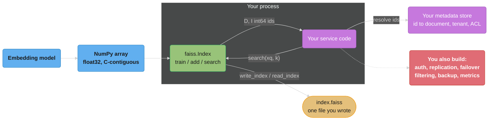
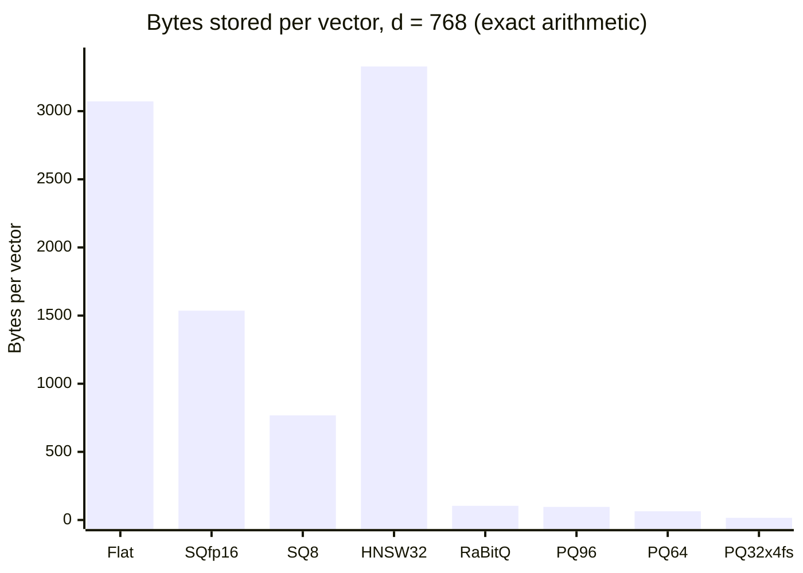

# FAISS Deep Dive

<!-- study-paths
senior: faiss_deep_dive.md
files this module contributes to each curated path; omit a tier to leave it out
-->

> **Version anchor (2026-08-04).** FAISS **1.15.0** — changelog dated 2026-07-31, wheels
> published 2026-08-03. **MIT licensed**, authored by Meta's Fundamental AI Research group
> (FAIR). Two papers define it: *Billion-scale similarity search with GPUs*
> ([arXiv:1702.08734](https://arxiv.org/abs/1702.08734), 2017) and *The Faiss library*
> ([arXiv:2401.08281](https://arxiv.org/abs/2401.08281), 2024) — read the second one, it is
> the design document for everything below. Version-specific behaviour is tagged inline as
> `[1.11.0]`, `[1.13.2]`, `[1.15.0]`; nothing here is described as current without naming the
> release it landed in.

FAISS is a **library for similarity search over dense vectors**, not a service. You `pip
install` it, you build an index object inside your own process, you call `.search()`, and you
get back two NumPy arrays. There is no daemon, no port, no config file, no query language and
no durability contract beyond the file you chose to write. That sentence is the whole page:
every strength in §4 and §6 and every gap in §9 follows from it.

This module is the **parameter surface and the API**. The mathematics of why ANN works —
the HNSW layer-assignment derivation, the `nlist = sqrt(N)` minimisation, the generic PQ
compression story, the SIFT1M recall curves — lives one door down in
[Embeddings & Similarity Search](../embeddings_and_similarity_search/embeddings_and_similarity_search.md),
and the operated-product side lives in
[Vector Databases](../../database/vector_databases/vector_databases.md). This page assumes
you have read the first and will decide against the second.

---

## 1. Concept Overview

### What FAISS actually is

An `faiss.Index` is a C++ object with a five-method surface, exposed to Python through SWIG:

| Method | What it does | Cost you must plan for |
|---|---|---|
| `train(xt)` | Fits whatever has to be learned — k-means centroids, a PQ codebook, an OPQ rotation | Minutes to hours; some index types skip it entirely |
| `add(x)` | Encodes and stores vectors, assigning sequential ids `0..ntotal-1` | Linear; irreversible in the sense that ids are positions |
| `add_with_ids(x, ids)` | Same, with your own 64-bit ids | Only on `IndexIVF*` and `IDMap`-wrapped indexes |
| `search(xq, k)` | Returns `(D, I)` — distances and ids, shape `(nq, k)` | The thing you tune |
| `remove_ids(sel)` | Deletes by selector, returns the count removed | **The nastiest trap in the library — see §6.10** |

Everything else — GPU placement, sharding, on-disk lists, refinement, filtering — is a
*wrapper index* that also implements those five methods. Composition is the entire design.

### What FAISS is not

- **Not a database.** No transactions, no backup, no point-in-time recovery, no schema, no
  replication, no failover, no auth, no multi-tenancy, no online DDL. §9 enumerates twelve
  missing capabilities and names the product that has each one.
- **Not a metadata store.** The index maps a vector to a 64-bit integer. Mapping that integer
  to a document, a tenant, a URL or an ACL is your job and lives in your own database.
- **Not a server.** There is no FAISS process to `curl`. If you want an HTTP endpoint you
  write one, and then you own its health checks, its concurrency model, its warmup, its
  rolling deploys and its index-reload semantics.
- **Not a full-text engine.** No tokenizer, no BM25, no inverted index over terms. Hybrid
  retrieval means running a second system alongside it — see
  [retrieval methods](../rag_fundamentals/retrieval_methods.md) for the fusion mechanics.
- **Not automatically fast.** A default `IndexIVFFlat` searches `nprobe = 1` cluster. Most
  "FAISS is inaccurate" reports are that one line.

### The package landscape, and the five-year hole in it

Four distributions exist and they are not interchangeable:

| Distribution | Latest | Notes |
|---|---|---|
| `faiss-cpu` | **1.15.0** (2026-08-03) | The default. Requires **Python >= 3.10**; wheels through 3.14 |
| `faiss-gpu` | **1.15.0** (2026-08-03) | Classic CUDA backend. Version list: 1.7.2 (Jan 2022) -> **1.14.3** (2026-06-12) -> 1.15.0 |
| `faiss-gpu-cuvs` | **1.15.0** (2026-08-03) | GPU backend delegating to NVIDIA cuVS, which is where `CAGRA` lives. Only 1.14.1.post1 and 1.15.0 on PyPI; requires Python >= 3.11 and CUDA 13 |
| conda `pytorch/faiss-*` | tracks releases | The channel Meta has published continuously; the historical answer for GPU builds |

**The five-year gap is worth understanding rather than working around.** Between January 2022
and June 2026 there was no `faiss-gpu` wheel on PyPI at all, and the community filled the
vacuum with third-party rebuilds under names like `faiss-gpu-cu12`. It is tempting to
conclude the 2026 wheels are another such rebuild — they are not. The PyPI project is the
same one, with the same maintainer set (`facebook`, plus two FAIR engineers), authored by
Meta AI Research; what changed is that Meta resumed publishing wheels, having spent the gap
shipping GPU builds only through conda. The practical consequence for you: **pin the
distribution, not just the version.** A `requirements.txt` that says `faiss-gpu` and resolves
to 1.7.2 on one machine and 1.15.0 on another is two different libraries — 1.7.2 predates
cuVS, RaBitQ, AVX-512 dispatch, and the mmap deserializers, and its index files are readable
by 1.15.0 but not the reverse.

### Feature landing points

Do not describe any of these as "FAISS supports X" without the version:

| Feature | Landed |
|---|---|
| ROCm / AMD GPU support | `[1.9.0]` |
| AVX-512 distance and scalar-quantizer kernels | `[1.10.0]` (the `avx512` opt level itself is older) |
| RAFT replaced by **cuVS** as the GPU acceleration backend | `[1.10.0]` |
| **RaBitQ** quantizer; memory-mapping and zero-copy deserializers | `[1.11.0]` |
| Binary `CAGRA` with NN-Descent | `[1.12.0]` |
| `IndexIVFRaBitQFastScan`; Panorama layout in `IndexIVFFlat` | `[1.13.0]` |
| Multi-bit RaBitQ (2–9 bits); Panorama in HNSW and Flat; Intel **SVS** index | `[1.13.1]` / `[1.13.2]` |
| PEP 561 type stubs (`py.typed`); ARM **SVE** distance functions | `[1.14.0]` |
| `faiss-gpu-cuvs` pip wheel packaging | `[1.14.3]` |
| mmap I/O for Flat and static Vamana/SVS; **EDEN** quantizer; RISC-V RVV kernels | `[1.15.0]` |

---

## 2. Intuition

> **One-line analogy:** FAISS is `numpy.argsort` for a billion vectors — a data structure you
> hold, not a system you operate.

**Mental model.** Picture a plain `float32` matrix of shape `(N, d)` and a loop that scores
every row against the query. That is `IndexFlat`, and it is *correct by construction* — 100%
recall, no parameters, no training. Every other index in FAISS is that loop with something
taken away in exchange for speed or memory: **IVF takes away rows** (only scan `nprobe` of
`nlist` clusters), **PQ / SQ / RaBitQ take away bytes** (store a 16-byte code instead of a
3,072-byte vector), **HNSW takes away the loop** (walk a graph instead of scanning), and
**a transform like OPQ rearranges the columns** so that taking bytes away hurts less. An index
name is a recipe naming which of those you took, and in what order.

**Why it matters.** Nearly every RAG system, recommender, deduplicator and
near-duplicate-detector in production is either running FAISS or running a product built on
the same four ideas. Knowing the library means you can read a vector database's tuning
documentation and know what it is actually doing — and can tell when you do not need the
database at all.

**Key insight — the sentence the rest of the page unpacks.** *An index that lost information
cannot tell you it lost information.* Every failure mode below is silent: an untrained index
that you forgot to train still `add`s, a `IndexFlatIP` over un-normalised vectors still ranks,
`nprobe = 1` still returns exactly `k` results, a removed id still leaves the array the right
length, a post-filter still returns rows. There is no exception, no warning, no error code —
only a recall number you did not measure. **The exact `IndexFlat` baseline is not optional
rigour; it is the only instrument the library gives you.**

---

## 3. Core Principles

- **Composition, not configuration.** There is no settings object. You express a design by
  nesting index classes, and `index_factory` is a string grammar for that nesting (§4.11).
- **The index type IS the design decision.** Choosing `IVF65536_HNSW32,PQ64` over
  `HNSW32,Flat` decides memory, build time, recall, mutability and whether a GPU can help,
  all at once.
- **Training is a distinct lifecycle phase.** Anything that learns — k-means centroids, PQ
  codebooks, OPQ rotations, scalar-quantizer ranges — must see a representative sample
  *before* the first `add`. Train on the wrong distribution and every later number is wrong.
- **Ids are 64-bit integers you assign meaning to.** The index knows nothing about your
  documents. Whether ids survive a removal depends on the index class (§6.10).
- **Distances come back raw and metric-specific.** `METRIC_L2` returns *squared* L2, not L2.
  `METRIC_INNER_PRODUCT` returns a similarity where bigger is better. Nothing is normalised
  for you.
- **The library is single-index and single-process.** Sharding, replication, failover and
  request routing are patterns you build with `IndexShards`, `IndexReplicas` and your own
  process manager — they are not operated features.
- **Recall is a property of your data, not of a parameter.** Published curves transfer as
  *shapes*. The number transfers only from your own corpus, measured against exact search.
- **Everything is silent.** See §2's key insight. The library's error surface covers API
  misuse, not quality loss.

---

## 4. Types / Architectures / Strategies

### 4.1 The index zoo — what you will actually type

Roughly sixty index classes ship. These are the ones that appear in production code:

| Class | Trains? | Bytes/vector at d=768 | Removable? | GPU? | Use when |
|---|---|---|---|---|---|
| `IndexFlatL2` / `IndexFlatIP` | No | 3,072 | Yes (renumbers) | Yes | Ground truth; under ~100K vectors |
| `IndexScalarQuantizer` (SQ8) | Yes (ranges) | 768 | Yes (renumbers) | Via IVF only | 4x smaller, almost free accuracy |
| `IndexPQ` | Yes | `m` bytes | Yes (renumbers) | No standalone | Rarely alone; PQ belongs under IVF |
| `IndexIVFFlat` | Yes (k-means) | 3,072 + 8 | **Yes, ids preserved** | Yes | 100K–2M, RAM is fine, recall matters |
| `IndexIVFScalarQuantizer` | Yes | 768 + 8 | Yes, ids preserved | Yes | The safe default above 1M |
| `IndexIVFPQ` | Yes | `m` + 8 | Yes, ids preserved | Yes | 10M–10B, memory-bound |
| `IndexIVFPQFastScan` | Yes | `m` + 8 | Yes, ids preserved | No | Same as above, 4-bit codes, SIMD scan |
| `IndexIVFRaBitQ` `[1.11.0]` | Yes | `d/8 + 8` | Yes, ids preserved | No | Binary-rate compression with better error behaviour than PQ |
| `IndexHNSWFlat` | No | `d*4 + M*8` = 3,328 at M=32 | **No** | **No** | Best recall/latency in RAM; static or append-only corpus |
| `IndexNSGFlat` | Yes (needs a kNN graph) | similar to HNSW | No | No | Slightly better than HNSW on some corpora; slower build |
| `IndexRefineFlat` | Wraps | base + 3,072 | Delegates | No | Recover the recall a compressed base gave up |
| `IndexIDMap` / `IndexIDMap2` | Wraps | base + 8 (or +16) | Yes, ids stable | Delegates | Give a sequential index your own ids |
| `IndexPreTransform` | Wraps | base | Delegates | Delegates | Apply OPQ/PCA/L2norm before the base index |
| `IndexShards` / `IndexReplicas` | Wraps | sum | Delegates | Yes | Multi-GPU, or splitting an index across processes |

Two rows deserve to be read twice. **`IndexHNSWFlat` cannot remove and cannot go on a GPU** —
those two facts eliminate it from more designs than its recall wins it. And every `IndexIVF*`
row says *ids preserved*, which is the single most consequential difference between the IVF
family and the sequential family (§6.10).

### 4.2 Coarse quantizers — the thing that picks which cells to scan

An `IndexIVF` is constructed with another index as its **coarse quantizer**: the object that
answers "which `nprobe` of my `nlist` centroids is this query nearest to?" That inner search
is a fixed cost paid on every query, before any candidate vector is touched.

| Coarse quantizer | Factory form | Centroid search cost | Use when |
|---|---|---|---|
| Flat | `IVF4096` | O(`nlist` * d) exact scan | `nlist` <= ~65,536 |
| HNSW graph over centroids | `IVF65536_HNSW32` | O(log `nlist`) | `nlist` >= ~65,536 — the standard above 1M vectors |
| Inverted multi-index | `IMI2x9` | Product of two sub-quantizers, 2^18 cells | Very high cell counts on a memory budget; unbalanced cells |
| Residual quantizer | `IVF1024(RQ2x6)` | Multi-stage | Specialist; rarely the right first answer |
| SVS Vamana `[1.14.x]` | `IVF..._SVSVamana...` | Graph | Newer; measure before adopting |

**Why this matters at scale.** At `nlist = 1,048,576` a flat centroid scan is a million
768-dimensional distance computations *per query* before you have looked at a single candidate
— strictly worse than brute-forcing a 1M-vector corpus. The `_HNSW32` suffix is not a
refinement; above ~65K cells it is the difference between the index working and not.

### 4.3 Encodings — where the bytes go

The encoding slot decides what is stored per vector. At **d = 768**:

| Encoding | Factory | Bytes/vector | Trains? | Notes |
|---|---|---|---|---|
| None | `Flat` | `d*4` = 3,072 | No | Exact distances |
| Half precision | `SQfp16` | `d*2` = 1,536 | No | Effectively lossless for retrieval |
| Scalar 8-bit | `SQ8` | `d` = 768 | Yes (min/max per dim) | The best accuracy-per-byte with no codebook |
| Scalar 4-bit | `SQ4` | `d/2` = 384 | Yes | Noticeably lossy; usually skip to PQ |
| Product quantization | `PQ64` | `m` = 64 | Yes | `m` sub-vectors, 8 bits each; `d % m == 0` |
| PQ, non-8-bit | `PQ16x12` | `m*bits/8` = 24 | Yes | 12-bit codebooks: 4,096 centroids per sub-space |
| PQ fast-scan | `PQ32x4fs` | `m*4/8` = 16 | Yes | 4 bits forced; SIMD in-register lookup (§6.6) |
| RaBitQ `[1.11.0]` | `RaBitQ` | `d/8 + 8` = 104 | Yes | ~1 bit/dim with a per-vector correction term |
| Residual quantizer | `RQ5x8` | 5 | Yes | Better rate-distortion than PQ, much slower to encode |
| LSH | `LSH` | `d/8` = 96 | No | Historic; RaBitQ dominates it |
| Lattice | `ZnLattice3x10_6` | small | No | Specialist |

Add **8 bytes per vector** for the id when the encoding sits under an `IndexIVF` (the
inverted lists store explicit 64-bit ids), and note that `IndexIVFFlat`'s `nlist` centroids
themselves cost `nlist * d * 4` bytes — 3.2 GB at `nlist = 1,048,576`, d = 768, which is not
a rounding error.

### 4.4 Vector transforms — the pre-processing slot

A transform is applied to every vector on `add` **and to every query on `search`**, by
`IndexPreTransform`. This symmetry is automatic and is the reason a transform is part of the
index rather than part of your pipeline.

| Transform | Factory | What it does |
|---|---|---|
| PCA | `PCA64` | Project to 64 dims, keeping maximum variance |
| PCA + whitening | `PCAW64` | Same, then divide each output dim by its standard deviation |
| PCA + random rotation | `PCAR64` | Same, then rotate — spreads variance so a following PQ splits evenly |
| Optimized PQ | `OPQ16_64` | Learns a rotation that minimises PQ quantization error; here 16 sub-quantizers over 64 output dims |
| Random rotation | `RR64` | Cheap variance spreading with no training |
| Hadamard rotation | `HR64` | Structured orthogonal transform, cheaper than a dense one |
| L2 normalisation | `L2norm` | Divides by the norm; makes inner product equal cosine |
| ITQ | `ITQ256` | Rotation tuned for binary codes |
| Zero padding | `Pad128` | Pads to 128 dims so an encoding's divisibility constraint is satisfied |

**The `OPQ_M_D` divisibility rule.** `OPQ16_64` requires the *following* PQ to use `M = 16`
sub-quantizers, and requires `D = 64` to be a multiple of `M`. The FAISS guidance is stronger
than divisibility: **`D` should ideally be `4 * M`**, i.e. four dimensions per sub-space, which
is what the SIMD kernels are shaped for. `OPQ32_128,...,PQ32` satisfies both. `OPQ32_100`
will not build.

### 4.5 Refinement — buying recall back

`IndexRefineFlat(base)` (factory `...,RFlat`) keeps the **full-precision vectors alongside**
the compressed index. A search asks the base index for `k * k_factor` candidates, re-scores
exactly those with the uncompressed vectors, and returns the true top `k`.

This is the single highest-leverage knob on a compressed index, and it is a *memory* decision
rather than a latency one: `RFlat` re-adds `d*4` bytes per vector, so `IVFPQ64,RFlat` at
d = 768 costs 3,144 bytes/vector, not 72 — you have thrown away the compression. Two ways to
keep it:

- `Refine(PQ25x12)` — refine with a *less* compressed code rather than with float32. At 25
  sub-quantizers by 12 bits that is 37.5 bytes/vector on top of the base.
- `PQ32x4fsr` — the `r` suffix on a fast-scan encoding means "re-rank the fast-scan candidates
  using the same PQ codes at full precision", which costs **zero extra memory** and recovers
  most of what 4-bit fast-scan gave up. It is nearly always the right default when you use
  fast-scan at all.

### 4.6 Id mapping — and the renumbering that eats your database

Sequential indexes (`IndexFlat`, `IndexPQ`, `IndexScalarQuantizer`, `IndexHNSW` — everything
deriving from `IndexFlatCodes`) do not store ids. **The id is the row's position.**
`IndexIVF*` stores explicit ids in its inverted lists.

That distinction is invisible until you remove something, at which point it becomes a data
corruption bug (§6.10). Two wrappers exist:

- **`IndexIDMap`** — keeps a `Vector<idx_t>` mapping internal position to your id. Adds 8
  bytes/vector. `reconstruct()` does not work through it.
- **`IndexIDMap2`** — additionally keeps the reverse map, so `reconstruct(your_id)` works.
  Adds ~16 bytes/vector plus hash-map overhead.

Factory prefix: `IDMap,Flat` or `IDMap2,HNSW32`.

### 4.7 Composite indexes — sharding and replication as objects

- **`IndexShards`** — one logical index over `n` sub-indexes each holding a slice of the
  corpus. A search fans out to all shards and merges. `threaded=True` runs them in parallel;
  `successive_ids=True` renumbers shard-local ids into a global space, which you almost never
  want (use `add_with_ids`).
- **`IndexReplicas`** — `n` copies of the same index; a search *splits the query batch* across
  them. This is throughput scaling, not capacity scaling, and it is how multi-GPU replication
  works.
- **`merge_from` / `merge_ondisk`** — two `IndexIVF`s that share a coarse quantizer and were
  trained together can be merged. This is the primitive behind distributed index building:
  train once, build shards in parallel on separate machines, merge.

### 4.8 GPU indexes — a deliberately small list

Only four classes have a GPU implementation in the classic backend, plus `CAGRA` through cuVS:

`GpuIndexFlat` · `GpuIndexIVFFlat` · `GpuIndexIVFScalarQuantizer` · `GpuIndexIVFPQ`

The hard limits, all of which are compile-time facts rather than tunables:

| Limit | Value | Consequence |
|---|---|---|
| `k` (results requested) | **<= 2048** | A top-10,000 retrieval must be done on CPU or in tiles |
| `nprobe` | **<= 2048** | Caps recall on very high `nlist` indexes |
| PQ code size `m` | one of 1, 2, 3, 4, 8, 12, 16, 20, 24, 28, 32, 48, 56, 64, 96 | `PQ40` silently is not a GPU option |
| PQ `m` >= 56 | requires float16 lookup tables | Set `useFloat16LookupTables = True` or construction fails |
| HNSW | **not implemented** | The best CPU index has no GPU path; use `CAGRA` via cuVS instead |
| Temp memory | 512 MiB / 1 GB / 1.5 GB by GPU size | `StandardGpuResources.setTempMemory()` if you are memory-tight |

And the operational one: **`index_gpu_to_cpu()` before `write_index()`.** A GPU index is not
serialisable.

### 4.9 On-disk and memory-mapped shapes

Three distinct mechanisms, often confused:

1. **`IO_FLAG_MMAP`** — `read_index(path, faiss.IO_FLAG_MMAP)` maps the file instead of
   copying it into the heap. The OS page cache becomes your working set, several processes on
   a box share one copy, and startup is instant. `[1.11.0]` added zero-copy deserializers;
   `[1.15.0]` extended mmap to Flat and static Vamana/SVS indexes.
2. **`OnDiskInvertedLists`** — replaces an `IndexIVF`'s in-memory inverted lists with a
   file-backed store. The centroids stay in RAM (they must), the codes live on disk, and a
   query touches only the `nprobe` lists it needs. This is what makes a 1B-vector index
   servable from a machine with 64 GB of RAM.
3. **`merge_ondisk`** — the helper that concatenates several `IndexIVF` shards' inverted lists
   into one on-disk file without loading them. Ships in `contrib/ondisk.py`.

### 4.10 Sizing — the official decision table

FAISS's own guidance, restated with the arithmetic filled in. `N` is the corpus size:

| Corpus | Factory string | `nlist` | Training vectors needed |
|---|---|---|---|
| < 1M | `IVF{K},Flat` with **K = 4*sqrt(N) to 16*sqrt(N)** | e.g. N=250K -> K = 2,000–8,000 | **30*K to 256*K** — so 30K–256K for K=1,024 |
| 1M – 10M | `IVF65536_HNSW32,Flat` | 65,536 | **1.97M – 16.8M** |
| 10M – 100M | `IVF262144_HNSW32,Flat` | 262,144 | 7.9M – 67.1M |
| 100M – 1B | `IVF1048576_HNSW32,Flat` | 1,048,576 | 31.5M – 268M |

Swap `Flat` for `SQ8`, `PQ64` or `RaBitQ` when the memory table in §4.3 says you must. Two
consequences engineers miss:

- **The training set can exceed the corpus.** At 1M vectors you need 1.97M training points for
  `nlist = 65536`, which you do not have. That is the signal to drop to a smaller `nlist`, not
  to train on 1M points and accept a warning.
- **The training set should be a random sample of the corpus**, and above ~1M points, sampling
  is not merely acceptable — k-means over 268M points is a multi-hour job whose marginal
  benefit over 32M points is negligible.

### 4.11 The index-factory grammar — read left to right

`faiss.index_factory(d, "OPQ32_128,IVF65536_HNSW32,PQ32x4fsr", faiss.METRIC_INNER_PRODUCT)`
builds a nested object graph from a comma-separated string. The commas are **pipeline stages
in application order**, and each stage draws from a fixed vocabulary:

| Slot | Optional? | Vocabulary |
|---|---|---|
| 1. Prefix | yes | `IDMap`, `IDMap2` |
| 2. Transform | yes | `PCA64`, `PCAR64`, `PCAW64`, `OPQ16_64`, `RR64`, `HR64`, `L2norm`, `ITQ256`, `Pad128` |
| 3. Coarse | yes | `IVF4096`, `IVF65536_HNSW32`, `IMI2x9`, `HNSW32`, `NSG32` |
| 4. Encoding | **no** | `Flat`, `PQ16`, `PQ16x12`, `PQ28x4fs`, `SQ8`, `SQ4`, `SQfp16`, `RaBitQ`, `RQ5x8`, `LSH`, `ZnLattice3x10_6` |
| 5. Refine | yes | `RFlat`, `Refine(PQ25x12)`, or the `r` suffix in `PQ32x4fsr` |

Now parse one, token by token:

```
  OPQ32_128,IVF65536_HNSW32,PQ32x4fsr
  |_______| |______| |____| |_______|
      |        |       |        |
      |        |       |        +-- ENCODING. 32 sub-quantizers x 4 bits =
      |        |       |            16 B/vector, fast-scan SIMD layout, and
      |        |       |            the trailing r re-ranks with the same
      |        |       |            codes at full precision -- free recall.
      |        |       |            TRAINS a PQ codebook.
      |        |       |
      |        |       +----------- THE COARSE QUANTIZER'S OWN INDEX. The
      |        |                    65,536 centroids are searched by an HNSW
      |        |                    graph with M=32, not scanned flat -- the
      |        |                    difference between O(log nlist) and
      |        |                    65,536 distance computations per query.
      |        |                    TRAINS with the IVF.
      |        |
      |        +------------------- COARSE LEVEL. Partition the transformed
      |                             space into 65,536 IVF cells. nprobe of
      |                             them are scanned per query; nprobe is
      |                             the recall dial and defaults to 1.
      |                             TRAINS by k-means. Needs 1.97M-16.8M
      |                             training vectors at this nlist.
      |
      +---------------------------- VECTOR TRANSFORM. OPQ learns a rotation
                                    of the 128-d input so that PQ's 32
                                    sub-spaces carry equal variance. The 128
                                    must be a multiple of 32 -- ideally 4x.
                                    TRAINS. Applied on every add AND every
                                    query, automatically.
```

Read the string right to left to answer "how big is it?" (16 bytes plus an 8-byte id, so
2.4 GB at 100M vectors), and left to right to answer "what has to be trained?" (all three
learned stages, in one `train()` call, from one sample).

**Four factory strings that cover most production choices:**

```python
import faiss

# 1. Ground truth. No training, no parameters, 100% recall. Always build this too.
exact = faiss.index_factory(768, "Flat", faiss.METRIC_INNER_PRODUCT)

# 2. The safe default from ~1M to ~20M vectors: 4x compression, high recall,
#    ids preserved across removal, GPU-capable.
safe = faiss.index_factory(768, "IVF65536_HNSW32,SQ8", faiss.METRIC_INNER_PRODUCT)

# 3. Memory-bound at 100M+: 24 bytes/vector including the id, re-ranked for free.
big = faiss.index_factory(768, "OPQ32_128,IVF262144_HNSW32,PQ32x4fsr",
                          faiss.METRIC_INNER_PRODUCT)

# 4. Best recall-per-millisecond in RAM, static corpus, no GPU, no deletes.
graph = faiss.index_factory(768, "HNSW32,Flat", faiss.METRIC_INNER_PRODUCT)
```

---

## 5. Architecture Diagrams

### 5.1 Where FAISS sits — and what it leaves to you



The green box is FAISS. Everything purple and red is what a vector database would have given
you — §9 prices it.

### 5.2 The four composition slots, stacked

```
  QUERY xq (1, 768) float32                     ADD x (n, 768) float32
        |                                             |
        v                                             v
  +-----------------------------------------------------------------+
  |  1  IndexPreTransform      OPQ32_128                             |
  |     rotate 768 -> 128, learned                 same op both ways |
  +-----------------------------------------------------------------+
        |  (1, 128)                                    |  (n, 128)
        v                                             v
  +-----------------------------------------------------------------+
  |  2  IndexIVF coarse        IVF65536_HNSW32                       |
  |     search: pick nprobe cells        add: assign to nearest cell |
  +-----------------------------------------------------------------+
        |  nprobe list ids                             |  1 list id
        v                                             v
  +-----------------------------------------------------------------+
  |  3  Encoding in the lists  PQ32x4fs                              |
  |     search: LUT scan of codes           add: encode to 16 bytes  |
  +-----------------------------------------------------------------+
        |  k * k_factor candidates
        v
  +-----------------------------------------------------------------+
  |  4  Refine                 the trailing "r"                      |
  |     re-score candidates exactly, keep top k     (add: no-op)     |
  +-----------------------------------------------------------------+
        |
        v
  D (1, k) float32   I (1, k) int64
```

The add path and the search path traverse the same four objects — that symmetry is why a
transform belongs inside the index and not in your pipeline. Skip a stage on one side only,
and there is no error, just wrong distances.

### 5.3 The IVF search loop, annotated

```
  nlist = 65,536      nprobe = 32      N = 100,000,000      d = 768

  STEP 1  coarse search: which cells?
          HNSW graph over 65,536 centroids  ->  ~14 hops, not 65,536 scans
          cost: about 1e3 distance computations          <- fixed floor

  STEP 2  for each of the 32 chosen lists:
          list length ~= N / nlist = 100e6 / 65,536 = 1,526 vectors
          32 lists x 1,526 = 48,832 candidates            <- 0.049% of corpus

  STEP 3  scan each candidate's code
          Flat    3,072 B/candidate  ->  150 MB touched per query
          SQ8       768 B/candidate  ->   37 MB touched per query
          PQ32x4fs   16 B/candidate  ->  0.78 MB touched per query
                                          ^^^^
          this column, not the candidate count, is what sets QPS on a
          memory-bandwidth-bound scan

  STEP 4  maintain a size-k heap, return (D, I)

  RAISING nprobe 32 -> 256 multiplies STEP 2 and STEP 3 by 8 and leaves
  STEP 1 unchanged. That is why nprobe must always be quoted as a fraction
  of nlist, never as a bare number.
```

### 5.4 PQ asymmetric distance and the lookup table

The reason PQ is fast is not the compression; it is that the query is **never** decompressed
into the same space as the codes. FAISS computes a table once per query and then does table
lookups per candidate.

```
  d = 8, m = 4 sub-vectors of 2 dims, 4 centroids per sub-space (2-bit codes)

  ONCE PER QUERY -- build the lookup table (ADC, asymmetric)
  ---------------------------------------------------------
  split q into 4 sub-vectors, score each against its 4 centroids:

            sub0    sub1    sub2    sub3
  cent 0 |  0.91    0.12    0.44    0.70
  cent 1 |  0.33    0.88    0.21    0.15
  cent 2 |  0.07    0.51    0.95    0.62
  cent 3 |  0.60    0.29    0.38    0.04
           ^ 16 float multiplies-and-adds total, paid once

  PER CANDIDATE -- 4 table lookups and 3 adds. No multiplies at all.
  ------------------------------------------------------------------
  code = [2, 1, 0, 3]  ->  0.07 + 0.88 + 0.44 + 0.04 = 1.43
  code = [0, 1, 2, 0]  ->  0.91 + 0.88 + 0.95 + 0.70 = 3.44   <- winner

  ADC (asymmetric) keeps the query exact and quantizes only the database
  vector. SDC (symmetric) quantizes BOTH, which lets you precompute one
  centroid-to-centroid table shared by all queries -- cheaper table build,
  strictly worse accuracy. FAISS defaults to ADC because the table build is
  amortized over thousands of candidates anyway.
```

**Fast-scan changes the shape of this picture, not the idea.** With 4-bit codes the table has
16 rows per sub-space and fits in SIMD registers, so a whole block of 32 candidates is scored
with shuffle instructions instead of memory loads. That is the entire content of the `x4fs`
suffix, and it typically buys a several-fold throughput win over the same `m` at 8 bits.

### 5.5 Bytes per vector at d = 768 — the compression axis



`HNSW32` is taller than `Flat` because a graph index stores the full vectors *and* `M * 8`
bytes of neighbour pointers on top. The three right-hand bars are not small; they are
invisible, and that invisibility is the whole reason IVF-PQ exists.

### 5.6 Compression versus recall — the axis this page owns

At **d = 768, N = 100M, `nlist = 262144`, `nprobe = 32`**, holding the coarse level fixed and
varying only the encoding slot:

| Encoding | Code B | + id | Total B/vec | 100M index | Bytes scanned/query | Recall@10 (shape only) |
|---|---|---|---|---|---|---|
| `Flat` | 3,072 | 8 | 3,080 | **308 GB** | 117 MB | baseline |
| `SQfp16` | 1,536 | 8 | 1,544 | 154 GB | 58 MB | ~1.00x |
| `SQ8` | 768 | 8 | 776 | 77.6 GB | 29 MB | ~0.99x |
| `PQ96` | 96 | 8 | 104 | 10.4 GB | 3.7 MB | ~0.92x |
| `RaBitQ` | 96 + 8 | 8 | 112 | 11.2 GB | 4.0 MB | ~0.93x |
| `PQ64` | 64 | 8 | 72 | **7.2 GB** | 2.4 MB | ~0.88x |
| `PQ32x4fs` | 16 | 8 | 24 | 2.4 GB | 0.6 MB | ~0.70x |
| `PQ32x4fsr` | 16 | 8 | 24 | 2.4 GB | 0.6 MB + rerank | ~0.85x |
| `PQ64,RFlat` | 64 + 3,072 | 8 | 3,144 | 314 GB | 2.4 MB + rerank | ~0.99x |

**The bytes columns are exact arithmetic** from the encoding definitions in §4.3, and
`bytes scanned/query` is `total B/vec * nprobe * N / nlist` — the quantity that actually sets
QPS on a bandwidth-bound scan. **The recall column is an ILLUSTRATIVE SHAPE, not a
measurement**: PQ error is a property of your embedding model's intrinsic dimensionality and
of how much variance OPQ managed to equalise, and no fixed recall belongs to a code size. Two
things do transfer, and they are the reason the table is here:

1. **The knee is between `SQ8` and `PQ96`** — a 43x memory cut for a few points, then a much
   steeper curve below 100 bytes.
2. **`PQ64,RFlat` is a trap that looks like a win.** It reads as "compressed with refinement"
   and costs *more* than `Flat`, because `RFlat` stores the float32 vectors you just spent the
   PQ codebook to avoid storing. `PQ32x4fsr` is the refinement that is actually free.

Measure the real curve on your corpus with the recipe in §6.12; it is twenty lines of code and
it is the only number that means anything.

---

## 6. How It Works — Detailed Mechanics

### 6.1 The array contract, and the silent copy

FAISS is C++ behind SWIG. Every array you hand it must be **float32 and C-contiguous**, and
the binding will silently convert anything else:

```python
import numpy as np
import faiss

emb = model.encode(texts)              # often float64, or a torch tensor's .numpy() view
print(emb.dtype, emb.flags["C_CONTIGUOUS"])   # float64 True  -> a full copy on every add

xb = np.ascontiguousarray(emb, dtype="float32")   # do this once, explicitly
index.add(xb)
```

Two failures follow from skipping it. A `float64` corpus of 100M x 768 costs an extra 614 GB
of transient allocation across the add loop, in copies you never see. And a **non-contiguous
slice** — `emb[:, :256]` after a Matryoshka truncation, or a transposed array — copies on
every call including every `search`, which shows up as a latency floor nobody can explain.
`[1.14.0]` shipped PEP 561 type stubs, so an IDE will now at least tell you the signature;
it will not tell you about the copy.

### 6.2 The normalisation trap — a broken-then-fixed example

This is the most common FAISS bug in RAG codebases, and it produces plausible results forever.

```python
# BROKEN: IndexFlatIP over un-normalised embeddings.
# No error. No warning. Ranking is dominated by vector length, so the
# longest documents win every query regardless of what they say.
import numpy as np
import faiss

index = faiss.IndexFlatIP(768)
index.add(corpus_vecs)                   # raw model output, norms 0.6 to 14.2
D, I = index.search(query_vec, 10)       # returns 10 rows, all of them long documents
```

```python
# FIX: normalise the corpus AND the query AND every later add.
# faiss.normalize_L2 mutates its argument IN PLACE and returns None --
# `xb = faiss.normalize_L2(xb)` sets xb to None, which is its own bug.
import numpy as np
import faiss


class CosineIndex:
    """IndexFlatIP over unit vectors == cosine similarity, with no path
    that can add an un-normalised vector."""

    def __init__(self, dim: int) -> None:
        self.index = faiss.IndexIDMap2(faiss.IndexFlatIP(dim))

    @staticmethod
    def _prep(x: np.ndarray) -> np.ndarray:
        x = np.ascontiguousarray(x, dtype="float32")
        faiss.normalize_L2(x)            # in place; returns None
        return x

    def add(self, x: np.ndarray, ids: np.ndarray) -> None:
        self.index.add_with_ids(self._prep(x), ids.astype("int64"))

    def search(self, q: np.ndarray, k: int) -> tuple[np.ndarray, np.ndarray]:
        return self.index.search(self._prep(q), k)
```

Three properties of the fix matter more than the normalisation itself. The `_prep` call sits
on **both** paths, so a query can never be scored against a corpus normalised differently. It
is applied on **every later add**, which is where the bug usually re-enters six months in
through an incremental-update job that reuses the model but not the wrapper. And an
alternative worth knowing: putting `L2norm` in the factory string (`"L2norm,Flat"`) pushes
the same guarantee into the index itself via `IndexPreTransform`, so it survives even a
caller who bypasses your wrapper.

The same class of bug with `METRIC_L2`: FAISS returns **squared** L2 distances. Code that
compares `D` against a threshold calibrated in L2 units is off by a square root, and again
nothing errors.

### 6.3 Training, in depth

```python
import numpy as np
import faiss

d, nlist = 768, 65536
index = faiss.index_factory(d, f"OPQ32_128,IVF{nlist}_HNSW32,PQ32x4fsr",
                            faiss.METRIC_INNER_PRODUCT)

assert not index.is_trained
rng = np.random.default_rng(0)
sample = corpus[rng.choice(len(corpus), size=4_000_000, replace=False)]
index.train(np.ascontiguousarray(sample, dtype="float32"))   # minutes to hours
assert index.is_trained
index.add(corpus_chunk)                                       # only now
```

**What one `train()` call actually fits**, in order: the OPQ rotation (an iterative procedure
alternating between fitting PQ and re-solving for the orthogonal rotation), then k-means for
the 65,536 IVF centroids over the *rotated* space, then the HNSW graph over those centroids,
then the PQ codebooks over the *residuals* from each centroid. That last word is the one to
remember — in an `IVF...,PQ` index the PQ encodes the residual `x - centroid(x)`, not `x`, so
the codebook is fitted against a much smaller-variance quantity and the same 64 bytes buys far
more accuracy than `PQ64` alone would.

**The four training failures, all quiet:**

| Failure | Symptom | Fix |
|---|---|---|
| `add()` before `train()` | `RuntimeError` on some classes, garbage on others | `assert index.is_trained` in your build script |
| Too few training points | `WARNING clustering 200000 points to 65536 centroids: please provide at least 2555904 training points` on stderr, then it proceeds | Lower `nlist`, or sample more |
| Training on a different distribution than the corpus | Nothing at all; unbalanced lists and recall 10–30 points below expectation | Train on a random sample of the *actual* corpus |
| Training on sorted or clustered data | Same as above, worse | Shuffle before sampling |

That warning is printed to stderr and swallowed by most build pipelines. Capture it. It is
the only signal FAISS gives you that your `nlist` is wrong for your data.

**Distribution drift is the version of this that bites in year two.** The centroids are frozen
at train time. A corpus that grows from 10M product descriptions to 40M including a new
category will pile the new category into a handful of cells; `nprobe = 32` then either misses
that category entirely or spends all its budget there. There is no incremental re-clustering
in FAISS. The fix is a scheduled rebuild, and the detector is a per-list length histogram:
if `max(list_len) / mean(list_len)` drifts past ~10, retrain.

### 6.4 The HNSW search loop in FAISS terms

FAISS's `IndexHNSWFlat` exposes the same three knobs the literature names, on
`index.hnsw`:

```python
index = faiss.index_factory(768, "HNSW32,Flat")   # M = 32, set at construction
index.hnsw.efConstruction = 200                   # BEFORE add(); baked into the graph
index.add(xb)
index.hnsw.efSearch = 128                         # tunable forever, per process
```

Three FAISS-specific facts on top of the general HNSW story (derived in
[Embeddings & Similarity Search](../embeddings_and_similarity_search/embeddings_and_similarity_search.md)):

- **`M` is fixed at construction and cannot be changed**, because it is a parameter of the
  factory string. `efConstruction` can be changed between `add` batches, which means a lazy
  build can accidentally produce a graph of two qualities. Set it once, before the first add.
- **`efSearch` must be at least `k`.** FAISS does not raise if it is not; it returns fewer
  than `k` useful results and pads with `-1` ids and sentinel distances. Code that does not
  check for `-1` will happily look up document `-1`.
- **`IndexHNSWFlat` has no `remove_ids`** — it raises. There is no tombstone mechanism either.
  A corpus with deletions cannot use HNSW in FAISS without a full rebuild, which is by itself
  the reason most production FAISS deployments are IVF-based even though HNSW has the better
  recall curve.

The composite `IVF65536_HNSW32` is a *different thing* from `HNSW32`: there the graph indexes
65,536 centroids, not 100M vectors, and the corpus lives in IVF lists which do support
removal.

### 6.5 Reconstruct, and what "lossy" means concretely

`index.reconstruct(i)` returns the stored representation of vector `i` decoded back to `d`
floats. On `IndexFlat` it is the original. On `IndexIVFPQ` it is `centroid + PQ_decode(code)`
— a vector that is *near* the original and never equal to it. Two uses:

- **Quantifying your compression loss directly**, without a retrieval benchmark:
  `np.linalg.norm(original - index.reconstruct(i)) / np.linalg.norm(original)` averaged over a
  few thousand vectors is the relative reconstruction error, and it correlates with the recall
  you will lose.
- **Re-ranking outside the index**, if you are building your own two-stage flow rather than
  using `IndexRefine`.

`reconstruct` requires `make_direct_map()` on an `IndexIVF` (it needs a position index it does
not otherwise keep) and does not work through a plain `IndexIDMap` — that is what `IDMap2` is
for.

### 6.6 Fast-scan, and why 4 bits

`PQ32x4fs` forces 4-bit sub-codes: 16 centroids per sub-space instead of 256. That sounds
strictly worse, and per-sub-quantizer it is. The trade is that a 16-entry table of 8-bit
distances fits in a single SIMD register, so scoring is `vpshufb`-style register shuffles over
a block of 32 interleaved codes rather than 32 random memory reads into a 256-entry table. The
scan becomes compute-bound and cache-resident instead of latency-bound.

Practical rules:

- **Use twice as many sub-quantizers at 4 bits as you would at 8.** `PQ32x4fs` (16 B) is the
  peer of `PQ16` (16 B), not of `PQ32` (32 B), and it is generally more accurate at equal
  bytes because 32 sub-spaces partition the vector more finely than 16.
- **Always add the `r`.** `PQ32x4fsr` re-ranks the fast-scan shortlist using the same codes at
  full 8-bit-table precision. Zero extra memory.
- **Fast-scan has no GPU implementation.** It is a CPU SIMD technique; on a GPU, plain
  `GpuIndexIVFPQ` is the fast path.
- `[1.13.0]` added `IndexIVFRaBitQFastScan`, applying the same block layout to RaBitQ codes,
  and `[1.15.0]` fused the AND-dot and popcount steps of the RaBitQ scan.

### 6.7 Tuning nprobe and efSearch to a target

Do not guess. FAISS ships an autotuner that sweeps a parameter space against ground truth:

```python
import faiss
import numpy as np

# ground truth from the exact index, on the SAME queries
exact = faiss.IndexFlatIP(768)
exact.add(xb)
_, gt = exact.search(xq, 10)

ps = faiss.ParameterSpace()
ps.initialize(index)
# explore nprobe = 1, 2, 4, ... and report the (latency, recall) Pareto front
crit = faiss.OneRecallAtRCriterion(len(xq), 1)
crit.set_groundtruth(None, gt.astype("int64"))
res = ps.explore(index, xq, crit)
res.display()

# then pin the operating point you chose
faiss.ParameterSpace().set_index_parameter(index, "nprobe", 48)
faiss.ParameterSpace().set_index_parameter(index, "efSearch", 128)
```

The output is a table of parameter combinations with the recall each reaches and the time it
took, and the only rows worth keeping are the Pareto-optimal ones. **`set_index_parameter`
reaches through wrappers** — it will find the `nprobe` on an IVF nested three levels inside an
`IndexPreTransform` inside an `IndexRefine`, which is why it is preferable to
`index.nprobe = 48` on anything composite.

Per-query overrides, without mutating the index (thread-safe, `[1.7.4]`+):

```python
params = faiss.SearchParametersIVF(nprobe=128)
D, I = index.search(xq_hard, 10, params=params)
```

### 6.8 Filtered search — the one that decides library versus database

FAISS's filtering primitive is an **`IDSelector`**: an object answering `is_member(id)`.

| Selector | Cost per test | Use when |
|---|---|---|
| `IDSelectorRange(lo, hi)` | O(1) comparison | Ids are allocated contiguously per tenant |
| `IDSelectorBatch(ids)` | hash lookup | A few thousand to a few million ids |
| `IDSelectorBitmap(bitmap)` | O(1) bit test | A dense id space; 12.5 MB for 100M ids |
| `IDSelectorNot`, `And`, `Or`, `XOr` | composition | Boolean combinations |

Passed through `SearchParametersIVF(sel=...)`, this is a **genuine pre-filter for IVF**: the
selector is tested inside the list scan, so non-matching vectors never enter the heap and you
get a full `k` results drawn from the matching subset.

```python
tenant_ids = faiss.IDSelectorBatch(np.asarray(ids_for_tenant, dtype="int64"))
params = faiss.SearchParametersIVF(sel=tenant_ids, nprobe=64)
D, I = index.search(xq, 10, params=params)      # exactly 10, all tenant-owned
```

**Post-filtering — the thing you do when you have not read this section — needs arithmetic.**
Suppose a tenant owns 2% of the corpus and you want `k = 10`:

```
  selectivity p = 0.02,  target k = 10,  post-filter: search k', keep matches

  k' =    500   expected survivors = 500 x 0.02 = 10.0
                P(at least 10 survive) ~= 0.54     <- HALF your queries
                                                      under-return, silently

  k' =  1,000   expected survivors = 20.0
                P(at least 10 survive) ~= 0.99     <- 100x the work for
                                                      a 99% guarantee

  k' =  2,048   the GPU hard ceiling on k. At p = 0.005 (0.5% tenant) even
                this is not enough, and the query simply cannot be answered
                by post-filtering at all.

  Pre-filter with SearchParametersIVF(sel=...):  k' = 10.  Always 10.
```

Two caveats that keep this honest. **The pre-filter does not make the scan cheaper** — it
still walks the same `nprobe` lists, testing every code, and only skips the heap insert. If a
tenant owns 0.5% of a 100M corpus, scanning 48,832 candidates to find ~244 of theirs is
strictly worse than brute-forcing their own 500K vectors in a per-tenant `IndexFlat`. And
**HNSW's selector is applied at result-collection time**, not during traversal: connectivity
is preserved (the walk goes *through* filtered nodes) but the effective beam shrinks, so a
selective filter on `IndexHNSWFlat` needs `efSearch` inflated well above `k` or it returns
short.

### 6.9 Persistence, mmap and on-disk lists

```python
faiss.write_index(index, "/data/idx.faiss")          # CPU indexes only
index = faiss.read_index("/data/idx.faiss")          # loads fully into the heap
index = faiss.read_index("/data/idx.faiss", faiss.IO_FLAG_MMAP)   # maps it
```

The three shapes and when each is right:

| Shape | Startup | RSS per process | Right when |
|---|---|---|---|
| `read_index` | Slow: full read | Full index size | One process, index fits, restarts are rare |
| `IO_FLAG_MMAP` | Instant | Shared page cache | Several worker processes on one box; large index; frequent restarts |
| `OnDiskInvertedLists` | Instant | Centroids only | Index far exceeds RAM; you accept per-query disk reads |

The multi-worker case is the one people miss: eight Gunicorn workers each `read_index`-ing a
40 GB file need 320 GB. The same eight with `IO_FLAG_MMAP` need 40 GB of page cache between
them. `[1.15.0]` extended mmap support to Flat and static Vamana/SVS indexes; before that it
was IVF-shaped indexes only.

**Distributed build with `merge_ondisk`:**

```python
# 1. Train ONCE on a sample; write the empty trained index.
trained = faiss.index_factory(768, "OPQ32_128,IVF262144_HNSW32,PQ32x4fsr")
trained.train(sample)
faiss.write_index(trained, "/data/trained.faiss")

# 2. On N machines in parallel: load the trained shell, add a slice, write a shard.
shard = faiss.read_index("/data/trained.faiss")
shard.add_with_ids(slice_vectors, slice_ids)
faiss.write_index(shard, f"/data/shard_{i}.faiss")

# 3. Merge the inverted lists into one on-disk file without loading them.
from faiss.contrib.ondisk import merge_ondisk
final = faiss.read_index("/data/trained.faiss")
merge_ondisk(final, [f"/data/shard_{i}.faiss" for i in range(n)],
             "/data/merged_lists.ivfdata")
faiss.write_index(final, "/data/final.faiss")
```

Step 1 is load-bearing: shards can only merge if they share the same coarse quantizer and
codebooks, which means one training run whose output every shard starts from.

**Versioning.** Index files are a serialised C++ object graph, not a documented format. A file
written by 1.15.0 will generally be readable by 1.15.0; forward compatibility across major
feature releases is not guaranteed and backward compatibility (new file, old library) is not
offered at all. Store the FAISS version in your index metadata and rebuild rather than
upgrade-in-place across a release boundary.

### 6.10 Removal, updates, and the renumbering that corrupts your ids

This is the single most dangerous API in the library.

```python
# Sequential index: ids ARE positions.
idx = faiss.IndexFlatL2(4)
idx.add(np.array([[0,0,0,0],[1,1,1,1],[2,2,2,2],[3,3,3,3]], dtype="float32"))
idx.remove_ids(faiss.IDSelectorRange(1, 2))   # removes the vector at position 1
# ntotal is now 3. The vector formerly at position 2 is NOW AT POSITION 1.
# Every external mapping {doc_id -> faiss_position} you stored is off by one
# for every document after the deletion. No error. No warning.

# IndexIVF: ids are stored explicitly in the inverted lists.
ivf = faiss.index_factory(4, "IVF4,Flat")
ivf.train(training); ivf.add_with_ids(vecs, np.array([100,200,300,400]))
ivf.remove_ids(faiss.IDSelectorBatch(np.array([200])))
# ids 100, 300, 400 are UNCHANGED. This is the behaviour you expected.
```

The behaviour matrix:

| Index | `remove_ids` | Id behaviour |
|---|---|---|
| `IndexFlat`, `IndexPQ`, `IndexScalarQuantizer` (all `IndexFlatCodes`) | Supported | **Survivors renumber down** |
| `IndexIVF*` | Supported | Ids preserved |
| `IndexIDMap` / `IDMap2` | Supported | External ids stable — the wrapper fixes the mapping |
| `IndexHNSW*`, `IndexNSG*` | **Raises** | No removal at all |
| `IndexPreTransform`, `IndexRefine` | Delegates | Whatever the base does |

**The rule that follows: never expose a raw sequential index's positions as ids.** Wrap it in
`IDMap2` from the first line of code, even when you do not think you will delete. Retrofitting
`IDMap2` after a corpus exists means a rebuild.

**There is no update.** Changing a vector is `remove_ids` then `add_with_ids` with the same
id, and on an `IndexIVF` that is genuinely fine. On HNSW it is a rebuild. Note also that IVF
removal leaves the *centroids* untouched — churn a corpus long enough and the clustering
describes a distribution you no longer have (§6.3).

### 6.11 GPU: resources, transfer, shard versus replica

```python
res = faiss.StandardGpuResources()
res.setTempMemory(512 * 1024 * 1024)          # default is 512 MiB / 1 GB / 1.5 GB by GPU size
gpu_index = faiss.index_cpu_to_gpu(res, 0, cpu_index)

# multi-GPU
opts = faiss.GpuMultipleClonerOptions()
opts.shard = True        # SPLIT the corpus across GPUs -- capacity scaling
# opts.shard = False     # REPLICATE the index on each GPU -- throughput scaling
opts.useFloat16 = True   # required when PQ m >= 56
multi = faiss.index_cpu_to_all_gpus(cpu_index, co=opts)

# before persisting, always come back
faiss.write_index(faiss.index_gpu_to_cpu(multi), "/data/idx.faiss")
```

**Shard versus replica is a capacity-versus-throughput decision and they do not compose
trivially.** Sharding across 4 GPUs lets you hold 4x the corpus, but every query fans out to
all four and the results are merged, so per-query latency is set by the slowest GPU and QPS
does not improve. Replication across 4 GPUs holds the same corpus four times and splits the
*query batch*, so QPS scales roughly 4x and latency is unchanged. Pick by which resource you
ran out of.

**The GPU is a batch device.** A single query against `GpuIndexIVFFlat` will often be slower
than the CPU index, because kernel launch and PCIe transfer dominate. GPU FAISS pays off at
batch sizes in the hundreds to thousands — offline embedding deduplication, nightly
recommendation candidate generation, index building, ground-truth computation. An interactive
one-query-at-a-time RAG endpoint is usually the wrong workload for it.

`CAGRA`, NVIDIA's GPU graph index, is reachable through the cuVS backend
(`faiss-gpu-cuvs`) and is the answer to "I want HNSW-class recall on a GPU", since
`IndexHNSW` itself has no GPU implementation.

### 6.12 Benchmarking honestly

**A QPS number without a recall number is a point on an unnamed curve.** Any index can be made
arbitrarily fast by lowering `nprobe`; the only comparable measurement is a
(recall, latency) pair, and recall must be measured against exact search on the *same queries*.

```python
import time
import numpy as np
import faiss


def recall_at_k(approx_ids: np.ndarray, exact_ids: np.ndarray, k: int) -> float:
    """Fraction of the true top-k that the approximate index also returned."""
    hits = sum(len(set(a[:k]) & set(e[:k])) for a, e in zip(approx_ids, exact_ids))
    return hits / (len(exact_ids) * k)


def sweep(index: faiss.Index, xq: np.ndarray, gt: np.ndarray,
          k: int, nprobes: list[int]) -> None:
    for np_ in nprobes:
        faiss.ParameterSpace().set_index_parameter(index, "nprobe", np_)
        index.search(xq[:64], k)                       # warm the caches
        t0 = time.perf_counter()
        _, ids = index.search(xq, k)
        dt = time.perf_counter() - t0
        print(f"nprobe={np_:5d}  recall@{k}={recall_at_k(ids, gt, k):.4f}  "
              f"{len(xq) / dt:8.1f} qps  {1000 * dt / len(xq):6.3f} ms/query")


exact = faiss.IndexFlatIP(768)          # the instrument, not a candidate design
exact.add(xb)
_, gt = exact.search(xq, 10)
sweep(index, xq, gt, 10, [1, 4, 16, 32, 64, 128, 256])
```

Five things that invalidate a benchmark, in the order people get them wrong:

1. **Ground truth from a different index.** It must come from `IndexFlat` with the *same
   metric* over the *same* vectors.
2. **Queries drawn from the corpus.** Every query then has itself as an exact neighbour at
   distance 0, inflating recall@1 to nearly 100% for any index. Hold out real queries.
3. **Batch size of 1.** FAISS parallelises over the query batch by default; single-query
   latency and batched throughput are different numbers and both are legitimate — say which
   one you measured.
4. **No warmup.** The first search pages in the index and fills caches.
5. **Thread count unstated.** `faiss.omp_set_num_threads(n)` — a 64-core result is not a
   comparison against a competitor measured on 8.

### 6.13 Threading and BLAS

FAISS parallelises with OpenMP, and the axis it parallelises over depends on what you are
doing: `search` with a batch of queries parallelises **over queries**; `train` and `add`
parallelise internally. The consequences:

- **Do not wrap `index.search` in a Python thread pool.** You will oversubscribe the machine —
  `T` Python threads each spawning `C` OpenMP threads. Batch the queries and make one call.
- **Set the thread count explicitly** in a container: OpenMP reads the host core count, not
  the cgroup limit, so a 4-core pod on a 96-core node spawns 96 threads and thrashes.
  `faiss.omp_set_num_threads(4)`.
- Large `IndexFlat` searches route through a BLAS matrix multiply, so the BLAS your wheel
  linked against (OpenBLAS in the PyPI builds, MKL in some conda builds) is itself
  multi-threaded, and its thread pool is separate from FAISS's. Pin both.
- **An index is not thread-safe for concurrent write.** Concurrent `search` from multiple
  threads is fine; concurrent `add` is not, and `add` concurrent with `search` is not. The
  standard production shape is a read-only index swapped atomically behind a pointer when a
  rebuild finishes.

---

## 7. Real-World Examples

- **Meta / FAIR.** FAISS was built for and is used across Meta's internal similarity-search
  workloads — recommendation candidate generation, near-duplicate detection for content
  integrity, and large-scale dataset deduplication. The 2017 GPU paper's headline result was
  k-NN graph construction over 95M images in 35 minutes on 4 Maxwell-class GPUs, and a
  billion-vector index searchable on a single machine.
- **Vector databases as FAISS wrappers.** Milvus's original storage engine embedded FAISS
  directly and it remains one of its index backends; several managed products either wrap it
  or reimplement its index families. Reading FAISS's tuning documentation is often the fastest
  way to understand a vector database's own knobs.
- **RAG frameworks.** LangChain and LlamaIndex both ship a FAISS vector store as their default
  local, no-infrastructure option — which is exactly the right use: development, notebooks,
  single-process applications, and CI fixtures.
- **Training-data pipelines.** Deduplicating a pre-training corpus is a nearest-neighbour
  problem over hundreds of millions of embeddings, run offline in batch, with no filtering, no
  multi-tenancy and no uptime requirement. This is FAISS's strongest domain and the one where
  a vector database would be pure overhead — see
  [pre-training data curation](../pre_training/pre_training.md).
- **Ground truth for everyone else.** Even teams running Qdrant or Pinecone in production keep
  a FAISS `IndexFlat` in their eval harness, because it is the cheapest way to compute exact
  neighbours for a recall measurement.

---

## 8. Tradeoffs

### 8.1 FAISS versus the vector databases, on capability axes

Not "which is faster" — they run the same algorithms. The axes that actually decide:

| Capability | FAISS | Milvus / Qdrant / Weaviate | Pinecone | pgvector |
|---|---|---|---|---|
| Durability contract | A file you wrote | WAL + replication | Managed | Postgres WAL, PITR |
| Replication / failover | You build it | Built in | Managed | Streaming replication |
| Metadata filtering | `IDSelector` you materialise | Native payload filters | Native | Plain SQL `WHERE` |
| Multi-tenancy | You partition | Collections / namespaces | Namespaces | Rows, RLS |
| Authentication | None | Built in | API keys | Postgres roles |
| Online updates on a graph index | No | Yes | Yes | Yes |
| Query language | Python method calls | gRPC / REST / SQL-ish | REST | SQL |
| Transactions with your other data | No | No | No | **Yes** |
| Backup / PITR | `cp index.faiss` | Snapshot APIs | Managed | `pg_basebackup`, WAL-G |
| Observability | You instrument | Prometheus metrics | Dashboard | `pg_stat_*` |
| Index families available | **The most** | Subset | Proprietary | HNSW, IVFFlat |
| Cost at rest | Your RAM | Cluster + ops | Per-namespace pricing | Existing Postgres |
| Latency floor | **No network hop** | gRPC round trip | Internet round trip | Local socket |

Two rows are FAISS wins and they are real: the index-family breadth (nothing else offers OPQ,
fast-scan, RaBitQ, residual quantizers and on-disk lists in one API), and the absence of a
network hop, which removes 0.5–5 ms and an entire class of failure. Everything else is a
column of things you would have to build.

How each product actually implements its side of this table is
[Vector Databases](../../database/vector_databases/vector_databases.md)' job, not this page's.

### 8.2 FAISS versus the other ANN libraries

| | FAISS | Hnswlib | ScaNN | Annoy | DiskANN |
|---|---|---|---|---|---|
| Index families | Flat, IVF, HNSW, NSG, PQ, SQ, RaBitQ, RQ, LSH, lattice | HNSW only | Partition + anisotropic quantization + rescore | Random-projection forest | Disk-resident graph (Vamana) |
| GPU | Yes (classic + cuVS) | No | No | No | No |
| Compression | Extensive | None | Anisotropic PQ | None | PQ for the in-memory cache |
| Deletes | IVF yes, graph no | Tombstones (`markDelete`) | No | Rebuild | Yes |
| mmap / shared memory | Yes `[1.11.0]`+ | Limited | No | **Yes — its whole point** | Yes, by design |
| Best at | Breadth, scale, compression | Recall per millisecond in RAM | Recall per QPS at very large scale | Read-heavy replicas sharing page cache | Billion-scale on SSD, low RAM |

**When another library actually beats FAISS.** Reach for **Hnswlib** when you want one index
type, in RAM, with the best recall-per-millisecond and the smallest dependency surface — and
you need `markDelete` tombstones, which FAISS's HNSW does not have. Reach for **DiskANN** when
the index must live on SSD with a small RAM budget and you want a graph rather than IVF's
cell-scan behaviour. Reach for **Annoy** when many read-only replicas on one machine should
share one memory-mapped copy and rebuild-and-swap is your update model. Otherwise FAISS's
breadth wins, because the moment you need compression, a GPU, or a second index type, the
alternatives run out.

### 8.3 The internal choice: IVF versus HNSW, in FAISS

| | `IVF*` | `HNSW*` |
|---|---|---|
| Recall at equal latency | Lower | **Higher** |
| Memory overhead | `nlist * d * 4` centroids + 8 B/vec | `M * 8` B/vec on top of the vectors |
| Training | Required (k-means) | **None** |
| Build time at 10M | Train dominates | Slow: hours at `efConstruction = 200` |
| Deletes | **Yes, ids preserved** | **Not supported** |
| Compression | Composes with PQ/SQ/RaBitQ | Only via `HNSW,PQ`, which is rarely good |
| GPU | Yes | No |
| On-disk | Yes | No |
| Distributed build | Yes, `merge_ondisk` | No |

Read the deletes, compression, GPU and on-disk rows together: HNSW wins the one metric
benchmarks report and loses every operational row. That is why production FAISS at scale is
overwhelmingly `IVF..._HNSW32,<encoding>` — using HNSW where it is cheap (65K centroids) and
IVF where the corpus is.

---

## 9. When to Use / When NOT to Use

### Use FAISS when

- **The workload is offline or batch.** Deduplication, candidate generation, k-NN graph
  construction, clustering, dataset curation. No uptime requirement, no filtering, throughput
  is everything, and a GPU can be saturated.
- **The index is embedded in one process and the corpus fits.** A desktop application, a
  notebook, a CI fixture, a sidecar, an on-device model's retrieval layer.
- **You are measuring someone else's recall.** `IndexFlat` is the instrument.
- **You need an index family nobody else ships.** OPQ, fast-scan, RaBitQ, residual quantizers,
  on-disk inverted lists, a 1B-vector index on a 64 GB box.
- **The corpus is static or rebuilt on a schedule**, and "deploy a new index file" is an
  acceptable update mechanism.
- **The last 0.5–5 ms matters** and a network hop is not affordable.

### Do NOT use FAISS when — and what is missing, precisely

Each row is a capability FAISS does not have, what building it yourself costs, and the product
that already has it.

| Missing capability | What you would have to build | Who has it |
|---|---|---|
| **Durability contract** | Atomic write-then-rename, checksums, a rebuild-from-source path, and a recovery runbook. A truncated `index.faiss` from an OOM-killed writer is a silent corrupt read. | Any database |
| **Replication and failover** | Index distribution to N replicas, version pinning per replica, health checks that know about index age, drain-and-swap on reload | Milvus, Qdrant, Weaviate |
| **Metadata filtering** | Materialising an `IDSelector` per query from your own store — which means a second lookup on the hot path, and a bitmap you must keep in sync with deletions | Qdrant, Weaviate, pgvector |
| **Multi-tenancy** | An index per tenant (thousands of objects, terrible memory locality) or one index plus a selector per query (§6.8's cost) | Pinecone namespaces, Milvus collections |
| **Authentication and authorization** | Everything, because there is no server to attach it to | Any service |
| **Online updates on a graph index** | A rebuild pipeline, plus a delta index searched alongside and merged periodically | Qdrant, Weaviate, Pinecone |
| **Query language** | A wire protocol, a request schema, pagination, and versioning for all of it | Any service |
| **Transactions with your source data** | A two-phase or outbox pattern between Postgres and the index, and reconciliation for when it drifts | **pgvector only** |
| **Backup and point-in-time recovery** | Snapshot scheduling, retention, and restore drills against a file format with no forward compatibility | pgvector, managed products |
| **Observability** | Every metric: QPS, recall drift, list-length skew, memory, reload duration, index age | Milvus, Qdrant, Pinecone |
| **Hybrid lexical + dense search** | A second engine and a fusion layer | Elasticsearch, OpenSearch, Vespa, Weaviate |
| **Horizontal scale-out** | Shard placement, rebalancing, routing, and a merge layer that knows about failures | Milvus, Vespa |

### The honest counter-argument

**A vector database is FAISS plus those twelve things, and you will build them worse.** That is
not a rhetorical flourish; it is the actual decision. Every team that starts with "we only need
the index part" arrives at the same list eighteen months later, having written a worse version
of each item, in a language nobody wants to maintain, with no tests for the failure modes they
have not hit yet.

The counter-argument has exactly one good form, and it is a scope argument rather than a
technical one: **if your workload genuinely never needs a row from that table, the database is
pure cost** — a cluster to operate, a network hop on every query, a bill, and an index family
menu narrower than the library's. Offline deduplication needs none of the twelve. An embedded
desktop search needs none. A nightly recommendation batch needs none. A multi-tenant customer-
facing RAG API needs at least eight of them on day one.

So the decision rule is short: **count the rows you need. Zero or one, use the library. Three
or more, use the database, and use FAISS only in your eval harness.**

---

## 10. Common Pitfalls

1. **`nprobe` left at its default of 1.** The most common "FAISS has bad recall" report in
   existence. One cluster of `nlist` is scanned; at `nlist = 65536` that is 0.0015% of the
   corpus. **Fix:** set `nprobe` deliberately as a fraction of `nlist` (1–10% is the usual
   band) and measure it.
2. **`IndexFlatIP` over un-normalised vectors.** Ranking becomes length-ordering. Silent
   forever, and the results look plausible enough to survive review (§6.2). **Fix:** `L2norm`
   in the factory string, or a wrapper that normalises both paths.
3. **`remove_ids` on a sequential index.** Survivors renumber down and every external id
   mapping is corrupted from the deletion point onward, with no error (§6.10). **Fix:**
   `IDMap2` from line one.
4. **Training on a sample that is not the corpus.** A team trained on the first 500K rows of a
   time-sorted corpus; those were all 2019 documents, the centroids described 2019, and recall
   on recent documents was 20 points low. **Fix:** random sample of the real corpus, and
   capture the clustering warning from stderr.
5. **`k > 2048` on a GPU index.** Silent on some paths, an assertion on others, and always a
   surprise when a top-10,000 recall evaluation is moved to a GPU. **Fix:** CPU for large `k`,
   or tile the search.
6. **Writing a GPU index to disk.** `write_index` on a `GpuIndex` fails or produces something
   unusable. **Fix:** `index_gpu_to_cpu()` first, always.
7. **`RFlat` added "for accuracy" on a PQ index.** Memory goes from 7.2 GB to 314 GB at 100M
   vectors and the deployment OOMs at load. **Fix:** `x4fsr` or `Refine(PQ25x12)` (§4.5).
8. **A float64 or non-contiguous array in the hot path.** A silent copy per call. Shows up as
   a latency floor with no profile hotspot in your code. **Fix:** `np.ascontiguousarray(x,
   dtype="float32")` once, at the boundary.
9. **Thread oversubscription in a container.** OpenMP sees the host's 96 cores in a 4-core pod
   and spawns 96 threads. Latency triples under load. **Fix:**
   `faiss.omp_set_num_threads(cpu_quota)` at startup, and the same for the BLAS pool.
10. **`efSearch < k` on HNSW.** Returns `-1` ids padded to length `k`. Downstream code looks up
    document `-1`. **Fix:** `efSearch >= 2 * k` as a floor, and always filter `I == -1`.
11. **Eight web workers each `read_index`-ing a 40 GB file.** 320 GB of RSS, or an OOM at the
    third worker. **Fix:** `IO_FLAG_MMAP`.
12. **Benchmarking with queries drawn from the corpus.** Every query finds itself at distance
    0; recall@1 looks like 99.9% for an index that is actually poor. **Fix:** held-out queries
    (§6.12).
13. **Assuming an index file survives a FAISS upgrade.** The format is a serialised object
    graph with no compatibility guarantee across feature releases. **Fix:** store the writing
    version alongside the file and rebuild on upgrade.
14. **`IndexHNSWFlat` chosen for a corpus with deletions.** It has no `remove_ids` and no
    tombstones, and this is discovered after the corpus is built. **Fix:** decide mutability
    before the index family, not after.
15. **Concurrent `add` and `search` on one index object.** Data races, occasionally a crash,
    usually just wrong results. **Fix:** build offline, swap a read-only index atomically.

---

## 11. Technologies & Tools

### 11.1 The library and its distributions

- **FAISS** — the library itself: MIT licensed, C++ core with SWIG-generated Python bindings, maintained by Meta FAIR, pinned in this module at 1.15.0 and documented by the 2024 paper *The Faiss library*.
- **Distributions:** **faiss-cpu**, **faiss-gpu**, **faiss-gpu-cuvs** — three separate PyPI projects, not extras of one. The CPU wheel needs Python 3.10+, the cuVS wheel needs Python 3.11+ and CUDA 13, and the classic GPU wheel has a five-year publishing gap between 1.7.2 and 1.14.3 that a loose version pin will happily resolve into.

### 11.2 The index classes you will actually type

- **FAISS index_factory** — the string grammar that builds a nested index in one call, ordering prefix, transform, coarse quantizer, encoding and refinement left to right; `index_factory(d, "OPQ32_128,IVF65536_HNSW32,PQ32x4fsr", metric)` is the whole production design in one line.
- **FAISS IndexFlatIP** — exact inner-product brute force, no training and no knobs; on normalized vectors it is cosine similarity, and it is the ground-truth instrument every recall number must be measured against.
- **FAISS IndexIVFPQ** — the workhorse above 10M vectors: k-means cells plus product-quantized residual codes, `nprobe` as the recall dial, and explicit ids that survive `remove_ids`.
- **FAISS HNSW** — the graph index with the best recall-per-millisecond in RAM, tuned by `M`, `efConstruction` and `efSearch`, and disqualified from many designs by having no removal and no GPU path.

### 11.3 GPU acceleration

- **cuVS** — NVIDIA's CUDA vector-search library, the backend that replaced RAFT in FAISS at 1.10.0 and the home of the `CAGRA` graph index, which is the practical answer to wanting HNSW-class recall on a GPU.

### 11.4 Neighbouring ANN libraries

- **Hnswlib** — header-only HNSW with the smallest dependency surface and `markDelete` tombstones FAISS's HNSW lacks; the right pick when you want exactly one index type, in RAM.
- **ScaNN** — Google's library, built around anisotropic quantization that penalises error in the direction that changes an inner product, targeting the best recall-per-QPS on very large static corpora.
- **Annoy** — Spotify's random-projection forest; immutable after build and memory-mapped, so many read-only replicas on one host share a single copy in page cache.
- **DiskANN** — Microsoft's SSD-resident `Vamana` graph, designed for billion-scale search on a small RAM budget; FAISS reaches the same family through its SVS/Vamana index classes.

### 11.5 The services that wrap an index

- **Milvus** — distributed vector database whose original engine embedded FAISS directly; adds sharding, replication, collections and a query layer around the same index families.
- **Qdrant** — Rust vector database whose distinguishing feature against FAISS is filtered graph traversal, which keeps recall stable under selective payload filters.
- **Weaviate** — vector database with native hybrid search and module-driven auto-embedding, so the encoder lives inside the service rather than in your process.
- **Pinecone** — managed serverless vector database with an object-storage index and published hard limits (`top_k` <= 10,000) rather than a tuning surface.
- **Vespa** — Yahoo's search and serving engine combining tensor ranking, lexical retrieval and ANN in one query plan, which is the shape FAISS plus a separate BM25 engine approximates.
- **pgvector** — the only option in this list that puts vectors in the same transaction as your relational data, which is a capability FAISS structurally cannot offer.
- **Chroma** — embedded vector database for development and prototyping, occupying the niche a bare FAISS index plus a dictionary usually fills first.
- **Redis Vector** — vector indexing inside Redis, which is the pragmatic choice when Redis is already the hot-path store.
- **Elasticsearch** — Lucene-backed engine with dense-vector fields alongside BM25, chosen for hybrid retrieval rather than for pure ANN throughput.
- **OpenSearch** — the AWS-governed fork with its own k-NN plugin exposing FAISS, `nmslib` and Lucene engines behind one field type.
- **MongoDB Atlas** — managed vector search co-located with document storage, so retrieval and the source document share one query surface.
- **ClickHouse** — columnar analytics database with vector distance functions, useful when the retrieval is a filter over a much larger analytical scan.
- **Vertex AI** — Google's managed vector search service, descended from the same research line as ScaNN.

### 11.6 Building, benchmarking and integrating

- **autofaiss** — a builder that reads your corpus and memory budget and emits the factory string and `nprobe`, which is a reasonable starting point and a poor substitute for §6.7's sweep.
- **ann-benchmarks** — the standard harness that plots recall against QPS across ANN libraries on shared datasets, and the reason a bare QPS claim is never accepted in this field.
- **NumPy** — the array boundary: every input must be `float32` and C-contiguous or the SWIG layer copies it silently on every call.
- **MTEB Leaderboard** — where you pick the embedding model whose vectors you are about to index; the encoder decides recall's ceiling and FAISS only decides how much of it you keep.
- **BEIR benchmark** — the zero-shot retrieval suite for checking that an index and encoder combination generalises past the domain it was tuned on.
- **LangChain** — ships a FAISS vector store as its default local backend, which is the correct use of the library in an application framework.
- **LlamaIndex** — same role in the other major RAG framework, with a `VectorStoreIndex` that persists a FAISS index alongside its own doc store.
- **Haystack** — pipeline framework whose FAISS document store pairs the index with a separate metadata store, making the id-to-document split explicit rather than incidental.

---

## 12. Interview Questions with Answers

**Q: You deleted 1,000 documents from a FAISS index and now unrelated search results point at the wrong documents — what happened?**
**Short:** A sequential index renumbers survivors on remove_ids, so every external id after a deletion shifts down by one and your mapping is corrupted.

`remove_ids` on any index deriving from `IndexFlatCodes` — `IndexFlat`, `IndexPQ`,
`IndexScalarQuantizer` — compacts the code array, and since the id in those classes *is* the
row position, every surviving vector after a deleted one moves down. `IndexIVF` behaves the
way you expected, because its inverted lists store explicit 64-bit ids. Nothing errors, the
`ntotal` is correct, and the search returns exactly `k` results — they simply point at the
wrong documents. The permanent fix is to wrap any sequential index in `IndexIDMap2` from the
first line of code, which maintains the external-id mapping across removals; retrofitting it
after a corpus exists means a rebuild.

**Q: Your team reports FAISS recall is "only 60%" on an IVF index — what do you check first?**
**Short:** `nprobe`, which defaults to 1 and therefore scans a single cluster of possibly tens of thousands.

FAISS's default `nprobe` is 1, so at `nlist = 65536` a query examines roughly 0.0015% of the
corpus and any recall number is meaningless. Set it as a fraction of `nlist` — 1–10% is the
usual band — and never quote it as a bare number, because `nprobe = 32` means something
entirely different at `nlist = 1024` than at `nlist = 262144`. Use
`faiss.ParameterSpace().set_index_parameter(index, "nprobe", n)` rather than `index.nprobe`,
because it reaches through `IndexPreTransform` and `IndexRefine` wrappers. Then sweep it
against an exact `IndexFlat` baseline and pick the point that meets your latency budget.

**Q: You built an IndexFlatIP over embeddings and the longest documents win every query — why?**
**Short:** Inner product ranks by magnitude as well as direction, so un-normalised vectors make length the dominant signal.

`IndexFlatIP` computes a raw dot product, which grows with either vector's norm, and embedding
norms vary systematically with text length and model confidence. The result is a ranking by
document length wearing the costume of a relevance ranking — no error, no warning, and results
plausible enough to survive code review. Fix it by normalising with `faiss.normalize_L2(x)`,
which mutates **in place** and returns `None` (so `x = faiss.normalize_L2(x)` is its own bug),
applied to the corpus, every query, and every incremental add. The robust version puts
`L2norm` in the factory string so `IndexPreTransform` enforces it even for a caller who
bypasses your wrapper.

**Q: Explain the factory string OPQ32_128,IVF65536_HNSW32,PQ32x4fsr, token by token.**
**Short:** OPQ rotates 768 dims to 128, IVF partitions into 65,536 HNSW-searched cells, and PQ stores 16-byte fast-scan codes that are re-ranked.

Read it left to right as pipeline stages. `OPQ32_128` is a learned rotation that projects to
128 dimensions and equalises variance across the 32 sub-spaces the following PQ will use — it
runs on every add and every query automatically. `IVF65536` partitions the rotated space into
65,536 k-means cells; `_HNSW32` says those 65,536 *centroids* are themselves searched by an
HNSW graph with M=32, turning the fixed per-query coarse cost from 65,536 distance
computations into about fourteen graph hops. `PQ32x4fs` encodes each vector as 32
sub-quantizers at 4 bits — 16 bytes — in the SIMD fast-scan layout, and the trailing `r`
re-ranks the fast-scan shortlist with the same codes at full table precision, which costs no
extra memory. Three stages train, in one `train()` call, from one representative sample.

**Q: A tenant owns 2% of the corpus and you need k=10 for them. Why is post-filtering the wrong answer?**
**Short:** Post-filtering needs k inflated by roughly 1/selectivity and still under-returns about half the time at that inflation.

With selectivity 0.02 and a target of 10, retrieving `k' = 500` gives an *expected* 10
survivors — which means roughly half of your queries return fewer than 10, silently. Reaching
99% confidence needs about `k' = 1000`, a hundredfold increase in work, and at a 0.5% tenant
even the GPU's hard ceiling of `k <= 2048` is not enough, so the query is simply
unanswerable that way. FAISS's real answer is a pre-filter: `SearchParametersIVF(sel=...)`
with an `IDSelectorBatch`, `IDSelectorBitmap` or `IDSelectorRange` tests membership *inside*
the list scan, so non-matching vectors never enter the heap and you always get a full `k`. The
honest caveat is that pre-filtering does not make the scan cheaper — below roughly 1%
selectivity, a per-tenant `IndexFlat` over their own vectors beats both.

**Q: Why does write_index fail on your GPU index, and what else breaks around the GPU boundary?**
**Short:** A GPU index is not serialisable; call index_gpu_to_cpu() first, and remember k and nprobe are capped at 2048.

`write_index` only handles CPU index classes, so a `GpuIndexIVFPQ` must round-trip through
`faiss.index_gpu_to_cpu(index)` before persisting. The other GPU-boundary surprises are all
compile-time limits rather than tunables: `k` and `nprobe` are both capped at **2048**, PQ code
sizes are restricted to a fixed set (1, 2, 3, 4, 8, 12, 16, 20, 24, 28, 32, 48, 56, 64, 96
bytes) with `m >= 56` requiring `useFloat16LookupTables`, and **HNSW has no GPU
implementation at all** — `CAGRA` via the cuVS backend is the graph index that does. Also
remember the GPU is a batch device: a single query is often slower than the CPU path once
kernel launch and PCIe transfer are counted.

**Q: A colleague reports 12,000 QPS from their new FAISS index. What is missing?**
**Short:** The recall it achieved — QPS without recall is a point on an unnamed curve, since any index gets faster by lowering nprobe.

Every ANN index has a recall/latency curve, and a single throughput number names a point
without naming which curve or where on it. The comparable unit is a (recall@k, latency) pair
measured against exact search on the *same* held-out queries. Four more things invalidate the
number even when recall is quoted: ground truth computed from anything other than an
`IndexFlat` with the same metric, queries drawn from the indexed corpus (each finds itself at
distance 0 and recall@1 approaches 100% for any index), no warmup pass, and an unstated thread
count — `faiss.omp_set_num_threads` makes a 64-core result incomparable with an 8-core one.
Say batch size too, since FAISS parallelises over the query batch.

**Q: You forgot to call train() before add(). What happens?**
**Short:** Some index classes raise, others accept the vectors and return quietly wrong results, so assert index.is_trained in the build script.

`IndexIVF*` will raise on `add` when untrained, but the failure is not uniform across the
class hierarchy and a composite index can be partially trained in ways that produce garbage
rather than errors. The related and much quieter failure is training on *too few* points:
FAISS prints `WARNING clustering N points to K centroids: please provide at least M training
points` to **stderr** and then proceeds to build a bad clustering, and almost every build
pipeline swallows stderr. Guard both — `assert index.is_trained` before the first add, capture
stderr in the build job, and size the training set from the official guidance of 30x to 256x
`nlist` points.

**Q: What is the difference between IndexIDMap and IndexIDMap2, and why would you always use one?**
**Short:** Both give a sequential index your own 64-bit ids; IDMap2 additionally keeps the reverse map so reconstruct(your_id) works.

`IndexIDMap` stores a vector mapping internal position to your id, costing 8 bytes per vector,
and it is what makes `add_with_ids` legal on an index class that otherwise has no id storage.
`IndexIDMap2` also keeps the inverse map, roughly 16 bytes per vector plus hash overhead, which
is what `reconstruct(id)` needs. The reason to reach for one unconditionally on any sequential
index is §6.10: without a wrapper, ids are array positions and `remove_ids` renumbers them.
Retrofitting the wrapper after a corpus exists means rebuilding, so wrap on line one even if
deletion is not in the current requirements.

**Q: You added ,RFlat to a PQ index for accuracy and the service now OOMs. Why?**
**Short:** RFlat stores the full float32 vectors alongside the compressed codes, so it undoes exactly the compression PQ bought you.

`IndexRefineFlat` keeps the uncompressed vectors so it can exactly re-score the base index's
`k * k_factor` candidates. At d=768 that is 3,072 bytes per vector added to a PQ64 index's 72,
taking a 100M-vector index from 7.2 GB to 314 GB — worse than a plain `IndexFlat`. Two
refinements that actually preserve the compression: `Refine(PQ25x12)`, which re-ranks with a
*less* compressed code at 37.5 bytes per vector, and the `r` suffix on a fast-scan encoding
(`PQ32x4fsr`), which re-ranks using the same 4-bit codes at full table precision for **zero
extra memory**. Reach for `RFlat` only when you were going to store the float vectors anyway.

**Q: Why is FAISS not a vector database, and when does that distinction actually cost you?**
**Short:** It has no durability contract, replication, filtering, multi-tenancy, auth, query language, backup or observability — twelve capabilities a database provides.

FAISS is an in-process data structure with `train`, `add`, `search` and `remove_ids`. It has no
server, so it cannot have authentication; no cluster, so it cannot have replication or
failover; no metadata, so filtering means materialising an `IDSelector` from your own store on
the hot path; no WAL, so durability is a file you hope was written completely. It costs you
the moment your workload needs three or more of those — a multi-tenant customer-facing RAG API
needs at least eight on day one. It costs you nothing at all for offline deduplication,
embedded desktop search, or nightly batch candidate generation, where a database is a cluster
to operate, a network hop per query, and a narrower index menu. The honest summary is that a
vector database is FAISS plus those twelve things and you will build them worse — so count the
rows you need before deciding.

**Q: What is the difference between IVF65536_HNSW32 and plain HNSW32 in a factory string?**
**Short:** In the composite, HNSW indexes only the 65,536 IVF centroids; standalone, it indexes every vector in the corpus.

`HNSW32` alone builds a navigable graph over all N vectors — best recall per millisecond, but
`d*4 + M*8` bytes per vector, no removal, no GPU, no on-disk form and no distributed build.
`IVF65536_HNSW32` uses an HNSW graph as the IVF's **coarse quantizer**, so the graph has 65,536
nodes (the centroids) and the corpus itself lives in inverted lists that do support removal,
compression, GPU placement and `merge_ondisk`. The reason for the composite is arithmetic: at
`nlist` above roughly 65,536 a flat centroid scan costs more per query than brute-forcing a
small corpus, so the graph turns an O(`nlist`) fixed floor into O(log `nlist`). Production
FAISS at scale is overwhelmingly the composite form.

**Q: What does OPQ do that PCA does not, and what constraint does it impose?**
**Short:** OPQ learns a rotation that minimises the following PQ's quantization error, and it requires the output dimension to be a multiple of the sub-quantizer count.

PCA and a random rotation both spread variance, but neither is aware of what happens next. OPQ
alternates between fitting PQ codebooks and re-solving for the orthogonal rotation that
minimises the resulting reconstruction error, so it is optimising the exact quantity you care
about. The constraint is in the name: `OPQ32_128` means 32 sub-quantizers over 128 output
dimensions, so the following encoding must use `M = 32` and 128 must be divisible by 32.
FAISS's guidance is stronger than divisibility — aim for `D = 4 * M`, four dimensions per
sub-space, which is the shape the SIMD kernels want. `OPQ32_100` simply will not build.

**Q: PQ ADC versus SDC — which does FAISS use and why?**
**Short:** FAISS defaults to asymmetric distance computation, keeping the query exact and quantizing only the database vector, because the per-query table build amortises.

In ADC the query is split into sub-vectors and scored against each sub-space's centroids once,
producing a small lookup table; each candidate then costs `m` table lookups and `m-1` adds,
with no multiplies at all. SDC quantizes the query too, which allows one centroid-to-centroid
table shared across all queries — a cheaper table build but strictly worse accuracy, because
the query's own quantization error is added to the database vector's. FAISS defaults to ADC
since the table build is amortised over thousands of candidates per query anyway. This is also
why PQ's speed comes from the lookup structure rather than from the compression: the scan does
table lookups, not distance arithmetic.

**Q: What does the "fs" in PQ32x4fs change, and why is 4 bits not a downgrade?**
**Short:** Fast-scan forces 4-bit codes so the lookup table fits in SIMD registers, scoring blocks of candidates with shuffles instead of random memory reads.

A 4-bit sub-code means 16 centroids per sub-space, so the per-sub-space table has 16 entries
and a whole block of 32 interleaved codes can be scored with register shuffle instructions.
The scan becomes compute-bound and cache-resident instead of memory-latency-bound. It is not a
downgrade at equal bytes because you use twice as many sub-quantizers: `PQ32x4fs` is 16 bytes,
the peer of `PQ16` rather than of `PQ32`, and 32 sub-spaces partition the vector more finely
than 16 do. Always append the `r` — `PQ32x4fsr` re-ranks the shortlist at full table precision
for no extra memory. Note fast-scan is CPU SIMD only; on a GPU, plain `GpuIndexIVFPQ` is the
fast path.

**Q: What is RaBitQ and when would you choose it over PQ?**
**Short:** RaBitQ is a roughly one-bit-per-dimension quantizer with a per-vector correction term, landed in 1.11.0, giving PQ-class compression with an unbiased error estimate.

RaBitQ stores about `d/8 + 8` bytes — 104 at d=768 — which puts it in the same memory band as
`PQ96`, but its error behaviour is different: it comes with a theoretical error bound and an
unbiased distance estimator rather than PQ's data-dependent codebook error, which tends to
degrade more gracefully when the corpus distribution drifts away from what the codebook was
trained on. Landing points matter here: the quantizer arrived in `[1.11.0]`,
`IndexIVFRaBitQFastScan` in `[1.13.0]`, multi-bit variants at 2–9 bits in `[1.13.1]`, and the
fused AND-dot/popcount scan in `[1.15.0]`. Choose it over PQ when you want binary-rate
compression without training a codebook against a distribution you expect to change; choose PQ
when you have measured both on your corpus and PQ won.

**Q: You want to build a 1B-vector index but only have 64 GB of RAM. What is the shape?**
**Short:** Train once on a sample, build shards in parallel from the trained shell, merge_ondisk them, and serve with the codes on disk and only the centroids in RAM.

Pick `IVF1048576_HNSW32,PQ32x4fsr` from the sizing guidance and train it once on a 32M-vector
random sample — that trained-but-empty index is the shell every shard must start from, because
lists can only merge when they share a coarse quantizer and codebooks. Add slices in parallel
on N machines, write one shard file each, then use `faiss.contrib.ondisk.merge_ondisk` to
concatenate the inverted lists into a single `.ivfdata` file without loading them. At serve
time the centroids stay resident (1,048,576 x 128 x 4 bytes after OPQ, about 537 MB) and the
codes are read from disk per probed list. Serve it with `IO_FLAG_MMAP` so several worker
processes share one page-cache copy instead of each holding its own.

**Q: Eight Gunicorn workers each load a 40 GB index and the box OOMs. What is the fix?**
**Short:** Load with IO_FLAG_MMAP so the workers share one page-cache copy instead of each allocating the index on its own heap.

`faiss.read_index(path)` deserialises the whole file into the calling process's heap, so eight
workers need 320 GB. `faiss.read_index(path, faiss.IO_FLAG_MMAP)` maps the file instead: the
OS page cache holds one copy that all eight share, startup becomes instant rather than a
40 GB read, and the resident set is whatever the workers actually touch. `[1.11.0]` added the
zero-copy deserializers this depends on and `[1.15.0]` extended mmap to Flat and static
Vamana/SVS indexes. If the index still exceeds what you can cache, the next step is
`OnDiskInvertedLists`, which keeps only the centroids in memory and reads probed lists from
disk.

**Q: Multi-GPU FAISS — when do you shard and when do you replicate?**
**Short:** Shard to hold a corpus that does not fit on one GPU; replicate to raise throughput on a corpus that does.

`GpuMultipleClonerOptions(shard=True)` splits the corpus across GPUs, so four GPUs hold 4x the
vectors — but every query fans out to all four and merges, so latency is set by the slowest
device and QPS does not improve. `shard=False` replicates the whole index on each GPU and
splits the *query batch* across them, so QPS scales roughly linearly and per-query latency is
unchanged. Pick by which resource ran out: memory says shard, throughput says replicate. Set
`useFloat16=True` when PQ `m >= 56`, since large code sizes require float16 lookup tables, and
remember that both forms still need `index_gpu_to_cpu` before anything is written to disk.

**Q: Your recall was 95% at launch and is 78% a year later with no code change. What happened?**
**Short:** The IVF centroids are frozen at train time, so a corpus whose distribution has drifted piles new content into a few unbalanced cells.

k-means runs once, during `train()`, and FAISS has no incremental re-clustering. A corpus that
grew from 10M to 40M documents including whole new categories will assign that new content to
a handful of existing cells, so those lists become enormous while `nprobe` stays constant — the
query either misses the new category or spends its entire budget inside it. The detector is a
per-list length histogram: track `max(list_len) / mean(list_len)` and alert past roughly 10x.
The fix is a scheduled rebuild on a fresh random sample of the current corpus, which is also
why "the index is a build artifact you redeploy" is the healthier mental model than "the index
is a database you mutate".

**Q: Why do search results sometimes contain the id -1?**
**Short:** FAISS pads short result sets with -1 ids and sentinel distances, most often because efSearch or nprobe was smaller than k.

`search` always returns arrays of shape `(nq, k)`. When the index cannot produce `k` genuine
results — `efSearch < k` on HNSW, a very selective `IDSelector`, an `nprobe` that reached too
few vectors, or simply `ntotal < k` — the remaining slots are filled with id `-1` and a
sentinel distance. Nothing is raised. Downstream code that maps ids to documents will then look
up document `-1`, which is either a crash or, worse, a valid row in a database that uses signed
ids. Always filter `I == -1` before resolving, and set `efSearch >= 2 * k` as a floor on HNSW.

**Q: Should you call index.search from a Python thread pool to raise throughput?**
**Short:** No — FAISS already parallelises over the query batch with OpenMP, so a thread pool oversubscribes the machine.

`search` with a batch of `nq` queries distributes those queries across OpenMP threads
internally, so the correct way to raise throughput is to batch, not to thread. Wrapping it in
`T` Python threads gives you `T x C` OpenMP threads competing for the same cores. The related
container trap is that OpenMP reads the host core count rather than the cgroup CPU quota, so a
4-core pod on a 96-core node spawns 96 threads and latency triples under load — call
`faiss.omp_set_num_threads(quota)` at startup, and pin the BLAS thread pool separately since
large `IndexFlat` searches route through a matrix multiply. Finally, an index is safe for
concurrent `search` but **not** for concurrent `add`, or `add` alongside `search`.

**Q: What does index.reconstruct give you and what is it good for?**
**Short:** It decodes a stored vector back to d floats — the original for Flat, centroid plus decoded code for IVFPQ — which quantifies compression loss directly.

On `IndexFlat` it returns the vector you added. On `IndexIVFPQ` it returns
`centroid + PQ_decode(code)`, a vector near the original and never equal to it, which is the
most direct way to see what your compression actually cost:
`||x - reconstruct(i)|| / ||x||` averaged over a few thousand vectors is the relative
reconstruction error and it tracks the recall you will lose. It is also how you build a
two-stage re-rank outside the index. Two gotchas: an `IndexIVF` needs `make_direct_map()`
first, because it does not otherwise keep a position index, and a plain `IndexIDMap` cannot do
it at all — that is what `IDMap2`'s reverse map is for.

**Q: Which distance metric does FAISS return, and where does that bite?**
**Short:** METRIC_L2 returns squared L2, not L2, and METRIC_INNER_PRODUCT returns a similarity where larger is better — neither is normalised for you.

Code that compares `D` against a threshold calibrated in L2 units is off by a square root, with
no error. Code that sorts assuming smaller-is-better breaks under inner product, where the best
result has the largest value. Not every index supports every metric — some quantizers and
several GPU paths are L2-first, and inner product on a compressed index can behave differently
from L2 because the residual encoding assumes a Euclidean geometry. The practical rule is the
same one from the embeddings module: normalise at index time and use
`METRIC_INNER_PRODUCT`, at which point cosine, dot product and L2 all induce the same ranking
and you have one less thing that can silently disagree.

**Q: faiss-cpu, faiss-gpu, faiss-gpu-cuvs — how do you choose, and what is the packaging trap?**
**Short:** They are three separate PyPI projects, and faiss-gpu's version list jumps from 1.7.2 in 2022 straight to 1.14.3 in 2026.

`faiss-cpu` is the default and needs Python 3.10+. `faiss-gpu` is the classic CUDA backend.
`faiss-gpu-cuvs` delegates to NVIDIA's cuVS and is where `CAGRA` lives; it needs Python 3.11+
and CUDA 13 and exists on PyPI only as 1.14.1.post1 and 1.15.0. The trap is the five-year hole
in `faiss-gpu`: between January 2022 and June 2026 Meta published GPU builds only through
conda, so a loose `faiss-gpu` requirement can resolve to 1.7.2 on one machine and 1.15.0 on
another — two libraries that differ by cuVS, RaBitQ, AVX-512 dispatch and the mmap
deserializers. These are the official Meta-maintained projects, not community rebuilds, so the
answer is to pin the exact distribution and version rather than to avoid them.

**Q: How do you compute ground truth for a recall measurement on a 100M-vector corpus?**
**Short:** Exhaustive search with IndexFlat over the same vectors and metric, batched on a GPU, on a held-out query set of a few thousand.

You do not need ground truth for every query, only for a representative held-out sample —
1,000 to 10,000 queries is plenty, and it must be *held out*, because queries drawn from the
corpus each find themselves at distance zero and inflate recall@1 to nearly 100% for any index.
Build `IndexFlat` with the same metric, move it to GPUs with `index_cpu_to_all_gpus` for the
batch scan, and search once at your evaluation `k`. Cache the resulting id matrix as a file:
it is a fixed asset for the corpus version and lets every later tuning sweep run in seconds.
Recompute it whenever the corpus or the embedding model changes, since it is only ground truth
for the exact vectors it was computed over.

**Q: Can you read an index file written by an older FAISS release?**
**Short:** Usually yes in the forward direction and never guaranteed in either, because the file is a serialised C++ object graph with no compatibility contract.

FAISS's file format is the serialisation of its class hierarchy, not a documented,
version-negotiated format. A newer library will generally read an older file, an older library
will not read a newer one, and neither direction is promised across feature releases that add
index classes or change a class's members. Treat an index file as a **build artifact tied to a
library version**: record the FAISS version in the metadata you store alongside it, and rebuild
from source vectors on upgrade rather than attempting an in-place migration. This is also an
argument for keeping the embeddings themselves in durable storage — the index can always be
rebuilt from them, and it cannot be recovered from itself.

**Q: When is Hnswlib, ScaNN, Annoy or DiskANN a better choice than FAISS?**
**Short:** Hnswlib for one RAM index with tombstone deletes, Annoy for mmap-shared read replicas, ScaNN for recall-per-QPS at scale, DiskANN for SSD-resident billion-scale.

**Hnswlib** wins when you want exactly one index type, in RAM, with the smallest dependency
surface — and critically it has `markDelete` tombstones, which FAISS's `IndexHNSW` does not.
**Annoy** wins when many read-only replicas on one host should share a single memory-mapped
copy in page cache and rebuild-and-swap is already your update model. **ScaNN** wins on
recall-per-QPS at very large static scale through anisotropic quantization, which penalises
error in the direction that actually changes an inner product. **DiskANN** wins when the index
must live on SSD with a small RAM budget. FAISS's advantage is breadth: the moment you need
compression, a GPU, a second index family, or distributed build, the alternatives run out.

**Q: Your IVF index has some lists with 400,000 vectors and some with 3. What went wrong and what do you do?**
**Short:** The clustering does not match the data — usually too large an nlist for the training sample, or training on an unrepresentative slice.

Balanced lists are what make `nprobe` a meaningful dial; skew means a probe either hits a
gigantic list (slow) or several empty ones (no recall). The usual causes are an `nlist` far
above what the training sample supports — the stderr warning about needing 30x to 256x `nlist`
training points is exactly this — training on time-sorted or category-sorted data rather than a
random sample, or genuine post-training distribution drift. Diagnose with a histogram of
`index.invlists.list_size(i)` and watch `max/mean`. The remedies in order: shuffle and resample
the training set, lower `nlist` to what the sample supports, and if the corpus itself has
drifted, rebuild. There is no rebalance operation.

**Q: How do you serve a FAISS index behind an HTTP API with zero-downtime index updates?**
**Short:** Build offline, write a new file, and swap a read-only index atomically behind a pointer — never mutate the index a request thread is searching.

An index object is safe for concurrent `search` but not for `add` concurrent with anything, so
the serving shape is a read-only index plus an atomic pointer swap. A builder job trains and
adds offline, writes to a temporary path and renames it (rename is atomic on the same
filesystem), and the server loads the new file with `IO_FLAG_MMAP`, warms it with a few hundred
representative queries so the pages are resident, then swaps the reference under a lock that
only the swap takes. Keep the old index alive until in-flight requests drain. Expose index age
and index version as metrics, because a build job that silently stopped is otherwise invisible
— every query still returns `k` results from a month-old corpus.

**Q: When does an IndexFlat brute-force scan actually beat an ANN index?**
**Short:** Below roughly 100K vectors, and whenever a filter is so selective that the matching subset is itself small.

At d=768 an exhaustive scan of 100K vectors is 307 MB of sequential reads through a BLAS
matrix multiply — a few milliseconds, with 100% recall, no training, no parameters and no
rebuild story. Below that scale an ANN index is pure operational overhead. The less obvious
case is selective filtering: if a tenant owns 50,000 of your 100M vectors, an exact scan of
their 50,000 is faster *and* exactly correct compared with probing 32 lists of a shared index
and testing an `IDSelector` on 48,832 mostly-foreign candidates. This is why per-tenant flat
indexes are a legitimate multi-tenancy design below a few hundred thousand vectors per tenant,
and why `IndexFlat` should be in your eval harness forever regardless of what you serve.

**Q: What is IndexShards versus IndexReplicas, and how do they relate to merge_ondisk?**
**Short:** IndexShards fans one query across sub-indexes holding different slices, IndexReplicas splits a query batch across identical copies, and merge_ondisk fuses shards into one file.

`IndexShards` is capacity: `n` sub-indexes each hold part of the corpus, a search hits all of
them and merges the heaps, so latency is bounded by the slowest shard. Use `threaded=True`, and
avoid `successive_ids=True` in favour of explicit `add_with_ids`. `IndexReplicas` is
throughput: `n` identical copies, and a query *batch* is split across them, which is exactly
how multi-GPU replication works. `merge_ondisk` is different in kind — it is a build-time
operation that concatenates several `IndexIVF` shards' inverted lists into one on-disk file, so
what you serve afterwards is a single index rather than a shard fan-out. Shards that merge must
share a coarse quantizer, which means one training run every shard started from.

---

## 13. Best Practices

**Building an index**

1. **Build the exact `IndexFlat` first, and keep it forever.** It is the instrument that makes
   every other number meaningful, and at small scale it is also a legitimate answer.
2. **Wrap every sequential index in `IDMap2` on line one**, before you know whether you will
   delete. Retrofitting means a rebuild.
3. **Put `L2norm` in the factory string** rather than normalising in your pipeline, so the
   guarantee survives a caller who bypasses your wrapper.
4. **Size `nlist` from the corpus and the training set you actually have** (§4.10), and treat
   the clustering warning on stderr as an error in CI.
5. **Train on a random sample of the real corpus.** Shuffle first; time-sorted and
   category-sorted samples produce centroids describing a distribution you do not have.
6. **Prefer `IVF..._HNSW32,<encoding>` over standalone HNSW at scale**, because it keeps
   removal, compression, GPU placement and distributed build.
7. **Use `x4fsr`, not `RFlat`,** when you want refinement on a compressed index.

**Serving**

8. **Treat the index as a build artifact, not a mutable store.** Build offline, write to a temp
   path, rename atomically, load with `IO_FLAG_MMAP`, warm it, swap the pointer.
9. **Set `faiss.omp_set_num_threads()` to the container's CPU quota** at startup, and pin the
   BLAS pool too. Never wrap `search` in a Python thread pool.
10. **Filter `I == -1` before resolving ids**, and set `efSearch >= 2 * k` on HNSW.
11. **Pre-filter with `SearchParametersIVF(sel=...)`; never post-filter.** Below ~1%
    selectivity, use a per-tenant `IndexFlat` instead of either.
12. **Convert once at the boundary** — `np.ascontiguousarray(x, dtype="float32")` — and never
    hand FAISS a slice or a float64 array.

**Operating**

13. **Emit index age, index version, per-list skew and recall-on-a-golden-set as metrics.** A
    build job that silently stopped is otherwise invisible: every query still returns `k`
    results.
14. **Pin the distribution and the version** (`faiss-cpu==1.15.0`, not `faiss-gpu`), and record
    the writing version alongside every index file.
15. **Keep the source embeddings in durable storage.** The index can always be rebuilt from
    them; it can never be recovered from itself, and its file format has no compatibility
    contract.
16. **Re-measure recall on a schedule, not just at launch.** Frozen centroids plus a drifting
    corpus is the failure that arrives with no code change (§6.3).

---

## 14. Case Study — A 40M-Chunk Support-Knowledge RAG That Outgrew Its Index

*Illustrative composite. The architecture, the arithmetic and the failure modes are real; the
business percentages are constructed.*

### The situation

A B2B support platform serves retrieval for 1,800 enterprise tenants. The corpus is 40M
document chunks at d=768, growing 4% a month. The original implementation, written in a week
and left alone for two years, was:

```python
index = faiss.IndexFlatIP(768)      # no ids, no normalisation, no filtering
index.add(all_vectors)              # 40M x 3,072 B = 123 GB
D, I = index.search(q, 200)         # then filter by tenant in Python
```

It worked at 2M chunks. At 40M it produced three simultaneous incidents.

### Incident 1 — the empty result set

Post-filtering by tenant in Python. The median tenant owns 0.05% of the corpus, so a top-200
retrieval yielded an expected 0.1 matching chunks. Support agents for smaller tenants saw
"no results found" for questions their own documentation clearly answered, and the team's
instinct — raise `k` to 2,000 — moved the median to 1 match and multiplied latency by ten.

The arithmetic they should have run first:

```
  tenant selectivity p = 0.0005,  target k = 10

  post-filter k' needed for an EXPECTED 10 matches   = 10 / 0.0005 = 20,000
  post-filter k' needed for 99% confidence           > 35,000
  GPU hard ceiling on k                              =  2,048

  -> post-filtering cannot answer this query at any k. It is not a tuning
     problem.
```

### Incident 2 — the deletions that broke the mapping

A GDPR erasure job called `remove_ids` on the `IndexFlatIP` with the positions of 12,000
deleted chunks. `ntotal` dropped correctly, no exception was raised, and every chunk after the
first deletion silently shifted down. The `position -> chunk_id` table in Postgres was now
wrong for 31M rows. The corruption was discovered eleven days later, by a customer, when a
search for their own onboarding guide returned another tenant's pricing sheet — which is also
a data-exposure incident, not merely a relevance bug.

### Incident 3 — the memory wall

123 GB of vectors, times six Gunicorn workers each calling `read_index`, on a 512 GB box.
Workers four through six were OOM-killed on every deploy, and the deploy was declared "flaky".

### The redesign

```python
import faiss
import numpy as np

D_MODEL, NLIST = 768, 262_144        # 40M vectors -> the 10M-100M band

# Ids are (tenant_id << 32) | chunk_seq, so a tenant's chunks are a
# CONTIGUOUS RANGE and IDSelectorRange costs one comparison per candidate.
def make_id(tenant_id: int, chunk_seq: int) -> int:
    return (tenant_id << 32) | chunk_seq

index = faiss.index_factory(
    D_MODEL,
    f"OPQ32_128,IVF{NLIST}_HNSW32,PQ32x4fsr",
    faiss.METRIC_INNER_PRODUCT,
)

sample = corpus[np.random.default_rng(0).choice(len(corpus), 12_000_000, replace=False)]
sample = np.ascontiguousarray(sample, dtype="float32")
faiss.normalize_L2(sample)
index.train(sample)                                   # 3h 40m on 32 cores

def search_tenant(q: np.ndarray, tenant_id: int, k: int = 10):
    q = np.ascontiguousarray(q, dtype="float32")
    faiss.normalize_L2(q)
    sel = faiss.IDSelectorRange(tenant_id << 32, (tenant_id + 1) << 32)
    params = faiss.SearchParametersIVF(sel=sel, nprobe=64)
    dist, ids = index.search(q, k, params=params)
    keep = ids[0] != -1
    return dist[0][keep], ids[0][keep]
```

Four decisions and why:

| Decision | Why |
|---|---|
| `OPQ32_128,...,PQ32x4fsr` | 24 B/vector including the id: **40M x 24 = 0.96 GB**, down from 123 GB. `x4fsr` re-ranks for free, so most of the compression loss comes back |
| `IVF262144_HNSW32` | 40M sits in the 10M–100M band; the HNSW coarse quantizer keeps the per-query centroid cost at ~18 hops instead of 262,144 scans |
| Ids as `(tenant << 32) \| seq` | Turns tenant filtering into `IDSelectorRange` — one integer comparison per candidate, no bitmap to keep in sync with deletions |
| `IO_FLAG_MMAP` + atomic swap | Six workers share one 0.96 GB page-cache copy; deploys stopped OOM-ing |

The tenant-range id scheme is the decision worth stealing. It cost nothing and it converted the
most expensive filtering primitive (`IDSelectorBatch` over a materialised id list, fetched per
query from Postgres) into the cheapest one.

### The tuning sweep

Against exact ground truth on 5,000 held-out real support queries:

```
  nprobe    recall@10    ms/query    memory
  ------    ---------    --------    ------
       1       0.412       0.9        0.96 GB
       8       0.771       2.1
      32       0.913       5.4
      64       0.946       9.8        <- chosen: fits the 15 ms retrieval budget
     128       0.961      18.7
     256       0.968      36.2        <- 0.7 points for 3.7x the latency

  Recall against the pre-redesign IndexFlatIP was 1.000 by definition -- and
  irrelevant, because post-filtering meant the median tenant received 0 of
  those perfect results.
```

The last line is the lesson the team took to their retrospective: **the old system had perfect
recall and returned nothing.** An index metric measured without the filter, the tenant boundary
and the id mapping in the picture describes a system nobody was running.

### Outcomes

| Metric | Before | After |
|---|---|---|
| Index memory | 123 GB x 6 workers | 0.96 GB, shared via mmap |
| Median tenant results for `k=10` | 0–1 | 10 |
| P95 retrieval latency | 340 ms (at `k=2000`) | 12 ms |
| Deploy OOMs | Every deploy | None |
| Id integrity after erasure | Corrupted 31M rows | Ids are external and stable |
| Recall@10 (tenant-scoped, measured) | Unmeasured | 0.946 |

### What they still had to build, and what finally moved them

Even after the redesign, the team owned: the rebuild pipeline and its scheduling, the atomic
swap and warmup, index-age alerting, the id-allocation scheme and its 4-billion-chunks-per-
tenant ceiling, the reconciliation job comparing `ntotal` against Postgres, and a runbook for a
truncated index file. Eighteen months later they moved to a managed vector database — not
because FAISS was slow, but because the nineteenth tenant-onboarding requirement was
per-tenant encryption keys, and that is not a row you can add to §9's table with a weekend of
work.

The FAISS `IndexFlat` stayed. It is still how they measure the new system's recall.

---

## Related Reading

- [Embeddings & Similarity Search](../embeddings_and_similarity_search/embeddings_and_similarity_search.md) — why HNSW, IVF and PQ work; the layer-assignment and `nlist = sqrt(N)` derivations; the measured SIFT1M curves
- [Vector Databases](../../database/vector_databases/vector_databases.md) — pgvector DDL, hybrid search mechanics, vector-DB multi-tenancy, the product comparison
- [RAG Fundamentals](../rag_fundamentals/rag_fundamentals.md) and [retrieval methods](../rag_fundamentals/retrieval_methods.md) — where the index sits in a retrieval pipeline, and BM25/RRF fusion
- [Information Retrieval & Search](../../ml/information_retrieval_and_search/information_retrieval_and_search.md) — NDCG, MRR, MAP and the evaluation vocabulary
- [Text Representation & Retrieval](../../ml/natural_language_processing/text_representation_and_retrieval.md) — a worked `build_faiss_index()` helper inside a full retrieval stack
- [vLLM Deep Dive](../vllm_deep_dive/vllm_deep_dive.md) — the other library deep dive in this section, same shape
