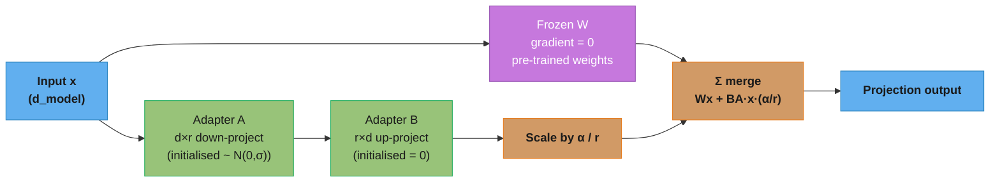

# Fine-Tuning

## 1. Concept Overview

Fine-tuning is the process of taking a pre-trained LLM and continuing its training on a smaller, more targeted dataset to make it better at specific tasks, domains, or behaviors. Rather than training from scratch (weeks and millions of dollars), fine-tuning adapts an existing model in hours or days at a fraction of the cost.

Fine-tuning exploits the fact that pre-training has already done the heavy lifting: the model has learned language, reasoning, and world knowledge. Fine-tuning teaches the model new skills, behaviors, or domain knowledge on top of this foundation — like teaching a well-educated person a specialized skill rather than educating them from birth.

The key innovation of the 2023-2024 era is **parameter-efficient fine-tuning (PEFT)**: instead of updating all billions of parameters, update only a tiny fraction (0.01-1%) via adapter layers or low-rank decompositions. This makes fine-tuning accessible on consumer GPUs.

---

## 2. Intuition

> **One-line analogy**: Fine-tuning is like teaching a well-educated person a specialized skill — you don't start from scratch, you build on existing knowledge.

**Mental model**: A pre-trained model has learned language and world knowledge. Fine-tuning shows it examples of the specific behavior you want — medical Q&A, code completion in a specific style, JSON output format — and adjusts its weights slightly toward that behavior. LoRA (Low-Rank Adaptation) makes this cheap: instead of updating all 7B parameters, you add small adapter matrices that capture the behavior change, updating ~0.1% of parameters.

**Why it matters**: Fine-tuning is what makes general-purpose LLMs into specialized tools. It's the primary technique for domain adaptation (legal, medical, finance), style alignment, and language-specific tuning. QLoRA made fine-tuning possible on a single consumer GPU, democratizing model customization.

**Key insight**: LoRA works because the weight updates during fine-tuning have low intrinsic rank — the change in behavior can be captured by a small low-rank matrix, not the full parameter space.

---

## 3. Core Principles

- **Catastrophic forgetting**: Fine-tuning on new data can cause the model to forget previously learned capabilities. Mitigate with low learning rates, mixing original data, and PEFT.
- **Learning rate**: Fine-tuning requires much lower LR than pre-training (1e-5 to 1e-4 vs 1e-3 to 3e-4). Overly high LR destroys pre-trained representations.
- **Few epochs**: 1-3 epochs is usually enough; more causes overfitting or forgetting.
- **Data quality dominates**: 1000 high-quality examples > 100K low-quality ones.
- **Format alignment**: Training data format must exactly match inference-time prompt format.

---

## 4. Types / Strategies

### 4.1 Full Fine-Tuning

Update all parameters in the model. Most flexible but requires significant memory (same as pre-training) and risks catastrophic forgetting.

**When to use**: Fundamental domain shift (e.g., pre-training a base model on new language); when you have access to large GPU clusters; when adapting every aspect of model behavior.

**Memory requirements**: Same as pre-training (weights + gradients + optimizer states).

### 4.2 LoRA (Low-Rank Adaptation)

The most popular PEFT method. Instead of updating weight matrix W (d × k), add a low-rank adapter:

```
W_adapted = W_frozen + ΔW = W_frozen + B × A

Where:
  W: original frozen weight matrix (d × k)
  A: trainable matrix (r × k) initialized randomly
  B: trainable matrix (d × r) initialized to zeros
  r: rank (hyperparameter, typically 4-64)
  ΔW = B × A has rank ≤ r

Forward pass: h = W_frozen × x + (B × A) × x × scaling_factor
  scaling_factor = alpha / r  (alpha is a hyperparameter)
```

**Memory savings**: For a 7B model, LoRA with r=16 adds ~8M trainable parameters vs. 7B total — 0.1% of parameters trained.

**Key insight**: Weight updates during fine-tuning have low intrinsic rank. LoRA explicitly captures this structure.

**When to use**: Task-specific fine-tuning, style/format adaptation, adding new capabilities to existing model.

### 4.3 QLoRA (Quantized LoRA)

LoRA + quantize the base model to 4-bit NF4:

```
Base model weights: float16 (2 bytes/param) → NF4 quantization (0.5 bytes/param)
Memory saving: 4x for base model weights
LoRA adapters: still trained in BF16

7B model memory:
  Full fine-tune:  ~56GB (weights 14GB + grads 14GB + Adam states 28GB)
  LoRA:            ~28GB (frozen 14GB + LoRA adapters ~0.1GB + gradients)
  QLoRA:           ~6GB  (frozen 3.5GB in 4-bit + LoRA adapters ~0.1GB)
```

QLoRA enables fine-tuning a 7B model on a single 16GB consumer GPU (RTX 4080/4090). This democratized fine-tuning dramatically.

Tradeoff: 4-bit quantization introduces small quality degradation (~1-2% on benchmarks).

### 4.4 Instruction Tuning

Teach the model to follow natural language instructions by fine-tuning on (instruction, response) pairs.

```
Training format example:
  Input:  "### Instruction: Summarize this article in 3 bullet points.
           ### Article: <article text>
           ### Response:"
  Output: "• Main point 1\n• Main point 2\n• Main point 3"
```

Instruction tuning is what transforms a base model (predicts next tokens) into a chat model (follows instructions and answers questions). Fine-tuning on ~1K-100K diverse instruction pairs achieves this.

### 4.5 Domain Adaptation

Fine-tune on domain-specific text to improve performance in a specialized area:

```
Strategies:
1. Continued pre-training on domain text (CLM objective, large corpus)
   Good for: adding domain vocabulary and knowledge
   Example: train on 10B tokens of medical literature

2. Instruction fine-tuning on domain Q&A
   Good for: domain-specific task behavior
   Example: 50K medical Q&A pairs

3. Combination: first continued pre-training, then instruction fine-tuning
   Best results; most data required
```

### 4.6 PEFT Taxonomy

```
PEFT Methods:
  Additive:
    - Adapter layers (Houlsby et al.): small bottleneck FFN inserted after attention
    - Prompt tuning: learn soft prompts prepended to input
    - Prefix tuning: learn prefix tokens for K,V in each attention layer

  Reparameterized:
    - LoRA: low-rank decomposition of weight updates
    - DoRA: weight decomposition into magnitude + direction
    - LoftQ: LoRA with quantization

  Selective:
    - BitFit: only train bias terms (extremely parameter-efficient)
    - Sparse fine-tuning: select top-k most important parameters
```

---

## 5. Architecture Diagrams

### LoRA Applied to a Transformer



Two parallel paths per projection: the frozen base weight (no gradient) plus the low-rank adapter pair BA (α/r). At inference, W + B·A·(α/r) is pre-merged back into a single matrix — zero additional latency.

### QLoRA Memory Layout
```
GPU Memory:
  +---------------------------------+
  | Base Model Weights (NF4 4-bit) |  3.5GB for 7B model
  +---------------------------------+
  | LoRA Adapter A (BF16)          |  ~50MB per layer set
  | LoRA Adapter B (BF16)          |  ~50MB per layer set
  +---------------------------------+
  | Gradients (only LoRA)          |  ~100MB total
  +---------------------------------+
  | Optimizer States (LoRA only)   |  ~400MB total
  +---------------------------------+
  | Activations + batch            |  1-2GB (gradient checkpointing)
  +---------------------------------+
  Total: ~5-6GB for 7B model QLoRA
```

### Memory Footprint by Method
```
Fine-tuning a 7B model — GPU memory by method (each █ ≈ 4 GB):

Full fine-tune  56 GB │██████████████   weights + grads + Adam states (2× A100 40GB)
LoRA  r=16      28 GB │███████          frozen base + adapter grads
QLoRA r=16       6 GB │█▌               4-bit base → fits a 16GB consumer GPU
```
QLoRA's 4-bit base model collapses the footprint ~9× (56 GB → 6 GB) — turning a
two-GPU job into one that runs on a single consumer card. This is the whole reason
fine-tuning became accessible outside research labs.

### Fine-Tuning Pipeline
```
Pre-trained Base Model
          |
          v
[Dataset Preparation]
  Format into prompt template
  Tokenize + create attention masks
  Pack sequences for efficiency
          |
          v
[PEFT Configuration]
  LoRA: target_modules=["q_proj", "v_proj"]
  r=16, alpha=32, dropout=0.05
          |
          v
[Training Loop]
  LR: 2e-4 (LoRA params only)
  Epochs: 2-3
  Batch: 4-16 with gradient accumulation
  Warmup: 3% of steps
          |
          v
[Evaluation]
  Held-out test set
  Task-specific metrics
          |
          v
[Merge + Export]
  Merge LoRA weights into base model
  Export to GGUF / SafeTensors
```

---

## 6. How It Works — Detailed Mechanics

### LoRA Rank Selection

```
r=4:   ~0.05% trainable params; style/format changes; fastest
r=8:   ~0.1% trainable params; good for most instruction tuning
r=16:  ~0.2% trainable params; better for domain adaptation
r=32:  ~0.4% trainable params; complex task learning
r=64:  ~0.8% trainable params; approaching full fine-tune quality; diminishing returns
r=128: ~1.6% trainable params; rarely necessary

Rule of thumb: start with r=16, alpha=32 (alpha = 2×r is common)
```

### Target Modules Selection

Not all modules benefit equally from LoRA. Common choices:

```
Minimal (style tuning):   q_proj, v_proj
Standard (task tuning):   q_proj, k_proj, v_proj, o_proj
Full PEFT:                q_proj, k_proj, v_proj, o_proj, gate_proj, up_proj, down_proj
Embedding:                embed_tokens (for new vocabulary tokens)
```

### Data Formatting

The training data format must match inference exactly:

```python
# LLaMA 3 chat format (must match exactly)
def format_example(instruction, response):
    return f"""<|begin_of_text|><|start_header_id|>system<|end_header_id|>
You are a helpful assistant.<|eot_id|><|start_header_id|>user<|end_header_id|>
{instruction}<|eot_id|><|start_header_id|>assistant<|end_header_id|>
{response}<|eot_id|>"""

# Only compute loss on the response part (not the instruction)
# This is "instruction masking" — critical for good fine-tuning
```

### Merging LoRA Weights

After fine-tuning, LoRA adapters can be merged back into the base model:

```
W_merged = W_frozen + (B × A) × (alpha / r)

Benefits of merging:
  - No inference overhead from adapter
  - Can quantize merged model independently
  - Easier deployment (single model file)

Benefits of keeping separate:
  - Multiple adapters can be swapped at runtime
  - Original weights preserved for future adapters
```

---

## 7. Real-World Examples

### LLaMA → Vicuna (2023)
- Fine-tuned LLaMA 13B on 70K ChatGPT conversations (user-shared)
- Training cost: $300
- Achieved ~90% ChatGPT quality on MT-Bench
- Proved that instruction fine-tuning with high-quality data is the key ingredient

### Mistral → Mistral-7B-Instruct
- Mistral took their base 7B model + supervised fine-tuning on instruction data
- Training largely on internal data + public instruction datasets
- Released alongside base model; showed 7B can match or exceed LLaMA 13B

### CodeLLaMA (Meta, 2023)
- Fine-tuned LLaMA 2 on 500B code tokens (continued pre-training)
- Then instruction fine-tuned on code Q&A pairs
- Added FIM training objective during continued pre-training
- Result: 34B CodeLLaMA outperformed GPT-3.5 on HumanEval

### Domain Fine-Tuning: BloombergGPT
- 50B model trained from scratch on 700B financial tokens + 300B general tokens
- Custom tokenizer with financial vocabulary
- Showed domain-specific pre-training beats general model fine-tuning for finance

---

## 8. Tradeoffs

| Method | VRAM (7B) | Speed | Quality | Forgetting Risk |
|--------|-----------|-------|---------|----------------|
| Full fine-tune | ~56 GB | Slow | Best | High |
| LoRA (r=16) | ~28 GB | Fast | Very good | Low |
| QLoRA (r=16) | ~6 GB | Medium | Good | Low |
| Prefix tuning | ~28 GB | Fast | Moderate | Very low |
| Prompt tuning | ~14 GB | Fastest | Lower | None |

---

## 9. When to Use / When NOT to Use

### Use Fine-Tuning When:
- You need consistent output format (JSON, specific templates)
- Task-specific behavior not achievable with prompting
- Latency-sensitive: fine-tuned smaller model beats larger model + long prompt
- Privacy: can't send data to external API
- Cost: 1000s of similar calls daily make fine-tuning economical

### Use Prompting Instead When:
- Task is well-covered by the base model's instruction following
- Rapid iteration needed (no training cycle)
- Task variety is high (can't fine-tune for every task)
- Dataset is too small (<200 examples of consistent pattern)

### Never Fine-Tune When:
- You don't have high-quality training data
- You haven't first tried prompting (simpler, faster to iterate)
- You want to add knowledge the base model doesn't have (pre-training or RAG is better)
- Budget doesn't support even QLoRA (~$50-200 for 7B)

---

## 10. Common Pitfalls

1. **Wrong prompt format**: Training with Alpaca format then inferring with ChatML format → garbage output. Match exactly.
2. **Learning rate too high**: LoRA with LR=1e-3 destroys base model representations. Use 1e-4 to 3e-4 for LoRA.
3. **Masking labels incorrectly**: Including instruction tokens in loss calculation teaches model to recite prompts.
4. **Too many epochs**: 5+ epochs on small dataset → severe overfitting and memorization.
5. **Forgetting gradient accumulation**: Effective batch size = physical batch × accumulation steps. Small effective batch size → noisy gradients.
6. **Not evaluating against base model**: Fine-tuned model might regress on general tasks. Always compare to base on a diverse benchmark.

---

## 11. Technologies & Tools

| Tool | Purpose | Notes |
|------|---------|-------|
| **HuggingFace PEFT** | LoRA, QLoRA, adapters | Standard PEFT library |
| **Axolotl** | Training framework | Flexible YAML config; most popular for community fine-tuning |
| **Unsloth** | Fast LoRA training | 2x faster than standard PEFT; low VRAM |
| **LLaMA-Factory** | All-in-one fine-tuning | Web UI, many models, easy data format |
| **torchtune** | PyTorch-native fine-tuning | Meta's official tool |
| **TRL (HuggingFace)** | RLHF, DPO, SFT | SFTTrainer, DPOTrainer |
| **BitsAndBytes** | 4/8-bit quantization | Required for QLoRA |
| **DeepSpeed ZeRO** | Memory-efficient training | Works with PEFT |
| **Modal / RunPod** | GPU cloud for fine-tuning | Cheap A100/H100 access |

```python
# QLoRA fine-tuning with PEFT (simplified)
from peft import LoraConfig, get_peft_model
from transformers import BitsAndBytesConfig

bnb_config = BitsAndBytesConfig(
    load_in_4bit=True,
    bnb_4bit_quant_type="nf4",
    bnb_4bit_compute_dtype=torch.bfloat16,
)
lora_config = LoraConfig(
    r=16, lora_alpha=32, target_modules=["q_proj", "v_proj"],
    lora_dropout=0.05, bias="none", task_type="CAUSAL_LM"
)
model = get_peft_model(base_model, lora_config)
```

---

## 12. Interview Questions with Answers

**Q: When should you fine-tune vs. just use prompting?**
A: Fine-tune when: you need consistent output format, the task is highly repetitive at scale (cost justifies training), latency matters (fine-tuned 7B beats prompted 70B), or privacy requires not sending data to external APIs. Use prompting when: rapid iteration needed, task variety is high, dataset is too small, or the base model already handles the task adequately.

**Q: What are the key differences between full fine-tuning and PEFT methods?**
A: Full fine-tuning updates all model parameters — provides maximum quality but requires the same memory as pre-training (~56GB for 7B). PEFT trains 0.1-1% of parameters while freezing the rest — reduces training memory to 6-16GB for 7B models with only 1-3% quality loss. PEFT also reduces catastrophic forgetting risk (frozen weights preserve general knowledge) and enables modular multi-task adapters. For most production fine-tuning, LoRA r=16 is the right default.

**Q: How does fine-tuning differ from RAG for adding domain knowledge?**
A: Fine-tuning bakes knowledge into model weights at training time — static, but fast at inference. RAG injects knowledge dynamically at query time — always current, but adds retrieval latency and cost per query. Fine-tuning is better when: knowledge is stable, the same information is queried millions of times (amortize training cost), or latency prohibits context injection. RAG is better when: knowledge changes frequently, private documents are added continuously, or source attribution is required. Fine-tuning cannot access documents it hasn't seen; RAG can answer about documents added yesterday.

**Q: What is the PEFT landscape — what methods exist and when do you choose each?**
A: Main PEFT methods: LoRA (low-rank decomposition, merges cleanly, default choice), QLoRA (LoRA + 4-bit quantization for memory-constrained training), adapter layers (insert bottleneck modules, always-on inference overhead), prefix tuning (learn soft key/value prefixes, works well at large scale), prompt tuning (learn soft input tokens, only viable above 10B parameters), BitFit (train only biases, very limited quality), DoRA (magnitude+direction decomposition, better quality at same rank as LoRA). See peft_methods.md for the full comparison table.

**Q: When should you fine-tune a model vs rely on prompt engineering?**
Fine-tune when you need consistent format adherence, domain-specific behavior that prompting can't achieve, or when prompt length is eating into your context budget. Prompt engineering is better when: you have fewer than 100 examples, the task changes frequently, or you need quick iteration. Rule of thumb: if your system prompt exceeds 2000 tokens to get the desired behavior, fine-tuning will likely be cheaper and more reliable. Fine-tuning is also better when you need to reduce latency (shorter prompts = faster inference) or improve consistency on structured outputs. However, fine-tuning requires an evaluation pipeline — without proper eval, you can't tell if fine-tuning helped or hurt. Start with prompting, measure the gap, then fine-tune only if prompting falls short.

**Q: How do you select the right LoRA rank for your task?**
LoRA rank determines the capacity of the adaptation — higher rank allows more complex behavior changes but uses more memory and risks overfitting. Rank 4-8 is sufficient for style/format adaptation (e.g., always respond in JSON). Rank 16-32 works well for domain adaptation (legal, medical terminology). Rank 64-128 is needed for significant behavior changes or learning new capabilities. Empirically, rank 16 captures 90%+ of the performance of full fine-tuning for most instruction-following tasks. To select: start with rank 16, evaluate, then try rank 8 (if quality is maintained, use it for efficiency) or rank 32 (if quality is insufficient). Monitor the ratio of LoRA parameter count to training examples — if you have fewer training examples than LoRA parameters, you are almost certainly overfitting. For LLaMA 7B with rank 16 on all linear layers: roughly 20M trainable parameters, so you need at least 20K-50K training examples.

**Q: What is catastrophic forgetting in fine-tuning and how do you prevent it?**
Catastrophic forgetting occurs when fine-tuning on new data causes the model to lose capabilities it had from pre-training — for example, a model fine-tuned on medical data might forget how to write code. Prevention strategies: (1) LoRA/PEFT — by only modifying a small number of parameters, the base model's knowledge is largely preserved; (2) data mixing — include 10-20% of general instruction data alongside domain-specific data during fine-tuning; (3) lower learning rate — use 1e-5 to 5e-5 instead of higher rates; (4) shorter training — monitor evaluation loss and stop when general benchmarks start degrading (typically 1-3 epochs); (5) replay buffer — periodically sample from a general knowledge dataset during training. Measure forgetting by evaluating on both domain-specific metrics AND general benchmarks (MMLU, HumanEval) after each checkpoint. A 2-3% drop in general benchmarks is acceptable if domain performance improves significantly.

**Q: How do you set up proper evaluation during fine-tuning to avoid overfitting?**
Proper evaluation requires held-out test sets that match your production use case, not just training loss monitoring. Setup: (1) split your data into train/validation/test (80/10/10 minimum, never contaminate the test set); (2) define task-specific metrics — for classification: accuracy/F1; for generation: ROUGE, human preference, or LLM-as-judge scoring; (3) evaluate on the validation set every N steps (e.g., every 100 steps or 0.1 epochs); (4) implement early stopping when validation metrics plateau or degrade for 3+ evaluations; (5) track general capability regression by evaluating on MMLU or similar benchmarks alongside domain metrics. Common mistake: only monitoring training loss, which always decreases but does not indicate generalization. For LoRA fine-tuning, overfitting is especially fast with small datasets — a 7B model with rank 16 LoRA on 1K examples will overfit within 2-3 epochs.

**Q: What are the key differences between full fine-tuning and LoRA fine-tuning for production use?**
Full fine-tuning updates all model parameters and requires optimizer states for every parameter, consuming 4-16x the model size in GPU memory. LoRA adds small trainable matrices (0.1-1% of parameters) while freezing the base model. Key production differences: (1) memory — 7B full fine-tune needs approximately 4xA100 80GB; LoRA needs 1xA100; (2) training speed — LoRA is 2-3x faster per step due to fewer gradient computations; (3) quality — full fine-tune is 1-3% better on average but the gap shrinks with higher LoRA rank; (4) serving — multiple LoRA adapters can share a single base model in memory, which is critical for multi-tenant systems; (5) merging — LoRA weights can be merged into base weights for zero-overhead inference. Choose full fine-tune only when maximum quality is critical, you have abundant GPU resources, and you do not need multi-tenant serving. For the vast majority of production cases, LoRA or QLoRA is the right choice.

**Q: How do you handle training data formatting for instruction fine-tuning?**
Training data formatting must exactly match the model's chat template, including special tokens, role markers, and turn separators. Each model family has a specific template — LLaMA 3 uses `<|begin_of_text|><|start_header_id|>system<|end_header_id|>...`, ChatML uses `<|im_start|>system\n...<|im_end|>`. Formatting mistakes are the number one cause of poor fine-tuning results. Best practices: (1) use the tokenizer's built-in `apply_chat_template()` method; (2) verify token IDs manually for the first few examples; (3) ensure special tokens are not masked in the loss (some should be predicted, some should not); (4) include diverse conversation lengths (1-turn, 3-turn, 5-turn); (5) mask the user turns so the model only learns to predict assistant responses. Common mistake: fine-tuning on raw text without proper chat formatting, which confuses the model about when to stop generating and how to handle multi-turn conversations.

---

## Method Deep-Dives

Each fine-tuning method has a comprehensive standalone reference with 10+ senior-AI-engineer-level Q&As:

| Method | File | Key Topics |
|--------|------|-----------|
| LoRA | [lora.md](lora.md) | Low-rank decomposition math, rank selection, alpha, target modules, merge |
| QLoRA | [qlora.md](qlora.md) | NF4 4-bit quantization, double quantization, paged Adam, memory layout |
| Instruction Tuning | [instruction_tuning.md](instruction_tuning.md) | (instruction, response) pairs, label masking, prompt templates, data curation |
| Domain Adaptation | [domain_adaptation.md](domain_adaptation.md) | Continued pre-training, domain-then-instruct pipeline, catastrophic forgetting |
| PEFT Methods | [peft_methods.md](peft_methods.md) | Adapter layers, prefix tuning, prompt tuning, BitFit, DoRA, comparison table |

---

## 13. Best Practices

1. **Match training and inference formats exactly** — including special tokens, whitespace, and template structure.
2. **Mask loss on instruction tokens** — only compute loss on the response portion.
3. **Start with r=16 and tune from there** — r=16 is a reliable default; increase if quality is insufficient.
4. **Use cosine LR schedule** — warmup for 3% of steps, cosine decay to 10% of peak.
5. **Pack sequences** — group short examples into full-length sequences to maximize GPU efficiency.
6. **Evaluate regression continuously** — track both task-specific metrics and general capability benchmarks.
7. **Save checkpoints** — save every 500-1000 steps; choose best checkpoint by validation loss, not final checkpoint.

---

## 14. Case Study: Fine-Tuning LLaMA 3 8B for SQL Generation

**Goal:** Build a model that converts natural language to SQL queries for a specific database schema. Target: 90%+ execution accuracy on a held-out test set.

**Data:**
- 5000 (question, SQL) pairs generated with GPT-4 (verified by running against test DB)
- 1000 pairs annotated by human SQL experts
- Split: 5400 train / 600 test

**Configuration:**
```yaml
base_model: meta-llama/Meta-Llama-3-8B-Instruct
training:
  method: QLoRA
  r: 32
  alpha: 64
  target_modules: [q_proj, k_proj, v_proj, o_proj, gate_proj, up_proj, down_proj]
  learning_rate: 2e-4
  epochs: 3
  batch_size: 4
  gradient_accumulation: 8  # effective batch = 32
  warmup_ratio: 0.03
  lr_scheduler: cosine

hardware:
  gpu: 1x A100 40GB
  training_time: ~4 hours
  cost: ~$12
```

**Results:**
| Model | Exec Accuracy | Speed |
|-------|--------------|-------|
| GPT-4 (few-shot, 5 examples) | 78% | 3s/query |
| LLaMA 3 8B base | 45% | 0.3s/query |
| LLaMA 3 8B fine-tuned | 91% | 0.3s/query |
| GPT-4 fine-tuned | 94% | 2s/query |

**Winner**: Fine-tuned 8B model — 91% accuracy at 10x lower latency and 100x lower cost than GPT-4.

---

**Additional war story — LoRA adapter rank mismatch causing silent quality regression after merge:**

A medical Q&A product fine-tuned a 7B model with LoRA rank=16. After merging the adapter into the base weights for serving (`model.merge_and_unload()`), inference latency dropped from 220ms to 140ms as expected. However, accuracy on the held-out medical eval set dropped from 91% to 83% — the team discovered that the merge was performed on a quantized (INT8) checkpoint rather than the original BF16 checkpoint. Quantization error compounded with LoRA weight injection caused silent degradation.

```python
# BROKEN: merging LoRA adapter into a post-quantized model
from peft import PeftModel
import torch

base = AutoModelForCausalLM.from_pretrained(
    "meta-llama/Llama-3-8B",
    load_in_8bit=True,  # BUG: quantized before merge
    device_map="auto",
)
model = PeftModel.from_pretrained(base, "./medical_lora_adapter")
merged = model.merge_and_unload()  # merges into INT8 weights — precision loss

# FIX: always merge in BF16, quantize after merge
base_bf16 = AutoModelForCausalLM.from_pretrained(
    "meta-llama/Llama-3-8B",
    torch_dtype=torch.bfloat16,  # full precision for merge
    device_map="cpu",
)
model_bf16 = PeftModel.from_pretrained(base_bf16, "./medical_lora_adapter")
merged_bf16 = model_bf16.merge_and_unload()
merged_bf16.save_pretrained("./merged_bf16")

# Then quantize the merged model separately with GPTQ or bitsandbytes
```

**Additional interview Q&As:**

**When should you choose LoRA rank=4 vs rank=64 for fine-tuning?** Rank=4 is sufficient for style adaptation and instruction following on a well-pretrained model; rank=16-32 is appropriate for domain vocabulary adaptation (medical, legal); rank=64 is needed for significant capability expansion (teaching a model new reasoning patterns). Higher rank uses more GPU memory (rank=64 adds ~2% of 7B model parameters) and trains faster to convergence but risks overfitting on small datasets under 10,000 examples.

**What is the difference between instruction tuning and domain adaptation in fine-tuning?** Instruction tuning trains the model to follow natural language commands using instruction-response pairs (e.g., Alpaca format) and primarily improves the model's output style and safety behavior without changing domain knowledge. Domain adaptation fine-tunes on domain-specific text (medical literature, legal contracts, code) and primarily improves the model's knowledge accuracy and terminology use in that domain. Production fine-tuning pipelines often combine both: domain adaptation first, then instruction tuning on domain-specific QA pairs.

**How do you prevent catastrophic forgetting when fine-tuning a general-purpose model on a narrow domain?** Use LoRA or QLoRA instead of full fine-tuning (freezes base weights); add replay examples from the original pretraining distribution mixed into the fine-tuning batch (5-10% replay ratio); monitor performance on a held-out general benchmark (MMLU or HellaSwag) alongside the domain eval set and stop training if general benchmark drops more than 3%. EWC (Elastic Weight Consolidation) is theoretically sound but rarely used in practice due to the overhead of computing Fisher information matrices for 7B+ models.

**Quick-reference table:**

| Approach | Best for | Trade-off |
|---|---|---|
| LoRA rank=8, alpha=16 | Style/instruction adaptation | Insufficient for heavy domain knowledge injection |
| QLoRA (4-bit base + BF16 adapters) | Fine-tuning 70B models on single A100 | 15-20% slower training than BF16 full LoRA; merge step requires BF16 reconstruction |
| Full fine-tuning (last 2 layers only) | Adjusting output format/tokenizer head | Risks forgetting; only practical for models under 3B parameters |
| Adapter merging with SLERP | Combining domain adapter + chat adapter | Interpolation ratio must be tuned (0.5 is not always optimal); evaluate both endpoints first |

**Pitfall — LoRA rank too low causes underfitting on complex domain tasks.**

```python
# BROKEN: rank=4 LoRA for medical Q&A fine-tuning — too few trainable params
# to capture medical terminology patterns; validation accuracy plateaus at 61%
from peft import LoraConfig, get_peft_model

config = LoraConfig(r=4, lora_alpha=8, target_modules=["q_proj", "v_proj"])
# Only 2M trainable params on a 7B model → underfits on 50k medical QA pairs

# FIX: increase rank to 16-32 for complex domain; target more modules
config = LoraConfig(
    r=32,                    # 4→32: 8× more trainable params
    lora_alpha=64,           # keep alpha = 2× rank for stable training
    target_modules=["q_proj", "k_proj", "v_proj", "o_proj"],  # all attention
    lora_dropout=0.1,
)
# Trainable params: 32M (0.4% of 7B) → validation accuracy 78% (+17pp)
```

**How do you decide between LoRA, QLoRA, and full fine-tuning?** Full fine-tuning updates all parameters — highest accuracy ceiling but requires multi-GPU (70B model needs 560GB at FP32). LoRA adds low-rank adapters (0.1-1% of params) — fits in 1-2 GPUs for 7B, minimal accuracy loss for knowledge tasks. QLoRA applies LoRA on a 4-bit quantized base model — enables 70B fine-tuning on a single A100 80GB, 1-3pp accuracy loss vs. LoRA. Rule of thumb: QLoRA for resource-constrained fine-tuning of large models; LoRA for medium models (7B-13B) with moderate data; full fine-tuning only when you have both data (1M+ examples) and compute, and need maximum task-specific accuracy.

**What is catastrophic forgetting in fine-tuning and how do you mitigate it?** Catastrophic forgetting occurs when a model fine-tuned on a narrow task loses general capabilities — a medical LLM stops being able to write code or follow general instructions. Mitigations: (1) mix general instruction data (5-10%) with domain-specific data during fine-tuning; (2) use LoRA/PEFT — adapters preserve base model weights, so forgetting is limited to adapter behavior; (3) evaluate on a held-out general benchmark (MMLU, HellaSwag) alongside the domain task after each epoch — stop when general performance drops > 2pp.

---

**Quick-reference decision table:**

| Scenario | Recommended approach | Key constraint |
|---|---|---|
| < 10k training examples | LoRA / few-shot prompting | Data scarcity |
| Latency < 100ms required | Quantized model + ONNX Runtime | Throughput > accuracy |
| Multi-tenant, shared model | System prompt isolation + guardrails | Security boundary |
| Domain shift from pre-training | Fine-tune with domain data | Catastrophic forgetting risk |
| Cost reduction (10× target) | Smaller model + prompt optimization | Quality floor |

**Production checklist before shipping an LLM feature:**

- [ ] Latency p99 measured under production load (not just median)
- [ ] Fallback path tested: what happens when the LLM API is unavailable?
- [ ] Cost per request calculated at current and 10× scale
- [ ] Safety/guardrail evaluation on 200 adversarial prompts
- [ ] Prompt versioned in code and tied to model version in experiment tracker
- [ ] Human evaluation on 50 random production outputs before launch
- [ ] Monitoring dashboard live: latency, error rate, cost, quality proxy metric

**Interview Q&A supplement:**

**How do you measure the real-world impact of a code generation feature beyond pass@k?** Track production metrics: (1) acceptance rate — what fraction of shown completions are accepted by developers (industry baseline: 25-35%); (2) retention rate — of accepted completions, how many survive the next commit without modification (high quality = > 70%); (3) time-to-completion — does the developer ship features faster? Measure via A/B test: feature team vs. control team, track story-point velocity over 8 weeks. These business metrics matter more than HumanEval pass@1 for evaluating real impact.

**What is test-driven development integration for code generation agents?** An agentic code generation loop: (1) generate code from the spec; (2) run tests against it; (3) feed failing test output back to the model as context; (4) iterate until tests pass or N retries exceeded. SWE-agent and OpenHands use this pattern and achieve 20-35% solve rate on SWE-bench — dramatically higher than single-shot generation (~2%). The key engineering challenge: sandboxing (tests must run in an isolated environment that can't damage the host), test timeout enforcement (infinite loops in generated code must be killed), and retry budget management (each iteration costs tokens + time).

**Key metric targets for production LLM systems:**

| Metric | Typical target | How to measure |
|---|---|---|
| Latency p99 | < 2s for chat, < 500ms for autocomplete | Prometheus histogram |
| Token cost per request | < $0.01 for most applications | Track input+output tokens × price |
| Hallucination rate | < 5% on factual tasks | LLM-as-judge on sampled outputs |
| Context utilization | > 60% of max context used | Avg tokens / max_context |
| Cache hit rate | > 30% with prompt caching | Cache hit counter / total requests |

---

## See Also
- [Supervised Learning (ML)](../../ml/supervised_learning/README.md) — transfer learning theory, loss functions, regularization — foundational to understanding fine-tuning
