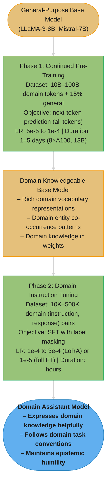

# Domain Adaptation

## 1. Concept Overview

Domain adaptation is the process of making a general-purpose LLM perform significantly better on a specialized domain — medical, legal, financial, scientific, code — through targeted fine-tuning. The domain may have specialized vocabulary, reasoning patterns, stylistic conventions, or factual content that wasn't well-represented in the base model's pre-training data.

Two primary techniques: (1) continued pre-training (CPT) on a large domain corpus using the standard causal language modeling (CLM) objective — teaches the model domain vocabulary, entities, and knowledge structures; (2) domain-specific instruction tuning — teaches the model domain-specific task behavior and style. The most effective approach is the "domain-then-instruct" pipeline: CPT first (add domain knowledge), then instruction tuning (teach domain-specific behavior).

---

## Intuition

> **One-line analogy**: Domain adaptation is like sending an intelligent generalist to medical school — they already have reasoning and language skills; you're adding specialized knowledge on top.

**Mental model**: A general-purpose LLM trained on web data has seen some medical text, but it's a tiny fraction of the training corpus. Medical concepts, drug names, clinical abbreviations, ICD codes, and clinical reasoning patterns are underrepresented. Continued pre-training on 100B tokens of medical literature teaches the model to predict medical text with high accuracy — the model learns medical vocabulary, frequent co-occurrences, and medical knowledge structures. Then instruction tuning on medical Q&A teaches it to apply this knowledge in a clinician-helpful way.

**Why it matters**: General LLMs underperform domain-expert humans on specialized tasks not because they lack intelligence, but because they lack domain-specific knowledge and conventions. Domain adaptation bridges this gap at a fraction of the cost of training from scratch.

**Key insight**: Continued pre-training and instruction tuning are complementary — CPT adds knowledge capacity; instruction tuning teaches the model to express that knowledge correctly. Doing only one of the two is significantly less effective than the combination.

---

## 2. Core Principles

- **Continued pre-training teaches knowledge; instruction tuning teaches behavior**: CPT learns domain vocabulary, facts, and structures. Instruction tuning learns domain-specific response style, format, and task handling.
- **Catastrophic forgetting is the primary risk**: Fine-tuning on domain data can cause the model to lose general capabilities. Mitigation: low LR, PEFT, data mixing.
- **Domain data quality matters more than quantity**: A 10B token high-quality medical corpus (peer-reviewed literature, clinical notes) produces better domain adaptation than 100B tokens of scraped web text tagged as "medical."
- **Tokenizer alignment**: If the domain has high-frequency vocabulary not in the base tokenizer's vocabulary, every domain-specific term requires multiple tokens — creating inefficiency and subtle meaning representation issues.
- **Evaluation requires domain experts**: General LLM benchmarks don't capture domain-specific accuracy; domain-expert-designed evaluations are the ground truth.

---

## 3. How It Works — Detailed Mechanics

### 3.1 Continued Pre-Training (CPT)

Standard next-token prediction on large domain corpora:

```python
from transformers import AutoModelForCausalLM, AutoTokenizer, TrainingArguments, Trainer
from datasets import load_dataset

# Load base model
model = AutoModelForCausalLM.from_pretrained("meta-llama/Meta-Llama-3-8B")
tokenizer = AutoTokenizer.from_pretrained("meta-llama/Meta-Llama-3-8B")

# Domain corpus (packed into sequences)
domain_dataset = load_dataset("path/to/medical_corpus")

def tokenize_and_pack(examples, block_size=2048):
    """Tokenize and pack into fixed-length sequences for efficient CPT."""
    tokenized = tokenizer("\n\n".join(examples["text"]))
    total = len(tokenized["input_ids"])
    result = {
        "input_ids": [tokenized["input_ids"][i:i+block_size]
                     for i in range(0, total - block_size + 1, block_size)]
    }
    result["labels"] = result["input_ids"].copy()  # CLM: labels = input_ids
    # No label masking — predict ALL tokens (this is pre-training, not SFT)
    return result

# CPT training arguments
training_args = TrainingArguments(
    output_dir="./medical-llama-cpt",
    per_device_train_batch_size=4,
    gradient_accumulation_steps=16,  # effective batch = 64
    learning_rate=1e-4,              # lower than initial pre-training; higher than SFT
    num_train_epochs=1,              # typically 1 epoch over large corpus
    lr_scheduler_type="cosine",
    warmup_ratio=0.01,
    bf16=True,
    save_steps=1000,
    logging_steps=100,
    # Data mixing: interleave domain data with general data
)
```

CPT learning rate selection:
```
Initial pre-training:    1e-3 to 3e-4 (high LR for learning from scratch)
Continued pre-training:  5e-5 to 1e-4 (moderate LR; don't disrupt existing weights too much)
Instruction tuning:      1e-4 to 3e-4 for LoRA (very fine adjustment)

Why CPT uses higher LR than SFT:
  CPT changes substantial domain knowledge representations
  SFT adjusts behavioral patterns with minimal knowledge changes
```

### 3.2 Data Mixing Strategy

Pure domain corpus fine-tuning without mixing causes catastrophic forgetting:

```
Pure domain training (wrong for CPT):
  100% medical text → model forgets general language patterns
  After CPT: "What is the capital of France?" → garbled response
  After CPT: Coding tasks → significantly degraded

Data mixing (correct):
  Mix domain corpus with general instruction data
  Typical ratios:
    Conservative: 80% domain + 20% general
    Aggressive:   95% domain + 5% general

  Why mixing works:
    5-20% general data provides enough gradient signal
    to maintain general capabilities
    100% domain data overwhelms this signal

Mixing implementation:
  from datasets import interleave_datasets
  mixed_dataset = interleave_datasets(
      [domain_dataset, general_dataset],
      probabilities=[0.85, 0.15],
      seed=42
  )
```

### Choosing the Mix Ratio — the Pareto Tradeoff
```
General-data mix % trades off two things (legal-CPT ablation; bars NOT same scale):

mix%   forgetting: MMLU drop       domain gain: LegalBench F1
  5%   ████████ -8.1%              █████████ +18.3%
 10%   █████ -5.4%                 █████████ +17.1%
 15%   ████ -4.3%                  ████████ +16.8%
 20%   ██ -2.1%                    ████████ +16.2%   ◄ knee (Pareto-optimal)
 30%   █ -0.9%                     ███████ +13.7%
```
Raising the mix shrinks forgetting fast while domain gain barely moves — until 30%,
where the gain finally drops off. 20% is the knee: near-minimal forgetting while
keeping almost the full domain improvement. Below 10%, forgetting is unacceptable.

### 3.3 The Domain-Then-Instruct Pipeline

The most effective domain adaptation approach:

```
Phase 1: Continued Pre-Training
  Input: base model (LLaMA-3-8B)
  Data: 1B-100B tokens of domain text (+ 15% general mix)
  Objective: CLM (next-token prediction on all tokens)
  LR: 5e-5 to 1e-4
  Duration: 1-3 days on 8× A100
  Output: domain-knowledgeable base model

  Examples of phase 1 data:
    Medical: PubMed papers, clinical trial reports, medical textbooks,
             clinical notes (de-identified), drug monographs
    Legal:   Legal opinions, statutes, contracts, legal textbooks
    Finance: 10-K/10-Q filings, financial news, analyst reports, textbooks

Phase 2: Domain-Specific Instruction Tuning
  Input: phase 1 domain base model
  Data: 10K-500K domain-specific (instruction, response) pairs
  Objective: SFT (CLM with label masking on instruction tokens)
  LR: 1e-4 to 3e-4 (LoRA) or 1e-5 (full FT)
  Duration: hours on 1-4× A100
  Output: domain-specific assistant model

  Examples of phase 2 data:
    Medical: Clinical Q&A pairs, diagnosis differential questions,
             drug interaction questions, medical documentation tasks
    Legal:   Contract analysis, case law Q&A, legal research tasks
    Finance: Financial analysis Q&A, earnings summary tasks, risk assessment

Why this ordering?
  CPT builds vocabulary and knowledge → instruction tuning can express it
  If instruction-only: model doesn't know domain facts, even if it wants to express them
  If CPT-only: model knows domain facts but expresses them like training text (not user-friendly)
```

### 3.4 Catastrophic Forgetting Mitigation

```
Forgetting symptoms:
  - Model can't answer simple general questions ("What's 2+2?")
  - Coding ability degrades significantly
  - English grammar errors appear in responses
  - Model reverts to domain-text style (no longer follows instructions)

Mitigation strategies (use in combination):

1. PEFT (LoRA for CPT):
   Freeze base weights → forgetting impossible
   But: CPT requires more full-weight update signal for deep domain shift
   Compromise: LoRA at r=64 or r=128 for CPT if forgetting is a concern

2. Low learning rate:
   CPT LR: 5e-5 (conservative) instead of 1e-4 (aggressive)
   Lower LR → smaller per-step weight changes → less forgetting

3. Data mixing (most effective):
   15-20% general data in CPT mix
   Continuously provides gradient signal to maintain general capabilities

4. EWC (Elastic Weight Consolidation):
   Penalize changes to weights that were important for previous tasks
   Compute Fisher information matrix → high-importance weights change less
   Rarely used in practice: computationally expensive; data mixing is simpler

5. Replay buffer:
   Mix a small fraction (5-10%) of original pre-training data
   With domain data during CPT
   Exact original data may not be available; use similar general corpus (C4, The Pile)

6. Evaluation during training (most practical):
   Monitor general benchmarks (MMLU, GSM8K) at each checkpoint
   Stop training or reduce LR if general capability degrades >5%
```

### 3.5 Tokenizer Adaptation

For domains with high-frequency specialized vocabulary:

```
Problem:
  Tokenizer trained on general web text splits domain terms:
  "myocardial" → ["my", "ocard", "ial"] (3 tokens)
  "BRCA1" → ["BR", "CA", "1"] (3 tokens)
  "COVID-19" → ["CO", "VID", "-", "19"] (4 tokens)

  Each split term consumes more context window space
  And the model must learn the relationship between sub-tokens to understand the term

Domain-specific tokenizer extension:
  1. Identify high-frequency domain terms (>1000 occurrences in domain corpus)
  2. Add them as new vocabulary tokens
  3. Initialize their embeddings (input embedding + output embedding):
     Option A: average of existing sub-token embeddings
     Option B: random initialization (requires more training to learn)
  4. Continue pre-training with expanded vocabulary

  When worth it:
    - Domain has extremely specialized vocabulary (genomics, chemistry)
    - Context window is a constraint (many multi-token domain terms waste window)
  When NOT worth it:
    - Domain vocabulary overlap with general English is high
    - Adding vocab changes the tokenizer structure (complicates deployment)
```

---

## 4. Architecture Diagram

### Domain-Then-Instruct Pipeline



Skipping Phase 1 (pure instruction tuning on a general base) risks the model hallucinating domain facts it never learned — Phase 1 first writes domain knowledge into weights, Phase 2 teaches the model how to express it helpfully.

### Forgetting Risk by Training Approach
```
Risk Level:
High   |  Pure domain full FT (no mixing)
       |
       |  Domain full FT with data mixing
       |
Medium |  Domain LoRA (r=64) without mixing
       |
       |  Domain LoRA (r=16) with mixing
       |
Low    |  Domain instruction tuning only (no CPT)
         ──────────────────────────────────────────→
                    Increasing Intervention
```

---

## 5. Real-World Examples

### BioMedGPT / BioMedLM (Stanford CRFM)
- LLaMA-2 base + continued pre-training on PubMed abstracts + full texts
- 2.7B medical tokens in CPT phase
- Then instruction tuning on medical Q&A pairs
- Achieved strong performance on USMLE Step 1 questions

### BloombergGPT (Bloomberg, 2023)
- 50B parameter model trained from scratch on 700B financial tokens + 300B general tokens
- Not domain adaptation — built from scratch with mixed training
- Key insight: domain-specific pre-training from scratch beats general model fine-tuning for heavily specialized vocabulary (financial tickers, instruments, jargon)
- Sets the upper bound for what domain adaptation is reaching toward

### CodeLLaMA (Meta, 2023)
- LLaMA-2 base + 500B code token continued pre-training
- Then instruction fine-tuning on code Q&A pairs
- Long context fine-tuning (2K → 100K context for code navigation)
- Result: CodeLLaMA 34B outperformed GPT-3.5 on HumanEval

---

## 6. Tradeoffs

| Approach | Domain Knowledge | General Capability | Cost | When to Use |
|----------|-----------------|-------------------|------|------------|
| General model + prompting | Base level | Full | None | Domain is adjacent to general |
| Instruction tuning only | Base + task format | Good | Low | Behavior not knowledge needed |
| CPT only | High | Moderate risk | High | Knowledge without conversational need |
| CPT + instruction tuning | Excellent | Good (with mixing) | High | Production domain assistant |
| Train from scratch | Optimal | Limited to training mix | Very High | Extreme specialization (Bloomberg) |

---

## 7. When to Use / When NOT to Use

### Use Full Domain-Then-Instruct When:
- Target domain has substantially different vocabulary from web text (medical, legal, code)
- Downstream tasks require deep domain knowledge, not just behavior adaptation
- Budget and time allow both CPT and instruction tuning phases

### Use Instruction Tuning Only When:
- Domain vocabulary is mostly covered by the base tokenizer
- Task is primarily about format/style/behavior rather than knowledge
- Budget is limited; instruction tuning is 10-100× cheaper than CPT

### Do Not Use Domain Adaptation When:
- RAG can provide the domain knowledge at query time (more flexible, cheaper)
- Domain changes frequently (CPT must be re-run to update knowledge)
- General model + few-shot prompting achieves >80% of the target quality

---

## 8. Common Pitfalls

**1. No data mixing during CPT**
100% domain corpus causes severe catastrophic forgetting. After CPT, the model loses general instruction-following ability.
Fix: Always mix 15-20% general data (The Pile, C4, or similar) with domain corpus during CPT.

**2. CPT LR too high**
Using the base model's initial pre-training LR (3e-4) for continued pre-training causes rapid overwriting of existing representations.
Fix: Use 5e-5 to 1e-4 for CPT. Lower LR preserves existing general knowledge while still allowing domain knowledge acquisition.

**3. Domain corpus not deduped**
Web-scraped domain corpora often contain exact or near-duplicate documents (republished articles, syndicated content). Training on duplicates wastes compute and can cause memorization.
Fix: Apply MinHash/LSH deduplication at the document level before CPT. Remove documents with >80% n-gram overlap with other documents in the corpus.

**4. Skipping evaluation of forgetting**
Teams apply CPT and instruction tuning but never measure general capability regression.
Fix: Evaluate on MMLU, GSM8K, and a coding benchmark (HumanEval or similar) after each CPT checkpoint. Track the degradation and stop if >10% regression on general benchmarks.

**5. Instruction tuning dataset too narrow**
Domain instruction tuning with only Q&A pairs → model handles Q&A well but struggles with summarization, extraction, and other domain tasks.
Fix: Include diverse domain task types: Q&A, summarization, entity extraction, classification, data formatting, comparison, reasoning chains. Minimum 10-15 distinct task types.

**6. Confusing CPT with instruction tuning for forgetting mitigation**
LoRA is highly effective for preventing forgetting during instruction tuning (frozen base weights). For CPT, LoRA is less effective because shallow adapter matrices can't capture the deep knowledge changes needed for significant domain shifts.
Fix: For CPT, use either full fine-tuning with data mixing, or high-rank LoRA (r=64 to r=128) if memory is constrained. For instruction tuning, standard r=16 LoRA is appropriate.

---

## 9. Technologies & Tools

| Tool | Purpose | Notes |
|------|---------|-------|
| **MosaicML/LLM Foundry** | CPT training at scale | Optimized for large-scale CPT; FSDP, streaming datasets |
| **HuggingFace Trainer** | Small/medium CPT | Standard; works for CPT on single-node setups |
| **Axolotl** | CPT + SFT combined | Handles both phases; YAML config for reproducibility |
| **megatron-LM** | Large-scale CPT | Industry standard for 70B+ model CPT |
| **The Pile** | General mix dataset | Open source; used for anti-forgetting mixing |
| **PubMed** | Medical domain corpus | 35M+ abstracts; full text via PMC |
| **SEC EDGAR** | Financial domain corpus | All public company filings |
| **GitHub Code** | Code domain corpus | Multi-language code for code-focused CPT |
| **MinHash** | Corpus deduplication | Essential for domain corpus quality |

---

## 10. Interview Questions with Answers

**Q: What is catastrophic forgetting and how do you prevent it?**
A: Catastrophic forgetting occurs when fine-tuning on new data causes the model to lose previously learned capabilities — a model fine-tuned heavily on medical text may forget how to reason about code or answer general factual questions. Prevention: (1) Data mixing — include 15-20% general text during CPT; this is the most effective, simplest approach; (2) LoRA/PEFT — frozen base weights literally cannot be forgotten since they're never updated, though PEFT's protection is weaker for CPT than for SFT; (3) Low learning rate — 5e-5 to 1e-4 for CPT vs. 3e-4 for initial pre-training; smaller updates preserve existing representations; (4) EWC (Elastic Weight Consolidation) — penalizes changes to high-importance weights, though rarely used in practice due to compute cost; (5) Continuous evaluation — monitor general benchmarks throughout training and stop at first sign of >5-10% regression.

**Q: When should you choose continued pre-training over just instruction tuning for domain adaptation?**
A: Continued pre-training is warranted when the domain has substantial vocabulary, factual knowledge, or reasoning patterns not well-represented in the base model's training data. Signals: the base model makes factual errors on domain-specific questions even with few-shot prompting; domain terminology is split into many sub-tokens by the tokenizer; domain-specific reasoning chains (clinical differential diagnosis, legal precedent reasoning) are absent from base model outputs. Examples warranting CPT: genomics (specialized gene names, pathways), clinical medicine (ICD codes, drug names, clinical note style), financial modeling (instrument types, regulatory filings). When CPT is unnecessary: domain vocabulary is mostly common English (customer service, HR), the task is purely behavioral (formatting, tone adjustment), or RAG can provide domain knowledge at query time more flexibly.

**Q: How does the domain-then-instruct pipeline compare to simultaneous training?**
A: Domain-then-instruct (CPT first, SFT second) consistently outperforms simultaneous training on both phases combined. The reason: CPT requires different training dynamics (higher LR, no label masking, sequence-packed datasets) than SFT (lower LR, label masking, instruction-response pairs). Attempting to do both simultaneously requires a curriculum that serves neither objective well. Additionally, CPT trains on millions of domain documents (building foundational knowledge), while SFT requires relatively few high-quality examples (teaching behavior). Sequential training allows each phase to be optimized independently. The exception: for very small domain shifts, a single instruction tuning phase on domain-specific examples (without CPT) is simpler and often sufficient — reserve the domain-then-instruct pipeline for significant domain shifts.

**Q: How do you construct a high-quality domain corpus for continued pre-training?**
A: Five steps. First, sourcing: identify authoritative domain sources — peer-reviewed journals for medical (PubMed), regulatory filings for financial (SEC EDGAR), court decisions for legal. Second, deduplication: apply MinHash/LSH to remove near-duplicate documents; domain corpora have high redundancy (syndicated articles, republished content). Third, quality filtering: remove documents below a quality threshold using perplexity scoring or heuristics (length filters, language detection, HTML artifact removal). Fourth, decontamination: check that no evaluation benchmark examples appear in the training corpus. Fifth, general data mixing: include 15-20% of high-quality general text (The Pile, C4) to prevent catastrophic forgetting. Typical domain CPT corpus: 5B-100B tokens after filtering.

**Q: What are the signs that your domain adaptation has caused catastrophic forgetting?**
A: Four primary signals. (1) General benchmark regression: MMLU or GSM8K score drops >10% from the base model baseline — direct measurement of general capability loss. (2) Instruction format failures: model no longer follows the instruction template correctly; reverts to completion-style text generation; ignores system prompts. (3) Code/reasoning degradation: model struggles with tasks it handled well before adaptation (code generation, multi-step math reasoning). (4) Language quality degradation: sentences become stilted or ungrammatical; response quality on general topics degrades noticeably in human evaluation. Prevention is far easier than recovery — always monitor these metrics during training, not after.

**Q: How do you decide on the right amount of domain data for CPT?**
A: Depends on the target domain knowledge gap and data availability. Framework: (1) Train a baseline model (instruction tuning only, no CPT) and measure domain benchmark accuracy; (2) Run CPT with 100M, 1B, 10B domain tokens (with identical instruction tuning afterwards); (3) Plot domain accuracy vs. CPT data volume; (4) Find the elbow where marginal improvement drops below 2-3%. For most domains: 1B-5B domain tokens is the sweet spot for 7B-13B models; beyond 10B tokens, improvement is minimal and forgetting risk increases. For extreme specialization (e.g., genomics, rare disease): 10B-50B tokens may be needed to adequately cover rare terminology and reasoning patterns.

**Q: How do you handle domain data that is partly confidential (e.g., patient records)?**
A: Three strategies depending on the sensitivity. First, synthetic data generation: use GPT-4 to generate synthetic domain data that matches the structure and patterns of real data without actual private content. For clinical notes: generate 10,000 synthetic de-identified clinical notes with realistic medical content. Second, federated learning: train on-premise where data lives, without centralizing private data; average gradients across multiple organizations without sharing raw data. Third, strict de-identification + data use agreements: for data that can be de-identified, apply rigorous de-identification (replace names, dates, MRNs, locations with synthetic values) and ensure data use agreements permit ML training. For HIPAA-covered clinical notes: option 3 is most common in practice; option 1 (synthetic) is increasingly viable with high-quality LLMs.

**Q: What is the relationship between tokenizer vocabulary coverage and domain adaptation quality?**
A: Poor tokenizer vocabulary coverage causes domain terms to be split into many subword tokens, creating two problems: (1) context window inefficiency — 4 tokens per medical term vs. 1 means 4× more context consumed for domain content; (2) semantic representation imprecision — the model must learn that ["my", "ocard", "ial"] as a sequence means "myocardial" rather than just having a single "myocardial" token. For most domains (medical, legal, financial), tokenizer coverage is adequate because base tokenizers are trained on enough domain text to include common medical/legal terms as single tokens. Tokenizer extension is only justified when: domain terms appear thousands of times in the domain corpus but are still split; and the context window is a practical bottleneck for domain tasks.

**Q: How should you evaluate whether your domain adaptation was successful?**
A: Three evaluation levels. (1) Domain knowledge benchmarks: domain-specific multiple-choice or Q&A tests (USMLE for medical, bar exam passages for legal, CFA questions for finance). Measure accuracy before and after domain adaptation. Target: >15-20% improvement over base model. (2) Downstream task performance: measure accuracy on the actual production tasks (clinical note summarization accuracy, legal contract clause extraction F1, financial entity extraction precision/recall). (3) Human expert evaluation: domain experts rate a random sample of 100 model outputs on accuracy, relevance, and appropriate epistemic uncertainty. Expert evaluation catches failure modes that automated metrics miss. Always separate evaluation from training: no evaluation example should appear in the training set.

**Q: What is the difference between domain adaptation and task-specific fine-tuning?**
A: Domain adaptation: broader, changes the model's knowledge and vocabulary representation for an entire domain. Targets: the model should know more about domain entities, use domain terminology correctly, reason in domain-appropriate ways. Takes weeks of CPT + days of SFT. Task-specific fine-tuning: narrower, teaches the model a specific task format and behavior within a domain or across domains. Targets: consistent output format, specific task handling, particular persona. Takes hours of SFT. Example: medical domain adaptation = teaching the model clinical medicine broadly. Medical task-specific fine-tuning = teaching the model to produce ICD-10 codes from clinical text. In practice: domain adaptation first (if the domain gap is large), then task-specific fine-tuning to target the specific production task.

**Q: What is the recommended ratio of domain data to general data during continued pre-training?**
A: A mix of 80-90% domain data and 10-20% general data is the practical sweet spot for most continued pre-training runs. The exact ratio depends on domain corpus volume: if the domain corpus is small (under 1B tokens), use 80% domain / 20% general to ensure sufficient domain signal; if the domain corpus is large (10B+ tokens), 90% domain / 10% general provides enough general gradient signal to prevent forgetting while maximizing domain knowledge acquisition. Pure domain training (100% domain, 0% general) almost always causes measurable catastrophic forgetting — even 5% general data makes a significant difference. The mixing is performed at the dataset interleaving level, not as separate training phases, so the model sees general examples continuously throughout CPT rather than in a separate pass.

**Q: How do you detect and measure catastrophic forgetting during domain adaptation?**
A: Track MMLU (general knowledge), HumanEval (code generation), and MT-Bench (instruction following quality) scores at every CPT checkpoint alongside domain-specific metrics. Run these evaluations every 500-1,000 gradient steps rather than only at the end of training — forgetting can be rapid and catching it at checkpoint N-1 rather than at the end saves days of wasted training. Set concrete thresholds before training: define that >5% regression on MMLU or >10% regression on HumanEval triggers a training halt and LR reduction. If forgetting is detected: reduce the learning rate by 2-5×, increase the general data mixing fraction, or switch to LoRA if training full weights. Evaluate on the same benchmark splits across all checkpoints — switching benchmarks mid-run makes trend detection unreliable.

**Q: What data mixing strategies exist for continued pre-training, and which is most robust?**
A: Three primary strategies are used in practice. Proportional mixing: sample domain and general data in fixed proportions (85%/15%) throughout training; simple, reproducible, robust for most cases. Temperature-based sampling: each dataset is sampled with probability proportional to its token count raised to a temperature parameter T; at T=1.0 this is proportional mixing; at T<1.0 (e.g., T=0.7) smaller datasets are upsampled relative to their size, preventing large general corpora from dominating; T=0.7 is the most commonly cited robust default. Curriculum learning: start with general data in higher proportion (50/50), then progressively shift toward domain data over training (ending at 90/10); the intuition is that the model first stabilizes general knowledge, then acquires domain knowledge on top. Empirically, temperature sampling at T=0.7 is the most robust across diverse domain sizes and types; curriculum learning can outperform it when domain data volume is much smaller than general data.

**Q: How do you maintain both domain performance and general capability in evaluation?**
A: Always maintain two parallel evaluation suites and set explicit acceptance criteria for both before training begins. The domain suite measures what the fine-tuning is trying to improve: domain-specific Q&A accuracy, task F1, expert ratings. The general suite measures what must not regress: MMLU for general knowledge, HumanEval for coding, MT-Bench for instruction following. Define success as: domain metrics improve by a target threshold AND general metrics stay within 5% of the base model baseline. If general metrics degrade beyond 5%, the run fails regardless of domain improvement — this hard constraint prevents shipping a model that is excellent at one domain task but broken for production use. Teams that skip general evaluation discover forgetting only after user complaints. Concretely: run both suites at every checkpoint and plot both on the same dashboard to make the tradeoff visible throughout training.

**Q: What is a replay buffer in the context of continual learning for domain adaptation, and how is it implemented?**
A: A replay buffer is a fixed-size collection of general-domain examples that are mixed into domain training batches throughout CPT, directly analogous to experience replay in reinforcement learning. The mechanism: maintain a buffer of N general examples (typically 10,000-100,000 examples from The Pile or C4); at each training step, sample a fraction (5-15%) of the batch from the replay buffer and the remainder from the domain corpus. This continuously provides gradient signal to preserve general capabilities without requiring a full general corpus to be present at every step. The buffer is populated once before training and remains fixed — it is not updated during training. Implementation: `interleave_datasets([domain_dataset, replay_buffer], probabilities=[0.90, 0.10], seed=42)`. The replay buffer approach is particularly useful when the domain corpus is streamed and a fixed general data mix ratio is difficult to maintain; the buffer provides deterministic general coverage regardless of domain data sampling variability.

---

## 11. Best Practices

1. **Always mix domain + general data during CPT** — 15-20% general data mix is the single most important anti-forgetting measure; 100% domain training is almost always a mistake.
2. **Use CPT only when the domain gap warrants it** — instruction tuning alone is sufficient for domains with good base coverage; CPT is for significant vocabulary and knowledge gaps.
3. **Evaluate forgetting at every CPT checkpoint** — monitor MMLU and GSM8K throughout training; catch forgetting early before it becomes severe.
4. **Dedup the domain corpus before training** — MinHash deduplication is non-negotiable; un-deduped corpora cause memorization and wasted compute.
5. **Follow the domain-then-instruct sequence** — CPT builds knowledge capacity; instruction tuning teaches expression; doing both in sequence outperforms any simultaneous approach.
6. **Use LoRA for instruction tuning phase, consider full FT for CPT** — LoRA is excellent for SFT (minimal forgetting risk); CPT benefits from higher-rank or full fine-tuning for deep knowledge integration.
7. **Build domain-expert evaluation benchmarks** — general LLM benchmarks don't measure domain-specific quality; invest in domain-expert-validated test sets before any training.

---

## 12. Case Study

### Adapting LLaMA 3 8B for Legal Contract Analysis

#### Problem Statement

A legal tech company needed a model to analyze commercial contracts: extract key clauses (indemnification, limitation of liability, payment terms, termination conditions), flag non-standard language, and summarize contract risk profiles. GPT-4 with prompting achieved 71% clause extraction F1 on their benchmark — insufficient for production (target: 85%+ F1). General-purpose LLMs struggled with legal boilerplate patterns and jurisdiction-specific clause structures not well-represented in standard pre-training data.

#### Architecture Overview

```
Phase 1: Continued Pre-Training
  Source corpus:
    SEC EDGAR contracts (10-K exhibits, material contracts)   180B tokens
    Court opinions mentioning contract clauses               120B tokens
    Legal textbooks and treatises (public domain)             80B tokens
    Bar exam prep materials                                   20B tokens
    General mix (The Pile subset)                           100B tokens
                                     Total CPT corpus:      500B tokens
  General mix fraction: 20% (100B / 500B)
  Training: LLaMA-3-8B full weights, LR=8e-5, cosine, 1 epoch
  Hardware: 64x A100 80GB, ~4 days

           |
           v

[Domain-Knowledgeable Legal Base Model]
  Checkpoint evaluated on:
    - LegalBench (held-out clauses)
    - MMLU (general regression check)
    - HumanEval (code regression check)

           |
           v

Phase 2: Instruction Tuning (clause extraction + analysis tasks)
  Task types:
    Clause extraction (identify + quote specific clause)    8,000 examples
    Clause classification (standard vs. non-standard)      3,000 examples
    Risk flag generation                                   2,500 examples
    Contract summarization                                 2,000 examples
    Comparative clause analysis (two contract versions)    1,500 examples
    Multi-turn contract Q&A                               3,000 examples
                                     Total SFT dataset:   20,000 examples
  Training: LoRA r=32, LR=2e-4, 3 epochs

           |
           v

[Legal Contract Analysis Assistant]
  Evaluated on:
    - Clause extraction F1 (internal benchmark, 500 held-out contracts)
    - False positive rate on non-standard clause flagging
    - MMLU and HumanEval vs. base (forgetting check)
    - Attorney rating (20 attorneys, 50 outputs each)
```

#### Key Design Decisions

**Full weight CPT with 20% general mix.** Full weight training (not LoRA) was chosen for CPT because legal language requires deep representational changes — contract boilerplate, clause structures, and legal entity co-occurrence patterns are fundamentally different from web text. LoRA at r=64 was tested but showed 8% lower LegalBench improvement versus full fine-tuning. The 20% general mix (100B tokens from The Pile) was chosen over the default 15% because the legal corpus was large enough (400B domain tokens) that the absolute general signal at 15% (75B tokens) was deemed insufficient. MMLU regression at 20% mix: -2.1%; at 15% mix: -4.3%. The extra 5% general data was worth it.

**Forgetting checkpoint protocol.** MMLU and HumanEval were evaluated every 1,000 gradient steps during CPT (approximately every 6 hours). An automated pipeline ran the evals and posted results to Slack. Forgetting alert threshold: MMLU regression >4% OR HumanEval regression >8%. The alert triggered once at step 7,000 (MMLU had dropped 5.2%); training was paused and learning rate reduced from 8e-5 to 4e-5. After LR reduction, MMLU recovered to -2.8% regression by step 10,000. The intervention saved the run — without monitoring, a fully forgotten model would have been discovered only at the end of training.

**Structured extraction format for clause identification.** The instruction tuning dataset used a JSON output format for clause extraction:

```json
{
  "clause_type": "indemnification",
  "location": "Section 8.2",
  "quoted_text": "Party A shall indemnify...",
  "standard_language": false,
  "risk_flag": "Unlimited indemnification scope — no cap on liability",
  "risk_level": "HIGH"
}
```

Training on this structured format (8,000 examples) produced 94% JSON schema compliance at inference vs. 41% with prompting alone on the base model. The schema also made downstream pipeline integration deterministic — the risk flagging system consumed the JSON directly rather than parsing free-text.

**20% general data mixing ratio for CPT.** The team ran ablations at 5%, 10%, 15%, and 20% general mixing ratios:

```
General mix %   MMLU regression   LegalBench F1   Decision
     5%              -8.1%            +18.3%       Unacceptable forgetting
    10%              -5.4%            +17.1%       Borderline
    15%              -4.3%            +16.8%       Acceptable
    20%              -2.1%            +16.2%       Selected (best tradeoff)
    30%              -0.9%            +13.7%       Domain gain too low
```

The 20% ratio was the clear Pareto-optimal choice: forgetting held within acceptable bounds while domain improvement remained strong.

#### Implementation Highlights

```python
# Phase 1: CPT with data mixing
from datasets import interleave_datasets

legal_corpus = load_dataset("path/to/legal_corpus", streaming=True)
general_corpus = load_dataset("path/to/the_pile_subset", streaming=True)

# 80% legal, 20% general
mixed_cpt_dataset = interleave_datasets(
    [legal_corpus, general_corpus],
    probabilities=[0.80, 0.20],
    seed=42
)

cpt_args = TrainingArguments(
    output_dir="./llama3-legal-cpt",
    per_device_train_batch_size=2,
    gradient_accumulation_steps=32,   # effective batch = 64 per GPU
    learning_rate=8e-5,
    lr_scheduler_type="cosine",
    warmup_ratio=0.01,
    num_train_epochs=1,
    bf16=True,
    save_steps=1000,
    eval_steps=1000,  # MMLU/HumanEval evaluated here
    logging_steps=50,
)

# Phase 2: SFT with LoRA on legal tasks
from peft import LoraConfig

lora_config = LoraConfig(
    r=32, lora_alpha=64,
    target_modules=["q_proj", "v_proj", "k_proj", "o_proj", "gate_proj", "up_proj"],
    lora_dropout=0.05,
    bias="none",
    task_type="CAUSAL_LM"
)

sft_config = SFTConfig(
    max_seq_length=4096,        # contracts can be long; extended context
    packing=False,              # contracts vary greatly in length; packing complicates masking
    num_train_epochs=3,
    per_device_train_batch_size=2,
    gradient_accumulation_steps=16,
    learning_rate=2e-4,
    lr_scheduler_type="cosine",
    bf16=True,
)
```

#### Results

| Metric | GPT-4 + Prompting | Base LLaMA-3-8B | After CPT Only | After CPT + SFT |
|--------|-------------------|-----------------|----------------|-----------------|
| Clause extraction F1 | 71% | 52% | 63% | 88% |
| JSON schema compliance | 41% | 38% | 39% | 94% |
| Non-standard clause flag precision | 68% | 41% | 58% | 83% |
| MMLU vs. base | n/a | baseline | -2.1% | -2.4% |
| HumanEval vs. base | n/a | baseline | -3.8% | -4.1% |
| Attorney accuracy rating (1-5) | 3.9 | 2.4 | 3.1 | 4.4 |

The final model exceeded the 85% F1 target and outperformed GPT-4 with prompting on the domain benchmark by 17 percentage points. General capability regression stayed within the 5% acceptable threshold on MMLU (-2.4%) and within the 8% threshold on HumanEval (-4.1%). Inference cost: the 8B model runs at 4× lower cost per token than GPT-4 at the same throughput.

#### Tradeoffs and Alternatives

**RAG as an alternative.** For contracts already in the company's database, RAG could retrieve similar clauses for comparison at query time. The team implemented RAG in parallel: RAG alone achieved 74% clause extraction F1 (better than prompting but worse than fine-tuning). The production system combined both: the fine-tuned model handled extraction and classification; RAG retrieved similar historical clauses for the comparative analysis task.

**Full CPT vs. LoRA CPT tradeoff.** Full CPT cost approximately $18,000 in GPU compute (64× A100, 4 days). LoRA CPT at r=128 cost $6,000 but achieved only 81% clause extraction F1 vs. 88% for full CPT. For this use case the 7-point F1 improvement justified the 3× compute cost; for a smaller company the LoRA CPT tradeoff would favor cost savings.

**Data volume: 500B CPT tokens.** An ablation on CPT data volume (50B, 100B, 200B, 500B tokens) showed: 50B tokens improved F1 by +9 points; 100B by +13 points; 200B by +15 points; 500B by +16 points. The marginal return dropped sharply after 200B tokens — in retrospect, 200B CPT tokens would have achieved nearly equivalent results at 40% of the compute cost.

#### Interview Discussion Points

- At what point would you switch from continued pre-training to a RAG-only approach?
- How would you update the model as new contract law develops?
- Why was packing disabled for the SFT phase in this case?
- What additional evaluation would an attorney demand before using this system on real contracts?
