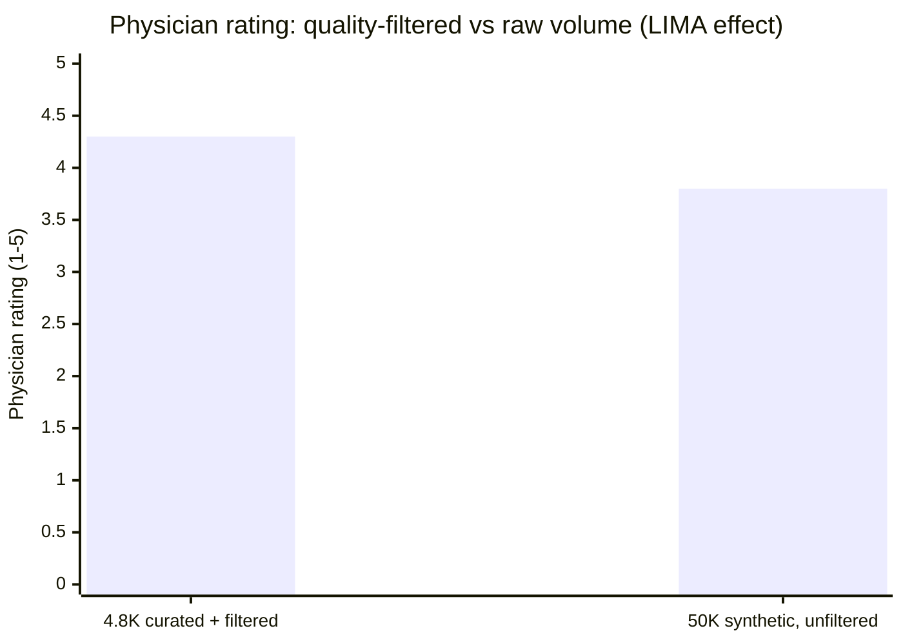
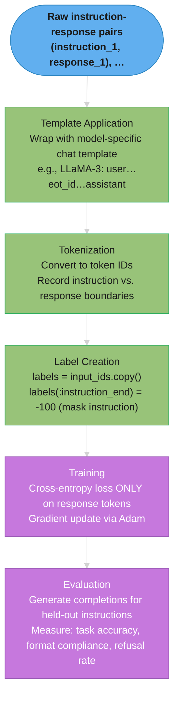

# Instruction Tuning

## 1. Concept Overview

Instruction tuning (also called supervised fine-tuning, SFT) is the process of fine-tuning a base language model on (instruction, response) pairs to teach it to follow natural language instructions. A base language model (e.g., LLaMA-3-8B-Base) predicts the next token given a sequence — it completes text but doesn't follow instructions or answer questions in a user-friendly way. Instruction tuning transforms this into an assistant model that responds helpfully to user requests.

The key insight from the Alpaca paper (Stanford, 2023): ~1,000-50,000 high-quality instruction-response pairs, formatted consistently, are sufficient to produce strong instruction-following behavior from a base model. Data quality dominates data quantity.

---

## Intuition

> **One-line analogy**: Instruction tuning teaches a language model to be a helpful assistant by showing it thousands of examples of good assistant behavior.

**Mental model**: A base language model learns to complete text: given "The Eiffel Tower is located in", it predicts " Paris." It doesn't understand the conversational context of "Tell me where the Eiffel Tower is" → "The Eiffel Tower is located in Paris, France." Instruction tuning shows the model thousands of (question, answer) and (instruction, response) pairs formatted in the exact template it will be used with. The model learns to follow the pattern: "when I see an instruction in this format, respond in this format."

**Why it matters**: Every chat model (GPT, Claude, LLaMA-instruct, Mistral-instruct) is a base model that has been instruction-tuned. Understanding instruction tuning reveals how these models learned their conversational behavior and enables creating custom instruction-following models for specific tasks.

**Key insight**: The format of training data must exactly match the inference-time prompt format — a mismatch here is the most common cause of instruction-tuned model failure.

---

## 2. Core Principles

- **Format alignment is critical**: Training template must match inference template exactly, including special tokens, whitespace, and section headers.
- **Label masking on instruction tokens**: Compute loss only on the response portion; including instruction tokens in the loss teaches the model to recite prompts.
- **Data quality dominates quantity**: 1,000 diverse, high-quality examples often outperforms 100,000 noisy examples.
- **Instruction diversity matters**: Training on a narrow instruction set produces a model that follows only those instruction types.
- **Minimal epochs**: 1-3 epochs; more causes overfitting and memorization of training examples rather than generalizing the instruction-following pattern.

---

## 3. How It Works — Detailed Mechanics

### 3.1 Prompt Templates

Different model families use different instruction templates. The training data must use the exact template for the target model:

```
LLaMA-3 / LLaMA-3-Instruct template:
<|begin_of_text|><|start_header_id|>system<|end_header_id|>
{system_prompt}<|eot_id|><|start_header_id|>user<|end_header_id|>
{user_message}<|eot_id|><|start_header_id|>assistant<|end_header_id|>
{assistant_response}<|eot_id|>

Mistral template:
<s>[INST] {user_message} [/INST] {assistant_response} </s>

ChatML template (OpenAI, Qwen, many others):
<|im_start|>system
{system_prompt}<|im_end|>
<|im_start|>user
{user_message}<|im_end|>
<|im_start|>assistant
{assistant_response}<|im_end|>

Alpaca template (early, now less common):
Below is an instruction that describes a task. Write a response that appropriately completes the request.

### Instruction:
{instruction}

### Response:
{response}
```

Template violations cause immediate, severe quality degradation:
```
Training with LLaMA-3 template + Inference with ChatML template:
  → Model sees unexpected tokens at inference time
  → Responses become incoherent, refuse valid instructions
  → Common cause of "the fine-tuned model is worse" reports
```

**Read it like this.** "A template is a fixed frame of marker slots wrapped around your content — and the model learned to expect that exact frame, marker for marker."

Templates differ in two ways that matter: how many slots the frame costs, and whether those slots are reserved special tokens or ordinary English. Both have consequences, and the second is the one that bites.

| Symbol | What it is |
|--------|------------|
| `<\|begin_of_text\|>` | LLaMA-3 sequence-start marker, emitted once per example |
| `<\|start_header_id\|>` / `<\|end_header_id\|>` | Wrap a role name; one pair per turn |
| `<\|eot_id\|>` | End-of-turn marker, closing each of system/user/assistant |
| `[INST]` / `[/INST]` | Mistral's instruction delimiters — one pair for the whole example |
| `<\|im_start\|>` / `<\|im_end\|>` | ChatML turn delimiters, one pair per turn |
| `### Instruction:` / `### Response:` | Alpaca's delimiters — plain text, not reserved tokens |

**Walk one example.** Counting the frame slots each template in the block above spends on one system/user/assistant example:

```
  template     special markers   role words   frame slots   overhead on a 200-tok example
  --------------------------------------------------------------------------------------
  LLaMA-3            10               3            13         13/213  =  6.1%
  ChatML              6               3             9          9/209  =  4.3%
  Mistral             4               0             4          4/204  =  2.0%
  Alpaca              0              ~26           ~26        26/226  = 11.5%

  Alpaca's ~26 = a 16-word preamble sentence + "### Instruction:" + "### Response:"
```

Mistral's frame is the thinnest because it has no system slot and no per-turn headers; LLaMA-3 pays for structure it can reuse across many turns. Over the 4,800-example, 2-epoch run in the Section 12 case study, the gap between Alpaca and LLaMA-3 framing is `13 x 4,800 x 2 = 124,800` tokens — real, but small.

**Why the special-token distinction matters far more than the count.** LLaMA-3, Mistral, and ChatML markers are *reserved* vocabulary entries the model can never emit by accident from user text. Alpaca's `### Response:` is ordinary text — a user whose input happens to contain `### Response:` injects a turn boundary the model will honour. That is a prompt-injection surface, and it is the structural reason the field moved to reserved-token templates. It is also why a template mismatch is so destructive: swap frames and every one of these slots becomes an unrecognized token sequence in a position where the model expected a hard boundary, which is exactly the incoherence described above.

### 3.2 Label Masking (Instruction Masking)

Compute cross-entropy loss only on the response tokens; mask the instruction tokens:

```
Example input sequence:
  <|begin_of_text|><|start_header_id|>user<|end_header_id|>
  Translate to French: "Hello, how are you?"<|eot_id|>
  <|start_header_id|>assistant<|end_header_id|>
  Bonjour, comment allez-vous?<|eot_id|>

Without label masking (wrong):
  Loss computed on ALL tokens including instruction
  Model learns: "when I see <|begin_of_text|>, predict header tokens..."
  Teaches model to recite the prompt format; degrades instruction following

With label masking (correct):
  Instruction tokens:   labels = -100 (ignored in cross-entropy loss)
  Response tokens:      labels = token_ids (loss computed on these)
  Loss only computed on: "Bonjour, comment allez-vous?<|eot_id|>"

Implementation:
  input_ids = tokenize(full_sequence)
  labels = copy of input_ids
  labels[:instruction_length] = -100   # mask instruction tokens
  # Train on (input_ids, labels) — loss only on response tokens
```

The loss the trainer actually optimizes is a mean over the *unmasked* positions only:

```
  loss = -(1 / N_unmasked) * sum over positions t where label_t != -100
                              of  log P(token_t | tokens_<t)

  where N_unmasked = count of positions whose label is not -100
```

**What this actually says.** "Read the whole sequence, but only get graded on the part you were supposed to write."

The model still *sees* every instruction token — they remain in `input_ids` and every response token attends back to them. Masking removes them from the grade, not from the context. Confusing "masked from loss" with "masked from attention" is the single most common misreading of this section.

| Symbol | What it is |
|--------|------------|
| `input_ids` | The full tokenized sequence, instruction and response together — unchanged |
| `labels` | A copy of `input_ids` with instruction positions overwritten by `-100` |
| `-100` | PyTorch's `ignore_index` sentinel; cross-entropy skips these positions entirely |
| `P(token_t \| tokens_<t)` | Model's predicted probability of the correct token at position `t` |
| `log P(...)` | Always negative; closer to 0 means a more confident correct prediction |
| `N_unmasked` | Number of positions that survived masking — the denominator |
| `-(1/N) * sum` | Negative mean log-likelihood, i.e. cross-entropy over the response only |

**Walk one example.** The 10-token sequence from the Label Masking Illustration below — 5 instruction tokens, 5 response tokens — with a plausible predicted probability at each position:

```
  pos   role          label     P(correct)   -log P     counted?
  ------------------------------------------------------------
  T1    instruction   -100        0.02        3.912      no
  T2    instruction   -100        0.15        1.897      no
  T3    instruction   -100        0.05        2.996      no
  T4    instruction   -100        0.30        1.204      no
  T5    instruction   -100        0.10        2.303      no
  T6    response        77        0.60        0.511      YES
  T7    response        23        0.85        0.163      YES
  T8    response        68        0.40        0.916      YES
  T9    response        44        0.90        0.105      YES
  T10   response        55        0.95        0.051      YES
  ------------------------------------------------------------
  masked (correct)   sum = 1.746   N_unmasked = 5    loss = 1.746 / 5  = 0.349
```

Now the same forward pass with masking forgotten — every position counted, denominator 10:

```
  unmasked (wrong)   sum = 1.746 + 12.311 = 14.058   N = 10   loss = 14.058 / 10 = 1.406

  0.349  ->  1.406      the reported loss is 4.03x higher
  instruction tokens contribute 12.311 / 14.058 = 87.6% of the total gradient signal
```

**What breaks, precisely.** Two separate failures, and the second is the dangerous one.

First, the number lies. Loss jumps from 0.349 to 1.406 and *stays high forever*, because instruction tokens are genuinely unpredictable — the model cannot know a user will ask about French translation. You will read that plateau as "the model isn't learning" and burn epochs chasing it.

Second, and worse: 87.6% of the gradient is now spent teaching the model to generate instructions. It is being optimized to produce `<|begin_of_text|><|start_header_id|>user...` — which is exactly the reported symptom, a fine-tuned model whose responses begin with prompt template tokens. The response, the only thing you wanted to teach, contributes 12.4% of the signal.

Note that the ratio depends on the mix: this example is half instruction, half response. A short instruction with a long response dilutes the damage; a long document in the instruction with a one-line answer makes it near-total. That is why the fix is verification, not intuition — print `labels` beside `input_ids` for the first few examples and confirm the `-100` boundary sits exactly where the response begins.

### 3.3 Data Curation

The quality and diversity of training data is the primary determinant of instruction-tuning success:

### Quality Beats Quantity (the LIMA finding)



The 10× larger dataset scored LOWER. Once ~1-5K diverse examples teach the
instruction-following format, extra noisy examples add gradient noise rather than new
skill — so filtering down to the best 1-5K examples beats piling on raw volume.

**Diversity dimensions**:
```
Task types:
  - Question answering: "What is the capital of France?"
  - Summarization: "Summarize the following article in 3 sentences."
  - Translation: "Translate to Spanish: ..."
  - Code generation: "Write a Python function that..."
  - Analysis: "What are the pros and cons of..."
  - Formatting: "Convert this JSON to a markdown table."
  - Reasoning: "Solve step by step: ..."
  - Roleplay: "You are a customer service agent..."

Response styles:
  - Short factual answers
  - Long explanations
  - Numbered lists
  - Structured JSON/Markdown
  - Multi-turn conversation

Domain coverage:
  - General knowledge
  - Domain-specific (if fine-tuning for a domain)
  - Code/technical
  - Creative
```

**Data quality checklist**:
```
Per-example quality:
  ✓ Response is accurate and factually correct
  ✓ Response directly answers the instruction (not tangential)
  ✓ Appropriate response length (not too brief or verbose)
  ✓ Format matches the instruction (if asked for a list, provide a list)
  ✓ No harmful content, biases, or unsafe responses
  ✓ System prompt matches intended behavior (if present)

Dataset-level quality:
  ✓ Diversity across task types (no single task > 20% of dataset)
  ✓ Diversity of response lengths (mix of short and long)
  ✓ No near-duplicate examples (dedup by instruction similarity)
  ✓ Balanced difficulty (mix of simple and complex)
  ✓ Held-out eval set (10% not seen during training)
```

### 3.4 Training Configuration

```python
from trl import SFTTrainer, SFTConfig
from transformers import AutoModelForCausalLM, AutoTokenizer
from peft import LoraConfig

model = AutoModelForCausalLM.from_pretrained("meta-llama/Meta-Llama-3-8B")
tokenizer = AutoTokenizer.from_pretrained("meta-llama/Meta-Llama-3-8B")

# Training configuration
sft_config = SFTConfig(
    max_seq_length=2048,          # truncate examples longer than this
    packing=True,                 # pack short examples into one sequence
    per_device_train_batch_size=4,
    gradient_accumulation_steps=8,  # effective batch = 32
    num_train_epochs=2,           # rarely need more than 3
    learning_rate=2e-4,           # for LoRA; 1e-5 for full FT
    warmup_ratio=0.03,
    lr_scheduler_type="cosine",
    logging_steps=25,
    save_steps=500,
    eval_steps=500,
    bf16=True,
)

# Dataset must be formatted with chat template
def format_example(example):
    return tokenizer.apply_chat_template(
        [
            {"role": "user", "content": example["instruction"]},
            {"role": "assistant", "content": example["response"]}
        ],
        tokenize=False,
        add_generation_prompt=False
    )

dataset = dataset.map(lambda ex: {"text": format_example(ex)})

trainer = SFTTrainer(
    model=model,
    args=sft_config,
    train_dataset=train_dataset,
    eval_dataset=eval_dataset,
    peft_config=LoraConfig(r=16, lora_alpha=32, ...)  # optional LoRA
)

trainer.train()
```

**Stated plainly.** "Two batch-size knobs multiply into one effective batch, and that effective batch times the sequence length is how many tokens each optimizer step actually consumes."

Nearly every SFT config quantity derives from one chain: examples to tokens, tokens to steps, steps to warmup. Getting the chain wrong is how people ship runs whose eval callbacks never fire.

| Symbol | What it is |
|--------|------------|
| `per_device_train_batch_size` | Sequences per forward pass, 4 — bounded by GPU memory |
| `gradient_accumulation_steps` | Forward passes accumulated before one optimizer update, 8 |
| effective batch | `4 × 8 = 32` sequences per weight update |
| `max_seq_length` | 2048 — every sequence is this long once packed or padded |
| tokens per step | `effective batch × max_seq_length` |
| `num_train_epochs` | 2 — how many times the dataset is traversed |
| `warmup_ratio` | 0.03 — fraction of total steps spent ramping the learning rate up |

**Walk one example.** The Section 12 case study's dataset (4,800 examples after filtering) through this exact config, at two plausible average example lengths:

```
  tokens per optimizer step  =  32 x 2048  =  65,536

                             avg 400 tok/ex        avg 800 tok/ex
  tokens per epoch           4,800 x 400            4,800 x 800
                           =  1,920,000           =  3,840,000
  x 2 epochs               =  3,840,000           =  7,680,000

  steps = tokens / 65,536  =     58.6  -> 59      =    117.2  -> 118
  warmup = 0.03 x steps    =      1.8  ->  2      =      3.5  ->  4
```

**The trap this arithmetic exposes.** The case study sets `eval_steps=200`, `save_steps=200`, and `load_best_model_at_end=True` with `metric_for_best_model="eval_loss"`. The whole run is 59 to 118 steps. **The evaluation callback never fires once**, no checkpoint is ever written, and "load best model at end" has no evaluations to choose between — it silently loads the final model. Always compute your step count before setting `eval_steps`; a good rule is 10 to 20 evals per run, which here means `eval_steps=5` or `10`, not 200.

The warmup row has the same problem in miniature: a 3% ratio on a 59-step run gives a **2-step** warmup. Warmup exists to stop the first few updates from destabilizing the optimizer's moment estimates, and two steps barely does that. On short SFT runs, set warmup by absolute step count (20 to 50 steps) rather than by ratio.

**Why the two batch knobs are separate.** `per_device_train_batch_size × gradient_accumulation_steps` is the number that affects learning — gradient noise, effective learning rate, convergence. The split between them is purely a memory accommodation: `4 × 8` and `8 × 4` and `32 × 1` all train identically, but only the first may fit on your GPU. Halve the device batch and double accumulation and nothing about the learning changes; the run just gets slower.

### 3.5 Sequence Packing

Pack short examples into full-length sequences to maximize GPU utilization:

```
Without packing (inefficient):
  Example 1: 200 tokens → padded to 2048 tokens (1848 padding tokens wasted)
  Example 2: 300 tokens → padded to 2048 tokens (1748 padding tokens wasted)
  GPU utilization: ~12% for these two examples

With packing:
  [Example 1: 200 tokens][Example 2: 300 tokens][Example 3: 400 tokens]
  [Example 4: 600 tokens][Example 5: 500 tokens]  = 2000 tokens total
  Padded to 2048: 48 padding tokens
  GPU utilization: ~98%

Implementation:
  SFTConfig(packing=True) in TRL handles this automatically
  Uses ConstantLengthDataset to pack examples into full-length sequences

Caution: packing combines multiple examples in one sequence
  Need attention mask modification to prevent cross-example attention:
    Example 1 tokens should not attend to Example 2 tokens
  SFTTrainer handles this correctly; manual implementations must be careful
```

**Put simply.** "You pay for 2048 token slots whether or not you fill them, so stop shipping half-empty sequences."

Attention cost is set by `max_seq_length`, not by how much real content sits inside it. A padded slot consumes the same compute as a real token and teaches the model nothing. Utilization is therefore just `real tokens / allocated slots`.

| Symbol | What it is |
|--------|------------|
| `max_seq_length` | 2048 — the slot budget every sequence occupies regardless of content |
| real tokens | Actual example content in a sequence |
| padding tokens | Slots filled to reach 2048; compute is spent, nothing is learned |
| GPU utilization | `real tokens / (num_sequences × 2048)` |
| `ConstantLengthDataset` | The TRL machinery that concatenates examples to fill 2048 exactly |

**Walk one example.** The five examples from the block above (200, 300, 400, 600, 500 tokens), costed both ways:

```
  real content = 200 + 300 + 400 + 600 + 500 = 2,000 tokens

  WITHOUT packing -- one example per sequence
    sequences          5
    slots allocated    5 x 2048          = 10,240
    padding             10,240 - 2,000   =  8,240   (80.5% wasted)
    utilization         2,000 / 10,240   =  19.5%

  WITH packing -- all five concatenated into one sequence
    sequences          1
    slots allocated    1 x 2048          =  2,048
    padding             2,048 - 2,000    =     48   (2.3% wasted)
    utilization         2,000 / 2,048    =  97.7%

  speedup on this batch:  10,240 / 2,048  =  5.0x fewer sequences to process
```

The section's two-example figure works the same way: `500 / (2 x 2048) = 12.2%`, matching the `~12%` quoted. And 5.0× sits squarely inside the `5-10×` the Best Practices section claims — the multiplier is simply `max_seq_length / average example length`, so a dataset of 200-token examples gets `2048 / 200 = 10.2x` and one of 1000-token examples gets only `2.0x`. Packing pays in inverse proportion to how long your examples already are.

**Packing changes your step count, and that surprises people.** Fewer sequences means fewer optimizer steps for the same data:

```
  4,800 examples x 2 epochs, effective batch 32, avg 400 tokens

  packing=False   4,800 x 2 / 32                         = 300 steps
  packing=True    2048/400 = 5.12 examples per sequence
                  (4,800 / 5.12) x 2 / 32                =  59 steps

  same tokens, same learning -- 5.12x fewer logged steps
```

This is why the `eval_steps=200` above never fires: with packing off it would have triggered once, and turning packing on pushed the whole run below the threshold. Any step-indexed setting — eval, save, logging, LR schedule length — must be recomputed when you toggle packing.

**Why the attention mask is the whole risk.** Concatenating examples puts unrelated content in one causal sequence, so by default example 3's tokens attend back over examples 1 and 2. The model then learns spurious conditioning: it sees a French translation followed by a Python function and infers a relationship that does not exist. TRL constructs a block-diagonal mask so each example only attends within itself. A hand-rolled packer that skips this trains on a corrupted objective and — because loss still descends smoothly — gives you no signal that anything is wrong.

---

## 4. Architecture Diagram

### Instruction Tuning Data Flow



Label masking (-100 in PyTorch) tells the loss function to skip instruction tokens — the model is trained only to generate the response given the instruction, not to predict the instruction itself.

### Label Masking Illustration
```
Token sequence:
  T1  T2  T3  T4  T5  T6  T7  T8  T9  T10
  [       INSTRUCTION        ] [  RESPONSE  ]

Input IDs:
  42  87  33  91  15  77  23  68  44  55

Labels (after masking):
  -100 -100 -100 -100 -100  77  23  68  44  55
   ^                   ^     ^
   masked (no loss)          loss computed here
```

---

## 5. Real-World Examples

### Stanford Alpaca (2023)
- Fine-tuned LLaMA 7B on 52,000 instruction-following examples
- Examples generated using GPT-3.5 (self-instruct method)
- Training cost: ~$100; achieved impressive instruction-following quality
- Key lesson: 52K diverse high-quality examples sufficient for base instruction following

### OpenHermes 2.5 (Teknium)
- 1M+ instruction-response pairs curated from diverse sources
- Used for community fine-tuning of LLaMA and Mistral models
- Demonstrates that diversity (1M pairs across many task types) outperforms repetitive domain data

### LLaMA-3-Instruct (Meta, 2024)
- LLaMA-3-8B-Base + multi-round SFT + [RLHF](../alignment_and_rlhf/README.md)
- SFT uses ~10M high-quality instruction pairs covering 30+ task types
- Multi-turn conversation data: 20-30% of training set
- Safety instruction data: explicitly included to produce safe refusals

---

## 6. Tradeoffs

| Dataset Size | Expected Quality | Risk | Best For |
|-------------|-----------------|------|---------|
| 500-1,000 | Good for narrow tasks | Overfitting | Specific single-task |
| 5,000-10,000 | Good general following | Moderate | Domain-specific assistant |
| 50,000-100,000 | Strong diverse following | Low | General assistant |
| 1M+ | Excellent | Very low | Production-grade model |

| Epochs | Quality | Risk |
|--------|---------|------|
| 1 | Underfit on small datasets | Undertrained |
| 2-3 | Optimal for most | Sweet spot |
| 5+ | Memorization, format overfitting | Overtrained |

---

## 7. When to Use / When NOT to Use

### Use Instruction Tuning When:
- Need consistent output format (JSON, markdown, specific response style)
- Need to adapt base model behavior (personality, tone, domain focus)
- Want to add specific skills not in the base model's instruction following
- High-volume production system where a smaller fine-tuned model beats a larger prompted model

### Use Prompting Instead When:
- Task variety is high (can't cover all task types in training data)
- Dataset is too small (<200 examples) to generalize
- Rapid iteration is needed (no training cycle)
- Base model already follows the required instructions reasonably well

---

## 8. Common Pitfalls

**1. Template mismatch between training and inference**
The single most common and damaging mistake: training with Alpaca template but running inference with ChatML template, or vice versa.
Fix: Explicitly verify the template by: loading the tokenizer's `apply_chat_template` with test examples and comparing raw token sequences from training to inference. Add a template validation check to the deployment pipeline.

**2. Missing label masking**
Including instruction tokens in the loss causes the model to learn to "predict" prompts rather than responses. Symptoms: model generates responses that begin with prompt template tokens.
Fix: Verify labels by checking that all instruction tokens have label = -100 before training. Print the first 5 examples' labels alongside input_ids and verify visually.

**3. Too many epochs on small dataset**
5 epochs on 1,000 examples → model memorizes training examples rather than learning the instruction-following pattern. At inference, asks it about training examples → hallucinated memorized responses.
Fix: Evaluate on held-out (20%) data after each epoch. Stop training when eval loss stops decreasing (early stopping). For small datasets, 1-2 epochs is usually enough.

**4. Low instruction diversity**
Dataset with 10,000 examples but all are "summarize this text" → model becomes excellent at summarization but poor at other task types.
Fix: Enforce diversity constraints: no single task type above 15-20% of the dataset. Measure diversity metrics (distinct instruction n-grams) before training.

**5. Imbalanced response lengths**
Training data where 90% of responses are 1-2 sentences → model learns to always respond briefly, even when detailed responses are appropriate.
Fix: Balance response length distribution: include long detailed responses (>500 tokens), medium responses (100-500 tokens), and short responses (<100 tokens) in roughly equal proportions.

**6. Incorrect handling of multi-turn conversations**
Multi-turn conversation data requires correct turn-boundary handling: each turn should mask prior turns appropriately in labels.
Fix: Use `apply_chat_template` with `tokenize=False` to format multi-turn conversations; then re-tokenize and apply masking consistently. TRL's SFTTrainer handles this when the dataset contains properly formatted chat templates.

---

## 9. Technologies & Tools

| Tool | Purpose | Notes |
|------|---------|-------|
| **TRL SFTTrainer** | SFT training | Standard tool; handles label masking, packing, multi-turn |
| **Axolotl** | Training orchestration | YAML config; best for custom data formats |
| **LLaMA-Factory** | All-in-one fine-tuning | Web UI; multi-model; easy data format handling |
| **HuggingFace datasets** | Dataset management | Standard format for instruction datasets |
| **OpenHermes 2.5** | Public instruction dataset | 1M+ high-quality examples; good fine-tuning starting point |
| **ShareGPT** | Conversation dataset | Multi-turn conversation format; widely used |
| **Alpaca-Cleaned** | Cleaned instruction dataset | 52K examples from original Alpaca, quality-filtered |
| **WizardLM Evol-Instruct** | High-quality instructions | Evolved/complex instructions for stronger models |

---

## 10. Interview Questions with Answers

**Q: What is instruction tuning and how does it differ from pre-training?**
A: Instruction tuning is supervised fine-tuning on (instruction, response) pairs to teach a model to follow natural language instructions. Pre-training trains on vast unlabeled text corpora (hundreds of billions to trillions of tokens) with a next-token prediction objective — the model learns language and world knowledge but not conversational behavior. Instruction tuning uses a small, curated supervised dataset (thousands to millions of instruction-response pairs) to teach the conversational interface. Pre-training produces a "base model" (text completer); instruction tuning produces an "assistant model" (instruction follower). Scale: pre-training requires months on thousands of GPUs; instruction tuning requires hours on a few GPUs.

**Q: Why is label masking critical in instruction tuning?**
A: Label masking ensures the model only learns to generate responses, not to recite prompts. Without masking, the training loss includes cross-entropy over instruction tokens — the model learns "given the start of a prompt, predict the rest of the prompt." This corrupts the fine-tuning objective. With masking, instruction token labels are set to -100 (ignored by cross-entropy loss), so loss is computed only on response tokens. The model learns the conditional generation: "given an instruction in this format, generate a response in this style." Verifying label masking is correct is one of the first debugging steps when an instruction-tuned model produces poor outputs.

**Q: How do you choose between generating synthetic training data vs. using human-annotated data?**
A: Both have distinct tradeoffs. Human-annotated data: highest quality (experts write genuinely good responses); most expensive ($5-50 per example, depending on complexity); small scale (1K-50K examples is typical). Synthetic data (GPT-4 generated): cheap ($0.01-0.10 per example); scalable to millions; risk of hallucinations, biases, and style artifacts from the teacher model. Best practice: use GPT-4 to generate 50K-500K synthetic examples, then apply quality filtering (remove short, inconsistent, or harmful examples), and supplement with 1K-5K human-annotated examples for quality anchoring. For production models: human examples in the training mix significantly improve real-world quality even at <5% of the dataset.

**Q: What is sequence packing and why does it improve training efficiency?**
A: Sequence packing combines multiple short examples into a single sequence of the model's maximum length (e.g., 2048 tokens). Without packing, each example occupies a full sequence with padding — a 200-token example in a 2048-token sequence wastes 90% of compute on attention over padding tokens. With packing, 5-8 short examples fill one sequence: GPU utilization increases from ~10-30% to 90%+, reducing training time proportionally. Critical requirement: an attention mask must prevent examples from attending to each other — example 1 should not influence example 2 in the same packed sequence. TRL's SFTTrainer with `packing=True` handles this correctly. Warning: attention masks in packed sequences must be carefully validated; incorrect implementation can contaminate learning across examples.

**Q: How do you curate high-quality instruction tuning data?**
A: Data curation follows five steps. First, source diversity: collect instructions from multiple domains and task types; cap any single task type at 15-20% of the total. Second, response quality filtering: use an LLM (GPT-4 or a reward model) to score each (instruction, response) pair and filter out low-scoring examples — typically remove the bottom 20-30%. Third, deduplication: remove near-duplicate instructions using embedding similarity clustering (threshold ~0.9 cosine similarity); duplicates cause overfitting. Fourth, length balance: ensure response length distribution has representatives at all lengths (50-2000 tokens). Fifth, safety review: scan for harmful instructions/responses and remove. For domain-specific fine-tuning: domain expert review of a random sample (100-200 examples) is essential to verify correctness.

**Q: What causes instruction format overfitting?**
A: Instruction format overfitting occurs when the model learns the surface pattern of the training instructions rather than generalizing to new instructions. Symptoms: the model follows training instructions well but struggles with paraphrased or novel instructions; the model "fills in" instruction templates even when not instructed. Causes: (1) Training instructions are too formulaic or all share the same phrasing pattern; (2) Too many epochs cause the model to memorize specific instruction phrasings; (3) Training data covers too few task types, causing the model to map all instructions to the few task types it has seen. Mitigation: high instruction diversity (>100 distinct instruction types), instruction rephrasing augmentation (paraphrase each instruction 2-3 ways), and evaluating on held-out instruction types not seen during training.

**Q: How do you evaluate instruction-tuned models?**
A: Multi-dimensional evaluation: (1) Task accuracy: for verifiable tasks (code execution, math, SQL), run the output through a validator — execution accuracy is ground truth; (2) Format compliance: for structured outputs (JSON, markdown), validate against a schema or check formatting rules; (3) Instruction following rate: for the eval set, what fraction of responses directly address the instruction? (4) LLM-as-judge: use GPT-4 to rate response quality on a scale (1-5) for dimensions like helpfulness, accuracy, format compliance; (5) General capability regression: run the fine-tuned model on a general benchmark (MMLU, MT-Bench) and compare to the base model — fine-tuning should not degrade general capability. Build an eval set before training; never evaluate on training data.

**Q: How does multi-turn conversation data differ from single-turn instruction tuning?**
A: Single-turn data: each training example is one (instruction, response) pair. Multi-turn data: each example is a full conversation with N turns: (user_1, assistant_1, user_2, assistant_2, ..., user_N, assistant_N). For multi-turn training: format all turns in order, apply label masking to all user turns and previous assistant turns — only the last (or each) assistant turn contributes to loss. Multi-turn training teaches the model to maintain conversational context across turns: remembering what was said, building on previous answers, handling follow-up questions. Without multi-turn training data, instruction-tuned models struggle with follow-up questions and context-dependent responses. Include 20-30% multi-turn data in instruction-tuning datasets for production-quality conversational models.

**Q: What is the role of system prompts in instruction tuning?**
A: System prompts are per-session instructions that establish the model's persona, behavioral constraints, and context before the user message. In instruction tuning: include diverse system prompts in the training data so the model learns to respect system prompt constraints. Without system prompt training, the model ignores or inconsistently follows system prompts at inference. Training examples should cover: (1) default helpful assistant persona; (2) domain-specific personas ("You are a medical advisor..."); (3) behavioral constraints ("Always respond in formal English"); (4) format specifications ("Always respond in JSON format"); (5) safety instructions ("Refuse requests for harmful content"). System prompts are part of the chat template and must be handled consistently between training and inference — masked in labels (treated as instruction, not response).

**Q: How do you handle very long instructions or responses in instruction tuning?**
A: Sequences longer than the model's maximum context window must be handled. Options: (1) Truncation: truncate to max_length, but this loses the end of long responses — critical if the main answer is in the truncated portion; (2) Filtering: remove examples where instruction + response exceeds max_length — ensures all training data fits cleanly; (3) Chunking: for long documents in instructions, use document chunking (sliding window over the instruction) to create multiple shorter examples; (4) Long context model: use a model with longer context (LLaMA-3 supports 8K, others 32K+) and increase max_seq_length accordingly. For most instruction tuning: filter examples >2048 tokens (keeps ~85% of typical instruction datasets) and use the model's native context window.

**Q: Does data quality or quantity matter more in instruction tuning, and what evidence supports this?**
A: Data quality dominates data quantity, especially beyond ~5,000 examples. The LIMA paper (Less Is More for Alignment, 2023) demonstrated this empirically: a model instruction-tuned on 1,000 carefully curated examples matched or outperformed models trained on 52,000 unfiltered examples (the original Alpaca dataset) on human preference evaluations. The mechanism: after the model sees enough diverse examples to learn the instruction-following format (~1,000-5,000 examples), additional noisy examples add noise to the gradient signal rather than new information. Adding poor-quality examples past this threshold actively hurts quality by teaching the model to produce mediocre responses. Practical implication: invest budget in quality filtering and human review of 1,000-5,000 examples rather than generating 50,000 synthetic examples without filtering.

**Q: Why is format diversity in training data important, and what happens without it?**
A: Format diversity — training on a mix of single-turn, multi-turn, JSON, markdown, code, and prose response formats — prevents format rigidity, a failure mode where the model learns to produce only the format types it saw during training. Without format diversity: a model trained only on prose Q&A pairs will produce prose even when the instruction explicitly asks for JSON; a model trained only on single-turn examples will ignore conversational context in multi-turn interactions; a model trained only on short responses will truncate long answers. Include all target output formats in the training data in representative proportions. If the production use case requires JSON outputs 30% of the time, ensure roughly 30% of training examples have JSON responses. Evaluate format compliance rate (fraction of responses that match the requested format) as a first-class metric alongside accuracy.

**Q: What did the FLAN scaling experiments reveal about the relationship between number of tasks and instruction tuning quality?**
A: The FLAN experiments (Google, 2021-2022) showed that instruction tuning quality scales with the number of distinct tasks in training, but with strong diminishing returns after roughly 200 diverse tasks. Scaling from 20 tasks to 200 tasks produced substantial improvements across held-out task evaluations; scaling from 200 to 1,836 tasks produced marginal further gains. The implication: breadth of task coverage matters up to a point, but task diversity (covering fundamentally different task types: classification, generation, extraction, reasoning, translation) matters more than raw task count. A dataset covering 50 genuinely distinct task types outperforms one with 500 tasks that are all variations of text classification. For practical instruction tuning datasets: ensure coverage of 10-20 fundamentally different task categories rather than exhaustively cataloging hundreds of similar tasks.

**Q: What quality problems were found in the original Alpaca dataset, and why does this matter?**
A: Post-hoc audits of the Stanford Alpaca dataset found approximately 30% of the 52,000 examples contained quality issues: factual mistakes (incorrect information in responses), incomplete answers (responses that started but didn't finish addressing the instruction), formatting inconsistencies, and unhelpful or overly brief responses. This occurred because the examples were generated using GPT-3 (text-davinci-003) without filtering, and GPT-3's instruction-following quality was inconsistent for complex or ambiguous instructions. The consequence: models fine-tuned on unfiltered Alpaca learned some incorrect behaviors and response patterns. This spawned "Alpaca-Cleaned," a filtered version that removed or fixed identified issues. The practical lesson: always apply quality filtering to synthetic datasets before fine-tuning — use a stronger model (GPT-4) as a judge to score each (instruction, response) pair and remove examples scoring below a threshold; target removing at least the bottom 20-30% of examples by quality score.

**Q: How should you evaluate an instruction-tuned model to ensure it generalizes to new instruction types?**
A: Effective evaluation requires held-out instructions sampled from task categories not seen during training, LLM-as-judge scoring across multiple quality dimensions, and human preference evaluation. The held-out set should include instruction types deliberately excluded from training: if the model was trained on Q&A, summarization, and code, the eval set should include translation, comparison, and roleplay instructions to test generalization. LLM-as-judge (using GPT-4 as evaluator) scores each response on helpfulness (1-5), instruction compliance (did the model do what was asked?), and format accuracy. Human preference evaluation: present pairs of responses (from base model vs. fine-tuned model, or model A vs. model B) to human raters and collect preference votes. Aggregate win rate across 100-200 human-evaluated pairs is the most reliable quality signal. Never evaluate only on task types included in training — that measures memorization, not generalization.

---

## 11. Best Practices

1. **Verify template with actual token IDs** — don't assume a template is correct; print tokenized examples and verify special tokens appear at the right positions.
2. **Validate label masking before training** — inspect the first 5 training examples' labels; confirm instruction tokens are -100 and response tokens have correct IDs.
3. **Cap any single task type at 15-20%** — prevents the model from optimizing one task type at the expense of general instruction following.
4. **Use 2-3 epochs with early stopping** — monitor eval loss; stop when it plateaus; 1-2 epochs is usually sufficient for datasets >10K examples.
5. **Enable packing for efficiency** — use TRL's `packing=True`; reduces GPU compute waste by 5-10× for datasets with short examples.
6. **Maintain a general benchmark suite** — evaluate MMLU or MT-Bench after fine-tuning to verify general capability is not degraded.
7. **Keep a quality-focused eval set separate from training data** — 100-200 manually curated evaluation examples across all task types; this is your ground truth for measuring fine-tuning success.

---

## 12. Case Study

### Building an Instruction-Tuned Model for a Healthcare Q&A System

#### Problem Statement

A digital health company needed an LLM-powered Q&A assistant for patients and clinicians. The base model (LLaMA-3-8B-Instruct) handled general medical questions inconsistently: accurate for common conditions, unreliable for drug interactions, dosage queries, and differential diagnosis. The goal was an instruction-tuned model that answers medical questions accurately in four formats: plain explanation (for patients), clinical summary (for physicians), step-by-step differential diagnosis, and structured JSON for EHR integration.

#### Architecture Overview

```
Data Sources
  Medical guidelines (WHO, NIH, UpToDate summaries)    2,400 examples
  Drug monograph Q&A (pharmacist-reviewed)               800 examples
  Differential diagnosis chains (physician-authored)     600 examples
  Patient-facing explanations (health literacy L6-8)   1,200 examples
  Structured JSON extraction examples                    400 examples
  General medical multi-turn conversations               600 examples
                                          Total:       6,000 examples
           |
           v
[Quality Filtering]
  GPT-4 judge: score each (instruction, response) on accuracy + format
  Remove bottom 20% by score (1,200 examples removed)
  Expert physician review of random 200-example sample
  Final dataset: 4,800 examples
           |
           v
[Template Application + Label Masking]
  LLaMA-3 chat template applied
  Instruction tokens masked (labels = -100)
           |
           v
[SFT Training on LLaMA-3-8B-Instruct]
  LoRA r=32, alpha=64 (instruction tuning, not CPT)
  2 epochs, LR=2e-4, cosine schedule
  Effective batch size 32, packing=True
           |
           v
[Evaluation]
  Medical accuracy: MedQA held-out (USMLE-style)
  Format compliance: JSON schema validation, markdown structure
  General regression: MMLU, MT-Bench vs. base model
  Human evaluation: 5 physician raters, 100 outputs
```

#### Key Design Decisions

**Multi-format training (30% of dataset).** Each response format (explanation, clinical summary, differential diagnosis, JSON) was explicitly labeled in the system prompt. Training examples used four distinct system prompt variants, ensuring the model learns to switch format based on the system prompt rather than defaulting to one format. Without this, the model defaulted to patient-facing explanation prose even when JSON was requested.

**Differential diagnosis chain-of-thought format.** Differential diagnosis examples used a structured reasoning format: symptom list, ranked differentials with reasoning, recommended next steps. Training on 600 such examples taught the model the clinical reasoning sequence. Plain Q&A training alone produced flat answers; chain-of-thought examples produced clinically structured outputs.

**Physician-authored responses for high-stakes content.** Drug interaction and dosage examples were authored by clinical pharmacists, not generated synthetically. Pharmacist review caught GPT-4 errors in drug interaction responses (~8% error rate for rare interactions). For safety-critical content, human authorship is not optional.

**Format compliance gating.** JSON outputs were validated against a schema before inclusion in the training set. Malformed JSON examples were regenerated rather than included — training on malformed JSON examples caused the model to reproduce similar formatting errors.

#### Implementation

```python
from trl import SFTTrainer, SFTConfig
from peft import LoraConfig, get_peft_model
from transformers import AutoModelForCausalLM, AutoTokenizer

model_id = "meta-llama/Meta-Llama-3-8B-Instruct"
model = AutoModelForCausalLM.from_pretrained(model_id, torch_dtype="bfloat16")
tokenizer = AutoTokenizer.from_pretrained(model_id)

# LoRA config — instruction tuning, not CPT; r=32 is sufficient
lora_config = LoraConfig(
    r=32,
    lora_alpha=64,
    target_modules=["q_proj", "v_proj", "k_proj", "o_proj"],
    lora_dropout=0.05,
    bias="none",
    task_type="CAUSAL_LM"
)
model = get_peft_model(model, lora_config)

# Format examples with system prompt indicating desired output format
def format_medical_example(example):
    system_prompt = example["system_prompt"]  # varies by format type
    return tokenizer.apply_chat_template(
        [
            {"role": "system", "content": system_prompt},
            {"role": "user",  "content": example["question"]},
            {"role": "assistant", "content": example["answer"]}
        ],
        tokenize=False,
        add_generation_prompt=False
    )

dataset = dataset.map(lambda ex: {"text": format_medical_example(ex)})

sft_config = SFTConfig(
    max_seq_length=2048,
    packing=True,
    num_train_epochs=2,
    per_device_train_batch_size=4,
    gradient_accumulation_steps=8,   # effective batch = 32
    learning_rate=2e-4,
    lr_scheduler_type="cosine",
    warmup_ratio=0.03,
    bf16=True,
    eval_steps=200,
    save_steps=200,
    load_best_model_at_end=True,
    metric_for_best_model="eval_loss",
)

trainer = SFTTrainer(
    model=model,
    args=sft_config,
    train_dataset=train_ds,
    eval_dataset=eval_ds,
)
trainer.train()
```

#### Results

| Metric | Base LLaMA-3-8B-Instruct | Fine-Tuned |
|--------|--------------------------|------------|
| MedQA accuracy (USMLE-style) | 58.3% | 71.2% |
| JSON format compliance | 41% | 94% |
| Differential diagnosis structure compliance | 23% | 89% |
| MMLU regression vs. base | — | -1.8% (within tolerance) |
| Physician rating (1-5 scale, 100 outputs) | 3.1 | 4.3 |

General capability regression (MMLU -1.8%) stayed well within the acceptable 5% threshold because the training set was small (4,800 examples) and [LoRA](lora.md) was used — base weights were frozen.

#### Tradeoffs and Alternatives

**Instruction tuning vs. RAG.** For factual accuracy on evolving medical knowledge (new drug approvals, updated guidelines), [RAG](../rag_fundamentals/README.md) is superior — fine-tuning encodes knowledge at training time and becomes stale. The implemented system combined both: fine-tuning taught format and reasoning structure; RAG retrieved current guideline text at query time. Neither alone achieved the target quality.

**6,000 examples vs. larger dataset.** Attempting to scale to 50,000 synthetic examples (GPT-4 generated, unreviewed) degraded physician evaluation scores from 4.3 to 3.8 — the larger noisy dataset hurt quality. The LIMA finding held: 4,800 quality-filtered examples outperformed 50,000 unfiltered examples in human evaluation.

#### Interview Discussion Points

- Why was LoRA chosen over full fine-tuning for this use case?
- How would you update the model when medical guidelines change?
- What evaluation would you add before deploying in a clinical setting?
- How does the system prompt format approach differ from training separate models per format type?
