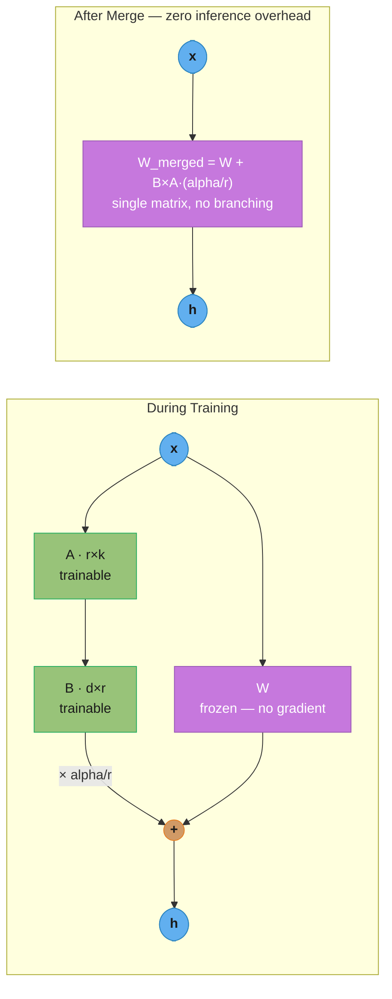
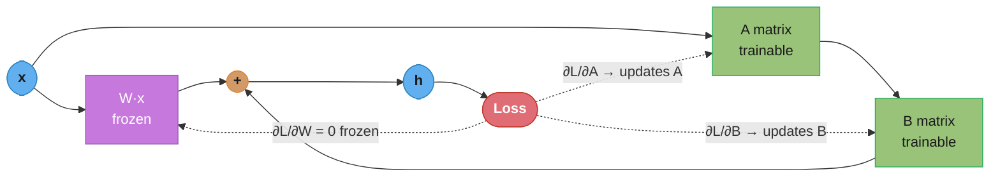
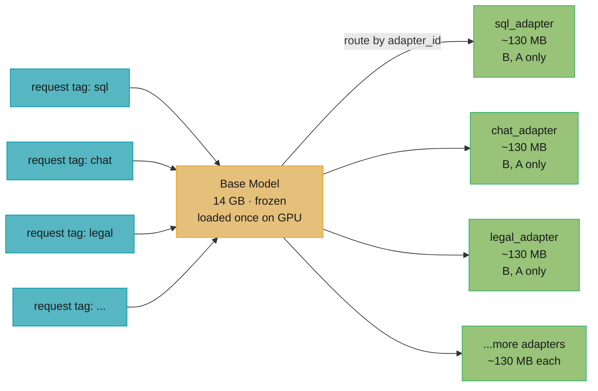
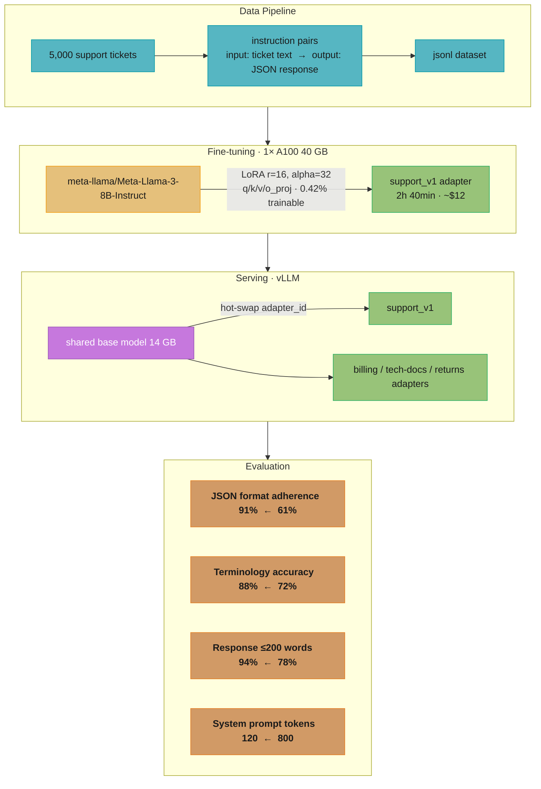

# LoRA (Low-Rank Adaptation)

## 1. Concept Overview

LoRA (Low-Rank Adaptation, Hu et al. 2021) is a [parameter-efficient fine-tuning](peft_methods.md) method that adds small trainable matrices alongside frozen pre-trained weights. Instead of updating all d×k parameters in a weight matrix W, LoRA decomposes the update ΔW into a product of two low-rank matrices: ΔW = B × A, where A ∈ ℝ^(r×k) and B ∈ ℝ^(d×r) with rank r ≪ min(d, k).

For a 7B model where a typical attention weight matrix is 4096×4096, the full update is 16.7M parameters. LoRA at rank 16 decomposes this into a 16×4096 + 4096×16 = 131K parameter update — 127× fewer parameters for one weight matrix. Across all target modules, LoRA adds ~0.1-1% of the total model parameters as trainable.

---

## Intuition

> **One-line analogy**: LoRA is like adding a thin correction layer over a painting — instead of repainting the whole canvas, you add a transparent overlay that adjusts specific parts.

**Mental model**: Pre-trained model weights encode general language and world knowledge. Fine-tuning teaches the model new task-specific behavior. The key insight is that the necessary weight updates have low intrinsic rank — the "direction of change" during fine-tuning can be captured by a low-dimensional subspace. LoRA explicitly enforces this: ΔW = B×A forces the update to live in an r-dimensional subspace. Because fine-tuning changes are empirically low-rank, this constraint loses little quality while reducing trainable parameters by 100-1000×.

**Why it matters**: LoRA reduced the compute and memory requirements for LLM fine-tuning from "requires a compute cluster" to "works on two to four consumer GPUs." This democratized fine-tuning: researchers, startups, and individuals can now produce production-quality specialized models from open-source base models.

**Key insight**: The intrinsic dimensionality hypothesis — that the important variation in weight updates during fine-tuning lies in a low-rank subspace — is what makes LoRA work. It's not an approximation: for most tasks, rank 16 captures 90%+ of the representational change needed.

---

## 2. Core Principles

- **Frozen base weights, trainable adapters**: W_original is never updated; only A and B matrices are trained.
- **Low-rank decomposition captures task-relevant updates**: The hypothesis that ΔW ≈ B×A (low rank) holds empirically for most fine-tuning tasks.
- **No inference overhead with merging**: After training, W_merged = W + B×A×(alpha/r) can be computed and stored, eliminating any inference overhead.
- **Modular and swappable**: Multiple LoRA adapters can be maintained and swapped at runtime for different tasks, without storing multiple full model copies.
- **Alpha controls the effective learning rate**: The alpha/r scaling factor acts as an adapter-specific learning rate multiplier; alpha=32 with r=16 doubles the effective scale.

---

## 3. How It Works — Detailed Mechanics

### 3.1 Mathematical Foundation

```
Standard linear layer:
  h = W × x
  W ∈ ℝ^(d×k): pre-trained frozen weight matrix

LoRA modification:
  h = W × x + (B × A) × x × (alpha / r)
  W: frozen (d×k), not updated during training
  A: trainable (r×k), initialized from Gaussian N(0, σ²)
  B: trainable (d×r), initialized to zeros (so ΔW = B×A = 0 at start)

Why initialize B to zero?
  At training start: h = W×x + 0×x = W×x
  Model behaves exactly like base model initially
  Stable training start without disruption to base model behavior

Scaling factor alpha/r:
  Equivalent to adjusting the learning rate of the LoRA module
  Common setting: alpha = 2×r (e.g., r=16, alpha=32)
  This normalizes the update magnitude regardless of rank choice
```

**Read it like this.** "Keep the pre-trained matrix exactly as it is, and bolt a narrow detour beside it: squeeze the input down to r numbers, expand it back out, scale it, and add the result to what the frozen layer already produced."

The whole method is one addition. Nothing inside `W` moves; the only thing training discovers is what to add.

| Symbol | What it is |
|--------|------------|
| `W` | The frozen pre-trained weight matrix, shape `d_out × d_in` (4096 × 4096 in a 7B attention projection). Never receives a gradient |
| `x` | The layer input, a `d_in`-vector. Same input feeds both the frozen path and the adapter |
| `A` | Trainable down-projection, shape `r × d_in` (16 × 4096). Squeezes the input into an r-dimensional bottleneck. Init: Gaussian `N(0, σ²)` |
| `B` | Trainable up-projection, shape `d_out × r` (4096 × 16). Expands the bottleneck back to full width. Init: all zeros |
| `r` | The rank — the width of the bottleneck, and the only thing that limits how expressive the update can be. Typically 4 to 64 |
| `alpha` | A fixed scaling constant chosen by you, not learned. Conventionally `2×r` |
| `alpha / r` | The scale actually multiplied into the adapter output. Decouples update magnitude from the rank you picked |
| `B × A` | The update `ΔW`, shape `d_out × d_in` — same shape as `W`, but forced to rank ≤ r because it factors through a width-r bottleneck |

**Walk one example.** One token through one 4096×4096 projection at `r=16, alpha=32`:

```
  input x                                     4096 numbers

  frozen path :  W x                          4096x4096 -> 4096 numbers out
  adapter step 1 :  A x                       16x4096   -> 16 numbers   (the bottleneck)
  adapter step 2 :  B (A x)                   4096x16   -> 4096 numbers
  adapter step 3 :  x (alpha/r) = x (32/16)   scale every entry by 2.0
  output h    :  W x  +  2.0 * B(Ax)          4096 numbers

  Everything the fine-tune learned had to fit through those 16 numbers in step 1.
  That bottleneck is the entire compression story -- not the matrix sizes.
```

Note the order: the adapter never forms `B × A` as a 4096×4096 matrix during training. It applies `A` then `B` to the *vector*, costing `2*16*4096 = 131,072` FLOPs each way instead of the `2*4096*16*4096 = 536,870,912` FLOPs it would take to build `ΔW` explicitly — a 4096× difference.

**Why B starts at zero and A does not.** With `B = 0`, the product `B × A` is the zero matrix, so `h = Wx + 0 = Wx` exactly. The wrapped model is byte-for-byte the base model on step 0 — no warmup damage, no loss spike. `A` must still be random: if both were zero, `∂L/∂A ∝ Bᵀ(...) = 0` and `∂L/∂B ∝ (Ax)ᵀ = 0`, so both gradients vanish and the adapter never leaves the origin. Random `A` plus zero `B` gives a no-op forward pass with a live gradient into `B`.

If instead you initialize *both* from `N(0, 0.02²)` at `r=16, alpha=32`, each entry of the scaled update has standard deviation `sqrt(16) × 0.02 × 0.02 × 2.0 = 0.0032` against a `W` whose entries have standard deviation `0.02` — a **16%** random perturbation injected into every adapted matrix before a single training step. Across 128 adapted projections in a 7B model that is a corrupted model at step 0, and the first hundred steps are spent undoing it.

### 3.2 Parameter Count Comparison

```
7B LLaMA-3 model:
  Total parameters: 7,000,000,000
  Attention matrices per layer: Q, K, V, O projections
    Each: 4096 × 4096 = 16,777,216 parameters

LoRA at rank r=16, targeting Q and V projections in 32 layers:
  Per projection, per layer:
    A matrix: 16 × 4096 = 65,536 parameters
    B matrix: 4096 × 16 = 65,536 parameters
    Total per projection: 131,072 parameters

  For Q + V × 32 layers:
    2 projections × 32 layers × 131,072 = 8,388,608 ≈ 8.4M parameters

  Trainable fraction: 8.4M / 7,000M = 0.12%

Full fine-tuning: 7,000M parameters updated
LoRA r=16 (Q+V): 8.4M parameters updated — 833× fewer

Memory savings:
  Full FT:   weights 14GB + gradients 14GB + Adam states 28GB = 56GB
  LoRA r=16: weights 14GB (frozen, no grad) + adapters ~50MB + Adam ~200MB ≈ 15GB
  (Frozen weights still loaded to GPU; only adapter gradients computed)
```

**What the formula is telling you.** "The parameter count of the adapter grows with `d_out + d_in`, but the matrix it replaces grows with `d_out × d_in` — you traded a product for a sum, and that is where every order of magnitude comes from."

| Symbol | What it is |
|--------|------------|
| `d_out × d_in` | Full-update parameter count for one matrix. Quadratic in width — `4096 × 4096 = 16,777,216` |
| `r × (d_out + d_in)` | LoRA pair parameter count for the same matrix. Linear in width — `r × 8192` at 4096 |
| `r × d_in` | The `A` half of that count |
| `d_out × r` | The `B` half. Equal to the `A` half only because this projection is square |
| trainable fraction | `r × (d_out + d_in) / (d_out × d_in)`, which at `d_out = d_in = 4096` simplifies to `r / 2048` |

**Walk one example.** Rank sweep on a single 4096×4096 attention projection (16,777,216 params):

```
   r     A: r x 4096     B: 4096 x r     pair = r*(4096+4096)    % of 16,777,216   fewer by
   4        16,384          16,384                 32,768            0.1953%          512x
   8        32,768          32,768                 65,536            0.3906%          256x
  16        65,536          65,536                131,072            0.7812%          128x
  64       262,144         262,144                524,288            3.1250%           32x

  Note the fraction is exactly r/2048 -- doubling r doubles the cost, always.
```

Now scale that to a whole model. Llama-2-7B has 32 layers; adapting `q_proj`, `k_proj`, `v_proj`, `o_proj` means `4 × 32 = 128` matrices of 4096×4096:

```
   r    per matrix    x 128 matrices = trainable    % of 7,000,000,000
   4        32,768                    4,194,304           0.0599%
   8        65,536                    8,388,608           0.1198%
  16       131,072                   16,777,216           0.2397%
  64       524,288                   67,108,864           0.9587%

  At r=16 the ENTIRE trainable set (16,777,216) is exactly the size of ONE
  frozen 4096x4096 projection. You are training one matrix's worth of numbers
  to steer 128 of them.
```

That last line is the fact worth carrying into an interview. It also explains the section's `~8.4M` figure: that targets only `q_proj + v_proj` (2 projections × 32 layers = 64 matrices), exactly half of the 16.8M above.

**Why the memory win is bigger than the parameter win.** Adam keeps two fp32 moment tensors — first moment `m` and second moment `v` — per *trainable* parameter, so 8 bytes each, plus a gradient. Frozen parameters get none of that:

```
  Llama-2-7B, bf16 weights, Adam with fp32 moments (1 GB = 1e9 bytes)

                         full fine-tune          LoRA r=16 (q/k/v/o, 128 matrices)
  weights   (bf16, 2B)      14.0 GB                 14.0 GB   frozen, still resident
  gradients (fp32, 4B)      28.0 GB                  0.067 GB  only 16,777,216 of them
  Adam m + v (fp32, 8B)     56.0 GB                  0.134 GB
                          ---------               ----------
  optimizer state alone     56.0 GB                  0.134 GB   417x smaller
  adapter file (bf16, 2B)        --                  0.034 GB   34 MB, not 14 GB

  The 14 GB of frozen weights does not shrink -- LoRA does not compress the model.
  It deletes the 84 GB of TRAINING scaffolding stacked on top of it.
```

The `28GB` Adam figure quoted in the block above assumes bf16 moments, which some frameworks use; fp32 moments are the safer and more common default and cost `7e9 × 8 = 56 GB`. Either way the LoRA column is a rounding error, which is precisely why a 7B fine-tune drops from "cluster" to "one 24 GB card."

### Shape Intuition — Full Update vs Low-Rank Factorization
```
LoRA never trains the full ΔW. It factors that update into two thin matrices:

  Full ΔW (d×k = 4096×4096)        LoRA factors it as B (4096×16) × A (16×4096)
  ┌────────────────────┐
  │                    │           ┌┐         ┌────────────────────┐
  │                    │           ││    ×    └────────────────────┘
  │  16,777,216 params │    ≈      ││         A: 16×4096 = 65,536
  │  (every cell)      │           ││         B: 4096×16 = 65,536
  │                    │           ││
  └────────────────────┘           └┘         131,072 params total (B + A)
       all cells trained        tall sliver   wide sliver

  16.7M  →  131K trainable params  —  127× fewer for a single weight matrix
```
The two slivers only ever touch at rank r=16, so their product is forced to be
rank ≤ 16 — that low-rank constraint is exactly what makes the parameter count
collapse while still capturing the fine-tuning update.

### 3.3 Rank Selection

```
r=4:   ~2M params (Q+V, 32 layers); good for format/style changes
       Example: "always respond in JSON format"
       Training: fast; 1 epoch sufficient for simple adaptation

r=8:   ~4M params; standard for instruction following, chat alignment
       Example: domain-specific chat style, persona adaptation
       Default for most community fine-tuning recipes

r=16:  ~8M params; best balance for task learning and domain adaptation
       Example: SQL generation, code completion in specific style
       Start here for production fine-tuning

r=32:  ~17M params; complex task learning, significant behavior change
       Example: step-by-step reasoning chains, specialized multi-step tasks

r=64:  ~33M params; approaching full fine-tune quality; diminishing returns
       Use when r=32 is insufficient; rare in practice

r=128: ~67M params; almost never justified; use full fine-tune instead

Rule: start with r=16, alpha=32. If quality insufficient, double r.
If r=64 still insufficient, switch to full fine-tuning.
```

**Put simply.** "Dividing by `r` cancels out the fact that a wider bottleneck naturally produces a bigger update, so changing the rank changes the adapter's *capacity* without changing its *loudness* — and your learning rate survives the change."

| Symbol | What it is |
|--------|------------|
| `B × A` | The raw, unscaled update. A sum of `r` rank-1 outer products, so its magnitude grows roughly proportionally to `r` |
| `r` in the denominator | The normalizer. Divides out that growth so the scaled update no longer tracks the rank |
| `alpha` in the numerator | Your one free knob for how loud the adapter is, now independent of `r` |
| `alpha / r` | The net multiplier. `> 1` amplifies the adapter, `= 1` is neutral, `< 1` damps it |
| `alpha = 2r` convention | Pins the multiplier at `2.0` for every rank, so a rank sweep needs no LR retuning at all |

**Walk one example.** Hold `alpha = 16` and sweep the rank. Suppose each of the `r` rank-1 terms contributes about `0.05` to a given output entry, so the raw sum is `0.05 × r`:

```
    r     raw |BA| = 0.05*r     alpha/r = 16/r      scaled = raw * (alpha/r)
    8          0.40                 2.0                    0.80
   16          0.80                 1.0                    0.80
   32          1.60                 0.5                    0.80

  Scaled column is FLAT. Rank changed 4x; the update the model actually feels
  did not move. Same LR works for all three runs.

  Now delete the /r and rescale by alpha alone (or by nothing at all):

    r      raw       no scaling      what happens
    8      0.40        0.40          tuned LR is fine here
   16      0.80        0.80          2x louder -- mild instability
   32      1.60        1.60          4x louder -- loss spikes, needs LR/4

  Without /r, every rank change is silently also a learning-rate change.
```

**Why this term exists.** Rank is meant to be a capacity dial: "how many independent directions may the update use." Without the `1/r` normalizer it is a capacity dial *and* a step-size dial welded together, so an experiment that raises `r=16` to `r=32` to test capacity actually tests capacity-plus-double-LR, and a resulting loss spike gets misread as "rank 32 is unstable." The `alpha/r` form separates the two, which is what makes the rank ladder in the block above a clean sweep rather than four independently-tuned runs. It is also why Pitfall 1 matters: setting `alpha = r` yields a multiplier of `1.0` rather than the well-tested `2.0`, halving the adapter's contribution without any error message.

### Why Low Rank Suffices — Singular-Value Spectrum
```
Singular values of the fine-tuning update ΔW, sorted largest-first:

 σ1  │████████████████████
 σ2  │███████████████
 σ3  │███████████
 σ4  │████████
 σ8  │█████
 σ16 │███                  ← rank r=16 cutoff: top components capture ~90-98% of ΔW
 σ32 │█                    ┐
 σ64 │▏                    │ long thin tail — discarding it costs only ~2-10% quality
 σ128│·                    ┘
     └──────────────────────────────────────────────
      the task-relevant change lives in the top few directions

Healthy adapter: values decay steeply (like above) → r is large enough.
Rank too low:    every σ stays near σ1 (no decay) → the update needs more than r
                 dimensions; raise r and re-check the eval metric.
```
This decay is the intrinsic-rank hypothesis made visible: fine-tuning moves the
weights mostly along a handful of directions, so a rank-16 factorization recovers
nearly all of it.

### 3.4 Target Module Selection

```
Typical transformer attention block:
  q_proj: query projection (d×d)
  k_proj: key projection (d×d)
  v_proj: value projection (d×d)
  o_proj: output projection (d×d)
  + FFN: gate_proj, up_proj, down_proj

LoRA target configurations (increasing coverage):

Minimal — style/format only (fast training):
  target_modules: ["q_proj", "v_proj"]
  Trainable: ~8M params (7B model)
  Use when: teaching format, style, simple instruction following

Standard — task adaptation:
  target_modules: ["q_proj", "k_proj", "v_proj", "o_proj"]
  Trainable: ~17M params
  Use when: task-specific behavior, Q&A style adaptation

Full attention + FFN — domain adaptation:
  target_modules: ["q_proj", "k_proj", "v_proj", "o_proj",
                   "gate_proj", "up_proj", "down_proj"]
  Trainable: ~30M params
  Use when: significant domain shift, specialized knowledge

Research finding: v_proj contributes most to quality; q_proj second.
Including k_proj and o_proj adds marginal improvement over q+v.
```

### 3.5 Merging LoRA Weights

```
After training, merge LoRA into base model weights:

W_merged = W_frozen + B × A × (alpha / r)
         = W_frozen + ΔW

Result: a standard model file with no adapter overhead
  Same inference performance as base model
  No architectural change during inference
  Fully compatible with any inference framework (vLLM, llama.cpp, etc.)

Code:
  from peft import PeftModel
  model = PeftModel.from_pretrained(base_model, adapter_path)
  merged_model = model.merge_and_unload()
  merged_model.save_pretrained("merged_model_path")

Keep adapters separate when:
  - Multiple task-specific adapters for the same base model
    (swap adapters at runtime without storing multiple full models)
  - Continuing fine-tuning with additional data
  - Experimenting with different rank combinations
  - The base model is much larger than the adapter (70B model, 50MB adapter)
```

**Stated plainly.** "Do the addition once, offline, and bake the result into the weight file — then inference has nothing extra to do, because there is no longer a second path to run."

| Symbol | What it is |
|--------|------------|
| `W_frozen` | The original pre-trained matrix, unchanged on disk |
| `B × A × (alpha/r)` | The full-shape `d_out × d_in` update, materialized once at merge time |
| `W_merged` | Their elementwise sum. Same shape, same dtype, same file format as `W_frozen` |
| "lossless" | Exact in real arithmetic — the only error is fp rounding on the add, not an approximation of `ΔW` |

**Walk one example.** FLOPs per token for one 4096×4096 projection at `r=16` — merged versus unmerged:

```
  merged:    W_merged @ x        2 * 4096 * 4096      = 33,554,432 FLOPs
                                                        (one matmul, done)

  unmerged:  W @ x               2 * 4096 * 4096      = 33,554,432
           + A @ x               2 *   16 * 4096      =    131,072
           + B @ (A@x)           2 * 4096 *   16      =    131,072
                                                        ----------
                                 total                  33,816,576 FLOPs

  overhead = 262,144 / 33,554,432 = 0.7812%   ->  1.0078x the merged cost
```

The `2` in `2 * d_out * d_in` is one multiply plus one add per weight. The overhead scales with `r`, and it is exactly the same `r/2048` fraction as the parameter count:

```
    r      extra FLOPs per token per projection      overhead vs merged
    4                  65,536                             0.195%
    8                 131,072                             0.391%
   16                 262,144                             0.781%
   64               1,048,576                             3.125%
```

**So why does anyone leave adapters unmerged?** Because that sub-1% arithmetic cost is not the real cost. Unmerged serving adds two extra kernel launches per adapted layer — 256 of them at `r=16` across 128 projections — and small skinny matmuls run far below peak GPU utilization, so measured latency overhead lands nearer 5-15% than 0.78%. What you buy for it is the multi-adapter economics from the diagram above: one 14 GB base model in memory and N adapters at ~34 MB each, versus N merged 14 GB checkpoints. At `N = 4` adapters that is 14.1 GB against 56 GB. Merge when you ship exactly one task; stay unmerged the moment there are two.

### 3.6 PEFT Configuration Code

```python
from peft import LoraConfig, get_peft_model, TaskType
from transformers import AutoModelForCausalLM

# Load base model
base_model = AutoModelForCausalLM.from_pretrained(
    "meta-llama/Meta-Llama-3-8B-Instruct",
    torch_dtype=torch.bfloat16,
    device_map="auto"
)

# Configure LoRA
lora_config = LoraConfig(
    r=16,                     # rank
    lora_alpha=32,            # scaling factor (alpha = 2×r convention)
    target_modules=[          # which weight matrices to adapt
        "q_proj", "k_proj", "v_proj", "o_proj",
        "gate_proj", "up_proj", "down_proj"
    ],
    lora_dropout=0.05,        # dropout on LoRA layers (regularization)
    bias="none",              # don't train bias terms
    task_type=TaskType.CAUSAL_LM
)

# Wrap base model with LoRA adapters
model = get_peft_model(base_model, lora_config)

# Print trainable parameters
trainable_params = sum(p.numel() for p in model.parameters() if p.requires_grad)
all_params = sum(p.numel() for p in model.parameters())
print(f"Trainable: {trainable_params:,} / {all_params:,} = {100*trainable_params/all_params:.2f}%")
# Output: Trainable: 41,943,040 / 8,030,261,248 = 0.52%
```

---

## 4. Architecture Diagram

### LoRA Applied to Transformer Attention



The left subgraph shows the adapter bypass: W·x and B·A·x·(alpha/r) are summed at
every forward pass during training. The right subgraph shows that after merging, the
addition disappears — the fused W_merged is a single weight matrix with no runtime
overhead, which is why LoRA merged models run at full base-model speed.

### LoRA Parameter Flow During Training



Solid arrows are the forward pass; dotted arrows are the backward pass (gradient
signals). The dotted edge to W carries zero gradient — the optimizer never touches W,
so no gradient memory is allocated for the frozen weights, halving the per-weight
memory cost relative to full fine-tuning.

### Multi-Adapter Serving — One Base Model, Many Tasks



The 14 GB base model loads once; each adapter is just its B and A matrices (~130 MB).
Swapping tasks is a matrix-add at request time (vLLM hot-swap), not a 14 GB model
reload — the economic core of serving 50+ specialized models on one GPU.

---

## 5. Real-World Examples

### LLaMA → Alpaca (2023)
- Stanford: fine-tuned LLaMA 7B with LoRA r=8 on 52K instruction-following examples
- Training cost: ~$100 on cloud GPUs; 3 hours on 4× A100
- Achieved instruction-following capability comparable to text-davinci-003

### LLaMA → Code-focused adapters
- Community LoRA adapters for code generation: WizardCoder, Phind-CodeLlama
- r=16 to r=64 targeting all attention + FFN modules
- Released as separate adapter weights on HuggingFace; swappable over the same base model

### Multi-adapter serving (vLLM)
- [vLLM](../vllm_deep_dive/README.md) supports serving multiple LoRA adapters from a single base model
- Different adapters loaded per request based on a routing tag
- Enables serving 50+ specialized models from 1 GPU serving one base model

---

## 6. Tradeoffs

| Configuration | Trainable % | Memory | Quality | Training Speed |
|--------------|-------------|--------|---------|----------------|
| Full fine-tune | 100% | ~56GB (7B) | Best | Slowest |
| LoRA r=4 (Q+V) | 0.06% | ~15GB | Good (style) | Fastest |
| LoRA r=16 (all attn) | 0.24% | ~16GB | Very good | Fast |
| LoRA r=16 (all+FFN) | 0.52% | ~16GB | Excellent | Fast |
| LoRA r=64 (all+FFN) | 2.1% | ~18GB | Near-full | Moderate |

---

## 7. When to Use / When NOT to Use

### Use LoRA When:
- Single GPU or limited GPU memory (LoRA at r=16 fits in 16GB)
- Multiple task-specific adaptations needed from the same base model
- Want to preserve base model capabilities (frozen weights)
- Need to ship adapter files rather than full model copies (50MB vs. 14GB)

### Use Full Fine-Tuning When:
- Fundamental domain shift requiring changes to all model layers
- Access to large GPU cluster makes full FT practical
- Maximum possible quality is required regardless of cost

### Use LoRA with Higher Rank When:
- r=16 quality is insufficient on your task-specific eval set
- Domain shift is significant (medical, legal text with specific structure)
- Training data is large enough (>50K high-quality examples) to benefit from more capacity

---

## 8. Common Pitfalls

**1. Wrong alpha/rank ratio**
Setting alpha = r (instead of alpha = 2×r or alpha = r) halves the effective learning rate of the adapter. This silently reduces training effectiveness.
Fix: Use alpha = 2×r as the default starting point (r=16, alpha=32). If training is unstable, reduce alpha. If adapters don't learn fast enough, increase alpha.

**2. Targeting only Q and V for complex tasks**
Minimal target_modules (q_proj + v_proj) is sufficient for style changes but insufficient for knowledge-intensive tasks or significant behavior changes.
Fix: For task-specific fine-tuning, include all attention projections (Q, K, V, O). For domain adaptation, also include FFN modules (gate_proj, up_proj, down_proj).

**3. Learning rate too high for LoRA**
LoRA's adapter matrices start near zero. A high learning rate (1e-3) causes large early updates that destabilize training before meaningful learning occurs.
Fix: Use 1e-4 to 3e-4 for LoRA (lower than standard LM training). Some recipes use 2e-4 for LoRA specifically; this is well-tested.

**4. Forgetting to normalize gradients with gradient accumulation**
With batch_size=1 and gradient_accumulation_steps=8, the effective batch size is 8. Setting the LR for batch_size=1 but not adjusting for the larger effective batch overestimates the LR.
Fix: Scale LR by √(effective_batch_size / reference_batch_size). Or use a learning rate scheduler that accounts for gradient accumulation.

**5. Loading LoRA adapter with mismatched base model version**
A LoRA adapter trained on LLaMA-3-8B-Instruct will not work correctly with LLaMA-3-8B-Base (different vocabulary, different system prompt structure).
Fix: Always record the exact base model checkpoint used for training. Store this as metadata with the adapter. Validate base model compatibility before serving.

---

## 9. Technologies & Tools

| Tool | Purpose | Notes |
|------|---------|-------|
| **HuggingFace PEFT** | LoRA implementation | Standard library; `LoraConfig`, `get_peft_model` |
| **Unsloth** | Fast LoRA training | 2× faster than PEFT; lower VRAM; uses FlashAttention |
| **Axolotl** | Training orchestration | YAML-configured; supports LoRA, QLoRA, full FT |
| **TRL SFTTrainer** | Supervised fine-tuning | Integrates PEFT + HuggingFace Trainer |
| **LLaMA-Factory** | All-in-one fine-tuning | Web UI; multi-model support; easy data handling |
| **vLLM** | LoRA serving | Efficient multi-adapter serving from single base model |
| **HuggingFace Hub** | Adapter storage/sharing | Standard repository for LoRA adapter weights |

---

## 10. Interview Questions with Answers

**Q: What is LoRA and why is it efficient?**
A: LoRA (Low-Rank Adaptation) adds trainable low-rank matrices ΔW = B×A to frozen pre-trained weights, where A ∈ ℝ^(r×k) and B ∈ ℝ^(d×r) with rank r ≪ min(d,k). For a 4096×4096 weight matrix, full fine-tuning updates 16.7M parameters; LoRA at r=16 updates only 2 × (16×4096) = 131K parameters — 127× fewer. Efficiency comes from two sources: fewer parameters means much less gradient computation and memory for optimizer states; frozen base weights need no gradient accumulation, saving ~2× the weight memory. For a 7B model: full FT requires ~56GB; LoRA r=16 requires ~15-16GB.

**Q: What is the difference between LoRA and full fine-tuning?**
A: Full fine-tuning updates every parameter in the model, providing maximum flexibility and quality but requiring the same memory as pre-training (~56GB for a 7B model). LoRA freezes all pre-trained parameters and trains only small adapter matrices, updating ~0.1-1% of parameters. Full fine-tuning: higher risk of catastrophic forgetting (all weights change), requires large GPU cluster, best quality. LoRA: much lower memory (fits in 16GB GPU), lower forgetting risk (base weights preserved), comparable quality for most tasks, adapters are modular and swappable (50MB file vs. 14GB model). The choice is primarily driven by budget, quality requirements, and whether multiple task-specific adapters are needed.

**Q: How does the intrinsic rank hypothesis justify LoRA?**
A: The intrinsic rank hypothesis (Aghajanyan et al. 2020) states that fine-tuning objectives have low intrinsic dimensionality — the optimal fine-tuned model lives in a low-dimensional subspace of the full parameter space. Concretely: when you train a full fine-tuned model and analyze the weight update matrix ΔW = W_finetuned - W_pretrained, the singular value decomposition shows that most of the "work" is done by the top-r singular components. LoRA exploits this by directly parameterizing ΔW as a rank-r matrix. The empirical validation: LoRA at r=16 achieves 95-98% of full fine-tuning quality on most benchmarks, confirming that the update is approximately rank-16.

**Q: How do you choose the right LoRA rank for your use case?**
A: Rank determines the expressiveness of the adapter. Rule of thumb: start with r=16, alpha=32 for most production tasks. r=4 to r=8: style/format changes, simple instruction alignment, small dataset (<1K examples). r=16: standard instruction tuning, task-specific adaptation, most production fine-tuning scenarios. r=32 to r=64: domain adaptation, complex reasoning chains, significant behavior change. Above r=64 shows diminishing returns relative to cost. Empirically: train with r=16 first, evaluate on your task metric, then try r=32 if quality is insufficient. The quality improvement from r=16 to r=32 is meaningful; from r=64 to r=128 is minimal.

**Q: What does the alpha parameter in LoRA control?**
A: Alpha is a scaling factor applied to the LoRA output: h = W×x + (B×A)×x×(alpha/r). The ratio alpha/r controls the effective learning rate of the adapter — larger alpha/r means the adapter's output contributes more strongly to the final activation. Convention: alpha = 2×r (e.g., r=16, alpha=32) gives alpha/r = 2, which empirically produces good training stability. Setting alpha=r (alpha/r=1) effectively halves the adapter's contribution. Setting alpha=4×r can cause training instability. The alpha parameter exists to decouple the scaling from the rank choice: you can change r without changing the effective scale by adjusting alpha accordingly.

**Q: When should you merge LoRA adapters vs. keep them separate?**
A: Merge when: the final production model is a single-task deployment and inference efficiency is critical (no adapter overhead); deploying to inference frameworks that don't support adapters (llama.cpp, some quantization pipelines). Keep separate when: serving multiple task-specific adapters from the same base model (vLLM multi-adapter serving); the base model is extremely large (70B — storing 14GB of adapters beats 280GB of merged models); continuing fine-tuning with additional data; distributing on HuggingFace (users apply the adapter to their own copy of the base model). Merging is mathematically lossless: W_merged = W + B×A×(alpha/r) is exact, not an approximation.

**Q: How does LoRA prevent catastrophic forgetting?**
A: LoRA prevents forgetting through the frozen weights mechanism: the original pre-trained weights W are never updated. All gradient flow is through A and B matrices only. Since W is unchanged, the base model's representations and capabilities are fully preserved. The only change is in the adapter output B×A×x, which is additive — the base model's contribution W×x is always present. In practice, LoRA rarely causes forgetting even for large rank values, unlike full fine-tuning where high learning rates can overwrite general capabilities. The one exception: if training data is heavily one-sided (only domain text, no general text), the adapter can "steer" the model's outputs in ways that appear to reduce general capability.

**Q: How do target module choices affect LoRA quality?**
A: Each target module captures a different aspect of the transformer's computation. Q and V projections control what information is attended to and what's extracted from attended positions — most task-specific behavior changes. O projection controls how attention heads are combined. K projection controls key representations for attention scoring. FFN modules (gate, up, down) control feedforward transformations that encode most of the model's "factual knowledge." For format and style tuning: Q+V is sufficient. For task adaptation: Q+K+V+O captures full attention behavior. For domain knowledge: add FFN modules. Research shows V contributes most to quality improvements, followed by Q; K adds less; O and FFN add incrementally.

**Q: What is the difference between LoRA and adapter layers (Houlsby adapters)?**
A: Adapter layers (Houlsby et al. 2019) insert small bottleneck modules (down-projection → activation → up-projection) after each attention and FFN block. They're always active during inference (unlike merged LoRA). LoRA modifies existing weight matrices in place and can be merged post-training. Key differences: (1) Inference overhead — adapters always add computational cost; merged LoRA has zero overhead; (2) Position — adapters are inserted; LoRA modifies in-place; (3) Mergeability — LoRA merges cleanly; adapters cannot merge; (4) Quality — comparable for most tasks. LoRA has become the dominant PEFT method because of mergeability and the ability to serve multiple adapters from one base model.

**Q: How is LoRA applied to vision and multimodal models?**
A: LoRA applies identically to vision and multimodal models. In Vision Transformers (ViT): apply LoRA to attention Q, K, V, O projections in the image encoder. In multimodal models (LLaVA, InstructBLIP): can apply LoRA to both the language model decoder and the vision encoder independently, or jointly. The rank and target module choices follow the same guidelines as language-only models. One consideration for multimodal fine-tuning: the vision encoder often requires lower ranks (r=4 to r=8) because visual representations change less than language representations during task adaptation. Keep separate LoRA configurations for vision and language components if they require different learning dynamics.

**Q: How do you serve multiple LoRA adapters efficiently from a single base model?**
A: Multi-LoRA serving loads one copy of the base model weights on GPU and dynamically applies per-request adapter weights. vLLM implements this natively: the base model occupies the bulk of GPU memory; each adapter is stored as a small set of matrices loaded into a pre-allocated adapter slot. Memory cost per adapter: for each target layer, the adapter adds rank × 2 × hidden_dim × 2 bytes (one A matrix and one B matrix in BF16). For a 7B model with r=16 targeting q_proj and v_proj across 32 layers: 16 × 2 × 4096 × 2 bytes × 2 projections × 32 layers = 134MB per adapter. vLLM can serve 50+ adapters from one base model instance by keeping only the active adapter's weights in GPU SRAM during a request; idle adapter weights can reside in pinned CPU memory and transfer in ~5-10ms. Route requests using an adapter_id tag in the request metadata.

**Q: How do you diagnose whether your LoRA rank is too low for the task?**
A: Rank insufficiency shows two clear signals. First, validation loss plateaus early and stays high — training loss continues decreasing (the rank-constrained adapter overfits to the training distribution) while validation loss stagnates, indicating the low-rank subspace cannot represent the task-relevant update directions. Second, the model fails specifically on complex patterns while succeeding on simple ones — for a SQL generation task, it handles basic SELECT queries but fails on multi-table JOINs or subqueries. Diagnosis steps: train with r=16 and evaluate; train with r=32 and compare; if r=32 shows meaningful improvement (>2% on your eval metric), the bottleneck was rank. Also inspect adapter singular values: a well-fit adapter has singular values that decay gradually; a rank-insufficient adapter has all singular values near the maximum, indicating the rank constraint is actively binding.

**Q: Can you combine multiple LoRA adapters and how does quality hold up?**
A: Multiple LoRA adapters can be combined through linear combination of their weight updates: W_combined = W_base + lambda_1 × (B_1 × A_1) + lambda_2 × (B_2 × A_2). The lambdas are mixing coefficients (typically summing to 1). In practice with two adapters (lambda_1 = lambda_2 = 0.5), the combined model retains roughly 80-90% of each individual adapter's task performance. Quality degrades noticeably with three or more adapters — the low-rank updates from different tasks increasingly interfere in weight space, and the combined update no longer sits cleanly in any single task's useful subspace. Ties-Merging and DARE are techniques that prune redundant adapter parameters before merging to reduce interference. For production multi-task serving, hot-swapping discrete adapters per request is more reliable than merging — blending is primarily useful for style interpolation (e.g., 70% formal + 30% concise tone adapter).

**Q: What is the quality impact of applying LoRA to MLP layers in addition to attention layers?**
A: Targeting only attention layers (q_proj, v_proj) is the standard starting point and handles most behavior changes. Adding MLP layers (gate_proj, up_proj, down_proj) increases trainable parameters by roughly 50% for a standard LLaMA architecture — from approximately 8M to 30M parameters for a 7B model at r=16 — and empirically improves quality by 2-5% on complex tasks. The mechanism: attention layers primarily control what information is attended to and combined; MLP layers encode the model's factual knowledge and transformation functions. Tasks requiring new domain knowledge (medical terminology, specialized code APIs, legal reasoning patterns) benefit more from including MLP layers because the relevant information is stored in FFN weights. Simple behavior changes (output format, response style, persona) do not need MLP layers. A practical rule: include gate_proj, up_proj, down_proj when your training data contains substantial domain-specific vocabulary or factual content not well-represented in the base model.

**Q: How do you prevent catastrophic forgetting of general capabilities during LoRA fine-tuning?**
A: LoRA's frozen base weights are the primary defense against forgetting — general capabilities encoded in W are never updated. However, the adapter output B×A×x can steer the model's responses in ways that effectively suppress general capabilities even without changing W. The main risk is heavy domain concentration in training data. Mitigation strategies: mix 10-20% general instruction-following examples (e.g., Alpaca, ShareGPT) into the training set alongside domain-specific data; this regularizes the adapter to maintain general response quality. Use a lower learning rate for LoRA (1e-4 rather than 3e-4) to constrain how strongly the adapter shifts model behavior. Monitor general capability benchmarks (MMLU, MT-Bench, or a held-out general instruction set) alongside task-specific metrics throughout training; if general scores drop more than 5% relative, reduce the learning rate or increase the general data mixture. Gradient clipping at 1.0 also helps prevent large adapter updates that dominate base model representations.

---

## 11. Best Practices

1. **Start with r=16, alpha=32** — the most well-tested defaults; adjust only after measuring quality on your eval set.
2. **Include all attention modules for task-specific fine-tuning** — Q, K, V, O projections; add FFN for domain adaptation.
3. **Use LR 1e-4 to 3e-4** — higher LRs destabilize LoRA training even though fewer parameters are being updated.
4. **Always mask instruction tokens from loss** — only compute cross-entropy loss on the response portion, not the instruction.
5. **Validate before merging** — evaluate merged model vs. adapter model to confirm merge was lossless; occasional numerical precision issues can degrade quality.
6. **Track adapter metadata** — store base model name, exact checkpoint, rank, alpha, target modules; enables correct loading and reproduction.
7. **Test on general benchmarks after fine-tuning** — even with LoRA's frozen base, verify the adapter doesn't degrade the model's general capabilities before production deployment.

---

## 12. Case Study: Fine-Tuning LLaMA 3 8B with LoRA for Customer Support

**Problem Statement**: A SaaS company needs to fine-tune LLaMA 3 8B Instruct to handle customer support tickets. The base model responds well to general questions but fails on three key requirements: (1) always structuring responses in a specific JSON format with fields for `issue_category`, `resolution_steps`, and `escalation_required`; (2) using company-specific product terminology correctly (product names, internal codes); (3) keeping responses under 200 words. The previous prompt-engineering approach required 800-token system prompts that ate into the context window and added latency.

**Architecture Overview**:



**Key Design Decisions**:
1. Attention-only target modules (q_proj, k_proj, v_proj, o_proj) because the task requires behavior change (format adherence, response style) not new knowledge — MLP layers not needed.
2. Rank r=16 chosen after evaluating r=8 (86% format adherence) and r=16 (93% format adherence) on a 200-example holdout set; r=32 added only 0.5% improvement, not worth doubling parameters.
3. 10% general instruction data mixed in (500 examples from ShareGPT) to prevent the adapter from degrading general QA capability.
4. Deployed as a separate adapter rather than a merged model — the company runs three other LoRA adapters from the same LLaMA 3 8B base (billing, technical docs, returns), all served from a single vLLM instance.

**Implementation**:
```python
from peft import LoraConfig, get_peft_model, TaskType
from transformers import AutoModelForCausalLM, TrainingArguments
from trl import SFTTrainer
import torch

base_model = AutoModelForCausalLM.from_pretrained(
    "meta-llama/Meta-Llama-3-8B-Instruct",
    torch_dtype=torch.bfloat16,
    device_map="auto"
)

lora_config = LoraConfig(
    r=16,
    lora_alpha=32,
    target_modules=["q_proj", "k_proj", "v_proj", "o_proj"],
    lora_dropout=0.05,
    bias="none",
    task_type=TaskType.CAUSAL_LM
)

model = get_peft_model(base_model, lora_config)
# Trainable: 33,554,432 / 8,030,261,248 = 0.42%

training_args = TrainingArguments(
    output_dir="./support_lora",
    per_device_train_batch_size=4,
    gradient_accumulation_steps=8,   # effective batch = 32
    num_train_epochs=3,
    learning_rate=2e-4,
    lr_scheduler_type="cosine",
    warmup_ratio=0.03,
    bf16=True,
    logging_steps=50,
    evaluation_strategy="steps",
    eval_steps=200,
    save_strategy="best",
    metric_for_best_model="eval_loss"
)

trainer = SFTTrainer(
    model=model,
    train_dataset=train_dataset,
    eval_dataset=eval_dataset,
    args=training_args,
    max_seq_length=1024
)
trainer.train()
model.save_pretrained("./support_lora_adapter")
```

**Results**:
- JSON format adherence: 91% (up from 61% with prompt engineering alone; target was 90%)
- Terminology accuracy: 88% keyword match (up from 72%)
- Response length compliance: 94% under 200 words (up from 78%)
- Average system prompt reduced from 800 tokens to 120 tokens (standard system prompt only)
- Inference latency: 18% lower than prompt-engineering approach due to shorter effective context
- Training time: 2 hours 40 minutes on 1x A100 40GB
- Training cost: ~$12 at cloud GPU rates

**Tradeoffs and Alternatives**:
- Full fine-tuning was evaluated: achieved 94% format adherence (vs. 91% with LoRA r=16), not worth the 56GB memory requirement and inability to share the GPU across four adapter variants.
- LoRA r=32 was evaluated: 91.5% format adherence vs. 91.0% for r=16; the 0.5% gain did not justify doubling trainable parameters and adapter file size.
- Prompt engineering alone (no fine-tuning): 61% format adherence — the structured JSON output requirement was too strict for prompt-only approaches to reliably satisfy across ticket types.
- [QLoRA](qlora.md) was considered: A100 40GB had sufficient memory for standard LoRA; QLoRA would have added 20% training time overhead (dequantization) with no memory benefit on this hardware.
