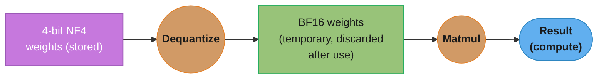

# QLoRA (Quantized LoRA)

## 1. Concept Overview

QLoRA (Dettmers et al. 2023, [arXiv:2305.14314](https://arxiv.org/abs/2305.14314)) combines two techniques to dramatically reduce GPU memory requirements for LLM fine-tuning: quantize the frozen base model to 4-bit NF4 (NormalFloat4) precision, and train [LoRA](lora.md) adapters in full BF16 precision on top of the quantized base. A 7B model that needs ~15GB for standard BF16 LoRA training needs only 5-6GB with QLoRA — enabling fine-tuning on a single 16GB consumer GPU.

QLoRA made fine-tuning accessible beyond research labs. Before QLoRA (paper released May 2023), fine-tuning a 7B model needed a 24GB+ GPU for LoRA or significantly more for full fine-tuning, and 65B was out of reach on one card. After QLoRA, an RTX 4080 (16GB) can fine-tune 7B models, and the paper's own headline result fine-tuned a 65B model on a single 48GB GPU.

---

## 2. Intuition

> **One-line analogy**: QLoRA is like storing your textbooks in compressed PDFs to save shelf space, then printing only the pages you need to annotate.

**Mental model**: Standard LoRA loads the full-precision (BF16) base model weights to GPU — 7B model × 2 bytes/param = 14GB just for weights. QLoRA compresses those 14GB to ~3.5GB using 4-bit quantization, leaving 12GB more headroom for adapters, gradients, and activations. The LoRA adapters themselves are still trained in full BF16 precision — the quantization only affects the frozen base weights, not the learning process.

**Why it matters**: Hardware access is the primary barrier to LLM fine-tuning. QLoRA removed the A100 requirement and made 7B-13B model fine-tuning accessible on consumer hardware, dramatically expanding who can train specialized models.

**Key insight**: The key innovation is NF4 quantization — a 4-bit format specifically optimized for normally distributed neural network weights, minimizing information loss for the specific distribution that pre-trained LLM weights follow.

---

## 3. Core Principles

- **Quantize frozen weights, not adapters**: The 4-bit compression applies only to the frozen base model weights; LoRA adapters are trained at full BF16 precision.
- **NF4 is designed for LLM weights**: LLM weights are approximately normally distributed; NF4 assigns more quantization levels near zero (where most weights cluster) for minimal information loss.
- **Double quantization reduces metadata overhead**: Quantization itself has scaling factors (metadata); NF4 quantizes those scaling factors too, saving additional memory.
- **Paged optimizers prevent OOM crashes**: CUDA unified memory is used for optimizer states, paging them to CPU RAM when GPU memory is full — preventing training interruptions.
- **Dequantization on-the-fly**: During the forward pass, 4-bit weights are dequantized to BF16 for computation, then discarded — only 4-bit weights are stored, not 16-bit.

---

## 4. Types / Architectures / Strategies

QLoRA is not a single fixed recipe — it is a stack of four independent choices layered under an ordinary [LoRA](lora.md) adapter. Each choice trades memory, quality or throughput, and three of the four have defaults that are wrong for QLoRA.

**Axis 1 — The 4-bit storage format.** All three spend the same 4 bits per weight; they differ only in where the 16 representable levels sit on the number line.

| Format | Level placement | Pile CC perplexity (QLoRA paper, Table 2) | Applies when |
|--------|-----------------|-------------------------------------------|--------------|
| INT4 | Uniform value spacing | 34.34 | Never for LLM weights — wastes levels on empty tails |
| FP4 (E2M1) | Floating-point exponent/mantissa grid | 31.07 | Only as a fallback; it is the bitsandbytes **default** |
| NF4 | Equal-probability quantiles of `N(0,1)` | 27.41 (with double quant) | Always — set `bnb_4bit_quant_type="nf4"` explicitly |

**Axis 2 — Metadata compression.** NF4 needs one absmax scale per block of 64 weights, and that metadata is itself a tunable.

| Setting | Overhead | Applies when |
|---------|----------|--------------|
| `bnb_4bit_use_double_quant=False` (the default) | 0.5 bits/param = 12.5% on top of the payload | Never worth it — the saving is free |
| `bnb_4bit_use_double_quant=True` | 0.127 bits/param = 3.2% | Always; ~326MB saved on a 7B model, ~3.26GB on 70B |

**Axis 3 — Optimizer strategy.** Optimizer state is sized by the *adapter*, not the base, so it is small — but it arrives in a burst at the worst moment.

| Optimizer | State (8M-param adapter) | What it buys | Applies when |
|-----------|--------------------------|--------------|--------------|
| AdamW fp32 | 64 MB | Nothing extra | Plenty of headroom |
| `adamw_8bit` | 16 MB | 4x smaller to hold and to move | Standard QLoRA runs |
| `paged_adamw_8bit` | 16 MB, spillable to CPU RAM | Insurance: a ~1ms PCIe stall instead of a fatal OOM | Tight memory; long runs you cannot afford to lose |

Paging never makes a run faster. Its value is that the alternative is not "slower" but "process dead, hours of training lost."

**Axis 4 — Scale-out topology.** This is what decides whether a model fits at all.

| Topology | Config | 70B base placement | Applies when |
|----------|--------|--------------------|--------------|
| Single GPU | Default `bnb_4bit_quant_storage` | 35 GB on one card | 7B-13B on consumer GPUs; 65-70B on one 48/80GB card |
| FSDP-QLoRA | `bnb_4bit_quant_storage=torch.bfloat16`, matched by `torch_dtype` | 17.5 GB/GPU on 2-way shard | 70B on two 24GB consumer cards; base still too big for one GPU |

FSDP-QLoRA is the axis with a silent failure mode: FSDP shards float parameters, so the 4-bit payload must be *stored* in a float container, and if `torch_dtype` and `bnb_4bit_quant_storage` disagree nothing raises — each `Linear4bit` is simply wrapped alone and the memory win disappears.

Orthogonal to all four, gradient checkpointing is effectively mandatory rather than optional under QLoRA: activations are the one term quantization does not shrink, and trading ~33% more compute for ~6x less activation memory is always the right side of that asymmetry when the alternative is a dead run.

---

## 5. Architecture Diagrams

### QLoRA Memory Layout During Training
```
GPU RAM (16GB RTX 4080):

[Base Model Weights — 4-bit NF4]
 |  3.5GB for 7B model  |
 | Dequantized to BF16  |
 | during forward pass  |
 +----------------------+
[LoRA Adapters — BF16]
 |  A matrices ~36MB    |
 |  B matrices ~44MB    |
 +----------------------+
[Gradients — only LoRA]
 |  ~80MB               |
 +----------------------+
[PagedAdamW States — 8-bit]
 |  ~80MB               |
 +---------+------------+
           |
           | (paged to CPU if needed)
           v
[CPU RAM (pageable)]
  Optimizer states overflow here
```

### Dequantization On-the-Fly



No BF16 weight copy is stored permanently — 4-bit storage, BF16 compute, best of both.

**What this actually says.** "Nothing about the arithmetic changes — the matmul is the same BF16 matmul it always was. All that changed is how many bytes had to cross the memory bus to feed it."

| Symbol | What it is |
|--------|------------|
| dequantize | Table lookup: index `0..15` to its NF4 float, times the block's absmax scale. A few FLOPs per weight |
| "temporary" | The BF16 tile lives in registers/SRAM for the duration of one tile's matmul, then is gone |
| matmul FLOPs | `2 × d_out × d_in` per token. **Identical** for NF4 and BF16 storage — compute dtype is BF16 either way |
| weight traffic | Bytes pulled from HBM: `d_out × d_in × bytes_per_weight`. This is the term NF4 divides by 4 |
| arithmetic intensity | `FLOPs / bytes`. Low = starved by the bus; high = limited by the math units |
| ridge point | The intensity at which a GPU flips from memory-bound to compute-bound |

**Walk one example.** One 4096×4096 projection, one token, on an A100 80GB (312 TFLOP/s BF16, 2039 GB/s HBM):

```
  FLOPs are constant :  2 x 4096 x 4096  =  33,554,432   for every storage format

  storage    weight traffic     arithmetic intensity     vs A100 ridge (153 FLOP/B)
   BF16        33.55 MB            1.00 FLOP/byte          153x below  -> memory-bound
   INT8        16.78 MB            2.00 FLOP/byte           77x below  -> memory-bound
   NF4          8.39 MB            4.00 FLOP/byte           38x below  -> memory-bound

  Everything is FAR left of the ridge point. The math units are idle either way;
  the only thing that moves the clock is how fast weights arrive.

  Whole-model decode, weight-fetch bound, 7B on 2039 GB/s:
    BF16 : 14.0 GB / 2039 GB/s  =  6.87 ms/token  ->  146 tok/s
    NF4  :  3.5 GB / 2039 GB/s  =  1.72 ms/token  ->  583 tok/s     4x faster
```

**Why this is a bandwidth win and not a FLOPs win.** The FLOPs column above never changes — quantization does not remove a single multiply-add, and it *adds* the dequantization work on top. NF4 wins because at intensity `1.00 FLOP/byte` the A100 is running its math units at roughly `1/153` of peak, waiting on HBM. Cutting weight traffic 4× cuts the wait 4×, and the extra dequant FLOPs are absorbed for free in compute the GPU was going to spend idling anyway. Storing weights in 4 bits does not make the GPU compute faster; it makes the GPU wait less.

Which is exactly why the sign of the effect flips during training. Training runs large batches, so the same weight tile is reused across many tokens: weight traffic is amortized, intensity climbs toward the ridge, and the kernel becomes compute-bound. In that regime there is no idle time left to hide the dequantization in, so it shows up directly as wall-clock — the training slowdown Pitfall 1 warns about. Same technique, same hardware, opposite verdict: **NF4 is a speedup for memory-bound single-stream decode and a tax for compute-bound batched training.** You accept the tax because you are not buying speed, you are buying the ability to run at all.

---

## 6. How It Works — Detailed Mechanics

### 6.1 NF4 Quantization

Standard 4-bit integer quantization (INT4) uniformly divides the weight range into 16 levels. NF4 uses non-uniform levels optimized for normal distributions:

```
Uniform INT4 quantization:
  Weights range: [-1.0, +1.0]
  4-bit → 16 levels: -1.0, -0.867, -0.733, ..., 0.0, ..., +0.733, +0.867, +1.0
  Equal spacing; mismatched to weight distribution

NF4 (NormalFloat4):
  16 levels chosen so each level captures equal probability mass
  of a standard normal distribution N(0, 1)
  Level values (bitsandbytes get_4bit_type("nf4"), rounded to 4 dp):
    -1.0000, -0.6962, -0.5251, -0.3949, -0.2844, -0.1848, -0.0911, 0.0000,
     0.0796,  0.1609,  0.2461,  0.3379,  0.4407,  0.5626,  0.7230,  1.0000

  More levels near zero (where most LLM weights cluster)
  Fewer levels at extremes (rare weight values)

Why NF4 works:
  LLM pre-trained weights approximately follow N(0, 1) after per-block normalization
  NF4's equal-probability-mass quantization minimizes quantization error
    for normally distributed weights

Memory: 4 bits = 0.5 bytes per weight
  vs. BF16: 2 bytes per weight
  Compression ratio: 4×
  7B model: 14GB (BF16) → 3.5GB (NF4)
```

**In plain terms.** "Four bits buys you exactly sixteen distinct numbers per weight — so the only design question is *where on the number line you put those sixteen*, and NF4 puts them where the weights actually live."

| Symbol | What it is |
|--------|------------|
| 4 bits | The storage budget per weight. `2^4 = 16` — the entire vocabulary of values a weight may take |
| the 16 levels | The lookup table. Every stored weight is an index `0..15` into it, not a number |
| NF4 quantile spacing | Levels placed so each covers `1/16 = 6.25%` of the probability mass of `N(0,1)` |
| INT4 uniform spacing | Levels placed at equal *value* intervals instead, ignoring where the mass is |
| bytes/weight | `4 bits / 8 = 0.5 bytes`. Against BF16's `2 bytes`, exactly `4×` compression |
| per-block absmax | The scale that maps a real block of weights onto the fixed `[-1, +1]` table range |

Note what is and is not stored: a 4-bit weight is an *index*, and the 16 float values it indexes are a constant shared by the whole model. That is why the compression is exactly 4× and not "4× minus a table" — the table costs 16 floats total, once.

**Walk one example.** Base-weight memory at each precision, computed as `params × bytes/param`:

```
  model     fp16 (2 B)      int8 (1 B)     NF4 (0.5 B)     NF4 saves vs fp16
    7B        14.0 GB          7.0 GB         3.50 GB          10.5 GB
   13B        26.0 GB         13.0 GB         6.50 GB          19.5 GB
   65B       130.0 GB         65.0 GB        32.50 GB          97.5 GB
   70B       140.0 GB         70.0 GB        35.00 GB         105.0 GB

  (1 GB = 1e9 bytes; base weights only, before scales/adapters/activations)

  The threshold that matters is a single 80 GB A100:
    70B at fp16 = 140.0 GB  -> does not fit, not even close
    70B at int8 =  70.0 GB  -> "fits", but 10 GB left for everything else -> OOM
    70B at NF4  =  35.0 GB  -> 45 GB left for adapters, grads, activations -> works
```

That last block is the whole reason QLoRA exists as a named technique rather than a footnote. The compression ratio is a boring constant 4×; what is not boring is that 4× is precisely the factor that moves a 70B model across the one-GPU line. Halving again to int8 leaves no headroom, and the section's own case study confirms it — 70B at 8-bit is 70 GB against an 80 GB card, which the case study flags as still too large once scales, gradients and activations are stacked on top.

**Why the level placement matters more than the bit count.** Both INT4 and NF4 spend the same 4 bits. Since roughly 68% of a standard normal's mass sits inside `±1σ`, uniform INT4 spacing spends a large share of its 16 levels on tail regions holding almost no weights, while the dense center gets coarse resolution. NF4's equal-probability construction guarantees every level is responsible for the same `6.25%` of weights, so no level is wasted and none is overloaded. Same storage, better-placed levels: the QLoRA paper (Table 2) measured mean Pile Common Crawl perplexity across 125M-13B OPT/BLOOM/LLaMA/Pythia models at `34.34` for Int4, `31.07` for FP4 (E2M1) and `27.41` for NF4 + double quantization. That gap is why Pitfall 2 says never to leave `bnb_4bit_quant_type` at its default.

### NF4 vs INT4 — Match the Levels to the Weights
```
Why NF4 beats INT4: put the 16 quantization levels where the weights actually are.

LLM weights ≈ N(0,1) — most mass piled near zero, thin tails:
            ▁▂▃▅▇█████▇▅▃▂▁
       -1.0        0.0        +1.0

INT4 — 16 evenly spaced levels (wastes resolution on the near-empty tails):
       |   |   |   |   |   |   |   |
       -1.0        0.0        +1.0

NF4 — 16 levels at equal-probability quantiles (packed near zero):
             | || ||||||||| || |
       -1.0        0.0        +1.0

Each NF4 level carries equal probability mass, so resolution is finest exactly where
weights cluster. QLoRA paper Table 2: mean Pile CC perplexity 34.34 (Int4) vs 27.41
(NF4 + double quant) at the same 4 bits.
```

### 6.2 Double Quantization

NF4 quantization stores a scaling factor per block of weights (64 weights per block in the QLoRA paper) to normalize to the NF4 range before quantizing. These scaling factors add overhead:

```
Without double quantization:
  64 weights per block → 1 absmax scaling factor (FP32, 4 bytes = 32 bits)
  Overhead: 32 bits / 64 weights = 0.5 bits/param
            = 12.5% on top of the 4-bit payload

Double quantization:
  Group scaling factors (256 per super-block)
  Quantize the scaling factors themselves to 8-bit
  Second-level scaling factor (FP32): 1 per super-block
  Overhead reduced to: 8/64 + 32/(64 × 256) = 0.127 bits/param
            = 3.2% on top of the 4-bit payload

  Memory savings: 0.373 bits per parameter (QLoRA paper, Sec. 3)
  For a 7B model: ~326MB saved (small but meaningful)
```

**The idea behind it.** "You compressed the weights to 4 bits, but the scales you needed to do that are still full-precision — so compress the scales too, with exactly the same trick applied one level up."

The right unit for this whole discussion is **bits per parameter**, not percentages. Percentages hide the fact that the scale overhead is a fixed additive cost, and additive costs are what you can actually convert to gigabytes.

| Symbol | What it is |
|--------|------------|
| block size 64 | How many weights share one scale. Smaller blocks track local weight magnitude better but multiply the number of scales |
| absmax scale | The largest absolute weight in the block. Divide by it and the block lands in `[-1, +1]`, the NF4 table's range |
| 32 bits | Size of one FP32 absmax scale — the thing being paid for, once per 64 weights |
| `32 / 64` | First-level scale cost amortized per parameter: `0.5` bits/param |
| super-block 256 | How many *scales* share one second-level scale under double quantization |
| `8 / 64` | Cost of the now-FP8 first-level scales: `0.125` bits/param |
| `32 / (64 × 256)` | Cost of the FP32 second-level scale, amortized over `64 × 256 = 16,384` weights |

**Walk one example.** Both overhead figures, computed exactly:

```
  SINGLE QUANTIZATION (FP32 absmax, block 64)

    32 bits / 64 weights                    =  0.500000 bits/param

  DOUBLE QUANTIZATION (FP8 absmax, block 64; FP32 super-scale, super-block 256)

     8 bits / 64 weights                    =  0.125000 bits/param
    32 bits / (64 x 256 = 16,384 weights)   =  0.001953 bits/param
                                               --------
    total                                   =  0.126953 bits/param

  SAVED = 0.500000 - 0.126953              =  0.373047 bits/param
```

That `0.373` is exactly the "~0.37 bits per parameter" the block above quotes — now derived rather than asserted. Converting to memory:

```
  scale-metadata memory = params x bits/param / 8

  model      single quant      double quant      saved
    7B          437.5 MB          111.1 MB       326.4 MB
   65B         4062.5 MB         1031.5 MB      3031.0 MB   (3.03 GB)
   70B         4375.0 MB         1110.8 MB      3264.2 MB

  Total footprint on the 65B model (payload + scales):
    payload            4.000000 bits/param  ->  32.50 GB
    + single quant     4.500000 bits/param  ->  36.56 GB
    + double quant     4.126953 bits/param  ->  33.53 GB   <- 3.03 GB reclaimed
```

The 7B figure of `326.4 MB` reproduces the `~325MB` quoted in the Interview section, confirming the derivation. Note how the two levels differ in importance: the FP8 first-level scales cost `0.125` bits/param while the FP32 super-scales cost `0.001953` — **64× less**. The second level is essentially free, which is why nobody bothers with a third.

**Why the effective bit-width is never 4.0.** Marketing says "4-bit"; the honest number is `4.127` bits/param with double quantization, or `4.5` without. On a 65B model that gap between `4.0` and `4.5` is `4.06 GB` of pure bookkeeping — larger than the entire LoRA adapter, gradients, and optimizer state combined. Turning double quantization off does not just cost `0.37` bits abstractly; on the case study's 70B run it costs `3.26 GB` of the A100's headroom, roughly the whole activation budget. This is also why the block above notes the scale overhead varies with block size: shrink the block from 64 to 32 for better fidelity and the single-quant overhead *doubles* to `1.0` bits/param.

### 6.3 Paged Optimizer

```
Problem: Training with Adam optimizer requires two momentum state tensors
  per parameter (m and v), each the same size as the parameter.
  Even for LoRA (8M params), optimizer states = 2 × 8M × 4 bytes = 64MB
  For larger LoRA: potentially 500MB-1GB of optimizer state

  If GPU memory is tight, optimizer states can cause OOM during peak batch

Paged optimizer solution:
  Optimizer states stored in CUDA unified memory
    → Initially allocated in GPU RAM
    → When GPU runs low, CUDA automatically "pages" some optimizer states
       to CPU RAM (16GB+ available)
    → Paged-in back to GPU when needed for parameter update

Implementation in BitsAndBytes:
  optimizer = bnb.optim.PagedAdamW8bit(model.parameters(), lr=2e-4)
  "Paged": uses CUDA unified memory for OOM prevention
  "8bit": additional memory savings by quantizing optimizer states themselves

Combined memory savings of paged 8-bit Adam vs. standard Adam:
  Standard Adam: 2 × 8M params × 4 bytes = 64MB
  PagedAdamW8bit: 2 × 8M params × 1 byte (8-bit) = 16MB
```

**What it means.** "Optimizer state is small but arrives all at once at the worst possible moment, so instead of reserving room for it permanently, let it spill to CPU RAM and pay a bus transfer only on the steps where it would otherwise have killed the run."

| Symbol | What it is |
|--------|------------|
| `m`, `v` | Adam's two per-parameter momentum tensors. Both exist only for *trainable* params, so only for the adapter |
| `2 × P × bytes` | Optimizer state size. The `2` is `m` and `v`; `bytes` is 4 for fp32, 1 for 8-bit |
| unified memory | An allocation the GPU addresses normally but that CUDA may physically place in CPU RAM |
| page event | One spill-or-restore round trip across PCIe. Cost is `size / bandwidth`, nothing more |
| PCIe 3.0 x16 | The pipe, 15.75 GB/s per direction (rounded to 16 below). PCIe 4.0 x16 doubles it to 31.5 GB/s. The only term that turns megabytes into milliseconds |

**Walk one example.** Optimizer state for the 8M-parameter adapter above, and the cost of moving it:

```
  OPTIMIZER STATE SIZE  (P = 8,000,000 trainable adapter params)

    Adam fp32   2 x 8e6 x 4 B  =  64 MB
    Adam bf16   2 x 8e6 x 2 B  =  32 MB
    AdamW8bit   2 x 8e6 x 1 B  =  16 MB     <- 4x smaller than fp32

  PAGE-EVENT COST at 16 GB/s (PCIe 3.0 x16; halve these on PCIe 4.0 x16)

     16 MB  ->   1.00 ms
     64 MB  ->   4.00 ms
    160 MB  ->  10.00 ms
    320 MB  ->  20.00 ms

  8-bit states do double duty: they are 4x smaller to HOLD and 4x faster to MOVE.
  A page event on 8-bit state costs 1 ms; the same state in fp32 costs 4 ms.
```

Paging is worth understanding as an *insurance policy*, not an optimization. It never makes a run faster. Its entire value is that the alternative outcome is not "slower" but "CUDA OOM, process dead, 14 hours of training lost." The case study's run paged 23 times across three epochs — a handful of millisecond-scale stalls bought a training run that would otherwise have crashed.

**The gradient-checkpointing tradeoff, in the same units.** Activation memory is the term QLoRA does *not* shrink, and it is usually the one that actually OOMs you. Checkpointing keeps only one tensor per layer boundary and recomputes the interior during the backward pass:

```
  ACTIVATION MEMORY   7B model: 32 layers, hidden 4096, seq 2048, batch 1, bf16

    one layer-boundary tensor  =  1 x 2048 x 4096 x 2 B   =   16.78 MB
    x 32 layers stored         =                              537 MB    <- checkpointed
    all intermediates kept     =                              3-4 GB    <- not checkpointed

  COMPUTE PAID FOR IT   (units of one forward pass)

    without checkpointing :  fwd 1  +  bwd 2            =  3 units
    with checkpointing    :  fwd 1  +  bwd 2  +  refwd 1 =  4 units
                                                            -> +33% compute
```

So the trade is roughly **6x less activation memory for 33% more compute**, and under QLoRA you take it every time. The reason is asymmetry: the 4-bit weights already bought the memory headroom, and if activations then blow past what is left, the run does not get slower — it dies. Compute overruns are survivable; memory overruns are not. That asymmetry is why Pitfall 3 makes checkpointing mandatory rather than optional, and it stacks with the dequantization overhead from Pitfall 1 — a QLoRA step is meaningfully slower than a LoRA step on both counts, which is the real price of the memory savings.

### 6.4 Full QLoRA Memory Layout

```
GPU Memory for 7B model fine-tuning with QLoRA
(r=16, all-attn+FFN → ~40M trainable params: A 18.2M, B 21.8M):

+----------------------------------------+
| Base model weights (NF4 4-bit)         |  ~3.5GB (7B × 0.5 bytes)
+----------------------------------------+
| Quantization metadata (scaling factors)|  ~110MB (7B × 0.127 bits / 8)
+----------------------------------------+
| LoRA adapter A (BF16)                  |  ~36MB
| LoRA adapter B (BF16)                  |  ~44MB
+----------------------------------------+
| Gradients (A, B only)                  |  ~80MB (same size as adapters)
+----------------------------------------+
| PagedAdamW8bit optimizer states        |  ~80MB (8-bit, 2 × 40M × 1 byte)
+----------------------------------------+
| Activations + input batch              |  ~1-2GB (depends on seq length)
| (gradient checkpointing reduces this)  |
+----------------------------------------+
TOTAL: ~5-6GB for 7B model QLoRA

Comparison:
  QLoRA 7B:           ~5-6GB    → RTX 4080 (16GB) ✓, even RTX 3080 (10GB) with small batches
  LoRA 7B (BF16):     ~15-16GB  → RTX 4090 (24GB) ✓
  Full FT 7B (BF16 mixed precision, AdamW):
    fp32 optimizer states (16 B/param):  ~112GB → 2× A100 80GB
    8-bit optimizer states (8 B/param):  ~56GB  → single A100 80GB ✓
```

### 6.5 BitsAndBytes Configuration

```python
from transformers import AutoModelForCausalLM, BitsAndBytesConfig
from peft import LoraConfig, get_peft_model, prepare_model_for_kbit_training
import torch

# QLoRA-specific quantization config
bnb_config = BitsAndBytesConfig(
    load_in_4bit=True,                      # enable 4-bit loading
    bnb_4bit_quant_type="nf4",             # NF4; the default is "fp4" — must set this
    bnb_4bit_compute_dtype=torch.bfloat16, # dequantize to BF16 for compute
    bnb_4bit_use_double_quant=True,        # default is False — must set this too
)

# Load model in 4-bit
model = AutoModelForCausalLM.from_pretrained(
    "meta-llama/Meta-Llama-3-8B-Instruct",
    quantization_config=bnb_config,
    device_map="auto"                       # automatic device placement
)

# Cast norms/head to fp32, make inputs require grad, and enable gradient
# checkpointing. prepare_model_for_kbit_training defaults to
# use_gradient_checkpointing=True and calls gradient_checkpointing_enable() itself.
model = prepare_model_for_kbit_training(model, use_gradient_checkpointing=True)

# Add LoRA adapters (trained at BF16)
lora_config = LoraConfig(
    r=16, lora_alpha=32,
    target_modules=["q_proj", "k_proj", "v_proj", "o_proj",
                    "gate_proj", "up_proj", "down_proj"],
    lora_dropout=0.05,
    bias="none",
    task_type="CAUSAL_LM"
)
model = get_peft_model(model, lora_config)

# Paged optimizer for OOM prevention
from transformers import TrainingArguments
training_args = TrainingArguments(
    output_dir="./qlora_output",
    per_device_train_batch_size=4,
    gradient_accumulation_steps=8,   # effective batch = 32
    learning_rate=2e-4,
    num_train_epochs=3,
    optim="paged_adamw_8bit",        # paged optimizer
    bf16=True,                       # BF16 compute
    logging_steps=25,
    warmup_ratio=0.03,
    lr_scheduler_type="cosine"
)
```

### 6.6 Scaling Past One GPU — FSDP-QLoRA

Everything above is a single-card story, and the obvious next question is what happens when
the 4-bit model still does not fit. Naively adding FSDP does not work, for a reason worth
understanding: FSDP shards **float** parameters, and bitsandbytes packs two 4-bit weights per
`uint8`. An integer-typed parameter is not something FSDP will shard, so the quantized base
sits unsharded on every rank and you have gained nothing.

The fix, shipped by Answer.AI with bitsandbytes and HuggingFace, is to let the 4-bit payload
be *stored* in a float container. `Params4bit` reads and writes quantized weights
independently of the storage dtype, so the same bits can live in a `bfloat16` tensor that FSDP
is willing to shard:

```python
bnb_config = BitsAndBytesConfig(
    load_in_4bit=True,
    bnb_4bit_quant_type="nf4",
    bnb_4bit_compute_dtype=torch.bfloat16,
    bnb_4bit_use_double_quant=True,
    bnb_4bit_quant_storage=torch.bfloat16,   # the one line that enables FSDP
)
model = AutoModelForCausalLM.from_pretrained(
    "meta-llama/Llama-2-70b",
    quantization_config=bnb_config,
    torch_dtype=torch.bfloat16,              # MUST equal bnb_4bit_quant_storage
)
peft_config = LoraConfig(r=64, lora_alpha=16, lora_dropout=0.1,
                         bias="none", task_type="CAUSAL_LM",
                         target_modules="all-linear")
```

**The silent failure mode is the dtype mismatch.** FSDP can only wrap modules that share one
floating dtype. If `torch_dtype` and `bnb_4bit_quant_storage` disagree, nothing raises — every
`Linear4bit` is simply wrapped *individually* instead of joining the surrounding block, which
destroys the sharding granularity and the memory win with it. Set both, and set them equal.

```
  70B base, NF4:  70e9 x 0.5 B = 35 GB of weights to place

    1 GPU, no sharding    35.0 GB  -> needs a 48GB or 80GB card
    2-way FSDP shard      17.5 GB/GPU + adapters, grads, activations
                                    -> fits 2 x 24GB with gradient
                                       checkpointing and CPU offload
```

That is the Answer.AI result: a 70B fine-tune on two 24GB consumer cards. Launch it as a
distributed job (`accelerate launch` or `torchrun`) with an FSDP config — PEFT ships
`examples/sft/fsdp_config_qlora.yaml` and `run_peft_qlora_fsdp.sh` as working references.
Note what this does to the Section 9 decision table: "multi-GPU cluster available" is no
longer automatically an argument for full fine-tuning.

---

## 7. Real-World Examples

### Guanaco (QLoRA paper model, Dettmers et al. 2023)
- QLoRA fine-tuned LLaMA 65B on a **single 48GB GPU**, 24 hours of fine-tuning (paper abstract)
- Guanaco 65B reached **99.3% of ChatGPT's performance level on the Vicuna benchmark** — the paper's headline number; it is not an MT-Bench score
- Proved that QLoRA enables frontier-model-quality fine-tuning on a single GPU

### Community fine-tuning ecosystem
- Thousands of community PEFT/QLoRA adapters on the HuggingFace Hub
- Llama-3-8B adapters for specific tasks: medical Q&A, legal summarization, code generation
- Typical training setup: 1× RTX 4090 (24GB), single-digit hours for a small SFT set

### Axolotl QLoRA production pipelines
- Axolotl configuration YAML for reproducible QLoRA training
- Widely used in production fine-tuning; handles data formatting, evaluation, checkpoint management
- Ships example configs that set `adapter: qlora`, `load_in_4bit: true` and `optimizer: paged_adamw_8bit` (per-config, not a global default)

---

## 8. Tradeoffs

| Dimension | LoRA (BF16) | QLoRA (NF4 4-bit) |
|-----------|-------------|-------------------|
| VRAM (7B) | ~15-16GB | ~5-6GB |
| VRAM (13B) | ~28GB | ~8-9GB |
| VRAM (70B) | ~140GB | ~36-40GB |
| Quality vs. full FT | ~parity on the QLoRA paper's GLUE / Super-NaturalInstructions comparison | ~parity on the same comparison |
| Quality vs. LoRA | baseline | ~parity where measured; assume a small task-dependent loss until you eval |
| Training speed | Fast | Moderate (dequant overhead) |
| Hardware needed (7B) | RTX 4090 (24GB) | RTX 4080 (16GB) |
| Inference: can merge | Yes | After dequantize or separate |

**How the VRAM rows are built, so you can rebuild them for your own shape.** Every QLoRA
figure above is the Section 6 component stack summed at `r=16` over all attention and FFN
projections, with gradient checkpointing on and an activation budget of **1-2 GB at 7B and 13B,
2-3 GB at 70B** — roughly batch 2 at sequence length 512-1024. Activations are the one term
quantization does not shrink, so they are also the one term that makes these rows wrong when
your batch or sequence length is larger. Worked for 13B: `6.5` GB of NF4 weights (13B x 0.5 B)
+ `0.21` GB of scales (13B x 0.127 bits) + `~0.31` GB of adapters, gradients and 8-bit
optimizer state (~62M trainable at `r=16`, d=5120, 40 layers) = `~7.0` GB fixed, and everything
above that is activation budget. These are arithmetic, not benchmarks — measure before you buy
a card that only just fits.

---

## 9. When to Use / When NOT to Use

### Use QLoRA When:
- GPU VRAM is the primary constraint (16GB consumer GPU)
- Fine-tuning a 13B+ model where LoRA alone doesn't fit
- A small, task-dependent quality loss vs. standard LoRA is acceptable (measure it; the paper found parity on its benchmarks)
- Cost-sensitive cloud training (smaller GPU = cheaper per hour)

### Use Standard LoRA When:
- VRAM is not the bottleneck (24GB+ GPU)
- Quality is the primary concern (eliminate the quantization noise)
- Inference framework requires non-quantized adapters
- Very small training runs where simplicity is valued

### Use Full Fine-Tuning When:
- Multi-GPU cluster is available
- Maximum possible quality required
- Cannot accept any quantization artifacts

---

## 10. Common Pitfalls

**1. Dequantization overhead underestimated**
QLoRA requires dequantization from NF4 to BF16 on every forward pass, and that is a real per-step tax against a BF16 LoRA run on the same model. Do not budget a percentage for it: no published benchmark pins it down, and it moves with batch size, sequence length, and how good your kernel is (Unsloth's whole pitch is replacing the BitsAndBytes dequantization path). Note also that the QLoRA paper's "without degrading the runtime" claim is measured against a 16-bit *full* finetuning baseline, not against 16-bit LoRA, so it does not license you to assume parity here. Measure step time on your own setup; at scale (multiple epochs, large datasets), whatever the tax turns out to be compounds.
Fix: Profile training throughput with and without QLoRA; if latency is not the bottleneck, use standard LoRA on a larger GPU.

**2. Leaving `bnb_4bit_quant_type` at its default**
`BitsAndBytesConfig.bnb_4bit_quant_type` defaults to `"fp4"`, and the only two accepted values are `"fp4"` and `"nf4"` — there is no `"int4"` option in bitsandbytes. Forget to set it and you silently train on FP4, which the QLoRA paper measures at 31.07 mean PPL against NF4's 27.41. `bnb_4bit_use_double_quant` likewise defaults to `False`.
Fix: Always pass `bnb_4bit_quant_type="nf4"` and `bnb_4bit_use_double_quant=True` explicitly.

**3. Not enabling gradient checkpointing**
Without gradient checkpointing, activation memory scales with sequence length × batch size. For long sequences (4096 tokens), activations can exceed remaining GPU memory.
Fix: Always enable `model.gradient_checkpointing_enable()` before QLoRA training. This recomputes activations during the backward pass (trading compute for memory).

**4. Merging adapters without dequantizing base model**
After QLoRA training, if you try to merge the LoRA adapter directly with the 4-bit base model, the merge produces a 4-bit model — fine for quantized inference but loses quality vs. merging with the BF16 model.
Fix: For best quality after training: load the BF16 base model, apply the LoRA adapter, merge, then optionally re-quantize for inference. For deployment in quantized format, merge then quantize.

**5. Batch size too small without gradient accumulation**
With 4 examples per batch (limited by memory) and no gradient accumulation, optimizer updates are very noisy.
Fix: Use gradient_accumulation_steps=8 or more to achieve an effective batch size of 32+. Total effective batch size = per_device_batch_size × num_gpus × accumulation_steps.

---

## 11. Technologies & Tools

| Tool | Purpose | Notes |
|------|---------|-------|
| **BitsAndBytes** | 4-bit and 8-bit quantization | Required for QLoRA; `bnb_4bit_quant_type="nf4"` |
| **HuggingFace PEFT** | LoRA adapter layer | Works with quantized models via `prepare_model_for_kbit_training` |
| **Unsloth** | Optimized QLoRA training | By Daniel Han, Michael Han and the Unsloth team; claims up to 2x faster with 70% less VRAM |
| **Axolotl** | Training orchestration | YAML config; first-class QLoRA support |
| **TRL SFTTrainer** | SFT + PEFT integration | `SFTTrainer(model=model, peft_config=lora_config, args=SFTConfig(...))` |
| **torchao** | Alternative quantization | PyTorch-native; newer alternative to BitsAndBytes |
| **GPTQModel** | Inference quantization | For merging QLoRA and re-quantizing for inference; replaces AutoGPTQ, which was archived in April 2025 and removed as a Transformers backend |

---

## 12. Interview Questions with Answers

**Q: What is QLoRA and how does it work?**
**Short:** QLoRA quantizes the frozen base model to 4-bit NF4 while training BF16 LoRA adapters on top, cutting 7B fine-tuning memory from 15GB to about 6GB.
A: QLoRA (Quantized LoRA) combines base model weight quantization with LoRA adapter training. The frozen base model is quantized to 4-bit NF4 precision — reducing a 7B model from 14GB (BF16) to ~3.5GB. LoRA adapters are then trained on top in standard BF16 precision. During the forward pass, 4-bit weights are dequantized to BF16 on-the-fly for matrix multiplication and immediately discarded — the GPU stores 4-bit but computes in 16-bit. Three additional innovations: double quantization (quantizes the quantization scaling factors themselves to save ~0.37 bits/param), paged optimizer (pages Adam states to CPU RAM to prevent OOM), and NF4 format optimized for normally-distributed LLM weights. Result: 7B model fine-tuning in ~6GB VRAM vs. 15GB for standard LoRA.

**Q: What is NF4 quantization and why is it better than INT4 for LLM weights?**
**Short:** NF4 spaces its 16 levels at the quantiles of a normal distribution to match LLM weight statistics, beating INT4's uniform spacing on perplexity.
A: INT4 quantization divides the weight value range into 16 uniformly spaced levels. LLM pre-trained weights are approximately normally distributed (most weights near zero, few large values). Uniform levels waste resolution on the extremes where few weights cluster, and sacrifice resolution near zero where most weights cluster. NF4 (NormalFloat4) uses 16 levels chosen so each captures equal probability mass of a standard normal distribution N(0,1). This places more quantization levels near zero (where most LLM weights are) and fewer at the extremes. NF4 minimizes quantization error for the specific distribution of LLM weights. Empirically, the QLoRA paper's Table 2 reports mean Pile Common Crawl perplexity of 34.34 for Int4, 31.07 for FP4 and 27.41 for NF4 with double quantization, across 125M-13B OPT, BLOOM, LLaMA and Pythia models.

**Q: How does paged optimizer prevent OOM during QLoRA training?**
**Short:** The paged optimizer spills Adam's momentum states to CPU RAM via CUDA unified memory when GPU memory is tight, avoiding an OOM crash.
A: During training, Adam optimizer maintains two momentum states (m and v) per parameter, each the same size as the parameter. Even for LoRA adapters (~50-160MB), optimizer states add another ~100-300MB. In tight memory situations (especially with long sequences), peak memory usage during optimizer updates can cause CUDA out-of-memory errors that terminate training. Paged optimizer stores optimizer states in CUDA unified memory — a region that appears to the GPU as GPU memory but can overflow to CPU RAM. When GPU memory is tight, CUDA automatically "pages" optimizer states to CPU RAM and pages them back when needed for updates. This prevents OOM crashes at the cost of PCIe bus transfer overhead (~5-10ms per page event, acceptable since it's infrequent).

**Q: What quality difference should you expect between QLoRA and standard LoRA fine-tuning?**
**Short:** QLoRA matches standard LoRA and full 16-bit fine-tuning within about a point on GLUE and Super-NaturalInstructions, per the paper's own comparison.
A: The quality gap is small but task-dependent, and the published evidence says it is close to zero on standard benchmarks. The QLoRA paper's own controlled comparison (Table 3) shows QLoRA NF4+DQ matching LoRA BF16 and full 16-bit finetuning on GLUE and Super-NaturalInstructions within a point (e.g. T5-3B: 55.4 LoRA BF16 vs 55.3 QLoRA), and Guanaco 65B reached 99.3% of ChatGPT's level on the Vicuna benchmark. Beyond those measured settings the delta is anecdotal: teams commonly report a slightly larger gap on precision-critical structured output (SQL, strict JSON) where consistent formatting is sensitive to weight rounding, and essentially none on creative or open-ended generation. Treat any specific percentage you have not measured on your own eval as illustrative. For most production applications the loss is acceptable given the ~2.5x memory savings (~15GB to ~6GB on 7B).

**Q: How does double quantization work and how much memory does it save?**
**Short:** Double quantization quantizes NF4's own per-block scaling factors to 8-bit, cutting their overhead from 12.5% to 3.2% and saving 0.373 bits per parameter.
A: NF4 quantization normalizes weights in blocks of 64 to the NF4 range using an FP32 absmax scaling factor. Those scales cost 32 bits / 64 weights = 0.5 bits per parameter, which is 12.5% on top of the 4-bit payload. Double quantization groups the scales into super-blocks of 256, quantizes the scales themselves to 8-bit, and keeps one FP32 scale per super-block. Overhead drops to 8/64 + 32/(64 × 256) = 0.127 bits per parameter, or 3.2% on top of the payload. Memory saved: 0.373 bits per parameter, exactly the figure the QLoRA paper reports. For a 7B model: 7e9 × 0.373 / 8 ≈ 326MB saved — not enormous but meaningful for tight memory budgets.

**Q: When is QLoRA inappropriate and you should use full-precision LoRA instead?**
**Short:** Standard LoRA beats QLoRA when quality must be maximal, the serving framework needs unquantized adapters, or sequences are long enough to make dequantization dominate.
A: Four scenarios where standard LoRA is preferred over QLoRA. (1) Quality is critical and even an unmeasured degradation is unacceptable — e.g., a production model where every percentage point of eval accuracy matters. (2) Inference framework compatibility — some quantization pipelines, GGUF conversion tools, and serving frameworks expect non-quantized adapters; QLoRA adapters require careful handling during merge/export. (3) Very long sequences (8K+) — gradient checkpointing + QLoRA dequantization overhead makes training significantly slower; if a 24GB GPU is available, standard LoRA is faster. (4) Iterative research — frequent model loading/swapping is faster without quantization overhead; use QLoRA only when you need the memory savings.

**Q: How do you export a QLoRA-trained model for inference?**
**Short:** A QLoRA model is exported by merging the adapter into the dequantized BF16 base model, then optionally re-quantizing with GPTQ or AWQ for serving.
A: Two main approaches. Merge-then-inference: (1) load the BF16 base model (requires 14GB, usually done on a larger machine post-training); (2) apply the LoRA adapter via `PeftModel.from_pretrained`; (3) merge with `model.merge_and_unload()`; (4) save the merged BF16 model; (5) optionally re-quantize for serving (GPTQ, AWQ, or llama.cpp GGUF). Adapter-with-quantized-base: load the same 4-bit quantized base model for inference and dynamically apply the LoRA adapter at runtime (PEFT inference mode). The first approach produces a clean merged model compatible with all inference frameworks. The second keeps adapter flexibility but requires BitsAndBytes at inference.

**Q: How does gradient checkpointing interact with QLoRA's memory savings?**
**Short:** Gradient checkpointing trades recomputed activations for memory, cutting a 7B model's activation memory from several gigabytes to a few hundred megabytes.
A: Gradient checkpointing recomputes activations during the backward pass rather than storing them through the forward pass. This trades compute (recompute activations) for memory (don't store activations). For a 7B model with 32 transformer layers and sequence length 2048, activations can be 3-4GB without checkpointing. With gradient checkpointing, activation memory drops to ~300-500MB. QLoRA is especially dependent on gradient checkpointing because the base model's 4-bit weights already use most of the memory savings on weights — without checkpointing, activation memory easily causes OOM during training. You rarely need to call it yourself: PEFT's `prepare_model_for_kbit_training(model)` takes `use_gradient_checkpointing=True` by default and invokes `model.gradient_checkpointing_enable()` internally for k-bit-loaded models.

**Q: What is the difference between QLoRA and GPTQ for model quantization?**
**Short:** QLoRA quantizes the base model only during training for memory savings, while GPTQ is a separate post-training quantization step for the final inference model.
A: QLoRA and GPTQ are both 4-bit quantization techniques but designed for different phases. QLoRA is a training-time quantization technique: the base model is quantized to NF4 during fine-tuning to reduce training memory. The quantized weights are never finalized as a stand-alone model — they're dequantized during forward passes. GPTQ is a post-training inference quantization technique: after fine-tuning, the merged model is quantized to 4-bit using a second-order optimization procedure (Hessian-based calibration). GPTQ produces a standalone quantized inference model with minimal quality loss. In a QLoRA workflow: train with QLoRA (NF4) → merge to BF16 → re-quantize with GPTQ for deployment. The quantization at inference (GPTQ) is separate from training quantization (QLoRA).

**Q: How does Unsloth improve QLoRA training efficiency?**
**Short:** Unsloth's custom Triton kernels for fused matmul and a hand-written LoRA backward pass claim up to 2x faster QLoRA training with 70% less VRAM.
A: Unsloth (built by Daniel Han, Michael Han and the Unsloth team) advertises up to 2x faster training with 70% less VRAM, mainly through custom kernels. Its README credits "custom Triton and mathematical kernels built with PyTorch and Hugging Face": (1) fused quantized matmul kernels that avoid the standard BitsAndBytes NF4-to-BF16 dequantization path and its temporary BF16 tensors; (2) a hand-written backward pass for LoRA adapters that removes redundant operations; (3) padding-free packing so no compute is spent on pad tokens; (4) attention and long-context optimizations layered on the same kernel stack. Treat the "2x / 70%" figures as vendor-published upper bounds, not a guarantee — they are workload-dependent, so benchmark on your own data before sizing hardware around them.

**Q: What is the difference between NF4 and INT4 quantization for LLM weights, and why does it matter?**
**Short:** bitsandbytes never actually exposes an INT4 option, only fp4 and nf4, so leaving the quant_type at its fp4 default is the real common mistake.
A: NF4 (NormalFloat4) is information-theoretically optimal for normally distributed data, while INT4 uses uniform level spacing regardless of the data distribution. INT4 divides the weight value range into 16 equal intervals. LLM pre-trained weights cluster near zero following approximately N(0, 1) after per-block normalization, meaning uniform INT4 wastes most of its 16 levels on the extremes where very few weights exist, while allocating only a few levels to the dense zero-region. NF4 assigns levels at the quantiles of a standard normal distribution — each of the 16 levels captures equal probability mass, so more levels are near zero where weights actually cluster. The practical impact, from the QLoRA paper's Table 2: mean Pile Common Crawl perplexity of 34.34 for Int4 versus 27.41 for NF4 with double quantization. One nuance to state correctly in an interview: bitsandbytes never exposed an `"int4"` option — `bnb_4bit_quant_type` accepts only `"fp4"` and `"nf4"`, and it defaults to `"fp4"` (31.07 mean PPL), so the real mistake is leaving the default rather than picking INT4.

**Q: How does double quantization work and what is its memory overhead?**
**Short:** Enabling double quantization saves roughly 326MB on a 7B model and 3.26GB on a 70B model versus single-level NF4 quantization.
A: Standard NF4 quantization normalizes each block of 64 weights using an FP32 absmax scaling factor before mapping to NF4 levels. Those scaling factors occupy 32 bits per block of 64 weights = 0.5 bits per parameter, which is 12.5% overhead on top of the 4-bit payload. Double quantization eliminates most of it by quantizing the scaling factors themselves to 8-bit, grouped into super-blocks of 256 with one FP32 scale each. The resulting overhead is 8/64 + 32/(64 × 256) = 0.127 bits per parameter, or 3.2% of the payload — a reduction from 12.5% to 3.2%. The memory saving is 0.373 bits per parameter, roughly 326MB on a 7B model and 3.26GB on a 70B model. Double quantization adds negligible compute overhead because scaling factor dequantization is a tiny fraction of total forward-pass compute. Enable it with `bnb_4bit_use_double_quant=True` — it defaults to `False`.

**Q: When does the paged optimizer actually trigger and what is its performance cost?**
**Short:** Paged optimizer spills cost roughly 10-30ms of PCIe transfer per event and trigger only a handful of times per epoch, negligible against an OOM crash.
A: The paged optimizer triggers when GPU memory is under pressure during the optimizer update step, which happens after each gradient accumulation cycle. Peak memory moments occur when: (1) the optimizer simultaneously holds gradients, parameters, and both Adam momentum states (m and v); (2) long sequences create large activation tensors before gradient checkpointing discards them. When GPU memory drops below a CUDA-configured threshold, the paged optimizer spills the least-recently-used optimizer state tensors to CPU RAM via the CUDA unified memory mechanism. Each spill-and-restore cycle costs roughly 10-30ms of PCIe transfer time (at ~16 GB/s, a PCIe 3.0 x16 link, 160MB of optimizer states transfers in ~10ms; PCIe 4.0 x16 halves that). In typical QLoRA runs on tight hardware (16GB GPU), paging triggers a handful of times per epoch, so the total is milliseconds to seconds across a multi-hour run — negligible against wall-clock. The alternative — OOM crash terminating training — makes this overhead completely acceptable. Use `optim="paged_adamw_8bit"` to activate both paging and 8-bit optimizer state quantization simultaneously.

**Q: What is the quality gap between QLoRA and full fine-tuning, and when does it widen?**
**Short:** QLoRA shows essentially no measured gap against full fine-tuning on GLUE and Super-NaturalInstructions, with any wider gap on long context or structured output unquantified.
A: On the benchmarks the QLoRA paper actually measured, there is essentially no gap — it replicates 16-bit LoRA and full finetuning. Table 3 of the paper shows QLoRA NF4+DQ within about a point of both BF16 full finetuning and BF16 LoRA on GLUE and Super-NaturalInstructions across T5-80M through T5-11B, and Guanaco 65B reached 99.3% of ChatGPT's level on the Vicuna benchmark (not MT-Bench — a common misquote). Where the gap is believed to widen is not quantified in the paper, so treat these as hypotheses to test rather than numbers: chain-of-thought numerical reasoning, where rounding noise compounds across many forward passes; very long context, where error in early attention layers propagates; and strict structured output (JSON schemas, SQL), where consistent symbol placement is sensitive to weight precision. Measure your own eval before quoting any percentage.

**Q: How do you diagnose and fix 4-bit training instability in QLoRA?**
**Short:** QLoRA loss spikes are fixed by enabling double quantization, cutting the learning rate 2-3x, and lowering the gradient clipping threshold from 1.0 to 0.3.
A: Training instability in QLoRA manifests as loss spikes (sudden jumps of 0.5-2.0 in training loss followed by partial or no recovery) or divergence (loss trend consistently increasing after the first few hundred steps). Diagnosis: enable per-layer gradient norm logging and identify which layers produce abnormally large gradients immediately before loss spikes — these are typically the layers where NF4 quantization error is highest relative to the weight magnitude. The most reliable fixes: (1) enable double quantization (`bnb_4bit_use_double_quant=True`) — double quantization reduces the quantization constants' error, which is the most common source of instability; (2) reduce the learning rate by 2-3× (from 2e-4 to 7e-5) — lower LR gives the adapter more time to compensate for quantization noise in the base model; (3) use `bf16=True` with `tf32=False` to ensure full BF16 precision in adapter computations; (4) lower the gradient clipping threshold from 1.0 to 0.3, which prevents single large gradient steps from destabilizing the adapter. If instability persists after these changes, the model has quantization sensitivity in critical layers — switch to 8-bit quantization (`load_in_8bit=True`) or standard BF16 LoRA if the hardware permits.

**Q: How do you run QLoRA across multiple GPUs, and why does adding FSDP naively fail?**
**Short:** FSDP-QLoRA requires setting bnb_4bit_quant_storage to bfloat16 so the packed 4-bit weights use a floating dtype FSDP can shard across GPUs.
A: You set `bnb_4bit_quant_storage=torch.bfloat16` so the 4-bit weights are stored in a float container FSDP is willing to shard. FSDP shards floating-point parameters only, and bitsandbytes packs two NF4 values into a `uint8` by default — an integer parameter FSDP will not shard, so the quantized base is replicated on every rank and you get no memory benefit from adding GPUs. `Params4bit` reads and writes quantized weights independently of their storage dtype, so bitsandbytes can hand FSDP a `bfloat16`-typed tensor holding the same bits. The trap is that `torch_dtype` on the model must equal `bnb_4bit_quant_storage`: FSDP only wraps modules sharing one floating dtype, and on a mismatch nothing errors — each `Linear4bit` is wrapped individually instead of with its block, silently destroying the sharding granularity. With both set, a 70B NF4 base is 35GB of weights that shards to 17.5GB per rank, which is the Answer.AI FSDP-QLoRA result: a 70B fine-tune on two 24GB consumer GPUs with gradient checkpointing and CPU offload. Launch with `accelerate launch` or `torchrun` against an FSDP config; PEFT ships `fsdp_config_qlora.yaml` and `run_peft_qlora_fsdp.sh` as references.

---

## 13. Best Practices

1. **Set `bnb_4bit_quant_type="nf4"` explicitly** — the default is `"fp4"`, and NF4 measurably outperforms it (27.41 vs 31.07 mean PPL in the QLoRA paper); `"int4"` is not an accepted value.
2. **Enable gradient checkpointing** — essential for fitting training in memory with QLoRA; `prepare_model_for_kbit_training` turns it on by default, so verify rather than double-call.
3. **Use paged_adamw_8bit optimizer** — prevents OOM crashes during optimizer updates at peak memory usage.
4. **Evaluate Unsloth in production** — its published claim is up to 2x faster with 70% less VRAM vs. standard PEFT+BitsAndBytes; confirm on your own workload before sizing hardware to it.
5. **Use effective batch ≥ 32** — compensate for small physical batch with gradient accumulation (gradient_accumulation_steps = 32 / batch_size).
6. **Benchmark with Unsloth before committing to cloud hardware** — QLoRA memory requirements vary by sequence length; measure empirically on your data before choosing GPU type.
7. **Export via merge-then-requantize** — merge QLoRA adapter to BF16 first, then re-quantize with GPTQ or AWQ for inference deployment; cleaner and more widely compatible. (GPTQ/AWQ inference quantization mechanics: [Optimization & Quantization](../optimization_and_quantization/README.md).)

---

## 14. Case Study: Fine-Tuning LLaMA 3 70B on a Single A100 80GB with QLoRA

**Problem Statement**: A legal-tech company needs to fine-tune LLaMA 3 70B to perform contract clause classification and risk summarization. The 70B parameter scale is required because smaller models (7B, 13B) produce unacceptable hallucination rates on legal terminology. Standard LoRA on a 70B model requires ~140GB GPU memory (70B params × 2 bytes BF16), which means at least two A100 80GB GPUs. Budget and infrastructure constraints limit the training run to a single A100 80GB (80GB VRAM). The task: classify contract clauses into 47 categories and generate a one-paragraph risk summary for each clause.

**Architecture Overview**:
```
Single A100 80GB Training Setup:

GPU Memory Layout (peak ~40GB):
+------------------------------------------+
| 70B Base Model Weights (NF4 4-bit)       |  ~35GB (70B × 0.5 bytes)
+------------------------------------------+
| NF4 Scaling Factors (double-quantized)   |  ~1.1GB (70B × 0.127 bits / 8)
+------------------------------------------+
| LoRA Adapter A matrices (BF16)           |  ~84MB (r=16, all-attn, GQA)
| LoRA Adapter B matrices (BF16)           |  ~47MB
+------------------------------------------+
| Adapter Gradients (BF16)                 |  ~131MB
+------------------------------------------+
| PagedAdamW8bit Optimizer States          |  ~131MB (8-bit, pageable)
+------------------------------------------+
| Activations (gradient checkpointing)     |  ~2-3GB
+------------------------------------------+
| Input batch + misc buffers               |  ~500MB
+------------------------------------------+
TOTAL PEAK: ~39-40GB (well within 80GB)

Post-training Export:
  Adapter (BF16, ~131MB) ──> merge onto BF16 base (CPU, 140GB RAM) ──> GPTQ 4-bit ──> deploy
```

**Key Design Decisions**:
1. NF4 4-bit with double quantization reduces 70B model from 140GB (BF16) to ~35GB — the only configuration that fits on a single A100 80GB with room for gradients and activations.
2. Gradient checkpointing mandatory: without it, 70B model activations at sequence length 1024 would consume 18-24GB, causing OOM even with quantized weights.
3. Rank r=16 targeting all attention projections (q_proj, k_proj, v_proj, o_proj) only — not FFN — because the 47-category classification task is a behavior change (output structure) rather than new knowledge injection; keeping FFN frozen also reduces adapter memory.
4. Effective batch size of 32 via gradient accumulation (batch_size=2, accumulation_steps=16) — physical batch size limited to 2 by activation memory at sequence length 512.
5. Merge-then-GPTQ export strategy: merge adapter to BF16 on a CPU instance with 256GB RAM, then re-quantize to GPTQ 4-bit for production inference on a single A100; avoids runtime dependency on BitsAndBytes at inference.

**Implementation**:
```python
from transformers import AutoModelForCausalLM, BitsAndBytesConfig
from peft import LoraConfig, get_peft_model, prepare_model_for_kbit_training
from trl import SFTTrainer, SFTConfig
import torch

bnb_config = BitsAndBytesConfig(
    load_in_4bit=True,
    bnb_4bit_quant_type="nf4",
    bnb_4bit_compute_dtype=torch.bfloat16,
    bnb_4bit_use_double_quant=True,    # 0.373 bits/param -> saves ~3.3GB on a 70B model
)

model = AutoModelForCausalLM.from_pretrained(
    "meta-llama/Meta-Llama-3-70B-Instruct",
    quantization_config=bnb_config,
    device_map="auto"
)

model = prepare_model_for_kbit_training(model, use_gradient_checkpointing=True)

lora_config = LoraConfig(
    r=16,
    lora_alpha=32,
    target_modules=["q_proj", "k_proj", "v_proj", "o_proj"],
    lora_dropout=0.05,
    bias="none",
    task_type="CAUSAL_LM"
)
model = get_peft_model(model, lora_config)
# Trainable: 80 layers x 819,200 = ~65.5M / 70,000M = 0.094%
# (k_proj/v_proj are 8192->1024 because Llama 3 70B uses GQA with 8 KV heads)

# SFTTrainer takes an SFTConfig, not a bare TrainingArguments; sequence length
# lives on SFTConfig as max_length (max_seq_length was removed).
sft_config = SFTConfig(
    output_dir="./legal70b_qlora",
    per_device_train_batch_size=2,
    gradient_accumulation_steps=16,  # effective batch = 32
    num_train_epochs=3,
    learning_rate=1e-4,              # conservative LR for 70B quantized base
    lr_scheduler_type="cosine",
    warmup_ratio=0.05,
    optim="paged_adamw_8bit",
    bf16=True,
    max_grad_norm=0.5,               # tighter gradient clipping for stability
    logging_steps=25,
    eval_strategy="steps",           # renamed from evaluation_strategy, removed in v4.46
    eval_steps=100,
    max_length=512
)

trainer = SFTTrainer(
    model=model,
    train_dataset=train_dataset,
    eval_dataset=eval_dataset,
    args=sft_config
)
trainer.train()
model.save_pretrained("./legal70b_adapter")

# Post-training export (run on CPU instance with 256GB RAM):
# base = AutoModelForCausalLM.from_pretrained("meta-llama/Meta-Llama-3-70B-Instruct")
# peft_model = PeftModel.from_pretrained(base, "./legal70b_adapter")
# merged = peft_model.merge_and_unload()
# merged.save_pretrained("./legal70b_merged_bf16")
# # Then quantize with GPTQModel (AutoGPTQ is archived) for production deployment
```

**Results** (illustrative run, not a published benchmark):
- Peak GPU memory during training: 39.8GB (within 80GB budget with comfortable headroom)
- Training time: 14 hours for 3 epochs on 8,000 training examples (512 tokens each)
- Training cost: ~$42 at an assumed $3/hr A100 rate (14 h × $3)
- Clause classification accuracy: 89.2% on 47-category holdout set
- Risk summary quality (human evaluation): 4.2/5.0 average score (vs. 3.1/5.0 for 13B model)
- Quality vs. hypothetical full fine-tune (estimated): ~2% gap on classification accuracy (89.2% vs. estimated 91%)
- Paged optimizer triggered: 23 times across the full training run; at ~131MB of 8-bit state per spill-and-restore that is under a second of PCIe time in total — the value is the crash that did not happen, not the time saved

**Tradeoffs and Alternatives**:
- Standard LoRA on 70B (BF16) was impossible on a single A100 80GB — would require 140GB weight memory alone, far exceeding 80GB.
- Two-GPU LoRA (BF16 with model parallelism) was evaluated: achieves ~91% classification accuracy (vs. 89.2% QLoRA) but doubles infrastructure cost and requires NVLink for efficient gradient synchronization.
- 13B model with full fine-tuning (alternative that fits on single A100): achieved only 81% classification accuracy — the 70B QLoRA model provides an 8-percentage-point improvement critical for this legal application.
- 8-bit quantization (bitsandbytes `load_in_8bit`) would cut the 140GB BF16 weights only to ~70GB (8 bits × 70B / 8 = 70GB), against ~35GB for NF4 — still too large for a single 80GB A100 once scales, adapter gradients and 2-3GB of activations are stacked on top.
