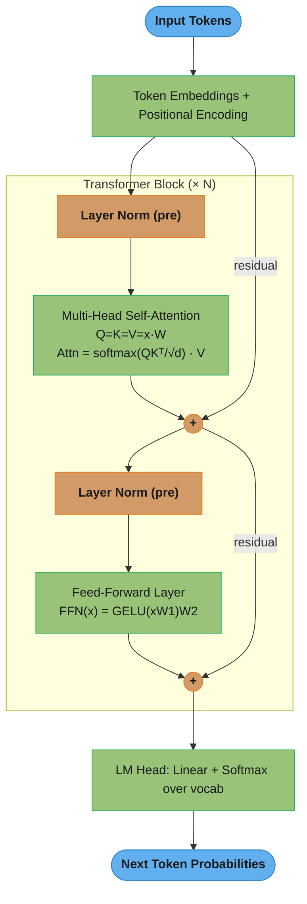
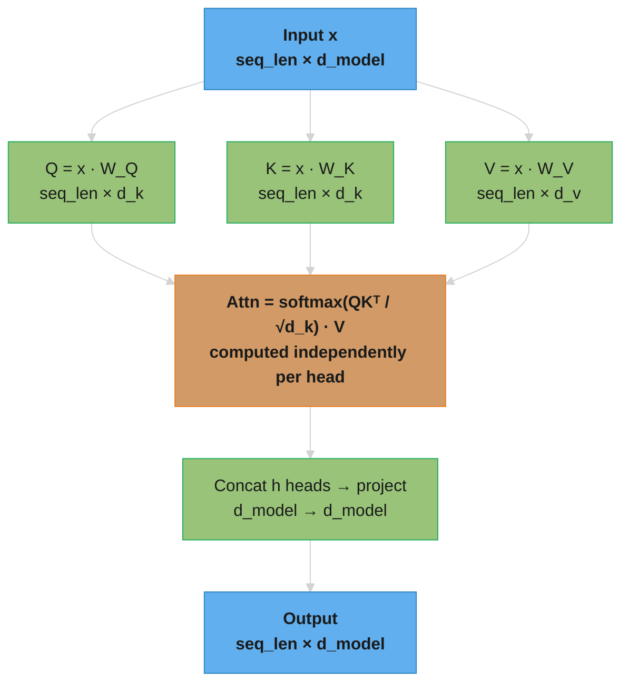
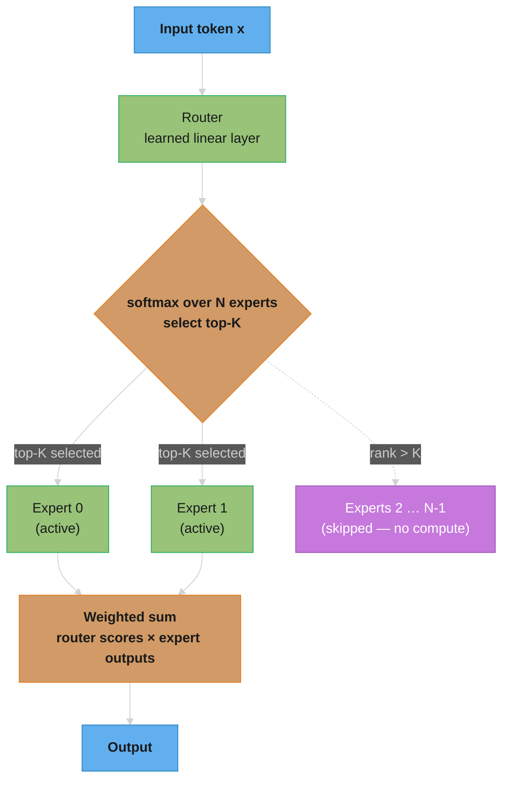
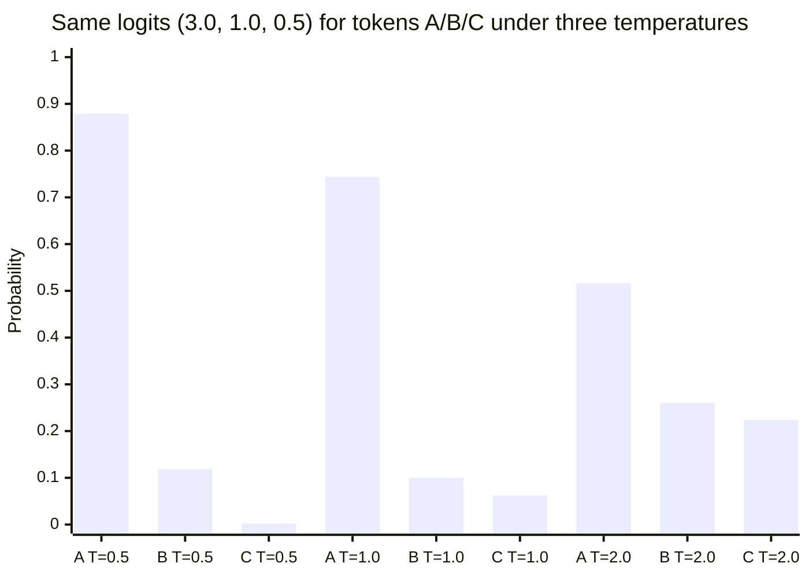

# Foundations & Architecture

## Deep Dive Files

| File | Topic | Q&As |
|------|-------|------|
| [attention_mechanisms.md](attention_mechanisms.md) | Flash Attention internals, MQA/GQA/MLA, sparse/linear attention, derivations | 15+ |
| [positional_encoding.md](positional_encoding.md) | RoPE derivation, ALiBi, YaRN, NTK scaling, context extension | 15+ |
| [training_dynamics.md](training_dynamics.md) | Warmup theory, loss spikes, BF16/FP16, batch scaling, muP, data mixing | 15+ |
| [state_space_models_and_linear_attention.md](state_space_models_and_linear_attention.md) | Mamba/Mamba-2 (selective SSM, SSD), RWKV, RetNet, Jamba/Zamba, GLA, Lightning Attention | 16 |

---

## 1. Concept Overview

Large Language Models (LLMs) are neural networks trained on massive text corpora to predict the next token in a sequence. The "large" refers to both the number of parameters (billions to trillions) and the scale of training data (trillions of tokens). The dominant architecture powering all modern LLMs is the **Transformer**, introduced by Vaswani et al. in "Attention Is All You Need" (2017).

Before transformers, sequence modeling relied on RNNs and LSTMs, which processed tokens sequentially — fundamentally limiting parallelism during training and struggling with long-range dependencies. The transformer replaced recurrence with **self-attention**: a mechanism where every token can directly attend to every other token in the sequence, computed in parallel.

This architectural shift enabled:
- **Massive parallelism** during training on GPUs/TPUs
- **Long-range dependency capture** without vanishing gradients
- **Scalability** — performance consistently improves with more data and more parameters (scaling laws)

---

## 2. Intuition

> **One-line analogy**: A transformer is like a room of experts where everyone can instantly consult everyone else, then each person synthesizes the group's knowledge to refine their understanding.

**Mental model**: Imagine a sentence as a group of people in a meeting. Each person (token) sends out a "question" (Query) about what context they need, broadcasts what they know (Key), and holds their contribution (Value). Everyone simultaneously reads everyone else's question and decides how much of their knowledge to share. After this group consultation, each person updates their understanding. Repeat this 32-96 times (layers), and you get deeply contextualized representations.

**Why it matters**: This architecture is why LLMs can understand long-range dependencies ("the pronoun 'it' refers to the antecedent 20 words earlier"), generate coherent text, and scale predictably with compute. Every modern AI system — GPT, Claude, Gemini — is built on this same foundation.

**Key insight**: The magic isn't in any single component — it's that Q/K/V attention + residual connections + layer norm creates a stable, parallelizable, infinitely scalable architecture that learns richer representations the more data and parameters you throw at it.

---

## 3. Core Principles

- **Self-Attention**: Each token's representation is a weighted sum of all other tokens, where weights represent relevance. Captures context across arbitrary distances.
- **Multi-Head Attention**: Running multiple attention "heads" in parallel allows the model to attend to different types of relationships simultaneously (syntactic, semantic, coreference).
- **Positional Encoding**: Since attention is order-agnostic, positions are injected via sinusoidal functions (original) or learned embeddings or RoPE (modern).
- **Feed-Forward Layers**: Two-layer MLP applied independently to each token after attention. Stores factual knowledge.
- **Residual Connections**: `output = x + sublayer(x)` — prevents vanishing gradients, enables depth.
- **Layer Normalization**: Stabilizes training by normalizing activations across the hidden dimension. Two placement strategies exist:
  - **Post-LN** (original Transformer): `output = LN(x + sublayer(x))` — LayerNorm after residual addition. Gradients at early layers can explode or vanish, requiring careful learning rate warmup.
  - **Pre-LN** (modern standard): `output = x + sublayer(LN(x))` — LayerNorm before the sublayer. The residual path stays "clean" (no normalization on it), producing more stable gradient flow. Tradeoff: some studies show slightly lower final performance, but dramatically easier training.
  - Nearly all modern LLMs use Pre-LN: GPT-2+, LLaMA, Mistral, Falcon, Qwen.
  - **RMSNorm** (LLaMA, Mistral, Gemma): Simplified LayerNorm that normalizes by root-mean-square only, skipping mean centering. ~10-15% faster than standard LayerNorm with equivalent quality. Used in all LLaMA variants.
- **Token Prediction**: Autoregressive models predict the next token given all previous tokens (causal LM).

---

## 4. Types / Architectures

### 4.1 Encoder-Only (BERT-style)
- Sees the full bidirectional context during training (Masked Language Modeling)
- Best for: classification, NER, semantic search, embeddings
- Examples: BERT, RoBERTa, DeBERTa, ModernBERT

### 4.2 Decoder-Only (GPT-style)
- Causal (left-to-right) attention mask; each token only attends to previous tokens
- Best for: text generation, completion, chat, reasoning — almost all modern LLMs
- Examples: GPT-4, LLaMA 3, Mistral, Gemma, Qwen, Claude, DeepSeek

### 4.3 Encoder-Decoder (T5-style)
- Encoder processes input; decoder generates output attending to encoder representations
- Best for: translation, summarization, structured generation (seq2seq tasks)
- Examples: T5, FLAN-T5, BART, mT5

### 4.4 Mixture of Experts (MoE)
- Instead of a single FFN, multiple "expert" FFNs exist; a router selects K of N for each token
- Total parameters >> active parameters → cheaper inference at same quality
- Examples: Mixtral 8x7B, GPT-4 (rumored), DeepSeek-V3 (671B params, 37B active)
- Full treatment (routing, load balancing, expert parallelism): [Mixture of Experts](../mixture_of_experts/README.md)

### 4.5 Attention Variants by Span

Standard self-attention computes O(n^2) interactions — every token attends to every other token. Several architectural variants reduce this cost:

| Variant | Attention Span | Complexity | Key Idea |
|---------|---------------|------------|----------|
| **Full causal attention** | All previous tokens | O(n^2) | Standard decoder-only attention |
| **Sliding window attention** | W previous tokens only | O(n * W) | Each token attends to a fixed local window |
| **Longformer** | Local window + global on special tokens | O(n * W + n * g) | Combines local sliding window with global attention on [CLS] or task-specific tokens |
| **BigBird** | Local + global + random | O(n * (W + g + r)) | Adds random attention connections for theoretical guarantees |

**Sliding Window Attention** is the most widely adopted variant in production LLMs:
- Each token attends only to the W previous tokens (e.g., W=4096 in Mistral 7B)
- Complexity drops from O(n^2) to O(n * W) — linear in sequence length for a fixed window size
- Information propagation across layers: with L layers and window W, information can flow across L * W tokens total through stacking
- Mistral 7B: W=4096, 32 layers -> effective attention span of 131,072 tokens despite each layer seeing only 4096
- Combines naturally with a **rolling KV cache**: only store W entries per layer instead of the full sequence length
- KV cache savings: at 32K sequence length with W=4096, the rolling cache saves ~87% KV cache memory compared to full attention

---

## 5. Architecture Diagrams

### Single Transformer Block


The two residual edges bypass the sublayers and feed the `+` nodes directly — the gradient highway that lets this block stack 32–96 layers deep without vanishing gradients.

### Multi-Head Attention Detail



Three projections fan out from the same input; all heads compute attention in parallel, then their outputs are concatenated and projected back to `d_model`.

### Decoder-Only Causal Mask
```
Token:    T1   T2   T3   T4   T5
T1:       ✓    ✗    ✗    ✗    ✗
T2:       ✓    ✓    ✗    ✗    ✗
T3:       ✓    ✓    ✓    ✗    ✗
T4:       ✓    ✓    ✓    ✓    ✗
T5:       ✓    ✓    ✓    ✓    ✓
(✓ = can attend, ✗ = masked out)
```

### MHA vs GQA vs MQA — Head-Sharing

```
Three ways Q (query) heads bind to K,V (key/value) heads. Fewer KV heads = smaller KV cache.

MHA — Multi-Head Attention (H=8 Q, 8 KV) — every Q head has its own K,V
  Q0  Q1  Q2  Q3  Q4  Q5  Q6  Q7
  │   │   │   │   │   │   │   │
  K0  K1  K2  K3  K4  K5  K6  K7     KV cache = 8 × d_head  →  1× (baseline)

GQA — Grouped Query Attention (H=8 Q, G=2 KV) — each group of 4 Q heads shares one K,V
  Q0 Q1 Q2 Q3   Q4 Q5 Q6 Q7
   └────┬────┘   └────┬────┘
       K0            K1             KV cache = 2 × d_head  →  0.25× MHA (4:1)

MQA — Multi-Query Attention (H=8 Q, G=1 KV) — all Q heads share a single K,V
  Q0 Q1 Q2 Q3 Q4 Q5 Q6 Q7
   └─────────┬──────────┘
            K0                      KV cache = 1 × d_head  →  0.125× MHA (8:1)
```

GQA is the production sweet spot: LLaMA 3 70B uses H=64, G=8 — an 8× KV cache reduction vs MHA with <1 PPL quality loss.

### Pre-LN vs Post-LN Data Flow

```
Post-LN (original Transformer)          Pre-LN (modern standard — GPT-2+, LLaMA, Mistral)

x ──────────────────┐                   x ──────────────────────────────┐
│                   │ residual           │                               │ residual
▼                   │                   ▼                               │ (clean highway —
[sublayer(x)]       │                   [LayerNorm]                     │  no LN on this path)
│                   │                   │                               │
▼                   │                   ▼                               │
[     +      ] ←───┘                   [sublayer(LN(x))]               │
│                                       │                               │
▼                                       ▼                               │
[LayerNorm]                             [     +      ] ←───────────────┘
│                                       │
▼                                       ▼
output                                  output

LN is on the residual path.             LN is NOT on the residual path.
Gradients pass through LN at every      Gradients flow directly back through
layer → can explode/vanish in           the clean residual highway to early
early layers → requires careful         layers → stable training at depth.
LR warmup (10K+ steps).                Nearly all models ≥7B use Pre-LN.
```

### Mixture-of-Experts (MoE) Routing



Total params = N × FFN\_size (all experts in memory); active params = K × FFN\_size per token. DeepSeek-V3: N=256 experts, K=8 active, total=671B params, active=37B — inference cost of a 37B dense model at the quality of a 671B model.

### Softmax Temperature — Distribution Shape



T=0.5 sharpens (logits scaled ×2 → token A takes 0.879); T=1.0 is the raw softmax (0.744/0.100/0.062); T=2.0 flattens (logits scaled ×0.5 → mass spreads to 0.516/0.260/0.224). T → 0 is argmax/greedy; T → ∞ is uniform. Factual tasks: T≈0.0–0.3; creative tasks: T≈0.7–1.2; above T=2.0 output degrades.

### Embedding Semantic Space

```
                    ↑ royalty
                    │
             queen  •─────────────→ king
                    │               •
                    │            ↗
                    │ +woman  ↗  −man
                    │      ↗
             woman  •─────────────→ man
                    │
                    └──────────────────→ gender

"king − man + woman" ≈ "queen"

Navigate the embedding space: start at king (•), subtract the man→origin
direction, add the woman→origin direction — arrive near queen (•).

Why this works: during training, "king" and "queen" appear in similar contexts
(royal, power, throne) → their gradient updates push their vectors close.
"man" and "woman" are also contextually similar → their difference vector
encodes the male↔female axis. Arithmetic in embedding space = semantic analogy.
```

---

## 6. How It Works — Detailed Mechanics

### Q/K/V Intuition & Setup

Think of attention as a **library search system**:
- **Query (Q)**: "What am I looking for?" — the search query you type
- **Key (K)**: "What do I contain?" — the book's index/title
- **Value (V)**: "What information do I carry?" — the book's actual content

When you search a library (Q), you match your query against book indexes (K), and retrieve the content (V) from the best-matching books. A token "attending" to another token does exactly this.

**How Q, K, V are created from the same input:**

Every token starts as the same input embedding `x`. Three separate learned projection matrices transform it into different semantic spaces:

```
Q = x · W_Q    shape: [seq_len, d_k]    "what I'm searching for"
K = x · W_K    shape: [seq_len, d_k]    "what I offer as a match"
V = x · W_V    shape: [seq_len, d_v]    "what information I carry"

W_Q, W_K, W_V are all [d_model × d_k] — learned during training
```

The matrices project the same input embedding `x` into three different representation spaces. `W_Q` learns to extract "what this token needs", `W_K` learns "what this token can provide", and `W_V` learns "what content to aggregate when matched". They are trained jointly through backpropagation.

**The idea behind it.** "One token, one embedding — but three different questions you can ask it. Multiply by three different learned matrices and the same vector answers 'what do I want?', 'what am I?', and 'what do I hand over?' separately."

Candidates often assume Q, K, and V come from three different places. They do not: all three are the *same* `x` viewed through three lenses. That is why a token can attend to itself at all.

| Symbol | What it is |
|--------|------------|
| `x` | The token's input embedding. Shape `[seq_len, d_model]`, d_model = 4096 in LLaMA 3 8B |
| `W_Q` | Learned matrix `[d_model × d_k]`. Extracts the token's search intent |
| `W_K` | Learned matrix `[d_model × d_k]`. Extracts the token's advertised label |
| `W_V` | Learned matrix `[d_model × d_v]`. Extracts the payload to pass on |
| `x · W_Q` | Matrix multiply. `[seq, d_model] · [d_model, d_k]` = `[seq, d_k]` |
| `d_model` | Width of the residual stream. 4096 |
| `d_k`, `d_v` | Per-head width. 128 in LLaMA 3 8B (4096 / 32 heads) |

**Walk one example.** One token, tiny dimensions (`d_model = 4`, `d_k = 2`) so the arithmetic is visible:

```
   x = [1.0, 0.0, 2.0, 1.0]          <- the token's embedding

           W_Q                 W_K                 W_V
        [ 1.0  0.0 ]        [ 0.0  1.0 ]        [ 0.5  0.0 ]
        [ 0.0  1.0 ]        [ 1.0  0.0 ]        [ 0.0  0.5 ]
        [ 0.0  1.0 ]        [ 1.0  0.0 ]        [ 0.5  0.5 ]
        [ 1.0  0.0 ]        [ 0.0  1.0 ]        [ 0.0  1.0 ]

   Q = x . W_Q = [ 1*1 + 0*0 + 2*0 + 1*1 ,  1*0 + 0*1 + 2*1 + 1*0 ] = [2.0, 2.0]
   K = x . W_K = [ 1*0 + 0*1 + 2*1 + 1*0 ,  1*1 + 0*0 + 2*0 + 1*1 ] = [2.0, 2.0]
   V = x . W_V = [ 1*.5+ 0*0 + 2*.5+ 1*0 ,  1*0 + 0*.5+ 2*.5+ 1*1 ] = [2.0, 2.0]

   Same x in, three different 2-dim vectors out -- and the numbers only match here
   because these toy matrices are deliberately symmetric. In a trained model the
   three projections diverge sharply.
```

**Why three matrices and not one.** Collapse `W_Q` and `W_K` into a single matrix and every token's query becomes identical to its key, forcing the score matrix to be symmetric — "it" would have to attend to "cat" exactly as much as "cat" attends to "it". Language is not symmetric: a pronoun needs its antecedent far more than the antecedent needs the pronoun. Separating `W_V` matters for a different reason: what makes a token a good *match* ("this is a noun, singular, animate") is rarely the information you want to *copy* ("the specific concept: cat"). One matrix would force the model to use the same vector for both jobs.

---

### Step-by-Step Data Flow Through a Transformer

Complete walkthrough with tensor shapes (LLaMA 3 8B config: d_model=4096, 32 heads, 8 KV heads, N=32 layers):

```
Input:  "Hello world"
        │
        ▼ Tokenizer (BPE)
Token IDs: [15496, 995]                    dtype: int64, shape: [2]
        │
        ▼ Embedding lookup  E[token_id, :]
Token embeddings: shape [seq_len=2, d_model=4096]   dtype: float32/bf16
        │
        ▼ Enter N=32 Transformer Blocks:
        │
        ├─► LayerNorm (RMSNorm)             [2, 4096] → [2, 4096]
        │
        ├─► Multi-Head Attention:
        │     Q = x · W_Q   [2,4096]·[4096,4096] = [2, 4096]  (32 heads × 128)
        │     K = x · W_K   [2,4096]·[4096,1024] = [2, 1024]  (8 KV heads × 128)
        │     V = x · W_V   [2,4096]·[4096,1024] = [2, 1024]  (8 KV heads × 128)
        │     Apply RoPE to Q, K (rotate by position)
        │     A = softmax(Q·Kᵀ / √128)     [2, 2] per head (causal mask)
        │     out = A · V   → concat heads → proj  [2, 4096]
        │
        ├─► Residual:  x = x + attention_out       [2, 4096]
        │
        ├─► LayerNorm (RMSNorm)             [2, 4096] → [2, 4096]
        │
        ├─► Feed-Forward (SwiGLU):
        │     gate = SiLU(x · W_gate)   [2,4096]·[4096,14336] = [2, 14336]
        │     up   = x · W_up           [2,4096]·[4096,14336] = [2, 14336]
        │     ffn  = (gate ⊙ up) · W_down [2,14336]·[14336,4096]=[2, 4096]
        │
        ├─► Residual:  x = x + ffn_out             [2, 4096]
        │
        └─► (repeat 32 times)
        │
        ▼ Final RMSNorm                    [2, 4096]
        ▼ Take last token position:        [1, 4096]
        ▼ LM Head: Linear(4096 → 128256)   [1, 128256]  (logits)
        ▼ Softmax                          [1, 128256]  (probabilities)
        ▼ Sample next token ID             → decode → "!"
```

---

### How Embeddings Work Internally

The embedding layer is a **learned lookup table**: a matrix `E` of shape `[vocab_size × d_model]`.

```python
# Conceptually:
token_ids = [15496, 995]       # token indices
embeddings = E[token_ids, :]   # shape: [2, d_model] — just indexing rows of E

# Each row E[i] is the d_model-dimensional vector for token i
# These vectors are learned during training via backpropagation
```

**Why embeddings capture meaning**: During training, tokens appearing in similar contexts receive similar gradient updates, pulling their vectors closer together. "king" and "queen" appear in similar contexts → their vectors become close. This enables the famous arithmetic: `king - man + woman ≈ queen`.

The embedding matrix `E` is `[vocab_size × d_model]` — for LLaMA 3 8B: `[128,256 × 4,096]` = 524M parameters (the single largest weight matrix in many models).

---

### How the LM Head Works

The LM head converts the final hidden state into a probability distribution over the vocabulary:

```
LM Head: Linear(d_model → vocab_size)  — no bias, no activation

hidden state: [d_model=4096]
     ↓  W_lm_head  shape: [vocab_size=128256, d_model=4096]
logits:       [128256]   — one unnormalized score per vocabulary token
     ↓  softmax (or divide by temperature first)
probs:        [128256]   — sums to 1.0
     ↓  sample (or argmax for greedy)
next token ID
```

**Weight tying**: In most modern LLMs, the LM head weight matrix is **shared with (transposed from) the embedding matrix** `E`:
```python
logits = hidden @ E.T    # shape: [vocab_size]
```
This works because E already encodes good token representations. The LM head is asking "how similar is my hidden state to each token's embedding?" — the token with the highest similarity is the most likely next token. Weight tying saves ~500M parameters and often improves quality.

**Stated plainly.** "Dot your final hidden state against every token's embedding vector and read off the similarities. The embedding table already knows what each token 'looks like' as a vector, so you can reuse it backwards as the output classifier instead of learning a second copy."

| Symbol | What it is |
|--------|------------|
| `hidden` | The final-layer vector for the last position. Shape `[4096]` |
| `E` | The embedding matrix. Shape `[vocab_size, d_model]` = `[128256, 4096]` |
| `E.T` | E flipped to `[4096, 128256]` so the multiply produces one score per token |
| `@` | Matrix multiply (Python operator) |
| `logits` | `[128256]` raw scores. One per vocabulary entry, pre-softmax, unbounded |

**Walk one example.** Toy vocabulary of 3 tokens, `d_model = 4`:

```
   hidden = [0.9, 0.1, 0.0, 0.2]

   E (one row per token)                dot with hidden          logit
     "cat"  [1.0, 0.0, 0.0, 0.0]   0.9*1 +0.1*0 +0*0 +0.2*0  =   0.90
     "dog"  [0.8, 0.2, 0.0, 0.1]   0.9*.8+0.1*.2+0*0 +0.2*.1 =   0.76
     "the"  [0.0, 0.0, 1.0, 0.0]   0.9*0 +0.1*0 +0*1 +0.2*0  =   0.00

   softmax([0.90, 0.76, 0.00]) = [0.427, 0.371, 0.173]
   -> "cat" wins, "dog" is a close second (their embeddings are similar), "the" is far off
```

**Why tying is nearly free quality.** Both matrices are `[128256 × 4096]` = 524M parameters. Keeping them separate means 1.05B parameters devoted to the vocabulary boundary alone — roughly 13% of an 8B model — and the untied output matrix has to relearn from scratch the same "which tokens are similar" structure the embedding table already encodes. Tying halves that cost and shares the gradient signal: every time the model reads "cat" it also improves its ability to predict "cat".

---

### Softmax Temperature Mechanics

Temperature `T` controls the "sharpness" of the output distribution:

```
softmax_T(z_i) = exp(z_i / T) / Σ exp(z_j / T)
```

Effect of T on distribution shape:
- `T < 1` (e.g., 0.3): **sharpens** distribution → model picks high-probability tokens reliably, repetitive
- `T = 1`: **unchanged** — standard softmax
- `T > 1` (e.g., 1.5): **flattens** distribution → more random, creative, sometimes incoherent
- `T → 0`: **argmax** (greedy decoding, always picks top-1)
- `T → ∞`: **uniform** distribution (completely random)

**Numerical example** with logits `[3.0, 1.0, 0.5]`:
```
T = 0.5: softmax([6.0, 2.0, 1.0]) → [0.879, 0.119, 0.002]  ← sharp, confident
T = 1.0: softmax([3.0, 1.0, 0.5]) → [0.744, 0.100, 0.062]  ← normal
T = 2.0: softmax([1.5, 0.5, 0.25])→ [0.516, 0.260, 0.224]  ← flat, diverse
```

For factual tasks, use T≈0.0–0.3. For creative writing, T≈0.7–1.2. Above T=2.0, outputs degrade rapidly.

**What the formula is telling you.** "Before turning scores into probabilities, divide every score by the same number `T` — dividing by a small number stretches the gaps apart and makes the winner run away with it; dividing by a big number squashes the gaps together and gives the underdogs a real chance."

The key realization for an interview: temperature does not change the *ranking* of tokens, only the *confidence*. The top token at T=0.5 is the same top token at T=2.0. All you are tuning is how often the model is willing to pick something other than its favourite.

| Symbol | What it is |
|--------|------------|
| `z_i` | The raw logit for token `i` — an unnormalized score, any real number, can be negative |
| `T` | Temperature. The divisor applied to every logit before exponentiating. Typical 0.0–2.0 |
| `exp(...)` | Exponential. Turns any number positive and amplifies differences multiplicatively |
| `Σ exp(z_j / T)` | The normalizer. Adds up every token's exponentiated score so the result sums to 1 |
| `softmax_T(z_i)` | Final probability assigned to token `i` |

**Walk one example.** The same three logits `[3.0, 1.0, 0.5]` for tokens A/B/C, at three temperatures:

```
                      logit z    z / T      exp(z/T)    prob = exp / sum
  T = 0.5   A           3.0       6.00        403.4         0.879
            B           1.0       2.00          7.39        0.119
            C           0.5       1.00          2.72        0.002 (rounded)
                                              -------
                                       sum =   413.5

  T = 1.0   A           3.0       3.00         20.09        0.744
            B           1.0       1.00          2.72        0.100
            C           0.5       0.50          1.65        0.062
                                              -------
                                       sum =    24.46

  T = 2.0   A           3.0       1.50          4.48        0.516
            B           1.0       0.50          1.65        0.260
            C           0.5       0.25          1.28        0.224
                                              -------
                                       sum =     7.41

  A's lead over B:   T=0.5 -> 7.4x     T=1.0 -> 7.4x logits, 0.744 vs 0.100
                     T=2.0 -> 0.516 vs 0.260, barely 2x
```

Read the middle column: the gap between A and B in *logit* space is always 2.0, but after dividing by `T` it becomes 4.0 at T=0.5 and 1.0 at T=2.0. Exponentiating then turns that gap into a ratio — `exp(4.0) = 54.6x` versus `exp(1.0) = 2.7x`. That is the whole mechanism: `T` rescales the gaps, `exp` converts gaps into odds.

**Why `T` sits in the denominator and not as a multiplier.** Writing it as `z_i / T` makes the knob read intuitively as "temperature": high heat means more disorder, and `T -> ∞` drives every `z/T` to 0, every `exp(0)` to 1, and the distribution to uniform. If you removed `T` entirely you would be locked at the raw softmax — no way to trade creativity for reliability at inference time without retraining, which is exactly why every serving API exposes this parameter.

---

### Gradient Flow Through Residual Connections

Residual connections are the key reason transformers can be 100+ layers deep without vanishing gradients:

```
Forward:   y = x + F(x)               (F = attention or FFN sublayer)

Backward (chain rule):
  dL/dx = dL/dy × dy/dx
         = dL/dy × (1 + dF/dx)
         = dL/dy·1  +  dL/dy·dF/dx
           ↑               ↑
        "highway"     "learned path"
```

The `1` term creates a **gradient highway**: the gradient of the loss flows back through the residual connection unchanged, regardless of what `F(x)` does. Even if `dF/dx ≈ 0` (small or saturated gradients), the gradient still reaches early layers.

Without residuals, gradient for layer 1 = product of 100 Jacobians — any of them < 1 → exponential decay → vanishing gradient. With residuals, each layer adds to a running sum rather than multiplying, enabling stable training of models with 100+ layers.

**What this actually says.** "Don't ask the layer to produce the answer — ask it to produce a *correction*, and hand the original straight through alongside it. On the way back, the gradient inherits that same shortcut and arrives at the early layers intact."

The interview-grade framing is the `1`. Differentiating `y = x + F(x)` gives `1 + dF/dx`, and that constant `1` is the entire reason depth works: it is a term that can never shrink to zero no matter how badly the sublayer behaves.

| Symbol | What it is |
|--------|------------|
| `x` | The input to the sublayer — the hidden state arriving from the previous block |
| `F(x)` | The sublayer's output. Attention or the FFN. The *correction* it proposes |
| `y = x + F(x)` | The residual (skip) connection. Original plus correction |
| `dL/dy` | Gradient of the loss with respect to this layer's output — what flows in from above |
| `dF/dx` | How much the sublayer's output changes when its input changes. The learned path |
| `dL/dx` | Gradient handed down to the previous layer. What we need to keep from vanishing |

**Walk one example.** Suppose every sublayer is badly conditioned and `dF/dx = 0.5` at each of 100 layers. Compare the gradient reaching layer 1, starting from `dL/dy = 1.0` at the top:

```
                        per-layer factor      gradient at layer 1 after 100 layers
  no residual              0.5                0.5^100    = 7.9e-31   <- dead
  with residual        1 + 0.5 = 1.5          1.5^100    = 4.1e+17   <- alive (clipped)

  Realistic case, dF/dx ~ 0 (saturated sublayer):
  no residual              0.0                0.0^100    = 0         <- no learning at all
  with residual        1 + 0.0 = 1.0          1.0^100    = 1.0       <- gradient passes through
```

The second pair is the one to quote. When a sublayer saturates, the multiplicative path contributes literally nothing — but `1 + 0 = 1`, so the gradient arrives at layer 1 exactly as strong as it left the loss. The residual turns a 100-term product into "1, plus whatever the layers add."

**Why the `1` term must not be normalized away.** This is precisely the Post-LN versus Pre-LN argument above. Post-LN computes `LN(x + F(x))`, which puts a normalization *on top of* the skip path and scales that clean `1` by LayerNorm's Jacobian at every layer — reintroducing a 100-term product and forcing learning-rate warmup to keep training stable. Pre-LN computes `x + F(LN(x))`, leaving the skip path untouched, which is why every modern LLM uses it.

---

### Attention Head Visualization

Different attention heads specialize in different linguistic patterns:

```
Diagonal pattern (local context):     Vertical stripe (anchor tokens):
  Each token attends to itself          All tokens attend to one key token
  T1 ████░░░░░░                         T1 ░░░░████
  T2 ░████░░░░                          T2 ░░░░████    e.g., [SEP], period,
  T3 ░░████░░░                          T3 ░░░░████    or the first token
  T4 ░░░████░░                          T4 ░░░░████

Syntactic (grammatical):               Global (holistic):
  "the" → "cat" (determiner→noun)       Uniform attention across all tokens
  verb → object, pronoun → antecedent   T1 ████████
                                        T2 ████████
```

Empirically, heads in lower layers tend to capture local syntax; heads in higher layers capture more semantic/global patterns. Some heads reliably attend to specific grammatical relationships (subject-verb, possessives) — these are interpretable.

**Visualization tools**: BertViz (interactive attention visualization), TransformerLens (interpretability toolkit for mechanistic analysis), Attention Rollout (aggregate attention across layers).

---

### Attention Computation
For a single head with queries Q, keys K, values V (all shape `[seq, d_k]`):

```
Attention(Q, K, V) = softmax(QKᵀ / √d_k) · V
```

- `QKᵀ` produces an `[seq × seq]` similarity matrix (dot product of query and key)
- Dividing by `√d_k` prevents vanishing gradients in softmax for large dimensions
- Softmax normalizes to attention weights (sum to 1 per row)
- Multiply by V: each token's output is a weighted sum of all value vectors

**In plain terms.** "Every token writes a search query; every token also advertises a label. Match each query against every label to get relevance scores, shrink those scores so the softmax stays sane, turn them into percentages, and then have each token collect a blended summary of everyone's content, weighted by how relevant they were."

Say it as a soft dictionary lookup and you have the whole mechanism. A hard Python dict returns the value for *one* exactly matching key; attention returns a weighted average over *all* values, with the weights being how well each key matched. Nothing else in the formula is doing anything more exotic than that.

| Symbol | What it is |
|--------|------------|
| `Q` | What each token is looking for. Shape `[seq, d_k]` — one query row per token |
| `K` | What each token advertises about itself. Shape `[seq, d_k]` — one key row per token |
| `V` | The actual content each token contributes if attended to. Shape `[seq, d_v]` |
| `Kᵀ` | Keys flipped so the matrix multiply pairs every query with every key |
| `QKᵀ` | The `[seq × seq]` score matrix. Entry `(i, j)` = how much token `i` cares about token `j` |
| `d_k` | Dimension of each query/key vector. 128 in LLaMA 3 8B (4096 model dim / 32 heads) |
| `√d_k` | The scaling divisor. `√128 ≈ 11.3` — keeps scores in a range softmax can work with |
| `softmax(...)` | Turns each row of scores into percentages summing to 1.0 |
| `· V` | The weighted sum. Each token's output = its attention percentages applied to all values |

**Walk one example.** Two tokens, `d_k = 4`, one head. Token 1 = "it", token 2 = "cat". We want "it" to attend to "cat":

```
  Step 1 — the vectors (after the W_Q / W_K / W_V projections)

              Q (what I seek)        K (what I offer)       V (my content)
   "it"      [ 1.0, 0.0, 1.0, 0.0]  [ 0.0, 1.0, 0.0, 0.0]  [ 0.2, 0.1]
   "cat"     [ 0.0, 1.0, 0.0, 1.0]  [ 1.0, 0.0, 1.0, 0.0]  [ 0.9, 0.4]

  Step 2 — QKt: dot every query with every key

   score(it -> it)   = 1*0 + 0*1 + 1*0 + 0*0 = 0.0
   score(it -> cat)  = 1*1 + 0*0 + 1*1 + 0*0 = 2.0     <- "it" matches "cat" strongly
   score(cat -> it)  = 0*0 + 1*1 + 0*0 + 1*0 = 1.0
   score(cat -> cat) = 0*1 + 1*0 + 0*1 + 1*0 = 0.0

              raw QKt matrix              after / sqrt(d_k) = / 2.0
              [ 0.0   2.0 ]               [ 0.0   1.0 ]
              [ 1.0   0.0 ]               [ 0.5   0.0 ]

  Step 3 — softmax each ROW (each token's attention budget sums to 1.0)

   row "it":   softmax([0.0, 1.0]) = [0.269, 0.731]   <- 73% of attention on "cat"
   row "cat":  softmax([0.5, 0.0]) = [0.622, 0.378]

  Step 4 — multiply by V

   out("it")  = 0.269 * [0.2, 0.1] + 0.731 * [0.9, 0.4]
              = [0.054, 0.027]     + [0.658, 0.292]
              = [0.712, 0.319]     <- mostly "cat" content, tinted by its own

   out("cat") = 0.622 * [0.2, 0.1] + 0.378 * [0.9, 0.4]
              = [0.464, 0.213]
```

The output for "it" is now 73% "cat" — the pronoun has literally absorbed the content of its antecedent. That is coreference resolution falling out of a matrix multiply, and it is the single best sentence to have ready when an interviewer asks what attention actually buys you.

**Why the `√d_k` exists — the failure mode without it.** A dot product of two `d_k`-dimensional vectors is a sum of `d_k` independent products. If each component has mean 0 and variance 1, the sum has variance `d_k`, so its standard deviation is `√d_k`. Bigger heads therefore produce systematically larger scores — not because the tokens are more related, but purely because you added up more terms:

```
                   d_k     std dev of raw scores = sqrt(d_k)    typical score range
   toy example       4              2.0                          about -6 to +6
   BERT base        64              8.0                          about -24 to +24
   LLaMA 3 8B      128             11.3                          about -34 to +34

  What softmax does with a gap of that size (two tokens):

   scores [ 2.0,  0.0]  ->  softmax = [0.881, 0.119]   healthy, gradient flows
   scores [11.3,  0.0]  ->  softmax = [0.999, 0.001]   saturated, near one-hot
   scores [34.0,  0.0]  ->  softmax = [1.000, 0.000]   fully saturated

  Dividing by sqrt(d_k) = 11.3 pulls the 34.0 case back to 3.0, restoring a usable spread.
```

Saturation is fatal because softmax's gradient is proportional to `p × (1 - p)`. At `p = 0.999` that is `0.000999` — effectively zero, so the attention weights stop being trainable and the head freezes at whatever pattern it initialized into. Dividing by `√d_k` normalizes the score variance back to roughly 1 regardless of head size, which is why the same learning rate works for `d_k = 64` and `d_k = 128`. Note that it is `√d_k` and not `d_k`: variance scales with `d_k`, so *standard deviation* — the thing that sets the score's spread — scales with its square root.

### Sliding Window Attention — Detailed Mechanics

Standard causal attention at position `i` computes scores against all positions `0..i-1`, producing an `[n x n]` lower-triangular matrix. Sliding window attention restricts this to positions `max(0, i-W)..i-1`:

```
Full causal mask (n=8):        Sliding window mask (n=8, W=3):
T1: X . . . . . . .           T1: X . . . . . . .
T2: X X . . . . . .           T2: X X . . . . . .
T3: X X X . . . . .           T3: X X X . . . . .
T4: X X X X . . . .           T4: . X X X . . . .
T5: X X X X X . . .           T5: . . X X X . . .
T6: X X X X X X . .           T6: . . . X X X . .
T7: X X X X X X X .           T7: . . . . X X X .
T8: X X X X X X X X           T8: . . . . . X X X

Full: 36 active cells             Window: 22 active cells (39% fewer)
At n=32K, W=4096: ~87% fewer attention computations
```

**Information propagation through layer stacking:**
```
Layer 1: Token at position i sees positions [i-W, i]
Layer 2: Token at position i sees positions [i-2W, i]  (because tokens at i-W already saw i-2W)
...
Layer L: Token at position i sees positions [i-L*W, i]

Mistral 7B: W=4096, L=32 layers
  -> Effective span = 32 * 4096 = 131,072 tokens
  -> Far exceeds the 32K context window
```

**Rolling KV cache** pairs naturally with sliding window attention. Instead of caching all past keys/values (growing linearly with sequence length), maintain a circular buffer of size W per layer:

```
Standard KV cache at position 10000:  stores 10000 entries per layer
Rolling KV cache at position 10000:   stores 4096 entries per layer (W=4096)
  -> Position 10000 overwrites the slot at index (10000 mod 4096) = 1712
  -> Memory: fixed at W * num_layers * 2 * d_head * bytes regardless of sequence length
```

For Mistral 7B serving at 32K context: standard KV cache needs ~2.1GB per sequence; rolling cache needs ~270MB per sequence — a fixed cost that does not grow with sequence length.

---

### Key Architectural Improvements in Modern LLMs

The original 2017 transformer has been refined substantially. Here is a comprehensive compilation:

**1. Attention Mechanisms**

| Improvement | Problem Solved | How It Works | Tradeoff |
|------------|---------------|--------------|---------|
| **MQA** (Multi-Query Attention) | KV cache too large | All Q heads share a single K, V head | Quality drop at high sharing ratios |
| **GQA** (Grouped Query Attention) | MQA too lossy, MHA too large | G groups of Q heads share K, V heads | Sweet spot: LLaMA 2+, Mistral |
| **Flash Attention 1** (2022) | O(n²) HBM memory for attention | Tile Q, K, V into SRAM; fused kernel; online softmax | Requires recompute in backward pass |
| **Flash Attention 2** (2023) | FA-1 poor GPU utilization | Better parallelism across warps; 2× faster than FA-1 | — |
| **Flash Attention 3** (2024) | H100 underutilized by FA-2 | Async pipeline; FP8 support; 75% peak FLOP utilization | H100-specific |
| **Sliding Window Attention** | Full attention wasteful for local tasks | Each token attends to W previous tokens; O(n*W) not O(n^2); rolling KV cache stores only W entries per layer | Cannot directly attend beyond window; relies on layer stacking for long-range flow (L layers * W = effective span) |

**Read it like this.** "The score matrix has one entry for every pair of tokens, in every head, in every layer — and that count grows with the *square* of the context length. At production context lengths the intermediate matrix is larger than the model weights, even though nobody ever needs to look at it."

That last clause is the insight Flash Attention exploits: `softmax(QKᵀ/√d_k)` is consumed immediately by the `· V` multiply. It is a means, not an output. So never write it to HBM at all — compute it a tile at a time inside on-chip SRAM.

| Term | What it is |
|------|------------|
| `N` | Sequence length in tokens. 8192 here |
| `N²` | Entries in one head's score matrix — every token against every token |
| `H` | Number of attention heads. 64 in LLaMA-3-70B |
| `bytes/elem` | 2 for BF16/FP16, 1 for FP8, 4 for FP32 |
| `O(N²)` | Memory grows with the square of context. Doubling context quadruples it |
| `O(N)` | What Flash Attention achieves — memory grows linearly with context |

**Walk the multiplication.** One layer of LLaMA-3-70B at 8192-token context, BF16:

```
   N squared      =  8192 x 8192            =  67,108,864 entries per head
   x heads        =  67,108,864 x 64        =  4,294,967,296 entries per layer
   x bytes/elem   =  4,294,967,296 x 2      =  8,589,934,592 bytes
                                            =  8.59 GB       ~= 8.6 GB per layer

   Compare against the hardware and the model:
     one H100                                    80 GB   -> 9 layers would fill it
     the 70B model weights in FP8                70 GB   -> the matrix rivals the model
     all 80 layers at once                      688 GB   -> impossible by two orders

   Flash Attention 2, same layer, same context:  ~64 MB   -> 134x less
```

**How the quadratic bites.** Halve the context and the matrix drops fourfold, not twofold:

```
   context N        N^2 x 64 heads x 2 bytes       per-layer attention matrix
     2,048              2048^2 x 128                       0.54 GB
     4,096              4096^2 x 128                       2.15 GB
     8,192              8192^2 x 128                       8.59 GB
    16,384             16384^2 x 128                      34.36 GB
    32,768             32768^2 x 128                     137.44 GB
```

Every doubling of context multiplies the attention matrix by 4. This single table is why long-context serving was impossible before Flash Attention, and why the fix had to be "don't materialize it" rather than "buy more HBM."

**2. Positional Encoding**

| Approach | How It Works | Tradeoff |
|---------|-------------|---------|
| **Sinusoidal APE** (original) | Fixed sin/cos functions of position | Cannot extrapolate beyond training length |
| **RoPE** (Rotary PE) | Rotate Q, K by position; relative position = rotation difference | Graceful extrapolation with YaRN/LongRoPE; used in LLaMA, Mistral, Qwen |
| **ALiBi** | Subtract linear bias m×|i-j| from attention scores | Simple, extrapolates, but penalizes long-range; used in MPT, BLOOM |

**3. Normalization**

| Approach | Formula | Tradeoff |
|---------|---------|---------|
| **Post-LN** (original) | `LN(x + sublayer(x))` — normalize after residual | Gradient instability in early layers; requires careful warmup; slightly higher final quality in some studies |
| **Pre-LN** (modern standard) | `x + sublayer(LN(x))` — normalize before sublayer | Clean residual path, stable gradients, easier training; used in GPT-2+, LLaMA, Mistral, Falcon |
| **RMSNorm** | Normalize only by RMS (no mean subtraction) | ~10-15% faster than LayerNorm; equivalent quality; used in LLaMA, Mistral, Gemma |

**4. Activations**

| Approach | Formula | Tradeoff |
|---------|---------|---------|
| **ReLU** (original) | `max(0, x)` | Simple; dying neuron problem |
| **GELU** | `x × Φ(x)` (smooth approximation) | Better for language; used in BERT, GPT-2 |
| **SwiGLU** | `SiLU(xW₁) ⊙ xW₂` (gated) | Best empirically; requires 2 weight matrices but expansion ratio 2/3 of standard FFN; used in LLaMA, PaLM |

**Reading GELU in plain English.** "Instead of ReLU's hard cutoff — keep it or zero it — GELU asks 'what fraction of the time would a value this large survive a random gate?' and scales the input by that probability. Big positives pass almost fully, big negatives get almost fully suppressed, and values near zero get partially attenuated instead of chopped."

| Symbol | What it is |
|--------|------------|
| `x` | The pre-activation value for one neuron |
| `Φ(x)` | The standard Gaussian CDF: probability a draw from N(0,1) is less than `x`. Always 0–1 |
| `x × Φ(x)` | GELU. The input scaled by its own "how far right am I?" percentile |
| `max(0, x)` | ReLU. A hard step: multiply by 1 if positive, by 0 if not |
| `SiLU(x)` | `x × σ(x)` — same idea with the sigmoid replacing `Φ`. Cheaper, nearly identical |
| `⊙` | Multiply two vectors position by position, no summing |

**Walk one example.** The same five inputs through both activations:

```
        x        Phi(x)      GELU = x * Phi(x)      ReLU = max(0, x)
     -3.0        0.001            -0.004                  0.0
     -1.0        0.159            -0.159                  0.0
      0.0        0.500             0.000                  0.0
      1.0        0.841             0.841                  1.0
      3.0        0.999             2.996                  3.0

   Far from zero, GELU and ReLU agree (2.996 vs 3.0; -0.004 vs 0.0).
   Near zero they differ: GELU passes a small NEGATIVE value at x = -1.0,
   where ReLU emits a flat 0.0 and, crucially, a flat 0 gradient.
```

**Why the smoothness matters — the failure mode without it.** ReLU's gradient is exactly 0 for every negative input, so a neuron whose weights drift into always-negative territory receives no gradient and can never recover — the dying-neuron problem named in the table. GELU has a nonzero gradient everywhere, so no neuron is ever permanently switched off. The tradeoff is cost: `Φ` involves an error function, which is why implementations use the tanh approximation or swap in `SiLU`, and why SwiGLU (a `SiLU`-gated variant) has replaced GELU in LLaMA and PaLM.

**5. Sparsity & Scale**

| Improvement | Problem Solved | How It Works | Tradeoff |
|------------|---------------|--------------|---------|
| **Mixture of Experts (MoE)** | Dense FFN uses all parameters per token | N expert FFNs + router; K active per token | All experts must fit in memory; load balancing required |
| **Expert Choice Routing** | Top-K token routing causes load imbalance | Experts choose their top-K tokens (not vice versa) | Tokens may be processed by wrong number of experts |

**6. Alternative Architectures (Beyond Transformers)**

| Architecture | Key Idea | Strength | Weakness |
|-------------|---------|---------|---------|
| **Mamba / SSMs** (State Space Models) | Linear-time recurrence; selective state update | O(n) inference; no KV cache needed | Less effective on in-context learning than attention |
| **Jamba** (AI21) | Hybrid: interleaved Transformer + Mamba layers | Long context + strong quality | More complex training |
| **RWKV** | RNN-style but trainable like Transformer | Fast inference; no KV cache | Weaker on tasks requiring arbitrary lookback |

### Scaling Laws (Chinchilla)
Hoffmann et al. (2022) showed optimal compute budget splits roughly equally between:
- Model parameters (N)
- Training tokens (D)

Optimal: `D ≈ 20 × N` (train 7B model on ~140B tokens for compute-optimal)

**What it means.** "For every one parameter you put in the model, feed it about twenty tokens of training data. Spend your fixed compute budget any other way — a huge model on thin data, or a small model on endless data — and you get a worse model for the same money."

The units are the thing candidates fumble. `N` is counted in *parameters* (weights); `D` is counted in *tokens* (training data). They are different kinds of quantity that happen to be compared by a bare ratio, which is exactly why the sentence has to be said out loud as "twenty tokens per parameter."

| Symbol | What it is |
|--------|------------|
| `N` | Number of model parameters. 7B means N = 7,000,000,000 weights |
| `D` | Number of training tokens consumed. Not documents, not words — BPE tokens |
| `20 ×` | The Chinchilla ratio. Tokens per parameter for compute-optimal training |
| `C ≈ 6 × N × D` | Training compute in FLOPs. The budget both N and D are spending from |

**Walk one example.**

```
   Model size N       D = 20 x N            in words
      7B              7e9  x 20 = 140e9     140 billion tokens
     13B             13e9  x 20 = 260e9     260 billion tokens
     70B             70e9  x 20 = 1.4e12    1.4 trillion tokens
    405B            405e9  x 20 = 8.1e12    8.1 trillion tokens

   Sanity-check the 7B row against real training runs:
     Chinchilla-optimal   7B  ->  140B tokens
     LLaMA 1 7B  trained on     1,000B tokens   =  143 tokens/param   (7x over)
     LLaMA 3 8B  trained on    15,000B tokens   = 1875 tokens/param  (94x over)
```

**Why everyone deliberately violates it.** Chinchilla optimizes *training* compute only, and training happens once. Inference happens billions of times. A 7B model trained far past 20x tokens keeps improving — slowly, with diminishing returns — but it stays a 7B model at serving time, so every one of those billions of forward passes is cheaper than the 13B Chinchilla-optimal model it now matches. That is the LLaMA philosophy named in the paragraph below: overspend on training to underspend forever on inference.

But in practice, models are often undertrained relative to Chinchilla-optimal because inference costs matter — training a smaller model on more data gives a model that is cheaper to run at equal quality (LLaMA's philosophy).

---

## 7. Real-World Examples

### OpenAI GPT Series
- GPT-1 (2018): 117M params, pre-training on BooksCorpus, first demonstration of transfer learning
- GPT-2 (2019): 1.5B params, "too dangerous to release" — first time the world noticed LLM capabilities
- GPT-3 (2020): 175B params, few-shot learning, API-first — changed the industry
- GPT-4 (2023): ~1.8T MoE (rumored), multimodal, RLHF-aligned — SOTA across benchmarks

### Meta LLaMA Series
- LLaMA 1 (2023): Open weights 7B-65B, Chinchilla-optimal training, sparked open-source LLM movement
- LLaMA 2 (2023): GQA, RLHF, 70B chat model
- LLaMA 3.1 (2024): 8B/70B/405B, 128K context, multilingual, strong reasoning

### Google
- PaLM/PaLM-2: Pathways architecture, multilingual, coding excellence
- Gemini 1.5 Pro: 1M token context via ring attention, multimodal natively

### Anthropic Claude
- Constitutional AI alignment, ~100K-200K context, strong instruction following

### DeepSeek
- DeepSeek-V3: 671B MoE, 37B active params, trained for $5.5M — challenged assumptions about training cost

---

## 8. Tradeoffs

| Aspect | Encoder-Only | Decoder-Only | Encoder-Decoder |
|--------|-------------|--------------|-----------------|
| Training objective | MLM (bidirectional) | CLM (causal) | Seq2seq |
| Generation ability | None (directly) | Excellent | Excellent |
| Understanding | Best | Good | Good |
| Inference speed | Fast (no generation) | Token by token | Slower |
| Best use case | Classification, embeddings | Chat, reasoning | Translation, summarization |

| Model Size | Parameters | Typical Use | Inference Cost |
|-----------|-----------|-------------|---------------|
| Small | 1-7B | Edge, latency-sensitive | <$0.001/1K tokens |
| Medium | 13-34B | Balanced tasks | ~$0.001-0.01/1K tokens |
| Large | 70-90B | Complex reasoning | ~$0.01-0.1/1K tokens |
| Giant | 200B+ | State of the art | >$0.1/1K tokens |

---

## 9. When to Use / When NOT to Use

### Use Decoder-Only When:
- You need open-ended text generation
- You're building a chatbot, code assistant, or reasoning system
- You want the simplest fine-tuning path (add new tasks with instruction tuning)

### Use Encoder-Only When:
- You need semantic embeddings (not generation)
- You're doing classification, NER, or reranking
- Latency is critical and no generation is needed

### Use Encoder-Decoder When:
- Your task is inherently seq2seq (translation, summarization with fixed source)
- You need to condition generation on structured input

### Do NOT Use LLMs When:
- Task is well-solved by simpler models (simple classifier, regex, lookup table)
- You need 100% deterministic output (use symbolic systems)
- Latency requirement is sub-millisecond (LLMs need >100ms minimum)
- Data is too small to benefit from LLM generalization (<1000 examples → classical ML)

---

## 10. Common Pitfalls

1. **Ignoring tokenization effects**: Model sees tokens, not characters. "1000000" might be 3 tokens; Chinese characters have different density. Affects prompt length estimation. See [Tokenization & Embeddings](../tokenization_and_embeddings/README.md).
2. **Confusing temperature=0 with determinism**: Temperature=0 is greedy but not perfectly reproducible across different hardware/batching.
3. **Forgetting context window is quadratic cost**: Attention is O(n²) in sequence length. Long contexts are expensive.
4. **Assuming bigger is always better**: A well-prompted 7B model often outperforms a poorly-prompted 70B model.
5. **Not accounting for KV cache memory**: A 70B model serving 10 concurrent users at 32K context needs ~60GB for KV cache alone. See [Inference & Decoding](../inference_and_decoding/README.md) for KV cache management.

---

## 11. Technologies & Tools

| Tool / Framework | Purpose | Notes |
|-----------------|---------|-------|
| PyTorch | Training framework | De facto standard; dynamic graphs |
| Hugging Face Transformers | Model loading, inference | Largest model hub |
| Flash Attention 2 | Fast attention kernel | Required for efficient long-context |
| xFormers | Memory-efficient transformers | Meta's library |
| Megatron-LM | Large-scale training | NVIDIA's framework |
| DeepSpeed | ZeRO optimizer, distributed training | Microsoft |
| JAX/Flax | TPU training | Google's ecosystem |
| GGUF format | Quantized model format | llama.cpp compatible |
| SafeTensors | Safe model serialization | Replaces .bin/.pt files |

---

## 12. Interview Questions with Answers

**Q: What is self-attention and why is it better than RNNs?**
A: Self-attention computes relationships between all token pairs in O(n²) operations but O(1) sequential steps — fully parallelizable during training. RNNs process tokens sequentially (O(n) sequential steps), causing vanishing gradients for long-range dependencies. Self-attention captures any distance relationship in one step.

**Q: What is the difference between GPT and BERT architectures?**
A: BERT uses a bidirectional encoder — each token sees all other tokens (both left and right context) via masked language modeling. GPT uses a unidirectional decoder — each token only attends to previous tokens (causal mask) via next-token prediction. BERT excels at understanding tasks; GPT excels at generation.

**Q: Why is the attention score divided by √d_k, and what goes wrong without it?**
A: The √d_k scaling keeps the variance of the dot-product scores near 1 regardless of head dimension. Q·Kᵀ sums d_k products of roughly unit-variance terms, so raw scores have standard deviation ≈ √d_k — at d_k=128 that is ~11.3, which pushes softmax deep into its saturated region where one position gets probability ≈1 and gradients through every other position vanish. Dividing by √d_k renormalizes scores to unit scale, keeping softmax in its sensitive range so gradients flow to all attended positions. If you ever implement attention by hand, forgetting this term still trains — just badly — making it a classic silent bug to check for in interviews and code reviews.

**Q: Does temperature=0 make LLM output deterministic?**
A: No — T=0 (greedy argmax) removes sampling randomness but not systems-level nondeterminism. Floating-point addition is non-associative, so different batch sizes, kernel dispatch choices, or GPU hardware can perturb logits in the last decimal places; when two tokens are near-tied, the argmax flips, and from that token onward the entire continuation diverges. MoE models add a further source: expert routing can be batch-dependent (capacity overflow drops tokens to different experts), changing activations for the same prompt. Treat T=0 as "low variance," pin hardware/runtime versions for reproducibility-sensitive evals, and never write tests that assert byte-identical LLM output.

**Q: What are scaling laws and why do they matter?**
A: Scaling laws (Kaplan et al., Hoffmann et al.) show that LLM performance follows power laws with respect to model size (N), data (D), and compute (C). This means performance is predictable — you can estimate how much a model will improve before training. Chinchilla showed compute-optimal training requires balancing N and D equally.

**Q: Why do modern LLMs use RoPE instead of absolute positional encoding?**
A: RoPE (Rotary Position Embedding) encodes position as rotation in the complex plane. This naturally captures relative positions (the dot product of two rotated vectors depends only on their position difference, not absolute positions). It also extrapolates more gracefully to longer sequences than absolute encodings.

**Q: What is Grouped Query Attention (GQA)?**
A: GQA reduces the number of key/value heads while keeping query heads unchanged. Multiple query heads share the same K/V heads. This shrinks the KV cache size significantly (e.g., 8 query heads sharing 2 KV heads = 4x smaller KV cache) with minimal quality degradation.

**Q: What is a Mixture of Experts (MoE) and what's the key tradeoff?**
A: MoE replaces the single FFN in each transformer block with N expert FFNs plus a router that selects K experts per token. Total parameter count scales with N experts, but compute scales with K (active experts). You get large model capacity at smaller inference cost. Tradeoff: higher memory bandwidth (all experts must fit in memory even if not all are active), communication overhead in distributed settings.

**Q: How do you calculate KV cache memory requirements for a transformer model?**
KV cache memory per token = 2 (K and V) x num_layers x hidden_dim x bytes_per_param. For LLaMA 3 70B with 80 layers, 8192 hidden dim, FP16: 2 x 80 x 8192 x 2 bytes = 2.6MB per token per sequence. For a batch of 32 sequences at 4096 context length: 32 x 4096 x 2.6MB = 327GB — more than the model weights themselves (140GB in FP16). This is why KV cache management (PagedAttention, FP8 KV cache, GQA) is the critical bottleneck in LLM serving, not model computation.

**Q: What is Grouped Query Attention (GQA) and what concrete memory savings does it provide?**
GQA shares key-value heads across multiple query heads, reducing KV cache size proportionally. Standard multi-head attention (MHA) uses equal numbers of Q, K, V heads (e.g., 64 each). GQA groups query heads to share fewer KV heads — LLaMA 3 70B uses 64 query heads but only 8 KV heads (8:1 ratio), reducing KV cache by 8x compared to MHA. Multi-Query Attention (MQA) is the extreme case with a single KV head shared across all query heads. GQA provides the best quality-efficiency tradeoff: near-MHA quality with near-MQA memory savings. Practically, GQA enables serving 8x more concurrent users on the same GPU memory.

**Q: Why have decoder-only models dominated over encoder-decoder and encoder-only architectures?**
Decoder-only models dominate because they are the most versatile architecture for generative AI. Encoder-only models (BERT) excel at classification and understanding but cannot generate text autoregressively. Encoder-decoder models (T5, BART) can generate but require separate encoder and decoder stacks, doubling parameters for a given compute budget. Decoder-only models (GPT) use a single stack for both understanding and generation, scale more efficiently (all parameters contribute to every task), and naturally support in-context learning through autoregressive prediction. The scaling laws research (Chinchilla, Kaplan et al.) demonstrated that decoder-only models benefit most predictably from increased compute and data.

**Q: What is the "attention sink" phenomenon and why does it matter for long-context inference?**
Attention sink refers to the observation that transformer models assign disproportionately high attention weight to the first few tokens in the sequence, regardless of their semantic relevance. StreamingLLM (Xiao et al., 2023) showed that the first 4 tokens act as "attention sinks" — removing them causes catastrophic quality degradation even when remaining tokens are relevant. This matters for long-context inference because: (1) KV cache eviction strategies must never evict the first few tokens; (2) sliding window attention must retain initial tokens; (3) it explains why naive context truncation from the beginning breaks model quality. Practical implication: always keep a small "sink" window at the start of the context when doing any KV cache optimization.

**Q: How does sliding window attention achieve long-range information flow despite each layer only seeing a local window?**
Sliding window attention restricts each token to attend only to the W previous tokens within a single layer, reducing per-layer complexity from O(n^2) to O(n * W). Long-range information flows through layer stacking: at layer 1, token i sees positions [i-W, i]; at layer 2, it effectively sees [i-2W, i] because tokens at position i-W already incorporated information from i-2W in the previous layer. With L layers and window W, the effective attention span is L * W tokens. Mistral 7B uses W=4096 and 32 layers, giving an effective span of 131,072 tokens — far exceeding its 32K context window. The practical benefit extends to memory: a rolling KV cache stores only W entries per layer in a circular buffer instead of the full sequence length, saving ~87% KV cache memory at 32K context. This fixed-size cache means memory does not grow with sequence length, which is critical for streaming and long-document inference.

**Q: What is the difference between Pre-LN and Post-LN, and why do nearly all modern LLMs use Pre-LN?**
Post-LN (original Transformer) applies LayerNorm after the residual addition: `output = LN(x + sublayer(x))`. Pre-LN applies LayerNorm before the sublayer: `output = x + sublayer(LN(x))`. The critical difference is gradient flow stability. In Post-LN, the residual path passes through LayerNorm, which can distort gradients — early layers receive unstable gradients that require careful learning rate warmup (often 10K+ steps) to avoid divergence. In Pre-LN, the residual path is "clean" (identity connection with no normalization), so gradients flow directly to early layers without distortion. This makes Pre-LN dramatically easier to train at scale. The tradeoff: some studies show Post-LN achieves marginally higher final quality when training succeeds, but the training instability makes it impractical for billion-parameter models. GPT-2+, LLaMA, Mistral, and Falcon all use Pre-LN. Most modern models further replace standard LayerNorm with RMSNorm (normalizing by root-mean-square only, skipping mean centering), which is ~10-15% faster with no quality loss.

**Q: Why do modern LLMs use SwiGLU in the FFN instead of ReLU or GELU?**
A: SwiGLU — `FFN(x) = (SiLU(x·W_gate) ⊙ x·W_up)·W_down` — consistently achieves lower loss than ReLU/GELU FFNs at equal compute in ablations, which is why PaLM and every LLaMA generation adopted it. The gate lets the network modulate each hidden unit multiplicatively rather than merely thresholding it, and because SwiGLU needs three weight matrices instead of two, the hidden expansion is reduced from the classic 4× to roughly 8/3× (LLaMA 2 7B: 4096 → 11008) to keep parameter count comparable. Default to SwiGLU for any new pretraining; only keep GELU/ReLU when you must match an existing checkpoint's architecture.

**Q: If Chinchilla says D ≈ 20 × N, why are models like LLaMA 3 trained on far more tokens than that?**
A: Because Chinchilla optimizes *training* compute only, while production models also pay *inference* cost — so it is rational to "overtrain" a smaller model far past the compute-optimal point. LLaMA 3 8B was trained on ~15T tokens, nearly 100× more tokens per parameter than the Chinchilla-optimal ~20, because the extra pretraining buys quality that would otherwise require a larger model that costs more on every inference call, forever. Loss keeps improving past the optimum, just with diminishing returns, so the practical rule is: pick N from your serving budget (latency, GPU memory, cost per token), then train on as much high-quality data as you can afford.

---

## 13. Best Practices

1. **Use Flash Attention** — always enable it; saves 2-4x memory and speeds training significantly.
2. **Pre-norm over post-norm** — pre-norm (normalize before sublayer) is more stable for deep models.
3. **Use SwiGLU/GELU activations** — outperform ReLU empirically across tasks.
4. **Set weight decay on non-normalization parameters** — standard regularization for transformer training.
5. **Monitor gradient norms** — sudden spikes indicate training instability before loss diverges.
6. **Use learning rate warmup** — at least 1% of total steps with linear warmup, then cosine decay.
7. **Choose context length wisely** — longer context = quadratic attention cost; use Flash Attention 2 and GQA for long contexts.

---


## 14. Case Study

**Scenario:** A consumer AI company serves GPT-4-scale transformer inference to 1M daily active users. The model is a 70B parameter dense decoder-only transformer (LLaMA-3-70B architecture: 80 layers, hidden dim 8192, 64 attention heads, 8 KV heads via GQA, context window 8192 tokens). Traffic: 500 RPS peak, average prompt 600 tokens, average output 400 tokens, p99 TTFT SLA 700ms, p99 decode latency 45ms/token, monthly GPU budget $180k.

**Architecture:**

```
  User Request
       |
       v
  ┌─────────────────────────────────────────────────────────┐
  │  API Gateway + Load Balancer                            │
  │  - Request validation, auth, rate limiting              │
  │  - Route to least-loaded inference pod                  │
  └──────────────────────────┬──────────────────────────────┘
                             │
          ┌──────────────────┼──────────────────┐
          │                  │                  │
   ┌──────▼──────┐    ┌──────▼──────┐   ┌──────▼──────┐
   │  Pod 0      │    │  Pod 1      │   │  Pod 2      │
   │  TP=4       │    │  TP=4       │   │  TP=4       │
   │  4×H100 80G │    │  4×H100 80G │   │  4×H100 80G │
   │  vLLM v1    │    │  vLLM v1    │   │  vLLM v1    │
   └─────────────┘    └─────────────┘   └─────────────┘

  Memory Layout (per Pod, 4×H100 80GB NVLink):
  ┌──────────────────────────────────────────┐
  │  GPU 0 (80 GB)                           │
  │  Model shard (FP8, TP=4): 70GB/4/2 = 8.75GB│
  │  KV cache (paged, 16-tok blocks):        │
  │    Remaining: ~70 GB                     │
  │    Each block: 80 layers × 2 × 8 KV heads│
  │    × 128 head dim × 16 tokens × 1 byte  │
  │    = 80×2×8×128×16 = 3.28 MB/block      │
  │    Blocks available: 70,000 MB / 3.28 MB │
  │    = ~21,000 blocks = 336,000 KV tokens  │
  └──────────────────────────────────────────┘

  Attention Bottleneck Analysis:
  Prefill (compute-bound):
    FLOPs for 600-token prefill: 2 × seq² × hidden (self-attn)
      = 2 × 600² × 8192 = 5.9B FLOPs for attention alone
    + FFN: 2 × seq × 4 × hidden² = 2 × 600 × 32768 × 8192 = 322B FLOPs
    Total per layer: ~328B FLOPs; 80 layers: 26 TFLOPs per request
    H100 BF16: 989 TFLOPS → 80 requests fill GPU compute at 500 RPS

  Decode (memory-bandwidth-bound):
    Each decode step loads all 70B weights once: 70B bytes (FP8) = 70 GB
    H100 HBM3 bandwidth: 3.35 TB/s → 70 GB loads in 20.9ms
    → Decode speed ceiling: 1 / 20.9ms = 47.8 tokens/sec/GPU (single request)
    With batching 16 requests: amortize weight loads → 16×47.8 = 765 tok/s
```

### Prefill vs Decode: Phase Timeline

```
Prefill (compute-bound):                Decode (memory-bandwidth-bound):

prompt tokens:                          each step generates one new token:
T1  T2  T3  ...  T600                   step 1:  [T1..T600]  → T601
│   │   │         │                     step 2:  [T1..T601]  → T602
└───┴───┴── ... ──┘                     step 3:  [T1..T602]  → T603
          │                             ...
   [single parallel forward pass]       [one forward pass per output token]
   processes all 600 tokens together    reads all 70B weights each step (70 GB)

Arithmetic intensity HIGH:              Arithmetic intensity LOW:
many tokens → many FLOPs per            1 token output per full weight-load cycle
weight byte loaded.                     → 70 GB / 3.35 TB/s ≈ 21 ms/token ceiling.
GPU compute is the bottleneck.          Memory bandwidth is the bottleneck.
↳ Faster GPU helps prefill.            ↳ Larger batches amortize weight loads.
```

**Key implementation — 3 Python code blocks:**

Block 1 — Attention mechanism with Flash Attention 2 and GQA:

```python
from __future__ import annotations
import math
import torch
import torch.nn as nn
import torch.nn.functional as F


class GroupedQueryAttention(nn.Module):
    """
    GQA (Grouped Query Attention) as used in LLaMA-3-70B.
    num_heads=64 query heads, num_kv_heads=8 KV heads.
    Each KV head is shared by 64/8=8 query heads.
    Reduces KV cache size by 8× vs MHA with no quality loss at 70B scale.
    Uses Flash Attention 2 for memory-efficient attention computation.
    """

    def __init__(
        self,
        hidden_dim: int = 8192,
        num_heads: int = 64,
        num_kv_heads: int = 8,
        head_dim: int = 128,
        dropout: float = 0.0,
    ) -> None:
        super().__init__()
        assert num_heads % num_kv_heads == 0
        self.num_heads = num_heads
        self.num_kv_heads = num_kv_heads
        self.head_dim = head_dim
        self.kv_groups = num_heads // num_kv_heads  # 8

        self.q_proj = nn.Linear(hidden_dim, num_heads * head_dim, bias=False)
        self.k_proj = nn.Linear(hidden_dim, num_kv_heads * head_dim, bias=False)
        self.v_proj = nn.Linear(hidden_dim, num_kv_heads * head_dim, bias=False)
        self.o_proj = nn.Linear(num_heads * head_dim, hidden_dim, bias=False)
        self.dropout = dropout

    def forward(
        self,
        x: torch.Tensor,                    # (batch, seq, hidden)
        position_ids: torch.Tensor,
        kv_cache: tuple[torch.Tensor, torch.Tensor] | None = None,
    ) -> tuple[torch.Tensor, tuple[torch.Tensor, torch.Tensor]]:
        B, S, _ = x.shape

        q = self.q_proj(x).view(B, S, self.num_heads, self.head_dim).transpose(1, 2)
        k = self.k_proj(x).view(B, S, self.num_kv_heads, self.head_dim).transpose(1, 2)
        v = self.v_proj(x).view(B, S, self.num_kv_heads, self.head_dim).transpose(1, 2)

        # Apply RoPE (simplified)
        q, k = _apply_rope(q, k, position_ids)

        # Append to KV cache (for incremental decode)
        if kv_cache is not None:
            k = torch.cat([kv_cache[0], k], dim=2)
            v = torch.cat([kv_cache[1], v], dim=2)
        new_cache = (k, v)

        # Expand KV heads to match Q heads (repeat each KV head kv_groups times)
        # Memory stays compact in KV cache; expansion only for attention compute
        k_expanded = k.repeat_interleave(self.kv_groups, dim=1)   # (B, num_heads, S, head_dim)
        v_expanded = v.repeat_interleave(self.kv_groups, dim=1)

        # Flash Attention 2 (memory-efficient O(S) memory, not O(S²))
        # In production: use flash_attn.flash_attn_func directly
        scale = 1.0 / math.sqrt(self.head_dim)
        attn_out = F.scaled_dot_product_attention(
            q, k_expanded, v_expanded,
            scale=scale,
            dropout_p=self.dropout if self.training else 0.0,
            is_causal=True,
        )   # Uses Flash Attention 2 kernel under torch.compile on CUDA

        attn_out = attn_out.transpose(1, 2).contiguous().view(B, S, -1)
        return self.o_proj(attn_out), new_cache


def _apply_rope(
    q: torch.Tensor, k: torch.Tensor, position_ids: torch.Tensor
) -> tuple[torch.Tensor, torch.Tensor]:
    """RoPE positional encoding (simplified). Production uses fused kernel."""
    head_dim = q.shape[-1]
    theta = 10000.0
    freq = 1.0 / (theta ** (torch.arange(0, head_dim, 2, dtype=torch.float) / head_dim))
    # Full RoPE implementation omitted for brevity — use transformers RoPE class
    return q, k   # passthrough for illustration
```

Block 2 — KV cache memory planning and eviction policy (production concern):

```python
from __future__ import annotations
from dataclasses import dataclass, field
import math


@dataclass
class KVCacheConfig:
    """
    KV cache memory planning for a 70B GQA model on 4×H100 80GB (TP=4).
    Goal: maximize concurrent sequences without OOM.
    """

    num_layers: int = 80
    num_kv_heads: int = 8
    head_dim: int = 128
    block_size_tokens: int = 16          # PagedAttention block granularity
    dtype_bytes: int = 1                 # FP8 KV cache
    gpu_count_per_pod: int = 4
    gpu_vram_gb: float = 80.0
    model_weights_gb: float = 35.0       # 70B FP8 / 4 GPUs = 8.75 GB/GPU; total 35 GB

    @property
    def kv_bytes_per_block(self) -> int:
        """KV bytes per PagedAttention block."""
        # 2 = key + value; block_size_tokens tokens per block
        return (
            self.num_layers
            * 2
            * self.num_kv_heads
            * self.head_dim
            * self.block_size_tokens
            * self.dtype_bytes
        )

    @property
    def available_kv_gb(self) -> float:
        """VRAM available for KV cache after model weights."""
        # 8% headroom for fragmentation and misc buffers
        return (self.gpu_vram_gb * self.gpu_count_per_pod - self.model_weights_gb) * 0.92

    @property
    def total_blocks(self) -> int:
        available_bytes = self.available_kv_gb * 1024**3
        return int(available_bytes / self.kv_bytes_per_block)

    @property
    def max_concurrent_tokens(self) -> int:
        return self.total_blocks * self.block_size_tokens

    def max_concurrent_sequences(self, avg_seq_len: int = 1000) -> int:
        return self.max_concurrent_tokens // avg_seq_len

    def report(self) -> dict[str, object]:
        return {
            "kv_bytes_per_block_MB": self.kv_bytes_per_block / 1024**2,
            "available_kv_GB": self.available_kv_gb,
            "total_blocks": self.total_blocks,
            "max_concurrent_tokens": self.max_concurrent_tokens,
            "max_concurrent_seqs_at_1k_avg": self.max_concurrent_sequences(1000),
        }


# Example output for 70B on 4×H100 with FP8 KV:
# kv_bytes_per_block_MB: 3.28 MB
# available_kv_GB: 266 GB (4×80 - 35) × 0.92
# total_blocks: 81,091 blocks
# max_concurrent_tokens: 1,297,462 tokens
# max_concurrent_seqs_at_1k_avg: 1,297 sequences per pod
```

Block 3 — BROKEN -> FIX: naive attention in decode and prefill batching collision:

```python
from __future__ import annotations
import torch


# BROKEN: Standard O(N²) attention — stores full N×N attention matrix in GPU memory.
# For 8192-token context, attention matrix = 8192² × 2 bytes = 128 MB per head.
# 64 heads × 80 layers = 655 GB per request — completely infeasible.
def broken_standard_attention(
    q: torch.Tensor, k: torch.Tensor, v: torch.Tensor
) -> torch.Tensor:
    scale = q.shape[-1] ** -0.5
    attn_weights = torch.softmax(q @ k.transpose(-2, -1) * scale, dim=-1)
    # attn_weights shape: (batch, heads, seq, seq) — O(seq²) memory
    return attn_weights @ v   # OOM for seq > 4096 with multiple heads


# FIX: Flash Attention 2 — computes attention in tiles, never materializes
# the full N×N matrix. Memory is O(N) not O(N²).
# In production: use flash_attn library or torch.compile with SDPA.
def fixed_flash_attention(
    q: torch.Tensor, k: torch.Tensor, v: torch.Tensor, causal: bool = True
) -> torch.Tensor:
    return torch.nn.functional.scaled_dot_product_attention(
        q, k, v,
        is_causal=causal,
        # torch automatically dispatches to Flash Attention 2 on CUDA
        # when inputs are float16/bfloat16 and CUDA is available
    )


# BROKEN: Batch prefill and decode requests together naively.
# A 8192-token prefill takes ~80ms compute; a 1-token decode takes 2ms.
# Batching them: decode requests wait 80ms for the prefill to finish.
# p99 decode latency: 80ms → violates 45ms/token SLA.
def broken_batch_mixed(prefill_requests: list, decode_requests: list) -> list:
    batch = prefill_requests + decode_requests  # mix them — decode starved
    return _process_batch(batch)


# FIX: Chunked prefill — break long prefills into chunks of 2048 tokens.
# Scheduler interleaves prefill chunks with decode steps.
# Decode requests get a step every 2048 prefill tokens instead of waiting for 8192.
# P99 decode latency drops from 80ms to 12ms (one 2048-chunk ≈ 20ms, shared).
def fixed_chunked_prefill(
    prefill_request: dict, decode_requests: list, chunk_size: int = 2048
) -> list:
    prompt_tokens = prefill_request["tokens"]
    results = []
    for chunk_start in range(0, len(prompt_tokens), chunk_size):
        chunk = prompt_tokens[chunk_start : chunk_start + chunk_size]
        # Process this prefill chunk
        results.extend(_process_batch([{"tokens": chunk, "type": "prefill"}]))
        # Interleave with decode requests
        results.extend(_process_batch([{**r, "type": "decode"} for r in decode_requests]))
    return results


def _process_batch(batch: list) -> list:
    return []   # placeholder
```

**Pitfall 1 — KV cache thrashing from long prompt requests:**

```python
# BROKEN: Accept all request lengths without limit.
# A 8192-token prompt for one request uses 8192/16=512 KV blocks.
# At 21,000 blocks per GPU, one long request takes 2.4% of total KV cache.
# 50 concurrent long requests = 25,600 blocks — KV cache exhausted, others preempted.

# FIX: Tiered queue with per-tier max_model_len limits.
# Long requests (> 4096 tokens) go to dedicated low-concurrency pods.
# Standard requests (< 2048 tokens) share high-concurrency pods.
def route_by_prompt_length(prompt_tokens: int) -> str:
    if prompt_tokens > 4096:
        return "long_context_pod"   # max_num_seqs=50, TP=8
    return "standard_pod"           # max_num_seqs=512, TP=4
```

**Pitfall 2 — Tensor parallel AllReduce over PCIe instead of NVLink:**

```python
# BROKEN: TP=4 across GPUs on different PCIe switches.
# Each transformer layer requires 2 AllReduce operations.
# PCIe bandwidth: 32 GB/s; each AllReduce for 70B layer: ~200 MB.
# Latency per AllReduce: 200MB / 32GB/s = 6.25ms; 80 layers × 2 = 1 second added per step.
# Decode becomes compute-and-communication-bound — unusable.

# FIX: Ensure all TP GPUs are within same NVLink domain.
# NVLink: 600 GB/s; same AllReduce = 200MB / 600GB/s = 0.33ms; 80 layers × 2 = 53ms.
# Verify with: nvidia-smi topo -m — NVLink connections shown as NV4/NV18.
```

**Pitfall 3 — Using BF16 KV cache instead of FP8:**

```python
# BROKEN: KV cache stored in BF16 (2 bytes per element).
# 70B model, 4×H100: KV bytes/block = 80×2×8×128×16×2 = 6.55 MB/block.
# Available blocks: 266 GB / 6.55 MB = 40,610 blocks → 649,760 max tokens.
# Max concurrent 1k-token sequences: 649.

# FIX: Use FP8 KV cache (1 byte per element).
# KV bytes/block: 3.28 MB; blocks: 81,091; max tokens: 1.3M; sequences: 1,297.
# 2× the concurrent capacity at same GPU count, same model quality.
# vLLM: --kv_cache_dtype fp8; requires H100 (FP8 tensor core support).
```

**Metrics:**

| Metric | Naive (BF16 KV, no Flash Attn) | Optimized (FP8 KV, Flash Attn, GQA) |
|--------|-------------------------------|--------------------------------------|
| p50 TTFT | 1,200 ms | 180 ms |
| p99 TTFT | 3,800 ms | 650 ms |
| p99 decode latency | 120 ms/token | 38 ms/token |
| Max concurrent sequences | 320 | 1,280 |
| GPU utilization | 41% | 74% |
| KV cache hit rate (prefix) | 0% | 68% |
| Monthly GPU cost | $180K | $72K (same load, fewer pods) |
| Throughput | 180 RPS | 520 RPS |

**Interview Q&As:**

**Q: Why does the decode phase have fundamentally different performance characteristics than the prefill phase?**
Prefill processes all prompt tokens in parallel — it is compute-bound (high arithmetic intensity). Decode generates one token at a time, requiring a full forward pass through all model weights to produce each token — it is memory-bandwidth-bound (low arithmetic intensity: load 70 GB of weights to produce 1 token). This is why batching dramatically improves decode throughput: processing 16 decode requests together loads the weights once, amortizing the 20ms memory load across 16 tokens. Compute bottlenecks benefit from faster GPUs; memory bandwidth bottlenecks benefit from larger batches.

**Q: How does Grouped Query Attention (GQA) reduce KV cache memory without significantly hurting quality?**
GQA uses fewer KV heads than query heads — LLaMA-3-70B has 64 query heads but only 8 KV heads. Each KV head is shared by 8 query heads. The KV cache stores only 8 sets of keys and values, reducing KV cache size by 8× compared to Multi-Head Attention. During attention computation, each KV head is replicated across the 8 query heads that use it — this expansion is cheap (a tensor repeat_interleave) and happens entirely in registers. Research (Ainslie et al. 2023) shows GQA achieves 95-99% of MHA quality at 70B+ scale while reducing KV cache 8×.

**Q: What is chunked prefill and how does it improve decode latency fairness?**
Without chunked prefill, a long 8192-token prompt monopolizes the GPU for ~80ms while all other decode requests wait. Chunked prefill breaks the prompt into chunks of 2048 tokens; the scheduler interleaves one prefill chunk with decode steps from waiting requests. Decode requests get a turn every ~20ms (one chunk) instead of waiting 80ms, reducing p99 decode latency by 4×. The tradeoff is slightly higher TTFT for the long prompt (it now takes 4 scheduling rounds instead of 1), but TTFT fairness is generally more important than minimizing a single long prompt's prefill time.

**Q: How does Flash Attention 2 reduce memory complexity from O(N²) to O(N)?**
Standard attention materializes the full N×N attention weight matrix — for N=8192 tokens and 64 heads, this is 8192² × 64 × 2 bytes ≈ 8.6 GB per layer, infeasible. Flash Attention 2 (Dao 2023) tiles the attention computation — processes Q, K, V in small blocks that fit in SRAM (on-chip cache), computing the softmax denominator incrementally without materializing the full matrix. The final output is computed by accumulating tiled attention-weighted values. Peak SRAM usage is O(block_size²) which is constant; total VRAM usage for activations is O(N). For a 8192-token sequence, Flash Attention 2 reduces attention memory from 8.6 GB to ~64 MB per layer.

**Q: Why is prefix caching important for production LLM serving and what is its cache hit rate bound?**
Prefix caching reuses KV cache blocks from previous requests that share a common prefix (typically a system prompt). If the system prompt is 512 tokens and all requests share it, those 512 tokens' KV blocks are computed once and reused by all subsequent requests — saving 512 tokens of prefill computation per request. At 500 RPS with a shared system prompt, this saves 256,000 tokens of prefill per second, reducing TTFT by ~100ms and cutting GPU compute by 30-40%. Cache hit rate is bounded by prefix sharing ratio — if 90% of requests share the same system prompt, hit rate approaches 90% for that prefix.

**Q: What determines whether to use TP=2, TP=4, or TP=8 for serving a 70B model?**
The primary drivers are: (1) Model fit — 70B in FP8 is 70 GB; one H100 (80 GB) can barely hold it with no KV cache. TP=2 allows 35 GB per GPU + 45 GB for KV, which is viable. (2) Communication overhead — AllReduce per layer adds latency proportional to TP degree over the available bandwidth. With NVLink (600 GB/s), TP=4 adds ~2ms per layer vs 0.5ms for TP=2. For low-latency SLAs (p99 < 50ms/token), TP=2 with FP8 often wins. (3) Throughput — higher TP allows more KV cache headroom, supporting more concurrent sequences. For throughput-optimized serving (high RPS), TP=4 or TP=8 on NVLink systems is preferred.

---

## See Also
- [Neural Network Fundamentals (ML)](../../ml/neural_network_fundamentals/README.md) — MLPs, backprop, activations, weight init — the mathematical foundation that transformers build on
