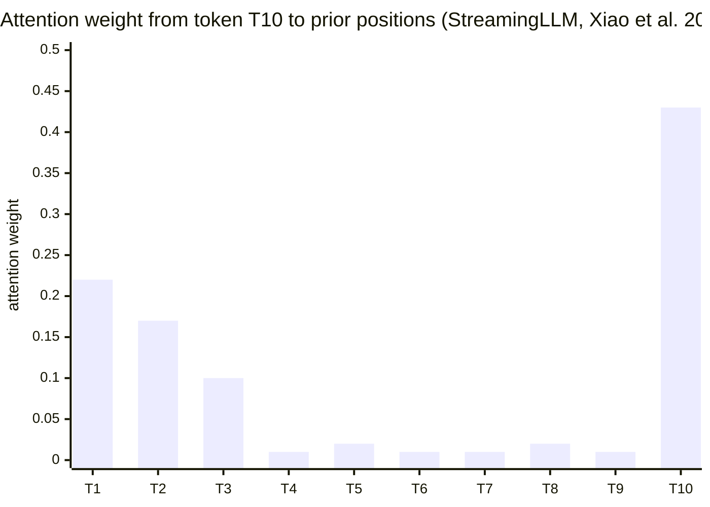

# Attention Mechanisms — Deep Dive

> This file is a deep-dive sub-file of the [Foundations & Architecture](README.md) module.
> It covers attention math at derivation level, Flash Attention algorithm internals,
> MQA/GQA implementation, and sparse/linear attention variants.
> ML-perspective attention (Bahdanau, seq2seq) is covered in the ML section.

---

## 1. Concept Overview

Self-attention is simultaneously the compute bottleneck and the intelligence bottleneck of large language models. It is the compute bottleneck because the naive implementation requires O(N²) memory to materialize the attention score matrix, making long-context inference and training prohibitively expensive. It is the intelligence bottleneck because every token's representation is a learned weighted combination of all other tokens — the expressiveness of the model's representations is bounded by how well it can compute these cross-token relationships.

Flash Attention (Dao et al., 2022) solved the memory bottleneck by eliminating the O(N²) materialization entirely, using careful tiling of the computation into SRAM-resident blocks. Grouped Query Attention (Ainslie et al., 2023) solved the KV cache bottleneck at inference by sharing key-value heads across multiple query heads. Together, these two innovations made 100K+ context length models feasible.

Understanding these at the algorithmic level — not just "Flash Attention is fast" but exactly which memory hierarchy operations are performed and why — is what differentiates senior from principal ML engineer interviews.

---

## 2. Intuition

One-line analogy: Naive attention is like reading every page of a book to answer each question; Flash Attention is like answering questions in batches per chapter, keeping only running summaries in fast memory.

Mental model: GPU memory is organized as a hierarchy — HBM (High Bandwidth Memory, 80GB, ~2TB/s bandwidth) and SRAM (on-chip, ~20MB, ~19TB/s bandwidth). Naive attention materializes the N×N score matrix in HBM, requiring O(N²) HBM reads/writes. Flash Attention tiles the computation into SRAM-sized blocks, computing softmax incrementally without ever materializing the full N×N matrix in HBM.

Why it matters: At N=8192 (8K context), naive attention needs 8192²×2bytes = 128MB per head per layer just for the attention scores. For a 70-layer, 64-head model, that's 601 GB (560 GiB) — impossible on any GPU. Flash Attention needs O(N) memory, enabling 100K+ context on a single H100.

Key insight: Flash Attention doesn't change what is computed — the mathematical result is identical to naive attention. It changes where the computation happens: SRAM instead of HBM, which is 10x faster and eliminates most memory bandwidth as the bottleneck.

---

## 3. Core Principles

**Scaled dot-product attention:** `Attn(Q,K,V) = softmax(QK^T / sqrt(d_k)) V`. The scaling by `sqrt(d_k)` is mathematically necessary to prevent softmax saturation at high dimensions.

**Variance argument for sqrt(d_k):** Assume Q and K have entries sampled from N(0,1). The dot product Q_i · K_j = Σ_{k=1}^{d_k} q_{ik} k_{jk} is a sum of d_k i.i.d. products. By the Central Limit Theorem, the variance of each product is 1, so the sum has variance d_k. Therefore the standard deviation is sqrt(d_k). Without scaling, large d_k (e.g., d_k=128) produces QK^T values with std ~11, pushing softmax into regions where the gradient is near-zero (the distribution becomes nearly one-hot). Dividing by sqrt(d_k) restores unit variance.

**Read it like this.** `Attn(Q,K,V) = softmax(QK^T / sqrt(d_k)) V` says: "for every token, score how well its question matches every token's label, shrink those scores so they stay in a sane range, turn each row of scores into percentages that add to 100%, then mix the tokens' contents in exactly those percentages."

Every output row is a *convex combination* of the V rows — a weighted average, never an amplification. That single property is why attention output magnitude does not blow up as the sequence grows.

| Symbol | What it is |
|--------|------------|
| `Q` | Queries, one row per token — "what am I looking for?" |
| `K` | Keys, one row per token — "what do I advertise about myself?" |
| `V` | Values, one row per token — the content actually mixed into the output |
| `QK^T` | Every-query-against-every-key score matrix, shape `[N, N]` |
| `d_k` | Width of one query/key vector (128 in LLaMA-3 70B) |
| `sqrt(d_k)` | Temperature divisor that undoes the variance growth of the dot product |
| `softmax(...)` | Row-wise `exp` then divide by the row sum, so each row sums to `1` |
| `... V` | The weighted sum: attention percentages applied to the value rows |

**Walk one example.** Three tokens, `d_k = 4`, `d_v = 2`, with `Q = K` so a token matches itself best:

```
  Q (3 tokens, d_k=4)        K (3 tokens, d_k=4)       V (3 tokens, d_v=2)
    t1 [1 0 1 0]               t1 [1 0 1 0]              t1 [2 0]
    t2 [0 1 1 0]               t2 [0 1 1 0]              t2 [0 4]
    t3 [1 1 0 1]               t3 [1 1 0 1]              t3 [1 1]

  step 1  raw scores S = Q K^T        step 2  divide by sqrt(d_k) = sqrt(4) = 2
            k1  k2  k3                          k1     k2     k3
      q1 [  2   1   1 ]              q1 [  1.00   0.50   0.50 ]
      q2 [  1   2   1 ]              q2 [  0.50   1.00   0.50 ]
      q3 [  1   1   3 ]              q3 [  0.50   0.50   1.50 ]

  step 3  softmax each ROW (exp, then divide by that row's sum)
      q1: exp -> 2.7183 1.6487 1.6487   sum 6.0157
          p   -> 0.4519 0.2741 0.2741   sums to 1.0000
      q2: exp -> 1.6487 2.7183 1.6487   sum 6.0157
          p   -> 0.2741 0.4519 0.2741   sums to 1.0000
      q3: exp -> 1.6487 1.6487 4.4817   sum 7.7791
          p   -> 0.2119 0.2119 0.5761   sums to 1.0000

  step 4  output row = the V rows mixed in that row's percentages
      out_1 = 0.4519*[2,0] + 0.2741*[0,4] + 0.2741*[1,1] = [1.1778, 1.3703]
      out_2 = 0.2741*[2,0] + 0.4519*[0,4] + 0.2741*[1,1] = [0.8222, 2.0815]
      out_3 = 0.2119*[2,0] + 0.2119*[0,4] + 0.5761*[1,1] = [1.0000, 1.4239]
```

Token 3 has the largest self-score (`3`, because its key has three ones), so after scaling and
softmax it keeps `0.5761` of its own value and splits the rest evenly — its output leans hardest
toward its own `V` row. Tokens 1 and 2 are more evenly spread. Nothing here exceeds the range of
the `V` rows themselves: the outputs are averages, not sums.

**Stated plainly.** The `1/sqrt(d_k)` is a thermostat. `Q_i · K_j` is a sum of `d_k` independent unit-variance products, so its variance is `d_k` and its standard deviation is `sqrt(d_k)`. Leave that in and the spread of the scores grows with head width; softmax reads a wide spread as "I am certain", collapses to one-hot, and the gradient it hands back is ~0.

**Walk one example.** The same three scores, with and without the divisor, at `d_k = 128`:

```
  d_k = 128  ->  std(q.k) = sqrt(128) = 11.3137

  Take three raw scores exactly one std apart: [ +11.3137,  0.0,  -11.3137 ]

  WITHOUT the divide:  softmax([11.3137, 0, -11.3137])
      p = [ 0.999988,  0.000012,  0.000000 ]      <- effectively one-hot
      dp/ds at the peak = p(1-p) = 1.220e-05      <- gradient has vanished

  WITH the divide by 11.3137:  softmax([1.0, 0.0, -1.0])
      p = [ 0.665241,  0.244728,  0.090031 ]      <- a usable distribution
      dp/ds at the peak = p(1-p) = 0.222695

  Gradient at the peak is 1.825e+04 times larger once scaled.
```

Four orders of magnitude of gradient, recovered by one division. Note the failure is *silent* — an
unscaled model still trains, it just learns far more slowly at large `d_k`, which is exactly why the
term is easy to omit and hard to debug.

**Why softmax, not ReLU:** ReLU attention is not row-normalized — each position's output would be a sum of values weighted by non-negative (but not summing-to-1) scores, making the magnitude of the output scale with the number of attended tokens. Softmax ensures each row of the attention matrix sums to 1, making the output a convex combination of values regardless of sequence length. Additionally, softmax preserves a dense gradient signal to all attended positions (though with varying magnitude), while ReLU would zero out all but the attended ones.

**Online softmax:** The key algorithmic insight behind Flash Attention. Softmax requires knowing all scores to compute the denominator (exp(x_i) / Σ exp(x_j)). Online softmax computes a numerically stable softmax incrementally by tracking running maximum and running sum, updating both as new blocks of scores are processed.

**KV cache:** During autoregressive generation, each new token requires attention to all previous tokens. Recomputing K and V for past tokens at each step costs O(N²T) total for a sequence of length T. The KV cache stores K and V for all past positions, reducing to O(N) per decoding step. For a 70B model, KV cache consumes ~2.6MB/token, making it the primary memory bottleneck in long-context serving.

---

## 4. Types / Architectures / Strategies

### 4.1 Multi-Head Attention Variants

| Variant | Q heads | K heads | V heads | KV Cache Size vs MHA | Quality vs MHA |
|---------|---------|---------|---------|----------------------|----------------|
| **MHA** (Multi-Head) | H | H | H | 1x | Baseline |
| **MQA** (Multi-Query) | H | 1 | 1 | 1/H x | -0.5 to -2 PPL |
| **GQA** (Grouped Query) | H | G | G (G<H) | G/H x | -0.1 to -0.5 PPL |
| **MLA** (Multi-Head Latent, DeepSeek-V2) | H | 1 (compressed) | 1 (compressed) | ~1/(4H) x | Near-MHA quality |

Typical: LLaMA 3 8B — 32 Q heads, 8 KV heads (GQA 4:1 ratio). LLaMA 3 70B — 64 Q heads, 8 KV heads (8:1 ratio).

### 4.2 Flash Attention Versions

| Version | Key Improvement | Peak FLOP Utilization (A100) | Notes |
|---------|-----------------|------------------------------|-------|
| **FA-1** (2022) | Online softmax, SRAM tiling | ~30-50% | O(N) memory; backward uses recomputation |
| **FA-2** (2023) | Better warp-level parallelism; less non-matmul FLOPs | ~50-73% | 2x faster than FA-1; standard today |
| **FA-3** (2024) | H100-specific async pipeline; FP8 support | ~75% peak | H100 only; async WGMMA+softmax pipelining |

### 4.3 Sparse and Linear Attention

| Variant | Complexity | Key Idea | Weakness |
|---------|-----------|----------|---------|
| **Longformer** | O(N×W + N×g) | Local sliding window + global tokens | Global tokens must be task-specified |
| **BigBird** | O(N×(W+g+r)) | Local + global + random attention | Complex, slow in practice |
| **Performer** | O(N×d) | Random feature approximation of softmax | ~5-10% quality degradation |
| **cosFormer** | O(N×d) | Cosine-based reweighting | Weaker on long-range than softmax |
| **Sliding window (Mistral)** | O(N×W) | Each token attends to W previous tokens | Relies on layering for long-range flow |

---

## 5. Architecture Diagrams

### Flash Attention Tiling Pattern

```
HBM (slow, 2TB/s):          SRAM (fast, 19TB/s, ~20MB):
+------------------+         +-------------------+
|   Q: [N, d_k]    |  load   |  Q_block: [B_r, d_k]
|   K: [N, d_k]    |-------> |  K_block: [B_c, d_k]
|   V: [N, d_v]    |         |  V_block: [B_c, d_v]
|   O: [N, d_v]    |         |  O_block: [B_r, d_v]
+------------------+         |  l (softmax denom): [B_r]
                             |  m (running max):   [B_r]
                             +-------------------+

SRAM block size: B_r = B_c = sqrt(M/(4*d))  where M = SRAM size in elements

For each block of Q (outer loop, B_r rows):
  For each block of K, V (inner loop, B_c rows):
    1. Load Q_block, K_block, V_block into SRAM
    2. Compute S_block = Q_block @ K_block^T / sqrt(d_k)   -- [B_r, B_c]
    3. Update running max m and running sum l (online softmax)
    4. Update O_block with new V weighted by attention
  End inner loop
  Write O_block back to HBM (once per Q block)

Memory complexity: O(N * d) in HBM (no N^2 matrix!)
HBM accesses: O(N^2 * d / M)  vs naive O(N^2)   --> M/d speedup
```

**Put simply.** `B_r = B_c = sqrt(M/(4d))` says: "make the tile as large as will fit, given that four `[B, d]` blocks have to sit in SRAM at once." The `O(N)` vs `O(N^2)` claim then reduces to one fact — Flash Attention keeps `Q`, `K`, `V`, `O` in HBM and never writes `S`.

| Symbol | What it is |
|--------|------------|
| `N` | Sequence length (tokens attending) |
| `d` | Per-head dimension, `d_head` — 128 in most production models |
| `M` | SRAM capacity measured in *elements*, not bytes (divide bytes by dtype size) |
| `B_r` | Rows of `Q` in one tile — the outer loop's step |
| `B_c` | Rows of `K`/`V` in one tile — the inner loop's step |
| `4` in `4d` | Four `[B, d]` blocks resident at once: `Q`, `K`, `V`, `O` |
| `S` | The `[N, N]` score matrix — the thing that is never materialized |
| `M/d` | HBM-traffic reduction factor versus naive attention |

**Walk one example.** At the `N = 8192` figure used in Section 2, with `d_head = 128` and FP16:

```
  N = 8192, d_head = 128, FP16 (2 bytes)

  naive: materialize S = Q K^T in HBM
      8192 x 8192 x 2 bytes = 134,217,728 B = 128 MiB    per head, per layer
      x 64 heads x 70 layers                = 560 GiB    -- no GPU holds this

  tiled: never materialize S; keep only Q, K, V, O in HBM
      each is 8192 x 128 x 2 bytes = 2 MiB   ->  4 tensors = 8 MiB
      128 MiB / 2 MiB = 64x smaller, and 64 = N/d -- the saving grows with N

  SRAM tile sizing:  B_r = B_c = sqrt(M / (4d)),  M = SRAM in elements
      20 MB of SRAM in FP16  ->  M = 10,485,760 elements
      sqrt(10,485,760 / (4 x 128)) = 143.1   ->  round down to B_r = B_c = 128

  one 128x128 tile resident in SRAM (FP16):
      Q,K,V,O blocks 4 x (128 x 128) + S block (128 x 128) = 5 x 16,384 values
      x 2 bytes = 163,840 B = 160 KiB      fits A100's 192 KiB per-SM shared memory
      tiles to sweep at N=8192: (8192/128)^2 = 4,096
```

The ratio to keep is `N/d`. At `N = 8192, d = 128` the score matrix is 64x the size of the tensors
that replace it; double the context and it becomes 128x, because `S` grows quadratically while
`Q, K, V, O` grow linearly. This is why tiling is not a constant-factor optimization — its payoff
compounds with context length, which is precisely what made 100K+ windows tractable.

### GQA Head Reshaping

```
Multi-Head Attention (H=8, G=8):
Q: [batch, seq, H, d_k]  -->  8 query heads
K: [batch, seq, H, d_k]  -->  8 key heads
V: [batch, seq, H, d_v]  -->  8 value heads
Each Q_h attends to its own K_h, V_h

Grouped Query Attention (H=8, G=2):
Q: [batch, seq, H=8, d_k]  -->  8 query heads
K: [batch, seq, G=2, d_k]  -->  2 key heads  (4:1 sharing)
V: [batch, seq, G=2, d_v]  -->  2 value heads

Implementation: repeat K and V to match Q head count
K_expanded = K.repeat_interleave(H // G, dim=2)  # [batch, seq, H, d_k]
V_expanded = V.repeat_interleave(H // G, dim=2)  # [batch, seq, H, d_v]

Now compute standard attention with Q, K_expanded, V_expanded.
KV cache size: G * d_k * 2 bytes * seq_len per layer
vs MHA: H * d_k * 2 bytes * seq_len per layer
Savings: H/G = 8/2 = 4x KV cache reduction
```

### MLA (Multi-Head Latent Attention) — Cache Compression

```
Standard KV Cache (MHA, H=128 heads, d_head=128):    MLA Cache (DeepSeek-V2, d_c=512):

Per token per layer stored:                          Per token per layer stored:
  K: [H × d_head] = [128 × 128] = 16,384 values       c: [d_c] = [512] values
  V: [H × d_head] = [128 × 128] = 16,384 values         (single compressed latent)
  Total = 32,768 values                               Total = 512 values

At 128K context, 60 layers, FP16:                    At 128K context, 60 layers, FP16:
  32,768 × 128K × 60 × 2 bytes ≈ 253 GB               512 × 128K × 60 × 2 bytes ≈ 7.9 GB

                             253 GB → 7.9 GB  (~32× reduction)

At attention time: decompress c → K, V via learned up-projections W_K, W_V.
Compression is learned jointly with the model — not a post-hoc quantization.
```

### Attention Sink — Weight Distribution



First 3–4 tokens absorb disproportionate attention weight regardless of content — here
T1–T3 hold 0.22/0.17/0.10 while T4–T9 sit near 0.01. They act as "sinks": aggregate value
buffers for the model's residual state. Evict T1–T4 and quality collapses; keep T1–T4 plus a
sliding window and quality is preserved. StreamingLLM's fix is to always maintain
`num_sink_tokens` (4) + a recent window in the cache.

---

## 6. How It Works — Detailed Mechanics

### Online Softmax Derivation

```python
import torch
import math
from typing import Tuple


def online_softmax_step(
    m_prev: torch.Tensor,   # (batch, q_len) running max so far
    l_prev: torch.Tensor,   # (batch, q_len) running denominator so far
    o_prev: torch.Tensor,   # (batch, q_len, d_v) running weighted sum so far
    k_block: torch.Tensor,  # (batch, k_block_len, d_k) current K block
    v_block: torch.Tensor,  # (batch, k_block_len, d_v) current V block
    q: torch.Tensor,        # (batch, q_len, d_k) query
    scale: float,
) -> Tuple[torch.Tensor, torch.Tensor, torch.Tensor]:
    """
    One step of online softmax for Flash Attention.

    The key insight: we can compute softmax incrementally without
    materializing the full attention score matrix.

    Mathematical equivalence:
    softmax([x1, x2, ..., xn]) = same as processing in blocks
    with running max m and sum l update rules.

    Running update rules (for numerical stability):
    m_new = max(m_prev, max(s_block))
    l_new = l_prev * exp(m_prev - m_new) + sum(exp(s_block - m_new))
    o_new = o_prev * exp(m_prev - m_new) + exp(s_block - m_new) @ v_block
    """
    # Compute attention scores for this block: (batch, q_len, k_block_len)
    s_block = torch.bmm(q, k_block.transpose(1, 2)) * scale

    # Block max: (batch, q_len)
    m_block = s_block.max(dim=-1).values

    # Update running max
    m_new = torch.maximum(m_prev, m_block)

    # Correction factor for previously accumulated output
    # When max increases from m_prev to m_new, we must rescale previous work
    correction = torch.exp(m_prev - m_new)  # (batch, q_len)

    # Compute softmax numerator for current block: (batch, q_len, k_block_len)
    p_block = torch.exp(s_block - m_new.unsqueeze(-1))

    # Update running denominator
    l_new = correction * l_prev + p_block.sum(dim=-1)

    # Update running weighted output
    # Previous output needs correction; current block adds its weighted V
    o_new = (
        o_prev * correction.unsqueeze(-1) +
        torch.bmm(p_block, v_block)          # (batch, q_len, d_v)
    )

    return m_new, l_new, o_new


def flash_attention_reference(
    q: torch.Tensor,   # (batch, seq_len, d_k)
    k: torch.Tensor,   # (batch, seq_len, d_k)
    v: torch.Tensor,   # (batch, seq_len, d_v)
    block_size: int = 64,
    causal: bool = True,
) -> torch.Tensor:
    """
    Reference Python implementation of Flash Attention forward pass.
    Conceptually equivalent to PyTorch's scaled_dot_product_attention
    but processes K/V in blocks to demonstrate the tiling pattern.

    Production use: torch.nn.functional.scaled_dot_product_attention()
    or flash_attn.flash_attn_func() for actual CUDA implementation.
    """
    batch, seq_len, d_k = q.shape
    d_v = v.shape[-1]
    scale = 1.0 / math.sqrt(d_k)

    # Initialize running accumulators
    m = torch.full((batch, seq_len), float('-inf'))
    l = torch.zeros(batch, seq_len)
    o = torch.zeros(batch, seq_len, d_v)

    # Process K, V in blocks (inner loop)
    for block_start in range(0, seq_len, block_size):
        block_end = min(block_start + block_size, seq_len)
        k_block = k[:, block_start:block_end, :]
        v_block = v[:, block_start:block_end, :]

        if causal:
            # For causal attention, only process K positions that are <= current Q positions
            # (simplified here; proper implementation uses masking)
            pass

        m, l, o = online_softmax_step(m, l, o, k_block, v_block, q, scale)

    # Normalize by running denominator
    return o / l.unsqueeze(-1)
```

### GQA Forward Pass with KV Cache

```python
import torch
import torch.nn as nn
import torch.nn.functional as F
from typing import Optional, Tuple


class GroupedQueryAttention(nn.Module):
    """
    Grouped Query Attention (Ainslie et al., 2023).
    Used in LLaMA 2+, Mistral, Gemma, Qwen.

    H: number of query heads
    G: number of KV heads (G <= H, H must be divisible by G)
    d_model: model dimension
    d_head: per-head dimension (d_model // H)
    """

    def __init__(
        self,
        d_model: int,
        num_heads: int,       # H: query heads
        num_kv_heads: int,    # G: key-value heads
        dropout: float = 0.0,
    ) -> None:
        super().__init__()
        assert num_heads % num_kv_heads == 0, "num_heads must be divisible by num_kv_heads"

        self.num_heads = num_heads
        self.num_kv_heads = num_kv_heads
        self.num_groups = num_heads // num_kv_heads  # query heads per KV head
        self.d_head = d_model // num_heads
        self.scale = self.d_head ** -0.5
        self.dropout = dropout

        self.q_proj = nn.Linear(d_model, num_heads * self.d_head, bias=False)
        self.k_proj = nn.Linear(d_model, num_kv_heads * self.d_head, bias=False)
        self.v_proj = nn.Linear(d_model, num_kv_heads * self.d_head, bias=False)
        self.o_proj = nn.Linear(num_heads * self.d_head, d_model, bias=False)

    def forward(
        self,
        x: torch.Tensor,  # (batch, seq_len, d_model)
        past_key_value: Optional[Tuple[torch.Tensor, torch.Tensor]] = None,
        use_cache: bool = False,
    ) -> Tuple[torch.Tensor, Optional[Tuple[torch.Tensor, torch.Tensor]]]:
        batch, seq_len, _ = x.shape

        # Project to Q, K, V
        q = self.q_proj(x)    # (batch, seq_len, H * d_head)
        k = self.k_proj(x)    # (batch, seq_len, G * d_head)
        v = self.v_proj(x)    # (batch, seq_len, G * d_head)

        # Reshape to heads
        q = q.view(batch, seq_len, self.num_heads, self.d_head).transpose(1, 2)
        # q: (batch, H, seq_len, d_head)
        k = k.view(batch, seq_len, self.num_kv_heads, self.d_head).transpose(1, 2)
        # k: (batch, G, seq_len, d_head)
        v = v.view(batch, seq_len, self.num_kv_heads, self.d_head).transpose(1, 2)
        # v: (batch, G, seq_len, d_head)

        # Append to KV cache if provided
        if past_key_value is not None:
            past_k, past_v = past_key_value
            k = torch.cat([past_k, k], dim=2)   # extend along seq dim
            v = torch.cat([past_v, v], dim=2)

        present_key_value = (k, v) if use_cache else None

        # Expand K, V to match Q head count
        # (batch, G, seq_len, d_head) -> (batch, H, seq_len, d_head)
        k = k.repeat_interleave(self.num_groups, dim=1)
        v = v.repeat_interleave(self.num_groups, dim=1)

        # Compute attention using PyTorch's Flash Attention (SDPA)
        # This uses FA-2 kernel when available
        attn_out = F.scaled_dot_product_attention(
            q, k, v,
            attn_mask=None,
            dropout_p=self.dropout if self.training else 0.0,
            is_causal=True,   # generates causal mask internally — O(1) memory
        )
        # attn_out: (batch, H, seq_len, d_head)

        # Merge heads and project
        attn_out = attn_out.transpose(1, 2).contiguous()
        attn_out = attn_out.view(batch, seq_len, self.num_heads * self.d_head)
        return self.o_proj(attn_out), present_key_value


def compute_kv_cache_memory(
    batch_size: int,
    seq_len: int,
    num_layers: int,
    num_kv_heads: int,
    d_head: int,
    bytes_per_element: int = 2,  # BF16 = 2 bytes
) -> float:
    """
    Compute KV cache memory in GB for a given configuration.

    For LLaMA 3 70B (GQA, 8 KV heads, 128 d_head, 80 layers):
    compute_kv_cache_memory(1, 4096, 80, 8, 128) ≈ 1.34 GB (1.25 GiB) per sequence
    """
    # 2x for K and V
    bytes_total = 2 * num_layers * num_kv_heads * d_head * seq_len * batch_size * bytes_per_element
    return bytes_total / (1024 ** 3)
```

**In plain terms.** `bytes = 2 * n_layers * n_kv_heads * head_dim * seq_len * batch * dtype_bytes` says: "store two vectors (a key and a value) of width `head_dim`, once per KV head, once per layer, for every token you have ever seen, for every sequence in flight."

| Symbol | What it is |
|--------|------------|
| `2` (leading) | K and V are both cached — this is a count of tensors, not a dtype size |
| `n_layers` | Transformer blocks; every block keeps its own independent cache |
| `num_attention_heads` | Query head count `H` (64 on Llama-2-70B). **Absent from this formula** |
| `n_kv_heads` | KV head count `G` (8 on Llama-2-70B). The ONLY head count that sizes the cache |
| `head_dim` | Width of one head's K or V vector, `128` |
| `seq_len` | Tokens currently cached — prompt plus everything generated so far |
| `batch` | Concurrent sequences sharing the GPU |
| `dtype_bytes` | `2` for BF16/FP16, `1` for FP8, `4` for FP32 |

The trap worth naming: it is `n_kv_heads`, never `num_attention_heads`. Substituting the query head
count on a GQA model over-counts the cache by exactly `H/G` — 8x on Llama-2-70B, 4x on LLaMA-3 8B.
MHA is simply the special case `n_kv_heads == num_attention_heads`; MQA is the special case
`n_kv_heads == 1`. All three variants use one formula, and only that one symbol changes.

**Walk one example.** Llama-2-70B's real config, holding everything fixed except `n_kv_heads`:

```
  Llama-2-70B / LLaMA 3 70B:  n_layers = 80, head_dim = 128, BF16 -> 2 bytes
  num_attention_heads = 64   (query heads -- does NOT appear in the formula)
  num_kv_heads        =  8   (the ONLY head count that sizes the cache)

  per token = 2 x 80 x n_kv_heads x 128 x 2 bytes

    MHA   n_kv_heads = 64  ->  2,621,440 B = 2560.0 KiB per token
    GQA   n_kv_heads =  8  ->    327,680 B =  320.0 KiB per token
    MQA   n_kv_heads =  1  ->     40,960 B =   40.0 KiB per token

  at seq_len = 131,072 (128K context), batch = 1:

    MHA   343,597,383,680 B = 320.0 GiB
    GQA    42,949,672,960 B =  40.0 GiB
    MQA     5,368,709,120 B =   5.0 GiB

  ratios:  MHA/GQA = 64/8 = 8x     MHA/MQA = 64/1 = 64x     GQA/MQA = 8x
```

Read the last column as a serving constraint, not a statistic. On one 80 GiB H100 the GQA cache
alone permits `80 / 40 = 2` concurrent 128K sequences — before a single byte of model weights. The
MHA variant at 320 GiB does not fit on an 8xH100 node once weights are resident, which is the whole
reason GQA shipped. MQA's 5 GiB would allow 16 such sequences, and the 0.5-2 PPL it costs is the
price of that 8x.

### Multi-Head Latent Attention (DeepSeek-V2)

```python
import torch
import torch.nn as nn


class MultiHeadLatentAttention(nn.Module):
    """
    DeepSeek-V2's MLA: Compresses K, V into a low-dimensional latent space.
    Cache the latent vector c (small) instead of full K and V (large).

    Standard GQA KV cache: num_kv_heads * d_head * 2 per token
    MLA KV cache: d_c (e.g., 512) per token  (regardless of num_heads!)

    At inference: decompress c -> K, V using learned matrices.
    This is 4-8x smaller than even GQA cache.
    """
    def __init__(
        self,
        d_model: int = 5120,
        num_heads: int = 128,
        d_head: int = 128,
        d_c: int = 512,   # compressed KV dimension (the "latent")
    ) -> None:
        super().__init__()
        self.num_heads = num_heads
        self.d_head = d_head
        self.d_c = d_c
        self.scale = d_head ** -0.5

        # Down-project x to latent: x -> c
        self.kv_down_proj = nn.Linear(d_model, d_c, bias=False)

        # Up-project latent to K and V
        self.k_up_proj = nn.Linear(d_c, num_heads * d_head, bias=False)
        self.v_up_proj = nn.Linear(d_c, num_heads * d_head, bias=False)

        # Query projection
        self.q_proj = nn.Linear(d_model, num_heads * d_head, bias=False)
        self.o_proj = nn.Linear(num_heads * d_head, d_model, bias=False)

    def forward(
        self,
        x: torch.Tensor,                          # (batch, seq, d_model)
        cached_c: torch.Tensor | None = None,     # (batch, past_seq, d_c) KV cache
    ) -> tuple[torch.Tensor, torch.Tensor]:
        batch, seq, _ = x.shape

        # Query
        q = self.q_proj(x).view(batch, seq, self.num_heads, self.d_head).transpose(1, 2)

        # Compress to latent (THIS is what we cache, not K and V directly)
        c = self.kv_down_proj(x)    # (batch, seq, d_c)

        # Append new latent to cache
        if cached_c is not None:
            c_full = torch.cat([cached_c, c], dim=1)
        else:
            c_full = c

        # Decompress latent to K and V (at cache read time)
        k = self.k_up_proj(c_full).view(batch, -1, self.num_heads, self.d_head).transpose(1, 2)
        v = self.v_up_proj(c_full).view(batch, -1, self.num_heads, self.d_head).transpose(1, 2)

        # Standard attention
        import torch.nn.functional as F
        out = F.scaled_dot_product_attention(q, k, v, is_causal=True)
        out = out.transpose(1, 2).contiguous().view(batch, seq, -1)
        return self.o_proj(out), c  # return new c for next step's cache
```

### Attention Sink and KV Eviction

```python
import torch
from collections import deque
from typing import Optional


class SinkKVCache:
    """
    StreamingLLM-style KV cache with attention sinks (Xiao et al., 2023).

    Observation: LLMs assign disproportionate attention weight to the first
    4-8 tokens regardless of their semantic content ("attention sinks").
    Evicting these tokens causes catastrophic quality degradation.

    Strategy: Always keep the first `num_sink_tokens` tokens in cache.
    Use a sliding window for the remaining recent tokens.

    Total cache size: num_sink_tokens + window_size  (constant regardless of seq length)
    """

    def __init__(
        self,
        num_sink_tokens: int = 4,
        window_size: int = 2048,
    ) -> None:
        self.num_sink_tokens = num_sink_tokens
        self.window_size = window_size
        self.sink_k: Optional[torch.Tensor] = None  # (batch, H, num_sink, d)
        self.sink_v: Optional[torch.Tensor] = None
        self.recent_k: deque = deque()   # rolling window of K blocks
        self.recent_v: deque = deque()
        self.step = 0

    def update(
        self,
        new_k: torch.Tensor,   # (batch, H, 1, d) - single new token
        new_v: torch.Tensor,
    ) -> tuple[torch.Tensor, torch.Tensor]:
        """
        Add new K, V to cache. Return full K, V to use in attention.
        Maintains constant cache size after warmup.
        """
        if self.step < self.num_sink_tokens:
            # Accumulate sink tokens
            self.sink_k = torch.cat([self.sink_k, new_k], dim=2) if self.sink_k is not None else new_k
            self.sink_v = torch.cat([self.sink_v, new_v], dim=2) if self.sink_v is not None else new_v
        else:
            # Add to rolling window
            self.recent_k.append(new_k)
            self.recent_v.append(new_v)

            # Evict oldest recent token if window is full
            if len(self.recent_k) > self.window_size:
                self.recent_k.popleft()
                self.recent_v.popleft()

        self.step += 1

        # Concatenate sink + recent for full KV
        recent_k_tensor = torch.cat(list(self.recent_k), dim=2) if self.recent_k else torch.empty(0)
        recent_v_tensor = torch.cat(list(self.recent_v), dim=2) if self.recent_v else torch.empty(0)

        if self.sink_k is not None and len(self.recent_k) > 0:
            full_k = torch.cat([self.sink_k, recent_k_tensor], dim=2)
            full_v = torch.cat([self.sink_v, recent_v_tensor], dim=2)
        elif self.sink_k is not None:
            full_k, full_v = self.sink_k, self.sink_v
        else:
            full_k, full_v = recent_k_tensor, recent_v_tensor

        return full_k, full_v
```

---

## 7. Real-World Examples

**LLaMA 3 70B (GQA 8:1):** 64 Q heads, 8 KV heads, 128 d_head. KV cache per token = 2 × 80 layers × 8 heads × 128 dims × 2 bytes (BF16) = 327,680 bytes ≈ 320KB per token. At 128K context: 40GB KV cache per sequence — comparable to the model weights. Without GQA (MHA with 64 KV heads): 8× larger = 320GB — impossible to serve even on 8×H100.

**Mistral 7B (Sliding Window + GQA):** Window size 4096, 32 Q heads, 8 KV heads. Rolling KV cache: 4096 × 8 × 128 × 2 × 32 layers × 2 bytes ≈ 536MB per sequence — fits comfortably in VRAM alongside model weights. Standard KV cache at 32K context would be 4GB per sequence.

**Flash Attention 2 production impact:** DeepMind's Gemini training switched from custom attention to FA-2. Training throughput increased 2.5x. The bottleneck shifted from memory bandwidth (HBM reads for attention) to compute (matrix multiplications). This enabled training with longer sequences (previously limited by OOM) and higher batch sizes.

**DeepSeek-V2 MLA:** MLA compresses KV cache to 512 dimensions per token (vs standard 128 per head × 128 heads = 16384 total). Cache reduction: 32x smaller than equivalent MHA. At 128K context: MLA cache = 512 × 128K × 2 bytes × 60 layers = 7.9GB vs MHA 253GB. This enabled deploying a 236B parameter MoE model economically.

---

## 8. Tradeoffs

| Variant | KV Cache (relative) | Quality (PPL) | Implementation Complexity | Best For |
|---------|--------------------|--------------|--------------------------|---------  |
| MHA | 1x | Baseline | Simple | Research, small models |
| MQA | 1/H x | -0.5 to -3 PPL | Simple | Latency-critical, quality flexible |
| GQA (4:1) | 0.25x | -0.1 to -0.5 PPL | Simple | Production sweet spot |
| GQA (8:1) | 0.125x | -0.2 to -1 PPL | Simple | Large model serving (70B+) |
| MLA | ~1/(32H) x | Near-MHA | Complex (down+up projections) | Extreme context, model density |

| Flash Attention vs Naive | |
|--------------------------|--|
| Memory | O(N) vs O(N²) |
| Speed | 2-4x faster than PyTorch naive |
| Backward | Recomputes attention in backward (saves activation memory) |
| Causal mask | Generated on-the-fly (no N×N mask storage) |
| Limitation | Fixed d_head constraint (< 256 per head) in FA-2; custom attention bias requires workaround |

| Linear Attention vs Softmax | |
|------------------------------|--|
| Complexity | O(N×d) vs O(N²) |
| Quality gap | 5-15% worse on language modeling benchmarks |
| Why worse | Cannot represent sharp peaked distributions (key for copying/retrieval) |
| Best use case | Ultra-long sequences (>100K) where softmax quality is acceptable tradeoff |

---

## 9. When to Use / When NOT to Use

### Use standard MHA when:

- Training a small research model (<7B) where KV cache is not a bottleneck
- Benchmarking or reproducing existing results that use MHA
- Model will not be served at long context lengths

### Use GQA when:

- Deploying any model >7B at context >8K tokens — KV cache is a bottleneck
- Serving multiple concurrent users on fixed GPU memory
- Choose G such that H/G is 4-8x (typical: 8 KV heads for 32-64 Q heads)

### Use MQA when:

- Extreme latency constraints (single KV head minimizes memory bandwidth)
- Quality degradation is acceptable (summarization, simple QA)
- Small batch size (1-4 sequences): bandwidth savings more important than compute

### Use Flash Attention when:

- Always — there is no reason not to use it. `F.scaled_dot_product_attention(is_causal=True)` uses FA-2 automatically in PyTorch 2.0+ when CUDA is available.

### Use sliding window attention when:

- Serving at very long context (>32K) where even GQA+FA-2 is memory-limited
- Task has primarily local structure (time series, speech, sliding document windows)
- Accept that tokens >W layers ago cannot directly interact

### Do NOT use linear attention when:

- Quality is critical for in-context learning or retrieval-based tasks
- Model will be used for RAG or few-shot examples (linear attention cannot "copy" well)
- Replacing softmax attention in an existing trained model (requires retraining from scratch)

---

## 10. Common Pitfalls

### Pitfall 1: Using custom attention bias with Flash Attention

```python
# BROKEN: FA-2 does not support arbitrary bias matrices
from flash_attn import flash_attn_func

# Custom ALiBi bias or learned position bias is NOT supported
attention_bias = compute_alibi_bias(seq_len, num_heads)
output = flash_attn_func(q, k, v, attn_bias=attention_bias)  # ERROR in FA-2

# FIXED option 1: Use PyTorch SDPA with custom mask (falls back to eager, slower)
output = torch.nn.functional.scaled_dot_product_attention(
    q, k, v,
    attn_mask=attention_bias,   # supported, but may not use FA kernel
)

# FIXED option 2: Switch to ALiBi implemented as sliding window (FA-3 supports this)
# FIXED option 3: Use FA-2 with causal mask only (remove custom bias)
```

### Pitfall 2: GQA quality degradation at extreme ratios

```python
# PROBLEM: Very high Q:KV ratios degrade quality significantly
# LLaMA 3 8B: 32 Q heads, 8 KV heads -> 4:1 ratio -> <0.2 PPL loss
# But: 32 Q heads, 1 KV head (MQA) -> 32:1 -> 2-3 PPL loss on complex tasks

# MEASUREMENT: Check quality degradation before choosing G
# For a 7B model, per-head dimension d_k=128:
# H=32, G=8: KV cache 8 * 128 = 1024 dims per layer
# H=32, G=4: KV cache 4 * 128 = 512 dims per layer
# H=32, G=2: KV cache 2 * 128 = 256 dims per layer  <- quality drop threshold

# BEST PRACTICE: Never go below G=4 for models above 7B
# unless task is purely extractive (no generation quality requirements)
```

### Pitfall 3: Forgetting causal mask with Flash Attention SDPA

```python
# BROKEN: Omitting is_causal=True allows future tokens to attend to past
# This is incorrect for decoder-only models during training
output = F.scaled_dot_product_attention(q, k, v)   # NOT causal!
# The model will see future tokens during training but not at inference -> train/inference mismatch

# FIXED: Always pass is_causal=True for decoder-only (causal LM) training
output = F.scaled_dot_product_attention(q, k, v, is_causal=True)

# Note: is_causal=True generates an upper-triangular mask internally
# Never pass a manual causal mask AND is_causal=True simultaneously (doubles masking)
```

### Pitfall 4: Attention head pruning miscalibrated

```python
# Context: Head importance analysis for model compression
# Finding: ~30% of attention heads contribute <5% to output on average
# Pruning them seems safe based on average contribution

# PROBLEM: Average importance masks critical heads for specific tasks
# A head contributing 2% on average may contribute 40% on coreference tasks
# Pruning it breaks those tasks completely while average metrics look fine

# FIXED: Evaluate per-task head importance before pruning
def compute_head_importance(
    model, dataloader, task_name: str,
    num_batches: int = 100,
) -> torch.Tensor:
    """
    Compute Taylor-expansion head importance on a task-specific dataloader.
    Importance(h) = |gradient_of_loss × head_mask_gradient|
    Prune heads with importance < threshold on ALL relevant tasks jointly.
    """
    importance_scores = torch.zeros(model.num_layers, model.num_heads)
    for batch in dataloader:
        loss = model(**batch).loss
        loss.backward()
        for layer_idx, layer in enumerate(model.transformer.layers):
            for head_idx in range(model.num_heads):
                # Gradient magnitude on head output weights
                grad = layer.attention.o_proj.weight.grad
                importance_scores[layer_idx, head_idx] += grad.abs().mean().item()
    return importance_scores / num_batches
```

### Pitfall 5: KV cache memory estimation missing GQA

```python
# BROKEN: Classic formula ignores GQA KV head reduction
def kv_cache_gb_wrong(seq_len, num_layers, num_heads, d_head, bytes=2):
    return 2 * seq_len * num_layers * num_heads * d_head * bytes / 1e9

# FIXED: Use num_kv_heads (G), not num_heads (H)
def kv_cache_gb(seq_len, num_layers, num_kv_heads, d_head, bytes=2):
    return 2 * seq_len * num_layers * num_kv_heads * d_head * bytes / 1e9

# LLaMA 3 70B example:
# Wrong (using H=64): 2 * 128000 * 80 * 64 * 128 * 2 / 1e9 = 84.5 GB (per sequence!)
# Correct (using G=8): 2 * 128000 * 80 * 8 * 128 * 2 / 1e9 = 10.6 GB (per sequence)
# The difference (8x) is the whole point of GQA
```

---

## 11. Technologies & Tools

| Tool | Purpose | Notes |
|------|---------|-------|
| `torch.nn.functional.scaled_dot_product_attention` | FA-2 via PyTorch 2.0+ | Automatic FA-2 when CUDA available and d_head <= 256 |
| `flash_attn` (Tri Dao) | Flash Attention 1/2/3 CUDA kernels | `pip install flash-attn --no-build-isolation` |
| `xformers` (Meta) | Memory-efficient attention ops | Flash attention + custom ops |
| `vLLM` | KV cache management for serving | PagedAttention for dynamic KV cache allocation |
| TransformerLens | Mechanistic interpretability | Head-level attention pattern analysis |
| BerViz | Attention visualization | Multi-head attention heatmaps |
| `flash-attn-3` | H100-specific FA-3 | Async pipelining, FP8, 75% FLOP utilization |

---

## 12. Interview Questions with Answers

**Q: Derive why attention scores are divided by sqrt(d_k).**
Let Q and K have entries i.i.d. from N(0,1). The attention score for token i attending to token j is `s_{ij} = q_i · k_j = Σ_{k=1}^{d_k} q_{ik} k_{jk}`. Since each product `q_{ik} k_{jk}` has E[q·k]=0 and Var[q·k]=1 (by independence and unit variance), the sum of d_k independent products has Var[s_{ij}] = d_k and std = sqrt(d_k). For d_k=64, std≈8; for d_k=128, std≈11. When softmax receives logits with std=11, the largest logit dominates exponentially — softmax output is nearly one-hot, gradient is near zero everywhere except the maximum. This kills learning. Dividing by sqrt(d_k) rescales variance to 1 regardless of d_k, keeping softmax in a learnable regime.

**Q: Explain Flash Attention at the algorithm level. What is online softmax?**
Flash Attention solves the O(N²) memory problem in attention by processing K and V in blocks that fit in SRAM, using an online softmax to accumulate the result without materializing the full N×N score matrix. Online softmax works as follows: normal softmax `exp(x_i) / Σ_j exp(x_j)` requires all x_j before computing any output. Online softmax maintains a running maximum `m` and running denominator `l`. For each new block of scores: (1) compute new block max `m_block`; (2) update global max `m_new = max(m_prev, m_block)`; (3) rescale previous accumulated output by `exp(m_prev - m_new)` (compensating for max increase); (4) add new block contribution. The mathematical identity `softmax([x1,...,xN]) = softmax_online([x1,...,xN])` holds exactly. Memory: O(N × d) (linear) instead of O(N²). HBM accesses: reduced by M/d where M is SRAM size — typically 5-10x fewer reads/writes, which is where the 2-4x speedup comes from.

**Q: How does GQA reduce KV cache size? What is the quality tradeoff?**
GQA assigns G key-value heads (G < H) shared across H/G query heads each. During forward pass, the G key-value matrices are expanded via `repeat_interleave` to match H query heads. At inference (generation), only the G KV heads are stored in the KV cache: cache size reduces from `H × d_head` to `G × d_head` per token per layer — a factor of H/G reduction. For LLaMA 3 70B with H=64, G=8: 8x KV cache reduction. Quality tradeoff: less distinct KV representation per query head means some cross-position information is lost. Empirically, GQA with G=H/8 loses 0.2-1.0 perplexity points on language modeling. Tasks requiring fine-grained position tracking (copying, coreference) degrade more than tasks requiring semantic understanding. The sweet spot is G=H/4 to G=H/8 — providing 4-8x KV savings with <0.5 PPL quality loss.

**Q: What is the attention sink phenomenon and how does it affect KV cache eviction?**
StreamingLLM (Xiao et al., 2023) showed that LLMs assign disproportionately high attention weights to the first 4-8 tokens in the sequence regardless of their semantic content. These "attention sinks" act as aggregate value storage — because a massive fraction of softmax attention goes to them, they must encode the model's otherwise-unattended state. Removing sink tokens from the KV cache causes catastrophic quality degradation even when all semantically relevant tokens are retained. This has three practical implications: (1) KV eviction strategies must never evict sink tokens (always keep first 4-8); (2) sliding window attention must include initial tokens as global tokens; (3) context truncation should remove from the middle, not the beginning. StreamingLLM implements a constant-memory cache by keeping sink tokens (4) + a sliding window of recent tokens, enabling infinite-length generation at fixed memory cost.

**Q: Compare MQA, GQA, and MLA. When would you use each?**
MQA (Multi-Query): H query heads, 1 KV head. Maximum KV cache reduction (H× smaller). Quality drops 1-3 PPL points on complex tasks. Used in older models (PaLM, early Falcon) and latency-critical deployments. GQA (Grouped Query): H query heads, G KV heads where G is a divisor of H. Configurable quality-memory tradeoff. Standard for modern production models (LLaMA 2+, Mistral, Gemma, Qwen). G=H/8 is the most common. MLA (DeepSeek-V2): Compresses the KV representation to a latent vector of dimension d_c (e.g., 512) regardless of num_heads or d_head. Cache stores d_c dimensional vector per token; at attention time, decompresses to full K and V. Achieves ~32x KV reduction vs MHA for DeepSeek-V2's 128 heads, enabling serving a 236B MoE model economically. Complexity: more architectural changes; cannot simply be added to an existing model.

**Q: What does Flash Attention do differently in the backward pass?**
The standard backward pass for attention requires storing the attention matrix `P = softmax(QK^T/sqrt(d_k))` for computing gradients — O(N²) storage. Flash Attention's backward pass uses activation recomputation: it stores only the output O and the softmax statistics (m, l) — O(N) storage. During backward, it recomputes P from Q, K, and the stored m/l statistics. This recomputation takes additional FLOPs (~1/3 of forward pass cost) but eliminates the O(N²) memory requirement. FA-2's backward pass additionally optimizes warp-level parallelism for the gradient computation, achieving ~50% of theoretical H100 FLOP utilization in backward (vs ~73% in forward). In practice, the memory saving from not storing N²-sized activation matrices enables much larger batch sizes and longer sequences during training.

**Q: Explain sparse attention (Longformer, BigBird) and when these approaches fell out of favor.**
Sparse attention restricts the full O(N²) attention to structured subsets of token pairs, achieving O(N×W) complexity. Longformer: each token attends to a local window of W tokens plus a small set of global tokens (like [CLS], or task-specific tokens like question tokens in QA). BigBird: extends Longformer with random attention connections (each token additionally attends to r random other tokens), providing theoretical guarantees of being a universal approximator. These approaches required custom CUDA kernels that were complex to implement and maintain. Flash Attention changed the equation: FA-2 makes full O(N²) attention cheap enough that sparse attention's complexity savings are often unnecessary. For 8K context, FA-2 attention is fast enough. For 128K+ context where even FA-2 is memory-limited, modern solutions prefer RingAttention (distributes attention across devices) or sliding window attention. Sparse attention patterns (Longformer-style) are still used in some long-context encoder models.

**Q: How does the KV cache grow and what strategies exist to manage it?**
KV cache size = 2 (K+V) × num_kv_heads × d_head × seq_len × num_layers × bytes_per_element. It grows linearly with sequence length. At 128K tokens with LLaMA 3 70B (GQA, 8 KV heads): ~10.6GB per sequence. Strategies: (1) GQA/MQA: reduce num_kv_heads (most impactful; discussed above); (2) KV cache quantization: INT8 or FP8 KV cache reduces by 2-4x with <0.5 PPL loss; (3) PagedAttention (vLLM): virtualizes KV cache into fixed-size pages, eliminating fragmentation and enabling 100% KV cache utilization; (4) Prefix caching: share KV cache across requests with common prefixes (e.g., same system prompt); (5) KV eviction (H2O, StreamingLLM): evict low-importance tokens from cache; must keep attention sinks; (6) Sliding window cache: discard all but recent W tokens (loses long-range context).

**Q: How much does Flash Attention actually speed things up in practice?**
Flash Attention 2 achieves 50-73% of peak theoretical A100 FLOPs on attention computation. Compare to naive PyTorch attention which achieves ~30-35% utilization due to HBM bandwidth being the bottleneck, not compute. Practical measurements: FA-2 vs PyTorch naive attention (causal, d_head=128): (1) Forward pass speedup: ~2.6x at N=2048, ~3.1x at N=8192 (scales better at longer sequences because memory bandwidth savings increase). (2) Memory: 6-8x less peak memory at N=8192. (3) Backward pass: ~2.5x speedup with similar memory savings. Combined effect on end-to-end training throughput: ~1.5-2x (not all time is spent in attention; FFN layers have fixed cost). The absolute improvement is largest for long-context models where attention previously dominated compute time.

**Q: What is the difference between local and global tokens in Longformer?**
Local tokens in Longformer use sliding window attention: each token attends to at most W tokens to its left and right (e.g., W=512). Global tokens attend to all tokens and are attended to by all tokens — essentially the original full attention. Global token selection is task-specific: for document classification, [CLS] is global; for QA, all question tokens are global so they can aggregate evidence from the full document; for named entity recognition, no global tokens are needed. The two-level design is crucial: purely local attention cannot propagate information beyond one layer × window_size tokens without stacking many layers. The global tokens serve as information aggregation points — any information needed globally can route through them. Longformer achieves O(N×W + N×g) complexity where g is the number of global tokens (typically ≤ 64), making it near-linear for typical g values.

**Q: What is multi-head latent attention (MLA) and how does DeepSeek-V2 achieve near-MHA quality with it?**
MLA (DeepSeek-V2, 2024) learns to compress KV representations into a low-dimensional latent vector. Instead of caching K and V directly (which scale with num_heads × d_head = e.g., 128 × 128 = 16K dims), MLA caches only the latent vector c (e.g., 512 dims) — a 32x reduction. At attention time, c is decompressed to full K and V via learned linear projections. Quality is maintained because: (1) the compression is learned jointly with the rest of the model (not a post-hoc quantization); (2) the model learns which information is critical to preserve in the latent; (3) the up-projection matrices have sufficient capacity to reconstruct K and V accurately from c. DeepSeek-V2 achieves perplexity within 0.1-0.3 of an equivalent MHA model while using 32× less KV cache. The tradeoff: decompression adds ~4 matrix multiplications per attention forward pass (negligible vs the attention computation itself).

**Q: How does attention relate to the "softmax bottleneck" problem in LLMs?**
The softmax bottleneck (Yang et al., 2018) is a property of the output layer: the LM head computes `logits = h @ E^T` where E is the embedding matrix. If the embedding dimension d is smaller than the number of distinguishable contexts, the LM cannot express all possible output distributions — the rank of `h @ E^T` is bounded by min(d, vocab_size). This is unrelated to attention softmax but often discussed together. Within attention specifically, the softmax in `Attn = softmax(QK^T) V` is NOT a bottleneck — it applies independently per row (per query position), so the rank constraint is on the V matrix multiplication, not the attention weights. The attention softmax bottleneck is about something different: the output of attention (before FFN) is a convex combination of V vectors, constraining the rank of attention output representations. This is why multi-head attention (projecting into multiple subspaces) increases expressiveness — each head can form a different convex combination.

**Q: What is the "attention is not all you need" criticism and how does it apply to GQA?**
Some researchers (e.g., the RWKV, Mamba papers) argue that attention's O(N²) complexity is fundamentally limiting and that recurrent or selective state space alternatives achieve similar quality at O(N) complexity. The criticism is valid at extreme context lengths (>1M tokens) where even FA-3 is memory-limited. GQA provides a middle ground: it doesn't reduce attention's theoretical complexity but dramatically reduces the memory cost of the KV cache (the practical bottleneck in serving, not training). The criticism more applies to the serving side: for a model serving 1000 concurrent users at 128K context, even with GQA, KV cache is 10GB × 1000 = 10TB — impossible. Solutions being explored: (1) shared prefix caching reduces this for common prompts; (2) KV cache quantization reduces 2-4x; (3) speculative decoding reduces the number of full KV accesses per generated token; (4) hybrid architectures (Jamba, Zamba) replace some attention layers with SSM layers to reduce total KV cache by 50%.

**Q: How does PyTorch's scaled_dot_product_attention dispatch to Flash Attention?**
`torch.nn.functional.scaled_dot_product_attention` (introduced in PyTorch 2.0) is a composite operation that automatically selects the best implementation based on input characteristics: (1) Flash Attention 2 kernel: when inputs are on CUDA, dtype is FP16 or BF16, d_head <= 256, and no custom attention mask (or is_causal=True); (2) Memory-efficient attention (xformers-style): when FA-2 conditions are not fully met but CUDA is available; (3) Math (naive): CPU or custom conditions. The dispatch is automatic — no code change needed. Check which backend is used: `torch.backends.cuda.flash_sdp_enabled()`, `torch.backends.cuda.mem_efficient_sdp_enabled()`. To force a specific backend: `with torch.backends.cuda.sdp_kernel(enable_flash=True, enable_math=False): ...`. Practical implication: always use SDPA in production code; it will automatically use FA-2 when available and is forward-compatible with FA-3 when PyTorch adds support.

**Q: Walk through the memory math for serving 100 concurrent users at 32K context on LLaMA 3 8B.**
LLaMA 3 8B specs: 32 layers, 8 KV heads (GQA), d_head=128, BF16 (2 bytes). KV cache per token = 2 (K+V) × 32 layers × 8 KV heads × 128 dims × 2 bytes = 131,072 bytes ≈ 128KB per token. Per user at 32K tokens: 32,768 × 128KB = 4GB. For 100 users: 400GB — impossible on standard GPU clusters. Practical solutions: (1) Reduce context to 8K (common): 1GB per user, 100GB total — feasible on 2x H100 (160GB). (2) Use KV quantization INT8: halves to 50GB for 100 users at 8K. (3) PagedAttention (vLLM): allows sharing KV pages across users with common prefixes (system prompt); reduces unique KV storage by 20-40%. (4) Reduce max batch: serve 25 concurrent users at 32K, accept lower throughput. Model weights: 8B × 2 bytes = 16GB — small compared to KV cache at this scale.

---

## 13. Best Practices

1. Always use `F.scaled_dot_product_attention(is_causal=True)` in PyTorch 2.0+ instead of manually implementing attention — automatic FA-2 dispatch, no code changes needed when FA-3 becomes available.
2. Set `is_causal=True` not `attn_mask=causal_mask` — `is_causal=True` generates the mask on-the-fly without materializing an N×N tensor; passing a manual causal mask forces materialization and disables FA-2.
3. Choose GQA G=H/8 as a starting point for production models — empirically balances quality and KV cache reduction. Monitor PPL degradation on your specific task before going lower.
4. Never remove attention sinks (first 4-8 tokens) from KV cache eviction policies — they disproportionately harm output quality.
5. Profile attention vs FFN vs embedding time before optimizing — at small context (<2K), FFN is often the bottleneck, not attention.
6. Use BF16 for attention computations (not FP16) — BF16 has the same exponent range as FP32 preventing overflow in attention scores; FP16 requires loss scaling.
7. For custom positional biases (ALiBi, learned biases), fall back to `enable_math=True` in SDPA — FA-2 does not support arbitrary attention bias matrices.
8. Profile KV cache memory before model weights — at long context (>16K), KV cache is often larger than model weights and drives hardware requirements.
9. Consider INT8 KV cache quantization as a free win — most frameworks (vLLM, TensorRT-LLM) support it with <0.3 PPL quality loss and 2x memory reduction.
10. When benchmarking attention variants, measure end-to-end throughput, not attention-isolated speed — attention may be 3x faster but represent only 30% of total time, yielding only 1.4x overall speedup.

---

## 14. Case Study

### Problem: Serving LLaMA 3 70B at 128K Context for Legal Document Analysis

**Context:** A legal research platform needs to process 128K-token contracts (multiple documents) end-to-end without chunking, as cross-document references are critical. Target: serve 50 concurrent users with <2s TTFT (Time to First Token) on 8× H100 80GB nodes.

**Hardware budget:** 8× H100 SXM5 (80GB each), NVLink interconnect. Total VRAM: 640GB.

**Memory analysis (before optimization):**

```
Model weights (LLaMA 3 70B, BF16): 70B × 2 bytes = 140GB
KV cache (MHA, 128K, per user):
  2 × 80 layers × 64 heads × 128 dims × 128K tokens × 2 bytes = 337GB

1 user: 140GB (weights) + 337GB (KV) = 477GB  → barely fits 8x H100
50 users: impossible
```

**With GQA (LLaMA 3 70B uses G=8):**

```
KV cache per user: 2 × 80 × 8 × 128 × 128K × 2 = 42GB
50 users: 140GB (weights) + 50 × 42GB (KV) = 2240GB  → still impossible
```

**Optimization stack applied:**

1. KV cache INT8 quantization: 42GB → 21GB per user
2. Prefix caching: System prompt (8K tokens, common to all users) shared: saves 8K/128K = 6.25% → ~21GB × (1-0.0625) = 19.7GB
3. vLLM PagedAttention: Eliminates fragmentation, allows 95% KV cache utilization
4. Tensor parallelism across 8 GPUs for weights: 140GB / 8 = 17.5GB per GPU for weights
5. Pipeline parallelism for KV cache distribution: each GPU stores KV for 10 layers

**Final configuration:**

```
Per GPU:
  Weights: 17.5GB (tensor parallel)
  KV cache: (80GB - 17.5GB) × 0.95 = 59.4GB available
  Per user KV: 19.7GB / 8 (tensor parallel KV distribution) = 2.5GB per GPU
  Concurrent users: floor(59.4 / 2.5) = 23 users per GPU × 8 GPUs...

BUT: 8 GPUs tensor-parallel = 1 model instance
  Total KV budget: 59.4GB × 8 = 475GB
  Per user (full): 19.7GB
  Concurrent: floor(475 / 19.7) = 24 users at 128K context

TTFT: 128K prefill on 8×H100 with FA-3 ≈ 1.8s ✓
```

**Key decisions:**
- GQA 8:1 ratio: 8× KV cache reduction vs MHA — the enabling technology
- INT8 KV quant: additional 2× with 0.2 PPL quality loss (acceptable for legal retrieval)
- vLLM PagedAttention: prevents 20-30% KV fragmentation that would otherwise reduce effective users
- Prefix caching: modest but free optimization for shared system prompts
- Result: 24 concurrent users at 128K context, 1.8s TTFT — meets requirements
