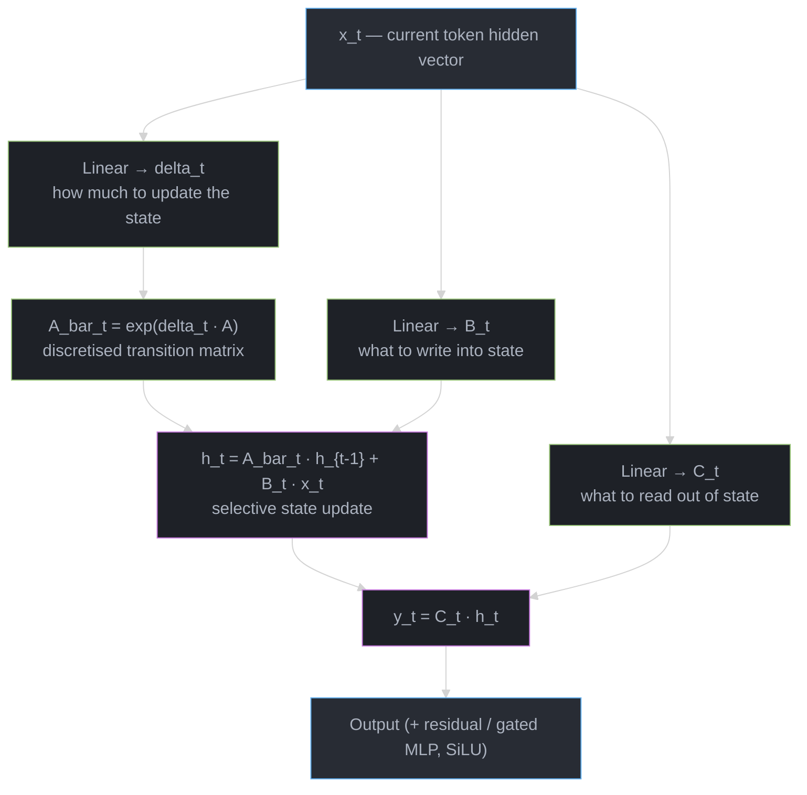
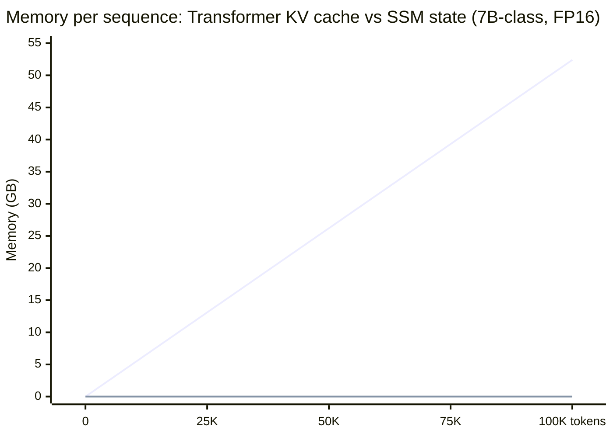

# State-Space Models & Linear Attention: Mamba, RWKV, RetNet, and the Sub-Quadratic Alternatives to Self-Attention

> Deepens the "Alternative Architectures (Beyond Transformers)" table in
> [Foundations & Architecture](README.md) §6 (Mamba/SSMs, Jamba, RWKV) and the long-context
> comparisons in [Context Windows & Long Context](../context_windows_and_long_context/README.md).
> For the quadratic self-attention internals these architectures replace or hybridize with, see
> [Attention Mechanisms](attention_mechanisms.md).

---

## 1. Concept Overview

State-space models (SSMs) and linear-attention variants are **sub-quadratic alternatives to
self-attention**: instead of computing an O(N^2) attention matrix and growing a KV cache linearly
with sequence length, they maintain a **fixed-size hidden state** that is updated one token at a
time via a linear recurrence, giving **O(N) time and O(1) memory per generated token** regardless
of how long the sequence gets.

The lineage runs from **S4** (2021, Structured State Space Sequence model — the first SSM to
become competitive on long-range benchmarks via HiPPO initialization) through **Mamba** (2023,
which made the recurrence *input-dependent* — "selective" — and introduced a hardware-aware
parallel scan, closing much of the quality gap with Transformers at 1.4B-2.8B scale) to
**Mamba-2/SSD** (2024, which reformulated the selective recurrence as a structured form of linear
attention, enabling matmul-heavy training kernels 2-8x faster than Mamba-1). In parallel, the
**linear-attention/RNN family** — **RWKV** (v4 through v7), **RetNet**, **GLA** (Gated Linear
Attention), and **Lightning Attention** (MiniMax) — arrived at structurally similar recurrences
from the attention side: drop softmax's nonlinearity, and `(QK^T)V` becomes associative, letting
you maintain a running `sum(k_t v_t^T)` state instead of an ever-growing KV cache. Production
systems increasingly use **hybrids** (Jamba, Zamba) that interleave a minority of full-attention
layers with a majority of SSM/linear-attention layers, trading a small amount of the memory
savings for recall quality that pure recurrent architectures still lack.

---

## 2. Intuition

> **One-line analogy**: A Transformer answers your next question by re-reading the entire
> conversation transcript from the start; an SSM keeps a running summary notebook of fixed size
> and only updates a few lines of it per turn.

**Mental model**: the SSM's hidden state `h_t` is a compressed, fixed-dimensional summary of
everything seen so far — shape `(d_model, d_state)` per layer, e.g. `(2560, 16)` for a
Mamba-2.8B-class model. At every step, the model reads the current token, decides (via the
**selection mechanism**, §3.3) how much of that token's information to *write into* the summary
and how much old information to *decay out of* it, then reads an output from the updated summary.
Crucially, **the summary's size never changes** — whether the sequence is 100 tokens or 1,000,000
tokens, `h_t` is still `(2560, 16)`.

**Why it matters — concrete numbers**: for a 7B-parameter dense Transformer (32 layers, 32 KV
heads, head_dim 128, FP16) at a 100K-token context, the KV cache alone is
`2 x 32 x 100,000 x 32 x 128 x 2 bytes ≈ 52.4 GB` — larger than the model weights themselves, and
it *keeps growing* with every generated token. A comparably-sized Mamba model's recurrent state
is `2,560 x 16 x 2 bytes ≈ 81.9 KB` per layer; across 64 layers, **≈ 5.2 MB total, independent of
sequence length**. That seven-order-of-magnitude difference is the entire economic argument for
this module — it is why Cartesia chose an SSM for streaming TTS (§7) and why hybrid models like
Jamba can offer 256K context on a single 80GB GPU.

**Key insight**: a fixed-size state is only useful if the model can be *selective* about what goes
into it. S4's state-transition matrices were fixed (input-independent), so the state compressed
the sequence the same way regardless of content — adequate for some long-range benchmarks but not
for language. Mamba's contribution was making the transition **input-dependent**: the model learns,
per token, "is this important enough to overwrite part of my summary?" That single change is what
took SSMs from "interesting but uncompetitive" to "matches Transformer perplexity at billions of
parameters."

---

## 3. Core Principles

### 3.1 The State-Space Formulation

A continuous-time linear SSM is defined by `dh/dt = A h(t) + B x(t)`, `y(t) = C h(t)`. To run on
discrete tokens, it's **discretized** with a timestep `delta` (zero-order hold):
`h_t = A_bar h_{t-1} + B_bar x_t`, `y_t = C h_t (+ D x_t)`, where
`A_bar = exp(delta * A)` and `B_bar ≈ delta * B` (first-order approximation). `A`, `B`, `C`, and
`delta` are the learned (or, in Mamba, input-dependent) parameters that define the recurrence.

**What this actually says.** "Pick a timestep `delta`, run the continuous system forward by exactly
that much, and whatever the state decays to over that interval becomes your per-token multiplier
`A_bar`."

`delta` is not a numerical-methods footnote — it is the model's clock speed. Because
`A_bar = exp(delta * A)` with `A < 0`, `A_bar` always lands in `(0, 1)`, and its distance from `1`
is exactly how fast the state forgets. Mamba making `delta` input-dependent (§3.3) is therefore the
model choosing, per token, how long a memory to keep.

| Symbol | What it is |
|--------|------------|
| `A` | Continuous-time decay rate, forced negative via `A = -exp(A_log)` so the system is stable |
| `delta` | Timestep / clock speed. Forced positive via `softplus`. Large = big jump forward in time |
| `A_bar = exp(delta * A)` | Per-token retention factor in `(0, 1)`. `0.99` = remember; `0.05` = wipe the state |
| `B_bar ~= delta * B` | How much of the current token gets written in. Scales with the same `delta` |
| `C` | The read-out projection: what part of the state becomes this token's output |
| `D x_t` | Optional skip term — the token's own value routed around the state entirely |

**Walk one example.** Hold `A = -0.5` fixed and vary only `delta`, then watch the memory horizon
move. "Half-life" is how many tokens until a stored value has decayed to half its size:

```
   delta    A_bar = exp(delta * A)   half-life (tokens)   retained after 10 tokens
   0.02            0.99005                 69.3                  0.90484
   0.20            0.90484                  6.9                  0.36788
   2.00            0.36788                  0.7                  0.00005

   half_life = ln(0.5) / ln(A_bar)
```

A 100x swing in `delta` moves the memory horizon by 100x — from "still 90% intact ten tokens later"
to "essentially erased in a single step." This is the whole selection mechanism in one number, and
it is also Pitfall 10.4 in numeric form: let `delta` drift large and `A_bar` collapses toward `0`,
so the state forgets everything each step and the model has no memory left to train.

### 3.2 Two (or Three) Equivalent Computational Views

The *same* linear recurrence can be computed three ways:
- **Recurrent (RNN) view**: sequential, `h_t` depends on `h_{t-1}` — O(1) memory per step, used at
  **inference**.
- **Convolutional view** (S4): because `A`,`B`,`C` are *time-invariant* in S4, the output sequence
  equals the input convolved with a kernel derived from `(A,B,C)` — this convolution can be
  computed in parallel via FFT, used at **training**.
- **Matmul / attention-like view** (Mamba-2's SSD): the recurrence can be rewritten as a
  structured (block-diagonal, semiseparable) matrix multiplication against the input sequence —
  used for **fast training on tensor cores** (§3.5).

Mamba-1 breaks the convolutional view (because its `A,B,C` are input-dependent, i.e.
time-*varying*) and instead relies on a **parallel scan** (§3.4) to get training-time parallelism
back.

### 3.3 The Selective Mechanism (Mamba)

Mamba makes `delta`, `B`, and `C` **functions of the input token** `x_t` (via small learned linear
projections), rather than fixed parameters shared across all positions. Intuitively: `delta_t`
controls *how much* the state updates at step `t` (a large `delta` means "this token matters a
lot, overwrite aggressively"; a small `delta` means "skip — barely touch the state"), while
input-dependent `B_t`/`C_t` control *what* gets written and *what* gets read out. This is the
mechanism that lets the model implement content-aware behaviors like "ignore filler words but
remember named entities" within a fixed-size state.

### 3.4 The Parallel (Associative) Scan

Because Mamba's `A_t, B_t` vary per step, the recurrence `h_t = A_t h_{t-1} + B_t x_t` can't use
S4's FFT trick — but it *can* be computed via a **parallel scan**, because the operation is
**associative**: representing each step as a pair `(A_t, B_t x_t)`, two consecutive steps combine
as `(A2, b2) o (A1, b1) = (A2*A1, A2*b1 + b2)`. A tree-structured reduction over these pairs
computes all `h_t` in **O(log N) sequential depth** (vs. O(N) for the naive loop), with O(N) total
work spread across GPU threads — this is Mamba's "hardware-aware" parallel scan, implemented as a
fused CUDA kernel (`mamba-ssm`'s `selective_scan_fn`) that never materializes the full state
sequence in slow HBM.

**The idea behind it.** "Two consecutive recurrence steps can be squashed into one equivalent step,
so instead of walking the sequence you can fold it in half, then in half again, until nothing is
left."

The recurrence *looks* strictly sequential — `h_t` needs `h_{t-1}`. Associativity is the escape
hatch: it says the order in which you group the folds does not change the answer, only the order in
which you *do* them. That is what converts an O(N)-deep dependency chain into an O(log N)-deep tree.

| Symbol | What it is |
|--------|------------|
| `(A_t, b_t)` | One step packaged as a pair, where `b_t = B_t x_t`. An affine map `h -> A_t h + b_t` |
| `o` | Compose two steps into the single step that does both, in order |
| `(A2, b2) o (A1, b1)` | `= (A2*A1, A2*b1 + b2)` — apply step 1, then step 2, in one shot |
| sequential depth | How many operations must happen one after another. This is the latency |
| total work | How many operations happen in all. This is the energy/FLOP bill |

**Walk one example.** Count the two costs at real sequence lengths:

```
      N        sequential steps      parallel-scan depth      depth reduction
              (naive loop, O(N))     (ceil(log2 N))
    2,048            2,048                   11                   186x
    8,192            8,192                   13                   630x
   32,768           32,768                   15                 2,184x
  131,072          131,072                   17                 7,710x

  Quadrupling the sequence adds exactly 2 to the depth -- log2(4) = 2.
```

Note what did *not* improve: total work stays O(N) either way. The scan does not do less
arithmetic — it does the *same* arithmetic in 17 dependent stages instead of 131,072, so a GPU with
thousands of idle threads can actually be fed. That is why §10.1's Python loop is 10-100x slower
despite computing the identical result: 131,072 tiny kernel launches versus one fused kernel.

### 3.5 The Linear-Attention <-> SSM Duality (Mamba-2 / SSD)

Standard attention computes `softmax(QK^T / sqrt(d)) V`. **Drop the softmax**: `(QK^T)V` is now
just matrix multiplication, which is **associative** — by `(QK^T)V = Q(K^T V)`, you can maintain a
running state `S_t = S_{t-1} + k_t v_t^T` (an outer-product accumulation) and read out
`y_t = q_t^T S_t`. This is *exactly* the SSM recurrence `h_t = A h_{t-1} + B x_t` with `A = I`
(identity — nothing decays) and `B x_t = k_t v_t^T`. Mamba-2's **Structured State Space Duality
(SSD)** formalizes this: the selective SSM recurrence is mathematically a **structured
(semiseparable / low-displacement-rank) form of masked linear attention**, which means it can be
computed using the *same* matmul-heavy kernels GPUs are optimized for — this is the source of
Mamba-2's 2-8x training speedup over Mamba-1's scan-based kernel. (Caveat: this duality is with
*linear* attention, not full softmax attention — see Pitfall 10.5.)

**In plain terms.** The reorder `(QK^T)V -> Q(K^T V)` says: "stop comparing every query against
every key and then weighting values — instead summarize all the keys and values into one small
matrix first, and let each query read that summary."

Softmax is what blocks this. `softmax(QK^T)V` normalizes across the `N` keys *before* multiplying
by `V`, so the `N x N` matrix must exist before `V` is ever touched. Delete the softmax and the
product is plain matrix multiplication, which is associative — you may bracket it either way.

| Symbol | What it is |
|--------|------------|
| `Q, K, V` | Query / key / value matrices, each `N x d_head` for one head |
| `QK^T` | The `N x N` score matrix. The quadratic term — one entry per token *pair* |
| `K^T V` | A `d_head x d_head` summary of the whole sequence. Size independent of `N` |
| `phi(.)` | The feature map replacing softmax (`elu(x)+1`, identity, or a random projection) |
| `S_t = S_{t-1} + k_t v_t^T` | The same `K^T V` built incrementally — the causal, streaming form |

**Walk one example.** One head, `d_head = 128`, at a 131,072-token context. The two bracketings
compute the same product but build very different intermediates:

```
                       intermediate built       entries          grows with
  (QK^T) V             N x N score matrix       17,179,869,184   N squared
  Q (K^T V)            d x d summary matrix             16,384   nothing -- fixed

  ratio = 17,179,869,184 / 16,384 = 1.049e+06 -- about a million-fold smaller
```

What you give up is exactness, and it is worth naming precisely. Softmax is a *sharp, normalized*
weighting: it can put 0.99 of the mass on one token 100,000 positions back and retrieve it
verbatim. `phi(Q)(phi(K)^T V)` compresses every key-value pair into one fixed `128 x 128` state, so
two different past tokens can — and at long context do — collide in that state and become
unrecoverable. The lost capability is precisely *exact retrieval of an arbitrary far-back token*,
which is the same structural gap §8.1 measures on needle-in-haystack and §10.3 warns against trying
to train away. It is also why hybrids (§5.4) keep a minority of real softmax layers.

### 3.6 Gating / Forget Mechanisms

RWKV and GLA add a **data-dependent decay gate** `g_t in [0,1]` applied to the running state before
accumulation: `S_t = g_t * S_{t-1} + k_t v_t^T` (the SSM analogue: `g_t` plays the role of `A_t`).
This solves the **"what to forget" problem**: unlike attention, where every past token remains
exactly retrievable forever (at the cost of a growing cache), a fixed-size state *must* actively
decide what to discard to make room for new information. RWKV v6/v7 made this gate increasingly
expressive — per-channel, per-head, and (in v7) state-dependent — closing more of the gap to
attention on recall-heavy tasks.

---

## 4. Types / Architectures / Strategies

| Architecture | Year / Org | Mechanism | Notes |
|---|---|---|---|
| **S4** | 2021, Stanford | Structured SSM, HiPPO initialization, linear time-invariant (`A,B,C` fixed) | First SSM competitive on long-range benchmarks (Long Range Arena); trained via FFT convolution |
| **S5** | 2022 | Simplified MIMO SSM (one multi-input-multi-output SSM per layer, not per-channel) + parallel scan | Cleaner formulation, easier to implement than S4 |
| **Mamba** | 2023, CMU/Princeton (Gu & Dao) | **Selective** SSM — input-dependent `delta, B, C` + hardware-aware parallel scan (§3.3, §3.4) | First SSM to match Transformer perplexity at 1.4B-2.8B; ~5x higher inference throughput at long sequences |
| **Mamba-2 (SSD)** | 2024, same authors | Structured State Space Duality — selective SSM reformulated as masked linear attention (§3.5) | 2-8x faster *training* via matmul kernels; supports larger state dimensions |
| **RWKV (v4-v7)** | 2023-2025, community (BlinkDL) | RNN-style linear attention with time-decay ("W") + receptance gating ("R") — the "WKV" recurrence | Trainable in parallel like a Transformer via custom kernels, runs as a pure RNN at inference (O(1) state); v6/v7 add per-channel dynamic decay |
| **RetNet** | 2023, Microsoft | "Retention": linear attention with a *fixed* exponential decay matrix | Three mathematically equivalent forms — parallel (training), recurrent (inference), chunkwise (long sequences, §6.3) |
| **Jamba** | 2024, AI21 | **Hybrid**: interleaved Transformer-attention + Mamba layers + MoE FFNs | 52B total / 12B active params; 256K context fits on a single 80GB GPU with int8 KV cache |
| **Zamba / Zamba2** | 2024, Zyphra | **Hybrid**: Mamba backbone + a single shared attention block reused across layers | 7B-class, parameter-efficient hybrid via attention-block sharing |
| **Hyena** | 2023 | Implicit long convolutions (filters parameterized by a small FFN) evaluated via FFT | Sub-quadratic but **not** a recurrence — a distinct family from SSM/linear-attention |
| **GLA (Gated Linear Attention)** | 2023, Yang et al. | Linear attention + data-dependent, per-head/per-channel gating (§3.6) | Closes much of the recall gap to softmax attention versus ungated linear attention |
| **Lightning Attention** | 2024, MiniMax | Linear attention with **intra-block** (quadratic, small blocks) + **inter-block** (linear, running KV state) tiling | Powers MiniMax-01 (456B total / 45.9B active MoE), claims up to 4M-token context |

### 4.1 Four Families, One Underlying Idea

- **SSM family** (S4, S5, Mamba, Mamba-2) — derived from continuous-time control theory.
- **Linear-attention/RNN family** (RWKV, RetNet, GLA, Lightning Attention) — derived from removing
  softmax from attention.
- **Implicit-convolution family** (Hyena) — sub-quadratic via FFT convolution, but has **no
  running state at all** — a genuinely different mechanism from the other three families.
- **Hybrid family** (Jamba, Zamba) — accept that pure recurrent architectures still lag on
  recall/retrieval (§8.1) and deliberately keep a *minority* of full-attention layers to recover
  it, while getting most of the memory savings from the majority SSM/linear-attention layers.

Mamba-2's SSD result (§3.5) shows the first two families are **mathematically closer than their
names suggest** — both reduce to a running-state recurrence over `(A_t, B_t x_t)`-style pairs; they
differ mainly in how `A_t` (decay) is parameterized and how the recurrence is scheduled on
hardware.

---

## 5. Architecture Diagrams

### 5.1 Recurrent vs. Convolutional Dual View (S4)

```
RECURRENT VIEW (inference, O(1) memory/step):

  x_1 -> [h_1 = A h_0 + B x_1] -> y_1 = C h_1
  x_2 -> [h_2 = A h_1 + B x_2] -> y_2 = C h_2
  x_3 -> [h_3 = A h_2 + B x_3] -> y_3 = C h_3
   ...      (sequential, h carried forward)

CONVOLUTIONAL VIEW (training, parallel via FFT) -- ONLY valid if A,B,C
are time-invariant (S4; NOT Mamba-1, whose A,B,C vary per step):

  kernel K = [C B, C A B, C A^2 B, C A^3 B, ...]   (precomputed once)

  y = x  conv  K     <-- single FFT-based convolution over the WHOLE
                          sequence, all y_t computed in parallel
```

### 5.2 Selective SSM Block (Mamba)



All three projections (delta\_t, B\_t, C\_t) are input-dependent — this is the "selection mechanism" that lets Mamba selectively remember or forget, unlike fixed-A classic SSMs.

### 5.3 Parallel (Associative) Scan

```
Sequential (O(N) depth):           Parallel scan (O(log N) depth):

 h1   h2   h3   h4                  Step 1: combine adjacent pairs
  |    |    |    |                    (A1,B1)o(A2,B2) (A3,B3)o(A4,B4)
  v    v    v    v                          |               |
 step step step step                        v               v
  (one at a time)                        (A12,B12)      (A34,B34)

                                    Step 2: combine the pair-results
                                          (A12,B12)o(A34,B34)
                                                |
                                                v
                                          (A1234,B1234)

4 sequential steps  ------->        2 sequential steps (log2(4))
                                     -- the basis of mamba-ssm's
                                        selective_scan_fn CUDA kernel
```

### 5.4 Hybrid Architecture Layer Interleaving (Jamba-style)

```
Layer 1:  [ Mamba block ]
Layer 2:  [ Mamba block ]
Layer 3:  [ Mamba block ]
Layer 4:  [ Mamba block ]
Layer 5:  [ Mamba block ]
Layer 6:  [ Mamba block ]
Layer 7:  [ Mamba block ]
Layer 8:  [ Attention block ] + [ MoE FFN ]   <- 1 in 8 layers is full
Layer 9:  [ Mamba block ]                         attention (Jamba's
   ...        ...                                 actual ratio); recovers
Layer N:  [ Attention block ] + [ MoE FFN ]       precise long-range recall
                                                   (§8.1) the Mamba layers
                                                   lack, at ~12.5% of the
                                                   KV-cache cost of an
                                                   all-attention model
```

### 5.5 Memory Growth: KV Cache (Transformer) vs. Constant State (SSM)



The rising line is the 7B Transformer's KV cache (no GQA) — linear in sequence length,
reaching ~52.4 GB at 100K tokens and still growing with every generated token. The
line hugging the x-axis is the 64-layer Mamba model's entire recurrent state: a
constant ~5.2 MB (0.005 GB) at any sequence length — ~10,000x smaller at 100K tokens,
which is exactly why it is invisible at this scale.

### 5.6 The Duality: Linear Attention and the SSM Recurrence Are the Same Update

```
   LINEAR ATTENTION  (drop the softmax)        SELECTIVE SSM  (Mamba)
   ====================================        ======================
   state:  S_t = S_{t-1} + k_t * v_t^T   <-->  h_t = A * h_{t-1} + B_t * x_t
                  \__ rank-1 outer __/                with  A = I  (no decay),
                      product into S                       B_t * x_t = k_t * v_t^T
   read:   y_t = q_t^T * S_t             <-->  y_t = C_t * h_t   (C_t plays q_t^T)

   Both keep ONE running state, update it with a rank-1 term, and read it out
   with a left-multiply -- the SAME computation. Mamba-2's SSD just lets A be a
   structured (semiseparable) matrix instead of I; that turns the recurrence
   into "masked linear attention", runnable on the matmul kernels GPUs are
   built for (the source of Mamba-2's 2-8x training speedup over Mamba-1).
```

The two columns are not an analogy — they are algebraically identical (§3.5). Reading
the recurrence as an outer-product state accumulation is exactly why a "sequence model"
can be expressed as, and accelerated like, a matrix multiply.

---

## 6. How It Works — Detailed Mechanics

### 6.1 Naive Recurrent SSM (Discretization + Sequential Scan)

```python
import torch
import torch.nn as nn

class NaiveSSMLayer(nn.Module):
    """A non-selective (S4-style) discretized SSM, computed via the
    SEQUENTIAL recurrent view (§3.2). Correct but O(N) sequential
    steps -- fine for inference, far too slow for training on long
    sequences (Pitfall 10.1).
    """
    def __init__(self, d_model: int, d_state: int = 16):
        super().__init__()
        self.d_model, self.d_state = d_model, d_state
        # Per-channel A (diagonal, for simplicity), B, C, and log-step size.
        self.A_log = nn.Parameter(torch.randn(d_model, d_state))
        self.B = nn.Parameter(torch.randn(d_model, d_state))
        self.C = nn.Parameter(torch.randn(d_model, d_state))
        self.log_delta = nn.Parameter(torch.zeros(d_model))

    def discretize(self) -> tuple[torch.Tensor, torch.Tensor]:
        delta = torch.exp(self.log_delta)              # (d_model,) > 0
        A = -torch.exp(self.A_log)                      # (d_model, d_state), stable (A<0)
        A_bar = torch.exp(A * delta.unsqueeze(-1))      # zero-order hold, §3.1
        B_bar = delta.unsqueeze(-1) * self.B            # first-order approx of B_bar
        return A_bar, B_bar

    def forward(self, x: torch.Tensor) -> torch.Tensor:
        """x: (batch, seq_len, d_model) -> (batch, seq_len, d_model)"""
        A_bar, B_bar = self.discretize()
        b, l, d = x.shape
        h = torch.zeros(b, d, self.d_state, device=x.device)   # FIXED SIZE state
        outputs = []
        for t in range(l):                     # <-- O(N) SEQUENTIAL loop
            h = A_bar.unsqueeze(0) * h + B_bar.unsqueeze(0) * x[:, t].unsqueeze(-1)
            y_t = (h * self.C.unsqueeze(0)).sum(dim=-1)        # (batch, d_model)
            outputs.append(y_t)
        return torch.stack(outputs, dim=1)
```

**Stated plainly.** The two lines inside that loop — `h = A_bar * h + B_bar * x_t` and
`y_t = C * h` — are the entire model: "shrink what you already remember, add a scaled version of
what you just read, then project the result out as this token's answer."

Everything else in the SSM literature is a variation on *how those three coefficients are produced*
and *in what order the loop is scheduled*. The update itself never changes.

| Symbol | What it is |
|--------|------------|
| `h_{t-1}` | Everything the model remembers going into step `t`, in a fixed-size buffer |
| `A_bar * h_{t-1}` | The forget half. Multiplying by a number in `(0,1)` shrinks all old content |
| `B_bar * x_t` | The write half. How much of the current token gets deposited into the state |
| `h_t` | The updated summary. Same shape as `h_{t-1}` no matter how long the sequence is |
| `y_t = C * h_t` | The read. Note it reads the state, never the raw history — there is no history |

**Walk one example.** Scalar case, using the discretization from §3.1: `A = -0.5`, `delta = 0.2` so
`A_bar = exp(-0.1) = 0.9048`, and `B = 2.5` so `B_bar = delta * B = 0.5`. Take `C = 1.0` and feed
one informative token, two empty ones, then a second informative token:

```
   t    x_t     A_bar * h_{t-1}          + B_bar * x_t     =  h_t        y_t
   1    1.0     0.9048 x 0.0000 = 0.0000   + 0.5 x 1.0 = 0.5000   0.5000   0.5000
   2    0.0     0.9048 x 0.5000 = 0.4524   + 0.5 x 0.0 = 0.0000   0.4524   0.4524
   3    0.0     0.9048 x 0.4524 = 0.4094   + 0.5 x 0.0 = 0.0000   0.4094   0.4094
   4    2.0     0.9048 x 0.4094 = 0.3704   + 0.5 x 2.0 = 1.0000   1.3704   1.3704

   How much of token 1 survives to step 4:  0.5 x 0.9048^3 = 0.3704  (74% of it)
```

Read the two mechanisms off the columns. Steps 2 and 3 receive no input at all, yet `y_t` is
non-zero — the state is *carrying token 1 forward*, which is memory. And it shrinks each step
(`0.5000 -> 0.4524 -> 0.4094`), which is decay: at `A_bar = 0.9048` a value halves every 6.9 tokens
(§3.1), so token 1 contributes `0.3704` to step 4 while token 4 itself contributes `1.0000`. Recent
tokens dominate, old ones fade — automatic, and the price of a fixed-size buffer.

### 6.2 Selective SSM (Mamba-style)

```python
class SelectiveSSMLayer(nn.Module):
    """Mamba's selective SSM (§3.3): delta, B, C are FUNCTIONS OF THE
    INPUT, not fixed parameters. This is the single change that lets
    a fixed-size state implement content-aware compression.
    """
    def __init__(self, d_model: int, d_state: int = 16):
        super().__init__()
        self.d_model, self.d_state = d_model, d_state
        self.A_log = nn.Parameter(torch.randn(d_model, d_state))   # still fixed
        # B, C, delta are now PROJECTIONS of x_t:
        self.x_proj = nn.Linear(d_model, 2 * d_state + d_model)    # -> (delta, B, C)

    def forward(self, x: torch.Tensor) -> torch.Tensor:
        """x: (batch, seq_len, d_model). Sequential reference impl --
        production code uses the fused parallel-scan kernel (§3.4,
        mamba-ssm's selective_scan_fn) instead of this Python loop."""
        b, l, d = x.shape
        A = -torch.exp(self.A_log)                                  # (d_model, d_state)
        proj = self.x_proj(x)                                       # (b, l, 2*d_state + d)
        delta_raw, B, C = proj.split([self.d_model, self.d_state, self.d_state], dim=-1)
        delta = torch.nn.functional.softplus(delta_raw)             # (b, l, d_model) > 0

        h = torch.zeros(b, d, self.d_state, device=x.device)
        outputs = []
        for t in range(l):
            A_bar_t = torch.exp(A.unsqueeze(0) * delta[:, t].unsqueeze(-1))  # input-dependent!
            B_t, C_t = B[:, t], C[:, t]                                       # (b, d_state)
            h = A_bar_t * h + (delta[:, t].unsqueeze(-1) * B_t.unsqueeze(1)) * x[:, t].unsqueeze(-1)
            y_t = (h * C_t.unsqueeze(1)).sum(dim=-1)                          # (b, d_model)
            outputs.append(y_t)
        return torch.stack(outputs, dim=1)
```

**Concrete numbers**: for `d_model=2560, d_state=16` (Mamba-2.8B's first-layer dimensions), the
state `h` is `(batch, 2560, 16)` — `40,960` floats per batch element, `81.9 KB` in FP16 — fixed for
any sequence length, matching §2's headline comparison.

### 6.3 Linear Attention as a Running KV State (Chunkwise, RetNet-style)

```python
class ChunkwiseLinearAttention(nn.Module):
    """Demonstrates the linear-attention <-> SSM duality (§3.5):
    softmax-free attention y_t = q_t^T S_t where S_t = sum_{i<=t} k_i v_i^T
    is maintained as a running state, exactly like an SSM recurrence
    with A=I. Processes the sequence in CHUNKS: within a chunk, use the
    parallel (quadratic-but-small) form; across chunks, carry forward
    only the running state -- RetNet's "chunkwise" form, also the basis
    of Lightning Attention's intra/inter-block tiling (§4, Lightning Attention row).
    """
    def __init__(self, d_model: int, n_heads: int, chunk_size: int = 256):
        super().__init__()
        self.n_heads, self.head_dim = n_heads, d_model // n_heads
        self.chunk_size = chunk_size
        self.qkv = nn.Linear(d_model, 3 * d_model)

    def forward(self, x: torch.Tensor) -> torch.Tensor:
        b, l, d = x.shape
        q, k, v = self.qkv(x).chunk(3, dim=-1)               # each (b, l, d)
        q, k, v = (t.view(b, l, self.n_heads, self.head_dim) for t in (q, k, v))

        state = torch.zeros(b, self.n_heads, self.head_dim, self.head_dim, device=x.device)
        outputs = []
        for start in range(0, l, self.chunk_size):
            end = min(start + self.chunk_size, l)
            qc, kc, vc = q[:, start:end], k[:, start:end], v[:, start:end]

            # Intra-chunk: small quadratic attention (no softmax -- linear)
            intra = torch.einsum("bthd,bshd->bths", qc, kc).tril()  # causal within chunk
            intra_out = torch.einsum("bths,bshd->bthd", intra, vc)

            # Cross-chunk: read the carried-forward STATE (this is the SSM-like part)
            cross_out = torch.einsum("bthd,bhde->bthe", qc, state)

            outputs.append(intra_out + cross_out)
            # Update running state for the NEXT chunk: S += sum(k_i v_i^T)
            state = state + torch.einsum("bshd,bshe->bhde", kc, vc)

        return torch.cat(outputs, dim=1).reshape(b, l, d)
```

### 6.4 Parallel Scan (Associative Combine, Log-Depth)

```python
def associative_combine(
    left: tuple[torch.Tensor, torch.Tensor],
    right: tuple[torch.Tensor, torch.Tensor],
) -> tuple[torch.Tensor, torch.Tensor]:
    """The associative operator from §3.4: (A2,B2) o (A1,B1) = (A2*A1, A2*B1 + B2).
    Applying this in a tree (log2(N) levels) recovers all intermediate
    states h_t in O(log N) sequential depth -- the basis of Mamba's
    hardware-aware parallel scan kernel."""
    A1, b1 = left
    A2, b2 = right
    return A2 * A1, A2 * b1 + b2


def parallel_scan(A_seq: torch.Tensor, b_seq: torch.Tensor) -> torch.Tensor:
    """A_seq, b_seq: (seq_len, ...) -- per-step (A_t, B_t*x_t) pairs.
    Returns h_seq: (seq_len, ...) the cumulative recurrence h_t = A_t h_{t-1} + b_t.
    Reference (Blelloch-style) tree scan; production kernels fuse this
    with the discretization (§6.2) and never materialize A_seq/b_seq in HBM."""
    n = A_seq.shape[0]
    if n == 1:
        return b_seq
    A_pairs, b_pairs = associative_combine(
        (A_seq[0::2], b_seq[0::2]), (A_seq[1::2], b_seq[1::2])
    )
    h_reduced = parallel_scan(A_pairs, b_pairs)   # log2(n) levels of recursion
    # ... (expand h_reduced back to full resolution -- omitted for brevity)
    return h_reduced
```

---

## 7. Real-World Examples

- **Mamba / Mamba-2 (CMU, Princeton)** — the reference research line; Mamba-2.8B matches
  Pythia-2.8B perplexity while achieving **~5x higher inference throughput** at long sequence
  lengths (no KV cache to read/write).
- **Jamba 1.5 (AI21, 2024)** — production hybrid model, **52B total / 12B active** parameters
  (MoE), **256K-token context window** that fits on a single 80GB GPU with int8 KV cache — a
  context length that would be impractical for a same-size pure-attention model.
- **RWKV (community, BlinkDL)** — actively used for **edge/CPU deployment** via `rwkv.cpp`, since
  its O(1) recurrent inference state needs no GPU-resident KV cache.
- **MiniMax-01 (2025)** — **456B total / 45.9B active** MoE using **Lightning Attention**, with
  claimed support for **up to 4M-token context** — among the longest context windows publicly
  claimed as of 2026, enabled directly by the linear (not quadratic) attention cost.
- **Cartesia (Sonic)** — a commercial TTS engine (see
  [Voice Cloning / TTS Platform case study §6](../case_studies/design_voice_cloning_tts_platform.md))
  built on a **Mamba-based architecture specifically because of §2's memory argument**: TTS is a
  long, continuous streaming-generation task, and Mamba's O(1) per-step state gives **fixed,
  predictable per-token latency at any output length** (claimed <50ms TTFB), vs. a Transformer's
  KV cache making each subsequent token marginally more expensive.
- **Zamba2 (Zyphra)** — a 7B-class hybrid that shares a *single* attention block across multiple
  layers, demonstrating that hybrid designs can be parameter-efficient, not just
  memory-efficient.

---

## 8. Tradeoffs

### 8.1 SSM / Linear Attention vs. Standard (Softmax) Attention

| Dimension | SSM / Linear Attention | Standard Self-Attention |
|---|---|---|
| Inference memory per step | O(1) — fixed-size state (§2) | O(N) — KV cache grows with sequence length |
| Inference time per step | O(1) | O(N) (attend over full KV cache) — or O(window) with sliding window |
| Training parallelism | Requires parallel scan (Mamba) or chunkwise/matmul reformulation (Mamba-2, RetNet) | Naturally parallel (all positions at once) |
| Recall / in-context retrieval (e.g., needle-in-haystack) | Weaker — fixed state can't losslessly retain arbitrary far-back tokens | Strong — any past token is exactly retrievable via its KV entry |
| Long-context throughput | Much higher (no growing cache to read) | Degrades as context grows (cache bandwidth-bound) |
| Ecosystem / tooling maturity (quantization, serving engines) | Newer, partial support (Pitfall 10.6) | Mature — every major serving engine optimized for it |

**What it means.** The `O(N^2)` vs `O(N)` labels in the first two rows are cost formulas, and they
only become an argument once you substitute real dimensions:

```
softmax attention   ops ~ 2 * N^2 * d_model          memory ~ N^2 scores per head
linear attn / SSM   ops ~ 2 * N * d_model * d_state  memory ~ d_state^2 per head, fixed
```

| Symbol | What it is |
|--------|------------|
| `N` | Sequence length. The only term that differs between the two — squared vs linear |
| `d_model` | Model width, `4096` for a 7B-class model. Appears identically on both sides |
| `d_state` | Size of the fixed summary: `head_dim = 128` for linear attention, `16` for Mamba |
| the leading `2` | Two passes over the data: `QK^T` then `scores @ V`, or write-state then read-state |
| ratio `N / d_state` | Divide the two formulas and everything cancels but this. The entire argument |

**Walk one example.** A 7B-class model, `d_model = 4096`, `d_state = head_dim = 128`, one full
forward pass over the sequence:

```
       N        softmax ops       linear ops      softmax / linear    N^2 scores (FP16, 32 heads)
      128        1.342e+08        1.342e+08             1.0x                    1 MB
    2,048        3.436e+10        2.147e+09            16.0x                 0.25 GB
    8,192        5.498e+11        8.590e+09            64.0x                 4.00 GB
   32,768        8.796e+12        3.436e+10           256.0x                64.00 GB
  131,072        1.407e+14        1.374e+11         1,024.0x             1,024.00 GB

  Crossover: softmax/linear = N / d_state = 1, so the two cost the SAME at N = 128.
```

Three readings. Below `N = 128` softmax attention is *cheaper* — the quadratic term has not caught
up yet, which is why nobody proposes linear attention for short-sequence workloads. The advantage
then grows strictly linearly in `N`: every doubling of context doubles the gap, reaching 1,024x at
131K tokens. And the last column is the harder constraint — the score matrix alone would need
1,024 GB at 131K tokens, which is why FlashAttention tiles it and never materializes it, and why the
SSM's fixed `128 x 128` (or Mamba's `2560 x 16`, §6.2) state is the structural fix rather than a
memory-hierarchy trick.

The same arithmetic with Mamba's own numbers: `d_model = 2560, d_state = 16` gives
`2 * 2560 * 16 = 81,920` ops per token, so a full 131,072-token sequence costs `1.074e+10` ops —
about 13,000x less than softmax attention's `1.407e+14` at that length.

### 8.2 Non-Selective (S4) vs. Selective (Mamba) SSMs

| | S4 (non-selective) | Mamba (selective) |
|---|---|---|
| `A, B, C` | Fixed, time-invariant | Functions of the current input token (§3.3) |
| Training computation | FFT-based convolution (§3.2) | Hardware-aware parallel scan (§3.4) |
| Content-aware behavior | No — same compression regardless of token content | Yes — can selectively retain/discard based on what it's reading |
| Language-modeling quality | Uncompetitive with Transformers at scale | Matches Transformer perplexity at 1.4B-2.8B |

### 8.3 Pure SSM vs. Hybrid vs. Pure Transformer

| | Pure SSM/Linear-Attention | Hybrid (Jamba, Zamba) | Pure Transformer |
|---|---|---|---|
| Long-context memory cost | Lowest (constant) | Low (mostly constant + a few attention layers) | Highest (full KV cache) |
| Recall/retrieval quality | Weakest | Near-Transformer (the few attention layers recover most of it, §5.4) | Strongest |
| Maximum practical context length | Highest (RWKV/MiniMax claim millions of tokens) | High (Jamba: 256K on 1 GPU) | Limited by KV cache memory |
| Maturity for general-purpose LLM deployment | Lowest | Medium and rising | Highest |

### 8.4 Linear-Attention Variant Comparison

| | RetNet | GLA | Lightning Attention | RWKV (v6/v7) |
|---|---|---|---|---|
| Decay/gate | Fixed exponential decay matrix | Data-dependent, per-head/per-channel gate | Intra-block quadratic + inter-block linear (tiling, not gating per se) | Per-channel, increasingly state-dependent (v7) |
| Computational forms | 3 equivalent forms (parallel/recurrent/chunkwise) | Chunkwise (similar to §6.3) | Tiled intra/inter-block (§4) | Recurrent (WKV) + parallelizable training kernel |
| Primary strength | Clean theoretical equivalence across forms | Strong recall recovery vs. ungated linear attention | GPU memory-hierarchy efficiency at extreme context (4M tokens) | Mature open-source ecosystem, CPU/edge inference |

---

## 9. When to Use / When NOT to Use

**Use SSMs / linear attention (pure or hybrid) when:**

- The workload is **long, continuous streaming generation** with a fixed per-step latency
  requirement — TTS, audio, real-time transcription, time-series, genomics (Cartesia's use case,
  §7).
- You need **very long context windows** (hundreds of thousands to millions of tokens) under tight
  memory budgets — a single GPU serving a 256K+ context model (Jamba) or multi-million-token
  context (MiniMax-01).
- You're deploying to **edge/CPU/memory-constrained environments** where a growing KV cache is
  the binding constraint — RWKV via `rwkv.cpp`.
- You want **most of the long-context memory savings while retaining strong recall** — choose a
  **hybrid** (Jamba, Zamba) rather than a pure recurrent architecture.

**Do NOT use pure SSMs / linear attention when:**

- The task is **retrieval-heavy over long contexts** (needle-in-haystack, multi-hop QA over long
  documents, RAG with many retrieved chunks) and you can't afford even a small hybrid — pure
  recurrent architectures' fixed state is a genuine bottleneck here (§8.1).
- **Serving/tooling maturity is a hard requirement** — as of 2026, quantization recipes,
  speculative decoding, and some serving-engine optimizations for Mamba/Jamba-class models lag
  several months to a year behind equivalent Transformer support (Pitfall 10.6); verify your
  target serving stack (vLLM, SGLang, TensorRT-LLM) before committing.
- Your team's training infrastructure can't accommodate **custom kernels** (`mamba-ssm`,
  `flash-linear-attention`) — naive PyTorch implementations of these recurrences are 10-100x
  slower than the fused kernels (Pitfall 10.1), making them impractical at scale without kernel
  support.

---

## 10. Common Pitfalls

**10.1 BROKEN -> FIX: Naive Sequential Training Loop**

```python
# BROKEN: the §6.1/§6.2 reference implementations use a Python `for t in
# range(l)` loop. At seq_len=8192 this is 8192 sequential CUDA kernel
# launches PER LAYER PER FORWARD PASS -- orders of magnitude slower than
# a Transformer's single batched matmul, and the loop's overhead dominates
# actual compute time.
for t in range(seq_len):
    h = A_bar * h + B_bar * x[:, t]   # one tiny kernel launch per t
```

```python
# FIX: use the fused parallel-scan kernel (mamba-ssm's selective_scan_fn,
# or the flash-linear-attention library's chunkwise kernels for RetNet/
# GLA/RWKV-style models). These compute the entire sequence's recurrence
# in a SINGLE kernel launch using the associative-scan / chunkwise
# reformulation (§3.4, §6.3-6.4), achieving near-matmul throughput.
from mamba_ssm.ops.selective_scan_interface import selective_scan_fn
y = selective_scan_fn(x, delta, A, B, C, D)   # one fused kernel call
```

**10.2 "O(1) State" Doesn't Mean "Free"**

The state is constant *with respect to sequence length*, but it still scales with
`d_model x d_state x num_layers`. A wider model or larger `d_state` (Mamba-2 supports larger state
dimensions than Mamba-1) increases the per-token compute and the state's memory footprint — the
claim is "doesn't grow with context length," not "doesn't grow with model size."

**10.3 Expecting Pure SSMs to Win Needle-in-Haystack Without Hybrid Layers**

A pure Mamba/RWKV model evaluated on long-context needle-in-haystack benchmarks typically
underperforms a same-size Transformer, because the fixed state cannot losslessly store every past
token's exact content (§8.1). This is *not* a bug to be "fixed" with more training — it's the
fundamental tradeoff. If retrieval quality at long context matters, budget for a hybrid (§5.4) from
the start rather than discovering the gap during evaluation.

**10.4 Discretization Numerical Instability**

The discretization `A_bar = exp(delta * A)` (§3.1) can become numerically unstable if `delta` is
too large (the exponential overflows toward 0, causing the state to "forget" everything in one
step) or too small (the state barely updates, wasting model capacity). Mamba's
parameterization — `delta = softplus(...)`, `A = -exp(A_log)` (ensuring `A < 0`, so `exp(delta*A)`
is always in `(0,1)`) — exists specifically to keep this product in a numerically stable, bounded
range; reimplementations that drop these constraints commonly diverge during training.

**10.5 Conflating the Mamba-2 "Duality" With Full Softmax-Attention Equivalence**

The SSD duality (§3.5) shows selective SSMs are equivalent to a structured form of **linear
(softmax-free) attention** — it does *not* mean Mamba-2 "is secretly a softmax Transformer." The
softmax nonlinearity is precisely what breaks the associativity the duality relies on; claiming
Mamba-2 = standard attention in an interview is a common but incorrect overstatement.

**10.6 Ecosystem/Serving Gaps**

vLLM, SGLang, and TensorRT-LLM support for Mamba/Jamba/RWKV-class models (custom KV-cache-free
state management, quantization recipes, speculative decoding compatibility) has historically
lagged Transformer support by months. Before committing to one of these architectures for
production serving, verify current support status in your target engine — this is an actively
moving target, not a permanent limitation, but it has been a real deployment blocker.

---

## 11. Technologies & Tools

| Tool / Library | Role |
|---|---|
| **mamba-ssm** (official) | CUDA kernels for the selective parallel scan (`selective_scan_fn`); reference Mamba/Mamba-2 implementations |
| **flash-linear-attention (FLA)** | Triton-based fused kernels for GLA, RetNet, RWKV, Mamba-2, Lightning Attention, and more — the "Flash Attention of linear attention" |
| **HuggingFace transformers** | Integrations for Mamba, Mamba-2, Jamba, RWKV — standard model-loading/fine-tuning interface |
| **rwkv.cpp** | CPU/edge inference for RWKV models, leveraging O(1) recurrent state |
| **vLLM** | Growing support for Mamba/Jamba mixers (`Mamba2Mixer`) in continuous-batching serving (verify current version support per Pitfall 10.6) |

---

## 12. Interview Questions with Answers

**Q1: Why don't SSMs need a KV cache, and what's the concrete memory savings at long context?**
A Transformer's KV cache exists because attention needs to look back at every past token's key and value vectors, so the cache grows linearly with sequence length. An SSM instead compresses everything seen so far into a fixed-size hidden state, updated via a linear recurrence (§3.1) — there's nothing to "cache" because there's no per-token history to retain explicitly. Concretely (§2): a 7B Transformer's KV cache at 100K tokens is ~52.4GB (no GQA), while a comparable Mamba model's entire recurrent state is ~5.2MB, independent of sequence length — roughly a 10,000x difference that only grows as context length increases further.

**Q2: What is the "selection mechanism" in Mamba, and why does it matter compared to S4?**
S4's state-transition parameters (`A, B, C`) are fixed, time-invariant — every token is compressed into the state the same way regardless of its content. Mamba makes `delta, B, C` *functions of the current input token* (§3.3): the model learns, per token, how aggressively to update the state and what to write/read. This is what lets a fixed-size state implement content-aware behavior — e.g., barely updating on filler words but strongly updating on a named entity — and it's the single change that took SSMs from uncompetitive on language modeling to matching Transformer perplexity at 1.4B-2.8B scale.

**Q3: Walk through the recurrent vs. convolutional dual view of an SSM.**
The recurrent view computes `h_t = A_bar h_{t-1} + B_bar x_t` sequentially — O(1) memory per step, used at inference. The convolutional view (§3.2, valid only when `A,B,C` are time-invariant, i.e., S4) observes that the output sequence equals the input convolved with a fixed kernel `[CB, CAB, CA^2B, ...]` derived once from `(A,B,C)` — this convolution can be computed for the entire sequence in parallel via FFT, which is how S4 trains efficiently. Mamba breaks this duality (its `A,B,C` vary per token) and needs a third approach — the parallel scan (§3.4) — to regain training parallelism.

**Q4: Why is naive sequential computation slow to train, and how does the parallel scan fix it?**
A naive `for t in range(seq_len)` loop (§6.1, §10.1) issues one tiny GPU kernel per timestep — at seq_len=8192, that's 8192 sequential kernel launches per layer per forward pass, with launch overhead dominating actual FLOPs, vs. a Transformer's single large batched matmul. The parallel scan exploits that the recurrence's update is an *associative* operation (§3.4): representing each step as `(A_t, B_t x_t)`, adjacent pairs combine via `(A2,b2) o (A1,b1) = (A2*A1, A2*b1+b2)`, so a tree reduction computes all states in O(log N) sequential depth. Mamba's `selective_scan_fn` implements this as a single fused CUDA kernel.

**Q5: What is the recall / in-context-learning gap for SSMs, and why does it exist?**
Pure SSMs and linear-attention models tend to underperform same-size Transformers on tasks requiring exact retrieval of specific far-back tokens (needle-in-haystack, copying, certain associative-recall benchmarks) — even though their *perplexity* can match. The reason is structural: attention's KV cache makes every past token exactly retrievable; an SSM's fixed-size state must lossily compress the entire history, and content that gets "overwritten" by the selection/gating mechanism (§3.3, §3.6) is genuinely gone. This isn't fixed by more training — it's why hybrid architectures (§8.3) exist.

**Q6: Why do hybrid architectures like Jamba interleave attention and SSM layers, and in what ratio?**
The motivation is directly Q5: a small number of full-attention layers can recover most of the recall quality that pure SSM layers lack, while the majority-SSM layers provide most of the memory/throughput savings. Jamba uses roughly 1-in-8 layers as full attention (the rest Mamba + MoE FFN, §5.4) — empirically, this ratio recovers near-Transformer recall while keeping the KV cache at roughly 1/8th the size (and thus 1/8th the memory cost) of an all-attention model at the same context length, enabling Jamba's 256K context on a single 80GB GPU.

**Q7: Explain the Mamba-2 "SSD" duality between linear attention and SSMs.**
Standard attention is `softmax(QK^T)V`; removing softmax makes the computation associative, so `(QK^T)V = Q(K^T V)` — you can maintain a running state `S_t = S_{t-1} + k_t v_t^T` and compute `y_t = q_t^T S_t`, which is structurally identical to an SSM recurrence `h_t = A h_{t-1} + B x_t` with `A=I` (§3.5). Mamba-2's SSD result generalizes this: the *selective* SSM recurrence (with input-dependent `A_t`) is a structured (semiseparable) form of *masked* linear attention — meaning it can be computed with the same matmul-heavy kernels GPUs are built for, which is the source of Mamba-2's 2-8x training speedup over Mamba-1's scan kernel. Important caveat: this is duality with *linear* attention, not full softmax attention (Pitfall 10.5).

**Q8: What is RetNet's retention mechanism, and how do its three forms relate?**
RetNet's "retention" is linear attention with a *fixed* exponential decay applied to the running state — older contributions to `S_t` decay geometrically. RetNet proves three computational forms are mathematically equivalent: a **parallel** form (good for training — looks like masked attention with a decay mask), a **recurrent** form (good for single-token inference — O(1) state update), and a **chunkwise** form (good for long sequences — combines intra-chunk parallel computation with inter-chunk recurrent state carry, §6.3). The ability to pick the form matching your workload (training vs. low-latency inference vs. very long sequences) without changing the model is RetNet's key practical contribution.

**Q9: How do gating mechanisms in RWKV/GLA address the "what to forget" problem?**
A fixed-size state can't retain everything, so the model must actively decide what to overwrite — RWKV and GLA add a data-dependent decay gate `g_t in [0,1]` applied before accumulating new information: `S_t = g_t * S_{t-1} + k_t v_t^T` (§3.6). When `g_t` is near 0, old state is discarded to make room; near 1, old state is preserved. Because `g_t` is *learned and input-dependent* (per-head/per-channel in GLA, increasingly state-dependent in RWKV v6/v7), the model can implement different forget timescales for different information — this is a major source of the recall-quality improvement of gated linear attention over *ungated* linear attention.

**Q10: Give the concrete KV-cache-vs-state-size comparison you'd use in an interview.**
For a 7B dense Transformer (32 layers, 32 KV heads, head_dim=128, FP16) at 100K tokens: KV cache = `2 (K and V) x 32 layers x 100,000 tokens x 32 heads x 128 head_dim x 2 bytes ≈ 52.4 GB`. For a comparable Mamba model (`d_model=2560, d_state=16`, 64 layers, FP16): state = `2560 x 16 x 2 bytes x 64 layers ≈ 5.2 MB`, **flat regardless of sequence length** (§2, §5.5). The ~10,000x gap at 100K tokens *widens* as context grows further — at 1M tokens the Transformer's cache would be ~524GB (infeasible on any single GPU) while the SSM's state is unchanged.

**Q11: When would you choose pure SSM vs. hybrid vs. pure Transformer for a production system?**
Pure SSM/linear-attention for workloads dominated by long streaming generation with strict per-step latency and minimal retrieval needs — TTS/audio (Cartesia, §7), real-time transcription, edge deployment via `rwkv.cpp`. Hybrid (Jamba/Zamba) when you want a general-purpose long-context LLM that needs both memory efficiency *and* reasonable recall — most "long-context chat/RAG-adjacent" use cases as of 2026. Pure Transformer when retrieval/recall quality is paramount, context lengths are moderate (tens of thousands of tokens, where KV cache is manageable), or your serving stack's Mamba/Jamba support (Pitfall 10.6) isn't mature enough yet — verify this last point empirically, as it changes month to month.

**Q12: What's Lightning Attention's tiling strategy, and why does it matter on GPU memory hierarchy?**
Lightning Attention (used in MiniMax-01) splits computation into small **intra-block** chunks computed via quadratic (but small, hence cheap) attention entirely within fast on-chip memory, plus an **inter-block** linear-attention running state carried in slower memory between chunks (§4, §6.3 is the same general pattern as RetNet's chunkwise form). This mirrors Flash Attention's core insight — minimize expensive reads/writes to slow GPU memory by keeping working sets in fast on-chip memory — but applied to linear rather than softmax attention, and is a major contributor to MiniMax-01's claimed 4M-token context support.

**Q13: How does Cartesia leverage Mamba for TTS, and why is constant per-step memory the key advantage?**
TTS is a long, continuous, streaming-generation task — synthesizing audio for a multi-sentence response means generating thousands of audio tokens sequentially. With a Transformer backbone, each subsequent token's KV cache read grows, so per-token latency *increases* over the course of generation — bad for a streaming user experience where consistent low latency matters more than peak throughput. Mamba's O(1) state means **every token costs the same**, regardless of how much audio has already been generated — Cartesia's Sonic claims sub-50ms time-to-first-byte with this property, and it's why several voice-agent companies (Bland AI, Retell AI, Vapi) build on it (see the [Voice Cloning case study](../case_studies/design_voice_cloning_tts_platform.md)).

**Q14: What is the discretization step in SSMs, and why is it needed?**
SSMs originate from continuous-time control theory (`dh/dt = Ah + Bx`), but language models operate on discrete tokens — discretization (§3.1) converts the continuous-time system into a discrete-time recurrence `h_t = A_bar h_{t-1} + B_bar x_t` via a timestep `delta` (zero-order hold: `A_bar = exp(delta*A)`). `delta` isn't just a numerical-methods detail — in Mamba it's *learned and input-dependent* (§3.3), effectively letting the model control its own "clock speed" per token: a large `delta` means "this token represents a big jump in the underlying continuous process, update aggressively," small `delta` means "barely anything changed, keep the state mostly as-is."

**Q15: A hybrid model underperforms a pure-attention baseline on long-context retrieval. How do you debug it?**
First, check the attention-layer ratio and placement (§5.4) — too few attention layers, or attention layers placed too early/late in the stack, can bottleneck recall even in a "hybrid." Second, verify the evaluation isn't exceeding the model's *trained* context length — SSM/hybrid models can have different extrapolation behavior than RoPE-based Transformers (see [Context Windows & Long Context](../context_windows_and_long_context/README.md)). Third, check whether the failure is specifically on *exact-copy/retrieval* tasks (expected to be the SSM layers' weak point, §8.1) vs. general long-document understanding (where hybrids often do fine) — these have different remediations: the former may need more/better-placed attention layers, the latter may be a training-data or context-extension issue unrelated to the architecture.

**Q16: "Will SSMs/linear attention replace Transformer attention?" — how do you frame this for an interviewer?**
The honest framing is "probably not wholesale, but hybrids are increasingly standard for long-context models." Pure SSMs solve a real problem (KV-cache memory/throughput at long context, §2) but have a real, structural weakness (recall, §8.1) that hasn't been fully closed by gating improvements alone. The trend as of 2026 is **hybrids** (Jamba, Zamba, and others) that get most of the memory benefit while keeping enough attention to preserve recall — and **task-specific pure SSM adoption** where the recall weakness doesn't matter (streaming TTS/audio, §7). Framing it as "attention is being supplemented for specific bottlenecks, not categorically replaced" demonstrates nuanced understanding rather than either "SSMs are a fad" or "SSMs are the future" extremes.

---

## 13. Best Practices

1. **Always use fused kernels (`mamba-ssm`, `flash-linear-attention`) for training/inference** — naive sequential Python loops (§10.1) are 10-100x slower and not representative of these architectures' real performance.
2. **Quote KV-cache vs. state-size numbers concretely** (§Q10) when justifying an SSM/hybrid choice — the memory argument is the strongest, most measurable case for this architecture family.
3. **Default to a hybrid (Jamba/Zamba-style) for general-purpose long-context LLMs**, not a pure SSM, unless your workload is specifically retrieval-light streaming generation (§9).
4. **Verify your target serving engine's current Mamba/Jamba/RWKV support before committing** (Pitfall 10.6) — this is a fast-moving target; re-check at decision time, not from memory.
5. **Benchmark recall/retrieval tasks separately from perplexity/general LM quality** — a pure SSM can have excellent perplexity and poor needle-in-haystack performance simultaneously (§Q5).
6. **Don't reimplement discretization without Mamba's stability constraints** (`A<0` via `-exp(A_log)`, `delta=softplus(...)`) — dropping these (Pitfall 10.4) is a common source of training divergence in from-scratch reimplementations.
7. **For streaming/latency-critical generation (TTS, voice agents), prioritize O(1)-state architectures** — the per-token latency consistency matters as much as average throughput (§Q13).
8. **When evaluating hybrid models, check the attention-layer ratio and placement**, not just "does it have attention layers" — both matter for recall recovery (§5.4, §Q15).
9. **Don't claim Mamba-2's SSD duality means "Mamba-2 is a Transformer"** (Pitfall 10.5) — it's a duality with *linear* attention specifically; this distinction matters in technical discussions.
10. **Track this space as actively evolving** — RWKV alone has gone through 4 major architectural revisions (v4-v7) in roughly two years; specifics (state dimensions, gating formulations) change faster than in the now-stable Transformer architecture.

---

## 14. Case Study

**Scenario**: A customer-support AI platform's agents need to reference entire multi-hour support
call transcripts (often 150K+ tokens once including tool outputs and prior ticket history) while
maintaining sub-second response latency for follow-up questions. The team's current 7B Transformer
backbone hits GPU memory limits on the KV cache alone at this context length when serving multiple
concurrent sessions per GPU.

**Evaluation**: the team benchmarks a same-size Jamba-class hybrid against their Transformer
baseline. At 150K-token context: the Transformer's KV cache per session is
`2 x 32 x 150,000 x 8 (GQA) x 128 x 2 bytes ≈ 19.7 GB` — only **2-3 concurrent sessions** fit per
80GB GPU alongside the model weights. The hybrid (1-in-8 attention layers, GQA) reduces the
attention-layer KV cache by ~8x to **~2.5 GB**, plus a constant ~5MB SSM state — **10+ concurrent
sessions** fit per GPU.

**Result**: on the team's internal retrieval-QA eval over the same transcripts ("what did the
customer say their account number was 40 minutes into the call?"), the hybrid scores within 3
points of the Transformer baseline (recall-recovery from the attention layers, §5.4) while
**throughput per GPU increases ~4x** due to the concurrent-session improvement — the team ships
the hybrid for the long-transcript tier of traffic and keeps the pure Transformer for
shorter-context, retrieval-critical workflows where the 3-point gap matters more.

---

## Related

- [Foundations & Architecture README](README.md) — Transformer architecture, scaling laws, the "Alternative Architectures" overview this file deepens
- [Attention Mechanisms](attention_mechanisms.md) — the quadratic self-attention internals (Flash Attention, MQA/GQA/MLA) these architectures are alternatives to or hybridize with
- [Context Windows & Long Context](../context_windows_and_long_context/README.md) — RoPE/ALiBi/YaRN context-extension techniques for attention-based long context, and where Jamba/Mamba fit as alternatives
- [Diffusion Language Models](../diffusion_language_models/README.md) — another non-standard sequence-generation paradigm explored in Phase 6
- [vLLM Deep Dive](../vllm_deep_dive/README.md) — serving-engine internals, including current state-space-model support status (Pitfall 10.6)
- [Voice Cloning / TTS Platform Case Study](../case_studies/design_voice_cloning_tts_platform.md) — Cartesia Sonic's production use of a Mamba-based architecture (§5, §7)
