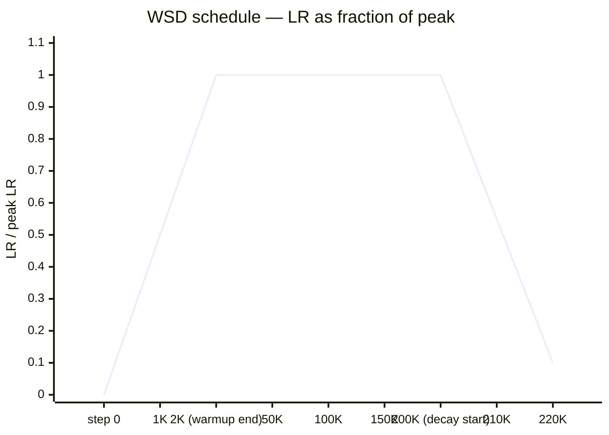
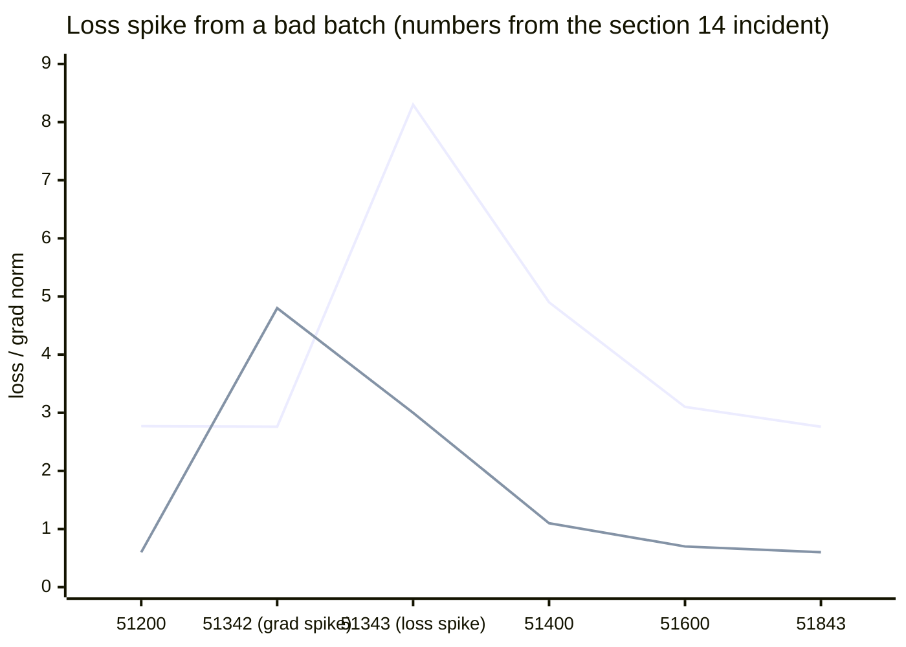

# Training Dynamics at Scale

> This file is a deep-dive sub-file of the [Foundations & Architecture](README.md) module.
> It covers LR warmup theory, WSD schedule, loss spikes, BF16 vs FP16, batch scaling,
> muP (maximal update parametrization), and data mixing at billion-parameter scale.
> Distributed training infrastructure (DDP, FSDP, ZeRO) is covered in the [LLM Training Infrastructure](../training_infrastructure/README.md) module.

---

## 1. Concept Overview

Training a billion-parameter language model is fundamentally different from training a ResNet-50 or a BERT-base. At scale, training is as much engineering as science — the difference between a successful run and a diverged run often comes down to numerical precision choices, gradient norm spikes from a single corrupted batch, or subtle interactions between batch size and learning rate scheduling.

Three categories of scale-specific challenges:

1. **Optimization dynamics:** Why learning rate warmup is necessary for transformers but not CNNs. Why the cosine schedule with warmup-stable-decay (WSD) enables continual learning. Why batch size scaling rules break at the "critical batch size" and require LAMB/LARS.

2. **Numerical precision:** Why BF16 is safer than FP16 for large models. How AllReduce accumulation errors compound across data-parallel ranks. When to use FP32 for optimizer states.

3. **Stability and debugging:** What causes loss spikes at step 50K (bad data batches). How muP enables training at proxy scale and transferring hyperparameters to a 70B target. How data mixing affects capabilities.

Understanding these failure modes — and how to detect and fix them before a run diverges — is what principal ML engineers are tested on.

---

## 2. Intuition

One-line analogy: Training a 70B model is like tuning a formula one car: tiny settings changes (learning rate schedule, batch ramp-up, gradient clip threshold) are the difference between a record lap and a crash.

Mental model: At small scale (7M parameters), training is forgiving — wrong hyperparameters produce suboptimal models. At large scale (70B), wrong hyperparameters produce diverged runs that waste millions of dollars. Every hyperparameter decision must be made with the failure mode in mind.

Why it matters: Google's LaMDA, Meta's LLaMA, and Anthropic's Claude all had training runs that diverged due to issues covered in this module. Understanding these prevents repeating expensive mistakes.

Key insight: muP (Maximal Update Parametrization) is the most important practical advance in LLM training efficiency post-2021. It enables running all hyperparameter searches at a small proxy model and transferring results directly to the production scale — reducing the cost of hyperparameter tuning from millions of dollars to thousands.

---

## 3. Core Principles

**Learning rate warmup:** Transformers have strong interactions between weight matrices at initialization — the attention Q/K/V projections receive similar random initialization, leading to attention patterns that collapse or diverge rapidly when large gradient steps are applied immediately. Warmup allows the model to stabilize attention patterns before large updates. CNNs don't have this problem because convolutional filters are more statistically independent at initialization.

**Critical batch size:** There exists a batch size beyond which additional parallelism yields diminishing returns — increasing batch further doesn't help (and may hurt) convergence. Below the critical batch size, gradient noise from mini-batching is "useful" — it acts as implicit regularization. Above it, the gradient is essentially a noise-free estimate of the true gradient, and the model learns the same amount per gradient update regardless of further batch size increase.

**BF16 vs FP16:** BF16 uses 1 sign bit + 8 exponent bits + 7 mantissa bits (same exponent range as FP32). FP16 uses 1 + 5 + 10. The exponent range determines the maximum representable value. FP16 max: ~65,504. BF16 max: ~3.39×10^38. A single attention score computation with d_k=128 can produce values of magnitude ~10, whose squared norm ~1000 — within BF16 range but can overflow FP16 without loss scaling.

**muP (Maximal Update Parametrization):** Standard initialization and learning rate parametrization causes features and weights to scale with model width — hyperparameters that work for a 100M model don't work for a 7B model. muP reparametrizes so that updates are of the same magnitude at any width, enabling hyperparameter transfer across model scales.

**Data mixing:** The mixture of domains in pretraining data directly determines model capabilities. Web data teaches general language; code teaches structured reasoning; math teaches precise calculation; multilingual data teaches cross-lingual transfer. The mixing ratios must be tuned; too much code makes the model verbose and literal; too little makes it poor at programming. Corpus construction and filtering pipelines are covered in [Pre-Training](../pre_training/README.md).

---

## 4. Types / Architectures / Strategies

### 4.1 Learning Rate Schedules

| Schedule | Description | Used In | Best For |
|----------|-------------|---------|---------|
| **Linear warmup + cosine decay** | Warm up to peak LR over W steps, cosine decay to η_min | GPT-3, most LLMs | Standard choice, predictable |
| **Linear warmup + linear decay** | Simpler but less smooth | Some small models | Simplicity |
| **WSD (Warmup-Stable-Decay)** | Warmup → long stable phase → sharp decay | Mistral, LLaMA 3, MiniCPM | Continual pre-training |
| **Cyclical LR** | Periodic spikes in LR | Some research models | Finding flat minima |
| **Constant LR (research)** | Fixed LR throughout | Some ablation studies | Comparing models at fixed compute |

**WSD advantage:** The stable phase allows training to continue indefinitely and add more data without degrading the model. The final sharp decay "locks in" the learned representations. Cosine decay must commit to a final step; WSD can extend training by adding more data in the stable phase.

### 4.2 Precision Strategies

| Precision | Memory | Numerical Range | Production Use |
|-----------|--------|-----------------|----------------|
| FP32 | 4 bytes | ±3.4×10^38 | Optimizer states only |
| BF16 | 2 bytes | ±3.4×10^38 (same!) | Forward/backward pass |
| FP16 | 2 bytes | ±65,504 | Dangerous without loss scaling; avoid for LLMs |
| FP8 E4M3 | 1 byte | ±448 | Forward pass only (H100 attention) |
| INT8 | 1 byte | -128 to 127 | KV cache, inference only |

**Standard recipe:** BF16 for forward/backward, FP32 for optimizer states, FP32 for gradient AllReduce (to prevent accumulation errors).

### 4.3 Batch Size Scaling

| Method | Formula | When to Use |
|--------|---------|------------|
| **Linear scaling rule** | LR × B_new/B_base (Goyal et al., 2017) | Below critical batch size |
| **Square root scaling** | LR × sqrt(B_new/B_base) | Near critical batch size |
| **LARS / LAMB** | Layer-wise adaptive LR based on gradient/weight norms | Very large batch (B > 64K examples) |
| **Batch ramp-up** | Start small, increase over first N steps | Prevent instability at training start |

### 4.4 Loss Spike Taxonomy

| Spike Type | Characteristic | Root Cause | Detection |
|-----------|---------------|------------|-----------|
| Data spike | Sharp spike, quick recovery | Corrupted batch (binary data, encoding errors) | Gradient norm spike precedes loss spike |
| LR spike | Spike at schedule change | LR too high for current model state | Spike at LR restart or warmup end |
| Numerical | Spike then diverge | Overflow in BF16/FP16 or attention (inf/nan) | NaN in loss; check with `torch.isnan` |
| Batch size | Gradual diverge | Batch size above critical size | Loss trend instead of spike |

---

## 5. Architecture Diagrams

### Warmup-Stable-Decay (WSD) Schedule



Linear warmup (~2,000 steps) to peak, then a flat stable phase that can be extended with more data at any time, then a sharp final decay to `min_lr_ratio` (0.1× peak). The advantage over cosine: cosine commits to the final step count at training start, while WSD's stable phase leaves the endpoint open.

### Loss Spike Pattern (Bad Data Batch)



Upper line = loss, lower line = gradient norm. The gradient norm jumps to 8× its 0.6 rolling average one step *before* the loss spikes 2.76 → 8.3; recovery back to baseline takes 100-500 steps. Detection: gradient_norm > 3× rolling average → investigate the next loss value. Response: roll back to the checkpoint before the spike, skip that batch, resume.

### muP vs Standard Parametrization

```
Standard Param:
  Width w_1 (small model): LR η works well
  Width w_2 (10x larger): same η causes feature collapse or divergence
  → must re-tune LR for every width

muP:
  Width w_1: use η
  Width w_2: automatically scaled (no change to η needed)
  → transfer LR from small proxy to large model

muP Scaling Rules (simplified):
  Embedding LR:    η_embed = η / width_factor
  Output LR:       η_output = η / width_factor
  Hidden LR:       η_hidden = η  (unchanged — the "maximal" update)
  Initialization:  scale by 1/sqrt(width_factor) for hidden layers
```

---

## 6. How It Works — Detailed Mechanics

### Reading the Loss Number

Every quantity in this file — `3.2`, `2.76`, `8.3`, the final `2.31` — is token-level
cross-entropy in nats. Its exponential is perplexity:

```
loss = -(1/N) * sum over the N tokens of  ln P(next_token given preceding tokens)

perplexity = exp(loss)
```

**What the formula is telling you.** "Average surprise per token — and `exp(loss)` is how many
equally likely tokens the model is effectively choosing between at each position."

This is why a loss drop of `0.5` sounds tiny but is not: loss is logarithmic, so small absolute
moves late in training are large multiplicative changes in the model's uncertainty.

| Symbol | What it is |
|--------|------------|
| `ln P(next_token given ...)` | Natural log of the probability the model gave the token that actually came next |
| `-(1/N) * sum` | Negate (so lower is better) and average over tokens, making loss batch-size independent |
| `loss` | Mean surprise in nats. `0.0` = perfect prediction; every extra nat is one `e`-fold more uncertainty |
| `exp(loss)` | Perplexity — the effective branching factor, expressed in tokens |
| `ln(V)` | Loss of a model guessing uniformly over a `V`-token vocabulary; the untrained ceiling |

**Walk one example.** Push this file's own loss values through `exp` and the training curve turns
into a count of plausible next tokens:

```
                     loss (nats)   exp(loss) = perplexity   effectively choosing among
  untrained (V=128K)    11.76           128,000.0           the entire 128K vocabulary
  step 2001              3.20                24.5           ~25 plausible next tokens
  step 50000             2.80                16.4           ~16 plausible next tokens
  step 51342             2.76                15.8           baseline just before the spike
  step 51343             8.30             4,023.9           bad-batch spike -- 254.7x worse
  final                  2.31                10.1           ~10 plausible next tokens

  loss 2.0  ->  exp(2.0) = 7.389
  loss 1.5  ->  exp(1.5) = 4.482
  Half a nat of loss cuts the branching factor by 7.389 / 4.482 = 1.649x.
```

The last two lines are the reason the §14 outcome cares about `2.31` vs the projected `2.28`:
`exp(2.31) / exp(2.28) = exp(0.03) = 1.030`, a 3.0% higher branching factor — small, but a real
model-quality gap bought by 200 wasted steps.

### Learning Rate Warmup Theory

```python
import torch
from torch.optim.lr_scheduler import LambdaLR
import math


def get_wsd_schedule(
    optimizer: torch.optim.Optimizer,
    warmup_steps: int,
    stable_steps: int,
    decay_steps: int,
    min_lr_ratio: float = 0.1,
) -> LambdaLR:
    """
    Warmup-Stable-Decay (WSD) learning rate schedule.

    Phase 1 — Warmup (linear): 0 → peak LR over warmup_steps
    Phase 2 — Stable: constant peak LR for stable_steps
    Phase 3 — Decay (cosine): peak LR → min_lr over decay_steps

    Advantage over cosine: the stable phase can be extended
    by adding more data without changing the decay behavior.
    """
    def lr_lambda(current_step: int) -> float:
        if current_step < warmup_steps:
            # Linear warmup
            return float(current_step) / float(max(1, warmup_steps))

        elif current_step < warmup_steps + stable_steps:
            # Stable phase: constant LR
            return 1.0

        else:
            # Cosine decay phase
            decay_step = current_step - warmup_steps - stable_steps
            progress = float(decay_step) / float(max(1, decay_steps))
            cosine = math.cos(math.pi * progress)
            # Decay from 1.0 to min_lr_ratio
            return min_lr_ratio + (1.0 - min_lr_ratio) * (1 + cosine) / 2

    return LambdaLR(optimizer, lr_lambda=lr_lambda)


def get_cosine_with_warmup(
    optimizer: torch.optim.Optimizer,
    warmup_steps: int,
    total_steps: int,
    min_lr_ratio: float = 0.1,
) -> LambdaLR:
    """Standard cosine schedule with linear warmup (most common LLM schedule)."""
    def lr_lambda(current_step: int) -> float:
        if current_step < warmup_steps:
            return float(current_step) / float(max(1, warmup_steps))
        progress = float(current_step - warmup_steps) / float(max(1, total_steps - warmup_steps))
        cosine = math.cos(math.pi * progress)
        return min_lr_ratio + (1.0 - min_lr_ratio) * (1 + cosine) / 2
    return LambdaLR(optimizer, lr_lambda=lr_lambda)


def warmup_theory_demonstration() -> None:
    """
    Why warmup is needed for transformers specifically.

    At initialization, attention weight matrices W_Q, W_K have random entries.
    The attention scores QK^T are random — initially all positions attend
    roughly equally. The residual connection ensures x flows through unchanged.
    Early gradient updates are large because the network is "wrong" everywhere.

    Without warmup: large early updates destabilize the attention patterns
    before they converge. A head might collapse to always attending to one token
    or never attending anywhere meaningful. Gradient norms spike.

    With warmup: small initial LR allows attention patterns to form gradually.
    By step W (warmup end), attention has stable structure and can accept
    large-LR updates efficiently.

    CNNs don't have this because convolutional filters are statistically
    independent at initialization — no cross-filter interaction causes collapse.
    """
    print("Warmup rationale:")
    print("- Transformer attn heads: high inter-layer interaction at init")
    print("- Without warmup: attn collapse in first 100 steps")
    print("- Typical warmup: 2000 steps for 7B, 1000 for 1B")
    print("- Evidence: removing warmup from LLaMA causes PPL spike in first epoch")
```

**In plain terms.** `get_cosine_with_warmup` says: "ramp the learning rate up in a straight line
for the first `warmup_steps`, then walk it down the first half of a cosine wave until it flattens
out at one tenth of peak."

Both `lr_lambda` functions return a *multiplier*, not a learning rate — PyTorch's `LambdaLR`
multiplies each parameter group's base LR by it. That indirection is why the same schedule code
works unchanged under muP, where each group has a different base LR (§6, `get_mup_optimizer_groups`).

| Symbol | What it is |
|--------|------------|
| `current_step / warmup_steps` | The linear ramp. Climbs `0 -> 1` across warmup, so LR climbs `0 -> peak` |
| `progress` | Fraction of *post-warmup* training completed: `0.0` at warmup end, `1.0` at the last step |
| `cos(pi * progress)` | Falls from `+1` to `-1`, so `(1 + cos) / 2` falls smoothly from `1.0` to `0.0` |
| `min_lr_ratio` | The floor as a fraction of peak (`0.1`). LR decays toward it, never to zero |
| `min_lr_ratio + (1 - min_lr_ratio) * (1+cos)/2` | Remaps the `1 -> 0` cosine onto `1.0 -> min_lr_ratio` |

**Walk one example.** Run the §14 config through it — `peak_lr = 3e-4`, `warmup_steps = 2000`,
`total_steps = 1e12 / 4,194,304 = 238,418`, `min_lr_ratio = 0.1`:

```
   step        phase        multiplier      actual LR
      0     warmup            0.0000       0.000e+00    LR is exactly zero at step 0
    500     warmup            0.2500       7.500e-05    quarter way up the ramp
   1000     warmup            0.5000       1.500e-04    half way up
   2000     warmup ends       1.0000       3.000e-04    peak reached, decay begins
  60000     cosine decay      0.8728       2.619e-04    24.5% through decay, only 12.7% down
 119209     cosine decay      0.5560       1.668e-04    halfway in steps, ~56% of peak LR
 180000     cosine decay      0.2289       6.867e-05    the curve is steepest in this stretch
 238418     final step        0.1000       3.000e-05    lands exactly on min_lr_ratio x peak
```

Two things fall out of the numbers. The cosine is deliberately *flat at both ends*: a quarter of the
way through decay the LR has only dropped 12.7%, so most of training happens near peak, and the last
stretch crawls so late updates barely move the weights. And the warmup is 2,000 steps out of 238,418
— 0.84% of the run, matching the `max(1000, 0.01 * total_steps) = max(1000, 2384) = 2384` heuristic
in Pitfall 3 to within a rounding.

### Loss Spike Detection and Recovery

```python
import torch
from collections import deque
from typing import Callable


class TrainingMonitor:
    """
    Production training monitor for detecting and responding to loss spikes.

    Loss spikes at billion-parameter scale often come from:
    1. Corrupted data batches (binary-encoded documents from web crawl)
    2. Numerical overflow in BF16 operations
    3. Learning rate too high after schedule change
    4. Gradient norm explosion from pathological batch

    Detection: gradient norm spike (3x rolling average) precedes loss spike
    by 1-2 steps. This is the early warning system.
    """

    def __init__(
        self,
        grad_norm_history_len: int = 100,
        spike_threshold_factor: float = 3.0,
        checkpoint_every_n_steps: int = 100,
    ) -> None:
        self.grad_norms = deque(maxlen=grad_norm_history_len)
        self.losses = deque(maxlen=grad_norm_history_len)
        self.spike_threshold_factor = spike_threshold_factor
        self.checkpoint_every_n_steps = checkpoint_every_n_steps
        self.step = 0

    def compute_and_clip_grad_norm(
        self,
        model: torch.nn.Module,
        max_norm: float = 1.0,
    ) -> float:
        """
        Clip gradient norm and return pre-clipping norm.
        Always clip — this is not optional for billion-parameter models.
        """
        total_norm = torch.nn.utils.clip_grad_norm_(model.parameters(), max_norm)
        return total_norm.item()

    def should_checkpoint(self) -> bool:
        """Checkpoint frequently to enable recovery from spikes."""
        return self.step % self.checkpoint_every_n_steps == 0

    def detect_gradient_spike(self, grad_norm: float) -> bool:
        """
        Detect gradient norm spike (early warning before loss spike).
        Returns True if spike detected.
        """
        if len(self.grad_norms) < 10:
            self.grad_norms.append(grad_norm)
            return False

        rolling_mean = sum(list(self.grad_norms)[-50:]) / min(50, len(self.grad_norms))
        is_spike = grad_norm > rolling_mean * self.spike_threshold_factor

        self.grad_norms.append(grad_norm)
        return is_spike

    def update(
        self,
        loss: float,
        grad_norm: float,
        save_checkpoint_fn: Callable[[], None],
    ) -> dict:
        """
        Process training step. Return status and any actions taken.
        """
        self.step += 1
        self.losses.append(loss)

        # Periodic checkpoint (before we can detect spikes)
        if self.should_checkpoint():
            save_checkpoint_fn()
            print(f"Step {self.step}: checkpoint saved")

        # Gradient spike detection
        is_grad_spike = self.detect_gradient_spike(grad_norm)

        # Loss NaN/Inf detection
        is_nan_loss = not (loss == loss) or loss == float('inf')

        status = {
            "step": self.step,
            "loss": loss,
            "grad_norm": grad_norm,
            "grad_spike": is_grad_spike,
            "nan_loss": is_nan_loss,
        }

        if is_grad_spike:
            print(f"WARNING: Gradient norm spike at step {self.step}: {grad_norm:.2f}")
            print("  -> Recommend: skip this batch, roll back if loss spikes next step")

        if is_nan_loss:
            print(f"CRITICAL: NaN/Inf loss at step {self.step}")
            print("  -> Recommend: check for BF16 overflow, reload last checkpoint")

        return status


def handle_loss_spike(
    model: torch.nn.Module,
    optimizer: torch.optim.Optimizer,
    checkpoint_path: str,
    skip_n_batches: int = 100,
) -> None:
    """
    Recovery procedure for loss spikes.

    Standard recipe (used at Meta, Google, Anthropic):
    1. Roll back model and optimizer state to last clean checkpoint
    2. Skip or shuffle the problematic data batch
    3. Resume training with slightly reduced LR (optional)
    4. Monitor for recurrence
    """
    print(f"Loading checkpoint from {checkpoint_path}")
    checkpoint = torch.load(checkpoint_path)
    model.load_state_dict(checkpoint['model_state_dict'])
    optimizer.load_state_dict(checkpoint['optimizer_state_dict'])

    print(f"Skipping {skip_n_batches} batches from current data position")
    # In practice: modify data iterator to skip ahead in the dataset
    # DataLoader with skip: use a custom sampler that skips by index range

    print("Resuming training with reduced LR for first 100 recovery steps")
    # Reduce LR by 50% for brief recovery period
    for param_group in optimizer.param_groups:
        param_group['lr'] *= 0.5
```

**Stated plainly.** `clip_grad_norm_(model.parameters(), max_norm)` implements two lines of math:

```
total_norm = sqrt( sum over every parameter tensor p of  ||grad_p||^2 )

if total_norm > max_norm:
    every gradient *= (max_norm / total_norm)
```

"Measure the length of the whole gradient vector across every parameter at once; if it is longer
than `1.0`, shrink the entire vector back to length `1.0` without turning it."

The direction-preserving part is the whole point. Clipping scales *all* gradients by one shared
factor, so the update points exactly where it did before — only shorter. Per-element clamping
(`clip_grad_value_`) would clip big components and leave small ones, which rotates the update into a
direction no batch actually asked for; that is why LLM training universally uses norm clipping.

| Symbol | What it is |
|--------|------------|
| `norm(grad_p)` | L2 norm of one parameter tensor's gradient (embeddings, one attention matrix, ...) |
| `sum of squares, then sqrt` | Pythagoras across every tensor — treats all parameters as one long vector |
| `total_norm` | The global gradient norm. This is the number logged every step and alerted on |
| `max_norm` | The clip threshold, `1.0` in the §14 config and in essentially all LLM pre-training |
| `max_norm / total_norm` | The scale factor. Exactly `1.0` when no clipping happens, `< 1` when it does |

Note the return value is the norm **before** clipping — which is what makes it the monitoring
signal, not just a safety mechanism.

**Walk one example.** Take the §14 run's healthy step and its spike step:

```
  healthy step (grad norm 0.6 group breakdown)
    embeddings     0.30      squared  0.0900
    attention      0.40      squared  0.1600
    ffn            0.35      squared  0.1225
    layernorm      0.10      squared  0.0100
                             sum      0.3825
    total_norm = sqrt(0.3825) = 0.6185     > max_norm 1.0 ?  NO
    scale = 1.0                            gradients pass through untouched

  spike step 51342
    total_norm = 4.8                       > max_norm 1.0 ?  YES
    scale = 1.0 / 4.8 = 0.2083
    every gradient shrinks to 20.83% of its length
    effective LR for this one step = 3.0e-4 x 0.2083 = 6.25e-05
```

Clipping did not *stop* the spike — the loss still went `2.76 -> 8.3` on the next step. What it did
was cap the damage of one 4.8-norm step to the size of a 1.0-norm step, which is why the run
recovered in 600 steps instead of diverging. Note also the last line: a step that clips at `4.8`
silently trains at a 4.8x smaller learning rate. If clipping fires on most steps, the configured
peak LR is fiction — that is the clip-fraction warning in §12.

**Read it like this.** The spike detector in `detect_gradient_spike` is a rolling-baseline rule:

```
rolling_mean = mean(last 50 gradient norms)
spike        = grad_norm > rolling_mean * spike_threshold_factor
```

| Symbol | What it is |
|--------|------------|
| `rolling_mean` | Recent-history baseline over a 50-step window, so it tracks the run as the norm drifts |
| `spike_threshold_factor` | Sensitivity, `3.0`. Fire only when a step is 3x the recent baseline |
| `len(self.grad_norms) < 10` guard | Refuse to judge until there is history; the first steps have no baseline |
| `deque(maxlen=100)` | Bounded history — old norms fall off so the baseline cannot go stale |

**Walk one example.** The §14 incident, using its stated `Grad norm: 0.6±0.15`:

```
  rolling_mean          = 0.60
  rolling_std           = 0.15
  multiplicative rule   : threshold = 0.60 x 3.0        = 1.80
  k-sigma rule (k = 3)  : threshold = 0.60 + 3 x 0.15   = 1.05
  k-sigma rule (k = 4)  : threshold = 0.60 + 4 x 0.15   = 1.20

  observed at step 51342: grad_norm = 4.8
    vs multiplicative    : 4.8 / 0.6 = 8.0x the mean   -> FIRES (8.0 > 3.0)
    vs k-sigma           : (4.8 - 0.6) / 0.15 = 28.0 sigma -> FIRES by a mile
```

Both rules fire, and that is the design intent: a real data spike is 8x or 28-sigma out, not a
borderline `3.1x`. The factor of `3.0` is set loose *on purpose* — a tighter threshold like `2.0`
would page on-call for ordinary batch-to-batch variance (`0.6 + 4 x 0.15 = 1.2` is still only `2.0x`
the mean), and an alarm that cries wolf gets muted, which is how a $200K divergence goes unnoticed.

### BF16 vs FP16 Numerical Analysis

```python
import torch
import struct


def compare_floating_point_formats() -> None:
    """
    Demonstrate why BF16 is safer than FP16 for LLM training.

    FP16: 1 sign + 5 exponent + 10 mantissa = 16 bits
    BF16: 1 sign + 8 exponent + 7 mantissa = 16 bits

    Key difference: BF16 has the SAME exponent range as FP32
    FP16 max value: 2^15 × (2 - 2^{-10}) ≈ 65,504
    BF16 max value: 2^127 × (2 - 2^{-7}) ≈ 3.39×10^38  (same as FP32)

    Production implications:
    - LLM attention scores: Q·K^T can reach values of 50-100 for long sequences
      Squared: 2500-10000. Well within BF16 range, overflows FP16!
    - Weight matrices at 70B scale: some parameters grow during training
      FP16 clips any value > 65504 to inf → silent NaN propagation
    """
    # Simulate an attention score overflow scenario
    d_k = 128
    # After several thousand training steps, some Q, K values can grow to ~5-10
    q_element = torch.tensor(7.0)  # representative large Q value
    k_element = torch.tensor(7.0)  # representative large K value
    score = q_element * k_element  # = 49.0 per dimension

    # Sum over d_k dimensions (dot product)
    total_score = score * d_k  # 49 * 128 = 6272 before scaling

    print(f"Raw attention score (before sqrt(d_k) scaling): {total_score}")
    print(f"FP16 max: 65504")
    print(f"BF16 max: ~3.39e38")

    # After scaling: 6272 / sqrt(128) ≈ 554 — within both ranges
    # But during intermediate computation, exp(6272) is computed in softmax
    # exp(6272) = infinity in both FP16 and FP32 → NaN via 0/0 in softmax

    # In practice: gradient accumulation in AllReduce is the key BF16 issue
    # 1000 ranks × gradient_element can overflow FP16 accumulation buffer
    # BF16 accumulation: sum 1000 values of magnitude 0.1 → 100 → safe
    # FP16 accumulation: same → 100 → also safe for this example
    # BUT: intermediate accumulations at layer boundaries can exceed 65K

    # Real production failure (from Google PaLM training notes):
    # FP16 AllReduce on 1024 GPUs, gradient norm 50 → per-element grad ~0.05
    # AllReduce sum: 1024 × 0.05 = 51.2 → safe
    # BUT: variance terms computed during AllReduce: (x_i - mean)^2 can reach
    # (50 - 0.05)^2 ≈ 2499 → 1024 × 2499 = 2.56M → overflows FP16


def mixed_precision_recipe(model: torch.nn.Module) -> dict:
    """
    Production mixed precision recipe for LLM training.

    Standard: BF16 everywhere except optimizer states.
    Use FP32 for:
    - Optimizer states (Adam m and v accumulators need precision for LR × grad updates)
    - Gradient AllReduce (prevent accumulation errors across many ranks)
    - Loss scaling (not needed for BF16, but needed if using FP16)

    Returns training configuration.
    """
    from torch.cuda.amp import GradScaler

    config = {
        "model_dtype": torch.bfloat16,       # Forward/backward pass
        "optimizer_dtype": torch.float32,    # Adam states in FP32
        "grad_dtype_for_allreduce": torch.float32,  # Upcasts before AllReduce
        "loss_scaler": None,                 # Not needed for BF16
        "autocast": True,                    # torch.cuda.amp.autocast(dtype=torch.bfloat16)
    }

    # Verify GPU supports BF16
    if not torch.cuda.is_bf16_supported():
        print("WARNING: BF16 not supported on this GPU, falling back to FP32")
        config["model_dtype"] = torch.float32
        config["autocast"] = False

    return config
```

### muP (Maximal Update Parametrization)

```python
import torch
import torch.nn as nn
import math
from typing import List


class muPLinear(nn.Module):
    """
    muP-compliant linear layer.

    Standard linear: y = x @ W^T, W initialized N(0, 1/fan_in)
    muP linear: W initialized N(0, 1/fan_in), BUT learning rate scaled by 1/fan_in
    (relative to base width's fan_in)

    The key insight: in standard parametrization, updates to W cause
    features (outputs) to grow with width. muP constrains feature magnitudes
    to remain O(1) regardless of width, enabling hyperparameter transfer.

    Concrete implementation:
    - Scale weight init by 1/sqrt(width_ratio) for hidden layers
    - Scale LR by 1/width_ratio for hidden layers
    - Keep embedding and output LR unchanged (or scale differently)
    """

    def __init__(
        self,
        in_features: int,
        out_features: int,
        base_width: int,         # fan_in of the corresponding layer at base (proxy) scale
        mup_scale: float = 1.0,  # actual_width / base_width
        bias: bool = True,
    ) -> None:
        super().__init__()
        self.weight = nn.Parameter(torch.empty(out_features, in_features))
        self.bias = nn.Parameter(torch.zeros(out_features)) if bias else None

        # muP initialization: scale by 1/sqrt(actual_width) instead of 1/sqrt(base_width)
        # This ensures feature magnitudes are O(1) at all widths
        std = 1.0 / math.sqrt(in_features)   # same as standard init
        nn.init.normal_(self.weight, mean=0.0, std=std)

        # Store mup_scale for optimizer LR adjustment
        self.mup_scale = mup_scale
        # muP LR for this layer: base_lr / mup_scale
        # (hidden-to-hidden layers only; embedding and head use different rules)

    def forward(self, x: torch.Tensor) -> torch.Tensor:
        out = x @ self.weight.T
        if self.bias is not None:
            out = out + self.bias
        return out


def get_mup_optimizer_groups(
    model: nn.Module,
    base_lr: float,
    width_ratio: float,         # actual_width / proxy_width (e.g., 7B/100M ≈ 70)
    weight_decay: float = 0.1,
) -> List[dict]:
    """
    muP optimizer parameter groups with per-layer learning rate scaling.

    muP rules:
    - Input embedding weights: LR = base_lr (no scaling)
    - Output (LM head) weights: LR = base_lr / width_ratio
    - Hidden layer weights (attention, FFN): LR = base_lr / width_ratio
    - Biases and LayerNorm: LR = base_lr (no scaling), no weight decay

    This means: if base_lr=3e-4 works for the 100M proxy model,
    use base_lr=3e-4 for the 7B model too — muP handles the rest.
    """
    embedding_params = []
    output_params = []
    hidden_weight_params = []
    no_decay_params = []

    for name, param in model.named_parameters():
        if not param.requires_grad:
            continue

        if "embed_tokens" in name:
            embedding_params.append(param)
        elif "lm_head" in name or "output" in name:
            output_params.append(param)
        elif "bias" in name or "layer_norm" in name or "layernorm" in name:
            no_decay_params.append(param)
        else:
            hidden_weight_params.append(param)

    return [
        {
            "params": embedding_params,
            "lr": base_lr,                         # Embedding: no LR scaling
            "weight_decay": weight_decay,
        },
        {
            "params": output_params,
            "lr": base_lr / width_ratio,           # Output: scale by 1/width_ratio
            "weight_decay": weight_decay,
        },
        {
            "params": hidden_weight_params,
            "lr": base_lr / width_ratio,           # Hidden: scale by 1/width_ratio
            "weight_decay": weight_decay,
        },
        {
            "params": no_decay_params,
            "lr": base_lr,                         # No scaling for non-weight params
            "weight_decay": 0.0,
        },
    ]


def mup_hyperparameter_transfer_workflow() -> None:
    """
    muP enables searching hyperparameters at proxy scale and transferring to production.

    Step 1: Define proxy model (small, fast) and target model (large, expensive)
    Constraint: same architecture, different width

    Step 2: Grid search hyperparameters on proxy model
    Grid: lr ∈ {1e-4, 3e-4, 1e-3}, batch ∈ {256, 512, 1024}
    Cost: 10 runs × proxy_model (100M) × 50B tokens ≈ $2K

    Step 3: Transfer best hyperparameters to target model
    - LR: same value (muP guarantees scale-invariance)
    - Batch: same (critical batch size is architecture-independent in muP)
    - Warmup steps: scale proportionally to data size
    Cost: 1 run × target_model (7B) × 1T tokens ≈ $500K

    muP result: <5% final loss difference between best proxy hyperparams
    and optimal target hyperparams.

    Without muP: typical loss from wrong hyperparams at 7B = 5-15%
    → equivalent to training for 5-15% fewer tokens
    → waste of $25K-75K per training run at this scale
    """
    print("muP workflow:")
    print("1. Define proxy: width_factor = 1x, depth = target depth")
    print("2. Search LR, batch, WD at proxy scale (100M params)")
    print("3. Transfer: use same LR/batch/WD with muP optimizer groups")
    print("4. Validate: train proxy and 7B for 1B tokens, compare loss curves")
    print("5. Expected: curves match within 2% — indicates successful transfer")
```

### Data Mixing and Capability Control

```python
from dataclasses import dataclass
from typing import Dict, List
import random


@dataclass
class DataMixConfig:
    """
    Data mixing configuration for LLM pretraining.

    LLaMA 3 training data mix (approximate):
    - General web: 82% (CommonCrawl processed)
    - Code: 8% (GitHub, Stack Overflow)
    - Math: 4.5% (arXiv, Khan Academy, textbooks)
    - Books: 3% (Gutenberg, curated books)
    - Multilingual: 2.5% (non-English web)

    Capability impact of mix ratios:
    - More code → stronger at code completion, structured output, reasoning
    - More math → stronger at arithmetic, STEM, precise counting
    - More web → better world knowledge, common knowledge
    - Less code → weaker at regex, API calls, JSON formatting
    """
    domain_weights: Dict[str, float]   # domain -> sampling probability
    epoch_budget: Dict[str, int]       # max epochs per domain (prevent overfitting)
    quality_filters: Dict[str, List[str]]   # domain -> filter criteria

    def validate(self) -> None:
        total = sum(self.domain_weights.values())
        assert abs(total - 1.0) < 1e-6, f"Weights must sum to 1.0, got {total}"

    def sample_domain(self) -> str:
        """Sample a domain according to mixing weights."""
        domains = list(self.domain_weights.keys())
        weights = [self.domain_weights[d] for d in domains]
        return random.choices(domains, weights=weights)[0]


LLAMA3_MIX = DataMixConfig(
    domain_weights={
        "web": 0.82,
        "code": 0.08,
        "math": 0.045,
        "books": 0.03,
        "multilingual": 0.025,
    },
    epoch_budget={
        "web": 1,      # Most web data: single epoch to avoid memorization
        "code": 4,     # Code data: smaller, repeat 4x
        "math": 8,     # Math data: very small, repeat 8x
        "books": 2,    # Books: 2x
        "multilingual": 2,
    },
    quality_filters={
        "web": ["perplexity_filter", "dedup_minhash", "toxicity_filter"],
        "code": ["syntax_valid", "license_permissive"],
        "math": ["latex_parseable", "solution_verifiable"],
    }
)


def compute_effective_epochs(
    domain_sizes_tokens: Dict[str, int],  # tokens per domain
    domain_weights: Dict[str, float],      # sampling weights
    total_training_tokens: int,            # total tokens to train on
) -> Dict[str, float]:
    """
    Compute how many times each domain is effectively repeated.

    For a given mix and total budget, some domains will be repeated
    many times (small domains with high weight).

    If effective_epochs >> 1: risk of domain memorization / overfitting
    Solution: weight down that domain or acquire more data
    """
    effective_epochs = {}
    for domain, weight in domain_weights.items():
        tokens_consumed = weight * total_training_tokens
        available_tokens = domain_sizes_tokens.get(domain, 1)
        effective_epochs[domain] = tokens_consumed / available_tokens
    return effective_epochs
```

---

## 7. Real-World Examples

**LLaMA 3 training (Meta, 2024):** 15T token training run for LLaMA 3 405B. Loss spike at step ~800K attributed to a data batch containing binary-encoded files from a web crawl (PDFs embedded as raw bytes). Recovery: rolled back 200 steps, skipped the problematic shard, resumed with gradient norm threshold increased from 1.0 to 1.5 temporarily. WSD schedule used: stable phase extended when additional high-quality data was added partway through training.

**GPT-4 training (OpenAI, 2023, inferred):** The training run reportedly used a smaller proxy model (estimated 7-13B) to search hyperparameters before scaling. This is consistent with muP — the hyperparameter transfer would have saved weeks of 7B-scale HPO. Multiple loss spikes were reported and addressed by batch skip + checkpoint rollback.

**DeepSeek-V3 training (2024):** Trained 671B MoE model for ~$5.5M by aggressive use of BF16 throughout (including optimizer states) with FP32 accumulation only at AllReduce boundaries. Used custom FP8 training for some layers (experimental), reducing compute cost. Reported loss spikes from MoE load imbalance (some experts receiving too many tokens) — fixed by adding auxiliary load-balancing loss.

**MiniCPM (ModelBest, 2024):** Demonstrated muP in production: trained a suite of models from 1.2B to 4B with identical hyperparameters found on a 60M proxy. Loss curves matched within 3%. WSD schedule enabled adding new data batches mid-training (during the stable phase) without restarting, an important operational flexibility.

---

## 8. Tradeoffs

| Schedule | Flexibility | Quality | Continual Learning | Complexity |
|----------|-------------|---------|-------------------|------------|
| Cosine + warmup | Low (fixed endpoint) | Good | Poor (must restart) | Simple |
| WSD | High (extend stable phase) | Good | Excellent | Moderate |
| Linear warmup + decay | Low | Slightly lower | Poor | Simple |

| Precision | Memory | Stability | Gradient Quality | Use |
|-----------|--------|-----------|-----------------|-----|
| FP32 everywhere | 4 bytes/param | Excellent | Excellent | Debug only |
| BF16 fwd + FP32 optim | 2+8=10 bytes | Very good | Very good | Standard |
| FP16 fwd + FP32 optim | 2+8=10 bytes | Moderate | Good (needs scaling) | Avoid for LLMs |
| FP8 fwd + BF16 bwd | 1+2=3 bytes | Experimental | Variable | H100 only |

**Put simply.** The `2+8=10 bytes` in the second row is the AdamW state-memory arithmetic, and it
is worth unpacking because it is the single largest number in a training-run capacity plan:

```
bytes_per_param = bytes(weights) + bytes(Adam m) + bytes(Adam v)   [+ bytes(FP32 master copy)]

resident_memory = num_params x bytes_per_param
```

"Every parameter you train drags two same-shape optimizer accumulators along with it, and those
accumulators are kept in FP32 even when the weights are not."

| Symbol | What it is |
|--------|------------|
| `m` | Adam's first moment — an exponential moving average of the gradient (the momentum term) |
| `v` | Adam's second moment — EMA of the *squared* gradient, the per-parameter LR normalizer |
| `bytes(weights)` | `2` under BF16, `4` under FP32. The only term the precision choice shrinks |
| FP32 master copy | A separate full-precision weight copy the optimizer steps on; `+4` when used |
| `num_params` | `7e9` for the §14 model. Memory is linear in it, so the per-param figure is the lever |

**Walk one example.** The §14 run is a 7B model in BF16 with FP32 optimizer states:

```
                          bytes/param    x 7e9 params    notes
  BF16 weights                 2            14.0 GB      what the forward pass reads
  Adam m (FP32)                4            28.0 GB      one float per parameter
  Adam v (FP32)                4            28.0 GB      one more float per parameter
                            ------        ---------
  the table's "2+8=10"        10            70.0 GB      5x the weights alone

  + FP32 master copy          14            98.0 GB      what most frameworks actually hold
  all-FP32 baseline           16           112.0 GB      w + grad + m + v, all 4 bytes
```

Two consequences. First, optimizer state is `8` of the `10` bytes — switching the *weights* from
FP32 to BF16 saves `14 GB`, while keeping `m` and `v` in FP32 costs `56 GB`, which is why the
standard recipe never economizes there: `v` underflows in low precision and the per-parameter LR
normalizer silently breaks. Second, `70 GB` does not fit on one 80GB A100 once activations and
gradients are added — this is precisely why the §14 run needs 64 GPUs and 3D parallelism rather
than one node, and why ZeRO/FSDP shard exactly these `m` and `v` tensors first.

| Batch Size | Training Speed | Convergence | Risk |
|------------|---------------|-------------|------|
| < Critical batch | Moderate GPU util | Best convergence | Low |
| ≈ Critical batch | Good GPU util | Near-optimal | Low |
| > Critical batch | Best GPU util | Diminishing returns | Medium |
| >> Critical batch | Maximum GPU util | Possible divergence | High (LAMB needed) |

---

## 9. When to Use / When NOT to Use

### Use warmup when:

- Always use warmup for transformer models — the cost is 0 and the benefit is stability
- Typical: 0.5-2% of total steps, minimum 1000 steps for 7B models, 2000 for 70B

### Use WSD schedule when:

- Continual pre-training is planned (adding new data after initial training)
- Training on a large, diverse dataset that may require domain-specific fine-tuning later
- You want operational flexibility to extend training without restarting

### Use muP when:

- Training multiple model sizes and need hyperparameter efficiency
- Budget for a proxy model run (~100M params, ~10B tokens)
- Team will train the same architecture repeatedly at different scales

### Use gradient clipping (max_norm=1.0) when:

- Always in LLM training — never skip gradient clipping
- A single bad batch can cause a loss spike without clipping

### Do NOT use FP16 for LLM training:

- BF16 is strictly better: same memory cost, wider exponent range, no loss scaling needed
- FP16 requires loss scaling, which adds complexity and can fail silently
- The only reason to use FP16 is legacy hardware that doesn't support BF16

### Do NOT increase batch size beyond critical batch without LAMB:

- Adam with large batch is equivalent to standard Adam with noise removed
- Beyond critical batch, each gradient step provides no additional useful signal
- LAMB/LARS compensate with layer-wise adaptive learning rates

---

## 10. Common Pitfalls

### Pitfall 1: Not monitoring gradient norms until divergence

```python
# BROKEN: Log only loss and learning rate
# Gradient norms spike 1-2 steps before loss diverges
# Without monitoring, you discover the problem too late

optimizer.zero_grad()
loss.backward()
optimizer.step()
logger.log({"loss": loss.item()})   # Missing gradient norm!

# FIXED: Always log gradient norm before clipping
optimizer.zero_grad()
loss.backward()
grad_norm = torch.nn.utils.clip_grad_norm_(model.parameters(), max_norm=1.0)
optimizer.step()
logger.log({
    "loss": loss.item(),
    "grad_norm": grad_norm.item(),                    # log before clipping
    "lr": scheduler.get_last_lr()[0],
    "step": global_step,
})
# Set alert: if grad_norm > 3x rolling 100-step average, page on-call
```

### Pitfall 2: BF16 accumulation error in AllReduce

```python
# PROBLEM: AllReduce across 1024 GPUs accumulates gradients in BF16
# BF16 mantissa: 7 bits → only 128 unique values between consecutive powers of 2
# Summing 1024 small values: many values map to the same BF16 representation
# → significant quantization error in the aggregate gradient

# BROKEN: AllReduce in BF16
for name, param in model.named_parameters():
    dist.all_reduce(param.grad.data, op=dist.ReduceOp.AVG)
    # grad.data is BF16 → accumulation error

# FIXED: Upcast to FP32 for AllReduce (DeepSpeed / FSDP do this automatically)
for name, param in model.named_parameters():
    grad_fp32 = param.grad.data.float()              # upcast to FP32
    dist.all_reduce(grad_fp32, op=dist.ReduceOp.AVG)
    param.grad.data = grad_fp32.bfloat16()           # downcast result back

# In practice: use torch.distributed.fsdp or DeepSpeed which handles this correctly
# Do NOT implement gradient reduction manually for LLM training
```

### Pitfall 3: Warmup too short for large models

```python
# BROKEN: 200-step warmup for a 70B model
# 70B transformers have strong inter-head interactions at initialization
# 200 steps is insufficient to stabilize attention patterns
# Result: LR instability in steps 200-5000, sub-optimal convergence

config = {
    "warmup_steps": 200,   # Too short for 70B
    "total_steps": 1_000_000,
}

# FIXED: Scale warmup with model size
# Rule of thumb: warmup = max(1000, 0.01 × total_steps)
# For 7B, 1T tokens: total_steps = 1T / (4M tokens/step) = 250K steps
#   warmup = max(1000, 2500) = 2500 steps
# For 70B, 2T tokens: total_steps = 2T / (4M tokens/step) = 500K steps
#   warmup = max(2000, 5000) = 5000 steps

def recommended_warmup_steps(total_steps: int, model_size_b: float) -> int:
    """
    Heuristic warmup recommendation based on model size and training length.
    Not a hard rule — monitor gradient norms and adjust if needed.
    """
    min_warmup = max(1000, int(model_size_b * 100))  # 100 steps per billion params
    schedule_based = int(0.01 * total_steps)          # 1% of total
    return max(min_warmup, schedule_based)
```

### Pitfall 4: Batch ramp-up too aggressive

```python
# BROKEN: Jump from batch_size=1K to batch_size=4M tokens immediately
# Large batches at training start (before warmup completion) interact badly:
# Large batch + high LR (still warming up) = unstable training

# Training step 1: batch=4M, LR=0 (warmup start) → no issue
# Training step 500: batch=4M, LR=50% of peak → potential instability
# Training step 2000: batch=4M, LR=100% → usually fine but warm-up period was risky

# FIXED: Ramp up batch size concurrently with LR warmup
# Start with small batch (equivalent to 1-4 sequences), grow to target
# by the time warmup completes

def batch_size_schedule(
    step: int,
    warmup_steps: int,
    target_batch_tokens: int,
    initial_batch_tokens: int = 131072,  # 128K tokens (32 seqs × 4K)
) -> int:
    """Linear batch size ramp-up over warmup period."""
    if step >= warmup_steps:
        return target_batch_tokens
    progress = step / warmup_steps
    current = int(initial_batch_tokens + progress * (target_batch_tokens - initial_batch_tokens))
    # Round to nearest power of 2 for efficiency
    import math
    rounded = 2 ** round(math.log2(current))
    return rounded
```

### Pitfall 5: muP not applied to embedding/output layers

```python
# BROKEN: Applying muP's 1/width_ratio LR scaling uniformly to all layers
# Embedding layer: standard SP rule applies — should NOT scale LR
# Output (LM head): scales by 1/width_ratio like hidden layers, but via its own
# derivation (readout rule) — the uniform-scaling bug is shrinking embedding LR too

# muP rules (from Greg Yang's muTransfer paper):
# Embedding: LR unchanged (use base_lr)
# Hidden layers: LR × (1 / width_ratio)  ← maximal update rule
# Output layer: LR × (1 / width_ratio)   ← output has special rule
# Biases: LR unchanged, no weight decay

# FIXED: Apply muP rules per layer type, not uniformly
# Use a library: `mup` package by Microsoft Research
# pip install mup
# from mup import make_base_shapes, set_base_shapes, MuAdamW

# Example usage:
# base_model = create_model(width=256)   # proxy
# target_model = create_model(width=4096)  # production
# base_shapes = make_base_shapes(base_model, target_model)
# set_base_shapes(target_model, base_shapes)
# optimizer = MuAdamW(target_model.parameters(), lr=base_lr)
```

---

## 11. Technologies & Tools

| Tool | Purpose | Notes |
|------|---------|-------|
| `mup` (Microsoft Research) | muP implementation | pip install mup; MuAdamW, make_base_shapes |
| `wandb` | Training monitoring | Real-time loss, grad_norm, LR plots |
| DeepSpeed | Mixed precision, ZeRO, gradient clipping | BF16 + FP32 optim states |
| `torch.cuda.amp` | Autocast for BF16/FP16 | `autocast(dtype=torch.bfloat16)` |
| `megatron-lm` | Production LLM training | Mixed precision, gradient monitor |
| `llm-foundry` (MosaicML) | LLM training with WSD | Built-in WSD schedule, monitoring |
| `axolotl` | Fine-tuning with schedule options | YAML-configurable training |
| `composer` (MosaicML) | Training recipes | Batch size ramp-up, monitoring |

---

## 12. Interview Questions with Answers

**Q: Why does transformer training require learning rate warmup but CNN training typically does not?**
Transformers have strong inter-layer interactions at initialization that make early training unstable without warmup. The Q/K/V projection matrices are initialized randomly, causing attention patterns to be essentially uniform (all positions weighted equally) at step 0. Large gradient updates applied immediately can cause these patterns to collapse (one head attends to only one position) or diverge. Warmup allows gradient magnitudes to start small, giving attention heads time to converge to meaningful patterns before large updates are applied. CNNs have a different inductive bias: convolutional filters are relatively independent of each other at initialization (they process local patches in parallel). There is no equivalent attention-collapse failure mode. Additionally, transformers trained without warmup at the billion-parameter scale show empirically 5-15x higher early-training gradient norm variance than CNNs of comparable parameter count.

**Q: What is the critical batch size and why does batch scaling above it fail?**
The critical batch size is the point at which increasing batch size no longer improves convergence per gradient update. Below the critical batch, stochastic gradient estimates are noisy — each mini-batch gives a different gradient direction. Averaging more samples (larger batch) gives a better gradient estimate, and each step makes more progress. Above the critical batch, the gradient estimate is essentially noise-free — it closely approximates the true full-batch gradient. Additional samples provide redundant signal; doubling the batch from 1M tokens to 2M tokens doubles the compute cost per step but provides no additional gradient information per step. The linear scaling rule (double batch → double LR) is valid below and at the critical batch but fails above it (the LR increase is not justified by noise reduction). For GPT-3-class models, the critical batch is approximately 1-3 million tokens; for 70B models, ~2-5 million tokens. LAMB addresses this by adjusting LR per layer based on gradient-to-weight ratio, enabling effective training at larger batches.

**Q: Explain BF16 vs FP16 for LLM training. Why is BF16 preferred?**
BF16 (brain floating point 16) and FP16 both use 16 bits but allocate exponent bits differently. BF16: 1 sign + 8 exponent + 7 mantissa bits. FP16: 1 sign + 5 exponent + 10 mantissa bits. The exponent determines the maximum representable value: FP16 max ≈ 65,504; BF16 max ≈ 3.39×10^38 (identical to FP32). LLM training produces numerical values that can exceed FP16's range in several places: (1) attention logits before scaling can reach 50-100 per element, and exp(logit) overflows; (2) gradient AllReduce across 1024+ GPUs accumulates values that can exceed 65K; (3) some model weights grow during training beyond FP16 range. BF16 never overflows for any value that FP32 would handle. The cost: BF16 has 7 mantissa bits vs FP16's 10 — lower precision in the significant digits. In practice, this precision difference does not matter for training because the important quantity (gradient direction) is determined by the exponent, not the mantissa. FP16 also requires dynamic loss scaling (multiplying loss by 128-512 before backward, dividing gradients after) to prevent underflow — this adds complexity and can fail silently. BF16 requires no loss scaling.

**Q: What is muP and how does it enable hyperparameter transfer across model scales?**
muP (Maximal Update Parametrization, Yang et al., 2022) is a reparametrization of neural network training that ensures feature and weight updates are the same order of magnitude regardless of model width. In standard parametrization (SP), increasing width increases the variance of feature activations (more neurons contribute to each sum), which means LR must be adjusted when scaling. In muP, initialization scales inversely with width (`std ∝ 1/sqrt(fan_in)`) and learning rate also scales inversely with width for hidden layers. The result: the "maximal update" — the largest update that doesn't cause feature collapse — is the same across all widths. This means hyperparameters (LR, weight decay, batch size, warmup) found optimal for a 100M proxy model are directly transferable to a 7B target model with less than 5% final loss deviation. Practical impact: finding the optimal LR at 7B requires 10-20 expensive training runs ($50K+ each); with muP, finding optimal LR at 100M ($500 each) and transferring costs 1-2% of non-muP HPO.

**Q: Describe the WSD learning rate schedule and explain its advantage for continual pre-training.**
Warmup-Stable-Decay (WSD) consists of three phases: (1) Linear warmup from 0 to peak LR over W steps; (2) Stable phase at peak LR for an indefinite number of steps; (3) Sharp cosine decay from peak to min LR over D steps (typically 10-20% of total steps). The key advantage over cosine-with-warmup: the stable phase can be extended by simply continuing training on new data — the model is at a predictable, stable optimization state throughout the stable phase. With cosine schedule, the learning rate is continuously decaying and the model is committed to finishing at a specific step count. If you want to add more data partway through training, you must either restart or continue at a very low LR (poor for learning new information). WSD allows adding a new data domain (e.g., adding 100B tokens of math data) during the stable phase, then performing a final decay that consolidates all learned representations. MiniCPM demonstrated that models trained with WSD can be continuously updated with new capabilities without full retraining.

**Q: How do you diagnose and recover from a loss spike in a billion-parameter training run?**
Diagnosis — 5-step process: (1) Check if loss_spike is NaN/Inf (numerical overflow) vs finite but large (data/LR issue). NaN → check for BF16 overflow or division by zero in attention. (2) Check gradient norm at the step before the spike — if grad_norm > 3x rolling average, the spike was from a specific bad batch. (3) Inspect the data batch at the spike step — run the batch through the model and check for anomalous input lengths, binary sequences, or encoding errors. (4) Check if the spike is recoverable (loss returns to previous level within 200-500 steps) or diverging (loss continues to grow). Recoverable = data spike; diverging = LR/numerical issue. Recovery procedure: (1) Identify the last clean checkpoint (before the spike); (2) Roll back to that checkpoint (restore model + optimizer state); (3) Skip or shuffle the problematic data shard; (4) Resume with optional 50% LR reduction for first 100 recovery steps; (5) Add gradient norm alert to prevent silent recurrence. At billion-parameter scale, checkpoint every 100 steps exactly for this reason.

**Q: What is the linear scaling rule for batch size and when does it break down?**
Goyal et al. (2017) showed that if you double the batch size, you should double the learning rate to maintain the same convergence behavior. Intuition: a larger batch gives a lower-variance gradient estimate; a higher LR compensates by taking larger steps in the more accurate gradient direction. Formally, the linear scaling rule maintains the "gradient noise scale" — the ratio of gradient variance to gradient magnitude. Breakdowns: (1) Near and above the critical batch size — gradient variance is already near zero; further LR increase causes instability. (2) Early training with warmup — apply linear scaling only after warmup completes; during warmup, LR is intentionally small. (3) Very large scale (batch >64K examples) — use LAMB/LARS instead, which compute layer-wise adaptive LRs: `lr_layer = lr_base × ||weights|| / ||gradients||`. LAMB prevents any single layer from updating too aggressively relative to its weight magnitude.

**Q: How does data mixing ratio affect model capabilities? Walk through a concrete example.**
Each domain in the training data teaches different capabilities. Example: changing code fraction from 4% to 15% in a 7B model training run produces measurable capability shifts: HumanEval pass@1 increases from 12% to 28%; MMLU science questions improve by 2-3 points (structured reasoning transfers); GSM8K (math word problems) improves by 4-5 points (code teaches step-by-step reasoning); BUT general knowledge questions (TriviaQA) drop by 1-2 points (proportionally less world-knowledge text). The data mixing is effectively a "capability allocation" decision. Practical constraints: math data is scarce (~10-50B tokens of quality math vs petabytes of web text), so it must be repeated 8-16x to get meaningful capability. Repetition beyond 8x starts memorization (model recites specific problems rather than generalizing). The Llama 3 team used web:82%, code:8%, math:4.5% — reflecting a general-purpose model design prioritizing knowledge breadth over specialized capability depth.

**Q: What causes BF16 accumulation errors in gradient AllReduce and how do you fix them?**
In data-parallel training, each GPU computes gradients for its mini-batch, then all GPUs aggregate gradients via AllReduce. If gradients are in BF16 during AllReduce, the accumulation has low precision. BF16 has 7 mantissa bits — only 128 distinct values between adjacent powers of 2. When summing 1024 GPU gradients, many values round to the same BF16 representation, introducing systematic bias in the aggregate gradient. The error magnitude: for gradients of magnitude ~0.01 accumulated across 1024 GPUs, the BF16 quantization error is ~0.01/128 × 1024 ≈ 0.08 — an 8% relative error in the aggregate gradient. Fix: upcast gradients to FP32 before AllReduce (NCCL supports FP32 AllReduce), then downcast back to BF16. Framework handling: PyTorch FSDP automatically upcasts during AllReduce; DeepSpeed handles this in its ZeRO stages. Manual implementation: call `.float()` on gradients before `dist.all_reduce`, then `.bfloat16()` after.

**Q: How would you design the training monitoring system for a billion-parameter training run?**
Five monitoring tiers: (1) Real-time metrics (every step): loss, gradient norm, learning rate, throughput (tokens/second). Alert on: loss NaN/Inf, grad_norm > 3x rolling average, throughput drop > 10%. (2) Short-window metrics (every 100 steps): rolling average loss (smoothed), gradient norm percentiles (p95, p99), GPU memory utilization per device. Alert on: sustained gradient norm spike (>2x average for 50 steps), memory fragmentation. (3) Checkpoint validation (every 1000 steps): evaluate on held-out validation set (~1B tokens), compute PPL, compare to expected PPL curve from scaling law projection. Alert on: PPL > 5% above expected. (4) Data quality monitoring (every 10K steps): check data batch statistics — mean token count, fraction of long sequences, vocabulary distribution. Alert on: sudden shift in distribution (could indicate data pipeline corruption). (5) Hardware health (every step): GPU temperature, ECC errors, NVLink bandwidth. Alert on: repeated ECC errors on one GPU (precursor to GPU failure that causes NaN).

**Q: Why does WSD's stable phase enable continual pre-training while cosine decay does not?**
Cosine decay continuously decreases the learning rate from peak to minimum over the full training duration. At step T/2 (halfway), the LR is at ~50% of peak. Adding new data at step T/2 means the model learns it at a reduced LR — not ideal for learning new information. At step 9T/10, LR is near minimum — practically not learning. The training run is "committed" to its endpoint. WSD's stable phase maintains constant peak LR indefinitely. If new data is added at any point during the stable phase, the model learns it at maximum LR. The final decay (10-20% of total steps) then consolidates all learned representations at a rapidly decreasing LR, locking in stability. Empirically (MiniCPM, 2024): adding a new data domain during WSD stable phase improved performance on that domain by the same amount whether added at step 100K or step 500K of the stable phase — the learning rate is identical. For cosine, adding data at step 100K vs 500K shows dramatically different learning due to LR difference.

**Q: What is the "critical batch size" and how does it relate to the training compute budget?**
The critical batch size (S_crit) is the batch size at which the gradient noise scale equals 1 — meaning the noise in the gradient estimate is as large as the gradient itself. Below S_crit, larger batches reduce noise and improve convergence per step. Above S_crit, batches are redundant. For GPT-3-class models (Kaplan et al., 2020), S_crit ≈ 1-2M tokens early in training and grows to ~4-8M tokens as training progresses (as the loss landscape becomes smoother). Relationship to compute budget: if you have a fixed compute budget C and a batch size B, total gradient steps = C / (B × cost_per_step). If B >> S_crit, you're wasting compute on redundant gradient computations. Optimal batch size: start at S_crit and increase it as the model trains and the loss landscape smoothens. In practice: most production LLM training uses 4-8M tokens per batch (gradient step), which is near S_crit for 7-70B models. Going above 16M tokens per batch shows diminishing returns for standard Adam.

**Q: How does muP's width scaling interact with depth? Can you transfer hyperparameters across both?**
muP addresses width scaling (hidden dimension, number of heads) but the original paper does not provide a complete depth scaling recipe. Width scaling with muP: LR, initialization scale as derived. Depth scaling (more layers): there is no validated scaling rule from the original muP paper. Empirically: doubling depth from 24 to 48 layers at fixed width requires reducing LR by ~30-50% (not a clean formula). In practice: muP is used for width transfer (e.g., 256 hidden → 4096 hidden at same depth), while depth is matched between proxy and target. The proxy model has the same number of layers as the target but smaller hidden dim. Example (LLaMA 3 setup): proxy = 32 layers, 512 hidden; target = 32 layers, 4096 hidden. This approach captures width scaling (which muP handles) while avoiding the unvalidated depth scaling. If both width and depth differ, some empirical correction is needed — teams typically run 2-3 validation runs at intermediate sizes to verify the transfer quality.

**Q: What data quality issues cause training loss spikes and how do you prevent them?**
Three categories of data quality issues that cause training spikes: (1) Binary-encoded content — PDFs, images, or executables stored as bytes in web crawl data. The model encounters tokens with completely different statistical properties from natural language. Fix: binary content detector in preprocessing pipeline (check for high entropy, non-printable character fraction > 10%). (2) Encoding corruption — documents where character encoding conversion failed (UTF-8 → Latin-1 → back to UTF-8), producing sequences of replacement characters. Fix: unicode normalization pass + replacement character filter. (3) Repeated sequences — documents where copy-paste artifacts create 50+ repetitions of the same sentence. The model sees a gradient signal pushing toward high probability on repetition. Fix: local deduplication within documents (remove runs of identical n-grams). Detection pipeline: run all documents through a PPL-based filter using a small pretrained language model — documents with PPL < 10 or PPL > 1000 (relative to corpus average ~50-100) are outliers worth inspecting. The binary-content bug specifically causes PPL to spike to 10^6+ for that batch.

**Q: What does gradient clipping actually do in LLM training, and how do you choose and monitor the threshold?**
A: Global-norm clipping computes the L2 norm over ALL parameters' gradients concatenated and, if it exceeds `max_norm` (almost universally 1.0 for LLM pre-training), rescales the entire gradient vector by `max_norm / total_norm` — it changes the step SIZE, never the direction, which is why it is not equivalent to per-element clamping (`clip_value`), which distorts direction and is rarely used. Its job is damage control for the heavy-tailed gradient-noise distribution of transformer training: one bad batch (corrupted document, rare-token burst) can produce a gradient 100x normal and launch the loss spike cycle. The threshold itself is barely a hyperparameter — what matters is the clip FRACTION: healthy runs clip on roughly 1-5% of steps; clipping nearly every step means the effective LR is silently `max_norm/norm` times smaller than configured and something upstream is wrong (LR too high, warmup too short, bad data shard); clipping never means the threshold is so loose it is decorative. Log `total_norm` pre-clip every step — its rolling-average spike is the earliest observable warning before a visible loss spike, and post-mortems of divergence almost always start from that time series.

1. Always use gradient clipping (`max_norm=1.0`) — never skip it, never disable it; a single bad batch can diverge a run without clipping.
2. Monitor gradient norm every step and alert on 3x rolling average spike — this is a 1-step early warning system before loss diverges.
3. Checkpoint every 100 steps at minimum — loss spike recovery requires rolling back to the last clean checkpoint; frequent checkpoints minimize work loss.
4. Use BF16 for all forward/backward computations on modern hardware (A100, H100); FP32 for optimizer states; FP32 or BF16 for AllReduce (check framework).
5. Set warmup to at least max(1000, 0.01 × total_steps) for transformers — too short warmup causes instability that is often misdiagnosed as architecture problems.
6. Use WSD schedule for any training run where data may be added later; cosine schedule when training from scratch on a fixed dataset.
7. If training multiple model sizes, evaluate muP — the HPO cost savings at 7B+ scale justify the muP implementation overhead (typically 1-2 days of engineering).
8. Run a data quality diagnostic (PPL-based filter, binary content detection, repetition detection) before training — one corrupted shard can cause a spike that requires 2-4 hours of debugging and recovery.
9. Batch size ramp: start at 10% of target batch for the first 1K steps, ramp linearly to target by warmup completion — prevents large-batch instability at training start.
10. At very large scale (100B+), use sequence packing (concatenate short sequences into full-length sequences rather than padding) — eliminates padding waste and prevents the model from seeing artificially many padding tokens, which can corrupt attention statistics.

---

## 14. Case Study

### Problem: Training a 7B Model — Surviving Loss Spikes

**Context:** A team trains a LLaMA-3-7B architecture from scratch on a 1T token dataset (80% web, 8% code, 7% books, 5% math). Infrastructure: 64 × A100 80GB GPUs, 3D parallelism (tensor=8, pipeline=2, data=4).

**Training configuration:**

```python
config = {
    "model": "LLaMA-3-7B",          # 32 layers, 4096 hidden, 32 Q heads, 8 KV heads
    "training_tokens": 1e12,
    "batch_size_tokens": 4_194_304,  # 4M tokens per step
    "total_steps": int(1e12 / 4_194_304),  # ~238K steps
    "peak_lr": 3e-4,                 # From muP proxy (100M, same depth)
    "warmup_steps": 2000,            # 0.84% of total
    "schedule": "wsd",               # WSD with decay at step 220K
    "decay_steps": 18000,
    "min_lr_ratio": 0.1,
    "optimizer": "AdamW",
    "weight_decay": 0.1,
    "grad_clip": 1.0,
    "precision": "bf16",             # BF16 forward/backward, FP32 optimizer states
}
```

**Incident timeline:**

```
Step 0-2000:    Warmup. Grad norm: 0.8±0.2. Loss: decreasing normally.
Step 2001-50000: Stable training. Grad norm: 0.6±0.15. Loss: 3.2 → 2.8.
Step 51342:     ALERT: grad_norm = 4.8 (8x rolling average of 0.6)
Step 51343:     Loss spike: 2.76 → 8.3 (diverging)
```

**Diagnosis:**

```python
# Check data batch at step 51342:
batch = load_batch_by_step(51342)
batch_ppl = compute_ppl(small_model, batch)
print(f"Batch PPL: {batch_ppl}")  # Output: 892,341 (normal range: 50-200)

# Identify the problematic document:
for i, doc in enumerate(batch['documents']):
    doc_ppl = compute_ppl(small_model, doc)
    if doc_ppl > 10000:
        print(f"Document {i}: PPL={doc_ppl}")
        print(f"  First 100 chars: {repr(doc[:100])}")
        # Output: b'\x89PNG\r\n\x1a\n\x00\x00\x00\rIHDR\x00\x00\x02...'
        # A PNG image encoded as bytes that survived filtering
```

**Recovery:**

1. Roll back to checkpoint at step 51200 (200 steps lost, 200 seconds of training)
2. Block document from training: `filtered_shards.add("shard_0847.jsonl:doc_91234")`
3. Resume with LR at 50% for 200 steps then return to schedule
4. Add binary content filter: `is_binary = sum(ord(c) > 127 for c in doc) / len(doc) > 0.3`

**Post-fix data quality improvements:**

```python
def data_quality_filter(doc: str, ppl_model) -> bool:
    """Multi-stage document quality filter."""
    # 1. Binary content check
    non_ascii_frac = sum(1 for c in doc if ord(c) > 127) / max(len(doc), 1)
    if non_ascii_frac > 0.3:
        return False

    # 2. Repetition check (same 5-gram repeating > 10 times)
    tokens = doc.split()
    ngrams = [tuple(tokens[i:i+5]) for i in range(len(tokens)-4)]
    if ngrams and max(ngrams.count(ng) for ng in set(ngrams)) > 10:
        return False

    # 3. PPL filter (documents outside the expected range)
    ppl = compute_ppl(ppl_model, doc)
    if ppl < 5 or ppl > 2000:
        return False

    return True
```

**Outcome:**

- Recovered within 600 steps after rollback
- No further spikes in remaining 185K steps
- Final loss: 2.31 (vs expected 2.28 from scaling law projection)
- Loss gap attributable to: ~200 wasted steps + LR disruption = 0.03 loss units
- Total cost of incident: $800 GPU compute (200 steps × 64 A100s × $3/h)
- Cost if not caught early (run diverged to step 200K): $200K

**Key lesson:** Gradient norm monitoring with automated alerting is the highest-ROI investment in billion-parameter training infrastructure. It caught a $200K problem at $800 cost.
