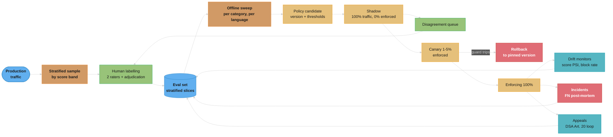
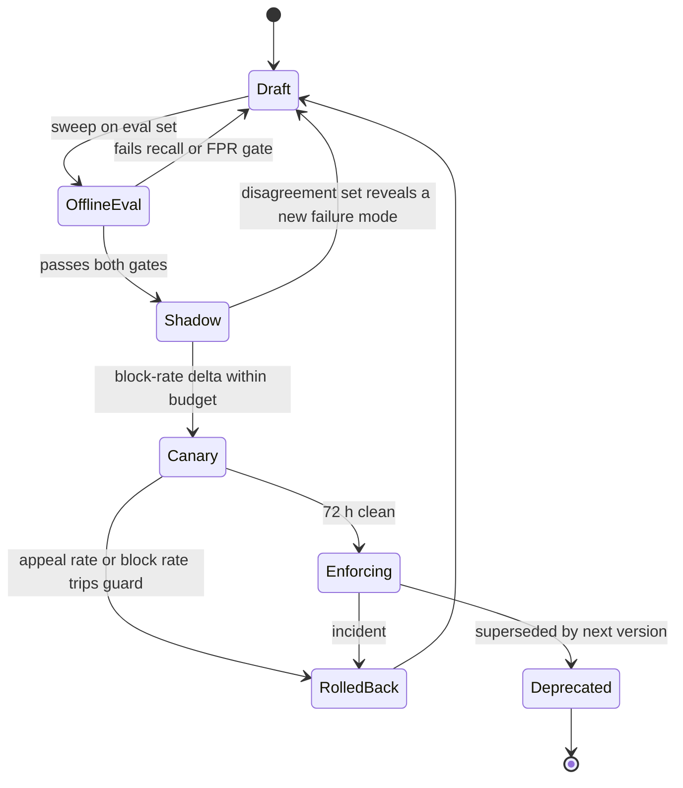
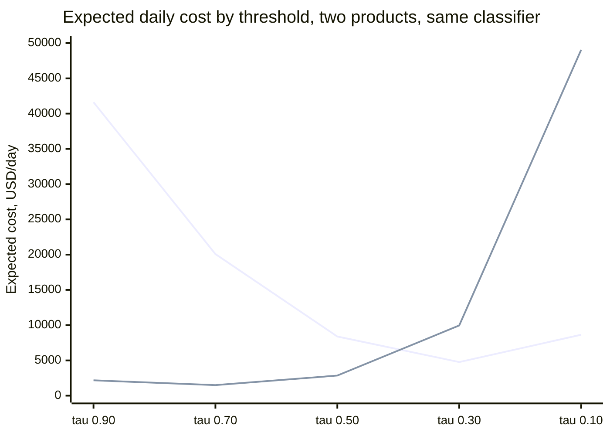

# Guardrail Evaluation & Operations — Deep Dive

---

## 1. Concept Overview

The parent module [Guardrails & Content Safety](README.md) teaches how to **build** a guardrail: where the filters sit, which classifier to pick, how the tiers stack, what a threshold does. This file covers the part that starts the day after it ships — how you **operate** one.

That distinction is not cosmetic. A guardrail is the only component in an LLM stack whose correctness is a *policy* rather than a *behaviour*: nothing crashes when it is wrong, no test fails, and both of its failure modes are silent. A false negative ships harm and produces no log line that looks like an error. A false positive blocks a real person, who mostly just leaves. There is no exception, no 500, no p99 spike — which is why guardrail regressions are typically discovered by a journalist or a support escalation rather than by a monitor.

Operating a guardrail therefore means building the machinery that makes those two silent failures loud: a labelled evaluation set you own, a rollout process that treats a threshold as a deploy artifact, a drift programme that re-benchmarks on a schedule because the attackers' language moves, an incident process for both directions of error, and an SLO that says what happens when the guardrail itself is down.

The people who own this are usually not the people who built the classifier. The model comes from a vendor or a research team; the operating point, the coverage matrix, and the appeal loop belong to whoever is accountable when the wrong answer reaches a user.

---

## 2. Intuition

> **One-line analogy**: A guardrail in production behaves less like a library and more like a legal policy enforced by a flaky network service — you version it, you stage it, you page on it, and someone has to hear the appeal.

**Mental model**: Separate the three things people call "the guardrail". There is the **classifier** (weights, owned by a vendor, changes underneath you), the **policy** (thresholds, category set, action per category, fail-open/closed rule — owned by you, deployable, versionable, rollback-able), and the **coverage** (which categories × which languages × which modalities are actually scored — a matrix, not a boolean). Almost every incident is a policy or coverage failure attributed to the classifier.

**Why it matters**: Because the feedback signal you get for free is biased in a way that has a direction. Users who are wrongly blocked sometimes complain. Users who receive harmful content never file a "you failed to block this" ticket. Tune on the inbox and you walk one way forever.

**Key insight**: The complaint stream is not a measurement of your false-positive rate — it is a *sample of the false positives that were annoying enough to report*, divided by a denominator (total blocks) that you control by moving the threshold. Loosening the filter reduces complaints by reducing blocks, which reads as success. That loop is a ratchet, and the only thing that breaks it is a labelled set with a fixed denominator that you own.

---

## 3. Core Principles

- **The labelled eval set is the deliverable, not the classifier.** You can swap models in an afternoon. Rebuilding 15,000 human-labelled production messages takes a quarter.
- **A threshold change is a deploy.** Same review, same version number, same canary, same rollback button, same audit record as a code change. `0.70 -> 0.60` typed into a console is a production change with no diff.
- **Never tune on the complaint stream.** Use it as a tripwire, never as an objective function (see §6.6).
- **Coverage is a matrix, and holes in it are silent.** An unsupported language does not return an error; it returns a low score with HTTP 200.
- **The operating point is a business decision, expressed as a cost ratio.** F1 asserts that a blocked customer and a leaked toxic response are equally bad. They almost never are.
- **Availability is part of the policy.** Fail-open and fail-closed are both defensible; not deciding is not.
- **The appeal loop is a requirement, not a courtesy.** Under the EU DSA it is a statutory obligation with a six-month window that cannot be discharged by an automated system.
- **Every block must be reconstructible months later** — policy version, model id, threshold, score, category. If you cannot replay the decision, you cannot post-mortem it and you cannot answer an appeal.

---

## 4. Types / Architectures / Strategies

### 4.1 Rollout stages for a policy change

| Stage | Enforces? | Traffic | What it measures | Typical duration |
|-------|-----------|---------|------------------|------------------|
| Offline sweep | no | 0% (eval set) | precision/recall per category and language across every threshold | minutes |
| Shadow | no | 100% | live block-rate delta and the incumbent-vs-candidate disagreement set | 3–14 days |
| Canary | yes | 1–5% | user-visible effects: appeal rate, task completion, session abandonment | 24–72 h |
| Ramp | yes | 25% → 50% → 100% | the same, at a volume where rare categories appear at all | 3–7 days |
| Enforcing | yes | 100% | steady-state SLO and drift monitors | until superseded |

Shadow answers "what would change?"; canary answers "did the change hurt anyone?". They are not substitutes: shadow sees 100% of traffic but zero user impact, canary sees user impact on 5% of traffic. Skipping shadow means your first look at the disagreement set is on live users; skipping canary means you never observe the appeal-rate response until it is at full volume.

### 4.2 Eval-set slices

The set is not one pile of messages. It is stratified, because the aggregate number hides every failure that matters.

| Slice | What it contains | Why it exists | Rough share |
|-------|------------------|---------------|-------------|
| **True positive** | genuinely violating content, per category | recall floor | 15% |
| **Benign-but-scary** | safe content that *looks* violating: "kill this process", "how do I fire someone fairly", oncology questions, security research, self-harm content in a support context | the only slice that measures the failure users experience | 35% |
| **Adversarial** | jailbreaks, encodings, character spacing, leetspeak, multi-turn escalation | measures decay against attacker adaptation | 15% |
| **Multilingual** | every slice above, natively authored per supported language | catches the silent coverage hole | 20% |
| **Multimodal** | image and document payloads, and text-in-image | most vendor features are text-first | 5% |
| **Boring negative** | ordinary in-domain traffic | the FPR denominator; must dominate by volume in the *measurement* set even if under-sampled in the labelling budget | 10% |

**The benign-but-scary slice is the one that matters**, and it is the one every team under-builds. Ordinary benign traffic is trivially classified — it contributes almost nothing to the estimate because nothing in it is near the threshold. The messages that determine your false-positive rate are the ones whose score lands in the band around `tau`. That is where the labelling budget goes: sample by score, not uniformly.

### 4.3 Sources for the set

- **Stratified production sampling** — bucket by classifier score, over-sample the band around the threshold by 20–50× relative to its traffic share, then re-weight when computing rates.
- **The appeal queue** — the highest-yield source of hard benign-but-scary examples, and simultaneously the most biased. Mine it for *candidates*; never let it set the *rate*.
- **False-negative post-mortems** — every incident contributes a regression case before any fix ships.
- **Public benchmarks as a floor, never a substitute** — ToxicChat for real user-AI traffic, HarmBench and JailbreakBench for adversarial coverage, MLCommons AILuminate for cross-language hazard coverage. They tell you the classifier is not broken; they do not tell you it works on your traffic.

---

## 5. Architecture Diagrams

### The operating loop



Every arrow back into the eval set is a source of new labels; the set is the only node that accumulates. A team without the three return edges at the bottom right has a launch process, not an operating loop.

### Policy version lifecycle



The state a version is in is a property you store and log with every decision, not a wiki page. `RolledBack` is a real state: the previous version must still be loadable, which means policies are immutable artifacts and "editing the threshold" creates a new one.

### Expected cost picks a different threshold than F1



Both lines use the identical confusion matrices from the parent module's threshold sweep. The falling-then-rising line is a consumer assistant where a leaked harmful response costs 50× a wrongly blocked user; its minimum is at `tau = 0.30`. The rising line is an internal engineering tool where a blocked employee costs 2.5× a bad answer; its minimum is at `tau = 0.70`. F1 is maximised at `tau = 0.50` for both — a threshold that is optimal for neither product. Arithmetic in §6.3.

### The coverage matrix is where the silent holes live

```
  policy coverage — what is ACTUALLY scored, not what is configured

  category              en      es    pt-br     hi      ar     image   audio
  --------------------  ----   ----   ----     ----    ----    -----   -----
  hate / harassment      ok     ok     ok       ok      ok       ok     none
  violence               ok     ok     ok       ok      ok       ok     none
  self-harm              ok     ok     ok       ok      ok       ok     none
  sexual / minors        ok     ok     ok       ok      ok       ok     none
  prompt injection       ok     ok     ok       ok    weak      none    none
  groundedness           ok    none   none     none    none     none    none
  protected material     ok    none   none     none    none     none    none
  custom category        ok    none   none     none    none     none    none
  PII / secrets          ok     ok     ok      weak    weak      none    none

  every "none" above returns HTTP 200 with a low score.
  no error is raised, no exception is thrown, no dashboard turns red.
  the only observable signal is per-language block rate:

      en    block rate 0.91%      <- baseline
      es    block rate 0.84%      <- plausible
      pt-br block rate 0.79%      <- plausible
      hi    block rate 0.11%      <- 8x below baseline: investigate
      ar    block rate 0.02%      <- 45x below baseline: the filter is dead
```

The three English-only rows are not hypothetical — Azure AI Content Safety documents that its protected-material, groundedness, and custom-categories (standard) models work with English only, while its text and image moderation models are trained and tested on eight languages. One vendor, one product, non-uniform coverage. Build this table per vendor before you design around a feature, and monitor per-language block rate forever, because it is the only alarm a coverage hole will ever ring.

---

## 6. How It Works — Detailed Mechanics

### 6.1 How large does the eval set have to be?

This is the question that kills most guardrail eval plans, and it has an exact answer.

```
  target: verify a false-positive rate below 0.1% on benign traffic.

  Rule of three (Hanley & Lippman-Hand, JAMA 1983): if an event does not occur
  in n independent trials, the 95% upper confidence bound on its rate is 3/n.

      n =   500 benign labelled  ->  upper bound 3/500   = 0.60%   (6x the target)
      n = 3,000 benign labelled  ->  upper bound 3/3000  = 0.10%   (just reaches it,
                                     and ONLY if you observed zero false positives)

  To ESTIMATE a rate near p = 0.001 rather than merely bound it, with a 95%
  confidence interval half-width of w = 0.0005 (i.e. "0.10% +/- 0.05%"):

      n = 1.96^2 * p(1-p) / w^2
        = 3.8416 * 0.000999 / 0.00000025
        = 15,351 benign labelled examples
```

Two consequences. First, the widely-repeated "label 500 messages" advice cannot verify a sub-0.1% target — at n=500 the honest statement is "FPR is somewhere below 0.6%", which is six times the goal. Second, you do not need 15,000 labels *per release*: the boring-negative bulk is labelled once and reused, and only the near-threshold band is re-labelled as the classifier moves. Budget the labelling where the scores are, not uniformly.

### 6.2 Stratified sampling from production

```python
from dataclasses import dataclass

# Score bands and how hard to over-sample each, relative to its traffic share.
# The band straddling the live threshold (0.70) gets the labelling budget:
# messages far from tau contribute almost nothing to the FPR estimate.
BANDS: list[tuple[float, float, int]] = [
    (0.00, 0.30,   1),   # bulk benign — 1x, this is the FPR denominator
    (0.30, 0.55,  10),
    (0.55, 0.65,  30),
    (0.65, 0.75,  50),   # the decision band around tau = 0.70
    (0.75, 0.85,  30),
    (0.85, 1.00,   5),
]

@dataclass(frozen=True)
class Sampled:
    text_ref: str
    score: float
    language: str
    weight: float        # inverse sampling probability — REQUIRED to un-bias rates

def draw(day_events, per_band: int = 400) -> list[Sampled]:
    out = []
    for lo, hi, boost in BANDS:
        pool = [e for e in day_events if lo <= e.score < hi]
        if not pool:
            continue
        take = min(len(pool), per_band * boost // 10)
        picked = random.sample(pool, take)
        w = len(pool) / take          # each pick stands for this many real messages
        out += [Sampled(e.text_ref, e.score, e.language, w) for e in picked]
    return out

def weighted_fpr(labelled: list[tuple[Sampled, bool]]) -> float:
    """bool = 'was actually benign'. Weights convert the biased sample back."""
    fp = sum(s.weight for s, benign in labelled if benign and s.score >= TAU)
    tn = sum(s.weight for s, benign in labelled if benign and s.score <  TAU)
    return fp / (fp + tn)
```

The `weight` field is the part teams drop. Without it the reported FPR is the FPR *of the sample*, which by construction is 20–50× too high because you deliberately over-sampled the hard band. Reporting that number leads directly to loosening a threshold that was fine.

Stratify a second time by language and a third by surface (chat, voice transcript, document upload, agent tool output). A single global FPR is an average over populations with wildly different rates and hides every one of them.

### 6.3 The operating point as a business decision

Take the parent module's threshold sweep verbatim — 10,000 messages/day, 200 genuinely toxic, 9,800 benign — and stop optimising F1. Ask finance for two numbers: the fully-loaded cost of one wrongly blocked user (`C_fp`: support contact, churn probability, brand friction) and the expected cost of one harmful response reaching a user (`C_fn`: incident response, regulatory exposure, press). Then minimise `C_fp*FP + C_fn*FN`.

```
   tau    TP    FN    FP     F1     consumer assistant     internal dev tool
                                    Cfp $8  Cfn $400       Cfp $50  Cfn $20
  ----   ---   ---   ---   -----   -------------------    ------------------
  0.90    96   104     2   0.644     $41,616                  $2,180
  0.70   150    50    10   0.833     $20,080                  $1,500  <- min
  0.50   180    20    49   0.839     $ 8,392                  $2,850
  0.30   192     8   196   0.653     $ 4,768  <- min          $9,960
  0.10   198     2   980   0.287     $ 8,640                 $49,040

  F1-optimal threshold:  0.50   (for both products — F1 cannot see the costs)
  cost-optimal:          0.30 for the consumer product, 0.70 for the dev tool

  worked cell, consumer at tau=0.30:  8*196 + 400*8 = 1,568 + 3,200 = $4,768
  worked cell, dev tool at tau=0.30:  50*196 + 20*8 = 9,800 +   160 = $9,960
```

Same model, same day of traffic, same confusion matrices. The cost ratio `C_fn/C_fp` is 50 for one product and 0.4 for the other, and it moves the shipped threshold by more than two full grid steps in opposite directions. F1 is optimal for neither. Report F1 only as a sanity check that the classifier has signal at all.

Now run the third profile — a children's product where `C_fn = $20,000` and `C_fp = $8`, a ratio of 2,500:1. Expected cost keeps falling all the way to `tau = 0.10` ($47,840) and the table gives no minimum. **That is the answer, not a missing row.** When the optimum runs off the end of the sweep, the classifier alone cannot express the policy: at `tau = 0.10` you are blocking 980 innocent people a day to catch the last two attacks. The correct move is architectural — add a second stage (human review queue, escalation, a stricter model in series) rather than continuing to lower a number.

### 6.4 Shadow mode, described properly

The parent module names shadow mode four times and never says what it is. It is this: **run the candidate policy on 100% of live traffic, record both verdicts on every request, and let only the incumbent affect the response.** The output is not a pass/fail — it is the *disagreement set*, which becomes the next labelling batch.

```python
# BROKEN: "shadow mode" as most teams first write it
async def moderate(text: str) -> bool:
    allowed = await incumbent.score(text) < 0.70
    cand = await candidate.score(text)               # BUG 3: serial — doubles latency
    if cand >= 0.50:
        log.info("shadow_would_block", text=text)    # BUG 1: only would-BLOCK logged
    return allowed                                   # BUG 2: no version recorded
```

Three defects, and the first is fatal. Logging only what the candidate *would block* makes candidate false negatives invisible: a message the incumbent blocked and the candidate allowed writes no line at all, so the one direction you most need to see — new harm getting through — is precisely the direction this design cannot observe. You can measure the candidate's block rate and nothing else. Bug 2 means you cannot reconstruct which policy produced a decision a month later, and bug 3 makes shadow mode a latency regression, which is how it gets switched off.

```python
import asyncio, hashlib
from dataclasses import dataclass

@dataclass(frozen=True)
class PolicyVersion:
    id: str                       # "toxicity-v7"
    model: str                    # "llama-guard-4-12b"
    thresholds: dict[str, float]  # per category — never one global number
    on_unavailable: str           # "block" | "allow" — explicit, per §6.8

async def moderate(req_id: str, text: str, live: PolicyVersion,
                   shadow: PolicyVersion | None) -> bool:
    tasks = [asyncio.create_task(score(live, text))]
    if shadow:
        tasks.append(asyncio.create_task(score(shadow, text)))
    results = await asyncio.gather(*tasks, return_exceptions=True)  # parallel

    live_r = results[0]
    live_block = decide(live, live_r)
    ev = {
        "request_id": req_id,
        "text_sha256": hashlib.sha256(text.encode()).hexdigest(),  # join key
        "text_ref": vault.put(text),        # encrypted, access-logged, TTL 6 months
        "language": detect(text),
        "live_policy": live.id, "live_scores": live_r.scores, "live_block": live_block,
    }
    if shadow:
        sh = results[1]
        sh_block = decide(shadow, sh)
        ev |= {"shadow_policy": shadow.id, "shadow_scores": sh.scores,
               "shadow_block": sh_block,
               # BOTH directions, on EVERY request — this is the whole point
               "disagree": "none" if sh_block == live_block
                           else ("new_block" if sh_block else "new_allow")}
    emit(ev)
    return live_block                        # shadow never touches the return value
```

Read the shadow results as three numbers, not one:

```
  7 days of shadow, 70,000 requests, toxicity-v6 (tau 0.70) vs toxicity-v7 (tau 0.55)

    new_block   412 requests   v7 blocks, v6 allowed   -> sample 200, label them
    new_allow    38 requests   v7 allows, v6 blocked   -> label ALL 38, no exceptions
    agree     69,550 requests

  block-rate delta:  +0.53 pp  (0.14% -> 0.67%).  Budget was +0.40 pp -> over.
  of the 200 labelled new_blocks:  71 truly violating, 129 benign  -> 64.5% of the
    new blocking is false positive.  Projected added FPR: 412*0.645/69,000 = 0.39%.
  of the 38 new_allows:  2 truly violating -> two NEW false negatives per week.
```

`new_allow` is always labelled exhaustively even though it is the smaller set — each item is a candidate regression, and 38 items is an hour of work. That asymmetry in labelling effort is deliberate and mirrors the asymmetry in cost.

### 6.5 Canary and rollback criteria, written before the canary starts

Rollback criteria decided during an incident are negotiated, not enforced. Write them into the deploy manifest.

```yaml
policy: toxicity-v7
baseline: toxicity-v6
canary:
  traffic_pct: 5
  min_duration: 24h
  min_blocks: 200          # statistical floor: below this, block rate is noise
  auto_rollback_if:
    - metric: block_rate_delta_pp
      over: 0.40           # from the shadow measurement, not invented here
      window: 1h
    - metric: block_rate_delta_pp
      per_category: true   # a global number hides a single category going wild
      over: 0.15
      window: 1h
    - metric: appeal_rate_per_1k_blocks
      over: 45             # baseline 28
      window: 6h
    - metric: p99_latency_ms
      over: 250
      window: 15m
    - metric: guardrail_unavailable_rate
      over: 0.005
      window: 15m
  hold_if:                 # pause the ramp, do not roll back — needs a human
    - metric: session_abandonment_rate_delta_pp
      over: 0.30
```

Two details that matter more than the numbers. **`min_blocks: 200`** stops the most common canary mistake: declaring success after two hours at 5% traffic, when the canary has seen eleven blocks and the confidence interval on its block rate spans an order of magnitude. **`per_category: true`** exists because a global block-rate delta inside budget can hide self-harm detection collapsing to zero while hate-speech blocking triples; the two cancel in the aggregate.

### 6.6 The complaint-stream ratchet — broken, then fixed

```python
# BROKEN: the complaint ratchet. Runs weekly. Walks one direction forever.
def weekly_retune(threshold: float) -> float:
    fp_proxy = complaints_this_week / blocks_this_week
    if fp_proxy > 0.02:
        return threshold + 0.05      # loosen
    return threshold - 0.02          # "no complaints — we have headroom"
```

The bug is structural, not numerical. The numerator counts only wrongly-blocked users who bothered to complain (realistically a single-digit percentage of them); the denominator is a quantity you control by moving the very knob you are tuning. Loosening reduces complaints *by reducing blocks*, which the loop reads as improvement. And tightening produces no counter-signal at all, because a false negative never files a ticket — so on every quiet week the `else` branch fires and the threshold ratchets down. Over a year of quiet weeks the filter drifts 1.0 in the tightening direction with no measurement having ever objected.

```python
# FIXED: measure against a fixed labelled denominator; complaints become an alarm.
def weekly_review(policy: PolicyVersion) -> Proposal | None:
    m = evaluate(policy, EVAL_SET)     # 15k+ labelled, weighted, per language

    # Hard gates from the product's risk profile — both must hold to ship.
    if m.recall_by_category["self_harm"] < 0.95:  return None
    if m.weighted_fpr > 0.0010:                   return None

    # Objective is expected cost (§6.3), not F1, not the complaint ratio.
    best = min(candidate_thresholds(),
               key=lambda t: C_FP * m.fp_at(t) + C_FN * m.fn_at(t))
    if abs(best - policy.thresholds["toxicity"]) < 0.02:
        return None                    # below the noise floor: do not churn

    return Proposal(new_threshold=best, evidence=m, requires=["shadow", "canary"])

# The complaint stream keeps exactly one job: paging when something breaks.
alert(name="fp_tripwire",
      expr="complaints_per_1k_blocks > 2.5 * baseline_7d",
      note="a page, never an input to the threshold")
```

The complaint ratio is a good *tripwire* — it is cheap, it is real, and a 3× spike genuinely means something broke. It is a terrible *objective*, for the reason above. Keep it, demote it.

### 6.7 Drift: the classifier ages even when you do not touch it

Three independent things move under a deployed guardrail.

**The attackers move.** This is the fast one. The canonical demonstrations are old and still instructive: Hosseini et al. (arXiv 1702.08138, 2017) reduced Perspective API toxicity scores to non-toxic levels by inserting dots between letters, doubling a letter, or spacing out words — no model access required. Eight years later Robust Intelligence found the same class of defect in Meta's Prompt-Guard-86M: inserting a space between every English alphabet character caused the injection classifier to score the prompt as benign, reported at a 99.8% bypass rate. Meta acknowledged it and shipped Prompt Guard 2 with a training-time fix. A filter that is not re-benchmarked against fresh attack corpora decays on a timescale of weeks, and character-level perturbation is still the first thing anyone tries.

**The vendor moves.** OpenAI's moderation documentation states it plainly: "We plan to continuously upgrade the moderation endpoint's underlying model. Therefore, custom policies that rely on `category_scores` may need recalibration over time." Your threshold is calibrated against a score distribution the vendor is free to change without a version bump. Pin a dated golden set and re-run it weekly against the live endpoint — a shift in the *score distribution on unchanged inputs* is the signal.

**Your users move.** New feature, new market, new season, new demographic. The traffic mix changes, the base rate changes, and a threshold tuned on last quarter's distribution is now operating somewhere else on the curve.

```python
def psi(expected: list[float], actual: list[float], bins: int = 10) -> float:
    """Population Stability Index over the score distribution.

    Credit-risk convention, widely reused in ML monitoring:
        < 0.10  no meaningful shift
      0.10-0.25 moderate shift — investigate
        > 0.25  significant shift — re-benchmark before trusting the threshold
    """
    edges = [i / bins for i in range(bins + 1)]
    out = 0.0
    for lo, hi in zip(edges, edges[1:]):
        e = max(sum(lo <= s < hi for s in expected) / len(expected), 1e-4)
        a = max(sum(lo <= s < hi for s in actual)   / len(actual),   1e-4)
        out += (a - e) * math.log(a / e)
    return out
```

The scheduled programme that follows from this:

```
  daily     per-language and per-category block rate vs 28-day baseline
            score-distribution PSI on a fixed golden set (alert at 0.10)
            guardrail availability and p99, against the SLO
  weekly    label the shadow disagreement set; label 200 fresh near-threshold samples
            re-run the dated golden set against the live vendor endpoint
  monthly   full eval-set re-run for every category and language; publish the sweep
  quarterly refresh the adversarial slice from current public corpora; external red team
  annually  rebuild the benign-but-scary slice from the last 12 months of appeals
```

And the trap this programme exists to catch: **your vendor's benchmark score does not transfer to your traffic.** When ToxicChat was built from real user queries to an open chatbot (10,166 conversations, 7.18% labelled toxic, 1.78% jailbreak attempts), the OpenAI Moderation API of the time scored 84.3% precision but **11.7% recall** on it — F1 20.6, and 10.5 F1 on the jailbreak subset. That is a vendor classifier performing respectably on the distribution it was built for and catching roughly one violation in nine on real conversational traffic. The endpoint has been replaced since (the current model is `omni-moderation-latest`), so treat those figures as a 2023 measurement of a retired model — but treat the *lesson* as permanent, because it is the reason your own labelled set exists.

### 6.8 The guardrail is a dependency: SLOs and the availability arithmetic

A synchronous fail-closed guardrail is in the serial availability path of your product, and serial dependencies multiply.

```
  LLM provider          99.9%  ->  43.2 min/month of budget
  guardrail service     99.9%  ->  43.2 min/month

  serial, fail-CLOSED   0.999 * 0.999 = 99.80%  ->  86.4 min/month
  -> adding one fail-closed guardrail HALVES the product's availability budget.

  serial, fail-OPEN     99.9% (guardrail outage degrades safety, not availability)
  -> you keep the budget and spend it in unchecked responses instead.

  published commitments (verify per region and tier before quoting either):
    Amazon Bedrock         99.9% monthly uptime; 10% credit below 99.9%,
                           25% below 99.0%, 100% below 95.0%
    Azure AI Content Safety 99.9% availability SLA
```

The latency SLO is the other half. If the product's end-to-end p99 budget is 3,000 ms and the LLM's p99 is 2,400 ms, a **serial** output guardrail gets 600 ms — which excludes any LLM-as-judge check. Run it in **parallel** and the constraint changes shape: the guardrail is free only while its p99 stays under the LLM's p50, because past that it starts landing on the critical path for the fast half of requests. Write the budget down as a number, alert on it, and make exceeding it a rollback criterion (as in §6.5), because a guardrail that is slow gets disabled by whoever is on call at 3 a.m.

```
  guardrail SLO, stated as an SLO and not as a hope:

    availability     99.9% of moderation calls return a verdict within timeout
    latency          p50 < 60 ms, p99 < 200 ms, timeout 250 ms
    correctness      recall(self_harm) >= 0.95 and weighted FPR <= 0.10%,
                     both measured monthly on the eval set, both page on breach
    unavailability   emit guardrail_unavailable, NEVER folded into guardrail_passed
```

That last line is the parent module's pitfall 6 turned into a monitoring requirement. A guardrail that never ran and a guardrail that found nothing are indistinguishable unless you separate the counters, which is how a six-hour fail-open goes unnoticed.

### 6.9 The false-negative post-mortem

Harm reached a user. Before anyone touches a threshold, classify *why*, because five of the six causes are not threshold problems:

| Cause | Signature | Fix |
|-------|-----------|-----|
| Score below threshold | verdict logged, score 0.61 vs tau 0.70 | threshold or model — the only case where tuning is the answer |
| Category not in policy | no category matched; content genuinely novel | policy change: add the category, then eval the whole set again |
| Language not covered | request language outside the coverage matrix | vendor swap or second classifier; check §5's per-language block rates |
| Modality not covered | harm was in an image or an uploaded PDF | pipeline gap, not a tuning gap |
| Guardrail unavailable | `guardrail_unavailable` counter fired, fail-open | availability work, plus revisit the fail-open decision |
| Guardrail never invoked | no guardrail event for the request id at all | routing bug — a new code path skipped the middleware |

The last row is the one that catches teams out. A new streaming endpoint, a new agent tool, a batch job, an internal admin surface: each is a code path that can silently bypass moderation, and the only way to find it is to assert that *every* completion has a corresponding guardrail event. Reconcile the two counts daily; the delta should be zero.

The process, in order:

1. **Contain** — take the specific content down, then decide whether to tighten globally. Tightening first, mid-incident, with no eval run, is how one incident becomes two.
2. **Reproduce** against the pinned policy version from the log. If you cannot, your logging is the first defect to fix.
3. **Classify** using the table above.
4. **Add the regression case to the eval set before writing any fix.** The fix is accepted only when the new case flips *and* the benign-but-scary slice does not regress.
5. **Ship through the normal path** — shadow, canary, ramp. An incident is a reason to move fast, not a reason to skip the process that stops you causing a false-positive incident on the way out.
6. **Search for siblings.** One false negative in a category almost always has neighbours; re-run the whole category's slice and mine production for near-misses in the same score band.

### 6.10 The appeal and reinstatement loop

For EU users this is statutory, not optional. Under the Digital Services Act, Article 17 requires a clear and specific **statement of reasons** for every removal or restriction — including the contractual ground relied on and information about the redress routes available. Article 20 requires an **internal complaint-handling system** that is electronic, free of charge, open **for at least six months** after the decision, handled in a timely, diligent and objective manner, and — the clause with real engineering consequences — decided **under the supervision of appropriately qualified staff and not solely on the basis of automated means**. Article 21 adds out-of-court dispute settlement on top.

Three things fall out of that for the system design:

- **Retention is a schema requirement.** Six months of appealability means six months of decision records rich enough to reconstruct the call: policy version, model id, threshold, per-category scores, the matched rule, and a reference to the content itself. Storing "blocked: toxicity" is not enough to answer an appeal, and the content reference must live in an encrypted, access-logged vault rather than in the application log.
- **A human must be in the loop.** An auto-reinstate path can exist, but it cannot be the only path, and the review queue needs staffing, SLAs, and a decision audit trail.
- **The appeal queue is your best label mine and your worst metric.** Every overturned block is a hard, human-adjudicated benign-but-scary example — exactly the slice §4.2 says is undersupplied. Feed them all into the eval set. But never report appeal rate as your false-positive rate: appeal rate is `FP_reported / blocks`, and the reporting fraction is unknown and varies by user segment, language, and how visible you make the appeal button. Making appeals *easier* raises the number while improving the product.

```
  useful appeal-loop metrics, none of which is the FPR:

    appeal rate            appeals / 1,000 blocks           tripwire, per category
    overturn rate          reinstated / appeals reviewed    quality of the policy
    time to first review   p50 and p95                      the DSA "timely" clause
    reinstatement latency  block -> content restored        the user-visible harm
    label yield            overturns fed into the eval set  the loop actually closing
```

A rising **overturn rate** is the strongest single signal that a threshold is too tight — it is human-adjudicated, it is per-category, and unlike the complaint ratio it is not gamed by moving the threshold, because reinstating more blocks does not reduce how many were wrong.

---

## 7. Real-World Examples

**AWS Bedrock Guardrails — policy versioning built into the product.** A guardrail has a `DRAFT` working version you iterate on, and `CreateGuardrailVersion` takes an immutable snapshot; applications invoke a specific numbered version. That is exactly the "a threshold change is a deploy artifact" principle, enforced by the API rather than by discipline. Amazon Bedrock itself carries a 99.9% monthly uptime SLA with tiered service credits (10% below 99.9%, 25% below 99.0%, 100% below 95.0%), which is the number that goes into the serial-availability arithmetic of §6.8.

**Azure AI Content Safety — the coverage matrix, documented.** Microsoft publishes a 99.9% availability SLA and, more usefully for this file, states that the protected-material, groundedness-detection, and custom-categories (standard) models work with **English only**, while the other models are trained and tested on Chinese, English, French, German, Spanish, Italian, Japanese and Portuguese. It also publishes hard input limits (10K characters for text analysis and Prompt Shields, up to five documents totalling 10K characters, 55,000 characters of grounding sources, 110-character minimum for protected-material scanning) and per-region feature availability. Every one of those is a row in your coverage matrix.

**OpenAI Moderation — the vendor telling you it will drift.** The documentation says the endpoint's underlying model will be continuously upgraded and that "custom policies that rely on `category_scores` may need recalibration over time", and advises treating scores as signals for your policy rather than as an automatic blocking decision. This is a vendor committing to move the distribution your threshold is calibrated against.

**ToxicChat — why a vendor benchmark is not your benchmark.** 10,166 real user queries from an open chatbot deployment, 7.18% labelled toxic and 1.78% jailbreak attempts. The paper's point is a domain gap: models trained on social-media toxicity corpora underperform badly on user-AI conversation. The OpenAI Moderation endpoint of the time reached 84.3% precision but 11.7% recall (F1 20.6) on it. The endpoint has since been replaced, so the numbers date the model, not the lesson.

**Meta Prompt-Guard-86M — adversarial drift in the wild.** Robust Intelligence showed the classifier could be bypassed by inserting a space between every alphabetic character, reported at a 99.8% success rate; the root cause was that single-character tokens barely moved during fine-tuning from the mDeBERTa base. Meta acknowledged the report and Prompt Guard 2 addresses it with a modified training objective, reaching 97.5% jailbreak recall at 1% FPR on the 86M model. The operational lesson is the schedule, not the specific attack: a guardrail is a security control and needs the re-benchmarking cadence of one.

**MLCommons AILuminate — multilingual coverage as a benchmark.** The v1.0 safety benchmark covers twelve hazard categories with over 24,000 prompts per language (12,000 public practice, 12,000 private), and prompts are authored for cultural relevance and validated by native speakers rather than machine-translated from English. v1.1 added French, with Chinese and Hindi announced. If your product is multilingual, this is the shape your own multilingual slice should take — natively authored per language, not translated.

**The EU Digital Services Act — the appeal loop as law.** Article 17 mandates statements of reasons including redress information; Article 20 mandates a free, electronic internal complaint-handling system open for at least six months, with decisions supervised by qualified staff and not taken solely by automated means; Article 21 adds out-of-court dispute settlement.

---

## 8. Tradeoffs

| Decision | Option A | Option B | Choose A when |
|----------|----------|----------|---------------|
| Rollout | shadow then canary | straight to canary | always A unless the change is a pure rollback to a previously enforced version |
| Availability | fail closed | fail open + page | harm is unacceptable at any rate (children, clinical, financial advice) |
| Labelling | in-house annotators | vendor BPO | the policy is domain-specific or the content is regulated (PHI, PCI) |
| Labelling | human | LLM-as-judge | for the gold set, always human; use LLM-judge only to pre-filter candidates and to expand the adversarial slice |
| Thresholds | per category | one global | always per category — a global number cannot express that self-harm needs 0.95 recall and profanity does not |
| Drift response | retrain the classifier | re-tune the threshold | the score distribution shifted (PSI > 0.25) but ranking quality held |
| Eval refresh | continuous trickle | quarterly batch | continuous, if you can staff it; a stale set silently blesses a decayed filter |
| Appeals | human review queue | auto-reinstate on retry | human review, wherever the DSA applies — automated-only decisions are non-compliant |

| Metric | What it is good for | Why it must not be the objective |
|--------|--------------------|----------------------------------|
| F1 | sanity check that the classifier has signal | weights a blocked customer and a leaked harmful response equally |
| AUC | comparing two candidate classifiers | integrates over thresholds you would never ship |
| complaints / blocks | cheap tripwire, pages on regressions | biased numerator, self-controlled denominator (§6.6) |
| appeal rate | per-category tripwire | improves when you hide the appeal button |
| overturn rate | strongest tightness signal available | still only covers blocks someone contested |
| expected cost | shipping the operating point | requires two numbers from finance that nobody wants to own |

---

## 9. When to Use / When NOT to Use

**Run the full programme when:**
- The product is consumer-facing at any meaningful volume — the FPR denominator is large enough that a 0.1% miscalibration is thousands of real people.
- You serve EU users at online-platform scale (DSA appeal and statement-of-reasons obligations attach).
- The domain is regulated: healthcare, financial advice, minors, elections.
- You are multilingual or multimodal, where silent coverage holes are the dominant failure mode.
- The guardrail is a synchronous dependency of a revenue path, which makes its availability your availability.

**A lighter version is proportionate when:**
- Internal tooling with trusted, identifiable users — keep the eval set and the coverage matrix, drop the canary and the appeal queue (an internal user can just Slack you).
- Batch pipelines with human review downstream — the human *is* the second stage, so tune for recall and let precision go.
- Pre-launch prototypes with fewer than a few thousand requests a day — at that volume you cannot measure a 0.1% FPR anyway (§6.1), so use a public benchmark as a floor and start the sampling pipeline now so the set exists when you need it.

**Never skip, at any size:** an explicit fail-open/fail-closed decision, a `guardrail_unavailable` counter distinct from `guardrail_passed`, and decision logs rich enough to reproduce a block. All three are cheap on day one and expensive to retrofit during an incident.

---

## 10. Common Pitfalls

1. **Tuning on the complaint stream.** The ratchet in §6.6. Silence is read as headroom, the threshold walks one direction, and nothing in the loop can object. Measure against a fixed labelled denominator; keep complaints as a page.
2. **A 500-example eval set for a 0.1% FPR target.** The rule of three caps what 500 samples can prove at 0.6%. The set is not "small but indicative"; it is arithmetically incapable of answering the question being asked of it.
3. **Reporting the sample FPR without re-weighting.** You deliberately over-sampled the hard band by 20–50×, so the unweighted rate is 20–50× too high, and the fix someone proposes is to loosen a threshold that was fine.
4. **A single global block rate.** It averages over languages, categories and surfaces with wildly different rates. A self-harm classifier failing to zero and a hate classifier tripling cancel out perfectly in the aggregate.
5. **Shadow mode that only logs would-blocks.** Structurally blind to new false negatives, which is the direction you actually needed shadow mode for (§6.4).
6. **Declaring a canary healthy on eleven blocks.** At 5% traffic for two hours, the confidence interval on the canary block rate spans an order of magnitude. Gate on `min_blocks`, not on elapsed time.
7. **Assuming a vendor's language list is uniform across its features.** Azure documents three English-only models sitting inside a product whose other models cover eight languages. The unsupported path returns HTTP 200 with a low score — no error, no alert, just a filter that is quietly off.
8. **No `guardrail_unavailable` counter.** A guardrail that never ran and a guardrail that passed are the same log line. This is how a multi-hour fail-open ships zero-signal.
9. **Discovering during an appeal that you did not log the policy version.** You cannot reconstruct which threshold produced a block, cannot answer under DSA Article 17, and cannot post-mortem the decision.
10. **Tightening globally during a false-negative incident, before any eval run.** It converts one incident into two, and the second one — a false-positive spike across every category — is usually larger and lasts longer because nobody is looking for it.
11. **A new code path that skips the middleware.** Streaming endpoints, agent tool outputs, batch jobs and admin surfaces each bypass moderation silently. Reconcile completion count against guardrail-event count daily; the delta should be zero.
12. **Treating a public benchmark score as production readiness.** The classifier that looks fine on its own eval can catch roughly one violation in nine on real conversational traffic (§6.7). A public benchmark is a floor, not evidence.

---

## 11. Technologies & Tools

| Tool | Purpose | Notes |
|------|---------|-------|
| **AWS Bedrock Guardrails** | Versioned policy artifacts | `DRAFT` working version plus immutable numbered versions via `CreateGuardrailVersion`; `ApplyGuardrail` calls it standalone without invoking a model |
| **Azure AI Content Safety** | Managed moderation + published coverage | 99.9% SLA; Content Safety Studio surfaces block rate, category distribution, latency and language proportions; protected material, groundedness and custom categories (standard) are English-only |
| **Google Cloud Model Armor** | Org-wide policy enforcement | Templates plus floor settings enforcing a minimum policy across every project — the org-level enforcement primitive the other two leave to you |
| **OpenAI Moderation API** | Baseline classifier | Free; `omni-moderation-latest`; documentation explicitly warns that `category_scores` policies may need recalibration as the model is upgraded |
| **Llama Guard 4 12B** | Self-hosted safety classifier | Multimodal, single 24GB GPU; supports English plus French, German, Hindi, Italian, Portuguese, Spanish and Thai — pin the version so drift is yours to schedule |
| **Llama Prompt Guard 2** | Injection / jailbreak detection | 86M (mDeBERTa-base) and 22M (DeBERTa-xsmall); 97.5% jailbreak recall at 1% FPR on the 86M; the 22M has no multilingual pretraining and a wider gap on non-English |
| **ToxicChat** | Real user-AI eval corpus | 10,166 queries, 7.18% toxic, 1.78% jailbreak; the reference dataset for the social-media-to-chatbot domain gap |
| **HarmBench** | Automated red-team framework | 510 unique harmful behaviours across standard, contextual, copyright and multimodal categories, with automated judging |
| **JailbreakBench** | Jailbreak robustness benchmark | 100 policy-violating behaviours, a continuously updated adversarial-prompt repository, and a leaderboard |
| **MLCommons AILuminate** | Cross-language hazard benchmark | 12 hazard categories, 24,000+ prompts per language (half public practice, half private); natively authored and native-speaker validated per language |
| **Argilla / Label Studio** | Annotation and adjudication | Two-rater workflows, inter-annotator agreement, and adjudication queues for the disagreement set |
| **Langfuse / Arize Phoenix** | Decision logging and analysis | Trace-level storage of scores, policy version and verdict; the substrate for per-language block-rate monitoring |
| **scikit-learn** | Threshold sweeps | `precision_recall_curve` and `roc_curve` for the per-category sweep in §6.3 |

---

## 12. Interview Questions with Answers

**Q: Why is the user complaint rate a bad way to tune a guardrail threshold?**
**Short:** Its numerator counts only wrongly-blocked users who complained and its denominator is the block count you control, so tightening produces no counter-signal and the threshold ratchets one way forever.
A: Because the loop has no restoring force. Complaints over blocks is not the false-positive rate: the numerator captures only the fraction of wrongly-blocked users who bothered to report, typically single-digit percent, and the denominator is total blocks, a quantity you change every time you move the threshold. Loosening reduces complaints by reducing blocks, which the loop reads as improvement. Tightening produces no signal at all, because a false negative never files a ticket — so every quiet week reinforces tightening and the threshold walks in one direction indefinitely. Fix it by measuring against a fixed labelled benign set with a known denominator and re-weighting for stratified sampling, and demote the complaint ratio to a tripwire alert that pages on a 3x spike.

**Q: How many labelled examples do you need to verify a 0.1% false-positive rate?**
**Short:** About 3,000 benign examples merely to bound it at 0.1% with zero observed errors, and roughly 15,000 to estimate it with a plus-or-minus 0.05% confidence interval.
A: Two different questions with two different answers. To *bound* it, use the rule of three (Hanley and Lippman-Hand, 1983): with zero false positives in n trials, the 95% upper bound on the rate is 3/n, so n=3,000 is the minimum to claim below 0.1% — and only if you saw literally zero. To *estimate* it near p=0.001 with a 95% CI half-width of 0.0005, you need n = 1.96^2 * p(1-p)/w^2 ≈ 15,400 benign labelled examples. This is why the common "label 500 messages" advice fails: at n=500 the honest claim is "below 0.6%", six times the target. The practical resolution is that the bulk boring-negative labels are collected once and reused, and only the near-threshold band is re-labelled per release.

**Q: What exactly is shadow mode for a guardrail, and what does a correct implementation log?**
**Short:** Run the candidate policy on all live traffic while only the incumbent affects responses, and log both verdicts on every request so disagreements in both directions are visible.
A: Shadow mode runs the candidate policy against 100% of production traffic in parallel with the incumbent, records both verdicts and both score vectors on every single request, and lets only the incumbent affect what the user sees. The output is the disagreement set, which splits into `new_block` (candidate blocks, incumbent allowed) and `new_allow` (candidate allows, incumbent blocked). The near-universal implementation bug is logging only what the candidate would block — that makes candidate false negatives structurally invisible, which is the direction you most needed to see. Also log the policy version on every event and run the candidate call concurrently rather than serially, or shadow mode becomes a latency regression and someone turns it off. Sample and label the `new_block` set; label the `new_allow` set exhaustively, since it is usually small and every item is a potential regression.

**Q: Your guardrail is a synchronous fail-closed dependency. What does that do to your availability SLO?**
**Short:** Serial dependencies multiply, so a 99.9% guardrail in front of a 99.9% model gives 99.8% composite — the error budget halves from about 43 to 86 minutes per month.
A: It halves your error budget. Serial availability multiplies: 0.999 x 0.999 = 0.998, so a 99.9% LLM behind a 99.9% fail-closed guardrail yields 99.8% composite, moving from roughly 43 minutes of allowed downtime per month to roughly 86. Failing open preserves the availability number but spends the budget as unchecked responses instead — at 10,000 messages a day and 99.9% guardrail availability that is 10 unscreened requests per day, indefinitely. Both published managed services commit to 99.9% (Amazon Bedrock with tiered service credits, Azure AI Content Safety), so this arithmetic is not hypothetical. Decide per risk tier, write it into the policy artifact rather than leaving it to an exception handler, and emit a distinct `guardrail_unavailable` counter so the fail-open path is visible.

**Q: What is a silent coverage hole and how do you detect one?**
**Short:** A category or language the vendor does not actually score returns HTTP 200 with a low score rather than an error, so the only observable signal is an anomalously low per-language block rate.
A: A silent coverage hole is a combination of category, language, modality or surface that your policy nominally covers but the classifier does not actually score. It is silent because the unsupported path returns a valid successful response with low scores — no exception, no error code, no red dashboard. It is not exotic: Azure documents that its protected-material, groundedness and custom-categories (standard) models are English-only while its other models cover eight languages, so a single vendor gives non-uniform coverage inside one product. Detect it by monitoring block rate per language and per category against a baseline: if English blocks 0.91% and Arabic blocks 0.02%, that is a dead filter, not a politer user base. Prevent it by building an explicit coverage matrix per vendor before you design around a feature, and by keeping natively authored (not machine-translated) eval slices for every language you serve.

**Q: Why can F1 not choose your production threshold?**
**Short:** F1 weights a false positive and a false negative equally, and a safety filter almost never does, so the F1-optimal threshold is optimal for no real product.
A: Because F1 encodes a cost assumption that is essentially never true. It weights a wrongly blocked customer and a leaked harmful response identically. Run the same confusion matrices through an expected-cost objective instead: a consumer assistant where a harmful response costs 50x a blocked user minimises at tau=0.30, an internal engineering tool where a blocked employee costs 2.5x a bad answer minimises at tau=0.70, and F1 is maximised at tau=0.50 for both — a value optimal for neither. Get two numbers from the business, the fully loaded cost of one wrong block and the expected cost of one harmful response, minimise C_fp*FP + C_fn*FN across the sweep, and report F1 only as a sanity check that the classifier has signal at all.

**Q: What do you do when the cost-optimal threshold runs off the end of your sweep?**
**Short:** That is an architecture signal, not a missing table row — at extreme cost ratios the classifier alone cannot express the policy and you need a second stage.
A: Treat it as the answer rather than as an incomplete table. On a children's product with a 2,500-to-1 cost ratio, expected cost keeps falling all the way to the loosest threshold in the sweep, where you are blocking 980 innocent users a day to catch the last two attacks. Continuing to lower the number is not a solution — it is the classifier telling you that its ranking quality cannot separate the classes well enough for the policy you need. The correct move is architectural: add a human review queue for the uncertain band, run a stricter second model in series on flagged content, restrict the product surface, or change the interaction so the risky path is not reachable. A threshold sweep is a menu of what one classifier can do; when nothing on the menu is acceptable, you need a different meal.

**Q: A harmful response reached a user. Walk through the post-mortem.**
**Short:** Contain the specific content, reproduce against the pinned policy version, classify the cause among six, add a regression case to the eval set before any fix, then ship through the normal rollout.
A: Contain first — take the specific content down, and resist tightening globally mid-incident with no eval run, because that reliably converts one incident into a second and larger false-positive incident. Then reproduce the decision against the exact policy version recorded in the log; if you cannot reproduce it, your logging is the first defect. Classify the cause: score below threshold, category absent from policy, language outside coverage, modality outside coverage, guardrail unavailable and failed open, or guardrail never invoked at all. Only the first is a tuning problem. The last is the sneakiest — a new endpoint or agent path that skipped the middleware — and you find it by reconciling completion count against guardrail-event count. Add the case to the eval set as a regression before writing any fix, accept the fix only if the case flips and the benign-but-scary slice does not regress, ship through shadow and canary, then hunt for siblings in the same category and score band.

**Q: What does the EU Digital Services Act require of a content-blocking appeal flow?**
**Short:** A statement of reasons for every restriction under Article 17, plus a free electronic complaint system open six months whose decisions are supervised by qualified staff and not solely automated.
A: Article 17 requires a clear and specific statement of reasons for each removal or restriction, naming the contractual ground relied on and explaining the redress routes available. Article 20 requires an internal complaint-handling system that is electronic, free of charge, open for at least six months after the decision, handled in a timely, diligent and objective manner, and decided under the supervision of appropriately qualified staff rather than solely by automated means. Article 21 adds out-of-court dispute settlement. The engineering consequences are concrete: six months of appealability makes decision-record retention a schema requirement — policy version, model id, threshold, per-category scores, matched rule, and an encrypted access-logged reference to the content — and the human-supervision clause means an auto-reinstate path can exist but cannot be the only path.

**Q: Why is the overturn rate a better tightness signal than the appeal rate?**
**Short:** Overturn rate is human-adjudicated per category and cannot be gamed by moving the threshold, whereas appeal rate improves whenever you make the appeal button harder to find.
A: Appeal rate is appeals per thousand blocks, so both terms move when you change the threshold and the reporting fraction varies by user segment, language and how visible the appeal path is — making appeals easier raises the number while improving the product. Overturn rate is reinstatements divided by appeals reviewed, a human-adjudicated judgment on each contested block. It does not fall when you block more, and it breaks down cleanly per category, which is where the actionable signal lives. A rising overturn rate in one category is the strongest evidence available that its threshold is too tight. Neither is your false-positive rate, because both only see blocks someone bothered to contest; the FPR still comes from the labelled set.

**Q: Which slice of a guardrail eval set matters most, and why do teams under-build it?**
**Short:** The benign-but-scary slice — safe content that looks violating — because it is the only slice that measures the failure real users actually hit near the decision boundary.
A: The benign-but-scary slice: "how do I kill this background process", "help me fire an employee fairly", clinical oncology questions, security research, self-harm discussed in a support context. It matters most because ordinary benign traffic scores far from the threshold and contributes almost nothing to the false-positive estimate — the messages that determine your FPR are the ones landing in the band around tau, and those are exactly the benign-but-scary ones. Teams under-build it because uniform random sampling of production almost never surfaces them (they are rare) and because synthetic generation produces caricatures rather than the awkward real thing. Build it by sampling stratified on classifier score, over-sampling the decision band 20 to 50 times its traffic share, and by mining every overturned appeal, which is a free supply of human-adjudicated hard cases.

**Q: Your classifier weights have not changed in six months. What can still have drifted?**
**Short:** Attacker phrasing, the vendor's model behind a stable endpoint name, and your own traffic mix — all three move a fixed threshold to a different point on the curve.
A: Three things, all independent of your weights. Attackers move fastest: character-level perturbation still works, from the 2017 Perspective API result where dots and spaces between letters collapsed toxicity scores, to Meta's Prompt-Guard-86M being bypassed at a reported 99.8% rate by spacing every alphabetic character. The vendor moves next: OpenAI's documentation states outright that the moderation model is continuously upgraded and that policies relying on category scores may need recalibration, so a stable endpoint name is not a stable score distribution. And your users move — new markets, features and seasons change the traffic mix and the base rate. Monitor all three with a fixed dated golden set replayed weekly, alert on score-distribution PSI above 0.10, and put a quarterly adversarial refresh and external red team on the calendar.

**Q: How do you set rollback criteria for a threshold change, and when?**
**Short:** Write them into the deploy manifest before the canary starts, gated on a minimum block count rather than elapsed time, with per-category limits alongside the global one.
A: Before the canary starts, in the manifest, as numbers derived from the shadow measurement rather than invented on the spot. Typical guards: global block-rate delta over budget in a one-hour window, per-category block-rate delta over a tighter budget, appeal rate per thousand blocks above baseline over six hours, p99 latency over the guardrail's SLO, and unavailable rate over threshold. Two details matter more than the numbers. A `min_blocks` floor — 200 or so — prevents declaring success on eleven blocks at 5% traffic, where the confidence interval spans an order of magnitude. And per-category guards are mandatory because a global delta comfortably inside budget can hide self-harm detection collapsing to zero while hate-speech blocking triples, since the two cancel in the aggregate. Separate hard `auto_rollback_if` guards from softer `hold_if` guards that pause the ramp for a human.

**Q: Why does the eval set need per-language stratification rather than a single global metric?**
**Short:** A global rate averages populations with different base rates and different classifier quality, so a language whose filter has failed entirely can sit inside a healthy-looking aggregate.
A: Because a global number is an average over populations that differ in base rate, in phrasing, and in how well the classifier was ever trained for them — and averages hide the tails. A language contributing 4% of traffic can have its filter effectively dead and shift the global block rate by less than the daily noise floor. Per-language stratification also makes the coverage matrix testable: the alarm for a silent hole is an anomalously low per-language block rate, and you can only compute that if the slices exist. Author the slices natively per language rather than machine-translating English ones — MLCommons AILuminate takes exactly this approach, with over 24,000 prompts per language authored for cultural relevance and validated by native speakers, because a translated prompt tests the translator as much as the filter.

**Q: Is a public safety benchmark enough to sign off a guardrail for production?**
**Short:** No — it is a floor showing the classifier is not broken, and vendor benchmark performance can collapse on real conversational traffic from a different distribution.
A: No. A public benchmark tells you the classifier has signal on the distribution it was built for; it says nothing about yours. The clearest published demonstration is ToxicChat, built from 10,166 real user queries to an open chatbot with 7.18% labelled toxic and 1.78% jailbreak attempts: the OpenAI Moderation endpoint of the time scored 84.3% precision but only 11.7% recall on it, an F1 of 20.6, and 10.5 F1 on the jailbreak subset. That endpoint has since been replaced, so the numbers date the model rather than the vendor — but the domain gap is the permanent lesson and it is why your own labelled production set is the deliverable. Use HarmBench, JailbreakBench and AILuminate as a floor and as a source for the adversarial slice; sign off on your own set.

**Q: What is the minimum guardrail observability you would ship on day one?**
**Short:** A decision log carrying policy version, model id, threshold and per-category scores; a `guardrail_unavailable` counter separate from passes; and a daily reconciliation of completions against guardrail events.
A: Three things, all cheap on day one and painful to retrofit. First, a decision record on every request containing policy version, model id, threshold, per-category scores, verdict, matched rule, and an encrypted access-logged reference to the content — without it you cannot post-mortem a block or answer a DSA appeal six months later. Second, a `guardrail_unavailable` counter strictly separate from `guardrail_passed`, because a guardrail that never ran and a guardrail that found nothing produce identical log lines otherwise, which is how a multi-hour fail-open goes unnoticed. Third, a daily reconciliation of completion count against guardrail-event count; the delta should be zero, and a non-zero delta is a code path that skipped the middleware — a new streaming endpoint, an agent tool output, a batch job or an admin surface.

**Q: How do you decide whether a drift alert means retrain the classifier or re-tune the threshold?**
**Short:** Re-tune when the score distribution shifted but ranking quality held; retrain or replace when precision and recall degrade at every threshold on the eval set.
A: Separate ranking quality from calibration. Re-run the eval set and sweep the full threshold range. If AUC and the per-category precision-recall curves are essentially unchanged but the score distribution moved — PSI above 0.25 on a fixed golden set, block rate shifted, the old tau now sitting at a different operating point — that is a calibration shift and re-tuning the threshold is the correct, cheap fix. If precision and recall have degraded at every threshold, no number rescues you and you need a new model, a fine-tune on your own labels, or a second stage. The diagnostic that distinguishes them is exactly why you replay a dated golden set with unchanged inputs against the live endpoint: a score shift on identical inputs is calibration, a shift in what the classifier ranks above what is capability.

**Q: How do you build a guardrail eval set from production traffic without leaking PII into it?**
**Short:** Store a content hash as the join key and put the raw text in an encrypted access-logged vault with a TTL, so annotators reach it through a reviewed path rather than through logs.
A: Never put raw content in the application log. Emit a SHA-256 of the text as the join key and write the content itself to an encrypted vault with per-access audit logging and a retention TTL aligned to your appeal window — six months where the DSA applies. Annotators reach content through the vault under a reviewed grant, not by querying logs. Apply the same PII redaction the parent module describes at ingestion into the eval set, so PHI or card numbers are masked in the stored example while the label stays attached, and keep a documented exception path for cases where the PII itself is the thing being classified. In regulated domains this also decides the labelling tradeoff: PHI or cardholder data means in-house annotators under a BAA rather than a vendor BPO, which caps your labelling throughput and therefore your eval-set size — a constraint worth surfacing before you promise a 0.1% FPR you cannot afford to measure.

---

## 13. Best Practices

1. **Treat the eval set as the deliverable.** Version it, review changes to it, and report every metric against a named version of it. Classifiers are replaceable; 15,000 human labels are not.
2. **Sample stratified on score, and carry the weights.** Over-sample the decision band 20–50×, then re-weight when computing rates. An unweighted FPR from a stratified sample is wrong by that same factor.
3. **Make policy an immutable versioned artifact.** Thresholds, categories, actions and the fail-open/closed rule in one object with an id, referenced by every decision log line. Editing creates a new version.
4. **Shadow before canary, always.** Shadow gives you 100% traffic at 0% user impact; canary gives you user impact at 5% traffic. Neither substitutes for the other.
5. **Write rollback criteria into the manifest before the canary starts**, gated on a minimum block count and specified per category as well as globally.
6. **Set thresholds per category, never globally.** Self-harm recall at 0.95 and profanity precision at 0.80 are different policies and cannot share a number.
7. **Choose the operating point by expected cost.** Two numbers from the business, minimise `C_fp*FP + C_fn*FN`, and report F1 only as a sanity check.
8. **Publish a coverage matrix per vendor and monitor per-language block rate forever.** It is the only alarm a silent hole will ever ring.
9. **Keep the complaint stream as a tripwire and never as an objective.** Page on a 3× spike; feed nothing from it into a threshold.
10. **Add the regression case before the fix.** Every incident, both directions, no exceptions — and require the benign-but-scary slice not to regress before accepting the fix.
11. **Give the guardrail its own SLO** with availability, p50/p99 latency and correctness targets, and make exceeding the latency budget a rollback criterion so nobody disables it at 3 a.m.
12. **Staff the appeal queue and mine it.** Every overturn is a human-adjudicated hard negative — the scarcest and most valuable label you will ever get for free.
13. **Reconcile completion count against guardrail-event count daily.** A non-zero delta is a code path that skipped moderation, and that is the failure mode no threshold can fix.

---

## 14. Case Study: The Portuguese Coverage Hole

**Context.** A consumer travel-booking assistant, 2.4M messages/day across seven languages: English 52%, Spanish 18%, Portuguese (pt-BR) 11%, French 8%, German 6%, Italian 3%, Hindi 2%. Guardrail stack per the parent module: Tier 1 regex, Tier 2 a managed moderation API, Tier 3 an LLM grounding check on RAG answers. Policy `safety-v11`, global toxicity threshold 0.70, in place for five months.

**How it surfaced.** Not through an incident. A quarterly review added per-language block-rate panels to the safety dashboard for the first time — until then there had been one global number, 0.31%, which had been flat and healthy for five months.

```
  per-language block rate, 28-day mean, first time it was ever plotted

    en      0.44%   ============================
    es      0.39%   =========================
    fr      0.41%   ==========================
    de      0.36%   =======================
    it      0.38%   ========================
    hi      0.29%   ==================
    pt-br   0.03%   ==                          <- 15x below the cohort

    global weighted mean:  0.31%   (looked fine, had looked fine for 5 months)
```

**Root cause.** A vendor migration four months earlier had moved custom-category enforcement to a feature documented as English-only, and the language-routing config had silently fallen back to it for pt-BR. Every Portuguese message returned HTTP 200 with a near-zero score. No error, no 4xx, no alert — the exact silent hole of §5. Estimated exposure: 11% of 2.4M messages a day for roughly 120 days, effectively unfiltered for the custom categories.

**Response, in order.**

1. **Contained** by routing pt-BR to the vendor's multilingual moderation model (which does cover Portuguese) within four hours, at a temporary threshold of 0.55 pending measurement.
2. **Built the missing slice.** 4,100 pt-BR messages sampled stratified by score, labelled by two native-speaker annotators with adjudication on disagreement. Cohen's kappa 0.81. Composition deliberately matched §4.2: 1,435 benign-but-scary, 615 true positive, 615 adversarial, 1,435 boring negative.
3. **Swept per category** on the new slice. Cost-optimal Portuguese threshold came out at 0.62, not the 0.70 used for English — the Portuguese model's score distribution simply sits lower.
4. **Shadowed for 9 days.** 412,000 pt-BR requests. `new_block` 3,180, `new_allow` 41. Sampling 400 of the new blocks found 61% genuinely violating. Projected pt-BR block rate 0.47%, in line with the cohort.
5. **Canaried at 5% of pt-BR traffic for 48 hours**, gated on `min_blocks: 200` and a per-category delta of 0.15pp. Appeal rate rose from 19 to 34 per thousand blocks — below the 45 guard, so the ramp proceeded.
6. **Ramped** 25/50/100 over four days. Steady-state pt-BR block rate settled at 0.44%.

**Retrospective actions.** Per-language block rate became a first-class alert with a static floor (any language below 0.25× the trailing cohort median pages), not just a dashboard panel. The coverage matrix became a checked-in artifact reviewed on every vendor or feature change. And a synthetic canary now fires one known-violating message per language per category every fifteen minutes and asserts it is blocked — the cheapest possible detector for a hole that produces no errors.

**What it cost, and what the numbers say.** Four months of degraded filtering on 264,000 messages a day. Nobody complained, because the failure direction was false negatives and false negatives never generate tickets — the same asymmetry that makes the complaint stream useless as a metric (§6.6). The global block rate never moved outside its normal band, because an 11% slice going to zero shifts a 0.31% weighted mean by 0.04pp, well inside the daily noise. Two dashboards existed the whole time and neither could see it. The one that could was the one nobody had built.

**Interview framing.** Asked to design guardrail operations for a multilingual product, the answer is not "use a multilingual classifier". It is: publish the coverage matrix, stratify the eval set per language and author it natively, set thresholds per language and per category, alert on per-language block rate against a cohort baseline, and run a synthetic canary per cell — because the failure mode is not a wrong answer, it is a filter that politely returns success while doing nothing.
