# Constrained Decoding & Structured Outputs — Internals

Deep-dive sub-file of [Inference & Decoding](README.md). Covers how guided decoding actually works — logit masking, FSM/CFG compilation, XGrammar and llguidance internals, jump-forward decoding, provider "structured outputs" features — plus the quality tradeoffs and failure modes.

---

## 1. Concept Overview

Constrained decoding (also: guided decoding, grammar-constrained generation) guarantees that an LLM's output conforms to a formal specification — a JSON schema, a regular expression, or a context-free grammar — by intervening in the sampling loop itself. At every decoding step, the engine computes the set of vocabulary tokens that keep the partial output valid, sets the logits of all other tokens to negative infinity, and only then samples. The result is *syntactic validity by construction*: a 100% parse rate, not a 95% parse rate with retries.

This sits in contrast to the two softer approaches: prompting ("respond only in JSON") which fails 1–10% of the time depending on model and schema complexity, and validate-and-retry loops (Instructor/Pydantic style) which fix failures after the fact at 2–3× cost in the tail. Provider features like OpenAI Structured Outputs and the JSON modes in vLLM/SGLang/TensorRT-LLM are all constrained decoding under the hood.

That "2–3× cost in the tail" is not a vibe — it falls straight out of two lines of arithmetic. If a single unconstrained attempt produces schema-valid output with probability `p`, and you retry until it parses, then `expected attempts = 1/p` and `P(all k attempts fail) = (1-p)^k`.

**What this actually says.** "Retrying is a geometric process: the average cost is the reciprocal of your success rate, and your residual failure rate is that success rate's complement raised to the number of tries."

The framing matters because it separates the two things people confuse. `1/p` is what you pay *on average* (the budget line); `(1-p)^k` is what still leaks through *after* all your retries (the manual-queue line). Constrained decoding sets `p = 1.0`, which collapses both to `1` attempt and `0` leakage — no retry budget, no residual queue.

| Symbol | What it is |
|--------|------------|
| `p` | Probability one unconstrained attempt yields schema-valid output. Prompting gives ~0.90–0.99 |
| `1 - p` | Failure probability of a single attempt. The `1–10%` the paragraph above cites |
| `k` | Total attempts allowed (1 original + retries). Instructor defaults are typically 2–3 |
| `1/p` | Expected attempts to first success. The cost multiplier vs a one-shot call |
| `(1-p)^k` | Probability every attempt fails, assuming attempts are independent |

**Walk one example.** Three prompting quality levels, each with `k = 3` attempts:

```
   p       1 - p      1/p       cost vs one-shot     (1-p)^3  = leak after 3 tries
  0.99      0.01     1.0101         +1.0%            0.000001    1 in 1,000,000
  0.95      0.05     1.0526         +5.3%            0.000125    1 in 8,000
  0.90      0.10     1.1111        +11.1%            0.001       1 in 1,000

  constrained decoding:  p = 1.0  ->  1/p = 1.000  ->  +0%  ->  leak = 0 exactly
```

At `p = 0.90` you burn 11% extra GPU spend on average *and* still hand 1 document in 1,000 to a human. The mask removes both columns at once — which is why the tradeoff is rarely close once you control the serving stack.

**Why `1/p` understates the pain.** The average hides the tail. The retried 10% of requests each cost roughly double, so your p95 latency roughly doubles even though the *mean* only moved 11%. Retry loops are cheap on average and expensive exactly where users notice.

The engineering substance is in *how* the valid-token set is computed fast enough: a naive grammar check across a 128K-token vocabulary per step would dwarf the model's own forward pass. The solutions — DFA compilation over the token vocabulary (Outlines), adaptive token-mask caches with pushdown automata (XGrammar), token-trie lexers (llguidance) — are what this file covers.

---

## 2. Intuition

> **One-line analogy**: Constrained decoding is autocomplete that physically removes the keys from the keyboard that would produce an invalid document — the model can only type what still parses.

**Mental model**: Think of the grammar as a state machine walking alongside generation. After emitting `{"age":`, the machine is in a state where only digits, whitespace, or `-` are legal. The engine looks up "which of my 128K tokens begin with something legal from this state?", masks the rest, and the model picks among survivors. The model still chooses *which* valid token — the grammar never picks content, it only vetoes syntax.

**Why it matters**: Every production LLM system that feeds model output into code — function calling, extraction pipelines, agents parsing tool arguments — dies on malformed output. Senior interviews probe whether you know the difference between "ask nicely for JSON", "retry until it parses", and "make invalid output impossible", and the cost/quality profile of each.

**Key insight**: The hard problem is the mismatch of alphabets. Grammars are defined over *characters*; the model emits *tokens*, and a given character string has many tokenizations (`"age"` might be one token or three). Every fast implementation is fundamentally a clever precomputation that bridges character-level grammar states to token-level masks.

---

## 3. Core Principles

1. **Mask, then sample.** Validity is enforced before sampling, so it composes with any sampling strategy (greedy, temperature, top-p) and never requires regeneration.
2. **Compile once, mask cheaply.** Schema→automaton compilation can take milliseconds to seconds; the per-step mask lookup must be microseconds. All engines cache compiled artifacts keyed by schema/grammar hash.
3. **Regular vs context-free is a real boundary.** Regexes compile to finite automata with O(1) state transitions. JSON with arbitrary nesting needs a pushdown automaton (stack for brace matching) — that stack is why JSON-schema engines are harder than regex engines.
4. **The grammar guarantees syntax, never semantics.** `{"price": -999999}` is schema-valid. Semantic validation (Pydantic validators, business rules) still runs after parsing.
5. **Constraints distort the distribution.** Masking renormalizes probability over surviving tokens. If the model "wanted" an invalid continuation, the constraint silently redirects that mass — which is where quality degradation can enter.
6. **Forced tokens need no forward pass.** When the grammar admits exactly one continuation (e.g., closing `"}` after the last field), the engine can append it directly — jump-forward decoding — saving GPU work.

---

## 4. Types / Approaches

| Approach | Spec language | Automaton | Per-token cost | Used by |
|----------|--------------|-----------|---------------|---------|
| FSM/DFA indexing (Outlines) | Regex (JSON schema lowered to regex) | DFA over token vocab, precomputed state→mask index | ~O(1) lookup, ~50μs | vLLM `outlines` backend, .txt |
| Grammar + token-mask cache (XGrammar) | EBNF / JSON schema | Pushdown automaton + adaptive token mask cache | ~36μs, overlapped with GPU | vLLM default JSON backend, SGLang, TensorRT-LLM, MLC |
| Token-trie lexer (llguidance) | Lark-style CFG, regex | Earley-style parser + lexer over token trie | ~50μs/token, no compile step | guidance, vLLM `guidance` backend, SGLang |
| GBNF (llama.cpp) | BNF grammar | Interpreted PDA, per-step scan | Slower (ms-scale on big vocabs) | llama.cpp, Ollama JSON mode |
| Provider-managed | JSON Schema subset | Compiled server-side, cached per schema | First request +ms–s latency | OpenAI Structured Outputs, Gemini responseSchema |
| Validate-and-retry (no masking) | Pydantic model | None — parse after the fact | 1–3 extra full calls on failure | Instructor, LangChain output parsers |

Spectrum of guarantees: prompting (~90–99% valid) < JSON *mode* (valid JSON, arbitrary shape) < JSON *schema* / structured outputs (exact shape) < CFG (arbitrary formal language: SQL dialects, DSLs, tool-call syntax).

---

## 5. Architecture Diagrams

Per-step masking inside the inference engine:

```mermaid
flowchart LR
    classDef io      fill:#61afef,stroke:#2e86c1,color:#1a1a1a,font-weight:bold
    classDef frozen  fill:#c678dd,stroke:#9b59b6,color:#fff
    classDef train   fill:#98c379,stroke:#27ae60,color:#1a1a1a
    classDef mathOp  fill:#d19a66,stroke:#e67e22,color:#1a1a1a,font-weight:bold
    classDef lossN   fill:#e06c75,stroke:#c0392b,color:#fff,font-weight:bold
    classDef req     fill:#56b6c2,stroke:#0097a7,color:#1a1a1a
    classDef base    fill:#e5c07b,stroke:#f39c12,color:#1a1a1a

    IN([prompt + generated]) --> FWD["LLM forward pass"]
    FWD --> LO(["logits (V=128K)"])
    GS["grammar state s_t"] --> ML["mask lookup: allowed(s_t)\nCPU, ~36-50μs,\noverlapped with the forward pass"]
    ML --> BM(["bitmask (V)"])
    LO --> MK["logits(~allowed) = -inf"]
    BM --> MK
    MK --> SS["softmax + sample"]
    SS --> TK([token t])
    TK -.->|"advance: s_t+1 = δ(s_t, t)"| GS

    class IN,LO,BM,TK io
    class FWD base
    class GS frozen
    class ML,MK,SS mathOp
```



The mask path is off the GPU critical path: the ~36-50μs CPU lookup runs overlapped with the forward pass, invalid logits are forced to -inf before sampling, and the emitted token advances the automaton state for the next step.

XGrammar's core trick — split the vocabulary per grammar state, precompute what can be precomputed:

```
                 JSON schema / EBNF
                        │ compile (once, cached by hash)
                        v
        ┌─────────────────────────────────┐
        │ Adaptive token mask cache        │   context-INDEPENDENT tokens:
        │  state -> {accepted | rejected}  │   validity decidable without the stack
        │  (covers ~99% of vocab/state)    │   -> free at runtime
        └─────────────────────────────────┘
                        +
        ┌─────────────────────────────────┐
        │ Runtime check w/ persistent      │   context-DEPENDENT tokens (~1%):
        │ execution stack (PDA)            │   need brace-depth / recursion context
        └─────────────────────────────────┘
```

Jump-forward decoding (SGLang):

```
state after `{"user": {`     grammar says next MUST be `"name": "`
   normal decoding: 4 forward passes for `"name`, `":`, ` "`, ...
   jump-forward:    append forced string directly, 0 forward passes,
                    re-tokenize boundary, resume at the first free choice
```

---

## 6. How It Works — Detailed Mechanics

### 6.1 The naive version (to understand what engines optimize away)

```python
import torch
from transformers import PreTrainedTokenizer


def naive_constrained_step(
    logits: torch.Tensor,            # [V] next-token logits
    generated_text: str,
    is_valid_prefix,                 # Callable[[str], bool] from the grammar
    tokenizer: PreTrainedTokenizer,
) -> torch.Tensor:
    mask = torch.full_like(logits, float("-inf"))
    for token_id in range(logits.shape[0]):          # 128K iterations...
        candidate = generated_text + tokenizer.decode([token_id])
        if is_valid_prefix(candidate):               # ...each running a parser
            mask[token_id] = 0.0
    return logits + mask
# At 128K vocab x a parser call each, this costs ~100ms+/token —
# often more than the model's own forward pass. Everything below
# exists to replace this loop with a precomputed lookup.
```

**In plain terms.** "Per-token masking cost is vocabulary size times the cost of one grammar check — so the naive loop is slow not because the parser is slow, but because you call it 128,000 times per token."

The comment's `~100ms+/token` is `V x t_parse`. Reading it that way makes the fix obvious: you cannot make `t_parse` small enough to matter, so every real engine attacks the `V` factor instead — by answering the whole vocabulary at once from a precomputed table.

| Symbol | What it is |
|--------|------------|
| `V` | Vocabulary size, ~128K (`logits.shape[0]`). The loop bound on line 132 |
| `t_parse` | Cost of one `is_valid_prefix` call — a decode plus a parser run |
| `V x t_parse` | Total per-token mask cost of the naive loop |
| `-inf` | The masked logit value: `exp(-inf) = 0`, so softmax gives that token zero probability |

**Walk one example.** Push the file's own `~100ms/token` figure back through the product:

```
  V          = 131,072 tokens          (the "128K vocab" in the comment)
  budget     = 100 ms  per token       (the measured naive cost)

  t_parse    = 100 ms / 131,072
             = 0.00076 ms
             = 0.76 us per grammar check   <- the parser is already fast

  compare to XGrammar's whole-vocab mask:  36 us
  speedup    = 100 ms / 36 us = 2,778x
```

A 0.76 us parser call is not the problem — you just cannot afford 131,072 of them. XGrammar answers for the entire vocabulary in 36 us, less than 48 of those individual checks would have cost.

### 6.2 Outlines: regex → DFA → token-level index

Outlines lowers a JSON schema to a regex, compiles the regex to a character-level DFA, then walks the *token vocabulary* against the DFA once at build time: for every DFA state, it records which tokens (multi-character!) trace a path of valid transitions, and which state each lands in. The result is a dict `index[state] -> {token_id: next_state}`. At runtime, masking is a hash lookup — O(1) regardless of vocab size.

Costs: index construction is O(states × vocab) — sub-second for simple schemas, but complex schemas (long enums, deeply nested objects, unbounded strings) can take seconds to tens of seconds; production deployments cache compiled indexes by schema hash. Limitation: regexes cannot express unbounded nesting, so recursive schemas are bounded to a fixed depth during lowering.

**Read it like this.** "Pay `states x vocab` grammar checks exactly once at build time, and every one of the thousands of decode steps afterwards becomes a single table lookup."

That is the precompute-versus-runtime split in one sentence, and it explains both of the section's claims at once: why compilation can take seconds (the product is large) and why masking is `O(1)` (the product is already spent). It also explains the caching rule — the build cost is per *schema*, so amortization depends entirely on how many requests reuse the same schema hash.

| Symbol | What it is |
|--------|------------|
| `S` | Number of DFA states the schema's regex compiles to. Grows with schema size and enum count |
| `V` | Vocabulary size, ~128K. Every token is traced against every state at build time |
| `S x V` | Total build-time work — the `O(states x vocab)` in the paragraph above |
| `index[state]` | The built artifact: `{token_id -> next_state}` per state. One hash lookup at runtime |
| bitmask width | `V` bits = `V/8` bytes per state — the dense form of "which tokens are legal here" |

**Walk one example.** A mid-sized schema compiling to 500 DFA states, `V = 131,072`:

```
  build-time work   = S x V
                    = 500 x 131,072
                    = 65,536,000 token-vs-state traces   <- the "seconds" of compile

  mask storage      = V / 8 bytes per state
                    = 131,072 / 8 = 16,384 bytes = 16 KiB per state
  total index       = 500 x 16 KiB = 7.81 MiB           <- pin this, do not rebuild it

  runtime per token = 1 hash lookup, ~50 us
  naive equivalent  = 100 ms
  speedup           = 100 ms / 50 us = 2,000x

  amortization: a 1,000-token response spends 1,000 x 50 us = 50 ms masking total,
                against a one-time 2.3 s compile (the case study's 22-field schema).
                Break-even ~ after the first response; everything after is free.
```

**Why the cache key is the schema hash and not the request.** The `S x V` build depends only on the schema, so one compile serves every request with that schema forever. Interpolate a dynamic enum into the schema and you mint a new hash, a new 7.81 MiB index, and another multi-second stall in the request path — which is exactly pitfall 4 and best practice 10, arriving from the arithmetic.

### 6.3 XGrammar: pushdown automaton + adaptive token mask cache

JSON's nesting needs a stack. XGrammar keeps a byte-level pushdown automaton but observes that for any grammar state, the validity of *most* tokens does not depend on the stack at all (a token of pure ASCII letters is fine inside any string context). It therefore classifies tokens per state as **context-independent** (validity precomputed into an "adaptive token mask cache" at compile time) or **context-dependent** (the ~1% needing a runtime stack check), and maintains a persistent execution stack with rollback for those. Mask generation runs on CPU *overlapped with the GPU forward pass*, so its ~36μs effectively disappears from token latency. The paper reports up to ~100× faster mask generation than prior CFG engines; it is the default JSON-schema backend in vLLM and SGLang.

**Put simply.** "Split the vocabulary into the ~99% of tokens whose legality you can decide at compile time and the ~1% you cannot, and pay runtime stack work only on that 1%."

The per-token cost is therefore `f_dep x V x t_stack`, not `V x t_stack`. Shrinking a workload by 100× is what turns a pushdown automaton — historically the slow option — into something you can run inside a serving loop, and it is the whole reason a PDA engine became the default over the faster-in-principle DFA approach.

| Symbol | What it is |
|--------|------------|
| `f_dep` | Fraction of tokens that are context-dependent for a given state, ~1% |
| `1 - f_dep` | The context-independent remainder, ~99% — answered free from the mask cache |
| `V` | Vocabulary size, ~128K |
| `t_stack` | Cost of one runtime PDA stack check, with rollback for speculative paths |
| "overlapped" | The 36 us runs on CPU while the GPU does the forward pass, so it adds ~0 to latency |

**Walk one example.** One decode step, `V = 131,072`, `f_dep = 1%`:

```
  context-independent :  0.99 x 131,072 = 129,761 tokens  -> cache hit, 0 stack work
  context-dependent   :  0.01 x 131,072 =   1,311 tokens  -> runtime PDA check

  work reduction      =  131,072 / 1,311 = 100x fewer stack checks

  measured mask cost  =  36 us   (vs the naive loop's 100 ms)
  overlapped with GPU =  effective added latency ~ 0 us
```

The `100x` here and the paper's "up to ~100× faster mask generation" are the same number seen from two sides: you only do stack work on a hundredth of the vocabulary.

**What breaks without the context-dependent bucket.** You cannot simply precompute everything. Whether `}` is legal depends on brace depth, which the compile-time cache cannot know — the same grammar state means different things at nesting depth 1 and depth 4. Drop the runtime stack and the engine either rejects legal closes or accepts unbalanced ones, which is precisely the unbounded-nesting limitation that regex/DFA backends carry (§6.2, Q3).

### 6.4 llguidance: lexer over the token trie

llguidance (the engine behind Microsoft Guidance) splits the grammar classically into lexer (regex-level) and parser (Earley over lexemes), and computes masks by walking the *token trie* — the prefix tree of all vocabulary byte strings — against the lexer's DFA, so shared token prefixes are checked once. It needs no expensive compilation step (~no warm-up) and sustains ~50μs per token, which is why it backs the `guidance` backend in vLLM and is attractive when schemas are dynamic per-request and you can't amortize compile time.

### 6.5 Jump-forward decoding and the token-boundary trap

When the automaton's state admits exactly one legal continuation string (structural boilerplate like `", "next_field": `), SGLang appends it without forward passes — on JSON-heavy outputs with long key names this yields up to ~2–3× throughput. The trap: the forced string was chosen at the *character* level, and naively continuing generation can leave the sequence mid-token relative to the model's canonical tokenization (`{"name": "` may canonically tokenize with the opening quote glued to what follows). Engines re-tokenize the boundary ("token healing": back up to the last unambiguous token and let the model re-emit the boundary) — without it, the model sees token sequences it never saw in training and quality drops on the very next field.

The same boundary problem appears at the prompt/generation seam (Guidance's original token-healing use case) and is the deep reason character-level grammars and BPE vocabularies are awkward partners: one string, many tokenizations, but the model has strong priors only for the canonical one.

### 6.6 Broken → fixed: schema design is part of the system

```python
# BROKEN: two classic schema mistakes
from pydantic import BaseModel


class Verdict(BaseModel):
    answer: bool          # 1) the model must commit to the answer FIRST...
    reasoning: str        # 2) ...and reason afterwards; also unbounded string


# Why it fails:
# - Generation is sequential. With `answer` first, the model decides true/false
#   before it has produced a single reasoning token — you've silently disabled
#   chain-of-thought. Accuracy on reasoning-heavy extraction drops measurably.
# - `reasoning: str` with no bound: the grammar happily accepts 30K tokens of
#   string content; combined with whitespace-tolerant grammars this is the
#   classic "model rambles forever inside a JSON string" incident.
```

```python
# FIX: order fields so thinking precedes commitment; bound everything
from pydantic import BaseModel, Field


class Verdict(BaseModel):
    reasoning: str = Field(max_length=2000)   # CoT happens inside the schema, first
    confidence: float = Field(ge=0.0, le=1.0)
    answer: bool                              # committed last, after reasoning tokens


# Equally valid alternative: two-pass — free-form CoT generation, then a second
# cheap constrained call that extracts the structured verdict from the CoT.
```

### 6.7 Quality: does constraining hurt?

The 2024 "Let Me Speak Freely?" paper reported reasoning degradation under format restriction; the rebuttal from the Outlines team ("Say What You Mean") showed that with schema-aware prompting (tell the model the schema in the prompt, don't rely on the mask alone) and reasoning-first field order, constrained generation matches or beats unconstrained-then-parse. The synthesis that holds up in practice: **the mask is not the problem; surprising the model is.** Degradation appears when (a) the prompt never mentions the format the mask enforces, (b) fields force premature commitment, or (c) forced/healed boundaries leave non-canonical tokenizations. Fix those three and constrained decoding is quality-neutral with a 100% parse rate.

### 6.8 Decoding the renormalization — how masking promotes a token the model disliked

Core principle 5 says masking "renormalizes probability over surviving tokens". That phrase hides the entire quality gotcha, so it is worth writing out. Masking is two operations: force illegal logits to `-inf`, then softmax over what is left.

```
  masked_logit(i) = logit(i)            if token i is grammar-legal
                    -inf                otherwise

  P(i) = exp(masked_logit(i)) / sum over legal j of exp(logit(j))
```

**What the formula is telling you.** "Deleting tokens does not delete their probability — softmax redistributes every bit of the removed mass onto the survivors, in proportion to what those survivors already had."

Probability must still sum to 1, so the denominator shrinks to just the legal tokens and every survivor's share is scaled up by the same factor. The model's *ranking among legal tokens* is preserved exactly; what changes is that a token the model ranked fourth with 3% can become the argmax with 60%. Nothing is broken here — that is the constraint doing its job — but it is why "the mask only vetoes" is a claim about syntax, not about the sampled distribution.

| Symbol | What it is |
|--------|------------|
| `logit(i)` | The model's raw pre-softmax score for token `i`. Bigger = the model prefers it |
| `-inf` | The masked value. `exp(-inf) = 0`, so an illegal token gets exactly zero probability |
| `exp(logit)` | Unnormalized weight. Because it is exponential, a 1.0 logit gap is a ~2.7x weight gap |
| denominator | Sum of `exp` over *legal* tokens only. Shrinking it is what boosts every survivor |
| `Z_legal / Z_all` | Fraction of the model's original mass that was grammar-legal. Small = large distortion |

**Walk one example.** State is `{"age":` — the grammar admits only digits, whitespace, or `-`:

```
  token       logit   exp(logit)   P before mask   legal?   P after mask
  ---------------------------------------------------------------------
   "           6.0      403.429       0.5945        no          0
  null         5.2      181.272       0.2671        no          0
  "N/A"        4.1       60.340       0.0889        no          0
   3           3.0       20.086       0.0296        YES       0.5987
   42          2.6       13.464       0.0198        YES       0.4013
  ---------------------------------------------------------------------
  Z_all   = 678.591            Z_legal = 20.086 + 13.464 = 33.549

  surviving mass = Z_legal / Z_all = 33.549 / 678.591 = 0.0494  -> only 4.94%
  boost factor   = Z_all / Z_legal = 678.591 / 33.549 = 20.2x

  P(" 3") after = 20.086 / 33.549 = 0.5987
```

The token ` 3` went from the model's **4th** choice at 2.96% to the **argmax** at 59.87% — a 20.2× promotion — without a single weight changing. Meanwhile the model's actual intent (open a string, or emit `null`) held 95.06% of the mass and was thrown away entirely.

**Why the surviving-mass ratio is the number to instrument.** `Z_legal / Z_all` is a per-step measure of how hard the grammar is fighting the model. Near 1.0 the mask is merely confirming what the model was already going to do — this is the regime where §6.7's rebuttal holds and constrained decoding is quality-neutral. At 0.0494, as above, the model wanted something else entirely, and you are sampling from its 4th and 5th preferences. That is exactly the state that schema-in-the-prompt (pitfall 1) fixes: describing the format raises the legal tokens' logits, so the mask has almost nothing left to redirect.

---

## 7. Real-World Examples

- **OpenAI Structured Outputs** (`response_format={"type": "json_schema", "strict": true}`) — server-side schema→grammar compilation with per-schema artifact caching; first request with a new schema pays added latency (up to ~10s for complex schemas per OpenAI's docs), subsequent requests hit the cache. Supports a constrained JSON Schema subset: all fields `required` (optionality via union with `null`), `additionalProperties: false` mandatory, no `oneOf` originally, limits on nesting depth (~5 levels per launch docs) and enum sizes. Function calling with `strict: true` runs the same machinery over tool parameter schemas.
- **vLLM** — `structured_outputs` / guided decoding with selectable backends: `xgrammar` (default for JSON schema), `guidance` (llguidance), with Outlines lineage for regex/choice constraints; exposes `guided_json`, `guided_regex`, `guided_choice`, `guided_grammar` (EBNF).
- **SGLang** — XGrammar default plus jump-forward decoding; its benchmarks on JSON-extraction workloads showed up to ~2–3× throughput from skipping structural tokens.
- **llama.cpp / Ollama** — GBNF grammars; Ollama's JSON mode is a GBNF JSON grammar under the hood. Slower masking (interpreted, per-step scans) but runs anywhere.
- **Anthropic** — structured outputs via tool use (the API guarantees tool `input` conforms to the tool's JSON schema) and a structured-outputs response format on newer models; same masking principle, provider-managed.
- **Instructor** (Jia/Liu) — the dominant *retry-based* alternative: Pydantic model → tool schema → parse → on `ValidationError`, re-prompt with the error message, up to N retries. No engine support needed; works against any API. See [structured_outputs_and_instructor.md](../agentic_frameworks/structured_outputs_and_instructor.md).

---

## 8. Tradeoffs

| Decision | Option A | Option B | Key factor |
|----------|----------|----------|-----------|
| Enforcement | Constrained decoding (100% valid, needs engine support) | Validate-and-retry (works on any API, 2–3× tail cost) | Control over serving stack |
| Backend | XGrammar (fastest steady-state, compile cost) | llguidance (no warm-up, dynamic schemas) | Schema reuse rate per process |
| Spec power | Regex/DFA (simple, bounded nesting) | CFG/PDA (full JSON, SQL, DSLs) | Does the format recurse? |
| Field order | Reasoning-first (preserves CoT, more tokens) | Answer-first (cheap, kills CoT) | Task reasoning depth |
| Structure source | One constrained pass | Two-pass: free CoT → extract | Latency budget vs max quality |
| Jump-forward | On (2–3× on boilerplate-heavy JSON) | Off (no boundary-healing risk) | Engine maturity, eval evidence |
| Provider feature | Managed structured outputs (zero infra) | Self-hosted guided decoding (any grammar, e.g. SQL) | Need for non-JSON grammars |

---

## 9. When to Use / When NOT to Use

**Use constrained decoding when:**
- Output feeds a parser, database, or downstream function — extraction, tool/function arguments, agent action selection, classification into enums.
- You self-host with vLLM/SGLang/TensorRT-LLM (near-free with XGrammar) or your provider exposes structured outputs.
- You need *non-JSON* formal outputs: SQL constrained to your dialect's grammar, valid Cypher, a DSL, ABNF-defined protocols — CFG-guided decoding is the only reliable tool here.
- Small/local models: weaker instruction-following makes masking disproportionately valuable (a 3B model with a grammar beats a 3B model with retries on parse rate at equal cost).

**Do NOT use when:**
- The output is prose for humans — masking adds nothing and field-shaped prose reads worse.
- The schema changes every request *and* requests are rare — compile cost is never amortized; use llguidance or retries instead.
- You need semantic guarantees ("the SQL is correct", "the citation exists") — grammar gives syntax only; pair with execution checks or verification.
- Deep recursive schemas on a DFA-only backend — bounded lowering will silently truncate valid nesting; use a PDA backend (XGrammar) instead.

---

## 10. Common Pitfalls

1. **Relying on the mask without telling the model the format.** The single biggest quality killer: the prompt says "extract the entities" with no schema description, the mask forces JSON, and the model's probability mass fights the grammar at every structural token. Always include the schema (or an example) in the prompt *and* enforce it with the mask.
2. **Answer-before-reasoning field order.** Forces commitment before any CoT tokens exist; measurable accuracy drops on multi-step extraction. Put free-text rationale fields first or run two-pass.
3. **Unbounded strings and permissive whitespace.** Grammars that accept any-length strings or arbitrary inter-token whitespace let a confused model loop ("infinite whitespace" incidents in early JSON-mode implementations — providers now cap whitespace runs). Set `maxLength`, cap array sizes, set `max_tokens` defensively.
4. **Compile-time surprises in the request path.** First call with a new complex schema can stall seconds (index/grammar compilation, or OpenAI's first-request artifact build). Pre-warm caches at deploy time; alert on p99 first-token latency per new schema hash.
5. **Schema features silently unsupported.** Engines and providers support JSON Schema *subsets* — `oneOf`, conditional sub-schemas, `patternProperties`, formats like `date-time` may be ignored or rejected. The failure mode is silent: output validates against the supported subset but violates the full schema. Validate post-hoc with the real schema in CI.
6. **Token-boundary damage after forced tokens.** Jump-forward or template-forced text that ends mid-canonical-token degrades the next few generated tokens. Symptom: quality dips exactly at field boundaries. Engines with token healing fix this; verify yours does before enabling jump-forward.
7. **Treating schema-valid as correct.** `{"iban": "not an iban"}` parses fine. Teams have shipped extraction pipelines with 100% parse rate dashboards while field-level accuracy was 60%. Track semantic accuracy separately from parse rate.
8. **Speculative decoding interactions.** Draft tokens must be grammar-checked too, or accepted spans can violate the grammar; engines that combine the two verify masks on the target model's acceptance pass. If you enable both, regression-test grammar adherence explicitly.

---

## 11. Technologies & Tools

| Tool | Role |
|------|------|
| XGrammar | Fastest open CFG engine; default in vLLM/SGLang/TensorRT-LLM/MLC |
| Outlines (.txt) | Regex/JSON-schema FSM indexing; pioneered the DFA-index approach |
| llguidance | Compile-free token-trie lexer engine; backs Guidance, vLLM `guidance` backend |
| Guidance (Microsoft) | Templating + constrained generation programs, token healing |
| llama.cpp GBNF | Grammar files for local inference; powers Ollama JSON mode |
| lm-format-enforcer | Earlier JSON/regex enforcement library (vLLM legacy backend) |
| Instructor | Retry-based Pydantic structured outputs over any API |
| OpenAI Structured Outputs / Gemini responseSchema / Anthropic tool use | Provider-managed constrained outputs |

---

## 12. Interview Questions with Answers

**Q1: How does constrained decoding actually guarantee valid JSON?**
At each decoding step the engine maintains a grammar automaton state for the text generated so far, looks up the set of vocabulary tokens whose addition keeps the output a valid prefix, sets all other logits to −inf, and samples from the survivors. Validity is enforced *before* sampling, so no retry is ever needed and the guarantee is absolute for syntax. The model still chooses content among valid tokens — the grammar only vetoes. Key supporting detail: the valid-token set is a precomputed lookup (DFA index or token-mask cache), not a per-step scan of the 128K vocabulary, which is what makes it fast enough for production.

**Q2: What's the difference between JSON mode and structured outputs?**
JSON mode guarantees the output is *some* syntactically valid JSON — any keys, any shape; you still parse-and-pray on structure. Structured outputs (OpenAI `json_schema` with `strict: true`, vLLM `guided_json`) compiles your specific schema to a grammar and masks against it, guaranteeing the exact shape: required keys, types, enums. Practical gotchas worth volunteering: structured outputs supports a JSON Schema *subset* (all fields required, `additionalProperties: false`, limited `oneOf`/nesting), and the first request per new schema pays compilation latency that is cached afterwards.

**Q3: Why can't you handle JSON schemas with just regular expressions?**
JSON allows arbitrary nesting — `{"a": {"a": {"a": ...}}}` — and matching balanced braces to unbounded depth is the canonical non-regular language; a finite automaton has no stack to count depth. Regex-based engines (Outlines lineage) handle this by lowering the schema to a regex with a *fixed maximum recursion depth*, which works for typical API schemas but silently bounds legal nesting. True CFG engines (XGrammar, llguidance, GBNF) run a pushdown automaton with an explicit stack and handle unbounded recursion. This is exactly why XGrammar's contribution matters: PDAs were historically much slower to mask with, and its token-mask cache closed the gap.

**Q4: Explain the token-boundary problem in grammar-constrained generation.**
Grammars are defined over characters; models emit BPE tokens, and one character string has many tokenizations — but the model only has strong priors for the canonical one. Two places this bites: (1) computing masks — a single token can span multiple grammar transitions (`":{"` crosses three states), so the engine must trace each token's full byte path through the automaton, not just its first character; (2) forced text — when a template or jump-forward inserts characters, the seam may not fall on a canonical token boundary, so the model continues from a token sequence it has essentially never seen in training and quality drops at exactly that seam. Token healing (back up to the last unambiguous token, let the model re-emit the boundary) is the standard fix.

**Q5: What is jump-forward decoding and what's the catch?**
When the grammar state admits exactly one legal continuation — structural boilerplate like `", "email": "` — the engine appends those tokens directly with zero forward passes, then resumes normal decoding at the next genuine choice point. On schema-heavy JSON (long key names, deep structure) SGLang reports ~2–3× throughput gains. The catch is the token-boundary problem from Q4: the forced string is character-chosen, so the engine must re-tokenize the boundary or the model resumes from a non-canonical tokenization and the first generated field after each jump degrades. Enable it only on engines that do boundary healing, and A/B quality, not just latency.

**Q6: Does constraining generation degrade output quality?**
It can, but the mechanism is misattributed. The "Let Me Speak Freely?" result (format restriction hurts reasoning) reproduces mainly when the prompt doesn't describe the format the mask enforces, or the schema forces answer-before-reasoning. The Outlines rebuttal showed schema-aware prompting plus reasoning-first field order makes constrained generation match or beat unconstrained-then-parse. The distribution distortion is real — masking renormalizes over surviving tokens — but it is small when the model already intends to produce the format. Practical protocol: state the schema in the prompt, put rationale fields first (or use two-pass CoT→extract), and eval semantic accuracy, not just parse rate.

**Q7: Why does field order in your Pydantic model affect accuracy?**
Generation is strictly sequential: the model produces the first schema field before any later one exists. If `answer: bool` precedes `reasoning: str`, the model must commit with zero reasoning tokens generated — chain-of-thought is structurally disabled, and you'll see accuracy drop on anything multi-step. Reversing the order makes the reasoning field function as in-schema CoT that conditions the answer. This is a favorite interview trap because the schema looks semantically identical either way; the fix costs nothing.

**Q8: Compare constrained decoding with Instructor-style retry loops. When is each right?**
Retry loops (parse → on ValidationError re-prompt with the error → repeat) work against any black-box API, need no engine support, and naturally incorporate *semantic* validators (Pydantic field checks) — but they pay 1–3 extra full-priced calls in the failure tail, add p95 latency, and still cap out below 100% success. Constrained decoding gives 100% syntactic validity at microseconds per token, but needs engine/provider support and covers syntax only. Production synthesis: use provider structured outputs or guided decoding for syntax, keep Pydantic semantic validation behind it, and reserve a single retry for semantic failures. If you self-host vLLM, there is no reason not to constrain.

**Q9: How does XGrammar make CFG masking fast enough for serving?**
Three ideas. (1) **Adaptive token mask cache**: for each automaton state, most tokens' validity is independent of the stack (context-independent) and is precomputed at grammar compile time — covering the vast majority of the vocabulary. (2) **Persistent execution stack**: the small context-dependent remainder is checked at runtime against an efficiently maintained PDA stack with rollback for speculative paths. (3) **Overlap**: mask computation runs on CPU concurrently with the GPU forward pass, so its ~tens-of-microseconds cost hides entirely. Net effect: near-zero added latency per token and up to ~100× faster mask generation than prior CFG engines, which is why vLLM, SGLang, and TensorRT-LLM adopted it as the default.

**Q10: What do provider function-calling guarantees actually rely on?**
With strict mode, the provider compiles each tool's parameter JSON schema into a grammar artifact (cached per schema) and constrains the argument generation exactly as described here — function calling *is* structured outputs over the tool-args object, plus a learned decision of which tool to call. That's why strict function calling imposes the same schema-subset limits (required-only fields, `additionalProperties: false`) and why the first call with a new tool schema can be slower. Without strict mode, you get best-effort JSON and must validate. The tool *choice* itself is unconstrained model behavior — the grammar can't save you from calling the wrong tool with valid arguments.

**Q11: Which JSON Schema features typically break or silently degrade under constrained decoding?**
Optionality (engines often require all fields, modeling optional as `union[T, null]`), `oneOf`/`anyOf` discriminated unions (limited or unsupported — strict mode historically rejected `oneOf`), `patternProperties` and open-ended `additionalProperties`, semantic `format` annotations (`date-time`, `email` — usually ignored by the grammar, so invalid dates pass), numeric `minimum`/`maximum` (hard to express as token grammars — often unenforced), and deep recursion limits (~5 levels in OpenAI's launch constraints). The senior-level point: the *silent* degradations are dangerous — output validates against the engine's subset while violating your real schema, so run full-schema validation post-hoc in CI and at runtime.

**Q12: How do constrained decoding and streaming interact?**
They compose naturally — masking happens per token, so you can stream schema-guaranteed JSON incrementally, and clients can parse with an incremental JSON parser knowing it will never go syntactically invalid. Two operational wrinkles: partial documents are still semantically incomplete (a streamed `"amount": 12` may become `129.50`), so act-on-stream logic must wait for field completion (close-quote/comma); and jump-forward emits bursts of tokens at once, so token-timing-based UX (typing effect) gets lumpy. See [streaming_at_scale.md](../case_studies/cross_cutting/streaming_at_scale.md) for transport-level handling.

**Q13: What's the failure mode of combining speculative decoding with grammar constraints?**
The draft model proposes k tokens that the target then verifies; if drafts aren't masked, the proposal distribution wastes its budget on grammar-invalid tokens (acceptance rate collapses on structural regions), and a buggy integration that accepts unmasked drafts can emit grammar-violating spans outright. Correct integrations apply the mask to the draft's sampling *and* during target verification, advancing the automaton state across the accepted span. Practical guidance: measure acceptance rate with grammar on/off — a steep drop on JSON-heavy output means the draft isn't grammar-aware, and jump-forward may recover more throughput than speculation there.

**Q14: A new schema's first request takes 8 seconds, then it's fast. What's happening and what do you do?**
That's compilation: schema → regex/DFA index (Outlines) or grammar → token mask cache (XGrammar), or the provider building and caching its server-side artifact (OpenAI documents added latency on first strict-mode use of a schema, up to ~minutes for pathological ones). Mitigations: pre-warm at deploy time by issuing a dummy request per schema; key caches by schema hash and pin them in memory across workers; keep schemas stable (every prompt-templated dynamic enum creates a new hash → cache miss); for inherently dynamic schemas, prefer a compile-free backend (llguidance) over an indexing one.

**Q15: How would you constrain a model to emit only valid SQL for your warehouse?**
Use CFG-guided decoding with an EBNF grammar of the allowed SQL dialect subset — vLLM's `guided_grammar` or llguidance with a Lark grammar — restricting to `SELECT` statements, your function whitelist, and optionally table/column names injected into the grammar as enums from the catalog. This guarantees parseability and blocks `DROP`/`DELETE` *syntactically*, which prompt instructions cannot. Then layer semantics: run `EXPLAIN` against a read replica to catch invalid references, and execution-sandbox with row limits. Caveats to mention: full SQL grammars are large (compile cost — cache it), and column-level enums explode grammar size, so many teams constrain structure but validate identifiers post-hoc.

**Q16: How do you evaluate a structured-output pipeline beyond "it parses"?**
Three layers. Parse rate (should be 100% with constraints — if you're measuring it, you're testing the engine, not the model). Schema-semantic accuracy: per-field exact match/F1 against gold labels, plus validator-level checks (dates real, enums meaningful, numbers in range) — this is where the real number lives, often 20–40 points below parse rate. Task accuracy: does the structured answer match ground truth (the `answer` field is right, not just well-typed). Plus regression dimensions specific to constraints: accuracy at field boundaries (token-healing bugs), accuracy vs field order, and a constrained-vs-unconstrained A/B on a golden set to catch distribution-distortion regressions when you change backend or schema. Wire these into eval-gated CI like any prompt change — see [llm_eval_harness_in_production.md](../case_studies/cross_cutting/llm_eval_harness_in_production.md).

---

## 13. Best Practices

1. **Constrain syntax, validate semantics** — mask for shape, then Pydantic/business-rule validation behind it; never let a parse-rate dashboard stand in for accuracy.
2. **Always describe the schema in the prompt** the mask enforces — the mask should confirm the model's intent, not fight it.
3. **Order fields reasoning-first**, or use two-pass CoT→extract for reasoning-heavy tasks.
4. **Bound everything**: `maxLength` on strings, `maxItems` on arrays, defensive `max_tokens` — assume a confused model will fill any unbounded region.
5. **Pre-warm and pin grammar caches** by schema hash at deploy; alert on first-token p99 per new hash.
6. **Validate against the full JSON Schema post-hoc in CI** — engines enforce subsets; catch silent feature drops before production does.
7. **A/B constrained vs unconstrained on a golden set** when adopting or switching backends — quality regressions hide at field boundaries.
8. **Prefer XGrammar-class backends for stable schemas, llguidance for dynamic ones**; enable jump-forward only with verified token healing.
9. **For agent tool calls, use strict mode everywhere** — malformed arguments are the most common agent loop failure, and strict mode removes the class entirely.
10. **Keep schemas stable and small** — every dynamic variation is a cache miss and a compile; 40-field mega-schemas both compile slower and reason worse than two focused calls.

---

## 14. Case Study

**Scenario**: An insurance company extracts 22 structured fields (dates, amounts, ICD codes, free-text summaries) from claim documents — 1.2M documents/month on self-hosted vLLM (Qwen2.5-32B, 4×A100). The v1 pipeline used prompt-only JSON with an Instructor-style retry loop.

**v1 pain (quantified)**: 6.8% first-pass parse failures; retries pushed mean calls/doc to 1.11 (+11% GPU cost ≈ $4,100/month) and p95 latency from 3.1s to 7.4s; 0.4% of documents failed all 3 retries and fell to a manual queue (~4,800 docs/month at ~$0.85 handling cost each).

**Stated plainly.** "Run the retry arithmetic from §1 against these measurements and it under-predicts both the cost and the leakage — because document failures are not independent coin flips, they are the same hard documents failing over and over."

This is the most useful thing in the v1 numbers. The geometric model is the right first estimate, but it assumes each retry is a fresh draw at the same `p`. Real failures cluster on a subset of inputs (bad scans, unusual layouts), so the tail is far heavier than `(1-p)^k` predicts — and the tail is what staffs your manual queue.

| Symbol | What it is |
|--------|------------|
| `p = 0.932` | Single-attempt success rate, from the measured 6.8% first-pass parse failure |
| `q = 0.068` | Single-attempt failure rate |
| `1 + q + q^2 + q^3` | Expected calls/doc with 3 retries — the geometric sum, truncated at the cap |
| `q^4` | Predicted fall-through rate after the original attempt plus 3 retries |
| observed 1.11 / 0.4% | What the pipeline actually measured for calls/doc and manual-queue rate |

**Walk one example.** Prediction versus measurement, on the v1 numbers above:

```
  predicted calls/doc = 1 + q + q^2 + q^3
                      = 1 + 0.068 + 0.004624 + 0.000314
                      = 1.0729
  observed calls/doc  = 1.11                       -> 3.5% more calls than predicted

  predicted leak      = q^4 = 0.068^4
                      = 0.0000214  = 0.0021%       -> ~25 docs/month of 1.2M
  observed leak       = 0.4%                       -> 4,800 docs/month

  underestimate       = 0.004 / 0.0000214 = 187x
```

The mean was off by 3.5% but the tail was off by **187×** — 4,800 documents to a human queue where independence predicted 25. Any capacity plan built on `(1-p)^k` would have under-staffed that queue by two orders of magnitude. Constrained decoding is attractive here precisely because it makes both columns exactly zero rather than merely small, so no correlation assumption has to hold.

**v2 design**:
1. Switched to vLLM guided JSON with the XGrammar backend; schema compiled and cache-pinned at pod startup (one dummy request per schema version in the readiness probe — first-request compile was 2.3s for the 22-field schema).
2. Schema rework: `extraction_notes` rationale field moved to position one (in-schema CoT); all strings bounded (`max_length` 120–2000); ICD codes as `pattern`-constrained strings; amounts as strings matching a decimal regex, parsed to `Decimal` post-hoc (avoiding unenforceable numeric ranges in the grammar).
3. Post-hoc layer kept: full-schema Pydantic validation with semantic validators (date orderings, amount sanity) — now the *only* source of retries, capped at one.
4. Eval harness: 1,500-document golden set; field-level F1 tracked per release alongside parse rate.

**Outcome**: parse failures 6.8% → 0% by construction; calls/doc 1.11 → 1.004 (semantic retries only); p95 latency 7.4s → 3.3s; manual queue from parse failures eliminated (~$4,100 + $4,080/month recovered). Field-level F1 *rose* 1.9 points — attributed in ablation to the rationale-first schema, not the mask itself. One incident worth recording: a schema update added an unbounded `notes` field; within hours a malformed scan produced a 14K-token string output and tail latency alarms — caught by the `max_tokens` defense, fixed by restoring the length bound. The lesson the team kept: the grammar is part of the prompt-engineering surface and goes through the same eval-gated review as prompt changes.

---

## Related

- [Inference & Decoding README](README.md) — sampling, KV cache, speculative decoding
- [Structured Outputs & Instructor](../agentic_frameworks/structured_outputs_and_instructor.md) — the client-library/retry side
- [vLLM Deep Dive](../vllm_deep_dive/README.md) — guided decoding backends in the serving stack
- [Function Calling & Tool Design](../agents_and_tool_use/function_calling_and_tool_design.md) — schemas as the agent/tool contract
- [LLM Eval Harness in Production](../case_studies/cross_cutting/llm_eval_harness_in_production.md) — golden-set evaluation for extraction pipelines
