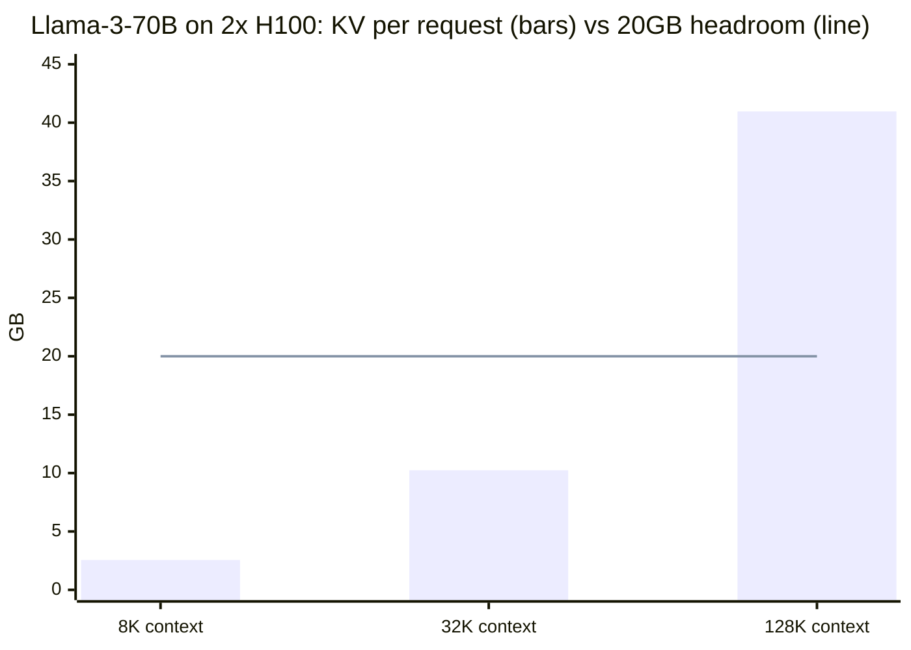

# KV Cache Optimization — Memory Footprint, Eviction, and Compression

Deep-dive sub-file of [Inference & Decoding](README.md). Covers the canonical KV cache memory formula and capacity-planning arithmetic, eviction and compression strategies (H2O, SnapKV, StreamingLLM/attention sinks, Scissorhands), and cross-layer KV sharing (YOCO, CLA). Architectural reductions to KV size (GQA/MQA/MLA) and KV quantization are covered here only as *impact summaries* — for derivations, see [attention_mechanisms.md](../foundations_and_architecture/attention_mechanisms.md) and [optimization_and_quantization](../optimization_and_quantization/README.md)/[vLLM Deep Dive](../vllm_deep_dive/README.md).

---

## 1. Concept Overview

The KV cache stores the key and value projections computed for every token, at every layer, for every attention head — so that decoding the next token never has to recompute attention over the entire prefix. This is the single optimization that makes autoregressive decoding tractable (Section 4.7 of the [parent README](README.md)). But the cache is not free: it grows **linearly with sequence length and linearly with concurrent requests**, and for large models at long context, it routinely exceeds the memory footprint of the model weights themselves.

This file is about everything that follows from that fact: how to compute exactly how much memory a deployment needs (the formula every capacity-planning spreadsheet is built on), what happens when the cache doesn't fit (eviction and compression), and architectural changes that shrink the cache before it's even allocated (cross-layer sharing — GQA/MQA/MLA are covered in depth elsewhere, see the breadcrumb above).

Senior interviews probe this because **"how much memory does this deployment need" is the single most common back-of-envelope question in LLM systems design**, and because KV cache pressure is the proximate cause of a large fraction of production LLM incidents — OOMs, request preemption storms, and the "why did P99 latency suddenly 10x" class of pages.

---

## 2. Intuition

> **One-line analogy**: The KV cache is the model's "working memory" of the conversation so far — every token it has ever seen leaves a small physical trace in GPU memory, and that trace never goes away on its own. A long conversation with many participants is like a meeting room that accumulates one sticky note per word ever spoken, for every attendee, and someone eventually has to decide which sticky notes get thrown away when the walls run out of space.

**Mental model**: Model weights are a **fixed** cost — 140GB for Llama-3-70B in BF16, regardless of how many users you serve or how long their conversations are. The KV cache is a **variable** cost that scales with `(context length) × (concurrent requests)`. At small scale, weights dominate. At long context and high concurrency, KV cache dominates — and unlike weights, it's a cost you pay *per request*, which means it's the term that determines how many users you can serve per GPU.

**Why it matters**: Every "how many concurrent users can this GPU serve at 32K context" question — the bread-and-butter capacity-planning question for LLM infrastructure roles — reduces to: `(GPU memory − weights) / (per-token KV bytes × context length)`. Get the formula wrong by a factor of 2 (e.g., forgetting GQA's head-count reduction, or forgetting the factor of 2 for K *and* V) and your capacity plan is off by 2× — which in dollar terms at scale is real money.

**Key insight**: Almost every technique in this file is a different answer to the same question — **"the cache wants to grow without bound, but GPU memory is fixed; what do we throw away, shrink, or share?"** Eviction throws away tokens (betting that some tokens matter more than others). Quantization shrinks each entry (betting that lower precision doesn't matter much for K/V specifically). Cross-layer sharing shares entries across layers (betting that adjacent layers' K/V are redundant). GQA/MQA/MLA share entries across heads (betting that per-head K/V is redundant). None of these bets are free — they all trade some amount of quality or flexibility for memory, and the right combination depends entirely on your context-length and concurrency profile.

---

## 3. Core Principles

1. **KV cache memory is `2 × layers × kv_heads × head_dim × seq_len × bytes_per_element`** — every other number in this file is a consequence of this one formula (Section 6.1).
2. **KV cache, not model weights, is usually the binding constraint at long context and high concurrency.** Weights are fixed; KV cache scales with `context_length × concurrent_requests`.
3. **Eviction strategies all rest on the same empirical observation**: attention is highly non-uniform — a small fraction of tokens (recent tokens, and a handful of "heavy hitter" / "sink" tokens) account for most of the attention mass, so most cached K/V entries can be discarded with minimal quality loss.
4. **Static vs. dynamic eviction is the central design axis**: dynamic methods (H2O) continuously re-rank importance as generation proceeds (adaptive, but adds per-step overhead); static methods (SnapKV) decide once and fix the cache (cheap, but can't react to shifting attention later).
5. **Architectural KV reduction (GQA/MQA/MLA, cross-layer sharing) happens at *training* time** — it changes what gets cached in the first place. **Eviction and quantization happen at *serving* time** — they operate on a cache that was already going to be the "full" size. These are complementary, not competing, levers.
6. **Eviction is a lossy approximation; paging (PagedAttention) is a lossless memory-management technique.** Don't confuse "I don't have enough memory for the full cache" (eviction's problem) with "I'm wasting memory on fragmentation/padding within the cache I do have" (paging's problem, covered in [vLLM Deep Dive](../vllm_deep_dive/README.md)).
7. **Cross-layer KV sharing reduces the formula's `layers` term**; GQA/MQA reduce the `kv_heads` term; quantization reduces `bytes_per_element`; eviction reduces `seq_len`. Four independent multiplicative levers on the same formula.

---

## 4. Types / Approaches

| Method | What it reduces | Mechanism | Dynamic? | Typical savings | Quality impact |
|--------|-----------------|-----------|----------|-----------------|-----------------|
| **GQA / MQA** (overview — see [attention_mechanisms.md](../foundations_and_architecture/attention_mechanisms.md)) | `kv_heads` term | Multiple query heads share fewer KV heads | N/A (architecture) | 4-8× (GQA), up to `num_heads`× (MQA) | Minor with retraining |
| **MLA** (overview — see attention_mechanisms.md) | effective KV size | Low-rank joint compression of K/V into a shared latent | N/A (architecture) | ~10× vs. MHA (DeepSeek-V2/V3) | Minimal, requires training |
| **KV Quantization** (overview — see [optimization_and_quantization](../optimization_and_quantization/README.md)) | `bytes_per_element` | INT8/FP8/KIVI quantize cached K/V tensors | N/A (serving-time) | 2× (INT8), 4× (INT4/KIVI) | <1% with calibration |
| **H2O (Heavy-Hitter Oracle)** | `seq_len` term | Continuously track cumulative attention per token; evict lowest-scoring | Yes | 50-75% | <1% |
| **SnapKV** | `seq_len` term | One-time observation window, prune, then fixed cache | No (static) | 50-80% | <1% |
| **StreamingLLM / attention sinks** | `seq_len` term | Keep first few "sink" tokens + sliding window, evict everything else | No (fixed policy) | 80-95% | 2-5% |
| **Scissorhands** | `seq_len` term | Persistence-of-importance: tokens important once tend to stay important | Yes (cheaper than H2O) | 80% | <1% |
| **Cross-layer KV sharing (YOCO, CLA)** | `layers` term | Groups of layers share one KV cache instead of each computing its own | N/A (architecture) | 2× (CLA-2), up to ~half (YOCO) | Minimal, requires training |
| **PagedAttention** (cross-link [vLLM Deep Dive](../vllm_deep_dive/README.md)) | fragmentation, not total size | Block-based virtual memory for KV cache | N/A (memory mgmt) | Recovers ~60-80% of memory lost to fragmentation | None (lossless) |

---

## 5. Architecture Diagrams

### 5.1 The memory formula, visually

```
Per-token KV cache bytes:

   2  ×  num_layers  ×  num_kv_heads  ×  head_dim  ×  bytes_per_element
   ^         ^               ^              ^              ^
   |         |               |              |              |
 K and V   one entry      GQA/MQA/MLA   per-head dim    BF16=2, FP8=1,
 (×2)      per layer      shrink this     (often 128)    INT4=0.5

Llama-3-70B:  2 × 80 × 8 × 128 × 2 bytes = 327,680 bytes ≈ 320 KB / token

Total cache = (per-token bytes) × (sequence length) × (concurrent sequences)
```

### 5.2 Where the memory goes — capacity planning at a glance



Llama-3-70B's 140GB of BF16 weights already need 2×H100 (160GB), leaving only 20GB of headroom for KV cache — the flat line. Against it: 8K context (2.56GB/request) fits `20/2.56 ≈ 7` concurrent requests, 32K (10.24GB) fits `≈ 1`, and a single 128K request (40.96GB) does not fit at all without eviction/quantization/sharing. This is why a "128K context window" marketing number and "128K context window that 10 users can use concurrently" are completely different engineering problems.

### 5.3 Eviction strategies — cache layout comparison

```
Full KV cache (128K context, 70B model, ~41 GB):
  [tok_0][tok_1][tok_2] ......................... [tok_131067][tok_131071]

StreamingLLM (fixed policy, ~2-5% kept):
  [sink_0..3]                          [recent_(n-508)..n]
   ^ first 4 tokens, NEVER evicted      ^ sliding window, last ~512 tokens
   (attention sinks)                    MID-CONTEXT IS GONE — model literally
                                         cannot recall it

H2O (dynamic, continuously re-scored, ~25% kept):
  [sink_0..3] [heavy_hitters: scattered through cache, by score] [recent_384..511]
   ^ kept       ^ re-evaluated every step — positions change over time
                  as new tokens shift the attention distribution

SnapKV (static, one-time prune after observation window, ~20-50% kept):
  [important_tokens identified during obs window, FIXED positions] [recent window]
   ^ once decided, cache layout doesn't change for rest of generation

Scissorhands (dynamic, cheaper re-scoring via persistence heuristic, ~20% kept):
  similar layout to H2O, but re-scoring uses a cheaper "was this token
  important recently?" signal instead of full cumulative-attention tracking
```

### 5.4 Cross-layer KV sharing (YOCO / CLA)

```
Standard transformer (every layer computes + caches its own K, V):
  Layer 1:  [K1, V1] ─┐
  Layer 2:  [K2, V2] ─┤  N separate KV caches, each O(layers) contribution
  ...                  ┤  to the memory formula
  Layer N:  [KN, VN] ─┘

CLA (Cross-Layer Attention) — groups of layers share one KV cache:
  Layer 1:  [K1, V1] ──┬─── shared by layers 1-2
  Layer 2:  (reuses K1, V1)
  Layer 3:  [K3, V3] ──┬─── shared by layers 3-4
  Layer 4:  (reuses K3, V3)
  -> "layers" term in the formula effectively halves (CLA-2) or more (CLA-3, CLA-4)

YOCO (You Only Cache Once) — decoder-decoder split:
  ┌─────────── Self-Decoder (first half of layers) ───────────┐
  │  Computes K, V ONCE, cached here                          │
  └────────────────────────┬───────────────────────────────────┘
                            │  single shared KV cache
  ┌─────────── Cross-Decoder (second half of layers) ─────────┐
  │  ALL layers attend to the SAME cached K, V via cross-attn │
  └─────────────────────────────────────────────────────────────┘
  -> "layers" term in the formula drops to effectively 1 for the
     cross-decoder half -> roughly 2x overall KV cache reduction
```

---

## 6. How It Works — Detailed Mechanics

### 6.1 The canonical memory formula — derivation and worked example

```python
def kv_cache_bytes_per_token(
    num_layers: int,
    num_kv_heads: int,
    head_dim: int,
    bytes_per_element: int = 2,  # BF16=2, FP8/INT8=1, INT4/KIVI=0.5
) -> int:
    """
    Every transformer layer stores ONE Key tensor and ONE Value tensor
    per token, per KV head (not per query head -- this is where GQA/MQA
    savings come from). The factor of 2 is K + V, not "2 bytes."
    """
    return 2 * num_layers * num_kv_heads * head_dim * bytes_per_element


def total_kv_cache_bytes(
    bytes_per_token: int,
    seq_len: int,
    concurrent_requests: int = 1,
) -> int:
    return bytes_per_token * seq_len * concurrent_requests


# Llama-3-70B: 80 layers, GQA with 8 KV heads (64 query heads / 8 = 8x sharing),
# head_dim=128, BF16
per_token = kv_cache_bytes_per_token(num_layers=80, num_kv_heads=8, head_dim=128)
print(per_token)               # 327,680 bytes ~= 320 KB/token

print(total_kv_cache_bytes(per_token, seq_len=8_192))                  # ~2.56 GB
print(total_kv_cache_bytes(per_token, seq_len=32_768))                 # ~10.24 GB
print(total_kv_cache_bytes(per_token, seq_len=131_072))                # ~40.96 GB
print(total_kv_cache_bytes(per_token, seq_len=8_192, concurrent_requests=100))  # ~256 GB
```

**Sanity-check against weights**: Llama-3-70B weights in BF16 = `70e9 params × 2 bytes ≈ 140 GB`. A single request at 128K context (~41 GB KV) is already ~29% of the weight size — and 10 such requests (~410 GB) dwarf the weights entirely. This is the calculation behind Section 2's "weights are fixed, KV cache is variable, and variable wins at scale" claim.

**Without GQA (MHA, 64 KV heads instead of 8)**: `per_token = 2 × 80 × 64 × 128 × 2 = 2,621,440 bytes ≈ 2.5 MB/token` — **8× larger**. This is the single most important number to internalize: GQA's 8× head-count reduction is an 8× reduction in the *dominant* serving-cost term, which is why essentially every production model since Llama-2-70B uses GQA. For *why* GQA preserves quality despite this reduction (the shared-projection derivation), see [attention_mechanisms.md](../foundations_and_architecture/attention_mechanisms.md).

### 6.2 Capacity planning — the question every infra interview asks

```python
def max_concurrent_requests(
    gpu_memory_gb: float,
    num_gpus: int,
    model_weights_gb: float,
    kv_bytes_per_token: int,
    context_len: int,
    headroom_fraction: float = 0.05,   # reserve for activations, fragmentation
) -> int:
    """
    "How many concurrent users at context_len can this fleet serve?"
    is the formula every capacity spreadsheet reduces to.
    """
    total_memory = gpu_memory_gb * num_gpus * (1 - headroom_fraction)
    available_for_kv_gb = total_memory - model_weights_gb
    if available_for_kv_gb <= 0:
        return 0
    kv_per_request_gb = (kv_bytes_per_token * context_len) / (1024 ** 3)
    return int(available_for_kv_gb / kv_per_request_gb)


# 2x H100 80GB, Llama-3-70B BF16 (140GB weights), GQA 320KB/token
print(max_concurrent_requests(80, 2, 140, 327_680, 8_192))    # ~6 requests @ 8K
print(max_concurrent_requests(80, 2, 140, 327_680, 32_768))   # ~1 request  @ 32K
print(max_concurrent_requests(80, 2, 140, 327_680, 131_072))  # 0 requests  @ 128K -- INFEASIBLE without eviction/quant
```

The 128K row is the entire motivation for Sections 6.5-6.9: **without eviction, quantization, or cross-layer sharing, a 2×H100 deployment cannot serve a single 128K-context request alongside its own weights** (40.96GB KV > 20GB headroom). This is not a hypothetical — it is the exact wall every team hits when a product manager asks "can we support 128K context" without asking "...for how many concurrent users."

### 6.3 GQA / MQA / MLA — impact summary (derivation owned elsewhere)

This file owns the *consequence* of these architectures on the memory formula (Section 6.1's `num_kv_heads` term); it does **not** own *why* they preserve model quality or how the shared projections are trained — that derivation lives in [attention_mechanisms.md](../foundations_and_architecture/attention_mechanisms.md).

```
MHA  (Multi-Head Attention):  num_kv_heads = num_query_heads        -> baseline
GQA  (Grouped-Query Attention): num_kv_heads = num_query_heads / G  -> /G reduction
                                 (Llama-3-70B: 64 query heads, 8 KV heads, G=8 -> 8x)
MQA  (Multi-Query Attention):   num_kv_heads = 1                    -> /num_query_heads
MLA  (Multi-head Latent Attn):  K/V replaced by a low-rank latent    -> ~10x vs MHA
                                 (DeepSeek-V2: 93% KV cache reduction vs MHA)
```

The takeaway for *this* file: when you compute the Section 6.1 formula for a model, **`num_kv_heads` is an architectural fact you must look up per model** (not assume equals the number of attention heads reported in headline specs, which is usually the *query* head count) — getting this wrong is the single most common error in back-of-envelope KV cache sizing.

### 6.4 KV cache quantization — impact summary (mechanism owned elsewhere)

Similarly, this file owns the `bytes_per_element` term's *effect* on the formula; the quantization *mechanism* (calibration, KIVI's per-channel/per-token asymmetric scheme, outlier handling) is covered in [optimization_and_quantization](../optimization_and_quantization/README.md) and its production serving in [vLLM Deep Dive](../vllm_deep_dive/README.md).

```
BF16 (baseline):  bytes_per_element = 2   ->  320 KB/token (Llama-3-70B)
FP8:              bytes_per_element = 1   ->  160 KB/token  (2x reduction)
INT8:             bytes_per_element = 1   ->  160 KB/token  (2x reduction, needs calibration)
INT4 / KIVI:      bytes_per_element = 0.5 ->   80 KB/token  (4x reduction)

Quality impact (typical, calibrated):
  FP8/INT8 KV:  <0.5% perplexity degradation -- close to "free" on H100/H200 (native FP8)
  INT4/KIVI:    ~1-2% degradation -- KIVI's per-channel K / per-token V asymmetric
                quantization specifically targets the outlier channels that make
                naive INT4 KV quantization fail
```

The practical interaction with Section 6.2: quantizing KV from BF16 to FP8 turns the "128K context, 0 requests feasible" row into "128K context, 0 requests feasible" *still* (40.96GB / 2 = 20.48GB, still exceeds the 20GB headroom) — illustrating that **quantization alone is often insufficient at extreme context lengths, and must be combined with eviction or cross-layer sharing** (Section 14's case study works through exactly this combination).

### 6.5 H2O (Heavy-Hitter Oracle) — dynamic eviction

```python
from __future__ import annotations
import torch


class H2OCache:
    """
    H2O tracks a cumulative attention score per cached token and evicts
    the lowest-scoring tokens when the budget is exceeded.

    Empirical basis: a small fraction of tokens ("heavy hitters") receive
    disproportionate attention across nearly all layers and heads -- this
    is NOT specific to one query, it's a property of the token itself
    (e.g., the subject of a sentence, a key entity introduced early).
    """

    def __init__(self, recent_window: int = 256, heavy_hitter_budget: int = 128):
        self.recent_window = recent_window
        self.heavy_hitter_budget = heavy_hitter_budget
        self.cumulative_scores: dict[int, float] = {}   # token_position -> score

    def update_scores(self, attention_weights: torch.Tensor, positions: list[int]) -> None:
        """attention_weights: [num_heads, num_cached_tokens] for the current step.
        Accumulate the mean-over-heads attention each cached token received."""
        mean_attn = attention_weights.mean(dim=0)  # average across heads
        for pos, score in zip(positions, mean_attn.tolist()):
            self.cumulative_scores[pos] = self.cumulative_scores.get(pos, 0.0) + score

    def evict(self, current_position: int) -> list[int]:
        """Return positions to evict: keep recent window + top-K heavy hitters."""
        recent_cutoff = current_position - self.recent_window
        candidates = {p: s for p, s in self.cumulative_scores.items() if p < recent_cutoff}
        if len(candidates) <= self.heavy_hitter_budget:
            return []
        # Keep top heavy_hitter_budget by score; evict the rest
        sorted_by_score = sorted(candidates.items(), key=lambda kv: kv[1], reverse=True)
        keep = {p for p, _ in sorted_by_score[: self.heavy_hitter_budget]}
        to_evict = [p for p in candidates if p not in keep]
        for p in to_evict:
            del self.cumulative_scores[p]
        return to_evict
```

**Cost/benefit**: H2O's per-step score update is O(cached_tokens) — typically 5-10% additional decode latency. On Llama-3-70B at 128K context: full cache ~41GB -> H2O cache (recent 256 + heavy hitters 128 = 384 "active" tokens worth of K/V, but note the *positions* of heavy hitters are scattered through the original 128K range and must still be individually addressable) ~8-10GB, **<1% quality loss on LongBench/RULER**.

### 6.6 SnapKV — static, observation-then-prune

```python
from __future__ import annotations
import torch


def snapkv_compress(
    attention_weights_during_observation: torch.Tensor,  # [obs_window, num_layers, num_heads, cached_tokens]
    observation_window: int = 256,
    keep_fraction: float = 0.3,
) -> torch.Tensor:
    """
    SnapKV's key difference from H2O: instead of continuously re-scoring
    for the ENTIRE generation, observe attention patterns during a SHORT
    window at the START of decoding, identify tokens that are
    "consistently important" across layers/heads during that window,
    prune ONCE, then decode with a FIXED compressed cache.

    Returns a boolean mask over cached_tokens: True = keep.
    """
    # Average attention received by each cached token, across the
    # observation window, layers, AND heads -- "consistency" = low variance
    # across layers/heads is implicitly favored by the mean.
    importance = attention_weights_during_observation.mean(dim=(0, 1, 2))  # [cached_tokens]
    k = int(importance.numel() * keep_fraction)
    _, top_indices = torch.topk(importance, k)
    mask = torch.zeros_like(importance, dtype=torch.bool)
    mask[top_indices] = True
    return mask


# Cost comparison vs H2O:
#   H2O:    re-score EVERY decode step -> 5-10% ongoing overhead, fully adaptive
#   SnapKV: one observation pass (amortized, ~2-5% one-time TTFT overhead)
#           then ZERO ongoing scoring overhead -- but cache layout is FROZEN,
#           so if attention patterns shift later in a very long generation
#           (e.g., a new topic introduced at token 100K), SnapKV cannot adapt.
```

**Result**: 50-80% KV cache reduction with <1% quality degradation, *faster* than H2O in steady-state decode (no per-step scoring) but less adaptive — the tradeoff is exactly "pay once, can't change your mind" vs. "pay continuously, can adapt."

### 6.7 StreamingLLM — attention sinks + sliding window

```python
from __future__ import annotations


class StreamingLLMCache:
    """
    Key empirical finding (Xiao et al.): LLMs assign disproportionately
    HIGH attention to the FIRST FEW tokens of a sequence, REGARDLESS of
    their semantic content -- even if those tokens are something trivial
    like a BOS token. Removing them causes a sudden, catastrophic
    perplexity spike (NOT a gradual degradation).

    Hypothesis: softmax forces attention weights to sum to 1; early tokens
    become a numerical "dump" for attention that the model doesn't have
    a better target for -- a learned artifact of the softmax + causal mask,
    not a reflection of those tokens' semantic importance.

    StreamingLLM cache = [first N_sink tokens, NEVER evicted] + [sliding
    window of the most recent W tokens]. Enables UNBOUNDED-length
    generation in CONSTANT memory.
    """

    def __init__(self, num_sink_tokens: int = 4, window_size: int = 1020):
        self.num_sink_tokens = num_sink_tokens
        self.window_size = window_size
        # total cache size is FIXED: num_sink_tokens + window_size, forever

    def positions_to_keep(self, current_length: int) -> list[int]:
        if current_length <= self.num_sink_tokens + self.window_size:
            return list(range(current_length))
        sinks = list(range(self.num_sink_tokens))
        recent = list(range(current_length - self.window_size, current_length))
        return sinks + recent


# BROKEN: naive sliding window WITHOUT sink tokens
# evicting tokens 0..3 along with everything else once the window fills
# causes perplexity to EXPLODE (10x-100x) the moment those tokens leave
# the cache -- not a gradual quality decline, a cliff.
#
# FIX: StreamingLLMCache above -- keep tokens 0..3 PERMANENTLY regardless
# of recency. Just 4 tokens (out of a 4096-token window) is enough to
# eliminate the cliff entirely.
```

**Tradeoff**: 80-95% memory reduction, **constant** memory regardless of generation length (genuinely unbounded streaming) — but mid-context information is permanently lost. Only safe when the task doesn't require recalling arbitrary earlier content (e.g., a streaming summarization agent that only needs recent context plus a fixed "anchor"; NOT safe for long-document QA where the answer might be anywhere in the document).

### 6.8 Scissorhands — cheaper dynamic eviction via persistence of importance

```
Scissorhands' core hypothesis ("persistence of importance"): if a token
received high attention at step T, it is LIKELY to receive high attention
again at step T+k -- important tokens stay important. This means you don't
need H2O's full cumulative-score bookkeeping across the ENTIRE history;
a much cheaper signal -- "was this token in the top-K attended tokens
within the last few steps?" -- is nearly as good a predictor.

Mechanism:
  1. Maintain a small per-token counter: "how many of the last M steps
     was this token in the top-K attended set?"
  2. Tokens whose counter falls to 0 (haven't been in top-K for M steps)
     become eviction candidates.
  3. Evict candidates when cache budget exceeded, keeping recent window
     + sink tokens unconditionally (same as StreamingLLM's safety net).

Result: ~80% reduction, <1% quality loss, LOWER per-step overhead than
H2O because the "importance" signal is a cheap counter update rather
than accumulating full attention-weight sums across every head/layer.
```

### 6.9 Cross-layer KV sharing — YOCO and CLA

```python
# Conceptual config illustrating the "layers" term reduction (Section 5.4)

# Standard: every layer has its own KV cache contribution to the formula
standard_config = {"num_layers": 80, "kv_cache_layers": 80}  # 1:1

# CLA-2 (Cross-Layer Attention, group size 2): pairs of adjacent layers
# share one KV cache -- layer 2 reuses layer 1's K/V, layer 4 reuses
# layer 3's, etc. Halves the "layers" term in the memory formula.
cla2_config = {"num_layers": 80, "kv_cache_layers": 40}  # 2:1 -> 2x reduction

# YOCO (You Only Cache Once): the model is split into a "self-decoder"
# (first half of layers, computes K/V once) and a "cross-decoder"
# (second half, ALL layers attend to that SAME single cache via
# cross-attention rather than each computing their own K/V).
# Effective "layers" term for the cross-decoder half drops to ~1.
yoco_config = {"num_layers": 80, "kv_cache_layers": 41}  # 40 self-decoder + 1 shared -> ~2x reduction
```

**Why this is architectural, not a serving knob**: unlike eviction (a serving-time policy you can toggle per-request) or quantization (a serving-time precision choice), cross-layer KV sharing changes what the model *computes* during the forward pass — layers that "reuse" K/V from another layer are architecturally wired that way and must be **trained** with that wiring. You cannot retrofit CLA or YOCO onto an existing checkpoint's serving config the way you can toggle FP8 KV cache; it is a pretraining-time decision, which is why it is far less commonly deployed today than GQA (which is also architectural but has been standard since Llama-2 and is present in nearly every serving target) — covered here for completeness as "where the field is heading" on the `layers` term of the formula.

### 6.10 Paging and fragmentation — a different problem (cross-link)

It's worth being precise about what eviction does *not* solve. Even a cache that's "small enough to fit" can waste 60-80% of its allocated memory to **fragmentation** if each request pre-allocates a contiguous block sized for `max_seq_len` but only uses a fraction of it. **PagedAttention** solves this via block-based virtual memory for the KV cache — it is a *lossless* memory-management technique, completely independent of eviction (which is *lossy* — it throws away real cached tokens). A production deployment typically uses **both**: PagedAttention to eliminate fragmentation waste on the cache you keep, and eviction/quantization to reduce how much cache you need to keep in the first place. Full mechanics: [vLLM Deep Dive](../vllm_deep_dive/README.md).

### 6.11 BROKEN -> FIX: evicting without sink tokens

```python
# BROKEN: A team implements "keep only the most recent N tokens" as a
# simple memory-bound fix for long conversations, with NO special-casing
# of early tokens.
def broken_sliding_window_cache(all_positions: list[int], window: int = 2048) -> list[int]:
    return all_positions[-window:]   # drops position 0, 1, 2, 3, ... entirely


# Symptom in production: works fine for the first ~2048 tokens of every
# conversation, then SUDDENLY the model starts producing garbage --
# repeated tokens, or degenerates into a single repeated character --
# the moment the window first slides past the start of the sequence.
# This is the StreamingLLM "attention sink" cliff (Section 6.7): the
# model was relying on tokens 0-3 as a numerical attention dump, and
# their sudden absence breaks the softmax normalization in a way that
# compounds across layers.


# FIX: always retain the first few tokens regardless of the sliding window.
def fixed_sliding_window_with_sinks(
    all_positions: list[int], window: int = 2044, num_sinks: int = 4
) -> list[int]:
    sinks = all_positions[:num_sinks]
    recent = all_positions[-window:]
    return sinks + recent  # total cache size: num_sinks + window = 2048, UNCHANGED

# The fix costs ZERO additional memory (still 2048 total positions) and
# eliminates the cliff entirely -- this is precisely StreamingLLM's
# contribution: not "compress more," but "compress THIS WAY, not that way."
```

---

## 7. Real-World Examples

- **vLLM** — supports FP8 KV cache quantization (`--kv-cache-dtype fp8`), PagedAttention block management, and prefix caching; H2O/SnapKV-style eviction available via research integrations rather than core defaults.
- **DeepSeek-V2/V3** — Multi-head Latent Attention (MLA) reduces KV cache by ~93% vs. standard MHA, reported as a primary enabler of DeepSeek's aggressive context-length and cost economics.
- **StreamingLLM (MIT, 2023)** — demonstrated stable perplexity over 4M+ token streams in constant memory using the sink + sliding window approach (Section 6.7).
- **H2O (Heavy-Hitter Oracle, 2023)** — reported up to 5× higher throughput at similar memory budgets and <1% accuracy loss on long-context benchmarks, via dynamic heavy-hitter retention.
- **SnapKV (2024)** — reported 3.6× decode speedup and >8× memory reduction in long-context settings (e.g., 380K context on a single A100) while preserving near-baseline accuracy on LongBench.
- **YOCO (Microsoft, 2024)** — decoder-decoder architecture targeting ~2× KV cache reduction with comparable quality, evaluated up to 1M context length.

---

## 8. Tradeoffs

| Decision | Option A | Option B | Key factor |
|----------|----------|----------|-----------|
| Reduce `kv_heads` (GQA/MQA) vs. reduce `seq_len` (eviction) | Architectural (GQA), requires retraining/using a GQA model | Serving-time (eviction), works on any deployed model | Do you control the model, or only the serving config? |
| Dynamic eviction (H2O, Scissorhands) | Adapts to shifting attention over long generations | More per-step overhead (5-10%) | Generation length and whether topic drift is expected |
| Static eviction (SnapKV) | Near-zero ongoing overhead | Cache layout frozen after observation window | Is the relevant context established early, or does it emerge later? |
| StreamingLLM (fixed sink+window) | Unbounded length, constant memory, simplest | Permanently loses mid-context — 2-5% quality loss, can be much worse for recall-heavy tasks | Is the task "keep talking" (streaming chat) or "remember everything" (long-doc QA)? |
| Cross-layer sharing (YOCO/CLA) | Architectural ~2x on the `layers` term, composes with GQA | Requires training from scratch; not retrofittable | Greenfield model design vs. serving an existing checkpoint |
| Eviction vs. quantization vs. both | Either alone often insufficient at 128K+ (Section 6.4) | Combining gives multiplicative reduction | How extreme is the context length / concurrency target? |

---

## 9. When to Use / When NOT to Use

**Compute the Section 6.1/6.2 formula first, always** — before reaching for any compression technique, confirm whether you actually have a problem. Many "we need KV cache optimization" requests dissolve once someone actually runs the numbers for the *real* context length and concurrency target (often much lower than the headline "128K context" the model card advertises).

**Use dynamic eviction (H2O, Scissorhands) when:**
- Generation is very long (many thousands of output tokens) and the relevant context may shift over the course of generation (e.g., long agentic loops, multi-document synthesis).

**Use static eviction (SnapKV) when:**
- Context is long but the *important* parts are established early (e.g., a long system prompt + document, followed by Q&A about that document) — common in RAG and document-analysis workloads.

**Use StreamingLLM (sink + sliding window) when:**
- The application is genuinely "streaming" (live transcription, ongoing chat where only recent turns matter) and unbounded length matters more than perfect recall of everything ever said.

**Do NOT use eviction when:**
- Context is short (<4K tokens) — KV cache is already small (e.g., 1.3GB for 4K context on Llama-3-70B), and eviction's overhead and quality risk aren't justified by memory savings that don't matter.
- The task requires precise recall of arbitrary earlier content (legal document review, needle-in-a-haystack retrieval) — any lossy eviction risks evicting exactly the token the user will ask about. Prefer quantization (lossless w.r.t. *which* tokens are kept) or architectural reduction (GQA/MLA) first.

**Use cross-layer sharing (YOCO/CLA) when:**
- You're training a new model from scratch and want to push context length further than GQA/MLA alone allow — not an option for serving an existing checkpoint.

---

## 10. Common Pitfalls

1. **Computing the memory formula with `num_attention_heads` instead of `num_kv_heads`.** Model cards report query head counts prominently; KV head counts (post-GQA) require checking the config (`num_key_value_heads` in HuggingFace configs). Using the wrong number overestimates memory by up to 8× for Llama-3-class models — or, used for capacity planning, leads to provisioning far more GPUs than needed.
2. **Sliding-window eviction without attention sinks** — the StreamingLLM cliff (Section 6.11): works fine until the window first slides past position 0, then perplexity explodes. The fix costs zero additional memory.
3. **Assuming eviction is "free" quality-wise because benchmarks show <1% degradation.** That <1% is an *average* over benchmark-typical queries. For a needle-in-a-haystack-style query where the answer is in a token that got evicted, the degradation for *that specific request* is total — eviction's quality cost is highly query-dependent, not uniform.
4. **Stacking SnapKV's static pruning with a workload where the "important" context emerges late.** A document-QA system that works great when the question follows the document, but degrades badly when used conversationally (new questions introduce new "important" spans SnapKV already pruned).
5. **Treating quantization and eviction as redundant rather than additive.** Teams often implement one and conclude "still not enough," not realizing the two compose multiplicatively (Section 6.4's worked example) — combining INT8 KV (2×) with SnapKV (3-5×) can be the difference between "doesn't fit" and "fits comfortably."
6. **Confusing PagedAttention with eviction.** "We turned on PagedAttention, why is KV cache usage still near 100%?" — PagedAttention eliminates *fragmentation waste*, it does not reduce the *amount of cache content* you're choosing to keep. If you're at 100% real (non-fragmented) usage, you need eviction or quantization, not better paging.
7. **Forgetting that batch-level eviction policies (vLLM's preemption, Section 4.12 of the parent README) operate on a DIFFERENT axis than within-sequence eviction (H2O/SnapKV/StreamingLLM).** Preemption decides *which requests* get to keep their cache; the techniques in this file decide *which tokens within a request's cache* get to stay. Both can be active simultaneously and are often confused in incident postmortems ("the cache was evicted" — evicted by which mechanism, operating on what?).

---

## 11. Technologies & Tools

| Tool | Relevant capability |
|------|---------------------|
| vLLM | FP8/INT8 KV cache quantization flag, PagedAttention, prefix caching, request-level preemption |
| TensorRT-LLM | INT8/FP8 KV cache, paged KV cache management, optimized for H100/H200 |
| StreamingLLM (reference impl.) | Attention-sink + sliding-window cache, MIT |
| H2O / SnapKV / Scissorhands (research repos) | Reference implementations of dynamic and static eviction |
| DeepSeek-V2/V3 (MLA) | Production model demonstrating ~93% KV reduction via architectural low-rank compression |
| HuggingFace `transformers` config (`num_key_value_heads`) | Where to find the real KV head count for the Section 6.1 formula |

---

## 12. Interview Questions with Answers

**Q1: Write out the KV cache memory formula and compute it for Llama-3-70B at 32K context with 10 concurrent users.**
`bytes_per_token = 2 (K+V) × num_layers × num_kv_heads × head_dim × bytes_per_element`. For Llama-3-70B: `2 × 80 × 8 × 128 × 2 = 327,680 bytes ≈ 320 KB/token`. At 32K context: `320KB × 32,768 ≈ 10.24 GB` per request. At 10 concurrent users: `~102.4 GB` — exceeding a single H100 80GB's entire memory before accounting for the 140GB of model weights, which is why this configuration requires either multiple GPUs, KV quantization, eviction, or some combination (Section 6.4).

**Q2: Why does KV cache, not model weights, become the binding memory constraint at scale?**
Model weights are a fixed cost — 140GB for Llama-3-70B in BF16, the same whether you serve 1 user or 100. KV cache scales linearly with `context_length × concurrent_requests` — at 128K context and 10 users, KV cache alone is ~410GB, roughly 3× the weights. Since weights are amortized across all users but KV cache is paid per-user, KV cache is the term that determines *how many users you can serve per GPU*, making it the binding constraint as concurrency or context length grows, regardless of how large the model is.

**Q3: A model card says "64 attention heads." Why might this number alone be insufficient to compute the KV cache memory formula?**
Modern models use GQA/MQA, where the number of *key-value* heads is smaller than the number of *query* heads — "64 attention heads" typically refers to query heads, prominently advertised, while the KV head count (e.g., 8 for Llama-3-70B, an 8:1 grouping) is a separate config value (`num_key_value_heads`). Using 64 instead of 8 in the memory formula overestimates KV cache by 8× — the difference between "fits on 2 GPUs" and "needs 16 GPUs" in a capacity plan, making this one of the most common errors in back-of-envelope LLM infrastructure sizing.

**Q4: Explain the "attention sink" phenomenon and why naive sliding-window caching fails because of it.**
StreamingLLM's key empirical finding is that LLMs assign disproportionately high attention to the first few tokens of a sequence regardless of their semantic content — hypothesized to be a softmax artifact: since attention weights must sum to 1, early tokens (visible to every later position via the causal mask) become a numerical "dump" the model learned to route otherwise-unneeded attention mass to. A naive sliding window that evicts position 0 once the window fills removes this dump entirely, and because the effect compounds across every layer's softmax, the result isn't gradual degradation — it's a sudden perplexity cliff. The fix (StreamingLLM) costs zero additional memory: permanently retain the first ~4 tokens as "sinks" alongside the sliding window.

**Q5: Compare H2O and SnapKV. When would you choose one over the other?**
Both exploit the same observation — a small fraction of tokens receive most attention — but differ in when and how often they decide what to keep. H2O continuously tracks cumulative attention scores and re-ranks/evicts at every decode step (dynamic, ~5-10% ongoing overhead, adapts to shifting attention over very long generations). SnapKV observes attention patterns during a short window early in decoding, prunes once based on cross-layer "consistency," and then decodes with a fixed compressed cache (near-zero ongoing overhead, but cannot adapt if important context emerges later). Choose H2O for long agentic loops or multi-stage tasks where what's "important" shifts over time; choose SnapKV for document-QA-style workloads where the important context is established up front and ongoing overhead matters more (e.g., tight TPOT SLAs).

**Q6: What is the "persistence of importance" hypothesis behind Scissorhands, and why does it make eviction cheaper than H2O?**
Scissorhands hypothesizes that a token receiving high attention at step T is likely to remain important at step T+k — important tokens stay important, rather than importance being randomly redistributed each step. This means a cheap signal — "has this token been in the top-K attended set within the last M steps?" — is nearly as good a predictor of long-term importance as H2O's full cumulative-attention-score bookkeeping across the entire history. The result is similar quality (~80% reduction, <1% loss) at lower per-step overhead, because the importance signal is a simple counter update rather than accumulating and sorting full attention-weight sums across every head and layer.

**Q7: How do GQA, KV quantization, and eviction compose — are they redundant or additive?**
They're additive, operating on independent terms of the memory formula: GQA reduces `num_kv_heads` (e.g., 8× for Llama-3-70B vs. MHA), quantization reduces `bytes_per_element` (2× for FP8/INT8, 4× for INT4/KIVI), and eviction reduces effective `seq_len` (2-5× for SnapKV, up to 10-20× for StreamingLLM). A model already using GQA, served with FP8 KV cache, with SnapKV eviction on top, could see a combined reduction on the order of 8 × 2 × 3 ≈ 48× vs. an MHA/BF16/no-eviction baseline — the difference between "doesn't fit" and "fits with headroom to spare" at extreme context lengths. Teams that implement only one and conclude "still not enough" are usually leaving a large multiplicative factor on the table.

**Q8: What's the difference between PagedAttention and KV cache eviction — why does a team sometimes need both?**
PagedAttention is a *lossless* memory-management technique: it eliminates fragmentation waste (typically 60-80% of pre-allocated-but-unused KV memory under naive contiguous allocation) by managing the cache in fixed-size blocks, like OS virtual memory — it doesn't change *what* is cached, only how efficiently it's packed. Eviction (H2O/SnapKV/StreamingLLM) is *lossy*: it actually discards cached tokens to reduce the total amount of content kept. A production deployment typically needs both — PagedAttention to use the memory you've allocated efficiently, and eviction/quantization to reduce how much you need to allocate in the first place. "We enabled PagedAttention but KV usage is still at 100%" is a sign of confusing the two (Common Pitfall #6).

**Q9: Explain cross-layer KV sharing (CLA/YOCO). Why is it less commonly deployed than GQA despite both reducing KV cache?**
Both reduce a multiplicative term in the memory formula — GQA reduces `num_kv_heads` by having multiple query heads share fewer KV heads; cross-layer sharing (CLA, YOCO) reduces the `num_layers` term by having groups of layers share one KV cache (CLA: pairs/groups of adjacent layers; YOCO: a "self-decoder" computes K/V once for a "cross-decoder" of equal size to attend to). The difference is adoption stage: GQA has been standard since Llama-2-70B and is supported by essentially every serving engine. Cross-layer sharing is architecturally invasive — it changes what each layer computes during the forward pass — and must be baked in at pretraining time; it cannot be retrofitted onto an existing checkpoint's serving config the way a KV-quantization flag can. It represents where the field is heading on the `layers` term, but requires training new model families to adopt.

**Q10: A team reports their RAG system's quality degrades on long documents after they enabled "KV cache compression." How would you debug this?**
First question: which compression — static (SnapKV) or dynamic (H2O/Scissorhands)? If static, the likely cause is Common Pitfall #4 — SnapKV's observation window establishes "important" tokens early, but RAG conversations often ask *follow-up* questions whose relevant context wasn't flagged as important during the initial observation window, so it was pruned before the follow-up needed it. Second: check whether the degradation correlates with *where* in the document the answer is — if quality is fine for answers near the document's start/end but bad for answers from the middle, that's consistent with StreamingLLM-style sink+window eviction (mid-context is unconditionally dropped), not H2O/SnapKV (which retain scattered "important" positions throughout). The fix depends on the diagnosis: switch static→dynamic eviction for multi-turn RAG, or switch sink+window→heavy-hitter-based eviction if mid-document recall matters.

**Q11: Why is eviction's "<1% average quality loss" potentially misleading for a specific production use case?**
Benchmark averages (LongBench, RULER) aggregate over many queries with varying answer locations. For a query whose answer happens to live in a token that got evicted, the degradation for *that specific request* isn't "1% worse" — it's total failure for that request (the model literally cannot see the relevant information). Needle-in-a-haystack-style workloads are the worst case: by construction, the "needle" is a small, easy-to-evict span, and eviction strategies that achieve great *average* benchmark scores can still fail catastrophically on the specific queries that matter most for that workload. The practical guidance: for recall-critical applications, prefer lossless reductions (quantization, GQA/MLA) before reaching for lossy eviction, and if eviction is necessary, validate against a needle-in-a-haystack eval specific to your document types — not just aggregate LongBench scores.

**Q12: How does KV cache eviction interact with prefix/prompt caching (cross-link)?**
They can conflict. Prefix caching ([llm_caching](../llm_caching/README.md)) relies on KV cache for a shared prefix (e.g., a system prompt) being preserved *exactly* and *identically* across requests so it can be reused without recomputation. If an eviction policy (especially dynamic, per-request policies like H2O) modifies which tokens of that shared prefix are retained differently for different requests — based on each request's own attention pattern — the "shared" cache is no longer shareable; each request effectively gets its own divergent compressed version, defeating prefix caching's reuse benefit. In practice, this means eviction policies for a multi-tenant deployment with heavy prefix-cache reliance often need to either exempt the shared prefix from eviction entirely, or apply only request-independent (static, prefix-uniform) compression — an interaction that's easy to miss when these two systems are implemented by different teams.

**Q13: How does speculative decoding interact with KV cache eviction?**
Speculative decoding's verification step ([speculative_decoding.md](speculative_decoding.md)) requires the target model to run a forward pass over the K draft tokens, attending to the *full* existing KV cache for that sequence — if eviction has discarded tokens the target model would otherwise attend to, the target's verification probabilities `p(x)` are computed over a *different* (compressed) context than they would be without eviction, which is a separate source of distribution change from the rejection-sampling mechanics themselves. In practice this is usually a second-order effect (both draft and target see the same compressed cache, so their *relative* agreement is less affected than their *absolute* distributions), but it's worth flagging in a system combining both techniques: eviction changes "what the model knows," which can shift the optimal draft model or acceptance-rate expectations independent of any sampler-config concerns.

**Q14: Your production service's P99 latency spikes correlate with `gpu_cache_usage_perc` approaching 100%. Walk through the levers you'd consider, in order.**
First, distinguish fragmentation from genuine content pressure: if PagedAttention is already enabled and usage is still near 100% with low fragmentation, the cache genuinely needs to hold that much content — eviction/quantization territory, not a paging fix. Second, check the *easiest* lever: KV quantization (FP8/INT8) is often closest to "free" — 2× reduction, <0.5% quality impact, no architecture change, often a single config flag. Third, check whether the workload's actual context-length distribution justifies the configured `max_model_len` — over-provisioning `max_seq_len` per request wastes allocation even with paging. Fourth, if the above don't suffice (typically only at 64K+ contexts with high concurrency), introduce eviction (SnapKV for document-style workloads, H2O for long agentic loops) — but validate against task-specific recall evals first (Q11). Architectural changes (GQA if not already present, MLA, cross-layer sharing) are not "levers" in this context — they require a different model.

**Q15: Why might a team choose NOT to enable any KV cache eviction even at 100K+ context?**
If the deployment serves few enough concurrent requests that the raw memory fits (Section 6.2's formula) — e.g., a single-tenant deployment on 8×H100 serving one 100K-context request at a time — eviction adds engineering complexity, per-step overhead (for dynamic methods), and quality risk (Q11) for a memory problem that doesn't exist. Eviction is a response to a *constraint* (insufficient memory for the desired concurrency × context-length product), not a default best practice; Section 9's "compute the formula first" guidance applies here directly — many teams reach for eviction reflexively when a quantization flag or simply fewer concurrent slots would solve the actual problem with zero quality risk.

**Q16: What's the relationship between the KV cache eviction techniques in this file and request-level preemption (vLLM's swap/recompute)?**
They operate on different axes and are often confused. Preemption (covered in the parent [README §4.12](README.md)) is a *scheduling* decision: when the aggregate KV cache across all active requests exceeds GPU memory, vLLM evicts an entire *request's* cache (swapping it to CPU or dropping it for recompute) to make room for higher-priority requests — the unit of eviction is "a whole sequence." H2O/SnapKV/StreamingLLM/Scissorhands operate *within* a single sequence's cache, deciding which *tokens* of that one sequence's history to keep. Both can be active in the same deployment simultaneously: within-sequence eviction reduces how much memory each individual request needs (raising the number of requests that fit before preemption triggers at all), while preemption is the backstop for when even compressed per-request caches collectively exceed capacity.

**Q17: Design a back-of-envelope check: your team wants to support 50 concurrent users at 64K context on Llama-3-70B with 4×H100 80GB. Is this feasible, and what would you change if not?**
Weights: 140GB BF16 (or ~70GB if FP8-quantized). Total memory: 4×80GB = 320GB. At BF16 weights, headroom for KV = 320 - 140 = 180GB. Per-request KV at 64K with GQA/BF16: `320KB × 65,536 ≈ 21GB`. For 50 users: `50 × 21GB = 1,050GB` — over 5× the available headroom, even before accounting for weights. This is clearly infeasible as specified. Changes, roughly in order of "cheapest first": (1) FP8 weights (140GB→70GB, frees 70GB of headroom) and FP8 KV cache (21GB→10.5GB per request, `50×10.5=525GB`) — still infeasible. (2) Add SnapKV (3-5× reduction on top): `525GB / 4 ≈ 131GB` — close to the 250GB headroom (320-70), now plausible. (3) Alternatively, question the requirement: do all 50 users genuinely need 64K context simultaneously, or is that a P99 case that could be served by a separate pool with stricter concurrency limits while the common case (shorter context) runs on the main pool at full concurrency? The "back of envelope, then negotiate the requirement" pattern is often more valuable than any single technical lever.

---

## 13. Best Practices

1. **Always compute the Section 6.1/6.2 formula with the model's actual `num_key_value_heads`** (not query head count) before any capacity planning or compression decision.
2. **Try the cheapest lever first**: KV quantization (FP8/INT8) is close to "free" — config-only, <0.5% quality impact, 2× reduction — before reaching for eviction.
3. **Match eviction strategy to workload shape**: static (SnapKV) for "important context established early" workloads (document QA); dynamic (H2O/Scissorhands) for long agentic loops where importance shifts.
4. **Never use a naive sliding window without attention sinks** — retaining the first ~4 tokens costs nothing and prevents the StreamingLLM cliff (Section 6.11).
5. **Validate eviction against task-specific recall evals (needle-in-a-haystack for your document types), not just aggregate LongBench scores** — average quality loss can hide catastrophic per-request failures (Q11).
6. **Don't confuse PagedAttention (fragmentation, lossless) with eviction (content reduction, lossy)** — both may be needed, but they solve different problems.
7. **Check eviction/prefix-caching interaction explicitly** in multi-tenant deployments — per-request dynamic eviction can silently defeat shared-prefix caching (Q12).
8. **Treat compression techniques as multiplicative, not alternatives** — GQA × quantization × eviction can combine to 10-50×, where any single technique alone might not suffice.
9. **Re-run the formula before committing to a "support Xk context" product requirement** — and be ready to negotiate concurrency limits at extreme context lengths rather than over-engineering compression for a rare case.

---

## 14. Case Study

**Scenario**: A legal-document-analysis startup serves Llama-3-70B (GQA, 8 KV heads) on 4×H100 80GB and wants to support 128K-context documents (full contracts plus amendments) for up to 8 concurrent analysts. Initial deployment used BF16 weights and BF16 KV cache with no eviction.

**v1 measurement** (BF16 weights + BF16 KV, no eviction):
```
Weights: 140 GB
Total memory: 4 x 80GB = 320 GB
Headroom for KV: 320 - 140 = 180 GB
Per-request KV @ 128K: 320KB x 131,072 = ~41 GB
Max concurrent @ 128K: 180 / 41 = 4 requests

Result: only 4 of the required 8 concurrent analysts can be served at
full 128K context. The 5th request triggers vLLM preemption (request-
level swap/recompute), and the analyst sees a multi-second stall.
```

**v2 design** — applied levers in order of risk (cheapest/lowest-risk first):

1. **FP8 weights + FP8 KV cache** (Section 6.4): weights 140GB→70GB (frees 70GB), per-request KV 41GB→20.5GB. New headroom: `320-70=250GB`. Max concurrent: `250/20.5 ≈ 12`. This alone clears the 8-analyst target with margin — H100/H200 FP8 is near-native-speed, and calibrated FP8 KV showed <0.5% degradation on the team's internal contract-QA eval set.

2. **Despite (1) clearing the target, the team ALSO enabled SnapKV** (Section 6.6) for a different reason: legal documents have a clear structure where "important" clauses (definitions, parties, key terms) are referenced repeatedly throughout a long contract, and the observation-window approach identified these consistently — reducing per-request KV further to ~6GB (3.4× additional reduction), raising theoretical max concurrency to ~40. This headroom was deliberately *not* used to raise the concurrency limit; instead it was reserved to absorb occasional requests exceeding 128K (amended contracts with attached exhibits) without triggering preemption.

3. **Validation against a needle-in-a-haystack eval specific to contract review** (Q11's guidance) — the team constructed a benchmark where a single clause (e.g., an indemnification cap) was placed at varying positions within real 100K+-token contracts, and the model was asked to retrieve and reason about it. SnapKV's observation-window pruning initially scored 94% retrieval accuracy on this benchmark vs. 99% for uncompressed — the 5-point gap was traced to clauses introduced via amendments *appended after* the observation window, which SnapKV's static pruning hadn't seen as "important" yet (Common Pitfall #4 / Q5). 

4. **Fix for (3)**: switched from pure SnapKV to a hybrid — SnapKV's static pruning for the *original document body* (established early, stable), combined with a small dynamic (Scissorhands-style) budget reserved specifically for *amendment sections appended after the observation window*. Retrieval accuracy on the benchmark recovered to 98%.

**Outcome**: Max concurrent 128K-context requests went from 4 (v1) to a *validated-safe* 8 (v2, with the remaining FP8+SnapKV headroom reserved for over-128K outliers rather than further concurrency increases) — a 2× improvement that exactly met the product requirement, achieved through FP8 (the "near-free" lever) plus a workload-shape-matched hybrid eviction strategy, validated against a recall benchmark specific to the failure mode that mattered (amendment clauses), not generic LongBench scores. The team's retrospective explicitly noted that FP8 alone (lever 1) would have met the numeric target — SnapKV (lever 2) was added for *headroom against outliers*, and its initial 5-point recall regression (lever 3-4) would have shipped silently if validated only against generic benchmarks.

---

## Related

- [Inference & Decoding README](README.md) — the broader serving picture: prefill/decode, continuous batching, PagedAttention overview
- [Attention Mechanisms](../foundations_and_architecture/attention_mechanisms.md) — GQA/MQA/MLA derivations and why they preserve quality
- [Optimization & Quantization](../optimization_and_quantization/README.md) — KV cache quantization mechanisms (INT8/FP8/KIVI)
- [vLLM Deep Dive](../vllm_deep_dive/README.md) — PagedAttention internals, FP8 KV cache serving flags, prefix caching
- [LLM Caching](../llm_caching/README.md) — prompt/prefix caching and its interaction with per-request eviction
- [Speculative Decoding](speculative_decoding.md) — how KV cache state interacts with draft/target verification
- [Sampling & Decoding Strategies](sampling_and_decoding_strategies.md) — beam search's k× KV cost
