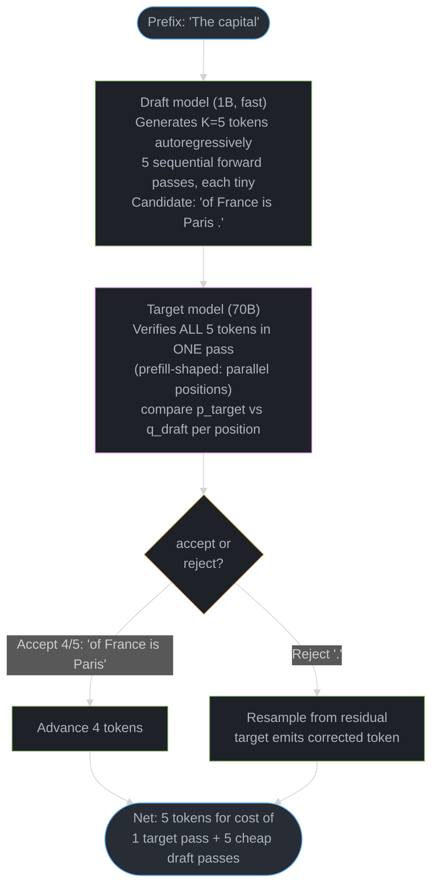

# Speculative Decoding — Draft-and-Verify Inference Acceleration

Deep-dive sub-file of [Inference & Decoding](README.md). Covers the rejection-sampling proof that speculative decoding is an *exact* sampler, the full landscape of draft strategies — independent draft models, self-speculative (LayerSkip), Medusa, EAGLE/EAGLE-2/EAGLE-3, lookahead (Jacobi) decoding, prompt-lookup/ngram decoding, and DeepSeek-V3 multi-token prediction — tree-based verification, and production tuning.

---

## 1. Concept Overview

Speculative decoding accelerates autoregressive generation by separating **proposal** from **verification**. A cheap mechanism — a small draft model, extra prediction heads bolted onto the target, or even a hash lookup into the prompt — proposes several candidate future tokens. The expensive target model then checks all of them in a *single* forward pass. That single pass costs almost the same as generating one token, because verifying K tokens in parallel is shaped like *prefill* (compute-bound, parallelizable across positions) rather than *decode* (memory-bandwidth-bound, strictly sequential). The result: the target model still produces every token that ends up in the output, but it does so in fewer *serial* forward passes.

The property that makes this safe to deploy without an evals review is **exactness**: the acceptance/rejection rule (Section 6.1) guarantees the final output token distribution is *identical* to what the target model would have produced sampling alone, token by token. Speculative decoding is a throughput optimization with zero quality tradeoff — when it works. When it doesn't (low acceptance rate, see Section 6.2), it can make things *slower*, which is why production systems monitor acceptance rate live and disable speculation adaptively.

This file is the decoding-algorithm half of the picture. For the serving-engine configuration (vLLM flags, batch-size thresholds, tensor-parallel layout for the draft model), see [vLLM Deep Dive §8](../vllm_deep_dive/README.md).

---

## 2. Intuition

> **One-line analogy**: Speculative decoding is like a junior associate drafting an entire memo while the partner reads it once and either signs off on whole paragraphs or strikes out at the first sentence that's wrong — the partner never writes word-by-word, but every word in the final memo is one the partner approved.

**Mental model**: The target model's real bottleneck during decode is *loading 140GB of weights from HBM to compute one token*. That weight-load cost is paid once per forward pass, almost independent of how many tokens are in that pass (up to a point — see the roofline discussion in the parent [README §6](README.md)). So if a forward pass can verify 5 tokens at once instead of producing 1, you get up to 5 tokens of output for the price of 1 weight-load. The draft mechanism's only job is to propose tokens the target is *likely to agree with* — the better the agreement (acceptance rate α), the closer you get to that 5×.

**Why it matters**: This is one of the highest-frequency "explain a real speedup technique end-to-end" questions in senior LLM infra interviews, because it touches sampling theory (why is it exact?), systems (why is verification cheap?), and production judgment (when does it backfire?) in one topic. Interviewers also increasingly probe the *newer* draft mechanisms (EAGLE, Medusa, MTP) because they're what production systems actually run in 2025-26 — vanilla "small LLM as draft" is now the textbook baseline, not the deployed system.

**Key insight**: Acceptance rate α is not a property of the draft model alone — it's a property of the *(draft, target, task, temperature)* tuple. The same draft model that gets α≈0.85 on code completion can fall to α≈0.4 on creative writing with the same target model. This is why production systems route by task type and monitor α as a live signal, not a static benchmark number.

---

## 3. Core Principles

1. **Exactness via rejection sampling.** The accept/reject rule reproduces the target's exact marginal distribution — speculative decoding never trades quality for speed (Section 6.1). Any implementation that "approximates" this (e.g., always accepting the draft's argmax) is a *different, lossy* algorithm, not speculative decoding.
2. **Verification is parallel; drafting is sequential.** The draft step(s) are still autoregressive and pay their own (smaller) sequential cost. The target's verification of K tokens is one parallel pass. Total speedup = (expected accepted tokens) / (1 + draft overhead), not just "K×".
3. **Tokenizer identity is non-negotiable.** Draft and target must share a tokenizer — token IDs are compared directly during verification. This rules out cross-vocabulary "small model as draft" pairings without retokenization, which is why same-family models (Llama 3 8B → Llama 3 70B) dominate.
4. **Acceptance rate α is the single most important production metric.** Expected speedup is a monotonic function of α (Section 6.2); below a break-even α (≈0.45 for K=4), speculation is a net slowdown. Production systems track a rolling α and adapt K or disable speculation entirely.
5. **The draft mechanism doesn't have to be a model.** Extra heads on the target (Medusa, MTP), early-exit subsets of the target's own layers (self-speculative), or a hash lookup into the prompt (prompt-lookup) are all valid "draft" sources — the only requirement is producing candidate tokens cheaply.
6. **Tree verification generalizes linear K-token verification.** Instead of one chain of K guesses, propose a *tree* of candidate continuations and verify the whole tree in one pass with a tree-structured attention mask; accept the longest valid path. This is what makes Medusa, EAGLE-2/3, and Sequoia faster than vanilla draft-model SD at the same compute budget.
7. **Speculation interacts with everything else in the decode loop.** Logit processors (repetition penalty), grammar constraints, and continuous batching all change the cost/benefit math — see Section 6.9 and the pitfalls in Section 10.

---

## 4. Types / Approaches — The Draft Mechanism Landscape

| Approach | Draft source | Extra weights / KV cache | Typical acceptance α | Notes |
|----------|--------------|---------------------------|----------------------|-------|
| **Independent draft model** (vanilla SD, Leviathan/Chen 2023) | Separate small LM, same tokenizer | Yes — full small model + its own KV cache | 0.5–0.9 (task-dependent) | The textbook baseline; e.g. Llama 3 8B drafting for Llama 3 70B |
| **Self-speculative / LayerSkip** (Meta, 2024) | Early-exit subset of the target's *own* layers | None — shares weights and KV cache with the verify pass | 0.6–0.8 | Trained with layer-dropout + early-exit loss; no separate deployment, tokenizer match is automatic |
| **Medusa** (Cai et al., 2024) | Extra lightweight FFN "heads" on the target's last hidden state, each predicting a future offset | Small (a few MLP heads) | 0.6–0.8 (Medusa-2, joint fine-tune) | No draft model; produces a *tree* of candidates verified via tree attention |
| **EAGLE / EAGLE-2 / EAGLE-3** (Li et al., 2024-25) | One small transformer layer doing *feature-level* autoregression over the target's penultimate-layer hidden states | Small (~1 layer) | 0.75–0.9+ | Highest acceptance of the lightweight methods; EAGLE-2 makes the tree dynamic, EAGLE-3 fuses multi-layer features |
| **Lookahead / Jacobi decoding** (Fu et al., 2024) | None — parallel Jacobi iterations of the target itself | None | N/A (verifies an n-gram pool, not a draft distribution) | Pure compute trade-off; speedup scales with spare FLOPs, not with a separate model's quality |
| **Prompt-lookup / ngram decoding** | Hash lookup of recent output n-grams into the prompt/context | None | 0.3–0.9 (overlap-dependent) | Near-zero overhead; excellent for RAG, summarization, code-edit; useless for creative generation |
| **DeepSeek-V3 Multi-Token Prediction (MTP)** (DeepSeek-AI, 2024) | Sequential "MTP modules" trained jointly during pretraining | Small, trained end-to-end | 0.85–0.9 | Originally a *training* signal-densification trick; repurposed at inference as a near-free, well-calibrated draft |

Spectrum of engineering cost vs. acceptance: prompt-lookup (zero cost, narrow applicability) < lookahead decoding (zero extra weights, FLOPs-bound) < self-speculative (zero extra weights, needs special training) < Medusa (small heads, needs fine-tuning) < EAGLE (small extra layer, needs training on target's features) < independent draft model (full separate deployment, but reuses off-the-shelf small models).

---

## 5. Architecture Diagrams

### 5.1 Draft-and-verify pipeline (vanilla speculative decoding)



The target model's verification pass is prefill-shaped (all K positions in parallel), so it costs ~the same as generating 1 token autoregressively — the speedup comes from accepting multiple draft tokens per pass.

### 5.2 Rejection sampling — accept or correct, never approximate

```
For each draft token x_i with draft probability q(x_i)
and target probability p(x_i) (same prefix, both computed
in the SAME target forward pass):

   accept_prob = min(1, p(x_i) / q(x_i))

   ┌─ accept (prob = accept_prob) ──────────────────────┐
   │   keep x_i, advance prefix, continue to x_(i+1)     │
   └──────────────────────────────────────────────────────┘
   ┌─ reject (prob = 1 - accept_prob) ──────────────────┐
   │   discard x_i and all subsequent draft tokens       │
   │   sample replacement y ~ normalize(max(0, p - q))   │
   │   emit y, STOP (this round produced i accepted      │
   │   tokens + 1 corrected token = i+1 total)            │
   └──────────────────────────────────────────────────────┘
```

**Read it like this.** "Keep the draft's guess as often as the target itself would have produced it — and whenever the draft was *over*-confident, keep it only in proportion, then fix the shortfall by hand."

The ratio `p/q` is the whole rule. If the target likes the token at least as much as the draft did (`p >= q`), the ratio is `>= 1`, the `min` clamps to `1`, and the token is accepted unconditionally. The draft is only ever penalized for proposing tokens the target likes *less* than it does — never for being too conservative.

| Symbol | What it is |
|--------|------------|
| `x_i` | The i'th token the draft proposed, at position i of the K-token chain |
| `q(x_i)` | How likely the *draft* thought that token was. The proposal probability |
| `p(x_i)` | How likely the *target* thinks it is, scored in the single verify pass |
| `p / q` | "Overconfidence factor." `>= 1` = draft undersold it; `< 1` = draft oversold it |
| `min(1, p/q)` | Accept probability. Capped at 1 — you cannot accept a token more than always |
| `max(0, p - q)` | Residual: the probability mass the target wanted that the draft under-supplied |
| `normalize(...)` | Divide by the residual's own sum so it becomes a valid distribution again |

**Walk one example.** A four-token vocabulary, one position, draft `q` vs target `p`:

```
  token      q (draft)   p (target)   p/q    min(1, p/q)   verdict
  ---------  ----------  -----------  -----  ------------  ------------------------
  "of"          0.50        0.30      0.60      0.60       accept 60% of the time
  "in"          0.20        0.30      1.50      1.00       always accept
  "at"          0.20        0.25      1.25      1.00       always accept
  "near"        0.10        0.15      1.50      1.00       always accept

  Draft proposed "of". Roll a uniform number u in [0, 1):
    u = 0.41  ->  0.41 < 0.60  ->  ACCEPT "of", move to position i+1
    u = 0.83  ->  0.83 > 0.60  ->  REJECT, discard every later draft token

  On rejection, build the residual and sample the replacement from it:
    p - q     = [-0.20, +0.10, +0.05, +0.05]
    max(0, .) = [ 0.00,  0.10,  0.05,  0.05]   sum = 0.20
    normalize = [ 0.00,  0.50,  0.25,  0.25]   <- "of" can never be the correction
```

The draft oversold `"of"` (0.50 vs the target's 0.30), so it survives only 60% of the time; and when it is rejected, the residual assigns it zero mass — the correction step never re-proposes the token you just rejected. That is exactly the bookkeeping that makes the two paths sum back to `p`.

### 5.3 Tree-based verification (Medusa / EAGLE-2 / EAGLE-3 / Sequoia)

```
Linear K-token speculation verifies ONE chain:
   root -> "of" -> "France" -> "is" -> "Paris" -> "."     (5 tokens, 1 path)

Tree speculation verifies MULTIPLE chains in ONE pass via
a tree-structured attention mask (each node attends only
to its ancestors, not to sibling branches):

                     root
                    /    \
                "of"      "in"
               /    \         \
          "France" "the"    "Europe"
            /            \
        "is"            "lies"
         |
       "Paris"

Tree attention mask ensures "France" never attends to "in"/
"Europe" (different branch) — so all 6 candidate tokens are
scored in ONE target forward pass. Accept the LONGEST valid
path from root (here: root->"of"->"France"->"is"->"Paris").

Tree shape (branching factor per depth) is chosen to maximize
expected accepted tokens per unit of extra verification compute
— Sequoia formalizes this as a DP over a hardware-aware budget.
```

### 5.4 EAGLE — feature-level autoregression

```
Standard draft model: predicts TOKENS autoregressively
  token_t -> draft_LM -> token_(t+1) -> draft_LM -> token_(t+2)
  (token sequences are "spiky" / high-entropy -> harder to predict)

EAGLE: predicts FEATURES (hidden states) autoregressively
  target's layer-(L-1) hidden state h_t  ┐
  + embedding of token_t                 ├-> EAGLE layer -> h_(t+1)_hat
                                          ┘         |
                                                     v
                                        target's LM head -> token_(t+1)
                                                     |
  h_(t+1)_hat + embedding of token_(t+1) -> EAGLE layer -> h_(t+2)_hat -> ...

Feature trajectories are SMOOTHER than token sequences (adjacent
hidden states are highly correlated) -> a single small transformer
layer predicts them more accurately than a full small LM predicts
tokens -> higher acceptance (0.75-0.9+) from a tiny extra module.

EAGLE-2: tree shape is chosen DYNAMICALLY per step based on the
         EAGLE layer's own confidence (context-aware tree).
EAGLE-3: fuses LOW + MID + HIGH layer features (not just layer L-1),
         removes the feature-prediction loss, trains on
         on-policy (self-generated) data.
```

### 5.5 Lookahead (Jacobi) decoding — no draft model at all

```
Autoregressive (Gauss-Seidel-like): strictly sequential
  y1 = f(prompt)
  y2 = f(prompt, y1)
  y3 = f(prompt, y1, y2)   ... one token per forward pass

Jacobi iteration: guess ALL future tokens in parallel, then
refine — converges to the SAME fixed point as autoregressive
decoding (Banach fixed-point theorem applied to greedy decode):

  iteration 0: guess [y1^0, y2^0, y3^0, y4^0]  (e.g. all <pad>)
  iteration 1: [y1^1,y2^1,y3^1,y4^1] = f(prompt, y1^0,y2^0,y3^0)
               (one parallel forward pass updates ALL positions)
  iteration 2: repeat until y^(n) == y^(n-1)  (converged)

Lookahead decoding runs these Jacobi iterations in a sliding
window and caches the n-grams generated along the way in an
"n-gram pool". A separate verification step checks pool n-grams
against the model's actual next-token distribution — accepted
n-grams advance multiple positions per real forward pass.
Speedup comes from SPARE FLOPS during the memory-bound decode
step, not from a separate model's predictive quality.
```

---

## 6. How It Works — Detailed Mechanics

### 6.1 The rejection-sampling algorithm and why it's exact

```python
from __future__ import annotations

import torch


def speculative_step(
    draft_probs: torch.Tensor,   # [K, V] draft distribution per proposed position
    target_probs: torch.Tensor,  # [K, V] target distribution (from ONE verify pass)
    draft_tokens: torch.Tensor,  # [K] the K tokens the draft proposed
) -> tuple[list[int], int]:
    """
    Implements the Leviathan/Chen (2023) speculative sampling rule.
    Returns (accepted_tokens, num_accepted). accepted_tokens has
    length num_accepted or num_accepted + 1 (if a correction token
    was sampled after a rejection).
    """
    accepted: list[int] = []
    for i in range(draft_tokens.shape[0]):
        x = draft_tokens[i].item()
        q_x = draft_probs[i, x].item()
        p_x = target_probs[i, x].item()

        accept_prob = min(1.0, p_x / q_x) if q_x > 0 else 0.0
        if torch.rand(1).item() < accept_prob:
            accepted.append(x)
            continue

        # Rejection: sample a correction from the residual distribution
        residual = torch.clamp(target_probs[i] - draft_probs[i], min=0.0)
        residual = residual / residual.sum()
        correction = torch.multinomial(residual, num_samples=1).item()
        accepted.append(correction)
        return accepted, len(accepted)  # stop — everything after is discarded

    # All K draft tokens accepted; target also gives a "bonus" token
    # for free from its own distribution at position K+1
    bonus = torch.multinomial(target_probs[-1], num_samples=1).item()
    accepted.append(bonus)
    return accepted, len(accepted)
```

**Exactness proof (the part interviewers want to hear):** Let `p` = target distribution, `q` = draft distribution over the same support. The probability that token `x` survives as the output of this round is:

```
P(output = x) = P(accept x) + P(reject) * P(correction = x)

P(accept x)      = q(x) * min(1, p(x)/q(x)) = min(p(x), q(x))
P(reject)        = 1 - sum_z min(p(z), q(z))
P(correction = x)= max(0, p(x) - q(x)) / sum_z max(0, p(z) - q(z))

Note: sum_z max(0, p(z)-q(z)) = sum_z (p(z) - min(p(z),q(z)))
                               = 1 - sum_z min(p(z), q(z))
    => P(reject) * P(correction = x) = max(0, p(x) - q(x))

P(output = x) = min(p(x), q(x)) + max(0, p(x) - q(x)) = p(x)
```

The two cases collapse to exactly `p(x)` for every token — the draft distribution `q` cancels out completely. This is why speculative decoding is described as an **exact sampler**: regardless of how good or bad the draft is, the *marginal* distribution of each output token equals what the target model alone would have produced. A bad draft only costs *throughput* (more rejections → shorter accepted runs → less speedup), never *quality*.

**What this actually says.** "There are exactly two ways a token can come out of this round — the draft guessed it and you kept it, or the draft blew it and you re-sampled — and those two paths always add back up to the target's own probability."

The proof is three lines of bookkeeping, but the *shape* is what to remember: `min(p, q)` is the mass the draft got right, `max(0, p - q)` is the mass it missed, and `min + max-shortfall = p` by definition of min and max. Nothing about `q` survives the addition.

| Symbol | What it is |
|--------|------------|
| `p(x)` | Target model's probability for token `x`. The distribution you are *required* to reproduce |
| `q(x)` | Draft's probability for `x`. Appears in both terms and cancels between them |
| `min(p(x), q(x))` | Mass the draft supplied and the target agreed with. The "accepted" channel |
| `sum_z min(p(z), q(z))` | Total overlap between the two distributions. Call it the agreement mass |
| `P(reject)` | `1 - agreement mass`. How much of the target's distribution the draft failed to cover |
| `max(0, p(x) - q(x))` | Per-token shortfall. The "correction" channel, before normalizing |
| `sum_z max(0, p(z)-q(z))` | Total shortfall — provably equal to `P(reject)`, which is why the two cancel |

**Walk one example.** Reuse the same `p` and `q` from Section 5.2 and add the two channels per token:

```
  token     q       p     min(p,q)   max(0,p-q)   accepted + corrected   = p?
  --------  -----  -----  ---------  -----------  --------------------   -----
  "of"      0.50   0.30     0.30        0.00        0.30 + 0.00 = 0.30   = 0.30
  "in"      0.20   0.30     0.20        0.10        0.20 + 0.10 = 0.30   = 0.30
  "at"      0.20   0.25     0.20        0.05        0.20 + 0.05 = 0.25   = 0.25
  "near"    0.10   0.15     0.10        0.05        0.10 + 0.05 = 0.15   = 0.15
                            -----       -----
                   sums     0.80        0.20

  agreement mass = 0.80   ->   P(reject) = 1 - 0.80 = 0.20
  total shortfall = 0.20  ->   identical, by construction

  P(reject) x P(correction = "in") = 0.20 x (0.10 / 0.20) = 0.10 = max(0, p - q)
```

Every row's last column matches `p` exactly. Change `q` to anything you like — a terrible draft, a random draft — and the `min` column shrinks while the `max` column grows by precisely the same amount, so the sum is still `p`. That is the entire safety argument: a bad draft moves work from the cheap channel to the expensive one, never off the target's distribution.

**Why the `max(0, ...)` clamp has to be there.** Without it, tokens the draft *over*-proposed (like `"of"`, at `p - q = -0.20`) would contribute negative probability to the correction distribution, which is not a distribution at all. The clamp is what encodes "you already over-served this token in the accept channel, so serve none of it here" — and it is precisely the term that makes the shortfall sum equal `P(reject)`.

### 6.2 Acceptance rate math, expected speedup, and break-even

For K draft tokens with a constant per-token acceptance probability α (geometric approximation), the expected number of tokens produced per verification round is:

```
E[accepted] = (1 - α^(K+1)) / (1 - α)        (includes the K+1'th "bonus" token
                                                if all K are accepted)

K=4 draft tokens:
  α = 0.90 -> E[accepted] = 3.52  -> ~3.5x speedup per target pass
  α = 0.75 -> E[accepted] = 2.63  -> ~2.6x speedup
  α = 0.60 -> E[accepted] = 2.07  -> ~2.1x speedup
  α = 0.50 -> E[accepted] = 1.69  -> ~1.7x speedup

Overhead: draft model adds roughly draft_cost/target_cost per
draft token (e.g. ~1.4% for a 1B draft vs a 70B target).
Total speedup ≈ E[accepted] / (1 + K * draft_cost_fraction)

Break-even (speedup = 1): solve for α such that
  E[accepted] = 1 + K * draft_cost_fraction
  For K=4, draft_cost_fraction ≈ 0.014 (1B/70B):  α ≈ 0.45
```

**What the formula is telling you.** "Count on the first draft token surviving with probability α, the second only if the first also survived (α²), the third α³, and so on — then add them all up, because the run stops dead at the first rejection."

Every dense-looking piece of `(1 - α^(K+1)) / (1 - α)` is just the closed form of that sum. Speculation is all-or-nothing *in sequence*: token 3 is worthless unless tokens 1 and 2 were both accepted, because token 3 was drafted conditioned on them. That compounding is why acceptance rate matters so much more than draft speed.

| Symbol | What it is |
|--------|------------|
| `α` | Per-token acceptance probability. Share of proposed tokens the target keeps |
| `K` | How many tokens the draft proposes per round (`num_speculative_tokens`) |
| `α^i` | Probability the run survives all the way to depth `i`. Compounds, so it decays fast |
| `1 + α + α² + ... + α^K` | Expected accepted length. The sum the closed form collapses |
| `α^(K+1)` | The tail you never get to collect, because you only drafted `K` tokens |
| `(1 - α^(K+1)) / (1 - α)` | Closed form of that geometric sum — one division instead of `K` additions |
| `E[accepted]` | Tokens emitted per target forward pass. This is the raw speedup, before draft cost |

The `+1` in the exponent is the **bonus token**. If all `K` drafts are accepted, the verify pass already computed the target's distribution at position `K+1`, so you sample one more token for free. That is why the sum starts at `α^0 = 1`: even at `α = 0`, a round still produces exactly one token — the correction — so speculation can never emit *fewer* tokens than plain decoding, only cost more wall-clock.

**Walk one example.** `α = 0.8`, `K = 4` — expand the sum before collapsing it:

```
  depth i   survives with   contribution
  -------   -------------   ------------
     0        alpha^0          1.0000     <- guaranteed token (accepted or corrected)
     1        alpha^1          0.8000
     2        alpha^2          0.6400
     3        alpha^3          0.5120
     4        alpha^4          0.4096     <- the bonus token, only if all 4 accepted
                              --------
                       sum =   3.3616

  closed form check:
    (1 - 0.8^5) / (1 - 0.8)  =  (1 - 0.32768) / 0.2  =  0.67232 / 0.2  =  3.3616

  Meaning: one target forward pass emits 3.36 tokens on average instead of 1.
```

**Put simply.** "No matter how many tokens you let the draft propose, the expected run length can never exceed `1 / (1 - α)` — the acceptance rate alone sets a hard ceiling."

Push `K -> infinity` and `α^(K+1) -> 0`, so `E[accepted] -> 1 / (1 - α)`. This is the single most useful number in the whole topic, because it tells you the maximum speedup available *before* you tune anything.

| α | Ceiling `1 / (1 - α)` | `E[accepted]` at K=4 | Fraction of ceiling reached |
|---|----------------------|----------------------|------------------------------|
| 0.50 | 2.00 | 1.94 | 97% |
| 0.60 | 2.50 | 2.31 | 92% |
| 0.75 | 4.00 | 3.05 | 76% |
| 0.80 | 5.00 | 3.36 | 67% |
| 0.90 | 10.00 | 4.10 | 41% |

Read the last column as "how much headroom raising K would buy you." At α=0.50 a K=4 chain is already within 3% of everything speculation can ever give you — raising K is wasted draft compute. At α=0.90 you have captured only 41% of the ceiling, and a longer chain (or a tree) pays. **This is the real reason high-acceptance methods like EAGLE and MTP matter**: they do not just move you along the curve, they raise the ceiling itself. Going from α=0.52 (the case study's 1B chat draft) to α=0.83 (its EAGLE replacement) lifts the ceiling from 2.08 to 5.88 tokens per pass.

**In plain terms.** "Divide what you gained by what you paid — the accepted tokens are the numerator, and every draft token you generated is a small tax in the denominator, whether or not it survived."

The denominator `1 + K × draft_cost_fraction` is the part teams forget. Draft tokens are generated *sequentially*, before the verify pass, and you pay for all `K` of them even when the target rejects at depth 1.

| Symbol | What it is |
|--------|------------|
| `draft_cost_fraction` | Cost of one draft token as a share of one target forward pass. `c` below |
| `K × c` | Total draft tax per round — linear in K, and paid on rejected tokens too |
| `1 + K × c` | Cost of a full round: one target verify pass plus the draft chain |
| `E[accepted] / (1 + K × c)` | Net speedup. Numerator saturates at the ceiling; denominator grows forever |

**Walk one example.** Sweep K at a fixed α = 0.80 under two cost regimes — the theoretical FLOPs ratio `c = 0.014` (1B draft vs 70B target) and a measured wall-clock ratio `c = 0.20`:

| K | `E[accepted]` | cost at c=0.014 | net speedup | cost at c=0.20 | net speedup |
|---|---------------|------------------|-------------|-----------------|-------------|
| 1 | 1.800 | 1.014 | 1.775 | 1.20 | 1.500 |
| 2 | 2.440 | 1.028 | 2.374 | 1.40 | 1.743 |
| 3 | 2.952 | 1.042 | 2.833 | 1.60 | 1.845 |
| 4 | 3.362 | 1.056 | 3.183 | 1.80 | **1.868** |
| 5 | 3.689 | 1.070 | 3.448 | 2.00 | 1.845 |
| 6 | 3.951 | 1.084 | 3.645 | 2.20 | 1.796 |
| 7 | 4.161 | 1.098 | 3.790 | 2.40 | 1.734 |
| 8 | 4.329 | 1.112 | 3.893 | 2.60 | 1.665 |

The right-hand column is the one that matches production: net speedup **peaks at K=4 (1.868×) and falls off after it**, because `E[accepted]` is climbing toward its 5.00 ceiling with rapidly diminishing steps (+0.41 from K=3→4, but only +0.17 from K=7→8) while the draft tax keeps adding a flat `c` per token. Under the optimistic `c = 0.014` the tax is so small that the curve never turns over within K≤8 — which is exactly why a FLOPs-ratio estimate will tell you to crank K up and real hardware will not agree.

**Why the measured cost ratio is so much larger than the parameter ratio.** A 1B draft is ~1.4% of a 70B model's FLOPs, but decode is memory-bandwidth-bound and latency-floored: kernel launches, sampling, and Python-side scheduling do not shrink with the model. Invert the file's own break-even to see the implied number — solving `E[accepted] = 1 + 4c` at the stated break-even of α≈0.45 gives `E(0.45, 4) = 1.7846`, so `c = (1.7846 - 1) / 4 = 0.196`. The real draft tax is ~20% of a target pass per token, roughly 14× the FLOPs ratio. Budget with measured wall-clock, never with parameter counts.

**A note on the K=4 table above.** Plugging the stated α values straight into `(1 - α^(K+1)) / (1 - α)` gives `4.10 / 3.05 / 2.31 / 1.94` for α = 0.90 / 0.75 / 0.60 / 0.50, so the listed `3.52 / 2.63 / 2.07 / 1.69` are the more conservative end-to-end figures rather than the raw geometric idealization. The gap is the point: the geometric model assumes a *constant* per-token α, but real acceptance decays with depth — the 4th draft token is conditioned on three prior guesses and is empirically harder to accept than the 1st. Treat the closed form as an upper bound on a real system, not a forecast.

When α < 0.45 for K=4, the draft model's sequential overhead exceeds the savings from accepted tokens — speculative decoding becomes a net *slowdown*. This is the number production monitors alarm on (Section 6.9).

```
Practical α by task (same-family draft, e.g. Llama 3 8B -> 70B):
  Code generation:   α ≈ 0.75-0.90  (structured, predictable)   -> use SD
  Chat responses:    α ≈ 0.60-0.75  (semi-predictable)          -> marginal
  Creative writing:  α ≈ 0.40-0.55  (high entropy)               -> usually skip
```

### 6.3 EAGLE / EAGLE-2 / EAGLE-3 — feature-level autoregression

EAGLE's central observation: predicting the *next token* autoregressively is hard because token sequences are high-entropy and "spiky" — small contextual changes can flip the next token entirely. But predicting the *next hidden-state feature vector* is easier because feature trajectories evolve smoothly layer-to-layer and step-to-step (adjacent hidden states are highly correlated).

EAGLE adds a single small transformer decoder layer that takes the target model's second-to-last-layer hidden state `h_t` (concatenated with the embedding of the actual sampled token `token_t`) and predicts `h_(t+1)`. The target model's own (frozen, shared) LM head then converts `h_(t+1)` to a token distribution for `token_(t+1)`. This is repeated autoregressively *inside the small EAGLE layer* to build a chain (or tree) of draft tokens, all without invoking the full 70B target.

- **EAGLE-1** (2024): linear chain of K draft tokens via feature autoregression. Reports ~3× speedup with α often above 0.75.
- **EAGLE-2** (2024): makes the *draft tree shape* dynamic and context-dependent — at each expansion step, the EAGLE layer's own confidence scores decide which branches are worth expanding, approximating the optimal tree for that specific context rather than using a fixed tree. Reports further gains over EAGLE-1 (commonly cited ~20-40% additional throughput).
- **EAGLE-3** (2025): drops the explicit feature-prediction training objective (which previously *capped* achievable acceptance — the draft was bottlenecked by how well it could mimic exact target features) and instead fuses **low + mid + high layer** features directly, training on data generated by the draft itself (on-policy). This removes the upper bound EAGLE-1/2 had and pushes acceptance and speedups further, especially on longer generations.

Because the EAGLE layer is trained specifically against the target model's feature distribution, EAGLE drafts are *better calibrated to that specific target* than any independently-trained small LM could be — this is the main reason EAGLE-class methods report the highest acceptance rates of the lightweight approaches.

### 6.4 Medusa — parallel decoding heads + tree attention

Medusa adds `K` extra "heads" — each a small residual MLP — on top of the target model's final hidden state. Head `i` is trained to predict the token at offset `t+1+i` directly from the hidden state at position `t` (i.e., heads predict in *parallel*, not autoregressively like EAGLE). Each head produces a small top-k list of candidates for its offset; the Cartesian-ish combination of these candidate lists forms a **token tree**.

```
Hidden state at position t
  -> Head 0 (predicts t+1): top-2 candidates ["of", "in"]
  -> Head 1 (predicts t+2): top-2 candidates ["France", "the"]
  -> Head 2 (predicts t+3): top-1 candidate  ["is"]

Tree of candidate sequences (pruned to a budget, e.g. 8 paths):
  "of"+"France"+"is", "of"+"the"+"is", "in"+"France"+"is", "in"+"the"+"is"
```

The whole tree is verified in **one target forward pass** using a tree-structured attention mask — each candidate token attends only to the tokens on its own path from the root, never to sibling branches. The longest accepted path becomes the output. Two training regimes:

- **Medusa-1**: backbone frozen, only the heads are trained (cheap, ~1 GPU-day); typical α ≈ 0.6.
- **Medusa-2**: backbone and heads fine-tuned jointly (more expensive, slight quality risk on the backbone); typical α ≈ 0.6–0.8, higher speedups.

Medusa's appeal: **no separate model to deploy, no separate KV cache, no tokenizer-matching concerns** — it's a small set of additional weights bolted onto the existing checkpoint. The cost is a one-time (or per-model) fine-tuning run to train the heads.

### 6.5 Lookahead (Jacobi) decoding

Lookahead decoding reframes greedy autoregressive decoding as finding the fixed point of a system of equations `y_i = f(prompt, y_1...y_{i-1})` for all `i` simultaneously, and solves it with **Jacobi iteration**: guess values for all future positions, run one parallel forward pass to update every position's guess given the *previous* iteration's guesses for earlier positions, and repeat. By the Banach fixed-point theorem this converges to exactly the greedy-decoded sequence — no draft model, no approximation.

In practice, a sliding "lookahead window" runs these Jacobi iterations continuously, and every n-gram observed during the iterations (even ones that haven't converged yet) is cached in an **n-gram pool**. A verification step then checks whether cached n-grams match the model's actual greedy continuation from the current position; matches let decoding jump forward multiple tokens per real forward pass.

The key tradeoff vs. draft-model speculative decoding: lookahead decoding spends **extra FLOPs** (the GPU has spare compute during memory-bound decode anyway) rather than relying on a separate model's predictive accuracy. Reported speedups (~1.5–2.3×) are smaller than EAGLE/Medusa's, but it requires **zero extra training and zero extra weights** — pure inference-time technique, applicable to any model immediately.

### 6.6 Prompt-lookup (ngram) decoding

For tasks where the output substantially **echoes the input** — retrieval-augmented generation quoting source documents, summarization, code editing (most of the file is unchanged), grammar/spelling correction — the cheapest possible "draft model" is a hash table over the prompt itself. After generating a token, search the prompt (and generated-so-far text) for the most recent n-gram of generated tokens; if found, propose the tokens that *followed* that n-gram in the source as the draft continuation.

```
vLLM:  --speculative-model "[ngram]" \
       --ngram-prompt-lookup-max 8 \
       --ngram-prompt-lookup-min 3
```

There is **no extra model and no extra forward pass for drafting at all** — it's a string search. Acceptance is bimodal: 0.6–0.9+ when the output genuinely copies from context (code edits, RAG citations), and near 0 for tasks with no input/output overlap (creative writing), where it should simply be disabled. Because the cost is ~zero, many production systems enable it as a "free roll" alongside a model-based draft and let the verification step naturally prefer whichever proposal the target agrees with more.

### 6.7 Self-speculative decoding (LayerSkip)

Self-speculative decoding uses the **target model itself** as the draft, by running only a subset of its layers — typically the first `k` of `L` total layers, exiting early. Meta's LayerSkip (2024) trains the model with **layer dropout** (randomly skipping later layers during training, with dropout probability increasing by depth) plus an **early-exit loss** (every layer's hidden state is trained to be usable by the final LM head), so that an early-exit forward pass at layer `k` produces a *reasonable* (not just noise) token distribution.

At inference: the draft pass runs layers `1..k` and exits early to produce K draft tokens; the verify pass runs the *full* `1..L` layers. Because the draft pass is literally a prefix of the verify pass's computation, **the KV cache and activations for layers `1..k` can be shared/reused between the two passes** — no duplicated weights, no separate deployment, and tokenizer matching is automatic since it's the same model and vocabulary.

The tradeoff: this requires the target model to have been *trained or fine-tuned* with layer dropout + early-exit losses (you can't bolt this onto an arbitrary off-the-shelf checkpoint and expect a good early-exit distribution). Reported α ≈ 0.6–0.8 depending on exit depth `k`.

### 6.8 DeepSeek-V3 Multi-Token Prediction (MTP)

Multi-token prediction (Gloeckle et al., 2024; productionized at scale in DeepSeek-V3, 2024) adds sequential **MTP modules** during *pretraining*, each predicting token `t+k` for `k = 1, 2, ...` from the main model's hidden state plus the embedding of the actual (or predicted) token at `t+k-1` — chained so each module's output feeds the next, preserving a causal prediction chain. The original motivation was **training-signal densification**: each training step now supervises multiple future positions, improving sample efficiency and downstream benchmark scores.

DeepSeek-V3 explicitly repurposes the trained MTP modules at **inference time as a draft mechanism** for speculative decoding. Because the MTP modules were trained *jointly* with the main model on the same data distribution (not as an afterthought bolted onto a frozen checkpoint), their predictions are unusually well-calibrated to the main model's actual output distribution — DeepSeek reports acceptance rates around 0.85–0.9 for the second predicted token using the MTP module. This blurs the historical line between "training technique" and "inference acceleration technique": MTP is now a standard component of frontier open-weight model releases specifically *because* it pays for itself twice — once during pretraining, once during serving.

### 6.9 Production tuning: adaptive K, acceptance monitoring, and when to disable

```python
from __future__ import annotations
from dataclasses import dataclass, field
from collections import deque


@dataclass
class SpeculativeDecodingMonitor:
    """
    Track speculative decoding acceptance rates in production and
    adapt K (or disable speculation) based on a rolling window.

    Acceptance rate varies by task type, temperature, and user
    population — a static K tuned on a benchmark will drift in
    production. At α < 0.3, speculative decoding adds overhead
    without benefit and should be disabled.
    """

    window_size: int = 1000
    min_acceptance_rate: float = 0.4   # disable below this
    max_k: int = 5
    min_k: int = 2

    _acceptance_history: deque[float] = field(
        default_factory=lambda: deque(maxlen=1000)
    )
    _current_k: int = 5
    _disabled: bool = False

    def record_step(self, num_proposed: int, num_accepted: int) -> None:
        if num_proposed > 0:
            self._acceptance_history.append(num_accepted / num_proposed)

    @property
    def rolling_acceptance_rate(self) -> float:
        if not self._acceptance_history:
            return 1.0
        return sum(self._acceptance_history) / len(self._acceptance_history)

    def adapt_k(self) -> int:
        """High acceptance (>0.8): grow K for more speedup.
        Low acceptance (<0.4): shrink K to reduce wasted draft compute.
        Very low (<0.25): disable speculation entirely."""
        rate = self.rolling_acceptance_rate
        if rate > 0.8 and self._current_k < self.max_k:
            self._current_k = min(self._current_k + 1, self.max_k)
        elif rate < 0.4 and self._current_k > self.min_k:
            self._current_k = max(self._current_k - 1, self.min_k)
        elif rate < 0.25:
            self._disabled = True
        else:
            self._disabled = False
        return self._current_k
```

**Three conditions that should disable speculation for a request**, all stemming from the same root cause (the draft and target operate on different effective distributions, breaking the rejection-sampling independence assumption):

```python
from __future__ import annotations


# BROKEN: speculative decoding with greedy draft, sampling target.
# Draft generates with temperature=0 (greedy/deterministic), but the
# target samples at temperature=0.7. The draft's greedy tokens are
# biased toward the distribution's mode; at temperature=1.0 on creative
# tasks, acceptance collapses to ~0.35 — unprofitable.
def broken_temperature_mismatch() -> dict:
    return {"draft_temperature": 0.0, "target_temperature": 1.0}


# FIX: match draft sampling temperature to the target's. vLLM passes
# the target's temperature to the draft automatically when configured
# correctly. For temperature=0.7: α≈0.72 (code), α≈0.55 (chat) — profitable.
def fixed_temperature_match() -> dict:
    return {"draft_temperature": None, "target_temperature": 0.7,
            "num_speculative_tokens": 5}


# BROKEN: speculative decoding + repetition/presence/frequency penalty
# or logit_bias. These processors modify logits based on the GENERATION
# HISTORY SO FAR. After the first rejection, the draft's history and the
# target's history diverge — the two models are no longer scoring the
# SAME logit-modification state, silently corrupting the target
# distribution the rejection-sampling proof assumed.
def broken_with_logit_processors(sampling_params: dict) -> dict:
    return {**sampling_params, "speculative_decoding": True}


# FIX: disable speculative decoding for any request using stateful
# logit processors. This is the most common SD-disabled-in-prod reason.
def fixed_route_around_logit_processors(sampling_params: dict) -> dict:
    has_logit_processors = (
        sampling_params.get("repetition_penalty", 1.0) != 1.0
        or sampling_params.get("presence_penalty", 0.0) != 0.0
        or sampling_params.get("logit_bias") is not None
    )
    return {**sampling_params, "use_speculative_decoding": not has_logit_processors}


# BROKEN: enabling SD for short-output requests. A 4096-token prefill +
# 10-token output: 10 decode steps = 2 speculative rounds at K=5, each
# adding ~10% draft overhead (~1ms). Baseline: 10 x 20ms = 200ms.
# With SD: ~215ms. Slower — the draft overhead never amortizes.
def broken_always_on() -> dict:
    return {"use_speculative_decoding": True}


# FIX: only enable SD when expected output length exceeds the
# break-even point (~50 tokens for typical K=4-5 configurations).
# vLLM's speculative_disable_by_batch_size handles the batch-size
# dimension of this automatically.
def fixed_conditional_on_output_length(expected_output_tokens: int) -> dict:
    return {"use_speculative_decoding": expected_output_tokens >= 50,
            "speculative_disable_by_batch_size": 32}
```

**High concurrency disables speculation too**: at 512 concurrent sequences, the draft model itself runs a *batched* forward pass of `512 × K` tokens every step — at K=5 that's 2,560 draft tokens per step, enough to make the draft pass itself memory-bandwidth-significant (~7.5ms overhead at typical bandwidths). Past a batch-size threshold (commonly 32–64), this overhead exceeds the benefit from accepted tokens, and vLLM's `speculative_disable_by_batch_size` falls back to standard decoding.

---

**Stated plainly.** "At high concurrency the draft stops being a rounding error, because every one of the 512 sequences in the batch wants its own K draft tokens — and the verify pass stops being free, because 2,560 positions is a real batch, not a few passengers riding along on a weight-load."

This is the one regime where the entire premise of Section 2 inverts. Speculation is profitable precisely *because* decode is memory-bandwidth-bound and the extra positions are free; once the batch is large enough to be compute-bound, those positions cost what they weigh.

| Symbol | What it is |
|--------|------------|
| `batch_size` | Concurrent sequences in the decode step. 512 in the worked case |
| `K` | Draft tokens proposed per sequence per round. 5 here |
| `batch_size × K` | Total draft tokens the draft model must generate every single step |
| draft step cost | Wall-clock of that batched draft pass. ~7.5 ms at typical HBM bandwidths |
| target step cost | Wall-clock of one target decode step. 20 ms/token from the Section 14 baseline |
| `speculative_disable_by_batch_size` | The vLLM threshold (commonly 32–64) that trips the fallback |

**Walk one example.** The 512-concurrency step, priced against the case study's 20 ms baseline:

```
  draft tokens per step  = 512 sequences x K=5      = 2,560 tokens
  draft pass wall-clock                             =    7.5 ms
  target decode step (baseline, Section 14)         =   20.0 ms

  draft tax as a share of one target step = 7.5 / 20.0 = 0.375  ->  37.5%

  And the verify pass is no longer a free ride:
    plain decoding scores  512 x 1 = 512 positions per pass
    speculative scores     512 x 5 = 2,560 positions per pass   (5x the work)

  At batch 512 the GPU is already past the roofline crossover (~batch 156 on
  an A100), so those 5x positions cost ~5x compute -- they are not passengers.
```

Compare that 37.5% to the ~1.4% FLOPs-ratio estimate a capacity plan would have used and the failure mode is obvious: the draft tax scales with `batch_size × K` while the benefit per sequence is capped at `1/(1-α)` no matter how many sequences you run. Concurrency multiplies the cost and does nothing for the ceiling, which is why the fallback is a *batch-size* threshold rather than an acceptance-rate one — it fires even when α is excellent.

---

## 7. Real-World Examples

- **vLLM** — supports multiple speculative methods via `speculative_model`: independent draft models (any HF causal LM with a matching tokenizer), `"[ngram]"` for prompt-lookup decoding, and dedicated integrations for EAGLE and Medusa checkpoints. Exposes `num_speculative_tokens`, `speculative_disable_by_batch_size`, and `use_v2_block_manager` for KV cache sharing between draft and target.
- **SGLang** — EAGLE and EAGLE-2 integration with radix-tree-aware KV cache sharing between draft and target passes; reports among the highest published EAGLE throughput numbers due to tight integration with its scheduler.
- **TensorRT-LLM** — draft-model speculative decoding plus Medusa support with custom fused kernels for tree attention, tuned for H100/B200.
- **HuggingFace `transformers`** — "assisted generation" (`model.generate(assistant_model=...)`), the reference implementation of vanilla draft-model speculative decoding; widely used for prototyping and CPU/consumer-GPU inference (llama.cpp also implements draft-model speculation for the same use case).
- **Medusa** (Together AI / Princeton, 2024) — open-source heads + training recipe; demonstrated on Vicuna and Llama 2 with 2-3x throughput gains.
- **EAGLE** (Peking University / Microsoft, 2024-25) — open-source EAGLE/EAGLE-2/EAGLE-3 weights for popular Llama and Qwen checkpoints; widely adopted as the default "bolt-on" speculative method for new deployments because it requires no target fine-tuning.
- **DeepSeek-V3 / DeepSeek-R1** — ship with trained MTP modules used both during pretraining (densified supervision) and inference (speculative draft), reported α≈0.85-0.9 for the first speculative token at scale.

---

## 8. Tradeoffs

| Decision | Option A | Option B | Key factor |
|----------|----------|----------|-----------|
| Draft mechanism | Independent draft model (off-the-shelf small LM) | EAGLE / Medusa (extra weights on target) | Do you control training compute to fine-tune the target's checkpoint? |
| Extra deployment footprint | Separate model + KV cache (draft model) | None (Medusa heads / EAGLE layer / self-speculative) | GPU memory budget, ops complexity |
| Verification shape | Linear K-token chain | Token tree (Medusa/EAGLE-2/3/Sequoia) | Willingness to spend extra verification compute for higher accepted-tokens-per-round |
| Zero-training option | Prompt-lookup / ngram (RAG, code-edit) | Lookahead/Jacobi decoding (general, FLOPs-bound) | Does the task have high input/output overlap? |
| Tokenizer constraint | Same-family draft (guaranteed match) | Self-speculative / EAGLE / Medusa (same model, no constraint) | Availability of a compatible small model |
| Adaptivity | Static K, always-on | Adaptive K + auto-disable below α threshold | Workload diversity (mixed task types in one fleet) |

---

## 9. When to Use / When NOT to Use

**Use speculative decoding when:**
- Serving large models (≥30-70B) where decode is heavily memory-bandwidth-bound and there is GPU headroom for a verification pass.
- Output is structured/predictable: code generation, RAG answers quoting sources, JSON/tool-call generation, translation, summarization — α typically ≥0.6.
- Expected output length exceeds ~50 tokens (amortizes draft overhead).
- You can obtain or train a calibrated draft: a same-family small model, or EAGLE/Medusa weights for your target checkpoint.

**Do NOT use (or auto-disable) when:**
- Open-ended creative generation at high temperature — α often <0.5, near the break-even point.
- Requests use stateful logit processors (repetition/presence/frequency penalties, logit_bias) without grammar-aware/processor-aware integration (Section 6.9).
- Very short expected outputs (<50 tokens) — draft overhead dominates.
- Batch size is already large (32-64+) and the system is throughput-bound rather than latency-bound — the draft model's own batched cost eats the gains.

---

## 10. Common Pitfalls

1. **Draft model quality gap on out-of-domain queries.** A general-purpose draft (e.g., Llama-3.2-1B) might hit α≈0.71 on Python but only α≈0.28 on SQL (different vocabulary/structure distribution). If α drops below the auto-disable threshold, requests silently fall back to standard decoding — but only *after* a warm-up window of low-acceptance requests has already paid the overhead. **Fix**: task-specific draft models, or switch to prompt-lookup/ngram decoding for highly structured, copy-heavy tasks (SQL, code edits) where it can reach α≈0.8+ with zero model cost.
2. **Temperature mismatch between draft and target** (Section 6.9) — the single most common "speculative decoding is slower than baseline" bug report. Always verify the draft samples at the *same* temperature as the target, or use a serving engine that does this automatically.
3. **Logit processors silently corrupt the rejection-sampling guarantee.** Repetition penalty, presence/frequency penalties, and logit_bias are *stateful* — they depend on generation history, which diverges between draft and target after the first rejection. Either implement processor-aware verification (advance both models' penalty state consistently) or disable SD for these requests.
4. **Enabling SD for prefill-dominated, short-output requests.** A 32K-token RAG prompt with a 10-token "yes/no" answer gains nothing — the decode phase is too short to amortize even a 1B-parameter draft's overhead. Gate on expected output length.
5. **Tree size tuned on a benchmark, not your traffic.** Medusa/EAGLE tree shapes that maximize throughput on a code benchmark can be oversized for chat traffic, where most branches are rejected — wasted verification compute. Tune tree width/depth against your *production* token distribution, not a published benchmark's.
6. **Forgetting KV cache overhead for independent draft models at scale.** A 1B draft model's own KV cache, multiplied across hundreds of concurrent sequences, is not free — factor it into the capacity plan alongside the target's KV cache (see [kv_cache_optimization.md](kv_cache_optimization.md)).
7. **Treating EAGLE/Medusa as drop-in for any checkpoint.** These require weights trained *against your specific target model's* hidden states or output distribution — a Medusa head trained for Llama-2-7B-Chat will not transfer to a fine-tuned variant with materially different activations. Re-train heads after major fine-tunes.

---

## 11. Technologies & Tools

| Tool / Method | Role |
|------|------|
| vLLM | Production serving with draft-model, ngram, EAGLE, and Medusa speculative decoding; adaptive batch-size disabling |
| SGLang | EAGLE/EAGLE-2 with radix-tree KV sharing between draft and target |
| TensorRT-LLM | Fused tree-attention kernels for Medusa-style verification on H100/B200 |
| HuggingFace `transformers` (assisted generation) | Reference implementation of vanilla draft-model speculation |
| llama.cpp | Draft-model speculative decoding for local/edge inference |
| EAGLE / EAGLE-2 / EAGLE-3 (open weights) | Feature-level autoregression draft layers for popular checkpoints |
| Medusa (open weights + training recipe) | Parallel-head + tree-attention draft, no separate model |
| LayerSkip | Training recipe (layer dropout + early exit) enabling self-speculative decoding |
| Sequoia | Hardware-aware optimal tree construction for tree-based verification |

---

## 12. Interview Questions with Answers

**Q1: How does speculative decoding achieve a speedup without changing the output distribution?**
A draft mechanism proposes K candidate tokens; the target model verifies all K in a single forward pass and applies the rejection-sampling rule: accept token x with probability min(1, p_target(x)/p_draft(x)); on rejection, sample a correction from normalize(max(0, p_target − p_draft)) and stop. The algebra shows the marginal probability of any token x surviving this process equals exactly p_target(x) — the draft distribution cancels out entirely. The speedup comes purely from the fact that verifying K tokens costs about the same as generating 1 (a parallel, prefill-shaped pass vs. K sequential decode steps), not from any approximation.

**Q2: Why is verifying K tokens almost as cheap as generating 1 token?**
Decode is memory-bandwidth-bound: each step's cost is dominated by streaming the full weight matrices from HBM (e.g., 140GB for a 70B model in BF16), and that cost is roughly independent of how many token positions are processed in the same pass, up to the point where the batch becomes compute-bound (the roofline crossover, ~batch 156 on an A100 — see the parent [README §6](README.md)). A verification pass over K=5 positions reads the weights once and computes attention/FFN for 5 positions in parallel — essentially "free" extra positions riding along on a weight-load you were going to pay for anyway.

**Q3: What is the break-even acceptance rate and why does it matter operationally?**
For K=4 draft tokens and a ~1.4% draft-overhead fraction (1B draft vs 70B target), the break-even acceptance rate α is about 0.45 — below that, the draft model's sequential overhead exceeds the throughput gained from accepted tokens, making speculative decoding a net *slowdown*. Operationally this means you cannot just "turn SD on" — you need live acceptance-rate monitoring (a rolling window per task type) with automatic K-reduction or full disablement when α drifts below this threshold, because α is workload-dependent and will vary across your traffic mix.

**Q4: Explain EAGLE's "feature-level autoregression" and why it gets higher acceptance than a standalone small LM.**
EAGLE adds one small transformer layer that predicts the target model's *next hidden-state vector* (from its penultimate layer) given the current hidden state and the embedding of the actual sampled token, then reuses the target's own (frozen) LM head to turn that predicted feature into a token. Hidden-state trajectories are smoother and more predictable step-to-step than raw token sequences — a tiny module predicting features outperforms a much larger independent LM predicting tokens, because it's effectively "continuing the target's own thought" rather than guessing what the target would say from scratch. This is why EAGLE-class methods report the highest acceptance rates (0.75-0.9+) among lightweight draft mechanisms.

**Q5: How does Medusa avoid needing a separate draft model, and what's the catch?**
Medusa attaches K small extra prediction heads to the target model's final hidden state; head i predicts the token at offset t+1+i directly and in parallel (not autoregressively). Each head's top candidates form a token tree, verified in one target forward pass via a tree-structured attention mask that prevents sibling branches from attending to each other. The catch: the heads must be trained (Medusa-1: heads only, frozen backbone, cheap; Medusa-2: heads + backbone jointly, more expensive but higher acceptance ~0.6-0.8) — and because the heads predict in parallel rather than conditioning on each other, acceptance is generally lower than EAGLE's sequential feature-based approach for the same tree size.

**Q6: What is tree-based verification and why is it strictly better than linear K-token verification at the same compute budget?**
Linear verification checks one chain of K guesses; if the first guess is wrong, all K-1 subsequent guesses (which were conditioned on that wrong guess) are wasted. Tree verification instead proposes multiple *branches* at each depth (e.g., the top-2 candidates at each position), and verifies the entire tree in one forward pass using a tree-structured attention mask so each node only attends to its ancestors. The accepted output is the longest valid path from the root across ANY branch — so a wrong guess at depth 1 doesn't waste the alternative branch's deeper guesses. For the same number of "extra tokens scored" in the verification pass, a well-shaped tree yields a higher expected accepted-length than a single chain, which is why Medusa, EAGLE-2/3, and Sequoia all use trees.

**Q7: What is lookahead (Jacobi) decoding and how does it differ fundamentally from draft-model speculative decoding?**
Lookahead decoding reframes greedy decoding as solving y_i = f(prompt, y_1..y_{i-1}) for all positions simultaneously via Jacobi iteration — guess values for future positions, run one parallel forward pass to refine all guesses given the previous iteration's earlier guesses, repeat until convergence (guaranteed by the Banach fixed-point theorem to match true greedy decoding). N-grams observed during these iterations are cached and verified against the model's real output to jump forward multiple tokens. The fundamental difference: it requires NO separate model and NO extra weights — it trades *spare FLOPs* (which the GPU has during memory-bound decode anyway) for speedup, whereas draft-model SD trades a *separate model's predictive accuracy*. This makes it immediately applicable to any model with zero training, though typical speedups (1.5-2.3x) are smaller than EAGLE/Medusa's.

**Q8: When would you choose prompt-lookup (ngram) decoding over a model-based draft?**
When the task has high input/output token overlap — RAG answers quoting source documents, code editing where most of the file is unchanged, summarization, or grammar correction. Prompt-lookup searches the prompt/context for the most recent generated n-gram and proposes whatever followed it in the source as the draft — a hash lookup with essentially zero cost, no extra model, no extra forward pass. Acceptance is bimodal: 0.6-0.9+ when overlap is real, near 0 for creative generation with no overlap (where it should be disabled). Many production systems run it alongside a model-based draft as a "free roll" since the marginal cost is negligible.

**Q9: Walk through what goes wrong if you enable speculative decoding alongside repetition penalty.**
Repetition penalty modifies logits based on the tokens generated *so far* — it's stateful. The draft model applies the penalty based on ITS generated prefix; the target model verifies against ITS generated prefix. After the first token rejection, these prefixes diverge — the draft and target are now scoring logits under different penalty states, which breaks the independence assumption the rejection-sampling proof relies on (it assumes p and q are computed over the *same* effective distribution modulo the draft/target gap). The practical symptom is subtle output-quality degradation that's hard to attribute. The fix is either processor-aware verification (keep draft and target penalty states synchronized) or — what most production systems do — disable speculative decoding for any request using repetition/presence/frequency penalties or logit_bias.

**Q10: What is DeepSeek-V3's multi-token prediction (MTP) and why is it interesting beyond just "another speculative decoding method"?**
MTP adds sequential prediction modules during *pretraining*, each predicting token t+k from the main model's hidden state and the embedding of token t+k-1, chained causally. Originally a training technique (denser supervision per step improves sample efficiency and benchmark scores), DeepSeek-V3 explicitly reuses the trained MTP modules at inference as a speculative draft — and because they were trained jointly with the main model on the same data, they're unusually well-calibrated (α≈0.85-0.9 for the first token). The interesting part: MTP demonstrates that "draft model quality" can be engineered *during pretraining* rather than bolted on afterward, blurring the line between training-time and inference-time optimizations and making speculative decoding effectively free at the architecture level for models that ship with it.

**Q11: Why must the draft and target models share a tokenizer?**
The rejection-sampling rule compares p_target(x) and p_draft(x) for the *same token ID x* — if the draft and target tokenize text differently, a token ID that means "Paris" to one model might mean something entirely different (or be out-of-vocabulary) to the other, making the probability comparison meaningless. This is why vanilla speculative decoding pairs models from the same family (Llama 3 8B drafting for Llama 3 70B — both share the Llama 3 tokenizer) rather than mixing architectures. Self-speculative, EAGLE, and Medusa sidestep this entirely because the "draft" uses the target's own vocabulary by construction.

**Q12: How do you decide what K (number of draft tokens) to use, and should it be static?**
K should be adaptive, not static, because acceptance rate α — and therefore the optimal K — varies by task type, temperature, and traffic mix. A common production pattern: maintain a rolling window of (accepted/proposed) ratios; if α > 0.8, increase K toward a max (more speedup available); if α < 0.4, decrease K toward a minimum (reduce wasted draft compute); if α < 0.25, disable speculation entirely. Static K tuned on a single benchmark will be miscalibrated the moment your traffic mix shifts (e.g., a surge of creative-writing requests on a system tuned for code).

**Q13: A team reports speculative decoding made their P99 latency WORSE, not better. What's your debugging approach?**
First check the acceptance rate by request type — if it's below the break-even threshold (~0.45 for K=4), the draft overhead is structurally exceeding the gains; the fix is task-aware routing or auto-disable. Second, check for logit processors (repetition penalty, logit_bias) on the affected requests — these break the rejection-sampling guarantees and commonly cause both quality and latency regressions. Third, check concurrent batch size — at high concurrency the draft model's own batched forward pass (K × batch_size tokens) becomes bandwidth-significant; verify `speculative_disable_by_batch_size` is configured. Finally, check output length distribution — if P99-latency requests are short-output (<50 tokens), the draft overhead never amortizes for them specifically even if average-case numbers look fine.

**Q14: Compare the engineering cost and acceptance rate of self-speculative decoding (LayerSkip) vs. an independent draft model.**
Self-speculative decoding (LayerSkip) runs an early-exit subset of the target's own layers as the draft, sharing weights and KV cache with the full verification pass — zero extra deployment footprint, automatic tokenizer match, typical α≈0.6-0.8. The cost is that the target model must have been *trained* with layer dropout and early-exit losses; you cannot retrofit this onto an arbitrary checkpoint and expect a usable early-exit distribution. An independent draft model (e.g., Llama 3 8B for a 70B target) requires no special training of the target — any same-family small model works off the shelf — but doubles the deployment surface (separate weights, separate KV cache, separate scaling decisions) and constrains you to same-tokenizer pairs. In practice: choose self-speculative if you control pretraining/fine-tuning of the target; choose an independent draft if you're deploying a third-party checkpoint as-is.

**Q15: What's the relationship between speculative decoding and continuous batching?**
They're mostly compatible but create one tension: speculative decoding's benefit (acceptance rate) is highest on homogeneous, predictable workloads, while continuous batching deliberately mixes heterogeneous requests (different lengths, different task types) to maximize GPU utilization. When a batch mixes high-acceptance (code) and low-acceptance (creative) requests, the *effective* speedup for the batch is dragged toward the lower end — and at large batch sizes, the draft model's own batched cost grows linearly, eventually exceeding the marginal benefit. `speculative_disable_by_batch_size` is the practical reconciliation: speculate at low-to-moderate concurrency where it helps most, fall back to standard continuous batching at high concurrency where it doesn't.

**Q16: How would you A/B test whether to enable EAGLE for a production model?**
Measure three things on production-representative traffic (not a benchmark): (1) rolling acceptance rate α segmented by task type/route, to confirm it clears the break-even threshold for your K; (2) end-to-end P50/P99 TPOT with EAGLE on vs. off, since EAGLE's extra layer and tree verification add some per-step overhead that must be recovered by accepted tokens; (3) GPU memory headroom, since the EAGLE layer's weights and any tree-attention buffers add to the model's footprint — check this doesn't push KV cache budget into preemption territory (see [kv_cache_optimization.md](kv_cache_optimization.md)). Roll out behind the adaptive-K/auto-disable monitor from Section 6.9 so a traffic-mix shift that drops α below break-even degrades gracefully rather than silently regressing latency.

**Q17: Does speculative decoding help with TTFT (time to first token), or only TPOT?**
Only TPOT (decode). TTFT is dominated by the prefill pass over the input prompt, which speculative decoding doesn't touch — the first output token still requires a full target forward pass over the prompt (or a chunked-prefill sequence of them). Speculative decoding's gains compound *after* the first token, during the sequential decode phase — so it matters most for long-output generations and has essentially zero effect on, say, a classification task that emits one token. This is also why the "expected output tokens ≥ 50" gating heuristic exists: short outputs don't have enough decode steps for the per-round overhead to amortize.

---

## 13. Best Practices

1. **Match draft and target sampling temperature** — the single most common cause of "SD is slower" reports.
2. **Monitor acceptance rate α per task type/route, live** — α is workload-dependent and will drift; static benchmarks lie.
3. **Auto-disable below break-even α (~0.45 for K=4)** and auto-disable for requests with stateful logit processors.
4. **Gate on expected output length** (~≥50 tokens) — short outputs never amortize draft overhead.
5. **Prefer EAGLE/Medusa/self-speculative over an independent draft model when you control the target's training** — no separate deployment, automatic tokenizer match, typically higher acceptance.
6. **Use prompt-lookup (ngram) as a free additional proposal source** for RAG/code-edit/summarization workloads — near-zero marginal cost.
7. **Set `speculative_disable_by_batch_size`** to fall back to standard continuous batching at high concurrency, where the draft's own batched cost dominates.
8. **Re-train Medusa/EAGLE heads after major target fine-tunes** — they're calibrated to specific activation distributions.
9. **Factor the draft model's KV cache into capacity planning** for independent-draft-model setups — see [kv_cache_optimization.md](kv_cache_optimization.md).
10. **Tune tree shape (Medusa/EAGLE-2/3) against production traffic distributions**, not published benchmarks.

---

## 14. Case Study

**Scenario**: An AI infrastructure company serves Llama-3-70B as a shared inference API. Current state: single-model vLLM deployment, 180 RPS, p99 TTFT 1,800ms, p99 decode 95ms/token, on 8×H100 80GB (TP=4). Target after adopting speculative decoding: 520+ RPS, p99 TTFT < 700ms, p99 decode < 40ms/token — without any change to output quality.

**Design**:
1. **Draft choice**: Llama-3.2-1B-Instruct (FP8, TP=1) — same tokenizer family as the 70B target, ~1.4% of target compute per token. Deployed on 1 of the 8 H100s alongside a TP=4 shard of the target (memory layout: target 140GB FP8 weights across 4×H100 + ~140GB KV cache; draft 2GB weights + ~78GB KV cache on the 5th GPU).
2. **Configuration**: `num_speculative_tokens=5`, multinomial rejection sampling (exact distribution preservation — `speculative_disable_by_batch_size=32` to fall back at high concurrency), chunked prefill enabled so long prompts don't stall concurrent decode steps.
3. **Acceptance monitoring**: rolling 1,000-request window per route; code-generation routes settled at α≈0.71, general chat at α≈0.52 — both above the K=4-5 break-even of ~0.45.
4. **Adaptive K**: the monitor from Section 6.9 raised K to 5-6 for code routes (α>0.8 sometimes) and held K at 3-4 for chat routes, recovering an additional ~5-8% throughput over static K=5 across the whole fleet.

**Outcome (measured)**:

| Metric | Baseline (no SD) | + SD (K=5, 1B draft) | + Adaptive K |
|--------|-----------------|---------------------|-------------|
| p50 TTFT | 280 ms | 270 ms | 268 ms |
| p99 TTFT | 1,800 ms | 680 ms | 650 ms |
| p50 decode | 20 ms/token | 7.8 ms/token | 7.2 ms/token |
| p99 decode | 95 ms/token | 38 ms/token | 35 ms/token |
| Throughput | 180 RPS | 510 RPS | 540 RPS |
| Code α | — | 0.71 | 0.74 |
| Chat α | — | 0.52 | 0.55 |
| GPU count (same load) | 8×H100 | 8×H100 | 8×H100 |
| Cost reduction | — | 65% | 68% |

**What it means.** "The measured 20 ms → 7.8 ms per token is a 2.56× decode win, and you can rebuild that number from nothing but the two acceptance rates in the table — which is the check that tells you the deployment is behaving as theory predicts rather than getting lucky."

Always close this loop after a rollout. A measured speedup that *exceeds* the theoretical ceiling for your α means your acceptance instrumentation is wrong; one that falls far short means overhead you have not accounted for.

| Symbol | What it is |
|--------|------------|
| `α = 0.71 / 0.52` | Measured acceptance on the code and chat routes respectively |
| `K = 5` | `num_speculative_tokens` in the deployed vLLM config |
| `E[accepted]` | Predicted tokens per target pass, from `(1 - α^6) / (1 - α)` |
| `1 / (1 - α)` | The ceiling for each route — the best any K could ever reach |
| 20 → 7.8 ms/token | The measured per-token decode improvement, i.e. the observed speedup |

**Walk one example.** Predict each route from its α, then compare to what shipped:

```
  code route,  alpha = 0.71, K = 5:
    E = (1 - 0.71^6) / (1 - 0.71) = (1 - 0.12810) / 0.29 = 3.007 tokens/pass
    ceiling = 1 / (1 - 0.71) = 3.448      -> already at 87% of it, K=5 is enough

  chat route,  alpha = 0.52, K = 5:
    E = (1 - 0.52^6) / (1 - 0.52) = (1 - 0.01977) / 0.48 = 2.042 tokens/pass
    ceiling = 1 / (1 - 0.52) = 2.083      -> at 98% of it, raising K buys nothing

  measured decode speedup = 20.0 / 7.8 = 2.56x
  measured throughput     = 510 / 180   = 2.83x

  2.56x sits between the chat prediction (2.04) and the code prediction (3.01)
  -- exactly where a mixed traffic blend should land.
```

The chat route's 98%-of-ceiling number is the actionable one: adaptive K correctly held chat at K=3-4, because at α=0.52 the 5th draft token contributes `0.52^5 = 0.038` expected tokens and costs a full draft step. The only way to improve that route is to raise α itself — which is precisely what the EAGLE evaluation below does, lifting chat's ceiling from 2.08 to `1 / (1 - 0.83) = 5.88`.

**Lesson that generalized beyond this deployment**: the p99 TTFT improvement (1,800ms → 650ms) was *not* from speculative decoding directly — it came because higher decode throughput freed GPU time for chunked prefill of incoming long requests, which had previously been queued behind ongoing decode work. Speculative decoding's TPOT win had a second-order effect on TTFT through the scheduler. The team subsequently evaluated EAGLE for the same target and measured α≈0.83 for chat (vs. 0.52 for the 1B draft) with no separate model deployment — now in rollout, projected to push chat throughput past the code-route numbers above.

---

## Related

- [Inference & Decoding README](README.md) — sampling, KV cache, continuous batching, the broader serving picture
- [Sampling & Decoding Strategies](sampling_and_decoding_strategies.md) — temperature/top-p/min-p, the dimension that must match between draft and target
- [KV Cache Optimization](kv_cache_optimization.md) — capacity planning when an independent draft model adds its own KV cache
- [Constrained Decoding & Structured Outputs](constrained_decoding_and_structured_outputs.md) — how grammar masks and speculative decoding interact (Q13 there)
- [vLLM Deep Dive](../vllm_deep_dive/README.md) — engine configuration: `num_speculative_tokens`, `speculative_disable_by_batch_size`, KV cache sharing
- [Design: AI Coding Assistant](../case_studies/design_copilot.md) — worked production speculative decoder for a code-completion service
