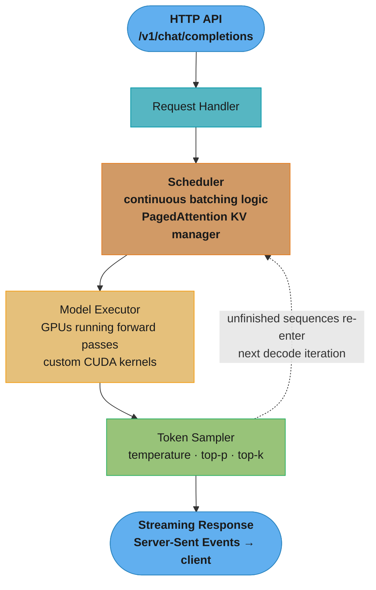
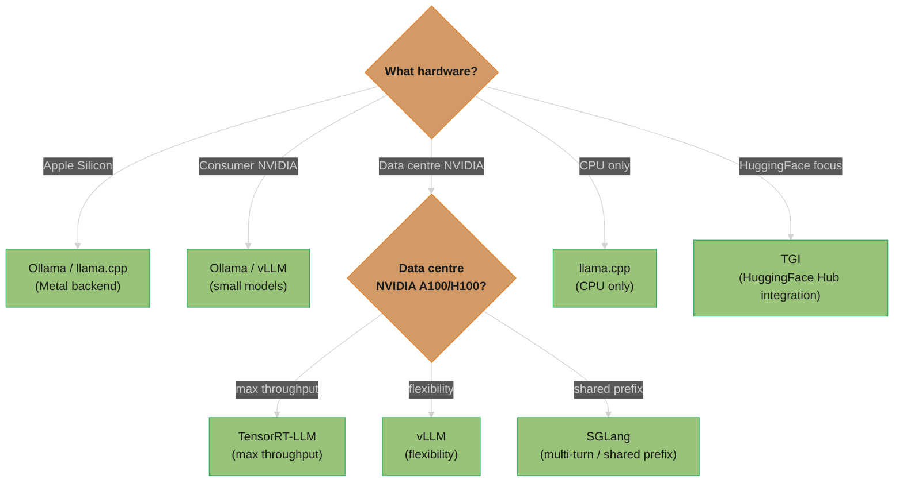

# Inference Engines

## 1. Concept Overview

Inference engines are specialized software systems optimized for running LLM inference efficiently in production. While you can run an LLM with just Hugging Face Transformers' `model.generate()`, this approach leaves most GPU performance on the table. Production inference engines implement continuous batching, KV cache management, optimized CUDA kernels, quantization, and distributed serving to achieve 10-50× better throughput than naive approaches.

The landscape has exploded: vLLM dominates cloud serving; TensorRT-LLM is NVIDIA's highly-optimized offering; llama.cpp enables CPU and consumer GPU inference; SGLang introduces structural caching; Ollama makes local deployment trivial. Each engine makes different trade-offs between ease of use, performance, hardware requirements, and supported models.

---

## 2. Intuition

> **One-line analogy**: Inference engines are like optimized car engines — the same fuel (model weights) produces 10-50× more horsepower (tokens/second) with engineering optimization than a stock implementation.

**Mental model**: Hugging Face `model.generate()` works but leaves GPU resources massively underutilized. Inference engines implement continuous batching (no wasted GPU slots), PagedAttention (no KV cache fragmentation), fused CUDA kernels (fewer memory operations), and quantization (smaller weights = faster loads). vLLM is like a highly tuned racing engine — the same 70B model goes from 50 tokens/sec to 600+ tokens/sec with the same hardware.

**Why it matters**: Inference is where 90%+ of LLM compute costs occur after a model is trained. A 10× throughput improvement means 10× cost reduction or serving 10× more users with the same hardware. Choosing the right inference engine is one of the most impactful engineering decisions in production LLM systems.

**Key insight**: The bottleneck during LLM decoding is memory bandwidth (loading weights from GPU HBM), not compute. Batching amortizes this load; quantization reduces data volume. Both are fundamental to efficient inference.

---

## 3. Core Principles

- **PagedAttention**: Efficient KV cache memory management — the key innovation that made continuous batching practical (full internals: [vLLM Deep Dive](../vllm_deep_dive/README.md)).
- **Continuous batching**: Serve many users efficiently by dynamically adding/removing requests from batches (decoding mechanics: [Inference & Decoding](../inference_and_decoding/README.md)).
- **Kernel fusion**: Custom CUDA kernels that fuse multiple operations (avoiding HBM round-trips).
- **Quantization support**: INT4/INT8/FP8 to reduce memory bandwidth requirements (format tradeoffs: [Optimization & Quantization](../optimization_and_quantization/README.md)).
- **OpenAI-compatible API**: Most engines expose `/v1/completions` and `/v1/chat/completions` endpoints — drop-in replacement for OpenAI SDK.

---

## 4. Engines

### 4.1 vLLM

**The de facto standard for open-source LLM serving.**

**Key innovations:**
- PagedAttention: virtual memory management for KV cache (eliminates fragmentation)
- Continuous batching: maximize GPU utilization across concurrent requests
- OpenAI-compatible API
- Wide model support: LLaMA, Mistral, Mixtral, Qwen, DeepSeek, etc.

```bash
# Installation and startup
pip install vllm

python -m vllm.entrypoints.openai.api_server \
    --model meta-llama/Meta-Llama-3-8B-Instruct \
    --tensor-parallel-size 2 \
    --max-model-len 8192 \
    --gpu-memory-utilization 0.9
```

```python
# Client code (OpenAI-compatible)
from openai import OpenAI

client = OpenAI(base_url="http://localhost:8000/v1", api_key="none")
response = client.chat.completions.create(
    model="meta-llama/Meta-Llama-3-8B-Instruct",
    messages=[{"role": "user", "content": "Hello!"}],
    stream=True
)
```

**Performance (8B model, A100 80GB):**
- Throughput: ~3000-4000 tokens/sec
- Concurrent users: 50-200 depending on context length
- TTFT: 100-500ms for typical inputs

**Best for:** Production serving of large open-source models on cloud GPUs.

### 4.2 TensorRT-LLM (NVIDIA)

NVIDIA's inference optimization library for H100/A100. Highest raw performance but more complex setup.

**Key features:**
- Quantization: INT4, INT8, FP8 with auto-calibration
- Custom CUDA/TensorRT kernels (faster than PyTorch ops)
- In-flight batching (equivalent to continuous batching)
- Multi-GPU with tensor parallelism
- Triton Inference Server integration

```python
# Build engine (one-time compilation step)
trtllm-build \
    --checkpoint_dir ./llama-3-70b \
    --output_dir ./llama-3-70b-engine \
    --dtype bfloat16 \
    --use_inflight_batching \
    --paged_kv_cache enable \
    --max_batch_size 256

# Serve with Triton
tritonserver --model-repository=./triton_models
```

**Performance advantage over vLLM:** ~15-40% higher throughput on H100 due to custom kernels.

**Best for:** Maximum throughput in NVIDIA data center environments; enterprise deployments.

### 4.3 llama.cpp

CPU-first inference engine with Metal (Apple Silicon), CUDA, and OpenCL backends. Enables running LLMs on consumer hardware.

**Key features:**
- GGUF quantized format: Q4_K_M (4-bit with mixed precision)
- Apple Silicon Metal GPU acceleration
- CPU SIMD optimizations (AVX-512, NEON)
- Low memory: 4-bit quantized 7B fits in 4.5GB RAM
- Minimal dependencies: just C/C++

```bash
# Build and run
git clone https://github.com/ggerganov/llama.cpp
cmake -B build && cmake --build build --config Release

./build/bin/llama-cli \
    -m ./models/llama-3.1-8b-instruct-Q4_K_M.gguf \
    --color -ngl 35 -n 512 \
    -p "You are a helpful assistant."

# As server
./build/bin/llama-server -m ./models/llama-3.1-8b-Q4_K_M.gguf --port 8080
```

**Performance (8B Q4_K_M on M3 Pro):**
- ~40 tokens/sec on Apple Silicon M3 Pro
- <5GB RAM usage

**Best for:** Local inference, privacy-sensitive applications, edge devices, development.

### 4.4 SGLang (Stanford)

**Structural caching** innovation: caches KV computations across requests that share prefixes.

**Key features:**
- RadixAttention: cache KV for shared prefixes (e.g., system prompts reused across all users)
- Constraint decoding: force JSON/regex output format efficiently
- Multi-modal support
- Better for multi-turn conversations (reuse context from previous turns)

```python
import sglang as sgl

@sgl.function
def multi_turn_chat(s, messages):
    s += sgl.system("You are a helpful assistant.")
    for msg in messages:
        s += sgl.user(msg["content"])
        s += sgl.assistant(sgl.gen("response", max_tokens=200))
    return s

# RadixAttention reuses KV for the system prompt across all requests
# Massive speedup when many users share the same system prompt
```

**Performance vs vLLM:**
- For multi-turn conversations with shared prefixes: 2-5× faster
- For single-turn with no shared context: roughly equivalent

**Best for:** Multi-turn chat systems, constrained generation (JSON mode), multi-modal.

### 4.5 Ollama

Easiest way to run LLMs locally. One-command download and run.

```bash
# Install
curl -fsSL https://ollama.com/install.sh | sh

# Pull and run
ollama run llama3.1

# Use as API
ollama serve  # starts server on localhost:11434

curl http://localhost:11434/api/chat -d '{
  "model": "llama3.1",
  "messages": [{"role": "user", "content": "Hello!"}]
}'
```

**Features:**
- Automatic hardware detection (CPU/GPU/Metal)
- Model library: 100+ models at ollama.com/library
- OpenAI-compatible API (via `ollama serve`)
- Model management: pull, list, delete

**Best for:** Development, demos, personal use, testing models locally.

### 4.6 HuggingFace TGI (Text Generation Inference)

Production inference server from HuggingFace. Tight integration with HuggingFace Hub.

```bash
docker run --gpus all \
    -p 8080:80 \
    -v $PWD:/data \
    ghcr.io/huggingface/text-generation-inference:2.0 \
    --model-id meta-llama/Meta-Llama-3-8B-Instruct \
    --max-input-length 4096 \
    --max-total-tokens 8192
```

**Features:**
- Continuous batching, flash attention
- HuggingFace Hub model loading (gated models via token)
- Tensor parallelism
- Speculation decoding
- AWQ/GPTQ quantization support
- Streaming

**Best for:** HuggingFace ecosystem, teams already using HuggingFace Hub.

---

## 5. Architecture Diagrams

### vLLM Serving Architecture


The dotted loop is the heart of continuous batching: after every decode step, finished sequences stream out and unfinished ones re-enter the scheduler, which back-fills freed KV pages with queued requests — GPU slots never sit idle waiting for the slowest request in a batch.

### Engine Selection Decision Tree



Use-case shortcuts: development/testing → Ollama; production cloud → vLLM or TensorRT-LLM; edge/privacy → llama.cpp; structured outputs → SGLang.

---

## 6. How It Works — Detailed Mechanics

### Quantization Formats

```
GGUF (llama.cpp):
  Q4_0:   4-bit, simple (fastest, worse quality)
  Q4_K_M: 4-bit, mixed precision key layers (best 4-bit quality/speed)
  Q5_K_M: 5-bit mixed (better quality, more memory)
  Q8_0:   8-bit (near full quality)

AWQ (vLLM, TGI):
  Activation-aware weight quantization
  INT4 with better calibration than GPTQ
  Similar quality to FP16 at 4× memory reduction

GPTQ (vLLM, ExLlamaV2):
  Post-training quantization using Hessian information
  INT4, INT8 variants
  Slightly lower quality than AWQ at same bit-width

FP8 (TensorRT-LLM on H100):
  Requires H100 hardware
  Best quality at 8-bit; hardware-supported
  Near-BF16 quality at 2× memory savings
```

### GPU Memory Planning

```
Example: Serving LLaMA 3 70B, max 4096 context, 50 concurrent users on 2× H100 80GB

Model weights (BF16):  70B × 2 bytes = 140GB (72GB per GPU with TP=2)
Activations:           ~2GB per GPU (small)
KV cache per user:     70B model: 2 × 80 layers × 8 KV heads × 128 dim × 4096 tokens × 2 bytes = 660MB
50 users KV cache:     50 × 660MB = 33GB → 16.5GB per GPU

Total per GPU:
  Weights:    70GB
  KV cache:   16.5GB
  Overhead:   3GB
  ─────────────
  Total:      89.5GB ← exceeds 80GB!

Fix options:
  1. Reduce max users to 32: KV = 32 × 660MB / 2 = 10.5GB → fits
  2. Reduce context to 2048: KV = 330MB × 32 → fits with ~55 users
  3. Quantize to INT4: weights = 35GB → more room for KV cache
  4. Add a 3rd GPU (TP=3)
```

---

## 7. Real-World Examples

### Together AI (vLLM-based)
- Serves 50+ open-source models via API
- vLLM as the core serving engine
- Custom extensions for their multi-tenant environment
- Continuously batches across thousands of users

### Anyscale (vLLM)
- AnyScale Endpoints built on vLLM
- Ray Serve for request routing and scaling
- Auto-scaling: 0 → N replicas based on traffic

### Mistral AI
- Uses TensorRT-LLM for Mistral model serving (their own models)
- Custom optimizations for Mistral architecture (sliding window attention)
- La Plateforme API serves millions of requests/day

### Local AI Community
- llama.cpp runs on everything from Raspberry Pi to M3 MacBooks
- Ollama has 1M+ downloads; most popular way to run models locally
- LM Studio: GUI wrapper around llama.cpp for non-technical users

---

## 8. Tradeoffs

| Engine | Throughput | Ease of Use | Hardware | Model Support | License |
|--------|-----------|-------------|---------|---------------|---------|
| vLLM | Excellent | Good | NVIDIA | Wide | Apache 2.0 |
| TensorRT-LLM | Best | Complex | NVIDIA only | Medium | Apache 2.0 |
| llama.cpp | Good (CPU/edge) | Easy | Any | Wide (GGUF) | MIT |
| SGLang | Excellent (prefix) | Medium | NVIDIA | Good | Apache 2.0 |
| Ollama | Good | Easiest | Any | Good | MIT |
| TGI | Good | Medium | NVIDIA | Wide (HF Hub) | Apache 2.0 |

---

## 9. When to Use / When NOT to Use

### Use vLLM When:
- Production cloud serving of open-source models
- Need continuous batching for many concurrent users
- Need OpenAI-compatible API as drop-in replacement

### Use TensorRT-LLM When:
- Maximum throughput on NVIDIA H100/A100 is the primary goal
- Enterprise with NVIDIA DGX infrastructure
- Willing to invest in longer build/compilation time

### Use llama.cpp When:
- Consumer hardware (MacBook, gaming PC)
- Privacy-first: no cloud, everything local
- Edge deployment (limited memory)

### Use Ollama When:
- Local development and testing
- Non-technical users who want LLMs easily
- Quick model experimentation

---

## 10. Common Pitfalls

1. **Underestimating KV cache memory**: Calculating model weights but forgetting KV cache leads to OOM in production.
2. **Not setting max_model_len**: vLLM defaults to model's max sequence length; if that's 128K tokens, KV cache preallocated for 128K → OOM.
3. **Wrong quantization for hardware**: GGUF Q4 on NVIDIA GPU is slower than AWQ; use appropriate quantization for your hardware.
4. **Ignoring tensor parallel vs pipeline parallel**: TP requires NVLink (within node); PP for across nodes. Wrong choice → slow.
5. **Not benchmarking**: "vLLM is fast" doesn't mean it's fast for YOUR model and workload. Always benchmark with production-representative traffic.

---

## 11. Technologies & Tools

| Tool | Notes |
|------|-------|
| **vLLM** | pip install vllm; industry standard |
| **TensorRT-LLM** | Complex setup; max performance on NVIDIA |
| **llama.cpp** | C++; minimal deps; CPU/Metal/CUDA |
| **SGLang** | Radix attention; constrained gen |
| **Ollama** | One-command local LLMs |
| **HuggingFace TGI** | Docker image; HF Hub integration |
| **LM Studio** | GUI for local models |
| **ExLlamaV2** | Fast GPTQ; consumer GPUs |
| **MLC-LLM** | Mobile/browser inference |
| **ONNX Runtime** | Cross-platform inference |

---

## 12. Interview Questions with Answers

**Q: What is vLLM and what makes it efficient?**
A: vLLM is an open-source LLM inference engine known for two key innovations: (1) PagedAttention — manages KV cache like OS virtual memory, using fixed-size pages to eliminate fragmentation and enable near-zero waste; (2) Continuous batching — dynamically adds/removes requests from batches at each step, so fast requests complete quickly and slow ones don't hold GPU slots. Together these give 10-24× higher throughput than naive HuggingFace inference.

**Q: What is continuous batching and how does it differ from static batching?**
A: Continuous batching (iteration-level scheduling) admits new requests and retires finished ones at every decode step, whereas static batching runs a fixed batch until the longest sequence completes. The mechanism matters because output lengths are wildly variable: in a static batch of 32, one 2,000-token generation holds hostage 31 slots whose outputs finished at 100 tokens, collapsing effective GPU utilization; continuous batching returns each finished sequence immediately and slots a queued request into the freed KV pages at the next iteration. This scheduling change — not faster kernels — accounts for most of the 10-24× gap versus naive `model.generate()`. Gotcha to state in interviews: continuous batching raises aggregate throughput but does not speed up a single isolated request — batch size 1 sees no benefit.

**Q: Why can a vLLM server OOM or refuse to start before serving a single request?**
A: Because vLLM preallocates GPU memory at startup by design: it claims `gpu_memory_utilization` (default 0.9) of the card, loads weights, then runs a profiling pass and reserves everything left over as KV-cache pages sized to `max_model_len`. If `max_model_len` defaults to the model's full training context (128K for many modern models), the profiler may find there is not enough memory for even one maximum-length sequence and abort — or leave so few KV pages that requests queue endlessly. Fix: set `--max-model-len` to your actual max input + output (e.g., 8192) and start at `--gpu-memory-utilization 0.85` to leave headroom for CUDA graphs and NCCL buffers. Corollary gotcha: near-100% GPU memory on an idle vLLM server is normal preallocation, not a leak.

**Q: When would you use llama.cpp vs vLLM?**
A: llama.cpp is designed for CPU and consumer-grade GPU inference — it runs quantized GGUF models on MacBooks, gaming PCs, and even Raspberry Pi. It prioritizes low memory usage and broad hardware support. vLLM is designed for data center GPU (A100, H100) serving with many concurrent users — it prioritizes maximum throughput and efficient GPU utilization. Use llama.cpp for local, edge, or privacy-sensitive deployments; use vLLM for cloud production serving.

**Q: What is the OpenAI-compatible API and why does it matter?**
A: Most inference engines expose endpoints like `POST /v1/chat/completions` and `POST /v1/completions` with request/response formats identical to OpenAI's API. This means any application using the OpenAI SDK can switch from the OpenAI API to a self-hosted model by just changing the base_url. It matters because it eliminates vendor lock-in — you can run GPT-4-equivalent open models without changing application code.

**Q: How does vLLM compare to TensorRT-LLM and when should you choose each?**
vLLM is the best general-purpose open-source inference engine, while TensorRT-LLM offers higher peak performance on NVIDIA GPUs at the cost of more complex setup. vLLM advantages: easier setup (pip install + one command), model support (HuggingFace model hub compatibility), LoRA serving, active community, platform-agnostic. TensorRT-LLM advantages: 20-40% higher throughput on NVIDIA GPUs through kernel fusion, custom CUDA kernels, and FP8 optimization on H100s; better for production workloads with stable model configurations. Choose vLLM when: rapid iteration, multi-model serving, LoRA adapters, or non-NVIDIA hardware. Choose TensorRT-LLM when: maximum throughput on fixed NVIDIA hardware, latency-critical applications, and you have ML infrastructure engineers to handle the compilation pipeline. TensorRT-LLM requires compiling models into TensorRT engines (30-60 minutes per model), making model swaps slower.

**Q: What are TTFT and TPOT, and which engine mechanisms improve each?**
A: TTFT (time to first token) is queueing plus prefill — one compute-bound pass over the whole prompt; TPOT (time per output token, also called inter-token latency) is decode — a memory-bandwidth-bound pass per generated token. The two respond to different levers: prefix caching (vLLM `--enable-prefix-caching`, SGLang RadixAttention) and chunked prefill mainly cut TTFT — a cached 2,000-token system prompt removes hundreds of milliseconds of prompt computation; weight quantization (AWQ/INT4) and speculative decoding mainly cut TPOT, because decode time scales with bytes streamed from HBM per token, not FLOPs. When someone reports "the engine is slow," split the complaint into TTFT vs TPOT first — the fixes barely overlap, and optimizing the wrong phase wastes a sprint.

**Q: How does llama.cpp handle quantization and what quality tradeoffs exist at different quantization levels?**
llama.cpp supports multiple quantization formats: Q8_0 (8-bit, ~1% quality loss), Q5_K_M (5-bit mixed, ~2-3% loss), Q4_K_M (4-bit mixed, ~3-5% loss), Q3_K_M (3-bit, ~5-10% loss), Q2_K (2-bit, ~15-20% loss). The "K" variants use k-quant, which allocates more bits to important layers (attention) and fewer to less important ones (feed-forward). For a 7B model: FP16 = 14GB, Q8_0 = 7GB, Q4_K_M = 4GB, Q2_K = 2.5GB. Quality tradeoffs: Q4_K_M is the sweet spot for most consumer hardware — a 70B model in Q4_K_M (40GB) fits on an M2 Max with 64GB RAM and produces near-FP16 quality for conversational tasks. Below Q4, quality degrades noticeably on reasoning-heavy tasks (math, coding). llama.cpp runs on CPU (AVX2/AVX512), Apple Metal, and CUDA, making it the go-to for consumer hardware and edge deployment. For production servers, vLLM or TensorRT-LLM are preferred because they handle batching and concurrency better.

**Q: What is SGLang's radix attention and how does it improve structured output generation?**
SGLang's radix attention uses a radix tree (prefix tree) to cache and reuse KV cache entries across requests that share common prefixes, similar to vLLM's prefix caching but optimized for structured generation patterns. For structured outputs (JSON, function calls), SGLang's frontend language allows defining generation patterns that automatically share KV cache across branches. Example: generating a JSON object with 5 fields — all fields share the system prompt + schema prefix, and SGLang caches this shared prefix once. Additionally, SGLang's constrained decoding uses a finite state machine (FSM) compiled from the JSON schema, which is faster than Outlines' token-by-token constraint checking. SGLang achieves 2-5x speedup over vLLM for workloads with heavy structured output generation. Choose SGLang when your application generates many structured outputs with shared prompt prefixes (API backends, data extraction pipelines).

**Q: How do you choose between cloud inference (vLLM/TRT-LLM) and edge inference (llama.cpp/Ollama)?**
Cloud inference engines (vLLM, TensorRT-LLM, TGI) are designed for multi-user serving with high concurrency, while edge engines (llama.cpp, Ollama, MLC-LLM) are optimized for single-user, low-resource environments. Decision matrix: (1) Concurrency >1 user — cloud engines (edge engines serialize requests); (2) Hardware — NVIDIA GPUs — vLLM/TRT-LLM; Apple Silicon — llama.cpp/MLX; CPU only — llama.cpp; (3) Model size — >13B parameters — cloud GPUs (edge devices struggle); 1B-7B — edge viable; (4) Latency requirements — <100ms TTFT — cloud with GPU; <1s acceptable — edge; (5) Privacy — data cannot leave device — edge only. Ollama wraps llama.cpp with a user-friendly API and model management, making it ideal for developer machines and prototyping. For mobile deployment: use MLC-LLM (Android/iOS) or ONNX Runtime with quantized models. Production pattern: use cloud inference for real-time features, edge inference for offline-capable features.

**Q: When do you use tensor parallelism vs pipeline parallelism to serve a model too big for one GPU?**
A: Tensor parallelism (TP) splits every weight matrix across GPUs and all-reduces activations inside every layer, so it needs NVLink-class bandwidth (900 GB/s per GPU on H100 SXM) and must stay within one node — `--tensor-parallel-size` up to 8. Pipeline parallelism (PP) splits the model by layers into stages that pass one activation tensor per boundary, tolerating inter-node links (InfiniBand at ~50 GB/s per NIC) — `--pipeline-parallel-size` across nodes. The classic production mistake is TP spanning nodes after a topology change: every layer's all-reduce crosses the slow fabric and throughput drops 5-10×, while "GPU utilization" still looks high. Rule: TP inside the NVLink domain until the model fits, then PP or independent replicas beyond it.

**Q: What is the role of CUDA graphs in LLM inference and when should you disable them?**
CUDA graphs capture a sequence of GPU operations into a replayable graph, eliminating CPU launch overhead for repeated operations. In LLM inference, the decode phase (generating one token at a time) is identical for each step — same kernel launches, same memory patterns — making it ideal for CUDA graphs. vLLM captures CUDA graphs for common batch sizes, reducing per-token CPU overhead from ~1ms to <0.1ms. This matters because decode is memory-bound, and CPU overhead can become the bottleneck at high throughput. When to disable (--enforce-eager in vLLM): (1) debugging — CUDA graphs make error messages unhelpful; (2) variable-shape operations — dynamic batch sizes or sequence lengths cause graph cache misses; (3) memory pressure — CUDA graphs pre-allocate memory for each captured batch size; (4) unsupported operations — some custom attention kernels do not work with graph capture. In production, always enable CUDA graphs unless actively debugging. The v1 architecture in vLLM improves CUDA graph flexibility with more efficient capture strategies.

**Q: What is chunked prefill and what problem does it solve?**
A: Chunked prefill splits a long prompt's prefill into fixed-size chunks (typically 512-2,048 tokens) that are scheduled alongside ongoing decode iterations instead of monopolizing the GPU for one long pass. Without it, a 32K-token prompt arriving at a busy server stalls every in-flight decode for the entire prefill — other users see a multi-second inter-token latency spike, the classic "someone pasted a document and chat froze for everyone" incident. With chunking, decode steps interleave between prompt chunks: the long request's TTFT grows slightly while everyone else's TPOT stays flat. It is enabled by default in recent vLLM versions; tune `max_num_batched_tokens` to trade the new request's TTFT against fleet-wide inter-token latency stability.

**Q: How does vLLM's automatic prefix caching differ from SGLang's RadixAttention?**
A: Both reuse the KV cache of shared prompt prefixes, but at different granularity. vLLM's automatic prefix caching hashes fixed-size KV blocks (16 tokens by default) and reuses exact block-aligned matches; SGLang's RadixAttention maintains a token-level radix tree that matches arbitrary-length shared prefixes across requests and across branches of structured generation. For a single common system prompt, both deliver similar wins. For tree-shaped workloads — few-shot prompt variants, multi-branch JSON filling, multi-turn chats where each turn extends a shared prefix — the radix tree matches more aggressively, which is where SGLang's 2-5× advantage comes from. If your traffic is flat single-turn requests with unique prompts, expect near-parity; benchmark your actual prefix-share rate before switching engines.

**Q: How do inference engines handle model loading and what are the optimization strategies?**
Model loading (downloading weights and transferring to GPU memory) takes 1-10 minutes for large models, creating cold-start latency. Optimization strategies: (1) tensor parallelism loading — load shards in parallel across GPUs rather than sequentially (2-4x faster); (2) memory-mapped loading — mmap the model file and let the OS handle page-level loading (avoids full copy into CPU RAM first); (3) safetensors format — random-access tensor loading without deserializing the entire file (faster than PyTorch .bin format); (4) model caching — keep models in CPU RAM or on fast NVMe for quick reload; (5) pre-warming — load models during deployment before accepting traffic. vLLM loads a 7B model in ~30 seconds on NVMe SSD, 70B in ~3 minutes. For serverless inference (Lambda, Modal), cold start is the primary latency concern — keep instances warm or use shared model caches. Kubernetes strategy: use initContainers to download models from S3/GCS to a local PVC, then the inference container mmaps from local storage.

---

## 13. Best Practices

1. **Set gpu_memory_utilization carefully** — vLLM's default 0.9 (90% of GPU for model + KV cache) is aggressive; start with 0.85 to leave headroom.
2. **Set max_model_len explicitly** — don't let the engine default to model's maximum; set it to your actual max input + output.
3. **Enable tensor parallelism across your GPUs** — multi-GPU almost always worth it for batch throughput.
4. **Monitor queue depth** — if requests are queuing, add replicas; if GPU utilization is low, reduce replicas.
5. **Use quantization in production** — INT4/AWQ reduces cost 4× with <5% quality loss; almost always worth it.
6. **Run load tests before launch** — find your throughput ceiling before users hit it.

---

## 14. Case Study: Migrating from OpenAI API to Self-Hosted vLLM

**Problem:** SaaS startup spending ~$36K/month on OpenAI API for their writing assistant — historically built on the GPT-4-class endpoint. Want to reduce costs and eliminate vendor dependency.

**Assessment:**
- Traffic: 10M tokens/day input, 15M tokens/day output
- Latency requirement: TTFT < 1s, TPOT < 50ms
- Quality requirement: blind A/B on real writing tasks showed ~GPT-3.5-turbo quality suffices — the GPT-4-class endpoint was overkill for this workload
- Privacy: no PII in prompts

**Model choice:** Mistral 7B Instruct → meets quality bar for writing tasks

**Infrastructure:**
```
4× NVIDIA A100 80GB (on-demand: ~$12/hr)
vLLM with:
  --model mistralai/Mistral-7B-Instruct-v0.3
  --tensor-parallel-size 1  (7B fits on one GPU)
  --max-model-len 8192
  --gpu-memory-utilization 0.85
  --max-num-seqs 256  (concurrent requests)

4 separate vLLM instances, load-balanced by Nginx
```

**Cost comparison:**
```
Current OpenAI bill (GPT-4-class pricing, $0.03/$0.06 per 1K):
  10M input  × $0.03/1K = $300/day
  15M output × $0.06/1K = $900/day
  Total: $1,200/day = $36,000/month
  (gpt-3.5-turbo pricing would be only ~$40/day — but the product was
   built on the GPT-4-class endpoint, which is what the bill reflects)

Self-hosted vLLM:
  4× A100 at $12/hr × 24hr = $1152/day
  Wait — that's MORE expensive!

Key insight: Use spot/reserved instances
  Reserved 1-year: ~$4/hr per GPU
  4× A100 × $4 × 24 = $384/day = $11,520/month

Still more? Use fewer GPUs with better utilization:
  1× A100 handles 25M tokens/day = $4/hr × 24 = $96/day = $2,880/month
  Add 1 standby = $5,760/month total

Final: $5,760/month vs $36,000/month → 84% cost reduction
Quality: Acceptable — Mistral 7B matched the ~GPT-3.5-turbo bar the A/B set;
         the delta vs the old GPT-4-class endpoint was invisible for these
         writing tasks (that endpoint was the overkill being paid for)
```

---

**Additional war story — vLLM PagedAttention eviction collision at 200 RPS causing garbled responses:**

A team running a 13B Mistral model on vLLM at 200 RPS discovered that 0.3% of responses were garbled (output tokens from one request appearing in another). Root cause: they were using vLLM 0.2.x with a custom multi-process setup that bypassed the block manager's eviction locking. When two requests competed for the same KV block slot during peak load, the block was reassigned before the first request finished reading it. The fix required upgrading to vLLM 0.4+ (where block manager uses atomic CAS on block state) and removing the custom multi-process shim.

```python
# BROKEN: custom multi-process vLLM wrapper that bypasses block manager safety
import multiprocessing
from vllm import LLM, SamplingParams

def worker_process(request_queue, result_queue, model_path):
    llm = LLM(model=model_path, tensor_parallel_size=1)
    while True:
        request = request_queue.get()
        # BUG: multiple workers share GPU memory via custom CUDA IPC — not supported by vLLM block manager
        result = llm.generate([request["prompt"]], SamplingParams(max_tokens=256))
        result_queue.put(result)

# FIX: use vLLM's built-in async engine with proper async serving
from vllm.engine.async_llm_engine import AsyncLLMEngine
from vllm.engine.arg_utils import AsyncEngineArgs
import asyncio

engine_args = AsyncEngineArgs(
    model="mistralai/Mistral-7B-Instruct-v0.2",
    tensor_parallel_size=2,        # use 2 GPUs via NVLink, not custom IPC
    max_num_seqs=256,              # max concurrent sequences
    max_num_batched_tokens=32768,  # continuous batching token budget
    block_size=16,                 # KV cache block size in tokens
    gpu_memory_utilization=0.90,   # leave 10% headroom for CUDA overhead
)
engine = AsyncLLMEngine.from_engine_args(engine_args)

async def generate(prompt: str, request_id: str) -> str:
    from vllm import SamplingParams
    params = SamplingParams(temperature=0.7, max_tokens=256)
    output_text = ""
    async for output in engine.generate(prompt, params, request_id=request_id):
        output_text = output.outputs[0].text
    return output_text
```

**Additional interview Q&As:**

**What is the key architectural difference between vLLM's PagedAttention and the standard KV cache, and why does it matter at 200 RPS?** Standard KV cache allocates a contiguous memory block per sequence at request arrival (maximum sequence length × layers × heads × head_dim × 2 bytes). At 200 RPS with 13B model and 2048 max tokens, 200 concurrent sequences × ~800MB each would require 160GB — far exceeding single-GPU capacity. PagedAttention divides KV memory into fixed-size blocks (16-32 tokens each) allocated on demand and shared across beam search hypotheses via copy-on-write. This reduces fragmentation from 30-40% (contiguous allocation) to under 4%, enabling 2-4x more concurrent sequences on the same hardware.

**When should you choose TGI (Text Generation Inference) over vLLM for a 13B model production deployment?** TGI is preferred when: you need native HuggingFace model hub integration without conversion; you are deploying on AWS SageMaker (official TGI container support); you need built-in Prometheus metrics and health endpoints without additional instrumentation; you want a battle-tested production container maintained by HuggingFace. vLLM is preferred when: you need maximum throughput via PagedAttention (vLLM is typically 10-30% higher throughput than TGI for long outputs); you need speculative decoding; you need fine-grained control over scheduling. At 200 RPS with P95 < 500ms, vLLM consistently outperforms TGI in benchmarks.

**How do you right-size the number of GPU replicas for a 13B model serving 200 RPS with P95 < 500ms SLA?** Measure throughput at saturation: a single A100 80GB running Mistral-13B at FP16 achieves approximately 85-120 tokens/second throughput with continuous batching (varies with batch size and sequence length). At 200 RPS × 128 average output tokens = 25,600 tokens/second demand. Minimum replicas: ceil(25,600 / 100) = 26 A100s, but this ignores head-of-line blocking and latency requirements. For P95 < 500ms with queue jitter, target 60% GPU utilization at peak → 43 A100s. Add auto-scaling based on queue depth metric (HPA on Kubernetes) to handle bursty traffic.

**Quick-reference table:**

| Engine | Throughput (13B, A100) | Best for | Trade-off |
|---|---|---|---|
| vLLM (PagedAttention) | Highest (~30% above TGI) | Maximum throughput, speculative decoding, complex batching | Steeper ops complexity; less HuggingFace native integration |
| TGI (HuggingFace) | High | AWS SageMaker, HuggingFace Hub, production-ready container | Slightly lower throughput; less flexible scheduling |
| llama.cpp | Low-medium (CPU/low VRAM) | Edge deployment, MacBook M-series, 4-bit quantized models | Not suitable for multi-user high-RPS serving; no continuous batching |
| SGLang | High (RadixAttention prefix caching) | High prefix reuse (system prompts, RAG boilerplate) | Smaller community; fewer deployment examples |

**Pitfall — vLLM PagedAttention fragmentation under long-context requests wastes GPU memory.**

```python
# BROKEN: mixing short (256-token) and long (32k-token) requests in the same vLLM instance
# PagedAttention allocates KV cache pages on demand; long requests hold many pages
# short requests can't get pages even though most GPU memory is "reserved but unused"
# by long-running incomplete requests → OOM despite 40% average utilization

# FIX: separate serving pools by expected context length
# Short-context pool (4k max): high concurrency, small KV cache pages
# Long-context pool (32k max): low concurrency, dedicated memory, separate replica

# vllm serve configuration for short-context pool:
# --max-model-len 4096 --gpu-memory-utilization 0.85 --max-num-seqs 256

# vllm serve configuration for long-context pool:
# --max-model-len 32768 --gpu-memory-utilization 0.90 --max-num-seqs 16

# Router: classify request by estimated output length at ingestion time
def route_request(prompt: str) -> str:
    estimated_tokens = len(tokenizer.encode(prompt)) * 2   # rough output estimate
    return "long-pool" if estimated_tokens > 4096 else "short-pool"
```

**How do you benchmark and choose between vLLM, TGI, and llama.cpp for a specific workload?** Run the same workload (1000 requests, matching your production QPS and input/output length distribution) against each engine. Measure: throughput (tokens/sec), p50/p99 latency, GPU utilization, and peak memory. vLLM wins on throughput for high-concurrency online serving with PagedAttention (20-40% more throughput than TGI at 50+ concurrent requests). TGI wins on ease of deployment and broad model support. llama.cpp wins on CPU/edge serving and quantized models (GGUF format). For A100 GPU serving at 50+ RPS: vLLM is the default choice; for < 10 RPS or CPU-only: llama.cpp with Q4_K_M quantization.

**What is speculative decoding and which engine implements it most effectively?** Speculative decoding uses a small draft model (e.g., Llama-68M) to propose K tokens speculatively, then verifies all K with the large model in a single forward pass — accepting correct tokens and regenerating from the first mismatch. Throughput gain: 2-3× for short-output, repetitive tasks (code completion, structured extraction). vLLM supports speculative decoding natively (`--speculative-model`). The gain is highest when the draft model acceptance rate is > 75% — measure this by logging `speculative_tokens_accepted / speculative_tokens_proposed` in production and tune the draft model if acceptance falls below 60%.

---

**Quick-reference decision table:**

| Scenario | Recommended approach | Key constraint |
|---|---|---|
| < 10k training examples | LoRA / few-shot prompting | Data scarcity |
| Latency < 100ms required | Quantized model + ONNX Runtime | Throughput > accuracy |
| Multi-tenant, shared model | System prompt isolation + guardrails | Security boundary |
| Domain shift from pre-training | Fine-tune with domain data | Catastrophic forgetting risk |
| Cost reduction (10× target) | Smaller model + prompt optimization | Quality floor |

**Production checklist before shipping an LLM feature:**

- [ ] Latency p99 measured under production load (not just median)
- [ ] Fallback path tested: what happens when the LLM API is unavailable?
- [ ] Cost per request calculated at current and 10× scale
- [ ] Safety/guardrail evaluation on 200 adversarial prompts
- [ ] Prompt versioned in code and tied to model version in experiment tracker
- [ ] Human evaluation on 50 random production outputs before launch
- [ ] Monitoring dashboard live: latency, error rate, cost, quality proxy metric
