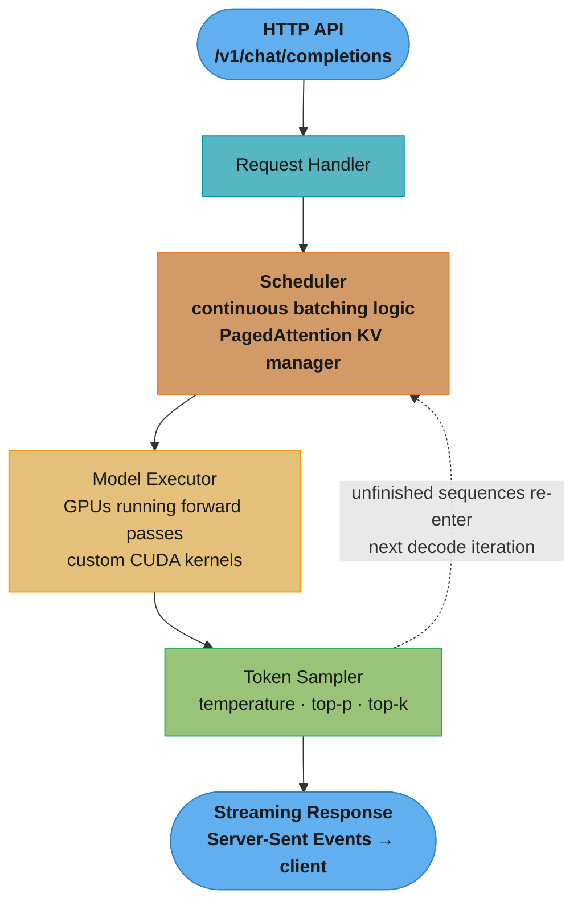
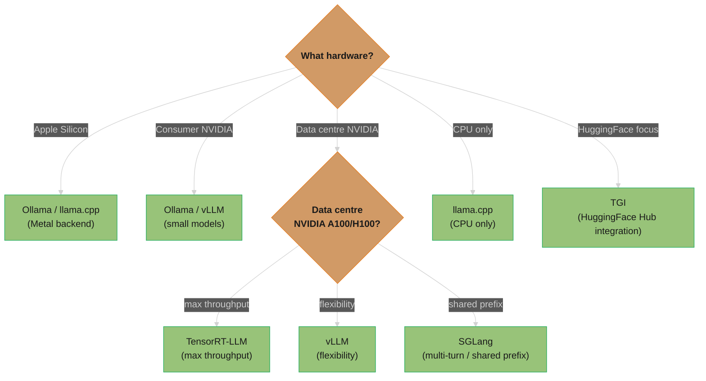

# Inference Engines

## 1. Concept Overview

Inference engines are specialized software systems optimized for running LLM inference efficiently in production. While you can run an LLM with just Hugging Face Transformers' `model.generate()`, this approach leaves most GPU performance on the table. Production inference engines implement continuous batching, KV cache management, optimized CUDA kernels, quantization, and distributed serving to achieve up to ~24× better throughput than naive approaches (vLLM's own published figure versus Hugging Face Transformers).

The landscape has exploded: vLLM dominates cloud serving; TensorRT-LLM is NVIDIA's highly-optimized offering; llama.cpp enables CPU and consumer GPU inference; SGLang introduces structural caching; Ollama makes local deployment trivial. Each engine makes different trade-offs between ease of use, performance, hardware requirements, and supported models.

---

## 2. Intuition

> **One-line analogy**: Inference engines are like optimized car engines — the same fuel (model weights) produces an order of magnitude more horsepower (tokens/second) with engineering optimization than a stock implementation.

**Mental model**: Hugging Face `model.generate()` works but leaves GPU resources massively underutilized. Inference engines implement continuous batching (no wasted GPU slots), PagedAttention (no KV cache fragmentation), fused CUDA kernels (fewer memory operations), and quantization (smaller weights = faster loads). vLLM is like a highly tuned racing engine — the same 70B model goes from 50 tokens/sec to 600+ tokens/sec with the same hardware.

**Why it matters**: Inference dominates spend once a model is trained — AWS's published figure is that up to 90% of the infrastructure cost of developing and running ML applications goes to inference. A 10× throughput improvement means 10× cost reduction or serving 10× more users with the same hardware. Choosing the right inference engine is one of the most impactful engineering decisions in production LLM systems.

**Key insight**: The bottleneck during LLM decoding is memory bandwidth (loading weights from GPU HBM), not compute. Batching amortizes this load; quantization reduces data volume. Both are fundamental to efficient inference.

---

## 3. Core Principles

- **PagedAttention**: Efficient KV cache memory management — the key innovation that made continuous batching practical (full internals: [vLLM Deep Dive](../vllm_deep_dive/README.md)).
- **Continuous batching**: Serve many users efficiently by dynamically adding/removing requests from batches (decoding mechanics: [Inference & Decoding](../inference_and_decoding/README.md)).
- **Kernel fusion**: Custom CUDA kernels that fuse multiple operations (avoiding HBM round-trips).
- **Quantization support**: INT4/INT8/FP8 to reduce memory bandwidth requirements (format tradeoffs: [Optimization & Quantization](../optimization_and_quantization/README.md)).
- **OpenAI-compatible API**: Most engines expose `/v1/completions` and `/v1/chat/completions` endpoints — drop-in replacement for OpenAI SDK.

---

## 4. Engines

### 4.1 vLLM

**The de facto standard for open-source LLM serving.**

**Key innovations:**
- PagedAttention: virtual memory management for KV cache (eliminates fragmentation)
- Continuous batching: maximize GPU utilization across concurrent requests
- OpenAI-compatible API
- Wide model support: LLaMA, Mistral, Mixtral, Qwen, DeepSeek, etc.

```bash
# Installation and startup
pip install vllm

vllm serve meta-llama/Meta-Llama-3-8B-Instruct \
    --tensor-parallel-size 2 \
    --max-model-len 8192 \
    --gpu-memory-utilization 0.9
```

```python
# Client code (OpenAI-compatible)
from openai import OpenAI

client = OpenAI(base_url="http://localhost:8000/v1", api_key="none")
response = client.chat.completions.create(
    model="meta-llama/Meta-Llama-3-8B-Instruct",
    messages=[{"role": "user", "content": "Hello!"}],
    stream=True
)
```

**Performance envelope (8B model, A100 80GB) — a planning envelope, not a benchmark.** These
three figures are *derived* from the memory-bandwidth ceiling in Section 6 (2.0 TB/s of HBM
divided by 16 GB of FP16 weights = 125 tokens/sec per batch slot, times the batch of roughly 32
that vLLM typically reaches on this shape), not read off a published vLLM run. They are the
right numbers to start a capacity plan with and the wrong numbers to sign an SLA against —
reproduce them with `vllm bench serve` on your own model and input/output length distribution
before sizing a fleet:
- Throughput: ~3000-4000 tokens/sec
- Concurrent users: 50-200 depending on context length
- TTFT: 100-500ms for typical inputs

**Best for:** Production serving of large open-source models on cloud GPUs.

### 4.2 TensorRT-LLM (NVIDIA)

NVIDIA's inference optimization library for data-centre GPUs (A100/H100/Blackwell). Highest raw performance, and a PyTorch-architected framework: PyTorch is the sole execution backend, and `trtllm-serve` loads a HuggingFace checkpoint directly with no ahead-of-time engine build.

**Key features:**
- Quantization: INT4, INT8, FP8 with auto-calibration
- Custom CUDA kernels (faster than stock PyTorch ops)
- In-flight batching (equivalent to continuous batching)
- Multi-GPU with tensor / pipeline / expert parallelism
- Triton Inference Server integration

```bash
# Serves a HuggingFace checkpoint directly. The `pytorch` backend is the
# default and needs no engine build step. Console scripts that ship:
# trtllm-serve, trtllm-bench, trtllm-eval.
trtllm-serve meta-llama/Meta-Llama-3-70B-Instruct \
    --backend pytorch \
    --tp_size 4 \
    --max_batch_size 256 \
    --max_seq_len 8192 \
    --kv_cache_free_gpu_memory_fraction 0.9
```

**Performance advantage over vLLM:** commonly reported in the 15-40% band on NVIDIA hardware, driven by hand-tuned kernels and FP8. Treat that band as illustrative — the gap is model-, shape- and version-specific and both projects leapfrog each other, so benchmark your own traffic before committing.

**Best for:** Maximum throughput in NVIDIA data center environments; enterprise deployments.

### 4.3 llama.cpp

CPU-first inference engine with Metal (Apple Silicon), CUDA, Vulkan and SYCL backends (plus narrower ones such as OpenCL for Adreno and HIP for AMD). Enables running LLMs on consumer hardware.

**Key features:**
- GGUF quantized format: Q4_K_M (4-bit with mixed precision)
- Apple Silicon Metal GPU acceleration
- CPU SIMD optimizations (AVX-512, NEON)
- Low memory: 4-bit quantized 7B fits in 4.5GB RAM
- Minimal dependencies: just C/C++

```bash
# Build and run
git clone https://github.com/ggml-org/llama.cpp
cmake -B build && cmake --build build --config Release

./build/bin/llama-cli \
    -m ./models/llama-3.1-8b-instruct-Q4_K_M.gguf \
    --color -ngl 35 -n 512 \
    -p "You are a helpful assistant."

# As server
./build/bin/llama-server -m ./models/llama-3.1-8b-Q4_K_M.gguf --port 8080
```

**Performance (8B Q4_K_M on M3 Pro):**
- ~20-25 tokens/sec single-user decode. The M3 Pro has 150 GB/s of memory
  bandwidth and the model is ~4.9GB, so the ceiling from §6 is 150/4.9 ≈ 30 tokens/sec
  — Max/Ultra-class parts with 400-800 GB/s are the ones that reach 40-140 tokens/sec
- ~5-6GB RAM usage (weights plus KV cache)

**Best for:** Local inference, privacy-sensitive applications, edge devices, development.

### 4.4 SGLang (LMSYS; Zheng et al., NeurIPS 2024)

**Structural caching** innovation: caches KV computations across requests that share prefixes.

**Key features:**
- RadixAttention: cache KV for shared prefixes (e.g., system prompts reused across all users)
- Constraint decoding: force JSON/regex output format efficiently
- Multi-modal support
- Better for multi-turn conversations (reuse context from previous turns)

```python
import sglang as sgl

@sgl.function
def multi_turn_chat(s, messages):
    s += sgl.system("You are a helpful assistant.")
    for msg in messages:
        s += sgl.user(msg["content"])
        s += sgl.assistant(sgl.gen("response", max_tokens=200))
    return s

# RadixAttention reuses KV for the system prompt across all requests
# Massive speedup when many users share the same system prompt
```

**Performance vs vLLM:**
- The SGLang paper's own headline is **up to 6.4x higher throughput** vs state-of-the-art
  inference systems, across agent control, logical reasoning, few-shot benchmarks, JSON
  decoding, RAG pipelines and multi-turn chat (arXiv 2312.07104). "Up to", across a mixed
  suite — there is no published band for multi-turn shared-prefix chat on its own
- For single-turn with no shared context: roughly equivalent
- Treat the headline as an upper bound rather than a forecast: your gain is a function of your
  own prefix-share rate, and vLLM has shipped automatic prefix caching since the paper. Measure
  the share of tokens your traffic actually reuses before choosing an engine on this basis

**Best for:** Multi-turn chat systems, constrained generation (JSON mode), multi-modal.

### 4.5 Ollama

Easiest way to run LLMs locally. One-command download and run.

```bash
# Install
curl -fsSL https://ollama.com/install.sh | sh

# Pull and run
ollama run llama3.1

# Use as API
ollama serve  # starts server on localhost:11434

curl http://localhost:11434/api/chat -d '{
  "model": "llama3.1",
  "messages": [{"role": "user", "content": "Hello!"}]
}'
```

**Features:**
- Automatic hardware detection (CPU/GPU/Metal)
- Model library: 200+ curated models at ollama.com/library
- OpenAI-compatible API (via `ollama serve`)
- Model management: pull, list, delete

**Best for:** Development, demos, personal use, testing models locally.

### 4.6 HuggingFace TGI (Text Generation Inference)

Production inference server from HuggingFace. Tight integration with HuggingFace Hub.

```bash
docker run --gpus all \
    -p 8080:80 \
    -v $PWD:/data \
    ghcr.io/huggingface/text-generation-inference:3.3.7 \
    --model-id meta-llama/Meta-Llama-3-8B-Instruct \
    --max-input-tokens 4096 \
    --max-total-tokens 8192
```

**Features:**
- Continuous batching, flash attention
- HuggingFace Hub model loading (gated models via token)
- Tensor parallelism
- Speculation decoding
- AWQ/GPTQ quantization support
- Streaming

**Best for:** HuggingFace ecosystem, teams already using HuggingFace Hub.

---

## 5. Architecture Diagrams

### vLLM Serving Architecture

```mermaid
flowchart TD
    classDef io      fill:#61afef,stroke:#2e86c1,color:#1a1a1a,font-weight:bold
    classDef frozen  fill:#c678dd,stroke:#9b59b6,color:#fff
    classDef train   fill:#98c379,stroke:#27ae60,color:#1a1a1a
    classDef mathOp  fill:#d19a66,stroke:#e67e22,color:#1a1a1a,font-weight:bold
    classDef lossN   fill:#e06c75,stroke:#c0392b,color:#fff,font-weight:bold
    classDef req     fill:#56b6c2,stroke:#0097a7,color:#1a1a1a
    classDef base    fill:#e5c07b,stroke:#f39c12,color:#1a1a1a

    API(["HTTP API\n/v1/chat/completions"])
    RH["Request Handler"]
    SCH["Scheduler\ncontinuous batching logic\nPagedAttention KV manager"]
    EXE["Model Executor\nGPUs running forward passes\ncustom CUDA kernels"]
    SAMP["Token Sampler\ntemperature · top-p · top-k"]
    SSE(["Streaming Response\nServer-Sent Events → client"])

    API --> RH --> SCH --> EXE --> SAMP --> SSE
    SAMP -.->|"unfinished sequences re-enter\nnext decode iteration"| SCH

    class API,SSE io
    class RH req
    class SCH mathOp
    class EXE base
    class SAMP train
```

The dotted loop is the heart of continuous batching: after every decode step, finished sequences stream out and unfinished ones re-enter the scheduler, which back-fills freed KV pages with queued requests — GPU slots never sit idle waiting for the slowest request in a batch.

### Engine Selection Decision Tree


```mermaid
%%{init: {'flowchart': {'curve': 'basis'}, 'theme': 'dark'}}%%
flowchart TD
    classDef io      fill:#61afef,stroke:#2e86c1,color:#1a1a1a,font-weight:bold
    classDef frozen  fill:#c678dd,stroke:#9b59b6,color:#fff
    classDef train   fill:#98c379,stroke:#27ae60,color:#1a1a1a
    classDef mathOp  fill:#d19a66,stroke:#e67e22,color:#1a1a1a,font-weight:bold
    classDef lossN   fill:#e06c75,stroke:#c0392b,color:#fff,font-weight:bold
    classDef req     fill:#56b6c2,stroke:#0097a7,color:#1a1a1a
    classDef base    fill:#e5c07b,stroke:#f39c12,color:#1a1a1a

    HW{"What hardware?"}
    MAC["Ollama / llama.cpp\n(Metal backend)"]
    CONS["Ollama / vLLM\n(small models)"]
    DC{"Data centre\nNVIDIA A100/H100?"}
    TRT["TensorRT-LLM\n(max throughput)"]
    VLM["vLLM\n(flexibility)"]
    SGL["SGLang\n(multi-turn / shared prefix)"]
    CPU["llama.cpp\n(CPU only)"]
    TGI["TGI\n(HuggingFace Hub integration)"]

    HW -->|"Apple Silicon"| MAC
    HW -->|"Consumer NVIDIA"| CONS
    HW -->|"Data centre NVIDIA"| DC
    HW -->|"CPU only"| CPU
    HW -->|"HuggingFace focus"| TGI
    DC -->|"max throughput"| TRT
    DC -->|"flexibility"| VLM
    DC -->|"shared prefix"| SGL

    class HW,DC mathOp
    class MAC,CONS,TRT,VLM,SGL,CPU,TGI train
```

Use-case shortcuts: development/testing → Ollama; production cloud → vLLM or TensorRT-LLM; edge/privacy → llama.cpp; structured outputs → SGLang.

---

## 6. How It Works — Detailed Mechanics

### Quantization Formats

```
GGUF (llama.cpp):
  Q4_0:   4-bit, simple (fastest, worse quality)
  Q4_K_M: 4-bit, mixed precision key layers (best 4-bit quality/speed)
  Q5_K_M: 5-bit mixed (better quality, more memory)
  Q8_0:   8-bit (near full quality)

AWQ (vLLM, TGI):
  Activation-aware weight quantization
  INT4 with better calibration than GPTQ
  Similar quality to FP16 at 4× memory reduction

GPTQ (vLLM, ExLlamaV2):
  Post-training quantization using Hessian information
  INT4, INT8 variants
  Slightly lower quality than AWQ at same bit-width

FP8 (TensorRT-LLM on Hopper/Ada/Blackwell):
  Needs FP8 tensor cores — H100/H200, L4/L40S, B200. NOT on A100 (Ampere)
  Best quality at 8-bit; hardware-supported
  Near-BF16 quality at 2× memory savings
```

### GPU Memory Planning

```
Example: Serving LLaMA 3 70B, max 4096 context, 50 concurrent users on 2× H100 80GB

Model weights (BF16):  70B × 2 bytes = 140GB (70GB per GPU with TP=2)
Activations:           ~2GB per GPU (small)
KV cache per user:     70B model: 2 × 80 layers × 8 KV heads × 128 dim × 2048 tokens × 2 bytes
                       = 671,088,640 bytes ≈ 670MB
                       (at 4096 tokens this doubles to ~1.34GB)
50 users KV cache:     50 × 670MB = 33.5GB → 16.8GB per GPU

Total per GPU:
  Weights:    70GB
  KV cache:   16.8GB
  Overhead:   3GB
  ─────────────
  Total:      89.8GB ← exceeds 80GB!

Headroom left for KV after weights + overhead: 80 - 70 - 3 = 7GB per GPU (14GB across TP=2).
Every fix below has to land inside that 7GB, which is a brutal constraint:

Fix options:
  1. Reduce max users to 20: KV = 20 × 670MB / 2 = 6.7GB per GPU → fits (barely)
  2. Halve context to 1024: KV = 335MB/user → 40 users in the same 6.7GB
  3. Quantize weights to INT4: 35GB total = 17.5GB per GPU, leaving 59.5GB per GPU
     for KV → ~177 users at 2048 context (59.5GB ÷ 335MB). Quantization buys far
     more than trimming users
  4. Widen to TP=4: 35GB of weights per GPU, ~42GB per GPU left for KV. TP shards the
     KV cache too, so each user costs 670MB / 4 = 167MB per GPU → ~250 users.
     (TP must divide num_kv_heads=8, so TP ∈ {1,2,4,8} — TP=3 is not a legal shape here)
```

**The idea behind it.** "Each GPU must simultaneously hold the weights, one KV cache per
active user, and a little scratch space — and only the KV cache grows with traffic."

Weights are a fixed toll you pay before serving a single token. The KV cache is the *variable* cost,
and it is what actually decides how many users fit on the card. This is why capacity planning is
always "solve for the number of concurrent users", never "solve for the model".

| Symbol | What it is |
|--------|------------|
| `P` | Parameter count. 70B = 70 × 10^9 weights |
| `bytes_per_element` | 2 for BF16/FP16, 1 for INT8/FP8, 0.5 for INT4 |
| `num_layers` | Transformer blocks stacked. 80 for LLaMA 3 70B |
| `num_kv_heads` | Attention heads that keep their own K and V. GQA shrinks this |
| `head_dim` | Width of one head's vector. 128 in every LLaMA 3 size |
| `× 2` (leading) | One copy for K, one copy for V. Not a fudge factor |
| `TP` | Tensor-parallel degree — how many GPUs the weights are sliced across |

**Walk one example.** LLaMA 3 70B, BF16, GQA with 8 KV heads:

```
  weights          = P x bytes_per_element
                   = 70e9 x 2               = 140 GB total
                   / TP=2                   =  70 GB per GPU

  KV per token     = 2 x num_layers x num_kv_heads x head_dim x bytes
                   = 2 x 80 x 8 x 128 x 2   = 327,680 B  ~= 0.33 MB per token

  KV per user      = 327,680 B x context
                     context 2048           = 671 MB      <- the "670MB" above
                     context 4096           = 1.34 GB

  50 users @ 2048  = 50 x 671 MB = 33.5 GB  -> 16.8 GB per GPU with TP=2

  per-GPU total    = 70 GB weights + 16.8 GB KV + 3 GB overhead = 89.8 GB
                     H100 capacity          = 80 GB
                     overdraw               =  9.8 GB       <- does not fit
```

Note the reconciliation: the `670MB` figure in the block above is the **2,048-token** number, not
the 4,096-token one. At the stated 4,096 context the same 50 users need 67 GB of KV cache — 33.5 GB
per GPU — so the per-GPU total becomes 106.5 GB and the overdraw is not 9.8 GB but 26.5 GB. Only the
KV term doubles while the 7 GB of headroom stays fixed, so the deficit grows ~2.7x, not 2x: the plan
fails considerably harder than the first pass suggests.

**Why the leading `× 2` exists.** Drop it and every estimate is exactly half the truth, which is the
single most common way teams OOM in week one: they size for K, forget V, ship, and discover the
gap only when the fiftieth user connects. The `num_kv_heads` term is the other trap — using
`num_attention_heads` (32 for the 8B, 64 for the 70B) instead of `num_kv_heads` (8 for both)
inflates the estimate 4-8× on any GQA model and sends you buying GPUs you do not need.

### Throughput vs Latency — Little's Law

The two numbers people argue about are bound by one identity:

```
concurrency = throughput x latency          (Little's Law)

  N   = X x R
  N   = sequences in flight  (vLLM: max_num_seqs)
  X   = completed requests per second
  R   = end-to-end latency per request (seconds)
```

**Stated plainly.** "You cannot pick throughput and latency independently — fix any two
of concurrency, throughput, and latency, and the third is already decided."

That framing kills the most common planning error: promising both "10× throughput" and "unchanged
p99 latency" on the same hardware. Batching buys throughput by *raising* the number of sequences in
flight, and each of those sequences waits behind the others in every decode step.

| Symbol | What it is |
|--------|------------|
| `N` | Sequences resident in the engine at once. The `--max-num-seqs` knob |
| `X` | Throughput — requests finished per second (or tokens/sec if you count tokens) |
| `R` | Residence time — arrival to last token. TTFT + (output_tokens × TPOT) |
| `TTFT` | Time to first token. Queue wait + one prefill pass |
| `TPOT` | Time per output token. One decode step, memory-bandwidth-bound |

**Walk one example.** vLLM, 8B on one A100 80GB, using the numbers from §4.1:

```
  aggregate throughput            = 3,500 tokens/sec   (mid of the 3000-4000 range)
  per-user decode speed           =    50 tokens/sec   (TPOT = 20 ms)

  concurrent users N              = 3,500 / 50         = 70 users
                                                         (inside the "50-200" range above)

  average request = 200 in + 256 out
    R = TTFT + 256 x TPOT
      = 0.30 s + 256 x 0.020 s   = 0.30 + 5.12         = 5.42 s

  request throughput X            = N / R = 70 / 5.42  = 12.9 req/sec
  daily capacity                  = 12.9 x 86,400 x 256 tokens
                                                        = 285M output tokens/day
```

Now push `--max-num-seqs` from 70 to 140. Aggregate throughput does *not* double — it is already
near the bandwidth ceiling (next block), so `X` stays ~3,500 tokens/sec while `N` doubles, and
Little's Law forces `R` to double: every user's decode speed halves to 25 tokens/sec. The fleet
serves the same tokens per second and every single user perceives the server as twice as slow.

### The Memory-Bandwidth Ceiling on Tokens/sec

Decode is bandwidth-bound, so the hardware sets a hard ceiling before any kernel is written:

```
tokens/sec ceiling = (HBM bandwidth) / (bytes read per decode step)

  bytes read per decode step ~= model weight bytes  (every weight is touched once)
  a batch of B sequences reads those weights ONCE and emits B tokens
```

**What the formula is telling you.** "Each decode step has to drag the entire model out of HBM, so the
fastest you can possibly go is bandwidth divided by model size — and batching is the only way to
amortize that read across more than one token."

This is the sentence behind the module's key insight. It also explains why quantization is a
*latency* lever and not just a memory lever: halving the bytes read halves the step time directly.

| Symbol | What it is |
|--------|------------|
| `HBM` | High-bandwidth memory on the GPU. A100 80GB: ~2.0 TB/s; H100: ~3.35 TB/s |
| `B` | Batch size — how many sequences step together |
| bytes/step | Weight bytes streamed per decode iteration. `P × bytes_per_element` |
| arithmetic intensity | FLOPs done per byte read. Decode at B=1 is ~1 — dismal |

**Walk one example.** LLaMA 3 8B, FP16 (16 GB of weights), A100 80GB at 2.0 TB/s:

```
  B = 1     2,000 GB/s / 16 GB   =   125 tokens/sec      <- single-user ceiling
  B = 8     125 x 8              = 1,000 tokens/sec
  B = 32    125 x 32             = 4,000 tokens/sec      <- matches the 3000-4000 above
  B = 128   125 x 128            =16,000 tokens/sec      <- never reached; compute-bound first

  same model at INT4 (4 GB of weights):
  B = 1     2,000 / 4            =   500 tokens/sec      <- 4x faster for ONE user
```

Two things fall out. First, the observed 3,000-4,000 tokens/sec on an A100 is not a vLLM
achievement so much as "vLLM got the batch to ~32 and the memory bus did the rest" — the ceiling
was always there. Second, the B=1 row is why a single-user chat feels the same on a lightly loaded
and a heavily loaded server right up until the batch saturates: below saturation you are paying for
bandwidth nobody else is using.

**Why batching stops helping.** Past some `B` the step stops being bandwidth-bound and becomes
compute-bound (attention FLOPs grow with batch *and* context), so the linear `125 × B` line bends
over. Ignore this and you set `--max-num-seqs 512`, watch throughput flatten while p99 TPOT triples,
and conclude — wrongly — that the engine is broken.

### Tensor vs Pipeline Parallelism — Params per GPU and Wire Volume

```
Tensor parallel (TP): every weight matrix is sliced; activations are all-reduced inside each layer
  params_per_gpu   = P / TP
  syncs per token  = num_layers x 2            (after attention out-proj, after MLP down-proj)
  bytes per sync   = hidden_dim x bytes x 2(TP-1)/TP     (ring all-reduce, per GPU)

Pipeline parallel (PP): the model is cut into layer stages; one activation crosses each seam
  params_per_gpu   = P / PP
  syncs per token  = PP - 1
  bytes per sync   = hidden_dim x bytes
```

**What this actually says.** "Both split the weights the same way — `P` divided by the degree —
but TP pays for it with two network round-trips inside every single layer, while PP pays only once
per stage boundary."

That asymmetry, not the memory math, is the whole choice. TP and PP are equally good at making a
model fit; they are wildly unequal at how much interconnect they demand to do it.

| Symbol | What it is |
|--------|------------|
| `TP` | Tensor-parallel degree. `--tensor-parallel-size`. Must stay inside one node |
| `PP` | Pipeline-parallel degree. `--pipeline-parallel-size`. Fine across nodes |
| `hidden_dim` | Residual-stream width. 8192 for LLaMA 3 70B, 4096 for the 8B |
| all-reduce | Every GPU ends up with the sum of all GPUs' copies. Ring cost `2(TP-1)/TP` |
| NVLink | Intra-node GPU fabric. 900 GB/s per H100 SXM |
| InfiniBand | Inter-node fabric. ~50 GB/s per NIC — 18× thinner than NVLink |

**Walk one example.** LLaMA 3 70B: `P` = 70e9, 80 layers, `hidden_dim` = 8192, BF16.

```
  weights per GPU
    TP=2      70e9 x 2 B / 2   = 70 GB      TP=8   70e9 x 2 B / 8  = 17.5 GB
    PP=2      70e9 x 2 B / 2   = 70 GB      (identical -- memory is a tie)

  wire volume per generated token, TP=2
    syncs      = 80 layers x 2                       = 160 syncs
    per sync   = 8192 x 2 B x 2(2-1)/2               = 16,384 B  = 16 KB
    per token  = 160 x 16 KB                         = 2.56 MB

  wire volume per generated token, PP=2
    syncs      = PP - 1                              = 1 sync
    per sync   = 8192 x 2 B                          = 16 KB
    per token  = 1 x 16 KB                           = 0.016 MB

  ratio       2.56 MB / 0.016 MB                     = 160x more traffic for TP
```

Now put it on wire. At 2,000 tokens/sec aggregate, TP=2 pushes `2.56 MB × 2000` = 5.1 GB/s — trivial
for NVLink's 900 GB/s and even survivable on PCIe's 32 GB/s *by bandwidth alone*. The killer is
latency, not volume: those 160 syncs per token are 160 blocking barriers. At ~10 microseconds each
over PCIe that is 1.6 ms of pure waiting added to a decode step that should take 20 ms — an 8%
tax — and at TP=4 across a PCIe switch boundary the per-sync cost climbs until the 5-10× collapse
described in §12 shows up while `nvidia-smi` still reports high utilization.

**Why the `2(TP-1)/TP` factor exists.** A ring all-reduce is not "send everything to everyone" — each
GPU sends `(TP-1)/TP` of the payload twice (reduce-scatter, then all-gather). Model it as a naive
broadcast and you over-predict traffic by roughly `TP/2`, conclude TP=8 is impossible on your fabric,
and buy pipeline stages you did not need.

### Engine Comparison Arithmetic

The illustrative "15-40% higher throughput" band from §4.2 converts to GPUs, and GPUs convert to
dollars. Substitute your own measured numbers — the method is the point, not the band:

```
gpus_needed = ceil(demand_tokens_per_sec / per_gpu_tokens_per_sec)
savings     = (gpus_vllm - gpus_trt) x $/gpu-hour x 730 hours/month
```

**In plain terms.** "A percentage speedup is worth exactly the number of whole GPUs it
lets you delete — and because you cannot delete a fraction of a GPU, small percentages often buy
nothing at all."

Framing the comparison this way stops the benchmark argument cold. A 20% engine win on a 4-GPU
fleet is not 20% of your bill; it is one GPU, if the ceiling happens to fall the right way.

| Symbol | What it is |
|--------|------------|
| `ceil` | Round up. You cannot rent 16.4 GPUs |
| demand | Peak sustained tokens/sec you must serve, not the daily average |
| 730 | Hours in an average month (24 × 365 / 12) |
| switching cost | `trtllm-serve` takes an HF checkpoint directly, so there is no engine-build wait — but you inherit NVIDIA's container/driver matrix and per-model tuning |

**Walk one example.** 70,000 tokens/sec peak demand, A100 80GB at ~$3.50/GPU-hour on-demand
(AWS `p4de.24xlarge` is $27.45/hr for 8 A100 80GB = $3.43/GPU-hour):

```
                       per-GPU tok/s     gpus_needed          monthly GPU cost
  vLLM                     3,500          ceil(70000/3500)=20   20 x 3.5 x 730 = $51,100
  TensorRT-LLM +15%        4,025          ceil(70000/4025)=18   18 x 3.5 x 730 = $45,990
  TensorRT-LLM +40%        4,900          ceil(70000/4900)=15   15 x 3.5 x 730 = $38,325

  saving at +15%   = $5,110/month      = 2 GPUs
  saving at +40%   = $12,775/month     = 5 GPUs

  same math at 1/10th the scale (7,000 tokens/sec):
  vLLM   ceil(7000/3500) = 2 GPUs         TRT +15%  ceil(7000/4025) = 2 GPUs
  saving = $0 -- the 15% vanished into the ceiling
```

The scale term is the whole story. Above ~20 GPUs a 15% engine win is real money; at 2 GPUs it
rounds to zero saved dollars while still costing you a second serving stack to operate, monitor
and upgrade. Benchmark first, then divide by your actual fleet size before switching.

### The Router Tier — Why a Plain Load Balancer Wastes Your Prefix Cache

Every engine above is a *single-replica* story. The moment you run more than one replica, a second
component decides which replica each request lands on — and the naive choice silently destroys the
prefix caching that made you pick vLLM or SGLang in the first place.

The prefix cache lives in one replica's GPU memory. It is not shared. So a stateless round-robin
balancer sprays consecutive turns of the same conversation across replicas, and each one has to
prefill the whole shared prefix from scratch:

```
  8 replicas, round-robin, 2,000-token shared system prompt
    turn 1 -> replica 3   (miss: prefills 2,000 tokens)
    turn 2 -> replica 5   (miss: prefills 2,000 tokens again)
    turn 3 -> replica 1   (miss: ...)
  expected hit rate for a k-replica fleet with uniform routing ~= 1/k
    k=8  -> ~12.5% of what a single replica would have achieved

  same traffic, prefix-aware routing
    all turns of one conversation -> the replica that already holds the prefix
    hit rate approaches the single-replica ceiling; TTFT falls with it
```

The routers that ship with the engines expose this directly:

| Router | Policies |
|---|---|
| vLLM `production-stack` router | `--routing-logic roundrobin \| session \| prefixaware \| kvaware \| disaggregated_prefill`; `--session-key` names the header carrying the session id |
| SGLang router (`sglang_router.launch_router`) | `--policy random \| round_robin \| cache_aware \| power_of_two \| consistent_hashing \| prefix_hash`; `cache_aware` keeps an approximate radix tree per worker and falls back to shortest-queue when `--balance-abs-threshold` / `--balance-rel-threshold` say the fleet has gone lopsided |

Note what the SGLang fallback tells you: pure cache affinity is not the goal. Perfect affinity
pins every request from a hot tenant onto one replica and leaves the rest idle. Every serious
router is a *blend* — route for cache locality until the imbalance crosses a threshold, then
route for load. Getting the blend wrong is visible as either a collapsed prefix-cache hit rate
(too much balancing) or one replica at 100% while seven idle (too much affinity), so instrument
both `prefix_cache_hit_rate` and per-replica queue depth before tuning the thresholds.

---

## 7. Real-World Examples

### Together AI
- Serverless inference across 200+ open-source models via an OpenAI-compatible API
- Runs its own inference stack (the Together Inference Engine) with custom kernels — its
  published stack cites FlashAttention and continuous batching enabled by default
- Continuously batches across a multi-tenant fleet

### Anyscale / Ray Serve
- Ray Serve is the widely used pattern for request routing and 0 → N autoscaling in front
  of vLLM replicas; `ray.serve.llm` wraps vLLM engines behind an OpenAI-compatible router
- Anyscale sells this as the managed **Anyscale Platform** — Ray/Ray Serve on your cloud
  account rather than a hosted model API

### Mistral AI
- Mistral's own deployment docs put **vLLM first** for self-hosting Mistral models, with
  TensorRT-LLM and TGI as documented alternatives
- TensorRT-LLM ships tuned Mixtral 8x7B sparse-MoE support (hybrid expert + tensor
  parallelism) on Ampere and Hopper; NVIDIA and Mistral co-engineered Mistral NeMo 12B and
  the Blackwell/NVFP4 path for Mistral Large 3
- Mistral Large 3 (675B total / 41B active MoE) is documented as fitting one 8-GPU node —
  FP8 on 8×H200 or 8×B200, NVFP4 on 8×H100 or 8×A100 — served with vLLM at
  `--tensor-parallel-size 8`. The unquantized BF16 weights do not fit an 8×80GB node

### Local AI Community
- llama.cpp runs on everything from Raspberry Pi to Apple Silicon MacBooks
- Ollama is the most common one-command path to a local model; its registry carries 200+ models
- LM Studio: GUI wrapper around llama.cpp (and MLX on Apple Silicon) for non-technical users

---

## 8. Tradeoffs

| Engine | Throughput | Ease of Use | Hardware | Model Support | License |
|--------|-----------|-------------|---------|---------------|---------|
| vLLM | Excellent | Good | NVIDIA | Wide | Apache 2.0 |
| TensorRT-LLM | Best | Complex | NVIDIA only | Medium | Apache 2.0 |
| llama.cpp | Good (CPU/edge) | Easy | Any | Wide (GGUF) | MIT |
| SGLang | Excellent (prefix) | Medium | NVIDIA | Good | Apache 2.0 |
| Ollama | Good | Easiest | Any | Good | MIT |
| TGI | Good | Medium | NVIDIA | Wide (HF Hub) | Apache 2.0 |

---

## 9. When to Use / When NOT to Use

### Use vLLM When:
- Production cloud serving of open-source models
- Need continuous batching for many concurrent users
- Need OpenAI-compatible API as drop-in replacement

### Use TensorRT-LLM When:
- Maximum throughput on NVIDIA H100/A100/Blackwell is the primary goal
- Enterprise with NVIDIA DGX infrastructure
- Willing to run NVIDIA's container/driver matrix and do per-model tuning

### Use llama.cpp When:
- Consumer hardware (MacBook, gaming PC)
- Privacy-first: no cloud, everything local
- Edge deployment (limited memory)

### Use Ollama When:
- Local development and testing
- Non-technical users who want LLMs easily
- Quick model experimentation

---

## 10. Common Pitfalls

1. **Underestimating KV cache memory**: Calculating model weights but forgetting KV cache leads to OOM in production.
2. **Not setting max_model_len**: vLLM defaults to model's max sequence length; if that's 128K tokens, KV cache preallocated for 128K → OOM.
3. **Wrong quantization for hardware**: GGUF Q4 on NVIDIA GPU is slower than AWQ; use appropriate quantization for your hardware.
4. **Ignoring tensor parallel vs pipeline parallel**: TP requires NVLink (within node); PP for across nodes. Wrong choice → slow.
5. **Not benchmarking**: "vLLM is fast" doesn't mean it's fast for YOUR model and workload. Always benchmark with production-representative traffic.

---

## 11. Technologies & Tools

| Tool | Notes |
|------|-------|
| **vLLM** | pip install vllm; industry standard |
| **TensorRT-LLM** | Complex setup; max performance on NVIDIA |
| **llama.cpp** | C++; minimal deps; CPU/Metal/CUDA |
| **SGLang** | Radix attention; constrained gen |
| **Ollama** | One-command local LLMs |
| **HuggingFace TGI** | Docker image; HF Hub integration |
| **LM Studio** | GUI for local models |
| **ExLlamaV2** | Fast GPTQ; consumer GPUs |
| **MLC-LLM** | Mobile/browser inference |
| **ONNX Runtime** | Cross-platform inference |

---

## 12. Interview Questions with Answers

**Q: What is vLLM and what makes it efficient?**
**Short:** vLLM's PagedAttention eliminates KV cache fragmentation and continuous batching removes idle GPU slots, together giving 10-24x throughput over naive HuggingFace inference.
A: vLLM is an open-source LLM inference engine known for two key innovations: (1) PagedAttention — manages KV cache like OS virtual memory, using fixed-size pages to eliminate fragmentation and enable near-zero waste; (2) Continuous batching — dynamically adds/removes requests from batches at each step, so fast requests complete quickly and slow ones don't hold GPU slots. Together these give 10-24× higher throughput than naive HuggingFace inference.

**Q: What is continuous batching and how does it differ from static batching?**
**Short:** Continuous batching admits and retires requests every decode step instead of waiting for the longest sequence, so an isolated single request sees no speedup from it.
A: Continuous batching (iteration-level scheduling) admits new requests and retires finished ones at every decode step, whereas static batching runs a fixed batch until the longest sequence completes. The mechanism matters because output lengths are wildly variable: in a static batch of 32, one 2,000-token generation holds hostage 31 slots whose outputs finished at 100 tokens, collapsing effective GPU utilization; continuous batching returns each finished sequence immediately and slots a queued request into the freed KV pages at the next iteration. This scheduling change — not faster kernels — accounts for most of the 10-24× gap versus naive `model.generate()`. Gotcha to state in interviews: continuous batching raises aggregate throughput but does not speed up a single isolated request — batch size 1 sees no benefit.

**Q: Why can a vLLM server OOM or refuse to start before serving a single request?**
**Short:** vLLM preallocates GPU memory and KV pages sized to max_model_len at startup, so leaving it at a model's full training context can abort the server before any request.
A: Because vLLM preallocates GPU memory at startup by design: it claims `gpu_memory_utilization` (default 0.92) of the card, loads weights, then runs a profiling pass and reserves everything left over as KV-cache pages sized to `max_model_len`. If `max_model_len` defaults to the model's full training context (128K for many modern models), the profiler may find there is not enough memory for even one maximum-length sequence and abort — or leave so few KV pages that requests queue endlessly. Fix: set `--max-model-len` to your actual max input + output (e.g., 8192) and start at `--gpu-memory-utilization 0.85` to leave headroom for CUDA graphs and NCCL buffers. Corollary gotcha: near-100% GPU memory on an idle vLLM server is normal preallocation, not a leak.

**Q: When would you use llama.cpp vs vLLM?**
**Short:** llama.cpp targets CPU and consumer GPU inference with low memory use, while vLLM targets data-center GPU serving for many concurrent users at maximum throughput.
A: llama.cpp is designed for CPU and consumer-grade GPU inference — it runs quantized GGUF models on MacBooks, gaming PCs, and even Raspberry Pi. It prioritizes low memory usage and broad hardware support. vLLM is designed for data center GPU (A100, H100) serving with many concurrent users — it prioritizes maximum throughput and efficient GPU utilization. Use llama.cpp for local, edge, or privacy-sensitive deployments; use vLLM for cloud production serving.

**Q: What is the OpenAI-compatible API and why does it matter?**
**Short:** Matching OpenAI's chat completions format lets an application switch to a self-hosted model by changing only the base URL, avoiding vendor lock-in.
A: Most inference engines expose endpoints like `POST /v1/chat/completions` and `POST /v1/completions` with request/response formats identical to OpenAI's API. This means any application using the OpenAI SDK can switch from the OpenAI API to a self-hosted model by just changing the base_url. It matters because it eliminates vendor lock-in — you can run GPT-4-equivalent open models without changing application code.

**Q: How does vLLM compare to TensorRT-LLM and when should you choose each?**
**Short:** vLLM wins on easy setup and fast iteration, while TensorRT-LLM trades a more complex NVIDIA-specific setup for higher peak throughput via kernel fusion and FP8.
vLLM is the best general-purpose open-source inference engine, while TensorRT-LLM offers higher peak performance on NVIDIA GPUs at the cost of more complex setup. vLLM advantages: easier setup (pip install + one command), model support (HuggingFace model hub compatibility), LoRA serving, active community, platform-agnostic. TensorRT-LLM advantages: higher throughput on NVIDIA GPUs through kernel fusion, custom CUDA kernels, and FP8 optimization on H100/Blackwell — commonly reported in a 15-40% band, but treat that as illustrative and version-specific rather than a fixed number; better for production workloads with stable model configurations. Choose vLLM when: rapid iteration, multi-model serving, LoRA adapters, or non-NVIDIA hardware. Choose TensorRT-LLM when: maximum throughput on fixed NVIDIA hardware, latency-critical applications, and you can live inside NVIDIA's container/driver matrix. Get the setup story right: TensorRT-LLM is PyTorch-architected and `trtllm-serve` loads a HuggingFace checkpoint directly, so there is no ahead-of-time engine compilation step — the real switching cost is NVIDIA's container/driver matrix and per-model tuning, not a build wait.

**Q: What are TTFT and TPOT, and which engine mechanisms improve each?**
**Short:** Prefix caching and chunked prefill mainly cut TTFT, while quantization and speculative decoding mainly cut TPOT, since the two phases bind on different resources.
A: TTFT (time to first token) is queueing plus prefill — one compute-bound pass over the whole prompt; TPOT (time per output token, also called inter-token latency) is decode — a memory-bandwidth-bound pass per generated token. The two respond to different levers: prefix caching (on by default in current vLLM; disable with `--no-enable-prefix-caching`, and SGLang's RadixAttention) and chunked prefill mainly cut TTFT — a cached 2,000-token system prompt removes hundreds of milliseconds of prompt computation; weight quantization (AWQ/INT4) and speculative decoding mainly cut TPOT, because decode time scales with bytes streamed from HBM per token, not FLOPs. When someone reports "the engine is slow," split the complaint into TTFT vs TPOT first — the fixes barely overlap, and optimizing the wrong phase wastes a sprint.

**Q: How does llama.cpp handle quantization and what quality tradeoffs exist at different quantization levels?**
**Short:** llama.cpp's Q4_K_M format is the sweet spot for consumer hardware, losing well under 1% average benchmark accuracy while cutting a 7B model from 14GB to 4GB.
llama.cpp supports multiple quantization formats — Q8_0, Q5_K_M, Q4_K_M, Q3_K_M and Q2_K — trading file size against a measurable but usually small quality loss. Quote measured numbers, not folklore: a 2026 unified evaluation on Llama-3.1-8B-Instruct found average-benchmark deltas versus FP16 of -0.09% (Q8_0), -0.15% (Q5_K_M), -0.43% (Q4_K_M) and -2.02% (Q3_K_M), an order of magnitude smaller than the "3-10% loss" numbers often repeated; Q2_K was outside that study and degrades further. The "K" variants use k-quant super-blocks of 256 weights with per-sub-block scales, and the `_M` mix keeps a higher-precision type (Q6_K) for the quality-sensitive `attention.wv` and `feed_forward.w2` tensors — note it is *both* attention and FFN tensors that get upgraded, not attention at the expense of the FFN. For a 7B model: FP16 = 14GB, Q8_0 = 7GB, Q4_K_M = 4GB, Q2_K = 2.5GB. Quality tradeoffs: Q4_K_M is the sweet spot for most consumer hardware — a 70B model in Q4_K_M (40GB) fits on an M2 Max with 64GB RAM and produces near-FP16 quality for conversational tasks. Below Q4, quality degrades noticeably on reasoning-heavy tasks (math, coding). llama.cpp runs on CPU (AVX2/AVX512), Apple Metal, and CUDA, making it the go-to for consumer hardware and edge deployment. For production servers, vLLM or TensorRT-LLM are preferred because they handle batching and concurrency better.

**Q: What is SGLang's radix attention and how does it improve structured output generation?**
**Short:** SGLang's radix tree shares KV cache across branches of structured generation and emits deterministic multi-token spans in one step, unlike per-token FSM decoding.
SGLang's radix attention uses a radix tree (prefix tree) to cache and reuse KV cache entries across requests that share common prefixes, similar to vLLM's prefix caching but optimized for structured generation patterns. For structured outputs (JSON, function calls), SGLang's frontend language allows defining generation patterns that automatically share KV cache across branches. Example: generating a JSON object with 5 fields — all fields share the system prompt + schema prefix, and SGLang caches this shared prefix once. Additionally, SGLang's constrained decoding uses a *compressed* FSM: Outlines also compiles the schema into an FSM, but decodes one token per forward pass, whereas SGLang collapses runs of singular-transition edges so a deterministic multi-token span is emitted in a single step (jump-forward decoding). LMSYS's published benchmark reports up to 2x lower latency and up to 2.5x higher throughput than Outlines+vLLM on JSON decoding — measure your own schemas rather than quoting a fixed multiple. Choose SGLang when your application generates many structured outputs with shared prompt prefixes (API backends, data extraction pipelines).

**Q: How do you choose between cloud inference (vLLM/TRT-LLM) and edge inference (llama.cpp/Ollama)?**
**Short:** Cloud engines like vLLM suit multi-user GPU serving at low TTFT, while edge engines like llama.cpp and Ollama suit single-user, low-resource, or privacy-constrained deployment.
Cloud inference engines (vLLM, TensorRT-LLM, TGI) are designed for multi-user serving with high concurrency, while edge engines (llama.cpp, Ollama, MLC-LLM) are optimized for single-user, low-resource environments. Decision matrix: (1) Concurrency >1 user — cloud engines (edge engines serialize requests); (2) Hardware — NVIDIA GPUs — vLLM/TRT-LLM; Apple Silicon — llama.cpp/MLX; CPU only — llama.cpp; (3) Model size — >13B parameters — cloud GPUs (edge devices struggle); 1B-7B — edge viable; (4) Latency requirements — <100ms TTFT — cloud with GPU; <1s acceptable — edge; (5) Privacy — data cannot leave device — edge only. Ollama wraps llama.cpp with a user-friendly API and model management, making it ideal for developer machines and prototyping. For mobile deployment: use MLC-LLM (Android/iOS) or ONNX Runtime with quantized models. Production pattern: use cloud inference for real-time features, edge inference for offline-capable features.

**Q: When do you use tensor parallelism vs pipeline parallelism to serve a model too big for one GPU?**
**Short:** Tensor parallelism needs NVLink-class bandwidth within one node, while pipeline parallelism only passes activations at stage boundaries and tolerates slower inter-node links.
A: Tensor parallelism (TP) splits every weight matrix across GPUs and all-reduces activations inside every layer, so it needs NVLink-class bandwidth (900 GB/s per GPU on H100 SXM) and must stay within one node — `--tensor-parallel-size` up to 8. Pipeline parallelism (PP) splits the model by layers into stages that pass one activation tensor per boundary, tolerating inter-node links (InfiniBand at ~50 GB/s per NIC) — `--pipeline-parallel-size` across nodes. The classic production mistake is TP spanning nodes after a topology change: every layer's all-reduce crosses the slow fabric and throughput drops 5-10×, while "GPU utilization" still looks high. Rule: TP inside the NVLink domain until the model fits, then PP or independent replicas beyond it.

**Q: What is the role of CUDA graphs in LLM inference and when should you disable them?**
**Short:** CUDA graphs replay a captured sequence of decode kernel launches as one call, cutting CPU dispatch overhead, but should be disabled for debugging or variable batch shapes.
CUDA graphs capture a sequence of GPU operations into a replayable graph, eliminating CPU launch overhead for repeated operations. In LLM inference, the decode phase (generating one token at a time) is identical for each step — same kernel launches, same memory patterns — making it ideal for CUDA graphs. vLLM captures CUDA graphs for common batch sizes; a decode step dispatches hundreds of kernels at roughly 5-10 microseconds of CPU launch cost each, and replaying one graph collapses that dispatch chain into a single launch. Measure the win on your own model rather than quoting a fixed figure. This matters because decode is memory-bound, and CPU overhead can become the bottleneck at high throughput. When to disable (--enforce-eager in vLLM): (1) debugging — CUDA graphs make error messages unhelpful; (2) variable-shape operations — dynamic batch sizes or sequence lengths cause graph cache misses; (3) memory pressure — CUDA graphs pre-allocate memory for each captured batch size; (4) unsupported operations — some custom attention kernels do not work with graph capture. In production, always enable CUDA graphs unless actively debugging. vLLM's V1 engine does piecewise capture: it splits the traced forward graph at the attention ops, captures CUDA graphs only for the token-wise pieces between them, and leaves attention itself in eager mode — which is how graph replay coexists with the dynamic shapes continuous batching produces.

**Q: What is chunked prefill and what problem does it solve?**
**Short:** Chunked prefill splits a long prompt into scheduled chunks interleaved with ongoing decode so one huge prefill doesn't freeze every other user's inter-token latency.
A: Chunked prefill splits a long prompt's prefill into fixed-size chunks (typically 512-2,048 tokens) that are scheduled alongside ongoing decode iterations instead of monopolizing the GPU for one long pass. Without it, a 32K-token prompt arriving at a busy server stalls every in-flight decode for the entire prefill — other users see a multi-second inter-token latency spike, the classic "someone pasted a document and chat froze for everyone" incident. With chunking, decode steps interleave between prompt chunks: the long request's TTFT grows slightly while everyone else's TPOT stays flat. It is enabled by default in recent vLLM versions; tune `max_num_batched_tokens` to trade the new request's TTFT against fleet-wide inter-token latency stability.

**Q: How does vLLM's automatic prefix caching differ from SGLang's RadixAttention?**
**Short:** vLLM's prefix caching hashes fixed 16-token blocks for exact matches, while SGLang's radix tree matches arbitrary-length shared prefixes, winning bigger on tree-shaped workloads.
A: Both reuse the KV cache of shared prompt prefixes, but at different granularity. vLLM's automatic prefix caching hashes fixed-size KV blocks (16 tokens by default) and reuses exact block-aligned matches; SGLang's RadixAttention maintains a token-level radix tree that matches arbitrary-length shared prefixes across requests and across branches of structured generation. For a single common system prompt, both deliver similar wins. For tree-shaped workloads — few-shot prompt variants, multi-branch JSON filling, multi-turn chats where each turn extends a shared prefix — the radix tree matches more aggressively, which is where SGLang's 2-5× advantage comes from. If your traffic is flat single-turn requests with unique prompts, expect near-parity; benchmark your actual prefix-share rate before switching engines.

**Q: You scaled vLLM from 1 replica to 8 behind a round-robin load balancer and TTFT got worse. Why?**
**Short:** Round-robin load balancing across replicas turns most requests into prefix-cache misses since the cache lives per-replica, requiring a prefix- or session-aware router.
A: Because the prefix cache lives in one replica's GPU memory and is not shared, so round-robin turns nearly every request into a cache miss. With uniform routing across k replicas, a returning conversation lands on the replica that already holds its prefix only about 1/k of the time — at k=8 that is ~12.5% of the hit rate a single replica was giving you, so the shared system prompt gets re-prefilled on almost every turn and TTFT regresses even though aggregate capacity went up. The fix is a prefix- or session-aware router rather than a generic HTTP balancer: vLLM's production-stack router takes `--routing-logic prefixaware` (or `session` with `--session-key` naming the header), and SGLang's router takes `--policy cache_aware`, which keeps an approximate radix tree of what each worker has cached. Do not swing to pure affinity either — that pins a hot tenant onto one replica while the rest idle, which is why cache-aware routers fall back to shortest-queue once an imbalance threshold is crossed. Watch prefix-cache hit rate and per-replica queue depth together; one alone will mislead you.

**Q: How do inference engines handle model loading and what are the optimization strategies?**
**Short:** Cold-start model loading is sped up with parallel shard loading across GPUs, memory-mapped safetensors files, and pre-warming instances before they accept traffic.
Model loading (downloading weights and transferring to GPU memory) takes 1-10 minutes for large models, creating cold-start latency. Optimization strategies: (1) tensor parallelism loading — load shards in parallel across GPUs rather than sequentially (2-4x faster); (2) memory-mapped loading — mmap the model file and let the OS handle page-level loading (avoids full copy into CPU RAM first); (3) safetensors format — random-access tensor loading without deserializing the entire file (faster than PyTorch .bin format); (4) model caching — keep models in CPU RAM or on fast NVMe for quick reload; (5) pre-warming — load models during deployment before accepting traffic. Order of magnitude only, and worth measuring on your own storage path: a 7B model loads in tens of seconds from local NVMe and a 70B in a few minutes. For serverless inference (Lambda, Modal), cold start is the primary latency concern — keep instances warm or use shared model caches. Kubernetes strategy: use initContainers to download models from S3/GCS to a local PVC, then the inference container mmaps from local storage.

---

## 13. Best Practices

1. **Set gpu_memory_utilization carefully** — vLLM's 0.92 default is aggressive; start with 0.85 to leave headroom.
2. **Set max_model_len explicitly** — don't let the engine default to model's maximum; set it to your actual max input + output.
3. **Enable tensor parallelism across your GPUs** — multi-GPU almost always worth it for batch throughput.
4. **Monitor queue depth** — if requests are queuing, add replicas; if GPU utilization is low, reduce replicas.
5. **Use quantization in production** — INT4/AWQ cuts weight bytes ~4×, and because decode is bandwidth-bound that translates fairly directly into cost per token; measured quality loss at 4-bit is small (well under 1% on benchmark averages for Q4_K_M on Llama-3.1-8B), so it is almost always worth it.
6. **Run load tests before launch** — find your throughput ceiling before users hit it.

---

## 14. Case Study: Migrating from a Hosted API to Self-Hosted vLLM

**Problem:** SaaS startup spending ~$12.75K/month on a frontier hosted API for their writing assistant — the product was built on the top-tier endpoint (Claude Opus 5 class, $5/$25 per MTok) and never re-tiered. Want to reduce cost and eliminate vendor dependency.

**Assessment:**
- Traffic: 10M tokens/day input, 15M tokens/day output
- Latency requirement: TTFT < 1s, TPOT < 50ms
- Quality requirement: blind A/B on real writing tasks showed a small-model quality tier suffices — the frontier endpoint was overkill for this workload
- Privacy: no PII in prompts

**Model choice:** Mistral 7B Instruct → meets quality bar for writing tasks

**Infrastructure:**
```
4× NVIDIA A100 80GB (on-demand: ~$3.50/GPU-hour, so ~$14/hr for four —
AWS p4de.24xlarge is $27.45/hr for 8 A100 80GB = $3.43/GPU-hour)
vLLM with:
  --model mistralai/Mistral-7B-Instruct-v0.3
  --tensor-parallel-size 1  (7B fits on one GPU)
  --max-model-len 8192
  --gpu-memory-utilization 0.85
  --max-num-seqs 256  (concurrent requests)

4 separate vLLM instances, load-balanced by Nginx
```

**Cost comparison:**
```
Current API bill (frontier tier, $5/$25 per MTok):
  10M input  × $5/M  =  $50/day
  15M output × $25/M = $375/day
  Total: $425/day = $12,750/month

Self-hosted vLLM, plan A — the naive lift-and-shift:
  4× A100 at $3.50/GPU-hr × 24hr = $336/day = $10,080/month
  Cheaper than the API, yes — by 21%. But look at what those 4 GPUs are doing.

Utilization check:
  25M tokens/day ÷ 86,400 s = 289 tokens/sec average
  One A100 running vLLM ceilings around 3,500 tokens/sec (§6)
  → the fleet is provisioned at roughly 2% of capacity; 3 GPUs buy nothing

Self-hosted vLLM, plan B — size to the actual load:
  1× A100 saturated = $3.50/hr × 24 = $84/day = $2,520/month
  Add 1 standby for availability = $168/day = $5,040/month total

The option nobody costed: just re-tier the API.
  Cheap hosted tier ($1/$5 per MTok) meets the same A/B quality bar:
  10M × $1/M + 15M × $5/M = $85/day = $2,550/month — no GPUs, no on-call

Final: $5,040/month vs $12,750/month → 60% cost reduction
       (plan A would have banked only 21% of that same migration;
        re-tiering the API alone banks 80% with zero infrastructure)
Quality: Acceptable — Mistral 7B matched the small-model quality bar the A/B set;
         the delta vs the frontier endpoint was invisible for these writing tasks
```

**Read it like this.** "Self-hosting is not cheaper per GPU-hour — it is cheaper per
token, and only once each GPU is kept busy enough to spread its hourly rent over enough tokens."

The comparison above walks into and back out of the classic trap twice. Sized by habit rather than
by load, the fleet still beats the API bill, which is exactly why nobody audits it: nothing about
the hardware changed between plan A and plan B, only the GPU count, and that alone moved the saving
from 21% to 60%. The second trap is the baseline — the API bill being beaten was the *frontier*
tier, and the same A/B that justified Mistral 7B also justified a cheap hosted tier that costs
about the same as the saturated GPU and needs no on-call rotation.

| Symbol | What it is |
|--------|------------|
| $/M tokens | The only unit in which the two options are comparable |
| on-demand | Hourly rate, cancel anytime. ~$3.50 per A100 80GB here (4 GPUs = $14/hr) |
| utilization | Fraction of the rented hour that actually produced tokens |
| standby | A second idle GPU you pay for so a failure is not an outage |

**Walk one example.** 25M tokens/day of traffic, Mistral 7B:

```
  Hosted API, frontier tier ($5/$25 per MTok)
    $425/day / 25M tokens                = $17.00 per M tokens   <- the baseline

  Self-hosted, 4x on-demand A100, ~2% utilized
    4 x $3.50/hr x 24 = $336/day / 25M   = $13.44 per M tokens   <- only 1.3x cheaper

  Self-hosted, 1x on-demand A100, saturated
    $3.50/hr x 24 = $84/day / 25M        = $ 3.36 per M tokens   <- 5.1x cheaper

  add one standby GPU for availability
    $168/day / 25M                       = $ 6.72 per M tokens
    monthly                              = $5,040   vs   $12,750   = 60% saving

  Hosted API, cheap tier ($1/$5 per MTok) — same measured quality bar
    $85/day / 25M                        = $ 3.40 per M tokens   <- ties the saturated GPU
```

**Why the utilization term is load-bearing.** Drop it and you bank a third of the win you were
entitled to. Three GPUs in plan A were buying nothing: 25M tokens/day is 289 tokens/sec average,
and a single A100 running vLLM ceilings around 3,500 tokens/sec (§6), so plan A was provisioned at
roughly 2% of capacity. The lesson generalizes past this case study — before comparing an API bill
to a GPU bill, divide your daily token volume by 86,400 and check it against one GPU's ceiling first.

**And check the baseline before you check the GPUs.** The last row is the uncomfortable one: at
$3.40 versus $3.36 per M tokens, the cheap hosted tier and a fully saturated self-hosted A100 are a
dead heat, and the API side of that tie carries no capacity planning, no standby GPU, and no
3 a.m. page. Self-hosting still wins on the things a spreadsheet does not price — data residency,
no vendor dependency, guaranteed capacity, custom fine-tunes — but at this volume it does not win
on cost. Price against the *cheapest tier that passes your eval*, not the tier you happened to
build on; a 10x volume increase is what flips the arithmetic back, because GPU cost is flat in
tokens and API cost is linear.

---

**Additional war story (illustrative composite — the incident is anonymized and the version numbers
are not a public record) — KV-block collision under a home-grown multi-process vLLM wrapper:**

A team running a 13B Llama-class model on vLLM at 200 RPS saw a fraction of a percent of responses come back garbled (output tokens from one request appearing in another). Root cause: a custom multi-process wrapper put several independent `LLM` engines behind one GPU and shared device memory through hand-rolled CUDA IPC, outside anything vLLM's block manager knows about. Two engines could then hand the same physical KV block to two different sequences. The fix was to delete the shim and run one process with vLLM's own async engine, which owns the whole KV allocation. Generalizable lesson: PagedAttention's safety guarantees end at the boundary of a single engine process — never share its GPU memory from outside.

```python
# BROKEN: custom multi-process vLLM wrapper that bypasses block manager safety
import multiprocessing
from vllm import LLM, SamplingParams

def worker_process(request_queue, result_queue, model_path):
    llm = LLM(model=model_path, tensor_parallel_size=1)
    while True:
        request = request_queue.get()
        # BUG: multiple workers share GPU memory via custom CUDA IPC — not supported by vLLM block manager
        result = llm.generate([request["prompt"]], SamplingParams(max_tokens=256))
        result_queue.put(result)

# FIX: use vLLM's built-in async engine with proper async serving
from vllm.v1.engine.async_llm import AsyncLLM
from vllm.engine.arg_utils import AsyncEngineArgs

engine_args = AsyncEngineArgs(
    model="mistralai/Mistral-7B-Instruct-v0.3",
    tensor_parallel_size=2,        # use 2 GPUs via NVLink, not custom IPC
    max_num_seqs=256,              # max concurrent sequences
    max_num_batched_tokens=32768,  # continuous batching token budget
    block_size=16,                 # KV cache block size in tokens
    gpu_memory_utilization=0.90,   # leave 10% headroom for CUDA overhead
)
engine = AsyncLLM.from_engine_args(engine_args)

async def generate(prompt: str, request_id: str) -> str:
    from vllm import SamplingParams
    params = SamplingParams(temperature=0.7, max_tokens=256)
    output_text = ""
    async for output in engine.generate(prompt, params, request_id=request_id):
        output_text = output.outputs[0].text
    return output_text
```

**Additional interview Q&As:**

**What is the key architectural difference between vLLM's PagedAttention and the standard KV cache, and why does it matter at 200 RPS?** Standard KV cache reserves one contiguous block per sequence, sized to the maximum sequence length, at request arrival. For a 13B Llama-class model (40 layers, 40 heads, head_dim 128, MHA) that is 2 × 40 × 40 × 128 × 2 bytes = 800KB per token, so 2,048 tokens is ~1.6GB per sequence and 200 concurrent sequences would need ~320GB — four A100s' worth of memory for one model's cache. PagedAttention instead divides KV memory into fixed-size blocks (16 tokens by default) allocated on demand and shared across sampling branches via copy-on-write. The SOSP 2023 paper measured that prior systems put only 20.4-38.2% of their reserved KV memory to actual token state — 60-80% wasted to fragmentation and over-reservation — while vLLM's paged allocator drives that waste to near zero, which is where the paper's 2-4x throughput gain at the same latency comes from.

**When should you choose TGI (Text Generation Inference) over vLLM for a 13B model production deployment?** TGI is preferred when: you need native HuggingFace model hub integration without conversion; you are deploying on AWS SageMaker (official TGI container support); you need built-in Prometheus metrics and health endpoints without additional instrumentation; you want a battle-tested production container maintained by HuggingFace. vLLM is preferred when: you want the deepest PagedAttention/scheduler tuning surface; you need speculative decoding; you need fine-grained control over scheduling. Do not memorize a percentage gap between the two — vLLM's own 2023 launch benchmark claimed up to 3.5x over TGI and both projects have leapfrogged each other many times since, so any number you quote is a version-specific artifact. Benchmark both on your own traffic shape.

**How do you right-size the number of GPU replicas for a 13B model serving 200 RPS with P95 < 500ms SLA?** Start from the memory-bandwidth ceiling, not a remembered benchmark: 13B at FP16 is 26GB of weights, an A100 80GB streams ~2.0 TB/s, so one decode step costs 26GB of reads and the per-step rate is ~77/sec — at a batch of 32 that is ~2,460 tokens/sec aggregate, and ~2,000 tokens/sec is a safe planning figure once attention overhead is included. Demand is 200 RPS × 128 average output tokens = 25,600 tokens/second. Minimum replicas: ceil(25,600 / 2,000) = 13 A100s, but that ignores head-of-line blocking and latency headroom. For P95 < 500ms with queue jitter, size for ~60% utilization at peak → ceil(25,600 / 0.6 / 2,000) = 22 A100s. Add auto-scaling on queue depth (HPA on Kubernetes) to handle bursty traffic.

**Quick-reference table:**

| Engine | Throughput (13B, A100) | Best for | Trade-off |
|---|---|---|---|
| vLLM (PagedAttention) | High (measure it — the vLLM/TGI ordering flips between releases) | Maximum throughput, speculative decoding, complex batching | Steeper ops complexity; less HuggingFace native integration |
| TGI (HuggingFace) | High | AWS SageMaker, HuggingFace Hub, production-ready container | Fewer scheduler knobs than vLLM |
| llama.cpp | Low-medium (CPU/low VRAM) | Edge deployment, MacBook M-series, 4-bit quantized models | Not suitable for multi-user high-RPS serving; no continuous batching |
| SGLang | High (RadixAttention prefix caching) | High prefix reuse (system prompts, RAG boilerplate) | Smaller community; fewer deployment examples |

**Pitfall — vLLM PagedAttention fragmentation under long-context requests wastes GPU memory.**

```python
# BROKEN: mixing short (256-token) and long (32k-token) requests in the same vLLM instance
# PagedAttention allocates KV cache pages on demand; long requests hold many pages
# short requests can't get pages even though most GPU memory is "reserved but unused"
# by long-running incomplete requests → OOM despite 40% average utilization

# FIX: separate serving pools by expected context length
# Short-context pool (4k max): high concurrency, small KV cache pages
# Long-context pool (32k max): low concurrency, dedicated memory, separate replica

# vllm serve configuration for short-context pool:
# --max-model-len 4096 --gpu-memory-utilization 0.85 --max-num-seqs 256

# vllm serve configuration for long-context pool:
# --max-model-len 32768 --gpu-memory-utilization 0.90 --max-num-seqs 16

# Router: classify request by estimated output length at ingestion time
def route_request(prompt: str) -> str:
    estimated_tokens = len(tokenizer.encode(prompt)) * 2   # rough output estimate
    return "long-pool" if estimated_tokens > 4096 else "short-pool"
```

**How do you benchmark and choose between vLLM, TGI, and llama.cpp for a specific workload?** Run the same workload (1000 requests, matching your production QPS and input/output length distribution) against each engine. Measure: throughput (tokens/sec), p50/p99 latency, GPU utilization, and peak memory. That measurement is the whole answer — do not carry a remembered percentage gap between vLLM and TGI into the decision, because it is a version-specific artifact that flips with releases. TGI wins on ease of deployment and broad model support. llama.cpp wins on CPU/edge serving and quantized models (GGUF format). For A100 GPU serving at 50+ RPS: vLLM is the default choice; for < 10 RPS or CPU-only: llama.cpp with Q4_K_M quantization.

**What is speculative decoding and which engine implements it most effectively?** Speculative decoding uses a small draft model (e.g., Llama-68M) to propose K tokens speculatively, then verifies all K with the large model in a single forward pass — accepting correct tokens and regenerating from the first mismatch. Throughput gain: 2-3× for short-output, repetitive tasks (code completion, structured extraction). vLLM supports speculative decoding natively, configured through a single JSON blob — `--speculative-config '{"method": "draft_model", "model": "<draft>", "num_speculative_tokens": 5}'` — or via the shorthand flags `--spec-method` / `--spec-model` / `--spec-tokens`, which are mutually exclusive with the corresponding keys inside `--speculative-config`. There is no published acceptance-rate threshold to memorize — the operating point is a function of your measured draft cost, not a constant. Log `speculative_tokens_accepted / speculative_tokens_proposed`, then derive your own break-even from `E[accepted] = (1 - a^(K+1)) / (1 - a)` against a draft tax of `1 + K x c`: at K=4 with a *measured* wall-clock draft cost of c ≈ 0.2 target passes per draft token, speculation only starts paying above a ≈ 0.45, and the net speedup peaks at K=4 before falling off. Tune against measured end-to-end TPOT, never against a remembered percentage.

---

**Quick-reference decision table:**

| Scenario | Recommended approach | Key constraint |
|---|---|---|
| < 10k training examples | LoRA / few-shot prompting | Data scarcity |
| Latency < 100ms required | Quantized model + ONNX Runtime | Throughput > accuracy |
| Multi-tenant, shared model | System prompt isolation + guardrails | Security boundary |
| Domain shift from pre-training | Fine-tune with domain data | Catastrophic forgetting risk |
| Cost reduction (10× target) | Smaller model + prompt optimization | Quality floor |

**Production checklist before shipping an LLM feature:**

- [ ] Latency p99 measured under production load (not just median)
- [ ] Fallback path tested: what happens when the LLM API is unavailable?
- [ ] Cost per request calculated at current and 10× scale
- [ ] Safety/guardrail evaluation on 200 adversarial prompts
- [ ] Prompt versioned in code and tied to model version in experiment tracker
- [ ] Human evaluation on 50 random production outputs before launch
- [ ] Monitoring dashboard live: latency, error rate, cost, quality proxy metric
