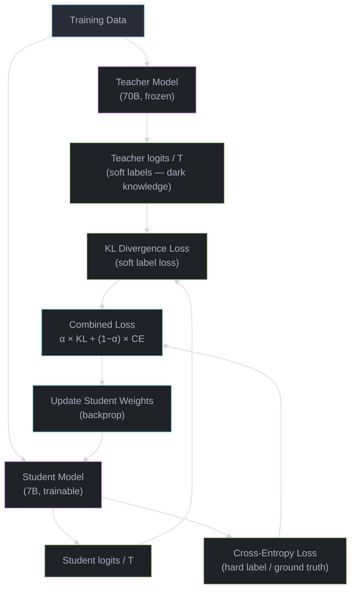
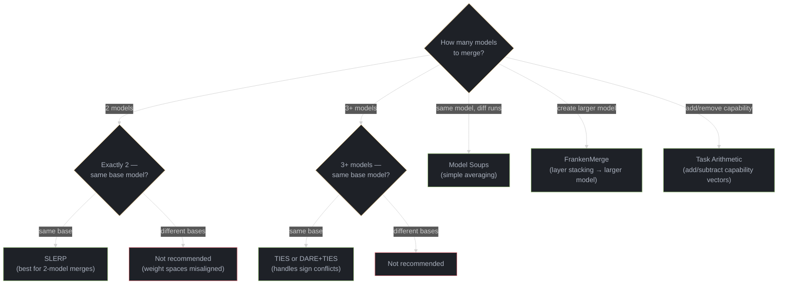

# Knowledge Distillation and Model Merging

---

## 1. Concept Overview

Knowledge distillation, model merging, and structured pruning are three complementary techniques for creating smaller, faster, or more capable models from existing ones — without training from scratch.

**Knowledge distillation** transfers knowledge from a large teacher model to a smaller student model. The teacher's probability distribution over outputs contains "dark knowledge" — the relative probabilities of wrong answers — that carries more information than hard labels alone. A teacher that outputs (cat: 0.70, lynx: 0.20, dog: 0.05, car: 0.001) teaches the student that cats and lynxes are visually similar, information lost if you only train on the hard label "cat."

**Model merging** combines weights from multiple fine-tuned models into a single model without any additional training. This exploits the observation that models fine-tuned from the same base share most of the same weight space — their differences (task vectors) are small, sparse, and can be composed. A coding model and a math model merged together can outperform either alone.

**Structured pruning** removes unnecessary parameters — entire attention heads, neurons, or layers — to reduce model size and computational cost. Unlike quantization (which reduces precision), pruning removes parameters entirely.

| Technique | Input | Output | Training Required | Typical Size Reduction |
|---|---|---|---|---|
| Knowledge distillation | Large teacher + small student architecture | Trained small student | Yes (hours to days) | 2-10x parameter reduction |
| Model merging | 2+ fine-tuned models from same base | Single merged model | No (minutes) | 0x (same size as inputs) |
| Structured pruning | Trained model | Smaller model | Optional (fine-tuning recovery) | 1.5-3x parameter reduction |
| Quantization (for comparison) | Trained model | Lower-precision model | Optional (calibration) | 2-4x memory reduction |

These techniques are increasingly critical in production: distillation powers the deployment of large model capabilities at small model cost, merging drives the open-source model ecosystem, and pruning enables deployment on constrained hardware.

---

## 2. Intuition

> **One-line analogy**: Distillation is an expert writing a textbook for students. Merging is combining the expertise of multiple specialists into one generalist. Pruning is removing unused rooms from a building to reduce maintenance costs.

**Mental model**: A 70B model knows everything but is too expensive to serve at scale. Distillation compresses its knowledge into a 7B model that retains 85-95% of performance at 10x lower inference cost. Merging takes a 7B coding model and a 7B math model — both fine-tuned from the same base — and combines them into a single 7B model that does both. Pruning takes the merged 7B model and removes the 30% of neurons that contribute least, producing a ~5B model that's faster without meaningful quality loss.

**Why it matters**: API costs scale linearly with model size. Serving a 70B model at 1M requests/day costs ~$50K/month; serving a distilled 7B at the same quality for the target task costs ~$5K/month. Merging lets open-source practitioners create models that rival proprietary ones without any GPU training budget. Pruning unlocks deployment targets (mobile, edge, low-cost GPU) that larger models cannot reach.

**Key insight**: Distillation transfers knowledge across architectures (70B teacher to 7B student). Merging transfers capabilities across tasks (code model + math model). Pruning transfers efficiency within the same model (remove redundancy). The three compose: distill, then merge specialized distilled models, then prune for deployment.

---

## 3. Core Principles

1. **Teacher quality bounds student quality.** A student cannot learn what the teacher does not know. Distilling from a mediocre teacher produces a mediocre student. Always use the strongest available teacher.

2. **Soft labels carry more information than hard labels.** The probability distribution over all tokens (softmax output) contains relationships between outputs that hard labels (argmax) discard. Temperature scaling amplifies these soft relationships.

3. **Fine-tuned models from the same base share weight space.** Models fine-tuned from the same pre-trained checkpoint differ by small "task vectors" — the delta between fine-tuned and base weights. These vectors are sparse and approximately orthogonal across different tasks, which is why merging works.

4. **Pruning effectiveness depends on redundancy.** Transformer LLMs are heavily over-parameterized: many attention heads and neurons contribute negligibly to output quality. Removing 20-50% of parameters often causes less than 3% quality degradation if the right parameters are identified.

5. **Recovery fine-tuning restores most pruning damage.** After aggressive pruning, a short fine-tuning phase (1-5% of original training compute) recovers most lost quality. This makes the total pipeline (prune then fine-tune) more effective than either alone.

6. **Not all compression techniques are substitutes.** Distillation changes the architecture (different model). Quantization changes the precision (same model, fewer bits). Pruning changes the sparsity (same precision, fewer parameters). Merging changes the capabilities (same size, combined skills). They compose: distill -> merge -> prune -> quantize. (Quantization mechanics — GPTQ, AWQ, FP8 — are covered in [Optimization & Quantization](../optimization_and_quantization/README.md).)

---

## 4. Types / Architectures / Strategies

### 4.1 Knowledge Distillation

#### Logit-Level Distillation (Classical Hinton Distillation)

The student learns to match the teacher's full output probability distribution using KL divergence loss at elevated temperature:

```
Loss = alpha * CE(student_logits, hard_label) + (1 - alpha) * T^2 * KL(softmax(teacher_logits/T), softmax(student_logits/T))

Where:
  T = temperature (typically 2-20; higher = softer distribution, more dark knowledge)
  alpha = weight between hard label loss and distillation loss (typically 0.1-0.5)
  T^2 = scaling factor to compensate for gradient magnitude reduction at high temperature
```

Higher temperature produces a softer probability distribution, making the relative probabilities of non-top tokens more visible. At T=1, the teacher might output (cat: 0.95, lynx: 0.04, dog: 0.01). At T=10, the same distribution becomes (cat: 0.40, lynx: 0.30, dog: 0.15) — now the student can learn that lynx is much more similar to cat than dog is.

#### Feature Distillation

Match intermediate layer representations, not just final outputs:

```
Loss = CE(student, hard_label) + beta * MSE(student_hidden_layer_k, projection(teacher_hidden_layer_j))

Where:
  projection = learned linear layer to align dimensions (student 768-dim -> teacher 4096-dim)
  beta = weight for feature matching loss
```

Effective when teacher and student have very different architectures. Forces the student to develop similar internal representations.

#### Task-Specific Distillation

Distill on task-specific data rather than general text:

```
Pipeline:
  1. Collect or generate 10K-100K examples from the target domain
  2. Run teacher inference on all examples, collecting logits
  3. Train student on (input, teacher_logits) pairs with KL loss
  4. Evaluate on held-out task-specific test set

Advantage: Student only needs to match teacher on the task distribution, not on all of language.
Result: 7B student can match 70B teacher on narrow tasks with 10K domain examples.
```

#### Data-Level Distillation (Synthetic Data Distillation)

The teacher generates training data — instructions, responses, reasoning chains — that the student is trained on with standard supervised fine-tuning:

```
Pipeline:
  1. Define task: e.g., "answer customer support questions about product X"
  2. Generate 50K (prompt, response) pairs using GPT-4 / Claude
  3. Quality filter: keep top 80% by reward model or LLM-as-judge score
  4. Fine-tune student (LLaMA 3 8B) on filtered data with standard SFT
```

This is how Alpaca, Vicuna, and most open-source instruction-tuned models were created. Simpler than logit distillation (no need to capture teacher's full distribution) but transfers less dark knowledge. The generation-and-filtering pipelines behind this approach are covered in [Synthetic Data Generation](../synthetic_data_generation/README.md).

#### Self-Distillation

A model distills into a smaller version of itself, often across checkpoints:

```
Approaches:
  1. Layer dropping: Take a 32-layer model, keep every other layer (16 layers), fine-tune to recover
  2. Progressive distillation: 70B -> 35B -> 14B -> 7B, each stage using the previous as teacher
  3. Born-again networks: Train a student of identical architecture; it often outperforms the teacher
```

### 4.2 Model Merging

Every method below operates on **task vectors** — the delta a fine-tune adds to the
base. Seeing them as arrows in weight space (and what happens per parameter when two
arrows disagree) is the mental model that makes the algorithms obvious:

```
 Task vector:  tau = theta_finetuned - base        (what fine-tuning changed)

   base  *-----> tau_code     (delta from fine-tuning on code)
   base  *-----> tau_math     (delta from fine-tuning on math)

 Compose by ADDING vectors back onto the base point:
   base + 0.8*tau_code + 0.5*tau_math   ->  one model good at BOTH (task arithmetic)
   base - 0.3*tau_toxic                 ->  a skill SUBTRACTED out

 Why naive averaging loses signal -- the per-parameter sign conflict (one weight i):
   tau_A[i] = +0.30  \  opposite signs
   tau_B[i] = -0.20  /  = a conflict
   --------------------------------------------------------------------------
   linear avg : (+0.30 + -0.20)/2 = +0.05    <- both signals nearly cancel
   TIES       : elect the dominant sign (+), keep +0.30, drop the -0.20 loser
   DARE       : randomly zero ~90% of each tau FIRST (they are sparse), so far
                fewer conflicts even reach the merge step
```

Task vectors are sparse and approximately orthogonal across tasks, which is exactly
why subtracting the small overlaps (TIES) or sparsifying first (DARE) recovers more of
each skill than averaging the dense deltas.

#### Linear Interpolation (Weight Averaging)

Simplest approach: weighted average of two models' parameters.

```
merged_weights = alpha * model_A_weights + (1 - alpha) * model_B_weights

Where alpha is typically 0.5 for equal contribution, tuned on a validation set.
Limitation: Assumes parameters are in the same region of loss landscape (true for same-base fine-tunes).
```

#### SLERP (Spherical Linear Interpolation)

Interpolate on the hypersphere rather than linearly, preserving the magnitude of weight vectors:

```
SLERP(w_A, w_B, t) = sin((1-t)*theta) / sin(theta) * w_A + sin(t*theta) / sin(theta) * w_B

Where theta = arccos(w_A . w_B / (||w_A|| * ||w_B||)), t in [0, 1]

Why better than linear: Linear interpolation can shrink weight magnitudes at t=0.5 (midpoint of two
vectors is shorter than either). SLERP traverses the geodesic on the hypersphere, preserving norms.
```

SLERP merges exactly two models. It is the most commonly used method on the open-source Hugging Face merge leaderboard.

#### TIES (Trim, Elect Sign, Merge)

Resolves sign conflicts between task vectors — the core problem with naive averaging:

```
Algorithm:
  1. Compute task vectors: delta_A = model_A - base, delta_B = model_B - base
  2. TRIM: Set smallest 80-90% of delta values to zero (keep only large, meaningful changes)
  3. ELECT SIGN: For each parameter position, take the sign (+ or -) that has the
     largest total magnitude across all models being merged
  4. MERGE: Average the values that agree with the elected sign; discard conflicts
  5. Result = base + merged_delta

Why it works: Fine-tuning produces sparse task vectors with many small noise values.
Trimming removes noise. Sign election resolves conflicts (model A says +0.3, model B says -0.2
for the same parameter — TIES picks the dominant direction rather than averaging to 0.05).
```

TIES produces consistently better results than linear averaging, especially when merging 3+ models.

#### DARE (Drop And REscale)

Randomly drop delta parameters and rescale the survivors:

```
Algorithm:
  1. Compute task vector: delta = fine_tuned - base
  2. Create binary mask: m_i ~ Bernoulli(1 - p), where p = drop rate (typically 0.7-0.9)
  3. Rescale surviving parameters: delta_dare = delta * m / (1 - p)
  4. Merge using any method (linear, TIES) on the sparsified deltas
  5. Result = base + merged_dare_deltas

Why it works: Task vectors are redundant — 90% of parameters can be dropped without
meaningful quality loss. Sparsification makes merging more effective by reducing interference
between task vectors.
```

DARE works well as a preprocessing step before TIES or linear merge.

#### Model Soups (Wortsman et al. 2022)

Average the weights of multiple fine-tuning runs (same data, different hyperparameters or seeds):

```
soup = (1/N) * sum(model_i for i in 1..N)

Key insight: Models from different runs of the same task land in the same basin of the loss landscape.
Averaging them moves toward the center of the basin, which is often flatter and generalizes better.
Result: Model soups consistently improve robustness without any quality loss on the target task.
```

#### Task Arithmetic

Add or subtract task vectors to compose or remove capabilities:

```
task_vector_code = code_model - base_model
task_vector_math = math_model - base_model

Combined model:   base + 0.8 * task_vector_code + 0.5 * task_vector_math
Remove toxicity:  model - 0.3 * task_vector_toxic  (where toxic model was fine-tuned on toxic data)
```

Task arithmetic enables modular capability composition without retraining.

#### FrankenMerge (Passthrough / Layer Stacking)

Take different layers from different models to construct a new model:

```
Example: Create 120-layer model from two 70B/80-layer models
  Layers 0-39:  from model_A (general knowledge)
  Layers 40-79: from model_B (domain expertise)

Or selectively swap specific layers:
  Layers 0-15:  model_A (early representations)
  Layers 16-20: model_B (attention patterns)
  Layers 21-31: model_A (output layers)
```

FrankenMerge can create models larger than the inputs (unlike all other methods). However, it is fragile — wrong layer boundaries produce incoherent models. The community uses iterative experimentation to find good combinations.

### 4.3 Structured Pruning

#### Magnitude Pruning

Remove weights with the smallest absolute values:

```
For each weight matrix W:
  1. Compute |W_ij| for all parameters
  2. Set the bottom p% to zero (e.g., p=50 for 50% sparsity)
  3. Fine-tune remaining parameters for recovery

Unstructured: Remove individual weights → sparse matrix → needs sparse hardware for speedup
Structured: Remove entire rows/columns (neurons) or attention heads → dense matrix → standard hardware
```

Simple but effective for moderate sparsity (20-40%). Degrades quickly beyond 50%.

#### SparseGPT (Frantar & Alistarh, 2023)

One-shot pruning using second-order (Hessian) information, no retraining required:

```
Algorithm (per layer, column by column):
  1. Collect calibration data (128 examples from C4 or similar)
  2. Compute approximate Hessian: H = X^T * X (input activations)
  3. For each column j of weight matrix W:
     a. Determine which weights to prune (by magnitude or threshold)
     b. Compute optimal update to remaining weights to compensate for pruning error
     c. Update: W_remaining += -W_pruned * H_pruned_remaining / H_remaining_remaining
  4. This error compensation propagates information from pruned weights to surviving ones

Result: 50% unstructured sparsity with <1% perplexity increase on LLaMA 7B-65B.
60% sparsity with ~3% perplexity increase. No retraining needed.
```

SparseGPT's key innovation is compensating for pruning errors within each layer using the Hessian, making one-shot pruning viable for LLMs.

#### Wanda (Sun et al., 2023)

Pruning by Weights AND Activations — a simpler alternative to SparseGPT:

```
Importance score: S_ij = |W_ij| * ||X_j||_2

Where:
  |W_ij| = absolute weight magnitude
  ||X_j||_2 = L2 norm of the j-th input feature across calibration data

Intuition: A weight is important if it is large AND the corresponding input activation is large.
A large weight connected to a feature that is always near zero contributes nothing.

Algorithm:
  1. Collect calibration data (128 examples)
  2. Forward pass to collect activation statistics ||X_j||
  3. Score every weight: S_ij = |W_ij| * ||X_j||
  4. Prune the lowest-scoring p% of weights
  5. No weight update, no retraining, no Hessian computation

Result: Matches SparseGPT quality at 50% sparsity with 10-100x less compute.
```

Wanda is the simplest competitive pruning method for LLMs.

#### Semi-Structured N:M Sparsity

NVIDIA Ampere (A100) and later GPUs support 2:4 sparsity natively — exactly 2 of every 4 consecutive weights are zero:

```
Dense:    [0.3, 0.1, 0.8, 0.5, 0.2, 0.9, 0.4, 0.1]
2:4 Sparse: [0.3, 0, 0.8, 0,   0, 0.9, 0.4, 0     ]

Hardware support: NVIDIA A100, H100, and later GPUs execute 2:4 sparse matrix multiply
at 2x the throughput of dense multiply — actual speedup on real hardware.

Pipeline:
  1. Train model normally (dense)
  2. Apply magnitude pruning with 2:4 constraint
  3. Fine-tune for 1-5% of original training steps
  4. Deploy with sparse kernels (cuSPARSELt)

Quality impact: ~1-3% perplexity increase on LLaMA 7B with 2:4 sparsity after recovery fine-tuning.
```

N:M sparsity is the only pruning scheme that delivers guaranteed wall-clock speedup on commodity hardware.

---

## 5. Architecture Diagrams

### Knowledge Distillation Pipeline



### Model Merging Decision Tree



### Pruning Pipeline

```
Trained Model (7B params, FP16, 14GB)
         |
         v
[Calibration Data Collection]  <-- 128 examples from representative distribution
         |
         v
[Importance Scoring]
  |-- Magnitude: |W_ij|
  |-- Wanda:     |W_ij| * ||X_j||
  |-- SparseGPT: Hessian-based optimal selection
         |
         v
[Pruning Decision]
  |-- Unstructured 50%: Remove individual weights (needs sparse HW)
  |-- Structured: Remove entire heads/neurons (works on any HW)
  |-- 2:4 Semi-structured: NVIDIA A100+ hardware acceleration
         |
         v
[Recovery Fine-Tuning]  <-- 1-5% of original training compute
         |
         v
[Evaluation]  <-- Compare to dense baseline
         |
         v
Pruned Model (3.5B effective params, ~8GB, 1.5-2x faster)
```

---

## 6. How It Works — Detailed Mechanics

### Temperature Scaling in Distillation

At temperature T=1 (standard softmax), the teacher's output for a cat image might be:

```
T=1:  cat: 0.95,  lynx: 0.04,  dog: 0.008, car: 0.0001, ...
T=5:  cat: 0.45,  lynx: 0.25,  dog: 0.12,  car: 0.02, ...
T=20: cat: 0.15,  lynx: 0.12,  dog: 0.09,  car: 0.06, ...
```

Higher temperature makes the distribution softer, exposing relative similarities between classes. The student learns richer relationships at higher T but with noisier gradients. Typical range: T=2-4 for classification, T=4-20 for language model distillation. The T^2 scaling in the loss formula compensates for the reduced gradient magnitude at high temperatures.

### SLERP Geometric Interpretation

Linear interpolation: `lerp(A, B, t) = (1-t)*A + t*B`

At t=0.5, the interpolated vector has magnitude `||A|| * cos(theta/2)`, which is strictly less than `||A||` when A and B point in different directions. This magnitude shrinkage can degrade model quality.

SLERP traverses the great circle on the unit hypersphere between A and B, maintaining constant magnitude throughout. For model weights, this means the merged model's weight norms are preserved, which empirically produces better results than linear interpolation.

### TIES Step-by-Step Example

```
Base model weights:  [1.0, 2.0, 3.0, 4.0, 5.0]
Model A weights:     [1.2, 2.0, 2.5, 4.3, 5.0]  -> delta_A = [+0.2, 0.0, -0.5, +0.3, 0.0]
Model B weights:     [0.9, 2.1, 3.4, 3.7, 5.0]  -> delta_B = [-0.1, +0.1, +0.4, -0.3, 0.0]

Step 1 — TRIM (keep top 60%):
  delta_A_trimmed = [+0.2, 0.0, -0.5, +0.3, 0.0]  -> [0.0, 0.0, -0.5, +0.3, 0.0]
  delta_B_trimmed = [-0.1, +0.1, +0.4, -0.3, 0.0]  -> [0.0, 0.0, +0.4, -0.3, 0.0]

Step 2 — ELECT SIGN (per position):
  Position 3: A=-0.5, B=+0.4  -> |-0.5| > |+0.4| -> elected sign = negative
  Position 4: A=+0.3, B=-0.3  -> |+0.3| = |-0.3| -> tie, pick positive (convention)

Step 3 — MERGE (average values matching elected sign):
  Position 3: elected=negative, A=-0.5 matches, B=+0.4 discarded -> merged = -0.5
  Position 4: elected=positive, A=+0.3 matches, B=-0.3 discarded -> merged = +0.3

Result = base + merged_delta = [1.0, 2.0, 2.5, 4.3, 5.0]
```

### SparseGPT Error Compensation

The key insight: when you prune weight W_ij, the output error is `W_ij * X_j`. SparseGPT distributes this error across remaining weights in the same row:

```
For each pruned weight W_ij:
  Error to compensate: e = W_ij * X_j
  Update remaining weights: W_ik += -e * H_jk / H_kk for all surviving k in same row

This is optimal in the least-squares sense: it minimizes ||WX - W'X||^2 where W' is the pruned matrix.
The Hessian H = X^T * X captures input correlations, so the compensation accounts for
how inputs are correlated.
```

### Quality Retention Numbers

| Technique | Configuration | Quality Retention | Inference Speedup |
|---|---|---|---|
| Logit distillation | 70B -> 7B, task-specific | 85-95% of teacher | 10x (smaller model) |
| Data distillation | 70B generates 50K examples for 7B | 80-90% of teacher | 10x |
| SLERP merge | 2 specialized 7B models | Often exceeds either individual | 1x (same size) |
| TIES merge | 3+ specialized models | 5-15% better than best individual | 1x |
| SparseGPT 50% | Unstructured sparsity | 97-99% of dense | 1.5-2x (sparse hardware) |
| Wanda 50% | Unstructured sparsity | 96-98% of dense | 1.5-2x (sparse hardware) |
| 2:4 pruning + recovery | Semi-structured | 97-99% of dense | 2x (NVIDIA A100+) |
| Structured 30% | Remove attention heads | 95-98% of dense | 1.3x (any hardware) |

---

## 7. Real-World Examples

### DistilBERT (Sanh et al., 2019)

The canonical distillation success story: 66M parameters (vs BERT's 110M), retaining 97% of BERT's performance on GLUE while being 60% faster. Used triple loss: distillation loss (KL), masked language modeling loss, and cosine embedding loss on hidden states. DistilBERT removed every other transformer layer (6 vs 12) and initialized from the teacher's remaining layers.

### Alpaca / Vicuna (Data-Level Distillation)

Stanford Alpaca: GPT-3 generated 52K instruction-following examples using Self-Instruct. LLaMA 7B fine-tuned on these examples became competitive with text-davinci-003. Cost: ~$600 in API calls. Vicuna: Fine-tuned LLaMA 13B on 70K conversations shared by ChatGPT users. Achieved ~90% of ChatGPT quality according to GPT-4-as-judge evaluation.

### Open-Source Merging Community

The HuggingFace Open LLM Leaderboard has been dominated by merged models:
- **Goliath-120B**: FrankenMerge of two LLaMA 2 70B models stacked to 120 layers
- **SOLAR-10.7B**: Depth Up-Scaled merge of Mistral 7B (expanded to 48 layers)
- **NeuralBeagle-7B**: SLERP merge of multiple Mistral 7B fine-tunes, topped leaderboard for weeks
- **Nous-Hermes-2-SOLAR-10.7B**: Merged model that outperformed its constituent models

The merging meta: fine-tune the same base on different tasks (code, math, chat, reasoning), merge all fine-tunes together, evaluate, iterate on merge ratios.

### NVIDIA Nemotron Distillation

NVIDIA used Nemotron-4-340B as a teacher to distill into smaller Nemotron variants. 98% of the training data for the final model was synthetic — generated by the teacher model itself. Demonstrated that industrial-scale distillation can produce competitive models at any target size.

### SparseGPT on LLaMA

Frantar & Alistarh applied SparseGPT to the full LLaMA model family (7B-65B). At 50% unstructured sparsity, perplexity on WikiText2 increased by less than 0.5 for all model sizes. At 60%, the increase was 1-3 perplexity points. Combined with 4-bit quantization (SparseGPT + GPTQ), they achieved ~10x total compression with minimal quality loss.

---

## 8. Tradeoffs

| Technique | Quality | Effort | Hardware Needs | When to Use |
|---|---|---|---|---|
| Logit distillation | High (85-95%) | High (teacher inference + student training) | GPU for both models | Maximum quality transfer, have compute budget |
| Data distillation | Medium (80-90%) | Medium (teacher inference, student SFT) | API access to teacher | No access to teacher weights, only API |
| SLERP merge | Variable | Very low (minutes) | CPU sufficient | Merging exactly 2 same-base models |
| TIES merge | Good | Very low (minutes) | CPU sufficient | Merging 3+ models with sign conflicts |
| DARE + TIES | Better | Very low (minutes) | CPU sufficient | Best general-purpose merge method |
| SparseGPT | High (97-99%) | Low (calibration only) | One GPU for calibration | One-shot pruning, no retraining budget |
| Wanda | High (96-98%) | Very low | One GPU for calibration | Simplest pruning, minimal compute |
| 2:4 sparsity | High (97-99%) | Medium (recovery fine-tuning) | NVIDIA Ampere+ | Guaranteed 2x speedup on supported hardware |
| Structured pruning | Good (95-98%) | Medium | Any hardware | Need speedup on standard (non-sparse) hardware |

### Distillation vs Quantization vs Pruning

| | Distillation | Quantization | Pruning |
|---|---|---|---|
| Changes architecture | Yes (different model) | No | No (but fewer params) |
| Preserves original model | Yes (teacher unchanged) | No (modifies weights) | No (modifies weights) |
| Training required | Yes | Optional (calibration) | Optional (recovery) |
| Composable | Yes | Yes | Yes |
| Maximum compression | 10x (architecture change) | 4x (INT4) | 2-3x (before quality collapse) |
| Best for | Deploying large model quality at small model cost | Reducing memory without changing architecture | Reducing computation, enabling sparse hardware |

---

## 9. When to Use / When NOT to Use

### Use Knowledge Distillation When:
- You need to deploy a large model's capabilities at significantly lower cost (>5x smaller)
- You have a well-defined target task where task-specific distillation can be effective
- You can afford the training compute (teacher inference + student training)
- The target hardware cannot run the teacher model at acceptable latency

### Use Model Merging When:
- You have multiple fine-tuned models from the same base that you want to combine
- You have zero training budget but want to improve model quality
- You want to compose capabilities (code + math + chat) without multi-task training
- You are iterating rapidly and want to test combinations quickly (minutes per merge)

### Use Pruning When:
- You need moderate size/speed improvement (1.3-2x) with minimal quality loss
- You have NVIDIA Ampere+ hardware and can use 2:4 sparsity for guaranteed speedup
- You want to reduce the model's computational footprint for a specific deployment target
- You can afford a small fine-tuning budget for recovery after pruning

### Do NOT Use:
- **Distillation from a weak teacher**: The student will inherit and amplify the teacher's weaknesses
- **Merging models with different tokenizers**: Incompatible vocabularies produce corrupted outputs
- **Merging models from different base architectures**: Weight spaces are not aligned; results are garbage
- **Unstructured pruning without sparse hardware**: You save memory but get zero speedup on standard GPUs
- **Aggressive pruning (>60%) on reasoning-heavy tasks**: Mathematical and logical capabilities degrade faster than factual recall under pruning

---

## 10. Common Pitfalls

### Pitfall 1: Distilling from a Mediocre Teacher

A team distills from GPT-3.5 into a 7B model for medical Q&A. The student faithfully reproduces GPT-3.5's hallucinations about drug interactions — but at higher frequency because the student has less capacity to recover from the teacher's errors. After deployment, the hallucination rate was 3x higher than the teacher's on the same medical queries. Fix: always use the strongest available teacher; for domain-specific distillation, fine-tune the teacher on verified domain data first, then distill.

### Pitfall 2: Merging Models with Incompatible Tokenizers

A developer merges a LLaMA 2 fine-tune (32K vocabulary) with a CodeLlama fine-tune (32K vocabulary, but different code-specific tokens). The merge silently succeeds because weight shapes match, but the merged model produces corrupted outputs whenever code tokens appear — the code-specific embeddings from one model are misaligned with the other's. Fix: only merge models that share the exact same tokenizer and vocabulary.

### Pitfall 3: FrankenMerge at Wrong Layer Boundaries

A practitioner creates a FrankenMerge by taking layers 0-20 from a chat model and layers 21-31 from a code model. The result is incoherent — the chat model's layers expect certain intermediate representations that the code model's layers cannot produce. The residual stream format is incompatible at the splice point. Fix: FrankenMerge requires experimentation; start with small layer swaps (1-2 layers) and evaluate, gradually expanding. Models fine-tuned from the same base are more compatible for layer swapping.

### Pitfall 4: Deploying Unstructured Pruning Without Sparse Hardware

A team prunes a 7B model to 50% sparsity using Wanda, expecting 2x inference speedup. On their NVIDIA T4 GPUs, there is zero speedup — the sparse matrix still performs the same number of multiply-accumulate operations because the hardware doesn't support sparse execution. The model is smaller in storage but not faster in inference. Fix: use structured pruning (remove entire heads/neurons) for speedup on standard hardware, or deploy on A100+ with 2:4 semi-structured sparsity for guaranteed hardware-accelerated speedup.

### Pitfall 5: Not Evaluating Merged Models on All Tasks

A developer merges a math model and a code model using TIES. The merged model scores 5% better than either on a general benchmark. In production, the math capability is intact, but code generation quality dropped 15% compared to the standalone code model — the merge resolved sign conflicts in favor of the math model's task vector for parameters shared between both capabilities. Fix: evaluate merged models on each constituent task separately, not just on aggregate benchmarks.

### Pitfall 6: Temperature Too Low During Distillation

A team trains a student at T=1 (standard temperature). The student learns hard labels well but fails to capture inter-class relationships. On ambiguous inputs where the teacher would output a spread distribution, the student produces overconfident (and often wrong) point predictions. Fix: use T=4-10 for classification tasks, T=2-4 for language model distillation. Always tune temperature on a validation set.

---

## 11. Technologies & Tools

| Tool | Category | Purpose | Notes |
|---|---|---|---|
| **mergekit** | Merging | SLERP, TIES, DARE, linear, passthrough merges | Standard open-source toolkit; CLI and Python API |
| **LazyMergeKit** | Merging | Google Colab wrapper for mergekit | One-click merging, no local GPU needed |
| **HuggingFace PEFT** | Distillation/Fine-tuning | LoRA, adapter management during distillation | Adapter merging with merge_and_unload() |
| **TextBrewer** | Distillation | PyTorch distillation framework | Multi-teacher, multi-task distillation |
| **NVIDIA NeMo** | Distillation | Enterprise distillation pipeline | Nemotron-style teacher-student training |
| **SparseML** | Pruning | Neural Magic's pruning + quantization toolkit | Integrates with DeepSparse runtime for CPU inference |
| **SparseGPT** | Pruning | One-shot Hessian-based LLM pruning | GitHub implementation; calibration-only, no retraining |
| **Wanda** | Pruning | Weight-and-activation pruning | Simpler than SparseGPT; comparable quality |
| **torch.nn.utils.prune** | Pruning | PyTorch built-in pruning utilities | Basic magnitude pruning; not LLM-optimized |
| **DeepSparse** | Runtime | Neural Magic's sparse inference engine | CPU-only; 4-8x speedup from sparsity on CPU |
| **cuSPARSELt** | Runtime | NVIDIA sparse GEMM library | 2:4 sparsity on Ampere+ GPUs |

---

## 12. Interview Questions with Answers

**Q: What is knowledge distillation and how does temperature scaling affect the process?**
Knowledge distillation trains a smaller student model to mimic a larger teacher model's output probability distribution using KL divergence loss. Temperature scaling (T=2-20) softens the teacher's output distribution, making the relative probabilities of non-top-1 predictions visible. At T=1, the teacher might assign 95% probability to the correct answer and 4% to a similar wrong answer — the student barely learns the relationship. At T=10, the distribution becomes (40%, 30%, ...), exposing that the teacher considers the two answers related. Higher temperature transfers more "dark knowledge" (relationships between outputs) but produces noisier gradients. The T^2 factor in the loss formula compensates for gradient magnitude reduction at high temperature. Typical values: T=2-4 for language model distillation, T=4-20 for classification.

**Q: Compare logit-level distillation with data-level distillation. When would you choose each?**
Logit-level distillation uses the teacher's full probability distribution (soft labels) as the training signal, requiring access to the teacher's weights or at least its logit outputs for every training example. Data-level distillation uses the teacher only to generate training data (input-output pairs), then trains the student with standard supervised fine-tuning. Choose logit distillation when you have access to teacher weights and want maximum knowledge transfer — it preserves dark knowledge (inter-class relationships) that hard labels discard. Choose data distillation when you only have API access to the teacher (e.g., GPT-4) without logits, or when the teacher and student have very different architectures. Data distillation is simpler to implement and more flexible but transfers less information per example. DistilBERT used logit distillation and retained 97% of BERT's quality; Alpaca used data distillation from GPT-3 and retained ~80% of the teacher's quality on general tasks.

**Q: Why can a distilled student hallucinate more than its teacher, and how do you prevent it?**
The student inherits every teacher error as a confident ground-truth label, and its smaller capacity means it cannot represent the uncertainty the teacher expressed around those errors. Two mechanisms compound: first, teacher mistakes are amplified — a team distilling GPT-3.5 into a 7B medical Q&A model saw the student's hallucination rate reach 3x the teacher's on the same queries; second, distilling on hard labels (teacher's top-1 token) instead of soft distributions destroys calibration — in one production case the student hedged with "I'm not sure" on only 12% of ambiguous queries versus the teacher's 34%, producing confidently wrong answers. Prevention: validate the teacher on your task distribution before distilling, use soft targets (KL at T=2-8) rather than hard labels to transfer calibration, and gate deployment on Expected Calibration Error (target ECE < 0.05) measured against a human-labeled set.

**Q: What is model merging and why does it work despite not involving any training?**
Model merging combines the weights of two or more fine-tuned models into a single model through mathematical operations (averaging, interpolation, vector arithmetic) without any gradient updates. It works because models fine-tuned from the same pre-trained base share most of their weight space — fine-tuning only changes a small fraction of parameters, creating sparse "task vectors" (delta from the base). These task vectors capture task-specific knowledge and are approximately orthogonal for different tasks, meaning they can be added without destructive interference. The merged model gains the capabilities of all constituent models because their knowledge occupies different subspaces of the parameter space. Limitations: merging fails for models with different tokenizers, different base architectures, or when task vectors are not orthogonal (both models modified the same parameters in conflicting directions — which TIES addresses).

**Q: Explain TIES merging. What problem does it solve that simple weight averaging does not?**
TIES (Trim, Elect Sign, merge) solves the sign conflict problem in multi-model merging. When averaging multiple task vectors, some parameters have positive deltas from one model and negative deltas from another — averaging these to near-zero destroys both capabilities. TIES addresses this in three steps: (1) Trim small delta values (bottom 80-90%) as noise, keeping only large, meaningful changes. (2) Elect the dominant sign for each parameter position — if 2 of 3 models say positive and 1 says negative, the elected sign is positive. (3) Merge only values that agree with the elected sign, discarding conflicting values. This prevents destructive cancellation: instead of +0.5 and -0.3 averaging to +0.1 (degrading both capabilities), TIES keeps +0.5 and discards -0.3. TIES consistently outperforms simple averaging when merging 3+ models.

**Q: What is DARE, and why can you randomly drop 90% of a task vector without losing the skill?**
DARE (Drop And REscale) samples a Bernoulli mask that zeroes a fraction p (typically 0.7-0.9) of each task vector's parameters, then rescales the survivors by 1/(1-p) so the expected magnitude of the delta is preserved. Dropping works because task vectors are massively redundant — fine-tuning spreads a small behavioral change across millions of tiny, mutually substitutable parameter deltas, so a random 10% subset (rescaled) reconstructs nearly the same function. The payoff for merging is interference reduction: with 90% of each model's delta zeroed, the probability that two task vectors touch the same parameter drops sharply, so far fewer sign conflicts ever reach the merge step. Use DARE as a preprocessing pass before TIES or linear merging — DARE+TIES is the recommended default for 3+ model merges.

**Q: What is SLERP and why is it preferred over linear interpolation for model merging?**
SLERP (Spherical Linear Interpolation) interpolates between two weight vectors along the great circle on the unit hypersphere, rather than the straight line between them. The formula is: SLERP(A, B, t) = sin((1-t)*theta)/sin(theta) * A + sin(t*theta)/sin(theta) * B, where theta is the angle between A and B. It is preferred because linear interpolation shrinks vector magnitudes at intermediate points — at t=0.5, the interpolated vector has magnitude ||A||*cos(theta/2), which is less than ||A|| whenever A and B are not parallel. This magnitude shrinkage degrades model quality. SLERP preserves the norm throughout interpolation, maintaining the scale of weight matrices that the model's architecture was designed for. SLERP is the most popular method for merging exactly two models and is the default in mergekit.

**Q: What are model soups, and when does averaging checkpoints from the same task help?**
A model soup is the plain average of the weights of multiple fine-tuning runs of the same task with different hyperparameters or seeds: soup = (1/N) * sum(model_i). It works because runs on the same task from the same initialization land in the same basin of the loss landscape; averaging moves the weights toward the basin's flatter center, which generalizes better — Wortsman et al. (2022) showed soups consistently improve robustness and out-of-distribution accuracy with no loss on the target task and zero extra training. The critical scope limit: soups only apply to same-task, same-base runs — averaging models fine-tuned on different tasks is what task-vector merging (TIES, DARE) exists to handle, because cross-task deltas conflict in sign. Practical use: after a hyperparameter sweep, soup the top-K checkpoints instead of picking the single best — it is free quality.

**Q: How does SparseGPT achieve one-shot pruning without retraining?**
SparseGPT prunes each layer's weight matrix column by column, using second-order (Hessian) information to compensate for pruning errors. For each column, it determines which weights to prune, then optimally adjusts the remaining weights to minimize the change in layer output. The compensation formula uses the inverse Hessian H^(-1) = (X^T * X)^(-1) computed from 128 calibration examples. When weight W_ij is pruned, the error W_ij * X_j is distributed across surviving weights in proportion to their input correlations: W_ik += -W_ij * H_jk / H_kk. This error compensation is what makes one-shot pruning viable — without it, accumulating pruning errors across thousands of weights would destroy model quality. SparseGPT achieves 50% sparsity with less than 0.5 perplexity increase on LLaMA models without any retraining.

**Q: What is Wanda and how does it improve upon magnitude pruning?**
Wanda (Weights AND Activations) scores each weight by the product of its absolute magnitude and the L2 norm of its corresponding input activation: S_ij = |W_ij| * ||X_j||. This improves upon pure magnitude pruning (which only uses |W_ij|) by accounting for how much each weight actually contributes to the output in practice. A large weight connected to an input feature that is always near zero contributes nothing — magnitude pruning would keep it, Wanda correctly identifies it as unimportant. Wanda requires only a single forward pass on 128 calibration examples to collect activation norms, making it 10-100x faster than SparseGPT (which requires Hessian computation). Despite its simplicity, Wanda matches SparseGPT quality at 50% sparsity on LLaMA 7B-65B, making it the go-to choice when simplicity and speed matter.

**Q: When would you choose distillation over quantization for model compression?**
Choose distillation when you need more than 4x compression (quantization's practical limit at INT4), when you want to change the model architecture (e.g., fewer layers, different attention pattern), or when you need the compressed model to have the same precision as the original (FP16). Distillation can achieve 10x parameter reduction while retaining 85-95% of teacher quality. Choose quantization when you want the simplest compression pipeline (no training, just calibration), when 2-4x memory reduction is sufficient, or when you need to preserve the exact model architecture (important for debugging and reproducibility). In practice, combine both: distill to a smaller architecture, then quantize the student for deployment. A 70B teacher distilled to 7B (10x) then quantized to INT4 (4x) gives ~40x total compression.

**Q: What are the risks of FrankenMerge (layer-wise merging from different models)?**
FrankenMerge takes different layers from different models and stacks them into a single model. The primary risk is residual stream incompatibility: each transformer layer expects specific statistical properties in its input (the residual stream) that were established during training. If layer 20 from model A produces residual representations with different norms, means, or variance than what layer 21 from model B expects, the output is incoherent. Additional risks: (1) attention pattern disruption if layers have different learned positional encoding biases; (2) the resulting model may be larger than either input (120 layers from two 80-layer models), requiring more memory; (3) FrankenMerge is highly empirical — there is no theoretical framework for predicting which layer combinations work. Mitigation: only merge models fine-tuned from the same base, start with single-layer swaps and evaluate incrementally, and test on diverse benchmarks since quality loss is often task-specific.

**Q: How does structured pruning differ from unstructured pruning in terms of hardware requirements?**
Unstructured pruning removes individual weights, creating a sparse matrix with zeros scattered throughout. Standard GPU hardware (CUDA cores) still performs the same number of multiply-accumulate operations because they process dense matrix blocks — the zeros do not save computation. Speedup requires specialized sparse hardware: NVIDIA A100+ with 2:4 sparsity support, or CPU-based sparse runtimes like DeepSparse. Structured pruning removes entire neurons, attention heads, or layers, producing a smaller but still dense matrix. This gives immediate speedup on any hardware because the matrix dimensions are physically smaller. Trade-off: structured pruning is coarser (you remove entire heads, not individual weights) so it typically causes more quality degradation at the same compression ratio. At 30% structured pruning, expect 2-5% quality loss; at 50% unstructured pruning, expect 1-3% loss — but the structured version runs faster on commodity GPUs.

**Q: What is N:M sparsity and which hardware supports it?**
N:M sparsity is a semi-structured sparsity pattern where exactly N out of every M consecutive weights are zero. The most common pattern is 2:4 — exactly 2 of every 4 consecutive weights are pruned. NVIDIA Ampere architecture (A100) and later (H100, H200, Blackwell) have dedicated Sparse Tensor Cores that execute 2:4 sparse matrix multiplication at 2x the throughput of dense multiplication — this is a hardware-guaranteed speedup, not dependent on sparsity library efficiency. The pipeline: train the model normally, apply magnitude-based 2:4 pruning, fine-tune for recovery (1-5% of original compute), deploy with cuSPARSELt or similar sparse GEMM library. Quality impact is typically 1-3% perplexity increase after recovery fine-tuning. 2:4 sparsity is the only pruning method that reliably delivers wall-clock speedup on widely deployed hardware.

**Q: How would you design a distillation pipeline for a production LLM deployment?**
Start by selecting the strongest available teacher model for your task — GPT-4 class or the best open-weight model. Collect 10K-100K examples from your production distribution (or generate them synthetically). For data-level distillation (simpler): run teacher inference on all examples, store (prompt, teacher_response) pairs, fine-tune the student with standard SFT. For logit-level distillation (higher quality): run teacher inference collecting full logit vectors, train student with combined KL divergence (T=4, alpha=0.3) and cross-entropy loss. Evaluate on a held-out test set representing production traffic, measuring both quality (accuracy, ROUGE, win-rate vs teacher) and operational metrics (latency, throughput, cost). If quality is within 5% of teacher on the target task, deploy the student. If not, increase training data size, try feature distillation (match intermediate layers), or accept a larger student architecture. Always measure the cost-quality tradeoff: a student at 90% teacher quality but 10x lower cost is usually the right production choice.

**Q: What is task arithmetic and how is it used to compose or remove model capabilities?**
Task arithmetic represents fine-tuning as vector addition in weight space. The task vector for a capability is the difference between the fine-tuned model and its base: tau_code = code_model - base_model. You can compose capabilities by adding task vectors: combined = base + alpha*tau_code + beta*tau_math, where alpha and beta control the strength of each capability. You can remove capabilities by subtraction: detoxified = model - gamma*tau_toxic, where tau_toxic was computed from a model fine-tuned on toxic content. The key requirement is that all models share the same base. Task arithmetic enables modular capability composition without retraining: you can dynamically adjust the strength of each capability by tuning the scaling coefficients. Limitation: task vectors are only approximately orthogonal — when two tasks modify the same parameters (e.g., both affect the model's verbosity), interference occurs and quality degrades.

---

## 13. Best Practices

**Always validate the teacher before distilling.** Evaluate the teacher on your specific task distribution, not just general benchmarks. A teacher that scores well on MMLU may hallucinate on your domain — and the student will faithfully reproduce those hallucinations at higher frequency.

**Use DARE + TIES as the default merge method.** Apply DARE sparsification (drop rate 0.7-0.9) to task vectors before TIES merging. The combination handles sign conflicts and reduces interference better than either method alone. Fall back to SLERP only for exactly-2-model merges.

**Verify tokenizer compatibility before any merge.** Assert that all models being merged share the exact same tokenizer vocabulary, BOS/EOS tokens, and padding conventions. Silent tokenizer mismatches are the most common cause of "the merge looks fine but outputs are garbage."

**Use Wanda as the default pruning method.** Unless you specifically need SparseGPT's marginally better quality, Wanda gives comparable results at 10-100x less compute. Start with Wanda 50%, evaluate, and only upgrade to SparseGPT if the quality gap matters for your task.

**Target 2:4 sparsity for deployments on NVIDIA A100+.** This is the only pruning configuration with guaranteed hardware-accelerated speedup. Always include a recovery fine-tuning phase (1-5% of original training compute) — the quality recovery is substantial and the cost is low.

**Distill on task-specific data, not general corpora.** A 7B student trained on 10K domain-specific examples from a 70B teacher will outperform the same student trained on 100K general examples. The student only needs to match the teacher on your production distribution.

**Evaluate merged models on ALL constituent tasks.** A merged model that improves average benchmark scores may have regressed on a specific task. Always evaluate on each individual task/capability separately before deployment.

**Combine techniques in the right order.** The optimal pipeline: (1) fine-tune specialized models from the same base, (2) merge them with DARE+TIES, (3) prune with Wanda or 2:4 sparsity, (4) quantize to INT4. Each step compounds the compression. Do NOT prune before merging — merged task vectors need their full parameter set.

**Start with data distillation for prototyping, upgrade to logit distillation for production.** Data distillation (teacher generates training data for student) requires only API access and is fast to iterate. Once you've validated the student's viability, switch to logit distillation for the final production model to squeeze out the last 5-10% quality.

---

## 14. Case Study

### Design: Compress a 70B Model to 7B for Production Customer Support

**Problem**: A financial services company uses LLaMA 3 70B for customer support Q&A. The model handles 50K queries/day at $0.15/query ($7,500/day). The goal: deploy a 7B model that retains 90%+ quality on customer support tasks at <$0.02/query.

**Pipeline**:

```
Phase 1: Task-Specific Distillation (2 weeks)
  Teacher: LLaMA 3 70B fine-tuned on 10K verified customer support conversations
  Student: LLaMA 3 8B (architecture chosen for deployment target compatibility)
  Training data: 50K (query, teacher_response) pairs from production traffic
  Method: Logit distillation, T=4, alpha=0.3
  Compute: 4x A100 80GB, 3 days training
  Result: Student achieves 88% of teacher quality on held-out eval set

Phase 2: Merge with Domain Specialization (1 day)
  Also fine-tuned: LLaMA 3 8B on financial terminology (separate 5K examples)
  Merge: DARE (p=0.8) + TIES of distilled model and financial model
  Result: Merged model achieves 92% of teacher quality (+4% from domain knowledge)

Phase 3: Structured Pruning (2 days)
  Method: Wanda 20% structured pruning (remove 20% of attention heads)
  Recovery: 2000-step fine-tuning on 5K production examples
  Result: 6.4B effective parameters, 91% of teacher quality (1% regression from pruning)

Phase 4: Quantization (1 hour)
  Method: AWQ INT4 quantization with calibration
  Result: 6.4B model at INT4 = ~3.5GB model file
  Quality: 90% of teacher (0.5% regression from quantization)

Deployment:
  Serving: vLLM on 1x A10G GPU (vs 4x A100 for the 70B)
  Latency: P50 = 180ms, P99 = 450ms (vs P50 = 800ms for 70B)
  Cost: $0.015/query (vs $0.15 for 70B) = 10x reduction
  Throughput: 200 QPS (vs 30 QPS for 70B)
```

**Evaluation Results**:

| Metric | 70B Teacher | 7B Distilled + Merged + Pruned | Retention |
|---|---|---|---|
| Resolution rate | 83% | 79% | 95.2% |
| Factual accuracy | 94% | 91% | 96.8% |
| Customer satisfaction | 4.2/5 | 4.0/5 | 95.2% |
| Latency P50 | 800ms | 180ms | 4.4x faster |
| Cost per query | $0.15 | $0.015 | 10x cheaper |

**Key decisions**:
- Chose logit distillation over data distillation for the final model because the 5% quality gap was worth the additional complexity
- Merged with a domain-specialized model to recover quality that distillation alone could not match
- Used structured pruning (remove heads) rather than unstructured because the deployment hardware (A10G) does not support sparse execution
- Accepted 90% quality retention as the business approved a small quality-cost tradeoff for 10x cost savings

---

**Additional war story — Temperature calibration failure causing overconfident student model outputs after GPT-4 distillation:**

A team distilled GPT-4 into a 7B student model for customer support. GPT-4 produces well-calibrated soft probability distributions across vocabulary — when uncertain, it assigns meaningful probability to multiple tokens. The student was trained with standard cross-entropy on GPT-4's top-1 outputs (hard labels converted from greedy sampling) rather than on GPT-4's logit distributions. The student model learned to be overconfident: it output hedging phrases like "I'm not sure" far less often than GPT-4 (12% rate vs 34% rate for ambiguous queries), causing customer escalations when the bot gave wrong answers confidently.

```python
# BROKEN: distillation on hard labels only — loses calibration signal
from transformers import AutoModelForCausalLM, AutoTokenizer
import torch
import torch.nn.functional as F

def distill_step_broken(student_logits: torch.Tensor, teacher_output_ids: torch.Tensor):
    # Only trains on teacher's top-1 token — loses all calibration information
    loss = F.cross_entropy(student_logits, teacher_output_ids)
    return loss

# FIX: use KL divergence on teacher's full probability distribution (soft targets)
def distill_step_soft(
    student_logits: torch.Tensor,
    teacher_logits: torch.Tensor,
    hard_labels: torch.Tensor,
    temperature: float = 4.0,      # higher T = softer distribution = more calibration signal
    alpha: float = 0.7,            # weight for soft loss vs hard loss
) -> torch.Tensor:
    # Soft targets: KL divergence between student and teacher distributions
    soft_student = F.log_softmax(student_logits / temperature, dim=-1)
    soft_teacher = F.softmax(teacher_logits / temperature, dim=-1)
    soft_loss = F.kl_div(soft_student, soft_teacher, reduction="batchmean") * (temperature ** 2)

    # Hard targets: standard cross-entropy on ground truth labels
    hard_loss = F.cross_entropy(student_logits, hard_labels)

    return alpha * soft_loss + (1 - alpha) * hard_loss

# After distillation: validate calibration with ECE (Expected Calibration Error)
def expected_calibration_error(confidences: list[float], accuracies: list[bool], n_bins: int = 10) -> float:
    bins = [(i/n_bins, (i+1)/n_bins) for i in range(n_bins)]
    ece = 0.0
    for low, high in bins:
        in_bin = [(c, a) for c, a in zip(confidences, accuracies) if low <= c < high]
        if in_bin:
            avg_conf = sum(c for c, _ in in_bin) / len(in_bin)
            avg_acc = sum(a for _, a in in_bin) / len(in_bin)
            ece += abs(avg_conf - avg_acc) * len(in_bin) / len(confidences)
    return ece  # target < 0.05 for well-calibrated model
```

**Additional interview Q&As:**

**What is the optimal distillation temperature and why does it matter?** Temperature controls the softness of the teacher's probability distribution used as training targets. At T=1, the distribution is sharply peaked (similar to hard labels). At T=4-8, the distribution spreads probability mass to near-synonym tokens, providing richer calibration signal to the student. Hinton's original paper showed T=4-8 works best for classification; for generative LLM distillation, T=2-4 is typical because excessively high temperatures introduce noise from low-probability tokens. The optimal value depends on the teacher's vocabulary size and task; calibrate by measuring student ECE at multiple temperature values on a held-out set.

**How do you evaluate whether a distilled 7B model is ready to replace GPT-4 in production, and what acceptance criteria do you use?** Define a domain-specific evaluation set of 500-1,000 labeled examples covering all intent categories proportional to production traffic. Measure: (1) accuracy on domain eval (target: within 5% of teacher); (2) ECE < 0.05 for calibration; (3) P95 latency under target SLA; (4) cost per query at production RPS; (5) adversarial robustness (same jailbreak test set used for GPT-4). Run A/B test with 10% traffic for 2 weeks measuring downstream business metrics (resolution rate, CSAT, escalation rate). Accept only if all gates pass — partial passes require investigating the failing dimensions before full rollout.

**What is SLERP model merging and when is it preferable to simple linear interpolation (LERP)?** SLERP (Spherical Linear Interpolation) interpolates between model weights along the surface of a high-dimensional sphere, preserving the magnitude of weight vectors during interpolation. LERP (Linear Interpolation) interpolates along a straight line, which shrinks weight magnitudes at the midpoint (by up to 29% for orthogonal vectors). For merging two fine-tuned LLM checkpoints that started from the same base model, SLERP produces better quality at the midpoint (t=0.5) because model weights lie in approximately spherical manifolds after pretraining. In practice, for models with billions of parameters, the quality difference between SLERP and LERP is small (1-3% on benchmarks) but SLERP is the default choice in MergeKit for production merges.

**Quick-reference table:**

| Technique | Quality retention | Cost to deploy | Best for |
|---|---|---|---|
| Logit distillation (soft targets, T=4) | 92-97% of teacher | 10-100x cheaper than teacher at inference | Domain adaptation where teacher logits available |
| Data distillation (synthetic fine-tuning) | 85-93% of teacher | 10-100x cheaper | When teacher API-only (no logit access) |
| SLERP merging (same base model) | 95-98% of better checkpoint | Same as single model | Combining domain adapter + chat adapter without quality loss |
| Structured pruning (remove attention heads) | 80-90% after fine-tuning | 20-40% faster inference | Memory-constrained deployment; hardware without sparse compute support |

**How does SLERP model merging work, and when does it outperform simple weight averaging?** SLERP (Spherical Linear Interpolation) interpolates between two model weight tensors along the surface of a hypersphere rather than linearly. For model merging, it treats the weight difference as a rotation: `SLERP(W_A, W_B, t) = sin((1-t)θ)/sin(θ) · W_A + sin(tθ)/sin(θ) · W_B` where θ is the angle between the weight vectors. SLERP outperforms linear interpolation when models are fine-tuned from the same base — the weights are close in magnitude but differ in direction, and SLERP preserves the direction change more faithfully. In practice, SLERP merging of two 7B LoRA-tuned models at t=0.5 typically outperforms either model alone by 1-3pp on the combined task distribution.

**What is the risk of merging models with different training data, and how do you detect it post-merge?** Models fine-tuned on incompatible data (e.g., merging a "never discuss violence" safety model with an uncensored model) can produce inconsistent behavior — the merged model sometimes follows safety rules, sometimes doesn't, depending on which model's weights "won" for that layer. Detection: run a safety evaluation suite (200 adversarial prompts) and a capability suite (MMLU subset) on both source models and the merged model. If the merged model's safety score falls below min(safety_A, safety_B), the merge degraded safety alignment. TIES-MERGING resolves conflicts by only keeping consistently non-zero weight changes (trimming conflicting deltas), producing more predictable merged behavior than vanilla SLERP.

---

**Quick-reference decision table:**

| Scenario | Recommended approach | Key constraint |
|---|---|---|
| < 10k training examples | LoRA / few-shot prompting | Data scarcity |
| Latency < 100ms required | Quantized model + ONNX Runtime | Throughput > accuracy |
| Multi-tenant, shared model | System prompt isolation + guardrails | Security boundary |
| Domain shift from pre-training | Fine-tune with domain data | Catastrophic forgetting risk |
| Cost reduction (10× target) | Smaller model + prompt optimization | Quality floor |

**Production checklist before shipping an LLM feature:**

- [ ] Latency p99 measured under production load (not just median)
- [ ] Fallback path tested: what happens when the LLM API is unavailable?
- [ ] Cost per request calculated at current and 10× scale
- [ ] Safety/guardrail evaluation on 200 adversarial prompts
- [ ] Prompt versioned in code and tied to model version in experiment tracker
- [ ] Human evaluation on 50 random production outputs before launch
- [ ] Monitoring dashboard live: latency, error rate, cost, quality proxy metric

**Key metric targets for production LLM systems:**

| Metric | Typical target | How to measure |
|---|---|---|
| Latency p99 | < 2s for chat, < 500ms for autocomplete | Prometheus histogram |
| Token cost per request | < $0.01 for most applications | Track input+output tokens × price |
| Hallucination rate | < 5% on factual tasks | LLM-as-judge on sampled outputs |
| Context utilization | > 60% of max context used | Avg tokens / max_context |
| Cache hit rate | > 30% with prompt caching | Cache hit counter / total requests |
