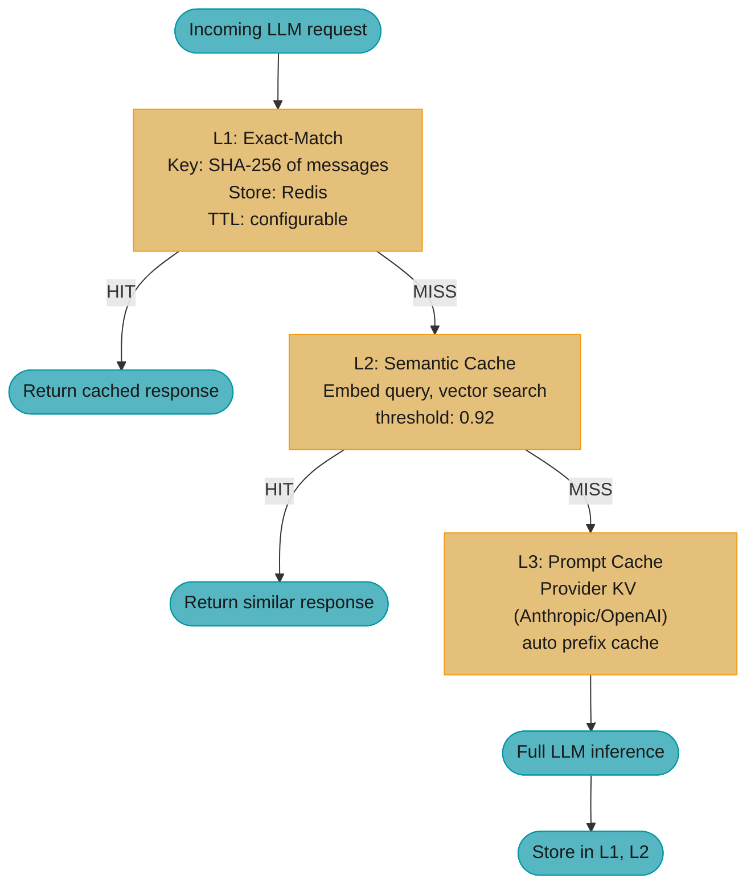

# LLM Caching

## 1. Concept Overview

LLM caching is the practice of storing and reusing model inputs or outputs to reduce latency and
cost. Unlike traditional caching where exact bit-for-bit matches are sufficient, LLM systems
require a taxonomy of caching strategies because inputs are rarely byte-identical and outputs are
probabilistic. The five distinct caching layers in an LLM production stack — exact-match response,
semantic, provider prompt (prefix KV), self-hosted KV-prefix, and embedding — each address
different cost-latency tradeoffs and have different invalidation semantics.

**Cost anchor:** A 100k-token context at 10 requests/second with a 70% prompt cache hit rate serves
roughly 700k input tokens/second from cache. On a mid-tier model at $2.50/1M input whose cache reads
bill at 0.1x ($0.25/1M), the avoided spend is 700k x $2.25/1M = $1.575/second — about $5,670/hour —
recovered by caching stable prefixes. At 1M requests/day, a 60% semantic cache hit rate on FAQ-type
queries at an average of 500 tokens/query skips 300M input tokens/day, worth $750/day at that same
$2.50/1M input rate (more once the avoided output tokens are counted, since a semantic hit skips the
model call entirely).
Full pricing math lives in [Token Economics & Cost Optimization](../token_economics_and_cost_optimization/token_economics_and_cost_optimization.md).

---

## 2. Intuition

**One-line analogy:** LLM caching is like a multi-level CPU cache — L1 is exact-match (fastest,
most restrictive), L2 is semantic (fast, approximate), L3 is prefix KV (GPU-resident,
architectural) — each level trades hit rate for generality.

**Mental model:** Before spending compute on a model call, check each cache layer in order. Exact
match: have you seen this exact byte sequence before? Semantic match: have you seen a semantically
equivalent question? Prompt prefix: have you already computed the KV tensors for the stable part
of this context? Only if all caches miss do you pay the full inference cost.

**Why it matters:** For FAQ-heavy workloads (customer support, documentation Q&A), a large share of
questions — plan on 40-70% as a sizing heuristic, then measure your own logs, since nobody publishes
these — are semantically equivalent to previously answered questions. For multi-user agents sharing
a common system prompt, the identical prefix routinely dominates the input token count and is
cache-read at 0.1x the base input price. Caching is usually the highest-ROI optimization available.

**Key insight:** The right cache for your workload depends on query distribution. Power-law query
distributions (a few questions asked many times) favor exact and semantic caching. Token-repeat
distributions (same system prompt, different user messages) favor KV-prefix caching. Both often
apply simultaneously.

---

## 3. Core Principles

**Caching is a quality risk, not just an optimization.** Stale cached responses can mislead users.
Define TTLs and invalidation triggers based on how frequently the underlying facts change, not just
on cost savings.

**Cache at the right granularity.** Caching at the response level (full output) is simple but
inflexible. Caching at the prefix KV level (computed attention tensors) is invisible to the
application but architecturally more powerful.

**Semantic cache requires threshold tuning.** Cosine similarity thresholds for semantic cache are
workload-specific. Too tight: low hit rate, no savings. Too loose: semantically different queries
get the same answer (quality regression). Tune on production query logs, not synthetic data.

**Separate cache by model and prompt version.** A cache entry valid for gpt-4o is not valid for
gpt-4o-mini. A response cached for prompt_v1 must be invalidated when prompt_v2 deploys. Make
model name + version + prompt version part of the cache key.

**Never cache outputs that should not be reused.** Do not cache: responses containing timestamps
("as of today..."), user-personalized content, or outputs from tools that have side effects.

---

## 4. Types / Cache Taxonomy

### 4.1 Exact-match response cache

Stores the full model output keyed on the exact input string (or hash). A cache hit returns the
stored output instantly, bypassing the model entirely.

| Property | Value |
|----------|-------|
| Hit rate | Low-medium (5-30% conversational; 30-60% template-driven) |
| Latency benefit | Maximum: 0ms model call |
| Quality risk | Low if TTL is correct |
| Implementation | Redis / Memcached with SHA-256(model+prompt+messages) as key |
| Best for | Repeated identical queries: report generation, templated emails, FAQ |

### 4.2 Semantic cache

Embeds the query, searches a vector index for a similar past query above a cosine threshold, and
returns the cached response for that similar query.

| Property | Value |
|----------|-------|
| Hit rate | Higher (20-60% on FAQ workloads) |
| Latency benefit | 10-50ms (embedding + vector search) vs 200-5,000ms (full inference) |
| Quality risk | Medium: false positives when similar queries need different answers |
| Implementation | text-embedding-3-small + pgvector/Qdrant; threshold ~0.92 |
| Best for | Customer support Q&A, documentation search, FAQ bots with paraphrased queries |

### 4.3 Provider prompt caching (prefix KV)

The model provider stores the KV-attention tensors for a fixed context prefix. Subsequent requests
with the same prefix skip the attention computation for the cached portion.

| Provider | Feature | Cache-read price | Min cacheable tokens |
|----------|---------|------------------|---------------------|
| Anthropic | `cache_control: {"type": "ephemeral"}` | 0.1x base input (90% off); writes 1.25x at the 5-min TTL, 2.0x at the 1-hour TTL | **Per model, and non-monotonic**: 512 (Opus 5, Fable 5, Mythos 5), 1,024 (Sonnet 5, Sonnet 4.6, Sonnet 4.5, Opus 4.8), 2,048 (Opus 4.7, Haiku 3.5), 4,096 (Opus 4.6, Opus 4.5, Haiku 4.5) |
| OpenAI | Automatic (no API change needed) | 0.1x base input on current models (`gpt-5.6-terra`: $2.50 in / $0.25 cached). Legacy `gpt-4o`-era models are 0.5x. On `gpt-5.6` and later, cache *writes* bill at 1.25x | 1,024 |
| Google Gemini | Implicit caching (on by default) plus explicit cache objects | 0.1x base input (Gemini 3.5/3.6 Flash: $1.50 in / $0.15 cached; 2.5 Pro: $1.25 / $0.125 under 200k, $2.50 / $0.25 above), **plus a storage rent no other provider charges** — $1.00 per 1M cached tokens per hour, $4.50 on 2.5 Pro. Flash-Lite on 3.5 has no caching at all | 2,048 (Gemini 2.5 Flash/Pro), 4,096 (Gemini 3.x) |

Two traps live in that last column. First, Anthropic's minimum is **per model and not monotonic in
model size** — Opus 5 caches from 512 tokens while the older Opus 4.5 and Haiku 4.5 need 4,096, so
"bigger model, smaller minimum" is a real ordering and you cannot infer it. Second, an undersized
prefix **fails silently**: no error, the request is simply processed uncached. The only way to know
is to read `cache_creation_input_tokens` and `cache_read_input_tokens` back off the response — if
both are 0, your `cache_control` did nothing.

A third trap lives in the price column, and only on Gemini: an explicit cache object is **rented
by the hour**, at $1.00 per 1M cached tokens per hour ($4.50 on 2.5 Pro), on top of the per-read
discount. Anthropic and OpenAI bill a one-off write premium and nothing thereafter, so a
cost model ported across providers silently drops a term. A 200k-token system prefix parked on
Gemini 2.5 Pro for a day costs `0.2 x 4.50 x 24 = $21.60` in rent before a single request reads
it — fine at high hit rates, ruinous for a cache that sits idle overnight.

**The formula hiding behind that cache-read price.** The discount is a ceiling, not a bill. What
you actually pay is a blend of the cached price and the full price, weighted by how often you hit:

```
  hit rate          h = cache_hits / (cache_hits + cache_misses)
  effective price   E = h x p_cached + (1 - h) x p_full
  savings           S = 1 - E / p_full
```

**The idea behind it.** "Your real token price is not the list price and it is not the
cached price — it is the two averaged together, weighted by how often you actually hit."

That framing matters because teams quote the provider's 90% figure as if it were the saving. It is
the saving *on the tokens that hit*. Hit rate is the only lever you control; the discount is a
constant handed to you.

| Symbol | What it actually is |
|--------|---------------------|
| `h` | Fraction of input tokens served from cache. A number from 0 to 1 |
| `1 - h` | The share you still pay full freight on. Always the expensive half |
| `p_cached` | Price per 1M cache-*read* tokens. $0.30/1M on Claude Sonnet 5; $1.25/1M on the legacy 0.5x-tier gpt-4o |
| `p_full` | List price per 1M uncached input tokens. The number on the pricing page |
| `E` | The blended price per 1M — the number that actually shows up on the invoice |
| `S` | How much of the list price you avoided. What you should report, not the discount |

**Walk one example.** The 70% prompt cache hit rate from the cost anchor in Section 1, priced on a
0.1x cache-read tier and on a legacy 0.5x tier. (The Sonnet 5 figures below use its $3/$15 per MTok
list price; introductory pricing of $2/$10 runs through 2026-08-31 and scales every dollar figure by
2/3 while leaving every percentage unchanged, because reads and writes are fixed multiples of the
base input price.)

```
  Claude Sonnet 5:   p_full = $3.00/1M, p_cached = $0.30/1M (0.1x), h = 0.70

      hit  portion:   0.70 x $0.30   =  $0.210
      miss portion:   0.30 x $3.00   =  $0.900
                                        -------
      E                              =  $1.110   per 1M input tokens

      S = 1 - 1.110 / 3.00 = 0.63    ->  63% off the list price, NOT 90%

  Legacy 0.5x tier (gpt-4o):  p_full = $2.50/1M, p_cached = $1.25/1M, same h = 0.70

      hit  portion:   0.70 x $1.25   =  $0.875
      miss portion:   0.30 x $2.50   =  $0.750
                                        -------
      E                              =  $1.625   per 1M input tokens

      S = 1 - 1.625 / 2.50 = 0.35    ->  35% off

  Same 70% hit rate, very different outcomes: the 0.1x tier converts it into 63%
  savings, the 0.5x tier into 35%. Check which tier your model is on before
  promising a number -- current OpenAI models are also 0.1x (gpt-5.6-terra is
  $2.50 in / $0.25 cached), so both major providers now land near 63% at h = 0.70;
  but gpt-5.6 and later additionally bill cache WRITES at 1.25x, which the
  gpt-4o-era models did not.
```

**Why the `(1 - h)` term is the one that bites.** Because `p_full` is 10x `p_cached` on Claude, the
miss portion dominates the blend long after the hit rate looks healthy. At `h = 0.70` the misses are
30% of the tokens but $0.90 of the $1.11 — **81% of the bill**. Push `h` to 0.90 and E drops to
`0.90 x 0.30 + 0.10 x 3.00 = $0.57`, halving the bill again. Drop the `(1 - h)` term from your
mental model and you will over-report savings by exactly the amount you are still spending.

**When does writing to the cache pay for itself?** Cache writes cost *more* than an uncached token
(Claude: $3.75/1M vs $3.00/1M) because the provider has to store the KV tensors. So there is a
break-even:

```
  extra cost of writing    = p_write - p_full
  saving per later read    = p_full  - p_read
  break-even reads    N*   = (p_write - p_full) / (p_full - p_read), rounded UP
```

**Stated plainly.** "You overpaid a little to write the cache; how many reads does it
take to earn that back?"

| Symbol | What it actually is |
|--------|---------------------|
| `p_write` | Cache-*creation* price. On Claude, 1.25x the base input price |
| `p_read` | Cache-*read* price. On Claude, 0.10x the base input price |
| `N*` | Minimum number of later reads before the write turns profitable |
| rounded UP | Half a read does not exist — you need a whole one, so `ceil()` |

**Walk one example.** The 7,000-token cached prefix from the Section 5 layout, over 100 requests:

```
  N* = (3.75 - 3.00) / (3.00 - 0.30)
     =  0.75 / 2.70
     =  0.278   ->  ceil  ->  1 read

  So ONE reuse inside the 5-minute TTL already pays back the write.

  100 requests against that 7,000-token prefix:

      no cache:  100 x 7,000  =  700,000 tok x $3.00/1M  =  $2.1000
      cached:      1 x 7,000  =    7,000 tok x $3.75/1M  =  $0.0263   (the write)
                  99 x 7,000  =  693,000 tok x $0.30/1M  =  $0.2079   (the reads)
                                                             -------
                                                            $0.2342

      saving = 1 - 0.2342 / 2.1000 = 0.889   ->  88.9%

  Same sum for the 1-hour TTL, where p_write = 2.0 x p_full = $6.00/1M:

      N* = (6.00 - 3.00) / (3.00 - 0.30) = 3.00 / 2.70 = 1.11  ->  ceil  ->  2 reads

  So the 5-minute TTL repays on the FIRST reuse; the 1-hour TTL needs TWO reuses
  (three requests total) before it beats paying full price every time.
```

**Why `N* = 1` is the whole argument for prefix caching.** The write penalty is only $0.75/1M while
each read saves $2.70/1M — a 3.6:1 payoff. That is why you should mark a prefix cacheable even when
you are unsure it will be reused: the downside of a wasted write is 25% of one request, the upside
is 90% off every subsequent one. The only case where it loses is a prefix that is *never* hit again
inside the TTL.

### 4.4 Self-hosted KV-prefix caching

vLLM and SGLang maintain a GPU-resident LRU cache of KV tensors indexed by the prefix hash. When
a new request shares a prefix with a cached entry, the saved tensors are used directly, skipping
prefill computation for that prefix. Transparent to the application — no API change needed. See
[vLLM Deep Dive](../vllm_deep_dive/vllm_deep_dive.md) for the PagedAttention block structure these caches
build on.

| Engine | Feature | Benefit |
|--------|---------|---------|
| vLLM | Automatic Prefix Caching (APC) | TTFT reduction for shared prefixes |
| SGLang | RadixAttention | Multi-level cache; structured generation |

### 4.5 Embedding cache

Caches computed text embeddings to avoid re-embedding the same text on every request. Critical for
[RAG pipelines](../rag_fundamentals/rag_fundamentals.md) where document embeddings are computed once at
index time.

| Use case | Cache strategy |
|----------|---------------|
| Document embeddings | Pre-computed at index time; invalidate on document update |
| Query embeddings | Short-lived; rarely worth caching across requests |
| Embeddings for semantic cache | Cached by input hash; TTL matches data freshness |

---

## 5. Architecture Diagrams

**Multi-layer LLM cache architecture.** A request cascades through three layers in order —
exact-match, then semantic, then provider prompt cache — falling through to full inference only
if all three miss:



```
Anthropic Prompt Caching — Prefix Layout
==========================================

Request:
|
+--[0]------[3,000]  System prompt
|                    cache_control: {"type": "ephemeral"}  <-- cache this
|
+--[3,000]--[5,000]  Tool definitions
|                    cache_control: {"type": "ephemeral"}  <-- cache this
|
+--[5,000]--[7,000]  Few-shot examples
|                    cache_control: {"type": "ephemeral"}  <-- cache this
|
+--[7,000]--[14,000] Retrieved context    (NOT cached — dynamic)
|
+--[14,000]-[14,200] User message         (NOT cached — dynamic)

Billing:
  tokens [0-7,000] cache write: $3.75/1M (first time)
  tokens [0-7,000] cache read:  $0.30/1M (subsequent, 90% discount)
  tokens [7,000-14,200]: full input price $3.00/1M


Semantic Cache — False-Positive Risk
=======================================

Query A: "What is the refund policy?"         sim=0.97  HIT  (correct)
Query B: "How do I request a refund?"         sim=0.94  HIT  (correct)
Query C: "What is the refund policy in Japan?" sim=0.93 HIT  (WRONG!)
                                                              ^ Japan policy differs

Fix: Use metadata filters as hard equality constraints in vector search:
     search WHERE country_code = request.country AND similarity > threshold
```

**Decoding the prefix-layout arithmetic.** The `[0]--[7,000]` boundaries above are not decorative —
they are the exact quantity the cache matcher computes. A prefix cache does not match your request
against a stored one fuzzily; it walks both token sequences from position 0, stops at the first
byte that differs, then rounds that length DOWN to a whole block:

```
  L        = length of the longest common prefix, in tokens
  cached   = floor(L / B) x B,   but 0 if that result < M
  billed   = (cached tokens at p_read) + (total - cached at p_full)
```

**What the formula is telling you.** "Count how many tokens match from the very beginning, throw away
the remainder that does not fill a whole block, and if what is left is too small to be worth
storing, you get nothing."

The "from the very beginning" clause is the entire reason Pitfall 4 exists. A prefix cache is a
*prefix* match, not a set match — one changed character at position 20 makes tokens 21 through
7,000 uncacheable even though they are byte-identical to the stored copy.

| Symbol | What it actually is |
|--------|---------------------|
| `L` | Tokens that match from position 0 until the first difference |
| `B` | Cache granularity. 16 tokens per block in vLLM (`DEFAULT_BLOCK_SIZE = 16` in `vllm/config/cache.py`); `--block-size` is unset by default and some backends pick 32/64/128 |
| `M` | Provider floor below which nothing is cached. 1,024 on OpenAI; **per-model** on Anthropic (512 to 4,096 — see the §4.3 table); 2,048-4,096 on Gemini |
| `floor(L/B) x B` | L rounded down to a whole number of blocks. The partial trailing block is recomputed |
| `cached` | What you get billed at `p_read`. Reported as `cache_read_input_tokens` |

**Walk one example.** The exact layout drawn above — 14,200 total tokens, 7,000 marked cacheable —
on Claude Sonnet 5, whose minimum cacheable prefix is `M` = 1,024, under three scenarios (on Opus
4.5 or Haiku 4.5 the floor is `M` = 4,096: scenario 1 still caches, but every prefix shorter than
4,096 tokens joins scenario 2 and caches nothing at all):

```
  Scenario 1: prefix byte-identical (the happy path)

      L = 7,000       floor(7000 / 16) x 16 = 437 x 16 = 6,992 tokens
      6,992 >= M (1,024)                              -> cache applies
      remaining 14,200 - 6,992 = 7,208 tokens         -> full price

      billed = 6,992 x $0.30/1M + 7,208 x $3.00/1M
             = $0.002098        + $0.021624          = $0.02372

  Scenario 2: a timestamp lands at token 500 of the system prompt (Pitfall 4)

      L = 499         floor(499 / 16) x 16 = 31 x 16 = 496 tokens
      496 < M (1,024)                                 -> NOTHING is cached
      all 14,200 tokens                               -> full price

      billed = 14,200 x $3.00/1M                      = $0.04260
                                                        ^ 1.80x scenario 1

  Scenario 3: the timestamp moves to the user turn, at token 14,050 (the fix)

      L = 7,000       -> identical to scenario 1      = $0.02372
```

**Why the `floor(L / B) x B` term exists.** KV tensors are stored per block, not per token — a
partial block has no addressable home, so the engine recomputes it. This costs you 8 tokens in
scenario 1 (7,000 - 6,992), which is noise. It matters only when your prefix is *just* over the
minimum: a 1,030-token prefix floors to 1,024 and squeaks through, while a 1,020-token prefix
floors to 1,008, falls under `M`, and caches nothing at all. If you are near the floor, pad the
stable prefix rather than trimming it.

---

## 6. How It Works — Detailed Mechanics

### Exact-match cache (Redis)

```python
import hashlib, json, redis
from openai import OpenAI

_client = OpenAI()
_cache  = redis.Redis(host="localhost", port=6379, db=0)

def cached_completion(
    messages: list[dict],
    model: str = "gpt-4o",
    ttl_seconds: int = 3_600,
    no_cache: bool = False,
) -> str:
    if no_cache:
        return _call_model(messages, model)

    key = (
        f"llm:{model}:"
        + hashlib.sha256(
            json.dumps(messages, sort_keys=True).encode()
        ).hexdigest()
    )

    if cached := _cache.get(key):
        return cached.decode()

    result = _call_model(messages, model)
    _cache.setex(key, ttl_seconds, result)
    return result

def _call_model(messages: list[dict], model: str) -> str:
    return _client.chat.completions.create(
        model=model, messages=messages
    ).choices[0].message.content
```

**Decoding `ttl_seconds = 3_600`.** That default is not a convention — it is a claim about how
often you are willing to serve a wrong answer. Model fact changes as a Poisson process and the
staleness rate falls out:

```
  lambda        = rate at which the underlying fact changes, per day
  mean_age      = TTL / 2          (entries are served at all ages between 0 and TTL)
  P(stale)      = 1 - e^(-lambda x mean_age)
  wrong_per_day = daily_requests x hit_rate x P(stale)
```

**What this actually says.** "A cache entry is wrong if the fact changed at some point between
when you stored it and when you served it — so double the TTL and you roughly double your odds of
having missed a change."

The `TTL / 2` is the piece people skip. An entry is not served at age TTL; it is served at every
age from fresh to expiring, so the *average* entry you hand out is half a TTL old. Reasoning with
the full TTL overstates staleness by about 2x.

| Symbol | What it actually is |
|--------|---------------------|
| `lambda` | Change rate. A policy page edited monthly is `1/30 = 0.0333` per day |
| `TTL` | How long an entry is allowed to be served before Redis evicts it |
| `mean_age` | Average staleness of an entry at the moment it is served. `TTL / 2` |
| `e^(-lambda x t)` | Probability of NO change in time `t`. The survival curve |
| `1 - e^(...)` | Flip it: probability at least one change DID happen. That is your error rate |

**Walk one example.** A return-policy FAQ that changes about monthly (`lambda = 0.0333/day`), at
the 1M requests/day and 60% semantic hit rate from Section 1:

```
  served-from-cache per day = 1,000,000 x 0.60 = 600,000 responses

    TTL       mean_age    P(stale) = 1 - e^(-0.0333 x mean_age)   wrong answers/day
    -------   ---------   ------------------------------------   -----------------
    1 hour    0.0208 d    1 - e^(-0.000694) = 0.00069  (0.07%)              416
    1 day     0.5    d    1 - e^(-0.01667)  = 0.01653  (1.65%)            9,918
    7 days    3.5    d    1 - e^(-0.11667)  = 0.11011  (11.01%)          66,066

  Going 1 day -> 7 days buys you almost no extra hit rate (the queries were already
  hitting) but multiplies wrong answers 6.7x, from ~9.9k to ~66k per day.
```

**Why TTL alone is the wrong tool for fast-changing facts.** The table shows the ceiling: even a
1-hour TTL still ships 416 stale answers a day. To get below that you need event-triggered
invalidation — delete the key when the policy document is edited — which drives `P(stale)` toward
zero regardless of TTL. Use TTL as the backstop for facts you cannot instrument, not as the primary
freshness mechanism for facts you can.

### Semantic cache (pgvector)

```python
from openai import OpenAI
import psycopg2

_client = OpenAI()
_DSN    = "dbname=llmcache host=localhost"

def _embed(text: str) -> list[float]:
    return _client.embeddings.create(
        model="text-embedding-3-small", input=text
    ).data[0].embedding

def semantic_lookup(query: str, threshold: float = 0.92) -> str | None:
    emb = _embed(query)
    with psycopg2.connect(_DSN) as conn, conn.cursor() as cur:
        cur.execute(
            """
            SELECT response, 1 - (embedding <=> %s::vector) AS sim
            FROM semantic_cache
            ORDER BY embedding <=> %s::vector
            LIMIT 1
            """,
            (emb, emb),
        )
        row = cur.fetchone()
        if row and row[1] >= threshold:
            return row[0]
    return None

def semantic_store(query: str, response: str) -> None:
    emb = _embed(query)
    with psycopg2.connect(_DSN) as conn, conn.cursor() as cur:
        cur.execute(
            "INSERT INTO semantic_cache (query, embedding, response) "
            "VALUES (%s, %s::vector, %s)",
            (query, emb, response),
        )
        conn.commit()
```

**Decoding `threshold: float = 0.92`.** That single default is a precision/recall dial, and moving
it two decimal places changes who gets a wrong answer. The rule and its consequences:

```
  serve cached if   cos(q_new, q_stored) >= tau

  precision  = TP / (TP + FP)      of the queries we SERVED, how many deserved it
  recall     = TP / (TP + FN)      of the queries we COULD have served, how many we caught
  hit rate   = (TP + FP) / N       what the dashboard shows -- inflated by every FP
```

**In plain terms.** "Serve the old answer only if the new question points in almost
the same direction as the old one — and `tau` is where you draw 'almost'."

The trap: precision and hit rate move in *opposite* directions as you lower `tau`, but only hit
rate is on your cost dashboard. Lowering the threshold always looks like a win from the finance
side and always looks like a regression from the quality side.

| Symbol | What it actually is |
|--------|---------------------|
| `tau` | The similarity cutoff. `0.92` in the code above, `0.92` in the Section 5 diagram |
| `cos(a, b)` | Angle between two embedding vectors, mapped to -1..1. Ignores length, measures direction only |
| `TP` | Served a cached answer, and it was genuinely the right answer |
| `FP` | Served a cached answer that was WRONG. The Japan-refund case in Section 5 |
| `FN` | Called the model even though a valid cached answer was sitting right there. Costs money, not correctness |
| precision | Trustworthiness of a hit. The number your users feel |
| recall | Completeness. The number your CFO feels |

**Walk one example.** 1,000 production queries scored against the cache, bucketed by similarity and
hand-labelled for whether the cached answer was actually correct:

```
  similarity band   queries   same intent (TP)   different intent (FP)
  ---------------   -------   ----------------   ---------------------
  >= 0.95               180                176                       4
  0.92 - 0.95           140                119                      21
  0.85 - 0.92           230                 92                     138
  <  0.85               450                  8                     442
                                            ---
  total truly-cacheable                     395

  tau = 0.95   served 180    TP 176  FP   4
               precision = 176/180 = 97.8%   recall = 176/395 = 44.6%   hit rate 18.0%

  tau = 0.92   served 320    TP 295  FP  25
               precision = 295/320 = 92.2%   recall = 295/395 = 74.7%   hit rate 32.0%

  tau = 0.85   served 550    TP 387  FP 163
               precision = 387/550 = 70.4%   recall = 387/395 = 98.0%   hit rate 55.0%

  0.95 -> 0.85 triples the hit rate (18% -> 55%) and looks like a huge cost win.
  It also takes wrong answers from 4 per 1,000 users to 163 per 1,000 -- a 41x
  increase in user-visible incorrectness, invisible on any cost dashboard.
```

**Why the 0.85-0.92 band is where the damage lives.** Look at that row: 230 queries, and 138 of
them (60%) are different-intent. This is exactly the "price in the US?" vs "price in Germany?"
region from Pitfall 3 — paraphrase-level similarity with entity-level difference. Cosine similarity
cannot see the difference because "US" and "Germany" are one token in an otherwise identical
sentence. No value of `tau` separates that band cleanly, which is why the fix in Section 5 is a
*metadata filter*, not a threshold tweak: force `country_code` to match exactly, and those 138
false positives are removed from the candidate set before similarity is ever computed. You can then
safely run `tau` at 0.88 and collect the hit rate.

### Anthropic prompt caching

```python
import anthropic

_client = anthropic.Anthropic()

def call_with_prompt_cache(
    system: str,
    tool_defs: list[dict],
    user_message: str,
) -> str:
    response = _client.messages.create(
        # Sonnet 5: $3/$15 per MTok list, minimum cacheable prefix 1,024 tokens.
        # The minimum is per-model — Opus 5 caches from 512, Opus 4.5 and
        # Haiku 4.5 need 4,096. Check before assuming your prefix qualifies.
        model="claude-sonnet-5",
        max_tokens=1_024,
        system=[
            {
                "type": "text",
                "text": system,
                "cache_control": {"type": "ephemeral"},   # cache system prompt
            }
        ],
        tools=[
            # Mark ONLY the last tool: a breakpoint caches every block before
            # it, and the API allows at most 4 cache_control breakpoints per
            # request -- marking every tool 400s as soon as there are five.
            {**tool, "cache_control": {"type": "ephemeral"}}
            if i == len(tool_defs) - 1
            else tool
            for i, tool in enumerate(tool_defs)
        ],
        messages=[{"role": "user", "content": user_message}],
    )
    # response.usage.cache_creation_input_tokens  -- tokens written to cache
    # response.usage.cache_read_input_tokens      -- tokens served from cache
    return response.content[0].text
```

---

## 7. Real-World Examples

Note on sourcing: cache hit rates are almost never published by the companies that run them. The
three shapes below are the recurring *patterns* worth knowing, with the numbers presented as
illustrative planning figures rather than as reported facts about any named vendor.

**AI search / answer engines** (Perplexity-style) are the textbook semantic-cache workload: popular
queries follow a steep power law, so a semantic cache in front of the answer generator absorbs a
large share of traffic. The design detail that matters is partitioning — by query language and by
recency window, so a cached answer to "who won last night" cannot outlive the fact it encodes.

**Customer support bots** (the Intercom Fin / Zendesk AI category) see heavily clustered intent: a
few thousand query clusters cover most volume. The layered pattern is an exact-match cache on
normalized queries first, then a semantic cache above it — the second layer is where most of the
incremental hit rate comes from, because users paraphrase.

**Coding assistants** (Cursor, Claude Code and similar) lean on *provider prompt caching* rather
than response caching: the repository index and system prompt sit in a cached prefix block that is
byte-identical across a session, while the user turn changes every request. Cursor's pricing docs
publish separate cache-write and cache-read token rates for the Claude models it offers (a
Sonnet-class model bills $3.75/1M written against $0.30/1M read), which is direct evidence that
provider prompt caching is in play on those requests; no hit rate is published, so do not quote one.

---

## 8. Tradeoffs

| Cache type | Hit rate | Latency savings | Quality risk | Implementation cost |
|------------|----------|-----------------|-------------|---------------------|
| Exact match | Low-medium | Maximum | Minimal | Low |
| Semantic | Medium | High | Medium (threshold-sensitive) | Medium |
| Provider prompt (prefix KV) | High for shared prefixes | High (cost savings) | None | Very low |
| Self-hosted KV prefix (vLLM/SGLang) | High for shared prefixes | High (TTFT) | None | Infrastructure |
| Embedding cache | Very high for reused docs | Medium | None | Low |

---

## 9. When to Use / When NOT to Use

**Use caching when:**
- *Exact cache:* template-driven or FAQ workloads with repeating identical queries.
- *Semantic cache:* conversational Q&A where users paraphrase the same question.
- *Prompt cache:* any system with a stable system prompt above your model's minimum cacheable
  prefix (512-4,096 tokens depending on the model — see Section 4.3) shared across many users.
- *Embedding cache:* RAG pipelines with large document corpora that do not change frequently.

**Do NOT cache when:**
- Output contains time-sensitive data ("as of today", "current price", "live status").
- User-personalized content that must not be shared across users.
- Tool calls with side effects (writes, emails, payments) — never cache these.
- Semantic cache: queries where slight semantic similarity hides important differences (legal
  jurisdiction, medical context, user role).

---

## 10. Common Pitfalls

**Pitfall 1 — Sharing cache entries across users.** A semantic cache hit serves user A's past
answer to user B, potentially leaking personalized or sensitive information. Fix: partition the
cache by user ID or tenant; never share cache entries across security boundaries.

**Pitfall 2 — Stale semantic cache entries.** A FAQ answer cached 3 months ago no longer reflects
the current return policy. Fix: set TTLs based on data change frequency; for live product/policy
information, use short TTLs (hours) or event-triggered invalidation.

**Pitfall 3 — Semantic cache threshold too low.** Threshold of 0.80 causes semantically different
questions ("price in the US?" and "price in Germany?") to return the same answer. Fix: tune the
threshold on production query logs; use metadata filters as secondary hard keys.

**Pitfall 4 — Prompt cache miss from unstable prefix.** Adding a timestamp or user ID to the
system prompt defeats the KV-prefix cache because every request has a unique prefix. At 10
requests/second and a 100k-token context, this throws away the $1.575/second of avoided spend from
the Section 1 anchor — about $5,670/hour at a $2.50/1M input rate with 0.1x cache reads. Fix: move
all dynamic content to the user turn; the system prompt must be byte-identical across all requests
using the same cached prefix.

```python
# BROKEN: dynamic values in the system prompt — unique prefix on every request
system = f"You are a support bot. Today is {datetime.now()}. User: {user_id}."

# FIX: byte-identical system prompt; dynamic values move to the user turn
system = "You are a support bot."
user_msg = f"[date: {today}] [user_tier: {tier}]\n{question}"
```

**Pitfall 5 — Cache poisoning via prompt injection.** An attacker crafts a query that gets cached
with a malicious response; subsequent users asking a similar question receive the attacker's output.
Fix: never cache responses to unvalidated user inputs; run an output safety check before storing
any entry in the semantic cache.

**Pitfall 6 — Not measuring cache hit rate.** Team assumes the cache is working but hit rate is 2%
because the key format changed after a refactor. Fix: expose cache hit rate as a first-class metric
(hits/total, per cache type); alert if hit rate drops below expected baseline.

**Pitfall 7 — Cache stampede: every concurrent request misses the same key at once.** When a hot
entry expires (or is asked for the first time), every request that arrives while the first one is
still generating also misses, and each of them pays a full model call. A database stampede wastes
spare CPU; an LLM stampede wastes dollars and GPU-seconds — and at temperature > 0 the duplicates
return *different* answers that then race to write the same key, so which answer the cache keeps is
whichever call happened to finish last. The number of duplicates follows from the arrival rate for
that one key and how long generation takes:

```
  N_dup  ~=  lambda_key x T_gen      requests arriving during the first miss

  lambda_key    requests/second for THIS key, not for the service
  T_gen         seconds to generate AND store the response, not TTFT

  A hot FAQ entry at 20 req/s during an incident, 2.5s to generate:
      N_dup = 20 x 2.5 = 50 concurrent calls where 1 was needed

  Priced on the Section 14 workload (6,000 in + 500 out, Sonnet 5 $3/$15):
      one call   = 6,000 x $3/1M + 500 x $15/1M      = $0.0255
      the burst  = 50 x $0.0255                      = $1.2750
      wasted     = 49 x $0.0255                      = $1.2495 per expiry

  50 hot keys on the Section 14 six-hour TTL expire four times a day each:
      50 x 4 x $1.2495 = $250/day re-answering questions the cache knew.
```

Fix: single-flight. On a miss, take a short-lived lock (`SET key:lock <id> NX EX 10`); the winner
calls the model and writes both the entry and a completion signal, and the losers wait on that
signal (Redis pub/sub, or a bounded poll) instead of calling the model themselves. Always bound the
wait, so a winner that crashes degrades to an ordinary miss rather than a hang. For entries hot
enough that a single expiry hurts, add probabilistic early expiry — refresh an entry slightly
*before* its TTL with a probability that rises as it nears expiry — so the refresh is absorbed by
one request instead of all of them simultaneously. Both belong in front of L1 and L2 only; L3
provider prompt caching is unaffected, because a prompt-cache miss costs full input price rather
than a duplicate generation.

---

## 11. Technologies & Tools

| Tool | Type | Key Feature |
|------|------|-------------|
| Redis | Exact-match store | Low-latency key-value; TTL support; cluster mode |
| pgvector | Semantic cache store | PostgreSQL extension; cosine/L2 distance |
| Qdrant | Semantic cache store | Standalone; filtering; high-throughput |
| LiteLLM | Proxy with built-in cache | Drop-in OpenAI-compatible; exact + semantic cache |
| GPTCache | Semantic cache library | Open source; multiple backends and embedding models |
| Anthropic API | Provider prompt caching | cache_control blocks; reads at 0.1x, writes at 1.25x (5-min TTL) or 2.0x (1-hour TTL); per-model minimum prefix |
| OpenAI API | Provider prompt caching | Automatic; reads at 0.1x on current models (0.5x on gpt-4o-era); 1,024-token minimum; writes billed at 1.25x from gpt-5.6 on |
| vLLM | Self-hosted KV prefix cache | Automatic prefix caching (APC); TTFT reduction |
| SGLang | Self-hosted KV prefix cache | RadixAttention; multi-level cache |
| Memcached | Exact-match store | Simpler than Redis; horizontal scale; no persistence |

---

## 12. Interview Questions with Answers

**Q: What are the five layers of LLM caching and what does each optimize?**
**Short:** Exact-match response cache, semantic cache, provider KV prompt caching, self-hosted KV-prefix caching, and embedding cache each target a different repeat pattern.
(1) Exact-match response cache: returns a stored response when the exact input repeats; maximizes
savings for identical queries. (2) Semantic cache: returns a cached response when the input is
semantically similar above a cosine threshold; handles paraphrased queries. (3) Provider prompt
caching (Anthropic cache_control, OpenAI automatic): caches KV-attention tensors for a stable
context prefix; cache reads bill at 0.1x the base input rate on current Anthropic and OpenAI models
(0.5x on the legacy gpt-4o tier), so shared system prompts get 50-90% off their cached tokens. (4) Self-hosted
KV-prefix caching (vLLM APC, SGLang RadixAttention): GPU-resident LRU cache of KV tensors;
reduces time-to-first-token for requests sharing a prefix. (5) Embedding cache: avoids re-embedding
unchanged documents; critical for RAG performance.

**Q: How do you design the cache key for a multi-model, multi-prompt-version system?**
**Short:** Combine model name, model version, prompt version hash, and a hash of the input content; omitting any dimension produces incorrect cache hits.
Include all dimensions that affect the output: model name, model version, prompt version (or hash),
and the input content hash. A minimal key: `{model_name}:{model_version}:{prompt_hash}:{sha256(sorted_messages)}`.
Omitting any dimension causes incorrect cache hits. User-specific content must either be excluded
from cacheable content or used as an additional key segment to prevent cross-user sharing.

**Q: What is the false-positive problem in semantic caching and how do you tune the threshold?**
**Short:** It occurs when semantically similar queries need different answers; set the threshold above the 95th percentile of known-different query-pair similarities, typically 0.90-0.95.
A false positive occurs when two queries have high cosine similarity but require different answers
— e.g., "refund policy in the US" and "refund policy in Germany." Tune the threshold by: sampling
production query pairs with known different correct answers; computing their cosine similarity;
setting the threshold above the 95th percentile of that distribution. In practice, 0.90-0.95 is
the typical range. For high-stakes domains, use metadata filters as hard secondary keys rather than
relying on similarity alone.

**Q: Why can provider prompt caching only cache a prefix, never a middle or suffix segment?**
**Short:** Causal attention makes each token's KV values depend on every preceding token, so only a byte-identical run from position 0 can be reused.
KV tensors are position-dependent: each token's keys and values are computed from all preceding
tokens through causal attention, so a cached segment is only valid if every byte before it is
identical. Changing one character at position 0 invalidates everything after it, and a stable
block placed after dynamic content can never hit. This is why prompt structure is an architectural
decision: system prompt and tool definitions first, retrieved context next, user message last —
ordered from most to least stable. Audit prompt-assembly code for anything dynamic (timestamps,
request IDs, shuffled few-shot examples) that sneaks in before the intended cache breakpoint.

**Q: Does response caching break sampling semantics when temperature > 0?**
**Short:** Yes, replaying a stored response makes a supposedly-sampled endpoint deterministic on repeat queries, which harms creative or brainstorming use cases.
Yes — a cached response replays a single draw from the output distribution, making the endpoint
deterministic for repeated queries even though callers requested sampled diversity. For FAQ
answers this is usually desirable (consistency builds trust); for brainstorming or creative
endpoints it is a bug users notice ("it gives the identical answer every time"). Include
temperature and other sampling parameters in the cache key, and skip response caching entirely
for endpoints where output diversity is part of the product. Prompt (KV) caching has no such
problem — it reuses input computation while the model still samples fresh output.

**Q: How does Anthropic prompt caching work and how do you maximize hit rate?**
**Short:** It caches KV tensors for `cache_control`-marked blocks above a per-model minimum prefix, with a 5-minute default TTL, billing reads at 0.1x the input price.
Anthropic caches the KV-attention tensors for any content block marked with
`cache_control: {"type": "ephemeral"}`. The minimum cacheable prefix is per-model and non-monotonic
— 512 tokens on Opus 5 and Fable 5, 1,024 on Sonnet 5 and Sonnet 4.6, 2,048 on Opus 4.7, 4,096 on
Opus 4.6, Opus 4.5 and Haiku 4.5 — and the default TTL is 5 minutes, with a 1-hour tier available
via `"ttl": "1h"`. To maximize hit rate: place the system prompt and tool definitions in cached
blocks at the front of every request; ensure these blocks are byte-identical across requests — no
timestamps, user IDs, or dynamic content; track `cache_read_input_tokens` vs
`cache_creation_input_tokens` in usage metadata. Cache reads bill at 0.1x the base input price
($3.00 → $0.30/1M on a Sonnet-class model). A prefix under the minimum fails silently — both usage
counters come back 0 and you are billed full price with no error.

**Q: How does vLLM automatic prefix caching (APC) work?**
**Short:** It hashes fixed-size token blocks with SHA-256 in a GPU-resident LRU cache, skipping prefill for cached blocks in proportion to the shared prefix length.
vLLM's APC maintains a GPU-resident LRU cache of KV tensors keyed by the SHA-256 of the token
sequence of each block (typically 16-32 tokens per block). When a new request shares a prefix with
a cached entry, vLLM skips the prefill computation for the cached blocks, cutting time-to-first-
token roughly in proportion to the share of the prefill it skips — so the win grows with the length
of the shared prefix. APC provides no benefit when every request has a unique prefix.

**Q: How do you prevent cache poisoning in a semantic cache?**
**Short:** Validate responses through the production guardrail pipeline before caching, only cache classifier-passed queries, cap entry lifetime, and sample hits for quality anomalies.
(1) Validate and sanitize all responses before caching — run through the same guardrail pipeline
used for production outputs. (2) Only cache responses to queries that pass input classification
(not jailbreaks or adversarial inputs). (3) Add a staleness timestamp and cap cache entry lifetime
so poisoned entries expire. (4) Monitor cache hit responses with a quality sampler to detect
anomalies.

**Q: How do you handle cache invalidation for a RAG system where the knowledge base updates?**
**Short:** Use event-driven invalidation that evicts cached queries tied via provenance logging to a changed document, or a TTL calibrated to the update frequency.
Use event-driven invalidation: when a document is updated, identify cached queries whose
top-retrieved document includes the changed document, and evict those entries. This requires
provenance logging (tracking which documents contributed to each cached response). For simpler
systems, use TTL-based invalidation calibrated to the update frequency (daily updates → TTL of
23h). For real-time data, do not use semantic caching at all.

**Q: What is the difference between prompt caching and response caching?**
**Short:** Prompt caching reuses input KV tensors while still generating fresh output; response caching returns a stored output with zero inference cost.
Provider prompt caching saves the computation of processing input tokens — the KV tensors are
reused, reducing TTFT and input token cost; the model still generates a fresh output each time.
Response caching saves the output — the same generated text is returned without any model call.
Response caching is cheaper (zero inference cost for hits) but deterministic. Use response caching
for truly static, idempotent queries; use prompt caching for all requests with shared system
prompts regardless of whether the output is dynamic.

**Q: How would you instrument a multi-layer cache to understand its effectiveness?**
**Short:** Track per-layer hit rate, hit/miss latency percentiles, dollar savings, and a sampled LLM-judge false-positive rate, alerting on hit-rate drops or rising false positives.
Track per-layer metrics: (1) hit rate per layer; (2) latency distribution (p50/p95/p99) for hits
vs misses; (3) cost savings in dollars per day (tokens served from cache * price delta); (4)
false-positive rate for semantic cache (sampled LLM-as-judge: "is this cached response correct
for this query?"). Alert on hit rate drop >10pp (suggests key schema change) and false-positive
rate >2% (threshold needs tightening).

**Q: How do you handle user-personalized responses and caching safely?**
**Short:** Strip personalization and inject it post-generation, use a per-user cache namespace, or skip caching personalized responses entirely to avoid cross-user leakage.
Personalized responses must not be shared across users. Options: (1) strip personalization from
the prompt and inject it post-generation (cache the generic response, then string-substitute);
(2) use per-user cache namespaces (key includes user ID) — hit rate is lower but safe; (3) do not
cache personalized responses at all — only cache generic portions. The semantic cache must never
serve user A's personalized response to user B; add a user_id metadata filter as a hard equality
constraint in the vector search.

**Q: What happens to an Anthropic cache entry after the 5-minute TTL, and how do you keep it warm?**
**Short:** Each cache read resets the 5-minute TTL, so steady reuse keeps it alive, while a traffic gap forces a costlier rewrite that a periodic keep-alive ping avoids.
Each cache read refreshes the 5-minute TTL, so steady traffic (more than one request per 5 minutes
per unique prefix) keeps the entry alive indefinitely; a traffic gap lets it expire, and the next
request pays the write price again. Writes carry a 25% premium over normal input ($3.75 vs
$3.00/1M for Sonnet-class models), so caching pays for itself as soon as a prefix is reused even
once within the TTL (break-even at ~1.3 uses). For low-traffic but cost-sensitive prefixes, a
keep-alive ping (a max_tokens=1 request every ~4 minutes) costs far less than repeated cache
re-writes of a 10k-token prefix; Anthropic also offers a 1-hour TTL tier at a higher write premium.
Track spikes in `cache_creation_input_tokens` as the signal that your prefix is churning or your
traffic has gaps.

**Q: How does SGLang's RadixAttention differ from vLLM's automatic prefix caching?**
**Short:** vLLM's APC matches fixed-size aligned token blocks, while RadixAttention organizes prefixes in a radix tree for token-granular, branching prefix sharing.
vLLM's APC hashes fixed-size token blocks (16-32 tokens) and reuses KV tensors for exact
block-aligned prefix matches. RadixAttention instead organizes cached prefixes in a radix tree
over token sequences, so requests can share any common prefix at token granularity, and the tree
makes multi-branch sharing (one system prompt, many few-shot variants, many user turns) explicit
and LRU-evictable per node. RadixAttention shines for structured workloads — agent loops,
tree-of-thought search, batched evals — where many requests share deep, branching prefixes. For
plain chat traffic with one shared system prompt, both give similar wins; the difference shows up
when prefixes branch.

**Q: How do you cache effectively in multi-turn conversations where the context grows every turn?**
**Short:** Move the KV-cache breakpoint forward each turn so the append-only conversation history keeps reusing earlier turns' cached prefix.
Exact and semantic response caches are nearly useless mid-conversation (each turn's context is
unique), but KV-prefix caching is ideal: the conversation history is an append-only prefix, so
turn N reuses everything computed for turns 1..N-1. With Anthropic, move the cache breakpoint
forward each turn (up to 4 cache_control breakpoints per request) so the newest turns get cached
for the next request; with vLLM/SGLang this happens automatically as long as the session lands on
the same replica — which makes session-affinity routing a caching feature, not just a
load-balancing choice. Budget for the growing prefix: a 50-turn conversation still pays cache-read
price on the full history every turn, which is why history summarization or truncation remains
necessary beyond the cache.

**Q: What is a cache stampede in an LLM cache, and why is it worse than a database cache stampede?**
**Short:** It is the burst of duplicate full-price inferences that all miss when one hot key expires; single-flight locking plus probabilistic early expiry fixes it.
A stampede is the burst of duplicate misses that reaches the model when one hot key expires, because
every request arriving during the first generation also misses. It is worse than the database
version on two counts: each duplicate is a full inference (dollars and GPU-seconds, not spare CPU),
and at temperature > 0 the duplicates produce *different* answers that race to write the same key,
so the entry the cache keeps is whichever call finished last. Size it as `lambda_key x T_gen` — a
key taking 20 requests/second with 2.5s generation produces roughly 50 calls where one was needed,
about $1.25 of waste per expiry on a 6,000-token prompt. Fix it with single-flight (the first miss
takes a short-TTL Redis lock, everyone else waits on a completion signal with a timeout) plus
probabilistic early expiry on the hottest keys, so the refresh is absorbed by one request rather
than all of them. Provider prompt caching needs neither, since a prefix miss costs full input price
rather than a duplicate generation.

**Q: Where does caching fit when responses are streamed?**
**Short:** A cache hit has no real token stream so it must be replayed as one blob or a synthetic stream, and writes are committed only after a clean stream completion.
For cache hits there is no token stream — only a stored string — so either return it at once (a
different UX than token-by-token rendering) or replay it as a synthetic stream for visual
consistency. On the write side, buffer the full streamed response and insert it into the cache
only after the stream completes successfully and passes output validation — caching a truncated
stream (client disconnect, timeout) poisons the entry for every future hit. Provider prompt
caching is unaffected by streaming since it operates on input processing, not output delivery.
Practical pattern: wrap the stream in a tee that accumulates chunks and commits to cache only on
a clean end-of-stream event.

---

## 13. Best Practices

- Implement caching as a layered pipeline: exact match first, semantic second, prompt cache third.
  Each layer catches what the previous misses.
- Partition all application-level caches by model name + version + prompt version; a cache entry
  is only valid for the exact combination that generated it.
- Never cache responses containing time-sensitive data, PII, or outputs from tool calls with side
  effects; mark these no-cache at the call site.
- Tune semantic cache threshold on production query logs; start at 0.92 and adjust based on
  measured false-positive rate.
- For provider prompt caching, ensure the stable prefix is byte-identical across all requests;
  move all dynamic content to after the cached prefix.
- Track cache hit rate, false-positive rate, and cost savings as first-class production metrics;
  alert on hit rate drops.
- Use event-driven cache invalidation for knowledge bases that update frequently.
- Add a cache-bypass mechanism (header or flag) for debugging and canary testing.
- Scan cached responses quarterly for PII leakage and cross-tenant data exposure, especially in
  semantic caches.

---

## 14. Case Study

**Problem Statement**

A B2B SaaS company runs an AI customer support chatbot handling 500,000 requests/day on a
Sonnet-class model ($3/$15 per 1M list). Analysis: 65% of queries are from a shared pool of ~2,000
FAQ topics; system prompt is 4,000 tokens; average context is 6,000 tokens. That is 90B input
tokens/month, about $270,000/month in input-token spend alone. No caching is in place.

**Architecture Overview**

```
Three-Layer Cache Architecture
================================

L1: Exact-match cache (Redis)
  Key: SHA-256(model + messages)
  TTL: 24 hours
  Expected hit rate: 18%  (identical FAQ wording)

L2: Semantic cache (Qdrant + text-embedding-3-small)
  Threshold: 0.92
  Metadata filter: product_line, language
  TTL: 6 hours
  Expected hit rate on L1 misses: ~33%  (= 27% of total)

L3: Anthropic prompt cache
  Cached prefix: 4,000-token system prompt
  Cached tokens per request: 4,000 of 6,000 input tokens on cache reads
  Expected hit rate: ~80%  (most requests share same prefix)
  Discount: 90% on cached portion


Cost model (per 1,000 requests, Claude Sonnet 5 $3/$15 per 1M list):
  Without cache:   6,000 input tokens * $3/1M * 1,000 = $18.00

  After L1 (18% hit, 0 model cost):
    820 requests pass through  -> cost $14.76

  After L2 (33% of 820 = 270 hits; 820 queries embedded at ~500 tok,
            820 * 500 * $0.02/1M = ~$0.01):
    550 requests pass through  -> cost $9.90

  After L3 (80% of 550 = 440 prefix-cache reads, 110 writes):
    440 reads   on the 4,000-tok prefix: 440 * 4,000 * $0.30/1M = $0.53
                                          (the same tokens at full price: $5.28)
    110 writes  on the 4,000-tok prefix: 110 * 4,000 * $3.75/1M = $1.65
    dynamic remainder, all 550 requests:  550 * 2,000 * $3.00/1M = $3.30

  Total with cache: 0.53 + 1.65 + 3.30 + 0.01 = $5.49  vs  $18.00 without
  Savings: 69%

  The remainder line is the one teams forget: L3 only covers the 4,000-token
  prefix, so the other 2,000 tokens of every request still bill at full price
  and become the largest single item in the post-cache bill.
```

**Key Design Decisions**

Cache partitioning: L2 semantic cache uses metadata filters (product_line, language) as hard
equality constraints to prevent serving US product answers to Germany queries. TTL set to 6 hours
(product info updates weekly; 6h provides freshness safety margin). Anthropic prompt cache: system
prompt is the sole cached block; no user ID or timestamp in the system prompt.

**Tradeoffs and Alternatives**

LiteLLM proxy was evaluated as an all-in-one solution but the team needed custom metadata filtering
in the semantic cache that LiteLLM did not support. A single Redis-only approach was prototyped but
the 18% exact hit rate left too much on the table — the semantic cache was worth the additional
complexity.

**Interview Discussion Points**

- Monthly input spend: $270,000 → $82,350 (15,000 x $5.49; savings $187,650). Cache infra cost:
  $400/month. ROI: day 1.
- Three false-positive incidents in the first month prompted raising the threshold from 0.90 to
  0.92 for product-pricing queries, dropping hit rate by 3pp but eliminating false positives.
- The cache hit rate drops predictably every Monday morning when users ask about weekend policy
  changes before the TTL refreshes — this is acceptable; the team adds a webhook from the policy
  CMS to invalidate the semantic cache on policy update events.
