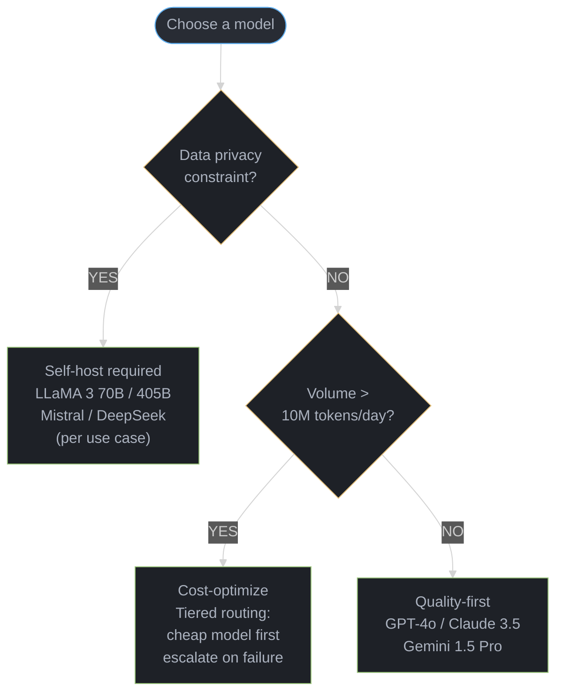

# LLM Ecosystem & Landscape

## 1. Concept Overview

The LLM landscape has evolved from a small number of proprietary models (GPT-3 in 2020) to a vibrant ecosystem with dozens of frontier models, thousands of fine-tuned variants, and a rich tooling layer. Understanding the landscape — who the major players are, how models compare, what the licensing landscape looks like, and how costs break down — is essential for making informed build vs. buy decisions.

The 2023-2025 period was characterized by: the open-source revolution (LLaMA democratizing access), the emergence of specialized models (code, math, embeddings), massive cost reduction (GPT-3 cost $0.02/1K tokens; GPT-4o-mini costs $0.00015/1K tokens — 130x cheaper), and the rise of reasoning models as a new paradigm.

---

## 2. Intuition

> **One-line analogy**: The LLM landscape is like a smartphone market — a few dominant platforms (GPT, Claude, Gemini), a thriving open-source ecosystem (LLaMA), and rapidly commoditizing capabilities at falling prices.

**Mental model**: In 2020, GPT-3 was unique and cost $0.02/1K tokens. By 2025, you can run comparable models locally for free (LLaMA), use frontier models for $0.00015-$0.015/1K tokens, and the gap between closed and open-source models has narrowed dramatically. The ecosystem splits into two camps: proprietary models (maximum capability, highest cost, easiest API access) vs. open-source models (maximum control, self-hosting required, rapidly improving). Choosing between them is a build vs. buy decision based on data privacy, cost, capability requirements, and team expertise.

**Why it matters**: Understanding the ecosystem landscape is essential for system design — choosing the wrong model family (too expensive, wrong capabilities, closed license for your use case) is a costly and often non-trivial mistake to undo. Cost structures differ dramatically: API vs. self-hosted, per-token vs. per-seat pricing.

**Key insight**: Model capabilities are converging while costs are diverging — frontier open-source models (LLaMA 3 405B) now match or exceed GPT-3.5, while costs have dropped 100-1000x from 2020 to 2025. The cost curve is more predictable than the capability curve, and building model-agnostic systems is the most durable architectural decision.

---

## 3. Core Principles

**Capability convergence**: Open-source models close the gap with proprietary models every 6-12 months. Capabilities that required GPT-4 in 2023 can often be achieved with LLaMA 3 70B in 2025. This means systems designed for a specific capability threshold need not remain locked to the provider that first delivered it.

**Cost commoditization**: LLM inference cost follows a Moore's Law-like trajectory. From $0.02/1K tokens (GPT-3, 2020) to $0.00015/1K tokens (GPT-4o-mini, 2024) represents a 130x reduction in 4 years. Budget assumptions built into architecture today will be obsolete within 18 months; design for cost-tier routing rather than fixed model choices.

**Open vs. closed trade-off**: The choice between proprietary API models and open-weight self-hosted models is not a quality decision — it is a control, privacy, and economics decision. Proprietary models offer easier access, higher peak quality, zero maintenance, and per-token pricing. Open-weight models offer data residency, arbitrary fine-tuning, predictable infrastructure cost, and no vendor lock-in. Most production systems eventually use both.

**Model-agnostic architecture**: Systems tightly coupled to a single model provider accumulate hidden costs — prompt re-engineering, re-evaluation, migration delays — every time a provider changes pricing, deprecates an endpoint, or falls behind a competitor. Abstraction layers (LiteLLM, Bedrock, Vertex AI model garden) make model swaps a configuration change rather than a development project.

**Benchmark on your own domain**: Public benchmarks (MMLU, HumanEval, GPQA) measure average capability across a standardized distribution. Your production workload is not that distribution. A model that ranks third on MMLU may rank first on your specific task. The only reliable model selection signal is evaluation on a representative sample of your own data and tasks.

---

## 4. Types / Architectures / Strategies

### 4.1 OpenAI

```
GPT-4o (flagship):
  Best overall quality; multimodal; 128K context
  Cost: input $0.005/1K, output $0.015/1K tokens
  Use: complex reasoning, vision tasks, general purpose

GPT-4o-mini (efficient):
  90% GPT-3.5 quality at much lower cost
  Cost: input $0.00015/1K, output $0.0006/1K tokens
  Use: high-volume, cost-sensitive applications

o1 / o3 (reasoning):
  Extended thinking; best on math, code, science
  Cost: o1 input $0.015/1K, output $0.06/1K (expensive)
  Use: expert-level reasoning; complex problem solving

text-embedding-3 (embeddings):
  small (1536d): $0.02/1M tokens
  large (3072d): $0.13/1M tokens
  Matryoshka: supports dimension reduction

Whisper (speech):
  $0.006/minute; industry-standard ASR
```

### 4.2 Anthropic

```
Claude 3.5 Sonnet (flagship):
  Best coding; best document understanding; 200K context
  Cost: input $0.003/1K, output $0.015/1K tokens
  Strengths: long document reasoning, coding, instruction following

Claude 3.5 Haiku (efficient):
  Fast and affordable; near Sonnet quality
  Cost: input $0.0008/1K, output $0.004/1K tokens

Claude 3 Opus (deep reasoning):
  Predecessor flagship; slower but strong on complex tasks
  Often outperformed by Sonnet on most tasks now

Extended thinking (beta):
  Claude equivalent of o1 reasoning
  Visible thinking traces (unlike o1)
```

### 4.3 Google

```
Gemini 1.5 Pro:
  1M context window; multimodal (text, image, audio, video)
  Cost: $0.00125/1K input (<=128K), $0.005/1K input (>128K)
  Strengths: long context, video understanding, multilingual

Gemini 1.5 Flash:
  Fast, cheap version of 1.5 Pro
  Cost: $0.000075/1K tokens
  Good balance of quality and cost

Gemini 2.0 Flash (newest):
  Better reasoning; realtime audio/video streaming
  Multimodal output (generate images + text)

Gemma 2 (open-source):
  9B and 27B variants; Apache 2.0 license
  Strong per-size quality; used in many fine-tunes
```

### 4.4 Meta (LLaMA)

```
LLaMA 3.1 (flagship open weights):
  8B / 70B / 405B parameter variants
  128K context; multilingual
  License: Llama Community License (free for <700M MAU)
  8B: strong performance; runs on consumer GPUs
  70B: matches GPT-3.5 tier; popular for self-hosting
  405B: near GPT-4 quality; requires multi-GPU

LLaMA 3.2 (multimodal):
  1B, 3B (edge), 11B, 90B (vision)
  Vision-capable; small models for mobile

Code LLaMA:
  Specialized on code; FIM training
  Being superseded by LLaMA 3 general models
```

### 4.5 Mistral AI

```
Mistral 7B:
  First model; outperformed LLaMA 2 13B
  Apache 2.0; community fine-tune standard

Mistral Nemo 12B:
  12B; Tekken tokenizer (128K vocab); strong multilingual
  Apache 2.0; replacement for 7B

Mixtral 8x7B:
  46.7B params, 12.9B active (MoE)
  Apache 2.0; widely used in production self-hosting

Mixtral 8x22B:
  141B params, 39B active
  Matches or beats LLaMA 2 70B

Mistral Large / Le Chat:
  Commercial API; closed weights
  Competing with GPT-4 tier

Codestral:
  Code-specialized; 32K context; fast
  Available via Mistral API
```

### 4.6 DeepSeek

```
DeepSeek-V3:
  671B MoE params, 37B active per token
  Trained for $5.5M (shocked industry)
  Strong: coding, math, reasoning
  Open weights; MIT license (commercial use)

DeepSeek-R1:
  Open-source reasoning model; matches o1
  Trained with RL on math/code (GRPO)
  Distilled variants: 7B-70B; exceptional efficiency

DeepSeek-Coder:
  Code-specialized; 33B variant is top open-source code model
```

### 4.7 Other Key Players

```
Cohere:
  Command R / Command R+: enterprise-focused; RAG optimized
  Embed: best-in-class enterprise embedding models
  Rerank: managed reranking API

AI21 Labs:
  Jamba: hybrid Mamba + Transformer; efficient long context
  Jurassic series

xAI (Elon Musk):
  Grok: integrated with X (Twitter); real-time data access

Qwen (Alibaba):
  Qwen 2.5: 72B strongest open-source multilingual
  Qwen-VL: vision-language
  Qwen-Coder: strong code model

Phi (Microsoft):
  Phi-3-mini (3.8B), Phi-3-medium (14B)
  "Textbooks are all you need" — trained on high-quality synthetic data
  Remarkable capability for size; on-device AI focus
```

### 4.8 Licensing Landscape

```
License Type            | Example Models                      | Commercial Use
─────────────────────────────────────────────────────────────────────────────────
Apache 2.0 (fully open) | Mistral 7B, Mixtral 8x7B, Gemma 2  | Yes, unrestricted
MIT                     | DeepSeek-V3, DeepSeek-R1            | Yes, unrestricted
Llama Community         | LLaMA 3.x                           | Yes, if <700M MAU
                        |                                     | Cannot use to train competing LLMs
CC-BY-NC                | Some research models                | Non-commercial only
Proprietary API only    | GPT-4, Claude, Gemini               | API access; no weights
Research only           | Various academic models             | No commercial use

Key distinction:
  "Open weights" != "Open source"
  LLaMA 3 weights are public but license restricts competition training
  True open source: Apache 2.0, MIT — few frontier models qualify
```

---

## 5. Architecture Diagrams

### Model Quality vs. Cost Landscape

```
Cost/Quality Tradeoff (approximate, 2025):

Quality
  ^
  |   * o3
  |     * GPT-4o     * Claude 3.5 Sonnet
  |           * Gemini 1.5 Pro
  |   * DeepSeek V3 (self-hosted)
  |         * LLaMA 3.1 70B (self-hosted)
  |   * GPT-4o-mini  * Claude Haiku
  |         * Gemini Flash
  |   * LLaMA 3.1 8B (self-hosted)
  |
  +---------------------------------> Cost per 1M tokens
      Free  $0.15  $3   $15  $60
     (self-hosted)
```

### LLM Timeline (Key Milestones)

```
2017: Transformer architecture (Google, "Attention Is All You Need")
2018: BERT (Google) — bidirectional pre-training breakthrough
2019: GPT-2 (OpenAI) — 1.5B; first "dangerous to release" LLM
2020: GPT-3 (OpenAI) — 175B; API-first; few-shot learning era begins
2021: Codex (OpenAI) — code-specialized; powers Copilot
2022: InstructGPT (OpenAI) — RLHF alignment; ChatGPT architecture basis
2022: ChatGPT launch — 1M users in 5 days; LLMs go mainstream
2023: GPT-4 (OpenAI) — multimodal; SOTA across benchmarks
2023: LLaMA (Meta) — open weights; open-source LLM revolution
2023: Claude (Anthropic) — Constitutional AI; strong safety
2023: Mistral 7B — proves small models can punch above weight class
2023: Llama 2 (Meta) — first commercially permissive open model
2023: Gemini (Google) — multimodal from the start; 1M context
2024: Mistral Mixtral 8x7B — MoE democratized
2024: Claude 3.5 Sonnet — best coding; 200K context
2024: LLaMA 3 (Meta) — 405B open; world-class 70B
2024: o1 (OpenAI) — reasoning models paradigm
2024: GPT-4o — native multimodal; real-time audio
2025: DeepSeek-R1 — open-source reasoning; matches o1; trained for $5.5M
2025: o3 (OpenAI) — superhuman math (AIME 99.3%), science (GPQA 87.7%)
```

### Model Selection Decision Tree



---

## 6. How It Works — Detailed Mechanics

### Cost Analysis: API vs. Self-Hosted

| Provider | Model | Input $/1M | Output $/1M | Context |
|----------|-------|-----------|------------|---------|
| OpenAI | gpt-4o-mini | $0.15 | $0.60 | 128K |
| OpenAI | gpt-4o | $5 | $15 | 128K |
| OpenAI | o1 | $15 | $60 | 128K |
| Anthropic | claude-haiku-3.5 | $0.80 | $4 | 200K |
| Anthropic | claude-sonnet-3.5 | $3 | $15 | 200K |
| Google | gemini-1.5-flash | $0.075 | $0.30 | 1M |
| Google | gemini-1.5-pro | $1.25 | $5 | 1M |
| Together AI | LLaMA 3.1 8B | $0.18 | $0.18 | 128K |
| Together AI | LLaMA 3.1 70B | $0.88 | $0.88 | 128K |
| Self-hosted H100 | LLaMA 3.1 70B | ~$0.20 | ~$0.80 | 128K |

### Self-Hosting Break-Even Calculation

```
GPU cost (H100 SXM, on-demand): ~$3/hour = $2,160/month
Reserved instance: ~$1.50/hour = $1,080/month

LLaMA 3.1 70B throughput on 2x H100:
  ~2,000 tokens/second (output) at batch size 32
  = 2,000 * 3600 * 24 * 30 = ~5.2 billion tokens/month

API equivalent (Together AI at $0.88/1M output):
  5.2B tokens * $0.88/1M = $4,576/month

Break-even:
  Self-hosted cost: $2,160/month (on-demand) + engineering overhead
  API cost at equivalent volume: $4,576/month
  Savings: ~$2,400/month minus engineering overhead

Rule of thumb:
  <$2,000/month API spend -> API is cheaper (no infra overhead)
  $2,000-$10,000/month -> evaluate break-even carefully
  >$10,000/month API spend -> self-hosting almost always wins
```

### Key Industry Dynamics

**The Open-Source vs. Closed Battle**

```
2023: Meta releases LLaMA — open weights, near-GPT-3 quality
      Community fine-tunes: Vicuna, Alpaca, WizardLM
      Proved open-source could be nearly as good for most tasks

2024: LLaMA 3 70B matches GPT-3.5 / Claude 2 quality
      DeepSeek V3 — near GPT-4 quality, trained for $5.5M
      "The intelligence wall" fell for lower-quality tasks

2025 reality:
  Open models are within 10-20% of closed models for most tasks
  For expert-level tasks (o3-level), closed models still lead
  Self-hosting open models is now standard for privacy-sensitive orgs

The cost dynamic:
  Every year: same quality at 10x lower cost (OpenAI price history)
  LLM cost is following a Moore's Law-like trajectory
```

**Specialization vs. Generalization**

```
Specialized wins when:
  Domain-specific fine-tuning on quality data
  Example: Med-PaLM (medical) beats GPT-4 on medical benchmarks
  Example: DeepSeek-Coder beats larger general models on code

General wins when:
  Task requires broad knowledge + reasoning
  Maintenance burden of specialized models is high
  New task types emerge that weren't trained for

Current 2025 direction: General reasoning models + RAG for domain knowledge
  Rather than domain-specific pre-training, use:
  o1/o3-style reasoning + RAG over domain knowledge
```

### Model Selection Framework

```
Decision: Which model for my use case?

Start with:
  Cost budget:
    <$1/1M tokens: gpt-4o-mini, gemini-flash, local 8B
    $1-10/1M tokens: claude-haiku, gemini-1.5-pro
    >$10/1M tokens: gpt-4o, claude-sonnet, o1 (for reasoning)

  Quality requirements:
    Basic task: 8B local or gpt-4o-mini
    High quality: claude-sonnet, gpt-4o
    Expert reasoning: o1, o3, DeepSeek-R1

  Privacy:
    Can use cloud API: any vendor
    Data must stay on-premise: self-hosted LLaMA/Mistral

  Context length:
    <128K: any model
    128K-200K: LLaMA 3, Claude 3.5
    1M: Gemini 1.5 Pro

  Modality:
    Text only: any model
    Images: GPT-4o, Claude 3.5, Gemini
    Video: Gemini 1.5 Pro
    Audio: GPT-4o realtime, Whisper

  Use case:
    Coding: Claude 3.5 Sonnet, o1, DeepSeek-V3
    Reasoning/Math: o3, DeepSeek-R1, o1
    RAG/Documents: Claude 3.5, Gemini 1.5 Pro
    Multilingual: Gemini, Qwen 2.5
    Edge/On-device: Phi-3-mini, LLaMA 3.2 1B
```

### Chinchilla Scaling Laws vs. Over-Training

```
Chinchilla law (Hoffmann et al., 2022):
  Optimal training: 20 tokens per parameter
  70B model -> train on ~1.4T tokens

LLaMA approach (over-training):
  LLaMA 3 70B trained on 15T tokens (10x Chinchilla optimal)
  Rationale: inference is cheap; training is one-time
  Result: smaller model achieves same quality as larger Chinchilla-optimal model
  Trade-off: higher training cost, lower inference cost forever

Practical implication:
  For deployment at scale, over-trained smaller models beat
  Chinchilla-optimal larger models on cost per inference token
  LLaMA 3 8B (over-trained on 15T tokens) beats LLaMA 2 34B
```

---

## 7. Real-World Examples

### Morgan Stanley AI Assistant

Morgan Stanley deployed an internal GPT-4-powered assistant to 16,000 financial advisors. The system uses RAG over 100,000+ internal research documents and compliance materials. Key decisions: GPT-4 chosen for comprehension quality on complex financial language; strict access controls per advisor's client tier; all documents stay on Azure (no data leaves the org); responses include mandatory citations so advisors can verify. Output: advisors can answer client questions in 30 seconds instead of 30 minutes for routine research queries.

### Bloomberg GPT

Bloomberg trained BloombergGPT, a 50B parameter model, on a curated financial corpus of 363B tokens plus 345B tokens of general text. Bloomberg's own corpus included financial news, filings, and earnings reports accumulated over decades. BloombergGPT outperforms general models of similar size on financial NLP benchmarks (sentiment analysis, named entity recognition in financial text, headline classification) while remaining competitive on general benchmarks. Lesson: a purpose-built model with domain-specific training data delivers measurable gains on narrow tasks, but the training cost ($2M+) requires strong business justification.

### DeepSeek V3's $5.5M Training Cost Disruption

DeepSeek V3 (671B MoE, 37B active) was trained for approximately $5.5M in H800 GPU compute, compared to estimated $100M+ for comparable US frontier models. Techniques enabling this: (1) FP8 mixed-precision training; (2) multi-token prediction auxiliary loss; (3) MoE architecture keeping active params low; (4) custom DualPipe pipeline parallelism reducing bubble time; (5) efficient all-to-all communication. Result: near-GPT-4 quality at 18x lower training cost. Impact on industry: demonstrated that algorithmic efficiency matters as much as raw compute budget, undermined assumptions about chip export restrictions as a limiting factor, accelerated commoditization timeline.

### Mistral's Rapid Rise

Mistral AI was founded in April 2023 by ex-Google DeepMind and Meta researchers. Mistral 7B released in September 2023 outperformed LLaMA 2 13B on most benchmarks — a 7B model beating a 13B model raised immediate attention. The model was released under Apache 2.0 with no restrictions, rapidly becoming the default base for community fine-tuning (replacing LLaMA 2 due to more permissive licensing). Within 12 months Mistral had: raised $385M at $6B valuation, launched Mixtral 8x7B (the most downloaded open-weight MoE), and established a commercial API. Lesson: releasing genuinely competitive open-weight models with permissive licensing creates disproportionate community adoption and brand value.

---

## 8. Tradeoffs

| Factor | API Models (GPT-4o, Claude) | Self-Hosted Open Models |
|--------|----------------------------|------------------------|
| Quality ceiling | Best available (o3, Claude 3.5) | Very good (LLaMA 70B, DeepSeek V3) |
| Data privacy | Data leaves premises | Full on-premise control |
| Cost at low volume | Cheap (pay per token) | Expensive (idle GPU cost) |
| Cost at high volume | High and linear | Lower (amortized fixed infra) |
| Latency | Variable (shared infra) | Predictable (dedicated) |
| Maintenance burden | Zero | High (GPU ops, updates, serving) |
| Customization | Limited (vendor fine-tuning API) | Arbitrary fine-tuning |
| Compliance | Vendor BAA / DPA required | Full control |
| Model swap speed | Fast (change API key) | Slow (re-deploy infra) |
| Reasoning capability | o3, o1 available | DeepSeek-R1, Qwen available |

| Concern | Apache 2.0 / MIT | Llama Community License | Proprietary API |
|---------|-----------------|------------------------|----------------|
| Train competing LLM | Allowed | Prohibited | N/A |
| Commercial product | Allowed | Allowed (<700M MAU) | Per terms of service |
| Modify and redistribute | Allowed | Allowed with attribution | Not allowed |
| On-premise deployment | Allowed | Allowed | Not allowed (weights not provided) |

---

## 9. When to Use / When NOT to Use

### Use API Models When:
- Speed to market is critical and infrastructure is not a core competency
- Volume is below approximately 1M tokens/day (API cheaper than idle GPU cost)
- Cutting-edge quality is required that open models have not yet matched (o3-level reasoning, GPT-4o vision)
- Team lacks ML infrastructure expertise to maintain serving infrastructure
- Task is non-sensitive and vendor compliance certifications (SOC 2, HIPAA BAA) are sufficient

### Self-Host Open Models When:
- Daily token volume exceeds 10M (cost savings justify infra investment)
- Data must not leave the organization (HIPAA, GDPR, financial regulations, government)
- Custom fine-tuning with full weight access is required
- Regulatory requirements prohibit third-party data processors
- Long-term predictability of cost and availability outweighs convenience

### Use Specialized Models When:
- A domain-specific fine-tune on quality in-domain data has been validated on your task
- The domain vocabulary and patterns are significantly different from general text (medical, legal, financial)
- You have the data and engineering to maintain the specialization over time

### Avoid Overcomplicating Model Choice When:
- Your task is well within gpt-4o-mini or claude-haiku capability — the cheapest adequate model is correct
- You have not yet evaluated on your own data — do not assume public benchmarks predict your performance
- You are under 3 months to launch — start with the easiest API integration, optimize later

---

## 10. Common Pitfalls

**Vendor lock-in to a single provider**: Teams that build tightly against one provider's API surface (OpenAI-specific features: Assistants API, specific function-calling schema, file search) find migration expensive when pricing changes or a competitor releases a better model. Production incident pattern: OpenAI deprecates gpt-4-0314 with 3 months notice; all prompt engineering and evals were tuned to that checkpoint; replacement model behaves differently; 6 weeks of re-evaluation required. Fix: abstract all model calls behind a unified interface from day one; test with at least two providers in CI.

**Overestimating benchmark scores for your domain**: A team selects Model A over Model B because MMLU shows Model A is 4 points higher. In production on their legal document classification task, Model B outperforms Model A by 12 points. Benchmark distributions do not match production distributions. Fix: build a domain evaluation set of at least 100-200 representative examples before committing to a model, and re-run evals on every significant model release.

**Ignoring total cost (infra + engineering + maintenance)**: The self-hosted GPU compute cost is visible; the hidden costs are not. A team saves $5,000/month on API costs by self-hosting LLaMA 70B, but requires one-quarter of an SRE to maintain GPU node health, version updates, and serving restarts. At $150K/year engineer cost, one quarter of SRE time is $37,500/year — the break-even requires $3,125/month in API savings just to cover that labor. Full cost accounting: GPU cost + reserved instance commitment + monitoring tooling + on-call burden + update cycles + model evaluation on new versions.

**Choosing open source without MLOps expertise**: Open-weight models require GPU provisioning, serving framework selection (vLLM, TGI, llama.cpp), load balancer configuration, auto-scaling policies, model version management, quantization decisions, and serving latency optimization. Teams that underestimate this complexity deploy a model that works in a notebook but fails under production load (KV cache exhaustion, GPU OOM at batch size 32, cold start latency). Fix: use a managed inference service (Together AI, Replicate, Bedrock) as an intermediate step to validate quality before committing to full self-hosting.

**Not planning for model deprecation**: OpenAI has deprecated GPT-3, gpt-4-0314, gpt-4-32k, and multiple embedding model versions, each with 3-6 months notice. Teams that hard-code model IDs and do not maintain evaluation harnesses discover deprecation when production calls start returning 404. Fix: (1) pin model IDs explicitly and track deprecation dates; (2) maintain a continuous eval pipeline that runs on the replacement model in shadow mode 60+ days before deprecation; (3) design prompts to be model-version-agnostic where possible.

---

## 11. Technologies & Tools

| Tool | Category | Purpose | Key Feature |
|------|----------|---------|-------------|
| LiteLLM | Abstraction | Unified API across 100+ providers | Drop-in OpenAI SDK replacement; cost tracking; fallback routing |
| OpenRouter | API aggregator | Single endpoint for 200+ models | Best-of price routing; model comparison; usage analytics |
| Ollama | Local inference | Run open-weight models locally | One-command model pull; OpenAI-compatible API; Mac Metal support |
| HuggingFace Hub | Model registry | Download, share, and version models | Largest open-weight model registry; Inference API; Spaces |
| Together AI | Managed inference | Run open-weight models via API | LLaMA 3, Mistral, DBRX; fast inference; serverless |
| Replicate | Managed inference | Run open-weight models via API | Per-second billing; easy deployment of custom models |
| Amazon Bedrock | Cloud-native LLM | AWS-managed access to multiple providers | Claude, LLaMA, Titan via IAM; no data leaves AWS VPC |
| Google Vertex AI | Cloud-native LLM | GCP-managed access to Gemini and partners | Gemini, Claude, Llama on GCP; MLOps integration |
| vLLM | Self-hosted serving | High-throughput LLM inference | PagedAttention; continuous batching; OpenAI-compatible |
| TGI (HuggingFace) | Self-hosted serving | Production text generation | Tensor parallelism; streaming; quantization support |

---

## 12. Interview Questions with Answers

**How would you choose between OpenAI, Anthropic, and self-hosted models for a production application?**
Decision factors are: (1) Volume — above 10M tokens/day, self-hosting becomes cost-competitive; (2) Privacy — regulated industries (HIPAA, GDPR) require self-hosting or verified vendor BAA; (3) Quality requirements — if GPT-4o or Claude 3.5 level quality cannot be matched by open models for your specific task, use API; (4) Latency — self-hosted is more predictable; (5) Development speed — API ships faster. Start with API, evaluate quality and cost, migrate specific workloads to self-hosted as volume grows. Use LiteLLM from the start so the migration is a config change.

**What is the significance of DeepSeek-V3 being trained for $5.5M?**
DeepSeek-V3 achieving near-GPT-4 quality for $5.5M training cost (vs. an estimated $100M+ for comparable models) demonstrated that the cost of frontier AI is dropping dramatically through algorithmic improvements alone. Implications: more players can train competitive models; US chip export restrictions are less effective than assumed since DeepSeek used older H800 chips efficiently; techniques such as FP8 training, MoE architecture, and multi-token prediction matter as much as raw compute budget; frontier AI may commoditize faster than assumed. The practical takeaway for system design is that assuming a cost moat around any specific model quality tier is strategically dangerous.

**What is the difference between "open source" and "open weights" LLMs?**
Open weights means the model weights are publicly downloadable, but the license may restrict how they are used. True open source (Apache 2.0, MIT) allows any use including training competing models. LLaMA 3's Llama Community License prohibits using the weights to train models that compete with Meta's LLM products and restricts very high-traffic commercial use (above 700M MAU). For building applications, LLaMA 3's license is generally permissive. For training new base models, Mistral 7B (Apache 2.0) or DeepSeek (MIT) are truly open. The distinction matters most for organizations wanting to train derivative base models or redistribute fine-tuned weights commercially.

**How would you design a model routing system that routes queries to different models based on complexity?**
A model router classifies incoming queries by complexity and routes accordingly. Simple approach: use a cheap classifier model (fine-tuned small model or embedding similarity) to score query complexity on a 1-5 scale; route 1-2 to gpt-4o-mini or LLaMA 8B, 3-4 to claude-haiku or LLaMA 70B, 5 to claude-sonnet or gpt-4o. Production refinement: route by task type (extraction vs. reasoning vs. generation), use confidence thresholds with fallback (if cheap model response confidence below threshold, re-route to expensive model), track per-route accuracy and cost. LiteLLM supports routing with fallback out of the box. Monitor routing decisions continuously — a mislabeled 20% of queries can eliminate all cost savings.

**What is the self-hosting break-even calculation for LLMs?**
Break-even compares API cost at your volume to self-hosted infrastructure cost including hidden costs. Calculate: (1) API cost = monthly token volume * price per token; (2) GPU cost = number of GPUs * hourly rate * 720 hours; (3) Engineering overhead = SRE fraction * annual salary / 12; (4) Break-even: API cost >= GPU cost + engineering overhead. For LLaMA 3.1 70B on 2x H100 reserved instances at $1.50/hour each: $2,160/month GPU + $3,000/month engineering overhead = $5,160/month total. At Together AI rates ($0.88/1M tokens output), you need approximately 5.9B output tokens per month to break even. The engineering overhead term is frequently omitted and frequently determines the decision.

**How do you evaluate whether a new model release (e.g., GPT-5) warrants migration?**
Run your internal evaluation harness on the new model before committing to migration. The evaluation set should contain representative examples of your production distribution, labeled with the correct output or rated by human evaluators. Steps: (1) run new model in shadow mode alongside current model for 1-2 weeks; (2) compare on domain eval set — if improvement is below 5% relative, the migration risk may not be worth it; (3) check pricing — new models are often priced differently; (4) audit prompt compatibility — new model may respond differently to existing system prompts; (5) check API stability — new models may lack features (function calling format, streaming behavior). Migration is only warranted when domain eval improvement, latency, or cost delta is significant enough to justify prompt re-engineering and re-validation.

**What is the Chinchilla scaling law and how does the LLaMA over-training approach challenge it?**
The Chinchilla scaling law (Hoffmann et al., 2022) states that compute-optimal training allocates tokens and model size equally: a 70B model should train on approximately 1.4 trillion tokens (20 tokens per parameter). Training more tokens or using a larger model for the same compute budget is suboptimal under this law. LLaMA challenged this by training LLaMA 3 70B on 15 trillion tokens — about 10x the Chinchilla-optimal allocation. The rationale is that inference cost dominates over the lifetime of a deployed model, while training cost is one-time. A smaller, heavily over-trained model achieves the same benchmark quality as a larger Chinchilla-optimal model but at a fraction of the per-inference cost. For system design, this means the right model size depends on your inference volume, not just your training compute budget.

**How would you design an LLM abstraction layer for a multi-model production system?**
The abstraction layer should expose a single interface that is independent of any provider's SDK. Core components: (1) a model registry mapping logical model names to provider + model ID + default parameters; (2) a request normalizer that converts internal request schema to each provider's format; (3) a response normalizer that maps provider responses to a unified schema; (4) a cost tracker that logs tokens and model per request; (5) a fallback chain so if the primary model is unavailable, secondary model handles the request; (6) a circuit breaker per provider to avoid thundering-herd on provider outages. LiteLLM implements most of this. The key design principle is that no application code references a provider name or model ID directly — only the registry does.

**What are the risks of building on a single LLM provider?**
Risks fall into four categories: (1) Pricing risk — providers have changed pricing 3-5x in either direction; a 2x price increase on your primary model can materially affect unit economics; (2) Availability risk — individual models are deprecated with 3-6 months notice; provider outages affect your SLA; (3) Capability risk — the model you selected may fall behind a competitor; rebuilding on a different provider is expensive if you are tightly coupled; (4) Policy risk — providers update usage policies; use cases that were permitted (certain categories of content generation) may be restricted. The mitigation is the abstraction layer pattern above, combined with quarterly model evaluation audits comparing your primary model to alternatives.

**How do you handle model deprecation when a provider sunsets an API endpoint?**
Deprecation handling requires process as much as engineering. Engineering steps: (1) track all model version IDs in a central config, not scattered through code; (2) maintain a shadow evaluation pipeline that runs the replacement model alongside production and reports quality delta weekly; (3) allocate time 60 days before deprecation to run full regression on replacement model; (4) update system prompts to account for behavioral differences. Process steps: subscribe to provider status and changelog feeds; designate an owner for model version tracking; include deprecation review in quarterly infrastructure planning. The worst pattern is discovering deprecation from a 404 in production — by then there is no buffer for re-evaluation or prompt adjustment.

**What is the "open source vs. open weights" distinction and why does it matter for commercial use?**
Open source requires that the training code, data, and model weights are all freely available under a license permitting modification and redistribution without restriction, matching the OSI definition. Open weights means only the trained model parameters are released; training data and code may be proprietary, and the license may restrict use. For commercial use, the critical question is whether the license permits: (1) serving the model to end users; (2) fine-tuning and redistributing derivative weights; (3) using the model to train competing models. Apache 2.0 and MIT permit all three. LLaMA Community License permits (1) and (2) but not (3) and has a MAU cap. Legal teams at larger organizations often require Apache 2.0 or MIT models to avoid ambiguity, which in practice means Mistral 7B and DeepSeek models are preferred over LLaMA for derivative model use cases.

**How do cost structures differ between API, self-hosted on cloud, and self-hosted on-premise?**
API cost is variable and zero-fixed: you pay per token with no infrastructure commitment, but per-token rates are highest and you cannot predict costs if query volume spikes. Self-hosted on cloud (renting GPU VMs) is semi-fixed: you commit to a reserved instance (typically 1-3 year term for 40-60% discount) plus on-demand bursting; cost is predictable but you pay for idle capacity. Self-hosted on-premise is fixed + capex: GPU purchase ($30K-$400K per H100 server depending on configuration), data center costs, power, cooling, and full SRE responsibility; cost per token is lowest at scale but requires 3-5 year amortization, and capacity cannot flex. The transition pattern: start API, graduate to cloud self-hosted when API spend exceeds $20K/month, consider on-premise only above $200K/month in GPU rental spend.

**Why is "benchmark on your domain" the most important model selection advice?**
Public benchmarks measure performance on standardized academic tasks (MMLU covers 57 subjects, HumanEval covers Python function completion) which do not match the distribution of any specific production use case. Two studies illustrate this: (1) a legal AI company found that a model ranked 4th on MMLU outperformed the #1 ranked model by 15% on their contract clause classification task because it was trained on more legal text; (2) a customer support team found that a smaller, cheaper model outperformed a frontier model on their routing classification task because the frontier model was over-calibrated to follow instructions rather than classify quickly. Selecting a model from benchmarks without domain validation routinely results in paying 5-10x more for worse task-specific performance. The minimum viable domain evaluation is 100-200 labeled examples from your production distribution, run against every serious candidate model before any commitment.

---

## 13. Best Practices

1. **Benchmark on your domain first**: Build a domain evaluation set of at least 100 labeled examples from production before choosing a model. Public benchmarks do not predict your task performance.

2. **Use the model-router pattern**: Route simple queries to cheap models (gpt-4o-mini, LLaMA 8B), complex queries to capable models (claude-sonnet, gpt-4o). Track routing accuracy and cost savings continuously.

3. **Build model-agnostic from day one**: Use an abstraction layer (LiteLLM, Bedrock, Vertex AI) so that swapping models is a config change. Never reference provider names or model IDs directly in application logic.

4. **Track the landscape quarterly**: The best model changes every 3-6 months. Maintain a shadow evaluation pipeline that tests new releases against your domain eval set automatically. Allocate engineering time for quarterly model reviews.

5. **Use prompt caching for repeated long prefixes**: Both Anthropic (cache_control) and OpenAI (cached input tokens) offer 50-90% discounts on repeated prefixes. System prompts, few-shot examples, and RAG context are prime candidates.

6. **Evaluate open-source first**: Open-weight models (LLaMA 3 70B, DeepSeek V3, Mistral Mixtral) often achieve 80-90% of closed model quality at 5-20% of the API cost for most non-frontier tasks. Validate this for your task before defaulting to expensive API.

7. **Plan for model deprecation from the start**: Subscribe to provider changelogs, pin explicit model version IDs, and schedule replacement evaluations 60 days before known sunset dates.

8. **Account for total cost of ownership in self-hosting decisions**: GPU cost is the visible line item; engineering overhead, monitoring, on-call burden, and update cycles often double the true cost. Include a fully-loaded engineering cost fraction in every self-hosting ROI calculation.

9. **Prefer reserved instances over on-demand for stable workloads**: Reserved H100 instances (1-3 year commitment) cost 40-60% less than on-demand; for a 70B model that runs 24/7, this materially changes the break-even point against API pricing.

10. **Document every model selection decision**: Record why a specific model was chosen, what alternatives were evaluated, what the domain eval showed, and when the decision should be revisited. Model selection debt accumulates when the original decision rationale is lost.

---

## 14. Case Study: Model Selection for a SaaS Startup

**Problem Statement**: Series B SaaS startup building an AI writing assistant for marketing teams. Three use cases: (1) short copy generation (50-200 tokens output), (2) long-form blog post drafting (500-2000 tokens output), (3) brand style analysis and scoring (batch, offline).

**Architecture Overview**

```
                        Incoming Request
                               |
                    +----------+-----------+
                    |  Request Classifier  |
                    |  (LLaMA 3.2 3B,     |
                    |   fine-tuned)        |
                    +----------+-----------+
                               |
             +-----------------+-----------------+
             |                 |                 |
      Short copy        Long-form post      Style analysis
             |                 |                 |
      gpt-4o-mini       claude-3.5-sonnet   LLaMA 3 8B
      (API, fast)       (API, quality)      (self-hosted,
                                             fine-tuned,
                                             batch)
             |                 |                 |
             +-----------------+-----------------+
                               |
                   Unified Response (via LiteLLM)
```

**Key Design Decisions**

- LiteLLM as the abstraction layer: all model calls go through LiteLLM; swapping providers requires only config changes
- Request classifier is a fine-tuned LLaMA 3.2 3B running locally; adds <20ms overhead; cost is negligible
- Short copy: gpt-4o-mini at $0.60/1M output is 25x cheaper than claude-sonnet with acceptable quality
- Long-form: claude-3.5-sonnet chosen over gpt-4o after domain eval showed 8% better user ratings on long-form narrative
- Style analysis: batched offline; self-hosted LLaMA 3 8B fine-tuned on 500 brand style examples achieves 94% agreement with human raters at $0.10/1M tokens equivalent cost

**Implementation**

```python
# Simplified model routing via LiteLLM
import litellm
from enum import Enum

class TaskComplexity(Enum):
    SHORT_COPY = "short_copy"
    LONG_FORM = "long_form"
    STYLE_ANALYSIS = "style_analysis"

MODEL_ROUTING = {
    TaskComplexity.SHORT_COPY: "gpt-4o-mini",
    TaskComplexity.LONG_FORM: "claude-3-5-sonnet-20241022",
    TaskComplexity.STYLE_ANALYSIS: "ollama/llama3-style-finetuned",  # local
}

def route_and_complete(task: TaskComplexity, messages: list) -> str:
    model = MODEL_ROUTING[task]
    response = litellm.completion(
        model=model,
        messages=messages,
        max_tokens=2000 if task == TaskComplexity.LONG_FORM else 300,
    )
    # LiteLLM logs cost automatically per call
    return response.choices[0].message.content
```

**Cost Analysis**

```
Volume at scale: 5M tokens/day output
Distribution: 70% short copy, 20% long-form, 10% style analysis

Short copy: 3.5M tokens/day * $0.60/1M * 30 days = $63/month
Long-form:  1.0M tokens/day * $15/1M  * 30 days = $450/month
Style:      0.5M tokens/day * $0.10/1M * 30 days = $1.50/month
Total:      ~$514.50/month

Comparison: all traffic on claude-3.5-sonnet ($15/1M output):
  5M tokens/day * $15/1M * 30 days = $2,250/month

Savings: $1,735/month (77% reduction)
Engineering cost of routing system: ~40 hours initial + 4 hours/month maintenance
Payback period: < 1 month
```

**Tradeoffs and Alternatives**

- Alternative: use a single model for simplicity — valid at low volume (<500K tokens/day) where cost difference is below $100/month; routing adds complexity not worth the saving
- Risk: quality regression if classifier misroutes — mitigated by logging all routing decisions and sampling 1% for human review weekly
- Future: as LLaMA 3 70B quality improves and self-hosting cost falls, migrate long-form from claude-sonnet to self-hosted to eliminate the $450/month variable cost at high volume

**Interview Discussion Points**

- The 77% cost reduction is only realized if the classifier accurately routes queries — a 10% misroute rate on long-form queries to cheap models reduces output quality for those sessions
- Domain evaluation was essential: initial assumption was gpt-4o would win on long-form; the 100-sample domain eval revealed claude-3.5-sonnet was consistently preferred by users on narrative continuity and brand voice adherence
- The style analysis fine-tune required 500 labeled examples and 2 days of engineering; ROI was immediate since it replaced a manual human review step that was costing $1,500/month in contractor time

---

**Additional war story — Model selection framework failure: startup chose GPT-4 for a latency-sensitive use case without benchmarking:**

A startup selected GPT-4 for an e-commerce product description generator that needed to produce 200-word descriptions in under 3 seconds per item for real-time PDP (Product Detail Page) generation. After launch, P95 latency was 7.2 seconds — unacceptable. The team had evaluated GPT-4 quality (excellent) but not latency at their prompt length (average 1,800 input tokens + 300 output tokens). The fix required switching to GPT-4o-mini (P95: 1.8 seconds) with quality maintained at 94% of GPT-4 via few-shot prompting. The 4-week migration cost $80,000 in engineering time that a 2-day benchmarking exercise would have prevented.

```python
# BROKEN: model selection based on quality only — no latency or cost benchmarking
def select_model_naive(task: str) -> str:
    # "GPT-4 is the best model, use it for everything"
    return "gpt-4"

# FIX: structured model selection with latency, cost, and quality benchmarking
import time
import statistics
from openai import OpenAI

client = OpenAI()

def benchmark_model(
    model: str,
    test_prompts: list[dict],
    quality_eval_fn,  # function(prompt, response) -> float [0, 1]
    n_runs: int = 20,
) -> dict:
    latencies, costs, quality_scores = [], [], []
    for prompt_data in test_prompts[:n_runs]:
        start = time.monotonic()
        response = client.chat.completions.create(
            model=model,
            messages=prompt_data["messages"],
            max_tokens=prompt_data.get("max_tokens", 512),
        )
        elapsed = time.monotonic() - start
        latencies.append(elapsed)
        # Approximate cost (update pricing per provider)
        input_tokens = response.usage.prompt_tokens
        output_tokens = response.usage.completion_tokens
        costs.append(input_tokens * 0.000002 + output_tokens * 0.000006)  # GPT-4o pricing
        quality_scores.append(quality_eval_fn(prompt_data, response.choices[0].message.content))

    return {
        "model": model,
        "p50_latency_s": statistics.median(latencies),
        "p95_latency_s": statistics.quantiles(latencies, n=20)[18],
        "avg_cost_per_call": statistics.mean(costs),
        "avg_quality_score": statistics.mean(quality_scores),
        "cost_per_quality_point": statistics.mean(costs) / statistics.mean(quality_scores),
    }

# Run for all candidate models before committing
models = ["gpt-4o", "gpt-4o-mini", "claude-3-5-sonnet-20241022", "claude-3-haiku-20240307"]
results = [benchmark_model(m, test_prompts, quality_eval_fn) for m in models]
```

**Additional interview Q&As:**

**How do you build a vendor-neutral model evaluation framework that works across OpenAI, Anthropic, and Google models?** Use a common interface that abstracts provider-specific APIs behind a unified `generate(messages, model_config) -> str` function. LiteLLM is the standard library for this — it provides an OpenAI-compatible interface over 100+ models. Evaluation metrics should be computed on model outputs, not via provider-specific APIs (avoid using OpenAI's moderation endpoint to evaluate Anthropic models). Maintain a shared test harness that: (1) runs the same prompts across all candidates; (2) uses a fixed random seed for reproducibility; (3) stores raw responses for human review; (4) computes quality scores with an independent judge model or human annotators.

**What factors determine whether a startup should use an API model vs self-host an open-source model?** Use API models when: monthly token volume is below 50M tokens/day (self-hosting A100 costs ~$30K/month and breaks even only above this volume), team lacks ML ops expertise, model needs regular updates (API providers push updates automatically), or regulatory requirements allow cloud processing. Self-host when: data residency or privacy requirements prohibit cloud APIs, monthly API cost exceeds $30K (break-even for one A100), you need a fine-tuned model that providers don't offer, or you need <100ms P99 latency that even the fastest APIs can't deliver due to network overhead.

**How should you handle model deprecation risk when building a production system on a specific model version?** Always pin to a specific model version (e.g., `gpt-4o-2024-11-20` not `gpt-4o`), which providers typically maintain for 6-12 months after deprecation notice. Store all production prompts in a version-controlled prompt registry so that when a model version is deprecated, you can re-evaluate all prompts against the replacement model. Build an abstraction layer that maps logical model names to current physical version strings — updating a single config file migrates all features simultaneously. Budget one engineering sprint per year for model migration as a recurring cost.

**Quick-reference table:**

| Selection criterion | Favors | Against |
|---|---|---|
| P95 latency < 2 seconds | GPT-4o-mini, Claude Haiku, Gemini Flash | GPT-4o, Claude Sonnet/Opus at high input token count |
| Best-in-class quality for complex reasoning | Claude Sonnet 3.5, GPT-4o, Gemini Ultra | Smaller models regardless of prompt engineering |
| Cost < $0.001 per 1k tokens (combined I/O) | GPT-4o-mini, Claude Haiku, Gemini Flash | All frontier models (GPT-4o, Claude Opus, Gemini Ultra) |
| HIPAA / data residency compliance | Azure OpenAI, self-hosted open-source | OpenAI API, Anthropic API (standard tier) |
