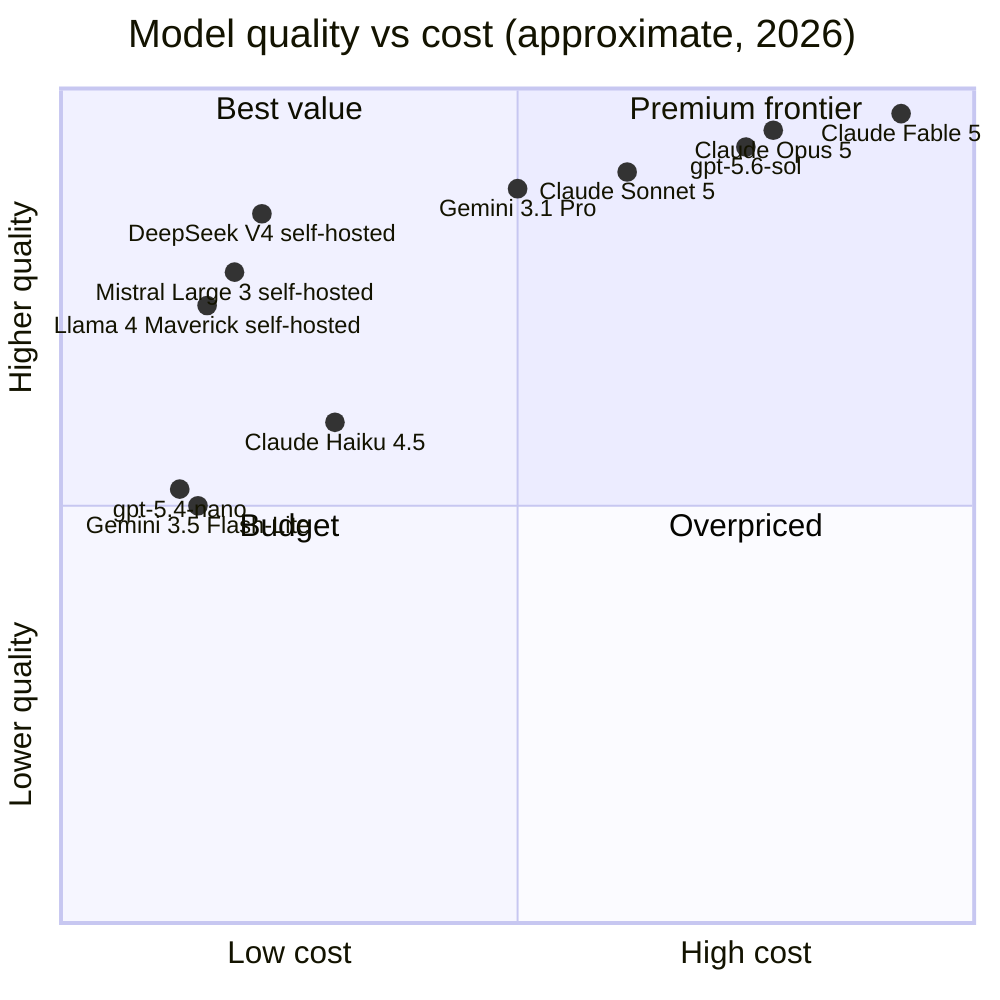
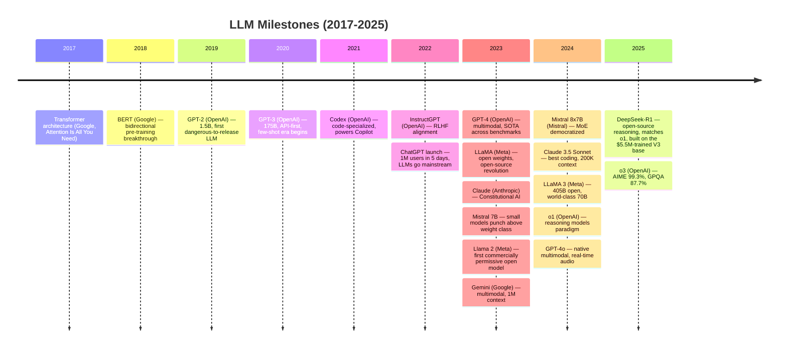
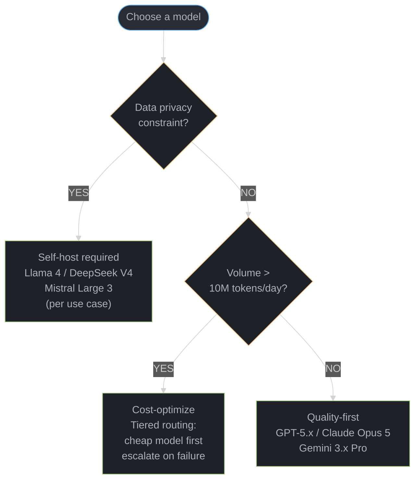
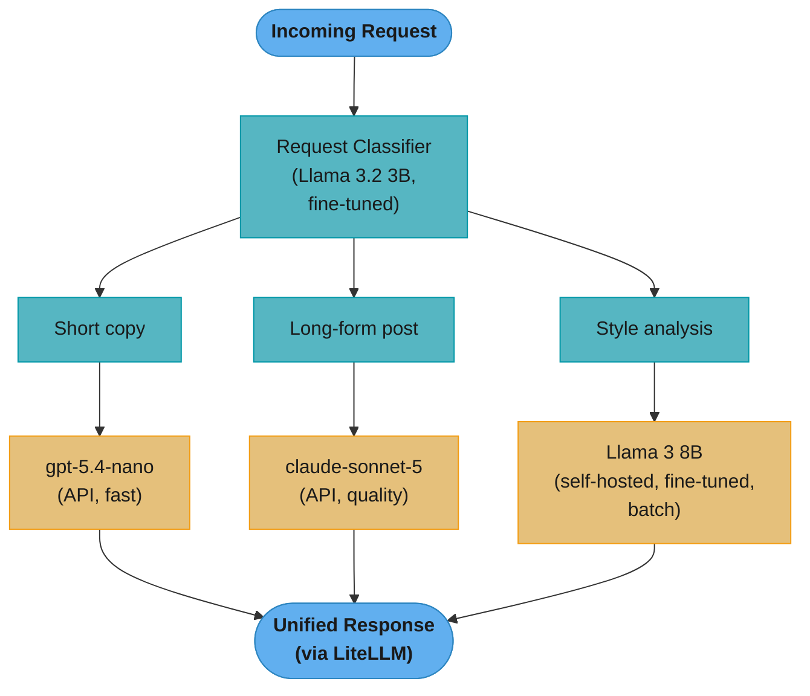

# LLM Ecosystem & Landscape

## 1. Concept Overview

The LLM landscape has evolved from a small number of proprietary models (GPT-3 in 2020) to a vibrant ecosystem with dozens of frontier models, thousands of fine-tuned variants, and a rich tooling layer. Understanding the landscape — who the major players are, how models compare, what the licensing landscape looks like, and how costs break down — is essential for making informed build vs. buy decisions.

The 2023-2025 period was characterized by: the open-source revolution (LLaMA democratizing access), the emergence of specialized models (code, math, embeddings), massive cost reduction at the cheap end (GPT-3 cost $0.02/1K tokens in 2020; by 2024 GPT-4o-mini cost $0.00015/1K — 130x cheaper), and the rise of reasoning models as a new paradigm. Since then the cheap tier has kept falling while frontier per-token prices have moved in both directions.

---

## 2. Intuition

> **One-line analogy**: The LLM landscape is like a smartphone market — a few dominant platforms (GPT, Claude, Gemini), a thriving open-source ecosystem (LLaMA), and rapidly commoditizing capabilities at falling prices.

**Mental model**: In 2020, GPT-3 was unique and cost $0.02/1K tokens. Today you can run far more capable models locally for free (Llama, Qwen, DeepSeek, Mistral), rent frontier capability for roughly $0.001-$0.05 per 1K tokens depending on tier, and the gap between closed and open-weight models has narrowed dramatically. The ecosystem splits into two camps: proprietary models (maximum capability, highest cost, easiest API access) vs. open-source models (maximum control, self-hosting required, rapidly improving). Choosing between them is a build vs. buy decision based on data privacy, cost, capability requirements, and team expertise.

**Why it matters**: Understanding the ecosystem landscape is essential for system design — choosing the wrong model family (too expensive, wrong capabilities, closed license for your use case) is a costly and often non-trivial mistake to undo. Cost structures differ dramatically: API vs. self-hosted, per-token vs. per-seat pricing.

**Key insight**: Model capabilities are converging while costs are diverging — frontier open-weight models (DeepSeek V4, Mistral Large 3, Llama 4) now match closed models on most non-frontier tasks, while the cost of a fixed capability level has fallen by orders of magnitude since 2020. The cost curve for a *given capability* is more predictable than the capability curve, and building model-agnostic systems is the most durable architectural decision.

---

## 3. Core Principles

**Capability convergence**: Open-source models close the gap with proprietary models every 6-12 months. Capabilities that required GPT-4 in 2023 can often be achieved with LLaMA 3 70B in 2025. This means systems designed for a specific capability threshold need not remain locked to the provider that first delivered it.

**Cost commoditization**: LLM inference cost follows a Moore's Law-like trajectory. From $0.02/1K tokens (GPT-3, 2020) to $0.00015/1K tokens (GPT-4o-mini, 2024) represents a 130x reduction in 4 years. The trend is not monotonic per model, though — OpenAI doubled its flagship per-token price at the GPT-5.5 release in April 2026 — so the reliable statement is that a *fixed capability level* gets cheaper, not that each new flagship is cheaper than the last. Budget assumptions built into architecture today will be obsolete within 18 months; design for cost-tier routing rather than fixed model choices.

**Open vs. closed trade-off**: The choice between proprietary API models and open-weight self-hosted models is not a quality decision — it is a control, privacy, and economics decision. Proprietary models offer easier access, higher peak quality, zero maintenance, and per-token pricing. Open-weight models offer data residency, arbitrary fine-tuning, predictable infrastructure cost, and no vendor lock-in. Most production systems eventually use both.

**Model-agnostic architecture**: Systems tightly coupled to a single model provider accumulate hidden costs — prompt re-engineering, re-evaluation, migration delays — every time a provider changes pricing, deprecates an endpoint, or falls behind a competitor. Abstraction layers (LiteLLM, Bedrock, Vertex AI model garden) make model swaps a configuration change rather than a development project.

**Benchmark on your own domain**: Public benchmarks (MMLU, HumanEval, GPQA) measure average capability across a standardized distribution. Your production workload is not that distribution. A model that ranks third on MMLU may rank first on your specific task. The only reliable model selection signal is evaluation on a representative sample of your own data and tasks.

---

## 4. Types / Architectures / Strategies

### 4.1 OpenAI

```
GPT-5.6 family (current flagship line, July 2026):
  gpt-5.6-sol   top tier;   input $5.00/1M, output $30.00/1M
  gpt-5.6-terra mid tier;   input $2.50/1M, output $15.00/1M
  gpt-5.6-luna  efficient;  input $1.00/1M, output  $6.00/1M
  Use: complex reasoning, vision, agentic and general-purpose work

GPT-5.5 (previous flagship, April 2026):
  ~1M context window (1,050,000 tokens), 128K max output
  Cost: input $5.00/1M, output $30.00/1M
  Prompts above 272K input tokens bill at 2x input / 1.5x output
  gpt-5.5-pro: input $30.00/1M, output $180.00/1M

GPT-5.4 family (cost tier):
  gpt-5.4       input $2.50/1M, output $15.00/1M
  gpt-5.4-mini  input $0.75/1M, output  $4.50/1M
  gpt-5.4-nano  input $0.20/1M, output  $1.25/1M
  Use: high-volume, cost-sensitive applications

text-embedding-3 (embeddings):
  small (1536d): $0.02/1M tokens
  large (3072d): $0.13/1M tokens
  Matryoshka: supports dimension reduction

Whisper (speech):
  $0.006/minute; industry-standard ASR
```

### 4.2 Anthropic

```
Claude Fable 5 (highest capability tier):
  Most capable widely released Anthropic model; 1M context, 128K max output
  Cost: input $10/1M, output $50/1M
  Thinking is always on; requires 30-day data retention (no ZDR)

Claude Opus 5 (flagship for agentic coding and enterprise work):
  1M context, 128K max output
  Cost: input $5/1M, output $25/1M
  Strengths: deep reasoning, long-horizon agentic work, coding

Claude Sonnet 5 (balanced):
  Near-Opus quality on coding and agentic work at Sonnet cost; 1M context
  Cost: input $3/1M, output $15/1M

Claude Haiku 4.5 (efficient):
  Fast and affordable; 200K context
  Cost: input $1/1M, output $5/1M

Adaptive thinking (GA):
  Claude decides when and how much to think; depth is controlled by
  output_config.effort (low / medium / high / xhigh / max), not by a
  fixed token budget. The raw chain of thought is never returned —
  thinking blocks carry a summary only when display: "summarized" is set.
```

### 4.3 Google

```
Gemini 3.1 Pro (frontier reasoning):
  1M context window; multimodal (text, image, audio, video)
  Cost: $2/1M input, $12/1M output for prompts up to 200K tokens
        $4/1M input, $18/1M output above 200K tokens
  Strengths: long context, video understanding, multilingual

Gemini 3.6 Flash (price-performance middle, July 2026):
  Cost: $1.50/1M input, $7.50/1M output
  Good balance of quality and cost

Gemini 3.5 Flash-Lite (high volume):
  Cost: $0.30/1M input, $2.50/1M output

Batch API: 50% off both input and output rates across the line

Gemma (open weights):
  Small dense models with strong per-size quality; used in many fine-tunes
  License: Gemma Terms of Use plus a prohibited-use policy — open weights,
  but NOT an OSI-approved open-source license
```

### 4.4 Meta (LLaMA)

```
Llama 4 (current open-weight flagship, April 2025):
  Scout: MoE, 17B active params, ~109B total; fits on a single high-end
    GPU; very long context (10M tokens advertised)
  Maverick: MoE, 17B active params, ~400B total; flagship generalist
  License: Llama 4 Community License — commercial use permitted with
    restrictions (700M MAU threshold, acceptable-use policy). Not OSI
    open source.

Llama 3.1 / 3.2 / 3.3 (previous generation, still widely self-hosted):
  8B / 70B / 405B (3.1); 1B, 3B edge and 11B, 90B vision (3.2)
  128K context; the 70B remains a common self-hosting baseline
```

### 4.5 Mistral AI

```
Mistral Large 3 (flagship, December 2025):
  675B total params, 41B active (sparse MoE)
  Apache 2.0 — open weights, self-hostable, no per-token fees
  ~73% MMLU-Pro; among the strongest permissively licensed models

Mistral 7B:
  Apache 2.0; the community fine-tuning baseline at the 7B size

Mistral Nemo 12B:
  12B; Tekken tokenizer (128K vocab); strong multilingual
  Apache 2.0; the default small Mistral for new work

Mixtral 8x7B:
  46.7B params, 12.9B active (MoE)
  Apache 2.0; widely used in production self-hosting

Mixtral 8x22B:
  141B params, 39B active
  Matches or beats LLaMA 2 70B

Codestral:
  Code-specialized; available via Mistral API
```

### 4.6 DeepSeek

```
DeepSeek-V4 (current flagship, April 2026):
  V4-Pro:   1.6T total params, 49B active (MoE)
  V4-Flash: 284B total params, 13B active
  1M-token context; MIT-licensed open weights on Hugging Face
  API: V4-Pro ~$0.44/1M input, ~$0.87/1M output
       V4-Flash ~$0.14/1M input, ~$0.28/1M output
  Highest open-weights score on SWE-bench Verified at release

DeepSeek-V3:
  671B MoE params, 37B active per token
  Trained for ~$5.5M (shocked industry)
  Strong: coding, math, reasoning
  Open weights; MIT license (commercial use)

DeepSeek-R1:
  Open-source reasoning model; matched o1 at its January 2025 release
  Trained with RL on math/code (GRPO)
  Distilled variants: 1.5B, 7B, 14B, 32B (Qwen 2.5 base) and
    8B, 70B (Llama 3.1/3.3 base) — six checkpoints in total

DeepSeek-Coder:
  Code-specialized; the 33B variant is the sizing most teams
  self-host when they want a dedicated code model
```

### 4.7 Other Key Players

```
Cohere:
  Command A / Command R+: enterprise-focused; RAG optimized
  Embed: best-in-class enterprise embedding models
  Rerank: managed reranking API
  Published weights are research-only (non-commercial); commercial use
  requires a Cohere agreement

AI21 Labs:
  Jamba: hybrid Mamba + Transformer; efficient long context
  Jurassic series

xAI (Elon Musk):
  Grok: integrated with X (Twitter); real-time data access

Qwen (Alibaba):
  Qwen 3.6 (April 2026): 35B-A3B MoE and 27B dense, both Apache 2.0;
    262K context; accepts text, image and video input
  Qwen 3.7 Max (May 2026): proprietary, API-only — no open weights
  Qwen-VL: vision-language
  Qwen-Coder: strong code model

Phi (Microsoft):
  Phi-4 (14B) plus the Phi-4 mini and multimodal variants; MIT license
  "Textbooks are all you need" — trained on high-quality synthetic data
  Remarkable capability for size; on-device AI focus
```

### 4.8 Licensing Landscape

| License Type | Example Models | Commercial Use |
|---|---|---|
| Apache 2.0 (fully open) | Mistral Large 3, Mistral 7B, Mixtral 8x7B, Qwen 3.6 | Yes, unrestricted |
| MIT | DeepSeek-V3/V4, DeepSeek-R1, Phi-4 | Yes, unrestricted |
| Llama Community | Llama 3.x, Llama 4 | Yes, if <700M MAU; cannot use to train competing LLMs |
| Gemma Terms of Use | Gemma family | Yes, subject to Google's prohibited-use policy; not OSI open source |
| CC-BY-NC / research-only | Cohere published weights, some research models | Non-commercial only |
| Proprietary API only | GPT-5.x, Claude, Gemini | API access; no weights |
| Research only | Various academic models | No commercial use |

**Key distinction**: "Open weights" != "Open source". Llama weights are public but the license restricts competition training and caps very-high-traffic commercial use; Gemma weights are public under Google's own terms. True open source means Apache 2.0 or MIT — and unlike the 2024 picture, several frontier-class models now qualify (Mistral Large 3 under Apache 2.0, DeepSeek V4 under MIT).

---

## 5. Architecture Diagrams

### Model Quality vs. Cost Landscape


```mermaid
quadrantChart
    title Model quality vs cost (approximate, 2026)
    x-axis Low cost --> High cost
    y-axis Lower quality --> Higher quality
    quadrant-1 Premium frontier
    quadrant-2 Best value
    quadrant-3 Budget
    quadrant-4 Overpriced
    "Claude Fable 5": [0.92, 0.97]
    "Claude Opus 5": [0.78, 0.95]
    "gpt-5.6-sol": [0.75, 0.93]
    "Claude Sonnet 5": [0.62, 0.90]
    "Gemini 3.1 Pro": [0.50, 0.88]
    "DeepSeek V4 self-hosted": [0.22, 0.85]
    "Mistral Large 3 self-hosted": [0.19, 0.78]
    "Llama 4 Maverick self-hosted": [0.16, 0.74]
    "Claude Haiku 4.5": [0.30, 0.60]
    "gpt-5.4-nano": [0.13, 0.52]
    "Gemini 3.5 Flash-Lite": [0.15, 0.50]
```

The upper-left quadrant (high quality, low cost) is where self-hosted open-weight models sit — DeepSeek V4, Mistral Large 3 and Llama 4 buy most of the quality axis for infrastructure cost alone; frontier API models buy the top of that axis at 10-70x the cost per 1M tokens, and that multiple has not closed. quadrantChart normalizes positions to 0-1, so calibrate the cost axis with these anchors (input price per 1M tokens, matching the Section 6 table): far left = free/self-hosted (infra cost only), ~0.15 = $0.20-$0.30 (gpt-5.4-nano, Gemini Flash-Lite), ~0.30 = $1 (Claude Haiku 4.5), ~0.6 = $3 (Sonnet 5), ~0.78 = $5 (Opus 5, gpt-5.6-sol), far right = $10 (Fable 5).

### LLM Timeline (Key Milestones)


```mermaid
timeline
    title LLM Milestones (2017-2025)
    2017 : Transformer architecture (Google, Attention Is All You Need)
    2018 : BERT (Google) — bidirectional pre-training breakthrough
    2019 : GPT-2 (OpenAI) — 1.5B, first dangerous-to-release LLM
    2020 : GPT-3 (OpenAI) — 175B, API-first, few-shot era begins
    2021 : Codex (OpenAI) — code-specialized, powers Copilot
    2022 : InstructGPT (OpenAI) — RLHF alignment
         : ChatGPT launch — 1M users in 5 days, LLMs go mainstream
    2023 : GPT-4 (OpenAI) — multimodal, SOTA across benchmarks
         : LLaMA (Meta) — open weights, open-source revolution
         : Claude (Anthropic) — Constitutional AI
         : Mistral 7B — small models punch above weight class
         : Llama 2 (Meta) — first commercially permissive open model
         : Gemini (Google) — multimodal, 1M context
    2024 : Mixtral 8x7B (Mistral) — MoE democratized
         : Claude 3.5 Sonnet — best coding, 200K context
         : LLaMA 3 (Meta) — 405B open, world-class 70B
         : o1 (OpenAI) — reasoning models paradigm
         : GPT-4o — native multimodal, real-time audio
    2025 : DeepSeek-R1 — open-source reasoning, matches o1, built on the $5.5M-trained V3 base
         : o3 (OpenAI) — AIME 99.3%, GPQA 87.7%
```

### Model Selection Decision Tree


```mermaid
%%{init: {'flowchart': {'curve': 'basis'}, 'theme': 'dark'}}%%
flowchart TD
    Start([Choose a model]) --> Privacy{"Data privacy\nconstraint?"}
    Privacy -- YES --> SelfHost["Self-host required\nLlama 4 / DeepSeek V4\nMistral Large 3\n(per use case)"]
    Privacy -- NO --> Volume{"Volume >\n10M tokens/day?"}
    Volume -- YES --> CostOpt["Cost-optimize\nTiered routing:\ncheap model first\nescalate on failure"]
    Volume -- NO --> Quality["Quality-first\nGPT-5.x / Claude Opus 5\nGemini 3.x Pro"]

    classDef io     fill:#282c34,stroke:#61afef,color:#abb2bf
    classDef proc   fill:#1e2127,stroke:#98c379,color:#abb2bf
    classDef llm    fill:#1e2127,stroke:#c678dd,color:#abb2bf
    classDef decide fill:#1e2127,stroke:#e5c07b,color:#abb2bf

    class Start io
    class Privacy,Volume decide
    class SelfHost,CostOpt,Quality proc
```

---

## 6. How It Works — Detailed Mechanics

### Cost Analysis: API vs. Self-Hosted

| Provider | Model | Input $/1M | Output $/1M | Context |
|----------|-------|-----------|------------|---------|
| DeepSeek | deepseek-v4-flash | $0.14 | $0.28 | 1M |
| OpenAI | gpt-5.4-nano | $0.20 | $1.25 | — |
| Google | gemini-3.5-flash-lite | $0.30 | $2.50 | — |
| DeepSeek | deepseek-v4-pro | $0.44 | $0.87 | 1M |
| OpenAI | gpt-5.4-mini | $0.75 | $4.50 | — |
| Anthropic | claude-haiku-4-5 | $1 | $5 | 200K |
| OpenAI | gpt-5.6-luna | $1 | $6 | — |
| Google | gemini-3.6-flash | $1.50 | $7.50 | — |
| Google | gemini-3.1-pro (<=200K) | $2 | $12 | 1M |
| OpenAI | gpt-5.6-terra / gpt-5.4 | $2.50 | $15 | — |
| Anthropic | claude-sonnet-5 | $3 | $15 | 1M |
| Anthropic | claude-opus-5 | $5 | $25 | 1M |
| OpenAI | gpt-5.5 / gpt-5.6-sol | $5 | $30 | 1M |
| Anthropic | claude-fable-5 | $10 | $50 | 1M |
| Serverless open-weight | Llama 3.1 70B | ~$0.88 | ~$0.88 | 128K |
| Self-hosted 2x H100 | Llama 3.1 70B | ~$0.20 | ~$0.80 | 128K |

A dash in the Context column means the provider does not publish a single headline
number for that tier; check the provider's model page before sizing a prompt against it.
Serverless open-weight rates move constantly and vary by provider — Llama 3.1/3.3 70B
is listed between roughly $0.79 and $1.04 per 1M tokens across Groq, Fireworks and
Together AI, so treat the ~$0.88 row as a mid-range anchor rather than a quote.

**Stated plainly.** "A price table with two columns is not a price. What you pay is
`input tokens x input rate + output tokens x output rate`, and the ratio between your input and
output volumes decides which model is actually cheapest for you."

Reading down the Input column and picking the smallest number is the most common way to choose wrong.
Output is priced 3-4x higher than input almost everywhere, so a summarization workload (huge input,
tiny output) and a generation workload (tiny input, huge output) rank the models differently even
though the table is identical.

| Symbol | What it is |
|--------|------------|
| Input $/1M | Price per million tokens you send: prompt, context, history |
| Output $/1M | Price per million tokens generated. Consistently the more expensive side |
| workload shape | Your input:output ratio. RAG is input-heavy; agents and drafting are output-heavy |
| effective cost | `input_M x input_rate + output_M x output_rate` for *your* shape |

**Walk one example.** A RAG-shaped workload — 1M input tokens and 200K output tokens:

```
  cost = 1.0 x input_rate + 0.2 x output_rate

    deepseek-v4-flash  1.0 x  $0.14 + 0.2 x  $0.28 =  $0.196
    gpt-5.4-nano       1.0 x  $0.20 + 0.2 x  $1.25 =  $0.450
    claude-haiku-4-5   1.0 x  $1.00 + 0.2 x  $5.00 =  $2.000
    claude-sonnet-5    1.0 x  $3.00 + 0.2 x $15.00 =  $6.000
    gpt-5.6-sol        1.0 x  $5.00 + 0.2 x $30.00 = $11.000
    claude-fable-5     1.0 x $10.00 + 0.2 x $50.00 = $20.000

  SPREAD ACROSS THE TABLE
    claude-fable-5 / deepseek-v4-flash = $20.00 / $0.196 = 102x

  SAME SPREAD, SCALED TO A REAL MONTH (1B input + 200M output tokens)
    deepseek-v4-flash    $196/month
    gpt-5.6-sol       $11,000/month
    claude-fable-5    $20,000/month
```

A ~100x spread across a single table is the practical meaning of "cost commoditization" — the same
task can cost $196 or $20,000 a month depending only on model choice. That is why this module
insists on **cost-tier routing rather than fixed model choices**: routing even 80% of traffic from
gpt-5.6-sol down to gpt-5.4-nano on the queries that do not need frontier reasoning takes the bill from
$11,000 to roughly `0.2 x $11,000 + 0.8 x $450 = $2,560` — a 77% cut with no change to the hard
queries. Note also the context column: deepseek-v4-flash offers a 1M window at the *lowest* price in
the table, so "cheap" and "small context" have fully decoupled — an assumption from 2023 that no
longer holds.

### Self-Hosting Break-Even Calculation

```
GPU cost (H100 SXM, on-demand): ~$3/hour = $2,160/month
Reserved (1-year committed): ~$2.35/hour = $1,692/month

LLaMA 3.1 70B throughput on 2x H100:
  ~2,000 tokens/second (output) at batch size 32
  = 2,000 * 3600 * 24 * 30 = ~5.2 billion tokens/month

API equivalent (serverless open-weight at ~$0.88/1M output):
  5.2B tokens * $0.88/1M = $4,576/month

Break-even:
  Self-hosted cost (2x H100, reserved): $3,384/month + engineering overhead
  API cost at equivalent volume: $4,576/month
  Savings: ~$1,200/month minus engineering overhead

Rule of thumb:
  <$2,000/month API spend -> API is cheaper (no infra overhead)
  $2,000-$10,000/month -> evaluate break-even carefully
  >$10,000/month API spend -> self-hosting almost always wins
```

**What the formula is telling you.** "Self-hosting is a fixed monthly rent; API is a per-token
meter. Break-even is simply the token volume at which the meter finally exceeds the rent — and you
pay the rent whether you send a token or not."

That asymmetry is the whole decision. API cost scales with usage and goes to zero when idle; GPU
cost is the same at 3 a.m. on a Sunday as at peak. So the break-even is not really about price per
token, it is about **utilization**.

| Symbol | What it is |
|--------|------------|
| GPU hourly rate | ~$3/hr on-demand, ~$2.35/hr on a 1-year commit, **per H100**. A 70B model needs 2 |
| hours per month | `24 x 30 = 720`. Rented continuously, used or not |
| throughput | ~2,000 output tokens/second at batch size 32 on 2x H100 |
| monthly capacity | `throughput x 720 x 3600` — the ceiling if you ran flat out, nonstop |
| API rate | ~$0.88 per 1M output tokens (serverless Llama 3.1 70B; providers list ~$0.79-$1.04) |
| utilization | Actual tokens served / monthly capacity. The variable nobody estimates honestly |

**Walk one example.** Build both sides, being careful that the model needs two GPUs:

```
  CAPACITY (the API-equivalent bill at 100% utilization)
    2,000 tok/s x 3,600 x 24 x 30 = 5,184,000,000 = ~5.2B tokens/month
    5.2B x $0.88 / 1M            = $4,576/month

  SELF-HOSTED RENT -- note the model needs 2x H100, so double the per-GPU rate
    on-demand  2 x $3.00 x 720 = $4,320/month
    reserved   2 x $2.35 x 720 = $3,384/month   <- the $3,384 quoted above

  SAVINGS AT 100% UTILIZATION
    vs reserved   $4,576 - $3,384 = $1,192/month   -> the "~$1,200" quoted
    vs on-demand  $4,576 - $4,320 =   $256/month   -> essentially nothing

  NOW VARY UTILIZATION (against the $3,384 reserved rent)
    100%  5.20B tokens  API $4,576   -> self-hosting wins by $1,192
     50%  2.60B tokens  API $2,288   -> API wins by $1,096
     20%  1.04B tokens  API   $915   -> API wins by $2,469
     10%  0.52B tokens  API   $458   -> API wins by $2,926

  BREAK-EVEN UTILIZATION
    $3,384 / $4,576 = 74%
```

Two things fall out of this that the rule-of-thumb table cannot express. First, **the reserved rate
is doing the work, not self-hosting itself** — on on-demand pricing the entire annual saving is about
$3,000, which one engineer-week of maintenance erases. And the reserved rate is not a fixed
constant: 1-year H100 contract pricing rose roughly 40% between late 2025 and early 2026 as
committed capacity tightened, so a break-even computed on last year's rate card can invert.
Second, you need roughly **74% sustained utilization** to break even at today's committed rates,
and sustained means averaged across nights, weekends, and troughs. A workload that peaks at
2,000 tok/s during business hours and idles overnight is nowhere near 74%; real-world duty cycles
of 15-25% are common, which puts most teams firmly on the API side even at volumes the
$10,000/month rule of thumb would send to self-hosting.

**Why the rule of thumb still works despite ignoring utilization.** It is stated in *dollars of API
spend*, not tokens — and API spend is already utilization-adjusted, because you only pay for tokens
you actually sent. A team spending $10,000/month on API is by definition pushing well past the
break-even volume. The trap is applying the rule to *projected* or *peak-capacity* spend rather than
billed spend, which is exactly the error that produces an idle GPU cluster and a postmortem.

### Key Industry Dynamics

**The Open-Source vs. Closed Battle**

```
2023: Meta releases LLaMA — open weights, near-GPT-3 quality
      Community fine-tunes: Vicuna, Alpaca, WizardLM
      Proved open-source could be nearly as good for most tasks

2024: LLaMA 3 70B matches GPT-3.5 / Claude 2 quality
      DeepSeek V3 — near GPT-4 quality, trained for $5.5M
      "The intelligence wall" fell for lower-quality tasks

2025-2026 reality:
  Open models are within 10-20% of closed models for most tasks
  For the hardest reasoning and long-horizon agentic work, closed
    frontier models (GPT-5.x, Claude Opus/Fable 5) still lead
  Frontier-class weights now ship under genuinely permissive licenses:
    Mistral Large 3 (Apache 2.0), DeepSeek V4 (MIT)
  Self-hosting open models is now standard for privacy-sensitive orgs

The cost dynamic:
  The long-run trend is the same quality at far lower cost each year,
    but it is not monotonic per model: OpenAI doubled the per-token
    price of its flagship line at the GPT-5.5 release (April 2026)
  Plan for the trend, but re-price on every launch rather than
    assuming each generation is cheaper than the last
```

**Specialization vs. Generalization**

```
Specialized wins when:
  Domain-specific fine-tuning on quality data
  Example: Med-PaLM (medical) beats GPT-4 on medical benchmarks
  Example: DeepSeek-Coder beats larger general models on code

General wins when:
  Task requires broad knowledge + reasoning
  Maintenance burden of specialized models is high
  New task types emerge that weren't trained for

Current direction: General reasoning models + RAG for domain knowledge
  Rather than domain-specific pre-training, use:
  a reasoning-capable general model + RAG over domain knowledge
```

### Model Selection Framework

```
Decision: Which model for my use case?

Start with:
  Cost budget (input rate):
    <$1/1M tokens: deepseek-v4-flash, gpt-5.4-nano, gemini-flash-lite, local 8B
    $1-5/1M tokens: claude-haiku-4-5, gemini-3.x flash/pro, claude-sonnet-5
    >$5/1M tokens: claude-opus-5, gpt-5.6-sol, claude-fable-5

  Quality requirements:
    Basic task: local 8B or gpt-5.4-nano
    High quality: claude-sonnet-5, gpt-5.6-terra
    Expert reasoning: claude-opus-5, claude-fable-5, gpt-5.6-sol, DeepSeek-V4

  Privacy:
    Can use cloud API: any vendor
    Data must stay on-premise: self-hosted Llama / Mistral / DeepSeek

  Context length:
    <128K: any model
    128K-200K: Llama 3.x, Claude Haiku 4.5
    1M: Claude Opus/Sonnet 5, GPT-5.5, Gemini 3.x Pro, DeepSeek V4
    10M (advertised): Llama 4 Scout

  Modality:
    Text only: any model
    Images: GPT-5.x, Claude, Gemini, Qwen 3.6
    Video: Gemini 3.x Pro, Qwen 3.6
    Audio: OpenAI realtime models, Whisper

  Use case:
    Coding: Claude Opus 5, GPT-5.6, DeepSeek-V4
    Reasoning/Math: Claude Fable 5, GPT-5.6-sol, DeepSeek-V4
    RAG/Documents: Claude Sonnet 5, Gemini 3.x Pro
    Multilingual: Gemini, Qwen 3.6, Mistral Large 3
    Edge/On-device: Phi-4 mini, Llama 3.2 1B, Gemma
```

### Chinchilla Scaling Laws vs. Over-Training

```
Chinchilla law (Hoffmann et al., 2022):
  Optimal training: 20 tokens per parameter
  70B model -> train on ~1.4T tokens

LLaMA approach (over-training):
  LLaMA 3 70B trained on 15T tokens (10x Chinchilla optimal)
  Rationale: inference is cheap; training is one-time
  Result: smaller model achieves same quality as larger Chinchilla-optimal model
  Trade-off: higher training cost, lower inference cost forever

Practical implication:
  For deployment at scale, over-trained smaller models beat
  Chinchilla-optimal larger models on cost per inference token
  LLaMA 3 8B (over-trained on 15T tokens) beats LLaMA 2 34B
```

---

## 7. Real-World Examples

### Morgan Stanley AI Assistant

Morgan Stanley deployed an internal GPT-4-powered assistant to 16,000 financial advisors. The system uses RAG over 100,000+ internal research documents and compliance materials. Key decisions: GPT-4 chosen for comprehension quality on complex financial language; strict access controls per advisor's client tier; all documents stay on Azure (no data leaves the org); responses include mandatory citations so advisors can verify. Output: advisors can answer client questions in 30 seconds instead of 30 minutes for routine research queries.

### Bloomberg GPT

Bloomberg trained BloombergGPT, a 50B parameter model, on a curated financial corpus of 363B tokens plus 345B tokens of general text. Bloomberg's own corpus included financial news, filings, and earnings reports accumulated over decades. BloombergGPT outperforms general models of similar size on financial NLP benchmarks (sentiment analysis, named entity recognition in financial text, headline classification) while remaining competitive on general benchmarks. Lesson: a purpose-built model with domain-specific training data delivers measurable gains on narrow tasks, but the training cost ($2M+) requires strong business justification.

### DeepSeek V3's $5.5M Training Cost Disruption

DeepSeek V3 (671B MoE, 37B active) was trained for approximately $5.5M in H800 GPU compute, compared to estimated $100M+ for comparable US frontier models. Techniques enabling this: (1) FP8 mixed-precision training; (2) multi-token prediction auxiliary loss; (3) MoE architecture keeping active params low; (4) custom DualPipe pipeline parallelism reducing bubble time; (5) efficient all-to-all communication. Result: near-GPT-4 quality at 18x lower training cost. Impact on industry: demonstrated that algorithmic efficiency matters as much as raw compute budget, undermined assumptions about chip export restrictions as a limiting factor, accelerated commoditization timeline.

### Mistral's Rapid Rise

Mistral AI was founded in April 2023 by ex-Google DeepMind and Meta researchers. Mistral 7B released in September 2023 outperformed LLaMA 2 13B on most benchmarks — a 7B model beating a 13B model raised immediate attention. The model was released under Apache 2.0 with no restrictions, rapidly becoming the default base for community fine-tuning (replacing LLaMA 2 due to more permissive licensing). Within 12 months Mistral had: raised $385M at $6B valuation, launched Mixtral 8x7B (the most downloaded open-weight MoE), and established a commercial API. Lesson: releasing genuinely competitive open-weight models with permissive licensing creates disproportionate community adoption and brand value.

---

## 8. Tradeoffs

| Factor | API Models (GPT-5.x, Claude) | Self-Hosted Open Models |
|--------|----------------------------|------------------------|
| Quality ceiling | Best available (GPT-5.6, Claude Opus/Fable 5) | Very good (Llama 4, DeepSeek V4, Mistral Large 3) |
| Data privacy | Data leaves premises | Full on-premise control |
| Cost at low volume | Cheap (pay per token) | Expensive (idle GPU cost) |
| Cost at high volume | High and linear | Lower (amortized fixed infra) |
| Latency | Variable (shared infra) | Predictable (dedicated) |
| Maintenance burden | Zero | High (GPU ops, updates, serving) |
| Customization | Limited (vendor fine-tuning API) | Arbitrary fine-tuning |
| Compliance | Vendor BAA / DPA required | Full control |
| Model swap speed | Fast (change API key) | Slow (re-deploy infra) |
| Reasoning capability | GPT-5.x reasoning, Claude adaptive thinking | DeepSeek-R1/V4, Qwen available |

| Concern | Apache 2.0 / MIT | Llama Community License | Proprietary API |
|---------|-----------------|------------------------|----------------|
| Train competing LLM | Allowed | Prohibited | N/A |
| Commercial product | Allowed | Allowed (<700M MAU) | Per terms of service |
| Modify and redistribute | Allowed | Allowed with attribution | Not allowed |
| On-premise deployment | Allowed | Allowed | Not allowed (weights not provided) |

---

## 9. When to Use / When NOT to Use

### Use API Models When:
- Speed to market is critical and infrastructure is not a core competency
- Volume is below approximately 1M tokens/day (API cheaper than idle GPU cost)
- Cutting-edge quality is required that open models have not yet matched (frontier-tier reasoning and long-horizon agentic work, best-in-class vision)
- Team lacks ML infrastructure expertise to maintain serving infrastructure
- Task is non-sensitive and vendor compliance certifications (SOC 2, HIPAA BAA) are sufficient

### Self-Host Open Models When:
- Daily token volume exceeds 10M (cost savings justify infra investment)
- Data must not leave the organization (HIPAA, GDPR, financial regulations, government)
- Custom fine-tuning with full weight access is required
- Regulatory requirements prohibit third-party data processors
- Long-term predictability of cost and availability outweighs convenience

### Use Specialized Models When:
- A domain-specific fine-tune on quality in-domain data has been validated on your task
- The domain vocabulary and patterns are significantly different from general text (medical, legal, financial)
- You have the data and engineering to maintain the specialization over time

### Avoid Overcomplicating Model Choice When:
- Your task is well within gpt-5.4-nano or claude-haiku-4-5 capability — the cheapest adequate model is correct
- You have not yet evaluated on your own data — do not assume public benchmarks predict your performance
- You are under 3 months to launch — start with the easiest API integration, optimize later

---

## 10. Common Pitfalls

**Vendor lock-in to a single provider**: Teams that build tightly against one provider's API surface (OpenAI-specific features: Assistants API, specific function-calling schema, file search) find migration expensive when pricing changes or a competitor releases a better model. Production incident pattern: the provider retires the exact snapshot you pinned with three months' notice; all prompt engineering and evals were tuned to that checkpoint; the replacement model behaves differently; 6 weeks of re-evaluation required. Fix: abstract all model calls behind a unified interface from day one; test with at least two providers in CI.

**Overestimating benchmark scores for your domain**: A team selects Model A over Model B because MMLU shows Model A is 4 points higher. In production on their legal document classification task, Model B outperforms Model A by 12 points. Benchmark distributions do not match production distributions. Fix: build a domain evaluation set of at least 100-200 representative examples before committing to a model, and re-run evals on every significant model release.

**Ignoring total cost (infra + engineering + maintenance)**: The self-hosted GPU compute cost is visible; the hidden costs are not. A team saves $5,000/month on API costs by self-hosting LLaMA 70B, but requires one-quarter of an SRE to maintain GPU node health, version updates, and serving restarts. At $150K/year engineer cost, one quarter of SRE time is $37,500/year — the break-even requires $3,125/month in API savings just to cover that labor. Full cost accounting: GPU cost + reserved instance commitment + monitoring tooling + on-call burden + update cycles + model evaluation on new versions.

**Choosing open source without MLOps expertise**: Open-weight models require GPU provisioning, serving framework selection (vLLM, TGI, llama.cpp), load balancer configuration, auto-scaling policies, model version management, quantization decisions, and serving latency optimization. Teams that underestimate this complexity deploy a model that works in a notebook but fails under production load (KV cache exhaustion, GPU OOM at batch size 32, cold start latency). Fix: use a managed inference service (Together AI, Replicate, Bedrock) as an intermediate step to validate quality before committing to full self-hosting.

**Not planning for model deprecation**: every provider retires model generations on a rolling schedule — OpenAI's stated policy is a minimum of six months' notice before a generally available model is retired, and Anthropic publishes a retirement date per model ID. Teams that hard-code model IDs and do not maintain evaluation harnesses discover deprecation when production calls start returning 404. Fix: (1) pin model IDs explicitly and track deprecation dates; (2) maintain a continuous eval pipeline that runs on the replacement model in shadow mode 60+ days before deprecation; (3) design prompts to be model-version-agnostic where possible.

---

## 11. Technologies & Tools

| Tool | Category | Purpose | Key Feature |
|------|----------|---------|-------------|
| LiteLLM | Abstraction | Unified API across 100+ providers | Drop-in OpenAI SDK replacement; cost tracking; fallback routing |
| OpenRouter | API aggregator | Single endpoint for 200+ models | Best-of price routing; model comparison; usage analytics |
| Ollama | Local inference | Run open-weight models locally | One-command model pull; OpenAI-compatible API; Mac Metal support |
| HuggingFace Hub | Model registry | Download, share, and version models | Largest open-weight model registry; Inference API; Spaces |
| Together AI | Managed inference | Run open-weight models via API | Llama, Mistral, DeepSeek, Qwen; fast inference; serverless |
| Replicate | Managed inference | Run open-weight models via API | Per-second billing; easy deployment of custom models |
| Amazon Bedrock | Cloud-native LLM | AWS-managed access to multiple providers | Claude, LLaMA, Titan via IAM; no data leaves AWS VPC |
| Google Vertex AI | Cloud-native LLM | GCP-managed access to Gemini and partners | Gemini, Claude, Llama on GCP; MLOps integration |
| vLLM | Self-hosted serving | High-throughput LLM inference | PagedAttention; continuous batching; OpenAI-compatible |
| TGI (HuggingFace) | Self-hosted serving | Production text generation | Tensor parallelism; streaming; quantization support |

---

## 12. Interview Questions with Answers

**Q: How would you choose between OpenAI, Anthropic, and self-hosted models for a production application?**
Decision factors are: (1) Volume — above 10M tokens/day, self-hosting becomes cost-competitive; (2) Privacy — regulated industries (HIPAA, GDPR) require self-hosting or verified vendor BAA; (3) Quality requirements — if frontier API quality cannot be matched by open models for your specific task, use API; (4) Latency — self-hosted is more predictable; (5) Development speed — API ships faster. Start with API, evaluate quality and cost, migrate specific workloads to self-hosted as volume grows. Use LiteLLM from the start so the migration is a config change.

**Q: When should you reach for a reasoning model instead of a standard chat model?**
Use a reasoning model only when the task requires multi-step deduction that standard models get wrong — competition math, hard coding, scientific problem solving, complex planning. Reasoning models spend hidden "thinking" tokens before answering, which is why a frontier reasoning tier such as claude-fable-5 ($10/$50 per 1M input/output tokens) costs 40-50x gpt-5.4-nano and can take 10-60 seconds per response. For the majority of production traffic — classification, extraction, summarization, routine chat — they are pure waste: slower, more expensive, and no more accurate. The right pattern is routing: send hard/low-confidence queries to a reasoning model and everything else to a cheaper model, and note that open reasoning models (DeepSeek-R1 and its six distilled checkpoints at 1.5B, 7B, 8B, 14B, 32B and 70B) now let you self-host this capability instead of paying frontier rates.

**Q: How does benchmark contamination distort public leaderboards, and what do you do about it?**
Contamination happens when benchmark questions (or close paraphrases) leak into a model's training data, so a high MMLU or HumanEval score partly reflects memorization rather than capability. Symptoms: a model tops a public benchmark but underperforms on your held-out task, or scores drop sharply on a freshly released variant of the same benchmark (e.g., GSM8K vs the newer GSM1K). Because model builders scrape the web where these datasets live, contamination is pervasive and grows over time. The defenses are the same as the general rule: never trust a leaderboard number as a selection signal, build a private evaluation set from your own recent production data that could not have been in any pretraining corpus, and prefer benchmarks with rotating or held-out test sets. Treat public scores as a coarse filter, your domain eval as the decision.

**Q: What is the significance of DeepSeek-V3 being trained for $5.5M?**
DeepSeek-V3 achieving near-GPT-4 quality for $5.5M training cost (vs. an estimated $100M+ for comparable models) demonstrated that the cost of frontier AI is dropping dramatically through algorithmic improvements alone. Implications: more players can train competitive models; US chip export restrictions are less effective than assumed since DeepSeek used older H800 chips efficiently; techniques such as FP8 training, MoE architecture, and multi-token prediction matter as much as raw compute budget; frontier AI may commoditize faster than assumed. The practical takeaway for system design is that assuming a cost moat around any specific model quality tier is strategically dangerous.

**Q: What is the difference between "open source" and "open weights" LLMs?**
Open weights means the model weights are publicly downloadable, but the license may restrict how they are used. True open source (Apache 2.0, MIT) allows any use including training competing models. The Llama Community License (Llama 3.x and Llama 4 alike) prohibits using the weights to train models that compete with Meta's LLM products and restricts very high-traffic commercial use (above 700M MAU); Google's Gemma is likewise open-weight under Google's own terms rather than an OSI license. For building applications, Llama's license is generally permissive. For training new base models, Mistral Large 3 or Mistral 7B (Apache 2.0) and DeepSeek V3/V4/R1 (MIT) are truly open. The distinction matters most for organizations wanting to train derivative base models or redistribute fine-tuned weights commercially.

**Q: How would you design a model routing system that routes queries to different models based on complexity?**
A model router classifies incoming queries by complexity and routes accordingly. Simple approach: use a cheap classifier model (fine-tuned small model or embedding similarity) to score query complexity on a 1-5 scale; route 1-2 to gpt-5.4-nano or a local 8B, 3-4 to claude-haiku-4-5 or a self-hosted 70B, 5 to claude-sonnet-5 or gpt-5.6-sol. Production refinement: route by task type (extraction vs. reasoning vs. generation), use confidence thresholds with fallback (if cheap model response confidence below threshold, re-route to expensive model), track per-route accuracy and cost. LiteLLM supports routing with fallback out of the box. Monitor routing decisions continuously — a mislabeled 20% of queries can eliminate all cost savings.

**Q: What is the self-hosting break-even calculation for LLMs?**
Break-even compares API cost at your volume to self-hosted infrastructure cost including hidden costs. Calculate: (1) API cost = monthly token volume * price per token; (2) GPU cost = number of GPUs * hourly rate * 720 hours; (3) Engineering overhead = SRE fraction * annual salary / 12; (4) Break-even: API cost >= GPU cost + engineering overhead. For Llama 3.1 70B on 2x H100 reserved instances at ~$2.35/hour each: $3,384/month GPU + $3,000/month engineering overhead = $6,384/month total. At serverless open-weight rates (~$0.88/1M output tokens), you need roughly 7.3B output tokens per month to break even. The engineering overhead term is frequently omitted and frequently determines the decision.

**Q: How do you evaluate whether a new model release (e.g., GPT-5) warrants migration?**
Run your internal evaluation harness on the new model before committing to migration. The evaluation set should contain representative examples of your production distribution, labeled with the correct output or rated by human evaluators. Steps: (1) run new model in shadow mode alongside current model for 1-2 weeks; (2) compare on domain eval set — if improvement is below 5% relative, the migration risk may not be worth it; (3) check pricing — new models are often priced differently; (4) audit prompt compatibility — new model may respond differently to existing system prompts; (5) check API stability — new models may lack features (function calling format, streaming behavior). Migration is only warranted when domain eval improvement, latency, or cost delta is significant enough to justify prompt re-engineering and re-validation.

**Q: What is the Chinchilla scaling law and how does the LLaMA over-training approach challenge it?**
The Chinchilla scaling law (Hoffmann et al., 2022) states that compute-optimal training allocates tokens and model size equally: a 70B model should train on approximately 1.4 trillion tokens (20 tokens per parameter). Training more tokens or using a larger model for the same compute budget is suboptimal under this law. LLaMA challenged this by training LLaMA 3 70B on 15 trillion tokens — about 10x the Chinchilla-optimal allocation. The rationale is that inference cost dominates over the lifetime of a deployed model, while training cost is one-time. A smaller, heavily over-trained model achieves the same benchmark quality as a larger Chinchilla-optimal model but at a fraction of the per-inference cost. For system design, this means the right model size depends on your inference volume, not just your training compute budget.

**Q: How would you design an LLM abstraction layer for a multi-model production system?**
The abstraction layer should expose a single interface that is independent of any provider's SDK. Core components: (1) a model registry mapping logical model names to provider + model ID + default parameters; (2) a request normalizer that converts internal request schema to each provider's format; (3) a response normalizer that maps provider responses to a unified schema; (4) a cost tracker that logs tokens and model per request; (5) a fallback chain so if the primary model is unavailable, secondary model handles the request; (6) a circuit breaker per provider to avoid thundering-herd on provider outages. LiteLLM implements most of this. The key design principle is that no application code references a provider name or model ID directly — only the registry does.

**Q: What are the risks of building on a single LLM provider?**
Risks fall into four categories: (1) Pricing risk — providers have changed pricing 3-5x in either direction; a 2x price increase on your primary model can materially affect unit economics; (2) Availability risk — individual models are deprecated with 3-6 months notice; provider outages affect your SLA; (3) Capability risk — the model you selected may fall behind a competitor; rebuilding on a different provider is expensive if you are tightly coupled; (4) Policy risk — providers update usage policies; use cases that were permitted (certain categories of content generation) may be restricted. The mitigation is the abstraction layer pattern above, combined with quarterly model evaluation audits comparing your primary model to alternatives.

**Q: How do you handle model deprecation when a provider sunsets an API endpoint?**
Deprecation handling requires process as much as engineering. Engineering steps: (1) track all model version IDs in a central config, not scattered through code; (2) maintain a shadow evaluation pipeline that runs the replacement model alongside production and reports quality delta weekly; (3) allocate time 60 days before deprecation to run full regression on replacement model; (4) update system prompts to account for behavioral differences. Process steps: subscribe to provider status and changelog feeds; designate an owner for model version tracking; include deprecation review in quarterly infrastructure planning. The worst pattern is discovering deprecation from a 404 in production — by then there is no buffer for re-evaluation or prompt adjustment.

**Q: What is the "open source vs. open weights" distinction and why does it matter for commercial use?**
Open source requires that the training code, data, and model weights are all freely available under a license permitting modification and redistribution without restriction, matching the OSI definition. Open weights means only the trained model parameters are released; training data and code may be proprietary, and the license may restrict use. For commercial use, the critical question is whether the license permits: (1) serving the model to end users; (2) fine-tuning and redistributing derivative weights; (3) using the model to train competing models. Apache 2.0 and MIT permit all three. LLaMA Community License permits (1) and (2) but not (3) and has a MAU cap. Legal teams at larger organizations often require Apache 2.0 or MIT models to avoid ambiguity, which in practice means Mistral 7B and DeepSeek models are preferred over LLaMA for derivative model use cases.

**Q: How do cost structures differ between API, self-hosted on cloud, and self-hosted on-premise?**
API cost is variable and zero-fixed: you pay per token with no infrastructure commitment, but per-token rates are highest and you cannot predict costs if query volume spikes. Self-hosted on cloud (renting GPU VMs) is semi-fixed: you commit to a reserved instance (typically 1-3 year term for 40-60% discount) plus on-demand bursting; cost is predictable but you pay for idle capacity. Self-hosted on-premise is fixed + capex: GPU purchase ($30K-$400K per H100 server depending on configuration), data center costs, power, cooling, and full SRE responsibility; cost per token is lowest at scale but requires 3-5 year amortization, and capacity cannot flex. The transition pattern: start API, graduate to cloud self-hosted when API spend exceeds $20K/month, consider on-premise only above $200K/month in GPU rental spend.

**Q: Why is "benchmark on your domain" the most important model selection advice?**
Public benchmarks measure performance on standardized academic tasks (MMLU covers 57 subjects, HumanEval covers Python function completion) which do not match the distribution of any specific production use case. Two studies illustrate this: (1) a legal AI company found that a model ranked 4th on MMLU outperformed the #1 ranked model by 15% on their contract clause classification task because it was trained on more legal text; (2) a customer support team found that a smaller, cheaper model outperformed a frontier model on their routing classification task because the frontier model was over-calibrated to follow instructions rather than classify quickly. Selecting a model from benchmarks without domain validation routinely results in paying 5-10x more for worse task-specific performance. The minimum viable domain evaluation is 100-200 labeled examples from your production distribution, run against every serious candidate model before any commitment.

**Q: What is prompt caching and how much can it cut cost for repeated prefixes?**
Prompt caching lets a provider store the model's internal state for a stable prompt prefix so repeated requests skip reprocessing it, billed at a steep discount. Anthropic charges cached input tokens at ~10% of the normal rate (a 90% saving on the cached portion) via `cache_control` breakpoints; OpenAI applies automatic caching that discounts cached input tokens ~50%. The prime candidates are large, unchanging prefixes reused across many calls: system prompts, few-shot example blocks, tool schemas, and long RAG context shared within a session. Because savings apply only to the cached prefix and only after the first (cache-writing) call, the architectural implication is to keep the stable content at the front of the prompt and put per-request text at the end — the opposite ordering silently defeats caching. For a workload with a 2,000-token shared system prompt, caching commonly cuts total input cost by half or more.

---

## 13. Best Practices

1. **Benchmark on your domain first**: Build a domain evaluation set of at least 100 labeled examples from production before choosing a model. Public benchmarks do not predict your task performance.

2. **Use the model-router pattern**: Route simple queries to cheap models (gpt-5.4-nano, a local 8B), complex queries to capable models (claude-sonnet-5, gpt-5.6-sol). Track routing accuracy and cost savings continuously.

3. **Build model-agnostic from day one**: Use an abstraction layer (LiteLLM, Bedrock, Vertex AI) so that swapping models is a config change. Never reference provider names or model IDs directly in application logic.

4. **Track the landscape quarterly**: The best model changes every 3-6 months. Maintain a shadow evaluation pipeline that tests new releases against your domain eval set automatically. Allocate engineering time for quarterly model reviews.

5. **Use prompt caching for repeated long prefixes**: Both Anthropic (cache_control) and OpenAI (cached input tokens) offer 50-90% discounts on repeated prefixes. System prompts, few-shot examples, and RAG context are prime candidates.

6. **Evaluate open-source first**: Open-weight models (Llama 4, DeepSeek V4, Mistral Large 3) often achieve 80-90% of closed model quality at a fraction of the frontier API cost for most non-frontier tasks. Validate this for your task before defaulting to expensive API.

7. **Plan for model deprecation from the start**: Subscribe to provider changelogs, pin explicit model version IDs, and schedule replacement evaluations 60 days before known sunset dates.

8. **Account for total cost of ownership in self-hosting decisions**: GPU cost is the visible line item; engineering overhead, monitoring, on-call burden, and update cycles often double the true cost. Include a fully-loaded engineering cost fraction in every self-hosting ROI calculation.

9. **Prefer reserved instances over on-demand for stable workloads**: Committed-term H100 instances cost meaningfully less than on-demand (roughly 20-40% at 2026 contract rates, and the gap narrows when committed capacity is tight); for a 70B model that runs 24/7, this materially changes the break-even point against API pricing.

10. **Document every model selection decision**: Record why a specific model was chosen, what alternatives were evaluated, what the domain eval showed, and when the decision should be revisited. Model selection debt accumulates when the original decision rationale is lost.

---

## 14. Case Study: Model Selection for a SaaS Startup

**Problem Statement**: Series B SaaS startup building an AI writing assistant for marketing teams. Three use cases: (1) short copy generation (50-200 tokens output), (2) long-form blog post drafting (500-2000 tokens output), (3) brand style analysis and scoring (batch, offline).

**Architecture Overview**


```mermaid
flowchart TD
    classDef io   fill:#61afef,stroke:#2e86c1,color:#1a1a1a,font-weight:bold
    classDef req  fill:#56b6c2,stroke:#0097a7,color:#1a1a1a
    classDef base fill:#e5c07b,stroke:#f39c12,color:#1a1a1a

    Request(["Incoming Request"]) --> Classifier["Request Classifier<br/>(Llama 3.2 3B,<br/>fine-tuned)"]
    Classifier --> Short["Short copy"]
    Classifier --> Long["Long-form post"]
    Classifier --> Style["Style analysis"]
    Short --> ShortModel["gpt-5.4-nano<br/>(API, fast)"]
    Long --> LongModel["claude-sonnet-5<br/>(API, quality)"]
    Style --> StyleModel["Llama 3 8B<br/>(self-hosted, fine-tuned,<br/>batch)"]
    ShortModel --> Response(["Unified Response<br/>(via LiteLLM)"])
    LongModel --> Response
    StyleModel --> Response

    class Request,Response io
    class Classifier,Short,Long,Style req
    class ShortModel,LongModel,StyleModel base
```

**Key Design Decisions**

- LiteLLM as the abstraction layer: all model calls go through LiteLLM; swapping providers requires only config changes
- Request classifier is a fine-tuned Llama 3.2 3B running locally; adds <20ms overhead; cost is negligible
- Short copy: gpt-5.4-nano at $1.25/1M output is 12x cheaper than claude-sonnet-5 with acceptable quality
- Long-form: claude-sonnet-5 chosen over gpt-5.6-sol after domain eval showed 8% better user ratings on long-form narrative
- Style analysis: batched offline; self-hosted Llama 3 8B fine-tuned on 500 brand style examples achieves 94% agreement with human raters at $0.10/1M tokens equivalent cost

**Implementation**

```python
# Simplified model routing via LiteLLM
import litellm
from enum import Enum

class TaskComplexity(Enum):
    SHORT_COPY = "short_copy"
    LONG_FORM = "long_form"
    STYLE_ANALYSIS = "style_analysis"

MODEL_ROUTING = {
    TaskComplexity.SHORT_COPY: "gpt-5.4-nano",
    TaskComplexity.LONG_FORM: "claude-sonnet-5",
    TaskComplexity.STYLE_ANALYSIS: "ollama/llama3-style-finetuned",  # local
}

def route_and_complete(task: TaskComplexity, messages: list) -> str:
    model = MODEL_ROUTING[task]
    response = litellm.completion(
        model=model,
        messages=messages,
        max_tokens=2000 if task == TaskComplexity.LONG_FORM else 300,
    )
    # LiteLLM logs cost automatically per call
    return response.choices[0].message.content
```

**Cost Analysis**

```
Volume at scale: 5M tokens/day output
Distribution: 70% short copy, 20% long-form, 10% style analysis

Short copy: 3.5M tokens/day * $1.25/1M * 30 days = $131.25/month
Long-form:  1.0M tokens/day * $15/1M   * 30 days = $450/month
Style:      0.5M tokens/day * $0.10/1M * 30 days = $1.50/month
Total:      ~$582.75/month

Comparison: all traffic on claude-sonnet-5 ($15/1M output):
  5M tokens/day * $15/1M * 30 days = $2,250/month

Savings: $1,667/month (74% reduction)
Engineering cost of routing system: ~40 hours initial + 4 hours/month maintenance
Payback period: < 1 month
```

**Tradeoffs and Alternatives**

- Alternative: use a single model for simplicity — valid at low volume (<500K tokens/day) where cost difference is below $100/month; routing adds complexity not worth the saving
- Risk: quality regression if classifier misroutes — mitigated by logging all routing decisions and sampling 1% for human review weekly
- Future: as open-weight 70B-class quality improves and self-hosting cost falls, migrate long-form from claude-sonnet-5 to self-hosted to eliminate the $450/month variable cost at high volume

**Interview Discussion Points**

- The 74% cost reduction is only realized if the classifier accurately routes queries — a 10% misroute rate on long-form queries to cheap models reduces output quality for those sessions
- Domain evaluation was essential: initial assumption was the OpenAI flagship would win on long-form; the 100-sample domain eval revealed claude-sonnet-5 was consistently preferred by users on narrative continuity and brand voice adherence
- The style analysis fine-tune required 500 labeled examples and 2 days of engineering; ROI was immediate since it replaced a manual human review step that was costing $1,500/month in contractor time

---

**Additional war story — Model selection framework failure: startup chose GPT-4 for a latency-sensitive use case without benchmarking:**

A startup selected the largest available frontier model for an e-commerce product description generator that needed to produce 200-word descriptions in under 3 seconds per item for real-time PDP (Product Detail Page) generation. After launch, P95 latency was 7.2 seconds — unacceptable. The team had evaluated the flagship's quality (excellent) but not its latency at their prompt length (average 1,800 input tokens + 300 output tokens). The fix required dropping to the provider's small/fast tier (P95: 1.8 seconds) with quality maintained at 94% of the flagship via few-shot prompting. The 4-week migration cost $80,000 in engineering time that a 2-day benchmarking exercise would have prevented.

```python
# BROKEN: model selection based on quality only — no latency or cost benchmarking
def select_model_naive(task: str) -> str:
    # "The flagship is the best model, use it for everything"
    return "gpt-5.6-sol"

# FIX: structured model selection with latency, cost, and quality benchmarking
import time
import statistics
from openai import OpenAI

client = OpenAI()

def benchmark_model(
    model: str,
    test_prompts: list[dict],
    quality_eval_fn,  # function(prompt, response) -> float [0, 1]
    n_runs: int = 20,
) -> dict:
    latencies, costs, quality_scores = [], [], []
    for prompt_data in test_prompts[:n_runs]:
        start = time.monotonic()
        response = client.chat.completions.create(
            model=model,
            messages=prompt_data["messages"],
            max_tokens=prompt_data.get("max_tokens", 512),
        )
        elapsed = time.monotonic() - start
        latencies.append(elapsed)
        # Approximate cost (update pricing per provider)
        input_tokens = response.usage.prompt_tokens
        output_tokens = response.usage.completion_tokens
        costs.append(input_tokens * 0.000001 + output_tokens * 0.000006)  # gpt-5.6-luna pricing
        quality_scores.append(quality_eval_fn(prompt_data, response.choices[0].message.content))

    return {
        "model": model,
        "p50_latency_s": statistics.median(latencies),
        "p95_latency_s": statistics.quantiles(latencies, n=20)[18],
        "avg_cost_per_call": statistics.mean(costs),
        "avg_quality_score": statistics.mean(quality_scores),
        "cost_per_quality_point": statistics.mean(costs) / statistics.mean(quality_scores),
    }

# Run for all candidate models before committing
models = ["gpt-5.6-sol", "gpt-5.4-nano", "claude-sonnet-5", "claude-haiku-4-5"]
results = [benchmark_model(m, test_prompts, quality_eval_fn) for m in models]
```

**Additional interview Q&As:**

**How do you build a vendor-neutral model evaluation framework that works across OpenAI, Anthropic, and Google models?** Use a common interface that abstracts provider-specific APIs behind a unified `generate(messages, model_config) -> str` function. LiteLLM is the standard library for this — it provides an OpenAI-compatible interface over 100+ models. Evaluation metrics should be computed on model outputs, not via provider-specific APIs (avoid using OpenAI's moderation endpoint to evaluate Anthropic models). Maintain a shared test harness that: (1) runs the same prompts across all candidates; (2) uses a fixed random seed for reproducibility; (3) stores raw responses for human review; (4) computes quality scores with an independent judge model or human annotators.

**What factors determine whether a startup should use an API model vs self-host an open-source model?** Use API models when: monthly token volume is below 50M tokens/day (self-hosting A100 costs ~$30K/month and breaks even only above this volume), team lacks ML ops expertise, model needs regular updates (API providers push updates automatically), or regulatory requirements allow cloud processing. Self-host when: data residency or privacy requirements prohibit cloud APIs, monthly API cost exceeds $30K (break-even for one A100), you need a fine-tuned model that providers don't offer, or you need <100ms P99 latency that even the fastest APIs can't deliver due to network overhead.

**How should you handle model deprecation risk when building a production system on a specific model version?** Always pin to a specific snapshot rather than a floating alias where the provider offers one (e.g. a dated `gpt-5.x` snapshot rather than the bare family name); OpenAI's stated policy is a minimum of six months' notice before retiring a generally available model, and Anthropic publishes retirement dates per model ID. Store all production prompts in a version-controlled prompt registry so that when a model version is deprecated, you can re-evaluate all prompts against the replacement model. Build an abstraction layer that maps logical model names to current physical version strings — updating a single config file migrates all features simultaneously. Budget one engineering sprint per year for model migration as a recurring cost.

**Quick-reference table:**

| Selection criterion | Favors | Against |
|---|---|---|
| P95 latency < 2 seconds | gpt-5.4-nano, Claude Haiku 4.5, Gemini Flash-Lite | Frontier tiers (gpt-5.6-sol, Claude Opus/Fable 5) at high input token count |
| Best-in-class quality for complex reasoning | Claude Opus 5 / Fable 5, gpt-5.6-sol, Gemini 3.x Pro | Smaller models regardless of prompt engineering |
| Cost < $0.001 per 1k tokens (combined I/O) | deepseek-v4-flash, gpt-5.4-nano, Gemini Flash-Lite | All frontier models (gpt-5.6-sol, Claude Opus 5, Gemini 3.x Pro) |
| HIPAA / data residency compliance | Azure OpenAI, self-hosted open-source | OpenAI API, Anthropic API (standard tier) |
