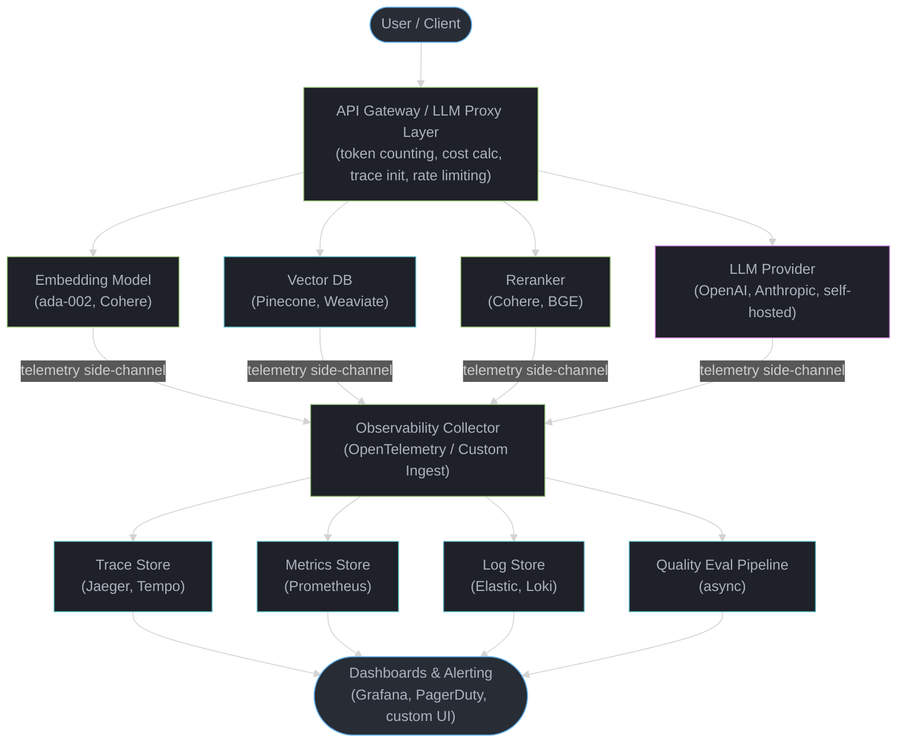

# LLM Observability and Monitoring

## 1. Concept Overview

LLM observability is the practice of instrumenting, measuring, and monitoring LLM-powered applications in production. Unlike traditional software observability -- which relies on the three pillars of metrics, logs, and traces -- LLM observability must address fundamentally different challenges: non-deterministic outputs, quality that cannot be measured by latency alone, token-based cost models, and failure modes that are semantic rather than structural (hallucination, relevance drift, instruction non-compliance).

Traditional observability answers "is the system up and fast?" LLM observability must additionally answer "are the AI responses good?" This distinction is critical because an LLM endpoint can return 200 OK with sub-second latency while producing completely hallucinated, off-topic, or harmful content. A monitoring system that only tracks HTTP status codes and P99 latency will miss the most important class of failures in an LLM application.

The core challenge is that LLM output quality is subjective, context-dependent, and expensive to evaluate. You cannot compute a "correctness" metric the way you compute request latency. Instead, LLM observability relies on a combination of proxy metrics (token counts, cost, safety filter triggers), automated quality scoring (LLM-as-judge, groundedness checks), human feedback loops, and statistical drift detection across embedding distributions.

Production LLM systems generate enormous volumes of telemetry. A chatbot handling 50K conversations per day at an average of 8 turns each produces 400K LLM calls daily. At ~500 tokens per call (input + output), that is 200M tokens per day -- each call generating structured trace data, token counts, latency measurements, and potentially quality scores. Managing this data pipeline is itself a significant engineering challenge.

---

## 2. Intuition

> **One-line analogy**: LLM observability is like having a flight recorder for every AI conversation -- you need to know not just that the plane flew, but whether it went to the right destination.

**Mental model**: Think of a traditional web service as a vending machine -- you put money in, you get a known product out, and monitoring means checking the machine is powered on and dispensing correctly. An LLM service is more like a human employee -- they are "on" and "responding," but you need to evaluate whether their responses are actually correct, helpful, and safe. Traditional APM is checking the vending machine's power light. LLM observability is conducting ongoing performance reviews of the employee.

**Why it matters**: Companies deploying LLMs in production routinely discover that their biggest incidents are invisible to traditional monitoring. A model quietly starts hallucinating 15% more frequently after a prompt template change. A new user cohort sends queries that fall outside the training distribution, producing nonsensical responses. A single internal tool consumes 60% of the LLM budget because nobody instrumented cost attribution. Without LLM-specific observability, these problems persist for weeks before someone files a complaint.

**Key insight**: The cost of observing an LLM system is non-trivial -- quality evaluation often requires calling another LLM, which means your monitoring system itself has latency, cost, and reliability concerns. The architecture of your observability pipeline is as important as the architecture of the application it monitors.

---

## 3. Core Principles

- **Every LLM call must be traceable end-to-end**: From the user's request through embedding generation, retrieval, reranking, prompt assembly, LLM inference, post-processing, and response delivery. A single user query in a RAG pipeline might touch 5-8 services -- each must emit correlated spans with a shared trace ID.

- **Quality metrics matter more than latency metrics**: A system that responds in 200ms with hallucinated content is worse than one that responds in 2 seconds with accurate content. Quality scoring (groundedness, relevance, safety) must be a first-class observable, not an afterthought.

- **Cost attribution must be built in from day one**: Token-based pricing means every LLM call has a direct dollar cost. Without per-user, per-team, per-feature cost attribution, organizations discover budget overruns only at the monthly invoice. A production platform should track cost per conversation, cost per user, and cost per feature in real time.

- **Observability overhead must be under 5% of inference latency**: Synchronous instrumentation (span creation, token counting, metadata attachment) must add less than 5ms to a typical 500ms LLM call. Quality evaluation runs asynchronously. If your observability stack adds 50ms+ to every request, you have an architecture problem.

- **Alerts should be actionable, not noisy**: Alerting on "latency > 3s" generates noise when the LLM provider has transient slowdowns. Instead, alert on sustained quality degradation (hallucination rate > 10% over a 1-hour window), cost anomalies (daily spend > 150% of 7-day moving average), and safety filter trigger spikes (> 5x baseline rate in 15 minutes).

- **Sample strategically, not uniformly**: Log 100% of metadata (tokens, latency, cost, model, status). Sample 100% of errors and safety triggers. Sample 10-20% of responses for quality scoring. Sample 1-2% for expensive LLM-as-judge evaluation. This tiered approach keeps storage costs manageable while maintaining statistical significance.

- **Prompt versioning is observability**: Every prompt template change is a deployment. Track which prompt version produced which responses, and correlate prompt versions with quality metrics. Without this, debugging a quality regression requires guessing which change caused it.

---

## 4. Types / Architectures / Strategies

### 4.1 Request-Level Tracing

The foundation of LLM observability. Every LLM interaction generates a trace composed of spans representing discrete operations.

**Span types in an LLM trace:**

| Span Type | What It Captures | Key Attributes |
|-----------|-----------------|----------------|
| **Generation** | LLM API call | model, provider, prompt_tokens, completion_tokens, total_tokens, cost, temperature, top_p, stop_reason |
| **Embedding** | Embedding API call | model, input_tokens, dimensions, batch_size |
| **Retrieval** | Vector DB query | query_embedding_model, top_k, similarity_threshold, num_results, retrieval_latency_ms |
| **Reranking** | Reranker model call | model, num_candidates, num_selected, rerank_latency_ms |
| **Chain** | Multi-step orchestration | chain_type, num_steps, total_tokens, total_cost |
| **Agent** | Agent loop iteration | tool_calls, iterations, max_iterations, final_answer |
| **Tool** | External tool invocation | tool_name, tool_input, tool_output_size, tool_latency_ms |

Parent-child relationships are critical for agent workflows where a single user request spawns 3-15 LLM calls across multiple tool invocations. Without proper trace linking, debugging "why did the agent give a wrong answer" becomes impossible.

### 4.2 Quality Monitoring

Quality metrics that cannot be derived from infrastructure telemetry alone:

- **Groundedness scoring**: Does the response use only information from the provided context? Measured by a judge model that compares claims in the response against retrieved documents. Target: >90% groundedness for RAG applications.
- **Relevance scoring**: Does the response actually answer the user's question? Measured by semantic similarity between query intent and response content.
- **Hallucination detection**: Does the response contain fabricated facts, citations, or data? Automated detection using NLI (Natural Language Inference) models or LLM-as-judge.
- **Instruction compliance**: Did the model follow the system prompt's formatting, tone, and constraint requirements?
- **Toxicity and safety**: Does the response contain harmful, biased, or inappropriate content? Measured by safety classifiers (Llama Guard, Perspective API).

### 4.3 Cost Attribution

Token-based pricing requires granular cost tracking:

| Attribution Level | What It Answers | Implementation |
|-------------------|----------------|----------------|
| **Per-request** | How much did this single call cost? | input_tokens * input_price + output_tokens * output_price |
| **Per-conversation** | How much did this entire session cost? | Sum of all request costs within a session_id |
| **Per-user** | How much does this user cost per month? | Aggregate by user_id |
| **Per-team** | Which team is consuming the most budget? | Aggregate by team/department tag |
| **Per-feature** | Is the summarization feature or the chat feature more expensive? | Aggregate by feature/endpoint tag |
| **Per-model** | What would it cost to switch from GPT-4o to Claude Sonnet? | Track model per request, compare costs |

Cost calculation at the gateway layer:

```python
# Per-model pricing table (as of 2024, per 1M tokens)
PRICING = {
    "gpt-4o":       {"input": 2.50,  "output": 10.00},
    "gpt-4o-mini":  {"input": 0.15,  "output": 0.60},
    "claude-sonnet": {"input": 3.00, "output": 15.00},
    "claude-haiku":  {"input": 0.25, "output": 1.25},
}

def calculate_cost(model, input_tokens, output_tokens):
    prices = PRICING[model]
    return (input_tokens * prices["input"] + output_tokens * prices["output"]) / 1_000_000
```

### 4.4 Latency Monitoring

LLM latency has unique characteristics compared to traditional APIs:

| Metric | Definition | Typical Target | Why It Matters |
|--------|-----------|----------------|----------------|
| **Time to First Token (TTFT)** | Time from request sent to first token received | <500ms for chat, <2s for batch | Perceived responsiveness; users notice TTFT more than total time |
| **Inter-Token Latency (ITL)** | Time between consecutive tokens during streaming | <30ms for smooth streaming | Choppy streaming degrades user experience |
| **Total Latency** | Time from request to final token | <3s for chat, <30s for complex agents | End-to-end SLA compliance |
| **P50 / P95 / P99** | Percentile latencies | P99 < 5s for chat | Tail latencies affect worst-case user experience |
| **Tokens per Second (TPS)** | Output generation throughput | >30 TPS for streaming | Below 20 TPS, streaming feels slow |

### 4.5 Error Monitoring

LLM-specific error categories beyond HTTP status codes:

| Error Type | Detection Method | Severity |
|------------|-----------------|----------|
| **API errors** (429, 500, 503) | HTTP status code | High -- immediate retry or fallback |
| **Rate limiting** (429 with retry-after) | Response headers | Medium -- indicates capacity planning gap |
| **Context length exceeded** | Error message parsing | High -- indicates prompt engineering failure |
| **Safety filter triggered** | Response metadata / finish_reason | Medium -- may indicate adversarial input |
| **Empty / truncated response** | Output token count = 0 or finish_reason = "length" | High -- user gets no useful response |
| **Timeout** | No response within SLA | High -- circuit breaker should activate |
| **JSON parse failure** | Structured output validation | Medium -- indicates prompt or model regression |
| **Refusal** | Response content analysis | Medium -- model refuses to answer a valid query |

### 4.6 Alerting Strategies

Effective alerting requires multi-signal correlation:

| Alert | Threshold | Window | Action |
|-------|-----------|--------|--------|
| Hallucination rate spike | >10% of scored responses | 1 hour rolling | Page on-call, investigate prompt/model change |
| Cost anomaly | Daily spend >150% of 7-day average | Daily | Notify team lead, check for runaway feature |
| TTFT degradation | P95 TTFT >2s | 15 min rolling | Check provider status page, consider fallback model |
| Error rate spike | >5% of requests | 5 min rolling | Page on-call, activate circuit breaker |
| Safety trigger surge | >5x baseline rate | 15 min rolling | Page security team, investigate adversarial attack |
| Token budget breach | >80% of monthly budget | Daily | Notify finance, throttle non-critical features |

### 4.7 Dashboard Design

Two distinct dashboard audiences:

**Ops Dashboard (SRE/Platform team):**
- Request volume and error rates (time series)
- Latency percentiles (P50, P95, P99) by model and endpoint
- Provider availability and rate limiting frequency
- Active alerts and incident timeline
- Cost burn rate vs. budget

**Product Dashboard (Product/ML team):**
- Quality scores over time (groundedness, relevance, safety)
- User satisfaction (thumbs up/down ratio, CSAT)
- Conversation completion rate
- Feature-level usage and cost breakdown
- Prompt version comparison (A/B test results)

---

## 5. Architecture Diagrams

### LLM Observability Stack Architecture



### Trace Structure for a RAG Pipeline

```
Trace: "user asks about refund policy"
|
+-- [Span: HTTP Request] latency=2340ms, status=200
|   |
|   +-- [Span: Query Understanding] latency=15ms
|   |   model=null, type="classification"
|   |   output: intent="policy_inquiry", entity="refund"
|   |
|   +-- [Span: Embedding Generation] latency=45ms
|   |   model="text-embedding-3-small"
|   |   input_tokens=12, dimensions=1536, cost=$0.000002
|   |
|   +-- [Span: Vector Retrieval] latency=23ms
|   |   index="knowledge_base", top_k=10
|   |   results_returned=10, min_score=0.72, max_score=0.94
|   |
|   +-- [Span: Reranking] latency=85ms
|   |   model="cohere-rerank-v3"
|   |   input_candidates=10, output_selected=3
|   |   top_score=0.91, cost=$0.00005
|   |
|   +-- [Span: Prompt Assembly] latency=2ms
|   |   template_version="v2.4.1"
|   |   context_tokens=1847, system_tokens=312, user_tokens=18
|   |   total_input_tokens=2177
|   |
|   +-- [Span: LLM Generation] latency=1890ms
|   |   model="gpt-4o", temperature=0.1
|   |   input_tokens=2177, output_tokens=245
|   |   cost=$0.0079, finish_reason="stop"
|   |   ttft=340ms, tokens_per_second=42
|   |
|   +-- [Span: Response Validation] latency=5ms
|   |   safety_check="pass", format_check="pass"
|   |
|   +-- [Span: Quality Eval (async)] latency=1200ms
|       model="gpt-4o-mini", eval_type="groundedness"
|       groundedness_score=0.92, relevance_score=0.88
|       cost=$0.00015
```

### Agent Trace Structure (Multi-Step)

```
Trace: "book me a flight to NYC next Tuesday"
|
+-- [Span: Agent Loop] iterations=3, total_latency=8450ms, total_cost=$0.067
    |
    +-- [Span: Iteration 1 - Planning] latency=1200ms
    |   model="claude-sonnet", tokens=1580
    |   thought: "Need to search for flights, check dates, book"
    |   action: "search_flights"
    |   |
    |   +-- [Span: Tool Call - search_flights] latency=2100ms
    |       input: {destination: "NYC", date: "2025-01-14"}
    |       output_size: 3.2KB, status: "success"
    |
    +-- [Span: Iteration 2 - Selection] latency=980ms
    |   model="claude-sonnet", tokens=2340
    |   thought: "Found 5 flights, selecting best option"
    |   action: "get_flight_details"
    |   |
    |   +-- [Span: Tool Call - get_flight_details] latency=450ms
    |       input: {flight_id: "UA-2847"}
    |       output_size: 1.1KB, status: "success"
    |
    +-- [Span: Iteration 3 - Booking] latency=1100ms
        model="claude-sonnet", tokens=1890
        thought: "Confirming booking for UA-2847"
        action: "book_flight"
        |
        +-- [Span: Tool Call - book_flight] latency=1800ms
            input: {flight_id: "UA-2847", passenger: "user_123"}
            output_size: 0.5KB, status: "success"
```

---

## 6. How It Works -- Detailed Mechanics

### OpenTelemetry for LLMs

OpenTelemetry (OTel) is the standard for distributed tracing. LLM observability extends OTel with LLM-specific semantic conventions. The OpenLLMetry project and the OTel GenAI SIG define standardized attribute names:

```python
from opentelemetry import trace
from opentelemetry.semconv.ai import SpanAttributes

tracer = trace.get_tracer("llm-app")

def call_llm(prompt, model="gpt-4o", temperature=0.1):
    with tracer.start_as_current_span("llm.generation") as span:
        # Set LLM-specific attributes before the call
        span.set_attribute("gen_ai.system", "openai")
        span.set_attribute("gen_ai.request.model", model)
        span.set_attribute("gen_ai.request.temperature", temperature)
        span.set_attribute("gen_ai.request.max_tokens", 1024)

        start = time.monotonic()
        response = openai.chat.completions.create(
            model=model,
            messages=[{"role": "user", "content": prompt}],
            temperature=temperature,
        )
        latency_ms = (time.monotonic() - start) * 1000

        # Set response attributes
        usage = response.usage
        span.set_attribute("gen_ai.response.model", response.model)
        span.set_attribute("gen_ai.usage.input_tokens", usage.prompt_tokens)
        span.set_attribute("gen_ai.usage.output_tokens", usage.completion_tokens)
        span.set_attribute("gen_ai.response.finish_reasons", [response.choices[0].finish_reason])

        # Custom cost calculation
        cost = calculate_cost(model, usage.prompt_tokens, usage.completion_tokens)
        span.set_attribute("llm.cost_usd", cost)
        span.set_attribute("llm.latency_ms", latency_ms)
        span.set_attribute("llm.ttft_ms", response.headers.get("x-ttft-ms", -1))

        return response.choices[0].message.content
```

### Token Counting and Cost Calculation at the Gateway Layer

The LLM proxy/gateway layer is the ideal instrumentation point because every request passes through it regardless of the calling application:

```python
class LLMGateway:
    """
    Intercepts all LLM calls, instruments telemetry, enforces budgets.
    Adds ~2-4ms overhead per request (well under the 5% target).
    """

    def __init__(self):
        self.token_counter = tiktoken.encoding_for_model("gpt-4o")
        self.cost_tracker = CostTracker()  # writes to metrics store
        self.budget_enforcer = BudgetEnforcer()  # per-team monthly limits

    def proxy_request(self, request, team_id, feature_id):
        # Pre-flight: count input tokens, check budget
        input_tokens = self.token_counter.encode(request.prompt)
        estimated_cost = self.estimate_cost(request.model, len(input_tokens), request.max_tokens)

        if not self.budget_enforcer.check(team_id, estimated_cost):
            raise BudgetExceededError(f"Team {team_id} exceeded monthly budget")

        # Forward to LLM provider
        response = self.forward_to_provider(request)

        # Post-flight: record actual usage
        actual_cost = calculate_cost(
            request.model,
            response.usage.prompt_tokens,
            response.usage.completion_tokens,
        )
        self.cost_tracker.record(
            team_id=team_id,
            feature_id=feature_id,
            model=request.model,
            input_tokens=response.usage.prompt_tokens,
            output_tokens=response.usage.completion_tokens,
            cost_usd=actual_cost,
            latency_ms=response.latency_ms,
        )
        return response
```

### Quality Scoring Pipeline (Async Post-Response)

Quality evaluation is too expensive and slow to run synchronously. A background pipeline processes sampled responses:

```mermaid
%%{init: {'flowchart': {'curve': 'basis'}, 'theme': 'dark'}}%%
flowchart LR
    Req([User Request]) --> Gateway --> LLM --> Resp([Response to User])
    Gateway -. "async fire-and-forget" .-> Queue["Message Queue\n(Kafka / SQS)"]
    Queue --> Dequeue["1. Dequeue response + context"]
    Dequeue --> Ground["2. Groundedness check\n(LLM-as-judge, ~800ms, ~$0.0002)"]
    Ground --> Relev["3. Relevance scoring\n(embedding similarity, ~50ms)"]
    Relev --> Safety["4. Safety classifier\n(Llama Guard, ~100ms, self-hosted)"]
    Safety --> Scores["5. Write scores to quality metrics store"]
    Scores --> Alert["6. Update rolling averages\nalert if thresholds breached"]

    classDef io     fill:#282c34,stroke:#61afef,color:#abb2bf
    classDef proc   fill:#1e2127,stroke:#98c379,color:#abb2bf
    classDef llm    fill:#1e2127,stroke:#c678dd,color:#abb2bf
    classDef store  fill:#1e2127,stroke:#56b6c2,color:#abb2bf
    classDef warn   fill:#1e2127,stroke:#e06c75,color:#abb2bf

    class Req,Resp io
    class Gateway,Dequeue,Ground,Relev,Safety proc
    class LLM llm
    class Queue,Scores store
    class Alert warn
```



Sampling strategy to control cost:

| Evaluation Type | Sample Rate | Cost per Eval | Daily Cost at 100K calls |
|----------------|-------------|---------------|--------------------------|
| Metadata logging (tokens, latency) | 100% | ~$0 | ~$0 |
| Response text logging | 100% | Storage only | ~$5 (S3/GCS) |
| Safety classifier | 100% (self-hosted) | ~$0.00002 | ~$2 |
| Groundedness (LLM-as-judge) | 10% | ~$0.0003 | ~$3 |
| Full rubric eval (LLM-as-judge) | 1% | ~$0.003 | ~$3 |
| Human review | 0.1% | ~$0.50 | ~$50 |
| **Total** | | | **~$63/day** |

### Embedding-Based Drift Detection

Monitor the distribution of user queries to detect when input patterns shift away from what the system was designed for:

```python
class QueryDriftDetector:
    """
    Computes embedding centroid of a reference query distribution,
    then monitors production queries for distributional shift.
    """

    def __init__(self, reference_embeddings):
        # Reference: embeddings of queries from validation/test set
        self.reference_centroid = np.mean(reference_embeddings, axis=0)
        self.reference_std = np.std(
            [cosine_distance(e, self.reference_centroid) for e in reference_embeddings]
        )
        self.window = deque(maxlen=1000)  # rolling window of production distances

    def check_query(self, query_embedding):
        distance = cosine_distance(query_embedding, self.reference_centroid)
        self.window.append(distance)

        if len(self.window) >= 100:
            rolling_mean = np.mean(self.window)
            # Alert if rolling mean distance > 2 std devs from reference
            if rolling_mean > self.reference_std * 2:
                alert("Query distribution drift detected",
                      severity="warning",
                      rolling_mean_distance=rolling_mean,
                      threshold=self.reference_std * 2)
```

Drift detection catches scenarios such as:
- A new marketing campaign drives users to ask questions the system was not designed for
- A seasonal shift changes query patterns (tax questions spike in April)
- Adversarial users probe the system with out-of-distribution inputs

### Log Sampling Strategies

Not all data deserves the same treatment:

```
Tier 1 -- Always log (100%):
  - Request metadata: trace_id, model, tokens, cost, latency, status, user_id
  - Error responses: full request + response for debugging
  - Safety filter triggers: full request + response for security review

Tier 2 -- High sample (10-20%):
  - Full prompt + response text (for quality analysis)
  - Groundedness scoring (async LLM-as-judge)
  - Retrieval context + scores (for RAG debugging)

Tier 3 -- Low sample (1-2%):
  - Full rubric evaluation (multi-dimension scoring by LLM judge)
  - Embedding computation for drift detection
  - Side-by-side model comparison (shadow traffic)

Tier 4 -- Rare (0.1%):
  - Human expert review
  - Detailed annotation for fine-tuning datasets
```

---

## 7. Real-World Examples

### LangSmith (LangChain)
LangChain's observability and evaluation platform. Captures full trace trees for chains and agents, including every LLM call, retrieval, and tool invocation. Key features: visual trace debugging, human feedback collection, dataset curation from production traces, online evaluation with custom evaluators, prompt versioning and A/B comparison. Pricing: free tier up to 5K traces/month; paid plans from $39/seat/month. Limitation: tightly coupled to LangChain ecosystem -- instrumenting non-LangChain code requires manual span creation.

### Langfuse
Open-source LLM observability platform. Deploys self-hosted or as a managed service. Captures traces with nested spans, tracks cost per trace, supports prompt management with versioning, and provides evaluation pipelines (both model-based and human). Integrates via Python/JS SDKs or OpenTelemetry. Key differentiator: open-source with full data ownership. ~15K GitHub stars. Supports LangChain, LlamaIndex, OpenAI SDK, and custom frameworks via decorator-based instrumentation. Self-hosted cost: ~$200/month on AWS for moderate traffic (50K traces/day).

### Helicone
API proxy model -- sits between your application and the LLM provider as a transparent proxy. No SDK changes required; just change the base URL. Logs every request with token counts, latency, cost, and caching status. Built-in request caching (saves ~20% on repeated identical prompts), rate limiting, and cost alerts. Limitation: proxy model adds 5-15ms latency per request; cannot capture internal application spans (retrieval, reranking) since it only sees the final LLM call.

### Arize Phoenix
Open-source tool focused on embedding-level observability. Computes embedding drift between reference (training/validation) and production datasets. Visualizes clusters using UMAP projections. Supports LLM trace capture and evaluation workflows. Key strength: identifying when input distributions shift -- for example, detecting that production queries have drifted into a topic cluster the system handles poorly. Self-hostable, integrates with OpenTelemetry.

### Weights and Biases Prompts
Extension of the W&B MLOps platform for LLM workflows. Tracks prompt versions as artifacts, logs LLM completions with full metadata, and supports evaluation scoring. Strongest for teams already using W&B for ML experiment tracking. Provides chain/agent trace visualization. Pricing: free for individual use; team plans from $50/seat/month.

### Datadog LLM Monitoring
Enterprise APM vendor's LLM offering. Auto-instruments OpenAI, Anthropic, and AWS Bedrock calls. Correlates LLM traces with infrastructure metrics (CPU, GPU, memory) in a single pane. Supports LLM-as-judge evaluations and token cost tracking. Key strength: enterprises already on Datadog get LLM observability without a new vendor. Key weakness: cost -- Datadog ingestion pricing makes high-volume LLM logging expensive (~$0.10 per GB ingested).

---

## 8. Tradeoffs

### Full Logging vs. Sampled Logging

| Dimension | Full Logging (100%) | Sampled Logging (1-10%) |
|-----------|-------------------|------------------------|
| **Debugging** | Can replay any request exactly | May miss the specific request that caused an issue |
| **Storage cost** | High -- 100K calls/day at ~2KB each = 200MB/day raw, ~6GB/month | Low -- 10% sample = 600MB/month |
| **Quality analysis** | Statistically perfect | Statistically valid above ~1K samples per cohort |
| **Privacy risk** | Every user prompt is stored | Reduced PII exposure surface |
| **Compliance** | May conflict with data retention policies | Easier to comply with GDPR/CCPA |
| **Recommendation** | Use for small-scale (<10K calls/day) or critical applications | Use for high-scale production (>100K calls/day) |

### Self-Hosted vs. SaaS Observability

| Dimension | Self-Hosted (Langfuse, Phoenix) | SaaS (LangSmith, Helicone, Datadog) |
|-----------|-------------------------------|--------------------------------------|
| **Data privacy** | Full control -- data never leaves your infrastructure | Vendor stores your prompts and responses |
| **Setup cost** | 2-4 weeks engineering effort | Hours to integrate SDK |
| **Operational burden** | You manage infra, scaling, backups | Vendor manages everything |
| **Monthly cost (50K traces/day)** | ~$200-500 (compute + storage) | ~$500-2000 depending on vendor |
| **Customization** | Full -- fork and modify | Limited to vendor's configuration |
| **Feature velocity** | You build new features | Vendor ships features weekly |
| **Recommendation** | Regulated industries, large scale, privacy-sensitive | Startups, rapid iteration, small teams |

### Synchronous vs. Asynchronous Quality Evaluation

| Dimension | Synchronous (in request path) | Asynchronous (post-response) |
|-----------|------------------------------|------------------------------|
| **Latency impact** | Adds 500-2000ms to response time | Zero impact on user-facing latency |
| **Blocking capability** | Can block bad responses before delivery | Cannot prevent bad responses, only detect them |
| **Cost** | Paid for every request (expensive) | Paid only for sampled requests (cheap) |
| **Use case** | Safety-critical: healthcare, financial advice | General quality monitoring |
| **Recommendation** | Only for safety classifiers on 100% of traffic | For all quality/groundedness scoring |

### Per-Request Scoring vs. Batch Scoring

| Dimension | Per-Request (real-time) | Batch (hourly/daily) |
|-----------|----------------------|---------------------|
| **Alert latency** | Detect issues within minutes | Detect issues within hours |
| **Infrastructure** | Requires always-on scoring workers | Scheduled jobs, simpler infrastructure |
| **Cost efficiency** | Higher (no batching discounts) | Lower (batch API pricing, 50% cheaper) |
| **Statistical robustness** | Noisy at low volumes (small sample sizes) | Smoothed over larger windows |
| **Recommendation** | For high-severity alerts (safety, cost anomaly) | For trend analysis (quality drift, embedding drift) |

---

## 9. When to Use / When NOT to Use

### Implement Full Observability When:
- Your LLM application is customer-facing and handles >1K conversations/day
- You are in a regulated industry (healthcare, finance, legal) where every AI response may need an audit trail
- You have multiple teams sharing an LLM platform and need cost attribution
- You are running A/B tests between models or prompt versions and need statistically significant quality comparisons
- Your application uses agents or multi-step chains where a single request triggers 3+ LLM calls
- Your monthly LLM spend exceeds $5K and you need to optimize cost allocation

### Lightweight Logging Is Sufficient When:
- You are in early prototyping/MVP stage with <100 users
- Your LLM usage is internal-only (developer tools, internal chatbots) where quality failures have low blast radius
- You are using a single model with a single prompt template and have no need for A/B comparison
- Your monthly LLM spend is under $500 and cost optimization is not a priority

### Do NOT Over-Invest in Observability When:
- You do not yet have a functioning LLM application -- build the product first, instrument it second
- Your team has no one who will look at dashboards -- observability without operators is waste
- You are logging 100% of everything "just in case" without a plan for analysis -- you will drown in storage costs
- You are building real-time quality evaluation that adds >500ms to every request for a non-safety-critical application

---

## 10. Common Pitfalls

**1. Logging everything and drowning in storage costs.** A Series B startup logging all prompts and completions for their customer support chatbot generated 2.3TB of log data in the first month. At $23/TB/month on S3 plus $0.10/GB Datadog ingestion, their observability bill hit $40K/month -- nearly as much as their LLM inference costs. The fix: tier the logging strategy. Log 100% of metadata (tokens, latency, cost) at ~50 bytes per call. Log full prompt+response text for only 10% of calls. Log to S3 with lifecycle policies that move data to Glacier after 30 days. Reduced storage costs to $3K/month.

**2. Alerting on latency but not quality -- missing silent quality degradation.** An e-commerce company's product recommendation chatbot showed stable latency and zero errors for 3 weeks after a prompt template update. Latency dashboards were green. But a customer complaint investigation revealed the hallucination rate had doubled from 4% to 8% -- the model was inventing product features. Nobody noticed because there was no quality scoring pipeline. The fix: implement async groundedness scoring on a 10% sample, with alerts on any 2-percentage-point increase sustained over 4 hours.

**3. Not attributing costs to features, leading to invisible budget overruns.** A mid-size SaaS company shared a single OpenAI API key across 6 product features. Monthly bill: $45K. After instrumenting per-feature cost attribution, they discovered that an internal document summarization tool used by 12 people was consuming 60% ($27K) of the budget because it sent entire 50-page documents as context for every query. The fix: implement chunking for the summarization tool (reduced its cost to $4K/month) and set per-feature budget caps with alerts at 80% of cap.

**4. Quality scoring pipeline that is slower than inference, causing queue backup.** A healthcare company ran synchronous LLM-as-judge evaluation on 100% of responses using GPT-4 as the judge. Judge latency: 1.5-3 seconds. At 2K requests/hour, the scoring queue backed up within 2 hours and reached a 6-hour delay by end of day. Stale quality scores meant alerts fired on data that was half a day old. The fix: switch to async scoring with GPT-4o-mini as the judge (300ms, 90% agreement with GPT-4 judge), sample at 10%, and use a dedicated scoring worker pool that auto-scales based on queue depth.

**5. Dashboard overload -- 50 metrics, nobody looks at any of them.** A platform team built a comprehensive Grafana dashboard with 50+ panels covering every conceivable LLM metric. Usage analytics showed the dashboard had 3 views per week, all from the person who built it. Nobody else could find the signal in the noise. The fix: create two focused dashboards. Ops dashboard: 6 panels (request volume, error rate, P95 latency, cost burn rate, active alerts, provider status). Product dashboard: 6 panels (quality score trend, user satisfaction, top failure modes, feature usage, cost per conversation, prompt version comparison). Total views jumped to 40+ per week.

**6. Missing parent-child trace linking in agent workflows, making debugging impossible.** A travel booking agent made 3-8 LLM calls per user request across multiple tool invocations. Each LLM call was logged independently with no trace context propagation. When a user reported a wrong booking, the on-call engineer had to manually correlate 6 separate log entries by timestamp proximity. Debugging took 2 hours per incident. The fix: implement OpenTelemetry context propagation through the agent loop. Each agent iteration creates a child span of the parent trace. Tool calls create child spans of their iteration. Debugging time dropped to 10 minutes -- click the trace ID, see the full tree.

---

## 11. Technologies & Tools

| Tool | Type | Key Feature | Open Source | Pricing Model |
|------|------|-------------|-------------|---------------|
| **Langfuse** | Full platform | Traces, cost, prompts, evals | Yes | Free self-hosted; cloud from $0 (free tier) |
| **Arize Phoenix** | Evaluation + drift | Embedding drift, UMAP viz, evals | Yes | Free self-hosted |
| **Helicone** | API proxy | Zero-code integration, caching | Partially | Free tier 100K logs; paid from $120/mo |
| **LangSmith** | Full platform | LangChain native, datasets, evals | No | Free 5K traces/mo; paid from $39/seat/mo |
| **W&B Prompts** | Eval + tracking | Prompt versioning, experiment tracking | No | Free individual; team from $50/seat/mo |
| **OpenLLMetry** | OTel instrumentation | Auto-instruments 20+ LLM libraries | Yes | Free (instrumentation only) |
| **Traceloop** | Full platform | Built on OpenLLMetry, SaaS dashboard | Partially | Free tier; paid from $99/mo |
| **Datadog LLM Monitoring** | Enterprise APM | Full infra correlation, auto-instrument | No | Per-host + per-GB ingestion pricing |
| **Braintrust** | Eval platform | CI/CD for prompts, scoring, logging | No | Free tier; paid from usage-based |
| **Custom OTel** | DIY | Full control, any backend | Yes | Cost of infra (Jaeger + Prometheus + Grafana) |

### Choosing a Stack

```
Decision tree:

Are you in a regulated industry needing full data ownership?
  YES --> Self-host Langfuse or build custom OTel + Grafana
  NO  --> Continue

Are you using LangChain heavily?
  YES --> LangSmith (tightest integration)
  NO  --> Continue

Do you want zero code changes?
  YES --> Helicone (proxy model)
  NO  --> Continue

Are you already on Datadog?
  YES --> Datadog LLM Monitoring (single pane of glass)
  NO  --> Langfuse (best balance of features, cost, openness)
```

---

## 12. Interview Questions with Answers

**Q: How would you design an observability system for a production LLM application?**
Start with three layers: a lightweight synchronous instrumentation layer in the request path that captures metadata (model, tokens, latency, cost, trace ID) with under 5ms overhead; an asynchronous quality evaluation pipeline that scores a 10% sample for groundedness, relevance, and safety using a cheaper judge model; and a dashboarding/alerting layer with two views -- ops (latency, errors, cost) and product (quality, satisfaction). Use OpenTelemetry for trace propagation so every span in a multi-step chain shares a trace ID. Store traces in a time-series database with 30-day retention for hot data and S3/GCS for cold storage. Set alerts on quality degradation (hallucination rate > 10%), cost anomalies (150% of rolling average), and error spikes (> 5% in 5 minutes).

**Q: What metrics would you track for an LLM-powered chatbot?**
Five categories. Latency: Time to First Token (target <500ms), total response time (P95 <3s), inter-token latency (<30ms for smooth streaming). Quality: groundedness score (>0.90 for RAG), relevance score, hallucination rate (<5%), instruction compliance rate. Cost: cost per conversation (track trend over time), cost per user, daily/monthly spend vs. budget. Engagement: conversation completion rate, user thumbs-up/down ratio, average turns per conversation, escalation-to-human rate. Errors: API error rate, safety filter trigger rate, context length exceeded rate, empty response rate. The most important single metric is often the user satisfaction proxy (thumbs up/down ratio) because it integrates quality, relevance, and helpfulness into one signal.

**Q: How do you implement cost attribution across teams in a shared LLM platform?**
Implement a gateway layer that every LLM request must pass through. The gateway requires a team_id and feature_id tag on every request (enforced at the SDK level -- requests without tags are rejected). The gateway counts tokens, looks up the per-model pricing table, calculates the cost, and writes a cost event to a metrics store (Prometheus counter with team and feature labels, or a cost ledger in PostgreSQL). Build a daily aggregation job that rolls up per-request costs to per-team and per-feature totals. Set per-team monthly budgets with alerts at 80% consumption and hard throttling at 100%. Expose a self-service cost dashboard where team leads can see their spend broken down by feature, model, and day. At a company with $50K/month LLM spend, this approach typically reveals that 20% of features consume 80% of cost.

**Q: How do you detect hallucination rate trends in production?**
Implement a two-stage detection pipeline. Stage 1 (real-time, 10% sample): for RAG applications, run a lightweight groundedness check that compares claims in the LLM response against the retrieved context using an NLI model or a cheap LLM judge (GPT-4o-mini, ~$0.0003 per eval). Score each response as grounded (all claims supported), partially grounded, or ungrounded. Stage 2 (batch, daily): aggregate groundedness scores into a daily hallucination rate. Apply statistical process control -- calculate a 7-day rolling mean and standard deviation, alert when the daily rate exceeds the mean by 2 standard deviations for 2 consecutive days. Common causes of hallucination spikes: prompt template changes that weaken grounding instructions, retrieval quality degradation (index staleness, embedding model change), or model version updates by the provider. Always correlate hallucination rate changes with recent deployments (prompt version, model version, retrieval config).

**Q: What is the difference between LLM tracing and traditional distributed tracing?**
Traditional distributed tracing (Jaeger, Zipkin) captures request flow across microservices with spans representing HTTP calls, database queries, and cache lookups. LLM tracing extends this with LLM-specific semantics: spans for generation calls carry token counts, model identifiers, cost, temperature, and finish reason; spans for embedding calls carry dimensions and batch size; spans for retrieval carry top_k, similarity scores, and document IDs. The trace structure also differs: a traditional trace is typically a linear chain of 3-5 service hops, while an LLM agent trace is a tree with 3-15 LLM calls nested under iteration loops with tool call branches. LLM traces also need to carry the actual prompt and response text (potentially large payloads) for debugging, whereas traditional traces only carry metadata. This means LLM trace storage is 10-100x larger per trace than traditional traces.

**Q: How do you handle the cost of quality evaluation at scale?**
Three strategies. First, tiered sampling: evaluate 100% of responses with a free/cheap safety classifier (self-hosted Llama Guard, ~$0.00002/call), 10% with a mid-cost judge model (GPT-4o-mini, ~$0.0003/call), and 1% with an expensive comprehensive rubric (GPT-4o, ~$0.003/call). At 100K calls/day, this costs ~$63/day vs. ~$300/day for 100% GPT-4o-mini scoring. Second, batch API pricing: providers like OpenAI offer 50% discounts for batch API calls -- run your daily batch evaluation through the batch API. Third, self-host a small judge model: fine-tune a 7B model on your evaluation rubric and run it on a single GPU. After initial fine-tuning cost (~$200), ongoing cost is ~$0.00005/eval -- 6x cheaper than GPT-4o-mini with 85-90% agreement on your specific evaluation criteria.

**Q: What alerting thresholds would you set for an LLM system?**
Prioritize alerts by blast radius and urgency. Critical (page immediately): error rate >5% in a 5-minute window; safety filter triggers >5x baseline in 15 minutes (possible adversarial attack); monthly cost projected to exceed budget by >200%. High (page during business hours): P95 TTFT >2 seconds sustained for 30 minutes; hallucination rate >10% over a 1-hour window; empty/truncated response rate >3%. Medium (Slack notification): daily cost >150% of 7-day rolling average; quality score mean drops >1 standard deviation from 7-day baseline; new error type appears that was never seen before. Low (weekly digest): prompt version performance comparison results; embedding drift score trend; per-team cost breakdown changes. The key principle: every alert must have a documented runbook with a specific action. If you cannot write a runbook for an alert, it should be a dashboard metric, not an alert.

**Q: How do you debug a bad LLM response using traces?**
Start with the trace ID from the user's session. Open the trace in your observability UI (Langfuse, LangSmith, Jaeger). Walk through spans in order: (1) Check the query understanding span -- did the system correctly classify the user's intent? (2) Check the embedding span -- was the embedding model correct and did it complete successfully? (3) Check the retrieval span -- did the vector DB return relevant documents? Look at similarity scores; if the top score is below 0.75, retrieval quality is the likely culprit. (4) Check the reranking span -- did reranking correctly promote the best documents? (5) Check the prompt assembly span -- look at the actual assembled prompt including system prompt, context, and user query. Is the context relevant? Is the system prompt correctly formatted? (6) Check the generation span -- what model, temperature, and tokens were used? Was the finish_reason "stop" (normal) or "length" (truncated)? (7) Check the quality eval span if available -- what were the groundedness and relevance scores? In practice, 60% of bad responses trace back to retrieval quality (wrong documents retrieved), 25% to prompt engineering issues, and 15% to model limitations.

**Q: How do you monitor prompt drift over time?**
Prompt drift has two dimensions: template drift (your prompt changes) and input drift (user queries change). For template drift, version every prompt template in a prompt registry (Langfuse, LangSmith, or a simple Git-tracked YAML file). Tag every LLM call with the prompt version. Diff quality metrics between prompt versions using a statistical significance test (chi-squared for categorical outcomes, t-test for continuous scores). For input drift, compute embeddings of user queries and track the distribution centroid over time. Use a two-sample test (MMD -- Maximum Mean Discrepancy, or a simpler cosine distance from a reference centroid) to detect when query distribution shifts. Alert when the rolling mean distance exceeds 2 standard deviations from baseline for more than 4 hours. Input drift often correlates with quality drops because the system was optimized for the original query distribution.

**Q: What is the tradeoff between sync and async quality scoring?**
Synchronous scoring runs in the request path -- the user waits for both the LLM response and the quality check. Advantage: you can block bad responses before they reach the user (critical for safety in healthcare/finance). Disadvantage: adds 500-2000ms to every request, doubles your LLM cost (judge call + original call), and creates a reliability dependency (if the judge is down, all requests fail or bypass safety). Asynchronous scoring runs after the response is delivered -- a background worker evaluates quality and stores scores. Advantage: zero latency impact, can use cheaper models or batch APIs, and failure in scoring does not affect the user. Disadvantage: bad responses reach the user before you know they are bad. Best practice: run a fast, cheap safety classifier synchronously on 100% of traffic (<50ms, self-hosted), and run all other quality evaluation asynchronously on a 10% sample.

**Q: How do you implement A/B testing infrastructure for LLM experiments?**
Build three components. First, an experiment router in the gateway layer that assigns users to experiment variants based on a hash of user_id (deterministic assignment -- same user always gets the same variant). The router adds the variant tag to every LLM call in the trace. Second, a metrics collection pipeline that aggregates quality scores, latency, cost, and user satisfaction per variant. Use the same quality scoring pipeline but ensure scoring is blind (the judge does not know which variant produced the response). Third, a statistical analysis layer that computes significance using bootstrap confidence intervals (more robust than t-tests for LLM quality distributions, which are often non-normal). Minimum sample size per variant: 1,000 scored responses for detecting a 5% quality difference with 80% power. At 10% scoring rate, that means routing 10,000 requests per variant. For a chatbot with 10K conversations/day, a two-variant test reaches significance in about 2 days.

**Q: How do you measure and reduce Time to First Token (TTFT)?**
TTFT is measured at the client side -- the time from sending the request to receiving the first byte of the streamed response. Typical TTFT breakdown: network latency (10-50ms), request queuing at the provider (0-500ms, highly variable), prompt processing / prefill phase (50-500ms depending on input length), and first token decode (5-20ms). To reduce TTFT: (1) Use streaming endpoints -- non-streaming forces the client to wait for the full response. (2) Reduce input token count -- every 1,000 extra input tokens adds ~50-100ms to prefill time on most providers. (3) Use prompt caching (Anthropic, OpenAI) -- cached prefixes skip the prefill phase, reducing TTFT by 60-80% for repeated system prompts. (4) Choose providers/models with lower TTFT -- smaller models have faster prefill. GPT-4o-mini TTFT: ~200ms; GPT-4o TTFT: ~400ms; Claude Sonnet TTFT: ~300ms. (5) Deploy a model closer to users (edge inference) for latency-sensitive applications. Monitor TTFT at P50, P95, and P99 -- P99 is often 3-5x worse than P50 due to provider-side queuing.

---

## 13. Best Practices

1. **Instrument at the gateway, not the application.** Place your observability instrumentation in a shared gateway/proxy layer that all LLM requests pass through. This guarantees every call is captured regardless of which application or team made it. Application-level instrumentation is fragile -- one team forgets to add the SDK, and you have blind spots.

2. **Start with cost visibility before anything else.** Cost attribution is the easiest observability feature to implement (just count tokens and multiply by price) and delivers the highest immediate ROI. Teams routinely discover 30-50% cost savings opportunities within the first week of visibility. Implement per-team, per-feature cost tracking before investing in quality evaluation.

3. **Use a tiered logging strategy from day one.** Log 100% of metadata (tokens, latency, model, cost, status) at ~50 bytes per call. Log full prompt+response text for a configurable sample (default 10%). Log expensive quality evaluations for 1-2%. Set these sampling rates as runtime configuration, not compile-time constants, so you can increase sampling during incidents.

4. **Run safety evaluation synchronously; run quality evaluation asynchronously.** The only scoring that belongs in the request path is a fast safety classifier (Llama Guard, <50ms). All other quality evaluation -- groundedness, relevance, rubric scoring -- should run asynchronously on a sampled subset. This keeps user-facing latency clean while still providing quality visibility.

5. **Version every prompt template and correlate with quality metrics.** Treat prompt templates as code: version them, deploy them through a pipeline, and tag every LLM call with the prompt version. When quality drops, the first diagnostic step is "what prompt version changed?" Without version tracking, you are debugging blind.

6. **Set budget caps with hard limits, not just alerts.** Alerts at 80% of budget are necessary but insufficient. Implement hard throttling at 100% of budget in the gateway -- reject non-critical requests when the budget is exceeded. A single runaway feature can burn through a monthly budget in hours. Cost anomaly alerts with a 150% threshold on daily spend provide early warning.

7. **Build two dashboards, not one.** An ops dashboard for the platform team (latency, errors, cost, provider status) and a product dashboard for the ML/product team (quality scores, user satisfaction, feature usage, experiment results). A single dashboard serving both audiences will satisfy neither.

8. **Propagate trace context through agent loops and tool calls.** Agent workflows are the hardest to debug because a single user request spawns a tree of LLM calls and tool invocations. Ensure every iteration of the agent loop and every tool call creates a child span linked to the parent trace. Without this, debugging an agent failure requires manually correlating logs by timestamp -- a 2-hour task that should take 10 minutes.

9. **Implement embedding drift detection for query distribution monitoring.** Production query distributions shift over time due to seasonality, marketing campaigns, new user segments, or adversarial probing. Monitor the centroid distance of production query embeddings against a reference distribution. Alert when drift exceeds 2 standard deviations sustained over 4 hours. Drift often predicts quality degradation before quality scores themselves change.

10. **Retain raw data for at least 30 days; retain aggregated metrics for at least 12 months.** You will need raw traces to debug incidents that surface days after they occur (e.g., a customer complaint about a conversation from last week). Aggregated metrics (daily quality scores, cost totals, error rates) are needed for trend analysis and capacity planning. Use lifecycle policies to move raw data to cold storage after 30 days.

---

## 14. Case Study: Observability for a Production Customer Support Chatbot

**Problem:** A SaaS company deploys a RAG-powered customer support chatbot handling 10K conversations per day (~80K LLM calls/day). The chatbot answers questions about billing, product features, and troubleshooting using a knowledge base of 15K support articles. The team needs to monitor quality, control costs (~$8K/month LLM spend), detect regressions, and provide debugging capabilities when customers report bad responses. They have 2 ML engineers and no dedicated observability team.

**Architecture:**

```
                  +------------------+
                  |    Customers     |
                  |  (10K conv/day)  |
                  +--------+---------+
                           |
                           v
                  +--------+---------+
                  | Chat Frontend    |
                  | (session_id,     |
                  |  user_id tags)   |
                  +--------+---------+
                           |
                           v
              +------------+------------+
              |      LLM Gateway        |
              |  - Token counting       |
              |  - Cost calculation     |
              |  - Budget enforcement   |
              |  - Trace ID generation  |
              |  - Prompt version tag   |
              +---+------+------+------+
                  |      |      |
         +--------+  +---+---+  +--------+
         v           v       v           v
   +---------+ +--------+ +------+ +----------+
   |Embedding| |Vector  | |Rerank| |LLM       |
   |API      | |DB      | |API   | |Provider  |
   |(ada-002)| |(Pinecone)|(Cohere)|(GPT-4o-  |
   |         | |        | |      | | mini)    |
   +---------+ +--------+ +------+ +----------+
         |           |      |           |
         +-----+-----+------+-----+-----+
               |                   |
               v                   v
     +---------+-------+  +-------+---------+
     | Trace Collector |  | Quality Eval    |
     | (Langfuse       |  | Workers (async) |
     |  self-hosted)   |  | - Groundedness  |
     +--------+--------+  | - Safety        |
              |            +-------+---------+
              v                    |
     +--------+--------+          |
     | PostgreSQL +    |<---------+
     | ClickHouse      |
     | (trace store)   |
     +--------+--------+
              |
              v
     +--------+--------+
     | Grafana          |
     | - Ops dashboard  |
     | - Product dash   |
     | - Alerts -> PD   |
     +------------------+
```

**Key Design Decisions:**

1. **Self-hosted Langfuse** for tracing and prompt management. The company handles sensitive customer billing data, so prompts and responses cannot leave their AWS account. Langfuse runs on a t3.xlarge EC2 instance with a managed PostgreSQL backend. Total infra cost: ~$250/month.

2. **Gateway-level instrumentation.** All LLM calls route through a thin Python gateway that adds trace context, counts tokens, calculates cost, and enforces a $12K/month hard budget cap. Gateway overhead: 3ms per request (well under the 5% target on a typical 1.2s response).

3. **Tiered quality evaluation:**
   - 100% of responses: safety classifier (self-hosted Llama Guard 3 on a g5.xlarge GPU, $0.00003/eval, ~80ms)
   - 15% of responses: groundedness scoring via GPT-4o-mini as judge (~$0.0002/eval, ~400ms async)
   - 100% of responses with user feedback: full rubric evaluation triggered by any thumbs-down
   - Monthly cost of quality evaluation: ~$380

4. **Prompt version tracking.** Three prompt templates (billing, features, troubleshooting) are stored in Langfuse's prompt registry. Each template is versioned (v2.4.1 format). The gateway tags every trace with the prompt version. A/B tests between prompt versions run for 48 hours before promoting.

5. **Two Grafana dashboards:**

   Ops dashboard (6 panels):
   - Request volume by model (time series)
   - Error rate and types (time series)
   - TTFT and total latency P50/P95 (time series)
   - Cost burn rate vs. monthly budget (gauge + trend)
   - Active alerts (table)
   - Langfuse/Pinecone/LLM provider health (status indicators)

   Product dashboard (6 panels):
   - Groundedness score trend (time series, 7-day window)
   - User satisfaction (thumbs up/down ratio, daily)
   - Top 10 failure queries (table, updated daily)
   - Conversation completion rate (percentage, daily)
   - Cost per conversation trend (time series)
   - Prompt version quality comparison (bar chart)

**Alert Configuration:**

| Alert | Condition | Action |
|-------|-----------|--------|
| Error rate critical | >5% in 5 min | Page on-call, activate fallback model |
| Safety trigger spike | >10 triggers in 15 min (baseline: ~2) | Page security lead, review flagged conversations |
| TTFT degradation | P95 >2s for 30 min | Check provider status, consider model switch |
| Groundedness drop | Daily mean <0.85 (baseline: 0.92) | Investigate retrieval quality, check index freshness |
| Cost anomaly | Daily spend >$500 (budget: $400/day) | Notify team lead, check for runaway feature |
| User satisfaction drop | Thumbs-down rate >20% (baseline: 12%) | Flag for product review, pull worst-rated traces |

**Results After 3 Months:**

- Mean time to debug a customer complaint: reduced from 2.5 hours to 15 minutes (trace-based debugging)
- Identified and fixed a retrieval quality regression caused by stale Pinecone index (groundedness alert fired within 6 hours of regression start)
- Discovered that 30% of conversations could use GPT-4o-mini instead of GPT-4o (quality scores were equivalent for simple billing inquiries), saving $2,400/month
- Caught a prompt injection attempt within 8 minutes via safety trigger spike alert
- Total observability cost: $630/month (Langfuse infra $250 + GPU for safety classifier $200 + quality eval LLM calls $180), which is 7.9% of the $8K/month LLM spend

---

**Additional war story — Cost attribution gap: 50-service LLM platform with $40K/month unattributed spend:**

A platform team managing 50 LLM-powered services discovered that 35% of their $115K/month LLM API spend had no service attribution in their Langfuse traces. Engineers had correctly set up Langfuse in 32 services but 18 services were making direct `openai.chat.completions.create()` calls without the callback handler, bypassing tracing entirely. The unattributed spend was discovered only during a budget audit, 4 months after the platform launched. The fix required a wrapper enforcement mechanism — direct SDK calls were blocked at the network layer, forcing all services through the platform's traced gateway.

```python
# BROKEN: direct OpenAI SDK calls in 18 services bypass observability
# In service_x/llm_client.py:
from openai import OpenAI
client = OpenAI()  # BUG: no tracing, no cost attribution, no rate limiting

def generate_text(prompt: str) -> str:
    response = client.chat.completions.create(
        model="gpt-4o",
        messages=[{"role": "user", "content": prompt}]
    )
    return response.choices[0].message.content

# FIX: enforce all LLM calls through a platform gateway with mandatory tracing
# platform/llm_gateway.py
import httpx
from langfuse import Langfuse
from functools import wraps
import os

langfuse = Langfuse(
    public_key=os.environ["LANGFUSE_PUBLIC_KEY"],
    secret_key=os.environ["LANGFUSE_SECRET_KEY"],
)

def traced_completion(service_name: str, feature_name: str):
    """Decorator that wraps any LLM call with cost attribution tracing."""
    def decorator(fn):
        @wraps(fn)
        def wrapper(*args, **kwargs):
            trace = langfuse.trace(
                name=f"{service_name}/{feature_name}",
                metadata={"service": service_name, "feature": feature_name},
            )
            generation = trace.generation(name="llm_call", model=kwargs.get("model"))
            try:
                result = fn(*args, **kwargs)
                generation.end(output=result, usage=result.usage.__dict__)
                return result
            except Exception as e:
                generation.end(level="ERROR", status_message=str(e))
                raise
        return wrapper
    return decorator

# Network-layer enforcement: route all *.openai.com traffic through gateway proxy
# In Kubernetes NetworkPolicy: block direct egress to api.openai.com from non-gateway pods
```

**Additional interview Q&As:**

**How do you implement per-feature cost attribution in a platform serving 50 services, and what granularity should you track?** Track cost at three levels: (1) service level (which microservice made the call); (2) feature level (which product feature within the service); (3) user segment level (free vs paid users, business unit). Use Langfuse trace metadata tags for all three: `{"service": "customer-support", "feature": "intent-classification", "tier": "free"}`. Aggregate cost by these dimensions in a daily dashboard. Without feature-level attribution, you cannot identify which features are over-budget or which are candidates for model downgrade — service-level only is insufficient for cost optimization.

**What is groundedness score monitoring and how do you implement it at scale without evaluating every response?** Groundedness measures whether LLM output claims are supported by retrieved context (for RAG systems) or factual knowledge. Full evaluation (LLM-as-judge checking every response) is too expensive for 100% of traffic. Implementation: sample 5% of production responses stratified by intent category; run a fast groundedness classifier (fine-tuned on NLI datasets like MNLI, ~10ms inference on CPU) to produce a 0-1 score; alert if rolling 7-day average drops below 0.85 per intent category. For critical flows (medical, legal), bump the sampling rate to 20% and use a full LLM judge (Claude Haiku) instead of the NLI classifier.

**How do you distinguish between a model quality regression and a retrieval quality regression in a RAG-based observability system?** Instrument both retrieval and generation separately: log the retrieval recall score (proportion of relevant documents retrieved, measured on a weekly golden query set) and the generation faithfulness score (does the output reflect the retrieved context) independently. If retrieval recall drops but faithfulness stays constant, the retrieval index has a problem (stale data, embedding model update). If retrieval recall is stable but faithfulness drops, the generation model changed (prompt update, model version update) or retrieved documents are being ignored. This two-signal approach was validated in a real incident: a Pinecone index staleness issue was identified in 6 hours instead of days because retrieval recall was monitored separately from output quality.

**Quick-reference table:**

| Metric | What it catches | Collection method | Alert threshold |
|---|---|---|---|
| Per-feature cost (daily) | Budget overruns, inefficient model usage | Langfuse span metadata aggregation | >20% week-over-week increase |
| Groundedness score (sampled 5%) | Hallucination increase, retrieval degradation | NLI classifier on response + context pairs | Rolling 7-day avg < 0.85 |
| P95 latency per service | Regression in generation speed, batching issues | Distributed tracing span durations | >20% increase over 7-day baseline |
| Safety trigger rate | Prompt injection spikes, adversarial users | Count of guardrail blocks / total requests | >3x daily baseline |
