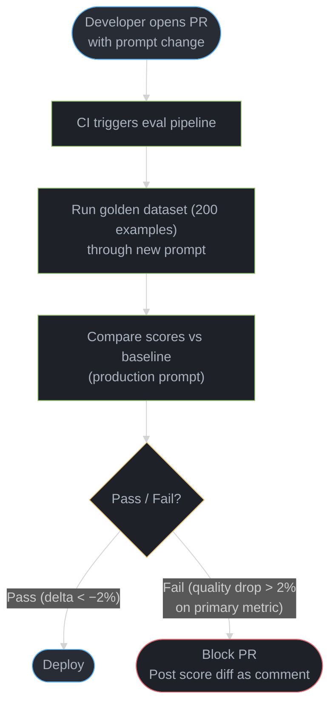
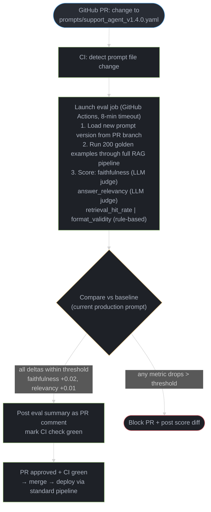

# LLMOps Platforms

---

## 1. Concept Overview

LLMOps platforms provide the operational infrastructure needed to develop, evaluate, deploy, and monitor large language model applications. Three distinct categories address different phases of the LLM lifecycle:

**Experiment Tracking** platforms capture what happened during model training — hyperparameters, loss curves, evaluation metrics, checkpoints, and dataset versions. MLflow, Weights & Biases (W&B), Neptune.ai, and Comet ML are the primary tools in this category. They were originally built for tabular ML but have been extended to support fine-tuning workflows.

**LLM-specific Observability** platforms capture what happens at inference time in production — which prompts were sent, which tools were called, how many tokens were consumed, what each call cost, and where latency was spent. LangSmith, LangFuse, Arize Phoenix, Helicone, and Braintrust fill this role. Standard APM tools (Datadog, New Relic) cannot capture the nested call structure of an LLM agent chain, which is why this dedicated category exists.

**Evaluation Platforms** automate quality assessment before and after deployment — running a model or prompt version against a golden dataset and scoring it on domain-specific metrics. DeepEval, Ragas, LangSmith Evals, and Braintrust enable eval-gated CI/CD pipelines.

The three categories form a feedback loop: experiment tracking informs what to train, evaluation determines what is safe to deploy, and observability reveals what is actually happening in production — feeding new failure cases back into evaluation datasets.

---

## 2. Intuition

**One-line analogy**: LLMOps platforms are the CI/CD + monitoring stack for LLM applications — MLflow tracks what you trained, W&B shows why it went wrong, LangSmith shows what your agent actually did in production.

**Mental model**: Traditional MLOps (MLflow, W&B) was designed for tabular ML — log loss curves, run hyperparameter sweeps, compare training runs by validation accuracy. LLMs introduce a new class of observability problems: What exact system prompt was sent? What was the full chain-of-thought before the final answer? Which tool call failed and with what arguments? Did the retrieval step return the right context? Traditional APM tools do not capture these structures — they see HTTP requests and database queries, not nested LLM call trees with embedded prompt templates and tool invocations.

**Key insight**: The dangerous gap is between experiment tracking (offline, controlled) and LLM observability (online, unpredictable). A model that achieves high scores on an evaluation dataset can fail silently in production when a prompt template is edited, when a new document type enters the retrieval corpus, or when a user query triggers an unexpected tool call sequence. LLMOps platforms bridge this gap by making both the offline and online behavior comparable and observable.

**Why it matters now**: LLM API costs are real and bursty — a single misconfigured agent loop can generate thousands of dollars in API charges in minutes. Prompt changes that look cosmetic can cause quality regressions affecting thousands of users. Without observability and eval tooling, teams are flying blind.

---

## 3. Core Principles

**Reproducibility**: Every training run or inference call should be fully reproducible from logged artifacts. A run logged in MLflow at timestamp T should contain enough information — training code commit SHA, dataset version hash, hyperparameter values, random seeds — to reconstruct the exact model produced by that run. In production, every LLM call should be replayable from its logged prompt + parameters.

**Lineage**: The full chain must be traceable: model version → training data version → hyperparameter configuration → evaluation metrics → deployment event. Breaking any link in this chain makes debugging and rollback unreliable.

**Cost attribution**: LLM API costs must be tracked at the call level and attributed to specific features, users, or enterprise customers. Aggregate monthly API spend is insufficient for diagnosing cost spikes or charging customers accurately.

**Eval-gated deployment**: No prompt change, model update, or retrieval configuration change should reach production without passing quality benchmarks on a representative golden dataset. The gate is automated and blocks deployment on regression.

**Prompt versioning**: Prompts are code. They must be version-controlled in Git, reviewed like code changes, tested against golden datasets, and deployed through the same pipeline as code. Directory naming schemes like `prompt_v2_final_REAL.txt` are not version management.

**Latency and quality tradeoff monitoring**: Both dimensions must be tracked simultaneously. A new model or prompt version may improve quality while increasing P99 latency by 800ms — a tradeoff that must be made explicitly, not discovered in a post-mortem.

**Data privacy and retention**: Production LLM traces contain user queries which often include PII. Retention policies, sampling rates, and PII scrubbing must be configured before production launch, not added reactively.

---

## 4. Types / Architectures / Strategies

### 4.1 Experiment Tracking Platforms

| Platform | Primary Use | Hosted/Self | Key Feature |
|----------|------------|-------------|-------------|
| MLflow | Training run tracking, model registry | Both | Open source, Databricks-native |
| Weights & Biases (W&B) | Training visualization, hyperparameter sweeps | Hosted | Best-in-class sweep and Bayesian search |
| Neptune.ai | Research experiment tracking | Hosted | Strong metadata querying |
| Comet ML | Training + production monitoring | Hosted | CI/CD model evaluation integration |

These platforms were designed around the training loop: start a run, log scalars per step, save artifacts when done, compare runs in a UI. They excel at training-time observability but have limited support for the nested span structure of LLM agent calls.

### 4.2 LLM Observability Platforms

| Platform | Primary Use | Hosted/Self | Key Feature |
|----------|------------|-------------|-------------|
| LangSmith | LangChain application tracing | Both | Deep LangChain/LangGraph integration |
| LangFuse | Open-source LLM observability | Both | Best open-source option, self-hostable |
| Arize Phoenix | LLM + traditional ML observability | Both | Strong embedding drift detection |
| Helicone | OpenAI/Anthropic proxy with logging | Hosted | Zero-code integration via proxy |
| Braintrust | Eval + observability combined | Hosted | Strong eval + logging combination |

These platforms model production LLM calls as nested traces: a top-level chain contains tool calls and LLM calls as child spans, each with token counts, latency, and cost. This structure mirrors OpenTelemetry spans but with LLM-specific attributes (model, prompt, completion, token usage).

### 4.3 Evaluation Platforms

| Platform | Primary Use | Eval Type | Key Feature |
|----------|------------|-----------|-------------|
| DeepEval | Unit-test framework for LLMs | Automated | pytest-style LLM evals |
| Ragas | RAG pipeline evaluation | Automated | Faithfulness, answer relevancy, context precision |
| LangSmith Evals | Prompt/chain evaluation | Human + Automated | Integrated with tracing |
| Braintrust | A/B testing prompts at scale | Human + Automated | Eval with production traffic sampling |

Automated evaluation uses an LLM judge to score outputs on specific criteria (faithfulness, answer relevancy, hallucination detection). Human evaluation uses annotators to label a sample of production traces as good or bad. Both feed into the same quality gate before deployment.

### 4.4 Model Registry

A model registry is a central catalog of model versions with metadata, lineage, and deployment state. MLflow Model Registry and W&B Artifact Registry both support:

- **Lifecycle stages**: None → Staging → Production → Archived
- **Transition approvals**: require sign-off before promoting to Production
- **Champion/challenger tracking**: compare the current Production model against a Staging candidate on the same evaluation dataset
- **Lineage links**: each version points back to the training run that produced it

The registry is the integration point between experiment tracking (where models are produced) and deployment systems (where models are served). Without it, teams rely on file system conventions or naming schemes — both of which fail at scale.

### 4.5 Eval-Gated CI/CD Pattern



---

## 5. Architecture Diagrams

### Full LLMOps Pipeline

```
DEVELOPMENT PHASE
=================

  Raw Data        Training Run          Evaluation         Model Registry
  (S3 / DVC)  -->  (MLflow / W&B)  -->  (DeepEval /   -->  (MLflow Registry /
                                         LangSmith          W&B Artifacts)
                   Log:                  Evals)
                   - params             Score against        Tag with:
                   - metrics/step       golden dataset       - run_id
                   - artifacts          faithfulness,        - data_hash
                   - code commit SHA    ROUGE, exactmatch    - eval metrics
                   - data version hash

PRODUCTION PHASE
================

  User            LLM Application       LLM API Call         Response
  Request   -->  (FastAPI / LangChain)  --> (OpenAI /   -->  (to user)
                         |                   Anthropic)
                         |                        |
                    [LangSmith /           [Helicone /
                     LangFuse]              LangFuse]
                    Trace full chain:       Log per call:
                    - Chain start          - input tokens
                    - Tool: lookup()       - output tokens
                    - LLM call #1          - cost (USD)
                    - Tool: send_email()   - latency (ms)
                    - Chain end            - model name

EVAL CI/CD GATE
===============

  PR: prompt change
          |
          v
  Run golden dataset (200 examples)
          |
          v
  [Braintrust / DeepEval] score vs baseline
          |
    +-----+------+
    |             |
  Pass          Fail
  (<2% drop)    (>2% drop)
    |             |
  Deploy        Block PR
                Post diff as comment

COST ATTRIBUTION
================

  Per-call metadata:
    - customer_id   (X-Customer-ID header)
    - feature_name  (X-Feature header)
    - user_id       (from JWT)
    |
    v
  LangFuse / Braintrust aggregate by dimension
    |
    v
  Daily cost report per customer / feature
  Alert when daily budget threshold (80%) hit
```

### MLflow Run Lifecycle

```
mlflow.start_run(run_name="llama3-finetune-v3")
        |
        v
mlflow.log_params({model, lora_r, lr, epochs, ...})
        |
        v
for epoch in range(N):
    mlflow.log_metrics({train_loss, eval_loss, rouge_l}, step=epoch)
        |
        v
mlflow.log_artifact("checkpoints/", artifact_path="model")
        |
        v
mlflow.end_run()
        |
        v
mlflow.register_model(f"runs:/{run_id}/model", "llama3-customer-support")
        |
        v
  Model Registry
  +-----------+--------+----------+-----------+
  | Version   | Stage  | Run ID   | Metrics   |
  |-----------|--------|----------|-----------|
  | v3        | Staging| abc123   | R-L: 0.74 |
  | v2        | Prod   | def456   | R-L: 0.71 |
  | v1        | Archived| ghi789  | R-L: 0.65 |
  +-----------+--------+----------+-----------+
        |
  Transition: Staging -> Production (after eval pass)
```

### LangSmith Trace Tree

```
Run ID: abc-123  Total: 3.2s  $0.0023  2,847 tokens
|
+-- Chain: CustomerSupportAgent (3.2s)
|     |
|     +-- Tool: lookup_order_status (0.3s)
|     |     Input:  {"order_id": "789"}
|     |     Output: "order #789: shipped 2026-06-07"
|     |
|     +-- LLM: gpt-4o (2.7s)
|     |     Input tokens:  2,103
|     |     Output tokens:   744
|     |     Cost: $0.0023
|     |     System prompt: 847 tokens
|     |     User query:    156 tokens
|     |     Tool result:   100 tokens
|     |     Context docs: 1,000 tokens
|     |
|     +-- Tool: send_email (0.2s)
|           Input:  {"to": "user@example.com", "body": "..."}
|           Output: "sent: msg_id_456"
```

---

## 6. How It Works — Detailed Mechanics

### MLflow Run Tracking

MLflow runs are the fundamental unit of experiment tracking. Each run captures a complete snapshot of a training attempt.

```python
import mlflow
import mlflow.pytorch

def train_and_track(config: dict) -> None:
    with mlflow.start_run(run_name="llama3-finetune-v3") as run:
        # Log all hyperparameters at the start
        mlflow.log_params({
            "model": "meta-llama/Llama-3-8B",
            "lora_r": config["lora_r"],
            "lora_alpha": config["lora_alpha"],
            "learning_rate": config["learning_rate"],
            "epochs": config["epochs"],
            "train_samples": 50000,
            "data_version_hash": compute_data_hash("data/train.jsonl"),
            "code_commit": get_git_commit_sha(),
        })

        for epoch in range(config["epochs"]):
            train_loss, eval_loss, rouge_score = run_epoch(epoch)

            # Log metrics per step — visible as time-series in MLflow UI
            mlflow.log_metrics({
                "train_loss": train_loss,
                "eval_loss": eval_loss,
                "eval_rouge_l": rouge_score,
            }, step=epoch)

        # Save checkpoint directory as artifact
        mlflow.log_artifact("checkpoints/", artifact_path="model")
        mlflow.log_artifact("data/eval_predictions.jsonl", artifact_path="evals")

        # Register in Model Registry for lifecycle management
        mlflow.register_model(
            f"runs:/{run.info.run_id}/model",
            "llama3-customer-support"
        )
```

### W&B Bayesian Hyperparameter Sweep

W&B Sweeps automate hyperparameter search. Bayesian optimization uses the results of previous trials to select the next point to evaluate — far more efficient than grid search over a 3D parameter space.

```python
import wandb

sweep_config = {
    "method": "bayes",  # bayes | grid | random
    "metric": {"name": "eval/rouge_l", "goal": "maximize"},
    "parameters": {
        "learning_rate": {
            "distribution": "log_uniform_values",
            "min": 1e-5,
            "max": 1e-3,
        },
        "lora_r": {"values": [8, 16, 32, 64]},
        "batch_size": {"values": [4, 8, 16]},
        "lora_alpha": {"values": [16, 32, 64]},
    },
    "early_terminate": {
        "type": "hyperband",
        "min_iter": 3,  # kill poorly performing runs after 3 epochs
    },
}

def train() -> None:
    with wandb.init() as run:
        config = wandb.config
        model = load_model(lora_r=config.lora_r, lora_alpha=config.lora_alpha)
        for epoch in range(10):
            metrics = run_epoch(model, config.learning_rate, config.batch_size)
            wandb.log(metrics, step=epoch)

sweep_id = wandb.sweep(sweep_config, project="llama3-finetune")
wandb.agent(sweep_id, function=train, count=20)  # 20 trials, Bayesian optimization
```

Grid search over 4 x 3 x 3 = 36 combinations takes 36 full training runs. Bayesian optimization with 20 trials typically finds results within 5% of the global optimum because it models which regions of the hyperparameter space are promising.

### LangFuse Production Tracing

LangFuse traces production LLM calls with minimal code changes. The `@observe()` decorator automatically captures the function call as a span.

```python
from langfuse import Langfuse
from langfuse.decorators import observe, langfuse_context

langfuse = Langfuse(
    public_key="pk-...",
    secret_key="sk-...",
    host="https://cloud.langfuse.com",  # or self-hosted
)

def calculate_cost(usage: object, model: str) -> float:
    pricing = {
        "gpt-4o": {"input": 0.0025 / 1000, "output": 0.01 / 1000},
        "gpt-4o-mini": {"input": 0.00015 / 1000, "output": 0.0006 / 1000},
    }
    p = pricing.get(model, {"input": 0, "output": 0})
    return usage.prompt_tokens * p["input"] + usage.completion_tokens * p["output"]

@observe()
async def generate_response(
    user_query: str,
    customer_id: str,
    feature: str,
) -> str:
    # Tag the trace with cost-attribution metadata
    langfuse_context.update_current_trace(
        user_id=customer_id,
        metadata={"feature": feature, "customer_id": customer_id},
    )

    response = await openai_client.chat.completions.create(
        model="gpt-4o",
        messages=[{"role": "user", "content": user_query}],
    )

    cost = calculate_cost(response.usage, "gpt-4o")

    # Update the span with token + cost data
    langfuse_context.update_current_observation(
        usage={
            "input": response.usage.prompt_tokens,
            "output": response.usage.completion_tokens,
        },
        cost_details={"total": cost},
    )

    return response.choices[0].message.content
```

### BROKEN: No Experiment Tracking

```
BROKEN SCENARIO: No experiment tracking — team runs 47 fine-tuning experiments
                  across 3 months

Timeline:
  Month 1: 15 experiments, best model is "model_v12_good.bin" on shared drive
  Month 2: 20 experiments, "model_v12_good.bin" overwritten by accident
  Month 3: 12 experiments, current production model is "final_model_REAL.bin"

Production incident (Month 4):
  - User complaints: model quality has degraded significantly
  - Need to roll back to the version from Month 1
  - Problem: cannot identify which training run produced "model_v12_good.bin"
  - Data splits: unknown (script used random seed, seed not recorded)
  - Hyperparameters: in a Slack message from Month 1 — unrecoverable
  - Training data: "train_v3.jsonl" but which version? S3 has 7 files named this
  - Result: 3 weeks spent trying to reproduce the Month 1 model
  - Quality never fully recovered because exact data preprocessing was lost
```

```
FIX: MLflow experiment tracking from day 1

Every run logs:
  mlflow.log_params({
      "data_version_hash": sha256("data/train.jsonl"),  # exact data fingerprint
      "code_commit_sha": subprocess.check_output(["git", "rev-parse", "HEAD"]),
      "random_seed": 42,
      "preprocessing_version": "v2.3",
      ...all hyperparameters...
  })

Rollback procedure:
  1. Open MLflow UI
  2. Find run tagged as "deployed_to_production=true" with timestamp in Month 1
  3. Click run → see exact hyperparameters and data hash
  4. Checkout the code commit SHA logged in params
  5. Locate training data by SHA hash (DVC or S3 versioning)
  6. Re-run training with identical params + data
  Total rollback time: 4 hours, not 3 weeks

Model Registry makes it simpler:
  - Production model version in registry points to run_id
  - Previous production version still in Registry as "Archived"
  - Rollback = mlflow.register_model(previous_run_id) + transition to Production
```

### DeepEval Automated Evaluation

```python
import pytest
from deepeval import assert_test
from deepeval.metrics import (
    AnswerRelevancyMetric,
    FaithfulnessMetric,
    HallucinationMetric,
)
from deepeval.test_case import LLMTestCase

@pytest.fixture
def answer_relevancy_metric() -> AnswerRelevancyMetric:
    return AnswerRelevancyMetric(threshold=0.7)

@pytest.fixture
def faithfulness_metric() -> FaithfulnessMetric:
    return FaithfulnessMetric(threshold=0.8)

def test_customer_support_response(
    answer_relevancy_metric: AnswerRelevancyMetric,
    faithfulness_metric: FaithfulnessMetric,
) -> None:
    test_case = LLMTestCase(
        input="What is your return policy for electronics?",
        actual_output=generate_response("What is your return policy for electronics?"),
        expected_output="Electronics can be returned within 30 days with receipt.",
        retrieval_context=[
            "Our return policy for electronics: items must be returned within 30 days "
            "of purchase with original receipt and packaging."
        ],
    )
    assert_test(test_case, [answer_relevancy_metric, faithfulness_metric])
```

Running this as part of CI: `deepeval test run tests/test_support_agent.py` — if any metric falls below threshold, the test suite fails and the PR is blocked.

### Ragas RAG Pipeline Metrics

```python
from datasets import Dataset
from ragas import evaluate
from ragas.metrics import (
    faithfulness,        # is the answer supported by the retrieved context?
    answer_relevancy,    # does the answer address the question?
    context_precision,   # is the retrieved context actually relevant?
    context_recall,      # was the relevant context retrieved at all?
)

# Sample evaluation dataset
data = {
    "question": ["What is the return policy?", "How do I track my order?"],
    "answer": [generated_answers],        # model outputs
    "contexts": [retrieved_chunks],       # what the RAG retrieved
    "ground_truth": [reference_answers],  # human-labeled correct answers
}

dataset = Dataset.from_dict(data)
result = evaluate(dataset, metrics=[
    faithfulness,
    answer_relevancy,
    context_precision,
    context_recall,
])

# Typical target scores for a production RAG system:
# faithfulness > 0.85        — answers should be grounded in retrieved context
# answer_relevancy > 0.80    — answers should address the question
# context_precision > 0.75   — retrieved chunks should be relevant
# context_recall > 0.70      — relevant information should have been retrieved
```

### Prompt Version Management

Prompts stored with semantic versioning: `v1.2.3` where major = breaking change (output format), minor = new capability added, patch = wording/typo fix.

```python
# prompts/customer_support_v1.2.3.yaml
version: "1.2.3"
name: "customer_support"
template: |
  You are a customer support agent for Acme Corp.
  Your goal is to resolve customer issues clearly and politely.
  
  Customer query: {user_query}
  
  Order status: {order_status}
  
  Respond in 2-3 sentences. Do not mention competitors.
eval_dataset: "evals/customer_support_golden_v2.jsonl"
min_faithfulness: 0.85
min_answer_relevancy: 0.80
```

CI pipeline: any PR that modifies a `.yaml` prompt file triggers eval against the linked dataset. The pipeline posts the score delta as a PR comment and blocks merge if the primary metric drops more than 2%.

---

## 7. Real-World Examples

**OpenAI**: uses Weights & Biases internally for GPT training run tracking, as referenced in research papers and engineering blog posts. W&B's scale handling for large model training runs (billions of steps, terabytes of checkpoints) matches OpenAI's requirements.

**Google DeepMind**: uses W&B for Gemini and Gemma training experiments. The extensive hyperparameter sweep infrastructure in W&B is cited as a key reason for adoption at large research labs. DeepMind teams run hundreds of ablation experiments in parallel and need a system that can query across thousands of runs.

**Databricks**: created MLflow (open-sourced 2018) as the experiment tracking layer for their unified analytics platform. MLflow is now deeply integrated with Unity Catalog for ML governance, providing column-level lineage from raw data through model predictions. The Databricks lakehouse pattern — data in Delta Lake, experiments in MLflow, models in Unity Catalog — is widely adopted in enterprise ML teams.

**LangChain ecosystem**: LangSmith is the official observability platform for LangChain and LangGraph applications. Thousands of companies running LangChain agents in production use LangSmith to trace agent loops, debug tool call failures, and run eval pipelines. The LangSmith Hub also serves as a public prompt registry where teams share and version prompt templates.

**Anthropic customers**: LangFuse and Braintrust are frequently used by teams calling the Claude API. LangFuse's open-source model makes it attractive for companies with strict data privacy requirements who cannot send traces to a hosted vendor. Braintrust is used for systematic A/B testing of Claude model versions (e.g., claude-3-5-sonnet vs. claude-3-7-sonnet) with human annotation workflows.

**Stripe**: uses internal experiment tracking infrastructure with MLflow-compatible APIs. Stripe's fraud detection teams run thousands of model variants and rely on lineage tracking to audit which model version made a specific fraud decision — a regulatory requirement.

---

## 8. Tradeoffs

### Platform Comparison

| Concern | MLflow (self-hosted) | W&B (hosted) | LangFuse (open-source) | LangSmith |
|---------|---------------------|-------------|----------------------|-----------|
| Cost | Low (infra only) | $$$ (per seat + usage) | Low (self-host infra) | $ (usage-based) |
| LLM-specific tracing | Limited | Limited | Excellent | Excellent |
| Experiment tracking | Excellent | Excellent | Limited | Limited |
| Self-hostable | Yes | Yes (W&B Server, enterprise) | Yes | Yes (enterprise tier) |
| Framework integration | Generic SDK | Generic SDK | LangChain + direct SDK | Deep LangChain/LangGraph |
| Eval integration | Limited | Good (W&B Tables) | Good | Excellent |
| Data privacy | Full control | Data leaves org | Full control (self-host) | Partial (traces sent to Langchain) |
| Hyperparameter sweeps | Manual | Excellent (W&B Sweeps) | None | None |
| Production traffic sampling | None | None | Yes | Yes |
| Setup complexity | Medium | Low | Medium (Docker) | Low |

### Hosted vs Self-Hosted

| Factor | Hosted (W&B, LangSmith) | Self-Hosted (MLflow, LangFuse) |
|--------|------------------------|-------------------------------|
| Time to first trace | Minutes | Hours to days |
| Ongoing maintenance | None | Infra team needed |
| Data residency | Vendor's cloud | Your infrastructure |
| Cost at scale | Scales with usage (can be high) | Scales with infra |
| Enterprise compliance | Vendor certifications | Your control |
| Disaster recovery | Vendor responsibility | Your responsibility |

### Evaluation Approach Tradeoffs

| Approach | Speed | Cost | Accuracy | Best For |
|----------|-------|------|----------|---------|
| LLM-as-judge (automated) | Fast (minutes) | Low-medium | Good for relative comparison | CI/CD gates, regression detection |
| Human annotation | Slow (days) | High | Highest | Calibrating automated metrics, production sampling |
| Rule-based metrics (ROUGE, BLEU) | Very fast | Very low | Low for open-ended tasks | Summarization, translation |
| Domain-specific metrics (Ragas) | Fast | Low-medium | Good for RAG | RAG pipeline evaluation |

---

## 9. When to Use / When NOT to Use

### Use experiment tracking (MLflow / W&B) when:

- Fine-tuning models — need hyperparameter logging, checkpoint management, loss curve visualization
- Running hyperparameter sweeps across multiple variants (LoRA rank, learning rate, batch size)
- Team trains multiple model variants and needs a UI to compare them on eval metrics
- Regulatory or compliance requirements mandate model lineage and reproducibility
- Building a model registry with staging/production lifecycle and approval workflows

### Use LLM observability (LangSmith / LangFuse) when:

- Running LLM agents in production where multi-step chains can fail at any point
- Need per-call cost attribution to features, customers, or teams
- Debugging why an agent tool chain produced a wrong answer
- Need to compare two prompt versions on real production traffic
- Building an eval feedback loop from production failures to golden dataset

### Use evaluation platforms (DeepEval / Ragas) when:

- Implementing CI/CD-gated prompt deployments (block PR if quality drops)
- Assessing RAG pipeline quality on a curated question-answer dataset
- Running regression tests when updating model versions or retrieval configurations
- Need systematic human annotation workflows for production quality review

### NOT needed when:

- Simple single-call LLM scripts with no production traffic and no reproducibility requirement
- Pure exploratory prototype work that will be thrown away after a demo
- Very low traffic (fewer than 100 calls per day) where manual inspection of a daily log is feasible
- A team with one engineer who can hold the full system state in their head
- Strictly offline batch processing with no latency or cost sensitivity

### Decision guide by team stage:

```
Stage 1 (prototype, <1k calls/day):
  - Basic logging to a file or Datadog — LLMOps tooling adds overhead
  - Exception: add experiment tracking immediately if fine-tuning

Stage 2 (beta, 1k–10k calls/day, paying users):
  - Add LangFuse or Helicone for cost visibility and error tracing
  - Create a golden eval dataset (50 examples minimum)

Stage 3 (production, >10k calls/day, multiple engineers):
  - Full LLMOps stack: experiment tracking + LLM observability + eval CI/CD
  - Prompt versioning in Git, eval-gated deployments
  - Per-customer cost attribution

Stage 4 (scale, >100k calls/day, enterprise customers):
  - Self-hosted LangFuse or enterprise LangSmith for data residency
  - Dedicated eval infrastructure with human annotation workflow
  - SLA monitoring, cost budget enforcement
```

---

## 10. Common Pitfalls

**1. Using W&B or MLflow for production LLM tracing**

W&B and MLflow are designed for the training loop, not for request-level production tracing. They log scalars and artifacts per training step — not nested span trees with tool call children. Using `wandb.log({"response": response_text})` for every production call loses the call structure, has no latency tracking per span, and creates a write-heavy log that was not designed for this access pattern. Fix: use LangSmith or LangFuse for production observability, keep W&B/MLflow for training runs.

**2. No eval baseline before first deployment**

Teams deploy a first version of a prompt, then want to improve it. Without a golden dataset created before the first deployment, there is no baseline to measure regression against. The second prompt version cannot be compared to anything objectively. Fix: before writing any production code, create a golden dataset of 50–200 representative examples with expected outputs. This is the reference point for all future eval comparisons.

**3. Tracking too much, acting on nothing**

A team logs 200 metrics per training run and 50 attributes per production trace. Nobody reviews them. Dashboard has 40 panels, all permanently green because nobody calibrated the thresholds. Fix: define the 3–5 key metrics that gate deployment decisions before building the dashboard. Set alert thresholds based on actual observed variance, not arbitrary percentages. Delete metrics nobody acts on after two sprints.

**4. Prompt version sprawl in a shared directory**

```
prompts/
  customer_support.txt
  customer_support_v2.txt
  customer_support_v2_final.txt
  customer_support_v2_final_REAL.txt
  customer_support_v2_final_REAL_TESTED.txt
  customer_support_DONT_USE.txt
```

This is not version management. Nobody knows which file is in production. Fix: prompts are code — they live in Git, are referenced by semantic version in configuration, and are deployed through the same CI/CD pipeline as code changes. Deleting old versions is a Git operation, not a file deletion.

**5. Cost visibility arrives at month end**

Teams notice an unexpectedly large API bill when the monthly invoice arrives, trace it to a misconfigured agent loop that ran for 3 days, and lose $4,000 in unbillable API costs. Fix: implement per-request cost tracking from day 1. Set daily budget alerts at 80% of the expected daily spend. An agent loop that costs 10x normal per-request will trigger an alert within hours, not weeks.

**6. LangSmith in production with default logging — PII exposure**

Default LangSmith configuration logs every input and output to LangChain's servers. User queries often contain names, email addresses, account numbers, or medical information. Sending these to a third-party vendor without explicit data processing agreements may violate GDPR, HIPAA, or customer contracts. Fix: before production launch, configure sampling rate (log 5–10% of requests), implement PII scrubbing in a preprocessing step, set retention policies (90-day maximum for most cases), and review vendor data processing agreements. Use self-hosted LangFuse if data residency requirements prohibit sending traces off-premises.

**7. Eval dataset not updated after distribution shift**

A golden eval dataset created in Month 1 reflects the query distribution at launch. By Month 6, the product has new features, new user segments, and new failure modes. The eval dataset still passes (it was calibrated to the original prompts) but production quality has degraded on new query types. Fix: sample 50–100 production traces per month, label them, and add representative failures to the golden dataset. Treat the eval dataset as a living artifact, not a one-time creation.

---

## 11. Technologies & Tools

**MLflow** (Databricks, open-source 2018)
- Components: MLflow Tracking (run logging), MLflow Projects (reproducible runs), MLflow Models (model packaging), MLflow Registry (model lifecycle)
- Backend stores: local filesystem, PostgreSQL, MySQL, SQLite; artifact stores: S3, Azure Blob, GCS, DBFS
- Integration: native Databricks, scikit-learn, PyTorch, TensorFlow, HuggingFace Transformers autologging
- Self-host with `mlflow server --backend-store-uri postgresql://... --default-artifact-root s3://...`

**Weights & Biases (W&B)**
- Core features: run logging, W&B Sweeps (Bayesian/grid/random hyperparameter search), W&B Artifacts (dataset + model versioning), W&B Reports (collaborative analysis)
- W&B Server: self-hosted enterprise version for data residency requirements
- Integrations: HuggingFace Trainer autolog, PyTorch Lightning, JAX, TensorFlow
- Pricing: free tier (100GB storage), Teams ($50/seat/month), Enterprise (custom)

**LangSmith**
- Built by LangChain; deeply integrated with LangChain Expression Language and LangGraph
- Features: nested run traces, LangSmith Hub (prompt registry), eval datasets, human annotation queues
- Tracing: `LANGCHAIN_TRACING_V2=true` environment variable enables automatic tracing with zero code changes for LangChain applications
- Self-hosted version available for enterprise customers (requires Kubernetes)

**LangFuse**
- Open-source LLM observability; self-hostable via Docker Compose or Kubernetes Helm chart
- SDKs: Python (`pip install langfuse`), TypeScript/JavaScript, REST API
- Integrations: LangChain callback, LlamaIndex, OpenAI wrapper, direct SDK for any provider
- Features: traces, scores, datasets, prompt management, cost tracking, user sessions

**Arize Phoenix**
- Open-source; strong for embedding drift detection in RAG systems
- Runs as a local server (`python -m phoenix.server.main serve`) with no external dependencies
- Integrates with OpenTelemetry — traces exported as OTLP spans, compatible with existing observability infrastructure

**Helicone**
- Reverse proxy: change `OPENAI_BASE_URL=https://oai.helicone.ai/v1` to enable logging with no other code changes
- Captures: prompt, completion, tokens, cost, latency, user ID, custom properties
- Limitations: only works with OpenAI and Anthropic-compatible APIs; no support for LangChain chain-level tracing

**Braintrust**
- Combined eval + tracing platform
- Scoring functions: custom Python functions or LLM-as-judge templates
- A/B testing: route a percentage of production traffic to a new prompt version and compare scores in real time
- Human review UI: annotators can score production traces sampled by the platform

**DeepEval**
- pytest-style LLM unit testing: `deepeval test run tests/` integrates with existing CI pipelines
- Built-in metrics: answer relevancy, faithfulness, hallucination detection, contextual precision, toxicity, bias, summarization
- Custom metrics: extend `BaseMetric` class to implement domain-specific scoring
- LLM judge: uses GPT-4o or Claude by default for automated scoring; configurable

**Ragas**
- RAG-specific evaluation framework
- Faithfulness: measures whether the generated answer is supported by the retrieved context (scored by LLM judge)
- Answer relevancy: measures whether the answer addresses the question (scored by LLM embedding similarity)
- Context precision: are the top-k retrieved chunks actually relevant to the question?
- Context recall: was all the information needed to answer the question present in the retrieved context?
- Integrates with LangSmith and Arize Phoenix for pipeline-level evaluation

---

## 12. Interview Questions with Answers

**What is the most common mistake teams make when adding LLMOps tooling, and how do you avoid it?**
The most common mistake is adding observability and eval tooling reactively — after a production incident reveals that a prompt change caused a quality regression, or after a surprise API bill. By that point, there is no baseline to measure against and no experiment history to debug from. The fix is to create a golden evaluation dataset before writing any production code, enable experiment tracking from the first training run, and instrument cost tracking before the first deployment. Retrofitting observability is expensive and incomplete.

**What does W&B do that MLflow does not, and vice versa?**
W&B's primary advantage is its Sweeps system — automated hyperparameter search using Bayesian optimization, which is significantly more efficient than grid search and is built into the platform. W&B also has a richer collaboration layer (shared reports, team dashboards). MLflow's primary advantage is that it is fully open-source, self-hostable without a commercial agreement, and is the native format in the Databricks ecosystem. MLflow's Model Registry with staging/production lifecycle is more mature than W&B's artifact registry. For a pure research lab doing many hyperparameter sweeps, W&B; for an enterprise team on Databricks or requiring full self-hosting, MLflow.

**What problems does LangSmith solve that Datadog or New Relic cannot?**
Standard APM tools see HTTP requests and database queries — they can tell you that a POST to `/api/chat` took 3.2 seconds and returned 200. They cannot tell you that within that request, an agent made 2 tool calls and 1 LLM call, that the LLM call consumed 2,847 tokens at a cost of $0.0023, that the system prompt was 847 tokens, that the tool call `lookup_order_status` returned a stale result, or that the LLM's chain-of-thought led it to recommend an action it was not authorized to take. LangSmith captures the nested span structure of LLM application calls — each span has LLM-specific attributes (model, prompt, completion, token counts) that standard APM tools have no schema for.

**How do you track prompt versions and prevent unreviewed prompt changes from reaching production?**
Prompts are stored in Git alongside code, referenced by semantic version in a configuration file. A CI pipeline step detects changes to prompt files, runs the new version against the golden evaluation dataset, and compares scores against the baseline (the current production prompt). If the primary quality metric drops by more than 2%, the pipeline fails and blocks the PR. Deployment of the new prompt version uses the same infrastructure as code deployment — no out-of-band updates to prompt files in production. This pattern is called eval-gated deployment and is the LLM equivalent of unit tests gating a code deployment.

**How do you calculate and alert on LLM API costs in production?**
Every LLM API response includes token counts (prompt tokens, completion tokens). Multiply by the per-token price for the model to get per-call cost. Tag each call with metadata: `customer_id`, `feature_name`, `user_id`. Aggregate in LangFuse or Braintrust. Alert rules: (1) per-request cost exceeds 5x the median (indicates runaway loop or unexpectedly large context), (2) daily spend exceeds 80% of budget by noon, (3) per-customer daily spend exceeds their contracted amount. Alerts at 80% of budget give time to investigate before the limit is hit.

**What metrics should you track for a RAG pipeline in production?**
Faithfulness (is the answer grounded in retrieved context — catches hallucination), answer relevancy (does the answer address the question), context precision (are retrieved chunks relevant), context recall (was the needed information retrieved at all), retrieval latency (P50/P95/P99), generation latency, and end-to-end latency. Cost per call (embedding model + LLM). Failure rate (empty retrievals, LLM refusals, timeout errors). Track all of these; alert on faithfulness drops greater than 5% week-over-week, as this is the strongest signal of a quality regression.

**How do you compare two prompt versions at scale without manual review of thousands of outputs?**
Use LLM-as-judge evaluation: run both prompt versions on the golden dataset (200–500 examples), score each output using a judge LLM (GPT-4o prompted as an evaluator) on the specific quality criteria that matter, and compute aggregate scores. For production A/B testing, use Braintrust's traffic splitting — route 5% of production traffic to the new prompt, collect traces, run automated scoring on the sample, and compare score distributions. Statistical significance at 5% traffic in 24 hours requires roughly 500–1,000 samples for most quality metrics. Promote the new version if it wins with p < 0.05 on the primary metric and does not regress on any secondary metric.

**What is a W&B Sweep and how does Bayesian optimization differ from grid search?**
A W&B Sweep is a managed hyperparameter search that launches multiple training runs, collects their results, and uses those results to guide the selection of the next hyperparameter combination to try. Grid search evaluates every combination in a fixed grid — for 4 learning rates, 4 LoRA ranks, and 4 batch sizes, that is 64 runs regardless of whether early results indicate some regions are promising. Bayesian optimization fits a surrogate model (typically a Gaussian process) over the observed (hyperparameter, metric) pairs and selects the next point that maximizes expected improvement. In practice, Bayesian optimization finds results within 5% of the global optimum in 15–25 trials, while grid search may need all 64.

**How do you detect prompt injection attacks using observability tooling?**
Configure LangSmith or LangFuse to run automated scoring on every production trace: check if the model's output diverges from the expected response pattern (unusually long outputs, outputs containing instructions rather than answers, tool calls to unexpected external services). Flag traces where the user input contains patterns like "ignore previous instructions", "you are now", or base64-encoded blobs. Set alerts on tool calls to URLs not in an allowlist. Maintain a small golden dataset of known injection attempts and run them against the production system weekly — if any now succeed, a prompt change has weakened the system prompt's defenses.

**When does a startup need LLMOps tooling versus when is simple logging enough?**
Simple logging (structured JSON logs to stdout, shipped to Datadog) is sufficient when: fewer than 1,000 calls per day, one engineer owns the full stack, no paying customers depending on quality SLAs, and no fine-tuning (only prompt engineering). LLMOps tooling becomes necessary when: multiple engineers can change prompts independently, quality regressions would affect paying customers, API costs are meaningful (more than $500/month), or fine-tuning is in progress. The minimum viable LLMOps stack for an early-stage startup: LangFuse (free self-hosted) for cost tracking and error tracing, plus a 50-example golden dataset evaluated manually each sprint.

**What is the difference between online evaluation and offline evaluation?**
Offline evaluation runs a fixed model/prompt version against a curated golden dataset where the correct answers are known. It is fast, cheap, and reproducible — the same dataset produces the same scores. It is the right gate for CI/CD. Online evaluation samples real production traffic, applies automated scoring (LLM judge or rule-based), and aggregates scores over a time window. It catches distribution shifts (new query types not in the golden dataset) and prompt interaction effects (prompts that perform well in eval but fail on real user phrasing). Both are necessary: offline eval gates deployments, online eval detects regressions after deployment.

**How do you integrate LangSmith with an existing OpenTelemetry setup?**
LangSmith supports exporting traces in OpenTelemetry format via its OTLP exporter. Configure the LangSmith client with `LANGCHAIN_TRACING_V2=true` and use the `langsmith.wrappers.wrap_openai` wrapper to capture OpenAI calls. To bridge to an existing OTel collector, use `from langsmith.run_helpers import get_current_run_tree` to access span context and attach it to OTel spans manually. Alternatively, use Arize Phoenix, which natively speaks OTLP and integrates with any OTel-compatible collector. The challenge is that LangSmith's trace model (parent runs with child runs) maps to OTel spans (parent span with child spans), but token/cost attributes are LangSmith-specific and require custom OTel attributes.

**What is the "no baseline" problem in LLM evaluation, and how do you avoid it?**
The no-baseline problem: a team builds a prompt for their use case, deploys it, then wants to improve it. They create a v2 prompt that "feels better." But without a golden dataset created from the v1 behavior, there is no objective comparison. They cannot say whether v2 is actually better or just different. They deploy v2, users complain, they try to roll back — but v1 was not systematically evaluated either, so they do not know if going back to v1 will help. Avoid this by creating the golden dataset before writing the first production prompt. Use 50–200 examples representative of expected production traffic. Label them with acceptable outputs before deploying anything. This baseline is the reference point for every future prompt change.

**How do you handle PII in LLM traces, and what configurations prevent data leakage?**
Default LangSmith and LangFuse configurations log the full prompt and completion — which includes user queries containing PII (names, account numbers, medical information). Configuration steps before production: (1) enable sampling (log 5–10% of requests, not all), (2) implement a PII scrubbing wrapper that replaces named entities and account numbers with placeholder tokens before logging, (3) set retention policies (90 days maximum for most use cases), (4) for regulated industries (healthcare, finance), use self-hosted LangFuse where traces never leave your infrastructure, (5) review vendor data processing agreements for GDPR and HIPAA compliance. Do all of this before the first production request, not after a compliance audit.

**What is the eval-gated deployment pattern? Walk through a concrete CI/CD pipeline.**
Eval-gated deployment means no prompt, model, or retrieval configuration change reaches production without passing quality benchmarks. Concrete pipeline: (1) Developer opens a PR with a change to `prompts/customer_support_v1.3.0.yaml`. (2) CI detects the prompt file change and triggers the eval pipeline. (3) The eval pipeline runs the new prompt against the golden dataset (`evals/customer_support_golden_v2.jsonl`, 200 examples) using DeepEval or the LangSmith eval SDK. (4) Scores are computed on faithfulness, answer relevancy, and a domain-specific accuracy metric. (5) Scores are compared to the baseline (current production prompt). (6) If any metric drops more than 2%, the CI job fails, the PR is blocked, and a comment is posted showing the score differential. (7) If scores pass, the PR can be merged and the prompt version is deployed with the code change. The entire pipeline runs in under 10 minutes for 200 examples.

**How do you attribute LLM API costs to specific features or enterprise customers?**
Tag every LLM API call with metadata at call time: `customer_id` from the authenticated request, `feature_name` from the application context. In LangFuse, pass these as trace metadata. In Braintrust, pass them as span tags. Both platforms support grouping and aggregating cost by any tag dimension. For enterprise customer billing, run a daily aggregation query: `SELECT customer_id, SUM(cost_usd) FROM traces WHERE date = yesterday GROUP BY customer_id`. Feed this into your billing system. For internal feature cost attribution, the same query with `feature_name` identifies which product features are consuming the most API budget — informing optimization priority.

---

## 13. Best Practices

**Start with a golden evaluation dataset before writing production code.** The dataset is your reference point for all future changes. Without it, you cannot detect regressions objectively. Minimum size: 50 examples for exploratory projects, 200 for production systems. Cover the full distribution of expected query types, including edge cases and known failure modes.

**Enable experiment tracking from the first training run.** The marginal cost of adding `mlflow.log_params()` and `mlflow.log_metrics()` to a training script is 30 minutes. The cost of reconstructing a training run 3 months later because you need to roll back is weeks. There is no legitimate reason to defer this.

**Define 3–5 key quality metrics that gate deployment decisions.** Log everything, but only gate on the metrics that represent actual user value (faithfulness, task completion rate, answer accuracy). Alert on these with tight thresholds. Review secondary metrics at weekly cadence. Dashboards with 40 panels all green are not monitoring — they are theater.

**Use semantic versioning for prompts and store them in Git alongside code.** Prompt v1.2.3: major version bump when the output format changes (breaking for downstream consumers), minor version bump for capability additions, patch for wording improvements. Every production deployment references an exact prompt version. Rollback is a configuration change, not a file edit.

**Configure PII scrubbing, sampling rates, and retention policies before the first production request.** Do not add privacy configuration reactively after a compliance incident. Default configurations for all major LLMOps platforms log full prompt and completion content. This is a PII risk for any user-facing application.

**Set cost alerts at 80% of daily and weekly budget thresholds.** An alert at 80% gives time to investigate before the budget is exceeded. Set a hard limit at 100% that throttles requests or disables non-critical features. Instrument per-request cost at the call level — aggregate monthly cost reporting is too coarse to catch runaway agent loops within their first hour.

**Run regression evals on every PR that touches a prompt, model, or retrieval component.** This is the eval-gated deployment pattern. Automate it in CI so it runs without manual intervention. The eval should complete in under 10 minutes (200 examples with a fast judge model). If it takes longer, it will be skipped under deadline pressure.

**Tag every model artifact with four required fields: training data hash, training code commit SHA, eval metrics, and deployer identity.** These four fields make any model version fully auditable and reproducible. They are the minimum viable lineage for a production ML system.

**Separate training-time tooling from production-time tooling.** W&B and MLflow are designed for the training loop — do not use them for production request tracing. LangSmith and LangFuse are designed for production request tracing — do not use them as your experiment tracking system for fine-tuning runs. Use the right tool for each phase.

**Treat eval datasets as living artifacts.** Sample 50–100 production traces per month, label the failures, and add representative examples to the golden dataset. Distribution shift is the most common cause of quality regressions that offline eval misses. An eval dataset that never grows will eventually stop detecting the problems that matter.

---

## 14. Case Study

### LLMOps Stack for a RAG-Based Customer Support Agent

**System requirements**: 10,000 support queries per day using GPT-4o for response generation and text-embedding-3-small for retrieval. Must detect quality regressions before production deployments. Must attribute cost to individual enterprise customers.

---

### Experiment Tracking Setup

The system uses a fine-tuned embedding model (text-embedding-3-small fine-tuned on domain-specific query/document pairs) alongside the base GPT-4o. MLflow tracks all fine-tuning experiments.

```python
# Fine-tuning the embedding model with experiment tracking
def run_embedding_finetuning(config: dict) -> str:
    with mlflow.start_run(run_name=f"embed-finetune-{config['version']}") as run:
        mlflow.log_params({
            "base_model": "text-embedding-3-small",
            "train_pairs": 50000,
            "eval_pairs": 5000,
            "learning_rate": config["lr"],
            "epochs": config["epochs"],
            "data_version_hash": sha256_file("data/support_pairs_v3.jsonl"),
            "code_commit": get_git_sha(),
        })
        for epoch in range(config["epochs"]):
            metrics = train_epoch(epoch)
            mlflow.log_metrics({
                "train_loss": metrics["train_loss"],
                "eval_mrr_at_10": metrics["mrr"],      # Mean Reciprocal Rank
                "eval_ndcg_at_5": metrics["ndcg"],     # Normalized DCG
            }, step=epoch)
        mlflow.log_artifact("checkpoints/", artifact_path="embedding_model")
        mlflow.register_model(f"runs:/{run.info.run_id}/embedding_model",
                               "support-embedding-v3")
        return run.info.run_id
```

The model registry holds three versions: the current production embedding model, a staging candidate, and a previous version archived after the last rollback. Promoting staging to production requires sign-off from both the ML lead and the platform team.

---

### Production Tracing Architecture

LangFuse is deployed self-hosted on a Kubernetes cluster in the same VPC as the application — traces never leave the company's infrastructure, satisfying enterprise customer data processing agreements.

```
User Request (with X-Customer-ID: acme-corp)
         |
         v
FastAPI application
         |
         +-- LangFuse trace start (tag: customer_id=acme-corp, feature=support-chat)
         |
         +-- Retrieval: text-embedding-3-small embed query (0.08s)
         |         embedding API: 100 tokens, $0.000013
         |
         +-- Retrieval: pgvector similarity search (0.05s)
         |         top-5 chunks retrieved, MRR logged
         |
         +-- Generation: GPT-4o call (2.1s)
         |         input: 1,847 tokens  output: 412 tokens
         |         cost: $0.00875
         |
         +-- LangFuse trace end
               total_tokens: 2,359
               total_cost: $0.00876
               customer_id: acme-corp
               latency_ms: 2,310
```

Daily cost attribution query run at midnight:

```sql
SELECT
    metadata->>'customer_id'     AS customer_id,
    DATE(start_time)             AS date,
    COUNT(*)                     AS total_calls,
    SUM(calculated_total_cost)   AS total_cost_usd,
    AVG(latency_ms)              AS avg_latency_ms,
    PERCENTILE_CONT(0.95) WITHIN GROUP (ORDER BY latency_ms) AS p95_latency_ms
FROM traces
WHERE DATE(start_time) = CURRENT_DATE - 1
GROUP BY metadata->>'customer_id', DATE(start_time)
ORDER BY total_cost_usd DESC;
```

Each enterprise customer is billed for their API consumption based on this daily aggregate. Budget alerts fire at 80% of each customer's contracted API allowance.

---

### Eval CI/CD Pipeline

Golden dataset: 300 support queries with human-labeled acceptable responses and the source document that should have been retrieved. Split into: 200 for CI evaluation, 100 held out for monthly distribution-drift audits.



A failure example (prompt change that breaks format):

```
PR: update to prompts/support_agent_v1.5.0.yaml (changed output format instructions)

Eval results:
  faithfulness:       0.89 → 0.88  (delta: -0.01)  PASS (threshold: -0.02)
  answer_relevancy:   0.84 → 0.81  (delta: -0.03)  FAIL (threshold: -0.02)
  format_validity:    1.00 → 0.73  (delta: -0.27)  FAIL (threshold: -0.01)

CI check: FAILED
Comment posted: "Eval regression detected. answer_relevancy: -3.6%. format_validity: -27%.
                 Review the output format changes in v1.5.0.yaml."

PR blocked from merging.
```

---

### Alerting Configuration

Four alert tiers, each with different on-call implications:

```
TIER 1 — Page immediately (P1):
  - Any customer's per-request cost exceeds $0.50 (10x normal) — indicates runaway loop
  - Error rate exceeds 5% over 5 minutes — service degradation
  - LLM API latency P95 exceeds 8 seconds — user-facing timeout risk

TIER 2 — Slack alert, investigate within 1 hour (P2):
  - Daily API spend exceeds 80% of daily budget by 3pm
  - Any enterprise customer exceeds 90% of their contracted daily allowance
  - Production faithfulness score (sampled, 100 calls/hour) drops below 0.80

TIER 3 — Slack alert, investigate within 24 hours (P3):
  - Weekly answer_relevancy score drops more than 5% vs previous week
  - Retrieval hit rate drops below 0.85 (may indicate document corpus staleness)
  - New query cluster detected (LangFuse anomaly detection) not covered by golden dataset

TIER 4 — Weekly review (P4):
  - Eval dataset coverage report (percentage of production query types covered)
  - Cost efficiency report (cost per resolved ticket by customer)
  - Model version comparison (staging vs production on current week's traffic sample)
```

---

### Results After 6 Months

The LLMOps stack was instrumented from day 1. Key outcomes:

- 3 prompt regressions caught by eval CI before reaching production (would have affected 10,000+ users each)
- 1 runaway agent loop caught within 4 minutes by cost alert (estimated $800 in API calls prevented)
- Successful rollback of embedding model v3 → v2 after retrieval quality degraded; rollback completed in 45 minutes using MLflow Registry (estimated 3 weeks without lineage tracking)
- Enterprise customer billing accurate to within 2% of actual API costs; previously estimated at flat rate with 40% variance
- Mean time to detect production quality regression: 6 hours with online eval sampling, down from 3 days (user complaint-driven)
