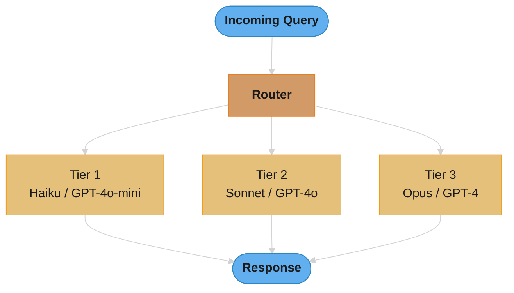
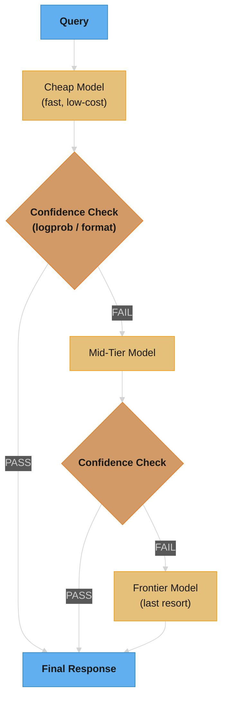
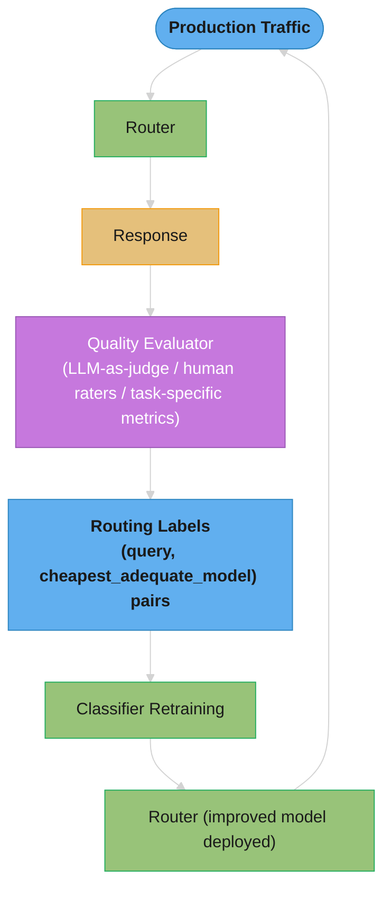
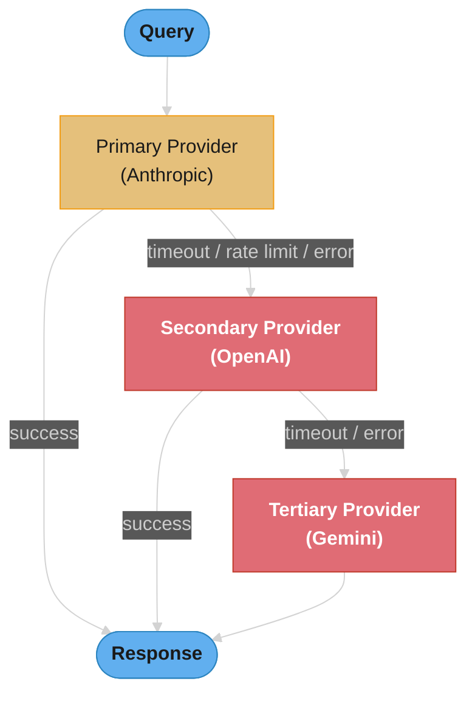
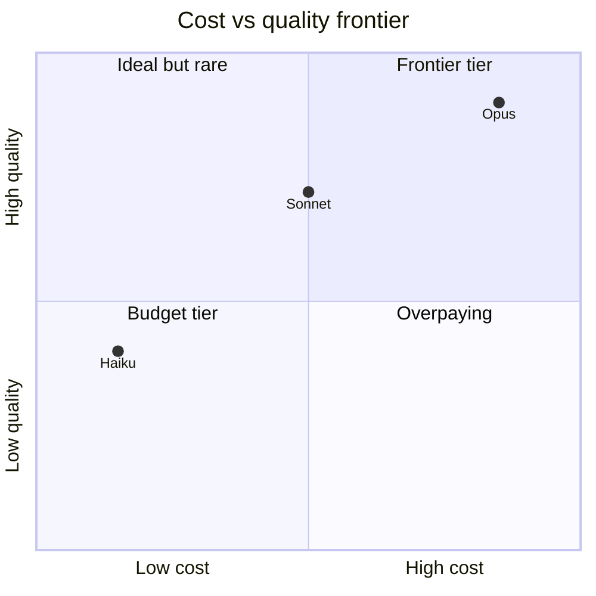
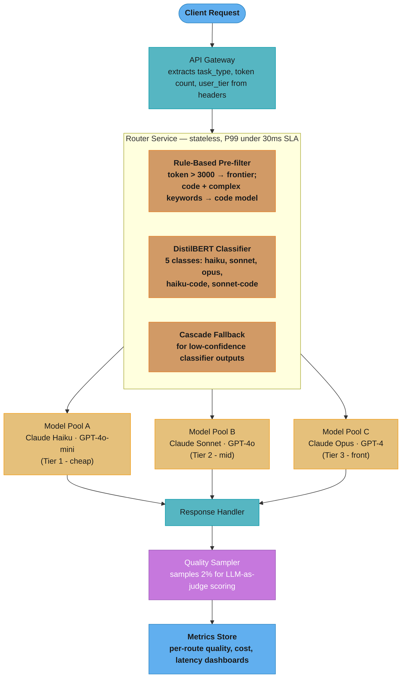

# LLM Routing and Model Selection

---

## 1. Concept Overview

LLM routing systems dynamically select the optimal model for each incoming query, optimizing the quality-cost-latency tradeoff at inference time. Instead of forwarding every request to the most capable and expensive frontier model, a router analyzes query characteristics — complexity, domain, expected output format, required reasoning depth — and routes to the cheapest model that can handle it adequately.

In production workloads, routing can reduce LLM inference costs by 50–80% with minimal measurable quality degradation. The core insight is that model capability is a spectrum and query difficulty is a distribution — most queries in real workloads sit well below the ceiling of frontier models.

Routing approaches fall into four main families:

- **Rule-based routing**: token count thresholds, keyword matching, task-type tagging
- **Classifier-based routing**: a lightweight model (fine-tuned DistilBERT, logistic regression) predicts the best target model from query features
- **Cascade routing**: send to the cheapest model first; escalate only if the response confidence is insufficient
- **Semantic routing**: embed the query, find the nearest cluster in embedding space, and route based on a cluster-to-model mapping

---

## 2. Intuition

**One-line analogy**: LLM routing is hospital triage — a nurse (router) assesses each patient (query) and sends them to the appropriate level of care (model tier), so expensive specialists handle only the cases that genuinely need them.

**Mental model**: Think of model capability as a ladder. Every rung costs more than the one below it. The router's job is to find the lowest rung that still gets the patient safely discharged.

**Why it matters**: Frontier models (GPT-4o, Claude Sonnet, Gemini Ultra) cost 10–50x more per token than small models (GPT-4o-mini, Claude Haiku, Gemini Flash). At 10M queries/day, routing the bottom 70% of queries to cheap models saves millions of dollars per year with no user-visible quality drop.

**Key insight**: Empirical studies (RouteLLM, Martian, Unify) consistently show that 70–80% of production queries can be handled by small/cheap models. Only 20–30% require frontier models. The challenge is classifying queries accurately before spending tokens on the expensive model.

---

## 3. Core Principles

**Query complexity varies enormously in production workloads.** A customer-support chatbot receives everything from "What are your business hours?" to "Explain why my API integration returns a 401 despite a valid token." These require radically different model capabilities.

**Model quality follows diminishing returns above task requirements.** Sending a simple FAQ question to Claude Opus is not better than sending it to Claude Haiku — the marginal quality gain is zero while the cost is 10–20x higher. The cheapest adequate model wins.

**Routing decisions must be fast.** A router that adds 200ms of latency defeats the purpose for time-sensitive applications. Target under 50ms overhead for the routing decision itself.

**Quality monitoring is non-negotiable.** Routing errors (sending a complex query to a weak model) are invisible unless you actively measure output quality. Without monitoring, routing degrades silently.

**Fallback chains provide reliability.** Provider outages, rate limits, and context-length overflows happen. A routing layer with fallback logic (primary model fails → secondary model) improves overall system availability.

**Cost and quality are jointly optimizable.** Define a quality threshold per task type. Find the cheapest model that historically meets that threshold. Re-evaluate periodically as models and pricing change.

---

## 4. Types / Architectures / Strategies

### 4.1 Rule-Based Routing

Route based on deterministic features extracted from the query before any LLM call.

Common rules:
- **Token count**: queries under 200 tokens go to cheap model; over 2000 tokens go to frontier model
- **Keyword matching**: queries containing "code", "debug", "refactor" route to code-specialized model
- **Task-type tagging**: requests tagged `task=summarization` route to summarization-optimized model
- **System prompt metadata**: the application embeds routing hints in a header field

Strengths: zero latency overhead, fully deterministic, no training required.
Weaknesses: brittle — fails when query complexity does not correlate with surface features.

### 4.2 Classifier-Based Routing

A lightweight ML model trained on (query, best_model) pairs predicts the optimal model class.

Architecture:
- Input: query text (optionally concatenated with system prompt)
- Model: DistilBERT fine-tuned for multi-class classification, or a logistic regression over TF-IDF features
- Output: probability distribution over model tiers (e.g., [haiku: 0.72, sonnet: 0.21, opus: 0.07])
- Latency: 5–20ms for DistilBERT on CPU; sub-1ms for logistic regression

Training data collection: A/B test queries across models, collect human or LLM-as-judge quality scores, label each query with the cheapest model that met the quality threshold.

### 4.3 Cascade Routing

Send the query to the cheapest model. If the response passes a confidence/quality check, return it. Otherwise, escalate to the next tier and repeat.

```
Query → Cheap Model → Confidence Check → Pass? → Return Response
                                       → Fail? → Mid-Tier Model → Confidence Check → ...
                                                                  → Frontier Model → Return Response
```

Confidence checks:
- Token log-probabilities: if the model's average log-prob is below threshold, escalate
- Self-assessment: append "Rate your confidence on a scale of 1-5" to the prompt
- Format validation: structured output (JSON, code) failed schema validation → escalate
- Output length heuristics: response under 20 tokens for a query expecting detailed explanation → escalate

Key tradeoff: cascade pays the cheap model's latency even when the query should have gone directly to a frontier model. Useful when cheap model success rate is high (>70%).

### 4.4 Semantic Routing

Embed the query using a small embedding model, find the nearest cluster centroid in a pre-built index, and route based on the cluster's model assignment.

Steps:
1. Collect representative queries from each task type
2. Embed them with a small model (e.g., all-MiniLM-L6-v2, 384 dimensions)
3. Cluster into K groups using K-means
4. Assign each cluster to the cheapest adequate model for that cluster's task type
5. At runtime: embed incoming query, find nearest cluster (ANN lookup, <5ms), route accordingly

Useful when task types are semantically distinct (code vs. creative writing vs. factual Q&A) but not reliably signaled by keywords or metadata.

### 4.5 A/B Testing and Exploration Routing

Route a fraction of traffic to multiple models simultaneously. Compare quality metrics. Continuously tighten routing toward cheaper models as evidence accumulates.

Typically used as the data-collection phase for training classifier-based routers rather than as a permanent production strategy.

---

## 5. Architecture Diagrams

### Basic Router Architecture



### Cascade Pattern with Confidence Check



### Quality Feedback Loop (Router Improvement)



### Multi-Provider Fallback Chain



---

## 6. How It Works — Detailed Mechanics

### 6.1 Cascade Confidence Estimation

**Token log-probability method:**

Most inference APIs expose `logprobs` on output tokens. Compute the mean log-probability of the response. If below a threshold (e.g., -0.5 per token), the model is uncertain — escalate.

```python
import math

def mean_logprob(logprobs: list[float]) -> float:
    return sum(logprobs) / len(logprobs)

def should_escalate(response_logprobs: list[float], threshold: float = -0.5) -> bool:
    return mean_logprob(response_logprobs) < threshold
```

**Self-assessment method (prompt-based):**

Append a confidence elicitation to the prompt:

```
{original_prompt}

After answering, rate your confidence: LOW, MEDIUM, or HIGH.
Format: Answer: <answer>\nConfidence: <LOW|MEDIUM|HIGH>
```

Parse the `Confidence:` field. If `LOW`, escalate. This works even when logprobs are unavailable (e.g., some hosted APIs).

**Format validation method:**

If the task requires structured output (JSON, a Python function, a SQL query), validate the response against a schema. Schema validation failure is a strong signal that the model could not handle the task.

```python
import json

def validate_json_response(response: str, schema: dict) -> bool:
    try:
        parsed = json.loads(response)
        # run jsonschema.validate(parsed, schema)
        return True
    except (json.JSONDecodeError, ValidationError):
        return False
```

### 6.2 Classifier Router Training

**Data collection pipeline:**

```
1. Shadow mode: route all queries to both cheap and frontier models simultaneously
2. Score each response pair using LLM-as-judge or task-specific metric (BLEU, pass@1, etc.)
3. Label each query: cheapest model whose score >= quality_threshold
4. Accumulate (query_text, target_model_label) dataset
5. Minimum recommended dataset: 10,000 labeled examples per model tier
```

**Feature extraction:**

```python
features = {
    "token_count": len(tokenizer.encode(query)),
    "avg_word_length": mean(len(w) for w in query.split()),
    "contains_code_block": "```" in query,
    "question_count": query.count("?"),
    "has_numbered_list": bool(re.search(r'\d+\.', query)),
    "embedding": sentence_encoder.encode(query)  # 384-dim vector
}
```

**Model options:**

| Classifier | Latency (CPU) | Accuracy | Notes |
|---|---|---|---|
| Logistic regression on TF-IDF | <1ms | ~75% | Good baseline |
| DistilBERT fine-tuned | 5–15ms | ~85% | Best accuracy/latency tradeoff |
| Full BERT fine-tuned | 20–50ms | ~87% | Marginal gain over DistilBERT |
| GPT-4o-mini as router | 300–800ms | ~90% | Too slow; adds its own cost |

### 6.3 Cost-Quality Optimization

Define quality threshold Q_min per task type (e.g., ROUGE-L >= 0.7 for summarization, pass@1 >= 0.8 for code generation).

For each model tier, measure empirical quality on a representative test set. Select the cheapest model that meets Q_min.

**Concrete cost example (2025 pricing, approximate):**

```
Claude Haiku:   $0.25 / 1M input tokens,  $1.25 / 1M output tokens
Claude Sonnet:  $3.00 / 1M input tokens,  $15.00 / 1M output tokens
Claude Opus:    $15.00 / 1M input tokens, $75.00 / 1M output tokens

Workload: 10M queries/day, avg 500 input + 300 output tokens each
No routing (all Sonnet): 10M * (500*$3 + 300*$15) / 1M = $10M * (0.0015 + 0.0045) = $60,000/day
With routing (70% Haiku, 25% Sonnet, 5% Opus):
  Haiku:  7M * (500*$0.25 + 300*$1.25) / 1M  = 7M * $0.000500 = $3,500/day
  Sonnet: 2.5M * $0.006/query              = $15,000/day
  Opus:   0.5M * (500*$15 + 300*$75) / 1M  = 0.5M * $0.030 = $15,000/day
  Total:  ~$33,500/day
Savings: ~44% cost reduction
```

### 6.4 Semantic Router Implementation

```python
from sentence_transformers import SentenceTransformer
import numpy as np
from sklearn.cluster import KMeans

# Offline: build cluster index
encoder = SentenceTransformer("all-MiniLM-L6-v2")
seed_queries = load_representative_queries()         # list of strings
embeddings = encoder.encode(seed_queries)            # shape: (N, 384)
kmeans = KMeans(n_clusters=20, random_state=42)
kmeans.fit(embeddings)

# Assign each cluster to a model tier (manual or automated)
cluster_to_model = {
    0: "haiku",   # simple FAQ cluster
    1: "haiku",   # greeting/chitchat
    5: "sonnet",  # code debugging
    12: "opus",   # legal/medical reasoning
    # ...
}

# Runtime: route incoming query
def route(query: str) -> str:
    emb = encoder.encode([query])                    # shape: (1, 384)
    cluster = kmeans.predict(emb)[0]
    return cluster_to_model.get(cluster, "sonnet")   # default to mid-tier
```

### 6.5 Latency Budget Management

Routing adds overhead. Keep it within the latency budget:

```
Total allowed latency:          500ms  (P99 SLA)
Model inference (Haiku):        150ms
Model inference (Sonnet):       400ms
Router decision budget:         < 50ms
Network + serialization:        20ms

Rule-based router:              ~1ms   (deterministic checks)
Logistic regression router:     ~1ms
DistilBERT router:              ~15ms  (GPU); ~50ms (CPU)
Cascade (cheap model fails):    150ms + routing + 400ms = ~570ms  --> exceeds SLA
  --> Solution: set cascade timeout, skip cheap model for known-complex queries
```

---

## 7. Real-World Examples

### Martian (Y Combinator W23)

Martian is a commercial LLM routing service. It trains its own router model from aggregated usage data across thousands of customer workloads. Customers send queries to Martian's API; Martian selects the optimal model from a portfolio (OpenAI, Anthropic, Mistral, Cohere). Claims 40–60% cost reduction with <2% quality degradation on customer benchmarks.

### Unify AI

Unify provides a unified API across 50+ models and providers. Adds a routing layer that optimizes on user-defined objectives (minimize cost, minimize latency, maximize quality). Supports custom quality thresholds per endpoint. Routes dynamically based on real-time provider performance and pricing.

### OpenRouter

OpenRouter is a model marketplace that exposes a unified `/chat/completions` endpoint routing to 200+ models. Pricing is transparent; users can set fallback model lists. Primary use case is cost optimization and provider redundancy, not query-complexity-based routing.

### LiteLLM

Open-source library providing a unified interface over 100+ LLM providers. Supports load balancing, fallback chains, cost tracking, and retry logic. Used to build custom routing layers. Not a router by itself, but the infrastructure layer that custom routers are built on. See [LiteLLM Routing](../agentic_frameworks/litellm_routing.md) for a deep dive on its router strategies and fallback configuration.

### Anthropic Model Tiers

Anthropic's own product line (Haiku → Sonnet → Opus) is designed with routing in mind. Haiku handles simple tasks at low cost; Sonnet balances quality and cost; Opus handles the most complex tasks. The intent is that product teams route based on task type rather than always using the most capable model.

### Custom Enterprise Routers

Production companies (e.g., Notion, Intercom, Slack AI) build internal routing layers. Common pattern: rule-based pre-filter (token count, task tag) → DistilBERT classifier → cascade fallback for edge cases. Quality monitoring via LLM-as-judge on sampled outputs. Router retrained monthly on accumulated labeled data.

---

## 8. Tradeoffs

### Routing Strategy Comparison

| Strategy | Routing Accuracy | Latency Overhead | Implementation Complexity | Cost Savings | Best For |
|---|---|---|---|---|---|
| Rule-based | Low–Medium (70–80%) | Negligible (<1ms) | Low | Medium (30–50%) | Simple task-type separation |
| Classifier (logistic) | Medium (75%) | Negligible (<1ms) | Medium | Medium (40–55%) | High-traffic, latency-sensitive |
| Classifier (DistilBERT) | High (85%) | Low (5–20ms) | Medium | High (50–70%) | General-purpose routing |
| Cascade | High (87%) | High (+cheap model latency) | Medium | High (50–75%) | When cheap model success rate >70% |
| Semantic routing | Medium (80%) | Low (5–15ms) | Medium | Medium–High (45–65%) | Semantically distinct task types |
| LLM-as-router | Very High (90%) | Very High (300–800ms) | Low | Low (net loss possible) | Quality benchmarking only |

### Cost vs. Quality Frontier



The three tiers form a Pareto frontier along the diagonal. Routing goal: operate near the frontier, selecting the leftmost (cheapest) model that meets the quality threshold per task — any query served from the bottom-right of its adequate tier is pure overpayment.

### Cascade vs. Classifier

| Dimension | Cascade | Classifier |
|---|---|---|
| Latency on easy queries | Low (cheap model only) | Low (classifier + cheap model) |
| Latency on hard queries | High (cheap + escalation) | Low (routes directly to right tier) |
| Training data required | No | Yes (labeled pairs needed) |
| Quality on ambiguous queries | High (frontier model used) | Medium (classifier may misroute) |
| Implementation | Simple | Moderate |

---

## 9. When to Use / When NOT to Use

### When to Use LLM Routing

- **High-volume production workloads** (>100K queries/day) where inference cost is a line item in the budget
- **Mixed-complexity query distributions** — customer support, general-purpose assistants, coding tools all receive queries spanning simple to complex
- **Latency-tier requirements** — some users on a free tier can tolerate slower, cheaper models while paid users get faster, better models
- **Multi-provider architectures** — routing provides failover and avoids single-provider lock-in
- **Cost-optimization mandates** — when engineering leadership must reduce AI spend without reducing quality SLAs

### When NOT to Use LLM Routing

- **Low-volume or prototyping workloads** — routing adds operational complexity that is not justified below ~100K queries/day
- **Uniformly complex queries** — if your product only sends graduate-level reasoning tasks, all queries need the frontier model; routing adds overhead with no savings
- **Strict quality uniformity requirements** — some regulated domains (medical, legal) cannot accept quality variance across routes
- **When routing overhead exceeds savings** — for sub-100ms P99 SLA requirements, even a 15ms DistilBERT classifier may be unacceptable and rule-based routing is the only viable option
- **Single-provider contracts with committed spend** — enterprise agreements with volume discounts may make cross-provider routing economically neutral

---

## 10. Common Pitfalls

### Pitfall 1: Router Latency Negates Savings

A team deployed a DistilBERT router on CPU with 80ms P50 latency. Their cheap model (Haiku) had 120ms P50. The combined latency (200ms just for routing + cheap model) exceeded their P99 SLA for the fast-path use case. The router was removed. Lesson: benchmark the router in the production environment before deploying. Use GPU for DistilBERT or fall back to logistic regression if CPU latency is the constraint.

### Pitfall 2: Over-Routing to Cheap Models Degrades User Experience

A startup set an aggressive cost target (90% of queries to the cheapest model). The classifier was only 75% accurate. Net result: 15% of queries (1.5M/day) routed incorrectly to a weak model. User satisfaction scores dropped 12 points before the team noticed. The problem was caught only because they had a quality monitoring pipeline. Lesson: set the routing threshold conservatively (start with 50-60% to cheap models, expand gradually) and monitor quality per route segment.

### Pitfall 3: Not Monitoring Quality Per Route

The most common failure mode: a team deploys a router, sees costs drop, and assumes success. Six months later, a model update changes the cheap model's behavior, the classifier's accuracy degrades on new query patterns, and quality erodes silently. Lesson: implement per-route quality metrics (LLM-as-judge sampling, task-specific evals) and alert on regression.

### Pitfall 4: Cascade Latency Accumulates at the Tail

In a cascade setup, P50 latency looks great (70% of queries handled by cheap model at 120ms). But P99 latency is catastrophic: 30% of queries pay cheap model latency + escalation overhead + frontier model latency = 120ms + 30ms + 800ms = ~950ms. For applications with P99 SLAs, cascade routing requires a hard timeout: if the cheap model exceeds X ms, bypass the confidence check and escalate immediately.

### Pitfall 5: Training Classifier on Unrepresentative Data

A team trained their router on synthetic queries generated by GPT-4 to save labeling cost. The synthetic queries had different length distributions and vocabulary patterns compared to real user queries. The classifier underperformed 60% accuracy on production traffic vs. 88% on the synthetic test set. Lesson: always collect training data from actual production traffic, not synthetic proxies.

### Pitfall 6: Ignoring Model Deprecation

OpenAI deprecated `gpt-3.5-turbo-0613` with 30 days notice. Teams with hard-coded model names in their routing logic had to scramble to update routing tables, retrain classifiers (the replacement model had different behavior), and re-run quality benchmarks. Lesson: abstract model names behind configuration, not code. Build model deprecation handling into the router's operational runbook.

### Pitfall 7: Not Accounting for Context Length in Routing

A team's rule-based router sent all short queries (<500 tokens) to the cheap model. They did not account for system prompt length. A feature added a 2,000-token system prompt. Queries that appeared short were now 2,500+ tokens total, exceeding the cheap model's context window. Lesson: route on total token count (system prompt + conversation history + query), not just the user message length.

---

## 11. Technologies & Tools

| Tool / Service | Type | Key Feature | Cost Model | Best For |
|---|---|---|---|---|
| Martian | Managed SaaS | Trained router, cross-provider | Per-token premium | Teams wanting zero-ops routing |
| Unify AI | Managed SaaS | 50+ providers, custom objectives | Per-token premium | Multi-provider optimization |
| OpenRouter | API marketplace | 200+ models, fallback lists | Per-token (pass-through) | Provider redundancy |
| LiteLLM | Open-source library | Unified API, fallbacks, cost tracking | Free (self-hosted) | Custom routing infrastructure |
| RouteLLM | Open-source | Trained cascade routers, benchmarks | Free (self-hosted) | Research-grade cascade routing |
| Portkey | Managed SaaS | Gateway, routing, observability | Per-request fee | Observability + routing combo |
| Custom DistilBERT | DIY | Full control, lowest latency | Engineering time | High-volume, latency-sensitive |
| AWS Bedrock Routing | Managed | Intelligent routing across Bedrock models | Per-token premium | AWS-native deployments |

### Supporting Infrastructure

- **Embedding models for semantic routing**: `all-MiniLM-L6-v2` (384-dim, 14M params, 5ms CPU), `bge-small-en-v1.5` (512-dim, 33M params)
- **Vector stores for cluster lookup**: FAISS (in-process), Redis with vector search (distributed)
- **Quality evaluation**: `prometheus-eval`, `mt-bench`, custom LLM-as-judge pipelines
- **Cost tracking**: LiteLLM's built-in spend tracking, Langfuse, custom token-count logging; for cascading and budgets inside agent loops see [Agent Cost & Token Budgets](../agents_and_tool_use/agent_cost_and_token_budget.md)

---

## 12. Interview Questions with Answers

**What is LLM routing and why does it matter in production?**
LLM routing is a system that dynamically selects the optimal model for each query based on its complexity, task type, and quality requirements. It matters because frontier models cost 10–50x more per token than small models, yet 70–80% of production queries are simple enough for cheap models to handle adequately. Routing can reduce inference costs by 50–80% with minimal quality degradation at scale.

**What is the difference between cascade routing and classifier-based routing?**
Cascade routing sends the query to the cheapest model first and escalates only if a confidence check fails; the routing decision happens after seeing the cheap model's output. Classifier-based routing makes the routing decision before any model call, using a lightweight classifier trained on query features to predict the best target model. Cascade routing has higher accuracy for ambiguous queries but accumulates latency at the tail (P99); classifier routing has lower and more predictable latency but requires labeled training data and may misroute edge cases.

**Why is using an LLM as the router usually a net loss, even though it is the most accurate option?**
Because the router's overhead is paid on 100% of traffic while savings only materialize on correctly down-routed queries. An LLM router (e.g., GPT-4o-mini classifying each query) reaches ~90% routing accuracy but adds 300–800ms of latency and its own token cost to every request — including the 70–80% of queries a <1ms rule or a 5–15ms DistilBERT classifier would have routed identically. At 10M queries/day, even a fraction of a cent of router cost per query adds thousands of dollars daily before any inference savings, and the latency alone can blow a sub-second SLA. Use LLM-based routing offline — to label training data for a cheap classifier — never in the request path.

**A cascade's cheap model passes the logprob confidence check but the answer is factually wrong — why, and what do you do about it?**
Token log-probabilities measure the model's fluency-level certainty about its wording, not the correctness of the claim — hallucinated answers are routinely emitted with high confidence, so a mean-logprob threshold (e.g., -0.5) happily passes a confidently wrong response. This is the cascade's structural blind spot: escalation triggers on hesitation, not on error. Mitigate with task-grounded checks wherever they exist — JSON schema validation for structured output, compilation or unit-test execution for code, retrieval-grounding checks for factual Q&A — and backstop with per-route LLM-as-judge sampling (1–5% of responses) so confidently-wrong patterns surface in quality dashboards rather than only in user complaints.

**How do you estimate confidence in a cascade routing system when logprobs are not available?**
Three approaches work without logprobs. First, self-assessment prompting: append "Rate your confidence as LOW, MEDIUM, or HIGH" to the prompt and parse the label. Second, format validation: for structured-output tasks, validate the response against a JSON schema or regex pattern — a parse failure signals low confidence. Third, output heuristics: responses that are far shorter than expected, contain hedge phrases like "I'm not sure," or fail to answer the question structure (missing required sections) trigger escalation. Self-assessment is the most general but adds tokens to every cheap-model call.

**How do you collect training data for a routing classifier?**
Run in shadow mode: send every query to both cheap and frontier models simultaneously, score each response pair using LLM-as-judge or task-specific metrics (ROUGE, pass@1, human eval), and label each query with the cheapest model whose score meets the quality threshold. Collect at least 10,000 labeled examples per model tier for reliable classifier performance. Critically, collect data from real production traffic — synthetic data causes distribution mismatch and classifier underperformance in production.

**How would you handle model deprecation in a routing system?**
Abstract model identifiers behind a configuration layer so that deprecations are configuration changes, not code changes. Maintain a model registry mapping logical tier names (tier-cheap, tier-mid, tier-frontier) to concrete model identifiers. When a deprecation notice arrives, update the registry, run quality benchmarks on the replacement model, re-evaluate routing thresholds, and retrain the classifier if the replacement model's behavioral characteristics differ meaningfully from its predecessor.

**What quality metrics do you use to evaluate a routing system?**
At the system level: average response quality score (LLM-as-judge, 1–10 scale), per-route quality breakdown, misroute rate (queries sent to wrong tier), and cost per query. At the application level: task-specific metrics (ROUGE for summarization, pass@1 for code, F1 for extraction). For user-facing quality: CSAT, thumbs up/down rate segmented by routed model tier. Alert on routing-tier quality regression exceeding 5% relative to the no-routing baseline.

**How do you set cost-quality optimization thresholds for routing?**
Define a minimum acceptable quality score Q_min per task type based on business requirements (e.g., code generation requires pass@1 >= 0.80; FAQ answering requires accuracy >= 0.90). Sample each task type from the validation set and measure quality for each model tier. Select the cheapest model whose empirical quality meets Q_min. Re-evaluate quarterly because model updates, pricing changes, and query distribution drift all shift the optimal threshold.

**How do you handle latency budgets in a routing system?**
Map out the full latency budget: total P99 SLA minus network overhead minus model inference time leaves the router's allowed overhead. A 500ms P99 SLA with 150ms for cheap model inference and 20ms for network leaves 330ms for the router — enough for DistilBERT. A 200ms SLA may leave only 30ms, forcing a logistic regression or rule-based router. For cascade routing, enforce a hard timeout on the cheap model response: if the cheap model has not responded within N milliseconds, skip the confidence check and route to the frontier model directly to bound tail latency.

**How does semantic routing differ from classifier-based routing and when would you use it?**
Semantic routing clusters queries by embedding similarity and assigns each cluster to a model tier; it is unsupervised and does not require labeled training data. Classifier-based routing is supervised and learns discriminative features from labeled (query, model) pairs. Use semantic routing when you have semantically distinct task types (code, creative writing, factual Q&A) but lack labeled data or when you need to add a new task type without retraining a classifier. Classifier-based routing achieves higher accuracy when sufficient labeled data is available because it directly optimizes the routing decision.

**How do you implement multi-provider fallback and what are the failure modes to handle?**
Implement a fallback chain: primary provider → secondary provider → tertiary provider. Failure modes to handle: HTTP 429 (rate limit — retry with exponential backoff on the same provider before falling back), HTTP 503/504 (service outage — fall back immediately), context length exceeded (route to a model with a larger context window), response timeout (fall back after a deadline), and content policy rejection (fall back or return a safe default response). Track per-provider error rates and circuit-break a provider that exceeds a threshold (e.g., >10% error rate in a 60-second window) before falling back.

**How do you prevent a routing system from degrading silently over time?**
Implement three monitoring layers. First, per-route quality sampling: randomly sample 1–5% of responses per routing tier and score them with LLM-as-judge daily; alert if quality drops more than 5% relative to the baseline. Second, classifier drift detection: monitor the distribution of routing decisions (fraction going to each tier) and alert if it shifts significantly, which indicates either query distribution drift or classifier degradation. Third, A/B shadow mode: periodically route a small fraction of queries to a higher tier and compare quality scores to confirm the router is not under-routing.

**How does routing accuracy translate into end-user quality impact?**
Only downward misroutes hurt quality: an 85%-accurate classifier misroutes 15% of queries, but misroutes upward (simple query sent to a frontier model) cost money without hurting quality, while misroutes downward (complex query sent to a cheap model) directly degrade responses. Approximate the quality impact as downward-misroute rate × the quality gap between tiers on those queries — at a 7.5% downward-misroute rate on 10M queries/day, 750K users per day see a degraded answer, which is how the Pitfall-2 startup lost 12 satisfaction points running a 75%-accurate classifier at 90% cheap-routing. Report the routing confusion matrix per tier rather than a single accuracy number, and bias the classifier's decision threshold to trade extra upward misroutes (bounded cost) for fewer downward misroutes (unbounded quality risk).

**What is the RouteLLM project and what does it contribute to the routing field?**
RouteLLM is an open-source project from LMSYS that provides trained cascade routers and standardized benchmarks for evaluating routing accuracy. It introduces the concept of a routing preference dataset where human raters indicate which model tier is needed for a given query. Its main contribution is providing pre-trained routers (including a BERT-based classifier and a matrix factorization router) that teams can use without collecting their own labeled data, and a benchmark (based on Chatbot Arena data) for comparing routing strategies on cost-quality tradeoffs.

---

## 13. Best Practices

**Start with rule-based routing as the baseline.** Before building a classifier, implement simple rules: token count thresholds, task-type metadata, keyword signals. This establishes a cost-saving baseline with zero ML complexity and reveals which rules are insufficient — informing classifier feature design.

**Route on total context size, not user message size.** Always compute token counts over the full prompt (system prompt + conversation history + user message). System prompts can be 1,000–5,000 tokens and will overflow cheap models if not accounted for.

**Instrument routing decisions from day one.** Log every routing decision with: query hash, token count, selected model, response latency, confidence score, and (sampled) quality score. This data is essential for debugging, retraining, and auditing.

**Set conservative routing thresholds initially.** Start with 50–60% of traffic to cheap models. Expand to 70–80% only after validating quality metrics on the initial rollout. The risk of under-routing (sending too much to expensive models) is overspending; the risk of over-routing (sending too much to cheap models) is user-visible quality degradation.

**Implement per-task-type quality thresholds.** A single global quality threshold is too coarse. Code generation requires a higher threshold (a wrong answer is a bug) than creative writing (a mediocre answer is still acceptable). Define Q_min per task type and calibrate routing thresholds independently.

**Abstract model names behind a registry.** Never hard-code `gpt-4o`, `claude-3-5-sonnet-20241022`, or similar version strings in routing logic. Use logical names (`tier-cheap`, `tier-frontier`) mapped to concrete model IDs in configuration. This makes model upgrades and deprecations operational changes, not code changes.

**Retrain classifiers at least quarterly.** Query distributions drift as products evolve, new user segments arrive, and model behaviors change after provider updates. A classifier trained six months ago may be operating on stale assumptions.

**Circuit-break providers, not models.** Track error rates per provider. If a provider's error rate exceeds 10% in a rolling 60-second window, circuit-break it (stop routing there) and fall back to the next provider. Recover with a half-open probe after 30 seconds.

**Test routing logic with adversarial queries.** Deliberately craft queries that look simple (short, common words) but require deep reasoning, and queries that look complex (long, technical vocabulary) but have trivial answers. Measure classifier accuracy on these adversarial cases and include them in the training distribution.

**Document routing decisions for compliance.** In regulated industries, regulators may ask which model processed a given query and why. Log routing decisions with enough metadata to reconstruct the decision. Retain logs for the same period as request/response logs.

---

## 14. Case Study

### Design a Model Routing System for a SaaS Platform Handling 10M Queries/Day

**Problem Statement**

A B2B SaaS company offers three AI-powered product features: a customer support chatbot, a content generation tool (blog posts, email drafts), and an AI code assistant. Total query volume is 10M queries/day. The current architecture sends all queries to a single frontier model (Claude Sonnet), costing approximately $60,000/day. The engineering team is tasked with reducing LLM spend by at least 50% while maintaining current quality SLAs.

Query distribution:
- Customer support: 6M queries/day (60%) — mostly simple FAQ, status checks, policy lookups
- Content generation: 3M queries/day (30%) — creative writing, variable complexity
- Code assistance: 1M queries/day (10%) — high complexity, correctness-critical

**Architecture Overview**



The router service applies three strategies — a rule-based pre-filter, a DistilBERT classifier, and a cascade fallback for low-confidence outputs — and dispatches each query to one of three model pool tiers; every response funnels back through the handler into a 2% LLM-as-judge quality sample and per-route dashboards.

**Key Design Decisions**

Decision 1: Separate routing logic per task type.

Customer support uses rule-based routing as the primary strategy because query complexity correlates strongly with token count and keyword signals ("escalate," "billing dispute," "refund"). 80% of customer support queries are routed by rules alone with no ML overhead.

Content generation uses the DistilBERT classifier because complexity does not correlate with surface features — a 50-word prompt for a "write a technical whitepaper" task needs the frontier model while a 300-word prompt for "make this paragraph friendlier" needs only the cheap model.

Code assistance uses cascade routing with format validation as the confidence check — if the response does not compile or fails a regex check for valid function structure, escalate.

Decision 2: User tier as a routing signal.

Free-tier users are routed to Tier 1 by default with escalation only on cascade failure. Paid-tier users are routed to Tier 2 by default. Enterprise users have access to Tier 3 for all requests. This both controls cost and delivers a differentiated quality experience that supports the pricing model.

Decision 3: Hard timeout on cascade path.

Cascade path for code assistance: Haiku with 200ms timeout. If Haiku does not respond in 200ms, route directly to Sonnet (do not wait for Haiku response). This bounds P99 latency at 200ms + Sonnet latency (~400ms) = 600ms, within the 800ms P99 SLA.

Decision 4: Monthly classifier retraining.

Collect (query, cheapest_adequate_model) labels continuously via LLM-as-judge on sampled outputs. Retrain the DistilBERT classifier monthly on the accumulated dataset. A/B test the new classifier against the current one on 5% of traffic before full rollout.

**Routing Distribution (projected)**

```
Customer Support (6M/day):
  Rule-based -> Tier 1 (Haiku):    80%  = 4.8M queries
  Classifier -> Tier 2 (Sonnet):   18%  = 1.08M queries
  Cascade escalation -> Tier 3:     2%  = 0.12M queries

Content Generation (3M/day):
  Classifier -> Tier 1 (Haiku):    55%  = 1.65M queries
  Classifier -> Tier 2 (Sonnet):   40%  = 1.20M queries
  Classifier -> Tier 3 (Opus):      5%  = 0.15M queries

Code Assistance (1M/day):
  Cascade Tier 1 (Haiku, passes): 40%  = 0.40M queries
  Cascade escalates to Tier 2:    50%  = 0.50M queries
  Cascade escalates to Tier 3:    10%  = 0.10M queries
```

**Cost Projection (approximate, 2025 pricing)**

```
Tier 1 (Haiku):  (4.8M + 1.65M + 0.40M) = 6.85M queries @ ~$0.00050/query = $3,425/day
Tier 2 (Sonnet): (1.08M + 1.20M + 0.50M) = 2.78M queries @ ~$0.00600/query = $16,680/day
Tier 3 (Opus):   (0.12M + 0.15M + 0.10M) = 0.37M queries @ ~$0.03000/query = $11,100/day
Total:           ~$31,205/day

Baseline (all Sonnet): 10M * $0.006 = $60,000/day
Savings: ~$28,795/day (~48% reduction)
```

**Quality Monitoring Implementation**

Sample 2% of responses per routing tier per task type (approximately 200K evaluations/day). Use Claude Haiku itself as the LLM-as-judge for cost efficiency (self-evaluation is acceptable for relative quality comparison). Score on a 1–5 scale. Alert pipeline:

```
IF avg_quality_score[tier=1, task=code_assistance] < 3.5 for 15-minute window:
    page on-call engineer
    automatically increase cascade threshold (route more to Tier 2)

IF avg_quality_score[tier=2, task=content_generation] < 4.0 for 30-minute window:
    investigate model provider issues
    consider routing to backup provider
```

**Fallback and Reliability**

Provider fallback chain per tier:

```
Tier 1: Claude Haiku (primary) -> GPT-4o-mini (secondary) -> Gemini Flash (tertiary)
Tier 2: Claude Sonnet (primary) -> GPT-4o (secondary) -> Gemini Pro (tertiary)
Tier 3: Claude Opus (primary) -> GPT-4 (secondary)
```

Circuit breaker: trip when error rate > 5% over 30 seconds. Half-open after 60 seconds. Log provider-level availability metrics to SRE dashboard.

**Interview Discussion Points**

The 48% cost reduction is below the theoretical 50–80% range because the code assistance workload is inherently high-complexity and resists cheap-model routing. Real-world savings depend heavily on workload composition. The team should track actual savings weekly and recalibrate routing thresholds as the DistilBERT classifier improves with more labeled data. The key risk is quality regression in the code assistance path — code errors have high user impact (bugs in production code), so the cascade confidence threshold should be tuned conservatively and monitored daily.

---

**Additional war story — Cascade routing confidence threshold set too low, sending 40% of complex queries to cheap model:**

A code assistance platform implemented cascade routing: a DistilBERT classifier scored queries 0-1 for complexity; queries with score < 0.6 routed to GPT-4o-mini, queries with score >= 0.6 routed to GPT-4o. The threshold was set based on a 200-sample dataset collected in week 1 of the product. After 3 months, the product expanded into more complex enterprise use cases. The original training set underrepresented complex queries, so the classifier's calibration was off — it scored "explain this 500-line async codebase" as 0.54 (below threshold) and routed it to GPT-4o-mini. User satisfaction for enterprise customers dropped 18% before the miscalibration was detected.

```python
# BROKEN: static threshold with no monitoring of routing distribution
class CascadeRouter:
    def __init__(self, classifier, threshold: float = 0.6):
        self.classifier = classifier
        self.threshold = threshold  # BUG: never recalibrated as query distribution shifts

    def route(self, query: str) -> str:
        score = self.classifier.predict_complexity(query)
        return "gpt-4o" if score >= self.threshold else "gpt-4o-mini"

# FIX: adaptive threshold with routing distribution monitoring + recalibration trigger
import statistics
from collections import deque

class AdaptiveCascadeRouter:
    def __init__(
        self,
        classifier,
        initial_threshold: float = 0.6,
        target_premium_rate: float = 0.35,  # expect 35% of queries to use premium model
        window_size: int = 10_000,
    ):
        self.classifier = classifier
        self.threshold = initial_threshold
        self.target_premium_rate = target_premium_rate
        self.score_window: deque[float] = deque(maxlen=window_size)

    def route(self, query: str) -> str:
        score = self.classifier.predict_complexity(query)
        self.score_window.append(score)
        self._maybe_recalibrate()
        return "gpt-4o" if score >= self.threshold else "gpt-4o-mini"

    def _maybe_recalibrate(self) -> None:
        if len(self.score_window) < 1000:
            return
        actual_premium_rate = sum(s >= self.threshold for s in self.score_window) / len(self.score_window)
        deviation = actual_premium_rate - self.target_premium_rate
        if abs(deviation) > 0.10:  # >10% drift triggers recalibration
            # Shift threshold to move distribution back toward target
            sorted_scores = sorted(self.score_window)
            new_threshold_idx = int(len(sorted_scores) * (1 - self.target_premium_rate))
            self.threshold = sorted_scores[new_threshold_idx]
            # Alert: significant threshold shift may indicate distribution shift
            if abs(self.threshold - 0.6) > 0.15:
                alert_oncall(f"Router threshold shifted to {self.threshold:.2f} — investigate query distribution")
```

**Additional interview Q&As:**

**What metrics should you monitor for a cascade routing system to detect when the classifier needs retraining?** Monitor: (1) routing distribution (% of queries routed to each tier) — a significant shift (>10% change over a week) indicates query distribution shift that may require classifier retraining; (2) quality score by tier — if quality scores for "cheap model" tier drop, the classifier is misrouting complex queries downward; (3) override rate — track cases where users requested to "use a better model" after a response, which is a direct signal of misrouting; (4) cost per quality point (total cost / aggregate quality score) — this should remain stable or decrease as routing improves. Set weekly automated retrain triggers based on routing distribution drift.

**How does circuit breaking integrate with cascade routing for model provider outages?** Add a circuit breaker per model tier: if the primary tier (GPT-4o) error rate exceeds 5% over 30 seconds, open the circuit breaker and route all traffic to the fallback tier (GPT-4o-mini or Claude Haiku) regardless of complexity score. Log a high-severity alert. The half-open state (after 60 seconds) routes 10% of traffic to the primary tier to test recovery. During circuit open state, set a `X-Degraded-Mode: true` response header so the client can show a "using backup model" indicator to users. This prevents a provider outage from causing total service failure at the cost of degraded quality for complex queries during the outage window.

**What is model canary routing and how does it differ from standard A/B testing for LLM model upgrades?** Standard A/B testing assigns users to model A or B based on a random split and runs for a fixed duration (typically 2 weeks for statistical significance). Model canary routing sends a small percentage of live traffic (1-5%) to the new model version while keeping 95-99% on the current version, with automatic rollback if quality metrics degrade. The key difference: canary routing uses the same users on both models (interleaved, not split), which eliminates user-segment confounds; and it has an automated rollback gate that A/B testing lacks. Use canary routing for production model upgrades where rollback speed matters; use A/B testing for measuring business impact of a model change where statistical rigor and segment isolation are required.

**Quick-reference table:**

| Strategy | Cost savings | Quality risk | Recalibration needs |
|---|---|---|---|
| Static threshold cascade (0.6) | 40-50% | High if query distribution shifts | Quarterly manual review |
| Adaptive threshold cascade | 35-45% | Low — self-correcting | Automated via routing distribution monitor |
| Semantic classifier (intent-based) | 50-60% | Medium — intent ≠ complexity | Monthly retraining on new labeled examples |
| Token budget cascade (input length proxy) | 30% | Low — length correlates with complexity | No retraining; but misses complex short queries |
