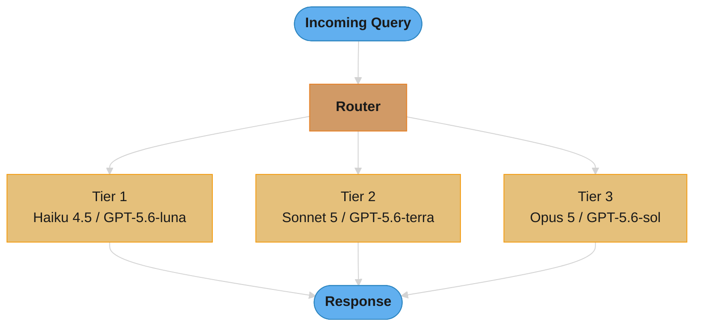
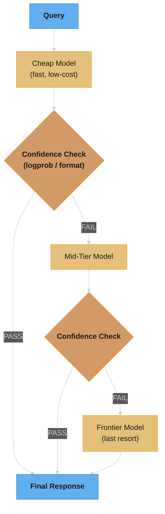
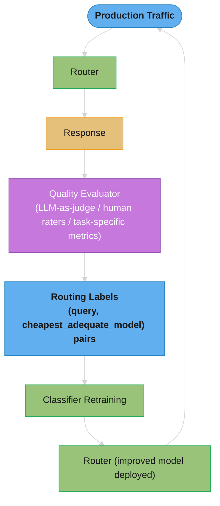
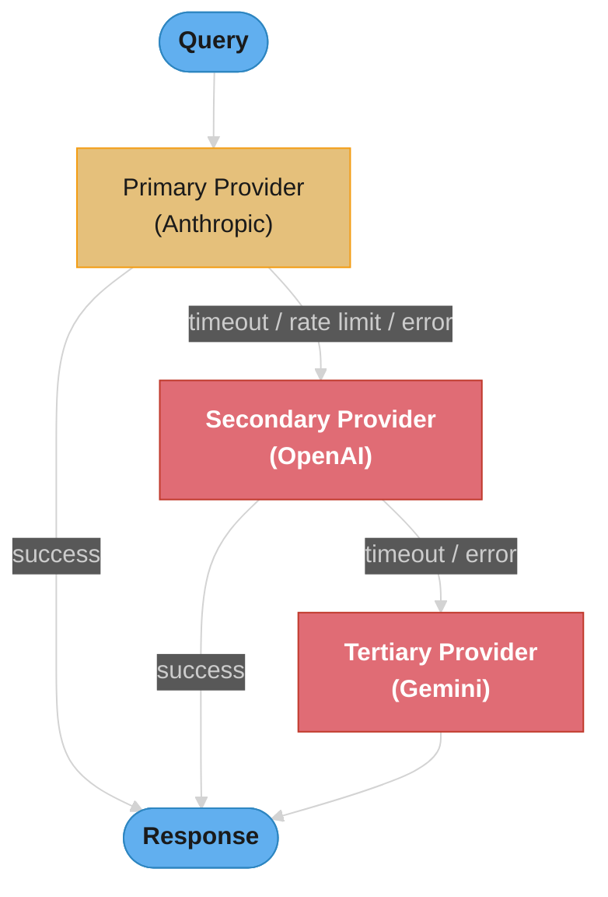
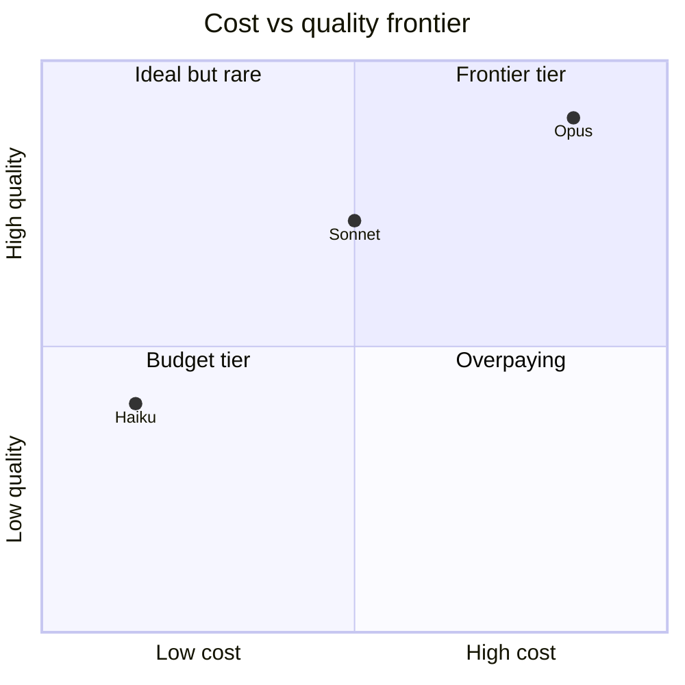
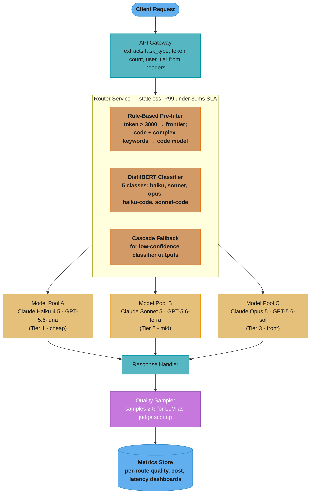

# LLM Routing and Model Selection

---

## 1. Concept Overview

LLM routing systems dynamically select the optimal model for each incoming query, optimizing the quality-cost-latency tradeoff at inference time. Instead of forwarding every request to the most capable and expensive frontier model, a router analyzes query characteristics — complexity, domain, expected output format, required reasoning depth — and routes to the cheapest model that can handle it adequately.

How much routing saves depends entirely on the workload. LMSYS's RouteLLM paper reports cost-saving ratios of 3.66x on MT Bench at 95% of GPT-4 quality, but only 1.41x on MMLU (at 92%) and 1.49x on GSM8K (at 87%) — a 73% saving on a chat-style distribution collapses to roughly 30% on a uniformly hard benchmark. The core insight is that model capability is a spectrum and query difficulty is a distribution — the savings are large exactly when most queries sit well below the ceiling of frontier models, and near zero when they do not.

Routing approaches fall into four main families:

- **Rule-based routing**: token count thresholds, keyword matching, task-type tagging
- **Classifier-based routing**: a lightweight model (fine-tuned DistilBERT, logistic regression) predicts the best target model from query features
- **Cascade routing**: send to the cheapest model first; escalate only if the response confidence is insufficient
- **Semantic routing**: embed the query, find the nearest cluster in embedding space, and route based on a cluster-to-model mapping

---

## 2. Intuition

**One-line analogy**: LLM routing is hospital triage — a nurse (router) assesses each patient (query) and sends them to the appropriate level of care (model tier), so expensive specialists handle only the cases that genuinely need them.

**Mental model**: Think of model capability as a ladder. Every rung costs more than the one below it. The router's job is to find the lowest rung that still gets the patient safely discharged.

**Why it matters**: Frontier models cost more per token than small models, though by less than the folklore suggests as of July 2026 — Claude Opus 5 ($5/$25 per MTok) is 5x Claude Haiku 4.5 ($1/$5), and GPT-5.6-sol ($5/$30) is 5x GPT-5.6-luna ($1/$6). Reach down a generation to a nano tier and the ratio widens sharply: GPT-5.4-nano at $0.20/$1.25 sits 25x below Opus 5 on input and 20x on output, and Gemini 2.5 Flash-Lite at $0.10/$0.40 sits 50x below on input and 60x on output. At 10M queries/day, routing the bottom 70% of queries to cheap models still saves millions of dollars per year with no user-visible quality drop.

**Key insight**: Query difficulty is long-tailed, so a large share of traffic does not need the frontier model — RouteLLM's 3.66x cost saving at 95% of GPT-4 quality on MT Bench is only achievable if most of that benchmark's queries were answerable by the weak model. But the share is workload-specific: the same routers save only 1.41x on MMLU. Measure the share on your own traffic rather than importing a "70–80%" figure. The challenge is classifying queries accurately before spending tokens on the expensive model.

---

## 3. Core Principles

**Query complexity varies enormously in production workloads.** A customer-support chatbot receives everything from "What are your business hours?" to "Explain why my API integration returns a 401 despite a valid token." These require radically different model capabilities.

**Model quality follows diminishing returns above task requirements.** Sending a simple FAQ question to Claude Opus 5 is not better than sending it to Claude Haiku 4.5 — the marginal quality gain is zero while the cost is 5x higher ($5/$25 vs $1/$5 per MTok, July 2026 list prices). The cheapest adequate model wins.

**Routing decisions must be fast.** A router that adds 200ms of latency defeats the purpose for time-sensitive applications. Target under 50ms overhead for the routing decision itself.

**Quality monitoring is non-negotiable.** Routing errors (sending a complex query to a weak model) are invisible unless you actively measure output quality. Without monitoring, routing degrades silently.

**Fallback chains provide reliability.** Provider outages, rate limits, and context-length overflows happen. A routing layer with fallback logic (primary model fails → secondary model) improves overall system availability.

**Cost and quality are jointly optimizable.** Define a quality threshold per task type. Find the cheapest model that historically meets that threshold. Re-evaluate periodically as models and pricing change.

---

## 4. Types / Architectures / Strategies

### 4.1 Rule-Based Routing

Route based on deterministic features extracted from the query before any LLM call.

Common rules:
- **Token count**: queries under 200 tokens go to cheap model; over 2000 tokens go to frontier model
- **Keyword matching**: queries containing "code", "debug", "refactor" route to code-specialized model
- **Task-type tagging**: requests tagged `task=summarization` route to summarization-optimized model
- **System prompt metadata**: the application embeds routing hints in a header field

Strengths: zero latency overhead, fully deterministic, no training required.
Weaknesses: brittle — fails when query complexity does not correlate with surface features.

### 4.2 Classifier-Based Routing

A lightweight ML model trained on (query, best_model) pairs predicts the optimal model class.

Architecture:
- Input: query text (optionally concatenated with system prompt)
- Model: DistilBERT fine-tuned for multi-class classification, or a logistic regression over TF-IDF features
- Output: probability distribution over model tiers (e.g., [haiku: 0.72, sonnet: 0.21, opus: 0.07])
- Latency: 5–20ms for DistilBERT on CPU with a quantized ONNX-style runtime (an unoptimized fp32 PyTorch deployment is several times slower — Section 6.5 budgets ~50ms for that case); sub-1ms for logistic regression

Training data collection: A/B test queries across models, collect human or LLM-as-judge quality scores, label each query with the cheapest model that met the quality threshold.

### 4.3 Cascade Routing

Send the query to the cheapest model. If the response passes a confidence/quality check, return it. Otherwise, escalate to the next tier and repeat.

```
Query → Cheap Model → Confidence Check → Pass? → Return Response
                                       → Fail? → Mid-Tier Model → Confidence Check → ...
                                                                  → Frontier Model → Return Response
```

Confidence checks:
- Token log-probabilities: if the model's average log-prob is below threshold, escalate
- Self-assessment: append "Rate your confidence on a scale of 1-5" to the prompt
- Format validation: structured output (JSON, code) failed schema validation → escalate
- Output length heuristics: response under 20 tokens for a query expecting detailed explanation → escalate

Key tradeoff: cascade pays the cheap model's latency even when the query should have gone directly to a frontier model. Useful when cheap model success rate is high (>70%).

### 4.4 Semantic Routing

Embed the query using a small embedding model, find the nearest cluster centroid in a pre-built index, and route based on the cluster's model assignment.

Steps:
1. Collect representative queries from each task type
2. Embed them with a small model (e.g., all-MiniLM-L6-v2, 384 dimensions)
3. Cluster into K groups using K-means
4. Assign each cluster to the cheapest adequate model for that cluster's task type
5. At runtime: embed incoming query, find nearest cluster (ANN lookup, <5ms), route accordingly

Useful when task types are semantically distinct (code vs. creative writing vs. factual Q&A) but not reliably signaled by keywords or metadata.

### 4.5 A/B Testing and Exploration Routing

Route a fraction of traffic to multiple models simultaneously. Compare quality metrics. Continuously tighten routing toward cheaper models as evidence accumulates.

Typically used as the data-collection phase for training classifier-based routers rather than as a permanent production strategy.

---

## 5. Architecture Diagrams

### Basic Router Architecture



### Cascade Pattern with Confidence Check



### Quality Feedback Loop (Router Improvement)



### Multi-Provider Fallback Chain



---

## 6. How It Works — Detailed Mechanics

### 6.1 Cascade Confidence Estimation

**Token log-probability method:**

Most inference APIs expose `logprobs` on output tokens. Compute the mean log-probability of the response. If below a threshold (e.g., -0.5 per token), the model is uncertain — escalate.

```python
import math

def mean_logprob(logprobs: list[float]) -> float:
    return sum(logprobs) / len(logprobs)

def should_escalate(response_logprobs: list[float], threshold: float = -0.5) -> bool:
    return mean_logprob(response_logprobs) < threshold
```

**The idea behind it.** "Average how surprised the model was at each word it chose; if it
was more surprised than your threshold allows, do not trust the answer — pay for a bigger model."

The framing to hold onto is that this measures hesitation, not correctness. It is a cheap proxy that
catches the model *fumbling*, which is a real and common failure mode, but it is blind to the model
being fluently and confidently wrong.

| Symbol | What it is |
|--------|------------|
| `logprob` | Natural log of the probability the model assigned to the token it actually emitted. Always `<= 0`; `0` means certainty |
| `mean_logprob` | Sum of the token log-probs divided by token count. Length-normalized, so a long answer is not penalized for being long |
| `-0.5` | The escalation threshold. More negative = more surprised = escalate |
| `exp(x)` | Undoes the log. Converts a log-prob back into a plain probability so you can reason about it |
| `<` | Note the direction: escalate when the score falls *below* the threshold, because both are negative |

**Walk one example.** Two 5-token responses from the cheap model, threshold `-0.5`:

```
  response A -- fluent, the model knew what it wanted to say
    token logprobs      -0.05   -0.11   -0.02   -0.30   -0.07
    sum                 = -0.55
    mean                = -0.55 / 5   = -0.110
    exp(-0.110)         = 0.896       -> ~90% average per-token confidence
    is -0.110 < -0.50?  = NO          -> PASS, return the cheap answer

  response B -- hedging, the model was picking among many options
    token logprobs      -1.20   -0.85   -2.10   -0.40   -1.55
    sum                 = -6.10
    mean                = -6.10 / 5   = -1.220
    exp(-1.220)         = 0.295       -> ~30% average per-token confidence
    is -1.220 < -0.50?  = YES         -> FAIL, escalate to the next tier

  What the threshold means once you undo the log:
    exp(-0.5) = 0.607
    -> "escalate whenever average per-token confidence drops below ~61%"
```

That last line is how the threshold should be tuned. `-0.5` is not a meaningful dial; "61% average
per-token confidence" is, and it can be argued about with product owners.

**Why the mean and not the sum.** Using the raw sum would make every long answer look uncertain —
response A's `-0.55` over 5 tokens would become `-11.0` over 100 equally confident tokens and trip
any fixed threshold. Dividing by token count is what makes one threshold work across a 20-token
answer and a 2,000-token one. Drop the normalization and your cascade escalates on verbosity.

**Self-assessment method (prompt-based):**

Append a confidence elicitation to the prompt:

```
{original_prompt}

After answering, rate your confidence: LOW, MEDIUM, or HIGH.
Format: Answer: <answer>\nConfidence: <LOW|MEDIUM|HIGH>
```

Parse the `Confidence:` field. If `LOW`, escalate. This works even when logprobs are unavailable (e.g., some hosted APIs).

**Format validation method:**

If the task requires structured output (JSON, a Python function, a SQL query), validate the response against a schema. Schema validation failure is a strong signal that the model could not handle the task.

```python
import json
import jsonschema

def validate_json_response(response: str, schema: dict) -> bool:
    try:
        parsed = json.loads(response)
        jsonschema.validate(parsed, schema)
        return True
    except (json.JSONDecodeError, jsonschema.ValidationError):
        return False
```

### 6.2 Classifier Router Training

**Data collection pipeline:**

```
1. Shadow mode: route all queries to both cheap and frontier models simultaneously
2. Score each response pair using LLM-as-judge or task-specific metric (BLEU, pass@1, etc.)
3. Label each query: cheapest model whose score >= quality_threshold
4. Accumulate (query_text, target_model_label) dataset
5. Minimum recommended dataset: 10,000 labeled examples per model tier
```

**Feature extraction:**

```python
features = {
    "token_count": len(tokenizer.encode(query)),
    "avg_word_length": mean(len(w) for w in query.split()),
    "contains_code_block": "```" in query,
    "question_count": query.count("?"),
    "has_numbered_list": bool(re.search(r'\d+\.', query)),
    "embedding": sentence_encoder.encode(query)  # 384-dim vector
}
```

**Model options:**

Accuracy figures below are illustrative planning numbers for a three-tier routing task, not published benchmark results — measure them on your own labeled set.

| Classifier | Latency (CPU, quantized runtime) | Accuracy (illustrative) | Notes |
|---|---|---|---|
| Logistic regression on TF-IDF | <1ms | ~75% | Good baseline |
| DistilBERT fine-tuned | 5–15ms | ~85% | Best accuracy/latency tradeoff |
| Full BERT fine-tuned | 20–50ms | ~87% | Marginal gain over DistilBERT |
| Small hosted LLM as router (e.g. GPT-5.4-nano) | 300–800ms | ~90% | Too slow; adds its own cost |

### 6.3 Cost-Quality Optimization

Define quality threshold Q_min per task type (e.g., ROUGE-L >= 0.7 for summarization, pass@1 >= 0.8 for code generation).

For each model tier, measure empirical quality on a representative test set. Select the cheapest model that meets Q_min.

**Concrete cost example (Anthropic list prices, July 2026):**

```
Claude Haiku 4.5:  $1.00 / 1M input tokens,  $5.00 / 1M output tokens
Claude Sonnet 5:   $3.00 / 1M input tokens,  $15.00 / 1M output tokens
Claude Opus 5:     $5.00 / 1M input tokens,  $25.00 / 1M output tokens

Workload: 10M queries/day, avg 500 input + 300 output tokens each
No routing (all Sonnet 5): 10M * (500*$3 + 300*$15) / 1M = 10M * (0.0015 + 0.0045) = $60,000/day
With routing (70% Haiku, 25% Sonnet, 5% Opus):
  Haiku:  7M * (500*$1 + 300*$5) / 1M      = 7M * $0.00200   = $14,000/day
  Sonnet: 2.5M * $0.00600/query            = $15,000/day
  Opus:   0.5M * (500*$5 + 300*$25) / 1M   = 0.5M * $0.01000 = $5,000/day
  Total:  ~$34,000/day
Savings: ~43% cost reduction
```

Claude Sonnet 5 also carries introductory pricing of $2/$10 per MTok through 2026-08-31; the worked
arithmetic below uses the $3/$15 list rate, which is what the baseline reverts to afterwards.

**Stated plainly.** "Work out what one query costs at each tier, then multiply each of
those by the share of traffic that actually lands there and add them up — the routed bill is a
weighted sum, not an average of the price list."

The reason to lay it out this way rather than trust the 43% headline is that the weighted sum
immediately exposes where the money really goes, which is not always where the traffic goes.

| Symbol | What it is |
|--------|------------|
| `$1.00 / 1M` | A tier's unit price. Divide by 1,000,000 for the price of one token |
| `C_i` | Cost of one query at tier i: `(in_tok x r_in + out_tok x r_out) / 1M` |
| `w_i` | Fraction of traffic routed to tier i. The weights sum to 1.0 |
| `N` | Total query volume. `10M/day` here |
| `sum(w_i x N x C_i)` | The routed daily bill. The whole routing economics in one expression |
| baseline | `N x C_mid` — what you paid before routing, everything on one mid-tier model |

**Walk one example.** 10M queries/day, 500 input + 300 output tokens each:

```
Step 1 -- cost of ONE query at each tier:

  Haiku    input   500 x $1.00 / 1M  = $0.000500
           output  300 x $5.00 / 1M  = $0.001500
                                       ---------
                                       $0.00200 / query

  Sonnet   input   500 x $3.00 / 1M  = $0.001500
           output  300 x $15.00 / 1M = $0.004500
                                       ---------
                                       $0.00600 / query      (3x Haiku)

  Opus     input   500 x $5.00 / 1M  = $0.002500
           output  300 x $25.00 / 1M = $0.007500
                                       ---------
                                       $0.01000 / query      (5x Haiku)

Step 2 -- weight each by its traffic share and sum:

  tier     share    queries/day    x cost/query    daily cost    share of bill
  ------   -----    -----------    ------------    ----------    -------------
  Haiku     70%      7.00M          $0.00200       $14,000          41.2%
  Sonnet    25%      2.50M          $0.00600       $15,000          44.1%
  Opus       5%      0.50M          $0.01000       $ 5,000          14.7%
                                                   -------
  routed total                                     $34,000 / day

  baseline (all Sonnet)   10M x $0.00600         = $60,000 / day
  saving   = 1 - ($34,000 / $60,000)             = 43%

Step 3 -- the number the headline hides:

  70% of traffic (Haiku) still carries 41% of the bill, while 5% of
  traffic (Opus) carries only 15%. On the compressed 2026 price ladder
  -- 5x from Haiku to Opus, not the 60x of the 2024 lineup -- the bulk
  sets the bill, not the tail.
```

Step 3 is the actionable finding, and it reverses the advice that held on the old ladder. Shaving
the Opus share from 5% to 3% now saves only `$800/day` (0.2M queries x the `$0.00400` Opus-Sonnet
gap), while moving another 10 points of traffic from Sonnet down to Haiku saves `$4,000/day` (1M
queries x the same-sized `$0.00400` Sonnet-Haiku gap, on 5x the volume). Recompute which end of
your ladder pays before optimizing either — the answer changes every time a vendor reprices.

**Why the weights and not an average of the three prices.** Averaging `$0.00200`, `$0.00600` and
`$0.01000` gives `$0.0060/query` and a projected `$60,000/day` — identical to the *unrouted*
baseline, so the routing appears to save nothing. The weights are what make the calculation about
your traffic instead of the provider's catalogue.

**What the formula is telling you.** "A cascade always pays the cheap model, on every
single query, and then pays the expensive model again on the fraction it escalates — so the cheap
leg is a floor you can never get below, and the escalation rate is the only dial."

This differs structurally from classifier routing, where a query goes to exactly one model. In a
cascade the two costs stack on escalated queries, which is why the break-even escalation rate is the
number to check before choosing a cascade at all.

| Symbol | What it is |
|--------|------------|
| `P_esc` | Probability a query fails the confidence check and moves up a tier |
| `1 - P_esc` | Share handled by the cheap model alone. The cascade's success rate |
| `C_cheap` | Cost of one cheap-model call. Paid on 100% of queries, including escalated ones |
| `C_exp` | Cost of one expensive-model call. Paid only on the escalated share |
| `E[C]` | `C_cheap + P_esc x C_exp`. Average cost per query across the whole distribution |
| break-even `P_esc` | The `P_esc` at which `E[C]` equals just calling the expensive model directly |

**Walk one example.** Haiku `$0.00200` and Sonnet `$0.00600` from Step 1 above:

```
  E[C] = C_cheap + P_esc x C_exp
       = $0.00200 + P_esc x $0.00600

  P_esc    cheap leg     escalation leg                E[C]/query   vs all-Sonnet
  -----    ----------    --------------------------    ----------   -------------
    0%     $0.00200      0.00 x $0.00600 = $0.00000     $0.00200        -67%
   10%     $0.00200      0.10 x $0.00600 = $0.00060     $0.00260        -57%
   20%     $0.00200      0.20 x $0.00600 = $0.00120     $0.00320        -47%
   30%     $0.00200      0.30 x $0.00600 = $0.00180     $0.00380        -37%
   50%     $0.00200      0.50 x $0.00600 = $0.00300     $0.00500        -17%
   67%     $0.00200      0.67 x $0.00600 = $0.00400     $0.00600         +0%   <- break-even

  Break-even algebra:
    $0.00200 + P x $0.00600 = $0.00600
    P = ($0.00600 - $0.00200) / $0.00600 = 0.667  -> 67%

Why the break-even sits at 67% and not higher:

  at P_esc = 20%, the escalated fifth of traffic carries only 38% of
  the cascade's own bill ($0.00120 of $0.00320); the always-paid cheap
  leg is the other 62%. The total is 53% of the all-Sonnet price
  ($0.00320 / $0.00600 = 0.533).

  The gap between tiers is only 3x on the 2026 ladder, so the cheap
  leg is a real cost, not a rounding error -- it alone is a third of
  the all-Sonnet price before a single escalation. Savings decay
  linearly in P_esc and hit zero once P_esc passes 67%.
```

The practical reading: cascade savings degrade linearly, not catastrophically, when the confidence
check is badly calibrated. Doubling the escalation rate from 20% to 40% moves you from -47% to -27%
— worse, but still worth having. Compare that to the latency picture, where the same change is
catastrophic (Pitfall 4), and the tradeoff becomes clear: cascades fail gracefully on cost and
abruptly on tail latency. Note also that on this compressed ladder the cascade's floor (-67%,
reached only if nothing ever escalates) is barely better than classifier routing's, so the extra
latency has to earn its place.

**Why `C_cheap` sits outside the `P_esc` term.** It is tempting to write
`E[C] = (1 - P_esc) x C_cheap + P_esc x C_exp`, treating the two as alternatives. That is the
*classifier* formula, and using it for a cascade understates the true cost by `P_esc x C_cheap` —
the wasted cheap call on every escalated query. At `P_esc = 50%` that error is `$0.00100/query`,
`$10,000/day` at 10M queries, silently missing from the forecast.

### 6.4 Semantic Router Implementation

```python
from sentence_transformers import SentenceTransformer
import numpy as np
from sklearn.cluster import KMeans

# Offline: build cluster index
encoder = SentenceTransformer("all-MiniLM-L6-v2")
seed_queries = load_representative_queries()         # list of strings
embeddings = encoder.encode(seed_queries)            # shape: (N, 384)
kmeans = KMeans(n_clusters=20, random_state=42)
kmeans.fit(embeddings)

# Assign each cluster to a model tier (manual or automated)
cluster_to_model = {
    0: "haiku",   # simple FAQ cluster
    1: "haiku",   # greeting/chitchat
    5: "sonnet",  # code debugging
    12: "opus",   # legal/medical reasoning
    # ...
}

# Runtime: route incoming query
def route(query: str) -> str:
    emb = encoder.encode([query])                    # shape: (1, 384)
    cluster = kmeans.predict(emb)[0]
    return cluster_to_model.get(cluster, "sonnet")   # default to mid-tier
```

### 6.5 Latency Budget Management

Routing adds overhead. Keep it within the latency budget:

```
Total allowed latency:          500ms  (P99 SLA)
Model inference (Haiku):        150ms
Model inference (Sonnet):       400ms
Router decision budget:         < 50ms
Network + serialization:        20ms

Rule-based router:              ~1ms   (deterministic checks)
Logistic regression router:     ~1ms
DistilBERT router:              ~15ms  (GPU); ~50ms (CPU)
Cascade (cheap model fails):    150ms + routing + 400ms = ~570ms  --> exceeds SLA
  --> Solution: set cascade timeout, skip cheap model for known-complex queries
```

### 6.6 Routing Against the Prompt Cache

Sections 6.3 and 6.5 price a routed request as though the model were the only variable. It is not:
provider prompt caches are **per model**, and Anthropic documents that changing the model
invalidates the cache, because different models render the same prompt differently. A router that
moves a request from Sonnet to Haiku does not carry the cached prefix with it — the request lands on
a cold cache and pays a cache *write* (1.25x input) where it would have paid a cache *read* (0.1x).

That makes the shared system prompt a per-tier cost, and the tail tiers are where it bites, because
an entry only survives if that tier sees another request for the same prefix inside the 5-minute TTL:

```
  prefix stays warm on tier i  iff  lambda_prefix x w_i  >  1 / TTL

  lambda_prefix   requests/second sharing this exact prefix (one tenant, one system prompt)
  w_i             share of that tenant's traffic the router sends to tier i
  TTL             300s by default on Anthropic; every read refreshes it

  One tenant sending 1 request/minute against a 4,000-token system prompt,
  routed 70 / 25 / 5 across Haiku 4.5 / Sonnet 5 / Opus 5:

    tier      w_i     arrivals on that tier     inside a 300s TTL?
    Haiku     0.70    one per     86s           yes       -> reads at $0.10/1M
    Sonnet    0.25    one per    240s           marginal
    Opus      0.05    one per     20 min        no        -> writes at $6.25/1M

    the Opus leg, on its prefix alone:
      cold write   4,000 x $6.25/1M  =  $0.0250
      warm read    4,000 x $0.50/1M  =  $0.0020      12.5x cheaper
```

Three consequences for the strategies above. A **cascade** is the worst case: an escalated query
prefills the same prefix twice, once per tier, so a prefix write belongs inside the `P_esc x C_exp`
term in Section 6.3. **Per-conversation** routing beats per-request routing for the same reason
session affinity matters on self-hosted replicas — see the prefix-aware and cache-aware routers in
[Inference Engines](../inference_engines/inference_engines.md). And a router that varies the *tool set* per
route breaks the cache even when the model is constant: Anthropic invalidates in the order
`tools` -> `system` -> `messages`, so a change to tool definitions discards everything behind it.
The full cache taxonomy and its mechanics live in [LLM Caching](../llm_caching/llm_caching.md).

---

## 7. Real-World Examples

### Amazon Bedrock Intelligent Prompt Routing

A managed router behind a single serverless Bedrock endpoint. For each request it predicts the response quality each candidate model would produce and sends the request to the cheaper model whenever the prediction says that model is adequate. The design constraint worth internalizing: a router pairs exactly **two models from one family** (Anthropic Claude, Meta Llama, or Amazon Nova) — it is a within-family tier selector, not a cross-provider router, so it removes the work of building and retraining a classifier but gives you no cross-provider failover. AWS positions it as cutting cost by up to 30% without an accuracy loss; treat that as a vendor figure and measure it on your own traffic.

### Martian

Martian published the clearest public numbers on cross-provider routing: on `openai/evals` its router "outperforms GPT-4 (getting performance at least as good, at a lower cost) on 91.8% of tasks", producing "a 20% reduction in cost — when we optimize purely for performance", with up to "a 97% reduction in cost" on individual tasks. Note the shape of that result: the average saving is modest and the headline saving is a best case, which is the same pattern the RouteLLM benchmarks show. The company's public work has since moved to interpretability research, so these are benchmark figures to reason from rather than a product to shortlist.

### OpenRouter

OpenRouter is a model marketplace that exposes a unified `/chat/completions` endpoint; its homepage advertises 400+ models across 70+ providers. Pricing is transparent; users can set fallback model lists. Primary use case is cost optimization and provider redundancy, not query-complexity-based routing.

### LiteLLM

Open-source library providing a unified OpenAI-format interface over 100+ LLMs. Supports load balancing, fallback chains, cost tracking, and retry logic. Used to build custom routing layers. Not a router by itself, but the infrastructure layer that custom routers are built on. See [LiteLLM Routing](../agentic_frameworks/litellm_routing.md) for a deep dive on its router strategies and fallback configuration.

### Anthropic Model Tiers

Anthropic's own product line is designed with routing in mind. As of July 2026 the ladder is Haiku 4.5 ($1/$5 per MTok) → Sonnet 5 ($3/$15) → Opus 5 ($5/$25) → Fable 5 ($10/$50). Haiku handles simple tasks at low cost; Sonnet balances quality and cost; Opus targets complex agentic coding and enterprise work; Fable is the top capability tier for long-running agents. The intent is that product teams route based on task type rather than always using the most capable model. Note that the whole ladder spans only 10x — a routing design that assumes a 50x spread between the cheapest and most capable model no longer matches the price list.

### Custom Enterprise Routers

Many product teams build an internal routing layer rather than buying one. The commonly described pattern — presented here as a composite of publicly discussed designs, not as any one company's architecture — is: rule-based pre-filter (token count, task tag) → small fine-tuned classifier → cascade fallback for edge cases, with quality monitoring via LLM-as-judge on sampled outputs and periodic retraining on accumulated labeled data.

---

## 8. Tradeoffs

### Routing Strategy Comparison

The accuracy and cost-savings columns are illustrative planning bands for a three-tier setup, not
measured benchmark results; the only published routing numbers this module quotes are RouteLLM's
(Section 1) and Martian's (Section 7). Latency and complexity columns are structural and hold
regardless.

| Strategy | Routing Accuracy | Latency Overhead | Implementation Complexity | Cost Savings | Best For |
|---|---|---|---|---|---|
| Rule-based | Low–Medium (70–80%) | Negligible (<1ms) | Low | Medium (30–50%) | Simple task-type separation |
| Classifier (logistic) | Medium (75%) | Negligible (<1ms) | Medium | Medium (40–55%) | High-traffic, latency-sensitive |
| Classifier (DistilBERT) | High (85%) | Low (5–20ms) | Medium | High (50–70%) | General-purpose routing |
| Cascade | High (87%) | High (+cheap model latency) | Medium | High (50–75%) | When cheap model success rate >70% |
| Semantic routing | Medium (80%) | Low (5–15ms) | Medium | Medium–High (45–65%) | Semantically distinct task types |
| LLM-as-router | Very High (90%) | Very High (300–800ms) | Low | Low (net loss possible) | Quality benchmarking only |

### Cost vs. Quality Frontier



The three tiers form a Pareto frontier along the diagonal. The quality coordinates are illustrative — substitute your own eval scores before making a decision from this chart. Routing goal: operate near the frontier, selecting the leftmost (cheapest) model that meets the quality threshold per task — any query served from the bottom-right of its adequate tier is pure overpayment.

**What this actually says.** "Divide dollars by quality points to see what you are paying per
unit of goodness — then look at the *steps between* tiers, because that is where the price of the
next increment of quality is actually set."

The frontier chart shows that all three tiers are defensible choices. The arithmetic below shows
that the gaps between them are priced differently — the top step costs nearly twice as much per
quality point as the bottom one — and that unevenness is the fact routing exploits.

| Symbol | What it is |
|--------|------------|
| `Q` | Empirical quality score on your eval set, normalized 0–1. The y-axis of the chart above |
| `Q_min` | The minimum acceptable quality for this task type. A business decision, not a measurement |
| `C` | Dollars per query at that tier, from Section 6.3 |
| `C / Q` | Average price of a quality point. Useful for ranking, misleading for deciding |
| `dC / dQ` | *Marginal* price of the next quality point — what the upgrade actually costs you |

**Walk one example.** Quality read off the frontier chart, cost from Section 6.3:

```
  tier      Q        C / query     C / Q         (average price per quality point)
  ------   -----    ----------    ---------
  Haiku     0.40     $0.00200      $0.00500
  Sonnet    0.72     $0.00600      $0.00833
  Opus      0.90     $0.01000      $0.01111

  Now the marginal steps, which is what you actually buy:

    Haiku  -> Sonnet    +0.32 Q for +$0.00400    $0.00400 / 0.32 = $0.0125 per Q point
    Sonnet -> Opus      +0.18 Q for +$0.00400    $0.00400 / 0.18 = $0.0222 per Q point

    Both steps cost the same $0.00400, but the second buys barely half
    the quality, so it costs 1.8x as much per quality point
    ($0.0222 / $0.0125 = 1.78).

  Apply a threshold:

    Q_min = 0.70 (summarization)   Sonnet clears it at 0.72.
                                   Opus is pure overpayment: 1.7x the price
                                   ($0.01000 / $0.00600) for quality you
                                   already agreed you do not need.

    Q_min = 0.85 (code generation) Sonnet fails at 0.72. Opus is the only
                                   option, and its worse marginal rate
                                   is irrelevant -- correctness is a gate,
                                   not a preference.
```

**Why `Q_min` is a gate and not a term in an optimization.** It is tempting to maximize `Q / C` and
route everything to Haiku, which wins that ratio outright at `200 Q points per dollar`. But a
summary scoring 0.40 when the task needs 0.70 is not cheap quality — it is a failed request that
gets retried, escalated, or complained about. Quality below `Q_min` has value zero, which is why the
rule is "cheapest model above the line", never "best ratio".

### Cascade vs. Classifier

| Dimension | Cascade | Classifier |
|---|---|---|
| Latency on easy queries | Low (cheap model only) | Low (classifier + cheap model) |
| Latency on hard queries | High (cheap + escalation) | Low (routes directly to right tier) |
| Training data required | No | Yes (labeled pairs needed) |
| Quality on ambiguous queries | High (frontier model used) | Medium (classifier may misroute) |
| Implementation | Simple | Moderate |

---

## 9. When to Use / When NOT to Use

### When to Use LLM Routing

- **High-volume production workloads** (>100K queries/day) where inference cost is a line item in the budget
- **Mixed-complexity query distributions** — customer support, general-purpose assistants, coding tools all receive queries spanning simple to complex
- **Latency-tier requirements** — some users on a free tier can tolerate slower, cheaper models while paid users get faster, better models
- **Multi-provider architectures** — routing provides failover and avoids single-provider lock-in
- **Cost-optimization mandates** — when engineering leadership must reduce AI spend without reducing quality SLAs

### When NOT to Use LLM Routing

- **Low-volume or prototyping workloads** — routing adds operational complexity that is not justified below ~100K queries/day
- **Uniformly complex queries** — if your product only sends graduate-level reasoning tasks, all queries need the frontier model; routing adds overhead with no savings
- **Strict quality uniformity requirements** — some regulated domains (medical, legal) cannot accept quality variance across routes
- **When routing overhead exceeds savings** — for sub-100ms P99 SLA requirements, even a 15ms DistilBERT classifier may be unacceptable and rule-based routing is the only viable option
- **Single-provider contracts with committed spend** — enterprise agreements with volume discounts may make cross-provider routing economically neutral

---

## 10. Common Pitfalls

The "a team did X" narratives below are illustrative composites of failure patterns, not reports of
specific verifiable public incidents; the numbers in them are worked examples. Pitfall 6 is the
exception — its dates are checkable against the vendors' published deprecation pages.

### Pitfall 1: Router Latency Negates Savings

A team deployed a DistilBERT router on CPU with 80ms P50 latency. Their cheap model (Haiku) had 120ms P50. The combined latency (200ms just for routing + cheap model) exceeded their P99 SLA for the fast-path use case. The router was removed. Lesson: benchmark the router in the production environment before deploying. Use GPU for DistilBERT or fall back to logistic regression if CPU latency is the constraint.

### Pitfall 2: Over-Routing to Cheap Models Degrades User Experience

A startup set an aggressive cost target (90% of queries to the cheapest model). The classifier was only 75% accurate. Net result: 15% of queries (1.5M/day) routed incorrectly to a weak model. User satisfaction scores dropped 12 points before the team noticed. The problem was caught only because they had a quality monitoring pipeline. Lesson: set the routing threshold conservatively (start with 50-60% to cheap models, expand gradually) and monitor quality per route segment.

```
error_rate = 1 - A

downward_misroute_rate + upward_misroute_rate = error_rate

daily_waste = upward_misroute_rate x queries_per_day x (C_exp - C_cheap)
```

**In plain terms.** "A single accuracy number tells you nothing useful, because the two
ways a router can be wrong are not the same kind of wrong — one costs dollars and the other costs
users, and only one of them is bounded."

That asymmetry is the whole reason to report a confusion matrix instead of an accuracy figure. A
75%-accurate router is fine or catastrophic depending entirely on which direction its 25% of errors
lean, and the aggressive cheap-routing target is what decides that lean.

| Symbol | What it is |
|--------|------------|
| `A` | Fraction of queries sent to the correct tier. `0.75` in this incident |
| `1 - A` | Total error rate. Says nothing about direction |
| `r_cheap` | Target share of traffic routed to the cheap model. `0.90` here — the aggressive setting |
| downward misroute | Complex query sent to the weak model. Costs quality. **Unbounded** — you cannot price a lost user |
| upward misroute | Simple query sent to the frontier model. Costs money. **Bounded** — exactly the tier price gap |
| `C_exp - C_cheap` | Dollars wasted per upward misroute. `$0.00600 - $0.00200 = $0.00400` |

**Walk one example.** 10M queries/day, classifier accuracy 75%, cheap-routing target 90%:

```
Step 1 -- split the errors by direction:

    total error rate      = 1 - 0.75             = 25%  = 2.5M queries/day
    the 90% cheap target pushes errors downward:
      downward misroutes  ~ 15% of all traffic   = 1.5M queries/day
      upward misroutes    ~ 10% of all traffic   = 1.0M queries/day

Step 2 -- price each direction (Haiku $0.00200, Sonnet $0.00600):

    upward misroute   waste per query = $0.00600 - $0.00200 = $0.00400
                      1.0M/day x $0.00400                   = $4,000/day burned

    downward misroute waste per query = a degraded answer, not dollars
                      1.5M/day users get the weak model     -> -12 CSAT points

Step 3 -- retune to the conservative 60% cheap-routing target:

    downward misroutes fall to ~6%   = 0.6M/day    (-900K/day)
    upward misroutes rise to ~19%    = 1.9M/day
                      1.9M x $0.00400                       = $7,600/day burned

    incremental spend = $7,600 - $4,000                     = $3,600/day

Step 4 -- price the trade:

    $3,600/day  /  900,000 rescued users/day  =  $0.0040 per rescued user

    Four-tenths of a cent to turn a degraded answer into a correct one.
    This is exactly the tier gap from Step 2 -- rescuing a user IS buying
    them the upgrade, so the price can never be anything else.
```

Step 4 is the sentence to bring to the meeting where someone proposes a more aggressive cost target.
The exchange rate is fixed and knowable in advance: you are buying correct answers at the tier gap,
and the only question is how many of them are worth four-tenths of a cent.

**Why the two error directions must never be summed.** Reporting "25% error rate" invites the fix of
"improve the classifier", which is slow and expensive. Reporting "15% downward, 10% upward" invites
the fix of "move the decision threshold", which is a config change shipping this afternoon and which
converts the unbounded risk into the bounded one. Bias the threshold toward upward misroutes; you
can always find the money, and you cannot always find the user again.

### Pitfall 3: Not Monitoring Quality Per Route

The most common failure mode: a team deploys a router, sees costs drop, and assumes success. Six months later, a model update changes the cheap model's behavior, the classifier's accuracy degrades on new query patterns, and quality erodes silently. Lesson: implement per-route quality metrics (LLM-as-judge sampling, task-specific evals) and alert on regression.

### Pitfall 4: Cascade Latency Accumulates at the Tail

In a cascade setup, P50 latency looks great (70% of queries handled by cheap model at 120ms). But P99 latency is catastrophic: 30% of queries pay cheap model latency + escalation overhead + frontier model latency = 120ms + 30ms + 800ms = ~950ms. For applications with P99 SLAs, cascade routing requires a hard timeout: if the cheap model exceeds X ms, bypass the confidence check and escalate immediately.

### Pitfall 5: Training Classifier on Unrepresentative Data

A team trained their router on synthetic queries generated by GPT-4 to save labeling cost. The synthetic queries had different length distributions and vocabulary patterns compared to real user queries. The classifier underperformed 60% accuracy on production traffic vs. 88% on the synthetic test set. Lesson: always collect training data from actual production traffic, not synthetic proxies.

### Pitfall 6: Ignoring Model Deprecation

Model retirements are routine and the notice window is finite: OpenAI announced the deprecation of `gpt-3.5-turbo-0613` on 2023-11-06 and shut it off on 2024-09-13, and Anthropic commits to "at least 60 days' notice before model retirement for publicly released models" — Claude Opus 4.1 was deprecated on 2026-06-05 with a 2026-08-05 retirement. Teams with hard-coded model names in their routing logic have to update routing tables, retrain classifiers (the replacement model has different behavior), and re-run quality benchmarks inside that window. Lesson: abstract model names behind configuration, not code. Build model deprecation handling into the router's operational runbook.

### Pitfall 7: Not Accounting for Context Length in Routing

A team's rule-based router sent all short queries (<500 tokens) to the cheap model. They did not account for system prompt length. A feature added a 2,000-token system prompt. Queries that appeared short were now 2,500+ tokens total, exceeding the cheap model's context window. Lesson: route on total token count (system prompt + conversation history + query), not just the user message length.

---

## 11. Technologies & Tools

| Tool / Service | Type | Key Feature | Cost Model | Best For |
|---|---|---|---|---|
| OpenRouter | API marketplace | 400+ models, 70+ providers, fallback lists | Per-token (pass-through) | Provider redundancy |
| LiteLLM | Open-source gateway | Unified API for 100+ LLMs, fallbacks, cost tracking | Free (self-hosted) | Custom routing infrastructure |
| RouteLLM | Open-source | Preference-trained strong/weak routers + benchmarks | Free (self-hosted) | Research-grade binary routing |
| Portkey | Managed SaaS | Gateway, routing, observability | Subscription tiers priced by logs/month (free tier 10k logs) | Observability + routing combo |
| Custom DistilBERT | DIY | Full control, lowest latency | Engineering time | High-volume, latency-sensitive |
| Amazon Bedrock Intelligent Prompt Routing | Managed | Predicts per-request response quality and routes between two models *within one family* (Claude, Llama or Nova) | Per-token | AWS-native deployments |

### Supporting Infrastructure

- **Embedding models for semantic routing**: `all-MiniLM-L6-v2` (384-dim, 22.7M params; single-digit-ms on CPU for short queries), `bge-small-en-v1.5` (384-dim, 33.4M params)
- **Vector stores for cluster lookup**: FAISS (in-process), Redis with vector search (distributed)
- **Quality evaluation**: `prometheus-eval`, `mt-bench`, custom LLM-as-judge pipelines
- **Cost tracking**: LiteLLM's built-in spend tracking, Langfuse, custom token-count logging; for cascading and budgets inside agent loops see [Agent Cost & Token Budgets](../agents_and_tool_use/agent_cost_and_token_budget.md)

---

## 12. Interview Questions with Answers

**Q: What is LLM routing and why does it matter in production?**
**Short:** It dynamically picks the cheapest model tier that still meets quality needs per query, since frontier tiers cost 5-25x more per token than cheap tiers.
LLM routing is a system that dynamically selects the optimal model for each query based on its complexity, task type, and quality requirements. It matters because the frontier tier costs several times more per token than the cheap tier — 5x within Anthropic's July 2026 ladder (Opus 5 $5/$25 vs Haiku 4.5 $1/$5), and 20–25x if you reach down to a previous-generation nano model (GPT-5.4-nano at $0.20/$1.25) — while much production traffic is simple enough for the cheap tier. Savings are workload-dependent and should be quoted with the workload attached: RouteLLM measured a 3.66x cost saving on MT Bench at 95% of GPT-4 quality but only 1.41x on MMLU, and the Section 6.3 worked example lands at 43% on a mixed workload.

**Q: What is the difference between cascade routing and classifier-based routing?**
**Short:** Cascade routing escalates after seeing the cheap model's output and confidence, while classifier routing picks the target model upfront from query features.
Cascade routing sends the query to the cheapest model first and escalates only if a confidence check fails; the routing decision happens after seeing the cheap model's output. Classifier-based routing makes the routing decision before any model call, using a lightweight classifier trained on query features to predict the best target model. Cascade routing has higher accuracy for ambiguous queries but accumulates latency at the tail (P99); classifier routing has lower and more predictable latency but requires labeled training data and may misroute edge cases.

**Q: Why is using an LLM as the router usually a net loss, even though it is the most accurate option?**
**Short:** The LLM router's latency and token cost is paid on every request, even the majority a cheap rule or DistilBERT classifier would route identically.
Because the router's overhead is paid on 100% of traffic while savings only materialize on correctly down-routed queries. An LLM router (a small hosted model classifying each query) is the most accurate option available but adds 300–800ms of latency and its own token cost to every request — including the large majority of queries a <1ms rule or a 5–15ms DistilBERT classifier would have routed identically. At 10M queries/day, even a fraction of a cent of router cost per query adds thousands of dollars daily before any inference savings, and the latency alone can blow a sub-second SLA. Use LLM-based routing offline — to label training data for a cheap classifier — never in the request path.

**Q: A cascade's cheap model passes the logprob confidence check but the answer is factually wrong — why, and what do you do about it?**
**Short:** Logprob confidence measures the model's fluency-level certainty, not factual correctness, so a confidently wrong answer sails past a mean-logprob threshold.
Token log-probabilities measure the model's fluency-level certainty about its wording, not the correctness of its claim. Hallucinated answers are routinely emitted with high confidence, so a mean-logprob threshold (e.g., -0.5) happily passes a confidently wrong response. This is the cascade's structural blind spot: escalation triggers on hesitation, not on error. Mitigate with task-grounded checks wherever they exist — JSON schema validation for structured output, compilation or unit-test execution for code, retrieval-grounding checks for factual Q&A — and backstop with per-route LLM-as-judge sampling (1–5% of responses) so confidently-wrong patterns surface in quality dashboards rather than only in user complaints.

**Q: How do you estimate confidence in a cascade routing system when logprobs are not available?**
**Short:** Use self-assessment prompting for a confidence label, schema/format validation on structured output, or output heuristics like unexpected length or hedge phrases.
Three approaches work without logprobs. First, self-assessment prompting: append "Rate your confidence as LOW, MEDIUM, or HIGH" to the prompt and parse the label. Second, format validation: for structured-output tasks, validate the response against a JSON schema or regex pattern — a parse failure signals low confidence. Third, output heuristics: responses that are far shorter than expected, contain hedge phrases like "I'm not sure," or fail to answer the question structure (missing required sections) trigger escalation. Self-assessment is the most general but adds tokens to every cheap-model call.

**Q: How does model routing interact with provider prompt caching, and what does that do to the cost model?**
**Short:** Prompt caches are keyed per model, so every route switch lands on a cold cache and pays a costly cache write instead of a cheap cache read.
Provider prompt caches are per model, so every route switch lands on a cold cache and pays a cache write (1.25x input) where a stable route would have paid a cache read (0.1x). Anthropic documents this directly — changing the model invalidates the cache because different models render the same prompt differently — and the damage concentrates in the tail tiers: a tier receiving 5% of one tenant's traffic may not see a second request for that prefix inside the 5-minute TTL, so it writes every time and never reads. On a 4,000-token system prompt that is $0.025 per request on Opus 5 (write at $6.25/1M) against $0.002 warm (read at $0.50/1M) — 12.5x. Cascades are the worst case, because an escalated query prefills the same prefix on both tiers. Practical guidance: route per conversation rather than per request, keep the shared prefix pinned to one model where the quality budget allows, and add the prefix write into the escalation term before quoting a routing saving.

**Q: How do you collect training data for a routing classifier?**
**Short:** Shadow-run each query against both tiers, label it with the cheapest model that met the quality threshold, and gather 10,000+ real production examples per tier.
Run in shadow mode: send every query to both the cheap and the frontier model, then label it with the cheapest model whose response met the quality threshold. Score each response pair using LLM-as-judge or task-specific metrics (ROUGE, pass@1, human eval). Collect at least 10,000 labeled examples per model tier for reliable classifier performance. Critically, collect data from real production traffic — synthetic data causes distribution mismatch and classifier underperformance in production.

**Q: How would you handle model deprecation in a routing system?**
**Short:** Abstract concrete model IDs behind a registry mapping logical tier names, so a deprecation becomes a config update plus a threshold re-evaluation.
Abstract model identifiers behind a configuration layer so that deprecations are configuration changes, not code changes. Maintain a model registry mapping logical tier names (tier-cheap, tier-mid, tier-frontier) to concrete model identifiers. When a deprecation notice arrives, update the registry, run quality benchmarks on the replacement model, re-evaluate routing thresholds, and retrain the classifier if the replacement model's behavioral characteristics differ meaningfully from its predecessor.

**Q: What quality metrics do you use to evaluate a routing system?**
**Short:** Track LLM-judge quality score per route, misroute rate, cost per query, and task-specific metrics, alerting on more than 5% regression versus no routing.
At the system level: average response quality score (LLM-as-judge, 1–10 scale), per-route quality breakdown, misroute rate (queries sent to wrong tier), and cost per query. At the application level: task-specific metrics (ROUGE for summarization, pass@1 for code, F1 for extraction). For user-facing quality: CSAT, thumbs up/down rate segmented by routed model tier. Alert on routing-tier quality regression exceeding 5% relative to the no-routing baseline.

**Q: How do you set cost-quality optimization thresholds for routing?**
**Short:** Set a minimum quality score per task type, then pick the cheapest tier whose measured quality clears it, re-evaluating quarterly as models and traffic drift.
Define a minimum acceptable quality score Q_min per task type based on business requirements (e.g., code generation requires pass@1 >= 0.80; FAQ answering requires accuracy >= 0.90). Sample each task type from the validation set and measure quality for each model tier. Select the cheapest model whose empirical quality meets Q_min. Re-evaluate quarterly because model updates, pricing changes, and query distribution drift all shift the optimal threshold.

**Q: How do you handle latency budgets in a routing system?**
**Short:** Subtract network overhead and model inference time from the P99 SLA to size the router's allowed overhead, and hard-timeout cascade escalation for tail latency.
Map out the full latency budget: total P99 SLA minus network overhead minus model inference time leaves the router's allowed overhead. A 500ms P99 SLA with 150ms for cheap model inference and 20ms for network leaves 330ms for the router — enough for DistilBERT. A 200ms SLA may leave only 30ms, forcing a logistic regression or rule-based router. For cascade routing, enforce a hard timeout on the cheap model response: if the cheap model has not responded within N milliseconds, skip the confidence check and route to the frontier model directly to bound tail latency.

**Q: How does semantic routing differ from classifier-based routing and when would you use it?**
**Short:** Semantic routing clusters queries by embedding similarity without labeled data, while supervised classifier routing reaches higher accuracy once labels exist.
Semantic routing clusters queries by embedding similarity and assigns each cluster to a model tier; it is unsupervised and does not require labeled training data. Classifier-based routing is supervised and learns discriminative features from labeled (query, model) pairs. Use semantic routing when you have semantically distinct task types (code, creative writing, factual Q&A) but lack labeled data or when you need to add a new task type without retraining a classifier. Classifier-based routing achieves higher accuracy when sufficient labeled data is available because it directly optimizes the routing decision.

**Q: How do you implement multi-provider fallback and what are the failure modes to handle?**
**Short:** Chain primary to secondary to tertiary providers, branch on error type (rate limit, outage, context overflow, timeout, policy rejection), and circuit-break bad providers.
Implement a fallback chain: primary provider → secondary provider → tertiary provider. Failure modes to handle: HTTP 429 (rate limit — retry with exponential backoff on the same provider before falling back), HTTP 503/504 (service outage — fall back immediately), context length exceeded (route to a model with a larger context window), response timeout (fall back after a deadline), and content policy rejection (fall back or return a safe default response). Track per-provider error rates and circuit-break a provider that exceeds a threshold (e.g., >10% error rate in a 60-second window) before falling back.

**Q: How do you prevent a routing system from degrading silently over time?**
**Short:** Combine daily per-route LLM-judge sampling, drift detection on the routing-decision distribution, and periodic shadow-mode checks that guard against under-routing.
Implement three monitoring layers. First, per-route quality sampling: randomly sample 1–5% of responses per routing tier and score them with LLM-as-judge daily; alert if quality drops more than 5% relative to the baseline. Second, classifier drift detection: monitor the distribution of routing decisions (fraction going to each tier) and alert if it shifts significantly, which indicates either query distribution drift or classifier degradation. Third, A/B shadow mode: periodically route a small fraction of queries to a higher tier and compare quality scores to confirm the router is not under-routing.

**Q: How does routing accuracy translate into end-user quality impact?**
**Short:** Only downward misroutes (complex queries sent to a cheap tier) degrade quality; upward misroutes just add cost, so report the confusion matrix, not one accuracy figure.
Only downward misroutes hurt quality, so a single accuracy number tells you nothing about user impact. An 85%-accurate classifier misroutes 15% of queries, but misroutes upward (simple query sent to a frontier model) cost money without hurting quality, while misroutes downward (complex query sent to a cheap model) directly degrade responses. Approximate the quality impact as downward-misroute rate × the quality gap between tiers on those queries — at a 7.5% downward-misroute rate on 10M queries/day, 750K users per day see a degraded answer, which is how the Pitfall-2 startup lost 12 satisfaction points running a 75%-accurate classifier at 90% cheap-routing. Report the routing confusion matrix per tier rather than a single accuracy number, and bias the classifier's decision threshold to trade extra upward misroutes (bounded cost) for fewer downward misroutes (unbounded quality risk).

**Q: What is the RouteLLM project and what does it contribute to the routing field?**
**Short:** RouteLLM is LMSYS's open-source binary strong/weak router trained on Chatbot Arena preference data, with published cost-saving ratios from 1.41x to 3.66x by benchmark.
RouteLLM is an open-source project from LMSYS that provides routers trained on human preference data to choose between one strong and one weak model, plus standardized benchmarks. It is a binary strong/weak router, not a cascade — the decision is made before any model call, so the cheap model's output is never paid for and then discarded. It ships four trained routers (`mf` matrix factorization, `sw_ranking` similarity-weighted ranking, `bert` classifier, `causal_llm` classifier) trained on Chatbot Arena preference data, so teams can use them without collecting their own labels. Its headline results are cost-saving ratios of 3.66x on MT Bench at 95% of GPT-4 quality, 1.41x on MMLU at 92%, and 1.49x on GSM8K at 87% — the spread across those three is the most useful thing in the paper, because it shows how completely routing savings depend on the query-difficulty distribution.

---

## 13. Best Practices

**Start with rule-based routing as the baseline.** Before building a classifier, implement simple rules: token count thresholds, task-type metadata, keyword signals. This establishes a cost-saving baseline with zero ML complexity and reveals which rules are insufficient — informing classifier feature design.

**Route on total context size, not user message size.** Always compute token counts over the full prompt (system prompt + conversation history + user message). System prompts can be 1,000–5,000 tokens and will overflow cheap models if not accounted for.

**Instrument routing decisions from day one.** Log every routing decision with: query hash, token count, selected model, response latency, confidence score, and (sampled) quality score. This data is essential for debugging, retraining, and auditing.

**Set conservative routing thresholds initially.** Start with 50–60% of traffic to cheap models. Expand to 70–80% only after validating quality metrics on the initial rollout. The risk of under-routing (sending too much to expensive models) is overspending; the risk of over-routing (sending too much to cheap models) is user-visible quality degradation.

**Implement per-task-type quality thresholds.** A single global quality threshold is too coarse. Code generation requires a higher threshold (a wrong answer is a bug) than creative writing (a mediocre answer is still acceptable). Define Q_min per task type and calibrate routing thresholds independently.

**Abstract model names behind a registry.** Never hard-code `claude-sonnet-5`, `gpt-5.6-terra`, or similar version strings in routing logic — `claude-3-5-sonnet-20241022` was a perfectly reasonable thing to hard-code in 2024 and was retired on 2025-10-28. Use logical names (`tier-cheap`, `tier-frontier`) mapped to concrete model IDs in configuration. This makes model upgrades and deprecations operational changes, not code changes.

**Retrain classifiers at least quarterly.** Query distributions drift as products evolve, new user segments arrive, and model behaviors change after provider updates. A classifier trained six months ago may be operating on stale assumptions.

**Circuit-break providers, not models.** Track error rates per provider. If a provider's error rate exceeds 10% in a rolling 60-second window, circuit-break it (stop routing there) and fall back to the next provider. Recover with a half-open probe after 30 seconds.

**Test routing logic with adversarial queries.** Deliberately craft queries that look simple (short, common words) but require deep reasoning, and queries that look complex (long, technical vocabulary) but have trivial answers. Measure classifier accuracy on these adversarial cases and include them in the training distribution.

**Document routing decisions for compliance.** In regulated industries, regulators may ask which model processed a given query and why. Log routing decisions with enough metadata to reconstruct the decision. Retain logs for the same period as request/response logs.

---

## 14. Case Study

### Design a Model Routing System for a SaaS Platform Handling 10M Queries/Day

**Problem Statement**

A B2B SaaS company offers three AI-powered product features: a customer support chatbot, a content generation tool (blog posts, email drafts), and an AI code assistant. Total query volume is 10M queries/day. The current architecture sends all queries to a single mid-tier model (Claude Sonnet 5 at $3/$15 per MTok), costing approximately $60,000/day at 500 input + 300 output tokens per query. The engineering team is tasked with reducing LLM spend by at least 50% while maintaining current quality SLAs.

Query distribution:
- Customer support: 6M queries/day (60%) — mostly simple FAQ, status checks, policy lookups
- Content generation: 3M queries/day (30%) — creative writing, variable complexity
- Code assistance: 1M queries/day (10%) — high complexity, correctness-critical

**Architecture Overview**



The router service applies three strategies — a rule-based pre-filter, a DistilBERT classifier, and a cascade fallback for low-confidence outputs — and dispatches each query to one of three model pool tiers; every response funnels back through the handler into a 2% LLM-as-judge quality sample and per-route dashboards.

**Key Design Decisions**

Decision 1: Separate routing logic per task type.

Customer support uses rule-based routing as the primary strategy because query complexity correlates strongly with token count and keyword signals ("escalate," "billing dispute," "refund"). 80% of customer support queries are routed by rules alone with no ML overhead.

Content generation uses the DistilBERT classifier because complexity does not correlate with surface features — a 50-word prompt for a "write a technical whitepaper" task needs the frontier model while a 300-word prompt for "make this paragraph friendlier" needs only the cheap model.

Code assistance uses cascade routing with format validation as the confidence check — if the response does not compile or fails a regex check for valid function structure, escalate.

Decision 2: User tier as a routing signal.

Free-tier users are routed to Tier 1 by default with escalation only on cascade failure. Paid-tier users are routed to Tier 2 by default. Enterprise users have access to Tier 3 for all requests. This both controls cost and delivers a differentiated quality experience that supports the pricing model.

Decision 3: Hard timeout on cascade path.

Cascade path for code assistance: Haiku with 200ms timeout. If Haiku does not respond in 200ms, route directly to Sonnet (do not wait for Haiku response). This bounds P99 latency at 200ms + Sonnet latency (~400ms) = 600ms, within the 800ms P99 SLA.

Decision 4: Monthly classifier retraining.

Collect (query, cheapest_adequate_model) labels continuously via LLM-as-judge on sampled outputs. Retrain the DistilBERT classifier monthly on the accumulated dataset. A/B test the new classifier against the current one on 5% of traffic before full rollout.

**Routing Distribution (projected)**

```
Customer Support (6M/day):
  Rule-based -> Tier 1 (Haiku):    80%  = 4.8M queries
  Classifier -> Tier 2 (Sonnet):   18%  = 1.08M queries
  Cascade escalation -> Tier 3:     2%  = 0.12M queries

Content Generation (3M/day):
  Classifier -> Tier 1 (Haiku):    55%  = 1.65M queries
  Classifier -> Tier 2 (Sonnet):   40%  = 1.20M queries
  Classifier -> Tier 3 (Opus):      5%  = 0.15M queries

Code Assistance (1M/day):
  Cascade Tier 1 (Haiku, passes): 40%  = 0.40M queries
  Cascade escalates to Tier 2:    50%  = 0.50M queries
  Cascade escalates to Tier 3:    10%  = 0.10M queries
```

**Cost Projection (Anthropic list prices, July 2026)**

```
Tier 1 (Haiku 4.5): (4.8M + 1.65M + 1.00M) = 7.45M calls  @ ~$0.00200/call  = $14,900/day
Tier 2 (Sonnet 5):  (1.08M + 1.20M + 0.50M) = 2.78M calls  @ ~$0.00600/call  = $16,680/day
Tier 3 (Opus 5):    (0.12M + 0.15M + 0.10M) = 0.37M calls  @ ~$0.01000/call  = $3,700/day
Total:              ~$35,280/day

Baseline (all Sonnet 5): 10M * $0.006 = $60,000/day
Savings: ~$24,720/day (~41% reduction)
```

The Tier 1 line counts **calls, not queries**: code assistance is a cascade, so all 1.0M code
queries pay a Haiku call first — including the 0.50M that then escalate to Tier 2 and the 0.10M
that reach Tier 3. Counting only the 0.40M that passed the confidence check would understate the
bill by 0.60M x $0.00200 = $1,200/day, which is the `P_esc x C_cheap` error from Section 6.3.
The Tier 2 and Tier 3 lines, by contrast, count terminal destinations only: the intermediate legs
of the queries that pass *through* Tier 2 on their way to Tier 3 (0.10M code + 0.12M support) are
omitted, understating the projection by a further 0.22M x $0.00600 = $1,320/day.

**Quality Monitoring Implementation**

Sample 2% of responses per routing tier per task type (approximately 200K evaluations/day). Use a cheap judge from a *different* model family than the tier being judged — grading Haiku's output with Haiku risks the self-enhancement bias Zheng et al. describe in the MT-Bench paper (GPT-4 favoured its own answers by a 10% higher win rate and Claude-v1 by 25%, though the authors caution their data cannot establish the effect conclusively), and it can over-score the tier you are most tempted to over-use. Score on a 1–5 scale. Alert pipeline:

```
IF avg_quality_score[tier=1, task=code_assistance] < 3.5 for 15-minute window:
    page on-call engineer
    automatically increase cascade threshold (route more to Tier 2)

IF avg_quality_score[tier=2, task=content_generation] < 4.0 for 30-minute window:
    investigate model provider issues
    consider routing to backup provider
```

**Fallback and Reliability**

Provider fallback chain per tier:

```
Tier 1: Claude Haiku 4.5 (primary) -> GPT-5.6-luna (secondary) -> Gemini 3.5 Flash (tertiary)
        $1 / $5                       $1 / $6                     $1.50 / $9.00
Tier 2: Claude Sonnet 5 (primary) -> GPT-5.6-terra (secondary) -> Gemini 3.1 Pro Preview
        $3 / $15                      $2.50 in                    $2 / $12  (<=200k)
                                                                  $4 / $18  (>200k)
Tier 3: Claude Opus 5 (primary) -> GPT-5.6-sol (secondary)
        $5 / $25                     $5 / $30
```

Circuit breaker: trip when error rate > 5% over 30 seconds. Half-open after 60 seconds. Log provider-level availability metrics to SRE dashboard.

**Price the fallback legs, not just the primaries.** Two things in that chain are deliberate and
worth arguing about in an interview:

- **The Tier 1 tertiary costs more than the tier it backs up.** Gemini 3.5 Flash at $1.50/$9.00 is
  1.5x the input and 1.5-1.8x the output of the Haiku 4.5 and luna legs above it, so a Tier 1
  outage does not just degrade availability, it inflates the bill on the exact traffic you chose
  the cheap tier for. Google's genuinely price-matched option is a Flash-Lite (3.5 Flash-Lite at
  $0.30/$2.50, or 2.5 Flash-Lite at $0.10/$0.40) — pick it if the fallback must hold the cost
  envelope, and keep 3.5 Flash only if you would rather hold quality and eat the step. State
  which one you chose; a fallback chain that silently changes the unit economics is a defect.
- **The Tier 2 tertiary is a Preview model with a length cliff.** Gemini 3.1 Pro Preview is
  cheaper than Sonnet 5 up to 200k tokens and then doubles on input and jumps 50% on output —
  and a fallback chain is exactly where oversized prompts land, because the requests that fail
  over are disproportionately the long, slow ones. Budget the >200k rate, not the headline, and
  re-check the model name at GA since the `Preview` suffix will drop.

**Interview Discussion Points**

The 41% cost reduction is below the headline figures quoted for routing benchmarks (RouteLLM's 3.66x on MT Bench is a 73% saving) for two structural reasons: the code assistance workload is inherently high-complexity and resists cheap-model routing, and the July 2026 Anthropic price ladder spans only 5x from Haiku to Opus, so down-routing buys less than it did when the spread was 60x. Real-world savings depend heavily on workload composition and on the current price ladder — re-run this arithmetic after every vendor repricing. The team should track actual savings weekly and recalibrate routing thresholds as the DistilBERT classifier improves with more labeled data. The key risk is quality regression in the code assistance path — code errors have high user impact (bugs in production code), so the cascade confidence threshold should be tuned conservatively and monitored daily.

---

**Additional war story — Cascade routing confidence threshold set too low, sending 40% of complex queries to cheap model:**

This is an illustrative composite of a common failure, not a single public incident. A code assistance platform implemented cascade routing: a DistilBERT classifier scored queries 0-1 for complexity; queries with score < 0.6 routed to the cheap tier, queries with score >= 0.6 routed to the mid tier. The threshold was set based on a 200-sample dataset collected in week 1 of the product. After 3 months, the product expanded into more complex enterprise use cases. The original training set underrepresented complex queries, so the classifier's calibration was off — it scored "explain this 500-line async codebase" as 0.54 (below threshold) and routed it to the cheap tier. User satisfaction for enterprise customers dropped 18% before the miscalibration was detected.

```python
# BROKEN: static threshold with no monitoring of routing distribution
class CascadeRouter:
    def __init__(self, classifier, threshold: float = 0.6):
        self.classifier = classifier
        self.threshold = threshold  # BUG: never recalibrated as query distribution shifts

    def route(self, query: str) -> str:
        score = self.classifier.predict_complexity(query)
        return "gpt-5.6-terra" if score >= self.threshold else "gpt-5.6-luna"

# FIX: adaptive threshold with routing distribution monitoring + recalibration trigger
import statistics
from collections import deque

class AdaptiveCascadeRouter:
    def __init__(
        self,
        classifier,
        initial_threshold: float = 0.6,
        target_premium_rate: float = 0.35,  # expect 35% of queries to use premium model
        window_size: int = 10_000,
    ):
        self.classifier = classifier
        self.threshold = initial_threshold
        self.target_premium_rate = target_premium_rate
        self.score_window: deque[float] = deque(maxlen=window_size)

    def route(self, query: str) -> str:
        score = self.classifier.predict_complexity(query)
        self.score_window.append(score)
        self._maybe_recalibrate()
        return "gpt-5.6-terra" if score >= self.threshold else "gpt-5.6-luna"

    def _maybe_recalibrate(self) -> None:
        if len(self.score_window) < 1000:
            return
        actual_premium_rate = sum(s >= self.threshold for s in self.score_window) / len(self.score_window)
        deviation = actual_premium_rate - self.target_premium_rate
        if abs(deviation) > 0.10:  # >10% drift triggers recalibration
            # Shift threshold to move distribution back toward target
            sorted_scores = sorted(self.score_window)
            new_threshold_idx = int(len(sorted_scores) * (1 - self.target_premium_rate))
            self.threshold = sorted_scores[new_threshold_idx]
            # Alert: significant threshold shift may indicate distribution shift
            if abs(self.threshold - 0.6) > 0.15:
                alert_oncall(f"Router threshold shifted to {self.threshold:.2f} — investigate query distribution")
```

**Read it like this.** "Stop asking 'is this score above 0.6' and start asking 'is this
score in the top 35% of scores I have seen lately' — the threshold becomes a percentile, so it moves
by itself when the query mix moves."

A fixed threshold silently assumes the classifier's score distribution is stable forever. It is not:
the scores are a property of the model *and* the incoming traffic, and only one of those is under
your control. Pinning the routing *rate* instead of the routing *score* is what makes the router
survive a change in customer mix.

| Symbol | What it is |
|--------|------------|
| `score` | Classifier's complexity output for one query, `0.0`–`1.0`. Higher = more complex |
| `threshold` | Cut point above which a query goes premium. The thing that used to be hardcoded at `0.6` |
| `target_premium_rate` | The share of traffic you *intend* to send to the expensive model. `0.35` |
| `actual_premium_rate` | The share currently going premium: `count(score >= threshold) / window` |
| `deviation` | `actual - target`. Recalibrate when `abs(deviation) > 0.10` |
| `score_window` | Rolling buffer of the last 10,000 scores. The empirical distribution you re-cut |
| `new_threshold_idx` | `int(N x (1 - target))` — the position in the *sorted* scores that leaves exactly `target` above it |

**Walk one example.** Window of 10,000 recent scores, `target_premium_rate = 0.35`:

```
Week 1 -- the distribution the static 0.6 was tuned on:

    scores >= 0.60      = 3,480 of 10,000  = 34.8% premium
    deviation           = 0.348 - 0.350    = -0.002
    is |−0.002| > 0.10? = NO               -> no action, 0.6 is correct

Month 3 -- enterprise queries arrive; the classifier underscores them
           (it never saw 500-line codebases in training):

    scores >= 0.60      = 2,100 of 10,000  = 21.0% premium
    deviation           = 0.210 - 0.350    = -0.140
    is |−0.140| > 0.10? = YES              -> recalibrate

Recalibration -- re-cut the threshold at the target percentile:

    new_threshold_idx   = int(10,000 x (1 - 0.35)) = int(6,500) = 6,500
    sorted_scores[6500] = 0.48
    threshold           : 0.60 -> 0.48     (lowered to let more through)

    Check: with threshold 0.48, exactly 10,000 - 6,500 = 3,500 scores
           sit above it = 35.0% premium. Target restored by construction.

Alert check -- did it move more than a tweak should?

    |0.48 - 0.60| = 0.12
    is 0.12 > 0.15?     = NO  -> router self-corrects quietly, no page

    Had the shift pushed the threshold past 0.45 or below, the on-call
    page fires: a move that large is a distribution change, not drift,
    and a threshold nudge should not be asked to absorb it.

Cost of NOT recalibrating -- the incident, in one line of arithmetic:

    premium share drifts    0.35 -> 0.21   = -0.14
    at 1M queries/day       0.14 x 1,000,000 = 140,000 queries/day
    that should have gone premium and silently got the cheap model.

    That is the 18% enterprise satisfaction drop -- 140K degraded
    answers a day, landing entirely on the newest and largest accounts.
```

**Why the deviation band exists.** Without the `abs(deviation) > 0.10` guard, the router would re-cut
its threshold on every single request, chasing sampling noise and making routing non-reproducible
between two identical queries seconds apart. The band is what separates "the world changed" from
"the last hundred queries happened to be hard", and 0.10 is wide enough that normal daily traffic
rhythm — mornings skew simple, deploy windows skew complex — never trips it.

**Additional interview Q&As:**

**What metrics should you monitor for a cascade routing system to detect when the classifier needs retraining?** Monitor: (1) routing distribution (% of queries routed to each tier) — a significant shift (>10% change over a week) indicates query distribution shift that may require classifier retraining; (2) quality score by tier — if quality scores for "cheap model" tier drop, the classifier is misrouting complex queries downward; (3) override rate — track cases where users requested to "use a better model" after a response, which is a direct signal of misrouting; (4) cost per quality point (total cost / aggregate quality score) — this should remain stable or decrease as routing improves. Set weekly automated retrain triggers based on routing distribution drift.

**How does circuit breaking integrate with cascade routing for model provider outages?** Add a circuit breaker per model tier: if the primary tier's error rate exceeds 5% over 30 seconds, open the circuit breaker and route all traffic to a fallback tier — ideally at a different provider, since a provider-wide incident takes its cheap tier down with its frontier tier — regardless of complexity score. Log a high-severity alert. The half-open state (after 60 seconds) routes 10% of traffic to the primary tier to test recovery. During circuit open state, set a `X-Degraded-Mode: true` response header so the client can show a "using backup model" indicator to users. This prevents a provider outage from causing total service failure at the cost of degraded quality for complex queries during the outage window.

**What is model canary routing and how does it differ from standard A/B testing for LLM model upgrades?** Standard A/B testing assigns users to model A or B based on a random split and runs for a fixed duration (typically 2 weeks for statistical significance). Model canary routing sends a small percentage of live traffic (1-5%) to the new model version while keeping 95-99% on the current version, with automatic rollback if quality metrics degrade. The key difference: canary routing uses the same users on both models (interleaved, not split), which eliminates user-segment confounds; and it has an automated rollback gate that A/B testing lacks. Use canary routing for production model upgrades where rollback speed matters; use A/B testing for measuring business impact of a model change where statistical rigor and segment isolation are required.

**Quick-reference table:**

| Strategy | Cost savings | Quality risk | Recalibration needs |
|---|---|---|---|
| Static threshold cascade (0.6) | 40-50% | High if query distribution shifts | Quarterly manual review |
| Adaptive threshold cascade | 35-45% | Low — self-correcting | Automated via routing distribution monitor |
| Semantic classifier (intent-based) | 50-60% | Medium — intent ≠ complexity | Monthly retraining on new labeled examples |
| Token budget cascade (input length proxy) | 30% | Low — length correlates with complexity | No retraining; but misses complex short queries |
