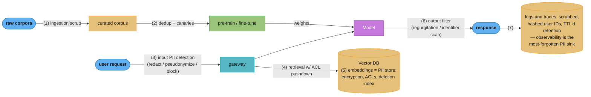

# Privacy & Data Governance for LLM Systems

Deep-dive sub-file of [LLM Security](README.md). Covers training-data memorization and extraction, membership inference, PII engineering at every system boundary, differential privacy, machine unlearning, and the governance machinery (retention, residency, deletion requests) that production LLM systems need. Legal frame: see [AI Regulations & Compliance](../ai_regulations_and_compliance/README.md).

---

## 1. Concept Overview

An LLM is a lossy compressor of its training data — and sometimes, for some sequences, it is not lossy at all. Models verbatim-memorize a measurable fraction of training data, and that data can be extracted by adversaries with nothing but API access. Meanwhile, the *system around* the model accumulates sensitive data in places teams forget to govern: prompt logs, observability traces, vector databases, fine-tuning sets, and evaluation datasets.

Privacy engineering for LLM systems therefore spans two distinct problem classes:

1. **Model-level privacy** — what the weights themselves remember: memorization, extraction attacks, membership inference, and the (mostly unsatisfying) remedies: deduplication, differential privacy, machine unlearning.
2. **System-level privacy** — where data flows and rests: PII detection/redaction at ingestion, inference, and logging boundaries; retention and residency; provider data-handling terms; and the operational answer to "a user invoked their right to erasure — now what?"

Senior interviews increasingly probe both: "can you delete a user from a trained model?" is now a standard question, and the correct answer requires understanding why the honest engineering response is "not from the weights — which is why the architecture must keep personal data out of the weights in the first place."

---

## 2. Intuition

> **One-line analogy**: A trained model is like an employee who read every document in the building — you can shred the documents, but you cannot shred the employee's memory; you can only control what they were allowed to read and what they're allowed to say.

**Mental model**: Picture concentric rings of data at rest. Innermost: model weights (effectively immutable, unauditable storage of whatever was memorized). Next: fine-tuning and RAG corpora (deletable, auditable). Then: prompt/response logs and traces (high-volume, often forgotten). Outermost: provider-side copies governed by contract, not by your infrastructure. Privacy engineering is deciding, for each data category, the innermost ring it is ever allowed to reach. PII that never enters the weights never needs to be unlearned.

**Why it matters**: The failure modes are concrete and expensive: extraction attacks have recovered real emails, phone numbers, and addresses from production models; companies have banned internal chatbot use after employees pasted source code that became provider training data; GDPR deletion requests against trained weights have no good technical answer. Architecting so the question never arises is a design skill interviewers test.

**Key insight**: Memorization is not an accident of bad training — it is a predictable, *quantifiable* function of duplication count, model size, and prompt context length. That means it can be engineered against: deduplicate, canary-test, and keep identifiers out of training data, and the residual risk becomes measurable rather than mysterious.

---

## 3. Core Principles

1. **Memorization scales predictably.** Carlini et al. (2022) showed memorization grows log-linearly with (a) model size, (b) number of duplicates of a sequence in training data, and (c) length of the prompting context. Sequences duplicated hundreds of times are dramatically more extractable; deduplication cuts regurgitation by roughly 10×.
2. **Deletion is not unlearning.** Removing a record from the corpus affects future training runs only. The deployed weights retain it, and approximate unlearning methods degrade the model and often fail audits (quantizing an "unlearned" model can recover the supposedly removed knowledge).
3. **Every boundary needs its own PII control.** Training ingestion, fine-tuning sets, inference inputs, model outputs, observability traces, eval datasets, and vector stores each leak independently. A redaction step at one boundary does nothing for the others.
4. **RAG keeps personal data governable; fine-tuning does not.** Data in a retrieval store can be ACL-filtered per request, audited, and deleted in O(1). Data fine-tuned into weights inherits every model-level problem. This single tradeoff should drive most "should we fine-tune on customer data?" decisions.
5. **Embeddings are not anonymized data.** Inversion attacks (Vec2Text-class) reconstruct input text from embeddings with high fidelity — exact recovery for a large share of short inputs. A vector DB of customer-text embeddings is a PII store and must be governed as one.
6. **Provider terms are part of your architecture.** Retention windows (e.g., 30-day abuse-monitoring retention as a common default, with zero-data-retention tiers), train-on-your-data defaults (consumer products often opt-out, enterprise APIs opt-in/never), and regional processing guarantees differ by provider and tier — and they determine what you may legally send.

### Decoding "memorization scales log-linearly"

Principle 1 states the Carlini result in words. Written out, the shape of the finding is:

```
  extractability(sequence)  ~  a + b x log(duplicates)
                                 + c x log(model params)
                                 + d x log(prefix length)
```

**What this actually says.** "Each of the three risk factors has to be multiplied by a constant
factor -- not added to -- before the memorization risk moves by one fixed step."

That framing is the whole reason deduplication is the highest-leverage control. Duplicates are
the only one of the three terms you can cut by a factor of 10 for free; you cannot shrink the
model or shorten the attacker's prompt.

| Symbol | What it is |
|--------|------------|
| `extractability` | Probability a greedy decode from a prefix reproduces the rest verbatim |
| `duplicates` | How many near-identical copies of the sequence sit in the training corpus |
| `log(...)` | Turns "how many times more" into "how many steps more". Ratio 1 -> 0; ratio 10 -> 1 step |
| `b, c, d` | Slopes. How much risk one 10x increase in that factor buys the attacker |
| `a` | Baseline risk floor for a sequence seen exactly once |

**Walk one example.** Take the duplication tiers this file uses for canaries (1 / 10 / 100), plus
the real offender from the Section 14 case study (a refund template duplicated 412 times):

```
  duplicates   log10(duplicates)   steps above a single-copy sequence
      1              0.00           0.00   <- baseline, the "a" floor
     10              1.00           1.00   <- one step
    100              2.00           2.00   <- two steps, not 100 steps
    412              2.61           2.61   <- the case-study boilerplate offender

  Going 1 -> 100 multiplies copies by 100x but moves risk only 2 steps.
  Going 100 -> 412 multiplies copies by 4.1x and moves risk 0.61 steps.
```

The payoff runs the other way too, and that is where the file's "~10x less regurgitation" number
comes from: MinHash dedup that collapses a 412-copy template down to 1 copy walks the sequence
back 2.61 steps at once. This is also why the canary tiers are spaced 1 / 10 / 100 rather than
1 / 2 / 3 -- on a log axis, evenly spaced probes mean equal-sized steps, so three tiers cover the
whole realistic range of corpus duplication.

**Why the model-size term matters even though you cannot tune it.** The `c x log(params)` term
says the same corpus gets more extractable purely by scaling the model. A dedup threshold and a
canary gate that passed at 7B can fail unchanged at 70B, so the gate has to be re-run per model
size, not inherited from the last release.

---

## 4. Types — Attack and Defense Taxonomy

**Attacks:**

| Attack | What it does | Access needed | Canonical result |
|--------|-------------|---------------|-----------------|
| Verbatim extraction | Elicit memorized training sequences | Generation API | GPT-2: hundreds of memorized PII-bearing sequences recovered; ChatGPT "repeat a word forever" divergence attack leaked training data at scale |
| Membership inference | Decide if a specific record was in training | Logprobs or repeated queries | Loss/perplexity-threshold and shadow-model attacks; strongest on duplicated or outlier records |
| Attribute inference | Recover hidden attributes of a person from model behavior | Generation API | Inferring location/demographics from writing style |
| Embedding inversion | Reconstruct text from stored vectors | Read access to vector DB | Vec2Text: near-exact recovery of short texts from dense embeddings |
| Fine-tune leakage | Extract other tenants' fine-tuning data | Shared fine-tuned model | Why multi-tenant adapter isolation matters |

**Defenses:**

| Defense | Boundary | Cost | Effectiveness |
|---------|----------|------|--------------|
| Deduplication | Pre-training corpus | Cheap (MinHash/suffix arrays) | ~10× less regurgitation; also improves quality |
| PII scrubbing (NER + validators) | Every ingestion path | Pipeline complexity | High for structured PII (SSNs, cards), partial for names/context |
| DP-SGD | Training | Severe utility/compute cost at LLM scale | Formal ε guarantee; practical for small fine-tunes, not pre-training |
| Canary testing | Training + eval | Cheap | Measures (doesn't prevent) memorization |
| Output filters | Inference output | Latency | Catches regurgitated identifiers; bypassable |
| Machine unlearning | Post-hoc weights | Model damage, weak guarantees | Last resort; audits often fail |
| ACL-pushdown RAG | Retrieval | Engineering | Strong — data never enters weights; see [tenant_isolation_patterns.md](../case_studies/cross_cutting/tenant_isolation_patterns.md) |

---

## 5. Architecture Diagrams

PII boundaries in a production LLM system — each numbered point needs an explicit control:



Deletion-request fan-out — what "erase user X" actually touches:

```
DSR: "delete user X"
 ├── raw + curated corpora ........ delete rows; record in deletion ledger
 ├── fine-tune datasets ........... delete; mark affected model versions
 ├── model weights ................ CANNOT delete -> policy: PII never trains;
 │                                  else: suppress at inference + retrain cycle
 ├── vector DB .................... delete vectors + doc store entries (O(1))
 ├── prompt/response logs ......... delete or expire via TTL
 ├── eval/golden datasets ......... often forgotten — audit these
 └── provider-side copies ......... bounded by DPA + retention tier (e.g. ZDR)
```

---

## 6. How It Works — Detailed Mechanics

### 6.1 Quantifying memorization with canaries

Insert synthetic secrets into training data at controlled duplication counts, then measure extractability — this turns "are we memorizing?" into a number you can gate releases on.

```python
import secrets
from dataclasses import dataclass


@dataclass
class Canary:
    text: str            # e.g. "support PIN for acct 88231: 994-armadillo-7"
    duplicates: int      # how many times it was inserted (1, 10, 100)


def make_canaries(counts: list[int]) -> list[Canary]:
    return [
        Canary(text=f"internal ref code: {secrets.token_hex(8)}", duplicates=n)
        for n in counts
    ]


def exposure_check(model, canary: Canary, prefix_len: int = 24) -> bool:
    """Greedy-decode from the canary's prefix; exact completion == memorized."""
    prefix, expected = canary.text[:prefix_len], canary.text[prefix_len:]
    out = model.generate(prefix, max_new_tokens=32, temperature=0.0)
    return expected in out
# Release gate example: zero extraction at duplicates<=10 required to ship;
# extraction at duplicates=100 tells you your dedup threshold must be < 100.
```

**Put simply.** "A zero-extraction gate is not proof of zero memorization -- it is proof that the
memorization rate is below whatever rate your number of canaries was able to detect."

The gate is a statistical test, and the arithmetic that decides how much it is worth is a single
line. If each planted canary is independently extractable with probability `p`, then a tier of `n`
canaries misses the problem entirely with probability:

```
  P(gate passes | true rate p)  =  (1 - p)^n
```

| Symbol | What it is |
|--------|------------|
| `p` | True per-sequence extraction rate at that duplication tier. The thing you cannot observe |
| `n` | Canaries planted at that tier. In the Section 14 case study: 300 total across 3 tiers = 100 each |
| `(1 - p)` | Probability one canary stays hidden |
| `(1 - p)^n` | Probability all `n` stay hidden -- a false all-clear |
| `1 - (1 - p)^n` | The gate's statistical power: the chance it fires when there is a real problem |

**Walk one example.** 100 canaries at a tier, sweeping the true extraction rate:

```
  true rate p     (1 - p)^100 = false all-clear     power = chance the gate fires
     0.01              0.366                             63.4%
     0.03              0.0476                            95.2%
     0.05              0.0059                            99.4%
     0.10              0.000027                          100.0% (to 4 decimals)

  Worked for p = 0.03:  (1 - 0.03)^100 = 0.97^100 = 0.0476
                        power = 1 - 0.0476 = 0.9524
```

Read the top row carefully: at a genuine 1% extraction rate, 100 canaries wave the release through
roughly one time in three. So the honest claim a passing gate supports is "extraction is below
about 3% at this tier with 95% confidence" -- not "we do not memorize." If you need to defend a
tighter bound to a regulator, the only lever is `n`, and it costs you a log: driving the detectable
floor from 3% to 0.3% needs roughly 10x the canaries.

**Why the tiers are gated asymmetrically.** The gate demands zero extraction at `duplicates <= 10`
but merely *reports* extraction at 100. That is deliberate: a hit at tier 100 is a finding about
your deduplication pipeline (something got through 100 times), while a hit at tier 1 or 10 is a
finding about the model itself. They route to different fixes, so they cannot share a threshold.

### 6.2 PII redaction — broken, then fixed

```python
# BROKEN: regex-only redaction quietly misses most real-world PII
import re

EMAIL = re.compile(r"[\w.+-]+@[\w-]+\.[\w.]+")
SSN = re.compile(r"\d{3}-\d{2}-\d{4}")

def scrub_broken(text: str) -> str:
    return SSN.sub("[SSN]", EMAIL.sub("[EMAIL]", text))
# Misses: names ("call Priya Raman"), addresses, free-text DOBs ("born May 5 '91"),
# unformatted SSNs (123456789), card numbers with spaces, medical record numbers.
# Also over-redacts: version strings matching the SSN shape. No validation, no
# confidence, no reversibility -> support agents can't answer "which order?"
```

```python
# FIX: layered detector (NER + patterns + checksums) with pseudonymization
from dataclasses import dataclass


@dataclass
class PIISpan:
    start: int
    end: int
    kind: str          # EMAIL, PERSON, CARD, SSN, PHONE, ADDRESS...
    score: float


def luhn_ok(digits: str) -> bool:
    total, alt = 0, False
    for d in reversed(digits):
        n = int(d) * (2 if alt else 1)
        total += n - 9 if n > 9 else n
        alt = not alt
    return total % 10 == 0


def detect(text: str) -> list[PIISpan]:
    spans: list[PIISpan] = []
    spans += ner_model.find_entities(text, kinds=["PERSON", "ADDRESS", "ORG"])
    for m in CARD_PATTERN.finditer(text):           # pattern + validator:
        digits = re.sub(r"[ -]", "", m.group())
        if luhn_ok(digits):                          # kills false positives
            spans.append(PIISpan(m.start(), m.end(), "CARD", 0.99))
    return resolve_overlaps(spans)


def pseudonymize(text: str, spans: list[PIISpan], vault) -> str:
    """Replace with stable per-entity tokens; mapping stored in an access-
    controlled vault so authorized flows can reverse it. The LLM sees
    '<PERSON_7> ordered <CARD_2>' — coherent, joinable, and clean."""
    out, offset = text, 0
    for s in sorted(spans, key=lambda s: s.start):
        token = vault.token_for(s.kind, text[s.start:s.end])   # deterministic
        out = out[: s.start + offset] + token + out[s.end + offset:]
        offset += len(token) - (s.end - s.start)
    return out
```

This is the Presidio architecture (recognizers = patterns + NER + checksum validators, plus an anonymizer), and the pseudonymization-with-vault pattern is what lets a support copilot reason over "<PERSON_7>'s second order" while raw identifiers never reach the model, the logs, or the provider.

### 6.3 DP-SGD in three lines of intuition

Differentially private SGD clips each example's gradient to a max norm C, adds Gaussian noise calibrated to C and a privacy budget ε, and accounts the budget across steps. The guarantee: the trained model is provably (ε, δ)-insensitive to any single example's presence. The catch at LLM scale: per-example gradient clipping breaks the batched-compute efficiency that makes large training feasible, and at meaningful ε the noise visibly costs perplexity. In practice DP shows up in small/medium *fine-tunes* on sensitive corpora (often DP-LoRA, where only adapter gradients are clipped/noised) — essentially never in frontier pre-training, where dedup + scrubbing + canary gates are the working substitute.

### Decoding the (ε, δ) guarantee

The phrase "provably (ε, δ)-insensitive to any single example" is one inequality. Written out, for
any training mechanism `M`, any two datasets `D` and `D'` differing in exactly one record, and any
set of outcomes `S`:

```
  Pr[ M(D) in S ]   <=   e^eps  x  Pr[ M(D') in S ]   +   delta
```

**What the formula is telling you.** "Whatever an attacker concludes from the trained model, they
would have concluded almost the same thing from a model trained without you in the data -- and
`e^eps` is exactly how much 'almost' is worth."

The load-bearing detail is that epsilon sits in an *exponent*. Every discussion of "is ε = 8
acceptable?" is really a discussion about `e^8`, and people who read epsilon as a linear dial
consistently under-price the risk by three orders of magnitude.

| Symbol | What it is |
|--------|------------|
| `M` | The whole training mechanism -- DP-SGD plus everything downstream. Randomized, so its output is a distribution |
| `D`, `D'` | Two corpora identical except one record: you are in, or you are out |
| `S` | Any set of possible outcomes an attacker cares about -- e.g. "models that complete this prefix" |
| `e^eps` | The privacy loss, as a likelihood ratio. `eps = 0` -> ratio 1 -> the two worlds are indistinguishable |
| `eps` | The budget. Not a probability, not a percentage -- the logarithm of the worst-case ratio |
| `delta` | Probability the whole guarantee simply does not hold. The escape hatch in the inequality |

**Walk one example.** An attacker starts at a 50/50 prior on "was this person's record in the
training set?" and observes the model. Because prior odds are 1:1, the posterior odds are capped at
exactly `e^eps`, so `posterior = e^eps / (1 + e^eps)`:

```
  eps     e^eps      posterior on membership from a 50% prior
  1.0     2.72        2.72 / 3.72       =  73.1%
  3.0    20.09       20.09 / 21.09      =  95.3%
  8.0  2980.96     2980.96 / 2981.96    =  99.97%

  Worked for eps = 3:  e^3 = 20.09 -> attacker moves 50% -> 95.3% certainty

  And the gap between the ends of that table:
    e^8 / e^1  =  e^7  =  1096.6
```

That last line is the sentence to say out loud in an interview: **ε = 8 is not "8x weaker" than
ε = 1, it is about 1097x weaker in likelihood-ratio terms.** At ε = 1 an attacker who was
maximally uncertain ends up merely suspicious; at ε = 8 they end up certain, with a 0.03% chance of
being wrong. This is why published DP deployments cluster at single-digit epsilon, and why "we used
DP" is a meaningless claim without the number attached.

**Stated plainly.** "`delta` is the probability that the elegant `e^eps` bound above simply fails --
that some record's presence leaks in full."

So `delta` is not a knob you trade against utility the way you trade epsilon. It has to be small
relative to the dataset, and the standard bar is `delta << 1/N`: if `delta` were as large as `1/N`,
a mechanism could satisfy the definition while deterministically publishing one random person's
record in the clear and still pass the audit.

| Symbol | What it is |
|--------|------------|
| `N` | Number of records in the corpus. This file's case study: 2,000,000 conversations |
| `1/N` | The "one person, in the clear" scale. The line delta must sit well below |
| `N x delta` | Expected number of records for which the guarantee provides nothing |

**Walk one example.** N = 2,000,000 conversations, the Section 14 fine-tune corpus:

```
  1 / N  =  1 / 2,000,000  =  5.0e-07     <- the do-not-cross line

  delta = 1e-05  ->  N x delta = 2e6 x 1e-05 = 20 records unprotected    REJECT
                     (1e-05 is 20x LARGER than 1/N)
  delta = 1e-08  ->  N x delta = 2e6 x 1e-08 = 0.02 records unprotected  OK
                     (1e-08 is 50x smaller than 1/N)
```

The rule that falls out: pick `delta` near `1e-8` here, or generally one to two orders of magnitude
below `1/N`. And re-check it when the corpus grows -- a delta that was comfortable at 2M records
sits 5x closer to the line at 10M.

**Read it like this.** "`C` decides how loud any single example is allowed to shout, and `sigma`
decides how much static you play over the top of it."

The two knobs Section 6.3 names combine into one quantity, the noise scale:

```
  clip:   g_i  <-  g_i x min(1, C / norm(g_i))     per-example, before summing
  noise:  sum(g_i)  +  Normal(0, (C x sigma)^2)    once per batch
```

| Symbol | What it is |
|--------|------------|
| `g_i` | One example's gradient. The thing that carries that example's information into the weights |
| `C` | Clipping norm. The hard cap on any single example's influence -- typically `1.0` |
| `norm(g_i)` | Gradient magnitude. Clipping only bites when this exceeds `C` |
| `sigma` | Noise multiplier. Larger sigma -> smaller epsilon -> more damage to utility |
| `C x sigma` | Noise scale. The actual standard deviation added, in gradient units |
| `B` | Batch size. Signal grows with `B`; the noise added does not |

**Walk one example.** `C = 1.0`, `sigma = 1.1`, batch size `B = 1024`:

```
  worst-case signal from the batch :  B x C     = 1024 x 1.0 = 1024
  noise added to the batch sum     :  C x sigma = 1.0 x 1.1  = 1.1
  noise seen per example, averaged :  1.1 / 1024             = 0.001074

  Halve the batch to B = 512:
  noise per example                :  1.1 / 512              = 0.002148   (2x worse)
```

This is the most counter-intuitive fact about DP-SGD, and it is why DP training runs use enormous
batches: **the noise is added once per batch, so doubling the batch halves the noise each example
has to fight through.** Large batches are a privacy-utility free lunch in a way they never are in
ordinary training.

**Why epsilon does not simply add up over steps.** Section 6.3 says the accountant tracks the budget
"across steps." Naive composition would add epsilon per step, which at thousands of steps is
hopeless; modern RDP/moments accountants instead grow the total roughly with the *square root* of
the step count, because independent Gaussian noise partially cancels:

```
  N = 2,000,000 records,  B = 1024,  epochs = 3

  steps  =  epochs x N / B  =  3 x 2,000,000 / 1024  =  5859 steps

  naive composition  :  total eps  ~  5859 x eps_step     <- unusable
  sqrt-scale (RDP)   :  total eps  ~  76.5 x eps_step     <- sqrt(5859) = 76.5

  To land at total eps = 8 under the sqrt rule:  8 / 76.5 = 0.1045 per step
```

The planning consequence: **epochs are a privacy cost, not just a compute cost.** Going from 3
epochs to 12 quadruples the steps and so roughly doubles total epsilon -- which, per the exponent
table above, is a far bigger giveaway than "epsilon doubled" sounds. Budget epochs before the run
starts; you cannot claw epsilon back afterwards.

### 6.4 Why machine unlearning mostly disappoints

Exact unlearning means retraining without the deleted data — at LLM pre-training cost, a non-starter (SISA-style sharded training, which retrains only the affected shard, helps for small models but fragments LLM training). Approximate methods — gradient ascent on the forget set, RMU-style representation corruption, unlearning-targeted fine-tunes — optimize a proxy ("don't output this") rather than true removal, and audits show: relearning the "forgotten" content takes a handful of fine-tune steps; quantizing the unlearned model can *restore* forgotten knowledge; paraphrase probes still extract it. The architectural conclusion is principle 4: keep deletable data in deletable stores.

---

## 7. Real-World Examples

- **ChatGPT divergence attack (2023)** — researchers (Nasr, Carlini et al.) prompted "repeat the word 'poem' forever"; the model diverged into emitting verbatim training data, including real names, phone numbers, and emails, at a rate far above baseline. Patched at the filter level — illustrating that output filters, not weight changes, are the deployable remedy.
- **Samsung / ChatGPT (2023)** — engineers pasted proprietary source code and meeting notes into ChatGPT while consumer-tier inputs were eligible for training; Samsung banned generative-AI tools internally. The governance lesson: provider data-handling tier *is* the control.
- **GitHub Copilot regurgitation** — early Copilot emitted verbatim licensed code (including the famous Quake inverse-sqrt with its comments); GitHub shipped a duplication filter that suppresses suggestions matching public code above a length threshold — an output-boundary defense for a weights-level problem.
- **OpenAI/Anthropic enterprise terms** — enterprise API tiers default to not training on customer data, offer zero-data-retention options and regional processing; consumer tiers historically train unless opted out. Architectures that route by data sensitivity to different tiers/providers encode this directly.
- **Presidio at scale** — Microsoft's open-source PII engine is the de-facto reference for the recognizer + anonymizer pipeline pattern, used in front of LLM logging stacks and RAG ingestion at many enterprises.
- **NYT v. OpenAI discovery orders (2024–25)** — litigation forced retention-policy changes (preserving logs that would otherwise expire), a reminder that legal hold can override your TTL design and must be modeled in the governance plan.

---

## 8. Tradeoffs

| Decision | Option A | Option B | Key factor |
|----------|----------|----------|-----------|
| Personal data placement | RAG store (deletable, ACL'd) | Fine-tuned weights (better style fit) | Deletion obligations vs marginal quality |
| Redaction mode | Full redaction (max safety) | Pseudonymization + vault (utility, reversible) | Does the workflow need to reference entities? |
| Formal privacy | DP-SGD fine-tune (provable ε) | Dedup + canary gates (empirical) | Regulatory bar vs utility/compute cost |
| Logging | Full prompts/completions (best debugging) | Scrubbed + sampled + short TTL | Incident forensics vs breach blast radius |
| Provider tier | Zero-data-retention (no provider copy) | Standard tier (cheaper, abuse-monitoring retention) | Data classification of the traffic |
| Deletion strategy | Architectural (PII never in weights) | Unlearning after the fact | Only one of these reliably works |
| Embedding storage | Encrypt + ACL + deletion index | Treat as anonymous derived data | Inversion attacks make B indefensible |

---

## 9. When to Use / When NOT to Use

**Apply the heavyweight controls (DP, strict pseudonymization, ZDR tiers) when:**
- Processing regulated categories — PHI (HIPAA), payment data (PCI-DSS), EU personal data under GDPR with erasure obligations, children's data.
- Fine-tuning on user-generated content where individual records are sensitive (support transcripts, medical notes, financial communications).
- Multi-tenant products where one tenant's data leaking into another tenant's completions is an existential bug.

**Lighter controls suffice when:**
- Training/retrieving over public or internally non-sensitive corpora (docs, code you own, product catalogs) — dedup and canary gates still recommended (memorization also causes copyright and quality problems, not just privacy ones).
- Outputs never leave an internal trust boundary and inputs contain no personal data by construction.

**Do NOT:**
- Rely on unlearning as your deletion story — design so the request never reaches the weights.
- Treat embeddings, traces, or eval sets as "not really the data" — all three reproduce source text in practice.
- Assume provider defaults match your obligations — read the DPA; route by sensitivity.

---

## 10. Common Pitfalls

1. **Observability as the leak.** Teams scrub the model path, then ship full prompts to Langfuse/OTel traces with 1-year retention and broad dashboard access. The trace store quietly becomes the largest PII database in the company. Fix: scrub *before* the tracing SDK, hash user IDs, TTL aggressively, ACL dashboards. See [opentelemetry_for_llm_apps.md](../case_studies/cross_cutting/opentelemetry_for_llm_apps.md).
2. **Fine-tuning on raw support tickets.** A real incident pattern: a support-bot fine-tune ingests tickets containing addresses and order details; months later the bot offers another customer "your address on file is..." — a memorized completion. Quantified impact in one public-adjacent case: full model rollback, weeks of retraining, regulator notification. Fix: pseudonymize before the training set is even written.
3. **The forgotten eval set.** Golden datasets are sampled from production traffic and checked into git, escaping every retention and deletion control. Audit eval/golden sets in DSR fan-out.
4. **Believing "we deleted it" after corpus deletion.** Legal asks "is the user's data gone?", engineering says yes (corpus row deleted) — but the deployed checkpoint trained on it. Maintain a deletion ledger mapping records → model versions trained on them, and a stated policy (suppression filter + scheduled retrain cycle) for the weights gap.
5. **Regex-only scrubbing.** Catches formatted SSNs, misses names, addresses, free-text dates, and unformatted numbers — and over-redacts version strings. Layer NER + validators (Luhn et al.) + context rules; measure recall on a labeled PII benchmark, don't assume it.
6. **Vector DB treated as derived/anonymous.** Embedding inversion reconstructs text; cosine-similarity neighbors leak membership. Encrypt, ACL, and index for deletion like the source documents — and remember deleting the document but not its vectors is a half-deletion.
7. **Cross-tenant adapter contamination.** Serving LoRA adapters fine-tuned per tenant on shared infra without isolation review: tenant A's adapter can regurgitate tenant A's data to anyone who can route to it. Bind adapter selection to authenticated tenant identity, never to a request parameter.
8. **Legal hold vs TTL collisions.** Litigation can require preserving exactly the logs your privacy design auto-expires. Model legal hold as a first-class state in the logging system rather than discovering the conflict mid-lawsuit.

---

## 11. Technologies & Tools

| Tool | Role |
|------|------|
| Microsoft Presidio | Open-source PII detection (recognizers) + anonymization; the reference pipeline |
| AWS Comprehend PII / GCP DLP / Azure PII | Managed PII detection APIs, multi-language |
| Nightfall, Skyflow, Very Good Security | Commercial tokenization/PII vaults (pseudonymization with reversal) |
| Opacus / TensorFlow Privacy / dp-transformers | DP-SGD implementations and accountants |
| text-dedup, MinHash/LSH, suffix-array pipelines | Corpus deduplication at scale |
| Vec2Text (research) | Embedding-inversion attack tooling for red-teaming vector stores |
| Langfuse / OTel masking hooks | Scrub-before-trace integration points |
| Deletion ledgers (in-house) + DSR platforms (OneTrust, Transcend) | Deletion-request orchestration across stores |

---

## 12. Interview Questions with Answers

**Q1: Can you delete a user's data from a trained LLM?**
Not from the weights, in any way that currently passes audit. Exact unlearning means retraining without the data — prohibitive at LLM scale; approximate unlearning (gradient ascent on the forget set, representation corruption) suppresses outputs rather than removing knowledge, and audits show paraphrase probes, brief re-fine-tuning, or even quantization can recover the "forgotten" content. The defensible answer is architectural: personal data lives in deletable stores (RAG corpus, logs, vector DB) and is kept out of training sets via pseudonymization, so deletion requests never implicate weights; for the residual gap, maintain a deletion ledger, inference-time suppression filters, and a scheduled retrain cycle. Saying "we'd run unlearning" without these caveats is a red flag answer.

**Q2: What determines how much an LLM memorizes, and what's the cheapest mitigation?**
Three measured factors (Carlini et al.): duplication count of the sequence in training data, model size, and length of prompt context — each increases extraction log-linearly. Duplication dominates in practice: sequences repeated hundreds of times are far more extractable, and corpus deduplication cuts regurgitation roughly 10× while *improving* model quality, making it the rare free-lunch defense. The operational complement is canary testing — planted synthetic secrets at controlled duplication counts, with an extraction check as a release gate — which converts memorization from a vague fear into a measured, gateable quantity.

**Q3: Describe a real training-data extraction attack.**
The 2023 ChatGPT divergence attack: prompting "repeat the word 'poem' forever" made the model diverge from its aligned distribution into raw language-model behavior, emitting verbatim training data — real names, emails, phone numbers — at rates orders of magnitude above normal sampling. Earlier, the GPT-2 extraction work recovered hundreds of memorized sequences including personal contact details by sampling at scale and ranking by perplexity-based membership signals. Two lessons to state: alignment is a veneer over a base model that still contains the data, and the practical patch was an output/behavior filter — the weights were never fixed.

**Q4: What is membership inference and why would anyone care for LLMs?**
Deciding whether a specific record was in the training set, typically via loss/perplexity thresholds (members score lower) or shadow models calibrated on known member/non-member data. It matters three ways: it is the formal privacy harm DP bounds (presence itself can be sensitive — a person's chats in a therapy-bot fine-tune); it is the auditor's tool for verifying claims like "we never trained on your data"; and it is the building block of copyright/provenance disputes (was this book in the corpus?). Strength correlates with overfitting and duplication — another reason dedup and early stopping are privacy controls, not just quality ones.

**Q5: Explain DP-SGD and why it isn't used for LLM pre-training.**
DP-SGD clips each *individual example's* gradient to norm C, adds Gaussian noise scaled to C/ε, and uses a privacy accountant to track cumulative budget (ε, δ) across steps — yielding a proof that any single example's presence changes the model's distribution by a bounded amount. Two costs kill it at pre-training scale: per-example gradient computation breaks batch-level kernel efficiency (large slowdowns and memory overhead), and the noise needed for meaningful ε measurably damages perplexity at the data scales involved. Where it *is* practical: small-to-medium fine-tunes on sensitive corpora, especially DP-LoRA (clip/noise only adapter gradients), where regulated industries trade a few points of quality for a provable guarantee.

**Q6: Design the PII pipeline for an LLM support assistant.**
Layered detection at every boundary: NER models for contextual PII (names, addresses) + pattern recognizers with validators (Luhn for cards, structure checks for national IDs) — never regex alone (misses unformatted/contextual PII, over-redacts lookalikes). Replace with *pseudonyms*, not blanks: deterministic per-entity tokens (`<PERSON_7>`, `<CARD_2>`) whose mapping lives in an access-controlled vault, so the model can reason coherently ("<PERSON_7>'s second order") and authorized downstream systems can reverse the mapping for fulfillment. Apply it at four places independently: inference input (before the provider sees it), RAG ingestion, fine-tune dataset construction, and the logging/tracing SDK. Measure recall on a labeled benchmark per language — and re-benchmark when the traffic mix changes.

**Q7: Redaction, pseudonymization, tokenization-vault — when does each fit?**
Full redaction (`[REDACTED]`) maximizes safety but destroys utility — the model can't distinguish entities or maintain coreference; right for analytics pipelines and logs where content isn't needed. Pseudonymization (stable surrogate tokens) preserves entity structure and joinability while removing identity — the default for LLM inputs and training data. A tokenization vault adds *authorized reversibility*: the surrogate↔real mapping is stored in a hardened service, so a fulfillment step can recover the real address while the LLM, the logs, and the provider never see it — required when the workflow must eventually act on the real value. Bonus nuance: pseudonymized data is still personal data under GDPR (re-identifiable via the vault), so it reduces, not eliminates, obligations.

**Q8: Why is a vector database a privacy liability, and what do you do about it?**
Because embeddings are invertible: Vec2Text-class attacks reconstruct input text from dense embeddings with near-exact recovery on short passages, and similarity queries leak membership and content even without full inversion. So treat the vector store exactly like the source documents: encryption at rest and in transit, per-tenant/per-ACL isolation with filter pushdown enforced server-side (see [tenant_isolation_patterns.md](../case_studies/cross_cutting/tenant_isolation_patterns.md)), a deletion index mapping source record → vector IDs so erasure is complete (deleting documents but orphaning their vectors is a classic half-deletion), and inclusion in DSR fan-out and breach impact analysis.

**Q9: From a privacy standpoint, RAG vs fine-tuning on customer data?**
RAG wins on almost every governance axis: data stays in a store that supports per-request ACL filtering (the model only ever sees what *this* user may see), O(1) deletion, audit logging, and residency placement. Fine-tuning moves data into weights: no per-request access control (anything in weights is potentially available to any user), no deletion, memorization/extraction risk, and version-tracking burden (which checkpoints saw the deleted record?). The defensible pattern: fine-tune only on pseudonymized or synthetic-but-audited data for *style and format*, keep all retrievable facts — especially personal ones — in RAG. State the exception: aggregate behavioral patterns that can't be expressed as documents may justify fine-tuning, with DP if records are sensitive.

**Q10: What should your prompt/response logging policy specify?**
Classification (logs containing user content are personal data), scrub-before-write (PII pipeline runs ahead of the tracing SDK, not in a later batch job — the raw write is already a breach surface), identifier hygiene (hashed user IDs, no raw auth context), retention TTLs differentiated by purpose (debugging days-to-weeks; aggregated metrics longer), sampling (you rarely need 100% of payloads for quality monitoring), access control on dashboards (observability tools quietly grant content access to the whole org), legal-hold as a modeled state that can suspend TTL per matter, and inclusion in deletion-request fan-out. The observability stack is the most commonly forgotten PII sink — naming it unprompted is a strong interview signal.

**Q11: What do provider data-handling terms change about your architecture?**
They determine what you may send where. Key variables: training defaults (enterprise API tiers typically never train on your data; consumer tiers may unless opted out — the Samsung incident is the canonical consequence), retention (a ~30-day abuse-monitoring window is a common default; zero-data-retention tiers remove the provider-side copy), regional processing/residency endpoints (EU processing for GDPR transfers), and BAA availability for PHI. Architecturally this becomes sensitivity-based routing: classify the request, then route regulated traffic to ZDR/regional/BAA-covered endpoints (or self-hosted models) and generic traffic to cheaper tiers — with the classifier and the routing table audited like any other security control.

**Q12: Is generating synthetic data a privacy solution?**
Partially, and dangerously if treated as automatic. Synthetic data generated *by a model trained on real records* can reproduce those records — memorized rare examples pass straight through the generator, and the synthetic set inherits membership signals. It becomes a real solution when paired with controls: pseudonymize the seed data first, generate with a model that never saw raw identifiers, run extraction/canary audits and near-duplicate filtering between synthetic output and source records, and optionally train the generator with DP for a formal bound. Said crisply: synthetic data launders *distribution*, not *records*, unless you verify record-level separation. See [Synthetic Data Generation](../synthetic_data_generation/README.md).

**Q13: Walk through handling a GDPR erasure request end-to-end in an LLM product.**
Fan out across every store: raw and curated corpora (delete + ledger entry), fine-tune datasets (delete + flag model versions trained on the record), vector DB (use the deletion index to remove vectors *and* doc-store entries), prompt/response logs and traces (delete or confirm TTL expiry; respect legal holds), eval/golden datasets (the classically forgotten one), caches (semantic caches can serve a deleted user's content as a hit — invalidate), and provider-side copies (bounded by DPA/retention tier — cite the contract in the response). For weights: state the documented position — personal data is excluded from training by pipeline design (pseudonymization), so weights are out of scope; where historical contamination is suspected, apply inference-time suppression and include the record in the next scheduled retrain's exclusion list. Respond within the statutory window (one month, extensible) with what was deleted where.

**Q14: How would you red-team your own system for privacy before launch?**
Model level: canary extraction gates (planted secrets at duplication tiers); divergence-style attacks and high-volume sampling against the deployed model with PII detectors on outputs; membership-inference attempts on the fine-tuning set using loss thresholds. System level: embedding-inversion attempts against the vector store from a tenant-scoped credential; cross-tenant retrieval probes (can tenant A's query surface tenant B's chunks); trace-store access review (who can read prompts in the observability tool); DSR fire-drill (file a deletion request for a test user and verify every store actually purged, including caches and eval sets). Schedule it recurrently — corpus refreshes and new adapters reset the risk. See [red_team_eval_harness.md](../case_studies/cross_cutting/red_team_eval_harness.md) for harness mechanics.

**Q15: What is SISA training and does it help for LLMs?**
SISA (Sharded, Isolated, Sliced, Aggregated) trains an ensemble on disjoint data shards with checkpoints per slice, so deleting a record requires retraining only its shard from the last clean checkpoint — making *exact* unlearning tractable. It works for classifiers and modest models, but for LLMs the costs bite: sharding fragments the corpus (each sub-model sees less data, hurting quality), ensemble serving multiplies inference cost, and frontier-scale shard retrains are still enormous. Its real value in LLM practice is the *idea* it represents: design training so deletion maps to a bounded, cheap operation — which today is achieved by keeping deletable data out of training entirely rather than by sharding the training itself.

**Q16: A teammate proposes fine-tuning on last year's support transcripts tomorrow. What's your checklist?**
(1) Legal basis and notice — did users consent/were they informed of this use; any regulated categories (health, payments) in transcripts? (2) Pseudonymize before the dataset exists — names, contacts, account numbers, free-text identifiers; benchmark detector recall on a labeled sample of *these* transcripts. (3) Deduplicate — repeated boilerplate and repeated customer messages are exactly what gets memorized. (4) Plant canaries and set an extraction release gate. (5) Deletion story — ledger mapping transcript IDs → model version; exclusion-list mechanism for the next retrain; confirm DSR fan-out covers this dataset. (6) Access — who can query the resulting model; is it tenant-shared? (7) Provider path — if fine-tuning via an API, what are retention/training terms for uploaded datasets? If most boxes can't be ticked by tomorrow, propose RAG over the transcripts as the lower-risk first ship.

---

## 13. Best Practices

1. **Keep personal data out of weights by construction** — pseudonymize before any training set is materialized; the best unlearning is never-learning.
2. **Deduplicate every training corpus** — the cheapest memorization defense, with quality upside.
3. **Gate releases on canary extraction** — make memorization a measured number with a threshold, not a hope.
4. **Run PII detection at every boundary independently** — input, ingestion, fine-tune sets, outputs, traces; one scrubber in one place is a false sense of safety.
5. **Pseudonymize with a vault rather than redact** when workflows must reference or recover entities.
6. **Govern the vector store like the documents it encodes** — encryption, ACL pushdown, deletion index, DSR inclusion.
7. **Scrub before the tracing SDK and TTL the logs** — observability is the most-forgotten PII sink.
8. **Maintain a deletion ledger** mapping records → datasets → model versions, and a scheduled retrain/exclusion cycle to reconcile the weights gap.
9. **Route by data sensitivity** across provider tiers (ZDR, regional, BAA) and self-hosted models; treat the routing table as a security control.
10. **Red-team privacy recurrently** — extraction, inversion, cross-tenant probes, and DSR fire-drills on every major corpus or adapter change.

---

## 14. Case Study

**Scenario**: A B2B fintech ships an AI assistant that answers questions over customers' transaction data and support history. 40K business customers, EU + US, GDPR and PCI-DSS in scope. Initial design: fine-tune a 70B model on 2M historical support conversations; log all prompts to the observability stack for quality monitoring.

**Privacy review findings (pre-launch)**:
- Transcripts contained card PANs (in 0.7% of messages), IBANs, names, and addresses; the fine-tune would bake them into weights with no deletion path — incompatible with GDPR Art. 17 and PCI scope minimization.
- Full-prompt tracing with 13-month retention and org-wide dashboard access would create a second uncontrolled PII store.
- The pgvector store of embedded transcripts had no per-tenant filter enforcement in two query paths — a cross-tenant leak waiting for one missing WHERE clause.

**Redesign**:
1. **No customer content in weights.** Fine-tuning restricted to 30K *pseudonymized and human-audited* conversations selected purely for tone/format; all factual lookups moved to RAG with server-side tenant-ID filter pushdown enforced in a single retrieval service (the two raw query paths were deleted).
2. **PII pipeline at four boundaries** (Presidio-style NER + Luhn-validated patterns + vault pseudonymization): inference input, RAG ingestion, fine-tune set construction, and inside the tracing SDK before export. Detector recall benchmarked at 96.4% on a 5K-message labeled sample; the gap covered by an output identifier-scan filter.
3. **Memorization gates**: corpus MinHash dedup (removed 23% near-duplicates); 300 canaries at duplication tiers 1/10/100; release gate = zero extraction at ≤10 duplicates. The first candidate fine-tune *failed* the gate at tier-100 (boilerplate refund template containing a real agent's phone number, duplicated 412 times) — caught pre-launch, fixed by template normalization in dedup.
4. **Governance**: logs TTL 30 days (sampled 20%), hashed user IDs, dashboard access cut from org-wide to 14 people; deletion ledger + quarterly retrain exclusion cycle; EU traffic routed to EU-region ZDR endpoints under DPA; DSR fire-drill before launch found the forgotten store — a golden eval set in git with 41 real conversations — replaced with pseudonymized versions.

### Decoding the retention and deletion-latency arithmetic

Two numbers in the redesign above look like policy choices but are really the output of
calculations worth doing explicitly. The first is how much PII the trace store holds at rest:

```
  steady-state stored volume  =  daily ingest x sampling rate x retention days
```

**In plain terms.** "A log store is a bathtub -- volume settles where the daily inflow times how
long you hold it balances out, so shortening retention and sampling both drain it multiplicatively,
not additively."

Multiplicatively is the operative word. Teams argue about sampling *or* TTL as if picking one is
the decision; they multiply, which is why doing both modestly beats doing either aggressively.

| Symbol | What it is |
|--------|------------|
| `daily ingest` | Prompt/response payload volume written per day, before any controls |
| `sampling rate` | Fraction of payloads actually persisted. The redesign uses 20% |
| `retention days` | TTL before expiry. v1 was 13 months; the redesign is 30 days |
| `steady-state volume` | What sits in the store on any given day once inflow and expiry balance |

**Walk one example.** The v1 design against the redesign, holding daily ingest constant:

```
  v1        :  ingest x 1.00 x 395.7 days  =  395.7 ingest-days   (13 months, unsampled)
  redesign  :  ingest x 0.20 x  30.0 days  =    6.0 ingest-days

  reduction =  395.7 / 6.0  =  65.9x smaller PII store
```

The blast radius of a breach of that store shrinks by the same 65.9x, and the number costs nothing
in engineering -- it is two config values. That ratio is the argument to bring to the meeting where
someone says "but we might need those logs."

The second calculation is the one teams get wrong, because deletion is not done when the delete
statement commits:

```
  effective deletion latency  =  deletion SLA  +  backup retention window
```

**The idea behind it.** "A record is not gone when you delete it -- it is gone when the last backup
that still contains it expires."

This term exists because every store worth having has backups, and a restore from a backup taken
before the deletion silently resurrects the record. Without accounting for it, a team reports a
72-hour deletion SLA to a regulator while the data is in fact recoverable for over a month.

| Symbol | What it is |
|--------|------------|
| `deletion SLA` | Time from request to the row being gone from live stores. Here: 72h = 3 days |
| `backup retention window` | How long the oldest surviving backup is kept. Assume nightly backups held 35 days |
| `effective deletion latency` | When the record actually stops being recoverable anywhere |
| GDPR window | The statutory response deadline: one month (~30 days), extensible |

**Walk one example.** The redesign's 72-hour SLA against a 35-day backup rotation:

```
  deletion SLA            :   3 days   (live stores: corpora, vector DB, logs, caches)
  backup retention window :  35 days   (oldest nightly snapshot still holding the record)

  effective deletion latency = 3 + 35 = 38 days

  GDPR response window       = 30 days
  38 > 30  ->  the deletion is not complete inside the statutory window
```

Two defensible fixes, and an interview answer should name which one it picked: shorten the backup
window below `30 - 3 = 27 days` so the tail closes inside the deadline, or keep the 35-day rotation
and maintain a **deletion replay ledger** -- restore from backup, then immediately re-apply every
deletion logged since that snapshot. The second is what most mature shops do, because backup
retention is usually pinned by a disaster-recovery requirement that privacy does not get to
overrule. What is not defensible is reporting "deleted in 72h" while the 35-day tail exists
undocumented.

**Quantified outcome**: deletion requests close in <72h across 6 stores (vs "technically impossible" in the v1 design); the canary gate has since blocked 2 of 9 fine-tune candidates; PCI assessment passed with the vault pattern (PANs never reach model, logs, or provider); incremental infra cost of the entire privacy layer measured at ~4% of inference spend — against a v1 design whose single cross-tenant leak would have been a contract-terminating event for the affected customers.

---

## Related

- [LLM Security README](README.md) — prompt injection, model theft, supply chain, red teaming
- [AI Regulations & Compliance](../ai_regulations_and_compliance/README.md) — GDPR, EU AI Act, DPIA: the legal frame for these controls
- [Tenant Isolation Patterns](../case_studies/cross_cutting/tenant_isolation_patterns.md) — ACL pushdown, per-tenant stores
- [OpenTelemetry for LLM Apps](../case_studies/cross_cutting/opentelemetry_for_llm_apps.md) — trace scrubbing and retention
- [Synthetic Data Generation](../synthetic_data_generation/README.md) — synthetic data as a (partial) privacy tool
