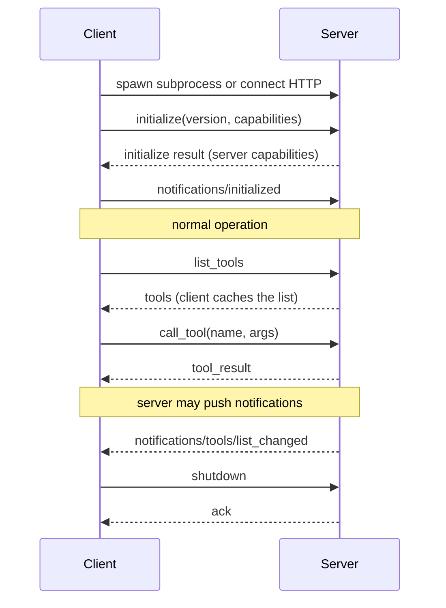
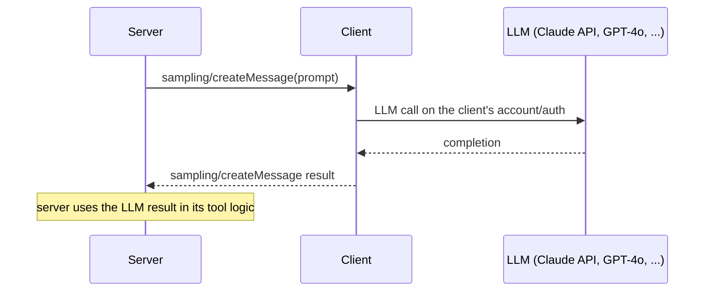

# MCP Client Patterns — Deep Dive

---

## 1. Concept Overview

An MCP client is the component in an LLM application that connects to MCP servers, discovers their capabilities, and proxies tool/resource/prompt requests from the LLM. Claude Desktop, Cursor, and most agent frameworks all include MCP client implementations. For custom agents, building an MCP client (or using the SDK's ClientSession) is the standard way to access the growing MCP ecosystem.

This deep-dive covers client implementation: connecting to servers (stdio subprocess vs HTTP), capability negotiation, tool discovery and caching, sampling roundtrip (server requests an LLM call back from the client), multi-server orchestration (Claude Desktop's "connect N servers, prefix tools by server name" pattern), and reconnection/error handling. Wire-level framing lives in [MCP Transports & JSON-RPC](mcp_transports_and_jsonrpc.md); the threat model for untrusted servers lives in [MCP Security](mcp_security.md).

---

## 2. Intuition

**One-line analogy**: An MCP client is to MCP servers what a web browser is to web servers — knows the protocol, manages connections, presents server capabilities (tools, resources) in a unified UI to the user (the LLM).

**Mental model**: For each MCP server you want to use, create a `ClientSession`. Call `initialize()` once (handshake), then call `list_tools()`, `list_resources()` to discover capabilities. Cache the lists. Wire the discovered tools into your agent's tool list. When the LLM calls a tool, route to the right server's `call_tool()`.

**Why it matters**: Without a robust client, MCP integration becomes ad-hoc per server (Slack server uses HTTP, GitHub server uses stdio, etc). A good client abstracts these differences — the agent code doesn't care how the server runs, only that tools work.

**Key insight**: Tool name collisions are inevitable when connecting multiple servers. Standard solution: prefix tool names with server name (`github_create_issue` instead of just `create_issue`). Claude Desktop, Cursor, and most production clients do this automatically. The same `<server>_<verb>_<object>` namespacing rule — and what to do when the merged catalogue grows past ~50 tools — is covered in [Tool Selection at Scale](../agents_and_tool_use/tool_selection_at_scale.md).

---

## 3. Core Principles

- **ClientSession per server**: each server gets its own session.
- **Initialize once**: handshake at connection; never re-initialize without disconnect.
- **List capabilities + cache**: `list_tools`/`list_resources` called once at startup; refresh on `notifications/*/list_changed`.
- **Prefix tools by server**: avoid name collisions in multi-server setups.
- **Handle reconnection**: servers may restart; clients must detect and reconnect.
- **Sampling roundtrip**: if server supports sampling, client must handle `sampling/createMessage` requests by calling the LLM and returning the result.
- **Timeout per call**: default 60s for tool calls; configurable.

---

## 4. Types / Architectures / Strategies

### 4.1 Single-Server Client (Simple)

Connect to one server; expose its tools to the LLM. Sufficient for narrow integrations.

### 4.2 Multi-Server Client (Standard)

Connect to N servers concurrently. Prefix tool names. Common pattern in Claude Desktop config (`claude_desktop_config.json` lists N MCP servers).

### 4.3 Dynamic Server Discovery

Client periodically scans a registry (Smithery) for new servers and connects as configured. Less common but supported.

### 4.4 Sampling-Enabled Client

Client implements LLM-callback API so servers can request LLM calls on the client's account/auth.

---

## 5. Architecture Diagrams

### Client Session Lifecycle



Initialize exactly once per connection; everything after the handshake is request/response plus server-pushed notifications — `list_changed` is the only signal that invalidates the cached tool list.

### Multi-Server Architecture

```
  Claude Desktop Client
        |
        +-- Session A (github MCP)
        |    Tools: github_create_issue, github_search, ...
        |
        +-- Session B (slack MCP)
        |    Tools: slack_send_message, slack_list_channels, ...
        |
        +-- Session C (filesystem MCP)
             Tools: fs_read, fs_write, fs_list, ...

  All tools merged into one list for the LLM
  Tool calls routed to correct session by name prefix
```

One `ClientSession` per server; the merged, prefix-namespaced tool list is what the LLM actually sees, and the prefix is what routes each call back to the right session.

### Sampling Roundtrip



Sampling inverts the usual direction: the server asks the client for an LLM call, so the model access, billing, and auth stay on the client side.

---

## 6. How It Works — Detailed Mechanics

### Python ClientSession with Stdio Server

```python
import asyncio
from contextlib import AsyncExitStack
from mcp import ClientSession, StdioServerParameters
from mcp.client.stdio import stdio_client


async def use_mcp_server():
    """Connect to a single stdio MCP server, list tools, call one."""
    
    server_params = StdioServerParameters(
        command="python",
        args=["my_server.py"],
        env={"API_KEY": os.environ["API_KEY"]},
    )
    
    async with stdio_client(server_params) as (read, write):
        async with ClientSession(read, write) as session:
            # 1. Initialize
            await session.initialize()
            
            # 2. List capabilities
            tools_result = await session.list_tools()
            for tool in tools_result.tools:
                print(f"Tool: {tool.name} — {tool.description}")
            
            # 3. Call a tool
            result = await session.call_tool(
                "create_issue",
                arguments={"repo": "anthropics/claude-code", "title": "Test"},
            )
            print(result.content[0].text)
            
            # 4. List resources
            resources = await session.list_resources()
            
            # 5. Read a resource
            content = await session.read_resource("file:///etc/hosts")


asyncio.run(use_mcp_server())
```

### Multi-Server Manager

```python
from dataclasses import dataclass

@dataclass
class MCPServerConfig:
    name: str
    command: str
    args: list[str]
    env: dict[str, str] | None = None


class MCPClientManager:
    def __init__(self, servers: list[MCPServerConfig]):
        self.servers = servers
        self.sessions: dict[str, ClientSession] = {}
        self._exit_stack: AsyncExitStack | None = None
    
    async def __aenter__(self):
        self._exit_stack = AsyncExitStack()
        await self._exit_stack.__aenter__()
        
        for server in self.servers:
            params = StdioServerParameters(
                command=server.command, args=server.args, env=server.env,
            )
            read, write = await self._exit_stack.enter_async_context(stdio_client(params))
            session = await self._exit_stack.enter_async_context(ClientSession(read, write))
            await session.initialize()
            self.sessions[server.name] = session
        
        return self
    
    async def __aexit__(self, *args):
        if self._exit_stack:
            await self._exit_stack.__aexit__(*args)
    
    async def list_all_tools(self) -> list[dict]:
        """Aggregate tools across all servers, prefixed by server name."""
        all_tools = []
        for server_name, session in self.sessions.items():
            result = await session.list_tools()
            for tool in result.tools:
                all_tools.append({
                    "name": f"{server_name}_{tool.name}",  # Prefix!
                    "description": tool.description,
                    "input_schema": tool.inputSchema,
                    "_server": server_name,
                    "_original_name": tool.name,
                })
        return all_tools
    
    async def call_tool(self, prefixed_name: str, args: dict) -> str:
        """Route call to correct server based on prefix."""
        # Find matching server (longest prefix wins for accuracy)
        for server_name in self.sessions:
            prefix = f"{server_name}_"
            if prefixed_name.startswith(prefix):
                original_name = prefixed_name[len(prefix):]
                result = await self.sessions[server_name].call_tool(
                    original_name, arguments=args
                )
                return result.content[0].text
        raise ValueError(f"No server matches tool name: {prefixed_name}")


# Usage
async def main():
    servers = [
        MCPServerConfig(name="github", command="python", args=["github_server.py"]),
        MCPServerConfig(name="slack", command="npx", args=["@anthropics/slack-server"]),
    ]
    
    async with MCPClientManager(servers) as mcp:
        tools = await mcp.list_all_tools()
        # Pass tools to agent
        result = await mcp.call_tool("github_create_issue", {"repo": "x/y", "title": "test"})


asyncio.run(main())
```

### HTTP (Streamable) Client

```python
from mcp.client.streamable_http import streamablehttp_client

async def use_remote_server():
    async with streamablehttp_client("https://my-mcp.example.com/mcp") as (read, write, _):
        async with ClientSession(read, write) as session:
            await session.initialize()
            # Same API as stdio
            tools = await session.list_tools()
            ...
```

---

## 7. Real-World Examples

**Claude Desktop**: most-deployed MCP client. Reads `claude_desktop_config.json` listing servers; manages stdio subprocesses; prefixes tools.

**Cursor**: similar pattern for IDE-integrated MCP.

**Custom agent frameworks**: LangChain MCP adapter, smolagents `ToolCollection.from_mcp`, Mastra `MastraMCPClient` — all wrap ClientSession differently.

**Internal AI platforms**: large enterprises building centralized MCP gateways that aggregate dozens of internal servers.

---

## 8. Tradeoffs

| Approach | Setup | Best For |
|---|---|---|
| Single-server client | Simplest | Narrow tool integration |
| Multi-server with prefix | Standard | Multi-tool agents (Claude Desktop) |
| Dynamic discovery | Complex | Plug-and-play environments |
| Sampling-enabled | Moderate | Servers needing LLM callbacks |

---

## 9. When to Use / When NOT to Use

**Use a robust MCP client when:**
- Integrating 2+ MCP servers
- Building a reusable agent framework
- Need consistent error handling across servers

**Skip building one when:**
- Using off-the-shelf clients (Claude Desktop, Cursor)
- Single-tool integration (just import the tool's SDK directly)

---

## 10. Common Pitfalls

### Pitfall 1: Tool name collisions

```python
# BROKEN: github and gitlab both have "create_issue"
all_tools = []
for session in sessions.values():
    all_tools.extend(await session.list_tools())
# LLM sees two "create_issue" tools — undefined behavior
```

```python
# FIXED: prefix by server name
for server_name, session in sessions.items():
    result = await session.list_tools()
    for tool in result.tools:
        tool.name = f"{server_name}_{tool.name}"  # github_create_issue, gitlab_create_issue
    all_tools.extend(result.tools)
```

### Pitfall 2: Not handling server crashes

```python
# BROKEN: server crashes; calls hang or fail
session = ClientSession(...)
# 30 minutes later, server segfaulted; next call hangs
```

```python
# FIXED: timeout + auto-reconnect
try:
    result = await asyncio.wait_for(session.call_tool(...), timeout=30)
except (asyncio.TimeoutError, ConnectionError):
    await self.reconnect(server_name)  # Restart subprocess
    result = await session.call_tool(...)  # Retry
```

**War story**: A team's internal AI tool used MCP without timeout. When one of 8 connected servers hung, the entire agent froze — every subsequent tool call queued behind the dead one. After per-call timeout + isolation (use separate event loop per server), one bad server no longer brought down others.

---

## 11. Technologies & Tools

| Tool | Purpose |
|---|---|
| `mcp.ClientSession` | Core client class |
| `stdio_client` | Stdio transport |
| `streamablehttp_client` | HTTP transport |
| Claude Desktop config | `claude_desktop_config.json` |
| smolagents ToolCollection | MCP → smolagents tools |
| LangChain MCP adapter | MCP → LangChain tools |
| MCP Inspector | Test servers (also a client) |

---

## 12. Interview Questions with Answers

**Why does an MCP client need to call `initialize` first?**
The initialize handshake negotiates protocol version and capabilities. Both sides learn what the other supports (e.g., does client support sampling? does server support notifications?). Without it, the connection is undefined.

**How do you avoid tool name collisions across multiple MCP servers?**
Prefix each tool name with the server's logical name: `github_create_issue` from GitHub server, `gitlab_create_issue` from GitLab server. Routes calls by parsing the prefix. Standard pattern in Claude Desktop, Cursor.

**When should the client re-list tools?**
Once at session start (cache the list). Refresh when the server sends `notifications/tools/list_changed`. Some servers add tools dynamically (e.g., a database server adds a tool per available stored procedure).

**What's sampling and how does the client handle it?**
Sampling lets a server request the client to make an LLM call on its behalf. The server sends `sampling/createMessage` with a prompt; the client calls its LLM (Claude, GPT-4o, etc); returns the result to the server. Useful when the server needs AI capability without bundling its own model access.

**How do clients handle long-running server operations?**
Per spec, tool calls should return within a reasonable timeout. For long ops, two patterns: (1) server returns a task_id quickly + provides a polling tool to check status; (2) server supports progress notifications during the call.

**What's the right timeout for tool calls?**
60 seconds default in most SDKs. Configurable per call. For known long operations, increase. For interactive UIs, may want 5-10s with progress indication. Always have a hard cap to detect server hangs.

**How do you handle a server that crashes?**
Detect via timeout or connection error on call. Restart the server subprocess (for stdio) or reconnect (for HTTP). Re-initialize. Optionally re-list tools (the new server instance may have different version). Implement backoff to avoid restart loops.

**Can one client connect to both stdio and HTTP servers?**
Yes — different connection methods, same `ClientSession` API afterward. Common in production: local filesystem servers via stdio + remote SaaS servers via HTTP, all managed by one client.

**How does Claude Desktop discover servers to load?**
Reads `claude_desktop_config.json` (path varies by OS — `~/Library/Application Support/Claude/` on macOS). The config lists servers with command/args/env. Claude Desktop spawns each at startup.

**What auth methods do MCP clients support?**
For stdio: server inherits subprocess auth (e.g., env vars passed at launch with API keys). For HTTP: per 2025 spec, OAuth 2.0 with PKCE for user-authorized servers. Custom: server-specific auth via headers in HTTP transport.

**How do you debug MCP client issues?**
(1) Use MCP Inspector to verify the server works in isolation. (2) Enable verbose logging on the client (`MCP_LOG_LEVEL=debug`). (3) Inspect JSON-RPC traffic with a proxy or stdio interceptor. (4) Try Claude Desktop as a reference client — if it works there but not in your client, the bug is yours.

**Should the client validate tool args before calling?**
Optionally — the server should validate too. Client-side validation (against the tool's `inputSchema`) catches errors earlier, gives better LLM feedback. Frameworks like Pydantic-AI do this automatically.

**Can clients run servers as untrusted code?**
For stdio, the server runs as a subprocess in your trust boundary — treat carefully. For HTTP (remote servers), the server is fully isolated but you must trust their tool descriptions (could contain prompt injection). Production: only install servers from trusted sources.

**How do you scale a client connecting to many servers?**
Use async I/O so connections multiplex; each session is lightweight. For 50+ servers, lazy-connect (only when first tool from that server is called). Monitor per-server health; isolate failures.

**What happens if a tool result is too large?**
The MCP spec allows up to whatever the transport supports (HTTP: typically multi-MB; stdio: limited by pipe buffer). But large results bloat LLM context. Client should truncate before passing to LLM (50KB typical) or convert to a resource URI for on-demand reads.

---

## 13. Best Practices

1. Use one `ClientSession` per server; manage with `AsyncExitStack` for clean shutdown.
2. Always prefix tool names by server when connecting multiple servers.
3. Set timeouts (30-60s) on all tool calls; never let one hang the agent.
4. Cache `list_tools`/`list_resources` results; refresh on change notifications.
5. Implement reconnect logic for production — servers do crash.
6. Truncate tool outputs to 50KB before passing to LLM context.
7. For sampling-enabled servers, validate the prompts before forwarding to your LLM (they could contain prompt injection).
8. Log every MCP call with server name, tool, latency for observability.
9. Test against Claude Desktop or MCP Inspector before custom client testing.
10. Pin MCP SDK version; the protocol is still evolving.

---

## 14. Case Study

**Custom MCP Client for an Enterprise AI Platform**

**Context**: An enterprise built an internal LLM platform serving 12 product teams. Each team had different internal MCP servers (Salesforce wrapper, Snowflake, internal API gateways, JIRA, etc). Needed one client component that all teams could use.

**Architecture**:
- Python MCP client manager built on `mcp.ClientSession`
- Per-team configuration: list of servers to connect, prefix conventions, auth
- All sessions managed under one `AsyncExitStack` for clean lifecycle
- Per-call: 45s timeout, retry-once on transport error, alert on per-server failure rate >5%
- Tool prefix convention: `{team}_{server}_{tool}` for cross-team uniqueness
- OpenTelemetry traces per MCP call (server name, tool, latency)

**Results**:
- 32 MCP servers connected at peak across teams
- ~0.3M MCP calls/day; P95 latency 380ms
- Per-server isolation prevented cascading failures (when JIRA MCP went down, only JIRA tools failed)
- Saved each team ~2 weeks of integration work (didn't need to write per-server clients)

**Lessons**:
1. Tool name prefixing was non-negotiable — collisions across 32 servers would have been chaos.
2. Per-call timeout caught 3-4 hanging servers per week; reconnect logic auto-recovered most.
3. OTEL traces revealed one server was 100× slower than others — easy target for the team to optimize.
4. AsyncExitStack made the multi-server lifecycle clean; manual cleanup would have leaked subprocesses.
