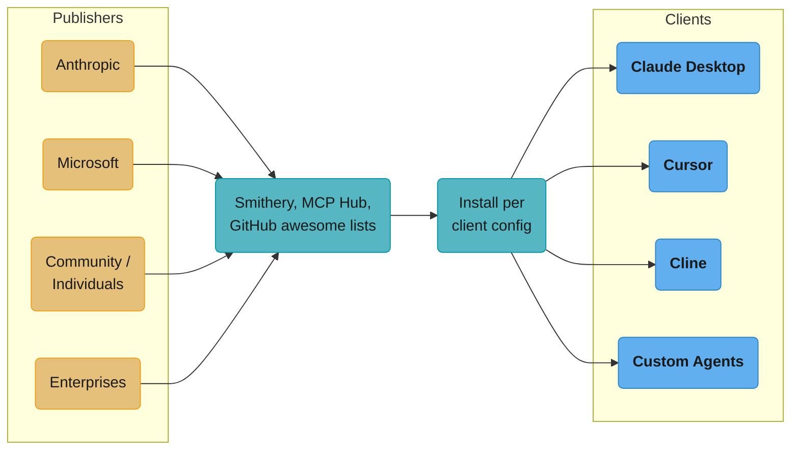

# MCP Registries and Ecosystem — Deep Dive
---

## 1. Concept Overview

The MCP ecosystem has grown from a handful of reference servers (filesystem, github) at launch (November 2024) to many thousands of servers indexed across several registries. The single most important structural change since launch is that MCP now has an **official registry** — `registry.modelcontextprotocol.io`, announced September 2025 and still labelled preview — which is the canonical metadata source that third-party marketplaces are expected to aggregate from. This deep-dive covers that registry and the third-party ones (Smithery, PulseMCP, MCP Hub), the `modelcontextprotocol/servers` reference implementations, popular community servers, installation patterns (Claude Desktop config, Cursor config, programmatic), versioning conventions, and how publisher trust is actually established.

For developers building agent systems, the ecosystem question is two-sided: which existing servers to use (saves you from writing wrappers around every API), and how to publish your own server (so others can use it — see [MCP Server Building](mcp_server_building.md)). Understanding the registry landscape and conventions is key to both.

---

## 2. Intuition

**One-line analogy**: MCP registries are to AI agents what npm/PyPI/cargo are to language ecosystems — a centralized way to discover, install, and version reusable components.

**Mental model**: An MCP server is a package. You install it (or configure your client to spawn it). It exposes tools, resources, prompts. A registry is the directory you browse to find new servers. There are two layers: the **official MCP Registry** holds `server.json` metadata pointing at packages on npm/PyPI/Docker Hub, and **downstream aggregators** (Smithery, PulseMCP, marketplaces) pull from it and add curation, ratings and install tooling. The official registry is explicitly *not* meant to be consumed directly by host applications.

**Why it matters**: Reusing community servers (rather than writing custom integrations) saves enormous engineering time. The Slack MCP server, Notion MCP server, GitHub MCP server are all already-written, maintained, and battle-tested. The cost is your config gets longer and security review is essential (see [MCP Security](mcp_security.md) for the full threat model).

**Key insight**: The ecosystem is still lightly governed — many useful servers, many low-quality or abandoned ones, and at least one confirmed malicious one (the September 2025 postmark-mcp npm package, which behaved correctly for fifteen releases before exfiltrating every email it sent). Treat MCP server installation with the same care as installing native software: trust the publisher, **pin versions**, monitor for changes. Note what the official registry does and does not give you — it authenticates the *namespace* (reverse-DNS names tied to a verified GitHub account or DNS domain) and delegates code scanning to npm/PyPI/Docker Hub and downstream aggregators. It is provenance, not an integrity guarantee.

---

## 3. Core Principles

- **Registry-based discovery**: browse, search, evaluate servers before install.
- **Publisher trust**: prefer servers from organizations (Anthropic, GitHub) over individuals.
- **Version pinning**: lock to specific versions; bump deliberately after review.
- **Capability transparency**: registry shows what tools/resources each server exposes.
- **Active maintenance signals**: recent commits, open issues addressed, popular = healthier.
- **Namespace verification**: the official registry ties every server name to a DNS- or GitHub-verified owner, so `io.github.acme/server` can only be published by that account. Cryptographic signing of the server *artifact* is not part of MCP.
- **Reuse over rewrite**: if a good server exists, use it; build your own only when nothing fits.

---

## 4. Types / Architectures / Strategies

### 4.1 Official MCP Registry (registry.modelcontextprotocol.io)

Announced September 2025, backed by Anthropic, GitHub, Microsoft and PulseMCP; **still in preview**, with breaking changes and data resets explicitly possible before GA. It stores `server.json` metadata — the server's reverse-DNS name, where to find the package or remote URL, execution instructions, and discovery data — and exposes a REST API plus a published OpenAPI spec that other registries can implement. It hosts metadata only, never code, and it does not accept private servers. Namespaces are claimed by GitHub, DNS or HTTP challenge.

### 4.2 Smithery (smithery.ai)

The most established third-party registry. Both stdio (auto-install via CLI) and hosted HTTP servers. Versioned, searchable, publisher accounts. Install via:

```bash
npx -y @smithery/cli install @modelcontextprotocol/server-filesystem --client claude
```

### 4.3 Reference Servers (github.com/modelcontextprotocol/servers)

Reference implementations described by the repo as "the small number of reference servers maintained by the MCP steering group" — MCP is governed by the Linux Foundation's Agentic AI Foundation, to which Anthropic donated it in December 2025. The repo also warns they are educational examples, not production-ready solutions. Highest quality bar; often the canonical implementation of common patterns. The active set is deliberately narrow: **everything, fetch, filesystem, git, memory, sequential-thinking and time**. For anything with a vendor-maintained server — GitHub, Postgres, Slack, Sentry, browser automation — use the vendor's own (`github/github-mcp-server`, `@playwright/mcp`); the community wrappers for those products live in `modelcontextprotocol/servers-archived`.

### 4.4 Community Server Lists and Aggregators

- PulseMCP, Smithery, MCP Hub, mcpservers.org and similar indices.
- "Awesome MCP Servers" GitHub lists curate community servers.

### 4.5 Built-into-Clients

Some clients (Claude Desktop, Cursor) ship with built-in MCP servers (filesystem, web search).

---

## 5. Architecture Diagrams



```
Install Flow (Smithery)
========================

  1. Browse smithery.ai/server/@author/server
  2. Copy install command:
     npx -y @smithery/cli install @author/server --client claude
  3. Smithery CLI:
     - downloads server package
     - asks for any required config (API keys, etc)
     - writes to client's MCP config file
     - prompts user to restart client


Common Servers Categorization
==============================

  File/Database:
    filesystem, sqlite, postgres, mongodb, redis

  Code/Dev:
    github, gitlab, git, sequential-thinking

  Communication:
    slack, discord, telegram, email

  Productivity:
    notion, linear, jira, asana, todoist

  Knowledge:
    brave-search, perplexity, exa, fetch

  Cloud:
    aws, gcp, cloudflare, vercel, fly

  Specialized:
    playwright (browser), code interpreter,
    image generation, voice synthesis
```

---

## 6. How It Works — Detailed Mechanics

### Installing via Smithery CLI

```bash
# Install filesystem server for Claude Desktop.
# NOTE: use a package name that actually exists — there is no
# "@anthropics/filesystem-mcp"; the reference package is
# @modelcontextprotocol/server-filesystem.
npx -y @smithery/cli install @modelcontextprotocol/server-filesystem --client claude

# Install for Cursor
npx -y @smithery/cli install @modelcontextprotocol/server-filesystem --client cursor

# List installed
npx -y @smithery/cli list

# Uninstall
npx -y @smithery/cli uninstall @modelcontextprotocol/server-filesystem --client claude
```

### Manual Claude Desktop Config

```json
{
  "mcpServers": {
    "filesystem": {
      "command": "npx",
      "args": ["-y", "@modelcontextprotocol/server-filesystem", "/Users/me/Documents", "/Users/me/Projects"]
    },
    "git": {
      "command": "uvx",
      "args": ["mcp-server-git", "--repository", "/Users/me/Projects/app"]
    },
    "fetch": {
      "command": "uvx",
      "args": ["mcp-server-fetch"]
    },
    "memory": {
      "command": "npx",
      "args": ["-y", "@modelcontextprotocol/server-memory"]
    },
    "remote-server": {
      "url": "https://my-mcp.example.com/mcp",
      "auth": {"type": "oauth", "client_id": "..."}
    }
  }
}
```

Path: `~/Library/Application Support/Claude/claude_desktop_config.json` (macOS).

Every package above is one of the seven maintained reference servers (`everything`, `fetch`, `filesystem`, `git`, `memory`, `sequentialthinking`, `time`). For GitHub, Postgres, Slack, search or browser automation, configure the vendor's own server — `github/github-mcp-server`, `@playwright/mcp`, and so on. Copied-in configs that still name `@modelcontextprotocol/server-github` and friends are pointing at `modelcontextprotocol/servers-archived`; repoint them at the vendor package.

### Publishing Your Own Server to Smithery

```bash
# 1. Build your server as npm package
npm init
# Add @modelcontextprotocol/sdk dependency
# Write server code

# 2. Publish to npm with smithery prefix
npm publish --access public

# 3. Submit to Smithery via their UI (smithery.ai/submit)
# Provide: package name, install command, config schema, descriptions

# 4. Smithery indexes it; users can install via CLI
```

### Programmatic Install (Custom Client)

```python
from collections.abc import AsyncIterator
from contextlib import asynccontextmanager

from mcp import ClientSession, StdioServerParameters
from mcp.client.stdio import stdio_client


# A function containing `yield` is an async GENERATOR, not an async context
# manager — `async with install_and_use(...)` fails with AttributeError unless
# it is wrapped with @asynccontextmanager.
@asynccontextmanager
async def install_and_use(
    server_package: str, env: dict | None = None
) -> AsyncIterator[ClientSession]:
    """Install via npx, connect, yield a live session."""
    params = StdioServerParameters(
        command="npx",
        args=["-y", server_package],
        env=env,
    )
    
    async with stdio_client(params) as (read, write):
        async with ClientSession(read, write) as session:
            await session.initialize()
            yield session


# Use
async with install_and_use("@modelcontextprotocol/server-filesystem") as session:
    tools = await session.list_tools()
```

---

## 7. Real-World Examples

**Most-downloaded `@modelcontextprotocol/*` servers on npm** (weekly downloads, npm registry API, late July 2026 — downloads are the only publicly published usage metric; nobody publishes an "install" count):
- `server-filesystem` — ~472K/week; access local files
- `server-sequential-thinking` — ~143K/week; reasoning aid
- `server-memory` — ~99K/week; persistent agent memory
- `server-everything` — ~66K/week; feature/test reference server

Read that list with one caveat: archived packages still post comparable numbers (`server-postgres` ~129K/week, `server-github` ~128K, `server-slack` ~90K) because unpinned configs copied from old tutorials keep pulling them. Download volume is a lagging indicator of tutorial reach, not of maintenance status — never use it as a health signal on its own.

**Enterprise patterns**:
- Internal registries (private Smithery deployment, internal npm)
- Curated allowlist of approved community servers
- Internal forks of community servers with custom auth

---

## 8. Tradeoffs

| Approach | Setup | Pros | Cons |
|---|---|---|---|
| Use Smithery CLI | Lowest | One-command install | Trust the registry |
| Manual config | Medium | Full control | Maintain manually |
| Build your own | High | Custom logic | More to maintain |
| Internal registry | High setup | Org-wide governance | Infra to run |

---

## 9. When to Use / When NOT to Use

**Use existing community servers when:**
- Common integration (Slack, GitHub, databases)
- Server is from trusted publisher (Anthropic, well-known org)
- Functionality matches your needs

**Build your own when:**
- Internal API specific to your org
- Need custom auth or compliance
- Existing servers have security/reliability concerns

**Use internal registry when:**
- Multiple teams using MCP
- Compliance requires reviewed/approved servers only
- Want centralized auth and audit

---

## 10. Common Pitfalls

### Pitfall 1: Auto-update breaking workflows

```bash
# BROKEN: no version pin
"command": "npx",
"args": ["-y", "@some/mcp-server"]
# Server updates to v2.0; tool names change; agent breaks
```

```bash
# FIXED: pin version
"command": "npx",
"args": ["-y", "@some/mcp-server@1.4.2"]
```

### Pitfall 2: Installing without reviewing capabilities

```bash
# BROKEN: install based on "looks useful" without inspecting
npx -y @random/social-server
# Server has `post_to_any_url` tool — agent can be tricked into posting elsewhere
```

```bash
# FIXED: install, list tools, review BEFORE giving to LLM
npx @modelcontextprotocol/inspector @random/social-server
# Review tool descriptions; only enable in Claude config after review
```

**War story**: A startup's product team installed a community MCP server for a popular SaaS tool. Worked great in dev. In production, the server's tool list expanded after a silent upgrade (npx without version pin) to include a "send_arbitrary_email" tool that could be tricked into exfiltrating data. Caught only via audit logs after weeks of operation. Migrated to version-pinned installs across the org.

---

## 11. Technologies & Tools

| Tool | Purpose |
|---|---|
| Smithery (smithery.ai) | Primary MCP registry |
| Smithery CLI | Install/manage MCP servers |
| MCP Hub (mcphub.io) | Alternative registry |
| `awesome-mcp-servers` (GitHub) | Curated community lists |
| `@modelcontextprotocol/servers` | Official reference servers (GitHub) |
| MCP Inspector | Test/preview servers before install |
| `claude_desktop_config.json` | Claude Desktop server config |
| Cursor MCP config | Cursor-specific |
| LangChain MCP adapter | Programmatic install for LangChain |

---

## 12. Interview Questions with Answers

**Q: What is Smithery and what role does it play in the MCP ecosystem?**
**Short:** The leading third-party MCP server registry, like npm for MCP, sitting downstream of the official MCP Registry since September 2025.
Smithery (smithery.ai) is the leading third-party MCP server registry — analogous to npm for Node, PyPI for Python. Its own registry API (`registry.smithery.ai/servers`) reported `pagination.totalCount` of 7,494 indexed servers on 30 July 2026 — check it there rather than trusting a quoted figure, since it moves weekly and PulseMCP's index (`api.pulsemcp.com/v0beta/servers` -> `total_count`, 22,141 the same day) counts a much wider set. It supports both stdio (auto-installed via CLI) and hosted HTTP servers. Provides search, versioning, publisher accounts. Since September 2025 it sits downstream of the official MCP Registry, which is the canonical metadata source aggregators are expected to pull from.

**Q: Where do I find the official MCP reference servers?**
**Short:** Seven educational examples in `modelcontextprotocol/servers` maintained by the steering group, not production-ready integrations.
GitHub at `modelcontextprotocol/servers`, maintained by the MCP steering group under the Linux Foundation's Agentic AI Foundation. Seven are active: everything, fetch, filesystem, git, memory, sequential-thinking and time. These are reference implementations — educational examples of "how to build this kind of server," explicitly not production-ready solutions. For a real product integration reach for the vendor's own server (`github/github-mcp-server`, `@playwright/mcp`); the community wrappers that used to cover those products sit in `modelcontextprotocol/servers-archived`.

**Q: How do I install an MCP server for Claude Desktop?**
**Short:** Use the Smithery CLI's install command, or manually add a server entry to `claude_desktop_config.json` and restart the app.
Either: (1) use Smithery CLI: `npx -y @smithery/cli install @author/server --client claude`. (2) Manually edit `claude_desktop_config.json` — add server entry with command/args/env. Restart Claude Desktop to load.

**Q: Why pin MCP server versions?**
**Short:** An unpinned automated update can silently add, remove, or rename tools and break your agent's behavior overnight.
Server upgrades may add/remove/rename tools, changing your agent's behavior. Pin to known-good version to lock behavior. Bump deliberately after review. Without pinning, an automated server update can break production overnight.

**Q: What's the difference between stdio and hosted Smithery servers?**
**Short:** stdio installs and runs the server locally as a subprocess, while hosted runs it in Smithery's cloud reached over a URL.
Stdio: server is an npm/pip package that the Smithery CLI installs and configures to run locally as subprocess. Hosted: server runs in Smithery's cloud; you connect via URL. Stdio offers more control (server runs in your environment); hosted is zero-infra for the user.

**Q: How do I publish a server to Smithery?**
**Short:** Package it as an npm module using the MCP SDK, publish publicly, then submit it through Smithery's review and indexing UI.
(1) Build server as a package (typically npm with `@modelcontextprotocol/sdk`). (2) Publish to npm with public access. (3) Submit to Smithery via their submission UI — provide package name, install command, config schema, capability description. Smithery reviews and indexes.

**Q: What's signed servers and when will it be standard?**
**Short:** Cryptographic package signing isn't part of the protocol yet; the registry only authenticates namespace ownership, not code integrity.
Cryptographic signing of MCP server artifacts is still not part of the protocol as of the 2025-11-25 revision or the 2026-07-28 release candidate. The idea is that a publisher signs the package (Sigstore-style) and clients verify the signature on install, defeating tampered-package supply-chain attacks. What actually shipped instead is weaker: the official MCP Registry authenticates *namespaces* — reverse-DNS names like `io.github.acme/server` proven via a GitHub account, DNS record or HTTP challenge — and delegates artifact scanning to npm/PyPI/Docker Hub. Treat that as provenance for the name, not integrity for the code. Signing is not on the current roadmap's priority areas, so do not assume a date; version pinning remains the load-bearing control.

**Q: How do enterprises manage MCP server adoption?**
**Short:** Run an internal registry with an approved-server allowlist, per-server security review, centralized OAuth, and audit logging of all calls.
Internal registry (private Smithery deployment or internal artifact server). Allowlist of approved servers. Security review process per server (review tool descriptions, audit code, check publisher). Centralized auth via OAuth gateway. Audit logging of all MCP calls.

**Q: What's the "memory" MCP server and what's it for?**
**Short:** A persistent store exposing read/write tools so an agent retains facts and preferences across sessions, backed by a file, SQLite, or vector DB.
Persistent memory store for agents — exposes tools to read/write knowledge across sessions. Common use: agent stores user preferences, facts learned, ongoing project context. Available in official servers list and several community variants (with different backends — JSON file, SQLite, vector DB).

**Q: How do you discover which MCP server to use for a given integration?**
**Short:** Search the official MCP Registry or an aggregator like Smithery, check the reference servers, or browse an awesome-mcp-servers list.
(1) Search the official MCP Registry (`registry.modelcontextprotocol.io`) or an aggregator like Smithery or PulseMCP by keyword. (2) Check the seven reference servers in `modelcontextprotocol/servers`. (3) Browse "awesome-mcp-servers" GitHub. (4) Check the SaaS tool's docs — many list MCP servers. If nothing exists, you'll likely need to build one.

**Q: Can MCP servers self-update?**
**Short:** No -- per spec, updates only happen through the package manager, not any automatic in-protocol mechanism.
No automatic self-update mechanism per spec. Updates happen via the package manager (`npm update`, `pip install --upgrade`). Some clients (Smithery) help facilitate. Manual config edits do not auto-update.

**Q: What's the lifecycle of an MCP server you've installed?**
**Short:** Spawned or connected at session start, initialized, used for calls, then terminated or closed at shutdown -- typically one session long.
(1) Spawned by client at session start (stdio) or connected to (HTTP). (2) Initialize handshake. (3) Used for tool/resource calls. (4) On client shutdown, stdio servers terminate; HTTP sessions close. Per-server: typically lives for one client session.

**Q: How are MCP server bugs typically reported and fixed?**
**Short:** Filed as GitHub issues against the server's repo, with security-critical bugs triaged and fixed faster than the long tail.
GitHub issues against the server's repo (Smithery links to repos). Maintainers fix and publish new versions. Users update via package manager. For the reference servers: the MCP steering group triages. Critical bugs (security) get fast fixes; long tail may sit for weeks.

**Q: What's the role of the MCP Inspector in the ecosystem?**
**Short:** The standard CLI/browser tool for testing a server locally, listing its tools and resources, and inspecting raw JSON-RPC traffic.
MCP Inspector (`npx @modelcontextprotocol/inspector <server-cmd>`) is the standard tool to: test servers locally, inspect tool/resource lists, manually call tools, view JSON-RPC traffic. Essential for both server developers (verify their server) and integrators (preview a server before integrating).

**Q: Are there enterprise MCP server marketplaces?**
**Short:** Yes, and first-party vendor servers (GitHub, Atlassian, Stripe, and others) are now the norm rather than community wrappers.
Yes, and first-party vendor servers are now the norm rather than the exception. Smithery has a paid tier for enterprises, and the official registry's API is explicitly designed so organizations can stand up private sub-registries on top of it. Most major SaaS vendors now ship their own MCP server (GitHub, Atlassian, Linear, Stripe, Cloudflare, Sentry and others) instead of leaving it to community wrappers — which is exactly why the community reference servers for those products were archived. The 2026 roadmap's Enterprise Readiness track (audit trails, SSO-integrated auth, gateway patterns, configuration portability) is where the remaining enterprise gaps are being worked, mostly as extensions rather than core spec changes.

---

## 13. Best Practices

1. Always install MCP servers from trusted publishers; review tool capabilities first.
2. Pin server versions in config — `@scope/server@1.2.3` not just `@scope/server`.
3. Use MCP Inspector to preview server tools before adding to your client.
4. For enterprises: deploy internal registry with allowlist of approved servers.
5. Subscribe to server repos on GitHub to get notifications on releases.
6. Read changelogs before upgrading; major version bumps may have breaking changes.
7. For your own servers: publish to Smithery for discoverability if useful broadly.
8. Document server config requirements (env vars, API keys) clearly.
9. Test servers in dev before adding to production agents.
10. Monitor audit logs after install — abnormal tool usage may indicate compromise.

---

## 14. Case Study

**Internal MCP Registry at a Tech Company**

**Context**: A 1500-person tech company deployed Claude / Cursor across engineering teams. Initially developers installed MCP servers ad-hoc; security flagged: no audit, no version control, no allowlist.

**Solution**: Internal MCP registry built on JFrog Artifactory + custom UI.

**Architecture**:
- Internal Smithery-like UI for browsing approved servers
- All MCP servers vendored as private npm packages in Artifactory
- New server submissions go through security review (1-2 week SLA)
- Approved servers tagged with: publisher (internal/community), version, capabilities, scope
- Client configs distributed via mdm tools (Jamf for Mac); employees can't manually edit
- Audit pipeline: every MCP call → Splunk; per-team dashboards

**Server categories**:
- Internal-built (12): Salesforce wrapper, Jira wrapper, internal API gateways, etc
- Approved community (8): filesystem, git, fetch, memory, `github/github-mcp-server`, etc
- Rejected (24): various security concerns — dynamic code execution, overly broad scopes, low quality

**Results in 6 months**:
- 100% of MCP usage through registry (compared to wild west before)
- 0 security incidents related to MCP (vs 2 close calls before centralization)
- Quarterly review caught 3 servers requiring updates due to upstream vulnerabilities
- Developer satisfaction: 6.8/10 (some friction; tradeoff for security)

**Lessons**:
1. Curating to ~20 servers covered 90% of developer needs; the long tail of community servers was mostly unnecessary.

**Put simply.** "Two thirds of one percent of the ecosystem covered ninety percent of what 1,500
engineers actually needed — the registry is enormous, and almost none of it is load-bearing."

This is the single most useful number in the module, because it decides the whole allowlist
argument. If curation cost 40% of coverage it would be a genuine tradeoff; at this ratio it is
close to free.

```
  coverage_efficiency = coverage_achieved / (servers_curated / servers_available)

  approval_rate = approved / reviewed
```

| Symbol | What it is |
|--------|------------|
| `servers_available` | ~3,000 — the illustrative catalogue size this scenario assumes (see note) |
| `servers_curated` | ~20 the company approved (12 internal + 8 community) |
| `coverage_achieved` | 90% of developer needs met by those 20 |
| `reviewed` | Every submission that went through security review: 20 approved + 24 rejected |

**On `servers_available`.** No registry publishes a cross-registry, de-duplicated server count,
so the 3,000 here is a scenario constant, not a measurement — it is what makes the 0.67% below a
worked example rather than a statistic. Current per-registry counts *are* machine-readable and
worth checking before you reuse the number: Smithery's registry API
(`registry.smithery.ai/servers` -> `pagination.totalCount`) returned **7,494** and PulseMCP's
(`api.pulsemcp.com/v0beta/servers` -> `total_count`) returned **22,141**, both on 30 July 2026.
The argument is scale-free either way — re-run it against 22,141 and 20 curated servers is 0.09%
of the catalogue, which only sharpens the conclusion.

**Walk one example.** Curation ratio and coverage, side by side:

```
  servers curated / available : 20 / 3,000 = 0.67% of the ecosystem
  developer needs covered     :              90%

  -> 0.67% of the catalogue does 90% of the work
     the remaining 99.3% competes for the last 10%
```

Now the review funnel, which is where the security cost actually lands:

```
  reviewed : 20 approved + 24 rejected = 44 submissions
  approval_rate = 20 / 44 = 45.5%       -> more than half were turned away

  of community submissions specifically:
     8 approved of 32 considered = 25%   -> 3 in 4 community servers rejected
```

The 25% community pass rate is the number that justifies the whole program. If community servers
cleared review 90% of the time, the registry would be pure bureaucracy — a gate that never
catches anything. At 25%, three of every four ad-hoc installs a developer would have made
unsupervised carried a real concern (dynamic code execution, overly broad scopes, low quality).
The pre-registry "wild west" was not hypothetically risky; it was admitting servers at four times
the rate review would allow.

Set that against the same case study's `0` MCP security incidents in six months versus 2 close
calls before, and lesson 4's split — internal builds were "80% of the work but 100% of the
security peace of mind" — reads as the natural consequence: the 12 internal servers cost the most
effort precisely because they are the ones no external review could ever have validated.
2. The 1-2 week review SLA pushed back on some adoption; faster review process being investigated.
3. Audit pipeline revealed which servers were actually used → guided which ones to maintain/improve.
4. Building internal servers for company-specific tools was 80% of the work but 100% of the security peace of mind.
