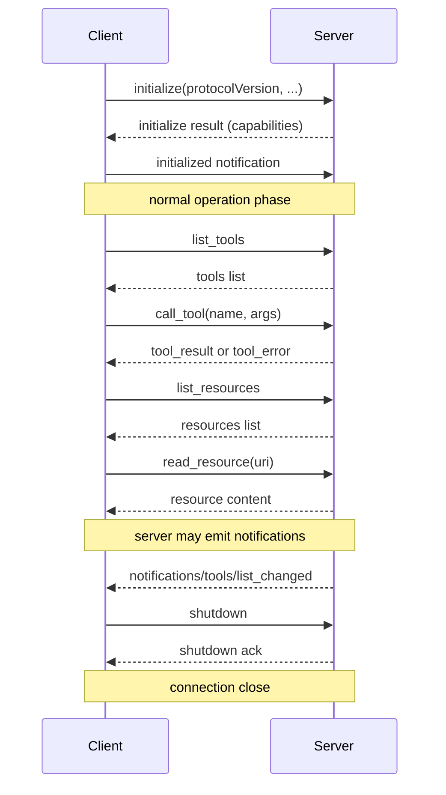

# Building MCP Servers — Deep Dive

---

## 1. Concept Overview

MCP servers expose data, capabilities, and prompts to LLM clients (Claude Desktop, Cursor, custom agents) through a standardized protocol. A well-built MCP server is the canonical way to make a tool, dataset, or API LLM-accessible — any MCP-aware client can use it without bespoke integration code.

This deep-dive covers building MCP servers from scratch: the four primitives (Resources, Tools, Prompts, Sampling), the lifecycle (initialize → operate → shutdown), the Python and TypeScript SDKs, common server patterns (filesystem, database, web search, internal API wrappers), and testing with MCP Inspector. A minimal Python MCP server is ~50 lines; a production server with auth, logging, and error handling is 200-400 lines.

---

## 2. Intuition

**One-line analogy**: An MCP server is to LLMs what a USB-C device is to a laptop — a standardized way to plug in capability without writing custom drivers per client.

**Mental model**: Your MCP server is a long-running process (subprocess for local, HTTP service for remote) that listens for JSON-RPC requests. The client sends `list_tools`, `call_tool`, `list_resources`, `read_resource` requests; your server handles them and returns JSON-RPC responses. The SDK handles the protocol plumbing; you implement the business logic.

**Why it matters**: Without MCP, every new tool requires writing per-client integration code — for Claude Desktop, for Cursor, for your custom agent. With MCP, one server works with all clients. The ecosystem effect is large: a Slack MCP server, written once, instantly usable by every MCP client.

**Key insight**: Resources are for stateful data (files, records); Tools are for actions (calls with side effects). Conflating them produces awkward APIs — a `read_file` should be a Resource (URI-addressable), not a Tool (action). Get this distinction right, and your server feels natural to LLM clients.

---

## 3. Core Principles

- **Four primitives**: Resources (data), Tools (actions), Prompts (templates), Sampling (server-requested LLM call).
- **JSON-RPC 2.0**: protocol message format (request, response, notification).
- **Capability negotiation**: server declares what it supports at initialize.
- **Strongly typed schemas**: tool input_schema with JSON Schema; LLM uses it for arg construction.
- **Idempotent reads, side-effecting writes**: Resources should be safe to re-read; Tools may have effects.
- **Clear error semantics**: distinguish protocol errors (4xx/5xx-like) from tool errors (returned in result).
- **Lifecycle correct**: initialize → ready → operate → shutdown.

---

## 4. Types / Architectures / Strategies

### 4.1 Local stdio Server

Subprocess launched by client; communicates via stdin/stdout. Most secure (no network); ideal for filesystem, local databases.

### 4.2 Remote HTTP Server (Streamable HTTP)

HTTP service; clients connect via URL. Supports both stateless and stateful sessions. Best for cloud services accessed by many users.

### 4.3 Resource-Focused Server (Read-Only Data)

Exposes documents, records, configs as URIs. Examples: filesystem, S3 bucket, Postgres schema.

### 4.4 Tool-Focused Server (Actions)

Exposes API operations. Examples: GitHub create-issue, Linear search-tasks, Stripe create-charge.

### 4.5 Prompt-Focused Server (Reusable Templates)

Hosts prompt templates clients can invoke. Examples: code review prompt, SQL generation prompt.

### 4.6 Composite Server

All four primitives. Examples: AWS MCP server with EC2 resources + actions + setup prompts + sampling-driven analysis.

---

## 5. Architecture Diagrams

### MCP Server Lifecycle



The lifecycle is initialize (capability negotiation) → operate (list/call tools, read resources, server-emitted notifications) → shutdown; every message on the wire is JSON-RPC 2.0.

### Server Composition

```
  +-------------+
  |  MCP Server |
  +------+------+
         |
   +-----+--------+--------+--------+
   |              |        |        |
   v              v        v        v
 Resources    Tools     Prompts  Sampling
   |              |        |        |
  read_file    create_pr  pr_review  (server asks
  read_db_row  query_db   sql_gen     client to call
                                      its LLM)
```

---

## 6. How It Works — Detailed Mechanics

### Python MCP Server (Minimum Viable)

```python
import asyncio
import logging
from mcp.server.fastmcp import FastMCP
from typing import Annotated
from pydantic import Field

logging.basicConfig(level=logging.INFO)

# FastMCP simplifies server creation
mcp = FastMCP("filesystem-server")


# Tool: action with side effects
@mcp.tool()
async def write_file(
    path: Annotated[str, Field(description="Absolute file path")],
    content: Annotated[str, Field(description="File contents")],
) -> str:
    """Write content to a file. Overwrites if exists."""
    try:
        with open(path, "w") as f:
            f.write(content)
        return f"Wrote {len(content)} chars to {path}"
    except Exception as e:
        return f"Error: {e}"


# Resource: read-only data accessed by URI
@mcp.resource("file://{path}")
async def read_file_resource(path: str) -> str:
    """Read a file as a resource."""
    with open(path) as f:
        return f.read()


# Prompt: reusable template
@mcp.prompt()
def code_review_prompt(language: str, code: str) -> str:
    """Generate a code review request prompt."""
    return f"Review this {language} code for correctness, style, and security:\n\n{code}"


if __name__ == "__main__":
    mcp.run()  # stdio transport by default
```

### TypeScript MCP Server

```typescript
import { Server } from "@modelcontextprotocol/sdk/server/index.js";
import { StdioServerTransport } from "@modelcontextprotocol/sdk/server/stdio.js";
import {
  CallToolRequestSchema,
  ListToolsRequestSchema,
} from "@modelcontextprotocol/sdk/types.js";

const server = new Server(
  { name: "github-server", version: "1.0.0" },
  { capabilities: { tools: {} } }
);

server.setRequestHandler(ListToolsRequestSchema, async () => ({
  tools: [
    {
      name: "create_issue",
      description: "Create a GitHub issue in a repo",
      inputSchema: {
        type: "object",
        properties: {
          repo: { type: "string", description: "owner/repo" },
          title: { type: "string" },
          body: { type: "string" },
        },
        required: ["repo", "title"],
      },
    },
  ],
}));

server.setRequestHandler(CallToolRequestSchema, async (request) => {
  if (request.params.name === "create_issue") {
    const { repo, title, body } = request.params.arguments as {
      repo: string; title: string; body?: string;
    };
    // Call GitHub API (pseudocode)
    const issueId = await github.createIssue(repo, title, body);
    return {
      content: [{ type: "text", text: `Created issue #${issueId} in ${repo}` }],
    };
  }
  throw new Error("Unknown tool");
});

const transport = new StdioServerTransport();
await server.connect(transport);
```

### Production-Grade Server with Auth, Logging, Errors

```python
import asyncio
import logging
import os
from mcp.server.fastmcp import FastMCP, Context
from mcp.types import TextContent
import httpx

logging.basicConfig(level=logging.INFO)
logger = logging.getLogger("github-mcp")

mcp = FastMCP("github-server")
GITHUB_TOKEN = os.environ["GITHUB_TOKEN"]


@mcp.tool()
async def create_issue(
    ctx: Context,
    repo: str,
    title: str,
    body: str = "",
) -> str:
    """Create a GitHub issue.
    
    Args:
        repo: owner/repo (e.g., 'anthropics/claude-code')
        title: Issue title
        body: Issue body (Markdown)
    """
    # Input validation
    if "/" not in repo or repo.count("/") != 1:
        return "Error: repo must be in 'owner/repo' format"
    if not title.strip():
        return "Error: title cannot be empty"
    
    # Log with context
    logger.info(f"create_issue called: repo={repo}, title={title[:50]}")
    
    # Side effect with proper error handling
    async with httpx.AsyncClient(timeout=15) as client:
        try:
            response = await client.post(
                f"https://api.github.com/repos/{repo}/issues",
                headers={
                    "Authorization": f"Bearer {GITHUB_TOKEN}",
                    "Accept": "application/vnd.github+json",
                },
                json={"title": title, "body": body},
            )
            response.raise_for_status()
            issue = response.json()
            return f"Created issue #{issue['number']}: {issue['html_url']}"
        except httpx.HTTPStatusError as e:
            logger.error(f"GitHub API error: {e.response.status_code}")
            return f"GitHub API error {e.response.status_code}: {e.response.text[:200]}"
        except Exception as e:
            logger.exception("Unexpected error in create_issue")
            return f"Unexpected error: {e}"


if __name__ == "__main__":
    mcp.run()
```

### Test with MCP Inspector

```bash
# MCP Inspector — interactive UI for testing servers
npx @modelcontextprotocol/inspector python my_server.py
# Opens browser; lets you call tools, inspect resources, view JSON-RPC traffic
```

---

## 7. Real-World Examples

**Official servers** (anthropics/mcp-servers, Anthropic-maintained): filesystem, github, gitlab, postgres, sqlite, slack, brave-search, sequential-thinking, puppeteer.

**Community servers**: Linear, Notion, Jira, Confluence, AWS, GCP, Stripe, Square, Snowflake, BigQuery, MongoDB, Redis, Elasticsearch, Cloudflare, Vercel, Sentry, PagerDuty, Datadog, hundreds more.

**Internal enterprise servers**: company-specific Salesforce wrappers, internal API gateways, custom DB query servers.

---

## 8. Tradeoffs

| Approach | Setup Complexity | Security | Best For |
|---|---|---|---|
| FastMCP (Python) | Lowest | Stdio inherits process privileges | Quick prototypes, simple servers |
| Bare Python SDK | Medium | Same | Custom protocol handling needs |
| TypeScript SDK | Medium | Same | TS/Node ecosystems |
| HTTP server | High | Network exposure | Multi-tenant cloud services |
| MCP-over-HTTP via gateway | High | Centralized auth | Enterprise deployments |

---

## 9. When to Use / When NOT to Use

**Build an MCP server when:**
- You have a tool/data source many LLM clients should access
- Want to expose a service across multiple agent frameworks
- Need standardized auth/transport for LLM access
- Internal API used by multiple AI teams

**Skip MCP when:**
- Tightly-coupled agent with single tool — direct integration simpler
- Latency-critical hot path (MCP adds a process hop)
- One-off scripts

---

## 10. Common Pitfalls

### Pitfall 1: Tool description too vague

```python
# BROKEN: LLM doesn't know when to call
@mcp.tool()
async def query(sql: str) -> str:
    """Run a query."""  # Vague — query what? SQL dialect?
```

```python
# FIXED: detailed
@mcp.tool()
async def query_orders_db(sql: str) -> str:
    """Execute a read-only SQL query against the orders database (PostgreSQL).
    
    Schema: orders(id, customer_id, amount_cents, status, created_at).
    Use this for: order status, customer order history, sales aggregates.
    """
```

### Pitfall 2: Returning errors as success

```python
# BROKEN: tool error returned as TextContent — LLM thinks it succeeded
@mcp.tool()
async def get_user(user_id: str) -> str:
    user = db.get(user_id)
    if not user:
        return ""  # LLM sees empty string, may continue as if found user
```

```python
# FIXED: explicit error in return
@mcp.tool()
async def get_user(user_id: str) -> str:
    user = db.get(user_id)
    if not user:
        return f"User {user_id} not found in database"  # LLM understands error
```

**War story**: A team built an internal Snowflake MCP server. Worked great until LLMs started "creatively" interpreting cryptic error messages. After expanding error messages to include context ("Query failed: ORA-00942: table 'salse' doesn't exist — did you mean 'sales'?"), agent success rate jumped from 60% to 88%.

---

## 11. Technologies & Tools

| Tool | Purpose |
|---|---|
| `mcp` Python SDK | Server + client |
| `@modelcontextprotocol/sdk` (TS) | Server + client |
| FastMCP (Python) | Higher-level decorator API |
| MCP Inspector | Interactive testing UI |
| `mcp-cli` | Command-line client for testing |
| Smithery | Server registry / install CLI |
| GitHub `modelcontextprotocol/servers` | Reference implementations |

---

## 12. Interview Questions with Answers

**What are the four MCP primitives and how do they differ?**
Resources (URI-addressable read-only data — files, records); Tools (callable functions with potential side effects — actions); Prompts (reusable prompt templates clients can invoke); Sampling (server requests client to call an LLM on its behalf). Resources are for "show me X"; Tools are for "do X".

**What's the difference between FastMCP and the bare Python SDK?**
FastMCP is a higher-level wrapper using decorators (`@mcp.tool()`, `@mcp.resource()`) — closer to FastAPI ergonomics. Bare SDK gives you direct access to request handlers (more code, more control). FastMCP is recommended for most server implementations.

**How does capability negotiation work at initialize?**
Client sends `initialize` with protocolVersion and its capabilities (e.g., sampling support). Server responds with its capabilities (resources/tools/prompts available). Both parties know what the other supports. Notifications about list changes (e.g., `notifications/tools/list_changed`) are only sent if the recipient supports them.

**Why use stdio vs HTTP transport?**
Stdio: client launches server as subprocess; communicates via stdin/stdout. Simplest, most secure (no network), good for local tools. HTTP (Streamable HTTP, since 2025): server runs as HTTP service; multiple clients can connect. Required for remote/cloud servers. Choose based on deployment model.

**What's the right way to describe a tool?**
Description should answer: what does this tool do? When should the LLM use it? What does it return? Include example use cases. The LLM reads the description to decide when to call — vague descriptions cause missed or wrong calls. Augment with type hints + Pydantic Field descriptions for parameters.

**How do you handle errors in tools?**
Return the error as the tool's result text (so the LLM sees and can react), not as a protocol-level exception. Include enough context for the LLM to either retry with different arguments or report failure to the user. Example: "Query failed: column 'usr_id' not found. Available columns: id, user_id, name."

**What's the role of the MCP Inspector?**
Inspector is a browser-based testing UI: launches your server, lets you call tools, inspect resources, view raw JSON-RPC traffic. Essential for development — much faster than testing through a real LLM client.

**How do you secure an MCP server?**
For stdio servers: rely on subprocess privileges (server runs as user that launched it). For HTTP servers: authenticate clients (OAuth 2.0 per 2025 spec, API keys, mTLS). Validate all tool inputs. Never trust tool descriptions from untrusted servers (prompt injection risk).

**Can MCP servers have state across calls?**
Yes — server is a long-running process; you can hold state in memory or external storage. Example: cache database connections, maintain session tokens. Be careful with state in HTTP servers if you have multiple instances (use Redis/external store).

**How do you handle long-running operations?**
Per MCP spec, tools should return within a reasonable timeout. For longer operations (>30s): (1) submit operation, return task_id immediately; (2) provide a separate tool to poll task status; (3) consider sending progress notifications (some clients support).

**What's prompt sampling and when do servers use it?**
Sampling lets the server ask the client to make an LLM call on its behalf. Example: a Git MCP server might ask the client's LLM to summarize a diff (using the client's model + auth). Lets servers use AI capabilities without bundling their own API keys.

**How do you version an MCP server?**
Semantic versioning. Breaking changes to tool schemas or behavior require major version bumps. Communicate version in server metadata. Clients should pin versions for stability. Use additive changes (new optional fields) where possible.

**How does an MCP server expose static documentation?**
As Prompts (if templated) or Resources (if static). Example: docs as `doc://api/users` resources, each returning Markdown. Or as a single resource at `doc://overview` returning a table of contents. Clients can list/read these to give the LLM background knowledge.

**Can MCP servers call other MCP servers?**
The MCP protocol is client-server; servers don't call other servers natively. But a server's tool implementation could itself be an MCP client to another server — chaining is possible at the implementation level. This is uncommon; usually one client orchestrates multiple servers.

**How do you handle file uploads/downloads through MCP?**
MCP supports binary content via base64-encoded resources or tool results. For large files, prefer URIs that the client can fetch directly (e.g., S3 pre-signed URLs returned by a tool). Avoid streaming gigabytes through JSON-RPC.

---

## 13. Best Practices

1. Use FastMCP (Python) or high-level SDK helpers — easier than bare SDK.
2. Write detailed tool descriptions; include use cases and example inputs.
3. Validate all tool inputs before executing; return clear errors to the LLM.
4. Use stdio transport for local-only servers; HTTP for multi-tenant cloud.
5. Test with MCP Inspector during development — much faster iteration than via Claude.
6. Log every tool call with parameters (sanitized) and outcome for debugging.
7. Use idempotency keys for side-effecting tools to be safe under retry.
8. Distinguish Resources (read-only) from Tools (actions) — don't blur the line.
9. Version your server; bump major on breaking changes to tool schemas.
10. Publish to Smithery (or similar) if useful broadly; reuse community servers when possible.

---

## 14. Case Study

**Internal Snowflake MCP Server at a Mid-Size Data Company**

**Context**: Data team had 50+ analysts using Snowflake. AI initiative wanted to give Claude (via Claude Desktop and internal Cursor users) access to query data for ad-hoc analysis without each analyst maintaining their own LLM integration.

**Architecture**:
- Python MCP server using FastMCP
- Tools: `list_databases`, `list_tables`, `describe_table`, `execute_query` (read-only)
- Resources: `snowflake://databases/{db}/tables/{table}/schema` (table schemas as resources)
- Auth: server uses service account with read-only role; per-user audit via context info
- Deployment: stdio transport; installed per-analyst via uvx (Python tool runner)

**Implementation highlights**:
- `execute_query` enforces read-only (rejects DML/DDL via SQL parser pre-check)
- Query timeout: 60 seconds; LIMIT clause auto-injected if missing (max 1000 rows)
- Results returned as Markdown table (LLM-friendly format)
- Schema info cached for 5 minutes to reduce Snowflake catalog queries

**Results**:
- 40 of 50 analysts using it daily within 6 weeks
- Average 12 queries/analyst/day via LLM (vs 8 manual queries/day before)
- ~$200/month additional Snowflake compute (mostly small ad-hoc queries)
- Zero accidental data modifications (read-only enforcement)
- Saved analysts ~20 min/day each on routine queries

**Lessons**:
1. Read-only enforcement was non-negotiable — protected against LLM-generated DROP TABLE.
2. Schema caching reduced Snowflake catalog query cost dramatically.
3. Markdown table results made the LLM responses immediately readable in Claude Desktop.
4. Per-analyst stdio install was simpler than centralized HTTP server for this team — no auth complexity.
