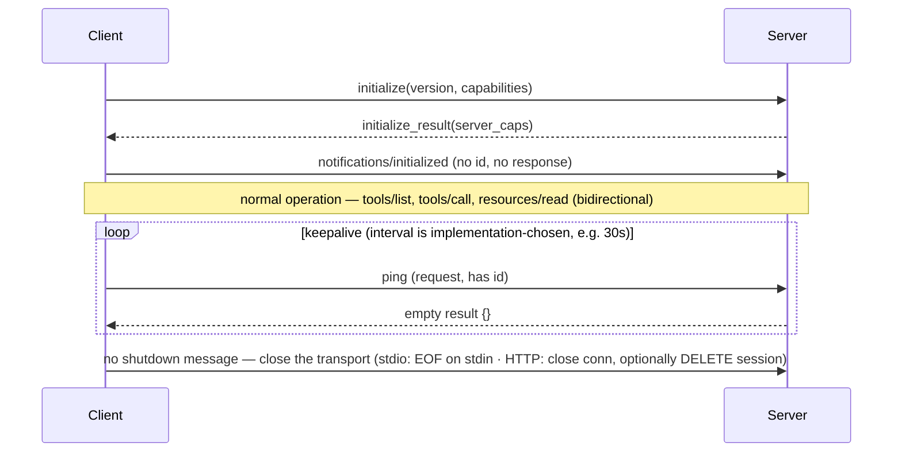

# MCP Transports and JSON-RPC — Deep Dive
Deep-dive sub-file of [MCP — Model Context Protocol](mcp_model_context_protocol.md).

---

## 1. Concept Overview

MCP uses JSON-RPC 2.0 as its message format over the two transports the spec standardizes: **stdio** (client spawns server as a subprocess, communicates via standard input/output streams) and **Streamable HTTP** (HTTP service receiving POST requests and optionally emitting Server-Sent Events). Clients SHOULD support stdio whenever possible; anything else is a custom, non-standardized transport.

This deep-dive covers the wire format (JSON-RPC 2.0 requests, responses, notifications), transport selection trade-offs (stdio vs HTTP), the Streamable HTTP transport in detail, connection lifecycle (handshake, ping, transport-level shutdown), reconnection and resumability semantics, and concrete latency numbers for each. It also covers one JSON-RPC feature MCP deliberately does **not** have: request batching — every message is its own POST. Descriptions here track the current released revision, `2025-11-25`.

---

## 2. Intuition

**One-line analogy**: MCP transports are like the difference between a Unix pipe (stdio: parent-child, intimate, fast) and an HTTP API (Streamable HTTP: anyone-anywhere, scalable, network-aware).

**Mental model**: JSON-RPC is the language; transports are the delivery mechanism. Every MCP message is `{"jsonrpc": "2.0", "id": 1, "method": "tools/call", "params": {...}}` (request) or `{"jsonrpc": "2.0", "id": 1, "result": {...}}` (response) or `{"jsonrpc": "2.0", "method": "notifications/...", "params": {...}}` (notification — no id, no response expected). Transport adds framing (how to know where one message ends and the next begins).

**Why it matters**: Transport choice affects latency, security, scalability, and deployment topology. Stdio is fast (~1-2ms message round-trip) but local-only. Streamable HTTP supports remote servers (10-50ms RTT) and multi-client serving. Get the transport choice wrong, and you'll fight infrastructure constraints.

**Key insight**: Streamable HTTP is *one* endpoint that serves both POST and GET, and the server decides per request whether to answer with a single JSON object or upgrade to a `text/event-stream`. That one-endpoint design is what lets the same server handle a stateless single-request client and a stateful streaming session without separate deployment topologies. The `2026-07-28` release candidate pushes further in the same direction, dropping the protocol-level session entirely so any request can land on any server instance.

---

## 3. Core Principles

- **JSON-RPC 2.0 contract**: id-based correlation and error codes. Batching is part of JSON-RPC but **not** of MCP — one message per POST, always.
- **Three message types**: request (id, expects response), response (echoes id), notification (no id, no response).
- **Stdio framing**: newline-delimited JSON-RPC over stdin/stdout; messages must not contain embedded newlines, and stdout carries nothing but MCP messages.
- **HTTP framing**: one POST per message; response may be JSON or an SSE stream.
- **Bidirectional**: server can send requests too (e.g., `sampling/createMessage`, `elicitation/create`).
- **Ordered delivery, unordered completion**: a single stdio or HTTP stream delivers messages in the order written, but the spec requires no in-order *processing* — a receiver may work on requests concurrently and reply out of order, which is exactly why every request carries an `id`.
- **Lifecycle hygiene**: initialize → operate → close the transport. There is no `shutdown` message; `ping` is the keepalive.

---

## 4. Types / Architectures / Strategies

### 4.1 Stdio Transport

Client spawns server as subprocess. Server reads requests from stdin (newline-delimited JSON-RPC), writes responses to stdout. Use for local tools (filesystem, local DB, single-user CLI).

### 4.2 Streamable HTTP Transport

Server is an HTTP service with a single MCP endpoint supporting both POST and GET. Client POSTs each message; server responds with either standard JSON (one-shot) or `text/event-stream` (SSE) for streaming responses. Optional stateful sessions via the `MCP-Session-Id` header, and the negotiated version must be echoed in `MCP-Protocol-Version` on every request after `initialize`.

Three operational rules the spec makes mandatory and SDK users still get wrong:

- **Validate `Origin` on every incoming connection** and answer 403 when it is present and invalid — without this, a web page can reach a locally bound MCP server via DNS rebinding. Bind local servers to `127.0.0.1`, not `0.0.0.0`.
- **A client GET opens a server→client SSE stream.** The server either returns `text/event-stream` or 405 to say it offers no such stream. Requests and notifications the server initiates ride this stream.
- **Resumability is per-stream.** If the server attaches `id` fields to SSE events, a disconnected client resumes by re-issuing a GET with `Last-Event-ID`; the server replays only messages from the stream that dropped, never from a different one. Disconnection is not cancellation — to cancel, send an explicit `CancelledNotification`.

### 4.3 Custom Transports

In theory, any reliable bidirectional message channel works. Some use cases: WebSocket transports, Unix domain sockets, named pipes. Not standardized.

---

## 5. Architecture Diagrams

```
JSON-RPC Message Types
=======================

Request:
  {
    "jsonrpc": "2.0",
    "id": 1,
    "method": "tools/call",
    "params": {"name": "create_issue", "arguments": {...}}
  }

Response (success):
  {
    "jsonrpc": "2.0",
    "id": 1,
    "result": {"content": [{"type": "text", "text": "..."}]}
  }

Response (error):
  {
    "jsonrpc": "2.0",
    "id": 1,
    "error": {"code": -32602, "message": "Invalid params"}
  }

Notification (no id, no response):
  {
    "jsonrpc": "2.0",
    "method": "notifications/tools/list_changed",
    "params": {}
  }


Stdio Transport Framing
========================

  Client stdin -> Server:
    {"jsonrpc":"2.0","id":1,"method":"initialize",...}\n
    {"jsonrpc":"2.0","method":"notifications/initialized"}\n
    {"jsonrpc":"2.0","id":2,"method":"tools/list"}\n

  Server stdout -> Client:
    {"jsonrpc":"2.0","id":1,"result":{...}}\n
    {"jsonrpc":"2.0","id":2,"result":{"tools":[...]}}\n

  Newline-delimited; one JSON object per line


Streamable HTTP Flow
=====================

  Stateless single request:
    Client: POST /mcp
            Body: {"jsonrpc":"2.0","id":1,"method":"tools/list"}
    Server: 200 OK, Content-Type: application/json
            Body: {"jsonrpc":"2.0","id":1,"result":{...}}

  Stateful session (multiple requests, one stream):
    Client: POST /mcp
            Header: MCP-Session-Id: abc123
            Header: MCP-Protocol-Version: 2025-11-25
            Body: {"jsonrpc":"2.0","id":1,"method":"...","params":{...}}
    Server: 200 OK, Content-Type: text/event-stream
            Body: data: {"jsonrpc":"2.0","id":1,"result":...}\n\n
                  data: {"jsonrpc":"2.0","method":"notifications/...","params":...}\n\n
```

Lifecycle Sequence:



The three-step handshake (initialize → InitializeResult → `notifications/initialized`) must complete before any tools/list call. Keepalive uses the MCP `ping` request, whose reply is an empty `result: {}` — there is no `pong` method, and the spec fixes no interval, only that it be configurable and not excessive.

---

## 6. How It Works — Detailed Mechanics

### Manual JSON-RPC over Stdio (Python)

```python
import json
import subprocess
import sys

# Spawn server subprocess
proc = subprocess.Popen(
    ["python", "my_server.py"],
    stdin=subprocess.PIPE,
    stdout=subprocess.PIPE,
    stderr=subprocess.PIPE,
    text=True,
    bufsize=1,  # Line-buffered
)


def send_message(msg: dict) -> None:
    """Send a JSON-RPC message to the server."""
    line = json.dumps(msg) + "\n"
    proc.stdin.write(line)
    proc.stdin.flush()


def read_message() -> dict:
    """Read one JSON-RPC message from the server."""
    line = proc.stdout.readline()
    if not line:
        raise ConnectionError("Server closed connection")
    return json.loads(line)


# Initialize handshake
send_message({
    "jsonrpc": "2.0",
    "id": 1,
    "method": "initialize",
    "params": {
        "protocolVersion": "2025-11-25",
        "capabilities": {"sampling": {}},
        "clientInfo": {"name": "my-client", "version": "1.0.0"},
    },
})
init_response = read_message()
print("Server capabilities:", init_response["result"]["capabilities"])

# Send initialized notification (no id, no response expected)
send_message({"jsonrpc": "2.0", "method": "notifications/initialized"})

# Now we can call tools
send_message({
    "jsonrpc": "2.0",
    "id": 2,
    "method": "tools/list",
})
tools_response = read_message()
for tool in tools_response["result"]["tools"]:
    print(f"  {tool['name']}: {tool['description']}")
```

### Streamable HTTP Client (Manual)

```python
import httpx
import json

class StreamableHTTPClient:
    PROTOCOL_VERSION = "2025-11-25"

    def __init__(self, url: str):
        self.url = url
        self.session_id: str | None = None
        self.protocol_version: str | None = None
        self.next_id = 1
        self.http = httpx.AsyncClient(timeout=60)

    async def call(self, method: str, params: dict = None) -> dict:
        """Single JSON-RPC call. The POST body MUST be exactly one request,
        notification, or response — MCP has no batch array."""
        message = {
            "jsonrpc": "2.0",
            "id": self.next_id,
            "method": method,
            "params": params or {},
        }
        self.next_id += 1

        headers = {"Content-Type": "application/json", "Accept": "application/json, text/event-stream"}
        if self.session_id:
            headers["MCP-Session-Id"] = self.session_id
        if self.protocol_version:
            # Required on every request after initialize when using HTTP.
            headers["MCP-Protocol-Version"] = self.protocol_version

        # Must stream: the server may answer with either one JSON object or an SSE
        # stream, and you cannot know which until the response headers arrive.
        async with self.http.stream("POST", self.url, json=message, headers=headers) as response:
            # Capture session ID from response (for stateful sessions)
            if "MCP-Session-Id" in response.headers:
                self.session_id = response.headers["MCP-Session-Id"]

            content_type = response.headers.get("Content-Type", "")
            if content_type.startswith("application/json"):
                await response.aread()
                return response.json()
            if content_type.startswith("text/event-stream"):
                # On an AsyncClient you must use aiter_lines(), not iter_lines().
                async for line in response.aiter_lines():
                    if line.startswith("data: "):
                        data = json.loads(line[6:])
                        if "result" in data or "error" in data:
                            return data
            raise ValueError(f"Unexpected content type: {content_type}")

    async def initialize(self) -> dict:
        result = await self.call("initialize", {
            "protocolVersion": self.PROTOCOL_VERSION,
            "capabilities": {},
            "clientInfo": {"name": "manual-http-client", "version": "1.0.0"},
        })
        # The server echoes the version it agreed to; that is what goes in the header.
        self.protocol_version = result["result"]["protocolVersion"]
        # Handshake is not complete until the client sends this notification.
        await self.notify("notifications/initialized")
        return result

    async def notify(self, method: str, params: dict = None) -> None:
        """Notifications have no id and get an HTTP 202 with no body."""
        headers = {"Content-Type": "application/json", "Accept": "application/json, text/event-stream"}
        if self.session_id:
            headers["MCP-Session-Id"] = self.session_id
        if self.protocol_version:
            headers["MCP-Protocol-Version"] = self.protocol_version
        await self.http.post(
            self.url,
            json={"jsonrpc": "2.0", "method": method, "params": params or {}},
            headers=headers,
        )


# Usage
client = StreamableHTTPClient("https://my-mcp.example.com/mcp")
init = await client.initialize()
tools = await client.call("tools/list")
```

### One Message per POST: Overlapping the Discovery Calls

MCP requires the Streamable HTTP body to be "a single JSON-RPC *request*, *notification*, or
*response*". Plain JSON-RPC 2.0 permits an *array* of requests; MCP does not, and a server is
free to reject one with 400. So startup capability discovery is three separate POSTs:

```json
// One message per POST. Discovery is three calls, not one array.
{"jsonrpc": "2.0", "id": 1, "method": "tools/list"}
{"jsonrpc": "2.0", "id": 2, "method": "resources/list"}
{"jsonrpc": "2.0", "id": 3, "method": "prompts/list"}
```

The three are independent, so issue them **concurrently** on the already-open connection and
they overlap in flight rather than serializing. The arithmetic below sizes that win — and, more
usefully, shows where it stops mattering.

**In plain terms.** "Three questions asked one after another cost three network round-trips;
the same three questions issued together cost about one — the payload barely changes, the
waiting collapses."

Concurrency does not make the server faster or the JSON smaller. It removes *serialization of
waiting*, which is why it only helps where the round-trip dominates and does nothing on stdio.

```
  serial_time     = fixed_overhead + n x RTT
  overlapped_time = fixed_overhead + 1 x RTT

  saving = (n - 1) x RTT / (fixed_overhead + n x RTT)
```

| Symbol | What it is |
|--------|------------|
| `n` | Discovery requests at startup: `tools/list`, `resources/list`, `prompts/list` — so 3 |
| `RTT` | One network round-trip. 10-50ms on Streamable HTTP, 1-2ms on stdio |
| `fixed_overhead` | Connection setup, TLS handshake, auth — paid once, unaffected either way |
| `saving` | Fraction of startup latency removed |

**Walk one example.** Startup capability discovery, at `RTT = 30ms` (mid-range HTTP):

```
  serial     : 3 x 30 = 90 ms of round-trips
  overlapped : 1 x 30 = 30 ms of round-trips
  pure RTT saving = 2/3 = 66.7%
```

The §14 gateway measured **40%**, not 66.7% — and the gap is the interesting part, because it
lets you solve for the fixed overhead you cannot see directly:

```
  (n-1) x RTT / (F + n x RTT) = 0.40
        2 x 30 / (F + 3 x 30) = 0.40
                    60 / (F + 90) = 0.40
                          F + 90 = 150
                               F = 60 ms     <- equals two round-trips

  check:  serial     = 60 + 90 = 150 ms
          overlapped = 60 + 30 =  90 ms
          saving     = 60/150  = 40%   matches the measured figure
```

So roughly 60ms of that gateway's startup is TLS handshake, OAuth validation, and connection
establishment — cost no amount of request folding can touch. That is the general shape:
**the ceiling is set by how much of your latency is not round-trips.** A system where `F` dwarfs
`n x RTT` gains almost nothing, no matter how many calls you overlap.

It also explains the transport asymmetry in the §8 table. On stdio at 1-2ms per message, three
discovery calls cost 3-6ms total — overlapping them saves single-digit milliseconds for added
concurrency complexity and no user-visible gain. This is a remote-transport optimization that is
merely harmless on local ones.

**Why the one-message rule is the right trade.** Folding the three calls into one array would
save a one-off `(n-1) x RTT` at startup and nothing after that; the price would be paid on every
message forever — servers correlating arrays of ids, an ambiguous streaming decision (which of
the N responses upgrades to SSE?), and a collision with the per-message `202 Accepted` rule for
notifications. Concurrent single-message requests recover most of the same saving with none of
that machinery, which is exactly why the wire contract stays at one message per POST.

### What the 2026-07-28 Revision Changes

Five separate notes above say "the release candidate removes X." They are one change, not five footnotes, and it lands squarely on this file's subject. The RC was locked 2026-05-21 and the final text publishes 2026-07-28 — the largest revision since launch, and it deletes the two things this chapter spends the most words on.

| 2025-11-25 | 2026-07-28 |
|------------|------------|
| `initialize` + `notifications/initialized` handshake | Removed. Protocol version, client info and capabilities travel in `_meta` on **every** request (`io.modelcontextprotocol/clientInfo`), plus required `MCP-Protocol-Version` and `Mcp-Method` headers |
| `Mcp-Session-Id` header and the protocol-level session | Removed. Every request is self-contained |
| Server-initiated SSE stream for mid-request questions | Multi Round-Trip Requests (MRTR): the server returns an `InputRequiredResult` (`resultType: "input_required"`, an `inputRequests` object, a base64 `requestState`); the client gathers answers and **re-issues the original call** with `inputResponses` and the echoed `requestState` |
| Roots, Sampling, Logging | Deprecated on 12-month windows — Roots gives way to tool parameters / resource URIs / server config, Sampling to calling your LLM provider directly, Logging to `stderr` on stdio and OpenTelemetry for structured observability |
| Ad-hoc `experimental` capabilities | Extensions framework: reverse-DNS ids negotiated through an `extensions` map on both sides' capabilities, developed in their own `ext-*` repositories |
| OAuth 2.1 + PKCE + RFC 8707 audience binding | Same, hardened: clients validate the `iss` parameter per RFC 9207 and declare an OpenID Connect `application_type` at registration |

Read that as one sentence: **MCP stops being a session protocol.** The spec's own framing of the payoff — "a remote MCP server that previously needed sticky sessions, a shared session store, and deep packet inspection at the gateway can now run behind a plain round-robin load balancer." The `Mcp-Method` header is the other half of that: the method name is readable at the edge without parsing the JSON body, which is what makes per-method routing and rate limiting a gateway concern instead of an application one.

MRTR is the subtler one. Under 2025-11-25 a server that needs to ask the user something mid-tool-call holds the request open and talks over SSE, so the pause is a *stream* the client must keep alive and resume with `Last-Event-ID`. Under MRTR the pause is a *return value* — the call ends, the client answers at its leisure, and the retry carries the server's own state blob back. Nothing has to stay connected, which is precisely why the session could be deleted.

Migration is client-first: a client that speaks 2026-07-28 falls back to the `initialize` handshake when it reaches a server on 2025-11-25 or earlier, so servers are not forced to move on day one. Everything else in this file describes 2025-11-25 and remains accurate for that revision.

---

## 7. Real-World Examples

**Claude Desktop**: spawns local servers over stdio (subprocess per server, in the user's process tree) and also connects to remote servers over Streamable HTTP as "connectors".

**Smithery-hosted MCP servers**: use Streamable HTTP for remote access; users connect by URL.

**Internal enterprise MCP gateway**: HTTP-based with auth proxy; multiple stdio servers behind it.

**Cursor MCP**: stdio for local servers; HTTP for cloud-hosted (e.g., browser automation services).

---

## 8. Tradeoffs

| Transport | Latency | Security | Scalability | Best For |
|---|---|---|---|---|
| Stdio | 1-2ms | High (no network) | One client per server | Local tools, single-user |
| Streamable HTTP | 10-50ms | TLS + auth + `Origin` check | Many clients per server | Cloud services, shared |

**The idea behind it.** "Stdio and HTTP differ by about 20x per message, which is invisible on
one call and turns into hours of aggregate waiting once an agent is making half a million of
them a day."

A single-message comparison makes the two transports look interchangeable — 1.5ms versus 30ms is
below human perception either way. Multiplying by call volume is what turns the row into an
architectural decision.

```
  total_wait = calls_per_day x latency_per_call
  ratio      = latency_http / latency_stdio
```

| Symbol | What it is |
|--------|------------|
| `calls_per_day` | Aggregate MCP traffic. 500,000/day at the §14 gateway |
| `latency_stdio` | 1-2ms — a pipe write plus a JSON parse. No network at all |
| `latency_http` | 10-50ms — TLS, HTTP framing, and a real network hop |
| `total_wait` | Cumulative time the system spends waiting, across all users |

**Walk one example.** The §14 gateway's measured 500K calls/day, priced both ways:

```
  stdio  @ 1.5 ms : 500,000 x 1.5 ms =    750,000 ms =  0.21 hours/day
  HTTP   @  30 ms : 500,000 x  30 ms = 15,000,000 ms =  4.17 hours/day
  per-call ratio  : 30 / 1.5 = 20x

  measured gateway P95 = 95 ms  ->  500,000 x 95 ms = 13.2 hours/day of aggregate wait
```

The P95 figure is the honest one to plan against: 95ms is above the 10-50ms table range because
the gateway adds its own hop — client to gateway, then gateway to backend — so a remote call
pays the network cost roughly twice, plus OAuth validation and audit logging on the way through.
Centralization is not free, and 95ms is what it costs here.

Which is exactly why the §14 lesson lands on a **hybrid**: Streamable HTTP at the edge, where you
need many clients, auth, and one URL to distribute — and stdio internally, where the gateway and
the backend server share a host and paying 30ms to cross a process boundary would be absurd. The
20x ratio is not an argument for stdio everywhere; it is an argument for spending network latency
only where the network is actually buying you something.

---

## 9. When to Use / When NOT to Use

**Use stdio when:**
- Server runs on user's machine (filesystem, local DB)
- Single user per server instance
- Low latency required
- No network egress allowed

**Use Streamable HTTP when:**
- Server is a shared cloud service
- Multiple users/clients per server
- Need OAuth-based auth
- Server can scale horizontally

---

## 10. Common Pitfalls

### Pitfall 1: Mixing notification and request semantics

```python
# BROKEN: sent a request that should have been a notification
send_message({
    "jsonrpc": "2.0",
    "id": 1,  # Has id! But it's a notification by spec
    "method": "notifications/initialized",
    "params": {},
})
# Server waits for response forever (you didn't send one)
```

```python
# FIXED: notifications have no id
send_message({
    "jsonrpc": "2.0",
    "method": "notifications/initialized",
    "params": {},
})
# No response expected
```

### Pitfall 2: Reading stdout when server writes to stderr too

```python
# BROKEN: server log noise on stdout breaks JSON-RPC parsing
proc.stdout.readline()  # Returns "INFO: starting up..." — not valid JSON!
```

```python
# FIXED: ensure server logs to stderr ONLY
# In Python MCP server:
logging.basicConfig(stream=sys.stderr)  # NOT sys.stdout!
# Stdio servers must keep stdout pristine for JSON-RPC only
```

**War story**: A team built a custom MCP server in Go that printed startup info to stdout. Client kept getting "Invalid JSON" errors. Took hours to diagnose because the error message blamed the client. Lesson: stdio MCP servers MUST log to stderr, never stdout — stdout is JSON-RPC only.

---

## 11. Technologies & Tools

| Tool | Purpose |
|---|---|
| JSON-RPC 2.0 spec | Wire format |
| MCP spec (2025-11-25; RC 2026-07-28) | Protocol + transports |
| `mcp` SDK | Hides transport details |
| MCP Inspector | Debug JSON-RPC traffic |
| `httpx` / `aiohttp` | HTTP client for Streamable transport |
| Server-Sent Events (SSE) spec | Streaming over HTTP |

---

## 12. Interview Questions with Answers

**Q: What's the difference between a request and a notification in JSON-RPC?**
**Short:** A request carries an id and expects a matching response; a notification has no id and gets no response at all.
Requests have an `id` field; the receiver MUST send a response with the same id. Notifications have no `id`; no response expected. The MCP `notifications/initialized` message is a notification (no id, no response). Mixing them up causes deadlocks (one party waits forever).

**Q: Why does MCP use JSON-RPC 2.0 specifically?**
**Short:** It is mature, simple, and language-agnostic with minimal machinery, though MCP drops batch arrays and forbids null ids from the base spec.
JSON-RPC 2.0 is mature (spec dated 2010), simple, language-agnostic, and models requests, responses and notifications with almost no machinery. Alternatives (gRPC, custom protocols) would add weight without benefit, and JSON is human-readable for debugging. MCP adopts the message model but not the whole spec — it has no batch arrays, forbids a `null` id, and requires ids to be unique per requestor within a session.

**Q: When should you use stdio vs HTTP transport?**
**Short:** stdio suits fast, single-user local tools; Streamable HTTP trades 10-50ms of round-trip latency for shared, multi-tenant scale.
Stdio for local tools (filesystem, local DB) — fastest, most secure, single-user per server. HTTP (Streamable HTTP) for shared cloud services, multi-tenant, requires network — adds 10-50ms RTT but enables scale.

**Q: How does a Streamable HTTP server decide between a JSON response and an SSE stream?**
**Short:** The server picks per request, so every client POST must accept both content types since the form isn't known until headers arrive.
The server chooses per request: it may answer a POSTed JSON-RPC request with `Content-Type: application/json` (one object) or with `text/event-stream` (an SSE stream), and the client MUST support both. That is why every client POST must carry `Accept: application/json, text/event-stream` — you cannot know which form is coming until the response headers arrive, so the HTTP call has to be made in streaming mode. A POSTed notification or response is different: it gets HTTP 202 Accepted with no body. A separate client GET on the same endpoint opens a server-to-client SSE stream for server-initiated requests and notifications, or returns 405 if the server offers none.

**Q: What's the role of the `MCP-Session-Id` header?**
**Short:** It lets a stateful Streamable HTTP server route requests to the right session, echoed by the client until it's torn down or expires.
For stateful sessions over Streamable HTTP. The server may return `MCP-Session-Id` on the response carrying `InitializeResult`; if it does, the client MUST echo it on every subsequent request. It lets the server route requests to the right session state (e.g., conversation memory). Two related rules: a server that has expired the session answers with HTTP 404, and the client must then re-initialize without a session id; and a client leaving for good should send an HTTP DELETE with the header. Note that the 2026-07-28 release candidate removes this header along with the protocol-level session.

**Q: How does the ping keepalive work?**
**Short:** Either side sends a ping and expects a prompt empty result back, with no fixed interval mandated, letting the sender detect a stale connection.
Either party sends a `ping` request and the other MUST reply promptly with an empty `result: {}` — there is no `pong` method, the reply is just an ordinary empty JSON-RPC response. A missed reply lets the sender treat the connection as stale and reconnect. The spec sets no default interval: it says the frequency should be configurable and that excessive pinging should be avoided, so any "every 30s" figure is an implementation choice, not a protocol rule. Most SDKs handle this automatically; it only matters when you implement the transport yourself.

**Q: What does the initialize handshake negotiate?**
**Short:** Protocol version and each side's optional capabilities, agreed once and then sent as an HTTP header on every later request.
Protocol version and capabilities: the client proposes the newest version it supports, the server replies with that version or the newest one it supports instead, and each side lists its optional features. The client declares `roots`, `sampling`, `elicitation` and `tasks`; the server declares `prompts`, `resources`, `tools`, `logging`, `completions` and `tasks`, with sub-flags such as `listChanged` and `subscribe`. If the client cannot accept the version the server named, it should disconnect. Over HTTP, the agreed version must then be sent as an `MCP-Protocol-Version` header on every later request. The 2026-07-28 release candidate removes this handshake entirely, carrying client info and version in per-request `_meta` and headers instead.

**Q: What does the 2026-07-28 revision change about the connection lifecycle?**
**Short:** It removes the `initialize` handshake and session entirely, making every request self-contained so a server can sit behind a plain load balancer.
It deletes the lifecycle — the `initialize` handshake and the protocol-level session both go away and every request becomes self-contained. Protocol version, client info and capabilities move into `_meta` on each request (`io.modelcontextprotocol/clientInfo`) alongside required `MCP-Protocol-Version` and `Mcp-Method` headers, and `Mcp-Session-Id` disappears with the session it identified. The operational payoff is that a remote server that previously needed sticky sessions, a shared session store and body inspection at the gateway can sit behind an ordinary round-robin load balancer. Mid-request questions are handled by Multi Round-Trip Requests instead of a held-open SSE stream: the server returns an `InputRequiredResult` carrying `inputRequests` and an opaque `requestState`, and the client re-issues the original call with `inputResponses` and that state echoed back. Practical guidance: migrate clients first — a 2026-07-28 client falls back to the `initialize` handshake against a 2025-11-25 server, so servers are not forced to move on day one.

**Q: What's the typical latency for each transport?**
**Short:** stdio is near-free at 1-2ms, local Streamable HTTP adds 5-10ms, and cross-internet Streamable HTTP runs 30-100ms of round-trip.
Stdio: 1-2ms per message (in-process pipe + JSON parse). Streamable HTTP local: ~5-10ms (loopback + HTTP overhead). Streamable HTTP across internet: 30-100ms (network RTT + TLS + HTTP). Stdio is essentially free latency-wise.

**Q: Can you batch JSON-RPC requests in MCP?**
**Short:** Not allowed -- the Streamable HTTP body must be exactly one message, unlike plain JSON-RPC's optional batch arrays.
No — the Streamable HTTP body MUST be exactly one request, notification, or response, so a batch array is an invalid MCP message. Plain JSON-RPC 2.0 does allow a client to send an array of requests and get an array of responses; MCP deliberately does not, because batching complicates id correlation, makes the SSE-upgrade decision ambiguous, and collides with the `202 Accepted` rule for notifications. The cost is a one-off saving at startup, where `tools/list`, `resources/list` and `prompts/list` would otherwise share a round-trip; recover it by issuing those independent calls concurrently on the already-open connection rather than serially. This is a common interview trap — candidates cite batching as a live MCP optimization when the wire contract has never permitted it in a current revision.

**Q: What happens if the same id is used twice in JSON-RPC?**
**Short:** Forbidden by MCP, since a repeated id within a session risks the second response overwriting or misrouting the first.
MCP forbids it: a request id MUST NOT have been used before by the same requestor in that session. MCP also tightens base JSON-RPC by disallowing a `null` id and requiring a string or integer. In practice a reused id means the response for the second request may overwrite the first, or be misrouted. Use a monotonically increasing counter for ids.

**Q: Can the server send requests to the client?**
**Short:** Yes -- communication is bidirectional, with `sampling/createMessage` as the main case of the server asking the client to call its own LLM.
Yes — bidirectional. The main use case is `sampling/createMessage` (server asks client to call its LLM). Notifications can also flow both ways. JSON-RPC supports this naturally; clients must be prepared to receive and handle.

**Q: Why must stdio MCP servers log to stderr only?**
**Short:** Stdout carries the JSON-RPC channel, so any non-JSON text written there breaks the client's parser.
Stdout is the JSON-RPC channel; any non-JSON output breaks the parser. Stderr is for diagnostics/logs and is read separately (or not at all) by the client. All MCP SDK implementations set up logging to stderr by default; custom implementations must do the same.

**Q: How does graceful shutdown work?**
**Short:** MCP defines no shutdown message at all, so termination is signaled purely by closing the transport, with SIGTERM/SIGKILL as the stdio fallback.
MCP defines no shutdown or exit message — termination is signalled entirely by the transport, unlike LSP where `shutdown`/`exit` are real requests. For stdio the client closes the server's stdin, waits for the process to exit, then sends SIGTERM and finally SIGKILL if it does not. For HTTP the client closes the connection, and if the server issued an `MCP-Session-Id` it should also send an HTTP DELETE to the MCP endpoint with that header (the server may answer 405 if it does not allow client-initiated session termination). Servers therefore cannot rely on a farewell message and need idle timeouts to reclaim state.

**Q: What error codes does JSON-RPC define?**
**Short:** The standard -32700 to -32603 range plus MCP's own -32002 for resource-not-found, while tool execution failures skip error codes entirely.
-32700 Parse error, -32600 Invalid Request, -32601 Method not found, -32602 Invalid params, -32603 Internal error, and -32000 to -32099 for application-defined server errors. On top of these MCP defines -32002 for "Resource not found". Note that tool *execution* failures do not use error codes at all: they come back as a normal result with `isError: true` so the model can self-correct.

**Q: How do you debug JSON-RPC traffic?**
**Short:** Use MCP Inspector interactively, log timestamped messages in your own client, or intercept the pipe or HTTP layer with a proxy tool.
(1) MCP Inspector for interactive debugging. (2) Log all messages with timestamps in your client. (3) For stdio: intercept the pipes with a logging proxy. (4) For HTTP: standard HTTP debugging (Charles Proxy, mitmproxy, browser network tab).

---

## 13. Best Practices

1. Use the SDK's built-in transports — don't roll your own JSON-RPC unless absolutely necessary.
2. For stdio: log to stderr ONLY in your server. Stdout is sacred.
3. For HTTP: one MCP endpoint serving POST and GET, and validate the `Origin` header on every connection (403 when present and invalid) — DNS rebinding is the local-server threat.
4. Always include `Accept: application/json, text/event-stream` on Streamable HTTP requests — server may respond with either.
5. Handle bidirectional messages: server may send requests (sampling, notifications) — your client must process them.
6. Use unique, monotonic ids per session — never reuse.
7. Implement `ping` keepalive on long-lived connections (interval is yours to choose; 15-30s is a common default, not a spec requirement).
8. For HTTP servers, use TLS + auth always — MCP servers may expose privileged tools (threat model: [MCP Security](mcp_security.md)).
9. Cap message size — the spec sets no limit, so pick one (1MB is a common choice) and enforce it; JSON-RPC is not designed for huge payloads. Return large blobs as resource links or pre-signed URLs instead.
10. Test with MCP Inspector at every stage — catches protocol bugs early.

---

## 14. Case Study

**Internal MCP Gateway Architecture**

**Context**: A large enterprise had 40+ internal MCP servers (Snowflake, Salesforce, GitHub Enterprise, internal APIs). Wanted to centralize access through one gateway with audit logging, auth, and per-team quotas.

**Architecture**:
- Single Streamable HTTP MCP server (the "gateway") exposed to clients
- Gateway authenticates clients via OAuth (corporate SSO)
- Gateway internally connects to 40 backend MCP servers (stdio for local-host, HTTP for cloud)
- Gateway proxies `tools/list`, `resources/list` etc — aggregates and prefixes
- Tool calls routed to correct backend server based on prefix
- Gateway logs every JSON-RPC call with user, tool, latency, result size
- Per-team rate limits + budget caps enforced

**Wire-protocol benefits**:
- Stateless clients to gateway (any client instance can serve any request)
- Backend servers can use whatever transport suits them
- Gateway issues independent discovery calls concurrently where possible (saving round-trips; MCP allows only one JSON-RPC message per POST)

**Results**:
- 200+ developers using single gateway URL
- ~500K MCP calls/day; P95 latency 95ms
- Centralized audit log used for compliance reviews
- Per-server failures isolated (one bad backend doesn't break gateway)

**Lessons**:
1. Streamable HTTP at the edge + stdio internally was the right hybrid.
2. Overlapping the independent discovery calls at the gateway cut startup capability-discovery latency by 40% — the only mechanism available, since MCP permits one message per POST.
3. Audit logs revealed which MCP tools were most used → guided investment in caching.
4. Sticky session via `MCP-Session-Id` mattered for stateful operations (multi-turn tool sequences) — a constraint the 2026-07-28 revision removes by going stateless.
