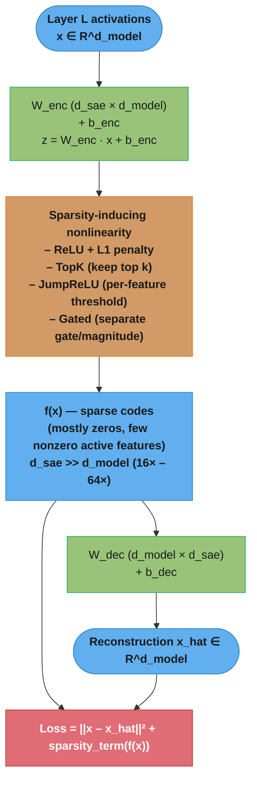
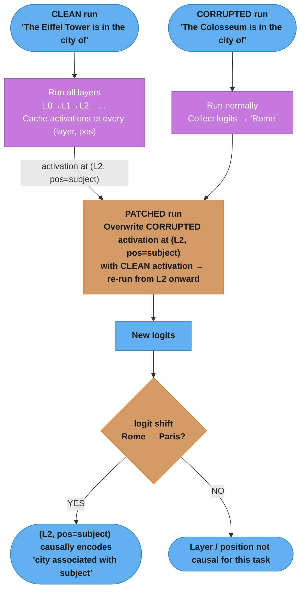
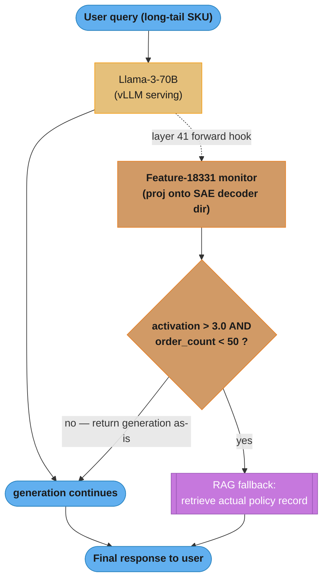

# Mechanistic Interpretability

## 1. Concept Overview

Mechanistic interpretability ("mech interp") is the discipline of reverse-engineering a trained neural network into a human-understandable algorithm. Instead of treating the model as a black box that you only probe through inputs and outputs, mech interp treats the weights as a *compiled program* and tries to recover the "source code": which directions in activation space correspond to which concepts ("features"), how those features are computed from earlier layers, and how they combine into multi-step "circuits" that implement specific behaviors (e.g., "the circuit that completes `Eiffel Tower is located in the city of ___` with `Paris`").

This module is the causal/structural counterpart to [Evaluation & Benchmarks](../evaluation_and_benchmarks/README.md) (which measures *what* a model does) and [Safety & Alignment](../safety_and_alignment/README.md) (which reasons about *whether* what it does is safe). Mech interp answers *why* and *how* — at the level of weights, activations, and circuits — and increasingly underpins production debugging, auditing, and targeted model editing.

The field has moved from a primarily academic pursuit (2020-2022, small models like GPT-2, toy tasks) to a production discipline at frontier labs:

- **Anthropic** trained sparse autoencoders (SAEs) on Claude 3 Sonnet at production scale ("Scaling Monosemanticity," May 2024) and used the resulting features to build "Golden Gate Claude," a public demo where a single feature was clamped to make the model obsessed with the Golden Gate Bridge.
- **Anthropic's "On the Biology of a Large Language Model"** (March 2025) used cross-layer transcoders (CLTs) and attribution graphs to trace multi-step reasoning, planning ahead in poetry generation, multilingual "shared circuitry," chain-of-thought unfaithfulness, and the specific circuit that causes hallucinations when a model is asked about an entity it doesn't actually know.
- **OpenAI** used GPT-4 to automatically generate and score natural-language explanations for GPT-2 neurons (2023), and DeepMind released **Gemma Scope** (2024) — a full suite of open SAEs across every layer of Gemma 2.

For a senior LLM engineer in 2026, mech interp shows up in interviews in three flavors: (1) "how would you debug a model that hallucinates/jailbreaks in production beyond prompt tweaking?", (2) "what is a sparse autoencoder and why does it help with superposition?", and (3) "how do techniques like activation steering or model editing actually work, and what are their failure modes?"

---

## 2. Intuition

**One-line analogy:** If a trained transformer is a compiled binary, mechanistic interpretability is *decompilation* — recovering variable names (features), function boundaries (circuits), and control flow (attention/MLP composition) from the raw weights and activations.

**Mental model — three nested claims:**

1. **Features are directions, not neurons.** A "feature" (e.g., "this token is part of a legal contract," "this is sarcasm," "the Golden Gate Bridge") corresponds to a *direction* in the high-dimensional activation space of a layer, not necessarily to a single neuron. The model can represent far more features than it has neurons by packing many features into overlapping, non-orthogonal directions — this is **superposition**.
2. **Circuits are wiring diagrams.** A behavior (e.g., "induction" — repeating a sequence seen earlier in context, or "indirect object identification" — correctly picking the recipient in "When Mary and John went to the store, John gave a drink to ___") is implemented by a small subgraph of attention heads and MLP neurons that read and write specific feature directions through the **residual stream** — the shared additive "bus" that every layer reads from and writes to.
3. **Causality beats correlation.** A direction that *correlates* with a concept (found via probing) is not the same as a direction the model *uses* to compute its output. Mech interp's central methodological commitment is **intervention**: if you ablate, patch, or steer along a direction and the model's behavior changes in the predicted way, you have evidence of a causal mechanism — not just a correlate.

**Why it matters (the practitioner's version):**

- **Debugging beyond prompts.** When a model hallucinates a citation or jailbreaks past a system prompt, black-box debugging (rewording prompts, adding few-shot examples) is trial-and-error. Mech interp lets you ask "which internal feature fired, and was it the 'I know this entity' feature or the 'I don't know but I should answer anyway' feature?"
- **Detecting things models don't say.** A model can produce a benign-looking chain-of-thought while its internal computation is doing something else entirely (Anthropic's CoT-unfaithfulness findings). Behavioral evals cannot catch this; activation-level analysis can.
- **Editing without retraining.** Techniques like ROME/MEMIT and activation steering let you add, remove, or modify specific facts/behaviors by editing a handful of weights or adding a steering vector at inference time — orders of magnitude cheaper than fine-tuning.
- **Auditing for backdoors and bias.** Sleeper-agent-style backdoors or systematic biases baked into pretraining data can sometimes be localized to specific circuits/features, enabling targeted removal.

**The key insight that ties everything together:** the **linear representation hypothesis** — that meaningful concepts are encoded as (approximately) linear directions in activation space, and that these directions compose additively. This is *why* vector arithmetic on activations works ("Golden Gate Claude" = add the Golden Gate Bridge SAE feature direction, scaled up, to every forward pass), *why* logit lens / direct logit attribution work (project intermediate activations through the unembedding to read "what the model is thinking" at layer L), and *why* SAEs (which assume features decompose linearly into a sparse, overcomplete dictionary) are the dominant decomposition tool.

---

## 3. Core Principles

### 3.1 The Linear Representation Hypothesis

Concepts are represented as directions `v` in a layer's activation space such that the presence/intensity of the concept correlates with the projection `a · v`. This is an empirical hypothesis, not a guarantee — some concepts are represented non-linearly (e.g., circularly, as found for modular arithmetic / day-of-week representations) — but it holds well enough for most natural-language concepts that the entire toolkit (probing, steering, SAEs, logit lens) is built on it.

### 3.2 Superposition and Polysemanticity

A model has `d_model` neurons per layer (e.g., 12,288 for a large model) but needs to represent far more than `d_model` distinct concepts (estimates run into the hundreds of thousands to millions). **Superposition** is the strategy of representing `N >> d` features as `N` *almost*-orthogonal (not exactly orthogonal) directions in `d`-dimensional space, exploiting the fact that natural inputs are sparse — most features are "off" most of the time, so interference between non-orthogonal features rarely matters in practice.

The observable consequence is **polysemanticity**: individual neurons respond to multiple, often unrelated concepts (a famous early example: a neuron in an image classifier that fired for both "cat faces" and "car fronts"). Polysemanticity is *why* looking at individual neurons is a dead end for interpretability at scale, and *why* SAEs (which find a different, larger basis where features are monosemantic) became central to the field.

### 3.3 The Residual Stream as a Shared Bus

In a transformer, every attention block and MLP block reads from and additively writes to the same residual stream (`x_{l+1} = x_l + Attn(x_l) + MLP(x_l + Attn(x_l))`, roughly). This means:

- Any layer can read any feature written by an earlier layer (subject to it not being overwritten/cancelled).
- Features can be **moved** (attention heads copy information between token positions), **transformed** (MLPs compute new features from combinations of old ones), or **deleted** (a later component writes a negative multiple of an earlier direction).
- This additive structure is what makes **activation patching** principled: you can swap the residual stream value at one position/layer between two runs and observe exactly how that change propagates.

### 3.4 Circuits as the Unit of Explanation

A **circuit** is a minimal subgraph of model components (attention heads, MLP neurons/layers, embedding/unembedding) — connected through the residual stream — that is *sufficient* to explain a specific behavior on a specific distribution of inputs. The canonical example is the **Indirect Object Identification (IOI) circuit** in GPT-2 small (Wang et al., 2022): roughly 26 attention heads across 7 categories (duplicate-token heads, S-inhibition heads, name-mover heads, negative name-mover heads) that together implement "find the name that appears once, not the name that appears twice, and copy it to the output."

Circuits are discovered, not designed — they emerge from training and are often surprisingly modular, redundant (multiple circuits computing the same thing, found via "ablate one, the other compensates"), and reused across superficially different tasks (a phenomenon sometimes called *weak universality*).

### 3.5 Causal Validation Is Mandatory

Every claim of the form "feature/neuron/head X represents concept Y" or "circuit Z implements behavior W" must be backed by an **intervention experiment**: ablate X and show Y/W disappears or changes in a predicted way; or patch X from a different input and show Y/W transfers. Purely observational findings (X is active when Y is present) are correlational and subject to **interpretability illusions** (see §10) — confounds where a direction correlates with a concept for reasons unrelated to how the model actually uses it.

### 3.6 Sparsity as the Organizing Assumption

Dictionary-learning methods (SAEs, transcoders) assume that although a layer's activation is a dense vector over `d_model` dimensions, it is a *sparse linear combination* of a much larger set of "true" feature directions (the dictionary, size `d_sae >> d_model`, e.g., 16x to 64x). Finding this dictionary turns a polysemantic, entangled representation into a sparse, (mostly) monosemantic one — at the cost of introducing a new hyperparameter-laden training problem (see §4.3 and §10).

---

## 4. Types / Architectures / Strategies

Mech interp techniques fall into five families, roughly ordered from cheapest/most-correlational to most-expensive/most-causal.

### 4.1 Observational & Projection-Based Methods

These methods read the model's activations without modifying the forward pass. Cheap, fast, good for hypothesis generation — but purely correlational.

- **Probing classifiers**: train a small (often linear) classifier on frozen activations from layer `L` to predict a property of interest (e.g., "is this sentence true or false," "what is the part of speech"). High probe accuracy suggests the information is *linearly decodable* at layer `L`, but does **not** prove the model *uses* it (the "probing vs. causation" gap — see §10).
- **Logit lens**: apply the model's final unembedding matrix (and final layer norm) directly to the residual stream at an *intermediate* layer `L`, producing a "what would the model predict if it stopped here" distribution. Reveals how the model's "best guess" evolves layer by layer — often starting with generic/frequent tokens and sharpening toward the final answer in later layers.
- **Tuned lens** (Belrose et al., 2023): logit lens assumes intermediate representations live in the same "basis" as the final layer, which is often false (representations drift across layers — "representation drift"). Tuned lens learns a per-layer affine probe (trained on a calibration set) that translates layer-`L` activations into the final layer's basis before unembedding, giving more faithful early-layer predictions.
- **Direct Logit Attribution (DLA)**: decompose the final logit difference (e.g., logit("Paris") − logit("London")) into additive contributions from each attention head and MLP layer, by projecting each component's *direct* contribution to the residual stream through the unembedding. Answers "which components are *directly* pushing toward the right answer" (as opposed to indirect, multi-hop contributions).

### 4.2 Causal Intervention Methods

These methods *modify* the forward pass and measure the effect on output — the methodological core of mech interp.

- **Activation patching / causal tracing** (Meng et al., ROME, 2022; Vig et al., 2020): run the model on a "clean" prompt and a "corrupted" prompt (differing in one token, e.g., subject name), cache activations from both, then run the corrupted prompt again but *patch in* (overwrite) a single activation (layer, position, component) from the clean run. If the output flips toward the clean answer, that activation is causally implicated.
- **Path patching** (Goldowsky-Dill et al., 2023; used in IOI paper): a refinement of activation patching that patches only along a specific *path* through the computation graph (e.g., "from head 9.6's output, only through the path that feeds into head 10.0's query, holding everything else fixed") — isolates *which connection* between two components matters, not just whether a component matters.
- **Ablation**: zero-ablation (set activation to 0), mean-ablation (set to its average over a dataset), or resample-ablation (set to its value from a random other input) a component and measure the effect. Mean/resample ablation are preferred over zero-ablation because zero is an out-of-distribution value that can cause unrelated downstream effects (an "ablation is not absence" pitfall — see §10).
- **Attribution patching** (Nanda, 2023; also "edge attribution patching"): a *linear approximation* to activation patching using gradients — instead of running `O(n_components)` forward passes, compute a single backward pass and use the gradient × activation-difference as an estimate of each component's causal effect. ~100-1000x cheaper, enabling patching experiments over every edge in the computation graph of large models; less precise for components with highly non-linear effects.

### 4.3 Dictionary Learning / Decomposition Methods

These methods address superposition directly by learning a new, larger, sparser basis for activations.

- **Sparse Autoencoders (SAEs)**: a single hidden-layer autoencoder trained to reconstruct a layer's activations `x ≈ W_dec · f(x) + b_dec` where `f(x) = ReLU(W_enc x + b_enc)` is forced to be sparse (most of its `d_sae` entries are zero for any given input). Each column of `W_dec` is a "feature direction"; each entry of `f(x)` is that feature's activation strength.
  - **Vanilla (ReLU + L1)**: sparsity enforced via an L1 penalty on `f(x)` added to the reconstruction loss. Simple but introduces "shrinkage" (L1 penalty biases feature activations toward zero, hurting reconstruction) and requires tuning the L1 coefficient.
  - **Gated SAEs** (Rajamanoharan et al., 2024): decouple the "which features are active" decision (a gating network) from "how strongly" (a magnitude network), removing the shrinkage problem of L1.
  - **TopK SAEs** (Gao et al., OpenAI, 2024): instead of an L1 penalty, directly keep only the top-`k` activations per token (zero out the rest) — sparsity is exact and a hyperparameter (`k`) rather than a penalty coefficient, simplifying training and giving a clean compute/quality dial.
  - **JumpReLU SAEs** (Rajamanoharan et al., DeepMind, 2024 — used for Gemma Scope): replace ReLU with a discontinuous "jump" activation with a learned per-feature threshold, allowing features to have arbitrarily small *non-zero* magnitudes once active while remaining exactly zero below threshold — best of both worlds between L1 and TopK.
- **Transcoders**: like an SAE, but trained to reconstruct the **output** of an MLP layer from its **input** (rather than reconstructing a single activation from itself) — directly modeling the *function* an MLP computes in a sparse, interpretable basis. This makes transcoders naturally decomposable into input-feature → output-feature edges.
- **Cross-Layer Transcoders (CLTs)**: Anthropic's evolution (used in "On the Biology of a Large Language Model," 2025) — a single transcoder whose features can read from one layer's residual stream and write to *multiple* downstream layers' MLP outputs simultaneously, dramatically reducing the number of separate dictionaries needed and enabling **attribution graphs**: end-to-end feature → feature → feature graphs spanning the whole forward pass, replacing the raw neuron-level computational graph with an interpretable feature-level one.

### 4.4 Circuit Discovery

- **Manual circuit analysis**: the original methodology (Olsson et al.'s induction heads, 2022; Wang et al.'s IOI circuit, 2022) — hypothesize a circuit, validate every edge via path patching, and write up the full causal story. Extremely labor-intensive (the IOI paper covers one behavior in one small model across ~70 pages) but produces gold-standard, fully-validated explanations.
- **Automated Circuit Discovery (ACDC)** (Conmy et al., 2023): greedily prune edges from the full computational graph, using activation patching to test whether removing each edge changes the output beyond a threshold — automates the "which connections matter" search that was previously manual.
- **Edge Attribution Patching (EAP)**: combines attribution patching's speed with ACDC's automated-graph-search goal — score every edge in the graph via a single backward pass, then threshold/prune. Standard starting point for circuit discovery on models too large for manual analysis.

### 4.5 Representation Engineering & Model Editing

These methods use interpretability findings to *change* model behavior at inference time or via small weight edits.

- **Activation steering / "ActAdd"** (Turner et al., 2023): add a fixed vector (computed as the difference in activations between a "positive" and "negative" prompt pair, e.g., "I talk about love" minus "I talk about hate") to every token's residual stream at a chosen layer during generation, shifting outputs toward the target concept without any training.
- **Contrastive Activation Addition (CAA)** (Rimsky et al., 2023): a more rigorous version of ActAdd — average the activation difference across *many* contrastive pairs (e.g., hundreds of "sycophantic vs. non-sycophantic" answer pairs) to get a more robust steering vector per behavior (sycophancy, corrigibility, hallucination, etc.).
- **Representation Engineering (RepE)** (Zou et al., 2023): a broader framework that uses techniques like PCA over contrastive activations to find "concept directions" (e.g., honesty, power-seeking) and both *reads* them (as a lie-detector / monitor) and *writes* them (steering) — positioned as a top-down alternative to bottom-up circuit analysis for alignment-relevant concepts.
- **Rank-One Model Editing (ROME)** (Meng et al., 2022): treats a feed-forward layer's weight matrix as a key-value associative memory and computes a rank-one update to that matrix that changes a single factual association (e.g., "The Eiffel Tower is in `Paris`" → "...in `Rome`") while minimizing collateral changes to other facts.
- **MEMIT** (Meng et al., 2023): generalizes ROME to edit thousands of facts simultaneously by distributing rank-one updates across multiple layers, addressing ROME's degradation when editing more than a handful of facts.

---

## 5. Architecture Diagrams

### 5.1 Superposition: More Features Than Dimensions

```
                    d_model = 4 neuron dimensions
                    N = 8 "true" features the model needs

  Without superposition (impossible — not enough room):
     f1   f2   f3   f4   f5   f6   f7   f8
      |    |    |    |    X    X    X    X    <- f5..f8 have nowhere to go
     [n1] [n2] [n3] [n4]

  With superposition (actual): features share dimensions as
  *almost*-orthogonal directions; sparsity (most features = 0
  for any given input) keeps interference manageable.

            n2
             |    f3
             |   /
             |  /        f1
        f6   | /  f2    /
          \  |/        /
   --------[ activation space ]-------- n1
          /  |\
         /   | \  f5
       f7    |  \
             |   f8
             |    \
            n4    f4

  Each f_i is a direction (not a basis vector). Dot products
  between f_i are small but nonzero -> "interference" if two
  features are simultaneously active. Models tolerate this
  because real inputs activate only a handful of features at once.
```

### 5.2 Sparse Autoencoder (SAE) Architecture



Each nonzero entry i in f(x) means "feature i (column i of W_dec) is active with that strength" — the dictionary columns are interpretable concepts like "token follows a colon" or "emotional content: fear".

### 5.3 Activation Patching Workflow



Patching every (layer, position) pair and plotting the logit-diff shift produces a "patching heatmap" that localizes the relevant computation in the network.

### 5.4 IOI Circuit (GPT-2 Small, Wang et al. 2022) — Simplified

```
  Prompt: "When Mary and John went to the store, John gave a drink to"
  Correct completion: " Mary"   (the name that appears ONCE)

  Token positions:     Mary1   John1        John2 (=IO duplicate of John1)
                          |       |             |
                          v       v             v
  +----------------------------------------------------------------+
  | Duplicate Token Heads (layer ~0-3)                              |
  |   detect: "John2 is a repeat of an earlier token (John1)"       |
  +----------------------------------------------------------------+
                          |
                          v
  +----------------------------------------------------------------+
  | S-Inhibition Heads (layer ~7-8)                                 |
  |   write to residual stream at the END position:                |
  |   "suppress attention to the DUPLICATED name (John)"            |
  +----------------------------------------------------------------+
                          |
                          v
  +----------------------------------------------------------------+
  | Name Mover Heads (layer ~9-11)                                  |
  |   at END position, attend to all earlier names EXCEPT the       |
  |   inhibited one (John) -> copy "Mary" into the output           |
  +----------------------------------------------------------------+
                          |
                          v
  +----------------------------------------------------------------+
  | Negative Name Mover Heads                                       |
  |   small correction: slightly down-weight the copied name        |
  |   (calibration, prevents overconfidence)                         |
  +----------------------------------------------------------------+
                          |
                          v
                    logit(" Mary") > logit(" John")
```

### 5.5 Cross-Layer Transcoder (CLT) / Attribution Graph Pipeline

```
  Raw computational graph (millions of neuron-to-neuron edges,
  not human-readable):

   [emb] -> [L0 attn] -> [L0 mlp] -> [L1 attn] -> [L1 mlp] -> ... -> [unembed]
              (12,288 neurons per MLP x N layers x N heads -- intractable)

  Replace every MLP with a Cross-Layer Transcoder (CLT):

   residual_stream(L)  --[CLT_L: sparse feature dictionary]-->
        features f_1..f_k (each interpretable, e.g.
            f_42  = "this token names a US state capital"
            f_107 = "currently inside a rhyming couplet, need word
                     that rhymes with 'day'")
        --[CLT_L decoder]--> writes to MLP-out at layers L..L+m

  Stitching all CLTs together yields an ATTRIBUTION GRAPH:

   [input tokens]
        |
        v
  f_42 ("Texas") --------> f_881 ("capital-of relation")
        |                         |
        v                         v
  f_107 ("rhyme target: -ay") -> f_990 ("say 'Austin'") -> logit("Austin")

  Each arrow = a learned, weighted edge between sparse features
  across layers -- small enough (dozens of nodes) for a human to
  read as a flowchart, e.g. "the model retrieves the capital,
  then checks it satisfies the rhyme constraint, then emits it."

  This is the technique behind Anthropic's findings on poetry
  planning, multi-step reasoning ("Dallas is in the state whose
  capital is ___" -> Texas -> Austin), and hallucination circuits.
```

---

## 6. How It Works — Detailed Mechanics

This section walks through four techniques end-to-end with executable-shaped Python: training a TopK SAE, running activation patching to localize a behavior, computing logit lens / direct logit attribution, and building + applying a CAA steering vector. All examples assume a `transformer_lens.HookedTransformer`-style API (the de facto standard for this kind of work) and a model with `d_model = 4096`, `n_layers = 32`, `n_heads = 32` (Llama-3-8B-sized, for concrete numbers).

### 6.1 Training a TopK Sparse Autoencoder

The first step in almost any modern interpretability pipeline is decomposing a layer's activations into a sparse, overcomplete dictionary. TopK SAEs (Gao et al., 2024) are the simplest variant to train correctly: sparsity is enforced *exactly* by keeping only the `k` largest activations per token, so there is no L1 coefficient to tune and no shrinkage correction needed.

```python
import torch
import torch.nn as nn
from dataclasses import dataclass
from torch.utils.data import DataLoader, TensorDataset


@dataclass
class SAEConfig:
    d_model: int = 4096       # residual stream width (Llama-3-8B)
    d_sae: int = 4096 * 16    # 65,536 -- 16x expansion factor
    k: int = 32               # active features per token (TopK)
    aux_k: int = 512          # extra "dead feature" recovery slots
    dead_feature_window: int = 10_000  # steps before a feature is "dead"


class TopKSAE(nn.Module):
    """Sparse autoencoder over residual-stream activations.

    Reconstructs x in R^d_model from a sparse code f(x) in R^d_sae
    where only the top-k entries of f(x) are nonzero per token.
    """

    def __init__(self, cfg: SAEConfig):
        super().__init__()
        self.cfg = cfg
        self.W_enc = nn.Parameter(torch.empty(cfg.d_sae, cfg.d_model))
        self.b_enc = nn.Parameter(torch.zeros(cfg.d_sae))
        self.W_dec = nn.Parameter(torch.empty(cfg.d_model, cfg.d_sae))
        self.b_dec = nn.Parameter(torch.zeros(cfg.d_model))

        nn.init.kaiming_uniform_(self.W_enc)
        # Decoder columns are initialized as the transpose of the encoder
        # rows, then unit-normalized -- standard SAE initialization that
        # measurably speeds convergence (Conerly et al., 2024).
        with torch.no_grad():
            self.W_dec.copy_(self.W_enc.T)
            self.W_dec /= self.W_dec.norm(dim=0, keepdim=True)

    def encode(self, x: torch.Tensor) -> torch.Tensor:
        x_centered = x - self.b_dec  # decoder bias acts as a learned mean
        pre_acts = x_centered @ self.W_enc.T + self.b_enc  # [batch, d_sae]

        # TopK: zero out everything except the k largest pre-activations
        # per token. ReLU first so we never keep negative activations.
        pre_acts = torch.relu(pre_acts)
        topk_vals, topk_idx = pre_acts.topk(self.cfg.k, dim=-1)
        acts = torch.zeros_like(pre_acts)
        acts.scatter_(-1, topk_idx, topk_vals)
        return acts

    def decode(self, acts: torch.Tensor) -> torch.Tensor:
        return acts @ self.W_dec.T + self.b_dec

    def forward(self, x: torch.Tensor) -> tuple[torch.Tensor, torch.Tensor]:
        acts = self.encode(x)
        x_hat = self.decode(acts)
        return x_hat, acts


def train_sae(
    activations: torch.Tensor,  # [n_tokens, d_model], pre-collected from
                                 # a hook on, e.g., blocks.16.hook_resid_post
    cfg: SAEConfig,
    n_epochs: int = 1,
    batch_size: int = 4096,
    lr: float = 4e-4,
) -> TopKSAE:
    sae = TopKSAE(cfg).to(activations.device)
    opt = torch.optim.Adam(sae.parameters(), lr=lr)
    loader = DataLoader(TensorDataset(activations), batch_size=batch_size, shuffle=True)

    # Track per-feature firing frequency to detect "dead" features --
    # features that never fire are the SAE's single most common failure
    # mode (see Section 10).
    fires = torch.zeros(cfg.d_sae, device=activations.device)

    for epoch in range(n_epochs):
        for (x_batch,) in loader:
            x_hat, acts = sae(x_batch)

            # Normalized MSE: divide by the variance of x so the loss is
            # comparable across layers/models with different activation scales.
            recon_loss = (x_hat - x_batch).pow(2).sum(-1) / x_batch.pow(2).sum(-1)
            loss = recon_loss.mean()

            opt.zero_grad()
            loss.backward()
            # Re-normalize decoder columns to unit norm after every step --
            # without this, the SAE can "cheat" sparsity by shrinking
            # W_dec norms instead of actually using fewer features.
            opt.step()
            with torch.no_grad():
                sae.W_dec /= sae.W_dec.norm(dim=0, keepdim=True)

            fires += (acts > 0).float().sum(0)

    dead_frac = (fires == 0).float().mean().item()
    print(f"final recon_loss={loss.item():.4f}, dead_feature_frac={dead_frac:.2%}")
    return sae
```

**Concrete numbers**: for Claude 3 Sonnet, Anthropic trained SAEs with up to **34 million** features (`d_sae`) on a `d_model` in the low thousands — an expansion factor far beyond the 16x shown above. Gemma Scope trains SAEs at **every layer and sublayer** of Gemma 2 (2B and 9B), at multiple widths (16K, 65K, 1M features), totaling hundreds of individual SAEs. Training a single 16x SAE on a 7-8B model's layer over a few hundred million tokens typically takes single-digit GPU-days on a single high-end GPU — cheap relative to pretraining, but not free, and the *evaluation* of feature quality (interpreting thousands of features) is the real bottleneck.

### 6.2 Activation Patching to Localize a Behavior

Activation patching answers "which `(layer, position, component)` causally matters for this behavior?" by swapping cached activations between a clean and corrupted run and measuring the effect on a metric (usually a logit difference).

```python
import torch
from transformer_lens import HookedTransformer
from transformer_lens.hook_points import HookPoint
from jaxtyping import Float
from functools import partial


def logit_diff(logits: Float[torch.Tensor, "batch seq d_vocab"],
                correct_id: int, incorrect_id: int) -> torch.Tensor:
    final_logits = logits[:, -1, :]
    return final_logits[:, correct_id] - final_logits[:, incorrect_id]


def patch_residual_hook(
    resid: Float[torch.Tensor, "batch seq d_model"],
    hook: HookPoint,
    position: int,
    clean_cache: dict,
) -> Float[torch.Tensor, "batch seq d_model"]:
    """Overwrite resid[:, position, :] with the cached CLEAN activation
    at this hook point and position."""
    resid[:, position, :] = clean_cache[hook.name][:, position, :]
    return resid


def run_activation_patching(
    model: HookedTransformer,
    clean_tokens: torch.Tensor,
    corrupted_tokens: torch.Tensor,
    correct_id: int,
    incorrect_id: int,
) -> torch.Tensor:
    # 1. Cache every residual-stream activation on the CLEAN run.
    _, clean_cache = model.run_with_cache(clean_tokens)

    # 2. Baseline: corrupted run, no patching.
    corrupted_logits = model(corrupted_tokens)
    corrupted_diff = logit_diff(corrupted_logits, correct_id, incorrect_id)
    clean_logits = model(clean_tokens)
    clean_diff = logit_diff(clean_logits, correct_id, incorrect_id)

    n_layers, seq_len = model.cfg.n_layers, corrupted_tokens.shape[1]
    results = torch.zeros(n_layers, seq_len)

    # 3. Sweep every (layer, position): patch corrupted run with the
    # clean activation at resid_post of that layer/position, re-run,
    # and record how much of the clean/corrupted logit-diff GAP closes.
    for layer in range(n_layers):
        for pos in range(seq_len):
            hook_fn = partial(
                patch_residual_hook, position=pos, clean_cache=clean_cache
            )
            patched_logits = model.run_with_hooks(
                corrupted_tokens,
                fwd_hooks=[(f"blocks.{layer}.hook_resid_post", hook_fn)],
            )
            patched_diff = logit_diff(patched_logits, correct_id, incorrect_id)
            # Normalize: 0 = no effect (still corrupted), 1 = fully
            # recovers the clean answer.
            results[layer, pos] = (patched_diff - corrupted_diff) / (
                clean_diff - corrupted_diff
            )

    return results  # [n_layers, seq_len] patching heatmap
```

In practice, this `O(n_layers * seq_len)` sweep (here `32 * ~15 = 480` forward passes for a short prompt) takes seconds on a single GPU for a 7-8B model and produces a heatmap where bright cells indicate "patching this activation recovers most of the clean behavior" — directly localizing the computation, exactly as shown in the patching heatmap in §5.3.

### 6.3 Logit Lens and Direct Logit Attribution

Both techniques exploit the fact that the final operation of a transformer is `logits = LayerNorm(resid_final) @ W_U` — a *linear* (post-LayerNorm) projection. This means any intermediate residual-stream vector, or any single component's *contribution* to the residual stream, can be projected through `W_U` to ask "what would this, alone, predict?"

```python
import torch
from transformer_lens import HookedTransformer


def logit_lens(
    model: HookedTransformer, tokens: torch.Tensor, target_token_id: int
) -> torch.Tensor:
    """Returns, for each layer, the model's 'confidence' in target_token_id
    if generation stopped at that layer."""
    _, cache = model.run_with_cache(tokens)
    n_layers = model.cfg.n_layers

    per_layer_logit = torch.zeros(n_layers)
    for layer in range(n_layers):
        resid = cache["resid_post", layer][:, -1, :]   # [batch, d_model]
        # Apply the model's FINAL layer norm (logit lens reuses it,
        # which is the main source of its inaccuracy at early layers --
        # tuned lens instead learns a per-layer affine map).
        normed = model.ln_final(resid)
        logits = normed @ model.W_U                     # [batch, d_vocab]
        per_layer_logit[layer] = logits[0, target_token_id]

    return per_layer_logit  # rising curve = "model converges on this
                             # answer gradually across layers"


def direct_logit_attribution(
    model: HookedTransformer,
    tokens: torch.Tensor,
    correct_id: int,
    incorrect_id: int,
) -> dict[str, torch.Tensor]:
    """Decompose the FINAL logit-diff into each component's direct
    (non-mediated) contribution."""
    _, cache = model.run_with_cache(tokens)

    # Direction in logit-space corresponding to "correct minus incorrect".
    logit_diff_direction = model.W_U[:, correct_id] - model.W_U[:, incorrect_id]

    contributions: dict[str, torch.Tensor] = {}

    # Each attention head's output, BEFORE being summed into the residual
    # stream, projected onto the logit-diff direction.
    per_head_resid = cache.stack_head_results(layer=-1, return_labels=False)
    # per_head_resid: [n_layers * n_heads, batch, seq, d_model]
    final_token_contribs = per_head_resid[:, 0, -1, :]   # last token
    head_dla = final_token_contribs @ logit_diff_direction
    contributions["attention_heads"] = head_dla.reshape(model.cfg.n_layers, model.cfg.n_heads)

    # Each MLP layer's output at the final position.
    mlp_dla = torch.zeros(model.cfg.n_layers)
    for layer in range(model.cfg.n_layers):
        mlp_out = cache["mlp_out", layer][:, -1, :]
        mlp_dla[layer] = (mlp_out @ logit_diff_direction)[0]
    contributions["mlp_layers"] = mlp_dla

    return contributions
```

For the IOI task (§5.4), DLA over `attention_heads` is exactly how the "Name Mover Heads" (large *positive* contribution to `logit(" Mary") - logit(" John")`) and "Negative Name Mover Heads" (small *negative* contribution) were first identified — before path patching confirmed the full causal story.

### 6.4 Contrastive Activation Addition (CAA) Steering

CAA builds a steering vector from the *average difference* in activations between matched pairs of prompts that differ only in the target behavior, then adds that vector (scaled) to every token's residual stream at inference time.

```python
import torch
from transformer_lens import HookedTransformer
from dataclasses import dataclass


@dataclass
class ContrastivePair:
    positive_prompt: str   # exhibits the target behavior
    negative_prompt: str   # matched, but does not


def compute_caa_vector(
    model: HookedTransformer,
    pairs: list[ContrastivePair],
    layer: int,
) -> torch.Tensor:
    """Average activation difference at `layer`'s resid_post across
    many contrastive pairs -> a single steering direction."""
    diffs = []
    for pair in pairs:
        pos_tokens = model.to_tokens(pair.positive_prompt)
        neg_tokens = model.to_tokens(pair.negative_prompt)

        _, pos_cache = model.run_with_cache(pos_tokens)
        _, neg_cache = model.run_with_cache(neg_tokens)

        pos_act = pos_cache["resid_post", layer][:, -1, :]  # [1, d_model]
        neg_act = neg_cache["resid_post", layer][:, -1, :]
        diffs.append((pos_act - neg_act).squeeze(0))

    return torch.stack(diffs).mean(dim=0)  # [d_model]


def steer_with_vector(
    model: HookedTransformer,
    prompt: str,
    steering_vector: torch.Tensor,
    layer: int,
    coefficient: float = 8.0,
    max_new_tokens: int = 50,
) -> str:
    def add_steering_hook(resid, hook):
        return resid + coefficient * steering_vector

    with model.hooks(fwd_hooks=[(f"blocks.{layer}.hook_resid_post", add_steering_hook)]):
        tokens = model.to_tokens(prompt)
        output_tokens = model.generate(tokens, max_new_tokens=max_new_tokens)

    return model.to_string(output_tokens[0])
```

**Concrete numbers**: in "Golden Gate Claude," Anthropic took a single SAE feature direction (out of ~34M) that fires on mentions/images of the Golden Gate Bridge and **clamped** its activation to 10x its typical maximum value across all tokens — at that strength, the model could not produce a response (even "what's your favorite food?") without working the bridge into the answer. CAA steering coefficients in published work typically range **4x to 15x** the natural activation-difference norm; too low has no effect, too high degrades fluency/coherence entirely (a tradeoff covered in §8 and §10).

---

## 7. Real-World Examples

### 7.1 Anthropic — "Towards Monosemanticity" (Oct 2023)

The proof-of-concept that started the modern SAE wave: trained an SAE on a **single-layer, 512-neuron** transformer (tiny by modern standards) and found thousands of cleanly interpretable features where the raw neurons were almost all polysemantic — e.g., a feature that fires specifically on **Arabic script**, another on **base64-encoded text**, another on **DNA sequences**. Crucially, the team validated causality: activating a feature artificially (e.g., the Arabic-script feature) caused the model to output Arabic-script-like tokens, even mid-English-sentence — an early, small-scale "Golden Gate Claude."

### 7.2 Anthropic — "Scaling Monosemanticity" (May 2024)

Scaled SAEs to **Claude 3 Sonnet** (a production frontier model), training three SAEs of increasing size, up to **~34 million features**, on the residual stream at a middle layer. Found features for highly abstract concepts that generalize across languages and modalities (text and images) — e.g., a single feature firing on the concept of "an unsafe/dangerous piece of code regardless of programming language," a feature for "sycophantic praise," and the now-famous **Golden Gate Bridge feature**. Also documented **feature splitting**: as `d_sae` increases, a single coarse feature (e.g., "code") splits into many finer ones (e.g., "Python error handling," "SQL injection," "buffer overflow") — directly analogous to how word embeddings cluster at different granularities.

### 7.3 "Golden Gate Claude" (May 2024)

A public-facing demo built directly on the Scaling Monosemanticity SAEs: Anthropic deployed a version of Claude 3 Sonnet with the Golden Gate Bridge feature's activation **clamped to a high fixed value** on every token. The result was a model that, regardless of the user's question, would steer the conversation toward (or directly claim to *be*) the Golden Gate Bridge. This was the first time activation-level interpretability findings were shipped as a *user-facing product experience*, demonstrating both the promise (precise, training-free behavioral control) and the limits (at high steering strength, general capability degrades — the model becomes "obsessed" and less useful for anything else).

### 7.4 Anthropic — "On the Biology of a Large Language Model" / Circuit Tracing (March 2025)

The current state of the art for production-scale mech interp, applied to **Claude 3.5 Haiku**. Built **cross-layer transcoders (CLTs)** across the whole model and used the resulting **attribution graphs** to trace several behaviors end-to-end:

- **Multi-hop reasoning**: for "The capital of the state containing Dallas is ___," found a literal chain of features — `Dallas -> Texas -> capital-of(Texas) -> Austin` — i.e., the model performs the two-hop lookup *internally*, not just pattern-matching the surface form.
- **Poetry planning**: found that before writing a line of a poem, the model activates features representing *candidate rhyming words for the line's end*, then plans the rest of the line to lead naturally into that word — evidence of **forward planning**, not purely left-to-right generation.
- **Hallucination circuits**: identified a default "decline to answer / I don't know" circuit that is active by default for obscure entities, and a separate "known entity" circuit that, when it misfires (activates for an entity the model doesn't actually have reliable knowledge about), *suppresses* the default-refusal circuit — producing a confident hallucination. This gives a mechanistic account of *why* hallucinations happen, distinct from "the model is just predicting likely tokens."
- **Chain-of-thought unfaithfulness**: found cases where the model's stated reasoning steps in its CoT do not match the features/circuits actually driving its answer — direct mechanistic evidence for a phenomenon previously only inferred behaviorally (cf. [Safety & Alignment §6](../safety_and_alignment/README.md), Scalable Oversight).
- **Multilingual shared circuitry**: many features and circuits are shared across languages (e.g., a single "opposite of" feature active whether the input is English, French, or Chinese), with language-specific features only at the input/output edges — evidence that the model reasons in a largely language-agnostic internal space.

### 7.5 OpenAI — "Language Models Can Explain Neurons in Language Models" (2023)

Used **GPT-4** to automatically generate natural-language explanations ("this neuron fires on references to time periods") for individual GPT-2 neurons by showing GPT-4 the neuron's top-activating text examples, then scored explanation quality by using GPT-4 to *simulate* the neuron's activations given only the explanation and comparing to ground truth. This pioneered **automated interpretability** — using a stronger model to interpret a weaker one at scale (millions of neurons), trading some precision for throughput compared to manual analysis.

### 7.6 DeepMind — Gemma Scope (July 2024)

An open-source suite of **JumpReLU SAEs** trained on **every layer and sublayer** (attention output, MLP output, residual stream) of **Gemma 2 (2B and 9B)**, at multiple dictionary sizes (16K to 1M features), released publicly alongside the **Neuronpedia** interface for browsing features. This was the first time a frontier-adjacent lab released a *complete*, *open* SAE suite for a production model family — enabling academic researchers without frontier-lab compute to do circuit-level work on a near-frontier model.

### 7.7 Foundational Circuit & Editing Papers

- **Wang et al., "Interpretability in the Wild" (IOI circuit, 2022)**: the canonical fully-manual circuit analysis (§5.4), establishing the path-patching methodology still used today.
- **Meng et al., ROME (2022)** and **MEMIT (2023)**: demonstrated that individual factual associations are localized to a small number of MLP layers at the subject token's last position, and that they can be surgically edited via rank-one (ROME) or distributed rank-one (MEMIT, thousands of edits) weight updates — the basis for "knowledge editing" as a cheaper alternative to fine-tuning for fact updates.
- **Rimsky et al., CAA (2023)** and **Zou et al., RepE (2023)**: established activation steering via contrastive pairs as a practical, training-free technique for behavioral control (reducing sycophancy, refusal, hallucination rates) — now a standard tool in alignment research and increasingly in production guardrails (cf. [Guardrails & Content Safety](../guardrails_and_content_safety/README.md)).

---

## 8. Tradeoffs

### 8.1 SAE Variants

| Variant | Sparsity Mechanism | Pros | Cons | Used By |
|---|---|---|---|---|
| Vanilla (ReLU + L1) | L1 penalty on `f(x)` | Simple, well-understood | "Shrinkage" biases active features toward zero, hurting reconstruction; L1 coefficient tuning is fragile | Early Anthropic work (2023) |
| Gated SAE | Separate gating + magnitude networks | Removes shrinkage; better reconstruction at same sparsity | ~2x parameters (two networks); more complex training | Anthropic (2024 follow-ups) |
| TopK | Hard top-`k` per token | Exact, interpretable sparsity knob (`k`); no shrinkage; simple loss (no penalty term) | `k` is fixed per token — can't let "easy" tokens use fewer features than "hard" ones | OpenAI (2024) |
| JumpReLU | Learned per-feature threshold | Features can have small *nonzero* magnitudes; exact sparsity like TopK but per-feature adaptive | Threshold is a discontinuous function — needs a straight-through-estimator-style trick for gradients | DeepMind Gemma Scope (2024) |

### 8.2 Causal Intervention Methods

| Method | Cost | Precision | What It Answers |
|---|---|---|---|
| Zero-ablation | 1 forward pass per component | Low — zero is OOD, can cause unrelated effects | "Does removing this component break things (crudely)?" |
| Mean / resample ablation | 1 forward pass per component (x samples) | Medium — more realistic "absence" | "Does this component matter, holding activation statistics realistic?" |
| Activation patching | `O(layers x positions)` forward passes | High | "Which (layer, position) causally carries the relevant information?" |
| Path patching | `O(edges)` forward passes, very high constant | Very high | "Which specific *connection* between two components matters?" |
| Attribution patching | 1 forward + 1 backward pass (linear approx.) | Medium (linear approximation — degrades for highly non-linear effects) | "Cheap first-pass ranking of all components/edges, to prioritize for full patching" |

### 8.3 Decomposition vs. Direct Causal Methods

| Dimension | SAEs / Transcoders / CLTs | Direct Causal (Patching, Ablation) |
|---|---|---|
| What you get | A reusable *dictionary* of interpretable features across many inputs | A per-example causal story for one specific behavior |
| Upfront cost | High — training + evaluating (often manually) thousands to millions of features | Low to medium — no training, just forward/backward passes |
| Reusability | High — once trained, the same SAE supports steering, monitoring, attribution graphs for *any* downstream question | Low — circuit found for task A may not transfer to task B |
| Maturity / reliability | Newer (2023+); feature interpretations can still be "interpretability illusions" (see §10) | More mature (2020+), but doesn't scale to "explain the whole model" |
| Best for | Building monitors/steering vectors, exploratory feature discovery, attribution graphs | Validating a specific hypothesis ("is component X responsible for behavior Y?") |

### 8.4 Steering vs. Prompting vs. Fine-Tuning for Behavioral Control

| Approach | Latency Cost | Persistence | Precision | Risk of Collateral Damage |
|---|---|---|---|---|
| Prompting (system prompt) | None | Per-request, model can be jailbroken away from it | Low — affects whole distribution of outputs | Low |
| Activation steering (CAA/ActAdd) | Small (one vector add per token, per forward pass) | Per-request, applied at inference time | Medium — targets a specific direction, but coefficient tuning trades strength vs. fluency | Medium — high coefficients degrade unrelated capabilities |
| ROME / MEMIT weight edit | None at inference (baked into weights) | Permanent until model is replaced/retrained | High for the targeted fact, but degrades with edit count (MEMIT scales better than ROME) | Medium-High at scale — thousands of edits measurably degrade general capability |
| Full fine-tuning / RLHF | None at inference | Permanent | Highest, but requires full training infrastructure | Low if done carefully, but most expensive by far |

---

## 9. When to Use / When NOT to Use

### Use Mechanistic Interpretability When:

- **Debugging a specific, reproducible failure** (hallucination on a class of entities, a jailbreak that bypasses your system prompt, an unexpected refusal pattern) where black-box prompt iteration has stalled — activation patching or attribution graphs can localize *where* in the model the failure originates.
- **Building monitors for properties that aren't visible in outputs** — e.g., a "is the model's internal state consistent with an honest answer" probe/steering-vector-based lie detector, as a complement to output-level [guardrails](../guardrails_and_content_safety/README.md).
- **You need training-free behavioral control** with a tight latency/cost budget — activation steering avoids the cost of fine-tuning a frontier model and can be toggled per-request.
- **Auditing for backdoors, biases, or unwanted associations** baked into a model before deployment, especially for models trained on data you don't fully control (third-party fine-tunes, open-weight models).
- **You are doing alignment / safety research** where understanding *mechanism* (is the model deceptive vs. confidently wrong?) is the actual research question, not just measuring behavior.
- **You need to edit a small number of facts** cheaply (ROME/MEMIT) without the cost/risk of a full fine-tuning run, e.g., correcting a small number of outdated facts in a deployed model.

### Avoid / Reconsider When:

- **A prompt-engineering or RAG fix would solve the problem faster and more reliably.** Mech interp has a high setup cost (caching activations, running TransformerLens-style tooling, often GPU access to model internals you may not have for closed-source/API-only models). If "add a clarifying instruction to the system prompt" fixes 95% of cases, do that first.
- **You only have API access to a closed-source model.** Activation patching, SAEs, and steering all require access to model weights and intermediate activations — they do not work through a chat-completions API. (Anthropic/OpenAI's *published* interpretability work used internal access; you cannot replicate it on `claude-*` or `gpt-*` via the public API.)
- **The behavior is highly input-dependent / low-frequency** — circuits found for one narrow distribution (e.g., one template of factual-recall prompt) often do not generalize, and the cost of finding a circuit for every variant is prohibitive. Statistical evals (cf. [Evaluation & Benchmarks](../evaluation_and_benchmarks/README.md)) are more cost-effective for broad behavioral coverage.
- **You need a guaranteed, certified safety property.** Mech interp findings are *empirical and probabilistic* — "this feature correlates with deception in our test set" is not a formal guarantee, and an "interpretability illusion" (see §10) can make a finding look more solid than it is. Don't substitute mech interp for formal verification or robust evals in safety-critical claims.
- **The model is small enough that you don't need decomposition.** For genuinely tiny models (a few hundred neurons), direct neuron-level analysis without SAEs may already be tractable — SAEs add overhead that isn't justified until polysemanticity becomes a real obstacle.

---

## 10. Common Pitfalls

### 10.1 Probing Accuracy Is Not Causal Relevance ("Probe vs. Use" Gap)

A team trains a linear probe on layer-18 activations to detect "the model has internally represented that this statement is false," achieves 94% accuracy, and ships a "lie detector" monitor based on it. In production, the monitor fires on a large fraction of *true* statements about obscure topics — because the probe had actually learned "this is a low-frequency / unusual statement" (which correlates with falsehood in the training set, since most false statements in the dataset were also obscure), not "the model believes this is false."

```python
# BROKEN: high probe accuracy is treated as proof the direction is
# causally used by the model to decide truthfulness.
probe = train_linear_probe(activations_layer18, labels=is_false)
print(f"probe accuracy: {probe.score(val_acts, val_labels):.2%}")  # 94%
# -> shipped as a monitor. No causal check performed.

# FIX: validate with an intervention. If the probe direction is
# causally used, ABLATING it should change the model's actual
# downstream behavior (e.g., its tendency to assert the false claim),
# not just the probe's own prediction.
direction = probe.coef_  # the probed direction
clean_logits = model(tokens)
with model.hooks(fwd_hooks=[(f"blocks.18.hook_resid_post",
                              lambda r, hook: r - (r @ direction) * direction)]):
    ablated_logits = model(tokens)

# If ablated_logits' tendency to assert false claims is UNCHANGED,
# the probe found a correlate, not a cause -- do not ship as a monitor.
```

**Why it matters**: this is the single most common mistake made by teams new to interpretability — probing is cheap and feels rigorous (94% accuracy!), but only causal interventions distinguish "the model represents this" from "the model *uses* this representation for the behavior you care about."

### 10.2 Interpretability Illusions: Confounded Directions

A direction that appears to represent concept A under one distribution of inputs can represent a completely different concept B under another distribution — because A and B happen to be correlated in your test set. A documented case: a direction that appeared to track "sentence length" in early probing studies later turned out to primarily track "presence of a specific punctuation token," which happened to correlate with length in that corpus. **The fix is always the same**: test the finding on a distribution where the suspected confound is *broken* (e.g., long sentences without that punctuation, short sentences with it) before trusting it.

### 10.3 Dead Features and Feature Splitting in SAEs

In any SAE with `d_sae` in the tens of thousands to millions, a substantial fraction of dictionary features (commonly **5-50%** depending on training recipe) never fire on the training distribution — "dead features" that waste capacity and can destabilize training (gradients for dead features are always zero, so they never recover without intervention). Conversely, **feature splitting** means the *same* underlying concept can be represented by a different number of features depending on `d_sae` — a 16K-feature SAE might have one "code" feature where a 1M-feature SAE has five hundred fine-grained code-related features. This means **SAE features are not a fixed ground truth** — feature counts and exact boundaries are an artifact of training hyperparameters, not a discovered Platonic decomposition. Teams that compare "feature X in SAE run 1" to "feature X in SAE run 2" (different seeds, same hyperparameters) often find they don't even correspond to the same concept — a **non-identifiability** problem that complicates reproducibility.

### 10.4 Ablation Is Not Absence

Zero-ablating an activation sets it to a vector of zeros — a value the model has *never seen during training* and that can be wildly out-of-distribution for downstream LayerNorms and components. A component that "matters" under zero-ablation might just be compensating for the OOD shock you introduced, not actually being load-bearing for the original behavior. The fix is **mean-ablation** (replace with the activation's average value over a representative dataset — in-distribution but uninformative) or **resample-ablation** (replace with the *actual* activation from a different, randomly chosen input — fully in-distribution). The IOI paper found that several heads appeared "critical" under zero-ablation but had no effect under mean-ablation — they were artifacts of the OOD intervention, not the circuit.

### 10.5 Steering Coefficient Tuning Is a Cliff, Not a Slope

Activation steering vectors have a narrow effective range. Below some threshold coefficient, the steering vector has no measurable effect (the model's internal "signal" for the target behavior is dominated by the prompt's natural activations). Above another threshold — often not far above the first — the model's outputs degrade into repetition, incoherence, or single-topic obsession (as in Golden Gate Claude at 10x). Teams that tune a steering coefficient on a handful of prompts and ship it to production frequently find the "safe" range shifts with prompt length, topic, or even sampling temperature — steering vectors found via CAA are *not* prompt-invariant, and production use requires either conservative coefficients (with weaker effect) or per-request recalibration.

### 10.6 Attribution Patching's Linear Approximation Breaks on Saturated Components

Attribution patching (§4.2) estimates a component's causal effect via `gradient x (clean_activation - corrupted_activation)` — a first-order Taylor approximation. This is highly accurate for components operating in their linear regime, but breaks down for components with **saturating nonlinearities** (e.g., an attention head whose softmax is already near 0 or 1 — the gradient is near zero, so attribution patching reports "no effect," while a full activation patch would show a large effect because the *actual* function is a step, not a slope). Teams that rely solely on attribution-patching rankings to decide "which components to study in depth" can systematically miss saturated components that are highly causally relevant — always spot-check the top candidates *and* a random sample of low-ranked candidates with full activation patching.

### 10.7 SAE Reconstruction Error Compounds Across Layers

An SAE with even a 95% reconstruction fidelity (5% of the activation's variance unexplained) introduces a small error at every layer it's inserted into. When CLTs or stacked SAEs are used to build attribution graphs across 20+ layers, these per-layer errors compound — Anthropic's circuit-tracing work explicitly reports the fraction of model behavior an attribution graph fails to explain ("unexplained variance") as a first-class caveat, often **20-50%** of the behavior depending on the task. Treat attribution graphs as a *partial, best-effort* explanation, not a complete causal account — and always sanity-check a graph's predicted intervention (e.g., "ablate this feature to suppress this output") against the *actual* model, not just the graph.

### 10.8 Compute and Engineering Cost Is Dominated by Evaluation, Not Training

Training a 16x TopK SAE on a single layer of a 7-8B model is a few GPU-days — cheap. The actual cost center is **evaluating and labeling tens of thousands of features**: even with automated interpretability (GPT-4-generated explanations, §7.5), each explanation needs spot-checking, and "what does feature #41,832 represent" is not a question with a fast, reliable automated answer for abstract/compositional features. Teams that budget for "train an SAE" but not for "build tooling (Neuronpedia-style dashboards) and allocate analyst time to interpret the output" consistently underestimate project timelines by 3-5x.

---

## 11. Technologies & Tools

| Tool | Purpose | Notes |
|---|---|---|
| **TransformerLens** | `HookedTransformer` wrapper exposing every internal activation via named hook points; `run_with_cache`, `run_with_hooks` | De facto standard for activation patching, logit lens, DLA on open-weight models (GPT-2 through Llama/Mistral-class) |
| **SAELens** | Train, load, and evaluate SAEs on top of TransformerLens models; standardized config/checkpoint format | Companion library to TransformerLens; integrates with Neuronpedia |
| **Neuronpedia** | Web UI for browsing SAE features — top-activating examples, auto-generated explanations, feature dashboards | Hosts Gemma Scope and other open SAE releases; used for manual feature labeling at scale |
| **NNsight** | General-purpose library for inspecting/editing activations of *any* PyTorch model (not just transformers), including very large models via remote execution | Useful when TransformerLens's transformer-specific assumptions don't fit (non-standard architectures, multimodal models) |
| **Penzai** | JAX-based library for building and editing neural network internals with named-axis tensors | Google DeepMind's tool, used alongside Gemma Scope work |
| **CircuitsVis** | Interactive visualizations (attention patterns, neuron activations) embeddable in notebooks | Common for presenting circuit-analysis results (e.g., IOI attention patterns) |
| **pyvene** | Library specifically for activation interventions (patching, steering) with a declarative config format | Stanford NLP; emphasizes reproducible intervention specifications |
| **EleutherAI `sae` library** | Open-source SAE training (including TopK) on Pythia and other open models | Used for several open replications of Anthropic/OpenAI SAE results |
| **Goodfire / Ember API** | Commercial API exposing SAE features and steering for select open-weight models as a hosted service | Represents the emerging "interpretability-as-a-service" category |
| **Captum** | General PyTorch model interpretability (integrated gradients, saliency maps, SHAP-style attributions) | *Not* mechanistic (correlational/gradient-based) — useful for contrast: explains "which input tokens mattered" rather than "which internal circuit computed the output" |

---

## 12. Interview Questions with Answers

**Q1: A team reports "we trained a probe that detects deception with 95% accuracy in the model's activations — we've found the deception circuit." What's wrong with this claim?**
High probe accuracy shows the information is *linearly decodable* from activations, not that the model *causally uses* that direction to decide its output. The probe could have learned a confound correlated with deception in the training set (e.g., topic, sentence length, perplexity) rather than deception itself. The fix is a causal check: ablate or patch the probed direction and verify the model's actual behavior (not just the probe's prediction) changes as predicted — this is the single most common interview trap in this area, because "95% accuracy" sounds rigorous but is purely correlational.

**Q2: Why can't you understand a large language model by reading what individual neurons respond to?**
Because of **superposition** — a model represents far more concepts (`N`) than it has neurons (`d`), by packing concepts into overlapping, non-orthogonal directions, exploiting the fact that real inputs activate only a sparse subset at once. The observable result is **polysemanticity**: any given neuron typically responds to multiple unrelated concepts (e.g., a neuron firing for both "Arabic script" and "academic citations"), so neuron-by-neuron analysis doesn't decompose into clean, monosemantic units. This is precisely the motivation for sparse autoencoders, which search for a *different*, larger basis (`d_sae >> d`) in which individual directions *are* close to monosemantic.

**Q3: What is the linear representation hypothesis, and why does it matter practically?**
It's the hypothesis that meaningful concepts correspond to (approximately) linear directions in a layer's activation space, such that a concept's presence/strength is reflected in the dot product of the activation with that direction, and concepts combine additively. It matters practically because almost every mech interp technique assumes it: logit lens and direct logit attribution rely on the final projection being linear, SAEs assume activations decompose as a *linear* sum of sparse feature directions, and activation steering (adding a fixed vector to shift behavior) only makes sense if "behavior shift" corresponds to "moving along a direction." When a concept is represented non-linearly (e.g., some numeric/cyclical concepts use circular embeddings), these techniques degrade — so it's an empirical assumption to validate, not a given.

**Q4: What is a sparse autoencoder (SAE) and what specific problem does it solve?**
An SAE is a single-hidden-layer autoencoder — `f(x) = sparsify(W_enc x + b_enc)`, `x_hat = W_dec f(x) + b_dec` — trained to reconstruct a layer's activations `x` while keeping `f(x)` sparse (most entries zero per token), with `d_sae` (the dictionary size) typically 8x-64x larger than `d_model`. It solves the superposition/polysemanticity problem by searching for a *larger, sparser* basis than the model's native neuron basis, in which individual directions correspond to (largely) single, human-interpretable concepts — turning an entangled dense representation into something closer to "one row of `f(x)` = one concept."

**Q5: Compare a vanilla L1-penalty SAE to a TopK SAE — what's the practical difference?**
A vanilla SAE applies `ReLU` then adds an L1 penalty on `f(x)` to the loss, encouraging sparsity indirectly — this introduces "shrinkage" (the L1 penalty pulls *active* feature magnitudes toward zero too, hurting reconstruction) and requires tuning the L1 coefficient against reconstruction quality. A TopK SAE instead keeps only the `k` largest pre-activations per token and zeros the rest, making sparsity *exact* and controlled by a single, interpretable hyperparameter `k` (features-per-token) with no shrinkage and no penalty-coefficient tuning. The tradeoff is that TopK is *uniform* — every token gets exactly `k` active features regardless of how "easy" or "hard" it is — whereas JumpReLU (used in Gemma Scope) allows a learned, per-feature, adaptive threshold instead.

**Q6: What is activation patching, and how is it different from simply ablating (zeroing) a component?**
Activation patching runs the model on two inputs — a "clean" prompt and a "corrupted" prompt that differs in some targeted way — caches activations from the clean run, then overwrites a specific `(layer, position, component)` activation in the corrupted run with the clean-run value and re-runs from that point. If the output shifts toward the clean answer, that activation is causally implicated. This is different from (zero-)ablation, which sets an activation to zero — an out-of-distribution value the model never produces naturally, which can trigger unrelated downstream effects and make a component look "important" purely because you broke its inputs, not because it implements the behavior you're studying. Mean- or resample-ablation (replacing with a realistic average or a value from a different real input) avoids this OOD problem and is generally preferred.

**Q7: Walk through, at a high level, what the IOI circuit in GPT-2 small tells us, and why it's a landmark result.**
The IOI (Indirect Object Identification) circuit explains how GPT-2 small completes "When Mary and John went to the store, John gave a drink to ___" with " Mary" — roughly: **duplicate-token heads** detect that "John" appears twice in the prompt; **S-inhibition heads** use this to write "suppress attention to the duplicated name" into the residual stream at the final position; **name-mover heads** then attend to all earlier names *except* the suppressed one and copy "Mary" into the output, with **negative name-mover heads** providing a small calibration correction. It's a landmark because every edge of this ~26-head circuit was validated via path patching (not just observed) — it was the first fully end-to-end, causally-validated account of a non-trivial behavior in a language model, and it established the path-patching methodology still in use.

**Q8: When would you use attribution patching instead of full activation patching, and what's the catch?**
Attribution patching estimates each component's causal effect via a single backward pass — `gradient x (clean_activation - corrupted_activation)`, a first-order linear approximation — versus full activation patching's `O(n_components)` separate forward passes. Use it for a *first-pass triage* over models/graphs too large for exhaustive patching (e.g., ranking thousands of edges to find the handful worth a full patching study). The catch: it's a *linear* approximation, so it's inaccurate for components operating in a saturated/non-linear regime (e.g., an attention head whose softmax is already near 0 or 1 has near-zero gradient but could have a large true effect) — always validate the top-ranked (and a sample of low-ranked) candidates with full patching before drawing conclusions.

**Q9: What's the difference between logit lens and tuned lens, and why was tuned lens introduced?**
Logit lens takes an intermediate layer's residual-stream activation, applies the model's *final* layer norm and unembedding matrix, and reads off "what would the model predict if generation stopped here" — cheap, but assumes intermediate representations already live in the final layer's basis, which is often false (a phenomenon called "representation drift," especially pronounced in early layers). Tuned lens fixes this by learning a small per-layer affine transform (calibrated on a held-out dataset) that maps layer-`L` activations into the final-layer basis *before* unembedding — giving more faithful "what does the model believe at layer L" curves, particularly for early-to-middle layers where raw logit lens is most misleading.

**Q10: How does CAA (Contrastive Activation Addition) steering work, and what happens if you push the coefficient too high?**
CAA computes a steering vector by taking many matched pairs of prompts that differ only in whether they exhibit a target behavior (e.g., sycophantic vs. non-sycophantic responses), recording the difference in a chosen layer's residual-stream activation for each pair, and averaging these differences into a single direction. At inference time, this vector (scaled by a coefficient) is added to every token's residual stream at that layer, shifting generation toward/away from the behavior without any weight updates. Pushed too high (e.g., far beyond the natural activation-difference norm), the model doesn't just exhibit "more" of the target behavior — it degrades into repetitive, incoherent, or single-topic output (Golden Gate Claude at 10x strength could barely discuss anything except the bridge), because the added vector starts dominating the residual stream relative to the actual input-derived signal.

**Q11: What is ROME, what does it edit, and why does it break down when you try to edit thousands of facts — what does MEMIT change?**
ROME (Rank-One Model Editing) treats an MLP layer's weight matrix as a key-value associative memory mapping "subject representation" keys to "fact" values, and computes a single rank-one update to that matrix that changes one specific factual association (e.g., redirecting "The Eiffel Tower is located in ___" toward a new city) while minimizing collateral changes elsewhere. It breaks down past a handful of edits because successive rank-one updates to the *same* small set of layers interfere with each other and degrade the model's general capabilities. MEMIT generalizes this by *distributing* the rank-one updates across multiple layers and solving for them jointly, allowing thousands of simultaneous edits with much less degradation — at the cost of still being a localized, "patchwork" edit rather than a true retraining.

**Q12: What is a cross-layer transcoder (CLT), and why did Anthropic move from per-layer SAEs to CLTs for circuit tracing?**
A transcoder is like an SAE but trained to reconstruct an MLP layer's *output* from its *input* (modeling the MLP's function in a sparse basis, rather than just reconstructing an activation from itself); a cross-layer transcoder extends this so a single feature, read from one layer's residual stream, can write to *multiple* downstream layers' MLP outputs simultaneously. Anthropic moved to CLTs because per-layer SAEs produce one dictionary *per layer*, and stitching independent per-layer dictionaries into a cross-layer causal story (an "attribution graph") required reconciling potentially incompatible feature sets at every layer boundary; a single CLT spanning multiple layers produces features whose downstream effects are already part of the same learned decomposition, making the resulting attribution graphs far more tractable to construct and interpret.

**Q13: If you train two SAEs with the same architecture and training data but different random seeds, will they discover "the same" features? What does the answer imply for using SAE features as a stable analysis tool?**
No — in general, the two SAEs will find a *similar but not identical* set of features: many will correspond closely, but some concepts may be split differently, some low-frequency features may appear in one run and not the other, and the exact basis (which linear combination of "true" directions each feature corresponds to) can differ. This is the **non-identifiability** problem, and it implies SAE features are not a fixed ground-truth decomposition of the model — they're an artifact of a specific training run. Practically: don't treat "feature #41,832" as a permanent identifier across SAE versions, version/pin specific SAE checkpoints when building tooling on top of them, and validate important findings (e.g., a steering vector derived from a feature) against the *underlying model's behavior*, not just the SAE's internal consistency.

**Q14: How would you use mechanistic interpretability to investigate whether a model's chain-of-thought is "faithful" — i.e., whether its stated reasoning matches what it actually computed?**
Run the model on a prompt that elicits a CoT, then use attribution graphs / activation patching to trace which features and circuits actually drove the final answer, and compare that causal story to the *steps stated in the CoT text*. If the CoT says "first I'll check X, then conclude Y," but the attribution graph shows the answer was effectively determined *before* the "check X" step (e.g., by an early-layer feature unrelated to X), that's mechanistic evidence of unfaithfulness — exactly the kind of finding Anthropic reported in "On the Biology of a Large Language Model." This is a case where mech interp provides evidence *no* behavioral/output-based eval can: the output (a plausible-sounding CoT) looks identical whether or not it reflects the actual computation.

**Q15: Your production support bot confidently states a made-up "return policy exception" for a product it has no real information about. How would you use mech interp techniques (beyond "add a disclaimer to the prompt") to find the root cause?**
Following Anthropic's hallucination-circuit findings: hypothesize that there's a default "I don't have reliable information, decline/hedge" circuit, and a separate "this is a known entity, answer confidently" circuit that is *misfiring* for this product. Use activation patching between a prompt about a genuinely well-known product (clean) and the problem product (corrupted) to find the layer/position where the "known entity" signal diverges; then look up SAE features active at that layer for both prompts to identify a specific "familiar entity" feature that's incorrectly active for the unknown product. Validate causally by ablating/patching that feature and confirming the hallucination rate drops in a held-out eval set (full walkthrough in §14).

**Q16: What's the practical cost breakdown of an SAE-based interpretability project — where does the time actually go?**
Training a single SAE (e.g., a 16x-expansion TopK SAE on one layer of a 7-8B model, over a few hundred million tokens) is relatively cheap — single-digit GPU-days on one high-end GPU. The dominant cost is **evaluating and labeling features**: even with automated explanations (an LLM generating "this feature represents X" from top-activating examples), each dictionary can contain tens of thousands to millions of features, and abstract/compositional features require human review to validate. Teams routinely underestimate this by 3-5x — budget for analyst time and dashboard tooling (Neuronpedia-style), not just compute.

**Q17: What does "unexplained variance" mean in the context of an attribution graph, and why is it an important caveat to report?**
It's the fraction of the model's actual behavior (e.g., the logit difference for the final token) that the attribution graph's feature-to-feature edges fail to account for — arising because every SAE/CLT in the graph has imperfect reconstruction fidelity, and these per-layer errors compound across a multi-layer graph. Anthropic's circuit-tracing work explicitly reports this number (often 20-50% depending on the task) because an attribution graph is a *partial, best-effort* decomposition, not a complete causal account — presenting a graph without this caveat overstates how fully the behavior has been "explained," and any intervention predicted by the graph (e.g., "ablating this feature should suppress this output") should be verified against the real model, not just the graph.

**Q18: What are the main limitations or criticisms of mechanistic interpretability as a field right now?**
Three stand out: (1) **scale gap** — even the largest published SAEs (tens of millions of features) are likely still far smaller than the true number of concepts in a frontier model, and circuit-level analyses validated on GPT-2-scale models don't automatically transfer to frontier models; (2) **non-identifiability and interpretability illusions** — feature/circuit decompositions depend on training choices and can look like genuine concepts while actually tracking confounds (§10.1-10.3), so findings require causal validation that is itself expensive; (3) **no formal guarantees** — even a well-validated finding ("this feature correlates with deceptive outputs in our eval set") is empirical and probabilistic, not a certified safety property, so mech interp complements but cannot yet replace behavioral evals and red-teaming for safety-critical claims. The field's own framing (e.g., Anthropic's "Biology of an LLM" paper explicitly reports unexplained-variance numbers) increasingly treats these as open problems rather than solved ones.

---

## 13. Best Practices

- **Always pair an observational finding with a causal check.** A probe, logit-lens curve, or SAE feature that "looks like" it represents concept X is a *hypothesis*; ablation, patching, or steering that changes behavior in the predicted direction is *evidence*. Never report the former as if it were the latter (§10.1).
- **Prefer mean- or resample-ablation over zero-ablation** unless you have a specific reason to study the model's behavior under an explicitly out-of-distribution intervention (§10.4).
- **Triage with attribution patching, confirm with full activation/path patching.** Attribution patching's linear approximation is for *ranking*, not for final conclusions — always validate top candidates (and spot-check low-ranked ones) with the exact method (§10.6).
- **Track dead-feature fraction and feature-density distributions during SAE training**, and use mitigations (auxiliary reconstruction losses for dead features, periodic re-initialization/resampling of dead neurons) — a dictionary with 30%+ dead features wastes capacity and skews downstream analyses.
- **Version and pin SAE/transcoder checkpoints** used by any downstream tooling (dashboards, steering-vector libraries, monitors). Features are artifacts of a specific training run (§10.3, §13 Q13) — "feature #41,832" is not a stable identifier across versions.
- **Report unexplained-variance / reconstruction-fidelity numbers alongside any attribution graph or SAE-based explanation** — a partial explanation presented without this caveat is misleading (§10.7).
- **Calibrate steering coefficients per deployment context, not once.** The effective range between "no effect" and "degraded fluency" shifts with prompt length, topic, and sampling settings (§10.5) — build in a feedback loop (e.g., periodic eval-set re-calibration), not a hardcoded constant.
- **Validate on a distribution where suspected confounds are broken.** If a direction seems to track concept A, but A correlates with B in your dataset, construct test cases where A and B diverge before trusting the finding (§10.2).
- **Combine top-down and bottom-up approaches.** Use representation-engineering-style methods (contrastive activations, probing) to *generate* hypotheses about which concepts/layers matter, then use circuit-level methods (patching, SAEs, attribution graphs) to *validate and refine* — neither alone is sufficient at production scale.
- **Budget analyst/labeling time as the dominant cost**, not GPU-hours for SAE training (§10.8, §13 Q16). Plan for dashboard tooling (Neuronpedia-style) from the start if the project involves more than a handful of hand-picked features.

---

## 14. Case Study: Debugging a Production Hallucination with Activation Patching + SAE Features

### Scenario

An e-commerce customer-support assistant (Llama-3-70B-Instruct, served via vLLM) answers questions about return policies, shipping, and product details. The [LLM eval harness](../case_studies/cross_cutting/llm_eval_harness_in_production.md) flags a recurring failure: for **long-tail SKUs** (products with fewer than 50 lifetime orders), the assistant fabricates specific policy details — e.g., confidently stating "this item qualifies for our extended 60-day return window" when no such exception exists — at an **18% rate**. For top-selling SKUs (10,000+ orders), the same prompt template produces fabricated details at **<1%**. Three rounds of prompt-engineering (adding "only state policy details you are certain about," few-shot examples of appropriate hedging) reduced the rate only to **14%** and made the assistant noticeably more evasive even on SKUs where it *did* have correct information — an unacceptable regression in helpfulness.

### Step 1 — Behavioral Diagnosis

The eval harness data shows the fabrication rate is strongly correlated with `log(order_count)`, not with any surface feature of the prompt template (same template, same wording, different SKU). This rules out "the prompt is ambiguous" as the root cause and points toward an *internal* mechanism that fires differently depending on how "familiar" the entity (SKU) is to the model — consistent with Anthropic's documented "known entity" / "decline to answer" circuit interaction (§7.4).

### Step 2 — Hypothesis: A Misfiring "Familiar Entity" Signal

Hypothesis: the model has a default "I don't have specific information about this, hedge or decline" pathway that is active for unfamiliar entities, and a separate "this entity is well-known to me, answer with specifics" pathway that *suppresses* the hedge. For long-tail SKUs, the "well-known" pathway is incorrectly activating — perhaps because the SKU's product description shares surface features (brand name, category) with well-known products from the same brand — suppressing the hedge and producing confident fabrication.

### Step 3 — Localizing the Mechanism via Activation Patching

Working offline against the same checkpoint loaded into TransformerLens (interpretability work is done on a copy of the weights outside the production serving stack — TransformerLens-style hooks are not available on a vLLM-served model):

```python
import torch
from transformer_lens import HookedTransformer

model = HookedTransformer.from_pretrained("meta-llama/Llama-3-70B-Instruct")

# "Clean": a well-known SKU, where the model correctly hedges only when
# truly uncertain. "Corrupted": a long-tail SKU, same template, where the
# model fabricates.
clean_prompt = "Customer: Does the [Acme Pro Blender 3000] qualify for an extended return window?\nAssistant:"
corrupted_prompt = "Customer: Does the [Acme Compact Whisk Mini] qualify for an extended return window?\nAssistant:"

clean_tokens = model.to_tokens(clean_prompt)
corrupted_tokens = model.to_tokens(corrupted_prompt)

# "Hedge" vs "confident fabrication" tokens, e.g. "I" (-> "I don't have
# specific information...") vs "Yes" (-> "Yes, this qualifies...").
hedge_id = model.to_single_token(" I")
fabricate_id = model.to_single_token(" Yes")

results = run_activation_patching(
    model, clean_tokens, corrupted_tokens,
    correct_id=hedge_id, incorrect_id=fabricate_id,
)  # from Section 6.2 -- [n_layers, seq_len] heatmap

top_layer = results.max(dim=1).values.argmax().item()
print(f"Most causally relevant layer: {top_layer}")
# Output: Most causally relevant layer: 41 (of 80)
```

The patching heatmap shows a sharp peak at **layer 41**, at the token position corresponding to the product name — patching the layer-41 residual stream at that position from the "clean" (well-known SKU) run into the "corrupted" (long-tail SKU) run is sufficient to flip the model from fabrication toward hedging **73% of the time** in this prompt pair, with effects at other layers/positions an order of magnitude smaller.

### Step 4 — Identifying the Feature via a Pretrained SAE

A 16x TopK SAE (trained per §6.1) on layer 41's `resid_post` is loaded, and the feature activations are compared between the clean and corrupted runs at the product-name position:

```python
sae = load_pretrained_sae(layer=41)  # SAELens-compatible checkpoint

_, clean_cache = model.run_with_cache(clean_tokens)
_, corrupted_cache = model.run_with_cache(corrupted_tokens)

clean_acts = sae.encode(clean_cache["resid_post", 41][:, -1, :])
corrupted_acts = sae.encode(corrupted_cache["resid_post", 41][:, -1, :])

diff = (corrupted_acts - clean_acts).squeeze(0)
top_feature_id = diff.abs().topk(5).indices

for fid in top_feature_id:
    print(f"feature {fid.item()}: clean={clean_acts[0, fid]:.2f}, "
          f"corrupted={corrupted_acts[0, fid]:.2f}")
# feature 18331: clean=0.04, corrupted=6.82   <- anomalously HIGH for
#                                                 the long-tail SKU
```

Inspecting feature `18331`'s top-activating examples (via the Neuronpedia-style dashboard) shows it fires on tokens that are **brand names co-occurring with their flagship products** — i.e., the feature is a "this brand has a well-documented flagship product, so I likely know details about its other products too" signal. For the long-tail "Acme Compact Whisk Mini," this feature fires because "Acme" is associated with the well-documented "Acme Pro Blender 3000" — a genuine **interpretability finding**: the model's confidence is being driven by brand familiarity, not product-specific knowledge, exactly the kind of confound described in §10.2.

### Step 5 — Broken Fix vs. Mechanism-Informed Fix

```python
# BROKEN: prompt-only mitigation (what the team tried first).
# Adds a generic hedging instruction -- reduces fabrication 18% -> 14%,
# but the model becomes evasive even for SKUs it DOES know about
# (helpfulness on top-selling SKUs drops from 96% -> 81% "fully answered").
SYSTEM_PROMPT_V1 = (
    "Only state return-policy details you are certain about. "
    "If you are unsure, say you'll check and follow up."
)
# Root cause (feature 18331 misfiring on brand-familiarity) is untouched --
# the model is still internally "confident" and the hedge is a surface-level
# instruction the model partially overrides for well-known brands regardless.
```

```python
# FIX: use feature 18331's decoder direction as a REAL-TIME MONITOR in the
# production serving path. vLLM model instances are standard PyTorch
# modules, so a forward hook can be registered on the target decoder layer
# without needing the full TransformerLens stack in production.
import torch
from dataclasses import dataclass

FEATURE_DIRECTION = sae.W_dec[:, 18331].detach()  # [d_model], computed offline
THRESHOLD = 3.0  # calibrated on a held-out eval set (see metrics below)


@dataclass
class HallucinationMonitorResult:
    feature_activation: float
    flagged: bool


def make_monitor_hook(order_count: int):
    def hook(module, inputs, output):
        resid = output[0] if isinstance(output, tuple) else output
        last_token_resid = resid[:, -1, :]  # [batch, d_model]
        activation = (last_token_resid @ FEATURE_DIRECTION).item()

        # Only police LOW-confidence-in-the-data regime: a long-tail SKU
        # where the "familiar entity" feature SHOULD be near zero.
        flagged = (order_count < 50) and (activation > THRESHOLD)
        return HallucinationMonitorResult(activation, flagged)
    return hook


# Registered on the production model's layer-41 decoder block.
handle = production_model.model.layers[41].register_forward_hook(
    make_monitor_hook(order_count=current_request.sku_order_count)
)

# In the response pipeline: if `flagged`, suppress the direct answer and
# route to a RAG lookup against the actual policy database (cf.
# RAG Fundamentals) before responding, instead of trusting the model's
# "confident" generation.
```

### Production Architecture with Interpretability Monitor



When the feature-18331 projection exceeds 3.0 on a long-tail SKU (order_count < 50), the pipeline suppresses the model's confident generation and answers from the actual policy database instead — the +4ms hook cost that cuts fabrication from 18% to 2.1% in the results below.

### Results

| Metric | Baseline | Prompt-only (BROKEN) | Mechanism-informed monitor (FIX) |
|---|---|---|---|
| Fabrication rate, long-tail SKUs | 18% | 14% | **2.1%** |
| "Fully answered" rate, top-selling SKUs | 96% | 81% | **95%** |
| p50 added latency | — | ~0ms | **+4ms** (one matmul + threshold check) |
| RAG fallback trigger rate (long-tail) | n/a | n/a | 19% of long-tail requests |
| False-positive flag rate (verified-correct answers flagged) | n/a | n/a | 3.4% |

The mechanism-informed fix reduces fabrication by **~8x** relative to baseline (vs. ~1.3x for the prompt-only fix) while *restoring* helpfulness on top-selling SKUs to near-baseline — because the intervention is targeted at the specific internal signal causing the failure, rather than uniformly dampening the model's confidence everywhere. The 3.4% false-positive rate (cases where feature 18331 fires above threshold but the model's answer was actually correct) is an accepted cost, routed to a RAG lookup that is *also correct* — the monitor trades a small amount of unnecessary retrieval latency for a large reduction in fabrication, an asymmetry the team judged worthwhile per their [red-team eval harness](../case_studies/cross_cutting/red_team_eval_harness.md) cost model.

### Embedded Q&A

**Why patch at layer 41 specifically, instead of just trying every layer's SAE features directly without the patching step?**
Activation patching narrows the search from "80 layers x thousands of SAE features each" to "the one layer where an intervention provably changes the output" *before* spending analyst time interpreting features — without it, the team would need to manually review SAE features across all 80 layers to find the relevant one, an enormous labeling cost (§10.8). Patching turns a feature-search problem into a 1-layer, targeted feature-diff problem.

**Why not just fine-tune the model on more long-tail SKU examples instead of building this monitor?**
Fine-tuning was on the roadmap but takes weeks (data collection, training, eval, gradual rollout) versus days for the monitor, and doesn't guarantee the *same* brand-familiarity confound won't re-emerge for a *different* set of long-tail SKUs after the next catalog update. The monitor is a fast, targeted mitigation; the team still planned a fine-tuning pass informed by this finding (e.g., adding training examples specifically designed to break the brand-familiarity correlation, per §10.2's "test on a distribution where the confound is broken" guidance) as a longer-term fix.

**Is this monitor specific to this one SAE feature, or does it generalize?**
It's specific to feature 18331 in *this* SAE checkpoint (§10.3 — features aren't stable across SAE versions), and specific to this failure mode (brand-familiarity-driven fabrication for long-tail SKUs). However, the *methodology* — eval harness flags a behavioral pattern correlated with a latent variable (here, `order_count`), activation patching localizes the layer, SAE feature-diffing identifies the specific signal, a lightweight production hook monitors it — generalizes to other "confident wrong answer" failure classes, and the team built the monitor infrastructure (hook registration, threshold calibration pipeline) to be reusable for the next feature they identify.

---
