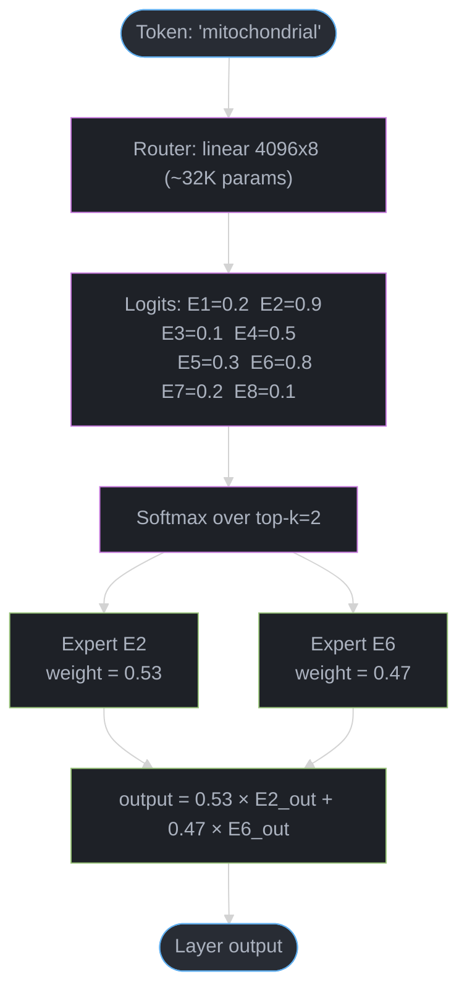
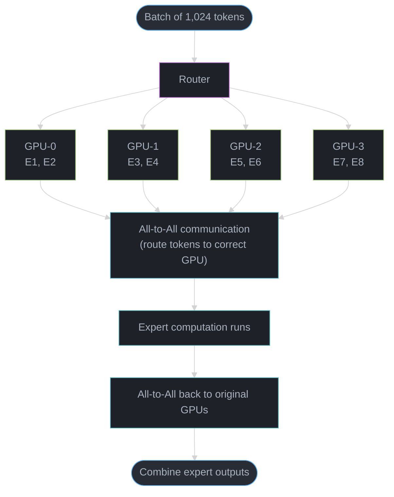
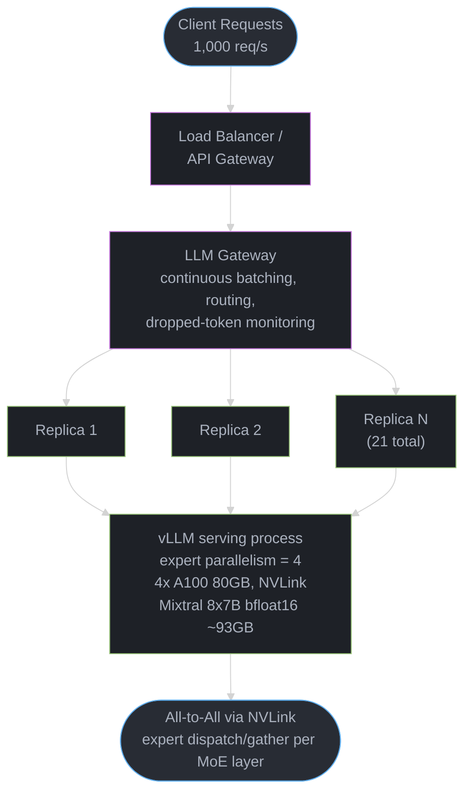

# Mixture of Experts (MoE)

---

## 1. Concept Overview

Mixture of Experts (MoE) is an architecture that replaces dense feed-forward network (FFN) layers in a Transformer with a collection of parallel "expert" sub-networks and a learned routing mechanism that selects only a small subset of experts for each token. The result is a model with a very large total parameter count but a far smaller active parameter count during any given forward pass.

Key production numbers:

| Model | Total Params | Active Params per Token | Experts | Top-k |
|---|---|---|---|---|
| Mixtral 8x7B | 46.7B | 12.9B | 8 | 2 |
| DeepSeek-V3 | 671B | 37B | 256 + 1 shared | 8 |
| Qwen3-235B-A22B | 235B | 22B | 128 | 8 |
| Switch Transformer (Switch-C) | 1.571T | ~1.6B (derived) | 2048 | 1 |

Every row above comes from a published model card or paper. Switch-C's active count is not
published directly: the paper reports 890B FLOPs/sequence for Switch-C versus 6.3T for the
FLOP-matched Switch-XXL/T5-XXL pair, and the released config (d_model 2080, 15 encoder +
15 decoder layers, top-1 of 2048) works out to roughly 1.6B parameters touched per token —
so Switch-C is a *trillion*-parameter model with the per-token cost of a small dense one.
Reported architectures for closed models (GPT-4 and others) are second-hand and mutually
inconsistent; they are not used as numbers anywhere in this module.

The central promise of MoE: several times (Mixtral 3.6x) to ~18x (DeepSeek-V3) more total
parameters at roughly the same inference FLOP cost as a dense model of active-parameter size. More parameters = more capacity to store knowledge; same active compute = similar latency and throughput.

---

## 2. Intuition

**One-line analogy:** MoE is like a hospital with specialist doctors. Instead of a single general practitioner who must know everything, you route each patient to the right specialist — a cardiologist for chest pain, a neurologist for headaches. Each specialist is deeply expert in their domain, yet no single consultation requires every doctor in the building to be present.

**Mental model:** In a dense Transformer, every token activates every weight. This is wasteful. The token "the" does not need to invoke the same computation as "mitochondrial". MoE gives the model a way to say "this token only needs experts 3 and 7" and completely skips the other six.

**Why it matters:** Training compute scales with active parameters, not total parameters. A MoE model with 46.7B total params but 12.9B active params trains at roughly the cost of a 12.9B dense model, yet has the memorization capacity of a much larger model.

**Key insight:** Language is heterogeneous, and different tokens benefit from different sub-networks. Routing structure emerges during training without explicit supervision — but note that in Mixtral the emergent structure is **syntactic and positional**, not topical: the paper found no domain-level expert specialization (Section 3). The analogy is useful for intuition; do not push it to "expert 5 is the cardiologist".

---

## 3. Core Principles

**Conditional computation.** Only a fraction of network weights are executed per token. The gating network decides which fraction. This breaks the coupling between model capacity (total params) and inference cost (FLOPs per token).

**Top-k routing.** Each token selects exactly k experts from N available, where k=2 is standard (Mixtral) and k=1 was used in Switch Transformer. Using k=2 provides redundancy and richer representations; k=1 maximizes efficiency.

**Load balancing.** Without intervention, the router collapses — it learns to always send tokens to the same 1-2 experts, starving the rest. An auxiliary load-balancing loss penalizes uneven expert utilization during training to keep all experts useful.

**Expert specialization.** Experts differentiate over training, but *not* along the axis people expect. The Mixtral paper's routing analysis found **no** obvious topic specialization — expert assignment looks near-identical for ArXiv, PubMed and PhilPapers text — and concluded that "the selection of experts appears to be more aligned with the syntax rather than the domain". What it did find was syntactic and positional structure: `self` in Python and indentation tokens route consistently to the same expert, and consecutive tokens repeat the same first-choice expert far more often than the 12.5% random baseline (up to ~28% at layer 15). ST-MoE likewise reports no language specialization in multilingual training. Whatever specialization exists is emergent, not imposed — and it is a poor basis for reasoning about "which expert knows biology".

**Expert capacity.** Each expert has a maximum token budget per batch (capacity factor). Tokens routed to an over-subscribed expert are either dropped or sent to a fallback path. This is a critical production concern.

**Training efficiency.** All experts receive gradients during training but only for the tokens routed to them. Experts that rarely get routed receive sparse gradient updates, which is why load balancing is critical for quality.

---

## 4. Types / Architectures / Strategies

### 4.1 Standard Sparse MoE (Top-k Hard Routing)

The original formulation. A small gating MLP produces logits over N experts; softmax converts them to probabilities; top-k selection picks the highest-scoring experts; only those experts execute.

Examples: Mixtral 8x7B (top-2 of 8), Switch Transformer (top-1 of 2048), GShard.

### 4.2 Fine-Grained MoE

Use a much larger number of smaller experts with a higher k. DeepSeek-V3 uses 256 experts of smaller individual size with top-8 routing, plus 1 shared expert that all tokens always use (providing a "common knowledge" path). Fine-grained routing gives the model more flexible combinations and smoother gradient flow.

### 4.3 Soft MoE (Google DeepMind)

Instead of hard discrete selection, each expert receives a weighted combination of all tokens in the sequence ("slots"), with weights learned continuously. No tokens are dropped and no load-balancing loss is needed; the paper scales it to thousands of experts and reports it beating token-choice and expert-choice routing while often being cheaper. Its stated limitation is autoregressive decoding: merging all tokens in the input breaks causality, so Soft MoE has been demonstrated on image classification and image-text contrastive models, not on LLM decoders.

### 4.4 Hash-Based Routing

Tokens are assigned to experts by a deterministic hash of their content (e.g., token ID modulo N), removing the gating network entirely. Avoids expert collapse but also prevents specialization — the router cannot learn. Useful as a baseline or for training stability experiments.

### 4.5 Expert Choice Routing

Inverts the selection: instead of each token choosing experts, each expert chooses its top-m tokens from the batch. Guarantees perfectly balanced load. Downside: a single token can be processed by a variable number of experts, complicating batching.

### 4.6 Dense-to-MoE Upcycling

Take a trained dense model, replicate its FFN layer N times to create N experts (initializing each expert from the original FFN weights), add a randomly initialized gating network, then continue training. Significantly reduces MoE training cost because you start from a strong dense checkpoint. Used in practice to avoid training a MoE from scratch.

---

## 5. Architecture Diagrams

### Standard Transformer Layer vs MoE Layer

```
DENSE TRANSFORMER LAYER
========================

  Token Embeddings
        |
  [Multi-Head Self-Attention]
        |
  [Feed-Forward Network]  <-- ALL FFN params active for every token
        |
  Output Embeddings


MoE TRANSFORMER LAYER
======================

  Token Embeddings
        |
  [Multi-Head Self-Attention]  <-- shared, always active (same as dense)
        |
  [Router / Gating Network]    <-- tiny MLP, produces expert scores
     /   |   |   |   \
  [E1] [E2] [E3] [E4] [E5] [E6] [E7] [E8]   <-- 8 expert FFNs
     \       |         /
      `------+---------`   only top-2 selected per token
        |
  [Weighted Sum of Expert Outputs]
        |
  Output Embeddings
```

### Routing Mechanism Detail



Only top-k=2 experts fire per token; a different token ("the") routes to entirely different experts (E1, E3), giving token-type specialization across the pool.

### Expert Parallelism Across GPUs



All-to-All is the dominant communication cost in expert parallelism; it fires twice per MoE layer (tokens-to-experts, then outputs-back).

### Expert Capacity and Token Dropping

```
  Expert E2 — capacity = 256 tokens per batch
  =============================================

  Incoming tokens routed to E2: 312 tokens
  Capacity:                     256 tokens
  Overflow:                      56 tokens  <-- DROPPED (lost)

  Capacity factor = (tokens_per_batch * k) / (N * capacity)
  GShard/Switch-style trainers typically use 1.25 to 2.0
  Higher factor = less dropping, more memory usage

  Note: capacity is a property of static-shape implementations. The reference
  Mixtral inference paths (HuggingFace, vLLM) impose no capacity limit and
  drop no tokens; Megatron-LM's --moe-expert-capacity-factor also defaults
  to unset (no dropping).
```

### Load Balancing Auxiliary Loss

```
  Ideal expert utilization (8 experts, uniform):
  E1:12.5% E2:12.5% E3:12.5% E4:12.5%
  E5:12.5% E6:12.5% E7:12.5% E8:12.5%

  Without aux loss (expert collapse):
  E1: 0%   E2:85%   E3: 2%   E4: 0%
  E5: 0%   E6:10%   E7: 3%   E8: 0%
  --> E2 and E6 see all gradients, others starve

  Aux loss = alpha * sum_i(f_i * P_i)
    f_i = fraction of tokens routed to expert i
    P_i = average routing probability assigned to expert i
    alpha = 0.01 (Switch Transformer / ST-MoE published value)
  --> minimized when routing is uniform across experts

  DeepSeek-V3 does NOT use this as its primary mechanism: it balances with a
  per-expert bias (update speed gamma = 0.001) and keeps only a small
  sequence-wise balance loss at alpha = 0.0001.
```

---

## 6. How It Works — Detailed Mechanics

### 6.1 Router / Gating Network

The gating network is a small linear layer (no activation) that maps the token hidden state to N logits, one per expert.

```python
# Pseudocode for top-k gating

def route(hidden_state, W_gate, k=2, N=8):
    # hidden_state: [batch_size, seq_len, d_model]
    # W_gate: [d_model, N]  -- router weight matrix

    logits = hidden_state @ W_gate     # [batch, seq, N]
    scores = softmax(logits, dim=-1)   # normalize over experts

    # Hard top-k selection
    top_k_scores, top_k_indices = topk(scores, k=k, dim=-1)
    # top_k_scores:   [batch, seq, k]  -- routing weights
    # top_k_indices:  [batch, seq, k]  -- which experts

    # Renormalize so weights sum to 1
    top_k_weights = top_k_scores / sum(top_k_scores, dim=-1, keepdim=True)

    return top_k_weights, top_k_indices
```

The router weight matrix W_gate is tiny relative to the expert FFNs. For Mixtral d_model=4096, N=8: W_gate is 4096x8 = 32K parameters per layer, versus ~176M parameters for one expert FFN in that same layer (3 x 4096 x 14336), or 5.6B for one expert summed across all 32 layers.

**The idea behind it.** "Score all 8 experts, turn the scores into percentages, keep only the two best, then re-split those two back to 100% and blend their outputs in that ratio."

The re-normalization step is the one people forget. After top-k you are holding two probabilities that came out of an 8-way softmax, so they do NOT sum to 1 — dividing by their sum is what makes the final blend a proper weighted average instead of a shrunken one.

| Symbol | What it is |
|--------|------------|
| `h @ W_gate` | Token hidden state times the router matrix. Produces one logit per expert |
| `logits` | Raw, unbounded scores. Can be negative. Not yet comparable as probabilities |
| `softmax(z)_i` | `exp(z_i) / sum_j exp(z_j)`. Turns any scores into positives that sum to 1 |
| `topk(s, k)` | Keep the `k` largest entries and their indices; discard the rest |
| `k` | How many experts fire per token. 1 (Switch), 2 (Mixtral), 8 (DeepSeek-V3) |
| `N` | Total experts available in the layer. 8 for Mixtral |
| `w_i / sum(w)` | Rescale the surviving `k` weights so they sum to exactly 1 |

**Walk one example.** One token, 8 experts, k=2 — the same logits as the routing diagram above:

```
  expert    logit    exp(logit)    softmax = exp / 12.337     selected?
  ------    -----    ----------    ----------------------     ---------
   E1        0.2        1.221              0.099
   E2        0.9        2.460              0.199              <- 1st
   E3        0.1        1.105              0.090
   E4        0.5        1.649              0.134
   E5        0.3        1.350              0.109
   E6        0.8        2.226              0.180              <- 2nd
   E7        0.2        1.221              0.099
   E8        0.1        1.105              0.090
  ------    -----    ----------    ----------------------
                     sum = 12.337        sum = 1.000

  Step 1  softmax over ALL 8 experts        (every expert gets a probability)
  Step 2  top-2 selection -> E2 (0.199), E6 (0.180)
          the other 6 experts never run -- their FLOPs are simply skipped
  Step 3  renormalize:  0.199 + 0.180 = 0.379
                        E2 = 0.199 / 0.379 = 0.525
                        E6 = 0.180 / 0.379 = 0.475
                        (now sums to 1.000, not 0.379)
  Step 4  output = 0.525 * E2(token) + 0.475 * E6(token)
```

**Why renormalize at all.** Skip step 3 and the layer output is scaled by 0.379 instead of 1.0 — every MoE layer would shrink its own activations by ~62%, and 32 stacked layers would drive the residual stream toward zero. Worse, the shrink factor varies per token (a confident token whose top-2 hold 0.7 of the mass shrinks less than an uncertain one), so the scale of the hidden state would start encoding router confidence rather than content. Renormalizing makes the blend a true convex combination and keeps activation magnitude stable regardless of how peaked the routing was.

### 6.2 Expert Computation and Output Combination

```python
def moe_forward(hidden_state, experts, router):
    weights, indices = router(hidden_state)
    # weights:  [batch, seq, k]
    # indices:  [batch, seq, k]  -- values in [0, N)

    output = zeros_like(hidden_state)

    for i in range(k):
        expert_idx = indices[:, :, i]   # [batch, seq]
        expert_weight = weights[:, :, i]  # [batch, seq]

        # Dispatch tokens to their assigned expert
        for e in range(N):
            mask = (expert_idx == e)
            if mask.any():
                token_subset = hidden_state[mask]         # tokens for expert e
                expert_out = experts[e](token_subset)     # run FFN
                output[mask] += expert_weight[mask].unsqueeze(-1) * expert_out

    return output
```

In practice this is highly optimized. vLLM and TensorRT-LLM use fused CUDA kernels for expert dispatch and gather operations.

### 6.3 Load Balancing Loss

```
Total loss = task_loss + alpha * auxiliary_loss

auxiliary_loss = N * sum_{i=1}^{N} ( f_i * P_i )

where:
  f_i = (number of tokens routed to expert i) / (total tokens)
  P_i = mean routing probability assigned to expert i across all tokens
  N   = number of experts
  alpha = 0.01 (Switch Transformer, ST-MoE). DeepSeek-V3 replaces this loss
          with a bias controller and keeps only a sequence-wise term at 0.0001

When f_i = 1/N for all i (uniform distribution), aux_loss is minimized.
```

**Stated plainly.** "Charge the model a fee proportional to how lopsided its routing is. The fee is smallest when every expert gets an equal share, and it climbs fast when one expert hogs the traffic."

**Why this term exists at all.** Without it, MoE training has a runaway feedback loop. Suppose E2 wins slightly more tokens than average by pure initialization luck. E2 therefore receives more gradient updates, gets better faster, so the router scores it higher, so it wins even more tokens. Within a few thousand steps E2 and one friend take everything, the other six experts never receive gradient and stay at their random initialization, and you have paid for a 46.7B model that behaves like a 12.9B one with 34B of dead weight. The aux loss is the counterweight that keeps the loop from closing — it is not a nice-to-have regularizer, it is the thing that makes sparse training work.

| Symbol | What it is |
|--------|------------|
| `f_i` | Fraction of tokens actually **routed** to expert i. Hard counts. All `f_i` sum to 1 |
| `P_i` | Mean routing **probability** the softmax assigned expert i. Also sums to 1 |
| `sum_i` | Add the product across all N experts |
| `N *` | Scale factor that fixes the minimum at 1.0 regardless of expert count |
| `alpha` | Fee rate. 0.01 in Switch Transformer / ST-MoE |
| `f_i * P_i` | Pairs hard counts with soft probabilities — this is what makes it differentiable |

**Walk two distributions.** Same 8 experts, same formula, `alpha = 0.01`. Take `P_i ~ f_i`:

```
  BALANCED (the target)                  COLLAPSED (the failure)
  expert    f_i     P_i    f_i*P_i       expert    f_i     P_i    f_i*P_i
  ------   -----   -----   -------       ------   -----   -----   -------
   E1      0.125   0.125   0.01563        E1      0.00    0.00    0.00000
   E2      0.125   0.125   0.01563        E2      0.85    0.85    0.72250
   E3      0.125   0.125   0.01563        E3      0.02    0.02    0.00040
   E4      0.125   0.125   0.01563        E4      0.00    0.00    0.00000
   E5      0.125   0.125   0.01563        E5      0.00    0.00    0.00000
   E6      0.125   0.125   0.01563        E6      0.10    0.10    0.01000
   E7      0.125   0.125   0.01563        E7      0.03    0.03    0.00090
   E8      0.125   0.125   0.01563        E8      0.00    0.00    0.00000
  ------                   -------       ------                   -------
             sum          = 0.12500                 sum          = 0.73380

  aux = N * sum = 8 * 0.12500 = 1.000    aux = N * sum = 8 * 0.73380 = 5.870
  alpha * aux  = 0.01 * 1.000 = 0.0100   alpha * aux  = 0.01 * 5.870 = 0.0587

  Penalty difference added to the task loss: 0.0587 - 0.0100 = 0.0487
```

Three things to say about that table in an interview. First, **1.0 is the floor**, not 0 — the `N *` factor is chosen so perfectly uniform routing always scores exactly 1.0 whether you have 8 experts or 256, which makes `alpha` mean the same thing across architectures. Second, the penalty is **quadratic in the imbalance**: E2's share went up 6.8x (0.125 -> 0.85) but its contribution went up 46x (0.0156 -> 0.7225), so the gradient gets sharply stronger the closer you drift to collapse. Third, `f_i` alone has **no gradient** — it comes from a discrete top-k argmax. Multiplying it by the differentiable `P_i` is the trick that lets backprop reach the router at all; that is the entire reason the formula is a product of two things that look redundant.

DeepSeek-V3 introduced a "bias" term added to router logits that adjusts dynamically to maintain balance without the auxiliary loss degrading task performance. Its published settings: bias update speed gamma = 0.001 for the first 14.3T training tokens then 0.0 for the final 500B, plus a complementary sequence-wise balance loss at alpha = 0.0001.

### 6.4 Expert Capacity Factor

```
tokens_per_expert_ideal = (batch_size * seq_len * k) / N

capacity = int(capacity_factor * tokens_per_expert_ideal)

capacity_factor = 1.0  --> tight, significant token dropping possible
capacity_factor = 1.25 --> common GShard/Switch-style default, small buffer
capacity_factor = 2.0  --> generous, minimal dropping, 2x memory

Dropped tokens bypass expert computation and pass through a residual
connection (the token's hidden state is used as-is, as if the expert
applied an identity function).
```

**Reading capacity in plain English.** "Work out how many tokens each expert would get if routing were perfectly fair, then hand every expert that many slots plus a percentage buffer. Tokens arriving after the slots run out are thrown away."

The word doing the work is *ideal*. Capacity is budgeted against the uniform assumption, but real routing is never uniform — the buffer is what absorbs the gap between what the aux loss achieved and what perfect balance would have been.

| Symbol | What it is |
|--------|------------|
| `batch_size * seq_len` | Total tokens the layer sees this forward pass |
| `* k` | Each token occupies `k` expert slots, not one. k=2 doubles total demand |
| `/ N` | Split the demand evenly across the N experts |
| `tokens_per_expert_ideal` | What each expert gets if routing were perfectly uniform |
| `capacity_factor` | Buffer multiplier over fair share. 1.25 = 25% headroom |
| `capacity` | Hard slot count. Token `k+1` past this is dropped, no error raised |

**Walk one example.** Batch of 512 tokens, k=2, N=8 experts — the production case study's batch size:

```
  fair share = (512 tokens x 2 experts each) / 8 experts = 1024 / 8 = 128 tokens

  Total expert slots demanded this batch: 512 x 2 = 1024

  Now a REAL (skewed) batch arrives. Expert E2 attracts 200 tokens, not 128.

  capacity_factor   capacity = CF x 128   E2 receives   dropped   drop rate
  ---------------   -------------------   -----------   -------   --------------
       1.00                128                200          72     72/1024 = 7.0%
       1.25                160                200          40     40/1024 = 3.9%
       1.50                192                200           8      8/1024 = 0.8%
       2.00                256                200           0      0/1024 = 0.0%
  ---------------   -------------------   -----------   -------   --------------

  Each dropped token skips its expert entirely and passes through the residual
  connection unchanged -- as if that expert were the identity function. The
  forward pass SUCCEEDS. Latency looks normal. Nothing is logged.
```

That last line is the whole reason this parameter is dangerous. A 7% drop rate at `capacity_factor = 1.0` is not a crash, it is a quiet accuracy tax that shows up only as a downstream eval regression weeks later. Note also that the drop rate is measured against the **1024 total slots**, not against E2's 200 — so a single overloaded expert out of eight can still poison a meaningful share of the batch.

The factor is a dial between two costs — memory you reserve vs. tokens you silently
drop. Laying the levels side by side shows why production settles near 1.25-1.5:

```
 capacity_factor   tokens dropped     expert memory    verdict
 ---------------   ----------------   -------------    --------------------------------
      1.0          high (imbalance)   1.00x (base)     too tight -- silent quality loss
      1.25         low                1.25x            common default -- sweet spot
      1.5          very low           1.50x            safe under skewed routing
      2.0          ~none              2.00x            wasteful -- pads for worst case
 ---------------   ----------------   -------------    --------------------------------
 capacity = capacity_factor * (batch * seq * k / N)
 Left of the dial you lose tokens to a no-op residual; right of it you burn HBM
 reserving slots that mostly sit empty. The drop is SILENT (no error), which is
 why 1.0 is dangerous and the safe band is 1.25-1.5.
```

### 6.5 Expert Parallelism

With EP=8 (8 GPUs, 8 experts), each GPU holds 1 expert. During a forward pass:

1. Each GPU holds its own shard of the batch (one data-parallel slice of the tokens).
2. Each GPU runs the router locally to determine which expert each of its tokens needs.
3. All-to-All collective: each GPU sends token subsets to the GPU holding the needed expert.
4. Each GPU runs its local expert on the received tokens.
5. All-to-All back: each GPU receives computed expert outputs and reconstructs the full batch.

Communication volume per all-to-all = batch_tokens * d_model * k * dtype_bytes. For Mixtral with batch=2048, d_model=4096, k=2, bfloat16: 2048 * 4096 * 2 * 2 = 33.5MB per all-to-all, twice per layer = 67MB per MoE layer. Interconnect bandwidth is the bottleneck, and the tiers are an order of magnitude apart: NVLink 3/4 gives 600-900 GB/s per GPU, while InfiniBand NDR is 400 Gb/s = 50 GB/s per NIC (HDR: 200 Gb/s = 25 GB/s). Quote InfiniBand in Gb/s and NVLink in GB/s or you will be off by 8x.

### 6.6 Mixtral 8x7B Concrete Breakdown

```
Architecture:
  Layers:          32
  d_model:         4096
  Attention heads: 32
  KV heads:        8   (grouped-query attention)
  Experts:         8 per MoE layer
  Active experts:  2 per token
  Expert FFN dim:  14336

Parameter accounting:
  Attention (shared):   32 * (4096*4096 + 2*4096*1024 + 4096*4096) ~ 1.34B
  Expert FFNs:          8 * 32 * (4096*14336*3) ~ 45.10B
  Embeddings:           2 * 32000 * 4096 ~ 0.26B  (input embedding + untied
                                                   output head)
  Total:                1.34 + 45.10 + 0.26         ~ 46.70B  (published 46.7B)
  Active (top-2):       1.34 + 0.26 + (2/8 * 45.10) ~ 12.88B  (published 12.9B)

Inference cost per token ~ 12.9B parameter dense model
Knowledge capacity       ~ 46.7B parameter dense model
```

#### Why "8x7B" is 46.7B and not 56B

This is the single most-asked MoE arithmetic question, and the name is actively misleading. "8x7B" reads like eight copies of a 7B model, which would be 56B. The real answer is 46.7B, and the ~11B gap is the entire concept.

**What the formula is telling you.** "Only the FFN is replicated eight times. Attention and embeddings exist once and every expert shares them, so multiplying the whole 7B model by 8 counts the shared stack seven extra times."

| Piece of the model | Replicated per expert? |
|---|---|
| Attention (Q, K, V, O projections) | **No** — one copy, all tokens use it |
| Embeddings + output head | **No** — one copy |
| Feed-forward network (FFN) | **Yes** — 8 copies, this is what "8x" counts |
| Router / gating matrix | One tiny 4096x8 matrix per layer (~32K params) |

**Walk the total.** Mistral-7B is really 7.24B, and it splits like this:

```
  A single Mistral-7B, decomposed
  --------------------------------------------------------------------
  FFN     32 layers x 3 matrices x 4096 x 14336        =  5.64B
  Attn    32 layers x (Q 4096x4096 + K,V 4096x1024
                       + O 4096x4096)                  =  1.34B
  Embed   2 x (32000 x 4096), untied in and out        =  0.26B
  --------------------------------------------------------------------
  total                                                =  7.24B

  THE NAIVE (WRONG) ANSWER
      8 x 7.24B  =  57.9B      "eight whole models"

  THE ACTUAL MIXTRAL 8x7B
      FFN experts   8 x 5.64B  = 45.10B   <- replicated 8 times
      Attention         1.34B  =  1.34B   <- shared, counted ONCE
      Embeddings        0.26B  =  0.26B   <- shared, counted ONCE
      --------------------------------------------------------
      total                    = 46.70B

  THE GAP
      57.9B - 46.7B = 11.2B = 7 x 1.60B
                              ^^^^^^^^^^
      exactly 7 redundant copies of the 1.60B shared stack that the
      naive multiplication double-counted
```

**Now walk the active count.** Active parameters are "shared stack, always" plus "k of N experts":

```
  Attention  (always runs)                         1.34B
  Embeddings (always runs)                         0.26B
  Experts    (2 of 8)   2/8 x 45.10B            = 11.27B
  ------------------------------------------------------
  active per token                              = 12.87B  ~ 12.9B

  Sanity check on the sparsity claim:
    total  / active =  46.70 / 12.87 = 3.6x more parameters
    FLOPs  per token stay at the 12.9B level -- the 6 unselected
    experts are never multiplied by anything
```

**The two-sentence interview answer.** "The `8x` only multiplies the FFN, not the whole model — attention and embeddings are shared across all experts and counted once, which is why it is 46.7B rather than 8 x 7 = 56B. Active is then the shared stack plus 2 of the 8 experts, which lands at ~12.9B, and note that memory is still sized by the 46.7B total because every expert must be resident even though only two fire."

Different write-ups slice the 46.7B slightly differently — some fold layer norms and the router into the "attention" bucket, which shifts the shared portion by a few hundred million. The structural point is what is being tested: **shared components counted once, expert FFNs counted N times, and active counts k of those N.**

---

## 7. Real-World Examples

### Mixtral 8x7B — Mistral AI (December 2023)

The first widely-deployed open-source sparse MoE LLM. Apache 2.0 license. 8 experts, top-2 routing per MoE layer. Replaced every FFN layer in a Mistral-7B-style architecture with a MoE block. Mistral's release claim: outperforms Llama 2 70B on most benchmarks "with 6x faster inference", and matches or exceeds GPT-3.5 on standard benchmarks. Available via HuggingFace, Ollama, vLLM, TensorRT-LLM.

### DeepSeek-V3 (December 2024)

671B total parameters, 37B active. Multi-head Latent Attention (MLA) combined with fine-grained MoE (256 expert FFNs + 1 shared expert, top-8 routing). Auxiliary-loss-free load balancing using dynamic bias terms; the paper reports that no tokens are dropped during training or inference. Full training took 2.788M H800 GPU-hours — the widely quoted "$5.5M" is that figure priced at the paper's own assumed $2 per GPU-hour, not a disclosed spend. Reported as comparable to leading closed models on many benchmarks. Demonstrated that MoE at scale can be trained efficiently with careful engineering.

### Switch Transformer — Google (2021)

First paper to demonstrate that scaling to 1.6T parameters via MoE (with top-1 routing) improved task performance. Used 2048 experts across TPU pods. Introduced the capacity factor concept and load balancing loss. Established MoE as viable at language model scale.

### Closed frontier models — architecture unconfirmed

Second-hand reports have long claimed that some frontier closed models are sparse MoE, but the circulating numbers disagree with each other (an "8 experts of ~220B" version and a "16 experts of ~111B" version are both in wide circulation) and no vendor has published a parameter count or expert configuration. Treat all of it as rumour: do not quote expert counts or active-parameter figures for closed models in an interview. Use the published open-weight models above when you need real numbers.

### Qwen3-235B-A22B — Alibaba (2025)

235B total parameters, 22B activated per token, 128 experts with 8 activated, 94 layers, GQA with 64 query heads and 4 KV heads. A useful counterpoint to Mixtral: same top-k idea, far finer granularity, and the "A22B" naming convention states the active count directly instead of leaving it to be derived.

### Grok-1 — xAI (2024)

314B total parameters, MoE with 8 experts and 2 selected per token (`num_experts=8`, `num_selected_experts=2` in xAI's released `run.py`), 64 layers, embedding size 6144, 48 query heads / 8 KV heads. Open-weights release under Apache 2.0. Architecture similar to Mixtral but with much larger individual experts.

---

## 8. Tradeoffs

### MoE vs Dense Model (same active parameter count)

| Dimension | MoE (46.7B total / 12.9B active) | Dense (12.9B) |
|---|---|---|
| Knowledge capacity | Much higher (46.7B params store more facts) | Lower |
| Inference FLOPs | Same (12.9B active) | Same |
| Inference memory | Much higher (must load all 46.7B) | Lower (12.9B) |
| Training cost | Similar (active params dominate) | Similar |
| Training complexity | High (load balancing, expert collapse) | Low |
| Serving complexity | High (expert parallelism, all-to-all) | Low |
| Fine-tuning cost | Higher (all experts must be loaded) | Lower |
| Token dropping risk | Present (capacity overflow) | None |
| Latency (single req) | Similar or slightly higher | Lower |
| Throughput (batch) | Better (more capacity, similar compute) | Baseline |

### Top-k Routing Variants

| Routing Type | Load Balance | Specialization | Complexity | Token Dropping |
|---|---|---|---|---|
| Top-1 (Switch) | Hardest to balance | Strongest | Low | High risk |
| Top-2 (Mixtral) | Balanced with aux loss | Good | Medium | Moderate |
| Expert Choice | Perfect | Moderate | Medium | None |
| Soft MoE | Perfect | Weak | Low | None |
| Hash-based | Perfect | None | Lowest | None |

### Expert Granularity

| Approach | Experts | Top-k | Expert Size | Flexibility |
|---|---|---|---|---|
| Coarse (Switch) | 64-2048 | 1 | Large | Low |
| Standard (Mixtral) | 8 | 2 | Medium | Medium |
| Fine-grained (DeepSeek) | 256 | 8 | Small | High |

---

## 9. When to Use / When NOT to Use

### When to Use MoE

- You need maximum model quality but have inference compute constraints. MoE gives you more parameters (capacity) for the same inference FLOPs.
- You are serving at high throughput. At large batch sizes, expert parallelism amortizes all-to-all communication overhead and you get dense-model latency with more-than-dense quality.
- You have abundant GPU memory but limited GPU compute. MoE trades memory for compute savings.
- You are training from a dense checkpoint (upcycling). Converting an already-trained dense model to MoE via upcycling significantly reduces training cost versus training MoE from scratch.
- Your data is heterogeneous (multilingual, code + language + math) and you want the extra parameter capacity to absorb it. Note the benefit is capacity, not clean domain routing — Mixtral's own routing analysis found no topic-level expert specialization.

### When NOT to Use MoE

- You are memory-constrained. Mixtral 8x7B needs 46.7B x 2 bytes = ~93GB of weights at bfloat16, versus 7.24B x 2 = ~15GB for a Mistral 7B. If you can barely fit a dense 7B, MoE is not viable.
- You are serving single requests at low latency (not batched). Expert parallelism requires all-to-all communication that adds latency on each MoE layer. At batch size 1, the overhead is not amortized.
- You need simple fine-tuning or LoRA. MoE fine-tuning requires deciding which experts to update, and LoRA adapters on MoE layers multiply adapter count by number of experts.
- Your serving infrastructure cannot support multi-GPU expert parallelism. A small team without GPU cluster experience will struggle to operate MoE serving reliably.
- You are building a small model (under 3B params). MoE overhead (routing, load balancing, expert dispatch) hurts small models. Benefits emerge at scale.

---

## 10. Common Pitfalls

### Expert Collapse

The most common training failure. The router learns to send all tokens to 1-2 experts, which receive all gradients and improve, reinforcing the routing decision. Remaining experts receive no gradients and never improve. Result: effectively a dense model with 1 expert and wasted parameters.

Fix: Load balancing auxiliary loss with alpha >= 0.01. Monitor per-expert token distribution during training. If any expert receives >30% of tokens consistently, increase alpha or use expert choice routing.

### Memory vs Compute Misconception

Engineers often underestimate memory. You must load ALL expert weights even though only k/N are active per token. Mixtral 8x7B: ~93GB at bfloat16 (the published safetensors weights total 93.4GB). A machine running Mixtral needs 93GB of GPU RAM, not 12.9GB (the active param count). This surprises teams that calculate memory from FLOPs.

### Training Instability from Routing

During early training, the router has not learned to route meaningfully. Random routing combined with the auxiliary loss can create gradient conflicts, causing loss spikes. Standard mitigation: initialize router weights near zero (small random initialization), use gradient clipping, and warm up the auxiliary loss weight linearly.

### Fine-Tuning Expert Confusion

When fine-tuning a MoE model with LoRA, applying adapters only to attention layers (a common shortcut) misses the expert FFNs, which hold ~97% of the model's parameters. Applying LoRA to all expert FFNs is expensive (adapter count scales with N). Teams often fine-tune only the shared layers and a subset of experts, which degrades quality on the target domain if the relevant experts are not updated.

### Serving Complexity at Scale

Expert parallelism requires all-to-all collectives, which are sensitive to network topology. Placing experts across nodes connected by InfiniBand (NDR: 400 Gb/s = 50 GB/s per NIC) instead of NVLink (600-900 GB/s per GPU) drops the available bandwidth for the collective by roughly an order of magnitude, and MoE layer latency rises accordingly. Teams that size GPU instances for compute without accounting for interconnect topology see MoE serving performance far below theoretical estimates.

### Token Dropping Silent Failures

With capacity_factor=1.0, significant fractions of tokens are silently dropped and replaced with their input hidden state (identity fallback). This degradation is invisible in serving metrics (latency looks fine) but manifests as quality regression on long-context or high-throughput batches. Always monitor dropped token rate in production. Keep capacity_factor >= 1.25 for production serving.

### Expert Load Imbalance at Inference

The auxiliary loss enforces load balance on training data distribution. At inference with different data (e.g., a model trained on English receives code queries), routing can become unbalanced even if it was balanced during training. Expert load imbalance causes some GPUs to be idle while others are bottlenecked, reducing throughput. Monitor per-expert utilization in production dashboards.

**Monitoring is the detection, not the fix.** The production remedy is to stop assuming one expert lives on exactly one GPU. DeepSeek's **Expert Parallelism Load Balancer (EPLB)**, open-sourced alongside V3/R1, duplicates the heavy-loaded experts and then heuristically packs the duplicates across GPUs so that per-GPU load evens out. The extra copies are called **redundant experts**: you spend memory (`num_redundant_experts` additional expert replicas beyond an equal split) to buy back the throughput that an idle GPU was costing you.

EPLB ships two policies, and which one you want depends on the phase:

| Policy | When | What it does |
|---|---|---|
| Hierarchical | Prefill, smaller expert-parallel size, and only when the node count divides the expert-group count | Balance groups across nodes first, replicate within a node, then pack replicas onto that node's GPUs — keeps most of the all-to-all traffic intra-node |
| Global | Decode, larger expert-parallel size, or when the group/node counts do not divide | Replicate hot experts globally, ignoring group structure, then pack across all GPUs |

The reason the two differ is the same interconnect argument as the pitfall above: at prefill's smaller EP degree you can still keep a group's traffic inside one NVLink domain, so the hierarchical policy protects locality. At decode's larger EP degree that locality is gone anyway, so you optimize purely for balance.

In vLLM this is `--enable-eplb` on top of `--enable-expert-parallel`, with `--eplb-config` carrying the JSON knobs: `window_size` (how many engine steps of load history to keep), `step_interval` (rebalance every N steps), `num_redundant_experts`, `use_async` (non-blocking rebalance, lower latency cost) and `log_balancedness`. The engine collects load statistics on every forward pass and periodically re-derives the placement. Two operational gotchas: rebalancing moves expert weights between GPUs, so a short `step_interval` on a large model spends real bandwidth on the shuffle rather than on tokens; and EPLB corrects *placement*, never *routing* — if the router itself has collapsed onto a handful of experts, redundant copies of those experts just spread the same pathology more evenly.

---

## 11. Technologies & Tools

### Inference Frameworks

**vLLM** — First-class Mixtral/MoE support. Implements fused CUDA kernels for expert dispatch. Supports tensor parallelism and pipeline parallelism for MoE. Recommended for production MoE serving. Expert parallelism is a separate opt-in flag, `--enable-expert-parallel`; without it the MoE layers follow tensor-parallel sharding. The EP size is derived, not set by hand: `EP_SIZE = TP_SIZE x DP_SIZE`.

**TensorRT-LLM** — NVIDIA's inference framework. Provides optimized MoE kernels for H100/A100. Supports FP8 quantization for expert weights. Best raw throughput for NVIDIA hardware.

**llama.cpp** — CPU and consumer GPU MoE inference. Supports Mixtral via GGUF format. `--cpu-moe` / `--n-cpu-moe N` keep the MoE expert tensors (all layers, or the first N) resident in CPU RAM while the shared attention stack stays on GPU — it is a static tensor placement, not on-demand paging of the "inactive" experts to GPU. Reduces VRAM requirement at latency cost.

**SGLang** — Supports MoE with RadixAttention. Good for multi-turn workloads with prefix caching.

**Ollama** — Bundles llama.cpp, supports Mixtral for local deployment. Easy setup but limited expert parallelism control.

### Training Frameworks

**Megatron-LM** — NVIDIA's training framework. Full support for expert parallelism, tensor parallelism, pipeline parallelism, and data parallelism combined (4D parallelism), plus dropless MoE (`--moe-expert-capacity-factor` defaults to unset), aux-loss and z-loss coefficients, and upcycling. Note that DeepSeek-V3 was NOT trained on Megatron — the paper states it used DeepSeek's own HAI-LLM framework with 16-way pipeline parallelism, 64-way expert parallelism and ZeRO-1 data parallelism.

**DeepSpeed** — Microsoft's training library. MoE support via `deepspeed.moe`. Integrates with ZeRO optimizer. Easier to use than Megatron for teams without NVIDIA-specific expertise.

**FSDP (PyTorch)** — Supports MoE via expert sharding. Less battle-tested than Megatron for very large MoE but simpler for medium scale.

### Model Formats and Serving

**GGUF** — llama.cpp format, supports Mixtral. Quantized variants (Q4_K_M, Q5_K_M) reduce memory substantially.

**SafeTensors** — HuggingFace format for Mixtral weights. 93.4GB bfloat16 for Mixtral 8x7B.

**AWQ / GPTQ** — Post-training quantization for expert weights. Produce the checkpoints with `llm-compressor` (the vLLM project's compression library, which implements both AWQ and GPTQ) or GPTQModel; vLLM and TensorRT-LLM load the resulting quantized weights directly. INT4 quantization reduces Mixtral from ~93GB to ~23GB of weights (46.7B x 0.5 bytes) plus group scales, enabling 2x A100 serving instead of 4x.

### Monitoring

**Expert utilization dashboards** — Custom Prometheus metrics tracking per-expert token counts per batch. Essential for detecting expert collapse and load imbalance in production.

**Weights & Biases / MLflow** — Track expert utilization distribution over training. Plot histogram of tokens per expert per 1000 steps.

---

## 12. Interview Questions with Answers

**Q: What is a Mixture of Experts layer and how does it differ from a standard FFN layer?**
A MoE layer replaces a single dense FFN with N parallel expert FFNs and a router that selects k of them per token. The standard FFN runs all its weights on every token; the MoE layer runs only k/N of its expert weights per token. This decouples total model capacity (all N experts) from per-token compute cost (k experts). Mixtral 8x7B has 8 experts per layer with top-2 routing, giving 46.7B total parameters but only 12.9B active per token.

**Q: How does the routing mechanism work in a top-k MoE?**
The router is a learned linear projection that maps each token's hidden state to N logits (one per expert). A softmax normalizes the logits to probabilities. The top-k highest-probability experts are selected; their weights are renormalized to sum to 1. The token is processed by each of the k selected experts independently, and their outputs are combined as a weighted sum. The router weights are trained jointly with the rest of the model via gradient descent.

**Q: What is expert collapse and how do you prevent it?**
Expert collapse is when the router learns to send all (or nearly all) tokens to the same 1-2 experts, starving the rest of gradient signal. It is a self-reinforcing failure: experts that receive more tokens improve faster, making the router prefer them more. Prevention requires an auxiliary load-balancing loss added to the training objective. The standard formulation is the scaled dot product of the per-expert token fraction f_i and mean routing probability P_i, `alpha * N * sum_i(f_i * P_i)`, published at alpha = 0.01 in both Switch Transformer and ST-MoE. Monitoring the histogram of tokens per expert during training is essential; any expert consistently above 25-30% of traffic signals incipient collapse.

**Q: Why does a MoE model require much more memory than a dense model of equivalent inference cost?**
All expert weights must reside in GPU memory simultaneously, even though only k of N experts are active per token. A Mixtral 8x7B with 12.9B active parameters requires ~93GB of GPU memory at bfloat16, because all 46.7B parameters must be loaded. By contrast, a dense 12.9B model needs ~25GB. This is the fundamental MoE memory-compute tradeoff: you gain capacity and quality at identical inference FLOPs, but you pay a memory tax proportional to the total-to-active parameter ratio.

**Q: What is expert capacity factor and what happens when it is exceeded?**
Capacity factor defines the maximum number of tokens an expert can process in a single forward pass, expressed as a multiplier over the ideal-uniform load. Capacity = capacity_factor * (total_tokens * k / N). Tokens routed to a full expert are dropped — they skip expert computation and their input hidden state is passed through unchanged (identity fallback). A capacity_factor of 1.25 means each expert can handle 25% more than the uniform ideal. Typical values where a capacity limit exists at all: 1.25 for training, 1.5-2.0 for inference to minimize quality degradation. Note that several current stacks impose no capacity limit and drop nothing — Megatron-LM leaves `--moe-expert-capacity-factor` unset by default, and DeepSeek-V3 reports dropping no tokens in training or inference.

**Q: Your MoE serving fleet shows two GPUs pinned at 100% while six sit half-idle. What do you do?**
That is expert load imbalance at inference, and the fix is redundant experts — duplicate the hot experts and repack the replicas across GPUs. The training-time auxiliary loss only balanced routing over the *training* distribution; production traffic with a different mix (a model trained mostly on English now serving code) re-skews it, and because expert parallelism pins each expert to a GPU, a skewed router becomes a skewed GPU. DeepSeek's Expert Parallelism Load Balancer (EPLB), open-sourced with V3/R1, duplicates heavy-loaded experts and heuristically packs the duplicates so per-GPU load evens out; it offers a hierarchical policy for prefill at smaller expert-parallel size (balance groups per node first, preserving intra-node all-to-all locality) and a global policy for decode at larger EP size. In vLLM it is `--enable-eplb` plus an `--eplb-config` carrying `num_redundant_experts`, `window_size` and `step_interval`. Two things to say in an interview: you are paying memory for the extra replicas, and EPLB fixes *placement*, not *routing* — if the router itself has collapsed, redundant copies only spread the same pathology more evenly.

**Q: When is a dense model the right choice over a MoE model of equivalent quality?**
Choose dense when you are memory-constrained, latency-critical at low batch sizes, or lack multi-GPU serving expertise. A Mixtral 8x7B needs ~93GB in bfloat16 versus ~15GB for a dense 7B, so if you can barely fit a dense model, MoE is off the table. At batch size 1 (single-user, low QPS) the all-to-all routing overhead of expert parallelism is not amortized and dense is simply faster. Dense also wins for simple LoRA fine-tuning (no per-expert adapter explosion) and small models under ~3B where routing overhead outweighs the capacity benefit. MoE pays off specifically when you serve at high throughput with abundant GPU memory and want more knowledge capacity at the same active-parameter compute.

**Q: Compare top-1 (Switch) and top-2 (Mixtral) routing. What is the tradeoff?**
Top-1 routing (Switch Transformer) sends each token to exactly one expert, minimizing per-token compute and maximizing effective sparsity. The cost is that it is the hardest to load-balance — any imbalance immediately drops tokens — and it gives the model no way to blend expert outputs. Top-2 (Mixtral) selects two experts and combines them as a weighted sum, which provides redundancy, richer representations, and smoother gradients to more experts per step — at roughly 2x the expert FLOPs per token. Top-1 is favored when maximum efficiency matters and you can invest in balancing; top-2 is the production default because the quality and stability gains outweigh the modest extra compute. Fine-grained designs push further to top-8 (DeepSeek-V3) for even more routing flexibility.

**Q: Explain expert parallelism. How does it differ from tensor parallelism?**
Expert parallelism distributes different experts across different GPUs; each GPU holds a subset of experts and runs them on routed tokens. Tensor parallelism splits individual weight matrices across GPUs so each GPU holds a shard of every layer. Expert parallelism requires all-to-all communication to route tokens between GPUs; tensor parallelism requires all-reduce. Expert parallelism is more natural for MoE because the split boundary aligns with the expert boundary, but it requires high-bandwidth GPU interconnects for the all-to-all collectives to be efficient.

**Q: How does Mixtral 8x7B achieve 46.7B total parameters with only 12.9B active?**
Only the FFN is replicated eight times; attention and embeddings are shared and counted once. The shared stack is 1.34B of attention (32 layers of Q/K/V/O with 8 KV heads) plus 0.26B of untied input embedding and output head = 1.60B. The expert FFNs are 8 experts * 32 layers * 3 matrices * 4096 * 14336 = 45.10B, and 1.60 + 45.10 = 46.70B total. With top-2 routing only 2 of the 8 experts run per token, so active = 1.60 + (2/8 * 45.10) = 12.88B, published as 12.9B. The other 6 expert FFNs stay resident in memory but idle for any given token, which is why memory is sized by 46.7B and compute by 12.9B.

**Q: What is fine-grained MoE and why does DeepSeek-V3 use it?**
Fine-grained MoE uses many more, smaller experts with a correspondingly higher k. DeepSeek-V3 uses 256 expert FFNs with top-8 routing plus 1 shared expert that always runs. Compared to 8 experts top-2, this provides exponentially more possible expert combinations (256 choose 8 vs 8 choose 2), giving the model far greater flexibility in routing. The shared expert ensures every token has a stable "general knowledge" path regardless of routing. Fine-grained MoE also provides smoother gradient flow across experts since each expert is smaller and more tokens touch each expert per batch.

**Q: What is MoE upcycling and when would you use it?**
Upcycling is converting a trained dense model into a MoE model to reduce MoE training cost. The dense model's FFN weights are copied N times to initialize N expert FFNs (all starting from identical weights), and a randomly initialized gating network is added. Training then continues from this checkpoint. Because you start from a strong initialization rather than random, you need significantly fewer training tokens to reach MoE quality. Use upcycling when you have a good dense model checkpoint and want MoE capacity without the cost of training from scratch.

**Q: How do you serve MoE models efficiently in production?**
Key strategies: (1) Expert parallelism across GPUs with NVLink interconnect to minimize all-to-all latency. (2) Continuous batching to maximize expert utilization — larger batches amortize routing overhead. (3) Expert-aware scheduling: batch requests by predicted expert usage to reduce load imbalance. (4) INT4/INT8 quantization of expert weights to reduce memory, enabling more requests per GPU. (5) Expert offloading to CPU RAM for low-QPS serving (llama.cpp supports this). (6) Monitor dropped token rate and per-expert utilization; adjust capacity factor to production traffic distribution. For Mixtral 8x7B, 2xA100 80GB already holds the ~93GB of bfloat16 weights but leaves thin KV-cache headroom, so 4xA100 80GB in one NVLink domain is the practical serving unit; sustaining 1000 req/s needs roughly 20 such replicas (worked through in Section 14), not one.

**Q: What are the challenges of fine-tuning a MoE model compared to a dense model?**
Three main challenges: (1) All expert weights must be loaded even if you only tune a subset, so memory requirements equal full model inference memory. (2) Applying LoRA to all expert FFNs multiplies adapter count by N, increasing adapter memory and training cost. A common compromise is applying LoRA only to attention layers or to a subset of experts. (3) The routing distribution shifts during fine-tuning — if the fine-tuning domain activates different experts than pretraining, those experts may be undertrained. Best practice: monitor expert utilization on fine-tuning data before training; if certain experts are consistently activated, ensure they are included in the trainable parameter set.

**Q: Compare MoE and dense models when serving a single request at low latency versus a batch of 512 at high throughput.**
At batch size 1, MoE is at a disadvantage. Expert parallelism all-to-all overhead is not amortized, and only k/N experts compute per token. The routing, dispatch, and gather operations add latency without quality gain visible to a single user. Dense models are simpler and faster for single-request serving. At batch size 512, MoE excels. All-to-all communication is amortized over the batch, experts receive enough tokens for efficient GPU utilization, and the model delivers higher quality (more parameters) at the same compute budget. The crossover batch size where MoE becomes favorable depends on interconnect speed — typically batch >= 64-128 for NVLink, higher for InfiniBand.

**Q: What is router z-loss and why is it used alongside the load-balancing loss?**
Router z-loss (introduced in ST-MoE) penalizes large router logits by adding a term proportional to the squared log-sum-exp of the gating logits, `z_loss = (1/B) * sum(logsumexp(logits)^2)`, typically weighted at ~0.001. It addresses a failure mode distinct from load imbalance: during training the router logits can grow very large, which makes the softmax numerically unstable (overflow in bfloat16) and causes sharp, brittle routing that hurts convergence. Where the load-balancing auxiliary loss encourages uniform expert *utilization*, z-loss keeps the routing logit *magnitudes* bounded and well-conditioned. Large MoE training runs commonly use both together — load-balancing loss (alpha ~0.01) for balance and z-loss (~0.001) for numerical stability — and dropping z-loss is a common cause of mid-training loss spikes in bfloat16.

**Q: How does DeepSeek-V3's auxiliary-loss-free load balancing work, and why prefer it?**
DeepSeek-V3 replaces the load-balancing auxiliary loss with a per-expert learnable bias added to the router logits *only for the top-k selection*, not for the combining weights. A controller nudges each expert's bias up when it is under-utilized and down when over-utilized, steering token assignment toward balance without injecting a gradient that fights the task loss. This matters because the classic auxiliary loss is a tax on quality: it pulls routing toward uniformity even when the task would benefit from mild specialization, so setting alpha too high measurably degrades task performance. The bias-based scheme achieves balance while letting the language-modeling gradient shape routing freely, which is one reason DeepSeek-V3 reached strong quality at 671B/37B-active scale. The tradeoff is added controller machinery and a hyperparameter for the bias update rate.

---

## 13. Best Practices

**Set capacity factor based on production traffic, not training defaults.** Training often uses capacity_factor=1.0 to save memory. Production serving should use 1.25-2.0. Measure dropped token rate on your actual traffic distribution; if drops exceed 1-2%, increase capacity factor or adjust routing.

**Use grouped-query attention (GQA) with MoE.** MoE already increases expert parameter count. Combine with [GQA](../foundations_and_architecture/attention_mechanisms.md) to reduce KV cache memory, leaving more headroom for expert weights. Mixtral uses GQA (32 query heads, 8 KV heads) for this reason.

**Monitor per-expert utilization in production, not just aggregate loss.** Expert utilization can shift as production query distribution drifts from training data. Set alerts for any expert handling >30% or <5% of tokens.

**Prefer NVLink interconnects over InfiniBand for expert parallelism when latency matters.** All-to-all bandwidth is the MoE serving bottleneck. NVLink (600 GB/s on A100, 900 GB/s on H100) versus InfiniBand NDR (400 Gb/s = 50 GB/s per NIC) is roughly an order of magnitude of wire bandwidth, before collective and hop overheads.

**For LoRA fine-tuning, apply adapters to all expert FFN layers, not only attention.** The expert FFNs hold the great majority of the model's parameters (45.1B of Mixtral's 46.7B), so adapting only attention leaves 97% of the weights untouched. Fine-tuning only attention with LoRA on a MoE model underperforms fine-tuning the full expert stack, even at small rank.

**Use upcycling when starting a new MoE training run.** If a dense model checkpoint exists at your target active-parameter scale, upcycling starts from a strong initialization instead of random weights and reaches a given quality in fewer tokens than training the MoE from scratch. The size of the saving depends on the checkpoint and the token budget; treat any single published percentage as setup-specific.

**Default alpha (aux loss weight) to 0.01 — the value published in both Switch Transformer and ST-MoE.** Treat ~0.001 as the low edge of the usable band where collapse risk begins; too high and the routing loss dominates the task loss, reducing task quality. Monitor both task loss and expert entropy separately during training.

**For consumer GPU deployment, use GGUF Q4_K_M quantization.** The published Mixtral-8x7B-Instruct Q4_K_M GGUF is 26.4GB (4.5 bits per weight), which fits two 16GB GPUs or one 32GB GPU with a modest context (llama.cpp quotes ~28.9GB max RAM with no GPU offload). Quality degradation versus bfloat16 is small but is model- and eval-specific — measure it on your own benchmark rather than assuming a fixed MMLU delta.

**Test with different expert capacity factors offline before production rollout.** Measure quality (downstream task score) versus dropped token rate at capacity_factor {0.75, 1.0, 1.25, 1.5, 2.0}. The knee of the quality-vs-memory curve is typically at 1.25-1.5.

---

## 14. Case Study

### Production Deployment of Mixtral 8x7B at 1000 Requests per Second

#### Problem Statement

A company needs to serve Mixtral 8x7B in production at 1000 requests per second (req/s) with average latency below 800ms for responses up to 512 tokens. Budget constraint: minimize GPU count while meeting latency and throughput SLAs.

#### Architecture Overview



Expert distribution per replica (4 GPUs):

- GPU-0: Expert {0, 1} + its tensor-parallel shard of the attention layers
- GPU-1: Expert {2, 3} + its tensor-parallel shard of the attention layers
- GPU-2: Expert {4, 5} + its tensor-parallel shard of the attention layers
- GPU-3: Expert {6, 7} + its tensor-parallel shard of the attention layers

(`--enable-expert-parallel` switches only the MoE layers to EP; attention still follows
the TP sharding, so each GPU holds 8 of the 32 query heads and 2 of the 8 KV heads.)

Each token: router selects top-2 experts. All-to-All: tokens go to the GPU holding their expert. Processing: each GPU runs its expert on the received tokens. All-to-All back: combined outputs return to the origin GPU.

#### Key Design Decisions

**GPU selection: A100 80GB over A100 40GB.** The 80GB variant fits all 8 experts + KV cache in a single-replica 4-GPU NVLink domain. The 40GB variant needs 8 GPUs to hold the same ~93GB of weights; that still fits inside one NVSwitch-connected 8-GPU node, so the all-to-all stays on NVLink, but it doubles GPUs per replica and leaves far less headroom per GPU for KV cache.

**Expert parallelism = 4 with NVLink, not tensor parallelism.** Tensor parallelism on Mixtral expert FFNs introduces all-reduce on every expert's output. Expert parallelism aligns naturally with the expert boundary and requires only two all-to-all calls per MoE layer (dispatch + gather). The wire cost is small: a batch of 512 tokens at d_model 4096, k=2, bfloat16 is 8.4MB per all-to-all, about 2.1MB out of each of the 4 GPUs, which is ~4us at 600GB/s — in practice tens of microseconds once collective launch overhead is included, so budget well under 0.1ms per collective and alert above 2ms.

**Continuous batching via vLLM.** vLLM's continuous batching saturates expert GPUs without waiting for entire batches to complete. At 1000 req/s with avg 200 input tokens, assume effective batch sizes of 400-800 tokens in flight and expert utilization above 70% — ILLUSTRATIVE load-test figures for this scenario, not vendor-published benchmarks; measure your own.

**Capacity factor: not applicable on this stack.** vLLM's Mixtral path is dropless — there is no capacity-factor knob and no token is dropped, which is why the launch command below has no such flag. The decision only exists on stacks that implement a static expert capacity (Megatron-LM with `--moe-expert-capacity-factor` set, GShard/Switch-style trainers), where you would budget 1.25-1.5 and each GPU would hold ~23GB of expert weights plus a few GB of capacity buffer — comfortably inside 80GB either way. On vLLM the equivalent risk is not token dropping but expert load skew across the 4 GPUs, so monitor per-expert token share instead of drop rate.

**FP8 quantization for KV cache only.** Expert FFN weights remain bfloat16 (quantizing experts introduces quality regression more noticeable than KV cache quantization). vLLM's `--kv-cache-dtype` takes `fp8` / `fp8_e4m3` / `fp8_e5m2` (plus newer per-token-head int8/int4 variants); there is no plain `int8` value. FP8 halves KV bytes per token, freeing headroom for larger active batches.

**Replicate for throughput, do not widen expert parallelism.** Each replica sustains ~50 req/s at this request shape (see the capacity estimate below), so 1000 req/s needs 20 replicas plus one for N+1 redundancy. Widening EP past the node's 8-GPU NVLink domain would not add throughput — it would push all-to-all onto InfiniBand and cost latency.

#### Implementation

```python
# vLLM launch command per replica (4x A100 80GB with NVLink)

python -m vllm.entrypoints.openai.api_server \
    --model mistralai/Mixtral-8x7B-Instruct-v0.1 \
    --tensor-parallel-size 4 \       # 4 GPUs in one NVLink domain
    --enable-expert-parallel \       # MoE layers use EP, not TP sharding
    --max-model-len 8192 \
    --max-num-seqs 512 \             # max concurrent sequences (continuous batching)
    --gpu-memory-utilization 0.90 \  # leave 10% for CUDA kernels
    --kv-cache-dtype fp8 \           # FP8 KV cache (weights stay bfloat16 by default)
    --enable-chunked-prefill \       # better latency for mixed short/long requests
    --max-num-batched-tokens 8192    # max tokens per vLLM scheduler step
```

```python
# Custom monitoring: expert utilization and dropped-token rate.
# NOTE: vLLM does NOT expose either metric -- its stats objects carry no
# per-expert or dropped-token fields, and its Mixtral path never drops.
# The `stats` object below is your own instrumentation (a forward hook on
# the router, or a capacity-limited trainer's stats), not a vLLM API.

from prometheus_client import Gauge, Counter

expert_utilization = Gauge(
    'mixtral_expert_utilization',
    'Fraction of tokens routed to each expert',
    ['expert_id']
)
dropped_tokens_total = Counter(
    'mixtral_dropped_tokens_total',
    'Tokens dropped due to expert capacity overflow'
)

def on_step_end(stats):
    for i, frac in enumerate(stats.expert_token_fractions):
        expert_utilization.labels(expert_id=str(i)).set(frac)
    dropped_tokens_total.inc(stats.dropped_token_count)

# Alert rule: fire if any expert > 35% or dropped_rate > 0.5%
```

```yaml
# Kubernetes HPA for replica scaling
apiVersion: autoscaling/v2
kind: HorizontalPodAutoscaler
metadata:
  name: mixtral-hpa
spec:
  scaleTargetRef:
    apiVersion: apps/v1
    kind: Deployment
    name: mixtral-serving
  minReplicas: 21
  maxReplicas: 30
  metrics:
  - type: External
    external:
      metric:
        name: vllm_request_queue_depth
      target:
        type: AverageValue
        averageValue: "50"    # scale up when queue > 50 requests per replica
```

#### Capacity Estimation

```
Throughput target:       1000 req/s
Avg input tokens:        200
Avg output tokens:       300
Total tokens/s:          1000 * (200 + 300) = 500,000 tokens/s

Per-replica rates (4x A100 80GB, continuous batching) -- ILLUSTRATIVE load-test
figures for this scenario, not vendor-published benchmarks:
  Decode:  ~18,000 output tokens/s aggregate at bfloat16
  Prefill: ~90,000 input tokens/s aggregate

Per-request GPU time on one replica (200 in + 300 out):
  prefill  200 / 90,000 = 2.2 ms
  decode   300 / 18,000 = 16.7 ms
  total              18.9 ms  ->  1 / 0.0189 = ~53 req/s per replica

Replicas needed: 1000 req/s / 50 req/s (budgeted) = 20 replicas
Deploy: 21 replicas (20 active + 1 hot standby for N+1)

Total GPUs: 21 replicas * 4 A100 80GB = 84 A100 80GB GPUs
On-demand cost: AWS p4de.24xlarge (8x A100 80GB) is $27.447/hr in us-east-1
  = $3.43 per GPU-hour  ->  84 * 3.43 = ~$288/hour
  You cannot rent half an instance: 84 / 8 = 10.5, so you actually provision 11
  p4de.24xlarge (88 GPUs) = 11 * 27.447 = ~$302/hour, with 1 spare GPU pair.

Sanity check the other way: 20 replicas * 18,000 output tok/s = 360,000 output
tok/s, against a demand of 1000 * 300 = 300,000 output tok/s. The 500,000
figure at the top includes input tokens, which are ~5x cheaper per token --
never divide a mixed input+output token rate by a decode-only rate.
```

#### Tradeoffs and Alternatives

**Alternative: INT4 quantization (AWQ).** Reduces Mixtral 8x7B to ~23GB of weights plus group scales, fitting on 2x A100 40GB per replica and halving GPU cost. Quality regression is real but is model-, calibration- and benchmark-specific — run your own eval rather than assuming a fixed point drop, and expect code and math tasks to degrade more than general chat.

**Alternative: llama.cpp with expert offloading (low-QPS case).** For <10 req/s, llama.cpp can keep expert tensors in CPU RAM (`--n-cpu-moe` / `--override-tensor`) while the shared attention stack stays on GPU. VRAM requirement drops toward the size of the shared stack plus KV cache; the exact VRAM saving and the latency penalty are setup-specific (they depend on how many expert tensors you offload and on PCIe bandwidth), so measure rather than quote a figure. Note that with top-2-of-8 routing the active expert set changes every token, so there is no stable "hot expert" working set to cache. Not viable for 1000 req/s.

**Alternative: vLLM prefix caching.** For workloads with shared system prompts (e.g., customer support with a fixed 1000-token system prompt), vLLM's prefix caching eliminates reprocessing the shared prefix. The gain is bounded by the share of prefill in your request mix: at 200 input / 300 output tokens prefill is only ~12% of per-request GPU time here, so caching the prompt cannot deliver more than that — measure before promising a number.

**Monitoring in production:**
- Dropped token rate (alert if > 0.5%) — only meaningful on a capacity-limited stack; on vLLM this metric is structurally zero
- Per-expert utilization histogram (alert if any expert > 35% or < 3%)
- All-to-All communication latency per MoE layer (alert if > 2ms)
- GPU memory utilization (alert if > 92%)
- vLLM request queue depth (triggers HPA scaling)

#### Interview Discussion Points

This case study covers: expert parallelism topology decisions (NVLink vs InfiniBand), capacity factor tuning, continuous batching interaction with MoE, quantization tradeoffs specific to MoE (expert weights vs KV cache), replica scaling strategy, and production monitoring for MoE-specific failure modes (expert collapse drift, dropped tokens).

---

**Additional war story (illustrative composite, not a published incident) — expert collapse routing 80% of tokens to 2 of 64 experts:**

A team fine-tuning a 236B-class MoE model (64 experts per layer, top-2 routing) for a domain-specific task observed that after 3,000 training steps, load monitoring showed 80% of tokens routing to 2 experts per layer. The remaining 62 experts were receiving near-zero gradient signal and becoming degenerate. The model's perplexity on the validation set had plateaued, but domain accuracy was 12 percentage points below baseline. Root cause: the auxiliary load balancing loss coefficient (alpha) was set to 0.001 — too low to overcome the positive feedback loop where popular experts receive more gradient and become more attractive to the router.

```python
# BROKEN: auxiliary loss coefficient too small — allows expert collapse
import torch
import torch.nn.functional as F

def moe_loss_broken(
    router_logits: torch.Tensor,   # shape: (batch * seq_len, num_experts)
    expert_outputs: torch.Tensor,
    labels: torch.Tensor,
    num_experts: int = 64,
    top_k: int = 2,
) -> torch.Tensor:
    # Standard language modeling loss
    lm_loss = F.cross_entropy(expert_outputs, labels)
    
    # Auxiliary load balancing loss — BUG: alpha=0.001 too small
    router_probs = F.softmax(router_logits, dim=-1)
    tokens_per_expert = router_probs.mean(dim=0)  # ideal: uniform = 1/num_experts
    aux_loss = num_experts * (tokens_per_expert * tokens_per_expert).sum()
    
    alpha = 0.001  # BUG: too small — collapse prevention is ineffective
    return lm_loss + alpha * aux_loss

# FIX: use DeepSeek-style bias-based load balancing with monitoring
def moe_loss_with_monitoring(
    router_logits: torch.Tensor,
    expert_outputs: torch.Tensor,
    labels: torch.Tensor,
    expert_bias: torch.Tensor,   # learnable per-expert bias added to router logits
    num_experts: int = 64,
    top_k: int = 2,
    alpha: float = 0.01,         # increased coefficient
    collapse_threshold: float = 0.5,  # alert if any expert gets >50% of tokens
) -> tuple[torch.Tensor, dict]:
    lm_loss = F.cross_entropy(expert_outputs, labels)

    # DeepSeek-V3 approach: the per-expert bias steers TOP-K SELECTION ONLY.
    # Combining weights come from the UNBIASED probabilities, or the balancing
    # controller would distort the layer's output as well as its routing.
    biased_logits = router_logits + expert_bias.unsqueeze(0)
    _, selected = torch.topk(biased_logits, k=top_k, dim=-1)   # selection: biased
    router_probs = F.softmax(router_logits, dim=-1)            # weights: unbiased

    # f_i: hard fraction of assignments per expert (no gradient -- it comes
    # from an argmax). P_i: mean soft probability per expert (differentiable).
    one_hot = F.one_hot(selected, num_classes=num_experts).float().sum(dim=1)
    f_i = one_hot.mean(dim=0) / top_k
    p_i = router_probs.mean(dim=0)

    # Switch-style aux loss: the f_i * P_i product is what makes it trainable.
    # Minimum is exactly 1.0 at uniform routing, for any num_experts.
    aux_loss = num_experts * (f_i.detach() * p_i).sum()

    # Monitor for expert collapse
    max_expert_load = f_i.max().item()
    metrics = {
        "max_expert_load": max_expert_load,
        "expert_entropy": -(router_probs * router_probs.log()).sum(dim=-1).mean().item(),
        "collapsed": max_expert_load > collapse_threshold,
    }

    total_loss = lm_loss + alpha * aux_loss
    return total_loss, metrics
```

**Additional interview Q&As:**

**What is the capacity factor in MoE routing and what happens when it is set too low?** Capacity factor (C) determines the maximum number of tokens each expert can process per batch: capacity = (tokens_in_batch × top_k / num_experts) × C — the top_k factor matters, since each token consumes k expert slots, not one. With C=1.0 (exact uniform distribution), any imbalance causes tokens to be dropped — the router tries to send token_i to expert_j, but expert_j is full, so token_i is processed without expert contribution (equivalent to passing through a zero gate). In practice C=1.25-1.5 absorbs routing imbalance. Not every system has a capacity limit at all: DeepSeek-V3 reports dropping no tokens in training or inference, and Megatron-LM leaves its expert capacity factor unset by default. Tokens dropped due to capacity overflow are a silent quality degradation — monitor drop rate as a training and inference metric; alert if it exceeds 2%.

**How does expert parallelism interact with tensor parallelism in a large MoE deployment, and which should you use for a 236B model?** Tensor parallelism (TP) splits each expert's weight matrix across GPUs (e.g., 8-way TP splits a 4096×4096 matrix to 4096×512 per GPU); all GPUs participate in every expert computation with all-reduce communications per layer. Expert parallelism (EP) assigns different experts to different GPUs; each GPU runs only its assigned experts and uses all-to-all communication for routing. For 236B MoE with 64 experts: TP across 8 GPUs per expert group + EP across 8 expert groups = 64 GPUs total. EP moves less data than TP for the expert layers (two all-to-alls carrying only routed tokens, versus an all-reduce of full activations per expert matmul) but requires careful load balancing to avoid some GPUs being idle. There is no universal EP/TP ratio: the constraint is that the all-to-all must stay inside the NVLink domain, so you pick the largest EP that fits one node and use TP only if a single expert shard still does not fit. In vLLM the EP size is not set directly at all — `EP_SIZE = TP_SIZE x DP_SIZE` once `--enable-expert-parallel` is passed.

**Does MoE routing complicate prefix caching, and what actually gets cached?** No — prefix caching works exactly as it does for a dense model, because what is cached is the attention KV state, and experts live in the FFN after attention. In a causal decoder a prefix token's hidden state, and therefore its routing decision, depends only on tokens before it, so an identical prefix produces identical KV entries regardless of what follows. Expert outputs are never cached in the first place; they are recomputed each pass from the cached KV path's activations. The practical consequences are the same as for dense models: vLLM's automatic prefix caching and SGLang's RadixAttention both apply unchanged, and the TTFT saving is bounded by the share of your request that is shared prefix — large for a long fixed system prompt, negligible for short varied prompts. Measure it rather than quoting a percentage.

**Quick-reference table:**

| MoE parameter | Recommended value | What happens at extremes |
|---|---|---|
| Load balancing loss alpha | 0.01 (Switch/ST-MoE value) | Too low (<0.001): expert collapse; too high (>0.1): forces uniform routing, kills specialization |
| Capacity factor C | 1.25-1.5 (training), 1.5-2.0 (inference), or no limit at all | C at or below 1.0: token dropping; C>2.0: wasted GPU memory allocation |
| Top-K experts | 2 (standard), 1 (ultra-efficient), 8 (quality-focused) | K=1: routing instability; K=8: approaches dense model computation cost |
| Number of experts per layer | 8 (Mixtral, Grok-1) to 128-256 (Qwen3, DeepSeek-V3); 2048 at the Switch-C extreme | <8: insufficient specialization; in the hundreds you must raise top-k and add a shared expert or routing overhead and collapse risk grow |
