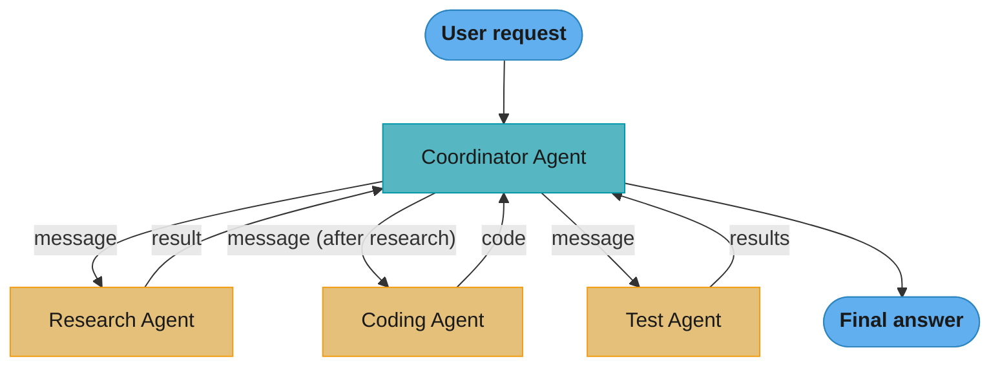

# Multi-Agent Systems

## Sub-Files — Deep Dives

| File | Topic | Q&As |
|------|-------|------|
| [orchestrator_worker_pattern.md](orchestrator_worker_pattern.md) | Supervisor decomposition, task ledgers, result aggregation, Anthropic research system | 15+ |
| [agent_debate_and_consensus.md](agent_debate_and_consensus.md) | Multi-agent debate, majority vote, judge agent, temperature diversity | 15+ |
| [chatdev_and_software_simulation.md](chatdev_and_software_simulation.md) | ChatDev roles, MetaGPT SOPs, product→design→code→QA pipeline | 15+ |
| [openai_swarm_and_handoffs.md](openai_swarm_and_handoffs.md) | Swarm primitives, Agents SDK, handoffs, routines, statelessness | 15+ |
| [magentic_one_and_autogen_v04.md](magentic_one_and_autogen_v04.md) | Magentic-One orchestrator, GAIA benchmark, AutoGen v0.4 event-driven core | 15+ |
| [agent_to_agent_protocols.md](agent_to_agent_protocols.md) | A2A protocol, ACP, ANP, agent cards, inter-agent auth | 15+ |
| [agentic_commerce_and_payments.md](agentic_commerce_and_payments.md) | x402, AP2 mandates, ACP/Stripe checkout, Visa/Mastercard agent tokens, Skyfire KYA, spend limits | 16 |
| [multi_agent_security.md](multi_agent_security.md) | Cross-agent prompt injection, collusion, confused-deputy, capability scoping, dual-LLM pattern | 16 |

---

## 1. Concept Overview

Multi-agent systems decompose complex tasks across multiple specialized AI agents that collaborate, communicate, and coordinate to achieve goals that exceed any single agent's capabilities. Instead of one monolithic agent doing everything, multiple agents with distinct roles, knowledge, and tools work together — mimicking how human teams operate.

The key insight: a single LLM call has a fixed reasoning budget (context window, single attention pass). Breaking a complex task into subtasks distributed across specialized agents (a) allows parallel execution, (b) enables specialization (use the right model/prompt for each sub-task), and (c) prevents context window overflow on very long tasks.

Multi-agent systems power ambitious applications: ChatDev simulates software companies; MetaGPT generates entire codebases; Anthropic's multi-agent research systems tackle week-long research tasks.

---

## 2. Intuition

> **One-line analogy**: Multi-agent systems are like a software team — architect, developer, reviewer, tester — where each specialist handles their part rather than one person doing everything sequentially.

**Mental model**: A single LLM has a fixed context window and reasoning budget. For a complex 10,000-line codebase refactor, you could try to fit everything in one call (may overflow context) or one agent doing everything sequentially (slow, loses context). Multi-agent: an orchestrator breaks the task, specialized agents handle subtasks in parallel (each with focused context), a reviewer agent checks quality, a coordinator merges results. Like a human team, parallel specialization beats sequential generalism for large tasks.

**Why it matters**: Multi-agent systems enable tasks that are too large, complex, or time-sensitive for single-agent approaches. They also enable specialization — use a coding model for code, a reasoning model for analysis, a small cheap model for routing.

**Key insight**: The hardest problem in multi-agent systems isn't getting agents to act — it's getting them to coordinate correctly. Communication overhead, error propagation, and deadlocks are the main failure modes, just like in distributed systems.

---

## 3. Core Principles

- **Specialization**: Each agent has a specific role, tools, and knowledge. A "researcher" knows how to search; a "coder" knows how to write tests; a "critic" knows how to review.
- **Decomposition**: The orchestrator breaks down tasks so each agent has a well-scoped sub-task.
- **Communication protocol**: Agents need a clear way to pass information and results between each other.
- **Verification**: Critical outputs should be reviewed by other agents before being accepted.
- **Failure isolation**: If one agent fails, the system should recover gracefully without cascading failure.
- **Emergence**: Multi-agent systems can exhibit behaviors not present in any individual agent.

---

## 4. Architecture Patterns

### 4.1 Orchestrator-Worker (Supervisor Pattern)

A central orchestrator agent manages specialized worker agents:

```
Orchestrator (Manager)
  |
  +-- Worker 1: Research Agent    → web search, paper retrieval
  |
  +-- Worker 2: Analysis Agent    → data analysis, code execution
  |
  +-- Worker 3: Writing Agent     → drafting, formatting
  |
  +-- Worker 4: Quality Agent     → review, fact-checking

Flow:
  1. Orchestrator receives task
  2. Plans: which workers need to run, in what order
  3. Dispatches subtasks to workers
  4. Collects results
  5. Assembles final output
  6. Quality agent reviews final output
```

Best for: tasks with clear subtask boundaries and sequential dependencies.

**The cost arithmetic — why "5-15x a single agent" is the default expectation.** The six-step flow above is not six LLM calls' worth of tokens. Two multipliers stack:

```
  tokens  =  rounds  x  agents  x  (shared_context + per_agent_work)
             \____________________/    \_________________________/
              call-count multiplier     context-duplication multiplier
```

**The idea behind it.** "Every agent pays the full context bill, so adding an agent does not add its own small share of tokens — it re-buys the entire conversation so far."

The framing matters because the second multiplier is invisible in an architecture diagram. Four boxes look like 4x. The context term is what turns 4x into 15x, and it is the term you can actually engineer away.

| Symbol | What it is |
|--------|------------|
| `agents` | Worker count. Four in the diagram above; five in the war story below |
| `rounds` | Orchestration cycles. One dispatch-and-collect pass per round |
| `shared_context` | Accumulated history handed to *each* worker. The duplicated part |
| `per_agent_work` | Tokens genuinely unique to that worker's subtask. The part you wanted |
| `O(agents x history)` | Growth law of the naive design — quadratic-feeling in practice |

**Walk one example.** The numbers from the war story in Section 14, after 10 back-and-forth turns:

```
  naive: full history to every worker
    accumulated history                     8,000 tokens
    workers                                     5
    input tokens per round      5 x 8,000 = 40,000 tokens

  fixed: summarize history once, then fan out
    summary                                   500 tokens
    workers                                     5
    5 x 500                     =           2,500 tokens
    + summarizer call                       ~2,500 tokens
    input tokens per round                   5,000 tokens

    40,000 -> 5,000  =  8x reduction, and the workers still see the same facts
```

**Where the 15x comes from.** Anthropic's published research system ran at ~15x the token spend of a single chat. Decompose that against the formula and it is unremarkable:

```
   agents  x  rounds  =  raw call multiplier      context duplication      total
      4          2     =        8x                     ~2x                 ~15x
```

Neither factor is exotic. Eight calls is a modest orchestrator, and 2x context duplication is what you get *after* summarizing. This is why the honest planning question is never "is multi-agent better" but "is it 15x better" — Anthropic's 90.2% improvement cleared that bar on long-horizon research, and for a bounded 5-step task almost nothing does.

**Why the summarization step exists.** Remove it and the shared-context term is multiplied by both `agents` and `rounds`, so cost grows with the *product* of team size and conversation length — a system that is affordable in testing with 2 workers and 3 turns becomes unaffordable in production with 5 workers and 10 turns, having changed nothing about the task. The summarizer converts that product into a constant per round. It is the single highest-leverage cost control in the pattern, worth more than switching models.

### 4.2 Peer-to-Peer / Debate Pattern

Agents debate and critique each other to improve output quality:

```
Task: "Write and review a technical architecture proposal"

Agent A (Proposer): Writes initial architecture
  "I propose using microservices with Kubernetes..."

Agent B (Critic): Reviews and critiques
  "The proposal doesn't address database sharding for scale..."

Agent A (Refiner): Addresses critique
  "Adding sharding strategy using consistent hashing..."

Agent B (Critic): Reviews revision
  "Now addresses scale; authentication flow is still unclear..."

[Continue until consensus or max rounds reached]

Final output: refined architecture incorporating all critique points
```

Research shows multi-turn critique dramatically improves reasoning quality (Society of Mind pattern).

**Consensus thresholds — what "until consensus" actually costs.** The `[Continue until consensus or max rounds]` line hides a design decision with real arithmetic behind it. For `N` agents each independently correct with probability `p`, the chance that at least `k` of them agree on the correct answer is:

```
  P(k of N correct)  =  sum over j >= k  of  C(N,j) x p^j x (1-p)^(N-j)

    k = ceil(N/2)   majority        k = N   unanimity
```

**Stated plainly.** "Raising the agreement bar makes the verdicts you *do* get more trustworthy, and makes you get far fewer of them."

That trade is the whole point. A threshold is not a quality dial — it is a dial between *being wrong* and *not answering*, and the second failure has to go somewhere (a judge agent, a default, a human).

| Symbol | What it is |
|--------|------------|
| `N` | Number of debating agents. The `N >= 5` in the majority-voting mitigation |
| `p` | Per-agent accuracy. How often one agent alone gets it right |
| `k` | Agreement threshold. How many must agree before you accept the verdict |
| `C(N,j)` | Ways that exactly `j` of the `N` agents could be the correct ones |
| `rho` | Correlation between agents' errors. 0 = independent, 1 = identical |
| `N_eff` | `N / (1 + (N-1) x rho)` — how many *genuinely independent* votes you have |

**Walk one example.** Five agents, each 70% accurate, independent:

```
   j    C(5,j)     p^j        (1-p)^(5-j)      term
   3      10      0.343         0.0900        0.3087
   4       5      0.2401        0.3000        0.3602
   5       1      0.16807       1.0000        0.1681

   threshold          reached when      P(threshold met AND correct)   escalation rate
   majority  k = 3      j >= 3                    0.837                     16.3%
   supermaj. k = 4      j >= 4                    0.528                     47.2%
   unanimity k = 5      j  = 5                    0.168                     83.2%
```

The majority row is the 5-agent majority vote: `0.700 -> 0.837`, a 13.7-point gain that brackets the 8-12% improvement over 2-agent debate. But read the unanimity row before reaching for a stricter threshold — demanding all five agree yields a verdict on only 16.8% of inputs and dumps the other 83% onto whatever your fallback is. If that fallback is "default to most recent proposal," you have built an expensive five-agent system that behaves like a single agent five times out of six.

**Why correlation destroys this table — and is the real story behind sycophantic collapse.** Every number above assumes the five agents fail *independently*. Five instances of the same base model with the same prompt do not:

```
   rho     N_eff = N / (1 + (N-1) x rho)      what you actually bought
   0.0     5 / (1 + 4 x 0.0)  =  5.00        five real opinions
   0.3     5 / (1 + 4 x 0.3)  =  2.27        two and a bit
   0.5     5 / (1 + 4 x 0.5)  =  1.67        barely better than one agent
   0.8     5 / (1 + 4 x 0.8)  =  1.19        one agent, billed five times
```

At `rho = 0.8` you are paying 5x for 1.19 independent votes, and the majority vote confidently ratifies the shared error — the vote *looks* like strong evidence precisely because the agents agreed. This is why the mitigations are all attacks on `rho` rather than on `N`: temperature diversity, different base models, blind debate (hiding confidence scores so agents cannot anchor on each other), and enforced devil's-advocate roles. Adding a sixth clone raises `N` and does nothing to `N_eff`. Also note the sharp limit at `p < 0.5`: voting drives the outcome toward the model's most common answer, so when that answer is wrong, more agents make the system *more* confidently wrong.

### 4.3 Hierarchical Multi-Agent

Agents at different levels of abstraction:

```
Level 1 (Executive): High-level goal → strategic plan
     |
Level 2 (Manager): Strategic plan → tactical tasks
     |       |         |
Level 3     Lvl 3     Lvl 3  (Workers): Execute specific tasks
(research) (coding) (testing)
```

Used in: ChatDev, MetaGPT — simulates organizational structures.

### 4.4 Blackboard Pattern

Shared memory space where agents read/write:

```
Blackboard (Shared State)
  ├── current_task: "Design user auth system"
  ├── research_findings: [...]
  ├── code_draft: "class AuthManager..."
  ├── test_results: {"passed": 8, "failed": 2}
  └── review_comments: [...]

Agents independently monitor the blackboard:
  Research Agent: posts findings when relevant queries available
  Code Agent: picks up findings, writes code, posts to blackboard
  Test Agent: sees new code → runs tests → posts results
  Review Agent: sees test results → reviews code → posts comments

No centralized orchestrator needed
```

### 4.5 Message Passing / Actor Model

Agents communicate via explicit message channels:



Clean separation; easy to add/remove agents by changing message routing.

**Communication overhead — why the coordinator sits in the middle of that diagram.** The topology above is a star, not a mesh, and that is a deliberate choice with a formula behind it:

```
  fully connected mesh:   channels  =  n(n-1)/2        every agent talks to every agent
  star / orchestrator:    channels  =  n - 1           every agent talks only to the hub
```

**What the formula is telling you.** "Let agents talk to each other freely and the number of conversations you have to reason about grows with the *square* of the team; route everything through one coordinator and it grows in a straight line."

This is the same result that makes distributed systems hard, arriving in agent form — which is exactly the point made in Section 2's key insight. The cost being counted is not just messages: it is the number of interactions that can deadlock, loop, or corrupt state, i.e. the size of the thing you must debug.

| Symbol | What it is |
|--------|------------|
| `n` | Number of agents in the system |
| `n(n-1)` | Ordered pairs — every agent paired with every other, both directions |
| `/2` | Halves it, because a channel between A and B is the same channel as B to A |
| `n(n-1)/2` | Mesh channel count. The number of distinct conversations that can exist |
| `n - 1` | Star channel count. One spoke per agent, into the coordinator |

**Walk one example.** Grow the team and watch the two curves separate:

```
    n      mesh = n(n-1)/2        star = n-1      mesh / star
    2      2 x 1 / 2  =    1           1            1.0x
    3      3 x 2 / 2  =    3           2            1.5x
    4      4 x 3 / 2  =    6           3            2.0x     <- the 4 workers in 4.1
    5      5 x 4 / 2  =   10           4            2.5x
    7      7 x 6 / 2  =   21           6            3.5x     <- ChatDev's 5-7 roles
   10     10 x 9 / 2  =   45           9            5.0x
   20     20 x 19 / 2 =  190          19           10.0x
```

**Adding the 10th agent to a mesh adds 9 new channels; adding it to a star adds 1.** Going from 7 agents to 10 more than doubles a mesh's channels (21 to 45) while a star goes 6 to 9. The ratio itself is `n/2`, so it degrades without limit — there is no team size at which mesh coordination stops getting relatively worse.

**Why this compounds with the token arithmetic from 4.1.** Channels are not free to run; each one carries context. Combine the two formulas and a naive mesh costs `n(n-1)/2 x context` per round against the star's `(n-1) x context`:

```
   n = 5, context = 8,000 tokens per exchange
     mesh:  10 channels x 8,000  =  80,000 tokens/round
     star:   4 channels x 8,000  =  32,000 tokens/round      <- matches the 40,000 figure
                                                                once the hub's own call is added
```

The star is 2.5x cheaper at five agents and 5x cheaper at ten, before any summarization. That is the concrete reason orchestrator-worker is the default production pattern and peer-to-peer meshes stay confined to small-`n` debate (2-5 agents) where the quadratic has not yet bitten. Blackboard (4.4) is the third answer to the same problem: it replaces channels entirely with one shared surface, trading `n(n-1)/2` conversations for `n` readers of a single state — at the price of needing concurrency control on that state.

---

## 5. Architecture Diagrams

### ChatDev Architecture
```
CEO Agent         → defines requirements, makes final decisions
CTO Agent         → technical architecture decisions
Programmer Agent  → writes code
Reviewer Agent    → code review
Tester Agent      → writes and runs tests

"Phase Manager" controls conversation phases:
  Phase 1: Demand Analysis (CEO + CTO dialog)
  Phase 2: Language Choice (CEO + CTO)
  Phase 3: Coding (CTO + Programmer)
  Phase 4: Code Review (Programmer + Reviewer)
  Phase 5: Testing (Programmer + Tester)
  Phase 6: Document Generation
```

### MetaGPT Architecture
```
Product Manager (GPT-4):
  Input: task description
  Output: Product Requirement Document (PRD)

System Architect (GPT-4):
  Input: PRD
  Output: System design document + file list + UML class diagram

Engineer (GPT-4):
  Input: system design + code for each file
  Output: complete codebase

QA Engineer (GPT-4):
  Input: codebase
  Output: test cases

Communication: "structured communication" via PRD, design docs
  (not just unstructured conversation → reduces hallucination)
```

### OpenAI Swarm (Handoff Pattern)
```
Triage Agent → routes to appropriate specialized agent
     |
     +-- Billing Agent      → handles payment questions
     |      |
     |      +-- [handoff back to Triage if out of scope]
     |
     +-- Technical Agent    → handles technical questions
     |
     +-- Sales Agent        → handles purchase questions

"Handoff": agent passes control + context to another agent
  No central orchestrator; agents decide when to hand off
```

---

## 6. How It Works — Detailed Mechanics

### Agent Communication Formats

```
Structured message passing:
{
  "from": "research_agent",
  "to": "coding_agent",
  "type": "research_complete",
  "content": "Found 3 relevant algorithms for sorting...",
  "artifacts": [{"name": "heapsort_analysis.md", "content": "..."}],
  "timestamp": "2024-01-15T10:30:00Z",
  "requires_action": true
}

Natural language handoff (Swarm-style):
  Triage agent outputs: "I need to transfer you to billing for this"
  + Context passed: user_id, conversation_history, issue_type

Shared state (LangGraph multi-agent):
  All agents read/write to a shared TypedDict state object
  State includes: messages, task_status, artifacts, next_action
```

### Task Decomposition Strategies

```
Horizontal decomposition: Parallel independent tasks
  Report writing:
    Task A: Research section 1 (parallel)
    Task B: Research section 2 (parallel)
    Task C: Research section 3 (parallel)
    → Merge: combine all sections

Vertical decomposition: Sequential dependent tasks
  Software development:
    Task 1: Requirements → Task 2: Design → Task 3: Code → Task 4: Test

Hierarchical decomposition: Multi-level planning
  Goal: "Build a web app"
    Subgoal 1: Backend API
      Task 1.1: Auth endpoints
      Task 1.2: Data endpoints
    Subgoal 2: Frontend
      Task 2.1: UI components
      Task 2.2: State management
```

### Failure Handling

```
Agent timeout:
  Set per-agent timeout (e.g., 60s)
  If exceeded: retry once, then fail gracefully
  Orchestrator handles: skip task, use partial result, escalate

Agent disagreement:
  Proposer and Critic can't reach consensus after N rounds
  → Tiebreaker agent (third-party judge)
  → Default to most recent proposal
  → Escalate to human

Cascading failure prevention:
  Isolate agent execution (separate processes/containers)
  Checkpoint results after each major milestone
  Allow partial completion: return what was completed so far
```

---

## 7. Real-World Examples

### ChatDev (Open Source, 2023)
- Simulates a software company with 5-7 agent roles
- Input: "Build a snake game in Python"
- Output: complete runnable codebase with documentation
- Reduces hallucination via structured inter-agent communication
- ~$0.10 average cost per task using GPT-3.5/4
- https://github.com/OpenBMB/ChatDev

### MetaGPT (Open Source, 2023)
- "Multi-agent framework based on SOP (Standard Operating Procedure)"
- Structured outputs: PRD, design docs, UML diagrams, code files, tests
- Role-play based: each agent has specific responsibilities
- 20K+ GitHub stars; widely used for automated software development

### OpenAI Swarm (Experimental, 2024)
- Lightweight multi-agent handoff framework
- Core concepts: agents + handoffs (transfer control between agents)
- Designed for production customer service, routing workflows
- Educational framework (not production-hardened)

### Anthropic Multi-Agent Research
- Internal research system using Claude for long-horizon research workflows
- Multiple Claude instances: a lead agent (plans, decomposes, synthesizes) plus parallel researcher subagents
- Published result: the multi-agent system outperformed a single-agent baseline by 90.2% on their internal research eval — at ~15x the token spend of a single chat, so it is reserved for high-value queries
- Findings in "How we built our multi-agent research system" (2025); the earlier "Building Effective Agents" post (2024) covers single-agent patterns

---

## 8. Tradeoffs

| Pattern | Parallelism | Reliability | Complexity | Best For |
|---------|------------|-------------|------------|---------|
| Single agent | None | Lower | Low | Simple tasks |
| Orchestrator-Worker | High | Medium | Medium | Complex parallelizable tasks |
| Debate/Critique | None | High | Medium | Quality-critical outputs |
| Hierarchical | Medium | High | High | Long-horizon planning |
| Swarm/Handoff | Medium | High | Low | Routing, specialization |

---

## 9. When to Use / When NOT to Use

### Use Multi-Agent When:
- Task naturally decomposes into specialized subtasks
- Context window of single agent would be exceeded
- Quality benefits from critique (debate pattern)
- Parallelism can reduce wall-clock time
- Clear organizational metaphor maps to the task (company, team, pipeline)

### Avoid Multi-Agent When:
- Task is simple (single LLM call suffices)
- Latency is critical (multi-agent adds round-trip overhead)
- Debugging complexity is a concern (multi-agent is hard to trace)
- Subtasks are tightly interdependent (hard to decompose cleanly)

---

## 10. Common Pitfalls

1. **Agent echo chambers**: Agents agree with each other without real critique. Build adversarial prompts into critic agents.
2. **Infinite conversation loops**: Agents keep debating without convergence. Set max_rounds and exit conditions.
3. **Context explosion**: Passing full conversation history between all agents → each agent has O(n) context. Summarize inter-agent messages (see [Agent Memory](../agents_and_tool_use/agent_memory.md) for compression strategies).
4. **Role confusion**: Agents drift from their assigned roles when the conversation gets complex. Reinforce roles in every system prompt.
5. **Cascading hallucinations**: Agent A hallucinates a fact → Agent B builds on that hallucination → final output is wrong with high confidence. Add fact-checking agents at critical pipeline junctions.
6. **No human oversight**: Long-running multi-agent tasks with no human-in-the-loop can go significantly wrong. Add checkpoints.

---

## 11. Technologies & Tools

| Tool | Purpose | Notes |
|------|---------|-------|
| **LangGraph** | Multi-agent orchestration | Best for production; stateful graphs |
| **CrewAI** | Role-based multi-agent | Easy to set up; good for teams |
| **AutoGen** | Conversation-based agents | Microsoft; code execution focus |
| **Swarm (OpenAI)** | Lightweight handoffs | Experimental; clean abstractions |
| **MetaGPT** | Software development | Structured multi-role SOP |
| **ChatDev** | Software company sim | Research-oriented; open source |
| **Microsoft Semantic Kernel** | Enterprise multi-agent | C#, Python, Java |
| **Agentverse (Fetch.ai)** | Distributed agents | Blockchain-based agent marketplace |
| **AgentBench** | Multi-agent evaluation | Benchmarks for agent systems |

---

## 12. Interview Questions with Answers

**Q: What is the orchestrator pattern in multi-agent systems?**
A: The orchestrator pattern has a central coordinator (orchestrator) that manages multiple specialized worker agents. The orchestrator receives the overall task, decomposes it into subtasks, dispatches each to the appropriate worker, collects results, and assembles the final output. It handles sequencing (what runs after what), parallelism (what can run simultaneously), and error recovery (what to do if a worker fails). The orchestrator typically has the highest-capability model; workers can be smaller specialized models.

**Q: Why do multi-agent systems often cost 5-15x more than a single agent, and how do you keep the cost bounded?**
A: Each agent is a separate LLM call (often several), and orchestration adds coordinating calls on top — a 4-worker pipeline with a planner and a reviewer easily makes 8-12 LLM calls where a single agent made one. The dominant hidden cost is context duplication: naively passing the full conversation history to every worker makes token cost grow as O(agents × history), so 5 workers each receiving 8,000 tokens of accumulated context is 40,000 input tokens per round (see the "full history to every worker" war story below, which cuts this 8x by summarizing first). Controls: summarize inter-agent messages instead of forwarding raw history, route cheap subtasks (routing, extraction) to a small model and reserve the frontier model for synthesis, cap the number of debate/critique rounds, and cache shared context. Always estimate expected calls-per-task before building — if the task does not clearly need parallelism or specialization, a single well-prompted agent is cheaper and far easier to debug.

**Q: When is a single agent the better choice over a multi-agent system?**
A: A single agent wins whenever the task fits in one context window and does not decompose into independent specialized subtasks. Multi-agent adds real costs — extra LLM calls, coordination latency (each handoff is a round trip), harder debugging (the error source is unclear across agents), and new failure modes like deadlocks, cascading hallucinations, and echo chambers. The rule of thumb: start with a single agent plus tools and move to multi-agent only when you hit a concrete limit — context overflow on a long task, a genuine need for parallel execution to cut wall-clock time, or measurable quality gains from adversarial critique. Anthropic's published result — their multi-agent research system beating a single-agent baseline by 90.2% on internal research evals — is about long-horizon research specifically, and came with ~15x the token cost; for a bounded 5-step task, multi-agent is usually over-engineering.

**Q: What is the debate pattern and when is it useful?**
A: The debate pattern has two or more agents argue opposing viewpoints or critique each other's output iteratively. Agent A proposes; Agent B critiques; Agent A refines; repeat until consensus or max rounds. It's useful for: improving quality of complex reasoning (research found it reduces errors significantly), tasks where bias checking is important, and generating balanced perspectives. The main cost is latency (multiple rounds) and complexity.

**Q: What is ChatDev and how does it use multi-agent systems?**
A: ChatDev simulates a software company with specialized agents for different roles: CEO (requirements), CTO (architecture), Programmer (code), Reviewer (code review), Tester (QA). Communication happens in structured "phases" analogous to software development phases (demand analysis → design → coding → testing). The structured communication reduces hallucination compared to a single agent generating everything. Input is a product description; output is a complete codebase.

**Q: How do you handle failures in a multi-agent pipeline?**
A: (1) Per-agent timeouts — each agent has a max execution time; (2) Retry logic — retry failed agents once before failing; (3) Graceful degradation — return partial results if some agents succeed; (4) Checkpointing — save state after each successful agent so you can resume from failures; (5) Fallback agents — if primary agent fails, use a simpler backup; (6) Human escalation — for critical failures, alert a human operator.

**Q: What is agent handoff (Swarm pattern)?**
A: Handoff is when one agent determines that another specialized agent would handle the current request better, and explicitly passes control along with context. Example: Triage agent receives "I was charged twice" → recognizes billing issue → hands off to Billing agent with the user's issue context. The receiving agent continues with full awareness of what the triage agent learned. This creates natural routing without a central orchestrator.

**Q: How do you prevent cascading failures when one sub-agent crashes?**
A: Treat each agent as an isolated unit of failure with clear boundaries. (1) Per-agent timeouts: kill the agent at T seconds rather than waiting indefinitely; (2) Circuit breaker: if an agent fails 3 times in a row, stop dispatching to it; (3) Checkpoint state after each successful step so you can resume rather than restart from zero; (4) Design for partial completion: the orchestrator must handle "agent_3 produced no result" without crashing; (5) Fallback agents: simpler backup for critical roles. The cascading failure pattern is when Agent A hallucinates → Agent B uses that hallucination → Agent C builds on it — caught only by inserting validation checkpoints between pipeline stages.

**Q: What communication protocol should agents use — shared memory vs message passing?**
A: Message passing is preferred for production; shared memory is simpler for prototypes. Message passing (LangGraph TypedDict state, Swarm handoffs, AutoGen messages): each agent has explicit inputs and outputs, easy to log and replay, natural fit for LLM function calling. Shared memory (blackboard pattern): all agents read/write a global state object, simpler coordination, but requires locking for concurrent agents and creates hidden dependencies. Use shared memory for simple sequential pipelines; use message passing for parallel or complex workflows where you need traceability and audit logging.

**Q: How do you handle conflicting outputs from parallel agents?**
A: Three strategies: (1) Voting/majority: if 3 agents answer independently and 2 agree, take the majority — works well for factual questions; (2) Judge agent: a separate LLM evaluates all parallel outputs and selects the best, explaining its reasoning; (3) Merge strategy: domain-specific — for code, run all versions through tests and pick the one with the highest pass rate; for summaries, combine distinct facts and deduplicate. The key is defining the conflict resolution rule before running agents, not after receiving contradictory results.

**Q: LangGraph vs AutoGen vs CrewAI — when do you choose each?**
A: LangGraph: best for production complex workflows needing explicit state management, human-in-the-loop checkpoints, and graph-level control — highest learning curve but most production-ready. AutoGen: best when agents should communicate conversationally, especially with code execution loops — the UserProxyAgent-AssistantAgent pattern is natural for iterative coding tasks. CrewAI: best for role-based decomposition where you think in terms of a team (researcher, writer, reviewer) — lowest barrier, good for prototypes. Use LangGraph for complex stateful workflows with loops; AutoGen when the task naturally maps to a conversation between agents with code execution; CrewAI for quick role-based crews.

**Q: How do you debug a multi-agent system where the source of an error is unclear?**
A: The problem is that by the time the final output is wrong, you don't know which agent introduced the error. Solutions: (1) Structured logging of every inter-agent message with agent ID, timestamp, and content — use LangSmith or Langfuse; (2) Agent IDs in all artifacts: every output should be tagged with the producing agent; (3) Replay testing: save all inter-agent messages, then replay feeding each agent its predecessor's exact output in isolation; (4) Isolation testing: test each agent independently with the exact input it received in production; (5) Checksum validation: define expected output schemas per agent and validate at every step. Debugging without traces is essentially impossible at scale.

**Q: What is the "lost in the middle" problem in long agent chains?**
A: Research (Liu et al., 2023) showed LLMs perform best at recalling information placed at the beginning or end of long context — content in the middle is underweighted in attention. In multi-agent chains, when an orchestrator accumulates many agent outputs into one long context, the middle sections are underrepresented in the final reasoning. Mitigations: (1) Structured summaries instead of raw agent outputs; (2) Hierarchical summarization: summarize each group of agents before merging into the orchestrator context; (3) Recency bias: put the most critical information last; (4) Keep individual agent contexts small and focused. With 200K+ context models the problem is reduced but not eliminated — see [Context Windows & Long Context](../context_windows_and_long_context/README.md).

**Q: How do you enforce rate limits when 10 agents all share one API key?**
A: A central token bucket or semaphore manages concurrent access. (1) Rate limiter service: a shared async queue processes all LLM requests; agents enqueue rather than calling the API directly; the queue enforces per-minute token and request limits; (2) Exponential backoff: each agent catches 429 errors and retries with jitter; (3) Priority queues: critical-path agents get higher priority over exploratory agents; (4) Token budgeting: estimate token usage per agent upfront and reserve a quota — prevents one agent from consuming the entire rate limit. In LangGraph, implement the rate limiter as a shared node all agents pass through. Tools like LiteLLM handle rate limiting and load balancing transparently across multiple API keys and providers.

**Q: How does an orchestrator choose between horizontal, vertical, and hierarchical task decomposition?**
A: The decomposition follows the task's dependency structure. Horizontal (parallel) decomposition applies when subtasks are independent — researching three sections of a report simultaneously — and it minimizes wall-clock time via fan-out/fan-in. Vertical (sequential) decomposition applies when each step depends on the previous one — requirements → design → code → test — and cannot be parallelized. Hierarchical decomposition applies to large, open-ended goals: a top-level planner breaks the goal into subgoals, each subgoal is itself decomposed by a mid-level agent, and leaf agents execute — this is how ChatDev and MetaGPT mirror an org chart. Most real systems mix all three: a hierarchical top level, horizontal fan-out where subtasks are independent, and vertical chains where they are not. Choosing wrong (e.g., parallelizing dependent tasks) produces agents acting on stale or missing inputs.

**Q: How do you test and guardrail emergent behavior in a multi-agent system?**
A: Emergent behavior — patterns present in the system but not in any single agent — makes multi-agent systems hard to validate, because the failure only appears from agent interaction. Techniques: (1) record and replay every inter-agent message so a run is deterministic-reproducible for debugging (LangSmith/Langfuse); (2) run each agent in isolation with the exact input it received in production to localize which agent introduced a defect; (3) inject synthetic failures (an agent returns garbage, times out, or hallucinates) during testing to verify the orchestrator degrades gracefully; (4) add validation checkpoints between pipeline stages so a hallucination from agent A is caught before agent B builds on it; (5) cap loops with a hard step counter and max-round exit to prevent runaway emergent loops. Because the full interaction state space is intractable to enumerate, focus tests on the interaction seams, not just individual agents.

---

## 13. Best Practices

1. **Define clear agent boundaries** — each agent should have a single, clear responsibility; avoid overlap.
2. **Use structured inter-agent communication** — JSON with explicit fields beats natural language messages for reliability.
3. **Add a critic/reviewer agent** — multi-agent quality degrades without review; always include a review step for critical outputs.
4. **Log every inter-agent message** — essential for debugging long-running multi-agent tasks.
5. **Keep context budgets per agent** — don't pass the full history to every agent; summarize what each agent needs.
6. **Test failure modes** — manually inject agent failures during development to verify recovery logic.

---

## 14. Case Study: Multi-Agent Technical Writing System

**Problem:** Enterprise software company needs to auto-generate technical documentation from source code changes. Single agent attempt: hallucinations, inconsistent style, missing coverage.

**Multi-Agent Design:**
```
Agents:
  1. Code Analyst Agent
     Model: Claude 3.5 Sonnet
     Input: git diff, changed files
     Output: structured analysis of what changed and why
     Tools: read_file, list_symbols, git_history

  2. Documentation Researcher Agent
     Model: GPT-4o-mini (cost-effective for retrieval)
     Input: code analysis
     Output: relevant existing docs + API references
     Tools: search_docs, search_api_reference

  3. Documentation Writer Agent
     Model: Claude 3.5 Sonnet
     Input: code analysis + existing docs
     Output: draft documentation
     Persona: "Expert technical writer for developer audience"

  4. Technical Reviewer Agent
     Model: GPT-4o
     Input: draft documentation
     Output: review with specific correction requests
     Checklist: accuracy, completeness, code examples work, style guide

  5. Final Editor Agent
     Model: Claude 3.5 Sonnet
     Input: draft + review comments
     Output: final polished documentation

Orchestration: LangGraph with typed state
Parallelism: Agents 1 and 2 run in parallel; agent 3 waits for both
Human gate: If Reviewer scores < 7/10, escalate to human editor
```

**Results:**
- Documentation coverage: 94% of code changes have docs (vs. 23% manual)
- First-pass acceptance by engineers: 79% (no edits needed)
- Time per doc: 45 seconds (vs. 2 hours manual)
- Hallucination rate (verified): 2.1% (reduced from 12% single-agent attempt)

---

**Additional war story — Orchestrator-worker deadlock in automated code review pipeline:**

A ChatDev-style multi-agent code review system had three workers (security agent, style agent, logic agent) reporting results to an orchestrator agent that synthesized a final review. When the security agent returned a finding that required the logic agent to re-analyze a function, the orchestrator sent a task back to the logic agent. However, the logic agent was designed as a stateless worker that could only receive tasks from a queue — it had no mechanism to receive a mid-workflow re-task from the orchestrator. The orchestrator waited indefinitely; the pipeline deadlocked. Detection: 15-minute timeout alert firing 3x per day.

```python
# BROKEN: worker has no re-entry point — orchestrator blocks waiting for re-analysis
class LogicAgent:
    def analyze(self, code: str) -> dict:
        # One-shot: no mechanism to receive follow-up task from orchestrator
        return {"findings": self._run_analysis(code)}

class Orchestrator:
    def review(self, code: str) -> dict:
        security_result = self.security_agent.analyze(code)
        logic_result = self.logic_agent.analyze(code)
        if security_result["requires_logic_review"]:
            # BUG: logic_agent.re_analyze() does not exist — deadlock
            deeper_result = self.logic_agent.re_analyze(
                code, context=security_result["flagged_lines"]
            )

# FIX: workers accept optional context parameter; orchestrator sends context-enriched task
class LogicAgentV2:
    def analyze(self, code: str, security_context: dict | None = None) -> dict:
        extra_prompt = ""
        if security_context:
            lines = security_context.get("flagged_lines", [])
            extra_prompt = f"\nPay special attention to lines: {lines}"
        return {"findings": self._run_analysis(code, extra_prompt)}

class OrchestratorV2:
    def review(self, code: str) -> dict:
        security_result = self.security_agent.analyze(code)
        # Pass security context upfront; logic agent handles it if present
        logic_result = self.logic_agent.analyze(
            code,
            security_context=security_result if security_result.get("flagged_lines") else None
        )
        return self._synthesize(security_result, logic_result)
```

**Additional interview Q&As:**

**What is the agent debate pattern and when does it improve output quality over a single agent?** Agent debate involves two or more LLM agents taking opposing positions on a question and iterating through challenge-response rounds until convergence or a judge agent selects the best answer. It improves output quality on tasks with genuine ambiguity (architectural decisions, policy analysis) and tasks where one-shot LLM responses are systematically biased toward the first plausible answer. Debate degrades quality on factual tasks (introduces false controversy) and adds 3-5x latency and cost. Use debate for high-stakes decisions requiring adversarial review, not routine generation.

**How do you prevent a multi-agent system from amplifying errors across agents?** Use bounded error propagation: each agent outputs a confidence score; the orchestrator treats low-confidence outputs as optional context, not ground truth. Implement a verification agent that independently checks outputs from other agents on a sampling basis (5-10% of production tasks). Use checkpointing: the orchestrator saves intermediate results to a persistent store so that if a downstream agent produces a contradictory result, you can trace which upstream agent introduced the error. Avoid passing raw agent outputs as facts in subsequent agent prompts; instead frame them as "Agent A claimed X — verify this."

**What is the A2A (Agent-to-Agent) protocol and why does it matter for multi-vendor agent systems?** A2A is a Google-proposed open protocol for agent interoperability — agents publish an "agent card" (JSON) describing their capabilities, input/output schemas, and authentication requirements. Other agents discover and invoke them via standardized HTTP+SSE messages without custom integration code. A2A matters because production multi-agent systems increasingly mix agents from different vendors (OpenAI Assistants, Claude agents, custom LangGraph agents), and without a standard protocol, each integration requires custom adapter code. A2A and MCP together form the emerging standard: MCP for tool access, A2A for agent-to-agent delegation.

**Quick-reference table:**

| Pattern | Best for | Trade-off |
|---|---|---|
| Orchestrator-worker (centralized) | Parallelizable subtasks with shared state synthesis | Single orchestrator is a bottleneck; all inter-agent communication routes through it |
| Agent debate (adversarial critique) | High-stakes decisions, policy analysis, ambiguous architectural choices | 3-5x cost; does not improve factual accuracy; can introduce spurious controversy |
| ChatDev-style simulation (role-play) | Code generation, document drafting with iterative review | Long multi-turn chains accumulate errors; hard to debug; role confusion in LLMs |
| Swarm-style handoffs (flat, decentralized) | Customer support routing, sequential specialist delegation | No global state; hard to reason about system behavior; handoff context can be lost |

**Pitfall — Orchestrator sends full conversation history to every worker, ballooning token cost.**

```python
# BROKEN: orchestrator blindly passes entire accumulated history to each worker
# After 10 back-and-forth turns: 8000 tokens of context per worker call
# 5 workers × 8000 tokens = 40,000 tokens per orchestration round

async def dispatch_to_workers(history: list[Message], task: str) -> list[str]:
    results = await asyncio.gather(*[
        worker.run(messages=history + [{"role": "user", "content": task}])
        for worker in workers
    ])
    return results   # each worker gets full history — expensive, slow

# FIX: summarize history before dispatch; pass only task-relevant context per worker
async def dispatch_smart(history: list[Message], task: str,
                          worker_specs: list[WorkerSpec]) -> list[str]:
    summary = await summarizer.summarize(history, max_tokens=500)
    return await asyncio.gather(*[
        spec.worker.run(messages=[
            {"role": "system", "content": spec.system_prompt},
            {"role": "user",   "content": f"Context: {summary}\n\nTask: {task}"}
        ])
        for spec in worker_specs
    ])
# Token cost: 40,000 → 5,000 tokens per round (8× reduction)
```

**How do you prevent agent debate systems from converging to the wrong answer via social pressure?** In multi-agent debate (Model A proposes, Model B critiques, they iterate), a high-confidence but incorrect argument from one agent can cause the other to capitulate — "sycophantic collapse." Mitigations: (1) blind debate — agents cannot see each other's confidence scores, only content; (2) majority voting — use N≥5 agents, take the majority answer rather than the final agreed answer; (3) adversarial role enforcement — explicitly assign one agent the role of devil's advocate with instructions to never agree until shown a proof. Empirically, 5-agent majority vote outperforms 2-agent debate by 8-12% on MATH and logic benchmarks.

**What is the A2A (Agent-to-Agent) protocol and why does it matter for heterogeneous agent systems?** A2A is a standardized communication protocol (Google DeepMind open-source, 2024) that allows agents built on different frameworks (LangGraph, AutoGen, CrewAI) to communicate via a common message schema: task requests, progress updates, and results are wrapped in A2A envelopes with metadata (sender ID, task ID, priority). Without A2A, multi-framework agent systems require custom adapters between every pair of frameworks — O(N²) complexity. With A2A, each framework implements one A2A adapter — O(N) complexity. In practice: an orchestrator built in LangGraph can dispatch tasks to specialized workers built in AutoGen without custom glue code.

---

**Quick-reference decision table:**

| Scenario | Recommended approach | Key constraint |
|---|---|---|
| < 10k training examples | LoRA / few-shot prompting | Data scarcity |
| Latency < 100ms required | Quantized model + ONNX Runtime | Throughput > accuracy |
| Multi-tenant, shared model | System prompt isolation + guardrails | Security boundary |
| Domain shift from pre-training | Fine-tune with domain data | Catastrophic forgetting risk |
| Cost reduction (10× target) | Smaller model + prompt optimization | Quality floor |
