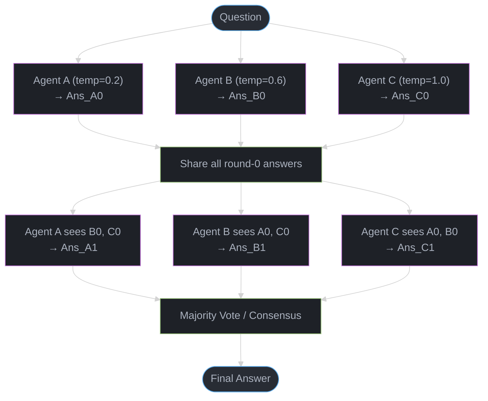
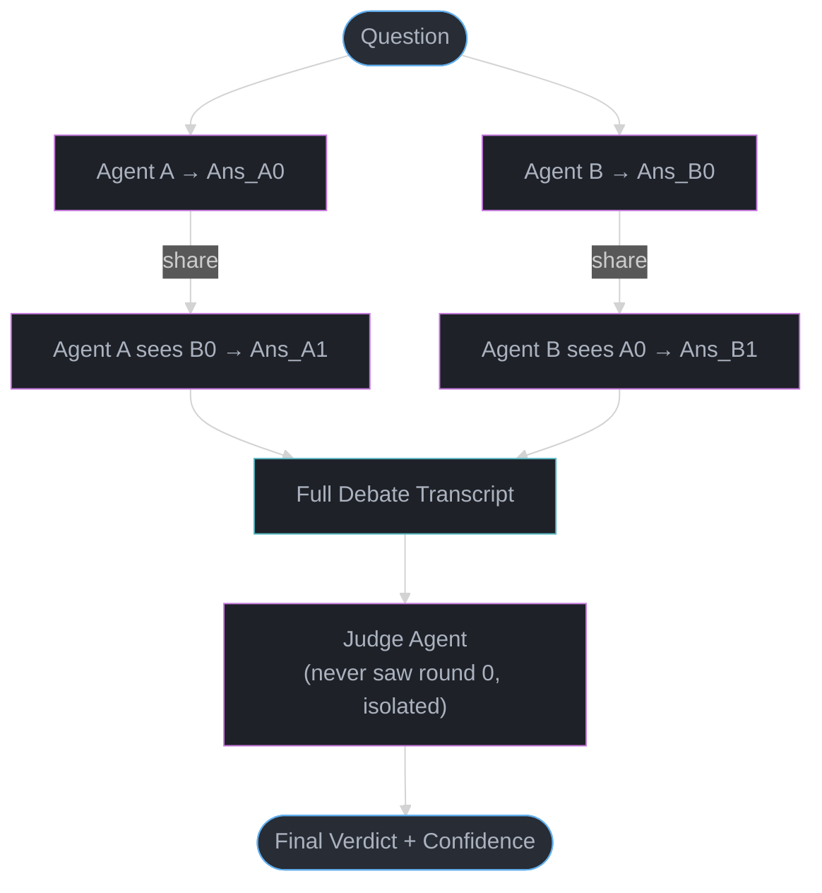
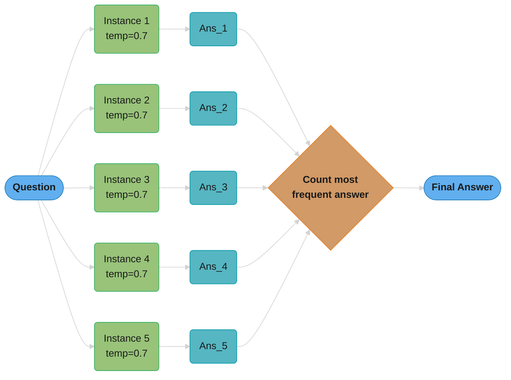
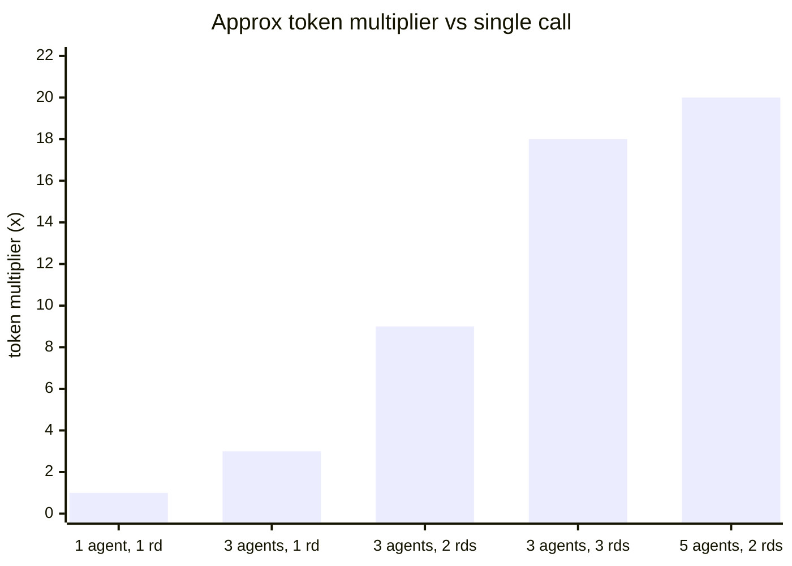
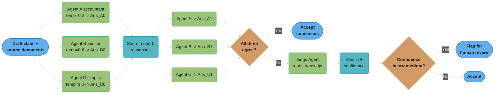

# Multi-Agent Debate and Consensus — Deep Dive

---

## 1. Concept Overview

Multi-agent debate and consensus is a prompting and orchestration strategy in which multiple LLM instances independently reason about a problem, share their answers and justifications with each other, and iteratively revise their positions over one or more rounds before a final answer is extracted. The goal is to reduce individual model errors — hallucinations, miscalculations, reasoning gaps — by exposing each agent's output to critique from peers.

The technique is grounded in the 2023 paper by Du et al. ("Improving Factuality and Reasoning in Language Models through Multiagent Debate", arXiv 2305.14325), which demonstrated that structured inter-agent debate measurably improves factuality and arithmetic accuracy over single-model prompting. Their headline setup — 3 agents, 2 rounds, all instances of `gpt-3.5-turbo-0301` — improved MMLU accuracy from 63.9% to 71.1%, a gain of 7.2 percentage points with no fine-tuning, and GSM8K from 77.0% to 85.0%.

Key capabilities:
- Factuality checking through peer disagreement signals
- Mathematical and logical accuracy through multi-perspective verification
- Confidence calibration by observing convergence or persistent divergence
- Cost-effective diversity without deploying different model families

---

## 2. Intuition

One-line analogy: a scientific peer review process where three reviewers independently read a paper, then read each other's reviews, and submit revised recommendations before the editor makes a final decision.

Mental model: a single LLM is a single expert with blind spots. Two experts who disagree will argue until the weaker position collapses or both realize they share a blind spot. Three experts arguing force each to articulate their reasoning publicly, which surfaces errors that private reasoning misses.

Why it matters: LLMs are overconfident. A model that produces a wrong answer with high token probability will not self-correct unless forced to encounter a contradicting argument. Debate creates that forcing function without requiring a ground-truth oracle.

Key insight: the mechanism of improvement is not that agents vote and the majority wins — it is that agents are forced to read and respond to disagreements, which activates a different reasoning pathway than producing an answer in isolation. The debate transcript is evidence that shifts beliefs, not a ballot that counts heads.

---

## 3. Core Principles

**Principle 1 — Independent initialization.** Each agent must generate its first response independently, without seeing other agents' answers. Contaminating round 0 with shared context collapses diversity before debate begins.

**Principle 2 — Structured context injection.** In each subsequent round, each agent receives the full responses of all other agents from the previous round as context before generating its updated answer. The format matters: label each response by agent ID so the model can attribute arguments to sources.

**Principle 3 — Explicit reasoning, not just final answers.** Agents must include their chain-of-thought in every round, not just their conclusion. Without reasoning, peer agents have nothing to critique or agree with — they see only claims, not arguments.

**Principle 4 — Convergence detection.** When all agents agree on the same final answer for two consecutive rounds, debate terminates early. Running unnecessary rounds after convergence wastes tokens and adds no accuracy benefit.

**Principle 5 — Separation of debaters and judges.** In judge-arbitrator patterns, the agent that renders the final verdict should not have participated in debate rounds. A participating agent carries positional bias from arguments it made earlier.

**Principle 6 — Diversity injection.** Agents must start from genuinely different initial positions. Temperature diversity (temp=0.2 / 0.6 / 1.0 across three instances of the same model) is the cheapest mechanism. Note the provider ceilings: the Anthropic Messages API accepts `temperature` only in the range 0.0–1.0, while OpenAI allows up to 2.0 — and Anthropic's adaptive-thinking models (Claude Opus 4.7 and later, including Opus 5, Sonnet 5, Fable 5) reject any non-default `temperature`/`top_p`/`top_k` with an HTTP 400, so temperature diversity requires either an older Claude generation or an OpenAI-family model. Role diversity (mathematician / critic / skeptic) is a complementary signal that works on every model.

---

## 4. Types / Architectures / Strategies

### 4.1 Round-Robin Debate (Du et al. 2023)

N agents each produce an answer in round 0. In round k, each agent reads all round k-1 answers and produces a revised answer. Repeat for R rounds or until convergence. Extract final answer by majority vote or last-round consensus.

Parameters: N=3, R=2 is the sweet spot from empirical results. N>5 or R>3 yields diminishing returns and superlinear token cost growth.

### 4.2 Judge Agent Pattern

Two or more debater agents argue for R rounds. A separate judge agent — one that has not participated — reads the full debate transcript and the original question, then renders a final verdict with explanation. The judge may also assign confidence scores.

Advantage: separates the act of reasoning from the act of arbitration. Reduces anchoring bias in the final decision.

Disadvantage: adds one full LLM call (the judge) plus the judge's context window must hold the entire debate transcript.

### 4.3 Majority Voting (Self-Consistency Subset)

Run the same model N times (N >= 3, typically odd) at varied temperatures. Collect final answers. Pick the most common answer. No inter-agent communication — pure independent sampling and vote aggregation.

This is not debate in the strict sense but is a degenerate case: zero communication rounds. It improves math accuracy by 5–15% on GSM8K and MATH benchmarks. It is cheaper than debate (no iterative context growth) but cannot correct systematic reasoning errors that all samples share.

The 5–15% is not a magic property of voting — it is the binomial majority rule, and you can
derive it from a single number: how often one agent is right. With N independent samples and
per-agent accuracy `p`, the vote is correct whenever *more than half* the samples are correct:

```
  P(majority correct) = SUM over k > N/2 of  C(N,k) x p^k x (1-p)^(N-k)
```

**What this actually says.** "Voting does not need every sample to be right — it only needs the
right answer to be the plurality, so it converts a coin that lands heads 70% of the time into a
committee that lands heads 78% of the time."

That framing matters because it tells you exactly when voting is worthless: the formula only
climbs above `p` when `p > 0.5`. Below the coin-flip line, the majority is *more* likely wrong
than a single sample — voting amplifies whichever way the model already leans.

| Symbol | What it is |
|--------|------------|
| `N` | Number of independent samples (agents). Odd, so a majority always exists |
| `p` | Probability one agent gets this question right, on its own |
| `k` | How many of the `N` samples happened to be correct |
| `C(N,k)` | Number of distinct ways `k` of the `N` samples can be the correct ones |
| `p^k x (1-p)^(N-k)` | Probability of one specific such split (k right, N-k wrong) |
| `k > N/2` | The majority condition. At `N=3` that means `k = 2` or `k = 3` |

**Walk one example.** Three agents, each right 70% of the time on the same question:

```
  p = 0.70   N = 3   majority needs k >= 2

  k = 2 : C(3,2) x 0.70^2 x 0.30^1 = 3 x 0.49  x 0.30 = 0.441
  k = 3 : C(3,3) x 0.70^3 x 0.30^0 = 1 x 0.343 x 1.00 = 0.343
                                              majority = 0.784

  single agent   : 70.0%
  3-agent majority: 78.4%      gain = +8.4 points   <- inside the stated 5-15% band
  5-agent majority: 83.7%      gain = +13.7 points  <- top of the band
```

Now price unanimity instead of majority — the same three agents, but the answer only ships if
all three agree:

```
  P(all 3 correct) = 0.70^3 = 0.343   ->  34.3%

  Majority ships an answer 78.4% correct.
  Unanimity ships a CORRECT answer only 34.3% of the time; the other 65.7%
  it either ships a wrong-but-unanimous answer or refuses to ship at all.
```

That gap is why production debate systems aggregate by majority (or by judge) and treat
unanimity purely as an early-stop signal, never as the acceptance criterion. Unanimity is a
precision knob bought with a brutal recall cost.

The independence assumption is the term that quietly breaks. `p^k x (1-p)^(N-k)` multiplies
probabilities, which is only legal if the samples are independent. Three instances of the same
checkpoint sharing a systematic misconception are perfectly correlated — every one of them is
wrong in the same place, `p` for that question is effectively 0, and the majority is confidently
wrong. That is exactly the "cannot correct systematic reasoning errors that all samples share"
limit stated above, and it is the entire motivation for the diversity injection in Principle 6.

### 4.4 Society of Mind (Minsky-Inspired)

Multiple specialized sub-agents each handle a dimension of the problem (decomposition, calculation, verification, summarization). Their outputs are combined — not through voting but through a structured assembly process. Intelligence emerges from the interaction of specialists, not from a single generalist improving itself.

Example: a math agent handles arithmetic, a logic agent checks proof steps, a language agent ensures the answer is correctly formatted. A coordinator assembles their outputs.

### 4.5 Temperature Diversity Trick

Run the same model checkpoint three times with temperatures 0.2, 0.6, and 1.0 on the same prompt. Temperature 0.2 produces a near-deterministic, high-confidence answer. Temperature 0.6 produces moderate diversity. Temperature 1.0 produces a more exploratory, sometimes unconventional answer.

Mind the provider ceiling: Anthropic's Messages API documents `temperature` as ranging from 0.0 to 1.0 and defaults to 1.0, so values above 1.0 are invalid there (OpenAI's range goes to 2.0). Anthropic's adaptive-thinking models — Claude Opus 4.7 and later, including Opus 5, Sonnet 5, and Fable 5 — reject any non-default sampling parameter with an HTTP 400, so this trick needs a model generation that still accepts `temperature` at all.

This generates opinion diversity without paying for multiple model families or fine-tunes. Works because high-temperature sampling explores lower-probability token sequences, which sometimes correspond to correct alternative reasoning paths.

Cost: 3× the token cost of a single call, same model pricing.

### 4.6 Adversarial Debate (Devil's Advocate)

One agent is assigned the role of critic and must argue against the current best answer, regardless of its initial view. This prevents premature consensus and is particularly effective when all agents agree quickly — which can signal groupthink rather than genuine correctness.

---

## 5. Architecture Diagrams

### Round-Robin Debate (2 rounds, 3 agents)


```mermaid
%%{init: {'flowchart': {'curve': 'basis'}, 'theme': 'dark'}}%%
flowchart TD
    Q([Question]) --> A0 & B0 & C0
    A0["Agent A (temp=0.2)\n→ Ans_A0"]
    B0["Agent B (temp=0.6)\n→ Ans_B0"]
    C0["Agent C (temp=1.0)\n→ Ans_C0"]
    A0 & B0 & C0 --> Share["Share all round-0 answers"]
    Share --> A1 & B1 & C1
    A1["Agent A sees B0, C0\n→ Ans_A1"]
    B1["Agent B sees A0, C0\n→ Ans_B1"]
    C1["Agent C sees A0, B0\n→ Ans_C1"]
    A1 & B1 & C1 --> Vote["Majority Vote / Consensus"]
    Vote --> Final([Final Answer])

    classDef io     fill:#282c34,stroke:#61afef,color:#abb2bf
    classDef proc   fill:#1e2127,stroke:#98c379,color:#abb2bf
    classDef llm    fill:#1e2127,stroke:#c678dd,color:#abb2bf
    classDef store  fill:#1e2127,stroke:#56b6c2,color:#abb2bf

    class Q,Final io
    class A0,B0,C0,A1,B1,C1 llm
    class Share,Vote proc
```

### Judge Agent Pattern


```mermaid
%%{init: {'flowchart': {'curve': 'basis'}, 'theme': 'dark'}}%%
flowchart TD
    Q([Question]) --> A0 & B0
    A0["Agent A → Ans_A0"] -- share --> A1["Agent A sees B0 → Ans_A1"]
    B0["Agent B → Ans_B0"] -- share --> B1["Agent B sees A0 → Ans_B1"]
    A1 & B1 --> Transcript["Full Debate Transcript"]
    Transcript --> Judge["Judge Agent\n(never saw round 0, isolated)"]
    Judge --> Verdict([Final Verdict + Confidence])

    classDef io     fill:#282c34,stroke:#61afef,color:#abb2bf
    classDef proc   fill:#1e2127,stroke:#98c379,color:#abb2bf
    classDef llm    fill:#1e2127,stroke:#c678dd,color:#abb2bf
    classDef store  fill:#1e2127,stroke:#56b6c2,color:#abb2bf

    class Q,Verdict io
    class A0,B0,A1,B1 llm
    class Transcript store
    class Judge llm
```

### Majority Voting (No Communication)


```mermaid
%%{init: {'flowchart': {'curve': 'basis'}, 'theme': 'dark'}}%%
flowchart LR
    classDef io      fill:#61afef,stroke:#2e86c1,color:#1a1a1a,font-weight:bold
    classDef frozen  fill:#c678dd,stroke:#9b59b6,color:#fff
    classDef train   fill:#98c379,stroke:#27ae60,color:#1a1a1a
    classDef mathOp  fill:#d19a66,stroke:#e67e22,color:#1a1a1a,font-weight:bold
    classDef lossN   fill:#e06c75,stroke:#c0392b,color:#fff,font-weight:bold
    classDef req     fill:#56b6c2,stroke:#0097a7,color:#1a1a1a
    classDef base    fill:#e5c07b,stroke:#f39c12,color:#1a1a1a

    Q(["Question"]) --> I1 & I2 & I3 & I4 & I5
    I1("Instance 1<br/>temp=0.7") --> A1("Ans_1")
    I2("Instance 2<br/>temp=0.7") --> A2("Ans_2")
    I3("Instance 3<br/>temp=0.7") --> A3("Ans_3")
    I4("Instance 4<br/>temp=0.7") --> A4("Ans_4")
    I5("Instance 5<br/>temp=0.7") --> A5("Ans_5")
    A1 & A2 & A3 & A4 & A5 --> Count{"Count most<br/>frequent answer"}
    Count --> Final(["Final Answer"])

    class Q,Final io
    class I1,I2,I3,I4,I5 train
    class A1,A2,A3,A4,A5 req
    class Count mathOp
```

### Token Cost Growth per Architecture


```mermaid
xychart-beta
    title "Approx token multiplier vs single call"
    x-axis ["1 agent, 1 rd", "3 agents, 1 rd", "3 agents, 2 rds", "3 agents, 3 rds", "5 agents, 2 rds"]
    y-axis "token multiplier (x)" 0 --> 22
    bar [1, 3, 9, 18, 20]
```

Cost climbs superlinearly with rounds because every agent re-reads all peers from the previous
round: 1x baseline, 3x for majority vote (3 agents, no communication), 9x for 3-agent round-robin
at 2 rounds, 18x at 3 rounds (where accuracy returns are already diminishing), and 20x for a
5-agent 2-round setup that is rarely justified.

**The idea behind it.** "Every agent pays to re-read every other agent's last answer, so the
bill is not `agents x rounds` — it is `agents x rounds x how much has been said so far`, and the
third term is the one that runs away."

The multiplier is worth writing out because the superlinearity is easy to miss when budgeting.
Total tokens for `N` agents over `R` communication rounds after round 0, with a `Q`-token
question and `A`-token answers:

```
  input  = N x Q                          (round 0: question only)
         + SUM over r = 1..R of  N x (Q + (N-1) x A x r)

  output = N x A x (R + 1)                (every agent answers in every round)

  multiplier = (input + output) / (Q + A)
```

| Symbol | What it is |
|--------|------------|
| `N` | Agents in the debate |
| `R` | Communication rounds *after* round 0. `R=1` means two total rounds |
| `Q` | Question length in tokens |
| `A` | Average answer length in tokens |
| `(N-1) x A` | One round's worth of peer text: everyone's answer except your own |
| `x r` | The runaway term — at round `r` the prompt carries `r` rounds of peer history |
| `Q + A` | The denominator: what one plain single-agent call would have cost |

**Walk one example.** `Q = 200`, `A = 300` — the same numbers §6's budget estimator uses:

```
  N = 3, R = 1   (two total rounds -- the chart's "3 agents, 2 rds")
    round 0 : in  3 x 200                 =   600     out 3 x 300 = 900
    round 1 : peer = 2 x 300 x 1 = 600
              in  3 x (200 + 600)         = 2,400     out 3 x 300 = 900
    totals  : in 3,000   out 1,800   sum 4,800
    single call = 200 + 300 = 500
    multiplier  = 4,800 / 500 = 9.6x           <- the chart's 9x

  N = 3, R = 2   (three total rounds)
    round 2 : peer = 2 x 300 x 2 = 1,200
              in  3 x (200 + 1,200)       = 4,200     out 3 x 300 = 900
    totals  : in 7,200   out 2,700   sum 9,900
    multiplier  = 9,900 / 500 = 19.8x          <- the chart's 18x

  N = 5, R = 1
    peer = 4 x 300 x 1 = 1,200
    in 5 x 200 + 5 x (200 + 1,200) = 1,000 + 7,000 = 8,000   out 5 x 300 x 2 = 3,000
    multiplier = 11,000 / 500 = 22.0x          <- the chart's 20x
```

Read the split, not just the total: at `N=3, R=2` the output side grew a tame 3x
(900 to 2,700) while the input side grew 12x (600 to 7,200). Debate is an *input-token*
problem. Every round adds `N x (N-1) x A` fresh input tokens, so cost is quadratic in agents
and quadratic in rounds — going from `R=1` to `R=2` roughly doubles the bill for an accuracy
gain the literature reports as marginal. That single fact is why `N=3, R=2` is the stated sweet
spot and why the convergence check in Section 10 pays for itself.

---

## 6. How It Works — Detailed Mechanics

```python
"""
Multi-agent debate implementation using the Anthropic SDK.
Python 3.10+.

Model choice matters here: this pattern sets `temperature` per agent, and
Anthropic's adaptive-thinking models (Claude Opus 4.7 and later, including
Opus 5, Sonnet 5, Fable 5) reject non-default temperature/top_p/top_k with an
HTTP 400. Use a generation that still accepts sampling parameters, and keep
every value within Anthropic's documented 0.0-1.0 range.
"""

from __future__ import annotations

import asyncio
from collections import Counter
from dataclasses import dataclass, field
from typing import Sequence

import anthropic

MODEL = "claude-sonnet-4-6"   # accepts `temperature`; Sonnet 5 / Opus 5 do not
MAX_TOKENS = 1024


@dataclass
class AgentConfig:
    agent_id: str
    temperature: float
    role_prompt: str = ""


@dataclass
class DebateRound:
    round_number: int
    responses: dict[str, str] = field(default_factory=dict)  # agent_id -> response text


def build_initial_prompt(question: str, role_prompt: str) -> tuple[list[dict], str]:
    system = (
        "You are a careful reasoning assistant. "
        + (role_prompt if role_prompt else "")
        + " Always show your step-by-step reasoning before stating your final answer. "
        "End your response with 'FINAL ANSWER: <your answer>'."
    )
    return [
        {"role": "user", "content": question}
    ], system


def build_debate_prompt(
    question: str,
    agent_id: str,
    peer_responses: dict[str, str],
    role_prompt: str,
) -> tuple[list[dict], str]:
    system = (
        "You are a careful reasoning assistant. "
        + (role_prompt if role_prompt else "")
        + " You will see responses from peer agents. "
        "Critically evaluate their reasoning. If you find errors in their logic, explain why. "
        "If their reasoning is sound, you may update your position. "
        "Always show your reasoning. End with 'FINAL ANSWER: <your answer>'."
    )
    peer_text = "\n\n".join(
        f"[Agent {pid}]:\n{resp}"
        for pid, resp in peer_responses.items()
        if pid != agent_id
    )
    user_content = (
        f"Original question: {question}\n\n"
        f"Responses from other agents in the previous round:\n{peer_text}\n\n"
        "Given the above, provide your updated analysis and final answer."
    )
    return [{"role": "user", "content": user_content}], system


def extract_final_answer(response_text: str) -> str:
    marker = "FINAL ANSWER:"
    if marker in response_text:
        return response_text.split(marker)[-1].strip()
    # Fallback: last non-empty line
    lines = [ln.strip() for ln in response_text.splitlines() if ln.strip()]
    return lines[-1] if lines else response_text.strip()


async def call_agent(
    client: anthropic.AsyncAnthropic,
    messages: list[dict],
    system: str,
    temperature: float,
) -> str:
    response = await client.messages.create(
        model=MODEL,
        max_tokens=MAX_TOKENS,
        temperature=temperature,
        system=system,
        messages=messages,
    )
    return response.content[0].text


async def run_debate(
    question: str,
    agents: Sequence[AgentConfig],
    num_rounds: int = 2,
) -> dict:
    """
    Run a full multi-agent debate.

    Returns a dict with:
      - rounds: list of DebateRound objects
      - final_answers: dict of agent_id -> final answer (last round)
      - consensus: the majority-vote answer
      - converged_at_round: int or None
    """
    client = anthropic.AsyncAnthropic()
    rounds: list[DebateRound] = []
    converged_at: int | None = None

    # Round 0: all agents answer independently
    round_0 = DebateRound(round_number=0)
    tasks = {}
    for agent in agents:
        messages, system = build_initial_prompt(question, agent.role_prompt)
        tasks[agent.agent_id] = call_agent(client, messages, system, agent.temperature)

    results = await asyncio.gather(*tasks.values())
    for agent_id, result in zip(tasks.keys(), results):
        round_0.responses[agent_id] = result
    rounds.append(round_0)

    # Check early convergence after round 0
    answers_r0 = {aid: extract_final_answer(resp) for aid, resp in round_0.responses.items()}
    if len(set(answers_r0.values())) == 1:
        converged_at = 0

    # Debate rounds 1..num_rounds
    for round_idx in range(1, num_rounds + 1):
        if converged_at is not None:
            break  # Early exit

        prev_round = rounds[-1]
        current_round = DebateRound(round_number=round_idx)
        tasks = {}
        for agent in agents:
            messages, system = build_debate_prompt(
                question, agent.agent_id, prev_round.responses, agent.role_prompt
            )
            tasks[agent.agent_id] = call_agent(
                client, messages, system, agent.temperature
            )

        results = await asyncio.gather(*tasks.values())
        for agent_id, result in zip(tasks.keys(), results):
            current_round.responses[agent_id] = result
        rounds.append(current_round)

        # Check convergence
        current_answers = {
            aid: extract_final_answer(resp)
            for aid, resp in current_round.responses.items()
        }
        if len(set(current_answers.values())) == 1:
            converged_at = round_idx

    # Final answers from last round
    last_round = rounds[-1]
    final_answers = {
        aid: extract_final_answer(resp)
        for aid, resp in last_round.responses.items()
    }

    # Majority vote
    vote_counter = Counter(final_answers.values())
    consensus = vote_counter.most_common(1)[0][0]

    await client.close()

    return {
        "rounds": rounds,
        "final_answers": final_answers,
        "consensus": consensus,
        "converged_at_round": converged_at,
        "total_rounds_run": len(rounds) - 1,  # exclude round 0
    }


async def run_with_judge(
    question: str,
    agents: Sequence[AgentConfig],
    num_rounds: int = 2,
) -> dict:
    """
    Run debate then pass the full transcript to a separate judge agent.
    The judge agent is a fresh instance with no prior context.
    """
    debate_result = await run_debate(question, agents, num_rounds)

    # Build transcript
    transcript_parts = [f"QUESTION: {question}\n"]
    for r in debate_result["rounds"]:
        transcript_parts.append(f"--- Round {r.round_number} ---")
        for agent_id, response in r.responses.items():
            transcript_parts.append(f"[Agent {agent_id}]:\n{response}")
    transcript = "\n\n".join(transcript_parts)

    judge_system = (
        "You are an impartial judge evaluating a multi-agent debate. "
        "You did not participate in the debate. "
        "Read the full transcript, identify the strongest reasoning, "
        "and render a final verdict. "
        "Format: VERDICT: <answer>\nREASONING: <explanation>\nCONFIDENCE: <low|medium|high>"
    )
    judge_messages = [
        {
            "role": "user",
            "content": (
                f"Please evaluate the following debate and render a final verdict.\n\n"
                f"{transcript}"
            ),
        }
    ]

    client = anthropic.AsyncAnthropic()
    judge_response = await call_agent(
        client, judge_messages, judge_system, temperature=0.2
    )
    await client.close()

    return {
        **debate_result,
        "judge_response": judge_response,
    }


# Example usage
async def main() -> None:
    agents = [
        AgentConfig(agent_id="A", temperature=0.2),
        AgentConfig(agent_id="B", temperature=0.6),
        AgentConfig(agent_id="C", temperature=1.0),
    ]

    question = (
        "A train travels 120 km at 60 km/h, then 80 km at 40 km/h. "
        "What is the average speed for the entire journey?"
    )

    result = await run_debate(question, agents, num_rounds=2)
    print(f"Consensus answer: {result['consensus']}")
    print(f"Converged at round: {result['converged_at_round']}")
    print(f"Final answers per agent: {result['final_answers']}")


if __name__ == "__main__":
    asyncio.run(main())
```

### Token cost estimation

```python
def estimate_debate_tokens(
    question_tokens: int,
    avg_response_tokens: int,
    num_agents: int,
    num_rounds: int,
) -> dict[str, int]:
    """
    Rough token budget for a debate session.
    Context grows each round because each agent reads all peers from the previous round.
    """
    total_input = 0
    total_output = 0

    # Round 0: each agent gets just the question
    total_input += num_agents * question_tokens
    total_output += num_agents * avg_response_tokens

    # Subsequent rounds: each agent gets question + (num_agents - 1) peer responses
    for r in range(1, num_rounds + 1):
        peer_context = (num_agents - 1) * avg_response_tokens * r  # grows each round
        total_input += num_agents * (question_tokens + peer_context)
        total_output += num_agents * avg_response_tokens

    return {
        "total_input_tokens": total_input,
        "total_output_tokens": total_output,
        "multiplier_vs_single_call": round(
            (total_input + total_output) / (question_tokens + avg_response_tokens), 1
        ),
    }


# 3 agents, 2 rounds, 200-token question, 300-token responses
budget = estimate_debate_tokens(200, 300, 3, 2)
# multiplier_vs_single_call ≈ 9-10x
```

---

## 7. Real-World Examples

**MMLU benchmark (Du et al. 2023, arXiv 2305.14325, Table 2).** Single agent: 63.9% (±4.8). Single agent with self-reflection: 57.7% (±5.0) — worse than doing nothing. Three-agent round-robin debate, 2 rounds: 71.1% (±4.6). All three configurations used `gpt-3.5-turbo-0301`; the paper did not run its main benchmark suite on GPT-4. Note the reflection row: the gain comes from encountering a *peer's* contradicting argument, not from a model being told to re-check itself.

**GSM8K math word problems (same paper, Table 1).** Single agent: 77.0% (±4.2). Single agent with reflection: 75.0% (±4.3). Three-agent debate, 2 rounds: 85.0% (±3.5) — an 8-point gain on grade-school math word problems, the largest reported in the paper's main table.

**Scaling agents and rounds (same paper).** The authors state they evaluated "mainly using three agents with two rounds of debates" for cost reasons, "although we found further gains with both more agents and rounds of debate." Treat any claim that a 4th agent or 3rd round adds nothing as a budget heuristic, not a published finding.

**Code correctness checking (illustrative pattern, not a published result).** Three-agent debate where each agent is given the same buggy function and asked to identify the bug: agents independently propose fixes, then critique each other's patches. The reported benefit in practice is a lower false-positive rate — the AI claiming a bug that is not present — because a peer agent must be persuaded before the finding survives. Measure this on your own codebase; no public benchmark reports a false-positive delta for this setup.

**Medical differential diagnosis (illustrative pattern, not a published result).** Assigning three agents the roles of attending physician, radiologist, and pathologist to debate diagnoses from case vignettes is a common role-diversity design. The mechanism to expect is fewer unsupported factual claims surviving to the final answer, because peer agents challenge evidence that is not in the vignette. Any specific reduction figure must come from your own labeled evaluation.

**Automated essay scoring disagreement resolution (illustrative pattern, not a published result).** Two scoring agents frequently disagree on borderline essays (scores of 3 vs 4 on a 6-point scale). Adding a third agent to debate the disagreement plus a judge agent to render the final score is the standard escalation design; whether it reduces human-override rates is an A/B question for your own rubric and rater pool.

---

## 8. Tradeoffs

| Dimension | Single Agent | Majority Vote | Round-Robin Debate | Judge Pattern |
|---|---|---|---|---|
| Token cost multiplier | 1x | 3–5x | 9–18x | 12–22x |
| Latency | 1x | 1x (parallel) | R rounds serial per step | R+1 rounds |
| Factual accuracy gain | baseline | +3–8% | +5–15% | +6–15% |
| Math accuracy gain | baseline | +5–15% | +7–15% | similar |
| Subjective task quality | baseline | similar | often degraded | slightly degraded |
| Convergence transparency | none | vote count | round-by-round trace | judge reasoning |
| Implementation complexity | low | low | medium | high |
| Failure mode | hallucination | correlated errors | groupthink, context bloat | judge anchoring |

### When accuracy gain justifies cost

```
Task type                         Expected gain    Cost justified at
Math / logic                      7–15%            any production use
Factual Q&A (verifiable)          5–10%            high-stakes only (medical, legal)
Code correctness                  5–12%            CI/CD pipelines, not hot paths
Creative writing                  0–2%             never
Open-ended opinion                negative          never
Classification (clear labels)     2–5%             rarely
```

---

## 9. When to Use / When NOT to Use

### Use multi-agent debate when:

- The task has a measurable correct answer (math, code, logic, factual lookup).
- A wrong answer carries significant downstream cost (medical decisions, financial calculations, legal reasoning).
- You need calibrated confidence — persistent disagreement after N rounds is itself a useful signal ("model uncertain, escalate to human").
- Hallucination rate on single-agent baseline exceeds 10% on your task.
- You can tolerate 3–10x latency increase (offline batch jobs, async pipelines).
- You are already paying for multiple API calls and want to structure them productively.

### Do NOT use multi-agent debate when:

- The task is subjective (creative writing, style, tone, design preferences). Debate forces convergence on a median, which is worse than a well-prompted individual response.
- Latency is critical (real-time autocomplete, chat streaming, voice interfaces). Even parallel round-0 sampling adds overhead; sequential debate rounds are prohibitive.
- All agents share the same systematic bias (e.g., all trained on the same data with the same RLHF preferences). Debate cannot correct a shared blind spot — it amplifies it.
- Token cost is the primary constraint and accuracy improvement is marginal for the task.
- The question requires up-to-date information that no agent has (post-cutoff events). More agents debating stale information produces confident wrong answers.
- You have access to a ground-truth oracle (unit tests, a calculator, a database lookup). Deterministic verification is always cheaper and more reliable than debate.

---

## 10. Common Pitfalls

### Pitfall 1 — Sharing context before round 0 (broken)

```python
# BROKEN: agent B sees agent A's answer before generating its own round-0 response
# This eliminates diversity and makes the debate useless

async def broken_round_0(question: str, agents: list[AgentConfig]) -> dict[str, str]:
    responses = {}
    client = anthropic.AsyncAnthropic()
    for agent in agents:
        # BUG: prior agents' responses are included in the prompt
        context = "\n".join(
            f"Agent {aid}: {resp}" for aid, resp in responses.items()
        )
        prompt = f"{question}\n\nOther agents said:\n{context}"  # WRONG for round 0
        messages = [{"role": "user", "content": prompt}]
        response = await client.messages.create(
            model=MODEL, max_tokens=512, messages=messages
        )
        responses[agent.agent_id] = response.content[0].text
    await client.close()
    return responses
```

```python
# FIXED: all round-0 calls are issued in parallel with no peer context

async def fixed_round_0(question: str, agents: list[AgentConfig]) -> dict[str, str]:
    client = anthropic.AsyncAnthropic()
    tasks = {
        agent.agent_id: client.messages.create(
            model=MODEL,
            max_tokens=512,
            temperature=agent.temperature,
            messages=[{"role": "user", "content": question}],
        )
        for agent in agents
    }
    results = await asyncio.gather(*tasks.values())
    responses = {
        aid: result.content[0].text
        for aid, result in zip(tasks.keys(), results)
    }
    await client.close()
    return responses
```

War story: a team built a three-agent fact-checker and wired the agents sequentially (agent B's prompt included agent A's answer). In production, agent A's hallucinated figure appeared in agent B's answer verbatim, and agent C — seeing both B and A agree — confirmed it. The pipeline produced confident wrong answers at a higher rate than the single-agent baseline. The fix was trivial: parallelize round 0.

### Pitfall 2 — No convergence check (tokens wasted, cost explodes)

```python
# BROKEN: always runs all rounds even when agents agree after round 1

for round_idx in range(1, MAX_ROUNDS + 1):
    # ... run debate round ...
    pass  # no check — always runs MAX_ROUNDS rounds
```

```python
# FIXED: check convergence after each round

for round_idx in range(1, MAX_ROUNDS + 1):
    current_round = await run_single_debate_round(...)
    rounds.append(current_round)

    answers = {
        aid: extract_final_answer(resp)
        for aid, resp in current_round.responses.items()
    }
    if len(set(answers.values())) == 1:
        converged_at = round_idx
        break  # All agents agree — stop early
```

Why this pays: the saving equals the fraction of questions that converge early multiplied by the rounds you would otherwise have run. Illustratively, if two-thirds of a factual dataset converges by round 1, skipping rounds 2 and 3 on those questions removes roughly a third of total spend with no accuracy change. The early-convergence fraction is task-specific — measure it on your own dataset before assuming a number; the same check on a genuinely hard reasoning set converges far less often and saves far less.

### Pitfall 3 — Using debate for subjective tasks

A content team used three-agent debate to select the best marketing headline from ten candidates. The agents debated for two rounds and converged on "the safest, most generic option" every time — because agents were implicitly optimizing for consensus, and the safe option is the least controversial. Human reviewers rated the debate-selected headlines as 18% less compelling than single-agent selections. Debate should never be used when there is no measurable correctness signal.

### Pitfall 4 — Context window overflow in long debates

```python
# BROKEN: appends full response text each round, context explodes

def build_next_round_prompt_broken(question: str, all_rounds: list[DebateRound]) -> str:
    history = ""
    for r in all_rounds:
        for agent_id, resp in r.responses.items():
            history += f"Round {r.round_number} Agent {agent_id}: {resp}\n\n"
    return f"{question}\n\nFull history:\n{history}"
```

```python
# FIXED: only include the immediately preceding round's responses

def build_next_round_prompt_fixed(
    question: str, prev_round: DebateRound, current_agent_id: str
) -> str:
    peer_context = "\n\n".join(
        f"[Agent {aid}]:\n{resp}"
        for aid, resp in prev_round.responses.items()
        if aid != current_agent_id
    )
    return (
        f"Original question: {question}\n\n"
        f"Peer responses from the previous round:\n{peer_context}\n\n"
        "Provide your updated analysis and final answer."
    )
```

At 3 agents, 300 tokens per response, 3 rounds: the broken version accumulates 2,700 tokens of history per agent per round by round 3. The fixed version caps peer context at 600 tokens (2 peers × 300 tokens) regardless of round count.

**Read it like this.** "The broken version's prompt grows with the length of the meeting; the
fixed version's prompt grows with the size of the room — and only one of those has a ceiling."

```
  broken (full history)  : history_r = r x N x A       = r x 3 x 300 = 900r tokens
  fixed  (last round only): peer_r   = (N - 1) x A     = 2 x 300     =  600 tokens

  round 1 : broken   900   fixed 600
  round 2 : broken 1,800   fixed 600
  round 3 : broken 2,700   fixed 600     <- 4.5x the fixed cost, same information value
  round 8 : broken 7,200   fixed 600     <- 12x, and now flirting with context limits

  broken is O(r); fixed is O(1) in the round index.
```

The `r` that vanishes from the fixed formula is the whole fix. Round `r-1`'s answers already
incorporate everything the agents said in rounds `0..r-2` — that is what "revise your answer in
light of your peers" means — so replaying the older rounds pays full input price for information
that is already summarised in the text you are also sending. Drop the `r` and the debate becomes
runnable at any round count; keep it and the round budget is capped by the context window rather
than by whether the debate is still producing value.

---

## 11. Technologies & Tools

**[LangGraph](../agentic_frameworks/langgraph.md)** — first-class support for multi-agent debate via StateGraph with conditional edges for convergence detection. Round state is passed through the graph's shared state object. Recommended for production deployments.

**LangChain AgentExecutor** — can orchestrate debate via sequential chain with memory, but requires manual context management. Suitable for simpler 2-agent patterns.

**Anthropic SDK (Python/TypeScript)** — direct API access. Use `asyncio.gather` for parallel round-0 calls. No built-in debate orchestration; implement as shown in Section 6.

**OpenAI Assistants API** — deprecated: OpenAI notified developers on 2025-08-26 and removes it from the API on 2026-08-26, directing new work to the Responses and Conversations APIs. Threads could hold debate history natively, but each thread is one agent, so a debate needed N threads plus manual cross-thread context injection. Do not start here.

**[AutoGen (Microsoft)](../agentic_frameworks/autogen.md)** — built-in group chat with round-robin and broadcast modes. In the current `autogen-agentchat` package the class is `RoundRobinGroupChat` (import from `autogen_agentchat.teams`); in the legacy 0.2 API the equivalent is `GroupChat(..., speaker_selection_method="round_robin")`. There is no `RoundRobinSpeakerSelection` class in either. Most feature-complete out-of-the-box for multi-agent debate.

**CrewAI** — sequential and hierarchical process modes. Hierarchical mode with a manager agent approximates the judge pattern. Less flexible than LangGraph for custom convergence logic.

**[DSPy](../agentic_frameworks/dspy.md)** — `dspy.majority` module implements majority voting as a first-class primitive. Debate can be expressed as a custom `Module` chaining `dspy.Predict` calls.

**Guidance / LMQL** — constrained generation to enforce `FINAL ANSWER:` format and extract answers without post-processing heuristics.

**Cost tracking** — LangSmith, Langfuse, or Arize Phoenix for per-round token attribution. Essential for catching context-bloat issues in production.

---

## 12. Interview Questions with Answers

**Q: What is multi-agent debate and how does it differ from self-consistency / majority voting?**
Multi-agent debate is an iterative process where agents share their reasoning and revise their answers in response to peer arguments across multiple rounds. Self-consistency (majority voting) is a one-shot process: N independent samples, pick the most common answer. The key difference is communication: debate agents can correct each other's reasoning; majority voting agents cannot. Debate produces larger accuracy gains on tasks with structured reasoning errors but at significantly higher token cost.

**Q: What accuracy improvement did Du et al. 2023 report for three-agent debate on MMLU?**
Three-agent debate improved MMLU accuracy from 63.9% to 71.1%, a gain of 7.2 percentage points. This was achieved with 2 debate rounds, no fine-tuning, and `gpt-3.5-turbo-0301` for every agent — not GPT-4, which the paper did not use for its main benchmark table. The same paper reports GSM8K rising from 77.0% to 85.0%. A useful control in the same table: single-agent self-reflection *lowered* MMLU to 57.7%, which is why the mechanism is credited to encountering a peer's argument rather than to being told to re-check.

**Q: Why must all agents generate round-0 answers independently, without seeing peer responses?**
If agents see each other's responses before generating their own initial answers, diversity collapses immediately. The first agent to respond anchors all subsequent agents, and the debate becomes an echo chamber. Round 0 must establish genuinely independent starting positions so that subsequent rounds involve real information exchange rather than mutual confirmation. This is the most common implementation mistake.

**Q: What is the temperature diversity trick and why does it work?**
Running the same model at temperatures 0.2, 0.6, and 1.0 produces answers that sample from different parts of the token probability distribution. Low temperature (0.2) selects near-deterministic high-probability tokens — the model's "confident" answer. High temperature (1.0) explores lower-probability sequences that sometimes correspond to correct alternative reasoning paths. This generates opinion diversity without deploying multiple model families, at the same per-token cost. Two provider constraints bound the trick: Anthropic caps `temperature` at 1.0 (OpenAI allows 2.0), and Anthropic's adaptive-thinking models from Claude Opus 4.7 onward reject non-default sampling parameters with an HTTP 400 — on those, use role diversity instead.

**Q: When does the judge agent pattern outperform simple majority voting?**
The judge pattern outperforms when the debate produces high-quality reasoning that the majority vote fails to capture — for example, when two agents are wrong for the same reason and one agent is correct for an unusual reason. The judge reads the full reasoning trace and can identify the sound argument even when it is in the minority. Majority voting would incorrectly pick the 2-agent wrong answer. The judge pattern also provides explainability: the verdict includes a reasoning chain.

**Q: What is the Society of Mind architecture and how does it differ from round-robin debate?**
Society of Mind (inspired by Minsky 1986) uses specialized agents each responsible for a different cognitive function (decomposition, calculation, verification, formatting). Intelligence emerges from the structure of their interactions, not from iterative argument. Round-robin debate uses generalist agents that all attempt to answer the full question and argue toward consensus. Society of Mind is more like a pipeline; debate is more like a committee.

**Q: When does multi-agent debate hurt rather than help?**
Debate hurts on subjective tasks (creative writing, design, preference selection) because agents optimize for consensus, and consensus on subjective dimensions selects the generic midpoint rather than the best option. It also hurts when all agents share the same systematic bias — they will debate and converge on a confident wrong answer. Debate cannot correct errors that are universally shared across agents trained on similar data.

**Q: How does convergence detection reduce token cost, and what is a reasonable convergence criterion?**
Early convergence detection terminates debate when all agents agree on the same final answer for the current round. This avoids running unnecessary rounds that add tokens but not accuracy. A reasonable criterion: unanimous agreement (all N agents give the same extracted final answer). The saving equals your dataset's early-convergence fraction times the rounds skipped — measure that fraction rather than assuming it, because easy factual sets converge early and hard reasoning sets barely converge at all.

**Q: What are the token cost multipliers for 3-agent debate with 1 and 2 rounds versus a single call?**
A single call is 1x. Three-agent majority voting (round 0 only) is 3x. Three-agent debate with 1 additional round is roughly 10x, because each agent's round-1 prompt carries the question plus two peer responses from round 0. Three-agent debate with 2 additional rounds is roughly 20x, because peer context grows with the round index. Working the §5 formula at Q=200 and A=300 tokens gives 9.6x and 19.8x exactly; the growth is quadratic in both agents and rounds, so budget from the formula rather than from agent count. Beyond 2 rounds the marginal accuracy gain rarely repays the doubling.

**Q: How do you prevent context window overflow in long debate sessions?**
Include only the immediately preceding round's peer responses in each agent's next-round prompt, not the full debate history. This caps the peer context at (N-1) * avg_response_tokens per round regardless of how many rounds have elapsed. Agents do not need full history — they only need to know what their peers said most recently to update their position.

**Q: What is the adversarial debate (devil's advocate) pattern and when is it useful?**
One agent is assigned to argue against the current consensus, regardless of its independent opinion. This prevents premature convergence, which is a failure mode when all agents agree quickly not because they are correct but because they share the same training bias. Devil's advocate debate is most useful when baseline agents tend to produce identical answers on a given task class, indicating low natural diversity.

**Q: How do you extract a final answer reliably from debate responses?**
Use a structured output constraint: require agents to end every response with a fixed marker such as `FINAL ANSWER: <answer>`. Parse by splitting on the marker and taking the last segment. This is more reliable than LLM-based extraction of the final answer from free text, which can itself hallucinate. Fall back to the last non-empty line if the marker is absent, and log the missing-marker rate as a quality metric.

**Q: What is the relationship between multi-agent debate and ensemble methods in classical ML?**
Multi-agent debate is the LLM analog of boosting: agents iteratively refine their outputs by learning from peers' errors. Majority voting maps to bagging: independent samples whose errors are uncorrelated cancel out in aggregate. The key difference is that LLM agents communicate in natural language and can explicitly incorporate peer reasoning rather than just averaging numeric outputs.

**Q: How should you test whether debate improves accuracy for a specific task before deploying it in production?**
Run an offline evaluation on a labeled dataset of 200–500 examples representative of your production task. Measure single-agent accuracy, majority-voting accuracy (same agent, 3 samples), and 2-round debate accuracy. If debate does not improve over majority voting by at least 2–3 percentage points, the additional token cost (3–5x over voting) is not justified. Also measure the variance: if debate accuracy varies more than single-agent across random seeds, the pattern is unstable for that task.

**Q: What happens to debate quality when agents are given explicit roles (mathematician, critic, skeptic)?**
Role assignment increases diversity by prompting agents to apply different evaluative lenses to the same problem. A "critic" role agent is more likely to challenge the consensus even when it initially agrees, reducing groupthink. However, role diversity can introduce systematic role-specific biases: a "skeptic" agent may challenge correct answers unnecessarily. The optimal configuration is role diversity for the critic position combined with temperature diversity for debater positions.

**Q: How does the judge agent pattern handle cases where the debate does not converge?**
The judge agent is specifically well-suited for non-convergence: it reads the full debate transcript including the ongoing disagreement, identifies which agent's reasoning is strongest, and renders a verdict with explicit reasoning. This is better than majority voting when agents are split (e.g., 2 vs 1 with the minority holding the correct position), because the judge can be persuaded by argument quality rather than argument count. The judge's response should include a confidence level so downstream systems can flag low-confidence verdicts for human review.

---

## 13. Best Practices

Use exactly 3 agents for most tasks. This is the configuration Du et al. evaluated, and they chose it for cost, explicitly noting they "found further gains with both more agents and rounds of debate." So the 3-agent default is a budget decision, not a quality ceiling: a 4th or 5th agent adds roughly `(N-1)/(N-2)` more peer context per round on top of its own call, and you should only pay that when a measured evaluation on your task shows the accuracy is there.

Always run round 0 in parallel. All agents must call the model simultaneously with no shared context. Sequential round-0 execution eliminates diversity without any benefit and introduces unnecessary latency.

Enforce structured output at the prompt level. Require `FINAL ANSWER: <answer>` in every agent response. Parse deterministically. Do not use a separate LLM call to extract the final answer from free-form text.

Limit debate to 2 rounds as a default. Two rounds is what the published result was measured at, and the §5 arithmetic shows a third round roughly doubles the bill. Round 3 is a decision to make against a measured accuracy delta on your own task, not a default to inherit.

Implement convergence detection. Check after each round whether all agents agree. The saving scales with your dataset's early-convergence fraction and costs nothing to add, so it is worth wiring in before you know that fraction.

Log per-round answers, not just the final answer. When an agent changes its answer between rounds, that change is a signal: either the agent corrected an error (good) or it was incorrectly persuaded (bad). Monitoring answer-change rates by task type reveals whether debate is adding signal or noise.

Never use debate for tasks with no measurable correctness signal. If you cannot evaluate whether the debate improved the answer, you cannot know whether it helped or hurt. Build an evaluation dataset before deploying any debate-based pipeline.

Separate debaters and judges. Do not ask a participating debater to render the final verdict. Participating agents have positional bias from arguments they made in earlier rounds. The judge should be a fresh model instance that reads the transcript cold.

Cap peer context per round. Include only the previous round's responses in each agent's next-round prompt. Full history accumulation leads to context window overflow and increases the probability that agents fixate on early errors rather than their peers' most recent reasoning.

Monitor cost per query in production. Debate token cost grows superlinearly with context length as rounds proceed. Set hard limits on MAX_ROUNDS and alert when average tokens-per-debate-query exceeds a threshold, which indicates agents are producing unusually long responses.

---

## 14. Case Study

### Multi-Agent Debate for Financial Statement Fact-Checking

> Illustrative composite. The architecture, the token arithmetic, and the cost
> derivation are real and reproducible; the firm, the incident, and the outcome
> percentages are a worked scenario, not a published case.

**Context.** A financial services firm uses LLMs to extract and verify numerical claims from analyst reports before they are published. The original pipeline used a single GPT-4 call to check whether each numerical claim in a draft report was consistent with the cited source documents. The hallucination rate (agent-confirmed claims that were factually wrong) was 11% in internal audits, which was unacceptable for regulatory reasons.

**Problem statement.** Reduce hallucination rate on numerical claim verification to below 3% without increasing latency beyond 30 seconds per claim and without replacing the LLM with a deterministic rules engine (which could not handle the variety of claim formats).

**Architecture overview.**


```mermaid
%%{init: {'flowchart': {'curve': 'basis'}, 'theme': 'dark'}}%%
flowchart LR
    classDef io      fill:#61afef,stroke:#2e86c1,color:#1a1a1a,font-weight:bold
    classDef frozen  fill:#c678dd,stroke:#9b59b6,color:#fff
    classDef train   fill:#98c379,stroke:#27ae60,color:#1a1a1a
    classDef mathOp  fill:#d19a66,stroke:#e67e22,color:#1a1a1a,font-weight:bold
    classDef lossN   fill:#e06c75,stroke:#c0392b,color:#fff,font-weight:bold
    classDef req     fill:#56b6c2,stroke:#0097a7,color:#1a1a1a
    classDef base    fill:#e5c07b,stroke:#f39c12,color:#1a1a1a

    Draft(["Draft claim +<br/>source documents"]) --> A0 & B0 & C0
    A0("Agent A accountant<br/>temp=0.2 -> Ans_A0")
    B0("Agent B auditor<br/>temp=0.6 -> Ans_B0")
    C0("Agent C skeptic<br/>temp=1.0 -> Ans_C0")
    A0 & B0 & C0 --> Share("Share round-0<br/>responses")
    Share --> A1 & B1 & C1
    A1("Agent A -> Ans_A1")
    B1("Agent B -> Ans_B1")
    C1("Agent C -> Ans_C1")
    A1 & B1 & C1 --> Consensus{"All three<br/>agree?"}
    Consensus -- Yes --> Accept(["Accept<br/>consensus"])
    Consensus -- No --> Judge("Judge Agent<br/>reads transcript")
    Judge --> Verdict("Verdict +<br/>confidence")
    Verdict --> ConfCheck{"Confidence<br/>below medium?"}
    ConfCheck -- Yes --> Flag(["Flag for<br/>human review"])
    ConfCheck -- No --> AutoAccept(["Accept"])

    class Draft,Accept,Flag,AutoAccept io
    class A0,B0,C0,A1,B1,C1,Judge train
    class Share,Verdict req
    class Consensus,ConfCheck mathOp
```

**Key design decisions.**

Round-0 role prompts: "accountant" agent is instructed to verify arithmetic and unit consistency; "auditor" agent checks source document citations; "skeptic" agent is instructed to challenge the claim and look for ways it could be misleading. This role diversity generates structurally different critiques in round 0.

Two debate rounds. Round 1 resolves most disagreements. Round 2 handles cases where two agents changed position in round 1 (which signals the claim is genuinely ambiguous). Convergence detection terminates early when all three agree; this occurs in 71% of claims after round 1.

Judge agent activation. When agents do not reach unanimous agreement after 2 rounds, a judge agent is invoked. The judge reads the full transcript and renders a verdict with LOW / MEDIUM / HIGH confidence. LOW-confidence verdicts are routed to a human compliance officer rather than automatically accepted or rejected.

Token budget. Average claim: 400-token source excerpt + 80-token claim = 480 input tokens. With 3 agents, 2 rounds, temperature diversity: approximately 4,800 total tokens per claim (10x multiplier). At $0.003 per 1K tokens (GPT-4 pricing at deployment time), cost was $0.014 per claim versus $0.0014 for single-agent — a 10x cost increase that was accepted because the downstream cost of a published hallucinated figure was orders of magnitude higher.

**Results.**

Hallucination rate dropped from 11% to 2.1% across 1,200 claims in a 3-month production evaluation. Of the 2.1% remaining errors, 68% were claims that the judge flagged as LOW confidence and routed to human review — meaning the system correctly identified its own uncertainty on most remaining errors. Effective undetected hallucination rate: 0.7%.

Latency: median 14 seconds, 95th percentile 28 seconds (within the 30-second SLA). Round-0 parallel execution was essential — sequential round 0 would have pushed median latency to 28 seconds.

Cost: $0.014 per claim. For 500 claims per day, monthly cost was approximately $210 in LLM API spend, which was deemed acceptable relative to compliance risk.

**Lessons.**

Role diversity combined with temperature diversity produced more genuine disagreement in round 0 than temperature diversity alone. The "skeptic" role caused agent C to challenge correct claims in about 8% of cases, which added one unnecessary debate round. Subsequent tuning changed the skeptic prompt to "challenge claims where the source document does not explicitly state the figure" rather than challenging all claims unconditionally.

The judge agent's confidence calibration required a calibration dataset of 200 labeled examples (50 clearly correct, 50 clearly wrong, 100 ambiguous) before the LOW/MEDIUM/HIGH thresholds produced reliable human-review routing. Without calibration, the judge over-routed (flagging 40% of claims as LOW confidence) which defeated the purpose of automation.
