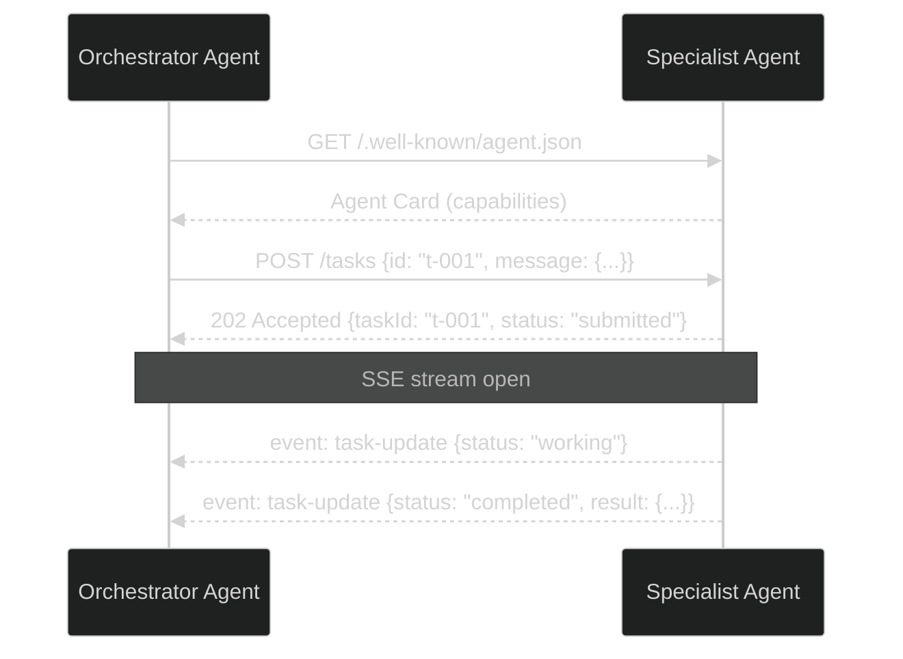
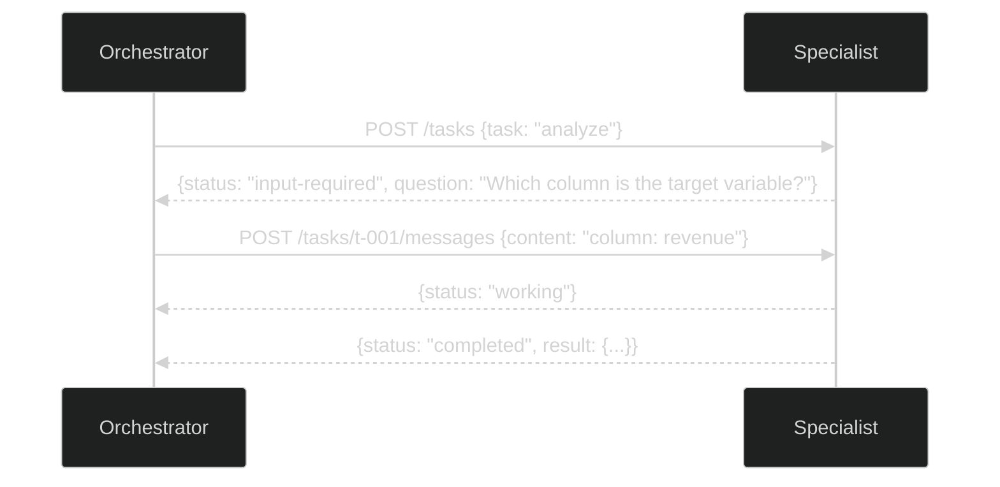
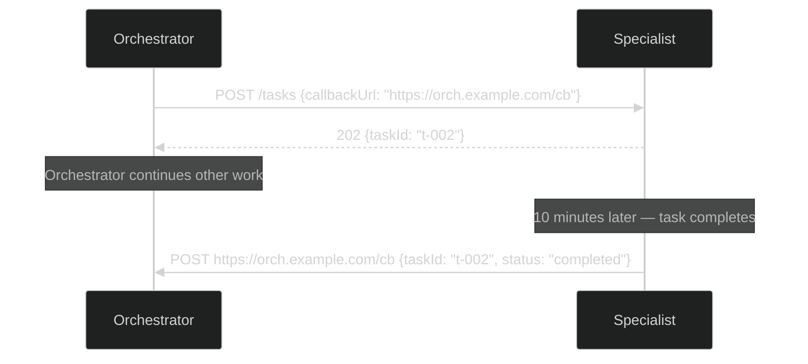
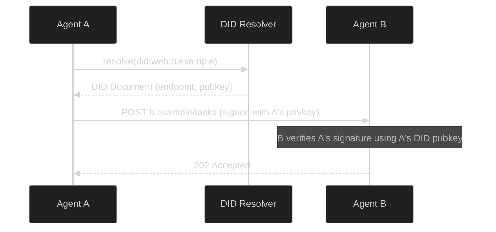
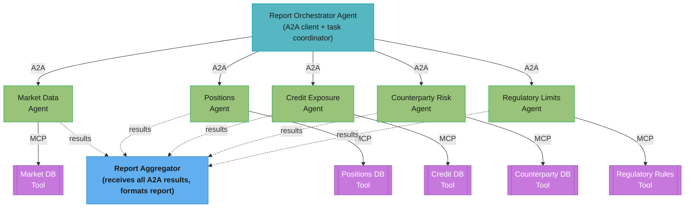

# Agent-to-Agent Protocols — Deep Dive

---

## 1. Concept Overview

Agent-to-agent (A2A) communication protocols define how autonomous AI agents discover each other, negotiate capabilities, delegate tasks, exchange results, and authenticate across trust boundaries. As multi-agent systems move from single-process orchestrators to distributed networks of specialized agents, standardized wire protocols become as critical as HTTP is to the web.

Three major open specifications have emerged in 2024-2025:

- **A2A** (Agent-to-Agent, Google 2025): task-oriented, HTTP/JSON + SSE, agent cards for capability advertisement, explicit task lifecycle state machine
- **ACP** (Agent Communication Protocol, BeeAI/IBM): REST-based, supports synchronous and asynchronous message threading, open-source reference implementation
- **ANP** (Agent Network Protocol): decentralized peer-to-peer agent discovery via Decentralized Identifiers (DID), no central registry dependency

These protocols sit above [MCP (Model Context Protocol)](../mcp_model_context_protocol/README.md), which handles LLM-to-tool communication. A2A/ACP/ANP handle agent-to-agent peer communication — a fundamentally different concern.

---

## 2. Intuition

One-line analogy: A2A is to agents what HTTP is to web servers — a shared language that lets any two agents talk without knowing each other's internal implementation.

Mental model: Think of corporate email. When you send work to a contractor, you do not care what software they use internally. You send a structured request (agent card = business card), they accept or reject, they update you on progress (task states), and they return a result. Authentication (signing the email) prevents impersonation. A2A encodes exactly this workflow into a machine-readable protocol.

Why it matters: Without a standard protocol, every multi-agent framework invents its own serialization format, authentication scheme, and task lifecycle — making agents from different vendors incompatible. Standardization unlocks a marketplace of interoperable agents the same way REST APIs unlocked SaaS integrations.

Key insight: The hardest problems are not the happy path (send task, get result) but the edge cases — long-running tasks that need push notifications, multi-turn conversations where the agent needs clarification, and trust boundaries between agents deployed by different organizations.

---

## 3. Core Principles

**Protocol neutrality**: Agents should be implementable in any language or framework. Protocols are defined at the HTTP/JSON level, not as library APIs.

**Capability advertisement**: Agents declare what they can do before a task is submitted. Callers can route intelligently without trial-and-error.

**Explicit task lifecycle**: A task moves through well-defined states (submitted, working, input-required, completed, failed, cancelled). Both parties know exactly where the task stands at any moment.

**Authentication at the protocol layer**: Agents authenticate each other using standard mechanisms (API keys, OAuth 2.0, JWT) before any task data is exchanged. Security is not an afterthought.

**Trust-level awareness**: Local agents (same process or trusted network) are treated differently from remote agents (public internet). Remote agents require authentication and input validation regardless of claimed identity. The broader attack surface (impersonation, injection through agent messages, confused deputy) is covered in [Multi-Agent Security](multi_agent_security.md).

**Streaming and push**: Long-running tasks must not block the caller. Protocols support Server-Sent Events (SSE) for streaming progress and webhook push notifications for fire-and-forget delegation.

**Composability with MCP**: MCP connects an LLM to tools. A2A connects one agent to another. A single agent may simultaneously be an MCP client (calling tools) and an A2A server (accepting tasks from other agents).

---

## 4. Types / Architectures / Strategies

### 4.1 A2A — Agent-to-Agent Protocol (Google, 2025)

A2A is an open specification published by Google in April 2025. It defines:

**Agent Card**: A JSON document served at `/.well-known/agent.json` advertising the agent's capabilities, supported input/output modalities, authentication requirements, and endpoint URLs.

```json
{
  "name": "DataAnalystAgent",
  "description": "Analyzes structured datasets and produces statistical summaries",
  "version": "1.0.0",
  "url": "https://analyst.example.com/a2a",
  "capabilities": {
    "streaming": true,
    "pushNotifications": true,
    "stateTransitionHistory": true
  },
  "skills": [
    {
      "id": "analyze-csv",
      "name": "CSV Analysis",
      "description": "Parses and analyzes CSV files",
      "inputModes": ["file", "text"],
      "outputModes": ["text", "data"]
    }
  ],
  "authentication": {
    "schemes": ["Bearer", "ApiKey"]
  }
}
```

**Task Lifecycle States**:
- `submitted`: task received, queued for processing
- `working`: actively being processed by the agent
- `input-required`: agent needs clarification from caller (multi-turn)
- `completed`: task finished successfully, result available
- `failed`: terminal failure, error details available
- `cancelled`: explicitly cancelled by caller

**Transport**: HTTP/JSON for task submission and polling; Server-Sent Events (SSE) for streaming responses; webhook callbacks for push notifications on long tasks.

**Multi-turn conversations**: When an agent reaches `input-required` state, it returns a question. The caller submits a follow-up message to the same task ID, resuming the conversation without losing context.

### 4.2 ACP — Agent Communication Protocol (BeeAI/IBM)

ACP is a REST-based open protocol from the BeeAI project (IBM Research). It focuses on:

- **Message threading**: conversations are organized into threads; each message in a thread has a parent reference enabling tree-structured dialogue
- **Synchronous mode**: caller blocks waiting for a response (suitable for fast agents)
- **Asynchronous mode**: caller gets a run ID immediately; polls or receives webhook when complete
- **Multimodal payloads**: messages contain typed parts (text, file, binary data) rather than a single content string
- **Agent discovery**: agents register with an ACP directory and expose a standard capabilities endpoint

ACP is more REST-idiomatic than A2A and has a simpler state model, making it easier to adopt in traditional microservice environments.

### 4.3 ANP — Agent Network Protocol

ANP takes a decentralized approach:

- **Decentralized Identifiers (DID)**: each agent has a DID (e.g., `did:web:agent.example.com`) that resolves to a DID Document containing public keys and service endpoints — no central registry required
- **Peer-to-peer discovery**: agents discover each other by resolving DIDs; the DID Document is the agent card equivalent
- **Cryptographic trust**: all messages are signed with the agent's DID-linked private key; recipients verify signatures using the public key in the DID Document
- **Federated networks**: agents can form networks without surrendering control to a central authority — important for cross-organization deployments
- **W3C standards-based**: builds on W3C DID Core specification and Verifiable Credentials

ANP is the most decentralized option but has the highest implementation complexity. It is best suited for open agent ecosystems where participants do not share a trust anchor.

### 4.4 MCP vs A2A — The Critical Distinction

| Dimension | MCP | A2A |
|-----------|-----|-----|
| Who talks to whom | LLM (via host) to tool server | Agent to agent (peer) |
| Relationship | Client-server (LLM is always client) | Peer (either agent can initiate) |
| What is exchanged | Tool invocations and results | Tasks and task state |
| Context holder | LLM host manages context | Each agent manages its own context |
| Discovery | Configured at startup | Dynamic via agent cards / registries |
| Typical latency | Milliseconds (tool calls in LLM loop) | Seconds to minutes (autonomous tasks) |
| Use case | "Call this function" | "Complete this task" |

They complement each other: an orchestrator agent uses A2A to delegate a research task to a specialist agent; that specialist agent uses MCP to call search tools and database tools to complete the research.

### 4.5 Agent Discovery via Registries

Agents publish agent cards to a registry (centralized directory service). Other agents query the registry to find agents with required capabilities:

```
Agent Card Registry
  - Stores: agent URL, capabilities, skills, auth schemes
  - Query: find agents with skill "analyze-csv" supporting "file" input
  - Returns: list of matching agent cards with endpoint URLs
  - Freshness: agents re-register periodically (TTL typically 60 seconds)
```

Enterprise deployments use private registries. Open ecosystems use public registries or DID-based discovery (ANP).

---

## 5. Architecture Diagrams

### 5.1 A2A Task Flow — Happy Path



### 5.2 A2A Multi-Turn (input-required state)



### 5.3 A2A with Push Notifications (long tasks)



### 5.4 Multi-Agent System with Protocol Layers

```
+------------------+        A2A        +------------------+
|  Orchestrator    |<----------------->|  Research Agent  |
|  Agent           |                  |                  |
|                  |        A2A        +------------------+
|                  |<----------------->| Analyst Agent   |
|                  |                  |                  |
+--------+---------+                  +--------+---------+
         |                                     |
         | MCP                                 | MCP
         |                                     |
+--------+---------+                  +--------+---------+
|  Tool Server     |                  |  Tool Server     |
|  (web search)    |                  |  (database)      |
+------------------+                  +------------------+
```

### 5.5 ANP Decentralized Discovery



No central registry is involved: resolving the DID over DNS + HTTPS (500ms–2s) yields Agent B's endpoint and public key, and B verifies the request purely against A's DID-linked signature.

### 5.6 Trust Boundary Model

```
+---------------------------------------+
|  TRUSTED ZONE (same process/host)     |
|                                       |
|  +----------+    direct call    +----------+  |
|  | Agent A  |<----------------->| Agent B  |  |
|  +----------+                   +----------+  |
|                                       |
+---------------------------------------+
           |  network boundary
+---------------------------------------+
|  UNTRUSTED ZONE (remote agents)       |
|                                       |
|  +----------+  JWT + HTTPS   +----------+  |
|  | Agent C  |<-------------->| Agent D  |  |
|  | (local)  | signed request | (remote) |  |
|  +----------+                +----------+  |
|                                       |
+---------------------------------------+
```

---

## 6. How It Works — Detailed Mechanics

### 6.1 Agent Card Discovery and Validation

```python
from __future__ import annotations

import httpx
import json
from dataclasses import dataclass, field
from typing import Any


@dataclass
class AgentSkill:
    id: str
    name: str
    description: str
    input_modes: list[str]
    output_modes: list[str]


@dataclass
class AgentCard:
    name: str
    description: str
    version: str
    url: str
    skills: list[AgentSkill]
    auth_schemes: list[str]
    supports_streaming: bool
    supports_push: bool

    @classmethod
    def from_dict(cls, data: dict[str, Any]) -> "AgentCard":
        skills = [
            AgentSkill(
                id=s["id"],
                name=s["name"],
                description=s["description"],
                input_modes=s.get("inputModes", []),
                output_modes=s.get("outputModes", []),
            )
            for s in data.get("skills", [])
        ]
        caps = data.get("capabilities", {})
        auth = data.get("authentication", {})
        return cls(
            name=data["name"],
            description=data["description"],
            version=data["version"],
            url=data["url"],
            skills=skills,
            auth_schemes=auth.get("schemes", []),
            supports_streaming=caps.get("streaming", False),
            supports_push=caps.get("pushNotifications", False),
        )


async def fetch_agent_card(agent_base_url: str) -> AgentCard:
    """Fetch and parse an agent's capability advertisement."""
    well_known_url = f"{agent_base_url.rstrip('/')}/.well-known/agent.json"
    async with httpx.AsyncClient(timeout=10.0) as client:
        response = await client.get(well_known_url)
        response.raise_for_status()
        data = response.json()
    return AgentCard.from_dict(data)


def find_skill(card: AgentCard, skill_id: str) -> AgentSkill | None:
    for skill in card.skills:
        if skill.id == skill_id:
            return skill
    return None
```

### 6.2 JWT-Authenticated A2A Task Submission

```python
import time
import uuid
import httpx
import jwt  # PyJWT
from dataclasses import dataclass
from enum import Enum
from typing import Any


class TaskStatus(str, Enum):
    SUBMITTED = "submitted"
    WORKING = "working"
    INPUT_REQUIRED = "input-required"
    COMPLETED = "completed"
    FAILED = "failed"
    CANCELLED = "cancelled"


@dataclass
class TaskMessage:
    role: str  # "user" or "agent"
    content: str
    content_type: str = "text"


@dataclass
class Task:
    task_id: str
    status: TaskStatus
    messages: list[TaskMessage] = field(default_factory=list)
    result: dict[str, Any] | None = None
    error: str | None = None


def create_agent_jwt(
    caller_agent_id: str,
    target_agent_url: str,
    private_key: str,
    ttl_seconds: int = 300,  # 5-minute short-lived tokens
) -> str:
    """
    Create a short-lived, scoped JWT for agent-to-agent authentication.
    Token is scoped to the specific target agent to prevent replay across agents.
    """
    now = int(time.time())
    payload = {
        "iss": caller_agent_id,          # issuing agent identity
        "aud": target_agent_url,          # scoped to specific target
        "iat": now,
        "exp": now + ttl_seconds,
        "jti": str(uuid.uuid4()),         # unique token ID prevents replay
        "scope": "tasks:submit tasks:read",  # minimum required capabilities
    }
    return jwt.encode(payload, private_key, algorithm="RS256")


class A2AClient:
    """Client for submitting tasks to A2A-compliant agents."""

    def __init__(
        self,
        agent_url: str,
        caller_agent_id: str,
        private_key: str,
    ) -> None:
        self.agent_url = agent_url.rstrip("/")
        self.caller_agent_id = caller_agent_id
        self.private_key = private_key
        self._client = httpx.AsyncClient(timeout=30.0)

    def _auth_headers(self) -> dict[str, str]:
        token = create_agent_jwt(
            caller_agent_id=self.caller_agent_id,
            target_agent_url=self.agent_url,
            private_key=self.private_key,
        )
        return {"Authorization": f"Bearer {token}"}

    async def submit_task(
        self,
        message: str,
        skill_id: str | None = None,
        callback_url: str | None = None,
    ) -> Task:
        """Submit a task; returns immediately with task in submitted state."""
        task_id = str(uuid.uuid4())
        payload: dict[str, Any] = {
            "id": task_id,
            "message": {
                "role": "user",
                "parts": [{"type": "text", "text": message}],
            },
        }
        if skill_id:
            payload["skillId"] = skill_id
        if callback_url:
            payload["pushNotification"] = {"url": callback_url}

        response = await self._client.post(
            f"{self.agent_url}/tasks",
            json=payload,
            headers=self._auth_headers(),
        )
        response.raise_for_status()
        data = response.json()
        return Task(
            task_id=data["id"],
            status=TaskStatus(data["status"]),
        )

    async def get_task(self, task_id: str) -> Task:
        """Poll task status."""
        response = await self._client.get(
            f"{self.agent_url}/tasks/{task_id}",
            headers=self._auth_headers(),
        )
        response.raise_for_status()
        data = response.json()
        return Task(
            task_id=data["id"],
            status=TaskStatus(data["status"]),
            result=data.get("result"),
            error=data.get("error"),
        )

    async def reply_to_task(self, task_id: str, message: str) -> Task:
        """Send a follow-up message for input-required tasks (multi-turn)."""
        payload = {
            "role": "user",
            "parts": [{"type": "text", "text": message}],
        }
        response = await self._client.post(
            f"{self.agent_url}/tasks/{task_id}/messages",
            json=payload,
            headers=self._auth_headers(),
        )
        response.raise_for_status()
        data = response.json()
        return Task(
            task_id=task_id,
            status=TaskStatus(data["status"]),
        )

    async def cancel_task(self, task_id: str) -> None:
        response = await self._client.post(
            f"{self.agent_url}/tasks/{task_id}/cancel",
            headers=self._auth_headers(),
        )
        response.raise_for_status()

    async def close(self) -> None:
        await self._client.aclose()
```

### 6.3 Polling with Exponential Backoff and Multi-Turn Handling

```python
import asyncio
import logging

logger = logging.getLogger(__name__)

TERMINAL_STATES = {TaskStatus.COMPLETED, TaskStatus.FAILED, TaskStatus.CANCELLED}


async def execute_task_with_polling(
    client: A2AClient,
    initial_message: str,
    skill_id: str | None = None,
    max_wait_seconds: int = 300,
    clarification_handler: "Callable[[str], Awaitable[str]] | None" = None,
) -> Task:
    """
    Submit a task and poll until terminal state.
    Handles input-required states via clarification_handler callback.
    Uses exponential backoff: 1s, 2s, 4s, 8s, capped at 30s.
    """
    task = await client.submit_task(initial_message, skill_id=skill_id)
    logger.info("Task submitted: %s (status: %s)", task.task_id, task.status)

    elapsed = 0.0
    backoff = 1.0
    max_backoff = 30.0

    while task.status not in TERMINAL_STATES:
        if elapsed >= max_wait_seconds:
            await client.cancel_task(task.task_id)
            raise TimeoutError(
                f"Task {task.task_id} did not complete within {max_wait_seconds}s"
            )

        await asyncio.sleep(backoff)
        elapsed += backoff
        backoff = min(backoff * 2, max_backoff)

        task = await client.get_task(task.task_id)
        logger.debug("Task %s: %s (elapsed: %.1fs)", task.task_id, task.status, elapsed)

        if task.status == TaskStatus.INPUT_REQUIRED:
            if clarification_handler is None:
                raise RuntimeError(
                    f"Task {task.task_id} requires input but no handler provided"
                )
            # Pause backoff, handle clarification synchronously
            question = task.result.get("question", "Agent requires clarification")
            answer = await clarification_handler(question)
            task = await client.reply_to_task(task.task_id, answer)
            backoff = 1.0  # reset backoff after successful interaction

    if task.status == TaskStatus.FAILED:
        raise RuntimeError(f"Task {task.task_id} failed: {task.error}")

    return task
```

### 6.4 SSE Streaming Response Consumer

```python
import httpx
import json
from collections.abc import AsyncGenerator


async def stream_task_events(
    agent_url: str,
    task_id: str,
    auth_headers: dict[str, str],
) -> AsyncGenerator[dict, None]:
    """
    Consume Server-Sent Events from a streaming A2A task.
    Each event is a task state update or partial result chunk.
    """
    url = f"{agent_url}/tasks/{task_id}/stream"
    async with httpx.AsyncClient(timeout=None) as client:
        async with client.stream("GET", url, headers=auth_headers) as response:
            response.raise_for_status()
            async for line in response.aiter_lines():
                if not line.startswith("data:"):
                    continue
                raw = line[len("data:"):].strip()
                if not raw or raw == "[DONE]":
                    break
                try:
                    event = json.loads(raw)
                    yield event
                except json.JSONDecodeError:
                    logger.warning("Malformed SSE data: %s", raw)
```

### 6.5 Server-Side JWT Validation (Agent Receives Incoming Request)

```python
import jwt
from fastapi import HTTPException, Security
from fastapi.security import HTTPAuthorizationCredentials, HTTPBearer

security_scheme = HTTPBearer()


class AgentAuthValidator:
    """Validates incoming JWT tokens from calling agents."""

    def __init__(
        self,
        own_url: str,
        trusted_public_keys: dict[str, str],  # agent_id -> public key PEM
    ) -> None:
        self.own_url = own_url
        self.trusted_public_keys = trusted_public_keys

    def validate(self, token: str) -> dict:
        """
        Validate incoming agent JWT.
        Raises HTTPException on any validation failure.
        """
        # Decode header without verification to extract issuer
        try:
            unverified = jwt.decode(
                token, options={"verify_signature": False}, algorithms=["RS256"]
            )
        except jwt.DecodeError as exc:
            raise HTTPException(status_code=401, detail="Malformed token") from exc

        issuer = unverified.get("iss")
        if not issuer:
            raise HTTPException(status_code=401, detail="Missing issuer claim")

        public_key = self.trusted_public_keys.get(issuer)
        if not public_key:
            raise HTTPException(
                status_code=401,
                detail=f"Unknown agent: {issuer}",
            )

        try:
            claims = jwt.decode(
                token,
                public_key,
                algorithms=["RS256"],
                audience=self.own_url,  # enforce audience matches this agent
                options={"require": ["exp", "iat", "jti", "iss", "aud", "scope"]},
            )
        except jwt.ExpiredSignatureError:
            raise HTTPException(status_code=401, detail="Token expired")
        except jwt.InvalidAudienceError:
            raise HTTPException(
                status_code=401,
                detail="Token audience mismatch — possible token replay attack",
            )
        except jwt.MissingRequiredClaimError as exc:
            raise HTTPException(status_code=401, detail=f"Missing claim: {exc}")
        except jwt.PyJWTError as exc:
            raise HTTPException(status_code=401, detail=f"Token invalid: {exc}")

        return claims
```

---

## 7. Real-World Examples

**Google's A2A reference implementation** (2025): Google published a reference server and client in Python and TypeScript alongside the A2A specification. The Vertex AI Agent Builder platform uses A2A to connect specialized agents (coding agent, search agent, data agent) under an orchestrator.

**Enterprise HR automation**: An orchestrator agent receives a "onboard new employee" task. Via A2A it delegates to: an IT provisioning agent (creates accounts), an identity agent (sets up SSO), a payroll agent (initializes compensation), and a facilities agent (assigns desk). Each delegation uses JWT scoped to the minimum required operation. The orchestrator tracks four concurrent A2A tasks and combines results.

**Research pipeline**: A research orchestrator delegates "summarize recent papers on RAG" to a search agent (finds papers via MCP web search tool) via A2A, then delegates "extract key findings" to an analysis agent. The analysis agent uses the input-required state to ask which aspects to prioritize before proceeding.

**BeeAI ACP adoption**: IBM's internal agent platform uses ACP for inter-department automation agents. A contract review agent and a compliance checking agent communicate via ACP threads, with each message in the thread referencing the previous, building an auditable decision log.

**ANP in open agent ecosystems**: Decentralized agent marketplaces being prototyped in 2025 use ANP + DID for agents from different companies to discover and authenticate each other without a shared trust authority. An agent at `did:web:agent.fintech-startup.com` can delegate a task to `did:web:agent.data-vendor.com` with full cryptographic verification and no intermediary.

---

## 8. Tradeoffs

### Protocol Comparison

| Dimension | A2A (Google) | ACP (BeeAI/IBM) | ANP | MCP |
|-----------|-------------|-----------------|-----|-----|
| Primary use | Agent-to-agent tasks | Agent-to-agent messaging | Decentralized discovery | LLM-to-tool |
| Transport | HTTP/JSON + SSE | REST HTTP/JSON | HTTP + DID resolution | HTTP/JSON-RPC |
| Discovery | Registry / well-known URL | ACP directory | DID (decentralized) | Configured at startup |
| Authentication | API key / OAuth 2.0 / JWT | Bearer token / API key | DID-linked signatures | API key / local |
| Task state machine | Yes (6 states) | Simplified (3 states) | None (message-based) | None (request/response) |
| Streaming | SSE | Webhook / polling | Not specified | Yes (SSE) |
| Push notifications | Yes | Yes | Yes (via DID service) | No |
| Multi-turn | Yes (input-required state) | Yes (message threads) | Yes (message exchange) | No |
| Decentralization | Central registry | Central directory | Fully decentralized | Central config |
| Standard maturity | Published April 2025 | Active development | Early specification | Published Nov 2024 |
| Best for | Structured task delegation | Conversational agents | Cross-org open networks | Tool invocation |

### Latency Characteristics

| Operation | Typical Latency |
|-----------|----------------|
| Agent card fetch | 50–200ms |
| Task submission | 100–500ms (network + queue) |
| SSE first event | 200ms–2s |
| JWT validation | < 1ms (local crypto) |
| DID resolution (ANP) | 500ms–2s (DNS + HTTPS) |
| Registry query | 50–500ms |

**Put simply.** "None of these numbers is large on its own, but a single A2A delegation walks
through three or four of them in sequence before any work starts — and it is the sum, not the
worst line, that your latency budget has to absorb."

The rows are per-operation; the thing you actually ship is a path through them. Writing the path
out is what turns the table into a design rule.

| Symbol | What it is |
|--------|------------|
| Agent card fetch | One HTTPS GET to discover the peer's skills and endpoint. Cacheable |
| Registry query | Lookup to find *which* agent has the skill. Cacheable |
| Task submission | The POST that hands over the work, plus server-side queue admission |
| SSE first event | Time until the first streamed progress token comes back |
| JWT validation | Local signature check. No network, hence sub-millisecond |
| DID resolution | DNS + HTTPS to fetch a decentralized identity document. Network-bound |

**Walk one example.** A cold delegation — nothing cached — from request to first byte back:

```
  agent card fetch     :   50 ms   ...   200 ms
  task submission      :  100 ms   ...   500 ms
  SSE first event      :  200 ms   ...  2000 ms
  JWT validation       :   <1 ms   ...    <1 ms   (rounds to zero either way)
                          -------        -------
  time to first signal :  350 ms   ...  2700 ms

  Add ANP DID resolution instead of a registry:  +500 ms ... +2000 ms
  worst case becomes                              ~4.7 s before work is confirmed started.
```

That 350ms floor is the arithmetic behind the "do NOT use A2A when you need sub-100ms latency"
rule stated below. It is not a warning about A2A being slow — it is that the *cheapest possible*
path already spends 3.5x the entire budget on handshakes, before the remote agent has thought
about the task at all. No amount of tuning recovers that; the only fix is a different mechanism
(direct call, MCP, in-process).

The two cacheable rows are where the recoverable time lives. Agent card and registry results
change on the order of deployments, not requests, so caching them removes `100–700ms` from every
subsequent delegation and leaves task submission as the floor. Notice which row is *not*
cacheable by design: the JWT. It is sub-millisecond precisely so that minting a fresh short-lived
token per request stays free — the security property and the latency property are the same
decision.

---

## 9. When to Use / When NOT to Use

### Use A2A when:
- Delegating long-running tasks between autonomous agents that may take seconds to minutes
- Building multi-organization agent networks where different teams own different agents
- Tasks may require clarification mid-execution (input-required multi-turn flow)
- You need standardized capability advertisement so agents can be discovered dynamically
- Streaming progress updates matter to the caller (e.g., progressive report generation)

### Use ACP when:
- Your agent communication is more conversational (message threads) than task-oriented
- You operate in an IBM/BeeAI ecosystem with existing ACP tooling
- You want simpler state management with a REST-idiomatic design

### Use ANP when:
- Building open, decentralized agent networks across organizational boundaries
- No shared trust authority is available or acceptable
- Agents must authenticate each other purely through cryptographic proof

### Use MCP (not A2A) when:
- An LLM needs to invoke a specific tool or function (web search, calculator, database query)
- The interaction is a synchronous request-response within an LLM reasoning loop
- You are connecting an AI host application to external capability providers

### Do NOT use A2A when:
- You need sub-100ms latency — A2A adds HTTP round-trips and task state overhead
- The "agent" is just a function call — use direct function invocation or MCP instead
- You are within a single process with shared memory — direct method calls are simpler and faster
- The task is purely synchronous and always completes in under 1 second — polling overhead is not worth it

---

## 10. Common Pitfalls

### Pitfall 1: Trusting agent identity without cryptographic verification

BROKEN — agent accepts any claimed identity without verifying the JWT:

```python
# BROKEN: No signature verification, no audience check
from fastapi import Request

@app.post("/tasks")
async def submit_task(request: Request):
    auth_header = request.headers.get("Authorization", "")
    if not auth_header.startswith("Bearer "):
        raise HTTPException(status_code=401)

    token = auth_header[7:]
    # DANGEROUS: decode without verification
    import base64, json
    payload_b64 = token.split(".")[1] + "=="
    claims = json.loads(base64.b64decode(payload_b64))
    caller_id = claims.get("iss", "unknown")
    # Trusting caller_id without verifying the signature!
    # Any agent (or attacker) can forge any identity.
    process_task(caller_id=caller_id, ...)
```

FIXED — full signature verification with audience enforcement:

```python
# FIXED: Full JWT validation with signature and audience check
from fastapi import Request, HTTPException
import jwt

@app.post("/tasks")
async def submit_task(
    request: Request,
    validator: AgentAuthValidator = Depends(get_validator),
):
    auth_header = request.headers.get("Authorization", "")
    if not auth_header.startswith("Bearer "):
        raise HTTPException(status_code=401, detail="Missing bearer token")

    token = auth_header[7:]
    # Verifies: signature (using registered public key), expiry, audience,
    # issuer, scope — all claims must be valid
    claims = validator.validate(token)

    # Only after successful cryptographic verification do we trust caller_id
    caller_id = claims["iss"]
    scope = claims["scope"]
    if "tasks:submit" not in scope:
        raise HTTPException(status_code=403, detail="Insufficient scope")

    process_task(caller_id=caller_id, ...)
```

### Pitfall 2: Using long-lived tokens between agents

BROKEN:

```python
# BROKEN: Token valid for 30 days — if stolen, attacker has full access for a month
token = create_agent_jwt(
    caller_agent_id="my-agent",
    target_agent_url=target_url,
    private_key=key,
    ttl_seconds=30 * 24 * 3600,  # 30 days
)
```

FIXED:

```python
# FIXED: Short-lived tokens, rotate per request or per session
# 300 seconds (5 minutes) — sufficient for one task lifecycle
token = create_agent_jwt(
    caller_agent_id="my-agent",
    target_agent_url=target_url,
    private_key=key,
    ttl_seconds=300,
)
```

### Pitfall 3: No input validation on agent-provided data

BROKEN — trusting agent input without sanitization:

```python
@app.post("/tasks")
async def submit_task(body: dict, claims: dict = Depends(validate_jwt)):
    # Directly using agent-provided SQL fragment — SQL injection via A2A
    query = f"SELECT * FROM data WHERE category = '{body['filter']}'"
    results = db.execute(query)
```

FIXED:

```python
from pydantic import BaseModel, field_validator
import re

class TaskRequest(BaseModel):
    id: str
    filter_category: str

    @field_validator("filter_category")
    @classmethod
    def validate_category(cls, v: str) -> str:
        if not re.match(r"^[a-zA-Z0-9_-]{1,64}$", v):
            raise ValueError("Invalid category format")
        return v

@app.post("/tasks")
async def submit_task(body: TaskRequest, claims: dict = Depends(validate_jwt)):
    # Use parameterized query regardless of whether caller is a trusted agent
    results = db.execute(
        "SELECT * FROM data WHERE category = ?", (body.filter_category,)
    )
```

### Pitfall 4: Infinite polling without timeout

BROKEN:

```python
# BROKEN: Polls forever — hangs if remote agent crashes
while task.status not in TERMINAL_STATES:
    await asyncio.sleep(1)
    task = await client.get_task(task.task_id)
```

FIXED: Use the `execute_task_with_polling` function from Section 6.3 with `max_wait_seconds` enforced and explicit cancel on timeout.

### Pitfall 5: Forwarding tokens from one agent to another (confused deputy)

BROKEN — orchestrator passes the JWT it received to a sub-agent:

```python
# BROKEN: Orchestrator forwards caller's token to specialist agent
# Caller's token may grant more permissions than the orchestrator should have
async def delegate_to_specialist(incoming_token: str, task: dict):
    await specialist_client.post(
        "/tasks",
        json=task,
        headers={"Authorization": f"Bearer {incoming_token}"},  # Wrong!
    )
```

FIXED — orchestrator issues its own token to the specialist:

```python
# FIXED: Orchestrator always uses its own identity and credentials
async def delegate_to_specialist(task: dict):
    # Token is issued by orchestrator, scoped to specialist agent
    own_token = create_agent_jwt(
        caller_agent_id="orchestrator-agent-id",
        target_agent_url=SPECIALIST_URL,
        private_key=ORCHESTRATOR_PRIVATE_KEY,
        ttl_seconds=300,
    )
    await specialist_client.post(
        "/tasks",
        json=task,
        headers={"Authorization": f"Bearer {own_token}"},
    )
```

---

## 11. Technologies & Tools

| Tool / Library | Role | Notes |
|----------------|------|-------|
| **google/a2a-python** | A2A reference SDK | Official Python implementation by Google (GitHub, 2025) |
| **google/a2a-typescript** | A2A reference SDK | Official TypeScript implementation |
| **BeeAI framework** | ACP implementation | IBM Research; includes ACP server/client and agent runner |
| **PyJWT** | JWT creation and validation | `pip install PyJWT[crypto]`; use RS256 for agent auth |
| **python-jose** | JOSE / JWT | Alternative to PyJWT with JWK set support |
| **httpx** | Async HTTP client | SSE streaming via `client.stream()`; A2A task submission |
| **FastAPI** | A2A server framework | Type-safe request models, dependency injection for auth |
| **did-resolver** | DID resolution (ANP) | Resolves `did:web` and other DID methods to DID Documents |
| **sse-starlette** | SSE in FastAPI | Server-sent events for streaming task updates |
| **Pydantic v2** | Input validation | Validate all agent-provided task payloads |
| **Redis** | Task state storage | Store task status with TTL; pub/sub for SSE fanout |
| **Prometheus + Grafana** | Monitoring | Track: task submission rate, error rate, p99 latency per agent |
| **OpenTelemetry** | Distributed tracing | Propagate trace context across A2A hops via `traceparent` header |
| **Vault (HashiCorp)** | Private key storage | Store agent signing keys; never hardcode in application config |

---

## 12. Interview Questions with Answers

**Q: What problem does A2A solve that existing RPC frameworks (gRPC, REST) do not?**
A2A solves capability advertisement, task lifecycle management, and standardized agent identity in one protocol. Existing RPC frameworks handle the transport layer but leave discovery, long-running task state, multi-turn conversation, and agent-specific authentication conventions to each implementation. A2A defines these at the protocol level so agents from different vendors interoperate without custom integration code.

**Q: What is an agent card and what information does it contain?**
An agent card is a JSON document served at `/.well-known/agent.json` that advertises an agent's identity, supported skills, input/output modalities, authentication requirements, and endpoint URLs. It is the machine-readable equivalent of an API's documentation — other agents fetch it to determine whether this agent can handle a given task before submitting anything.

**Q: Walk through the six A2A task lifecycle states and explain why input-required exists.**
Tasks start as `submitted` (received, queued), transition to `working` (actively processing), then reach `completed`, `failed`, or `cancelled`. The `input-required` state exists for multi-turn scenarios: if the agent discovers mid-task that it needs clarification (ambiguous instruction, missing parameter, conflicting constraints), it pauses and prompts the caller rather than making an assumption or failing. The caller provides the answer via a follow-up message to the same task ID, resuming work without losing accumulated context.

**Q: How does A2A differ from MCP, and when would an agent use both simultaneously?**
MCP is a client-server protocol where an LLM host calls tool servers (web search, calculator, database). A2A is a peer protocol where one autonomous agent delegates tasks to another autonomous agent. An agent uses both simultaneously when it has its own internal LLM that calls tools via MCP, but also exposes an A2A interface so orchestrators can assign it tasks, and itself delegates sub-tasks to specialist agents via A2A.

**Q: Why must A2A JWT tokens be scoped to a specific audience (target agent URL)?**
Without audience scoping, a token issued for agent A is valid at agent B — an attacker who intercepts the token can replay it against any agent that trusts the issuer. Scoping the token audience to the target agent URL means the token is cryptographically bound to exactly one recipient. Any other agent that receives the token will reject it with an audience mismatch error.

**Q: What is the confused deputy problem in multi-agent systems and how do you prevent it?**
The confused deputy problem occurs when an orchestrator agent forwards the token it received from a caller to a downstream specialist agent. The specialist sees a token from the original caller (which may have high privileges) rather than from the orchestrator. Prevention: each agent always issues tokens using its own identity and private key when calling downstream agents. Tokens are never forwarded or re-used across agent hops.

**Q: How do push notifications work in A2A and why are they needed?**
When submitting a task, the caller includes a `callbackUrl` in the request. When the task reaches a terminal state, the specialist agent sends an HTTP POST to that URL with the task result. Push notifications are needed for tasks that take minutes to hours — polling every few seconds for a 30-minute task wastes resources and adds unnecessary load to the specialist agent. The caller can free its thread and process other work until the callback arrives.

**Q: Compare SSE streaming and push notifications in A2A — when would you choose each?**
SSE streaming keeps an open HTTP connection and sends incremental events (partial results, progress updates) while the task is in progress — ideal when the caller needs to display live output (streaming text generation, progressive report building). Push notifications are fire-and-forget: the caller closes the connection immediately and receives a single callback when the task completes — ideal for long tasks where the caller does not need intermediate updates and cannot maintain an open connection.

**Q: How does ANP achieve decentralized agent discovery without a central registry?**
ANP uses Decentralized Identifiers (DID). Each agent's DID (e.g., `did:web:agent.example.com`) resolves via standard DNS and HTTPS to a DID Document containing the agent's public key and service endpoints. Discovery requires no shared registry — any agent that knows another agent's DID can resolve its endpoint and public key purely through DNS resolution and HTTPS fetches, both of which are globally available infrastructure.

**Q: What token lifetime should you use for agent-to-agent JWTs and why?**
Short-lived tokens: 5 minutes (300 seconds) is a common production default, sufficient to cover one task submission and result retrieval. Long-lived tokens are dangerous because a compromised token gives an attacker extended access to the target agent. Per-request token generation (using a cached signing key) adds negligible latency (sub-millisecond crypto operation) while dramatically limiting the blast radius of token compromise.

**Q: How would you implement rate limiting between agents to prevent a misbehaving agent from overwhelming a specialist?**
At the specialist agent's HTTP layer, apply per-caller-identity rate limiting using the verified JWT issuer claim as the key. For example: 100 task submissions per minute per agent ID, enforced in Redis with a sliding window counter. Exceeding the limit returns HTTP 429 with a `Retry-After` header. The specialist also enforces concurrent task limits per caller (e.g., no more than 10 active tasks from any single agent) to prevent resource exhaustion.

**Q: What tracing information should be propagated across A2A calls for observability?**
Propagate the W3C `traceparent` header (OpenTelemetry standard) in all A2A requests. Each agent adds itself as a span in the trace, records the task ID and agent ID, and propagates the same `traceparent` to any further downstream A2A or MCP calls. This creates a complete distributed trace spanning the entire multi-agent call graph, allowing you to measure end-to-end latency, identify bottlenecks, and debug failures across agent boundaries.

**Q: How should an agent validate task payloads received from other agents, even trusted ones?**
All incoming task payloads must be validated with strict schema enforcement (Pydantic models or equivalent) regardless of the caller's identity. A compromised trusted agent or a bug in a trusted agent could send malformed or malicious payloads. Validation must cover: field types, string length limits, enum value ranges, and no injection-prone raw values in queries. Defense-in-depth means not trusting data just because the authentication check passed.

**Q: What is the minimum set of JWT claims required for secure agent-to-agent authentication?**
Required claims: `iss` (issuer — calling agent's identity), `aud` (audience — target agent's URL), `exp` (expiry — must be short, no more than 15 minutes), `iat` (issued-at — for freshness validation), `jti` (JWT ID — unique per token to prevent replay), `scope` (permitted operations — minimum required capabilities). Optional but recommended: `sub` (specific resource being acted on), agent-specific claims identifying the task context.

**Q: How do you handle the case where a specialist agent is temporarily unavailable during A2A task submission?**
Implement retry with exponential backoff on the caller side: attempt submission at 1s, 2s, 4s, 8s, capping at 30s, for a total maximum retry window of 90 seconds before surfacing the error to the orchestrator. Distinguish between retryable errors (HTTP 429, 503, 504) and non-retryable errors (400 bad request, 401 unauthorized). Use circuit breaker pattern: after 5 consecutive failures, open the circuit for 60 seconds and fail fast rather than queuing retries that will also fail. Fall back to an alternate specialist agent if the registry provides multiple candidates for the same skill.

---

## 13. Best Practices

**Always fetch the agent card before submitting a task.** Verify the target agent supports the required skill, input modality, and authentication scheme before constructing and sending a task. Fail fast with a clear error rather than submitting a task the agent cannot process.

**Use short-lived, scoped JWTs for all agent authentication.** Maximum 5-minute TTL. Scope the audience to the specific target agent URL. Include a `jti` claim and maintain a short-lived token cache (< token TTL) to avoid re-signing every request while still rotating tokens frequently.

**Never forward tokens across agent hops.** Each agent must authenticate using its own identity when calling downstream agents. Token forwarding creates confused deputy vulnerabilities and breaks the audit trail.

**Implement full JWT validation on the server side.** Verify signature using the registered public key, check audience matches this agent's URL, check expiry, verify issuer is a known agent. Reject any token that fails any check with a specific error message (for debugging) but do not reveal internal details in production error responses.

**Validate all incoming task payloads with strict schemas.** A trusted agent identity does not mean trusted data. Apply Pydantic validation, length limits, type checks, and regex patterns to all agent-provided values before using them in any downstream operation.

**Propagate OpenTelemetry trace context.** Include `traceparent` in all outgoing A2A requests. Start a new child span for each outgoing call. Tag spans with `agent.id`, `task.id`, `skill.id`, and `agent.target_url`. This enables end-to-end distributed tracing across agent boundaries.

**Design for idempotency.** A2A tasks should be idempotent given the same task ID. If a caller retries a task submission with the same ID (due to network timeout), the specialist should recognize the duplicate and return the existing task state rather than processing it twice.

**Use push notifications for tasks expected to take more than 10 seconds.** Polling every 1-2 seconds for a 5-minute task generates hundreds of unnecessary requests. Provide a callback URL at submission and use SSE only when the caller needs live streaming output.

**Register agents with TTL-based heartbeats.** If using a central registry, re-register the agent card every 30 seconds (or half the TTL). A dead agent's entry expires automatically, preventing other agents from routing tasks to unreachable endpoints.

**Log every task state transition with caller identity.** Each state change (submitted, working, input-required, completed, failed) should emit a structured log record containing: task ID, caller agent ID (from verified JWT), target skill, state, and timestamp. This log is your audit trail for debugging and compliance.

**Apply rate limits per caller identity.** Use the verified JWT issuer claim as the rate limit key. Protect against runaway agents or compromised agents flooding your specialist with tasks. Return 429 with `Retry-After` rather than silently dropping requests.

---

## 14. Case Study

### Multi-Agent Financial Report Generation System

**Problem Statement**: A financial services firm needs to generate daily risk reports requiring data from five internal systems (market data, positions, credit exposure, counterparty risk, regulatory limits). No single agent has access to all systems. The process takes 8-15 minutes. The report must be auditable — every data fetch and calculation must be traceable.

**Architecture Overview**



The orchestrator fans out five A2A tasks in parallel — each specialist fetches its data through its own MCP tool — so elapsed time is bounded by the slowest agent (~8 minutes) instead of sequential execution (~40 minutes).

**What it means.** "Running the five fetches at once turns a sum into a maximum, and a maximum
over five roughly-equal agents is one fifth of the sum."

```
  sequential : T = SUM of t_i           = 8 + 8 + 8 + 8 + 8 = 40 min
  parallel   : T = MAX of t_i  + orch   = 8 + 1             =  9 min
  speedup    : 40 / 9 = 4.4x
```

| Symbol | What it is |
|--------|------------|
| `t_i` | Wall-clock time for specialist `i` to fetch and compute its slice |
| `SUM` | Sequential execution — every agent waits for the one before it |
| `MAX` | Parallel execution — you wait only for the straggler |
| `orch` | Orchestrator's own time: fan-out, five callbacks, aggregation. ~1 min here |

The `MAX` is also the vulnerability. Parallel fan-out gives you the fastest possible schedule and
the worst possible tail sensitivity: one specialist degrading from 8 to 20 minutes drags the
whole report to 21 minutes even though the other four finished long ago. That is precisely what
the 900-second (15-minute) `wait_for_callbacks` timeout in the implementation below is guarding
— it converts an unbounded straggler into a bounded, reportable failure.

**The idea behind it.** The diagram is a star, and the choice of star over mesh is a
combinatorial one. With `n` participants:

```
  mesh (everyone talks to everyone) : n(n-1)/2 connections
  star (everyone talks to the hub)  : n-1      connections

  n =  6  (orchestrator + 5 specialists) : mesh 15   star  5    ->  3.0x fewer
  n = 11  (orchestrator + 10)            : mesh 55   star 10    ->  5.5x fewer
  n = 21  (orchestrator + 20)            : mesh 210  star 20    -> 10.5x fewer
```

Each "connection" here is not a wire — it is an authenticated, versioned, monitored integration
with its own agent card, JWT scope, and failure mode. The mesh count grows quadratically, so at
6 agents you would be maintaining 15 trust relationships instead of 5, and the gap widens with
every agent added. The star's `n-1` is why adding a sixth data source in this design costs one
registration and nothing else: the new agent trusts the orchestrator and the orchestrator trusts
it, and no existing specialist has to learn anything about it.

What the star buys in edges it pays for in centrality — the hub is a single point of failure and
a throughput ceiling for the whole system, which is why this design puts effort into freeing the
orchestrator's HTTP thread pool (push notifications instead of polling) rather than into making
specialists talk to each other.

**Key Design Decisions**

*Parallel task delegation*: The orchestrator submits five A2A tasks simultaneously to the five specialist agents. Each specialist fetches its data via MCP tool calls. Total elapsed time is bounded by the slowest agent (~8 minutes) rather than sequential execution (~40 minutes).

*Agent card capability routing*: The orchestrator queries the agent registry for agents with skills `market-data-fetch`, `position-calculation`, `credit-exposure-calc`, `counterparty-risk-score`, `regulatory-limit-check`. If a primary agent is unavailable, it automatically routes to a registered backup agent for the same skill.

*Push notifications instead of polling*: Each task submission includes the orchestrator's callback URL. The orchestrator does not poll — it maintains a task completion map and waits for five callbacks. This frees the orchestrator's HTTP thread pool for other report requests.

*Short-lived scoped JWTs*: Each agent issues 5-minute JWTs scoped to the specific specialist agent URL. The orchestrator pre-generates tokens before submitting tasks (not cached from hours ago). Token rotation happens automatically because each task submission generates a fresh token.

*OpenTelemetry trace propagation*: The orchestrator creates a root span for the report request. Each A2A task submission includes the `traceparent` header. Each specialist agent creates a child span, further creating grandchild spans for each MCP tool call. The resulting trace shows: end-to-end report latency, per-agent data fetch time, slowest data source, and any failed calls.

*Input-required multi-turn*: If the positions agent encounters an ambiguous position (e.g., a structured product with missing pricing inputs), it transitions to `input-required` and asks the orchestrator: "Position ID X has no current price — use last known price from yesterday?". The orchestrator applies firm policy (yes, use last known price, flag as estimated) and sends the reply. The specialist resumes with the instruction.

**Implementation**

```python
import asyncio
from dataclasses import dataclass
from datetime import date


@dataclass
class ReportTask:
    skill_id: str
    agent_url: str
    message: str


async def generate_risk_report(report_date: date) -> dict:
    """Orchestrate five parallel A2A tasks for risk report generation."""

    # Discover agents from registry
    registry = AgentRegistry(registry_url=REGISTRY_URL)
    tasks_config = [
        ReportTask(
            skill_id="market-data-fetch",
            agent_url=await registry.find_agent("market-data-fetch"),
            message=f"Fetch all market data for {report_date}",
        ),
        ReportTask(
            skill_id="position-calculation",
            agent_url=await registry.find_agent("position-calculation"),
            message=f"Calculate all positions as of {report_date}",
        ),
        ReportTask(
            skill_id="credit-exposure-calc",
            agent_url=await registry.find_agent("credit-exposure-calc"),
            message=f"Compute credit exposure for {report_date}",
        ),
        ReportTask(
            skill_id="counterparty-risk-score",
            agent_url=await registry.find_agent("counterparty-risk-score"),
            message=f"Score counterparty risk for {report_date}",
        ),
        ReportTask(
            skill_id="regulatory-limit-check",
            agent_url=await registry.find_agent("regulatory-limit-check"),
            message=f"Check regulatory limits for {report_date}",
        ),
    ]

    # Submit all tasks in parallel
    clients = [
        A2AClient(
            agent_url=t.agent_url,
            caller_agent_id=ORCHESTRATOR_ID,
            private_key=ORCHESTRATOR_PRIVATE_KEY,
        )
        for t in tasks_config
    ]

    submitted = await asyncio.gather(
        *[
            client.submit_task(
                message=t.message,
                skill_id=t.skill_id,
                callback_url=f"{ORCHESTRATOR_CALLBACK_URL}/report/{report_date}",
            )
            for client, t in zip(clients, tasks_config)
        ]
    )

    # Wait for all callbacks (max 15 minutes)
    results = await wait_for_callbacks(
        task_ids=[task.task_id for task in submitted],
        timeout_seconds=900,
    )

    # Aggregate into final report
    return compile_report(report_date=report_date, agent_results=results)
```

**Tradeoffs and Alternatives**

Direct API calls to each data system would be faster (no A2A overhead) but would couple the orchestrator to five different data system APIs. A2A provides a stable interface: if the positions system is replaced, only the positions agent changes; the orchestrator continues unchanged.

Using a message queue (Kafka, SQS) instead of A2A would handle the async task pattern but loses capability advertisement, standardized authentication, and multi-turn conversation — all of which the report generation needs for the ambiguous position scenario.

**Results**: Report generation time reduced from 40 minutes (sequential, ad hoc scripts) to 9 minutes average (parallel A2A agents). Full distributed traces for every report run. Agent-level SLA monitoring per specialist. New data sources added by deploying a new agent and registering it — orchestrator picks it up automatically via registry on next run.
