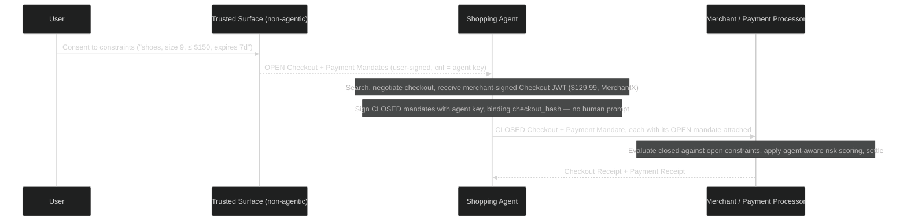
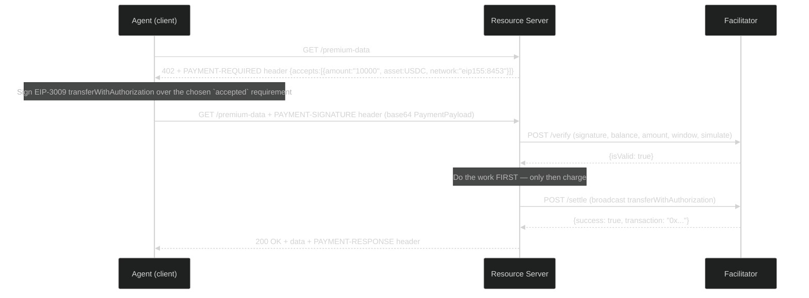
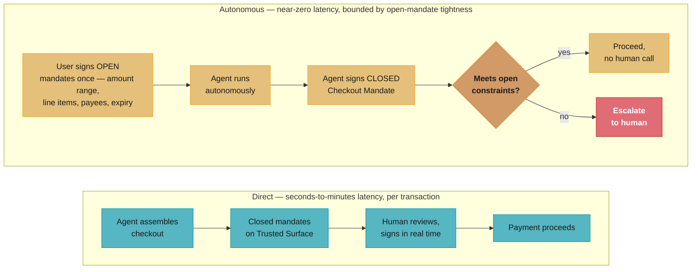
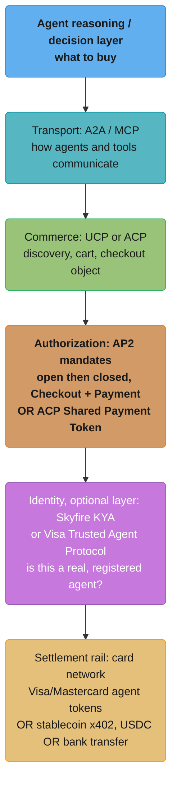

# Agentic Commerce and Payments: x402, AP2, ACP, and Agent-Authorized Spend

> Builds on [Agent-to-Agent Protocols](agent_to_agent_protocols.md) — A2A/MCP provide the
> *transport* for agent communication; this module covers the protocols layered on top that let
> agents *pay* for things (each other's services, third-party APIs, real-world goods) with
> structured, auditable authorization. For the security failure modes when an agent's payment
> authority is exploited, see [Multi-Agent Security](multi_agent_security.md).

---

## 1. Concept Overview

**Agentic commerce** is the set of protocols and mechanisms that let an AI agent **initiate,
authorize, and settle payments** — for itself (paying per-API-call for tools it uses), on behalf
of a user (autonomous shopping/procurement), or to another agent (agent-to-agent service
marketplaces). A cluster of competing and complementary protocols has emerged to standardize
this: **x402** (Coinbase-authored, now stewarded by the Linux Foundation's x402 Foundation —
revives the long-dormant HTTP `402 Payment Required` status code for stablecoin micropayments),
**AP2** (Agent Payments Protocol — Google-led, 60+ partners including Mastercard, PayPal, and
Coinbase, built on [A2A](agent_to_agent_protocols.md) and
[MCP](../mcp_model_context_protocol/mcp_model_context_protocol.md), using cryptographically signed **mandates** as
verifiable proof of user authorization), the two rival commerce layers — **UCP** (Universal
Commerce Protocol, Google + Shopify, which delegates authorization to AP2) and **ACP** (Agentic
Commerce Protocol — OpenAI + Stripe, powering ChatGPT's "Instant Checkout") — and card-network
programs, **Visa Intelligent Commerce** and **Mastercard Agent Pay**, which extend existing
tokenization infrastructure with agent-specific, programmably-constrained tokens. **Skyfire**
addresses a layer underneath all of these: **agent identity** ("Know Your Agent," KYA) plus a
payment network for agent-to-agent and agent-to-API transactions.

The common thread, regardless of protocol: **separate "what was authorized" from "what the agent
decided to do" from "how money actually moves"** — three concerns that, in a world of autonomous
agents acting at machine speed, can no longer be collapsed into "the agent has my credit card
number."

---

## 2. Intuition

> **One-line analogy**: giving an agent your raw payment credentials is handing an employee your
> personal credit card with no statement, no limit, and no way to know what they bought until the
> bill arrives. Agentic commerce protocols are the digital equivalent of a **corporate card with a
> programmable spending policy attached to each transaction** — the policy travels *with* the
> payment, not in a separate document someone has to remember to check.

**Mental model — three layers, separately swappable**:

1. **Authorization layer** — what did a human (or upstream agent) actually agree to? AP2's
   **mandates** make this a cryptographically signed, verifiable artifact (§3.1) rather than an
   implicit assumption baked into a system prompt.
2. **Decision layer** — given that authorization, what specific checkout did the agent construct?
   This is where the agent's reasoning lives — and where prompt injection (§10.1,
   [Multi-Agent Security](multi_agent_security.md)) could attempt to manipulate the outcome.
3. **Settlement layer** — how does money actually move? Card-network token (Visa/Mastercard,
   ACP's Shared Payment Token), stablecoin transfer (x402), or bank transfer — this is a rail
   choice, and AP2 is explicitly **rail-agnostic**, supporting any of these underneath the same
   mandate structure.

**Why it matters**: an agent with tool access that includes "make purchases" is, structurally, an
agent with **a blast radius measured in dollars**, not just tokens or API quota. Every pitfall
pattern from [Agent Reliability](../agents_and_tool_use/agent_reliability.md) (runaway loops, tool
misuse, hallucinated parameters) has a financial-loss analogue here — a hallucinated quantity
field isn't "wrong output," it's "bought 1,000 units instead of 10."

**Key insight**: these protocols are best understood as **"OAuth for money, plus a shopping cart
that's itself a signed claim."** OAuth lets a user grant a third-party app *scoped, revocable*
access to their data without handing over their password; AP2's Checkout Mandate lets a user grant
an agent *scoped, auditable* authority to spend, where the specific checkout contents are part of
what gets cryptographically signed — so "the agent bought something I never agreed to" becomes a
verifiable claim, not a he-said-she-said dispute.

---

## 3. Core Principles

### 3.1 Mandates as Verifiable Credentials (AP2)

AP2 defines **two mandate types**, each a cryptographically signed Verifiable Digital Credential
(a selectively-disclosable SD-JWT), and each existing in one of two **stages**:

- **Checkout Mandate** — proves the Shopping Agent is authorized to buy *this* checkout. It is
  verified by the Merchant and is bound, by cryptographic hash, to a **merchant-signed Checkout
  JWT** carried in the `checkout_hash` claim — so the thing the user authorized and the thing the
  merchant priced are provably the same object.
- **Payment Mandate** — proves the agent is authorized to *pay* for that checkout. It is verified
  by the Credential Provider, the card network, and the Merchant Payment Processor, and it is
  bound to the same checkout by the same hash. Because it identifies the transaction as
  agent-initiated, it doubles as the signal that lets issuers apply agent-aware risk scoring (a
  $2,000 charge initiated by a known shopping agent vs. the same charge with no such signal may be
  scored very differently for fraud purposes).

The advance-authorization-vs-specific-transaction distinction lives on an orthogonal **stage**
axis rather than in a third mandate type:

- **Open** mandate — carries *constraints*, signed by the user, not yet bound to any transaction.
  Because it is unbound, it MUST pin the agent's public key in a `cnf` claim so only that agent
  can present it, and its `exp` SHOULD be the smallest value that lets the task finish.
- **Closed** mandate — bound to one concrete checkout, via a Key Binding JWT proving possession of
  the key the open mandate endorsed. **Verifiers always receive a closed mandate**; only the path
  by which it was signed differs (§3.2).

The constraints themselves are typed and split across the two mandate types: an open Checkout
Mandate carries `checkout.allowed_merchants` and `checkout.line_items`; an open Payment Mandate
carries `payment.amount_range` (min/max plus currency), `payment.budget` (a cumulative total,
used with `payment.agent_recurrence`), `payment.allowed_payees`,
`payment.allowed_payment_instruments`, and `payment.execution_date`. An unknown constraint type
MUST be treated as failing evaluation — a verifier may never ignore a constraint it does not
understand.

Each mandate is answered by a verifier-signed **Receipt** — a Checkout Receipt from the Merchant,
a Payment Receipt from the Merchant Payment Processor. It is the mandate-plus-receipt set, not the
mandate alone, that forms the non-repudiable dispute record §3.7 needs, keyed by the Payment
Mandate's `transaction_id`.

Schema versions are pinned by an exact `vct` string with a numeric suffix
(`mandate.checkout.open.1`, `mandate.checkout.1`, `mandate.payment.open.1`, `mandate.payment.1`).
Implementations MUST match the string exactly rather than prefix-matching, so an incompatible
revision simply fails to verify instead of being half-understood.

### 3.2 Direct (Human-Present) vs. Autonomous (Human-Not-Present) Authorization

**Direct**: the agent assembles a checkout and the *actual human* reviews and signs the closed
Checkout and Payment Mandates in real time, on a **Trusted Surface** — analogous to a checkout
confirmation page, but the "page" is a structured, signable artifact rather than just a UI the
human trusts. **Autonomous**: the user signs *open* mandates once, carrying bounded constraints
(amount range, budget, merchant allowlist, acceptable line items, expiry), and the agent can then
sign closed mandates itself with its own key and present **both** — so the verifier can evaluate
the closed mandate against the open one's constraints without any further human interaction. The
tradeoff is the central one in this entire module: **friction vs. autonomy**, and it's not binary
— constraints can be tuned per use case (§9).

Two normative rules give autonomous mode its teeth. AP2 names five roles — Shopping Agent,
Credential Provider, Merchant, Merchant Payment Processor, and Trusted Surface — and calls a role
*agentic* when a non-deterministic LLM handles its communication. The **Trusted Surface, the
consent UI, MUST be non-agentic**, and all validation MUST run in deterministic code whatever the
role: §6.3's lesson written into a protocol as a requirement. And a Shopping Agent **MUST NOT**
present a further open mandate until it has received a rejection receipt for the previous one,
which stops one open mandate from silently authorizing several checkouts. There is no
revoke-before-expiry mechanism in the spec at all, which is exactly why the "smallest `exp` that
finishes the task" rule matters — a short expiry is the only revocation you get.

### 3.3 Payment Rails Are a Choice Underneath the Authorization Layer

A signed Checkout Mandate doesn't move money by itself — it authorizes a transaction on **some
rail**: a card-network token (Visa/Mastercard, or ACP's Shared Payment Token), a stablecoin
transfer (x402, typically USDC on a low-fee L2 like Base), or a bank-to-bank transfer (open
banking rails). AP2 is explicitly designed so the **same mandate structure** can authorize a
transaction on any of these — the Payment Instrument is an extension point keyed by a `type`
string, and x402 is **one of AP2's supported payment rails** for the machine-to-machine
micropayment case. AP2 draws the same line on the *commerce* side: catalog APIs, cart updates and
order management are outside its scope and belong to a commerce protocol layered above it, which
is why AP2 v0.2 is written to slot underneath the **Universal Commerce Protocol (UCP)** with UCP's
Checkout object serving as the merchant-signed `checkout_jwt` payload.

### 3.4 Scoped, Ephemeral Credentials — Least Privilege Applied to Money

Every modern agentic-payment mechanism converges on the same principle that
[MCP Security](../mcp_model_context_protocol/mcp_security.md) and
[Agent-to-Agent Protocols §10.2](agent_to_agent_protocols.md) apply to tokens generally: **credentials
should be scoped to the minimum needed and short-lived**. ACP's **Shared Payment Token (SPT)** is
single-transaction (or narrowly-scoped) and merchant-specific — it is *not* the user's underlying
card number, and cannot be reused for an unrelated purchase. Visa Intelligent Commerce and
Mastercard Agent Pay issue **agent-specific tokens** distinct from the cardholder's primary card
token, each carrying its own programmable controls (spend caps, merchant-category restrictions,
expiry) — so a compromised agent token has a bounded blast radius independent of the user's actual
card.

### 3.5 HTTP 402 Revived: Machine-Native Payment Negotiation

HTTP status code 402 ("Payment Required") has existed in the spec since HTTP/1.1 but was never
standardized for actual use — until **x402**. The flow (§5.2, §6.2): a client (often an AI agent)
requests a resource; the server responds `402` with a `PAYMENT-REQUIRED` header carrying a
base64-encoded `PaymentRequired` object (an `accepts` array of payment requirements — amount in
atomic units, asset, recipient address, CAIP-2 network); the client picks one, constructs and
signs a payment authorization, retries the request with the proof in a `PAYMENT-SIGNATURE` header;
the server (often via a **facilitator** service that verifies and submits the on-chain
transaction) validates payment and returns the resource with `200 OK` plus a `PAYMENT-RESPONSE`
header carrying the settlement result. All protocol data rides in headers — the response body is
purely the server's own concern. This is designed for **per-call API
monetization** — an agent paying $0.001 per inference call to a tool-provider, where card-payment
processing fees would make such micropayments uneconomical. The relevant number is the *merchant
discount rate*, the all-in per-transaction cost a merchant pays: for standard US online card
payments that is around **2.9% + $0.30** (Stripe's published flat rate), of which the interchange
component paid to the issuing bank is only a part. It is the fixed $0.30 term, not the
percentage, that kills sub-dollar payments.

### 3.6 Identity as a Separate Layer (Skyfire's KYA)

**Skyfire**'s "Know Your Agent" (KYA) addresses a question none of the above protocols fully
solve: **is the entity on the other end of this transaction actually the agent it claims to be,
operated by the party it claims to represent?** KYA issues verifiable identity credentials to
agents (distinct from the *payment* authorization mandates of §3.1) — a counterparty can check
"is this a known, registered agent with a verifiable operator" *before* even getting to "is this
specific transaction authorized." Skyfire then layers a payment network (agent wallets, often
stablecoin-denominated) on top of this identity layer for agent-to-agent and agent-to-API
payments.

### 3.7 The Dispute/Refund/Liability Chain

When a card-present human buys the wrong item, return/refund policies and chargeback rights are
well-established. When **an agent** buys the wrong item — because of a hallucinated parameter, a
prompt injection (§10.1), or a legitimate-but-undesired interpretation of a vague open mandate —
**who is liable, and how is it proven?** This is precisely why mandates are *signed, verifiable
artifacts*: the Checkout Mandate plus its Receipt is evidence of exactly what was authorized vs.
what was purchased, and the Payment Mandate's "an AI agent initiated this" signal gives issuers a
basis for agent-specific dispute-handling policies that doesn't yet have settled industry-wide
norms as of 2026 — an active area where protocol design and financial regulation are still
converging. AP2 specifies the *evidence*, not the resolution: it defines how a verifier
independently recomputes the `checkout_jwt` hash and matches each Receipt's `reference` against
the hash of its closed mandate, and explicitly leaves retention, retrieval and who-pays out of
scope.

---

## 4. Types / Architectures / Strategies

| Protocol / System | Origin | Payment Rail | Primary Use Case | Authorization Model |
|---|---|---|---|---|
| **x402** (v2) | Coinbase, now stewarded by the Linux Foundation's x402 Foundation | Stablecoin (USDC), typically on Base L2 | Machine-to-machine micropayments — pay-per-API-call, agent tool monetization | Per-request signed payment authorization (HTTP 402 flow, §3.5) |
| **AP2 (Agent Payments Protocol)** (v0.2) | Google + 60+ partners (Mastercard, PayPal, Coinbase, etc.) | Rail-agnostic — cards, bank transfer, stablecoins (x402 among them) | General agentic shopping/procurement across any payment method | Checkout Mandate + Payment Mandate, each open or closed (§3.1), built on A2A/MCP |
| **UCP (Universal Commerce Protocol)** | Google + Shopify, with Amazon, Meta, Microsoft, Salesforce and Stripe on the Tech Council | Delegates payment — pairs with AP2 mandates | The commerce layer AP2 sits under: discovery, cart, checkout, orders, post-purchase | OAuth 2.0 identity linking; the merchant-signed Checkout object AP2 hashes into `checkout_hash` |
| **ACP (Agentic Commerce Protocol)** | OpenAI + Stripe (2025) | Card networks via Stripe, Shared Payment Token | Conversational checkout — ChatGPT "Instant Checkout" and Copilot, with merchant catalogs | Merchant product feed + single-use/scoped SPT (§3.4) |
| **Visa Intelligent Commerce** | Visa, with OpenAI/Microsoft/Anthropic/Perplexity/Mistral as partners; Trusted Agent Protocol co-developed with Cloudflare | Visa network, agent-specific tokens | Card-present-equivalent agent purchases within the Visa network | Agent-specific tokens with programmable controls (spend cap, MCC restrictions); TAP signs agent identity into HTTP request headers so merchants can tell an agent from a bot |
| **Mastercard Agent Pay** | Mastercard, with Microsoft/Stripe partnerships | Mastercard network, "Agentic Tokens" | Card-network tokenization extended to agent-initiated transactions | Agentic Tokens — extension of Mastercard Digital Enablement Service tokenization, binding a token to one agent, merchant scope and consent policy |
| **Skyfire** | Skyfire (startup) | Agent wallets, often stablecoin | Agent identity (KYA) + agent-to-agent / agent-to-API payments | Identity credentials (KYA, §3.6) layered under payment authorization |

**The rows answer three different questions, not one.** Most of the confusion in the write-ups
comes from comparing rows that never competed:

| Question | Protocols that answer it |
|---|---|
| What did the user consent to, and can I prove it? | AP2 (mandates), Visa TAP (agent identity in the request) |
| How does an agent browse, build a cart, and check out with a merchant? | UCP, ACP |
| How does money actually move? | x402 (stablecoin), Visa Intelligent Commerce / Mastercard Agent Pay (card tokens), ACP's Shared Payment Token (card via Stripe) |

AP2 and UCP compose deliberately — UCP owns discovery through post-purchase, AP2 secures the
consent underneath it, and UCP's Checkout object is the very JWT an AP2 Checkout Mandate hashes.
UCP and ACP genuinely compete for the merchant-integration slot: ACP is checkout-inside-the-AI-
surface (ChatGPT, Copilot) settling through Stripe, while UCP spans the whole journey and is where
Google, Shopify and the large retailers converged. x402 competes with neither — it is the only row
that is purely a rail, and it is the only one that works below a dollar (§8).

---

## 5. Architecture Diagrams

### 5.1 AP2 Mandate Flow (Autonomous / Human-Not-Present)



### 5.2 x402 Request Flow (v2)



### 5.3 Direct (Human-Present) vs. Autonomous (Human-Not-Present)



### 5.4 Layered Architecture



---

## 6. How It Works — Detailed Mechanics

### 6.1 AP2-Style Open and Closed Mandates

```python
import hashlib
import hmac
import time
from dataclasses import dataclass, field


@dataclass
class OpenMandate:
    """User-signed CONSTRAINTS, not bound to any transaction yet.

    AP2 splits these across two open mandates -- an open Checkout Mandate carries
    `checkout.allowed_merchants` and `checkout.line_items`, an open Payment Mandate
    carries `payment.amount_range` and `payment.budget`. They are collapsed into one
    object here; a real implementation keeps them separate because the Merchant and
    the Merchant Payment Processor each only see the constraints they must evaluate.
    """
    user_id: str
    max_price_usd: float         # payment.amount_range -> max
    category: str
    merchant_allowlist: list[str]  # checkout.allowed_merchants
    agent_public_key: str        # the `cnf` claim -- ONLY this agent may present it
    expires_at: float            # the `exp` claim -- AP2's only revocation mechanism
    signature: str = ""

    def sign(self, user_secret: bytes) -> None:
        # Every field the constraint evaluation reads must be inside the signed
        # payload, merchant_allowlist and agent_public_key included -- otherwise an
        # attacker who can reach the mandate object appends a merchant, or swaps in
        # their own key, and meets_constraints() still passes.
        allowlist = ",".join(sorted(self.merchant_allowlist))
        payload = (
            f"{self.user_id}|{self.max_price_usd}|{self.category}"
            f"|{allowlist}|{self.agent_public_key}|{self.expires_at}"
        )
        self.signature = hmac.new(user_secret, payload.encode(), hashlib.sha256).hexdigest()

    def is_valid(self) -> bool:
        return time.time() < self.expires_at


@dataclass
class CheckoutMandate:
    """CLOSED: bound to one specific merchant-signed checkout.

    In Direct mode the user signs this on a Trusted Surface. In Autonomous mode the
    agent signs it with the key the OpenMandate pinned, and presents both -- which is
    the case meets_constraints() below models.
    """
    item_description: str
    price_usd: float
    merchant: str
    checkout_hash: str            # hash of the merchant-signed checkout JWT

    def meets_constraints(self, open_mandate: OpenMandate) -> tuple[bool, str]:
        if not open_mandate.is_valid():
            return False, "open mandate expired"
        if self.price_usd > open_mandate.max_price_usd:
            return False, f"price ${self.price_usd} exceeds cap ${open_mandate.max_price_usd}"
        if self.merchant not in open_mandate.merchant_allowlist:
            return False, f"merchant {self.merchant} not in allowlist"
        return True, "meets constraints"


@dataclass
class PaymentMandate:
    """Authorizes payment for one checkout, and flags it as agent-initiated."""
    checkout: CheckoutMandate
    agent_id: str
    transaction_id: str              # the key the dispute record is retrieved by
    initiated_by: str = "ai_agent"   # distinct risk-scoring path vs. "human_present"
    created_at: float = field(default_factory=time.time)
```

Note what `meets_constraints()` does NOT do: it never treats an unrecognized constraint as
satisfied. AP2 makes that normative — a verifier that meets a constraint type it does not
understand MUST fail the evaluation, because the alternative is an agent minting constraints the
verifier silently skips.

### 6.2 x402 Client Flow (Simplified)

```python
import base64
import json
import requests
from dataclasses import dataclass


@dataclass
class X402PaymentRequirements:
    """One entry of the `accepts` array, using the spec's own field names.

    The real PaymentRequirements object also carries `extra` (scheme-specific data,
    e.g. the token name and version for EIP-712 domain separation); only the
    settlement-relevant fields are modelled here.
    """
    scheme: str                # e.g. "exact"
    network: str               # CAIP-2 chain id, e.g. "eip155:8453" for Base mainnet
    amount: str                # atomic units of `asset`, as a string
    asset: str                 # token contract address (e.g. the USDC contract)
    payTo: str                 # recipient on-chain address
    maxTimeoutSeconds: int


def _b64_header(raw: str) -> dict:
    return json.loads(base64.b64decode(raw))


def fetch_with_x402(url: str, wallet) -> requests.Response:
    """Fetch a resource, handling the 402 Payment Required negotiation."""
    response = requests.get(url)
    if response.status_code != 402:
        return response               # no payment required, or already paid

    # v2 carries the protocol data in HEADERS, not the body -- the body is the
    # server's own concern and may be anything, so never parse it for requirements.
    payment_required = _b64_header(response.headers["PAYMENT-REQUIRED"])

    # Pick a requirement you can actually satisfy, then map only the fields you
    # model -- constructing the dataclass with ** would raise TypeError on the
    # spec fields omitted above.
    chosen = payment_required["accepts"][0]
    requirements = X402PaymentRequirements(
        scheme=chosen["scheme"],
        network=chosen["network"],
        amount=chosen["amount"],
        asset=chosen["asset"],
        payTo=chosen["payTo"],
        maxTimeoutSeconds=chosen["maxTimeoutSeconds"],
    )

    # Sign an on-chain payment authorization (EIP-3009 transferWithAuthorization)
    # WITHOUT broadcasting it yet -- the facilitator submits it on settlement.
    signed = wallet.sign_transfer_authorization(
        amount=requirements.amount,
        asset=requirements.asset,
        recipient=requirements.payTo,
        network=requirements.network,
    )

    # The payload echoes back the SINGLE requirement you chose, as `accepted`.
    payload = {
        "x402Version": 2,
        "resource": payment_required["resource"],
        "accepted": chosen,
        "payload": signed,      # {"signature": "0x...", "authorization": {...}}
    }
    header = base64.b64encode(json.dumps(payload).encode()).decode()

    # Retry with the payment proof in the PAYMENT-SIGNATURE header. On success the
    # server returns the settlement result in a PAYMENT-RESPONSE header.
    return requests.get(url, headers={"PAYMENT-SIGNATURE": header})
```

The asymmetry between `accepts` and `accepted` is the field pair most often got wrong. The server
offers a *list* of requirements it will take (`accepts`, plural, on `PaymentRequired`); the client
echoes back the *one* it chose (`accepted`, singular, on `PaymentPayload`). A facilitator's
`/verify` compares the two, so echoing a modified copy — a smaller `amount`, a different `payTo` —
fails parameter matching rather than quietly underpaying.

### 6.3 BROKEN -> FIX: Unscoped Payment Credential vs. Mandate-Bounded Spend

```python
# BROKEN: a procurement agent holds a single, unscoped API key that grants
# FULL access to the company's payment processor account -- any tool call
# the agent's reasoning produces can spend ANY amount, on ANYTHING. If a
# prompt injection (e.g., a malicious product description scraped during
# research, see Multi-Agent Security) causes the agent to "decide" to
# purchase 500 units of an unrelated item at $200 each, NOTHING in this
# code stops it.
class ProcurementAgentBroken:
    def __init__(self, payment_api_key: str):
        self.payment_api_key = payment_api_key   # full account access

    def purchase(self, item: str, quantity: int, unit_price_usd: float) -> dict:
        total = quantity * unit_price_usd
        return self._call_payment_api(self.payment_api_key, item, quantity, total)
        # No check against any pre-authorized bound. No human escalation.
        # $100,000 erroneous order goes through exactly like a $10 one.

    def _call_payment_api(self, key: str, item: str, qty: int, total: float) -> dict: ...
```

```python
# FIXED: the agent holds NO direct payment credential -- only the ability to
# construct CheckoutMandates against a pre-signed OpenMandate (§6.1).
# A SpendLimitGuard enforces per-transaction AND cumulative bounds -- AP2's
# `payment.amount_range` and `payment.budget` constraints respectively -- and
# escalates to a human for anything outside the open mandate's scope,
# REGARDLESS of what the agent's reasoning concluded.
class SpendLimitGuard:
    def __init__(self, open_mandate: OpenMandate, cumulative_cap_usd: float):
        self.open_mandate = open_mandate
        self.cumulative_cap_usd = cumulative_cap_usd
        self.spent_so_far_usd: float = 0.0

    def authorize(self, checkout: CheckoutMandate) -> tuple[bool, str]:
        ok, reason = checkout.meets_constraints(self.open_mandate)
        if not ok:
            return False, f"escalate_to_human: {reason}"
        if self.spent_so_far_usd + checkout.price_usd > self.cumulative_cap_usd:
            return False, (
                f"escalate_to_human: cumulative spend "
                f"${self.spent_so_far_usd + checkout.price_usd} would exceed "
                f"cap ${self.cumulative_cap_usd}"
            )
        return True, "authorized"


class ProcurementAgentFixed:
    def __init__(self, guard: SpendLimitGuard, payment_processor):
        self.guard = guard
        self.payment_processor = payment_processor   # scoped to THIS guard's mandate

    def purchase(self, checkout: CheckoutMandate) -> dict:
        authorized, reason = self.guard.authorize(checkout)
        if not authorized:
            return {"status": "escalated", "reason": reason}   # human reviews

        payment_mandate = PaymentMandate(
            checkout=checkout,
            agent_id="procurement-agent-01",
            transaction_id=checkout.checkout_hash,
        )
        self.guard.spent_so_far_usd += checkout.price_usd
        return self.payment_processor.settle(payment_mandate)

# A hallucinated "500 units at $200" checkout now hits meets_constraints() —
# price $100,000 > max_price_usd from the open mandate — and is REJECTED before
# any payment API call is even attempted, escalated to a human instead.
```

**Read it like this.** "The check is one comparison — checkout total against the ceiling the human
signed — and it does not care in the slightest how the agent arrived at the total."

```
  checkout_total = quantity x unit_price
  authorized = checkout_total <= max_price_usd  AND  merchant allowed  AND  not expired
```

| Symbol | What it is |
|--------|------------|
| `quantity`, `unit_price` | Whatever the agent's reasoning produced. Untrusted, both of them |
| `checkout_total` | The Checkout Mandate's price. What actually gets charged |
| `max_price_usd` | The ceiling from the open mandate, signed by the human in advance |
| `<=` | A code comparison, not a model instruction. Cannot be argued with or injected |

**Walk one example.** The hallucinated order in the comment above, against the §5.1 bound:

```
  checkout_total = 500 x $200 = $100,000
  max_price_usd  =              $   150    (from the signed open mandate)

  $100,000 <= $150 ?  NO
  overshoot ratio = 100,000 / 150 = 667x the authorized ceiling
  -> REJECTED, escalated to human. Zero dollars move.
```

Compare the legitimate checkout from the same flow:

```
  checkout_total = $129.99      max_price_usd = $150
  $129.99 <= $150 ?  YES   ->  settles with no human prompt
```

**Why the ceiling has to live outside the prompt.** Both checkouts are produced by the same agent
through the same reasoning process; nothing about the $100,000 one is syntactically malformed or
flagged as suspicious. The only thing separating them is a number the model never had the ability
to modify. Move `max_price_usd` into the system prompt as "do not spend more than $150" and the
667x overshoot becomes a *probability* — high compliance most of the time, and no guarantee on
the run where a scraped page carried an injection or the model simply miscounted units.

The overshoot ratio is worth internalizing precisely because it is so large. Failures of this
class are not near-misses that a sanity heuristic would catch by looking odd; they are
three-orders-of-magnitude errors that look completely ordinary in JSON. A structural check
rejects `$100,000 > $150` with exactly the same code path it uses to reject `$151 > $150`, which
is the property that makes it trustworthy.

### 6.4 x402 Settlement: verify-then-settle, and the retry that pays twice

The §6.2 client stops at "attach the payment proof." What the server does next is where the
operational hazards live.

Settlement is **two calls to a facilitator, not one**. The resource server POSTs the payload and
requirements to `/verify`, which checks that the signature recovers to `authorization.from`,
that the payer holds the balance, that amount and validity window satisfy the requirements, that
token and network match, and simulates the transfer. Only after the server has done the work
does it POST to `/settle`, where the facilitator submits the transaction and waits for
confirmation. Splitting the two is what lets a server refuse a bad request before any money
moves, and avoid charging for a response it then failed to produce. A third endpoint,
`GET /supported`, advertises the `(scheme, network)` pairs and extensions a facilitator can
actually handle — query it rather than assuming your chain is served.

Under the default `exact`-on-EVM scheme the facilitator pays gas while the client controls the
flow of funds purely by signature — EIP-3009 `transferWithAuthorization`, with a Permit2
fallback for tokens that lack it. The signed `authorization` is `from`, `to`, `value`,
`validAfter`, `validBefore`, `nonce`.

**The retry trap.** Those last two fields are the entire replay story, and they set a rule that
catches agent authors out. The `nonce` is single-use — the token contract records it, so a
second submission of the same authorization reverts — and the validity window is short (65
seconds in the spec's own example). So when a request times out and the agent does not know
whether settlement happened:

- **Resend the identical `PAYMENT-SIGNATURE`.** Same nonce, so at worst the duplicate settlement
  reverts on-chain. You pay once. This is the correct behaviour.
- **Sign a fresh authorization.** New nonce, so both are independently valid and both can
  settle. One logical request, two payments — and on-chain settlement is not reversible, which
  is the §8 dispute-mechanism row biting in practice.

Make the signed authorization part of the retryable unit of work, not something regenerated
inside the retry — the same discipline as task idempotency in
[Orchestrator-Worker](orchestrator_worker_pattern.md), with money attached. If the window
expires before the retry succeeds, the authorization is dead rather than dangerous: sign a new
one, because the old one can no longer settle.

---

## 7. Real-World Examples

- **Coinbase x402** — launched as an open spec with reference facilitator implementations;
  governance has since moved out of Coinbase entirely. The Linux Foundation announced its intent
  to launch an **x402 Foundation** in April 2026 and stood it up operationally on 14 July 2026,
  with Coinbase's contribution of the protocol complete and 40 member organizations — Adyen, AWS,
  American Express, Circle, Cloudflare, Fiserv, Google, Mastercard, Shopify, Stripe and Visa among
  the premier tier. Adopted by AI infrastructure providers for **per-call API monetization** — an
  agent paying fractions of a cent per tool invocation, economically viable only because
  stablecoin transfer fees on L2s like Base are a small fraction of a cent, unlike card-network
  interchange.
- **AP2 (Google-led)** — launched with 60+ partner organizations spanning payment networks
  (Mastercard, PayPal), crypto infrastructure (Coinbase), and AI platforms — explicitly positioned
  as **payment-method-agnostic**, with x402 as one of its supported rails for the
  machine-to-machine case, and card/bank rails for consumer shopping. The published spec is
  **v0.2**, and it is written to sit under the Universal Commerce Protocol as the layer that
  secures consent while UCP owns the commerce journey.
- **UCP (Google + Shopify)** — an open commerce standard spanning discovery, cart, checkout,
  orders and post-purchase, co-developed with Shopify, Etsy, Wayfair, Target and Walmart, and
  endorsed by Adyen, American Express, Best Buy, Mastercard, Stripe, The Home Depot and Visa
  among others; Amazon, Meta, Microsoft, Salesforce and Stripe later joined its Tech Council.
  It powers agentic checkout in Google's AI Mode and Gemini, and delegates payment authorization
  to AP2 rather than defining its own.
- **OpenAI + Stripe ACP / ChatGPT Instant Checkout** — merchants (early partners included Etsy
  and Shopify-integrated stores) publish a product feed consumable by ChatGPT; a user can
  complete a purchase **without leaving the chat**, with Stripe issuing a Shared Payment Token
  scoped to that specific transaction and merchant. Apache-2.0 licensed, with REST and
  MCP-compatible endpoints, and now also the checkout path inside Microsoft Copilot.
- **Visa Intelligent Commerce** — Visa's program partners with OpenAI, Microsoft, Anthropic,
  Perplexity, and Mistral to let AI agents initiate Visa-network transactions using
  **agent-specific tokens** distinct from the cardholder's primary card credentials, with
  issuer-configurable controls. Its **Trusted Agent Protocol**, co-developed with Cloudflare and
  backed by Adyen, Stripe, Worldpay, Cybersource, Elavon and Nuvei, solves the adjacent problem:
  cryptographically signing an agent's identity into the HTTP request so a merchant's bot
  defences do not block a legitimate agent at the door.
- **Mastercard Agent Pay** — extends Mastercard Digital Enablement Service, the same tokenization
  infrastructure behind tokenized mobile-wallet payments, with **Agentic Tokens** that bind a
  tokenized credential to one agent, one merchant scope and one consent policy; partnering with
  Microsoft (Azure-hosted agents) and Stripe for merchant-side integration, and rolled out across
  US cardholders.
- **Skyfire** — positions its KYA identity layer and agent-wallet payment network as
  infrastructure for **agent-to-agent API marketplaces** — e.g., a research agent paying a
  specialized data-provider agent per query, where both sides need to verify "is the counterparty
  a legitimate, registered agent" before any payment logic runs at all.

---

## 8. Tradeoffs

### Settlement Rail: Stablecoin (x402/Skyfire) vs. Card Network (ACP/Visa/Mastercard)

| | Stablecoin (x402, Skyfire) | Card Network (ACP, Visa IC, Mastercard Agent Pay) |
|---|---|---|
| Per-transaction fee at small amounts (<$1) | Near-zero (L2 gas fees) — viable for micropayments | Merchant discount rate (~2.9% + $0.30 for standard US online cards) makes sub-$1 transactions uneconomical |

**What it means.** "A card fee has a fixed floor of about thirty cents no matter how small the
purchase is, so below a few dollars you are not paying a fee on the transaction — the fee *is*
the transaction."

The word doing the work is *fixed*. A pure percentage fee would scale down gracefully forever and
micropayments would need no new rail at all; it is the constant term that creates a hard economic
floor and, with it, the entire reason x402 exists.

```
  card_fee(amount) = $0.30 + pct x amount

  fee_ratio = card_fee(amount) / amount
```

| Symbol | What it is |
|--------|------------|
| `amount` | Transaction value. `$0.001` for the per-inference-call case in §3.5 |
| `$0.30` | The fixed component. Identical for a $0.001 charge and a $10,000 charge |
| `pct x amount` | The variable component. Scales, so it is never the problem at small amounts |
| `fee_ratio` | Fee as a share of value moved. Above 1.0, the rail costs more than it carries |

**Walk one example.** The $0.001-per-inference-call scenario from §3.5, fixed component only:

```
  amount = $0.001   fixed fee = $0.30

  fee_ratio = 0.30 / 0.001 = 300x        the fee is 300 times the payment

  1,000 API calls at $0.001 each:
    value transferred : 1,000 x $0.001 = $  1.00
    card fees         : 1,000 x $0.30  = $300.00
    total billed                        = $301.00 to move $1.00
```

Now find where the floor stops mattering:

```
  fixed fee as a share of the transaction:
    $0.001  ->  30,000%      absurd
    $1.00   ->      30%      still ruinous
    $6.00   ->       5%      roughly the point it becomes a normal cost of business
    $130    ->       0.2%    invisible -- the §5.1 shoe purchase lives here
```

That threshold is the whole story of the table. The `$129.99` cart in §5.1 and the `$0.001` tool
call in §3.5 are not two sizes of the same problem — they sit on opposite sides of a fixed cost,
and no amount of card-network optimization moves a sub-cent payment across it. This is why AP2
routes consumer shopping over card rails and x402 over stablecoin rails rather than picking a
winner: the correct rail is a function of transaction size, and agentic systems generate both
sizes at once.

Read the cost the other way, too. Stablecoin rails buy the sub-cent regime by giving up the
"Dispute/chargeback mechanisms" row below — on-chain finality means no reversal. For a $0.001
API call that is a trivial exposure; for a $129.99 purchase from an unfamiliar merchant it is the
entire consumer-protection story, which is why the same table that makes x402 look strictly
better at the top makes it clearly worse three rows down.
| Settlement speed | Seconds (on-chain finality on L2s) | Typically T+1 or T+2 for merchant settlement, though authorization is real-time |
| Regulatory clarity (as of 2026) | Evolving — stablecoin regulation varies by jurisdiction | Mature — decades of card-network regulatory frameworks |
| Merchant acceptance | Limited to merchants/APIs integrating x402 or Skyfire directly | Near-universal — leverages existing card-accepting merchant base |
| Dispute/chargeback mechanisms | Limited — on-chain transactions are largely final | Mature chargeback/dispute processes, now extended with agent-initiated signals (§3.7) |

### Authorization Granularity: Open/Closed Mandates (AP2) vs. Single Scoped Token (ACP/Visa/Mastercard)

| | AP2 Mandates | Single Scoped Token (SPT, Agentic Token) |
|---|---|---|
| Auditability | Each mandate and its Receipt is independently verifiable evidence (§3.7) | Token scope is defined at issuance; less granular per-transaction evidence trail |
| Cross-rail portability | Same mandate structure works across cards, bank transfer, stablecoins | Tied to the issuing network's token format |
| Implementation complexity | Higher — requires SD-JWT infrastructure, constraint evaluation, receipt handling | Lower — closer to existing tokenization flows merchants/issuers already support |
| Best fit | Multi-rail platforms, complex authorization policies (line items + amount range + payee + time bounds) | Single-rail checkout flows (e.g., conversational commerce within one card network) |

### Direct (Human-Present) vs. Autonomous (Human-Not-Present) (§3.2)

| | Direct | Autonomous |
|---|---|---|
| Per-transaction friction | High — real-time review/signature | Near-zero, within open-mandate constraints |
| Autonomy / scale | Low — bounded by human availability | High — agent can transact continuously |
| Risk if bounds are too loose | Limited — human catches it at review | Higher — errors execute before any human sees them (mitigated by §6.3's guard) |
| Appropriate for | High-value, infrequent, or novel-merchant purchases | Recurring, bounded, well-understood categories (subscription renewals, routine restocking, per-call API payments) |

---

## 9. When to Use / When NOT to Use

**Use x402 when:**

- The transaction is a **machine-to-machine micropayment** — an agent paying per API call, per
  inference, or per data query — where card-network fees would exceed or dominate the transaction
  amount.
- Both sides of the transaction are comfortable with **stablecoin settlement** and the regulatory
  environment for the relevant jurisdictions supports it.

**Use AP2 when:**

- The system needs to support **multiple payment rails** under one authorization model, or needs
  **fine-grained, auditable authorization policies** (amount ranges, acceptable line items,
  merchant allowlists, time bounds) that a single token's scope can't expressively capture.
- The use case spans both **direct** (occasional high-value purchases) and **autonomous**
  (routine recurring purchases) flows for the same user/agent.
- Note that AP2 is the *consent* layer only — you still need a commerce protocol above it (UCP is
  the one AP2 v0.2 is written against) and a rail below it.

**Use UCP when:**

- The merchant needs one integration covering **discovery through post-purchase** rather than
  checkout alone, and wants the buying surfaces to be agent-agnostic — UCP is where Google,
  Shopify and the large retailers converged, and it delegates consent to AP2 rather than
  reinventing it.

**Use ACP when:**

- The integration target is specifically **conversational commerce within an existing assistant
  platform** (ChatGPT, Copilot) and the merchant already has a Stripe relationship — ACP's
  product-feed + SPT model is purpose-built for this checkout-in-chat pattern.

**Use Visa Intelligent Commerce / Mastercard Agent Pay when:**

- The organization already operates within that **card network's existing merchant/issuer
  relationships** and wants agent-specific controls layered onto infrastructure it already trusts
  and has compliance processes for.

**Do NOT, regardless of protocol:**

- **Give an agent direct, unscoped access to a payment processor account or raw card credentials**
  (§6.3 BROKEN) — every protocol in this module exists specifically to avoid this pattern; reverting
  to it defeats the purpose of adopting any of them.
- **Rely on prompt-based spending instructions as the only safeguard** ("don't spend more than
  $X") — this is a suggestion to a probabilistic system, not an enforcement mechanism; the
  enforcement must be structural (mandate bounds, `SpendLimitGuard`, token-level caps) and
  independent of what the agent's reasoning concludes (§6.3 FIX).
- **Set human-in-the-loop thresholds without revisiting them** — a cumulative cap set once and
  never re-evaluated either becomes an operational bottleneck (too low, defeating automation
  value) or a stale, overly-permissive ceiling (too high relative to current transaction patterns)
  — see Pitfall 10.4.

---

## 10. Common Pitfalls

**10.1 Prompt Injection Leading to Unauthorized Spend**

If an agent's purchasing decisions are influenced by content it reads during research — a
malicious product description, a compromised price-comparison page — and that content can
manipulate the agent's tool-call parameters, an unscoped payment credential turns a **content
manipulation attack into a financial loss** (§6.3 BROKEN). The fix is the same principle as
[Multi-Agent Security](multi_agent_security.md)'s broader guidance: **never let externally-sourced
content directly determine the parameters of a privileged action** — the `SpendLimitGuard`'s
constraint check (§6.3 FIXED) is independent of *why* the agent decided on a given checkout, only
*whether that checkout falls within pre-authorized, human-set bounds*.

**10.2 Conflating Identity Verification with Spend Authorization**

Skyfire's KYA (§3.6) answers "is this a legitimate, registered agent?" — it does **not** answer
"is THIS SPECIFIC TRANSACTION authorized?" A system that checks KYA and then proceeds to execute
arbitrary-amount transactions has solved counterparty-identity risk while leaving
transaction-authorization risk completely open. These are independent layers (§5.4) — both are
needed, and neither substitutes for the other.

**10.3 Treating Mandate Signatures as Sufficient Without Considering Key Compromise**

A signed Checkout Mandate is strong evidence of *what was authorized*, provided the signing key
itself is secure. Autonomous mode makes this acute: the open mandate pins the agent's key in its
`cnf` claim precisely so nobody else can present it, which means whoever holds that key can mint
*validly-signed* closed mandates for any transaction inside the constraints (§3.1). The signature
proves the mandate came from that key, not that the legitimate agent's *reasoning* produced it —
and because AP2 has no revoke-before-expiry mechanism, a compromised key stays usable until `exp`.
Key management for agent-held signing keys deserves the same rigor as
[MCP Security](../mcp_model_context_protocol/mcp_security.md)'s treatment of service-to-service
credentials — short expiries in preference to long ones, hardware-backed storage where possible,
and monitoring for anomalous mandate-generation patterns.

**10.4 Static Human-in-the-Loop Thresholds**

A cumulative spend cap or per-transaction threshold set at system launch, based on initial
estimates of "typical" transaction sizes, becomes miscalibrated as usage patterns evolve — too
restrictive as legitimate use scales (every transaction escalates, defeating automation), or too
permissive if the agent's task scope expands beyond what the original threshold anticipated.
Thresholds should be **reviewed against actual transaction-size distributions** on a recurring
basis, the same operational discipline [Safety & Alignment](../safety_and_alignment/safety_and_alignment.md)'s
"one-time red teaming" pitfall warns against applied to financial controls.

**10.5 Ignoring the Liability Question Until a Dispute Occurs**

Teams adopt agentic-commerce protocols for their *authorization* benefits but don't pre-establish
**who is liable when an agent-initiated transaction is disputed** — the user, the platform
operating the agent, or the merchant. The Payment Mandate's "AI agent-initiated" signal (§3.1)
exists partly to give issuers a basis for agent-aware dispute policies, but those policies are
still maturing industry-wide as of 2026 (§3.7) — organizations deploying agentic commerce should
have an explicit internal policy for this scenario *before* the first dispute, not after.

---

## 11. Technologies & Tools

| Tool / Protocol | Role |
|---|---|
| **x402 v2** | Open spec, contributed by Coinbase to the Linux Foundation's x402 Foundation; HTTP 402 + `PAYMENT-REQUIRED`/`PAYMENT-SIGNATURE`/`PAYMENT-RESPONSE` headers, with HTTP, MCP and A2A transports and `/verify`, `/settle`, `/supported` facilitator endpoints |
| **AP2 (Agent Payments Protocol) v0.2** | Google-led open protocol; Checkout + Payment Mandates in open and closed stages, built on A2A/MCP, rail-agnostic |
| **UCP (Universal Commerce Protocol)** | Google + Shopify commerce standard covering discovery, checkout and orders; supplies the merchant-signed Checkout object AP2 binds a Checkout Mandate to |
| **ACP (Agentic Commerce Protocol)** | OpenAI + Stripe, Apache-2.0; product feed + REST/MCP checkout endpoints + Shared Payment Token; powers ChatGPT Instant Checkout |
| **Visa Intelligent Commerce / Trusted Agent Protocol** | Visa's agent-payment program; agent-specific tokens with programmable controls, plus TAP's signed agent identity in HTTP request headers |
| **Mastercard Agent Pay** | Mastercard's Agentic Tokens, extending MDES tokenization for agent-initiated transactions |
| **Skyfire** | Agent identity (KYA) + agent-wallet payment network for agent-to-agent / agent-to-API payments |
| **Stablecoins (USDC on Base, etc.)** | Settlement asset for x402 and similar micropayment rails |
| **SD-JWT (RFC 9901)** | The selectively-disclosable credential format AP2 mandates are issued as, so a verifier sees only the constraints it must evaluate |
| **EIP-3009 (`transferWithAuthorization`)** | Ethereum token standard enabling the "sign now, settle later via facilitator" pattern x402's `exact` scheme relies on; Permit2 covers tokens without it |

---

## 12. Interview Questions with Answers

**Q1: What problem do agentic commerce protocols solve that simply giving an agent your payment credentials does not?**
**Short:** Mandates make authorization a structural, signed layer independent of the agent's reasoning, unlike raw shared payment credentials.
Giving an agent raw payment credentials means any tool call the agent's reasoning produces can spend any amount on anything — there's no structural limit, only the hope that the agent "behaves." Agentic commerce protocols (AP2's mandates, ACP/Visa/Mastercard's scoped tokens) make authorization a **separate, structural layer** — a signed artifact defining bounds (amount range, acceptable line items, merchant, time) that exists independently of, and constrains, whatever the agent's reasoning concludes. The practical difference: a hallucinated or injected "buy 500 units at $200 each" either gets rejected by a constraint check (§6.3 FIXED) or never becomes possible because the credential itself can't authorize it (§3.4) — versus an unscoped credential where it executes exactly like a legitimate $10 purchase (§6.3 BROKEN).

**Q2: AP2 defines a Checkout Mandate and a Payment Mandate. Why are they separate rather than one combined authorization?**
**Short:** They are verified by different parties and carry different constraints, so splitting them keeps each verifier from seeing more than it needs.
They authorize two different things and are checked by two different sets of parties (§3.1). The Checkout Mandate proves the agent may buy *this* checkout and is verified by the **Merchant**, bound by hash to the merchant-signed Checkout JWT so the priced object and the authorized object are provably identical. The Payment Mandate proves the agent may *pay* for that same checkout and is verified by the **Credential Provider, the network, and the Merchant Payment Processor**, and it carries the "an AI agent initiated this" signal issuers use for agent-aware risk scoring. Splitting them is what makes selective disclosure meaningful — the merchant evaluates `checkout.allowed_merchants` and `checkout.line_items` without ever seeing your budget, and the payment processor evaluates `payment.amount_range` and `payment.budget` without seeing the itemized cart. It also lets each be answered by its own Receipt, which is what turns the pair into a non-repudiable dispute record (§3.7). Collapsing them would force every verifier to receive the whole authorization to check its own slice of it.

**Q3: Why does x402 use stablecoins rather than existing card-network rails for machine-to-machine micropayments?**
**Short:** Card-network fees dwarf sub-cent transactions, so x402 settles machine micropayments on low-fee stablecoin L2 rails instead.
Card-payment processing costs a merchant a fixed component plus a percentage — for standard US online cards, roughly 2.9% + $0.30 all-in, of which interchange to the issuing bank is one part — so for a $0.001 API call the fee is orders of magnitude larger than the transaction itself, making such micropayments economically impossible on card rails. Stablecoin transfers on low-fee L2 networks (e.g., Base) have per-transaction costs that are a small fraction of a cent, making sub-cent payments viable. This is the core economic argument for x402's design choice — it's not about avoiding card networks generally, but specifically about a transaction-size regime (sub-dollar, often sub-cent, machine-initiated, high-frequency) where card economics simply don't work.

**Q4: How does AP2 relate to x402 — are they competitors?**
**Short:** AP2 is a rail-agnostic mandate protocol that treats x402 as one of its supported settlement rails, not a competitor.
They're complementary, not competitors — AP2 is explicitly designed as **rail-agnostic**, treating the payment instrument as an extension point keyed by a `type` string, with x402 one of the supported rails for the machine-to-machine micropayment case (§3.3). A system could use AP2's mandates for the authorization layer (an open mandate carrying the user's constraints, a closed Checkout and Payment Mandate binding one transaction) while settling via x402 (for an agent-to-agent API payment) or via a card-network token (for a consumer purchase) — same authorization structure, different settlement rail depending on the transaction's economics. This layered design (§5.4) is precisely what lets AP2 partner with both card networks (Mastercard, PayPal) and crypto infrastructure (Coinbase) simultaneously. The protocol AP2 genuinely *does* pair with rather than compete against is UCP, which owns the commerce journey above it while AP2 secures the consent.

**Q5: What's the difference between ACP's Shared Payment Token and the cardholder's actual card number?**
**Short:** A Shared Payment Token is a scoped, often single-transaction credential, unlike a raw card number valid anywhere.
The Shared Payment Token (SPT, §3.4) is a **scoped, often single-transaction credential** issued by Stripe for a specific checkout — it authorizes a specific transaction (or narrowly-defined set of transactions) with a specific merchant, and cannot be reused for unrelated purchases or extracted to make charges elsewhere. The cardholder's actual card number, by contrast, if exposed, could be used for any transaction anywhere that accepts it. This is the same principle as OAuth access tokens vs. a user's actual password — the SPT is a delegated, bounded credential, not the underlying credential itself. If an SPT is somehow exposed or logged, the blast radius is bounded to what that specific token authorizes.

**Q6: A team wants to deploy an autonomous shopping agent with no human review for purchases under $50. How would you implement the bound, and why shouldn't it be a prompt instruction?**
**Short:** Enforce the cap as a structural code check on the Checkout Mandate, since a prompt instruction is only advisory to the model.
Implement it as an open mandate (§6.1) with `max_price_usd=50` — AP2's `payment.amount_range` constraint — enforced by a `SpendLimitGuard.authorize()` check (§6.3) that runs on every Checkout Mandate **before** any payment API call. That is a structural check independent of the agent's reasoning. A prompt instruction ("don't approve purchases over $50 without asking") is a *request* to a probabilistic system; if the agent's context is manipulated (prompt injection from a scraped page, §10.1) or the model simply makes an error, there's nothing preventing a $5,000 "decision" from reaching the payment API — the instruction was advisory, not enforced. The structural check rejects the Checkout Mandate regardless of *how* the agent arrived at a $5,000 total, because $5,000 > $50 is checked in code, not in the model's adherence to instructions.

**Q7: How do Visa Intelligent Commerce and Mastercard Agent Pay differ from AP2, conceptually?**
**Short:** Visa and Mastercard's agent tokens extend one network's own rails, while AP2 is a cross-network mandate protocol that can settle through any of them.
Visa Intelligent Commerce and Mastercard Agent Pay (§4) are **card-network-specific token programs** — they extend each network's existing tokenization infrastructure with agent-aware tokens and controls, operating *within* that network's existing merchant/issuer relationships and rails. AP2 is a **cross-network, cross-rail protocol** — its mandate structure (§3.1) doesn't belong to any single payment network and is designed to work whether the underlying settlement happens via Visa, Mastercard, a bank transfer, or a stablecoin. In practice, an AP2-based system's Payment Mandate could ultimately settle *through* a Visa Intelligent Commerce token — the protocols can compose (§Q4's point generalizes beyond just x402).

**Q8: What does Skyfire's "Know Your Agent" (KYA) actually verify, and what does it NOT verify?**
**Short:** KYA verifies agent identity and operator legitimacy, but never verifies that any specific transaction from that agent is authorized.
KYA verifies **agent identity and operator legitimacy** — that the entity initiating a request or transaction is a registered, identifiable agent operated by a known party, analogous to how KYC (Know Your Customer) verifies human identity in financial services. It does **not** verify that any *specific transaction* from that agent is authorized — a legitimately-identified agent could still attempt an unauthorized transaction if its authorization layer (mandates, tokens) is separately compromised or misconfigured (§10.2). KYA and transaction authorization are independent layers (§5.4) that must both be correctly implemented — verifying one does not imply the other.

**Q9: In the direct vs. autonomous tradeoff (§3.2, §8), what determines where the line should be drawn for a given application?**
**Short:** Draw the direct-mode line on transaction value, category predictability, and how reversible the settlement rail is.
The line should be drawn based on (a) **transaction value relative to the user's risk tolerance** — high-value or rare purchases favor direct human review even if it adds friction; (b) **predictability of the transaction category** — recurring, well-bounded categories (subscription renewals, routine restocking within known SKUs) are good autonomous candidates because an open mandate's constraints can tightly characterize "normal" for that category; and (c) **reversibility** — categories with strong refund/dispute mechanisms (most card-network purchases) tolerate autonomous errors better than largely-irreversible settlement (some stablecoin transfers, §8's dispute-mechanism row). There's no universal threshold — a $20 grocery restock and a $20 one-off purchase from an unfamiliar merchant carry very different risk profiles despite identical dollar amounts, because of (b) and (c).

**Q10: Why is the Payment Mandate's "an AI agent initiated this" signal useful to a card issuer, given that the purchase is already authorized by the Checkout Mandate?**
**Short:** Flagging a transaction as agent-initiated lets an issuer apply a different fraud model instead of judging it against human patterns.
The Checkout Mandate, evaluated against its open mandate's constraints, establishes that the transaction is *legitimate per the user's prior consent*. The Payment Mandate's "AI-agent-initiated" signal is a separate, *risk-scoring* input — issuers' fraud-detection models are typically trained on patterns of human-initiated transactions (timing, sequence, typical categories per user); an AI agent operating autonomously may produce transaction patterns (e.g., many small purchases in rapid succession, or purchases at unusual hours) that would look anomalous for a human but are normal for an agent operating within its constraints. Flagging "this is agent-initiated" lets the issuer apply a different risk model rather than either false-flagging legitimate agent activity as fraud, or — the opposite failure — missing genuinely fraudulent activity because it superficially resembles "normal" agent patterns.

**Q11: How does the dispute/liability problem (§3.7, §10.5) differ between a direct and an autonomous agentic purchase?**
**Short:** An autonomous dispute turns on whether the closed mandate genuinely met the open mandate's constraints, not just on the transaction record.
In direct mode, the human signed the closed Checkout Mandate for that specific transaction on a Trusted Surface — disputing it requires arguing the signed checkout didn't match what was delivered or described, much like a traditional purchase dispute. In autonomous mode, the user signed only the *open* mandate and the agent signed the closed one, so the dispute question becomes "did this closed mandate genuinely satisfy the constraints I authorized, and did the verifier evaluate them correctly?" — shifting some of the evidentiary burden toward the *system's* verification logic rather than purely the transaction record. AP2 anticipates this: the verifier independently recomputes the `checkout_jwt` hash and matches each Receipt's `reference` to its closed mandate, which is what makes the claim checkable at all. It still does not say who pays, which is why §10.5 emphasizes establishing liability policy in advance — autonomous flows introduce a category of dispute ("the constraint evaluation was wrong") that doesn't map cleanly onto pre-agentic dispute categories.

**Q12: Could an agent operating under AP2 use x402 to pay another agent for a sub-task, within a single end-to-end user-facing transaction? Sketch how the mandates would look.**
**Short:** An orchestrating agent can settle an internal sub-task via x402 micropayments while the user-facing Checkout Mandate total stays accurate.
Yes — this is exactly the layered composition AP2 is designed for (§Q4). The end-user signs open mandates for the overall task (e.g., "plan and book a trip, `payment.amount_range` max $2,000"). The orchestrating agent then signs a closed Checkout Mandate for the overall trip cost. As part of fulfilling this, it might pay a specialized flight-search agent $0.05 per query via x402 (§6.2) — a machine-to-machine micropayment, settled independently, which must either be accounted for within the closed mandate's total or treated as an operating cost the orchestrator absorbs (a system-design decision, not dictated by either protocol). The key point: x402's per-call micropayments and AP2's user-facing mandates operate at different layers and granularities, and a well-designed system keeps the user-facing authorization accurate regardless of how many internal x402 micropayments the orchestrator makes. Note also that AP2 v0.2 explicitly puts agent-to-agent *mandate delegation* out of scope — the sub-agent is being paid, not handed the user's authorization.

**Q13: What's the relationship between this module and Agent-to-Agent Protocols' confused-deputy pitfall (Pitfall 5, "forwarding tokens between agents")?**
**Short:** Forwarding a payment mandate to a sub-agent is the financial version of the confused-deputy token-forwarding pitfall in A2A.
The confused-deputy pattern in [Agent-to-Agent Protocols §10, Pitfall 5](agent_to_agent_protocols.md) — an orchestrator forwarding the caller's token to a specialist agent, giving the specialist whatever permissions the caller's token carries — has a direct financial analogue here: an orchestrating agent forwarding its **payment mandate or token** to a sub-agent it delegates to, giving that sub-agent the same spending authority as the orchestrator, regardless of whether the sub-task actually requires it. The fix is the same principle: the sub-agent should operate under its **own**, narrowly-scoped mandate/token (e.g., an x402 micropayment budget specific to its sub-task) rather than inheriting the orchestrator's own mandates — least privilege applies to delegated spending authority exactly as it does to delegated data access. AP2 makes this structurally hard to get wrong in the first place: an open mandate pins the authorized agent's key in its `cnf` claim, so a forwarded mandate simply cannot be presented by the sub-agent, and mandate delegation between agents is out of scope for v0.2.

**Q14: If an agentic-commerce system has both a `SpendLimitGuard` (§6.3) AND issuer-side agent-specific token controls (Visa/Mastercard, §3.4), is one of these redundant?**
**Short:** Application-side spend guards and issuer-side token caps are independent defense-in-depth layers, not redundant with each other.
No — they're defense-in-depth at different layers and different points of failure. The `SpendLimitGuard` is **application-side**, enforced by the agent operator's own code, and can encode business-specific logic (category restrictions, per-merchant rules, cumulative caps tied to a specific open mandate) that an issuer's token controls may not express as granularly. The issuer-side token controls are **independent of the application's code being correct** — if the `SpendLimitGuard` has a bug, is bypassed, or the agent's code is compromised entirely, the issuer-side cap on the agent-specific token is a second, independently-enforced ceiling that doesn't rely on the application behaving correctly. This mirrors the general security principle (also seen in §8.3 of [Automated Jailbreak Algorithms](../safety_and_alignment/automated_jailbreak_algorithms.md)) that a single defense layer, however well-implemented, is a single point of failure.

**Q15: How would you design an open mandate's expiry and constraints for a recurring-purchase agent (e.g., automatically reordering office supplies) versus a one-off research-and-purchase agent (e.g., "find and buy the best-reviewed ergonomic chair under $400")?**
**Short:** Tighten payee and line-item constraints for predictable recurring purchases, and rely on amount range plus a short expiry for one-off tasks.
The recurring agent's open mandate should have a **longer `exp`** (e.g., 90 days, renewed periodically) with a **tight `checkout.allowed_merchants` and `checkout.line_items`** (specific office-supply vendors, specific SKUs), a **`payment.amount_range`** close to historical typical order sizes, and a **`payment.budget` paired with `payment.agent_recurrence`** so the quarterly total is capped even if each individual order is in range — because the transaction pattern is predictable, constraints can be tight without causing false escalations. The one-off agent's open mandate should have a **short `exp`** (e.g., 24-48 hours — just enough for the research-and-purchase task) with a single **`payment.amount_range` max of $400** but a **broad merchant allowlist** (since "best-reviewed" might point to any retailer) — here, the constraint that matters most is the amount range, and the short window limiting how long that authorization remains exploitable, since merchant and line-item constraints would be too restrictive for an open-ended research task. Expiry carries extra weight in both cases because AP2 has no revoke-before-expiry mechanism. The general principle: **tighten the dimensions where the task is predictable, and rely on `exp` plus amount range as the safety net for dimensions where it isn't.**

**Q16: What's a concrete way "context rot" or long-running-agent issues (from other modules) could manifest specifically as a financial risk in an agentic-commerce system?**
**Short:** A guard must track cumulative spend in its own external state, never trust a long agent's degraded recall of its remaining budget.
A long-running procurement agent operating autonomously under an open mandate (§3.2) across many tool calls and a growing context could, late in a long session, lose track of *how much of its cumulative cap it has already used* if that tracking relies on the agent's own context rather than the external `SpendLimitGuard`'s state (§6.3) — the agent might "believe" (based on degraded recall of earlier context) that it has more remaining budget than it does, and attempt a transaction that should be rejected. AP2's `payment.budget` constraint makes the same demand of a verifier: evaluating it requires tracking the accumulated total across every previously closed Payment Mandate, which is external bookkeeping by definition. This is precisely why §6.3's FIXED design keeps `spent_so_far_usd` in the **guard's own state**, external to the agent's context — the enforcement must not depend on the agent's own (potentially degraded) recall of its transaction history, the same architectural lesson as keeping authentication/authorization state external to an LLM's context window rather than trusting the model to "remember" what it's allowed to do.

**Q17: An agent's x402-paid request times out and you don't know whether it settled. Do you retry with the same signed payment, or sign a new one?**
**Short:** Retry with the identical signed authorization, since its single-use nonce makes a duplicate submission settle at most once on-chain.
Retry with the identical `PAYMENT-SIGNATURE` payload — reusing the same authorization is what makes the retry safe, and signing a fresh one is what makes you pay twice. The signed `authorization` carries a single-use `nonce` alongside `validAfter`/`validBefore`, and the token contract records the nonce, so a duplicate submission of the same authorization simply reverts on-chain: at most one payment happens no matter how many times you resend it. Sign a new authorization and you have created a second, independently valid payment for one logical request — and on-chain settlement is not reversible, so there is no chargeback to fall back on. Treat the signed authorization as part of the retryable unit of work rather than something regenerated inside the retry loop, exactly as [Orchestrator-Worker](orchestrator_worker_pattern.md) treats an idempotency key. The validity window is short (65 seconds in the spec's example), so if it lapses before you succeed, the old authorization is dead rather than dangerous and you may safely sign a fresh one.

**Q18: What is the difference between an open and a closed mandate in AP2, and which of the five roles is forbidden from being agentic?**
**Short:** A closed mandate is bound to one checkout while an open mandate is not, and the consent-signing Trusted Surface must never be agentic.
An open mandate carries constraints and is not yet bound to any transaction; a closed mandate is bound to one specific checkout via a Key Binding JWT, and verifiers always receive a closed one. In direct mode the user signs the closed mandate on a Trusted Surface; in autonomous mode the user signs only the open mandate, which must pin the agent's public key in a `cnf` claim, and the agent then signs the closed mandate itself and presents both so the verifier can evaluate one against the other — revealing only the disclosures the evaluation actually needs. Of the five roles (Shopping Agent, Credential Provider, Merchant, Merchant Payment Processor, Trusted Surface), the **Trusted Surface** — the consent UI — MUST be non-agentic, meaning no LLM may sit in its communication path; the Shopping Agent is expected to be agentic, and all validation must run in deterministic code whatever the role. There is no revoke-before-expiry mechanism, so a short `exp` plus the rule that an agent must not present a further open mandate before receiving a rejection receipt for the previous one is what bounds the damage.

---

## 13. Best Practices

1. **Never grant agents direct, unscoped payment credentials** (§6.3, §9) — every protocol in this module exists to provide a scoped, structural alternative.
2. **Enforce spend bounds as code (`SpendLimitGuard`), not as prompt instructions** (§Q6) — structural enforcement is independent of the model's adherence to instructions.
3. **Keep cumulative-spend tracking external to the agent's context** (§Q16) — don't rely on the agent's own recall of "how much have I spent so far."
4. **Layer identity verification (KYA) and transaction authorization (mandates/tokens) independently** (§10.2) — neither substitutes for the other.
5. **Choose open-mandate constraints based on predictability and reversibility of the transaction category** (§Q15), not a one-size-fits-all threshold.
6. **Treat agent signing-key compromise as a first-class threat model** (§10.3) — apply the same key-rotation rigor as service-to-service credentials, and set `exp` to the smallest value that finishes the task, since AP2 gives you no other revocation.
7. **Keep the consent surface out of the LLM's path** (§3.1) — AP2 requires the Trusted Surface to be non-agentic and all validation to run in deterministic code; treat that as the design rule even on rails that don't demand it.
8. **Use x402 (or similar micropayment rails) specifically for sub-dollar machine-to-machine transactions** — card-network economics don't work at that scale (§Q3).
9. **Apply least-privilege to delegated spending authority across agent hierarchies** (§Q13) — a sub-agent's mandate/token should be scoped to its sub-task, not inherited wholesale from the orchestrator.
10. **Establish liability and dispute-handling policy for agent-initiated transactions BEFORE the first dispute** (§10.5) — this is still an evolving area industry-wide, and ad hoc resolution is worse than a pre-defined policy.
11. **Re-evaluate human-in-the-loop thresholds against actual transaction-size distributions on a recurring cadence** (§10.4) — static thresholds drift out of calibration as usage evolves.
12. **Retain the mandate and its Receipt together, keyed by `transaction_id`** (§3.7) — the mandate alone proves what was asked for; only the pair proves what a verifier accepted.

---

## 14. Case Study

> Illustrative composite. The mandate mechanics and the bounds arithmetic are
> real; the company, the incident, and the escalation statistics are a worked
> scenario, not a published deployment.

**Scenario**: A mid-size manufacturing company deploys an autonomous procurement agent to handle
routine restocking of shop-floor consumables (fasteners, lubricants, safety equipment) across
12 approved suppliers.

**Design**: The procurement team signs one pair of open mandates per quarter, on a non-agentic
Trusted Surface: `checkout.allowed_merchants` = the 12 approved suppliers,
`checkout.line_items` = the shop-floor consumables catalog, `payment.amount_range` max = $2,000
per transaction, `payment.budget` = $50,000 per quarter paired with `payment.agent_recurrence`,
`cnf` = the procurement agent's public key, `exp` = end of quarter. The agent runs continuously,
monitoring inventory levels and signing closed Checkout Mandates for restock orders; each one
passes through `SpendLimitGuard.authorize()` (§6.3) before any payment API call.

**Incident and response**: in week 6, a supplier's product catalog (scraped by the agent during a
routine price-comparison check) contained a manipulated entry listing a $50,000 "bulk pallet"
SKU at what appeared to be a routine consumables price due to a unit-of-measure parsing error on
the agent's part (1 pallet = 500 units, agent computed per-unit price incorrectly, producing a
closed Checkout Mandate for $50,000 against what should have been a ~$300 order). The
`SpendLimitGuard` rejected it — $50,000 exceeded both the $2,000 `payment.amount_range` max and
would have exhausted the entire quarterly `payment.budget` in one transaction — escalating to a
human reviewer, who identified the unit-of-measure error and corrected the agent's product-catalog
parser. Because the rejection produced a rejection receipt, the agent was also barred from
presenting a fresh open mandate to retry around the block.

**Quantified outcome**: zero erroneous charges reached the payment processor; the escalation rate
for the quarter was 3 out of 1,140 total restock transactions (0.26%) — all 3 were genuine
parsing/data-quality issues caught before any payment, not false positives from overly-tight
bounds. The $2,000 per-transaction cap, set based on the largest historical single restock order
($1,400) plus margin, proved well-calibrated: tight enough to catch the $50,000 anomaly, loose
enough that zero legitimate transactions were escalated.

**Transferable lesson**: the value of structural bounds isn't that they prevent the agent from
making mistakes — the agent's unit-of-measure parsing error still happened — it's that **the
mistake's financial consequence was contained to "wasted agent compute and one human review,"
not "$50,000 erroneous charge,"** because the enforcement layer (§6.3) is independent of, and
doesn't trust, the agent's own computation.

---

## Related

- [Agent-to-Agent Protocols](agent_to_agent_protocols.md) — the A2A/MCP transport layer this module's protocols build on; confused-deputy pattern (§Q13) generalizes from tokens to payment mandates
- [Multi-Agent Security](multi_agent_security.md) — prompt injection and trust-boundary failures that make unscoped payment credentials dangerous (§10.1)
- [Agent Reliability](../agents_and_tool_use/agent_reliability.md) — the broader reliability patterns (runaway loops, hallucinated parameters) whose financial analogues this module addresses
- [MCP Security](../mcp_model_context_protocol/mcp_security.md) — credential scoping and key-management principles applied to payment signing keys (§10.3)
- [Safety & Alignment](../safety_and_alignment/safety_and_alignment.md) — "one-time red teaming" pitfall, generalized to static spend-threshold calibration (§10.4)
- [Multi-Agent Systems README](multi_agent_systems.md) — parent module: orchestration patterns this module's agents participate in
